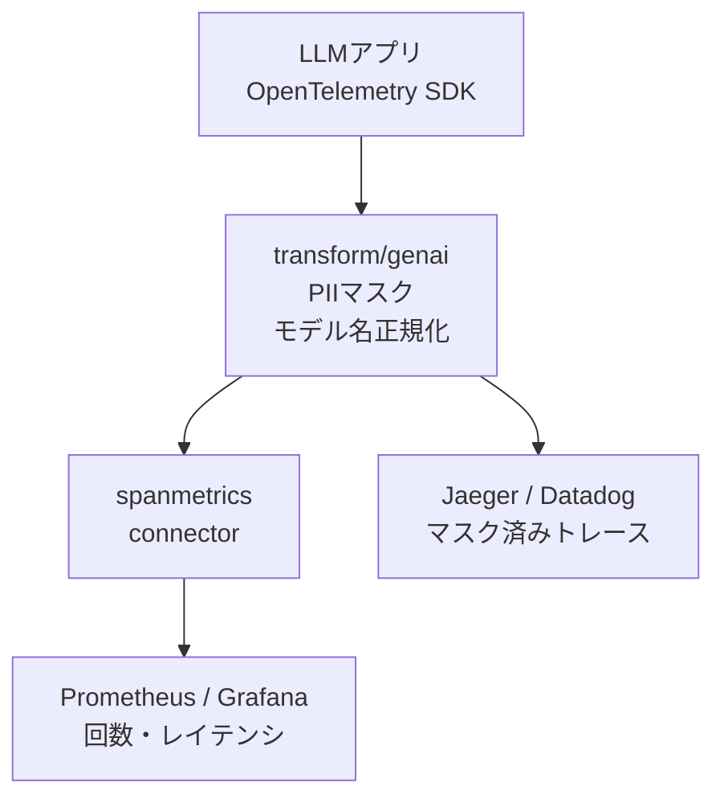
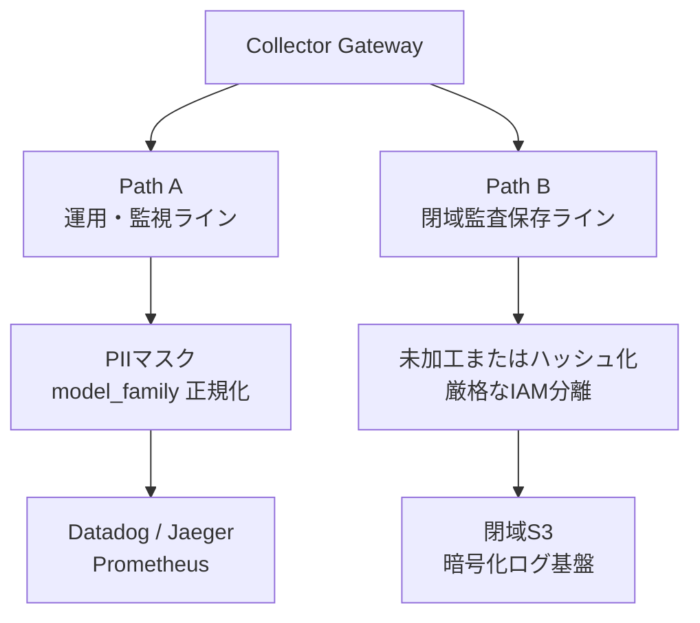

LLM を組み込んだアプリケーションのトレースには、プロンプト本文という「非構造化テキスト」が乗ります。その結果、これまでの APM では起きなかった 2 つの問題が出ます。

1. ユーザーが入力したメールアドレスや社内機密が、監視 SaaS のトレースストレージへそのまま永続化される
2. `gpt-4o-2024-08-06` と `gpt-4o-2024-05-13` が別々の系列として集計され、モデル単位のコストが合算できない

この記事では、この 2 つを**アプリ層ではなく OpenTelemetry Collector（中継層）で一元的に解く**設計を扱います。読み終えると、Collector の `transform` プロセッサと `spanmetrics` コネクタで何をどこまで解決できるか、そしてどこから先は解決できないかを判断できます。

対象読者は、LLM アプリの可観測性を設計する立場の方、およびテレメトリの社内標準を決める立場の方です。


*この記事の全体像。以下、順に解説します。*

## LLM でトレースデータの性質が変わった

まず、なぜ従来どおりのやり方が通用しないのかを整理します。

従来の Web アプリのトレースは、HTTP ルート名・ステータスコード・SQL・処理時間といった構造化メタデータが主体でした。一方 LLM アプリでは、出力品質の検証やプロンプトのデバッグを目的として、`gen_ai.prompt` や `gen_ai.completion` に自然言語テキストを持たせるケースが増えています。

| 比較項目 | 従来の APM トレース | LLM アプリのトレース |
| :--- | :--- | :--- |
| 主情報 | 構造化メタデータ | 構造化メタデータ + 自然言語コンテンツ |
| 主な用途 | 障害原因特定、レイテンシ追跡 | 障害追跡、プロンプト監査、品質評価、コスト追跡 |
| 費用構造 | リソース量依存（間接的） | トークン従量課金（1 Span が直接コストを持つ） |
| 主要リスク | SQL パラメータ漏洩など | プロンプト本文への PII・社内機密の混入 |

性質が変わったポイントは 2 つです。

- **リスクの所在が変わった**。漏洩経路がクエリパラメータからプロンプト本文へ移り、正規表現では捉えにくい自由文が対象になった
- **Span が金額を持つようになった**。トレースは障害調査だけでなく FinOps の一次データになり、集計軸の一貫性が費用可視化の前提条件になった

## なぜアプリ層ではなく Collector で解くのか

対策の置き場所は 2 択です。アプリのコードに書くか、Collector の設定に書くか。

アプリ層に書くと、次の負債が発生します。

- マスキング規則の変更が、全アプリのリリースを伴う
- サービスごとに実装がばらつき、抜け漏れの検知が難しい
- 「どのサービスが何をマスクしているか」の一覧を保証する仕組みがない

Collector に寄せると、アプリ開発者は標準 SDK で素直に計装するだけでよくなり、PII マスキング規則・集計タグの付与・メトリクス抽出は Collector の YAML 一箇所に集約されます。社内から監視バックエンドへの「出口の関所」を 1 つに絞る、という考え方です。



判断基準を 1 つ挙げるなら、**「その処理を変えたいとき、アプリを再デプロイする必要があるか」**です。マスキング規則もモデル名の正規化規則も、運用しながら頻繁に足していく類のものなので、再デプロイを伴わない側に置くべきです。

## Collector で行う 3 つの制御

ここからは具体的な設定です。以下は OpenTelemetry Collector Contrib（`transformprocessor` / `spanmetricsconnector`）の構成例で、チームラボの検証記事で示された組み合わせを土台にしています。

### 1. プロンプト内 PII のマスク

`transformprocessor` の OTTL（OpenTelemetry Transformation Language）で、`gen_ai.prompt` 属性内のメールアドレスパターンを置換します。

```yaml
processors:
  transform/genai:
    error_mode: ignore
    trace_statements:
      - context: span
        statements:
          # メールアドレスのマスキング処理
          - replace_pattern(attributes["gen_ai.prompt"], "(?i)[a-z0-9._%+-]+@[a-z0-9.-]+\\.[a-z]{2,}", "[PII_MASKED_EMAIL]")
```

`error_mode: ignore` は、対象属性が存在しない Span でパイプラインを止めないための指定です。LLM 以外の Span も同じパイプラインを通るため、実運用ではほぼ必須になります。

### 2. コスト集計用のモデルファミリタグ付与

元の `gen_ai.request.model` はデバッグ用にそのまま残し、集計専用の `finops.model_family` を別属性として付与します。元データを壊さずに集計軸だけを増やすのがポイントです。

```yaml
          # モデル表記揺れを集計用モデルファミリタグに統一
          - set(attributes["finops.model_family"], "gpt-4o") where IsMatch(attributes["gen_ai.request.model"], "gpt-4o.*")
          - set(attributes["finops.model_family"], "claude-3-5-sonnet") where IsMatch(attributes["gen_ai.request.model"], "claude-3-5-sonnet.*")
```

### 3. spanmetrics コネクタでのメトリクス派生

加工後の Span からメトリクスを自動派生させ、Prometheus エンドポイントへ出力します。アプリ側にメトリクス計装のコードを足す必要はありません。

```yaml
connectors:
  spanmetrics:
    dimensions:
      - name: gen_ai.system
      - name: finops.model_family
      - name: service.name

service:
  pipelines:
    traces:
      receivers: [otlp]
      processors: [transform/genai]
      exporters: [otlp/jaeger, spanmetrics]
    metrics:
      receivers: [spanmetrics]
      processors: []
      exporters: [prometheus]
```

`traces` パイプラインの `processors` に `transform/genai` を置き、その出口に `spanmetrics` を繋いでいる点が重要です。この順序により、**正規化後の属性がメトリクスの次元として使えます**。出力例は次のとおりです。

```text
traces_span_metrics_calls_total{finops_model_family="gpt-4o",gen_ai_system="openai",service_name="ai-chatbot",span_name="chat.completions"} 2
```

マイナーバージョンの異なる 2 本のリクエストが、`finops_model_family="gpt-4o"` のもとで回数「2」として合算されています。これが、正規化タグを入れる前後で変わる具体的な差分です。

## 生のプロンプトも残したい場合の二層保存

「監査やプロンプト改善のために生の本文を保存したい」と「監視 SaaS へは PII を送りたくない」は両立します。パイプラインを 2 本に分ける構成です。



- **Path A（運用・監視ライン）**: PII をマスクし、正規化属性を添えて日常運用の APM / メトリクス基盤へ送る
- **Path B（閉域監査保存ライン）**: アクセスを極度に限定した監査用ストレージへ、未加工データを隔離保存する

この分割で決めるべきは技術ではなく運用ルールです。具体的には、Path A と Path B それぞれの保存期間（TTL）と、Path B へのアクセス権限をどの職掌に閉じるかを、法務・セキュリティ部門と合意しておく必要があります。ここを決めずに Path B を作ると、「誰も消せない生プロンプトの山」が残ります。

## 適用前に知っておく制約

この設計は万能ではありません。導入判断に効く制約を 4 つ挙げます。

### 正規表現マスキングの限界

`replace_pattern` はメールアドレスのような構造化された PII は捉えますが、自由文中の人名・住所・特定プロジェクトの秘匿表現はパターンマッチから漏れます。

対抗策は、Microsoft Presidio や Guardrail API を呼ぶカスタムプロセッサの併用、あるいは多層防御の設計です。ただし後述のとおり、この結合の成熟度は未確認の領域です。

### 高スループット時の CPU 負荷

長大なプロンプトに対して多数の正規表現置換を実行すると、Collector の CPU 消費が増大します。対抗策は、`tail_sampling` プロセッサの前置と、Collector の水平自動スケール（HPA）配置です。

### Semantic Conventions の仕様変更リスク

`gen_ai.*` の命名規則は 2026 年 8 月時点で Development（Experimental）段階であり、破壊的変更の可能性があります。

ただしこのリスクは、Collector に寄せる設計の**弱点ではなく利点**として現れます。OTTL で旧属性と新属性の二重書き込み（Dual-write）ルールを Collector 側に置けば、仕様変更の影響をアプリコードへ波及させずに吸収できるためです。

### トークン単価計算の限界

Collector 単体では、Prompt Caching 割引や Tiered Pricing のような動的な価格ロジックを適用して金額を算出することは困難です。

現実的な線引きは、**Collector はトークン数（`gen_ai.usage.input_tokens` など）と正規化タグの抽出までに留め、金額計算はバックエンド側（Datadog / Grafana Cloud / 自社 FinOps 基盤）に委ねる**ことです。Collector で金額まで出そうとすると、価格改定のたびに Collector 設定を追いかける運用が生まれます。

## 導入時に決めておくこと

技術設定より先に決めるべき事項を 3 点に絞ります。

1. **アプリ層に加工処理を書かせないと明文化する**。アプリチームは標準 SDK のデフォルト計装に専念し、制御は Collector に集約する。この線引きが曖昧だと、両方に処理が散って結局どちらも信用できなくなる
2. **正規化タグの命名規約を社内標準として制定する**。`finops.model_family` のような集計軸をテレメトリ契約として定義しておけば、マルチプロバイダ環境でもコスト集計の軸が割れない
3. **二層保存のポリシーを先に合意する**。Path A / Path B の TTL とアクセス権限分離を、実装前に法務・セキュリティ部門と決める

## 残る問い

調査時点で確定的な答えが見つからなかった論点を、そのまま記しておきます。

- Presidio 等の外部 PII 認識 ML エンジンと Collector を低レイテンシでインプロセス結合する標準プロセッサの、プロダクション運用における成熟度
- LLM エージェントの多段ループ（ReAct パターン）で、親 Span と子 Span 間のプロンプト累積によるテレメトリ膨張をどこでカットオフするのが最適か

## まとめ

- LLM アプリのトレースは「メタデータ中心」から「非構造化コンテンツを含む」形へ変わり、PII 漏洩と FinOps 集計の 2 つの課題を同時に生んだ
- 対策はアプリ層ではなく OpenTelemetry Collector に集約する。判断基準は「変更のたびにアプリを再デプロイする必要があるか」
- `transformprocessor` の OTTL で PII マスクとモデルファミリ正規化を行い、`spanmetrics` コネクタで正規化後の属性を次元に持つメトリクスを派生させる
- 生の本文が必要なら、監視ラインと閉域監査ラインへパイプラインを分ける二層保存にする。技術より TTL とアクセス権限の合意が先
- 正規表現マスキングの取りこぼし、CPU 負荷、`gen_ai.*` の仕様変更、金額計算の限界は残る。金額計算はバックエンドへ委ねるのが現実解

この記事が少しでも参考になった、あるいは改善点などがあれば、ぜひリアクションやコメント、SNSでのシェアをいただけると励みになります！

## 参考リンク

- [OpenTelemetry Collectorを活用したLLMトレースのパイプライン制御：ガバナンスと集計のための正規化（teamLab, 2026-08-07）](https://zenn.dev/team_lab/articles/9187743a82b75a)
- [OpenTelemetry GenAI Semantic Conventions](https://github.com/open-telemetry/semantic-conventions-genai)
- [OpenTelemetry Collector Contrib - Transform Processor](https://github.com/open-telemetry/opentelemetry-collector-contrib/tree/main/processor/transformprocessor)
- [OpenTelemetry Collector Contrib - Span Metrics Connector](https://github.com/open-telemetry/opentelemetry-collector-contrib/tree/main/connector/spanmetricsconnector)
