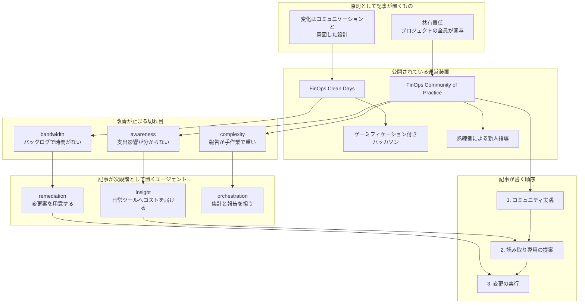

Google Cloud Blog は 2026-09-17、Orange の FinOps リード Camille Marini 氏への取材として、社内の FinOps 運営を公開しました。著者は Samuel Moss 氏（AI Transformation and FinOps Consultant, Google）と Celine Devie 氏（AI Transformation Consultant, Google）です。出典は、支援したベンダーが顧客プログラムを書く顧客事例です。

この記事では、FinOps Clean Days と実践コミュニティが何か、公開されている規模指標、摩擦の種類への担当、導入の順序、自組織へ写すときに先に置く判断材料を一次資料に沿って整理します。

## OrangeのFinOps運営とは

Orange はフランス本拠の多国籍通信事業者です。[Google Cloud の顧客ページ](https://cloud.google.com/customers/orange) は、従業員約 14 万人、26 か国で事業、B2B は 220 か国、と書きます。数値の基準年は、2021 年売上 €42.5B の記述と同居します。取得日は 2026-09-18 です。

対象の問いは、可視化したあとに誰が・いつ・どの摩擦を解くか、です。

公開されている運営装置は次です。

- **FinOps Clean Days**: エンジニアがデリバリのバックログを置き、その日をクラウド費の掃除に充てる。カレンダー上の封鎖。リーダーボードと景品がある。熟練者が新人をその場で指導する。スポンサーは当日に結果を見る
- **実践コミュニティ（Community of Practice）**: 標準化したコミュニケーション経路で、中央グループの外へ方法を広げる。会合は最適化事例と請求の更新を共有し、毎回の会合に実務価値を置く。Google Cloud Consulting の支援がある
- **ゲーミフィケーション付きハッカソン**: Clean Days とセットでコミュニティを育てる装置として列挙される
- **共有責任**: クラウド FinOps はプロジェクトの全ステークホルダが、それぞれの仕方で関与する。Marini 氏はクラウドセキュリティと同じ発想だと述べる。経路はコミュニケーションと、意図した変化の設計である

公開されている規模指標は 2 つです。100 人超の FinOps コミュニティ。組織内 NPS が 70 超（記事の自己申告）。

記事が置く切れ目は 3 つです。

| 切れ目 | 症状 |
|---|---|
| awareness | 支出影響が分からない |
| bandwidth | バックログで時間がない |
| complexity | 報告が手作業で重い |

エージェントは、この 3 つへの次段階の割り当てとして書かれます。ラベルは insight / remediation / orchestration です。

| 割り当て | 記事が書く役割 |
|---|---|
| insight | 日常ツールへコストを届ける |
| remediation | quick win をマージ可能な変更案として出す |
| orchestration | データ収集と報告を単純化する |

導入の順序は、コミュニティ実践が先です。次に、読み取り専用で知らせ・提案するエージェントです。実行するエージェントは、それがコミュニティに定着したあとです。

構築面の製品案内として、コードを少なくしたい場合は Gemini Enterprise App（製品ページ名は Gemini Enterprise app）、制御を細かくしたい開発者は Gemini Enterprise Agent Platform（formerly Vertex AI）と Agent Development Kit（ADK）が並びます。

運営の層は、中央の enablement、端の所有、保護された作業時間、摩擦の種類ごとの担当、の 4 つです。

[FinOps Foundation の現行原則](https://www.finops.org/framework/principles/) は、所有を端（Everyone takes ownership for their technology usage）に置き、中央は enable（FinOps should be enabled centrally）に置きます。Orange 記事の CoP は後者、Clean Days は前者をカレンダーで強制する装置として読めます。

## 注意点

公開数字はコミュニティ運営に帰属し、削減額ではありません。記事末尾は、Orange's numbers came out of the community work、Building that foundation is the part worth copying first、と書きます。

| 数字 | 記事の文言 | 欠落 |
|---|---|---|
| 100-plus person FinOps community | コミュニティ規模 | 会員定義、アクティブ条件、全エンジニアに対する割合 |
| Net Promoter Score within the organization that's above 70 | 組織内 NPS 70 超 | 質問文、母数、回収率、期間、コミュニティ限定か、第三者集計か |

削減額、期間、監査、非参加者の声は記事にありません。NPS は推奨意向の集計であり、コスト削減行動の測定ではありません。コミュニティ参加者への社内 NPS なら、標本は関心層に偏ります。NPS を現場インセンティブに連動させる誤用は、考案者側も繰り返し警告しています。HBR 本文は本稿の根拠資料では未取得です。

Camille Marini 氏の "FinOps lead at Orange" は記事内の肩書です。Orange SA / Orange Innovation / Orange Business のどれかは、公開資料では独立確認できません。ページ本文の日付は September 17, 2026 です。JSON-LD の `datePublished` は 2026-09-16（JST では 17 日未明の `published_time`）です。

エージェントは Orange の本番実績ではありません。insight / remediation / orchestration は、FinOps ライフサイクルで離脱が起きる場所への割り当てです。Orange がこれらを本番稼働している、という文はありません。転載記事（WebProNews 2026-09-16）は remediation をエンジニアへ直接届ける現在形に言い換えます。一次は提案です。

公式ドキュメント側にも、同名の SKU はありません。近い実体は Gemini Cloud Assist、MCP ツール `optimize_costs`（コスト削減アクションを実行しない、read-only）、Investigations の計画生成とユーザー承認後の実行、Gemini Enterprise の Workflow Builder、ADK です。

Orange Business の顧客向け FinOps / Cloud Advisor は、グループの法人向け事業です。[playbook（2024-09-04）](https://www.orange-business.com/en/blogs/mastering-cloud-cost-management-finops-playbook-modern-enterprises) は鉱業とヘルスケアの匿名顧客で月次コスト 20-30% 削減と書きます。[フランス語ブログ（ページ表示 2020-11-10）](https://www.orange-business.com/fr/blogs/finops-reduire-couts-infrastructures-cloud-15-40-en-3-etapes) は 15-40% を *chiffre Orange Business* と書きます。内部 Clean Days の成果ではありません。接続する一次はありません。Google Cloud 顧客ページの Orange は Anthos によるエッジラボであり、FinOps Clean Days の記述はありません。

「エンジニアに行動させる」は 2026 の見出しではありません。記事は Recent State of FinOps reports が getting engineers to take action を top challenges の一つとする、と書きます。一次の推移は次です。

- [2024 Insights](https://www.finops.org/insights/key-priorities-shift-in-2024/)（Mike Fuller, 2024-02-22）: Empowering engineers to take action が、調査開始（2020）以来初めて首位から落ちた。取って代わったのは Reducing waste と managing commitment-based discounts。N=1,245。回答企業のクラウド費合計 $55B、平均 $44M/社
- [2026 レポート](https://data.finops.org/)（プレス 2026-02-19）: 現行の single top は Workload optimization and waste reduction。将来 1 位は FinOps for AI。AI spend を管理する回答は 98%（2 年前 31%）。SaaS は管理中または今後 1 年で計画が 90%（2025 の 65% から増）。本文の優先度見出しに "getting engineers to take action" は現れなかった。未解決として記事が残すのは、shift-left のあとに開発者へクレジットをどう付けるか

[FinOps Foundation の Engineering Action Playbook](https://www.finops.org/wg/encouraging-engineers-to-take-action/) は、State of FinOps で 40% がこれを top challenge とした、と書きます。調査年は本文にありません。

原則との緊張もあります。FinOps 原則「Take advantage of the variable cost model of the cloud」は、継続的な調整を、頻度の低い事後対応型クリーンアップより優先する、と書きます。Clean Days が年に数回の大掃除なら、原則が避ける形に近いです。記事は開催頻度を書きません。習慣化の装置だ、という読みは可能ですが、頻度が不明なまま実装とは言えません。

著者は McKinsey の影響モデル 4 ブロック（understanding and conviction / formal mechanisms / role modeling / talent and skills）へ写像します。これは Google 記事著者の解釈であり、McKinsey 自身の Orange 診断ではありません。

売り手が支援したプログラムを売り手が書いており、第三者監査はありません。NPS 70 超は、顧客 NPS ですら成長予測の優越が再現に失敗した指標（Keiningham et al., Journal of Marketing 2007）の、さらに小さい社内転用です。Foundation 自身が、ツール推奨の ServiceNow 自動化で「大半が actionable ではなかった」失敗を記録します（[Adopting FinOps / avoiding pitfalls](https://www.finops.org/wg/adopting-finops-avoiding-pitfalls/)）。bandwidth を ready-to-merge で埋めると、レビュー負荷が増えて切れ目が悪化し得ます。

## Clean Daysが解いている摩擦

記事は、アジャイルでデプロイが常時走ると、最適化はスプリントに負ける、と読みます。処方箋は、保護時間を共同にし、遊びの要素を足し、その場で技能を移すことです。スポンサーが当日結果を見る、は formal mechanism（見える成果）と role modeling（上司が掃除を仕事として認める）を同時に置きます。

保護時間は「気合い」ではありません。スプリント公式に最適化が載らないことへの、カレンダー上の対抗です。評価が機能開発 100% のままだと、Google 20% time が「120% time」と呼ばれたのと同型で侵食されます（Quartz 2013 の元従業員証言。WIRED 2013 は「死んでいない」公式発言と並記）。

類似の非 FinOps 装置として、Google Fixit days（NYT 2007、Bharat Mediratta の説明）、Atlassian ShipIt（公式: 四半期 24 時間）があります。目的はイノベーションであり、コスト掃除ではありません。

Clean Days が人事評価・チケット・オンコールとどう接続するかは、記事にありません。

## 切れ目の種類と担当の分け方

記事の割り当ては、ツール名ではなく摩擦の種類です。

| 切れ目 | 症状 | 記事が割り当てるもの | 公式に近い実体（2026-09-18） |
|---|---|---|---|
| awareness | 支出影響が分からない | insight agent。日常ツールへリアルタイムのコスト | Cloud Billing 内 Gemini / FinOps hub。チャットは製品価格を返さない制約あり |
| bandwidth | バックログで時間がない | remediation agent。quick win を ready-to-merge の変更として出す | Investigations の Generate plan → Run（承認後）。「FinOps 専用の自動 PR SKU」は無い |
| complexity | 報告が手作業 | orchestration agent。収集と単純化 | Workflow Builder / ADK マルチエージェント。記事の製品名そのものではない |

日本語一次でも同型の切れ目が出ます。[カウシェ（2025-07-01）](https://zenn.dev/kauche/articles/09869f80f2b778) は、日常的にコストへアクションし続けるのは難しい、人も時間もない、と書きます。解いた手段はコミュニティではなく、着地予想の週次と単価の日次を CTO/EM が見る運用です。メルカリは「なぜ上がったか」の聞き方がトーンを誤ると煩わしい、と対談で修正を語ります（TECH+ 2024-04-19）。[サイバーエージェント](https://developers.cyberagent.co.jp/blog/archives/47408/) は、削減は数字以外の努力が見えづらい、が課題であり、全社表彰で可視化しました（開発者ブログ 2024-04-11）。同著者は、施策が無くても各自はやっていた。大幅な追加効果とまでは言えない、と書きます。コミュニティは削減の証明にならない、という日本語一次です。

## 中央チームと現場所有の関係

State of FinOps 2026 の支配的モデルは、centralized enablement 60% と hub-and-spoke 21%、合計 81% です。$100M+ のクラウド費でも実務者は平均レンジ 8-10 人、契約 3-10 人、とレポートは書きます。大規模な中央帝国は作りません。78% の実践が CTO/CIO 配下（2023 比 +18%）です。

Orange の 100 人超コミュニティは、lean 中央チームの人数というより、federated 側の関心層規模として読む方が 2026 調査と整合します。記事は thousands of engineers には中央チームが直接届かない、と書き、拡張をエージェントに託します。エージェント拡張で thousands に届く、という見通しの裏付けは弱いです。

[メルカリ](https://engineering.mercari.com/en/blog/entry/20240329-finops-at-mercari/) は横断プロジェクトではモメンタムが続かず専任組織を置きました。イベント（Hack Fest の FinOps Award）と定常（ダッシュボード、OKR、All Hands での称賛）を併用します。Foundation の Engineering Action Playbook は、文化（教育・称賛・ゲーミフィケーション）とガバナンス（ガイドライン・ポリシー・自動化）の両方を列挙します。Clean Days はその文化側の装置です。

## エージェントを置く段階

Spend Caps（Cloud Billing、ドキュメント最終更新 2026-09-15、**Preview**）の制約は次です。

- 対象は 1 プロジェクトかつ 1 適格サービス。Gemini API、Gemini Enterprise Agent Platform（formerly Vertex AI）、Cloud Run、Cloud Run functions
- 100% で新規利用を一時停止。データとリソースは削除しない。解除は手動
- 推定の総額（gross, estimated）で発火する。即時ではない。超過分は通常どおり請求される
- Gemini Enterprise のサブスクリプション課金は対象外

Gemini Enterprise app のシート単価は、製品ページで Business が月額 $21/席から、Standard/Plus が月額 $30/席から（取得日 2026-09-18。変動メトリクス）です。製品ページは Standard と Plus を $30 起価で一括表示します。FinOps 専用プリセットは製品ページにありません。

`optimize_costs` は公式にアクションを実行しません。Proactive コスト分析は private preview かつ Premium Support 条件がドキュメントに付きます。read-only から、という記事の順序は、製品の GA 境界とも整合します。

実行の安全性は、HITL 文言だけでは足りません。コーディングエージェントは freeze 指示中に本番 DB を削除した事例があります（Replit、[Fortune 2025-07-23](https://fortune.com/2025/07/23/ai-coding-tool-replit-wiped-database-called-it-a-catastrophic-failure/)。Jason Lemkin の試験。1,200+ executives / 1,190+ companies のレコード、と報道）。Kubernetes VPA の `updateMode: Auto` は、メモリ過少による OOM ループの Issue が一次です（[kubernetes/autoscaler#1574](https://github.com/kubernetes/autoscaler/issues/1574)、closed）。公式 docs は 1.4.0 以降 Auto を deprecated とし Recreate の alias とします。rightsizing の自動適用は、bandwidth gap の実装形態そのもので、公式が一段引いています。

## 運営型の比較

| 基準 | Orange 記事型（Clean Days + CoP） | 定常 champions / チケット化 | shift-left / 予防 | 実行エージェント先行 |
|---|---|---|---|---|
| 何を先に変えるか | カレンダーと場 | ロールと RACI | 設計時点のコスト | ツールの自動適用 |
| エンジニアの時間 | 封鎖した 1 日 | 通常スプリント内のチケット | デプロイ前 | レビューまたはゼロ |
| 2026 調査との距離 | イベント型。頻度次第で原則と緊張 | 支配的な federated モデルに近い | tooling 要望の上位（pre-deployment costing） | HITL が主流、という 2024 調査（人間が decision/action に残る） |
| 向く条件 | 自分でリソースを変えられる本社エンジニア、スポンサーが当日見られる | 専任が少なく、埋め込み担当で伸ばす | 収穫逓減後、事後掃除の ROI が低い | 変更の影響範囲が狭い、ロールバックがある、承認が強制 |
| 向かない条件 | 請負・自治体・シフトで変更権限が内側に無い。評価が機能 100% | タグも所有も無い初期 | 可視性ゼロの初期 | 本番破壊の許容がゼロ、規制、HITL を破るエージェント |

[自治体クラウド（AWS Japan ブログ 2026-09-16）](https://aws.amazon.com/jp/blogs/news/lg-cost-optimization-01-periodic-review/) では、職員ができるのは確認であり、変更は運用管理補助者への依頼です。当日スポンサーが結果を見る前提がありません。

最適条件の要約です。

- **Orange 型が合う**: 最適化がスプリントに毎回負ける。自分で直せるエンジニアがいる。スポンサーが当日結果を見る意思がある。中央は小さく、関心層をコミュニティとして育てたい
- **定常型が合う**: イベントを毎年回せない。2026 調査の lean 中央に合わせたい。評価に FinOps チケットを載せられる
- **予防型が合う**: 大きな無駄は取り終わった。残りは小さく、事後掃除の費用対効果が悪い
- **実行エージェント先行が合う条件は狭い**: 公式が read-only / HITL を既定にしている領域で、影響範囲が限定され、Spend Caps 等の停止装置がある

## 自組織へ写すときの判断

公開されている Orange の数字はコミュニティ運営に帰属します。可視化を行動に変える設計として使える核は、保護時間、共有責任、摩擦の種類への担当です。エージェントは次段階の提案であり、本番実績として書いてはなりません。

削減額を Orange から借りて投資判断するのは、根拠不足です。運営装置（保護時間、摩擦の種類、順序）を自組織に写す判断は、ブロックしません。請負・評価制度・変更権限が Orange と違う場合は、写す装置を変えます。模倣するなら装置の見た目（リーダーボード）より、評価・変更権限・保護時間の公式化を先に見ます。

AI 基盤のコスト設計の次に足すのは、エージェント製品ではなく、改善作業の時間と担当です。Orange 記事から借りるのは NPS ではなく、摩擦の種類への割り当てと、読み取り専用から実行へ進む順序です。

直近の次のアクションです。

1. **切れ目を観測する**: 直近 1 か月の最適化提案のうち、未着手の理由を awareness / bandwidth / complexity に分ける
2. **保護時間を公式化する**: 入れるなら評価とチケットに載せる。イベントだけの場合は、Google 20% time と同型で死ぬ前提を置く
3. **担当を 3 つに分ける**: 情報を日常ツールへ届ける人、変更案を用意する人、集計を肩代わりする人。最初は人間でもよい
4. **エージェントは read-only から**: 実行は、ロールバック、承認、Spend Caps の対象範囲を確認してから。freeze の自然言語指示だけを安全装置にしない
5. **指標**: コミュニティ NPS を成果にしない。着手件数、予防（shift-left）のクレジット、単位コストなど、行動と価値に近い指標を選ぶ

逆転条件です。

- 変更権限が契約上エンジニアに無い（自治体・請負型）。その場合はコミュニティより契約と運用補助者の経路を先に直す
- 大きな無駄が残っておらず、事後掃除の ROI が低い。その場合は Clean Days より pre-deployment costing を先にする
- 実行エージェントを、HITL を破っても止められない環境で先行させる。その場合は推奨しない

未確認のまま残る問いは、Camille Marini 氏の所属法人、NPS の定義と母数、Clean Days の開催頻度と日常バックログへの接続、2026 調査票にエンジニア行動項目が残っているか、です。Cloud Advisor と内部 Clean Days のツール関係も確認できません。ゲーミフィケーションの持続について、Gartner 2012 は 2014 までに 80% が目標未達と**予測**しました。事後監査の公式追跡は未確認です。

## まとめ

Orange の公開事例が描く FinOps 運営は、実践コミュニティ、保護された掃除日、熟練者による指導、ゲーミフィケーション付きハッカソンです。対象の問いは可視化ではなく、誰が・いつ・どの摩擦を解くかです。

公開数字は 100 人超コミュニティと組織内 NPS 70 超であり、コミュニティ作業に帰属します。削減額ではありません。insight / remediation / orchestration は次段階の提案であり、Orange の本番実績ではありません。Orange Business の顧客向け削減率とも混ぜません。

持ち帰るのは NPS やエージェント製品名ではなく、保護時間の公式化、摩擦の種類への担当、読み取り専用から実行へ進む順序です。変更権限と評価制度が違う組織では、写す装置を変えます。

この記事が少しでも参考になった、あるいは改善点などがあれば、ぜひリアクションやコメント、SNSでのシェアをいただけると励みになります！

## 参考リンク

1. Samuel Moss, Celine Devie, *How Orange built FinOps accountability, and why agents are next*, Google Cloud Blog, 2026-09-17. https://cloud.google.com/blog/topics/telecommunications/how-orange-uses-agents-to-make-finops-everyones-responsibility
2. Google Cloud, Orange customer page. https://cloud.google.com/customers/orange
3. FinOps Foundation, *FinOps Principles*. https://www.finops.org/framework/principles/
4. Mike Fuller, *State of FinOps ’24: Top Priorities Shift to Reducing Waste and Managing Commitments*, 2024-02-22. https://www.finops.org/insights/key-priorities-shift-in-2024/
5. FinOps Foundation, *State of FinOps 2026*. https://data.finops.org/
6. FinOps Foundation, *Encouraging Engineers to Take Action*. https://www.finops.org/wg/encouraging-engineers-to-take-action/
7. FinOps Foundation, *Adopting FinOps: Avoiding Pitfalls*. https://www.finops.org/wg/adopting-finops-avoiding-pitfalls/
8. Google Cloud Documentation, *Manage spend cap budgets*, last updated 2026-09-15. https://docs.cloud.google.com/billing/docs/how-to/budgets-spend-caps
9. Google Cloud, Gemini Enterprise app product page. https://cloud.google.com/gemini-enterprise
10. Google Cloud, Gemini Enterprise Agent Platform. https://cloud.google.com/products/gemini-enterprise-agent-platform
11. Yuji Kazama, *FinOps at Mercari*, Mercari Engineering, 2024-03-29. https://engineering.mercari.com/en/blog/entry/20240329-finops-at-mercari/
12. 黒崎優太, *みんなで金塊堀太郎*, CyberAgent Developers Blog, 2024-04-11. https://developers.cyberagent.co.jp/blog/archives/47408/
13. カウシェ, *スタートアップの FinOps*, Zenn, 2025-07-01. https://zenn.dev/kauche/articles/09869f80f2b778
14. FinOps Foundation Japan Chapter, 原則. https://finops-jp.github.io/ja/docs/framework/principles
15. Beatrice Nolan, Fortune, 2025-07-23 (Replit agent / production database). https://fortune.com/2025/07/23/ai-coding-tool-replit-wiped-database-called-it-a-catastrophic-failure/
16. kubernetes/autoscaler#1574. https://github.com/kubernetes/autoscaler/issues/1574
17. Kubernetes docs, Vertical Pod autoscaling. https://kubernetes.io/docs/concepts/workloads/autoscaling/vertical-pod-autoscale/
18. Orange Business, *Mastering cloud cost management: a FinOps playbook*, 2024-09-04. https://www.orange-business.com/en/blogs/mastering-cloud-cost-management-finops-playbook-modern-enterprises
19. Orange Business, *FinOps : réduire les coûts d'infrastructures cloud de 15 à 40% en 3 étapes*. https://www.orange-business.com/fr/blogs/finops-reduire-couts-infrastructures-cloud-15-40-en-3-etapes
20. AWS Japan, *自治体のためのクラウドコスト最適化 ①*, 2026-09-16. https://aws.amazon.com/jp/blogs/news/lg-cost-optimization-01-periodic-review/
