Orcaは、Claude CodeやCodexなどのCLI型コーディングエージェントを、タスクごとの`git worktree`で並列実行するADE（Agent Development Environment）です。モデルや推論APIを提供する製品ではなく、既存のCLI、認証、サブスクリプションを束ねる制御面として設計されています。

この記事では、Orcaの位置づけ、Electronを中心とした内部構造、永続データ、導入手順、CLIによる操作、リモート運用、障害時の切り分けまでを一続きに整理します。記載した仕様とコマンドは2026年8月29日時点の公式ドキュメント、公開リポジトリ、リリースに基づきます。更新が速いプロジェクトなので、導入時には必ず最新リリースとCLIヘルプも確認してください。


*この記事の全体像。以下、順に解説します。*

## 概要

Orcaの中心にある考え方は単純です。1つのタスクに1つの実`git worktree`、1つのエージェント端末、1つのブラウザを割り当てます。複数のエージェントを同じチェックアウトで競合させず、それぞれの差分を人間が比較して、採用する成果だけをマージできます。

Orca自身はMITライセンスで配布され、推論はBYO（Bring Your Own）です。Claude Code、Codex、OpenCodeなどの既存CLIを、そのCLIが持つ認証や課金契約のまま起動します。Orcaが担当するのは、次の制御です。

- worktreeの作成、一覧、休止、削除
- エージェント端末の起動、分割、状態監視
- worktreeごとのChromiumとDesign Mode
- Git差分のレビュー、注釈、PR連携
- SSHターゲット、Remote Orca Server、Cloud VMへの配置
- Webクライアントやモバイルからの監視と追加入力
- CLIによるブラウザ操作、端末操作、オーケストレーション

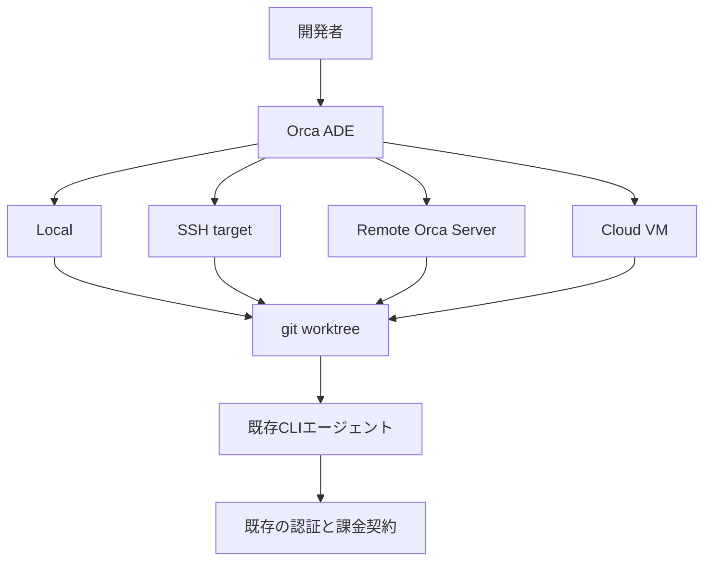

4つの実行モードは、ファイルとエージェントプロセスを誰が所有するかで区別できます。

| モード | ファイルとエージェントの所在 | ランタイムの所有者 | 向いている用途 |
|---|---|---|---|
| Local | 手元のPC | 手元のデスクトップOrca | 短い開発、最初の導入 |
| SSH target | SSH先のworktreeとPTY | 手元のOrcaがリモートrelayを駆動 | 高性能マシン、社内サーバ、GPU |
| Remote Orca Server | 常時起動サーバ | サーバ上のOrca | 複数クライアント、モバイル、常時稼働 |
| Cloud VM | worktree単位の使い捨て環境 | recipeが返す接続方式による | 強い隔離、オンデマンド計算資源 |

`orcad`、`orca serve`、SSH worktreeは同じものではありません。`orcad`はElectronを持たないNodeランタイム、`orca serve`はElectronアプリをウィンドウなしで起動するRemote Orca Server、SSH worktreeは手元のOrcaがリモートrelayを操作する方式です。この違いは、切断や障害時に「どこでプロセスが生きているか」を判断するうえで重要です。

## 関連技術との比較

比較するときは、UIの見た目よりも「エージェントの所有者」と「隔離単位」を見ると整理しやすくなります。

| 製品 | 主な実行方式 | 主な隔離単位 | 既存CLIの扱い | 特徴 |
|---|---|---|---|---|
| Orca | Electron ADE、CLI、Remote Server | タスクごとの実`git worktree` | 主役。任意CLIを起動 | クロスプラットフォーム、SSH、モバイル、BYO推論 |
| Emdash | Electron ADE、Local/SSH | タスクごとのworktree | 主役 | Apache-2.0、クロスプラットフォーム |
| Conductor | macOSネイティブ、Cloud | workspaceとしてのworktree | 複数ハーネスを起動 | macOS中心、導入が簡潔 |
| Superset | Desktop、CLI、SDK、MCP | タスクごとのworktree | 任意CLI | AutomationsとSDKが強い、ELv2 |
| Claude Squad | tmux上のTUI | tmuxセッションとworktree | 複数CLI | 軽量、端末中心、AGPL-3.0 |
| cmux | Ghostty系macOS端末 | workspaceとpane | 端末で動くCLI全般 | ネイティブ描画、worktreeは利用者が構成 |
| Cursor | IDEと自社Agent | IDE、worktree、クラウドVM | 自社Agentが中心 | 手書き編集とIDE統合が中心 |
| Warp | ADEと自社Agent、クラウド | ローカル/クラウド、worktree併用 | 自社Agentが中心 | ターミナルからADEへ拡張 |

Orcaが特に合うのは、すでに複数のCLIエージェントを使っていて、同じタスクを複数案に分け、差分を比較して選びたいケースです。OSをまたいだデスクトップ対応、SSHとRemote Server、モバイル監視を同じ製品で揃えたい場合にも有力です。

一方で、単一のIDE内で手書き編集を中心にしたいならCursor、macOSでネイティブ端末を置き換えたいならcmux、tmuxだけで最小構成を作りたいならClaude Squadのほうが自然です。Orcaは「最高の単体エージェント」を提供する製品ではなく、複数の既存エージェントを安全に並べるオーケストレータだと捉えると判断しやすくなります。

## 特徴


Orcaの特徴は、worktree、端末、ブラウザ、レビュー、リモート実行を一つの作業カードに集約する点です。

- **並列worktree**: 同じ起点から複数のworktreeを作り、Claude Code、Codex、Cursor CLIなどへ同一課題を渡せます。
- **任意のCLIエージェント**: 公式READMEは多数のCLIを列挙し、最終的には端末で動く任意エージェントを対象にしています。
- **既存サブスクリプションの利用**: モデルAPIを仲介せず、各CLIのログインやAPIキーを使います。
- **差分中心のレビュー**: AIが作った差分へMarkdownコメントを付け、まとめてエージェントへ返せます。
- **worktree単位のブラウザ**: Chromium、スナップショット、クリック、フォーム入力、Design Modeを提供します。
- **SSHとRemote Server**: 計算場所を変えても、worktree、端末、ブラウザ、状態監視を同じ操作面で扱えます。
- **モバイルコンパニオン**: 稼働状況、端末スクロールバック、短い返信、通知、ソース管理を外出先から扱えます。
- **Orca CLI**: 人間だけでなく、エージェント自身がOrcaのworktree、端末、ブラウザ、run/task/workerを操作できます。


権限管理には注意が必要です。Orcaはworktreeを使い捨ての隔離境界とみなし、多くのCLIにpermission bypassの起動引数を用意します。たとえばClaude Codeは`--dangerously-skip-permissions`、Codexは`--dangerously-bypass-approvals-and-sandbox`です。便利ですが、worktreeの外、ホームディレクトリ、クラウド認証情報、共有サーバまで自動的に隔離されるわけではありません。Yoloモードは、OS権限と実行アカウントを狭くしたうえで使う必要があります。


## 構造

Orcaは単一リポジトリから複数の実行単位を構成するデスクトップ中心のシステムです。Electronのmain/preload/renderer、`orca` CLI、端末デーモン、SSH/WSL relay、Node専用ランタイム`orcad`、モバイルコンパニオン、native computer-useに分かれます。

### システムコンテキスト図

開発者から見たOrcaは、CLIエージェント、Gitホスト、課題トラッカー、クラウドVM、更新、テレメトリ、モバイル中継を束ねる境界です。推論は外部のCLI側に残り、Orcaは実行環境と操作経路を管理します。

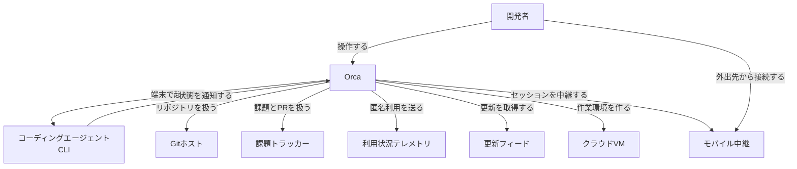

モバイル中継はランタイムそのものではありません。セッションの正本はペアリング先のデスクトップまたはRemote Orca Serverです。デスクトップが停止すれば、デスクトップ所有のセッションも利用できなくなります。

### コンテナ図

デスクトップアプリ内では、rendererがUIを描画し、preloadが型付きの`window.api`を公開し、main processがファイル、Git、PTY、SSH、更新、テレメトリを扱います。rendererからOS資源へ直接触れない境界が重要です。

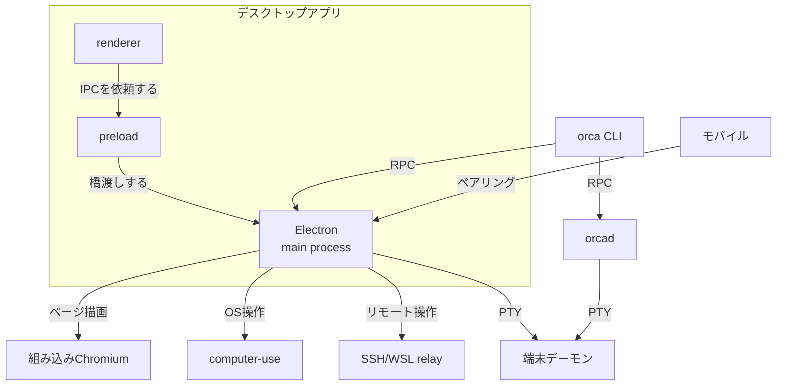

端末描画はxterm.jsとWebGL addon、ファイル編集はMonacoです。「Ghostty級ターミナル」は製品上の表現ですが、実装がlibghosttyという意味ではありません。`orca serve`はElectron mainをヘッドレス起動し、`orcad`はElectronを持たずに同じランタイムサービスをNodeホストから提供します。

### コンポーネント図

main processの中核は`OrcaRuntimeService`です。IPC、CLI、モバイル、Webクライアントからの操作を集約し、生きているworktree、PTY、UIレイアウト、オーケストレーションを管理します。

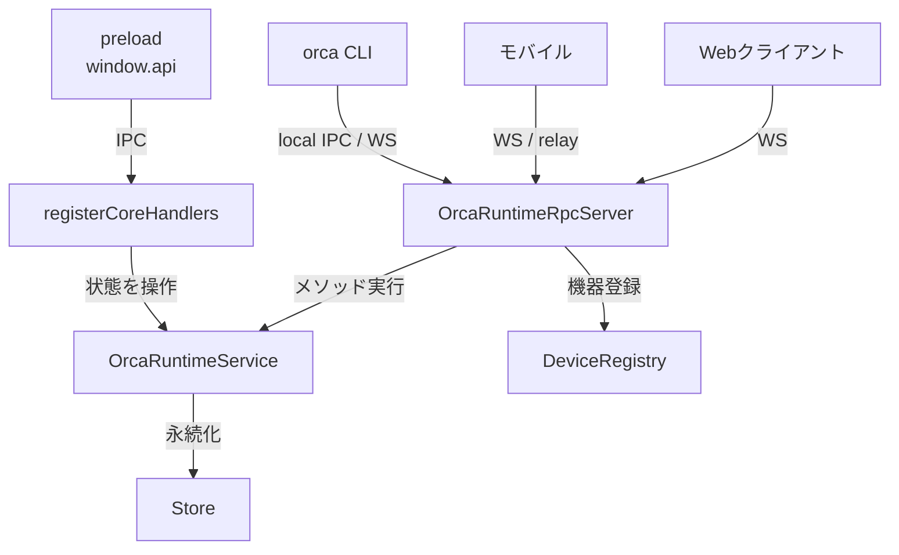

PTYは差し替え可能なproviderとして扱われます。ローカル`node-pty`、端末デーモン、SSH relayが同じ契約に接続されるため、UIから見ると実行場所の差を吸収できます。

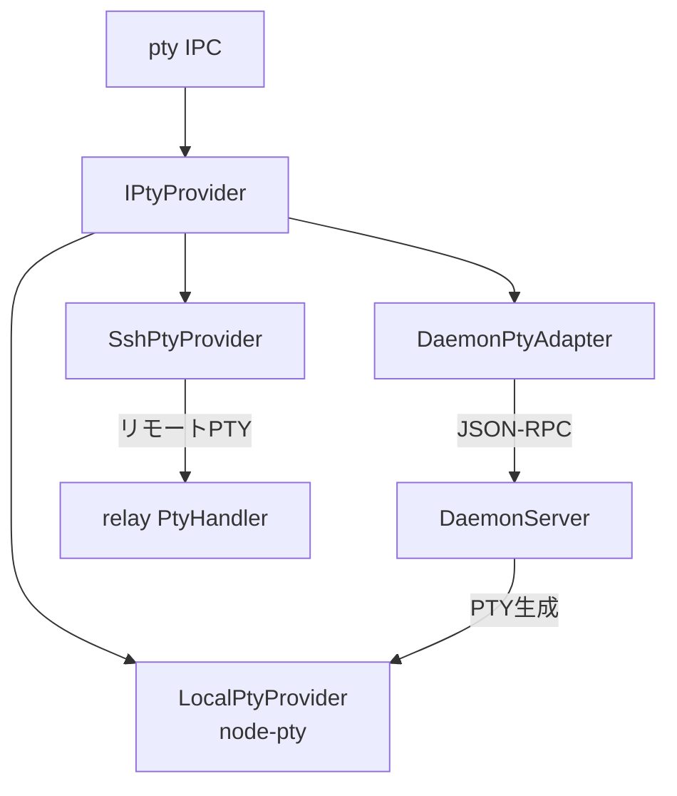

SSH worktreeでは、手元のmain processが接続とrelayの寿命を管理し、リモート側のhandlerがGit、ファイル、PTY、エージェントフックを実行します。切断後もリモート上のPTYを残し、再接続時に同じrelayへ戻れる構成です。

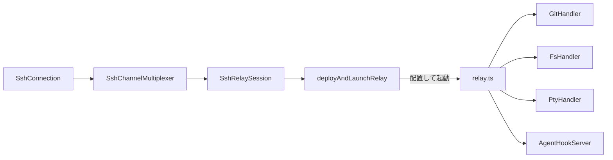

ブラウザ自動化、エージェント状態フック、native computer-useは別経路です。ブラウザはChromiumとCDP、Design Mode用スクリプトで構成され、ネイティブアプリ操作はOSごとのサイドカーに委譲されます。

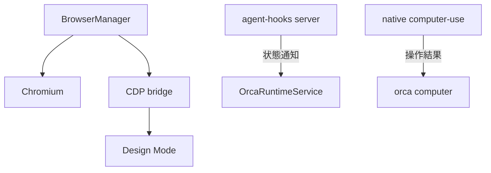

更新、匿名テレメトリ、モバイル向けクラウドrelayもmain processから管理されます。SSH relayとモバイルrelayは目的も実装も別です。

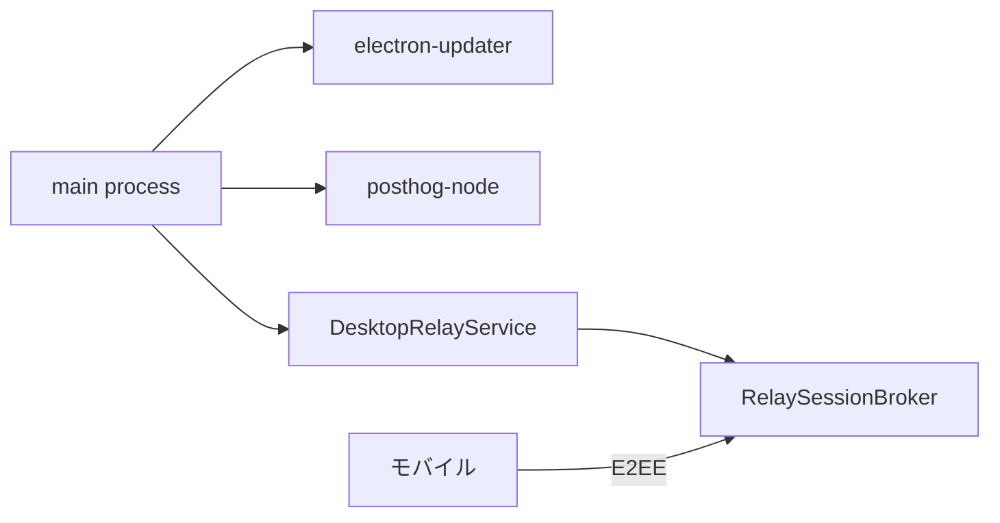

### ネットワーク構成図

ローカルCLIはローカルIPC（Unix socket、Windowsではnamed pipe）、ペア済みクライアントはWebSocket、SSH worktreeはssh2上の多重化経路を使います。既定ポートは6768ですが、`--pairing-address`は接続先として広告するアドレスであり、listenerのbind先を変更するフラグではありません。

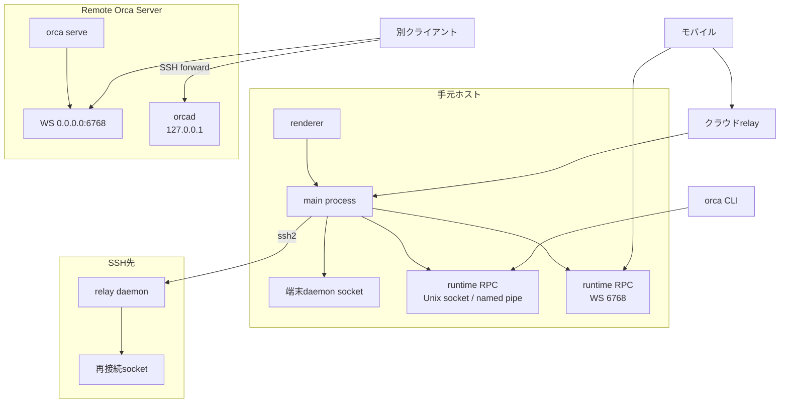

Remote Orca Serverはサーバ側がworktreeとエージェントを所有します。SSH targetは手元のOrcaが所有し、リモートは計算とファイルの置き場所です。ネットワーク障害を調べるときは、この所有関係を最初に確定してください。

## データ

Orcaの永続データは、ProjectとRepo、タスク単位のWorktree、ホスト別WorkspaceSession、エージェントセッション、オーケストレーションRunの層に分けて考えると理解しやすくなります。公式UIのworkspaceカードは、実装上の`Worktree`へコメント、状態、リンク課題などを付加したものです。

### 概念モデル

Projectは複数のRepoとホスト別checkoutを束ね、Repoは複数のWorktreeを所有します。WorktreeはExecutionHost上に存在し、WorkspaceSessionのタブやPTY、AgentSession、オーケストレーションのdispatchと結び付きます。

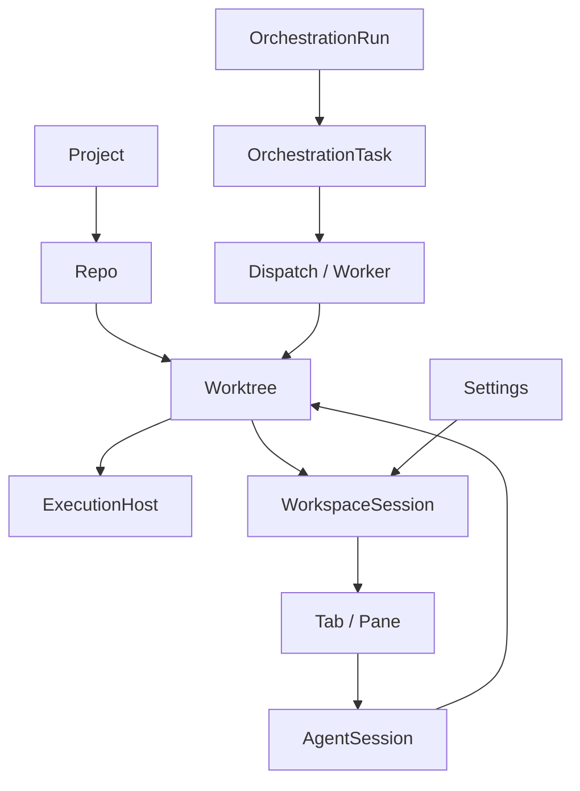

コメントは独立したテーブルではなくWorktreeの属性です。タブとAgentSessionも同一ではありません。タブを閉じても耐久レコードやPTYが残る経路があるため、障害対応ではUI上の表示と実行中プロセスを分けて確認します。

### 情報モデル

主要エンティティと識別関係を簡略化すると次のようになります。実装ではさらにホストID、account home、lease、lineage、ブラウザ履歴、terminal scrollback参照などを持ちます。

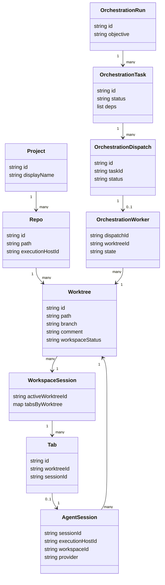

永続化先はデスクトップと`orcad`で異なります。

| データ | 主な保存先 | 注意点 |
|---|---|---|
| active profile | Electron `userData/orca-profile-index.json` | 既定profileは`local-default` |
| Project、Repo、Worktree、Settings、Session | `userData/profiles/<profileId>/orca-data.json` | 現行の主ストア。ルート直下の`orca-data.json`は移行元 |
| GitHubキャッシュ | profile配下の`orca-github-cache.json` | 主ストアと同じprofileディレクトリ |
| terminal scrollback | `userData/terminal-history` | WSLは別ディレクトリ |
| orchestration | `userData/orchestration.db` | Run、Task、Dispatch、WorkerのSQLite |
| agent session | `userData/agent-sessions/agent-sessions.json` | leaseとバックアップを持つ |
| keybindings | `~/.orca/keybindings.json` | Electron profile外の上書き |

ElectronデスクトップはOS標準の`userData`を使います。macOSは通常`~/Library/Application Support/Orca`、Windowsは`%APPDATA%\Orca`、Linuxは`$XDG_CONFIG_HOME/Orca`または`~/.config/Orca`です。`orcad`は`$ORCA_USER_DATA`、`$XDG_DATA_HOME/Orca`、`~/.orca`の順で解決します。LinuxではElectronの`XDG_CONFIG_HOME`と`orcad`の`XDG_DATA_HOME`を混同しないでください。

## 構築方法

デスクトップ利用だけならNode.jsは不要です。ソースからビルドする場合はNode 24とpnpm 10系が必要です。LinuxのAppImageはglibc 2.31以上が前提です。

### デスクトップ版を導入する

公式ダウンロードページまたはGitHub Releasesを利用できます。macOSではHomebrew caskも提供されています。

```bash
# macOS
brew install --cask stablyai/orca/orca

# Linux x64 AppImage
curl -LO https://github.com/stablyai/orca/releases/latest/download/orca-linux.AppImage
chmod +x orca-linux.AppImage
./orca-linux.AppImage
```

macOS、Windows、Linux向けの固定名アセットは公式READMEとReleasesで確認できます。`.deb`や`.rpm`はバージョン入りのファイル名になるため、自動化ではtagとファイル名を同時に固定してください。`latest/download`へバージョン入りファイル名を組み合わせると、次のリリースで404になる可能性があります。

### 初回起動とCLI登録

初回起動ではホームディレクトリへのアクセスを許可し、必要に応じて`~/.claude`、`~/.codex`、端末設定をimportします。その後、最初のリポジトリを追加します。

デスクトップ版ではSettingsのGeneralからOrca CLIを登録します。Homebrew caskはバンドルCLIへのshimを配置します。

```bash
command -v orca
orca open --json
orca status --json
```

`command -v orca`はCLI登録、`orca status --json`はランタイム到達を確認します。この2つは別の検査です。LinuxではGNOMEスクリーンリーダーの`/usr/bin/orca`と名前が衝突する場合があるため、実体のパスも確認してください。

### 公式skillsを導入する

```bash
npx skills add https://github.com/stablyai/orca --skill orca-cli --global

# Settings UIのないホスト
orca skills install --skill orca-cli --skill orchestration
orca skills install --all --dry-run
```

検出できるエージェントがないヘッドレスホストでは、`--agent claude-code,codex`または`--agent universal`を明示します。SSH workspaceやWSL bridge内のshimはホスト側へ転送されるため、skillsは実際にランタイムを所有するマシンへインストールします。

### ソースからビルドする

```bash
git clone https://github.com/stablyai/orca
cd orca
corepack enable
pnpm install
pnpm build
```

公開リポジトリの`package.json`はNode 24とpnpm 10系を指定しています。mainブランチのpackage versionと最新の安定release tagが一致しない場合があるため、再現可能な検証ではtagをcheckoutしてください。

### Remote Orca Serverを構築する

`orca serve`はRemote Orca Serverをフォアグラウンドで起動します。`--pairing-address`には、別クライアントから到達できるTailscaleやLANのアドレスを指定します。

```bash
orca serve \
  --port 6768 \
  --pairing-address 100.64.1.20 \
  --json
```

`--json`の準備完了契約は`type: orca_server_ready`と`schemaVersion: 1`です。実際のlisten先は`boundEndpoint`、クライアントへ示す接続先は`advertisedEndpoint`で確認します。`--pairing-address`はbind先を変更しません。公衆インターネットへポートを直接公開せず、Tailscale、WireGuard、SSH forward、認証付きトンネルを使ってください。

## 利用方法


Orca CLIは稼働中ランタイムへRPCを送ります。機械処理では`--json`を付け、リモート環境ではローカルcwd推論に頼らずIDまたは絶対パスselectorを使うと安定します。

### リポジトリとworktreeを操作する

```bash
orca repo list --json
orca repo add --path /absolute/path/to/repo --json
orca repo set-base-ref --repo id:<repoId> --ref origin/main --json

orca worktree list --repo id:<repoId> --json
orca worktree create \
  --repo id:<repoId> \
  --name fix-login-race \
  --agent codex \
  --prompt "Fix the login race and add a regression test" \
  --json

orca worktree set \
  --worktree active \
  --comment "regression test added; reviewing edge cases" \
  --workspace-status in-review \
  --json
```

CLIの`worktree create`では`--name`が必須です。`--repo`を省略すると、現在のcwdがOrca管理worktreeに含まれる場合だけ親Repoを推論できます。リモートランタイムでは`id:<repoId>::<absolute-worktree-path>`や`path:<absolute-server-path>`を使います。

依存物や秘密情報を新しいworktreeへ渡す方法は3つあります。

| 方法 | 挙動 | 用途 |
|---|---|---|
| SettingsのWorktree Shared Paths | clone-copyまたはsymlink | GUIで管理する共有パス |
| `orca.yaml`の`worktree.sharedDirectories` | symlink/share | `node_modules`やキャッシュ |
| `.worktreeinclude` | copy | `.env.local`やエディタ設定 |

```yaml
worktree:
  sharedDirectories:
    - node_modules
    - .cache
```

`.worktreeinclude`はglobや否定パターンではなく、実在するgitignoredパスを列挙します。秘密をコピーする場合は、Yoloモードのエージェントが読めることを前提にしてください。

### 複数エージェントを競争させる

同じbase refから3つのworktreeを作り、同一プロンプトを別エージェントへ渡します。各差分をレビューし、最も良い成果だけをcommit、push、PR化します。

```bash
orca worktree create --repo id:<repoId> --name fix-a \
  --agent claude --prompt "Fix the login race" --json
orca worktree create --repo id:<repoId> --name fix-b \
  --agent codex --prompt "Fix the login race" --json
orca worktree create --repo id:<repoId> --name fix-c \
  --agent cursor --prompt "Fix the login race" --json
```

この方法は、長い一つのセッションへ試行錯誤を詰め込むより、アプローチを隔離して比較したいときに向きます。採用しなかったworktreeは、必要な知見をcommentへ残してから削除します。


### 端末、ファイル、ブラウザを操作する

```bash
orca terminal list --worktree active --json
orca terminal send --text "continue" --enter --json
orca terminal wait --for tui-idle --timeout-ms 30000 --json
orca terminal split --direction vertical --command "npm test" --json
orca terminal read --screen --json

orca file open src/App.tsx --worktree active --json
orca file diff src/App.tsx --staged
orca file open-changed --mode both

orca goto --url https://example.com --json
orca snapshot --json
orca click --element @e3 --json
orca fill --element @e1 --value "user@example.com" --json
orca screenshot --json
```

ブラウザの`@eN`参照は直近のsnapshotに属します。画面遷移やクリックの後は再度snapshotを取得してください。`orca terminal read`は既定で蓄積ストリームを読み、表示中の画面を確認したい場合は`--screen`を使います。

### オーケストレーションを使う

runは名前空間とcoordinator inbox、taskは依存関係を持つ作業項目、dispatchはtaskを端末へ載せる試行です。runを作るだけでは自動的にworkerが配置されません。

```bash
orca orchestration run-create \
  --objective "Split checkout QA and summarize blockers" \
  --json

orca orchestration task-create \
  --spec "Audit billing settings for mobile layout" \
  --task-title "Billing audit" \
  --json

orca orchestration worker-start \
  --task <taskId> \
  --worktree new-child \
  --name billing-audit \
  --agent codex \
  --setup run \
  --json
```

`worker-start`では`--task`が必須で、`--agent`と`--terminal`はどちらか一方を指定します。`--effort`は`--model`と組み合わせます。workerの完了通知ではtask IDとdispatch IDを対応させ、再試行は`--retry-of <dispatchId>`として履歴を残します。

### SSH、Remote Server、モバイルを使う


SSH targetはSettingsからOpenSSH configまたはhost/user/port/identity fileを登録し、worktree作成時のRun onで選びます。CLIでは次のようにhost IDを指定します。

```bash
orca host list --json
orca worktree create \
  --project github:stablyai/orca \
  --host ssh:<target-id> \
  --name benchmark \
  --json
```

Remote Orca Serverは`--environment <server-name-or-id>`で選びます。`--host ssh:<id>`と`--environment`は意味が異なるため、空結果が出たときは指定方法を確認してください。


モバイルはフルエディタではなく、デスクトップまたはサーバのリモコンです。稼働中worktree、端末scrollback、短い返信、通知、stage/commit、アカウント切替などを扱えます。pairing codeとpairing URLは資格情報として扱い、誤共有した場合はShared Server Accessからrevokeします。

## 運用

運用では、ランタイム所有者、バージョン、状態保存先、ネットワーク到達性を分けて監視します。

### 起動、停止、状態確認

```bash
orca open --json
orca status --json
orca host list --json
orca worktree ps --json
orca terminal list --json
orca agent hooks status --json
orca computer permissions --json
```

Localはデスクトップ終了でランタイムも止まります。SSH先のPTYはrelayが保持するため、手元Orcaの切断だけでは直ちに終了しません。Remote Orca Serverはサーバ側のプロセスが正本です。同じホストでデスクトップのAdvertiseと`orca serve`を二重起動しないでください。

ヘッドレスLinuxでは専用ユーザーとsystemdを使います。Chromium sandboxを維持するため、rootで`--no-sandbox`を常用しないでください。サービスの要点は次のとおりです。

```ini
[Unit]
Description=Orca runtime server
After=network-online.target
Wants=network-online.target
StartLimitIntervalSec=300
StartLimitBurst=5

[Service]
Type=simple
User=orca
WorkingDirectory=/home/orca
Environment=LIBGL_ALWAYS_SOFTWARE=1
ExecStart=/opt/orca/orca-linux.AppImage serve --port 6768 --pairing-address 100.64.1.20 --json
StandardOutput=journal
StandardError=journal
KillMode=mixed
Restart=on-failure
RestartPreventExitStatus=3
RestartSec=5
```

exit 3は別プロセスがuserDataを占有している状態なので、無限再起動させません。準備完了はstdoutのJSON行で判定し、人間向けログ文字列を監視契約にしないほうが安全です。

### ログと更新

デスクトップはHelpのOpen Logs、systemdは`journalctl`で確認します。

```bash
sudo journalctl -u orca-serve.service -f
sudo journalctl -u orca-serve.service -o cat \
  | jq -Rrc 'fromjson? | select(.type == "orca_server_ready" and .schemaVersion == 1)'
```

デスクトップはelectron-updaterを使い、既定はstableです。Homebrewもstableを追います。ヘッドレス`orca serve`は自己更新しないため、AppImageを別名でダウンロードし、検証後に置き換えてサービスを再起動します。稼働中バイナリを直接上書きせず、バイナリとprofileデータのrollback単位をそろえてください。

### 多数のworktreeとSSHターゲット

各worktreeはfile watcherを持ち、ブラウザタブは大きなメモリ要因になります。使わないworkspaceをsleepし、Resource ManagerでCPU、メモリ、セッション、ディスク使用量を確認します。

```bash
orca worktree set \
  --worktree active \
  --comment "implementation complete; integration tests running" \
  --workspace-status in-progress \
  --json

orca worktree ps --json
```

SSH切断後は新しいエージェントを起動する前に、既存relayとPTYへの再接続を試します。サーバとクライアントは同系統のビルドにそろえ、known_hosts mismatchは指紋を確認してから修復します。

```bash
ssh-keygen -R build-01
ssh-keygen -R '[192.168.1.10]:2222'
```

### Telemetryを制御する

packaged buildは匿名のproduct-usage telemetryを送信できます。公式説明では、ファイル、prompt、agent出力、terminal、repo名、branch、URL、path、commit messageは送信対象外です。無効化はSettingsのPrivacy、または次の環境変数を使います。

```bash
export DO_NOT_TRACK=1

# Orca固有の同等設定
export ORCA_TELEMETRY_DISABLED=1
```

生エラーとstackはローカルdiagnosticに残り、明示的にbundleを共有した場合だけメンテナへ渡ります。Remote Serverでは環境変数をクライアントではなくサーバ側へ設定します。

## ベストプラクティス

1. **YoloはOSレベルの隔離と組み合わせる**  
   worktreeはGit差分の隔離には有効ですが、ホームディレクトリやネットワーク資格情報を隔離しません。専用ユーザー、最小権限、コンテナやVM、短命な認証情報と組み合わせます。

2. **タスクの状態をcommentへ残す**  
   worktreeをsleep、reconnect、handoffする前に、何を変更し、何が未完了かを`--comment`と`--workspace-status`へ記録します。

3. **Local、SSH、Remote Serverを混同しない**  
   短い作業はLocal、強い計算資源はSSH、常時稼働と複数クライアントはRemote Serverというように所有者で使い分けます。

4. **CLI自動化ではIDとJSONを使う**  
   名前やcwd推論は人間操作には便利ですが、リモートや同名hostがある環境では曖昧です。`--json`、repo ID、worktree ID、environment IDを固定します。

5. **Automationsはdisabledで作って手動実行する**  
   安価な`--precheck`を置き、hostとprojectを固定し、1回成功してからenableします。

```bash
orca automations create \
  --name "Weekday triage" \
  --trigger weekdays \
  --time 09:00 \
  --precheck "command -v gh >/dev/null 2>&1" \
  --prompt "Triage new issues and summarize blockers" \
  --provider codex \
  --project <projectId> \
  --host <hostId> \
  --disabled \
  --json

orca automations run <automationId> --json
orca automations edit <automationId> --enabled --json
```

6. **Remote Serverのポートを直接公開しない**  
   Tailscale、WireGuard、SSH forward、認証プロキシを利用し、pairing URLをパスワードとして扱います。

7. **更新とデータをセットで戻せるようにする**  
   新しいビルドがprofileのスキーマを書き換える可能性があります。バイナリだけでなくprofileディレクトリのバックアップも保持します。

8. **共有パスを最小化する**  
   `node_modules`やキャッシュは共有候補ですが、`.env`やクラウド資格情報はコピー先とエージェント権限を明示的に確認します。

## トラブルシューティング

障害対応は、CLI登録、ランタイム到達、実行ホスト、PTY、ネットワークの順に切り分けると効率的です。

| 症状 | 主な原因 | 対処 |
|---|---|---|
| `orca: command not found` | CLI未登録、別の`orca`を解決 | Settingsから登録し、`command -v orca`で実体を確認 |
| `orca status --json`が失敗 | runtime未起動、別profile、接続先違い | `orca open --json`、host/environment、profileを確認 |
| エージェントが承認待ちで止まる | Manual、個別custom args | Settingsの権限と実際のlaunch行を確認 |
| SSH再接続後にpaneが空白 | relay再接続失敗、バージョン差 | Connectからre-attachし、双方を更新。二重起動しない |
| host key mismatch | known_hostsまたはOrca側storeの不一致 | 指紋確認後に`ssh-keygen -R`、必要ならSettingsでforget |
| Chromium sandboxエラー | root実行、展開先の権限不足 | 専用非rootユーザーを使い、AppImage展開先を読み取り・traverse可能にする |
| LinuxでX server/displayエラー | `DISPLAY`未設定、Xvfb未導入 | Xvfbを導入し、ヘッドレス起動時に利用できることを確認 |
| LinuxでGPU/DRI警告 | GPUデバイスまたはドライバを利用できない | `LIBGL_ALWAYS_SOFTWARE=1`でsoftware renderingへ切り替える |
| `orca serve`へ届かない | 広告先とbind先の混同、ACL、WS proxy | `boundEndpoint`と`advertisedEndpoint`、Tailscale、WebSocketを確認 |
| worktree削除が失敗 | Git metadata、切断中remote、未マージbranch | `git worktree list`を確認し、サーバ側状態も照合 |
| Cloud VM recipeが出ない | Experimental無効、primary checkoutに設定なし | Cloud VMを有効化し、main側`orca.yaml`を確認 |
| browser操作が`browser_no_tab` | worktreeにブラウザタブがない | ブラウザタブを作成してsnapshotを取り直す |
| GitHub連携が失敗 | `gh`認証、scope、rate limit | `gh auth status`、`gh api user`、rate limitを確認 |
| macOS更新後にEPERM | TCC権限が外れた | AccessibilityとScreen Recordingを付け直す |
| exit 3で再起動を繰り返す | userDataを別プロセスが占有 | 稼働プロセスを確認し、systemdの再起動対象から除外 |

基本の診断コマンドは次です。

```bash
command -v orca
orca status --json
orca host list --json
orca worktree ps --json
orca terminal list --json

gh auth status -h github.com
gh api user
gh api rate_limit --jq '.resources.core'
```

SSH接続でファイルとGitは使えるのにremote terminalだけ失敗する場合、リモートで`node-pty`をビルドするtoolchainが不足している可能性があります。Debian/Ubuntu系では次を導入して再接続します。

```bash
sudo apt-get install -y build-essential python3
```

Remote Server障害では、サーバがawakeか、Orcaまたは`orca serve`が生きているか、VPN内で相互到達できるか、ACLとWebSocket upgradeが通るか、クライアントとサーバのprotocol世代が合うかを順に確認します。

## まとめ

Orcaは、CLI型コーディングエージェントを置き換えるのではなく、実`git worktree`、PTY、ブラウザ、差分レビュー、リモート実行を一つの制御面へまとめるADEです。設計を理解する鍵は、Local、SSH target、Remote Orca Server、Cloud VMごとに「誰がランタイムとエージェントを所有するか」を区別することです。

導入時はまずLocalでCLI登録とworktree分離を確認し、次に同一タスクの複数エージェント比較を試すのがおすすめです。常時稼働が必要になったらRemote Server、計算資源だけを外へ出したいならSSH、強い使い捨て隔離にはCloud VMを選びます。Yoloモードはworktreeだけに安全性を委ねず、専用ユーザー、VM、ネットワーク制限と組み合わせてください。

この記事が少しでも参考になった、あるいは改善点などがあれば、ぜひリアクションやコメント、SNSでのシェアをいただけると励みになります！

## 参考リンク

- [Orca公式サイト](https://www.onorca.dev/)
- [What is Orca?](https://www.onorca.dev/docs)
- [Install](https://www.onorca.dev/docs/install)
- [Ways to run Orca](https://www.onorca.dev/docs/ways-to-run)
- [Worktrees](https://www.onorca.dev/docs/model/worktrees)
- [SSH worktrees](https://www.onorca.dev/docs/ssh)
- [Remote Orca Servers](https://www.onorca.dev/docs/remote-servers)
- [Per-worktree browser](https://www.onorca.dev/docs/browser/overview)
- [Supported agents](https://www.onorca.dev/docs/agents/supported)
- [Settings](https://www.onorca.dev/docs/settings)
- [Privacy and Telemetry](https://www.onorca.dev/docs/telemetry)
- [Orca CLI overview](https://www.onorca.dev/docs/cli/overview)
- [Orca CLI reference](https://www.onorca.dev/docs/cli/reference)
- [Orchestration](https://www.onorca.dev/docs/cli/orchestration)
- [Computer use](https://www.onorca.dev/docs/cli/computer-use)
- [Mobile](https://www.onorca.dev/docs/mobile)
- [stablyai/orca](https://github.com/stablyai/orca)
- [README](https://github.com/stablyai/orca/blob/main/README.md)
- [LICENSE](https://github.com/stablyai/orca/blob/main/LICENSE)
- [Releases](https://github.com/stablyai/orca/releases/latest)
- [Headless Linux Server](https://github.com/stablyai/orca/blob/main/docs/reference/headless-linux-server.md)
- [workspace-session-schema.ts](https://github.com/stablyai/orca/blob/main/src/shared/workspace-session-schema.ts)
- [runtime-rpc.ts](https://github.com/stablyai/orca/blob/main/src/main/runtime/runtime-rpc.ts)
- [relay.ts](https://github.com/stablyai/orca/blob/main/src/relay/relay.ts)
