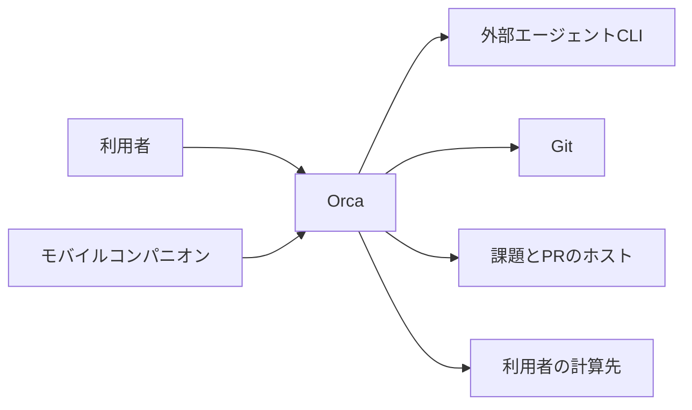
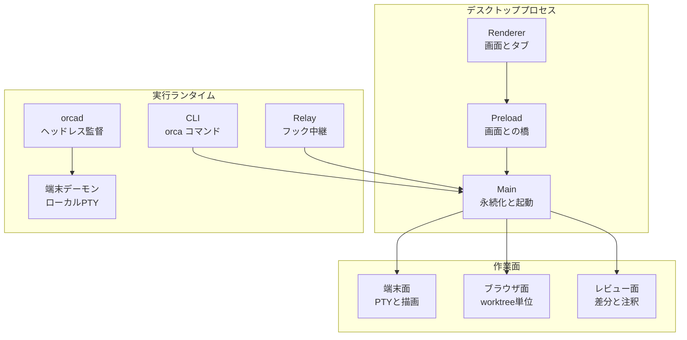
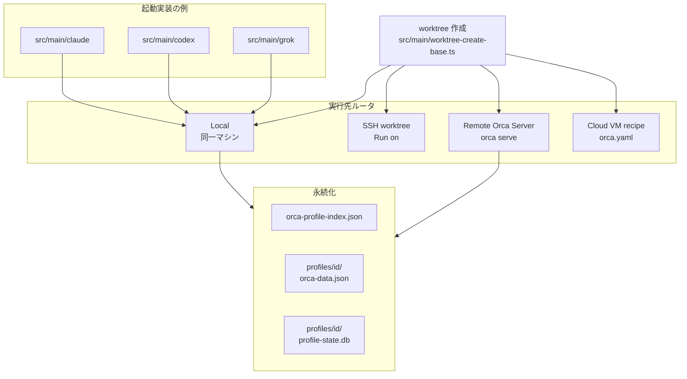
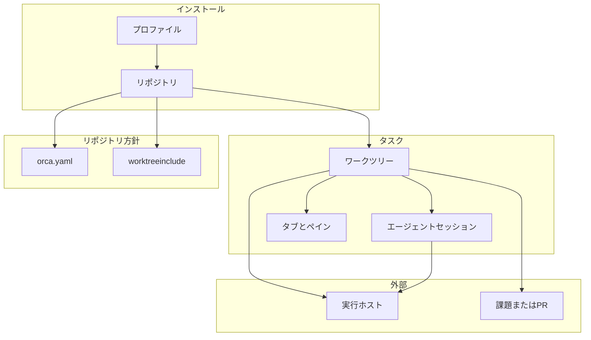
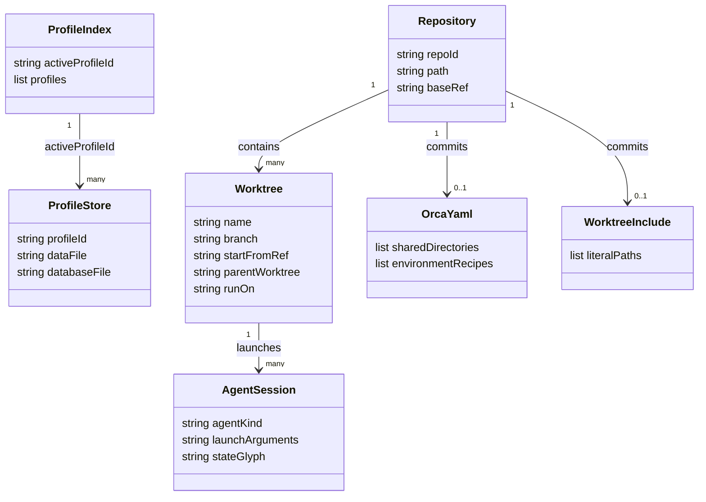

[Orca](https://www.onorca.dev/) は、複数のコーディング用 CLI エージェントを 1 つのデスクトップアプリから並列に走らせる ADE（Agent Development Environment）です。
この記事では、Orca の構造、データの置き場所、導入から CLI 操作、リモート実行、運用時の確認点までを、公式ドキュメントと公開リポジトリ [stablyai/orca](https://github.com/stablyai/orca) をもとに整理します。
数値とパスは 2026-10-03 時点の値です。


*この記事の全体像。以下、順に解説します。*

## Orcaとは

Orca は、タスクごとに実在の git worktree、エージェント端末、ブラウザタブを割り当てる ADE です。
推論モデルは同梱しません。
利用者は、既に契約している Claude Code、Codex、OpenCode などの CLI を、その契約のまま起動します。
各 worktree は通常の `git worktree` なので、端末から `git` をそのまま使えます。
既定の実行場所は利用者のデスクトップです。
遠隔で動かす場合は、利用者が管理する SSH 先、自前の Orca サーバ、または利用者が契約するクラウド上の使い捨て環境を使います。


*出典: [stablyai/orca README](https://github.com/stablyai/orca)*

公式の [What is Orca?](https://www.onorca.dev/docs) は、次の 4 つの使い方を挙げています。

- 同じ不具合を複数エージェントに並行して試させ、結果を選ぶ。
- AI が作った差分を、出荷前に差分ビューで読む。
- 既存の Claude Code、Codex、Cursor CLI の契約を 1 つの操作面にまとめる。
- SSH、自前の Orca サーバ、オンデマンド VM へエージェントを逃がしても、手元の IDE 面を残す。

想定する利用者は、差分とコミットを自分で読む開発者です。
ライセンスは MIT（Copyright (c) 2026 Lovecast Inc.）で、主言語は TypeScript です。

2026-10-03（JST）に GitHub API で読んだ公開リポジトリの指標は次のとおりです。

| 指標 | 値 | 取得元 |
|---|---|---|
| 最新 Release | `v1.4.218`（2026-09-30T20:53:08Z 公開、prerelease ではない） | `repos/stablyai/orca/releases/latest` |
| その tag の `package.json` `version` | `1.4.218` | tag `v1.4.218` の contents API |
| stars | 83816 | `repos/stablyai/orca`（2026-10-02T20:48:41Z） |
| forks | 5409 | 同上 |
| `open_issues_count` | 7558（PR を含む） | 同上 |
| オープン issue（PR 除外） | 3615 | Search API `is:issue is:open` |
| オープン PR | 3943 | Search API `is:pr is:open` |
| `main` の blob 数 | 31771 | `git/trees/main?recursive=1` |
| 公開 Homebrew cask | `1.4.218` | [stablyai/homebrew-orca `Casks/orca.rb`](https://github.com/stablyai/homebrew-orca/blob/main/Casks/orca.rb) |

`repos` と Search は別エンドポイントです。
取得の瞬間によっては、issue と PR の合計が `open_issues_count` と 1 件ずれることがあります。

デスクトップ版は macOS、Windows、Linux 向けです。
モバイル版は iOS の App Store アプリと Android APK です。
ホームページには Y Combinator のバッキング表示があります。

周辺の仕組みとの関係は、公式の定義では次のとおりです。

| 関係 | 公式の定義 |
|---|---|
| モデル | 利用者が持ち込む CLI エージェントを実行する |
| Git | 実 worktree を作る。プレーンな git 操作をそのまま使える |
| ホスティング | デスクトップが既定。遠隔は利用者のマシンとクラウド口座 |
| 課金 | アプリ自体はフリーかつオープンソース。エージェント利用料は各 CLI の契約 |

ホームページの比較表と、ドキュメントの実行モードを合わせると、Orca の作業面は次のように整理できます。

| 観点 | Orca の位置 |
|---|---|
| 並列の単位 | タスクごとの git worktree |
| 端末 | WebGL 描画、分割、再起動後も残る scrollback |
| ブラウザ | worktree ごとの Chromium。要素クリックで HTML、CSS、切り抜きをエージェントへ渡す Design Mode |
| レビュー | 差分行への Markdown コメントをエージェントへ戻す |
| 遠隔 | SSH worktree と、ランタイムごと預ける Remote Orca Server |
| 自動化 | 同梱 CLI から worktree、端末、ブラウザ、スケジュールを操作する |


*出典: [stablyai/orca README](https://github.com/stablyai/orca)*

向いているのは、複数ハーネスの結果を見比べる開発と、差分レビューをアプリ内で閉じたい開発です。
1 つのエディタで自分の打鍵が中心になる作業は、Orca の主目的から外れます。

## 特徴

- タスクごとに隔離した git worktree を持つため、並列エージェントが同じ作業ツリーを奪い合いません。
- エージェントのコンボボックスは、対応表にある CLI をワンクリックで起動します。表に無い CLI も、端末で動くプロセスとして起動できます。
- 状態表示は端末の OSC タイトルとエージェントフックから取ります。作業中、入力待ち、完了、失敗、アイドルをタブとサイドバーで共有します。
- 端末は分割と、再起動をまたぐ scrollback を備えます。実装は xterm.js の WebGL アドオンと `node-pty` です。
- worktree ごとに Chromium 窓を開けます。Design Mode は、クリックした要素の HTML、CSS、切り抜き画像をプロンプトへ添付します。
- 作成ダイアログは GitHub、Linear、Jira、GitLab の課題や PR を worktree に結び付けます。Bitbucket Cloud は Settings の認証と連携レビューの側にあり、作成時の課題リンク先には入っていません。
- CLI `orca` は、起動中のエディタに対して worktree 作成、端末送信、ブラウザ操作、成果物共有、スケジュール実行をスクリプト化します。
- モバイルコンパニオンは、稼働中のエージェント状態、利用量、アカウント切替、端末操作を手元から続けます。
- 実行先は Local、SSH ターゲット、Remote Orca Server、レシピ駆動の Cloud VM の 4 モードです。1 インストール内で混在できます。
- 匿名テレメトリは PostHog Cloud の米国リージョンへ送ります。`DO_NOT_TRACK=1` または `ORCA_TELEMETRY_DISABLED=1` で送信を止められます。
- [Supported agents](https://www.onorca.dev/docs/agents/supported) の表は 2026-10-03 時点で 37 行あります。Deep integration の注記があるのは Claude Code、Codex、Muse Code、Cursor CLI です。


*出典: [stablyai/orca README](https://github.com/stablyai/orca)*


*出典: [stablyai/orca README](https://github.com/stablyai/orca)*


*出典: [stablyai/orca README](https://github.com/stablyai/orca)*

| エージェント | 公式 Notes の要点 |
|---|---|
| Claude Code | Deep integration。利用量、ホットスワップ、フック |
| Claude Agent Teams | 既定では無効。Settings → Agents で有効化すると `orca claude-teams` で起動し、メンバーごとにペインを持つ |
| Codex | Deep integration。利用量、ホットスワップ |
| Muse Code | Deep integration。フック、状態、利用量、セッション履歴 |
| Cursor CLI | Deep integration |
| ZCode | Auto-setup、フック、状態、セッション再開、監督付きワーカー。TUI 入りの `zcode` が必要 |
| Grok、Gemini、OpenCode、GitHub Copilot CLI、Pi、その他表の各 CLI | Auto-setup が中心。フックや状態、利用量の対応は行ごとに異なる |
| 表に無い CLI | コンボボックス外でも、端末プロセスとして起動できる |

新規起動の既定は、各 CLI の権限バイパスフラグを埋めた状態です。

| エージェント | 既定で埋めるフラグ |
|---|---|
| Claude Code | `--dangerously-skip-permissions` |
| Codex | `--dangerously-bypass-approvals-and-sandbox` |
| Gemini、Cursor、Crush、Kimi、Muse Code、Rovo Dev、Hermes、GitHub Copilot、Command Code | `--yolo` |
| ZCode | `--mode yolo` |
| その他 | 同等のフラグを持つものはそのフラグ |

Settings の Agent Permissions で、未カスタマイズのエージェントを Yolo と Manual の間でまとめて切り替えられます。
起動引数または環境の上書きが空でないエージェントは、その一括切り替えから外れます。

## 構造

### システムコンテキスト図

利用者、Orca、Orca が所有しない外部システムの境界です。



| 要素名 | 説明 |
|---|---|
| 利用者 | 差分を読み、worktree を片付け、エージェント契約を自分で持つ開発者 |
| Orca | デスクトップ、CLI、自前サーバとして worktree と端末とブラウザを束ねる ADE |
| 外部エージェントCLI | Claude Code、Codex、Cursor CLI など、利用者がインストールしたプロセス |
| Git | worktree の実体。Orca の外でも同じディレクトリを操作できる |
| 課題とPRのホスト | 作成時のリンク先は GitHub、Linear、Jira、GitLab。Bitbucket Cloud は Settings の Connect と連携レビュー。認証情報は連携先のもの |
| 利用者の計算先 | SSH ホスト、Tailscale 上の自前マシン、レシピが起動する VM やコンテナ |
| モバイルコンパニオン | 同じランタイムへペアリングし、状態監視とフォローアップを行う iOS / Android アプリ |

### コンテナ図

Orca の内側を、公式ドキュメントとリポジトリのトップレベル配置から切り出したコンテナです。



| 要素名 | 説明 |
|---|---|
| Renderer | `src/renderer`。サイドバー、タブ、設定、差分、ブラウザ UI |
| Main | `src/main`。ウィンドウ、worktree 作成、永続化、アップデータ、SSH、エージェント起動 |
| Preload | `src/preload`。描画プロセスと Main の橋 |
| CLI | `src/cli`。`package.json` の `bin.orca` は `./out/cli/index.js`。起動中のエディタをスクリプトから操作する |
| orcad | [orcad-operations.md](https://github.com/stablyai/orca/blob/main/docs/reference/orcad-operations.md) の監督プロセス。RPC、git、worktree、永続化を持つ |
| 端末デーモン | orcad が切り離して起動する。ローカル PTY を所有し、ソケットは data root 配下に置く |
| Relay | `src/relay`。`pnpm run build:relay` でビルドするフック中継 |
| 端末面 | `node-pty` と xterm.js WebGL アドオンで、エージェントの TUI を描画する |
| ブラウザ面 | worktree スコープの Chromium。Design Mode と CLI の snapshot 操作の対象 |
| レビュー面 | start-from ref との差分、行コメント、GitHub チェック |

### コンポーネント図

Main と実行先のモジュール境界です。
パスは 2026-10-03 の `main` ブランチに存在する名前です。



| 要素名 | 説明 |
|---|---|
| orca-profile-index.json | Electron userData 直下。`activeProfileId` と `profiles` を持つ |
| profiles/id/orca-data.json | `getOrcaProfileDataFile` が返す、プロファイル単位のデータファイル |
| profiles/id/profile-state.db | `PROFILE_STATE_DATABASE_FILE_NAME` が示す SQLite ファイル |
| Local | UI と同じマシンでエージェント、端末、ブラウザを動かす既定のモード |
| SSH worktree | ラップトップの Orca がランタイムを所有する。切断中もホスト上でエージェントは動き、再接続後はラップトップ 1 台が駆動する |
| Remote Orca Server | サーバ側のデスクトップまたは `orca serve` がセッションを所有する。laptop、web、mobile、automation が同じランタイムを共有できる |
| Cloud VM recipe | `orca.yaml` のレシピが create / suspend / resume / destroy を実行する。接続は、レシピが `orca serve` を起動して pairing URL を返す方法と、SSH の接続情報を返して Orca が接続する方法の 2 つ。UI では Settings の Experimental にある Cloud VM |
| src/main/claude | Claude Code 向けのアカウント、利用量、起動を扱う Main モジュール群 |
| src/main/codex | Codex 向けの同様のモジュール群 |
| src/main/grok | Grok CLI 向けの Main モジュール |
| worktree 作成 | ダイアログを閉じたあとも、fetch と `git worktree add` をバックグラウンドで続ける |

## データ

### 概念モデル

Orca が扱う概念と、その利用関係です。
名前は公式ドキュメントの用語に合わせています。



| 要素名 | 説明 |
|---|---|
| プロファイル | 1 インストール内の状態の単位。索引の `activeProfileId` が現在のプロファイルを指す |
| リポジトリ | Orca に登録した git リポジトリ。base ref を持つ。多くの場合 `origin/main` |
| ワークツリー | タスクごとの作業ディレクトリとブランチ。start-from ref から分岐する |
| エージェントセッション | 1 worktree の 1 端末で動く 1 CLI。状態は OSC タイトルとフックで更新する |
| タブとペイン | その worktree にスコープしたエディタ、端末、ブラウザ、差分 |
| orca.yaml | リポジトリにコミットする共有設定。`worktree.sharedDirectories` と環境レシピを置ける |
| worktreeinclude | リポジトリ直下の `.worktreeinclude`。git 無視のファイルを worktree ごとにコピーする |
| 実行ホスト | Local、SSH、Remote Orca Server、レシピが返した接続のいずれか |
| 課題またはPR | worktree に 1 件結び付けられる GitHub、Linear、Jira、GitLab の項目 |

### 情報モデル

属性は、公式ドキュメントと [profile-state-storage-paths.ts](https://github.com/stablyai/orca/blob/main/src/shared/profile-state-storage-paths.ts) に名前があるものに限っています。
SQLite の全カラムは含めていません。



| 要素名 | 説明 |
|---|---|
| ProfileIndex.activeProfileId | `orca-profile-index.json` の現在プロファイル。ID は英数と `_-`、先頭は英数、長さ 1〜128 |
| ProfileStore.dataFile | `userData/profiles/<profileId>/orca-data.json` |
| ProfileStore.databaseFile | 同じディレクトリの `profile-state.db` |
| Repository.repoId | CLI セレクタ `id:<repoId>` で指す登録 ID |
| Repository.baseRef | リポジトリの分岐元。通常は `origin/main`。`orca repo set-base-ref` で変更できる |
| Worktree.startFromRef | その worktree が分岐した ref。base、ローカルブランチ、SHA、リモートブランチのいずれか |
| Worktree.parentWorktree | サイドバー上の親子関係。Git の履歴は変えない。`--parent-worktree` または `--no-parent` で指定 |
| Worktree.runOn | 作成ダイアログの実行先。準備済みホスト、レシピ、セットアップ待ちホスト |
| AgentSession.launchArguments | Settings のエージェント行に保存する起動引数。引数または環境の上書きが空でなければ、権限モードの一括切り替えから外れる |
| AgentSession.stateGlyph | spinner、amber question、emerald、red、gray。プレーンシェルにはインジケータが出ない |
| OrcaYaml.sharedDirectories | git 無視かつ primary checkout に実在するディレクトリだけを、Settings の Worktree Shared Paths と同じ方式で共有する（コピーしない）。追跡済みと欠落はスキップ |
| OrcaYaml.environmentRecipes | primary checkout の `orca.yaml` にあるときだけ、作成 UI のレシピ一覧に出る |
| WorktreeInclude.literalPaths | git 無視のリテラルパスだけをコピーする。glob、否定、追跡済み、欠落、git 無視でないパスはコピーしない |

永続化の置き場所は、実行形態によって次のように分かれます。

| 置き場所 | 役割 |
|---|---|
| Electron `userData` | デスクトップの標準 userData。macOS の Homebrew zap は `~/Library/Application Support/Orca` を含む |
| `userData/orca-profile-index.json` | アクティブプロファイルの索引。読めないときは `.bak` を試す |
| `userData/profiles/<profileId>/` | そのプロファイルの `orca-data.json` と `profile-state.db` |
| `~/.orca` | 公開 cask の zap は、worktree とエージェント状態の置き場としてこのディレクトリを消す。keybindings は `~/.orca/keybindings.json` |
| orcad の data root | `$ORCA_USER_DATA`、なければ `$XDG_DATA_HOME/Orca`、なければ `~/.orca`。直下に `orcad.lock` |
| 端末デーモン | `<data-root>/daemon/daemon-v<N>.sock` |
| Linux の更新キャッシュ | `XDG_CACHE_HOME` または `~/.cache` 配下の `orca-updater/pending/` |

[user-data-path.ts](https://github.com/stablyai/orca/blob/main/src/main/persistence/loading-store/user-data-path.ts) の `initDataPath` は、起動時に捕捉した userData 直下の `orca-data.json` というパスも組み立てます。
プロファイル索引が解決できるときは、`profiles/<profileId>/` を読みます。
索引が無い CLI のフォールバックは、`src/cli/handlers/agent-hooks.ts` の `legacyProfileStateLocation` で、userData 直下の `orca-data.json` と `profile-state.db` です。
この 2 系統のパスについては、注意点でもう一度触れます。

## 構築方法

### 前提

- デスクトップで使うだけなら、配布物をインストールすれば足ります。
- `main` の開発ツリーを動かすには、`package.json` の `engines.node` が示す Node.js 24 と、`packageManager` の pnpm 12.8.1 が必要です。タグ `v1.4.218` の `packageManager` は pnpm 12.0.0 です。
- エージェント CLI は Orca の外でインストールし、Orca が見る `PATH` に置きます。
- 遠隔で動かす場合は、そのマシンに `git` と、使うエージェント CLI の認証を置きます。ラップトップのログイン状態は自動では移りません。
- macOS の公開 cask は、macOS Big Sur 以降を `depends_on` に指定しています。

### デスクトップの入手

安定版は [GitHub Releases の latest](https://github.com/stablyai/orca/releases/latest) から入手します。

| OS / 形式 | アセット名 |
|---|---|
| macOS Apple Silicon | `orca-macos-arm64.dmg` |
| macOS Intel | `orca-macos-x64.dmg` |
| Windows | `orca-windows-setup.exe` |
| Linux AppImage x64 | `orca-linux.AppImage` |
| Linux AppImage arm64 | `orca-linux-arm64.AppImage` |
| `.deb` / `.rpm` | 版とアーキテクチャがファイル名に入るため、Releases ページから選ぶ |

```bash
# macOS Apple Silicon の安定版 DMG
curl -fL -o orca-macos-arm64.dmg \
  https://github.com/stablyai/orca/releases/latest/download/orca-macos-arm64.dmg
```

```bash
# Linux AppImage。GitHub のアセットは実行ビットを持たない
curl -fL -o orca-linux.AppImage \
  https://github.com/stablyai/orca/releases/latest/download/orca-linux.AppImage
chmod +x orca-linux.AppImage
```

### Homebrew

macOS では公開 tap の cask を使えます。
2026-10-03 時点の tap の version は `1.4.218` で、同日の latest Release と一致しています。

```bash
brew install --cask stablyai/orca/orca
```

cask は `auto_updates true` です。
アプリ内の electron-updater が `/Applications` の `Orca.app` を差し替えます。
そのため `brew upgrade` は `--greedy` を付けない限り更新を取り合わない、と cask のコメントが説明しています。
cask は `Orca.app` と、アプリ内の `Contents/Resources/bin/orca` を PATH へ出します。

### Linux のコマンド名

Linux のパッケージ名と CLI 名は `orca-ide` です。
GNOME のスクリーンリーダーが `/usr/bin/orca` を既に使っているため、その名前を避けています。

- `.deb` と `.rpm` は、インストール時に `/usr/bin/orca-ide` を PATH に置きます。
- AppImage は、Settings → General → Orca CLI から `~/.local/bin/orca-ide` を登録します。
- Orca が管理する端末の中では、シムにより `orca` で呼べます。
- ヘッドレスの `orca serve` は、起動の途中で `~/.local/bin/orca` を書くことがあります。最初の起動コマンドは `orca-ide serve` です。

```bash
# スクリーンリーダーと衝突しないことの確認
command -v orca-ide
orca-ide status --json
```

スクリーンリーダーを使わない環境で、自分のシェルでも短い名前を使いたい場合の公式例は次のとおりです。

```bash
ln -s "$(command -v orca-ide)" ~/.local/bin/orca
```

### 初回起動

初回起動で Orca は次を行います。

- リポジトリ追加のため、ホームディレクトリへのアクセスを求めます。
- `~/.claude`、`~/.codex`、Ghostty の端末設定があれば、取り込みを提案します。
- 空のランディング画面から、最初のリポジトリを追加します。

自動更新の既定は stable チャネルです。
RC を恒久的に選ぶスイッチはありません。
Check for Updates を修飾キー付きでクリックすると、その回だけ prerelease を含めます。

| 操作 | 効果 |
|---|---|
| Shift+click | 最新の RC prerelease を含める |
| macOS は Cmd+click、Windows と Linux は Ctrl+click | `perf` タグの prerelease を含める |
| macOS の Option+click | 互換チェックを通ったローカル macOS ビルドを選ぶ |

Linux の AppImage は、アプリが更新をその場で適用します。
`.deb` と `.rpm` は、ダウンロード後に絶対パスへ解決したインストールコマンドをコピーさせます。
実行前に Orca を終了します。
Orca 自身は root へ昇格しません。

```text
/usr/bin/sudo /usr/bin/apt install -- '/home/you/.cache/orca-updater/pending/orca-ide_1.4.194_amd64.deb'
```

上のパスは、Install ドキュメントが示す形の例です。
版番号とホームディレクトリは、そのマシンの Copy Install Command が単一引用符で埋めた値を使います。

### 開発ツリー

`main` の `package.json` は、デスクトップの入口を `./out/main/index.js`、CLI を `./out/cli/index.js` と宣言しています。
開発用の起動スクリプトは `pnpm run dev` です。
Electron ランタイムを確保してから electron-vite を起動します。
開発依存の Electron は、`main` とタグ `v1.4.218` の `package.json` がどちらも `43.7.5` です。

```bash
pnpm install --frozen-lockfile --cpu=current,x64,arm64
pnpm run dev
```

## 利用方法

CLI の主なパラメータを、個別の例より先にまとめます。
コマンド名は、macOS と Windows、および Orca 管理端末の中では `orca`、Linux の自分のシェルでは `orca-ide` です。


*出典: [stablyai/orca README](https://github.com/stablyai/orca)*

| パラメータ | 必須条件 | 役割 |
|---|---|---|
| `orca worktree create --name` | create では必須 | 新しい worktree の名前 |
| `--repo` または `--project` | worktree の外から作るとき、どちらか一方 | `--repo <selector>` か、準備済みの `--project` / `--project-host-setup`。両方は渡せない。worktree の中ではカレントから推論する |
| `--agent` | 任意 | 最初の端末で起動するエージェント。例は `claude` と `codex` |
| `--prompt` | 任意 | そのエージェントへの初期指示 |
| `--setup run` / `skip` / `inherit` | 任意 | リポジトリの setup hook。`inherit` はリポジトリ方針に従う |
| `--parent-worktree` / `--no-parent` | 任意 | サイドバー上の親子関係。Git 履歴は変えない |
| `--worktree` | 対象 worktree の外でコマンドを打つとき | `path:`、`branch:`、`issue:`、`id:` を渡す。`active` と `current` はシェルのカレントか端末コンテキストの worktree に解決する。遠隔は `id:<repoId>::<絶対パス>` かサーバ上の `path:` |
| `--host` | 実行マシンを明示するとき | `local` または `ssh:<target-id>`。一覧は `orca host list --json` |
| `--environment` | ペア済み Remote Orca Server を指すとき | `<server-name>`。名前が衝突するときは `host list` の ID を使う |
| `orca serve --pairing-address` | 他のマシンから接続させるとき | クライアントが接続するアドレス。`127.0.0.1` はサーバ自身からしか届かない |
| `--port` | 任意 | 公開ドキュメントは固定ポートが必要な場合の例として示す。コード上は `DEFAULT_WS_PORT` が `6768` で、省略時の初期値になる。`mobile-ws-fallback-port.json` があれば、その保存ポートを先に bind する |
| `--json` | 任意 | 機械可読な出力 |

### リポジトリと worktree

登録、参照、作成、一覧、削除の公式例です。

```bash
orca repo add --path /absolute/path/to/repo --json
orca repo list --json
orca repo show --repo id:repoId --json
orca worktree create --repo id:repoId --name review-api --agent claude --setup run --json
orca worktree ps --json
orca worktree rm --worktree id:worktreeId --force --json
```

作成ダイアログを閉じても、`git fetch` と `git worktree add` はバックグラウンドで続きます。
失敗するとタブ内のパネルにエラーと Retry が出ます。
削除は、確認のうえでディレクトリとブランチの両方を外します。
未マージの可能性があるブランチを git が残した場合は、残ったブランチのレビューに案内されます。

Orca の外で `git worktree add` したディレクトリは、最初はサイドバーに出ません。
隠れた worktree のカードから Non-Orca worktrees を開き、Show で取り込みます。

### エージェントの起動

コンボボックスから起動すると、Orca がその CLI を worktree の端末で起動します。
状態は OSC タイトルとフックで更新され、作業中からアイドルへ移ると完了通知を出せます。
プロセスが終わると Restart チップが出ます。
Codex の Restart は、その時点のアカウントを保ちます。

端末でバイナリを手打ちしたセッションは、Orca が認識するエージェントにならないことがあります。
状態インジケータが必要なセッションは、コンボボックスから起動します。

権限を戻すには、Settings → Agents → Agent Permissions で Manual を選ぶか、そのエージェントの起動引数または環境を明示して上書きします。
空でないカスタム値を入れたエージェントは、その後の権限モードの一括切り替えから外れます。

エージェントに Orca CLI のスキルを入れる方法は次のとおりです。

```bash
npx skills add https://github.com/stablyai/orca --skill orca-cli
orca skills install --skill orca-cli
```

### 端末、ファイル、ブラウザ

端末への送信と待機、ファイルをタブで開く公式例です。

```bash
orca terminal list --json
orca terminal send --text "continue" --enter --json
orca terminal wait --for tui-idle --timeout-ms 30000 --json
orca file open src/App.tsx
orca file diff src/App.tsx --staged
```

ブラウザは、開いているタブに対する snapshot と操作の繰り返しです。
タブが無いと `browser_no_tab` になります。

```bash
orca tab create --url https://example.com
orca goto --url https://example.com --json
orca snapshot --json
orca click --element @e3 --json
orca fill --element @e1 --value "user@example.com" --json
```

iOS Simulator のブリッジは、アクティブな worktree にスコープされます。

```bash
orca emulator list --json
orca emulator attach "iPhone 16" --json
orca emulator tap 0.5 0.7 --json
```

デバイス名は `orca emulator list` が返す値を使います。
上の `iPhone 16` は引数の形を示す例です。

### orca.yaml と .worktreeinclude

新しい worktree はクリーンなチェックアウトです。
git 無視の依存や秘密情報は、次の 3 つの経路で補います。

| 経路 | 方式 | 対象 |
|---|---|---|
| Settings の Worktree Shared Paths | 共有。macOS では可能なら APFS clone、それ以外はシンボリックリンク | ユーザ設定のパス |
| `orca.yaml` の `worktree.sharedDirectories` | 上と同じ共有（コピーではない）。ユーザ設定へ追加され、置き換えない | primary checkout に実在する git 無視のディレクトリ |
| `.worktreeinclude` | コピー。worktree ごとに所有する | git 無視のリテラルパス |

```yaml
# orca.yaml
worktree:
  sharedDirectories:
    - node_modules
    - .cache
```

```text
# .worktreeinclude
.env
.env.local
.vscode/settings.json
```

`sharedDirectories` の各エントリは、primary checkout にディレクトリとして存在し、かつ git 無視である必要があります。
追跡されているパスや欠落パスはスキップされます。
`.worktreeinclude` は、glob や否定を使わないリテラルパスだけをコピーします。

Cloud VM のレシピは、primary checkout の `orca.yaml` に `environmentRecipes` があるときに作成 UI へ出ます。
機能ブランチだけにレシピを書いても、作成一覧には載りません。
doctor と試行の provision は、作業中のブランチから実行できます。

### リモートの接続

SSH worktree は、Settings の SSH にホストを追加し、作成時の Run on でそのホストを選びます。
ランタイムの所有者はラップトップ側の Orca です。


*出典: [stablyai/orca README](https://github.com/stablyai/orca)*

Remote Orca Server は、サーバ側がプロジェクトとセッションを所有します。
デスクトップ同士なら Tailscale で接続し、サーバ側で Settings → Remote Orca Servers → Advertise this app as a server → New Link とたどってアクセスリンクを作ります。
クライアントはそのリンクを Add Server に貼ります。

ヘッドレスで起動する場合は次の形です。
Linux では `orca-ide` を使います。

```bash
orca-ide serve --pairing-address 100.64.1.20
orca-ide serve --port 6768 --pairing-address 100.64.1.20
orca-ide serve --pairing-address 100.64.1.20 --mobile-pairing
```

`100.64.1.20` と `6768` はドキュメントの例です。
到達できる Tailscale アドレスと、ファイアウォールが許すポートに置き換えます。
同じマシンの同じ共有セットアップでは、デスクトップの共有と `orca serve` を同時に起動できません。
orcad 同士の二重起動は、別の拒否コード `orcad_instance_lock_held` で止まります。

ヘッドレスでアカウントとスキルを登録する公式例です。

```bash
orca account add --agent claude
orca account add --agent codex
orca skills install --skill orca-cli --skill orchestration
```

### モバイル

iOS は App Store の [Orca IDE](https://apps.apple.com/us/app/orca-ide/id6766130217) です。
Android は、ホームページと README が指す [APK `mobile-android-v0.0.50`](https://github.com/stablyai/orca/releases/download/mobile-android-v0.0.50/app-release.apk) です。
ペアリング後は、エージェントの完了通知、利用量、端末へのフォローアップを電話から続けられます。
ヘッドレスの場合は、`--mobile-pairing` が表示する QR またはリンクを、同じ tailnet 上の電話で読み取ります。


*出典: [stablyai/orca README](https://github.com/stablyai/orca)*

## 運用

### チャネルと更新

- 既定の更新チャネルは stable です。RC は修飾キー付きクリックか、Releases からの直接ダウンロードで入れます。
- 古いビルドへ戻しても、Orca は worktree データを強制的にダウングレードしない、と Install ドキュメントが述べています。
- AppImage は終了せずに置き換えます。`.deb` と `.rpm` は終了してから、コピーしたコマンドを実行します。
- AUR や Nix のように Orca が更新を駆動できないパッケージでは、ダウンロードを提案せず、新しい版の存在だけを知らせます。
- 署名付き apt / yum リポジトリは、ドキュメントが [Issue #18086](https://github.com/stablyai/orca/issues/18086) として未実施の計画に挙げています。

### ログと診断

- Help → Open Logs でログディレクトリを開きます。
- Help → Send Feedback は画面キャプチャを添付できます。再現が難しい不具合ではログも添えます。
- エージェントの生のエラー文はテレメトリへ出ません。ローカルの診断トレースに残り、診断バンドルを明示的に共有したときだけ Orca 側へ届きます。
- テレメトリを止める環境変数は、その起動の送信だけを止めます。外すと、次回起動で保存済みの設定に戻ります。

Orca を起動するシェルで export してから起動します。

```bash
export DO_NOT_TRACK=1
```

```bash
export ORCA_TELEMETRY_DISABLED=1
```

アプリ内で Settings → Privacy の Share anonymous usage data を切ると、その設定は保存されて以降も続きます。
送信先は PostHog Cloud の米国リージョンです。
保持期間は PostHog のプラン既定で、Orca は独自の保持期間を設定していないと書いています。

### テレメトリが送るもの

イベントに付くのは、Orca の版、OS、CPU アーキテクチャ、粗い OS リリース、`stable` または `rc`、ローカルのランダム ID です。
ホスト名、ユーザ名、IP は送りません。
国が、リクエストから導く唯一の地理情報です。

| 区分 | 内容 |
|---|---|
| 送るカテゴリ | 起動、リポジトリと workspace の作り方、エージェント種別とトークン数、粗いエラー分類、許可リストにある設定トグル、プライバシー設定の変更、SSH ランタイムの粗いホスト情報 |
| 送らないもの | ファイル内容、プロンプト、端末出力、リポジトリ名、ブランチ名、URL、パス、コミットメッセージ |

### リモートの生存

- Remote Orca Server は beta です。ドキュメントは、Tailscale の tailnet や LAN など、利用者が制御する私設経路に限るよう求めています。
- ペアリング URL はパスワードと同じ扱いです。誤って渡した grant は Shared Server Access から破棄すると、そのクライアントは直ちに切断されます。
- 未使用のリンクを再生成すると、前の未使用リンクは置き換わります。既にペアリング済みの grant は、破棄するまで残ります。
- ポートを公衆インターネットへ直接公開しない、と Access and security が書いています。
- サーバとクライアントのプロトコルが合わないときは、両方の Orca を更新します。
- エージェント CLI が見つからないときは、サーバ側の PATH、ホーム、認証を直します。クライアント側の環境は使われません。

orcad は data root の `orcad.lock` を取ってから、プロファイル索引に触れます。
拒否コードは次のとおりです。

| コード | 意味 |
|---|---|
| orcad_data_root_wrong_owner | POSIX で所有 uid が違う |
| orcad_data_root_shared | グループや全体から触れる状態で、権限を締められなかった |
| orcad_instance_lock_held | 別の生きている orcad が同じ root を持つ |
| orcad_instance_lock_foreign_identity | ロックの身元が違う。回収しない |
| orcad_data_root_unusable | 作成、stat、書き込みができない |

所有者が自分で権限が緩いだけの root は、`0700` に締めます。
資格情報を OS キーリング無しで置くためです。
Windows は所有者と mode の検査を免除しています。

### スキルとフック

- `orca skills update --all` は、Settings UI が無いホストでスキルを更新します。
- エージェント状態フックは `orca agent hooks on`、`off`、`status` で切り替えます。アプリの再起動なしで反映される、と Settings ドキュメントが書いています。
- Keep computer awake は On、Agent、Off の 3 段階です。デスクトップのステータスバーでは Caffeinate と表示されます。ペアリングした Web クライアントでは表示されません。

```bash
orca agent hooks status
orca skills update --all
```

### 容量とアイドル

- 使っていない worktree は閉じます。worktree ごとにファイルウォッチャが残るためです。
- 多数のブラウザタブを持つ分割レイアウトが、公式トラブルシューティングが挙げる最大の RAM 要因です。
- Resource Manager の Clean up workspaces は、ローカル、main、フォルダ workspace、切断中の SSH ホスト上の workspace を横断し、サイズと Git 状態を見せてから削除します。
- Agent Dashboard は Experimental です。列は Needs You、Working、Done です。Idle は、約 30 分完了報告が無いセッションを指し、ボード設定で表示できます。
- サイドバーの Sleep は、生きている端末やブラウザがある workspace のパネルを閉じます。子孫つきの Sleep は、同じプロジェクト、リポジトリ、ホストの検証済みの子に限られます。

## ベストプラクティス

### worktree をサンドボックスの代わりにしない

[Supported agents](https://www.onorca.dev/docs/agents/supported) は、worktree は隔離されたチェックアウトであり、セキュリティサンドボックスではないと書いています。
エージェントは、そのプロセスから見えるファイルとネットワークへ届きます。
信頼していないタスクでは、Agent Permissions を Manual にします。
Yolo のまま使うのは、その worktree の権限境界を自分で把握しているときだけにします。

### 依存の共有と秘密のコピーを分ける

`node_modules` や `.cache` のような、再生成できる大きいディレクトリは `worktree.sharedDirectories` に置きます。
`.env` のように worktree ごとに独立させたいファイルは `.worktreeinclude` でコピーします。
共有済みのパスは `.worktreeinclude` から再コピーされません。
レシピや共有ディレクトリの正本は primary checkout に置きます。

### 実行モードを所有境界で選ぶ

| 状況 | 選ぶモード | ランタイムの所有者 |
|---|---|---|
| 短い作業でラップトップの性能が足りる | Local | ラップトップ |
| 既存の VPS や GPU 機へ処理だけ逃がしたい | SSH worktree | ラップトップ。切断してもホスト上のエージェントは動き続け、駆動するクライアントはラップトップ 1 台 |
| ノート PC がスリープしてもセッションを残し、laptop、web、mobile、automation で共有したい | Remote Orca Server | サーバ |
| タスクごとに捨てられる環境が要る | Cloud VM のレシピ | 利用者が契約するプロバイダ。接続は pairing URL かレシピが返す SSH 情報 |

1 つのインストールで、これらを worktree ごとに混ぜられます。

### 遠隔の認証をサーバ側で完結させる

Remote Orca Server と `orca serve` では、Claude、Codex、git、`gh` をサーバマシンにインストールします。
ヘッドレスではクライアントから Add account が使えないため、`orca account add` をサーバのシェルで実行します。
ペアリングリンクは私設経路でのみ渡し、不要な grant は破棄します。

### GitHub の枠を CLI で確認する

PR チェックが止まったときは、Settings の GitHub API Budget だけを見ずに、ローカルの `gh` で枠と認証を確認します。

```bash
gh auth status -h github.com
gh api user
gh api rate_limit --jq '.resources.core'
```

予算表示に余裕があっても、REST が別の枠で止まっていることがあります。
切り分けは公式の GitHub errors ページに続きます。

### Linux ではコマンド名を固定する

自分のシェルとスクリプトでは `orca-ide` を呼びます。
GNOME 環境では、`command -v orca` がスクリーンリーダーを指すことがあります。
シムの `orca` は、Orca 管理端末の中でエージェントに使わせるだけにします。

## 注意点

### ドキュメントと実装の乖離

| 対象 | 資料の記載 | 実態 | 読者への影響 |
|---|---|---|---|
| 権限バイパスの意味 | Agents and sessions は、worktree 自体がサンドボックスであり、ツールごとの承認を省く意図だと書く | Supported agents の Callout は、worktree は隔離チェックアウトでありセキュリティサンドボックスではないと書く | Yolo 既定を安全境界と読まない。Manual への切り替え判断は Callout 側を優先する |
| 直下の `orca-data.json` | `initDataPath` は userData 直下の `orca-data.json` を組み立てる | 索引があるときは `profiles/<profileId>/` 配下を使う。索引が無い CLI は直下の `orca-data.json` と `profile-state.db` を使う | バックアップでは、プロファイルディレクトリと userData 直下の両方を確認する |
| アカウントの有無 | Privacy ページは、Orca にはアカウントシステムが無く、ユーザアカウント情報は送らないと書く | Settings の Artifacts は、Orca Relay と同じアカウント族でのサインインと、公開リンクの発行を書く | テレメトリの「アカウントを送らない」と、成果物公開用の任意サインインは別機能として読む |
| 対応エージェント数 | ホームページの比較表は 27 supported agents と書く | Supported agents の公開ページの表は 2026-10-03 時点で 37 行ある | 対応可否はホームページの数ではなく、Supported agents の行で確認する |
| バージョン文字列 | 出荷タグ `v1.4.218` の `package.json` は `1.4.218` | 同日の `main` の `package.json` は `version` が `1.4.214` | 利用者向けの版は Release と公開 tap で確認する。main の version を出荷版と同一視しない |
| Homebrew cask | アプリリポジトリの `Casks/orca.rb` は version `1.3.24` | 公開 tap `stablyai/homebrew-orca` の `Casks/orca.rb` は `1.4.218` | `brew install --cask stablyai/orca/orca` の正本は公開 tap |

### 資料間の食い違い

| 対象 | 資料の記載 | 実態 | 読者への影響 |
|---|---|---|---|
| 製品の短い呼び名 | README は AI Orchestrator、ホームページは agent IDE、ドキュメント見出しは Orca ADE | 2026-10-03 時点で 3 つの呼び方が併存している | 別名で見かけた情報は、同じ `stablyai/orca` を指すかを URL で確認する |
| Linux 更新コマンドの版 | Install ページの例は `orca-ide_1.4.194_amd64.deb` | latest Release は `v1.4.218` | 例の版番号をそのまま実行しない。Copy Install Command の出力を使う |
| Android 版 | ホームページと README は APK `mobile-android-v0.0.50` を指す | Mobile ドキュメントは current APK を `0.0.48` と書く | 入れる APK はホームページと README の `0.0.50` を見る。デスクトップの semver とは体系が違う |

### 2026-10-03 時点の未確認事項

| 対象 | 資料の記載 | 実態 | 読者への影響 |
|---|---|---|---|
| SQLite の全テーブル | `profile-state.db` というファイル名はソースにある | スキーマは確認していない | カラム名が必要な作業では、その版のマイグレーションを直接読む |
| 出荷 DMG の Electron 版 | `main` とタグ `v1.4.218` の `package.json` は `electron` `43.7.5` | DMG 内のバイナリは確認していない | 脆弱性対応では、入れたビルドの About で Electron 版を確認する。package.json の宣言だけで断定しない |
| Issue #18086 | Install ページは署名付き apt / yum リポジトリを未実施と書く | 2026-10-03 時点で state は `open`（最終更新 2026-09-19） | `.deb` / `.rpm` の更新は、この issue が閉じるまで手動コマンドのままと考える |
| stars と issue 数 | 冒頭の表は 2026-10-02T20:48:41Z（UTC）の値 | 別エンドポイントのため、取得タイミングで 1 件ずれ得る | 固定の規模として引用せず、引用するときは時刻を添える |

## トラブルシューティング

公式の Troubleshooting、Remote Orca Servers、Install、Supported agents に症状として書かれているものを載せます。

### エージェントと差分

| 症状 | 原因 | 対処 |
|---|---|---|
| エージェントが起動しない | CLI 自体の認証やインストール、または Orca が見る PATH に無い | その端末で CLI を直接実行する。Settings の Agents で PATH を確認する。タブの Restart を押す |
| ZCode が `@zcode/tui` を見つけられない | デスクトップ版 ZCode の `zcode.cjs` には TUI が同梱されていない | TUI 入りの `zcode` を PATH に置く。Orca の外でセッションが開くことを先に確認する |
| 差分が古い、または固まる | 外部の rebase や reset が、Orca の再読込の間に入った | 差分ツールバーの更新で worktree を読み直す |
| 状態インジケータが出ない | 手打ちしたバイナリは、認識されるエージェントとして追跡されない | エージェントのコンボボックスから起動し直す |

- エージェント単体が Orca の外でも失敗するなら、Orca の不具合として扱う前に、その CLI の認証を直します。
- Restart は、同じ作業ディレクトリで同じエージェントを起動し直します。

### worktree 作成

| 症状 | 原因 | 対処 |
|---|---|---|
| 作成が失敗する | start-from ref が fetch されていない | リポジトリの端末で `git fetch origin` を実行し、Retry する |
| 作成が失敗する | そのブランチの worktree が既にある | 既存を削除するか、Advanced で別のブランチ名を指定する |
| 自分で作った worktree がサイドバーに無い | Orca 外の `git worktree add` は、表示するまで外部扱い | 隠れた worktree のカードから Show する |
| 削除したのにブランチが残る | git が未マージの可能性を理由にローカルブランチを残した | Review N Branches から、消すものと残すものを選ぶ |

- 作成中でも、他の worktree へ切り替えられます。進行状況はサイドバーとタブに出ます。
- CLI で `git worktree remove` した場合、Orca は次のリフレッシュで自分の状態を片付けます。

### CLI とブラウザ

| 症状 | 原因 | 対処 |
|---|---|---|
| `orca` が見つからない | CLI シムが未登録、または PATH に `~/.local/bin` が無い | Settings → General → Orca CLI で登録する。Linux の自分のシェルでは `orca-ide` を使う |
| `browser_no_tab` | 現在の worktree にブラウザタブが無い | `orca tab create --url ...` を実行するか、ブラウザペインを開いてから操作する |
| Open in VS Code が Local だけ、または無効 | SSH worktree 以外、または Open-in が VS Code 以外 | SSH worktree で、Open-in を VS Code か Insiders にする。Remote Orca Server の実行面ではこの経路を使わない |

- Linux で `command -v orca` が成功しても、それはスクリーンリーダーの可能性があります。
- ブラウザ操作の `@e1` のような参照は、直前の `orca snapshot` が返した値だけを使います。

### SSH とリモート

| 症状 | 原因 | 対処 |
|---|---|---|
| SSH は繋がるが遠隔端末が起動しない | 初回の relay に Node とネットワークが無い、または Linux に C/C++ ツールチェインが無い | make、g++ または clang++、python3 を入れ、再接続してネイティブモジュールを入れ直す |
| ファイルは取れるが Download Folder ができない | システム SSH だけでは再帰 SFTP が無い | 端末の `tar` か `scp` で取る |
| Kerberos ログインに失敗する | チケットが無効、または Host に `GSSAPIAuthentication yes` が無い | `klist` を確認し、OpenSSH 設定を直してから Settings で再テストする |
| Tailscale アドレスが一覧に無い | Tailscale 未接続、または別の tailnet | サーバで接続を確認し、Connection address を更新する |
| サーバ行が切断のまま | サーバのスリープ、Orca の終了、ACL、プロトコル不一致 | サーバを起こし、両端の版を揃える |
| `orca serve` の広告アドレスが違う | `--pairing-address` がクライアントから到達できない | 到達できるアドレスで起動し直す。ワイルドカードや `127.0.0.1` を遠隔クライアントに使わない |
| サーバがエージェント CLI を見つけない | 認証と PATH がクライアント側にしか無い | サーバマシンに CLI を入れて認証する |

- デスクトップが既にそのマシンを共有しているときは、同じセットアップで 2 つ目の `orca serve` を起動しません。
- アクセスリンクを誤って配ったら、未使用リンクの再生成ではなく、既存 grant の破棄を先に行います。

### GitHub と連携の枠

| 症状 | 原因 | 対処 |
|---|---|---|
| PR パネル、チェック、Tasks がエラーになる | `gh` の認証、スコープ、レート制限、リポジトリ権限 | `gh auth status`、`gh api user`、`gh api rate_limit` を実行し、GitHub errors の表で枠の種類を分ける |
| 予算表示は残っているのに REST が止まる | Settings の GitHub API Budget と、実際に止まっているリソースが別 | core、search、GraphQL のどれがゼロかを rate_limit で見る |

- 認証の本体はローカルの `gh` です。Orca の表示が新しくても、`gh` のトークンが無効ならパネルは失敗します。
- 不具合報告の公式窓口は GitHub Issues と [Discord](https://discord.gg/fzjDKHxv8Q) です。

## まとめ

- Orca は、利用者が持ち込む CLI エージェントを、タスクごとの git worktree・端末・ブラウザに割り当てて並列に走らせる ADE です。
- 内部は Electron の Renderer / Preload / Main と、CLI、ヘッドレス監督の orcad、端末デーモン、Relay で構成されます。状態はプロファイル単位の `orca-data.json` と `profile-state.db` に置かれます。
- 実行先は Local、SSH worktree、Remote Orca Server、Cloud VM レシピの 4 モードで、ランタイムの所有者で選び分けます。
- 依存は `orca.yaml` の `sharedDirectories` で共有し、秘密ファイルは `.worktreeinclude` でコピーします。
- 新規起動の既定は権限バイパスで、worktree はセキュリティサンドボックスではありません。信頼できないタスクでは Manual に切り替えます。
- Linux では `orca-ide` を使い、版の確認は Release と公開 tap で行います。

この記事が少しでも参考になった、あるいは改善点などがあれば、ぜひリアクションやコメント、SNSでのシェアをいただけると励みになります！

## 参考リンク

### 公式ドキュメント

- [What is Orca?](https://www.onorca.dev/docs)
- [Install](https://www.onorca.dev/docs/install)
- [Ways to run Orca](https://www.onorca.dev/docs/ways-to-run)
- [Worktrees](https://www.onorca.dev/docs/model/worktrees)
- [Agents and sessions](https://www.onorca.dev/docs/model/agents-sessions)
- [Supported agents](https://www.onorca.dev/docs/agents/supported)
- [Orca CLI overview](https://www.onorca.dev/docs/cli/overview)
- [Remote Orca Servers](https://www.onorca.dev/docs/remote-servers)
- [Settings reference](https://www.onorca.dev/docs/settings)
- [Privacy and Telemetry](https://www.onorca.dev/docs/telemetry)
- [Troubleshooting](https://www.onorca.dev/docs/troubleshooting)
- [ホームページ](https://www.onorca.dev/)

### リポジトリの一次ファイル

- [stablyai/orca](https://github.com/stablyai/orca)
- [LICENSE](https://github.com/stablyai/orca/blob/main/LICENSE)
- [package.json](https://github.com/stablyai/orca/blob/main/package.json)
- [profile-state-storage-paths.ts](https://github.com/stablyai/orca/blob/main/src/shared/profile-state-storage-paths.ts)
- [profile-state-active-location.ts](https://github.com/stablyai/orca/blob/main/src/main/persistence/profile-state/profile-state-active-location.ts)
- [user-data-path.ts](https://github.com/stablyai/orca/blob/main/src/main/persistence/loading-store/user-data-path.ts)
- [orcad-operations.md](https://github.com/stablyai/orca/blob/main/docs/reference/orcad-operations.md)
- [アプリリポジトリ内の Casks/orca.rb](https://github.com/stablyai/orca/blob/main/Casks/orca.rb)
- [公開 tap の Casks/orca.rb](https://github.com/stablyai/homebrew-orca/blob/main/Casks/orca.rb)
- [Releases](https://github.com/stablyai/orca/releases/latest)
- [Issue 18086](https://github.com/stablyai/orca/issues/18086)

### 配布とコンパニオン

- [iOS App Store](https://apps.apple.com/us/app/orca-ide/id6766130217)
- [Android APK 0.0.50](https://github.com/stablyai/orca/releases/download/mobile-android-v0.0.50/app-release.apk)
- [Discord](https://discord.gg/fzjDKHxv8Q)
