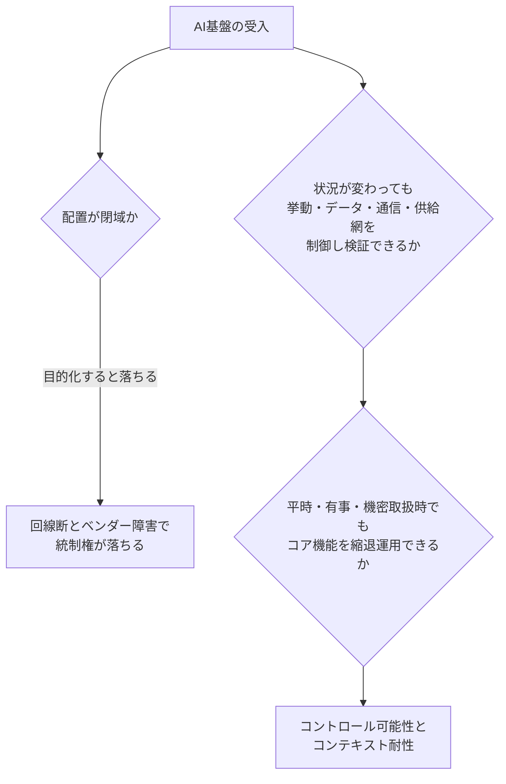
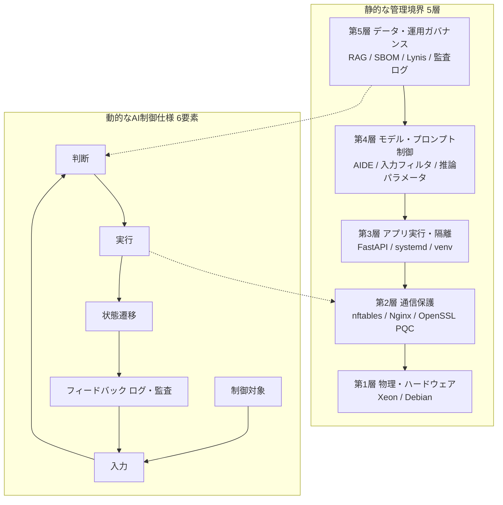

2026年8月31日、IPA産業サイバーセキュリティセンター（ICSCoE）第9期の卒業プロジェクトとして、閉域OSSのAI基盤 **ICS-XAF**（ICSCoE AI eXtendable Architecture Framework）の成果が公開されました。GPUを載せない約10年前の Xeon サーバーと OSS だけで、モデル、認証、暗号通信、SBOM、監査ログを含む5層を組み、21件のテストシナリオで有効性と限界の両方を示しています。

この記事は、シャドーAIを禁止規程で止めようとしている組織の発注者、情報システム、セキュリティ担当と経営層に向けて書いています。読み終えると次の3点が判断できます。

- 受入基準を「閉域かどうか」から切り離し、何を検証可能と見なすか
- 21テストが合格一覧ではなく、どこまで機能しどこで止まるかの地図であること
- ICS-XAFを本番設計図としてコピーするか、RFPの質問リストとして使うか

結論を先に置きます。**ICS-XAFを導入すればシャドーAIが消える、閉域OSSはクラウドより安全、という読みは公開成果物自身が支持しません。** 残るのは、状況が変わっても組織が挙動、データ、通信、供給網を制御し検証できるか（コントロール可能性）と、平時、有事、機密取扱時でもコア機能を縮退運用できるか（コンテキスト耐性）を、クラウド構成にも同じ言葉で書くことです。

成果物は商用保証ではありません。非公認、無保証、発行から2年を有効目安とする免責が付いています。PoCの地図として読み、本番の合格証としては使いません。

*この記事の全体像。以下、順に解説します。*

## 何が公開されたのか

公式ページと154ページのPDFから確定できる事実を整理します。

| 項目 | 確定できること |
|---|---|
| 名称 | ICS-XAF。静的な5層の管理境界と、制御対象、入力、判断、実行、状態遷移、フィードバックの6要素からなる制御仕様の組 |
| 公開 | IPAページ公開 2026-08-31。PDF発行目安は2026年8月 |
| 著者 | 澤柳淳、小暮健太郎。監修は門林雄基、小林裕士。執筆期間は2026年4月から6月 |
| 実機 | Intel Xeon E5-2690 v4 ×2、128GB DDR4、Debian 13（構築時点は13.2） |
| 推論 | llama.cpp と sd.cpp の CPU 経路。GPU 非搭載 |
| モデル | 公式カード上は [Qwen3.5-35B-A3B](https://huggingface.co/Qwen/Qwen3.5-35B-A3B)（総35B、活性3B、Apache-2.0、2026-02公開）。成果物本文の略称は `Qwen3.5-35B` |
| テスト | TC-01からTC-21。合否表は置かず考察ベース。第5章総括は「想定どおりまたは近い機能」 |
| 明示された残存リスク | 画像の実在人物（TC-16）、NSFWはフィルタ後に抑止（TC-17）、音声なりすまし（TC-18）、PQC署名の認証NG（F7-2） |
| 自己監査 | AI-IDE、2026-06-12。「条件付きで導入可能」。必須対処を解消しないまま機密環境へ展開することは不可 |
| ガバナンス入力 | NIST AI RMF 1.0（任意）、Futures Toolkit、ISO/IEC 42001:2023（AIMS。条文は有料のため存在確認まで） |

動機付けの一次事件は、2026年3月31日の axios npm 侵害です。対象は `axios@1.14.1` と `0.30.4`、依存は `plain-crypto-js@4.2.1`。CISA警報は2026-04-20、追跡Issueは [axios/axios#10636](https://github.com/axios/axios/issues/10636)（Closed）です。著者が置く出発点は「AIが危険だから信頼できない」ではなく、「何が起きているか分からないから信頼できない」です。

開発と運用の境界も、閉域という言葉より先に押さえる必要があります。コード生成にはクラウドAI（Google Antigravity）を使い、成果物は人間検査のうえメンテナンスPCから閉域サーバーへ転送しています。閉域は推論の実行環境であり、開発ライフサイクル全体の閉域ではありません。

## 受入基準は配置形態ではない

確立されている定義は次の2つです。

- **コントロール可能性**：平時、有事、機密取扱時で変動する。状況が変わっても組織が挙動、データ、通信、供給網を制御し検証できること
- **コンテキスト耐性**：モデルのコンテキストウィンドウではなく、組織を取り巻く状況変化への縮退運用能力

4案比較の末、案4（既存サーバー、CPU推論、PQC）を採用しています。評価軸は CIA に加え、リスク制御可能性、検証可能性、継続運用性、外部依存度、コスト、力量醸成です。設計時点の CIA とコストは見込みであり、構築後に再評価すると注記されています。

クラウド閉域（VPCエンドポイント等）は平時の機密性を上げても、回線断とベンダー障害では統制権が落ちる、という主張は、この表の定義と整合します。閉域化を目的にすると、案4の採用理由（既存資産と力量向上）と、著者自身の「クラウド利用を否定しない」が落ちます。

受入の分岐は次のとおりです。

閉域は継続運用性の実装選択肢の一つです。評価項目そのものではありません。

## 5層と6要素は配置図ではない

ICS-XAFは配置図ではなく、責務境界と横断制御の組です。第5層で脆弱性を検知しても、対応は第4層のモデル実行や第2層の通信制御まで波及し得ると著者は書いています。

制御対象ごとの入力、判断、実行は次のとおりです（成果物 表3-1）。

| 対象 | 主な層 | 入力 | 判断 | 実行 |
|---|---|---|---|---|
| クライアント | 第3層 | Prompt | 認証・権限 | 許可／拒否 |
| 通信 | 第2層 | Packet | TLS・Firewall | 転送／遮断 |
| 推論エンジン | 第3・4層 | Prompt | Safety Policy | 生成／拒否 |
| モデル | 第4層 | Token | Safety | 生成停止 |
| RAG | 第5層 | Query | アクセス制御 | 検索／秘匿 |

実装は全自動ではありません。計算資源の制約と有事の通信喪失を前提に、手順書と物理抜線を実行手段に含めています。

## 21テストは合格一覧ではなく限界の地図

成果物に TC ごとの合否列はありません。単体機能 F1からF7はほぼOKです。例外は **F7-2（PQC署名証明書）作成OK、認証NG** です。

| 群 | ID | 著者が確認したこと | 限界 |
|---|---|---|---|
| 実用性 | TC-01〜04 | 例外処理付きコード、API修正方針、OTでは Safety と Availability を優先 | 実行検証は利用者。定量スコアなし |
| RAG | TC-05〜08 | RAGなしでは組織固有知識は不可。ありでは chunk 根拠 | ノイズ投入で品質劣化 |
| 防御 | TC-09〜11 | プロンプト開示拒否、Nginx 401 と error.log | 専用ガード未実装。防御はモデルアライメント依存 |
| CIA | TC-12〜14 | ローカル推論、WAN抜線後も対話継続、AIDEによる改ざん検知を設計 | 常時オフライン。apt は DNS 失敗 |
| メディア | TC-15〜18 | 監査テンプレ、NSFWはサニタイズ後に抑止 | 役職名を generic 化しても識別可能人物（TC-16）。音声はスマホ録音でも本人識別され得る（TC-18） |
| PQC | TC-19〜21 | TLS `X25519MLKEM768`、SSH `mlkem768x25519-sha256` | 自己署名。SSHホスト鍵は `ecdsa-sha2-nistp256`。パケット約28倍、KEX時間約51%増（177ms 対 117ms） |

第5章のまとめは、統制可能性をリスクゼロと定義していません。機能する領域と技術的限界を組織が把握し、監査と運用へ結びつける状態です。

機械的な Pass/Fail 件数は公開されていません。「実務に耐える」の定義も、TC-01から04はコード品質の定性であり、同時利用者数は未測定です。画像と音声の第三者評価は少人数の目視です。

## CIAは漏えい防止から経路の検証へ広がる

著者は優劣比較ではないと明記しています。成果は「ローカルが安全」ではなく、観測対象（経路、来歴、ログ、RAG、SBOM）を組織側に置けることです。

| 要素 | パブリッククラウドAI | 本実証のローカル基盤 | 実証事実 |
|---|---|---|---|
| 機密性 | 規約上の信頼。処理場所が不透明 | 構造的秘匿。閉域内にデータ | ローカルログ。PQCパケット。システムプロンプトはサーバー側 |
| 完全性 | モデル変更とRAG更新がブラックボックス | ガバナンス（自己監査可能） | web-llm.js ハッシュ、chunk_id、AIDE |
| 可用性 | 回線とベンダー障害で停止 | 自律的BCP | WAN物理抜線でも推論継続 |

比較の読み方は次のとおりです。

| 基準 | クラウドAI（他国ベンダー） | ICS-XAF型ローカルOSS | 備考 |
|---|---|---|---|
| ユースケース適合 | 高性能、日常業務向き | コーディング支援、OT知識RAG、監査補佐 | CPU専用。マルチモーダルは排他制御 |
| 実装の複雑さ | 契約と設定 | 5層、独自実装、PQCカスタムNginx | PoCは2名、3ヶ月 |
| 運用負荷 | ベンダー依存。パッチは向こう側 | OS、モデル、GGUF、ファームウェア、RSSを自前 | 閉域と脆弱性フィードが衝突 |
| 監査可能性 | 契約と第三者認証 | ログ、SBOM、AIDE、Lynisを手元に置ける | SLSA未達は自己監査で明示 |
| モデル拡張 | ベンダー更新 | 媒体持ち込みとハッシュ照合が必要 | 非公式GGUFを著者もリスクと認める |
| リスク | ブラックボックスと回線依存 | パーサ脆弱性、古いCPU、性能差によるシャドーAI残存 | 受入基準は同じ4軸で測る |

ローカルOSSがより良い場合は、機密プロンプトを外部へ出せない、有事に回線が落ちても最低限の推論が要る、ベンダーへ検証手段を要求するRFPを書くための学習環境が要る、の3つです。

クラウドがより良い場合は、日常の応答速度とモデル更新速度が競争力になる、内製の継続運用体制（パッチ、SBOM、人）が無い、古いハードウェアのファームウェア更新が既に止まっている、の3つです。

## 閉域の運用コストはハードウェア無料では測れない

案3のGPU初期コストは、設計時点の定性で「数百万から数千万円規模」です。案4は追加ハードウェア調達をほぼゼロとします。ただし無料に見えるのは調達だけです。

[Intel ARK](https://www.intel.com/content/www/us/en/products/sku/91770/intel-xeon-processor-e52690-v4-35m-cache-2-60-ghz/specifications.html) 上、Xeon E5-2690 v4 は Discontinued です。Servicing Status は End of Servicing Updates、日付は **2022-06-30**。TDPは135W（2基なら270W）です。マイクロコード更新はOSパッチと別問題です。

リユース機器は保守失効が大半です。最終推奨ファームウェアまでが限界です。除却資産の再稼働は税務上禁止、と著者自身が書いています。人月、年間パッチ工数、電力kWhの定量は成果物にありません。企業規模別サイジングは今後の課題とされています。

脆弱性突合は JPCERT RSS をランタイム取得する設計です。AI-IDEはこれをオフラインポリシー違反と判定しています。閉域を維持するとフィードが死に、フィードを活かすと閉域が死にます。SLSA Level 3、バージョン固定、再現可能ビルドは自己監査で未達です。CORS `*` も指摘されています。

llama.cpp 側の供給網は閉域後も残ります。[CVE-2025-53630](https://www.cve.org/CVERecord?id=CVE-2025-53630)（[GHSA-vgg9-87g3-85w8](https://github.com/ggml-org/llama.cpp/security/advisories/GHSA-vgg9-87g3-85w8)、公開2025-07-10）は GGUF パーサの整数オーバーフローで heap OOB です。修正は commit `26a48ad`。前提は攻撃者供給の GGUF をロードすることです。エンジン更新は閉域では媒体持ち込みになります。llama.cpp の SECURITY.md は、非信頼モデルを隔離実行せよと書いています。

混同してはいけない別件があります。CVE-2024-34359 は **llama-cpp-python**（`tokenizer.chat_template` の Jinja2 SSTI、0.2.71以下、修正0.2.72）であり、llama.cpp 本体の CVE ではありません。

リユース Xeon を本番推論基盤にする判断は、Intel の Servicing Updates 終了と SLSA 未達を見たうえで下げるのが整合します。本番採用の Go/No-Go をこのPoCだけでブロックするほどではありません。RFPに検証可能性を書く作業は進めてよい、という位置です。

## ガバナンス3枠は技術スタックの認証ではない

- [NIST AI RMF 1.0](https://www.nist.gov/publications/artificial-intelligence-risk-management-framework-ai-rmf-10)（NIST AI 100-1、2023-01-26）：Core は GOVERN、MAP、MEASURE、MANAGE。任意。成果物付録Aは MAP 中心
- [ISO/IEC 42001:2023](https://www.iso.org/standard/81230.html)：AIMSのマネジメントシステム規格。発行2023-12。ISOは組織を認証しない。公開情報での存在確認までで、条文は未購入
- 著者免責：特定規格への準拠を公的に証明しない

マッピング表を埋めたことは Stage 1/2 認証でも、EU AI Act の適合推定でもありません。ISO/IEC 42001 を掲げる場合は AIMS（方針、役割、リスクプロセス）として設計し、このPoCの技術マッピングを認証証拠と混同しないことが必要です。

Futures Toolkit の将来シナリオは分析手法の適用であり、予測の検証ではありません。

## 発注者が先に動かす4つ

成果物の推奨を、発注者の作業単位に落とします。

1. **受入基準を配置形態から切り離す。** 評価項目はリスク制御可能性、検証可能性、継続運用性、外部依存度の4軸です。自組織のAI利用を「禁止／許可」ではなく、経路の可視化、説明可能性、回線非依存で採点します。
2. **ICS-XAFは学習用の参照アーキテクチャとして使う。** 5層と制御仕様は、クラウド導入時にベンダーへ聞く質問リストになります。モデル完全性、RAG根拠、リソース検証、ログ主権、暗号移行の主導権は、そのままRFP条項になります。
3. **シャドーAIは公式ツールの応答性と学習性で吸収する。** 禁止だけにすると axios 型の「検証できない依存」と個人契約が残ります。CPU PoCのレイテンシが個人向けチャットに届かないなら、公式クラウドに検証要求を足すハイブリッドが先です。開発にクラウドAIを使い運用は閉域、という著者自身の境界が実例です。
4. **閉域を選ぶなら供給網の運用責任を先に設計する。** モデルとエンジンのハッシュ既知良値、媒体持ち込み手順、GGUFを非信頼として扱う隔離、SBOMと脆弱性フィードをオンラインのジャンプホストに分離します。RSSを推論ホストで直接取得しません。画像と音声生成は同じ基盤に載せません。著者の技術限界（TC-16から18）は運用ガバナンスで補完すると書いており、技術フィルタ単体を受入基準にしません。

逆転条件は次の3つです。公式ツールが個人ツールより遅く現場が使わないことが運用で確認されたとき、基盤は統制の証明にしかならずシャドーAIは残ります。モデルとエンジンの更新を四半期以内に閉域へ入れられないとき、既知CVE（例: CVE-2025-53630）が滞留します。対象ハードウェアのファームウェア供給が既に止まっているとき、OSパッチだけでは第1層の信頼性を主張できません。

オンプレ検証を続けるなら、Debianの現行ポイントリリースと llama.cpp の既知 GHSA を追跡するジャンプホストを、推論ホストから分離します。構築時点の Debian は13.2です。

ICS-XAFと同等のCPU専用 Xeon で、従業員が日常業務を公式基盤へ移した独立事例は、公開一次からは見つかっていません。

## まとめ

ICS-XAFは、GPU非搭載の既存サーバーとOSSだけで、モデルから監査ログまでの5層を組み、21シナリオで機能領域と技術限界を地図にしたPoCです。受入基準は閉域配置ではなく、コントロール可能性とコンテキスト耐性です。WAN抜線後の推論継続、Nginx 401、PQC鍵交換の合意、AIDE改ざん検知は実機ログ付きで示されています。同時に、実在人物の画像、音声なりすまし、PQC署名の認証NG、SLSA未達、JPCERT RSSと閉域の衝突、2022年に Servicing Updates が終わった Xeon が、同じ成果物の中に残っています。

本番設計図としてコピーする対象ではありません。同じ4軸でクラウド契約を採点し、検証できない依存を禁止規程の外に残さないための学習材料です。

この記事が少しでも参考になった、あるいは改善点などがあれば、ぜひリアクションやコメント、SNSでのシェアをいただけると励みになります！

## 参考リンク

- [IPA「信頼できるAI基盤の実証 — オフライン閉域環境でAIは組織の右腕になれるか —」](https://www.ipa.go.jp/jinzai/ics/core_human_resource/final_project/2026/pm_ai.html)（公開 2026-08-31）
- [成果物PDF](https://www.ipa.go.jp/jinzai/ics/core_human_resource/final_project/2026/rcu1hd000001b13r-att/rcu1hd000001b1ev.pdf)
- [CISA, Supply Chain Compromise Impacts Axios Node Package Manager](https://www.cisa.gov/news-events/alerts/2026/04/20/supply-chain-compromise-impacts-axios-node-package-manager)（2026-04-20）
- [axios/axios#10636](https://github.com/axios/axios/issues/10636)
- [NIST AI RMF 1.0 (NIST AI 100-1)](https://www.nist.gov/publications/artificial-intelligence-risk-management-framework-ai-rmf-10)
- [ISO/IEC 42001:2023](https://www.iso.org/standard/81230.html)（存在確認。条文未購入）
- [Hugging Face Qwen/Qwen3.5-35B-A3B](https://huggingface.co/Qwen/Qwen3.5-35B-A3B)
- [Debian 13 “trixie” Release Information](https://www.debian.org/releases/stable/)
- [CVE-2025-53630](https://www.cve.org/CVERecord?id=CVE-2025-53630) / [GHSA-vgg9-87g3-85w8](https://github.com/ggml-org/llama.cpp/security/advisories/GHSA-vgg9-87g3-85w8)
- [Intel ARK, Xeon Processor E5-2690 v4](https://www.intel.com/content/www/us/en/products/sku/91770/intel-xeon-processor-e52690-v4-35m-cache-2-60-ghz/specifications.html)
