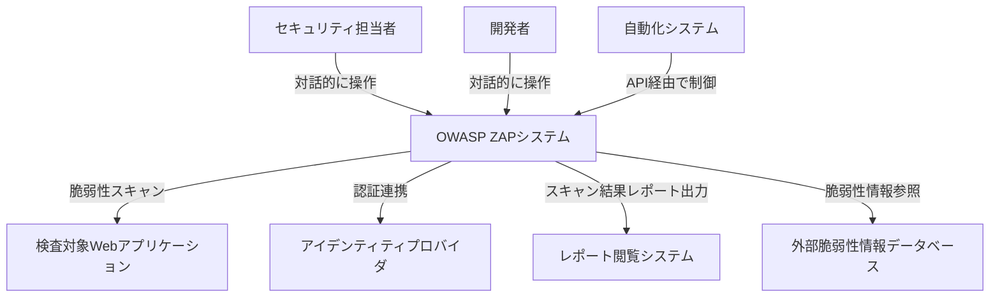
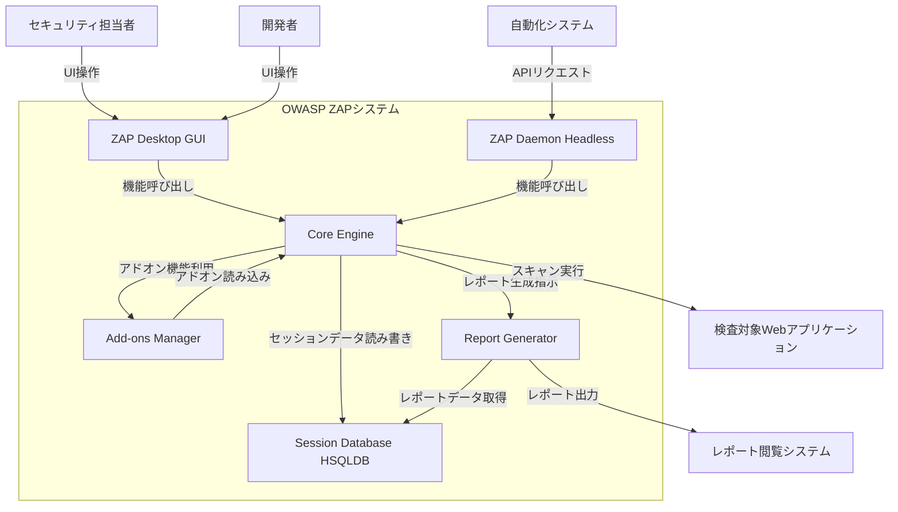
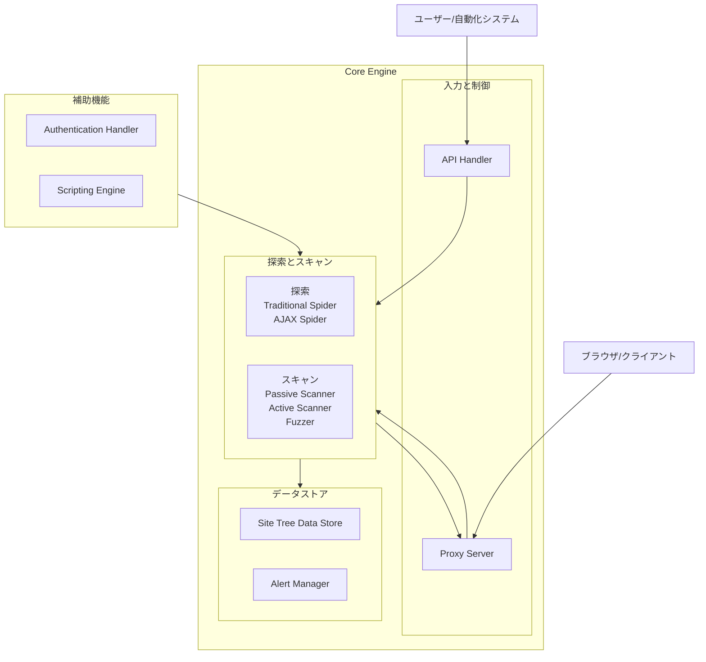
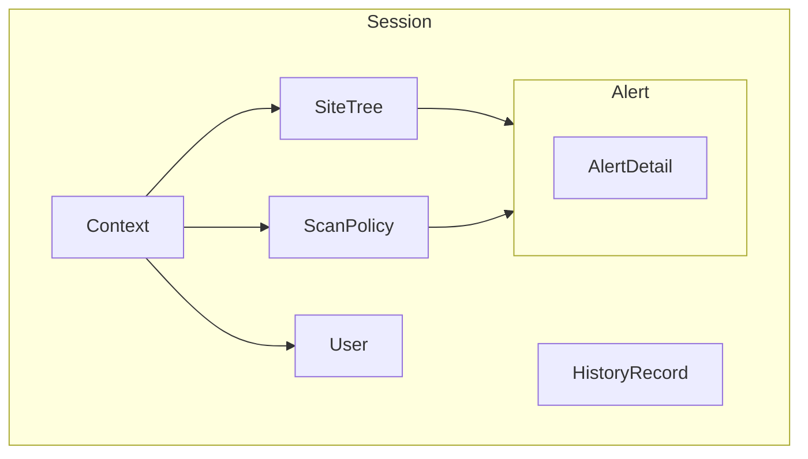

OWASP ZAP (Zed Attack Proxy) は、Open Web Application Security Project (OWASP) が開発する、オープンソースのWebアプリケーション脆弱性診断ツールです。

## ■概要

ZAPは、Webアプリケーションの開発やテスト段階でセキュリティ上の脆弱性を自動的に発見します。また、経験豊富なペネトレーションテスターが手動で詳細なセキュリティテストを実施する際にも利用できます。

ZAPの基本的な動作は、「中間者プロキシ」として機能することです。テスターのブラウザと検査対象Webアプリケーションの間にZAPが介在し、送受信される全てのHTTP/HTTPSメッセージを傍受・検査します。必要に応じてメッセージを改変し、宛先に転送します。このプロキシ機能により、通信を詳細に分析し、意図的な不正リクエストを送信して脆弱性を検出します。

ZAPは、専門知識が少ない開発者でも基本的なセキュリティテストを実施できます。これにより、開発の初期段階からセキュリティを意識し、アプリケーション全体のセキュリティレベルを向上させます。


## ■主な特徴

ZAPは、初心者から専門家までをサポートする多彩な機能を備えています。主要な特徴を以下の表にまとめました。

| カテゴリ | 特徴 | 説明 |
| :--- | :--- | :--- |
| **基本機能** | **プロキシベーススキャン**<br>(Proxy-Based Scanning) | ブラウザとWebアプリ間の通信を中継し、リアルタイムでトラフィックを分析・記録します。手動探索の基本となります。 |
| | **パッシブスキャン**<br>(Passive Scanning) | プロキシを通過するトラフィックを**変更せずに**監視・分析します。サーバーに負荷をかけず、安全に情報収集や基本的な脆弱性（例: 不足しているセキュリティヘッダー）を発見します。 |
| | **スパイダー機能**<br>(Spidering) | Webサイトを自動的にクロールし、サイト構造をマッピングします。静的なリンクをたどる`Traditional Spider`と、JavaScriptで動的に生成されるコンテンツに対応する`AJAX Spider`を備えています。 |
| | **認証サポート**<br>(Authentication Support) | フォーム認証、HTTP認証、JSONベース認証など多様な認証メカニズムに対応し、ログイン後の画面も診断可能です。 |
| **高度なテスト機能** | **アクティブスキャン**<br>(Active Scanning) | 検査対象に対し、既知の攻撃パターンに基づいたリクエストを**能動的に送信**し、脆弱性（例: SQLインジェクション、XSS）を探索します。 |
| | **手動ペネトレーションテスト**<br>(Manual Penetration Testing) | リクエストを書き換えて送信できる`HTTPリクエストエディタ`や、大量のペイロードを試す`ファジング機能 (Fuzzing)`など、専門家向けのツール群を提供します。 |
| | **WebSocketスキャン**<br>(WebSocket Scanning) | リアルタイム双方向通信で利用されるWebSocketのトラフィックを監視し、脆弱性を特定します。 |
| | **APIテスト**<br>(API Testing) | RESTful, SOAP, GraphQLなど、様々な形式のAPIに対するセキュリティテストをサポートします。OpenAPI/Swagger定義ファイルのインポートも可能です。 |
| **連携と拡張性** | **CI/CDパイプライン連携**<br>(Integration with CI/CD Pipelines) | Jenkins, GitHub Actions, GitLab CIなどに組み込み、開発プロセスの一部としてセキュリティテストを自動化できます。 |
| | **拡張性**<br>(Extensibility) | `ZAP Marketplace`から豊富なアドオンを導入し、機能のカスタマイズや新しい検査ロジックの追加が可能です。 |
| | **レポート生成**<br>(Report Generation) | 診断結果をまとめた詳細なレポートをHTML, XML, JSON形式で出力します。脆弱性の内容、深刻度、修正手順などが記載されます。 |

## ■構造

OWASP ZAPのシステム構造をC4モデルに沿って段階的に説明します。

### ●システムコンテキスト図

システムコンテキスト図は、OWASP ZAPシステム（以下、ZAPシステム）と外部環境との相互作用を示します。

ZAPシステムは、様々なアクターや外部システムと連携して機能します。セキュリティ担当者や開発者は対話的にZAPを操作し、自動化システムはAPI経由で制御します。この連携により、開発の早い段階で継続的にセキュリティテストを実施できます。



| 要素名 | 説明 |
| :--- | :--- |
| セキュリティ担当者 | OWASP ZAPを利用して、Webアプリケーションに対する詳細な脆弱性診断や手動ペネトレーションテストを実施する専門家や担当者 |
| 開発者 | 開発中のWebアプリケーションのセキュリティ品質を確保するために、OWASP ZAPを利用して脆弱性検査を行うソフトウェア開発者 |
| 自動化システム | CI/CDパイプラインなど、OWASP ZAPのAPIを利用してスキャンプロセスを自動実行し、開発ワークフローにセキュリティテストを組み込むシステム |
| OWASP ZAPシステム | 本レポートの主題である、Webアプリケーションの脆弱性を診断するためのシステム |
| 検査対象Webアプリケーション | OWASP ZAPによって脆弱性診断の対象となるWebアプリケーションまたはWeb API |
| アイデンティティプロバイダ | 検査対象Webアプリケーションが認証機能を外部のID管理システムに委任している場合、その認証処理を担うシステム |
| レポート閲覧システム | OWASP ZAPが出力した脆弱性診断結果のレポートを閲覧、管理、または他のシステムに連携するための中間システムやプラットフォーム |
| 外部脆弱性情報データベース | アドオンなどを通じて、OWASP ZAPがスキャンルールや脆弱性情報の拡充のために参照する可能性のある、外部の脆弱性情報リポジトリやフィード |


### ●コンテナ図

コンテナ図は、「OWASP ZAPシステム」の内部を構成する主要な論理的実行単位（コンテナ）とその相互作用を示します。

ZAPシステムは、ユーザーの操作形態に応じて「ZAP Desktop GUI」または「ZAP Daemon」のいずれかをエントリーポイントとします。実際の診断処理は「Core Engine」が中心となり、「Add-ons Manager」で機能を拡張し、「Session Database」にデータを保存します。最終的な結果は「Report Generator」が出力します。この構成により、対話的な利用と自動化された利用の両方に対応できます。



| 要素名 | 説明 |
| :--- | :--- |
| ZAP Desktop GUI | グラフィカルユーザーインターフェースを提供し、ユーザーが対話的にZAPの各種機能を操作するためのコンテナです。設定、スキャン実行、結果確認などをGUI上で行います。 |
| ZAP Daemon (Headless) | ユーザーインターフェースを持たずにバックグラウンドで動作するコンテナです。主にAPIを介した自動化スキャンやCI/CDパイプラインへの組み込みに利用されます。 |
| Core Engine | プロキシ機能、スパイダー機能、アクティブ/パッシブスキャンエンジン、セッション管理など、ZAPの脆弱性診断における中核的なロジックを実装・実行するコンテナです。 |
| Add-ons Manager | ZAPの機能を拡張するためのアドオン（プラグイン）のインストール、アンインストール、更新、有効化/無効化などを管理するコンテナです。ZAP Marketplaceと連携します。 |
| Session Database (HSQLDB) | スキャンセッション中に収集された情報（サイトツリー、HTTP履歴、発見されたアラート、設定など）を永続的に保存するためのデータベースコンテナです。デフォルトではHSQLDBが使用されます。 |
| Report Generator | Core Engineによるスキャン結果やSession Databaseに保存された情報を基に、HTML、XML、JSONなどの形式で詳細な診断レポートを生成するコンテナです。 |


### ●コンポーネント図

コンポーネント図は、「Core Engine」コンテナの内部を構成する主要なコンポーネントとその連携を示します。Core EngineはZAPの心臓部であり、以下の図は主要な情報の流れに焦点を当ててコンポーネント間の連携を簡略化して表現したものです。Core Engineの動作を以下の3つの主要なステップで示しています。

1.  **入力**: ユーザーや自動化システムからの指示は`API Handler`に、Webトラフィックは`Proxy Server`に入力されます。
2.  **処理**: 入力された情報に基づき、「探索」コンポーネント群がサイト構造を解析し、「スキャン」コンポーネント群が脆弱性を検査します。この際、能動的なスキャンは`Proxy Server`を経由して実行されます。
3.  **出力/格納**: 処理の結果、発見されたサイト構造は`Site Tree Data Store`に、脆弱性は`Alert Manager`に格納されます。



| 役割 | コンポーネント名 | 説明 |
| :--- | :--- | :--- |
| **入力と聖書** | Proxy Server / API Handler | Webトラフィックや外部からの制御命令を受け付けるエントリーポイント。 |
| **探索とスキャン** | Spiders / Scanners | サイト構造を探索し、脆弱性を実際に検査する処理の中核。 |
| **データストア** | Site Tree / Alert Manager | 探索結果（サイトマップ）と発見した脆弱性（アラート）を管理・格納する。 |
| **補助機能** | Authentication Handler / Scripting Engine | 認証処理やスクリプトによるカスタマイズなど、スキャンを補助する機能群。 |

## ■データ

### ●概念モデル

ZAPが脆弱性診断を管理する上で中心となる情報エンティティと、それらの関連性を図示します。



| 要素名 | 説明 |
| :--- | :--- |
| Session | ZAPにおける一連の作業（スキャンセッション）全体を表す最上位の概念です。診断対象の設定、収集データ、脆弱性情報、操作履歴などを包括します。 |
| Context | 特定のWebアプリケーションやその一部をスキャン対象として定義する論理的な単位です。認証情報、スキャン範囲、対象技術、スキャンポリシーなどを設定します。 |
| SiteTree | スパイダー機能によって発見された、検査対象Webアプリケーションのサイト構造を階層的に表現したものです。 |
| Alert | 診断プロセスによって検出された、潜在的な脆弱性やセキュリティ上の問題点を示す情報です。リスクレベルや信頼度、説明などを含みます。 |
| AlertDetail | 個々のアラートに関する詳細情報（具体的なリクエスト/レスポンス、CWE番号、推奨される修正方法など）を保持します。 |
| ScanPolicy | スキャン実行時にどの脆弱性検査ルールを有効にするか、各ルールの検査強度、アラートを報告する閾値などを定義したものです。 |
| User | Contextに紐づくユーザー情報です。ZAPが代理でログインするための認証情報を管理します。 |
| HistoryRecord | ZAPのプロキシを通過した全てのHTTPリクエストとレスポンスの履歴です。手動での詳細分析や再送テストに利用します。 |

このモデルの中心は`Context`です。これは「どの範囲を(Scope)」「どのユーザーとして(User)」「どの強度で(ScanPolicy)」スキャンするかを定義する論理的な塊です。スキャン結果として`SiteTree`内の`SiteNode`（URL）に`Alert`（脆弱性）が紐づけられ、`Session`全体として保存されます。この構造化されたデータ管理が、再現性のある診断と結果分析を可能にしています。

## ■構築方法

OWASP ZAPを導入する方法は多岐にわたります。利用目的や環境に応じて最適な方法を選択します。

### ●インストーラーを使用したインストール

最も一般的な方法です。各OS向けのインストーラーが公式サイトから提供されています。

  * **入手先**: [OWASP ZAP公式サイトのダウンロードページ](https://www.zaproxy.org/download/)
  * **手順**:
    1.  使用しているOSに対応したインストーラー（Windowsは`.exe`, macOSは`.dmg`など）をダウンロードします。
    2.  インストーラーを起動し、ウィザードに従ってインストールを進めます。
    3.  ライセンス契約に同意し、インストールタイプ（通常は「標準」）を選択して完了します。

### ●パッケージマネージャーを使用したインストール

各OSのパッケージ管理システムを通じて簡単にインストール・アップデートできます。

  * **Flathub (Linux)**: `flatpak install flathub org.zaproxy.ZAP`
  * **Snapcraft (Linux)**: `snap install zaproxy --classic`
  * **Winget (Windows)**: `winget install --id=ZAP.ZAP -e`
  * **Homebrew Cask (macOS)**: `brew install --cask zap`
  * **Scoop (Windows)**: `scoop install zaproxy`
  * **Chocolatey (Windows)**: `choco install zap`
  * **Kali Linux**: `sudo apt install zaproxy`

### ●クロスプラットフォームパッケージ (Zip/Tar.gz)

Java実行環境が既にインストールされているユーザー向けのパッケージです。

  * **要件**: Java 17以上
  * **手順**:
    1.  公式サイトからZipまたはTar.gz形式のアーカイブファイルをダウンロードします。
    2.  任意のディレクトリに展開します。
    3.  展開後のフォルダ内にある起動スクリプト（`zap.sh`または`zap.bat`）を実行してZAPを起動します。

### ●Dockerイメージの使用

環境構築の手間を削減し、動作の一貫性を保ちます。CI/CDパイプラインでの利用に適しています。

  * **公式イメージ**: Docker Hubで`zaproxy/zap-stable`などが提供されています。
  * **イメージ取得**:
    ```bash
    docker pull zaproxy/zap-stable:latest
    ```
  * **実行方法**: `docker run`コマンドでZAPコンテナを起動します。オプションにより、GUIモード、デーモンモード、特定のスキャン実行が可能です。
      * **デーモンモードでの起動例**:
        ```bash
        docker run -u zap -p 8080:8080 -i zaproxy/zap-stable zap.sh -daemon -port 8080 -host 0.0.0.0
        ```
      * **フルスキャン実行例**:
        ```bash
        docker run --rm -v $(pwd):/zap/wrk/:rw -t zaproxy/zap-stable zap-full-scan.py -t <target_url> -r report.html
        ```

## ■利用方法

ZAPの基本的な使い方をステップ・バイ・ステップで解説します。

1.  **起動とプロキシ設定**

      * ZAPを起動すると、ローカルプロキシ（デフォルト: `localhost:8080`）が立ち上がります。
      * **最も簡単な方法は、ZAPの「Launch Browser」機能を使うこと**です。これにより、プロキシ設定とZAPのルートCA証明書が自動で設定されたブラウザが起動します。
      * 手動で設定する場合、ブラウザのプロキシ設定をZAPに向け、HTTPSサイトをスキャンするためにZAPのルートCA証明書をブラウザにインポートする必要があります。
      * 

2.  **モードの選択**

      * ツールバーで操作の安全性を制御するモードを選択します。**通常は「Protectedモード」を推奨**します。これにより、意図しないサイトへの攻撃を防ぎつつ、定義したスコープ（Context）内でのスキャンが可能になります。

3.  **手動探索 (Manual Explore)**

      * プロキシ設定済みのブラウザで、診断対象のWebアプリケーションをひと通り操作します。ログイン、投稿、検索など、全ての機能を触ってみましょう。
      * 操作中の通信はすべてZAPの「History」タブに記録され、「Sites」タブにサイトの階層構造が自動で構築されます。この段階でパッシブスキャンが実行され、基本的な問題点が発見されることもあります。

4.  **自動スキャン (Automated Scan)**

      * 「Quick Start」タブの「Automated Scan」に診断したいURLを入力し、「Attack」をクリックします。
      * これにより、**AJAXスパイダーによるクロール**と**アクティブスキャン**が連続して実行され、包括的な脆弱性診断が自動で行われます。

5.  **結果の確認とレポート出力**

      * 発見された脆弱性は「Alerts」タブにリスクレベル（高・中・低・参考）ごとに一覧表示されます。
      * アラートを選択すると、詳細な説明、脆弱性が存在するリクエスト/レスポンス、そして具体的な修正方法の提案が確認できます。
      * メニューの「Report」から、診断結果全体をHTMLなどの形式でエクスポートできます。
      * 

## ■運用 (DevSecOpsへの統合)

ZAPを組織で効果的に活用するには、一回限りのスキャンではなく、継続的な運用プロセスに組み込むことが重要です。

  * **CI/CDへの統合**

      * 開発ワークフローにZAPスキャンを組み込み、コードのコミットやプルリクエストをトリガーに自動で実行します。これにより、脆弱性の早期発見と修正が可能になります。
      * DockerコンテナでZAPを実行し、API経由でスキャンを制御するのが一般的です。

  * **定期的なアップデート**

      * ZAP本体とアドオンは頻繁に更新されます。新しい脆弱性検査ルールや機能改善の恩恵を受けるため、定期的にアップデートしましょう。

  * **スキャンポリシーの最適化**

      * 対象アプリケーションの特性に合わせてスキャンポリシーを調整します。例えば、静的サイトに対しては不要なスキャン項目を無効にし、スキャン時間を短縮します。
      * 誤検知が多いルールは閾値を調整するか、一時的に無効にします。このカスタムポリシーを保存し、チームで共有・管理します。

  * **誤検知(False Positive)の管理**

      * 誤検知と判断したアラートは、`Alert Filter`機能を使って恒久的に無視するように設定します。これにより、ノイズを減らし、本当に重要な脆弱性に集中できます。

  * **結果のトリアージとフィードバック**

      * 検出された脆弱性を深刻度や影響範囲で評価し、修正の優先順位を決定（トリアージ）します。
      * Jiraなどのチケット管理システムと連携し、開発チームへ修正依頼を自動起票する仕組みを構築すると、修正プロセスが円滑に進みます。

## ■おわりに

本記事では、OWASP ZAPの概要から具体的な利用方法、さらには内部構造や継続的な運用方法までを深く掘り下げて解説しました。

ZAPは単なるツールではなく、**DevSecOpsを実現するための強力なプラットフォーム**です。最初は手動でのスキャンから始め、慣れてきたらCI/CDへの統合に挑戦することで、開発プロセス全体のセキュリティレベルを飛躍的に向上させることができます。

この記事が、あなたの組織のアプリケーションセキュリティを強化するための一助となれば幸いです。

## ■参考リンク
- 公式サイト
  - [OWASP ZAP Official Website](https://www.zaproxy.org/)
  - [Documentation](https://www.zaproxy.org/docs/)
  - [Download](https://www.zaproxy.org/download/)
  - [Creating OWASP ZAP Extensions and Add-Ons: Johanna Curiel | PDF - Scribd](https://top10proactive.owasp.org/the-top-10/)
- APIドキュメント
  - [OWASP ZAP API - PublicAPI](https://publicapi.dev/owasp-zap-api)
- コミュニティフォーラム
  - [Zap Scan from a Github Workflow - Google Groups](https://groups.google.com/g/zaproxy-users/c/IPTnFhWpL6c)
-  GitHub
   - [owasp-zap - GitHub](https://github.com/owasp-zap)
   - [Home · zaproxy/zaproxy Wiki · GitHub](https://github.com/zaproxy/zaproxy/wiki)
   - [GSoC2012_WebSockets · zaproxy/zaproxy Wiki - GitHub](https://github.com/zaproxy/zaproxy/wiki/GSoC2012_WebSockets)
- DeepWiki
  - [zaproxy/zaproxy - DeepWiki](https://deepwiki.com/zaproxy/zaproxy/)
  - [OWASP ZAP - DeepWiki](https://deepwiki.com/owasp-zap/)
- ブログ/チュートリアル
  - [What is OWASP ZAP? | Tutorials - Armur AI](https://armur.ai/tutorials/owasp-zap/owasp-zap/introduction_to_zap/)
  - [OWASP ZAP with Github Actions | Welcome to Nishanth's Blog](https://blog.nishanthkp.com/docs/devsecops/dast/owasp-zap/zap-github)
  - [How to Install Kali Linux's OWASP ZAP - bodHOST](https://www.bodhost.com/kb/how-to-install-kali-linuxs-owasp-zap/)
  - [Best Practices for Effective Software Architecture Documentation - bool.dev](https://bool.dev/blog/detail/architecture-documentation-best-practice)
  - [Securing Your Web Applications (DAST): A Deep Dive into OWASP ZAP Scans with Docker](https://dev.to/hassan_aftab/securing-your-web-applications-dast-a-deep-dive-into-owasp-zap-scans-with-docker-m6i)
  - [OWASP ZAP: A Comprehensive Guide to Its Capabilities and Vulnerability Detection](https://securemyorg.com/owasp-zap-a-comprehensive-guide/)
  - [OWASP Zap: 8 Core Features (Pros & Cons) - Codiga](https://www.codiga.io/blog/owasp-zap/)
  - [OWASPとは？ZAP、TOP10、Testing Guide、ASVSなどを中心に解説 | ITコラム - アイティーエム](https://www.itmanage.co.jp/column/about-owasp/)
  - [6 Essential Steps to Using OWASP ZAP for Penetration Testing - Jit.io](https://www.jit.io/resources/owasp-zap/6-essential-steps-to-use-owasp-zap-for-penetration-testing)
  - [Introduction to ZAP, an Open Source Interception Proxy - Vaadata](https://www.vaadata.com/blog/introduction-to-zap-an-open-source-interception-proxy/)
- 動画
  - [The Best Way to Install and Configure OWASP ZAP 2.15 on Windows 11 - YouTube](https://www.youtube.com/watch?v=aBbt89E-CLc)
  - [OWASP ZAP Automation in CI/CD - YouTube](https://www.youtube.com/watch?v=tR93F-llbo8)


この記事が少しでも参考になった、あるいは改善点などがあれば、ぜひリアクションやコメント、SNSでのシェアをいただけると励みになります！
