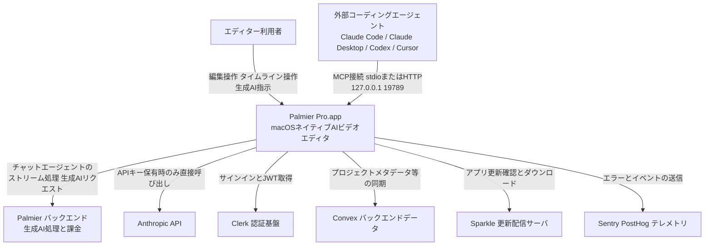
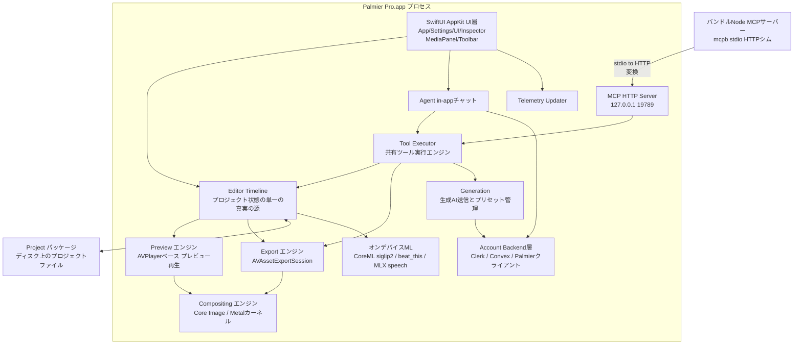
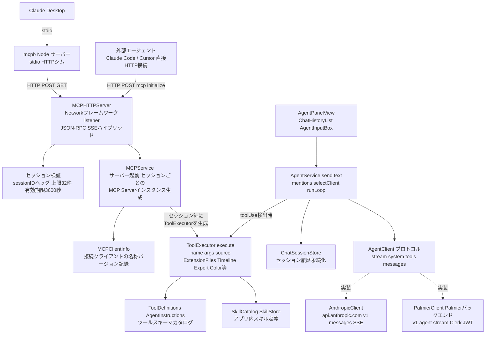
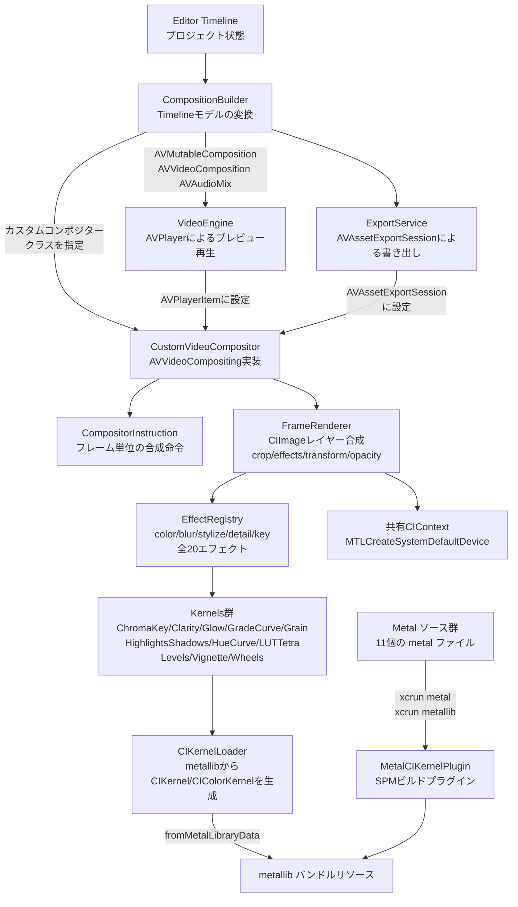
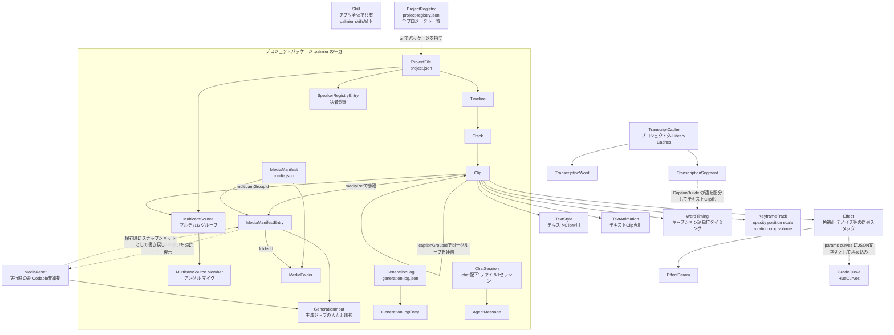
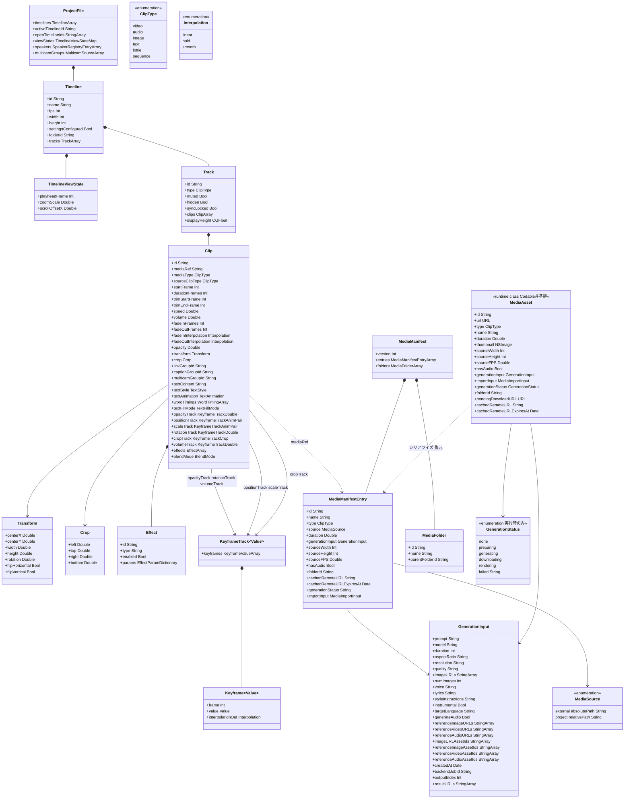

`palmier-io/palmier-pro` は、AI エージェントと人間が同じタイムライン上で協働することを前提に設計された、macOS ネイティブのビデオエディタです。Swift 6.2 でフルスクラッチ実装され、アプリ内に MCP サーバーを内蔵します。Claude Code や Cursor から `claude mcp add` するだけで、エージェントが 47 個の MCP ツールでタイムラインを直接編集できます。

本記事は、リポジトリの実装ソース・ビルドスクリプト・GitHub Issues を一次情報として、構造・データ・構築・利用・運用を整理します。

> **調査時点**: 2026-07-19 に調査しました。対象は `v0.6.12` (2026-07-19) 時点の `main` です。本文中のファイル数・ツール数・エフェクト数・Issue の状態はこの時点の値です。**ほぼ毎日リリースされるほど開発が活発なため、`main` の内容は随時変わります。**

記述はリポジトリの実装と突き合わせて検証しました(確認しきれなかった点は本文でその旨を明記します)。その過程で、**ドキュメントをそのまま信じると誤る箇所**が複数見つかりました。採用判断に直結するものを先に挙げます。

- **`AGENTS.md` の規約は「あるべき姿」であって実装の説明ではありません。** 例えば「ライブのプロジェクトパッケージ外で staging し、原子的にインストールせよ」と規定されていますが、実際の保存処理はファイル単位の `.atomic` 書き込みで、パッケージ全体のトランザクション保証やロールバックは実装されていません。
- **`.palmier` パッケージをコピーしても、それだけでは移行が完結しません。** メディア参照には「パッケージ内へのコピー」と「外部絶対パス参照」の 2 モードがあり、後者は別途コピーと再リンクが必要です。
- **テレメトリのホワイトリストは PostHog 側にしか実装されていません。** Sentry 側は任意の `[String: Any]` を素通しするため、「生データは構造上送られない」とは言い切れません。
- **`scripts/release.sh` は冒頭コメントと実装が食い違います。** コメントは `$EDITOR` でリリースノートを編集すると書きますが、実装は `git log` から自動生成するだけです。
- **対応生成モデルの固定リストはリポジトリ内に存在しません。** モデルカタログは Convex の live subscription 由来で、実行時に `list_models` で取得するしかありません。

一方で、編集エンジンと Agent/MCP 基盤の設計は非常に丁寧です。**プレビューと書き出しが同一のレンダリングパイプラインを共有**し、**UI 操作とエージェント操作が同一の undo 履歴を共有**します。

## 概要


Palmier Pro は、Y Combinator (S24) 発のスタートアップ Palmier, Inc. が開発する macOS ネイティブのビデオエディタです。GitHub 上の説明は "macOS video editor built for AI" です。

対象ユーザーは、人間のクリエイターと AI エージェント (Claude / Cursor / Codex) が同じタイムライン上で協働して動画を作る人です。生成 AI で動画広告やプロダクトローンチ動画を反復生成・編集するチームを特に想定します。

解決する課題は、開発元自身が YC 企業向け AI ローンチ動画制作で直面した 2 つの痛みです(FAQ.md)。

| 課題 | 内容 |
|---|---|
| ワークフロー分断 | 生成 AI プラットフォームは Web 上にあり、「Web で生成 → ローカルに DL → タイムラインへインポート → 差し替え編集」という反復作業が分断していました |
| コンテキスト分散 | プロジェクトが大きくなるとバージョン管理が破綻し、スクリプティング用の Claude と生成用の各種 AI チャットとでコンテキストが分散していました |

Palmier Pro は「動画エディタを唯一の正本 (single source of truth) にし、AI エージェントがスクリプティング・生成・編集を同じコンテキストで行える」ようにして、この課題を解決します。

README は位置づけを「北極星は Premiere Pro。そこに我々独自の AI 統合を掛け合わせる」("The north star is Premiere Pro, with our take on integrating AI into the workflow.") と明言します。CapCut / Adobe Premiere に伍する汎用エディタを目指しつつ、AI をプラグインでなくエディタのコアに統合する点で差別化しています。

FAQ.md によると、Transitions・Masking・Graphics など Premiere/CapCut にある基本機能はまだ未実装です。開発元自身も「AI 機能を除けばかなり素のエディタ (bare-bone)」と認めています。2 人体制の小規模チームによる早期プロダクトです。

| 項目 | 内容 |
|---|---|
| ライセンス | GPLv3。エディタ本体(生成 AI 処理を除く)・MCP サーバー・アプリ内エージェントチャットは OSS。生成 AI の処理部分のみクローズドソース(README FAQ「Is Palmier Pro fully open source?」) |
| 対応環境 | macOS 26 (Tahoe) 以降、Apple Silicon のみ(README / FAQ.md)。non-sandboxed の Developer ID app(AGENTS.md) |
| 料金モデル | エディタ本体・MCP サーバーは無料・ログイン不要。生成 AI 機能(画像・動画生成)はログイン + サブスクリプションが必要。アプリ内チャットは BYOK かサブスクリプションが必要で、対応モデルは現状 Anthropic のみ(MCP 経由なら他モデルも利用可能) |
| 実績 | 2026-04-07 リポジトリ作成、★10,793 / Fork 810(取得時点)。最新リリースは v0.6.12 (2026-07-19)。直近リリース(v0.6.8〜v0.6.12)は 2026-07-14〜07-19 のほぼ毎日刻みで、開発ペースが非常に速い |

## 特徴

1. **タイムライン内蔵の生成 AI で複数の SOTA モデルを直接呼び出せる**
   Seedance(2.0)/Kling(V3)/Nano Banana Pro/GPT-image-2/Grok/Veo など複数の画像・動画生成モデルを、タイムライン内から直接呼び出して生成できます。
   根拠: README「Generate videos and images with SOTA models like Seedance, Kling, Nano Banana Pro inside the timeline editor」、FAQ.md「We support most SOTA generation models...Seedance2, Kling3, Grok, Veo, etc.」

2. **アプリ内に MCP サーバーを内蔵し、外部エージェントからタイムラインを直接操作できる**
   アプリ起動中は `http://127.0.0.1:19789/mcp` で HTTP の MCP サーバーが立ち上がり、`claude mcp add`/`codex mcp add`/Cursor の `mcp.json` から接続できます。Claude Desktop 向けには mcpb バンドルによるワンクリックインストールも提供します。
   根拠: README「MCP server」節。

3. **アプリ内チャットと MCP 外部チャットが同じプロンプト・ツールセットを共有する二経路構成**
   両者は同じプロンプトとツールを共有し、UX のみが異なります。アプリ内チャットは `@` でメディアを参照でき、コンテキストスイッチが少なく、コンテキストウィンドウも制御しやすい構成です。MCP 経由の外部チャット(Claude/Cursor/Codex)は、トークン課金の一元化、より成熟したチャットクライアント、Epidemic Sound MCP など他 MCP サーバーとの連携という利点を持ちます。
   根拠: FAQ.md「What's the difference between MCP server and the in-app chat?」

4. **エージェント向けツールは「フィルムメイカーの1アクション=1呼び出し」で設計**
   MCP ツールは API の形状でなく映像制作のドメイン概念でパラメータ化されており、複雑なワークフローはアプリ側がオーケストレーションします。エージェントに低レベル操作の連鎖を強いません。UI と同じ検証・変更・undo ロジックを再利用し、変更内容・安定 ID・no-op 状態・警告・実行可能なエラーを構造化レシートとして返します。
   根拠: AGENTS.md「Agent & MCP Integration」節。

5. **Swift 6.2 によるフルネイティブ実装(strict concurrency)**
   SwiftUI と AppKit のハイブリッド構成です。SwiftUI はビューを、AppKit はネイティブ Mac 挙動を担います(例: 親領域のドラッグ&ドロップは `NSDraggingDestination` を使用。SwiftUI の `.onDrop` は macOS 26 で内側のドロップターゲットを覆ってしまう制約があるため)。メディア処理は AVFoundation の非同期プロパティロード API を中心に構成します。
   根拠: AGENTS.md「Tech Stack」「SwiftUI & UI Design」節、Package.swift(Swift tools version 6.2、macOS 26 以降)。

6. **プロジェクトファイルへの並行書き込みを直列化する専用コーディネータ**
   `.palmier` パッケージへの変更はすべて `ProjectPackageCoordinator` を経由し、保存・インポート・生成・書き出し・クローズ間の競合を防ぎます。保存中に発生した mutation はキューイングされ、保存成功時は適用、失敗時は破棄されます。
   根拠: `Project/ProjectPackageCoordinator.swift` の実装(`saveStarted` / `saveFinished(success:)` / `beginMutation` / `endMutation`)。
   注意: AGENTS.md の「ライブのプロジェクトパッケージ外で出力を staging し、宛先ボリューム上で置換を準備して原子的にインストールせよ」は、貢献者向けのコーディング規約(あるべき姿)であって `writeProjectPackage` の実装記述ではありません。**規約と実装を読み違えると、実際には無い耐障害性を前提にしてしまいます。**

7. **メインスレッドを「希少な UI リソース」として扱う厳格な並行性設計**
   AGENTS.md は「MainActor は UI 状態と軽量な調整のみを担当し、ファイル I/O・メディアデコード・モデル推論をメインアクター上で行ってはならない」「`async` であること自体はオフメイン実行の証明にならない」「`await` のたびに actor-isolated 状態を再検証せよ」と規定します。
   根拠: AGENTS.md「Concurrency Model」節。これは貢献者向けの規約(あるべき姿)であり、全コードが準拠していることの実測ではありません。実際にエージェント操作中の UI フリーズが Issue #58 / #107 として報告されています(詳細は[トラブルシューティング](#トラブルシューティング))。

8. **オプションでオンデバイス音声処理をバンドルできる(MLX)**
   `BundledSpeech` trait を有効にすると、`mlx-swift` / `swift-transformers` / `speech-swift` を使ったオンデバイスの音声モデルをアプリにバンドルできます。
   根拠: Package.swift の trait 定義、AGENTS.md「Tech Stack」節。

9. **自動更新・エラートラッキング・認証基盤を外部 SaaS 群で構成**
   Sparkle で自動アップデート、Sentry でエラートラッキング、PostHog でアナリティクス(`ProductionTelemetry` trait で有効化)、Clerk + Convex で認証とバックエンド同期を行います。
   根拠: Package.swift の依存関係一覧。

10. **OSS 範囲とクローズド範囲の境界がコードレベルで明確**
    エディタ本体・MCP サーバー・アプリ内エージェントチャットは GPLv3 で OSS 公開されている一方、生成 AI の実処理(モデル呼び出しと課金)のみがクローズドソースです。無料で使える部分と有料の部分がリポジトリ構成として分離されています。
    根拠: README FAQ「Is Palmier Pro fully open source?」。

11. **コントリビューション運用は Issue 起点、ビルド要件は明記**
    「大きな無許可 PR はレビューする余力がない」という方針を明示し、まず GitHub Issue での議論を推奨しています。ビルド要件は macOS 26+ / Xcode 16+ / Swift 6.2 toolchain です。
    根拠: CONTRIBUTING.md。

12. **ほぼ日次のリリースカデンス**
    リポジトリ作成から 3 ヶ月強で v0.6.12 に到達しています(GitHub Releases API 実測値)。

## 構造

Palmier Pro は **macOS ネイティブのデスクトップアプリ**です(`Palmier Pro.app`、Swift 6.2 / SwiftUI+AppKit / AVFoundation / Metal、`platforms: [.macOS(.v26)]`)。Web のクライアント/サーバー構成は取りません。単一の実行可能ファイルの中に UI・編集エンジン・レンダリングエンジン・エージェント基盤が同居します。そこから外部の生成 AI バックエンドや外部コーディングエージェントへ接続します。以下、C4 model の 3 段階(システムコンテキスト→コンテナ→コンポーネント)で記述します。

### システムコンテキスト図



| 要素 | 役割 | 実装上の所在 |
|---|---|---|
| エディター利用者 | アプリの操作者。動画編集・生成AI呼び出し・エクスポートを実行 | (アクター、実装なし) |
| 外部コーディングエージェント | Claude Code / Claude Desktop / Codex / Cursor 等。MCP クライアントとして Palmier Pro をツール群として利用 | (アクター、実装なし) |
| Palmier Pro.app | 本システム本体。macOS ネイティブアプリ | `Sources/PalmierPro/App/main.swift` |
| Palmier バックエンド | in-app チャットのストリーム処理(`v1/agent/stream`)・生成AI(画像/動画/音声)処理・クレジット課金を担う外部システム | `Sources/PalmierPro/Agent/Clients/PalmierClient.swift`, `Sources/PalmierPro/Backend/BackendConfig.swift` |
| Anthropic API | ユーザーが API キーを設定した場合のみ、アプリが直接 `https://api.anthropic.com/v1/messages` を SSE ストリーミング呼び出し | `Sources/PalmierPro/Agent/Clients/AnthropicClient.swift` |
| Clerk | サインイン/セッション管理。有効セッションから JWT を取得し、Palmier バックエンド呼び出しの `Authorization: Bearer` に使用 | `Sources/PalmierPro/Account/AccountService.swift`, `clerk-ios` 依存(`Package.swift`) |
| Convex | バックエンドデータストア。Clerk と統合(`clerk-convex`)し、リアルタイムデータ同期に使用 | `Package.swift`(`convex-swift` 依存) |
| Sparkle 更新サーバ | `SUFeedURL`(Info.plist)を通じたアプリ自動更新配信 | `Sources/PalmierPro/App/Updater.swift` |
| Sentry / PostHog | クラッシュ・エラー計測(Sentry)とプロダクト分析(PostHog)。`ProductionTelemetry` トレイトで有効化 | `Sources/PalmierPro/Telemetry/Telemetry.swift`, `Sources/PalmierPro/Telemetry/Analytics.swift` |

### コンテナ図

`.app` プロセス内部を実行単位で分解します。中心にあるのは Editor/Timeline が保持するプロジェクト状態です。Preview・Export・Agent はいずれもこの状態を読み書きする形で連携します(AGENTS.md の「単一の真実の源」原則)。



| コンテナ | 役割 | 実装上の所在 |
|---|---|---|
| SwiftUI AppKit UI層 | ウィンドウ・メニュー・各パネルの描画(設定/検査/メディア/ツールバー)。値取得は `AppTheme` 経由が規約 | `Sources/PalmierPro/App/`, `Settings/`, `UI/`, `Inspector/`, `MediaPanel/`, `Toolbar/` |
| Editor Timeline | プロジェクトのタイムライン・クリップ状態を保持する中核ドメインモデル。UI/Agent/Undo/永続化が同一操作を共有 | `Sources/PalmierPro/Editor/`, `Sources/PalmierPro/Timeline/`, `Sources/PalmierPro/Project/VideoProject.swift` |
| Compositing エンジン | Core Image + Metal カーネルによるフレーム合成。`CustomVideoCompositor`(AVVideoCompositing 実装)が起点 | `Sources/PalmierPro/Compositing/` |
| Preview エンジン | `AVPlayer` によるプレビュー再生とスクラブ音声。`CompositionBuilder` でタイムラインを `AVMutableComposition` 化 | `Sources/PalmierPro/Preview/VideoEngine.swift`, `Sources/PalmierPro/Preview/CompositionBuilder.swift` |
| Export エンジン | `AVAssetExportSession` ベースのエクスポート。Preview と同じ `CompositionBuilder`/`CustomVideoCompositor` を共有し、プレビューと書き出し結果を一致 | `Sources/PalmierPro/Export/ExportService.swift`, `Sources/PalmierPro/Export/ExportQueue.swift` |
| Agent(in-app chat) | チャットパネル対話のストリーミング処理。`AnthropicClient`(直接)/`PalmierClient`(バックエンド経由)を選択呼び出し | `Sources/PalmierPro/Agent/AgentService.swift`, `Sources/PalmierPro/Agent/Clients/` |
| Tool Executor | MCP サーバーと in-app エージェントの双方から呼び出される共有ツール実行エンジン。Timeline/Export/Color 等の拡張ファイル群に分割 | `Sources/PalmierPro/Agent/Tools/ToolExecutor.swift` ほか `ToolExecutor+*.swift` |
| MCP HTTP Server | `127.0.0.1:19789` にバインドしローカルのみで待受。JSON-RPC+SSE ハイブリッドの MCP プロトコルを実装 | `Sources/PalmierPro/Agent/MCP/MCPHTTPServer.swift`, `Sources/PalmierPro/Agent/MCP/MCPService.swift` |
| オンデバイス ML | CoreML(siglip2 による視覚検索埋め込み、beat_this によるビート検出)と MLX(音声認識/強化)をアプリ内で実行 | `Sources/PalmierPro/Search/Models/`, `Sources/PalmierPro/Audio/Beats/`, `Sources/PalmierPro/Transcription/`(`speech-swift`/`mlx-swift` 依存) |
| Generation | 画像/動画/音声の生成AIリクエスト組み立てとモデルカタログ管理。Palmierバックエンドへ送信 | `Sources/PalmierPro/Generation/GenerationService.swift`, `Generation/Catalog/`, `Generation/Submission/` |
| Account Backend層 | Clerk 認証、Convex 同期、Palmier バックエンド接続設定の集約 | `Sources/PalmierPro/Account/`, `Sources/PalmierPro/Backend/` |
| Telemetry / Updater | Sentry/PostHog 送信と Sparkle 自動更新 | `Sources/PalmierPro/Telemetry/`, `Sources/PalmierPro/App/Updater.swift` |
| Project パッケージ(ディスク) | プロジェクトファイルの永続化。全ファイル I/O はメインスレッド外かつ `ProjectPackageCoordinator` 経由という規約 | `Sources/PalmierPro/Project/ProjectPackageCoordinator.swift` |
| バンドル Node MCP サーバー(mcpb) | Claude Desktop 向けの stdio↔HTTP 変換シム。外部依存なしの Node 組込み API のみで `127.0.0.1:19789/mcp` にプロキシ | `mcpb/server/index.js`, `mcpb/manifest.json` |

### コンポーネント図

特に重要な 2 サブシステム、**Agent/MCP** と **Compositing/レンダリングパイプライン** をドリルダウンします。

#### Agent / MCP サブシステム



| コンポーネント | 役割 | 実装上の所在 |
|---|---|---|
| MCPHTTPServer | `127.0.0.1` のみで待受。POST `/mcp` の `initialize` でセッション発行、GET で SSE 配信するハイブリッド実装。`/.well-known/oauth-protected-resource` も提供 | `Sources/PalmierPro/Agent/MCP/MCPHTTPServer.swift` |
| セッション検証 | `sessionID` ヘッダで既存セッションを識別。上限 32、有効期限 3600 秒。未知/期限切れは 404 で拒否、再初期化を要求 | `MCPHTTPServer.swift` 内 `SessionValidator` |
| MCPService | `MCPHTTPServer` をポート 19789 で起動。接続ごとに `Server(name: "palmier-pro")` と `ToolExecutor` を生成、`Resource(name: "Video Models")` 等も登録 | `Sources/PalmierPro/Agent/MCP/MCPService.swift` |
| MCPClientInfo | 接続してきた MCP クライアント(名前/バージョン/説明/URL)を保持する値型。`ToolExecutor` に委譲され分析ペイロードにも使用 | `Sources/PalmierPro/Agent/MCP/MCPClientInfo.swift` |
| ToolExecutor | MCP サーバーと in-app Agent が共有する単一のツール実行エンジン。`editor:` 初期化(in-app、単一エディタ)と `projectProvider:` 初期化(MCP、フロントモストのみ監視・書き込みガード)の 2 経路 | `Sources/PalmierPro/Agent/Tools/ToolExecutor.swift`, `ToolExecutor+Timeline.swift` ほか多数 |
| ToolDefinitions / AgentInstructions | MCP・in-app 双方に公開するツールスキーマと、エージェントへのシステム指示を定義 | `Sources/PalmierPro/Agent/Tools/ToolDefinitions.swift`, `AgentInstructions.swift` |
| SkillCatalog / SkillStore | アプリが持つスキル(定型タスク)定義。外部エージェント連携の設定 UI(`SkillExternalAgentMenu`)とも接続 | `Sources/PalmierPro/Agent/Skills/`, `Sources/PalmierPro/Settings/Skill/` |
| mcpb Node サーバー | Claude Desktop 用の stdio↔HTTP 変換シム。標準入力の行区切り MCP メッセージを `fetch()` で `MCPHTTPServer` へ POST、HTTP GET のストリームを標準出力へ書き戻し。外部 npm 依存なし | `mcpb/server/index.js`, `mcpb/manifest.json` |
| AgentService | in-app チャットの中核。メッセージ追加→ストリーム開始→クライアント選択→ツール実行の一連のループ(`runLoop`)を統括する `@Observable` クラス | `Sources/PalmierPro/Agent/AgentService.swift` |
| AgentClient プロトコル | `stream(system:tools:messages:) -> AsyncThrowingStream<AnthropicStreamEvent, Error>` を共通インターフェースとする、実装差し替え可能な設計 | `Sources/PalmierPro/Agent/Clients/AgentClientTypes.swift` |
| AnthropicClient | ユーザーが API キーを保持する場合に選択される実装。`https://api.anthropic.com/v1/messages` を `x-api-key` ヘッダ付き SSE ストリーミングで直接呼び出し | `Sources/PalmierPro/Agent/Clients/AnthropicClient.swift` |
| PalmierClient | API キー未設定かつサインイン済みの場合に選択される実装。Clerk セッションから JWT を取得し `Authorization: Bearer` で Palmier バックエンドの `v1/agent/stream` を呼び出し | `Sources/PalmierPro/Agent/Clients/PalmierClient.swift` |

#### Compositing / レンダリングパイプライン



| コンポーネント | 役割 | 実装上の所在 |
|---|---|---|
| CompositionBuilder | Timeline モデルを `AVMutableComposition`/`AVVideoComposition`/`AVAudioMix` に変換する静的ビルダー。トラック挿入・ネスト展開・音量エンベロープ・失敗ロードのキャッシュを担当 | `Sources/PalmierPro/Preview/CompositionBuilder.swift` |
| CustomVideoCompositor | `AVVideoCompositing` 実装クラス。`startRequest` のリクエストをユーザーインタラクティブ優先度のキューで非同期処理、GPU 対応 `CIContext` を共有保持 | `Sources/PalmierPro/Compositing/CustomVideoCompositor.swift` |
| CompositorInstruction | フレームごとの合成に必要なレイヤー・エフェクト情報を運ぶ命令オブジェクト | `Sources/PalmierPro/Compositing/CompositorInstruction.swift` |
| FrameRenderer | フレーム番号を算出し、黒背景から各レイヤーを `crop → effects → transform → opacity` の順でボトムアップ合成、最終的に `CIContext.render` で `CVPixelBuffer` へ出力 | `Sources/PalmierPro/Compositing/FrameRenderer.swift` |
| EffectRegistry | 5 カテゴリ計 **20 エフェクト**を `id`(`"color.exposure"` のような名前空間付き文字列)で引ける記述子として登録。内訳は Color 11(exposure / contrast / saturation / temperature / highlightsShadows / blacksWhites / vibrance / wheels / hueCurves / lut / curves)、Blur & Sharpen 4(gaussian / sharpen / noiseReduction / motion)、Stylize 3(grain / vignette / glow)、Detail 1(clarity)、Key 1(chroma) | `Sources/PalmierPro/Compositing/EffectRegistry.swift` |
| Kernels 群 | 各エフェクトに対応する Core Image kernel ラッパー。`*Kernel.swift` が 11 個あり `Metal/*.metal` の 11 シェーダと 1:1 対応。共通ローダー `CIKernelLoader.swift` を含めるとディレクトリ内は計 12 ファイル | `Sources/PalmierPro/Compositing/Kernels/ChromaKeyKernel.swift` ほか |
| CIKernelLoader | バンドルされた `.metallib` リソースを読み込み `CIKernel`/`CIColorKernel` を `fromMetalLibraryData` で生成するローダー(キャッシュなし) | `Sources/PalmierPro/Compositing/Kernels/CIKernelLoader.swift` |
| Metal ソース群 | Core Image kernel 用の Metal シェーダー本体(11 ファイル) | `Metal/ChromaKey.metal`, `Metal/Clarity.metal`, `Metal/Glow.metal`, `Metal/GradeCurves.metal`, `Metal/Grain.metal`, `Metal/HighlightsShadows.metal`, `Metal/HueCurves.metal`, `Metal/LUTTetra.metal`, `Metal/Levels.metal`, `Metal/Vignette.metal`, `Metal/Wheels.metal` |
| MetalCIKernelPlugin | Swift Package Manager の `BuildToolPlugin`。`xcrun metal -c -fcikernel` で `.air` に変換後 `xcrun metallib -cikernel` で `.metallib` を生成し、ビルド成果物としてバンドル | `Plugins/MetalCIKernelPlugin/MetalCIKernelPlugin.swift` |
| VideoEngine | プレビュー再生の起点。`AVPlayer`/`replaceCurrentItem` を通じて `CompositionBuilder` の出力を適用し、`CustomVideoCompositor` を介してプレビューをレンダリング | `Sources/PalmierPro/Preview/VideoEngine.swift` |
| ExportService | 書き出しの起点。`CompositionBuilder` の出力を `AVAssetExportSession` に設定し、Preview と同一のレンダリングパイプライン(`CustomVideoCompositor`)を通すことでプレビューと書き出し結果の一致を保証 | `Sources/PalmierPro/Export/ExportService.swift` |

### 補足: レンダリングパイプラインの一貫性設計

Preview(`VideoEngine`)と Export(`ExportService`)は、いずれも `CompositionBuilder` → `CustomVideoCompositor` → `FrameRenderer` → `EffectRegistry`/`Kernels` という同一のレンダリングパイプラインを共有します。これは AGENTS.md が定める「ドメインロジックは UI/Agent/Undo/永続化で同一の操作を共有する」原則の具体化です。プレビューで見た結果と書き出し結果が食い違わない設計です。

Agent/MCP サブシステムも同じ思想を持ちます。`ToolExecutor` を MCP サーバーと in-app エージェントの共通実行エンジンとします。`editor:`(in-app、単一プロジェクトに固定)と `projectProvider:`(MCP、フロントモストプロジェクトを動的監視かつ書き込みガード)という 2 種の初期化だけを使い分けます。これにより、外部コーディングエージェント経由の操作とユーザーの手動操作が同一の安全なパスを通ります。

## データ

Palmier Pro のデータは3層構成です。

- **プロジェクト固有データ**: タイムライン・メディア台帳・生成ログ・チャット履歴。`.palmier` パッケージ(ディレクトリバンドル)内に JSON で保存
- **トランスクリプトキャッシュ**: 音声認識結果。プロジェクトに紐付かず `~/Library/Caches` 配下にソースファイルのパス・更新日時・サイズをキーとしたグローバルキャッシュとして保存。プロジェクトを削除しても残る
- **共有設定領域**: スキル定義とプロジェクト一覧レジストリ。`~/.palmier/skills/`、`~/Documents/Palmier Pro/project-registry.json` にアプリ全体で共有

以下、概念モデル → 情報モデル(実装の実フィールド) → ディスク構造 → 永続化形式とメディア解決の順に記述します。

### 概念モデル



| 概念 | 意味 | 備考 |
|---|---|---|
| ProjectFile | プロジェクトのタイムライン群・話者登録・マルチカム定義を束ねるルート | `project.json` として保存。`viewStates` は `[String: TimelineViewState]?` で、JSON のオブジェクトキーが Timeline.id |
| Timeline | 1本の編集シーケンス(メイン/ネスト)。fps・解像度・トラック列を保持 | `Clip.sourceClipType == .sequence` の Clip が `mediaRef` で他 Timeline を参照、ネスト構造も可能 |
| Track | Timeline 内の1レーン。種別(video/audio/image/text/lottie/sequence)ごとに Clip を配置 | ミュート・非表示・同期ロックはトラック単位 |
| Clip | Track 上の1区間。メディア参照・トリム・変形・エフェクト・キーフレーム・(テキストClipは文字内容)を1構造体に集約 | 最も情報量の多い中心エンティティ。詳細は情報モデル参照 |
| MediaAsset | 開いているプロジェクトが保持するメディアの実行時モデル(サムネイル・生成中ステータス等) | `@Observable` class で Codable 非準拠。保存時は `MediaManifestEntry` に変換、読込時は `MediaManifestEntry` + 解決済み URL から再構成 |
| MediaManifest / MediaManifestEntry | プロジェクトが参照する全メディアの永続台帳 | `media.json`。実ファイルでなく参照(相対/絶対パス)と生成メタデータを保持 |
| MediaFolder | メディアパネル上のフォルダ階層 | `media.json` の `folders` に格納 |
| GenerationInput | 1件の生成AIジョブの入力パラメータと進行状況(バックエンドジョブID・結果URL等)を統合した構造体 | 「Generationジョブ」は本構造体 + `MediaAsset.generationStatus`(実行時のみの enum)の組で表現。独立したジョブテーブルは存在しない |
| GenerationLog / GenerationLogEntry | 生成ジョブの追記専用履歴ログ(コスト集計・Project Activity 表示用) | `generation-log.json`。`GenerationInput` とは別物。生成完了時に 1 エントリ追加し、保存時は JSON 全体を書き換える |
| MulticamSource / Member | 複数アングル・複数マイクを1グループとして同期させるマルチカム定義 | `ProjectFile.multicamGroups` に保存。`Clip.multicamGroupId` で紐付く個々の Clip とは別に、グループ自体の同期情報を保持 |
| SpeakerRegistryEntry | 声紋クラスタリングによる話者識別の登録簿 | id は UUID でなく連番の `Int`。`centroid` は声紋の特徴ベクトル |
| ChatSession / AgentMessage | in-app エージェントとの会話1本とそのメッセージ列 | 空メッセージのセッションは保存対象外。`chat/` 配下に1セッション1ファイル |
| Skill | `~/.palmier/skills/<id>/SKILL.md` として存在するプロジェクト外の共有スキル定義 | プロジェクトパッケージには非含有。id はフォルダ名 |
| ProjectRegistry / ProjectEntry | 「最近のプロジェクト」一覧を保持するアプリ全体のレジストリ | `project-registry.json`。プロジェクト本体とは独立したファイルで、URL の移動を追跡 |
| TranscriptCache | 音声認識結果(TranscriptionResult)のグローバルキャッシュ | プロジェクトと無関係にソースファイル実体(パス+更新日時+サイズ)をキーにキャッシュ。**プロジェクトの一部として永続化されない** |
| Caption(概念) | 独立した型は存在せず、`mediaType == .text` かつ `captionGroupId` を共有する複数の Clip として表現 | `CaptionBuilder` が `TranscriptionSegment`/`TranscriptionWord` を字幕チャンクに分割し、`WordTiming` 付きテキスト Clip 群を生成 |

### 情報モデル

実装の struct / enum のフィールドと型を、次の classDiagram に集約します。Swift の `?`(Optional)は記法上省略します。

図は**永続化の背骨にあたる中核 19 型**に絞りました。テキストスタイル・マルチカム・チャット履歴などの周辺型は、図の後の「実装上の非自明な癖」表で押さえるべき点だけを挙げます。全 50 型のフィールドを確認する場合は `Sources/PalmierPro/Models/` を直接参照してください。

以降の表は図の再掲ではなく、図だけでは読み取れない「実装上の非自明な癖」を補足します。



#### 実装上の非自明な癖

| 型 | 押さえるべき点 |
|---|---|
| `ProjectFile` | `decode()` はレガシー救済。デコード失敗/`timelines` 空なら裸の `Timeline` だった旧形式とみなし包み直す |
| `Timeline` | `fps`/`width`/`height`/`tracks` は必須、`id`/`name` 等は欠損耐性あり。`totalFrames` は保存されず `tracks` から算出 |
| `Track` | `displayHeight` 既定 50、デコード時 32〜200 へクランプ |
| `Clip` | キーフレーム系 nil = アニメーション無し。`positionTrack` は正規化座標、`volumeTrack` は dB 値を線形ゲインへ変換 |
| `Transform` | 正規化座標、既定は中心 0.5/サイズ 1。レガシー `x`/`y`(topLeft基準)からの移行デコードあり |
| `TextStyle` | `fontName` 既定 `"Helvetica-Bold"`。`isBold`/`isItalic` 欠損時は `CTFontSymbolicTraits` から推定 |
| `TextAnimation`/`WordTiming` | preset 11種。entrance系5(`none`〜`typewriter`)、per-word系6(`WordTiming` で語単位描画) |
| `Effect`/`EffectParam` | `type` 全値は実装未確認。`GradeCurve`/`HueCurves` は `string` に JSON 格納(次項) |
| `MulticamSource` | `Member.kind` は `angle`/`mic`/`both` |
| `SpeakerRegistryEntry` | `id` は連番 `Int`(他は UUID)。`color` 要素数は実装未確認 |
| `MediaManifestEntry` | `generationStatus` は文字列化保存。`.none`/`.preparing` は保存対象外 |
| `MediaAsset` | Codable 非準拠。`hasAudio` は新規生成時 `type==.video` で上書き、読込後に実トラック有無で確定 |
| `GenerationInput` | `backendJobId` があれば resume 可能。ジョブ状態は本型+`MediaAsset.generationStatus` の組合せで表現 |
| `GenerationLogEntry` | 追記専用の監査ログ。旧 `cost`(ドル)は `Int((dollars*100).rounded(.up))` で移行 |
| `ChatSession`/`AgentMessage` | 保存対象はメッセージ1件以上のみ。`role` は user/assistant/system |
| `ProjectEntry` | `url` は移動時 `updateURL(from:to:)` で追跡 |
| `Skill` | プロジェクト外、マシン全体・全プロジェクトで共有 |

#### `GradeCurve` / `HueCurves` の格納キー

`GradeCurve`(master/red/green/blue)と `HueCurves`(hueVsHue/hueVsSat/hueVsLum、いずれも `[CurvePoint]`)は Clip 直下のフィールドではなく、`Effect.params` の文字列パラメータに自身を JSON エンコードして格納されます。永続化スキーマ上は「Effect の一種」として現れます。**格納キー名は 2 つで異なるので注意が必要です**(`EffectRegistry.swift` の実装で確認)。

| 型 | エフェクト id | 格納キー | 実装箇所 |
|---|---|---|---|
| `GradeCurve` | `color.curves` | `params["curve"]`(**単数形**) | `EffectRegistry.swift:208` `p.string("curve")` |
| `HueCurves` | `color.hueCurves` | `params["curves"]`(**複数形**) | `EffectRegistry.swift:184` `p.string("curves")` |

`HueCurves` は `read(from:)` / `upsert(into:)` を型側に持ちますが、`GradeCurve` は持たず `EffectRegistry` のクロージャ内で直接読み書きされます。

### プロジェクトパッケージのディスク構造

拡張子 `.palmier`(`Project.fileExtension`)を持つ `NSDocument` パッケージ(UTI `io.palmier.project`)です。レイアウトは `VideoProject.swift` の `writeProjectPackage`/`readProjectPackage` と `Project` enum が定義します。

```
MyProject.palmier/            (ディレクトリバンドル)
├── project.json               ← ProjectFile (Timeline群・話者登録・マルチカム定義)
├── media.json                 ← MediaManifest (メディア参照台帳、無い場合はレガシー扱い)
├── generation-log.json        ← GenerationLog (生成コスト履歴、任意)
├── thumbnail.jpg              ← プロジェクト一覧用サムネイル (JPEG, 品質0.7, 長辺最大640px)
├── chat/                      ← ChatSessionStore.dirName
│   ├── <sessionUUID1>.json    ← ChatSession 1件 (メッセージが空のセッションは書き出されない)
│   └── <sessionUUID2>.json
└── media/                     ← Project.mediaDirectoryName (相対参照メディアの実体置き場)
    └── ...
```

| 定数 | 値 | 定義元 |
|---|---|---|
| `Project.fileExtension` | `"palmier"` | `Utilities/Constants.swift` |
| `Project.typeIdentifier` | `"io.palmier.project"` | 同上 |
| `Project.timelineFilename` | `"project.json"` | 同上 |
| `Project.manifestFilename` | `"media.json"` | 同上 |
| `Project.generationLogFilename` | `"generation-log.json"` | 同上 |
| `Project.thumbnailFilename` | `"thumbnail.jpg"` | 同上 |
| `Project.mediaDirectoryName` | `"media"` | 同上 |
| `ChatSessionStore.dirName` | `"chat"` | `Agent/ChatSessionStore.swift` |
| `Project.registryFilename` | `"project-registry.json"` | パッケージ外。`~/Documents/Palmier Pro/` 直下 |

読込は `project.json` が必須(無い/壊れていれば失敗)。`media.json` は任意で、デコード失敗時は空マニフェストで開きつつ**壊れた元ファイルは保存時も上書きしない**(`manifestLoadFailed` で保護)。`generation-log.json` も任意(無ければ空ログとし `seedGenerationLogFromAssets()` で再構築)。

書込は `chat/` を毎回削除して作り直す(全置換)。`media/`・`thumbnail.jpg`・`media.json` は別名保存時のみ元パッケージからコピー、通常保存ではコピーしない。`media/` は空でも必ず作成される。

### 永続化形式とメディア解決

- **すべて JSON**(plist ではない)。`ProjectFile`/`MediaManifest`/`GenerationLog` は既定の `.deferredToDate`(2001-01-01 基準の秒数 `Double`)で `Date` をエンコード。`ChatSessionStore` だけ `.iso8601` + `[.prettyPrinted, .sortedKeys]` を使い、**パッケージ内で日付形式が統一されていません**(`chat/*.json` は ISO8601 文字列、他は秒数の Double)。
- Codable の欠損耐性は一様ではありません。多くのフィールドは `try?` でフォールバックしますが、`Timeline` の `fps`/`width`/`height`/`tracks` 等コア構造は `try decode` で**必須**、欠損すればデコード失敗。「後発の任意フィールドは寛容、骨格は厳格」という設計です。
- **メディア参照の解決**は `MediaResolver` が担います。`MediaManifestEntry.source` は `.external(absolutePath:)`(そのままファイルURL化、他マシンに移すと壊れうる)と `.project(relativePath:)`(パッケージの `URL` に連結、可搬、典型は `media/xxx.mp4`)の2ケース。存在確認は `FileManager.default.fileExists` で都度実施し、無ければ「メディアオフライン」表示にフォールバック。`cachedRemoteURL` はファイルがまだ無い間の一時リモート再生用URLで、これとは独立した経路です。
- **キャプションは独立エンティティを持ちません**。`CaptionBuilder.phrases(...)` が音声認識結果を字幕チャンクに分割し、`mediaType == .text` の `Clip`(`captionGroupId` で連結、`wordTimings` に語単位タイミング)として生成します。永続化経路は通常のテキスト Clip と同一です。
- **音声認識結果自体はプロジェクトパッケージの一部ではありません**。`TranscriptCache` がプロジェクト外の `~/Library/Caches/<subsystem>/Transcripts/<sha256プレフィックス32文字>.json` にグローバルキャッシュします。キーはソースファイルの `パス|更新日時|サイズ`(バリアントは `言語|範囲` 追加)の SHA-256 で、プロジェクトID/メディアIDに依存しません。同じ動画を複数プロジェクトで使うとキャッシュが共有され、プロジェクト削除後もキャッシュは残ります。
- **ID体系**は原則 `UUID().uuidString`(36文字の文字列)。例外は `SpeakerRegistryEntry.id`(連番 `Int`)と `ChatSession.id`/`AgentMessage.id`/`ProjectEntry.id`(ネイティブ `UUID` 型)。`ToolExecutor+ShortId.swift` の短縮表示は表示上の変換のみで、永続化形式は常にフル UUID 文字列です。

## 構築方法

開発者が Palmier Pro をソースからビルド・配布する手順です。すべて実ファイル (`README.md` / `CONTRIBUTING.md` / `AGENTS.md` / `Package.swift` / `scripts/*.sh` / `.github/workflows/ci.yml` / `models/*/README.md`) の内容に基づきます。

### 前提環境

| 項目 | 要件 | 根拠 |
|---|---|---|
| OS | macOS 26 (Tahoe) 以降、**Apple Silicon (arm64) のみ** | `CONTRIBUTING.md`, `AGENTS.md`「macOS 26 only, arm64 only」 |
| Xcode | 16 以上 | `CONTRIBUTING.md` |
| Swift | 6.2 toolchain | `CONTRIBUTING.md`, `Package.swift` の `// swift-tools-version: 6.2` |
| 配布形態 | Non-sandboxed の Developer ID app | `AGENTS.md`「Non-sandboxed Developer ID app」、`scripts/PalmierPro.entitlements` に App Sandbox キーが無いことで確認 |

### クローン・ビルド・実行

`CONTRIBUTING.md` / `AGENTS.md` に記載の最小手順です。

```bash
git clone https://github.com/palmier-io/palmier-pro
cd palmier-pro

swift build
swift run
swift test
```

MLX・音声解析・文字起こし・バンドル音声リソースに触れる変更では、`BundledSpeech` trait を付けてビルドします(`AGENTS.md` 記載)。

```bash
swift build --traits BundledSpeech
```

デバッグ用 `.app` を OSLog ストリーミング付きで起動するときは `scripts/dev.sh` を使います(後述)。

### SwiftPM traits: `BundledSpeech` / `ProductionTelemetry`

`Package.swift` では 2 つの trait を定義しています。

```swift
traits: [
    .trait(name: "BundledSpeech", description: "Include on-device speech models and MLX."),
    .trait(name: "ProductionTelemetry", description: "Include Sentry and PostHog telemetry."),
],
```

| trait | 有効化コマンド | 効果 |
|---|---|---|
| `BundledSpeech` | `swift build --traits BundledSpeech` | `mlx-swift`(`MLX`)・`speech-swift`(`SpeechEnhancement` / `SpeechVAD`)を依存に追加し、オンデバイス音声モデル(VAD・話者識別など)をビルドに含める。`BUNDLED_SPEECH` フラグも定義 |
| `ProductionTelemetry` | `swift build --traits ProductionTelemetry` | `sentry-cocoa`(`Sentry`)・`posthog-ios`(`PostHog`)を依存に追加し、エラートラッキングとプロダクトアナリティクスを有効化。`PRODUCTION_TELEMETRY` フラグを定義 |

いずれも `.package(...)` の `.product(..., condition: .when(traits: [...]))` で条件付き依存です。trait なしの通常ビルドではリンクしません。`scripts/bundle.sh` はリリースビルド時に両方を有効化します。

### ビルドプラグイン `MetalCIKernelPlugin`

`Package.swift` で `.plugin(name: "MetalCIKernelPlugin", capability: .buildTool())` として宣言し、`PalmierPro` ターゲットの `plugins: ["MetalCIKernelPlugin"]` から呼びます。実体は `Plugins/MetalCIKernelPlugin/MetalCIKernelPlugin.swift` です。

```swift
/// Compiles Core Image Metal kernels (`Metal/*.metal`) into `.metallib` resources.
@main
struct MetalCIKernelPlugin: BuildToolPlugin {
    func createBuildCommands(context: PluginContext, target: Target) async throws -> [Command] {
        let metalDir = context.package.directoryURL.appending(path: "Metal")
        let names = (try? FileManager.default.contentsOfDirectory(atPath: metalDir.path()))?
            .filter { $0.hasSuffix(".metal") } ?? []

        return names.map { file in
            let stem = (file as NSString).deletingPathExtension
            let metal = metalDir.appending(path: file)
            let air = context.pluginWorkDirectoryURL.appending(path: "\(stem).air")
            let metallib = context.pluginWorkDirectoryURL.appending(path: "\(stem).metallib")
            return .buildCommand(
                displayName: "Compile CI kernel \(file)",
                executable: URL(filePath: "/bin/sh"),
                arguments: [
                    "-c",
                    "xcrun metal -c -fcikernel '\(metal.path())' -o '\(air.path())' && " +
                    "xcrun metallib -cikernel '\(air.path())' -o '\(metallib.path())'",
                ],
                inputFiles: [metal],
                outputFiles: [metallib])
        }
    }
}
```

`Metal/` 配下の `*.metal` を 1 個ずつ `xcrun metal -fcikernel` で `.air` にコンパイルし、`xcrun metallib -cikernel` で `.metallib` にリンクする、Core Image カスタムカーネル用のビルドツールプラグインです。ソース追加だけで SwiftPM ビルド時に自動コンパイルします。

### `scripts/dev.sh` — デバッグ起動 + OSLog ストリーミング

```bash
./scripts/dev.sh          # bundle.sh debug --fast → .app を起動 → OSLog をストリーム
./scripts/dev.sh --no-stream   # ストリームせずアプリだけ起動
```

内部では `scripts/bundle.sh debug --fast` を呼び、`.build/PalmierPro.app` を `open` したうえで `log stream --predicate 'subsystem == "io.palmier.pro"' --level info --style compact` を実行します。Ctrl-C でアプリも終了します(`trap cleanup INT TERM EXIT` で `osascript -e 'quit app "PalmierPro"'` を試み、失敗時は `kill`)。

### `scripts/bundle.sh` — `.app` 組み立て・署名・配布

```bash
scripts/bundle.sh [release|debug]       # ad-hoc 署名の開発用ビルド
scripts/bundle.sh debug --fast          # 最速: .app 組み立て + メインアプリのみ署名 (dSYM・deep sign を省略)
scripts/bundle.sh release --sign        # ビルド + Developer ID codesign
scripts/bundle.sh release --dist        # ビルド + 署名 + notarize + staple + DMG
```

主な処理フローです。

1. `CONFIG=release` のとき `.env.prod`(なければ `.env`)を読み込み、`SIGNING_IDENTITY` / `NOTARY_PROFILE` / `SENTRY_DSN` / `POSTHOG_PROJECT_TOKEN` / `PROVISION_PROFILE` 等を解決
2. `TRAITS="BundledSpeech"`、`release` の場合はさらに `,ProductionTelemetry` を付けて `swift build -c $CONFIG --traits $TRAITS`
3. `.build/PalmierPro.app` を組み立て: バイナリ・`Info.plist`・アイコン・Sparkle フレームワークをコピーし、`PlistBuddy` で `SentryDSN` / `PostHogProjectToken` / `PalmierClerkPublishableKey` / `PalmierConvexDeploymentURL` 等をランタイム設定として注入
4. SwiftPM のリソースバンドル(`PalmierPro_PalmierPro.bundle`)から `Fonts` / `Images` / `Localization`(`.lproj` はバンドルルートへ平坦化) / `Changelog` / `Models` / `*.metallib` をコピーします。**`Fonts` / `Localization` / `Changelog` / `Models` / `*.metallib` は欠落時に `!! missing ...` を出して即座に `exit 1` します。しかし `Images` だけは `if [ -d ... ]` のみで `else` 節を持たず、欠落しても警告なくスキップされます**(`scripts/bundle.sh` 実装で確認)
5. `mcpb/` ソース(`manifest.json` / `icon.png` / `server/index.js` / `server/package.json`)から zip を作り直し、リポジトリの `Sources/PalmierPro/Resources/MCPB/palmier-pro.mcpb` と差分があれば自動更新してアプリにコピー(Claude Desktop 用コネクタを常に最新に保つ仕組み)
6. `speech-swift` の `build_mlx_metallib.sh` で MLX 用 `mlx.metallib` を用意し `mlx-swift_Cmlx.bundle/default.metallib` として配置
7. `--fast` は **`$SIGNING_IDENTITY`(既定は Developer ID Application)でメイン `.app` のみを署名**して終了します(`codesign --force --sign "$SIGNING_IDENTITY"`。timestamp・ヘルパー署名・dSYM を省略)。**ad-hoc 署名 (`codesign --force --deep --sign -`) を使うのは `--fast` ではなく通常の `dev` モードのほう**です。`dev` モードは deep 署名 + dSYM 生成 + Sentry アップロードを行います。`--sign` 以降は Sparkle ヘルパー群・フレームワーク・埋め込みプロビジョニングプロファイル(`--dist`/`--sign` 時)を Developer ID で署名し、`--dist` はさらに notarize → staple → DMG 作成 → DMG 署名 → notarize → staple → Sparkle EdDSA 署名 (`sign_update`) まで一気通貫で行います。

### `scripts/release.sh` — リリースパイプライン

```bash
scripts/release.sh <version>     # 例: scripts/release.sh 0.7.0
```

プリフライトで `main` ブランチ・作業ツリークリーン・タグ未使用・`origin/main` との同期済みを確認したあと、次を自動実行します(コメント引用)。

```bash
# Full release pipeline:
#   1. Preflight (on main, tree clean, tag free, in sync with origin)
#   2. Bump CFBundleShortVersionString + auto-increment CFBundleVersion
#   3. Prompt for release notes in $EDITOR (prefilled with recent commits)
#   4. Run bundle.sh release --dist
#   5. Commit + push version bump
#   6. Tag + push tag
#   7. gh release create with the DMG and notes
#   8. Update appcast.xml + commit + push
```

**注意: 上記はスクリプト冒頭のコメントであり、ステップ 3 は実装と食い違っています。** コメントは "Prompt for release notes in `$EDITOR`" と書いていますが、実装 (`release.sh:67-80`) に `$EDITOR` の参照はありません。`git log --pretty=format:"- %s" "$LAST_TAG..HEAD"` から一時ファイルへリリースノートを**自動生成**し、`gh release create --notes-file` に渡すだけです(編集したい場合は後から GitHub 上で行います)。

`CFBundleVersion` は `appcast.xml` の最大 `sparkle:version` より大きいことを検証してから採番します(ロールバック検知)。ビルドログから `edSignature` と DMG の `length` を正規表現で抽出し、`appcast.xml` の `</channel>` 直前に新しい `<item>` を Python で挿入します。

### entitlements と配布形態

`scripts/PalmierPro.entitlements`:

```xml
<?xml version="1.0" encoding="UTF-8"?>
<!DOCTYPE plist PUBLIC "-//Apple//DTD PLIST 1.0//EN" "http://www.apple.com/DTDs/PropertyList-1.0.dtd">
<plist version="1.0">
<dict>
	<key>keychain-access-groups</key>
	<array>
		<string>MMFLRC7562.io.palmier.pro</string>
	</array>
	<key>com.apple.application-identifier</key>
	<string>MMFLRC7562.io.palmier.pro</string>
	<key>com.apple.developer.team-identifier</key>
	<string>MMFLRC7562</string>
</dict>
</plist>
```

`com.apple.security.app-sandbox` キーは存在しません。**App Sandbox 非適用**です。任意のファイルパスへの読み書きをサンドボックス制約なしに行える設計で、`AGENTS.md` の「Non-sandboxed Developer ID app」と整合します。keychain-access-group と `com.apple.developer.team-identifier` は Clerk 認証のキーチェーン共有(`scripts/bundle.sh` の `PalmierClerkKeychainAccessGroup` 注入)に使います。

### CI (`.github/workflows/ci.yml`)

```yaml
name: CI

on:
  push:
    branches: [main]
  pull_request:

concurrency:
  group: ci-${{ github.workflow }}-${{ github.ref }}
  cancel-in-progress: true

jobs:
  build-test:
    name: Build & Test
    # PalmierPro targets macOS 26 (Tahoe), arm64 only. Requires a macOS 26 runner image.
    runs-on: macos-26
    timeout-minutes: 40
    steps:
      - uses: actions/checkout@v4
      - name: Show toolchain
        run: swift --version
      - name: Cache SwiftPM
        uses: actions/cache@v4
        with:
          path: .build
          key: spm-${{ runner.os }}-${{ hashFiles('Package.resolved') }}
          restore-keys: spm-${{ runner.os }}-
      - name: Test
        run: swift test
```

`push (main)` と `pull_request` の両方で `macos-26` ランナー上の `swift test` を実行するだけです。trait ビルド(`BundledSpeech` / `ProductionTelemetry`)の CI 検証、コード署名・配布系のジョブはありません。`Package.resolved` のハッシュで `.build` を actions/cache し、ビルドを高速化しています。

### オンデバイスモデルの変換

Palmier Pro は 2 つの Core ML モデルをオンデバイス推論に使います。いずれも `uv` + Python で変換パイプラインを回します。

**SigLIP 2(意味検索・footage 検索)** — `models/siglip2/README.md`:

```bash
uv venv --python 3.12 .venv
uv pip install -p .venv/bin/python -r requirements.txt
.venv/bin/python convert.py --checkpoint checkpoint --out build-q8 --palettize-bits 8
```

- ベースモデルは Google の `siglip2-base-patch16-256`(Apache 2.0)。Core ML で実行
- 変換スクリプトは両エンコーダを `.mlpackage` にトレースし 8-bit に量子化。PyTorch 版との埋め込みコサイン類似度が 0.99 未満なら変換を中止する検証つき
- ビルド成果物(2 エンコーダ zip + tokenizer.zip + manifest.json)は `huggingface.co/palmier-io/siglip2-base-coreml` にホスト。**アプリ本体にはバンドルせず、初回利用時に実行時ダウンロード**。`SearchIndexConfig.swift` にピン留めした sha256 で検証

**Beat This(ビート検出)** — `models/beat_this/README.md`:

```bash
uv venv --python 3.12 .venv
uv pip install -p .venv/bin/python -r requirements.txt
.venv/bin/python convert.py --out build
```

- `CPJKU/beat_this` の `small0` チェックポイント(ISMIR 2024 論文、MIT License)。チェックポイントは `torch.hub` キャッシュ経由で自動ダウンロード
- 入力は生 PCM(661059 サンプル = 30 秒 @ 22050Hz mono)、出力はフレーム単位のビート/ダウンビートのロジット(1, 1500)、20ms/フレーム、FP16
- einops の実行時整数演算を coremltools が拒否するため、einops を素の tensor 演算へ書き換えたうえで `torch.jit` でトレースして変換。120 BPM のクリック音フィクスチャで「パッチ済み torch モデル vs 元の upstream パイプライン」「Core ML モデル vs パッチ済み torch モデル」の 2 段のビート一致検証(1フレーム許容)に通らないと変換を中止
- 変換結果 `build/BeatThis.mlmodelc`(6.6MB)を `Sources/PalmierPro/Resources/Models/` に配置し、ビルドに含める。こちらは **アプリにバンドル**(SigLIP 2 とは対照的に実行時ダウンロードなし)

### Sparkle による自動更新

`appcast.xml` は Sparkle 標準の RSS フィード形式(`xmlns:sparkle`)です。1 リリースにつき 1 `<item>` を追加します。

```xml
<item>
    <title>Version 0.1.4</title>
    <pubDate>Tue, 21 Apr 2026 23:44:59 -0700</pubDate>
    <sparkle:version>5</sparkle:version>
    <sparkle:shortVersionString>0.1.4</sparkle:shortVersionString>
    <sparkle:minimumSystemVersion>26.0</sparkle:minimumSystemVersion>
    <enclosure
        url="https://github.com/palmier-io/palmier-pro/releases/download/v0.1.4/PalmierPro.dmg"
        length="8983089"
        type="application/octet-stream"
        sparkle:edSignature="..."/>
</item>
```

`sparkle:version` は `Info.plist` の `CFBundleVersion`(ビルド番号、単調増加)、`sparkle:shortVersionString` はユーザー向けバージョン(セマンティックバージョン)です。`sparkle:edSignature` は `scripts/bundle.sh` が `sign_update`(Sparkle 付属 EdDSA 署名ツール)で DMG に署名した結果です。`appcast.xml` は GitHub raw 経由(`https://raw.githubusercontent.com/palmier-io/palmier-pro/main/appcast.xml`)で配信し、アプリはポーリングで更新を検知します。

## 利用方法

### インストール

- README トップの DMG リンク(`https://github.com/palmier-io/palmier-pro/releases/latest/download/PalmierPro.dmg`)からダウンロード。ログイン不要
- 要件: macOS 26 (Tahoe) 以降、Apple Silicon のみ
- エディタ本体(生成 AI を除く)は無料。生成 AI 機能(画像・動画生成)の利用にはログインとサブスクリプションが必要

### 基本のエディタ操作の流れ

標準ワークフローは `ToolDefinitions.swift` のツール説明文と `AgentInstructions.swift` の Session ガイドから読み取れます。

1. **import** — `import_media`(URL/パス/バイトから外部アセット取り込み。単色マット生成も含む)、または生成 AI で `generate_video` / `generate_image` / `generate_audio` を実行しメディアライブラリに追加
2. **timeline** — セッション開始時に `get_timeline` を一度呼び、プロジェクト設定・トラック・クリップを把握。以後は `add_clips`(上書き配置)/ `insert_clips`(リップル挿入)/ `move_clips` / `remove_clips` / `split_clips` などで編集。各ツールは差分(delta)を返すため再読込不要
3. **effects/color** — グレーディングは `apply_color`(露出・コントラスト・カラーホイール・カーブ・LUT をマージ適用)、ルック/FX は `apply_effect`(ブラー・シャープ・スタイライズ等)、確認は `inspect_color` / `inspect_timeline`
4. **export** — `export_project` で video(H.264/H.265/ProRes)/ xml(Premiere)/ fcpxml(Resolve・Final Cut)/ palmier(自己完結パッケージ)へキュー投入。進捗確認・キャンセルは `manage_exports`

すべての編集は undo 可能で、UI 操作とエージェント操作は同じ undo 履歴を共有します(`AGENTS.md`)。

### MCP 接続

アプリ起動中は `http://127.0.0.1:19789/mcp` に HTTP MCP サーバーが立ちます(`127.0.0.1` ループバックのみにバインド)。

**Claude Code**

```bash
claude mcp add --transport http palmier-pro http://127.0.0.1:19789/mcp
```

**Codex**

```bash
codex mcp add palmier-pro --url http://127.0.0.1:19789/mcp
```

**Cursor**

アプリ内の `Help` → `MCP Instructions` → `Install in Cursor` が最も簡単です。手動なら `~/.cursor/mcp.json` に追記します。

```json
{
  "mcpServers": {
    "palmier-pro": {
      "type": "http",
      "url": "http://127.0.0.1:19789/mcp"
    }
  }
}
```

**Claude Desktop**

アプリに `mcpb`(Model Context Protocol Bundle)が同梱され、`Help` → `MCP Instructions` → `Install in Claude Desktop` からワンクリックでインストールできます。実体は `mcpb/manifest.json` と `mcpb/server/index.js` で、`scripts/bundle.sh` がビルド時に自動生成・同梱します。

`mcpb/server/index.js` は Claude Desktop の stdio クライアントとアプリ内蔵 HTTP MCP サーバーを橋渡しする Node シムです。自動再接続・リクエスト再送・`tools/list_changed` 通知用ストリームを実装します(再送タイムアウトは下記 `REQUEST_REPLAY_MS` で調整)。

```javascript
const URL_BASE = 'http://127.0.0.1:19789/mcp';
const RETRY_MS_MIN = 500;
const RETRY_MS_MAX = 5000;
const REQUEST_REPLAY_MS = 25000; // fail held requests before Claude Desktop's own 60s timeout
```

### in-app agent chat の使い方

in-app chat と外部 MCP チャットは同じプロンプトとツールセットを共有し、UX のみが異なります(FAQ.md)。

- **in-app chat の利点**: `@` でメディア直接参照、コンテキストスイッチが少ない、コンテキストウィンドウを制御しやすい。対応モデルは現状 Anthropic のみ
- **外部 MCP チャット(Claude/Cursor/Codex)の利点**: トークン課金の一元化、成熟したチャットクライアント、他の MCP サーバー(例: Epidemic Sound MCP)との同一チャット内連携

in-app agent は「メンション」と「スキル」の 2 機構を持ちます。

- **メンション**: `@` でメディアアセットを参照し、生成の起点(参照画像・動画)として渡せる
- **スキル**: `AgentInstructions.skillsSection` がシステムプロンプトに「# Skills」節としてスキル索引を注入し、該当タスク前に `read_skill(id)` でフル手順書を読み込ませる仕組み。スキル本体は `SkillCatalog` がコミュニティリポジトリ `https://raw.githubusercontent.com/palmier-io/palmier-skills/main/catalog.json` から取得しキャッシュする

```swift
/// In-app agent only
static func skillsSection(_ index: String) -> String {
    guard !index.isEmpty else { return "" }
    return """

        # Skills
        Playbooks for specific tasks. Before a task that matches one, call read_skill(id) \
        to load its full procedure, then follow it.
        \(index)
        """
}
```

### MCP ツールで何ができるか

`Sources/PalmierPro/Agent/Tools/ToolDefinitions.swift` の `enum ToolName`(全 47 個、raw value は snake_case)がカテゴリ別に定義されています。

**公開されるツール数は経路で 1 個ずれます。** 実装は次のとおりで、`manage_project` には `/// MCP server only` のコメントが付きます。

```swift
static let all: [AgentTool] = [ /* 46 個 */ ]
/// MCP server only
static let manageProject = AgentTool(name: .manageProject, ...)
static var mcpServer: [AgentTool] { all + [manageProject] }
```

| 経路 | 公開されるツール | 数 |
|---|---|---|
| MCP クライアント (Claude Code / Cursor 等) | `ToolDefinitions.mcpServer` | **47** |
| アプリ内エージェントチャット | `ToolDefinitions.all` | **46**(`manage_project` を除く) |

アプリ内チャットは開いているプロジェクトに固定されるため、セッションのプロジェクトを切り替える `manage_project` を必要としません。

| カテゴリ | ツール(raw value) |
|---|---|
| Projects | `manage_project`(MCP サーバー専用。session がどのプロジェクトを編集するか list/open/create/close で管理) |
| Timelines | `get_timeline`, `inspect_timeline`, `create_timeline`, `set_active_timeline`, `set_project_settings`, `export_project`, `manage_exports` |
| Media library | `get_media`, `inspect_media`, `search_media`, `import_media`, `capture_frame`, `organize_media` |
| Clips | `manage_tracks`, `add_clips`, `insert_clips`, `move_clips`, `remove_clips`, `split_clips`, `ripple_delete_ranges`, `set_clip_properties`, `set_keyframes`, `apply_layout`, `sync_clips`, `undo` |
| Multicam | `manage_multicam`, `change_cam`, `get_multicam` |
| Transcript | `get_transcript`, `remove_words`, `remove_silence`, `detect_beats` |
| Text & captions | `add_texts`, `update_text`, `add_captions` |
| Color & effects | `apply_color`, `apply_effect`, `inspect_color`, `denoise_audio` |
| Generation | `list_models`, `generate_video`, `generate_image`, `generate_audio`, `upscale_media` |
| Meta | `send_feedback`, `read_skill` |

代表的なツールの入力スキーマを 3 つ引用します(`ToolDefinitions.swift` から抜粋)。

**`add_clips`** — タイムラインへメディアを配置する基本ツールです。`trackIndex` 省略時は視覚/音声それぞれに共有トラックを自動生成します。

```swift
AgentTool(
    name: .addClips,
    description: "Places one or more media assets on the timeline as a single undoable action. ...",
    inputSchema: objectSchema(
        properties: [
            "entries": [
                "type": "array",
                "items": [
                    "type": "object",
                    "properties": [
                        "mediaRef": ["type": "string", "description": "ID of the media asset from get_media"],
                        "trackIndex": ["type": "integer", "description": "Optional. Track index (0-based). ..."],
                        "startFrame": ["type": "integer", "description": "Timeline frame position to place the clip (project frames)."],
                        "endFrame": ["type": "integer", "description": "Optional. Occupy timeline frames [startFrame, endFrame) ..."],
                        "source": ["type": "array", "items": ["type": "number"], "description": "Optional. [startSeconds, endSeconds] ..."],
                    ],
                    "required": ["mediaRef", "startFrame"],
                ],
            ],
        ],
        required: ["entries"]
    )
),
```

**`generate_video`** — 非同期の AI 動画生成を開始します(課金あり・undo 不可)。参照画像/動画/音声など複数モデルの入力形態を扱います。

```swift
AgentTool(
    name: .generateVideo,
    description: "Starts an async AI video generation. Returns a placeholder asset ID immediately; ...",
    inputSchema: objectSchema(
        properties: [
            "prompt": ["type": "string", "description": "Text description of the video to generate"],
            "name": ["type": "string", "description": "Display name for the asset in the media library. Defaults to first 30 chars of prompt."],
            "model": ["type": "string", "description": "Model ID (e.g. 'veo3.1-fast'). Use list_models to see options. Defaults to first available model."],
            "duration": ["type": "integer", "description": "Duration in seconds. Valid values depend on model."],
            "aspectRatio": ["type": "string", "description": "Aspect ratio (e.g. '16:9', '9:16', '1:1')"],
            "resolution": ["type": "string", "description": "Resolution (e.g. '720p', '1080p', '4k')"],
            "startFrameMediaRef": ["type": "string", "description": "Media asset ID to use as the first frame (image-to-video)"],
            "endFrameMediaRef": ["type": "string", "description": "Media asset ID to use as the last frame (supported by some models)"],
            "sourceVideoMediaRef": ["type": "string", "description": "Media asset ID of a source video (required by video-to-video edit models; ignores duration/aspectRatio/resolution)"],
            "sourceClipId": ["type": "string", "description": "Optional. Clip id (from get_timeline) referencing sourceVideoMediaRef. When set and the clip is trimmed, only the clip's visible range is sent to the model ..."],
            "referenceImageMediaRefs": ["type": "array", "items": ["type": "string"], "description": "Media asset IDs of image references. ... See list_models maxReferenceImages for per-model cap."],
            "referenceVideoMediaRefs": ["type": "array", "items": ["type": "string"], "description": "Media asset IDs of video references (Seedance only). ..."],
            "referenceAudioMediaRefs": ["type": "array", "items": ["type": "string"], "description": "Media asset IDs of audio references (Seedance only). ..."],
            "folder": ["type": "string", "description": "Optional destination folder path, e.g. 'Hero shots/Takes'. Created if missing."],
        ],
        required: ["prompt"]
    )
),
```

**`apply_color`** — カラーグレーディングのツールです。渡したパラメータのみ現在のグレードにマージします(全体上書きではない)。

```swift
AgentTool(
    name: .applyColor,
    description: "Author/refine a color grade on video/image clips with named controls ... MERGES with the clip's current grade: only the params you pass change, the rest are preserved ...",
    inputSchema: objectSchema(
        properties: [
            "clipIds": ["type": "array", "items": ["type": "string"], "description": "Clip ids from get_timeline."],
            "reset": ["type": "boolean", "description": "Start from neutral instead of merging onto the clip's current grade. Default false."],
            "color": ["type": "object", "description": "A complete grade object as read from a clip's `color` key ... Replaces the target clips' grade."],
            "exposure": ["type": "number", "description": "-3…3 EV. Overall brightness in linear light."],
            "contrast": ["type": "number", "description": "0.5…1.5 (1 = neutral)."],
            "saturation": ["type": "number", "description": "0…2 (1 = neutral; <1 mutes)."],
            "temperature": ["type": "number", "description": "2000…11000 K. HIGHER = WARMER, lower = cooler/bluer (6500 = neutral)."],
            "lut": ["type": "object", "description": "Apply a .cube 3D LUT ... Absolute path to a .cube file."],
        ],
        required: ["clipIds"]
    )
),
```

`apply_color` にはこの他にカラーホイール・トーンカーブ・ヒュー曲線のパラメータもありますが、代表例のみ引用しました。

## 運用

### 自動更新 (Sparkle + appcast.xml)

- 更新配信は [Sparkle](https://github.com/sparkle-project/Sparkle) (2.7.0 以降)。フィードは `appcast.xml`(リポジトリ直下、GitHub raw 配信)です。
- `Updater`(`Sources/PalmierPro/App/Updater.swift`)は `SPUStandardUpdaterController` をラップし、`Bundle.main.bundleURL` の拡張子が `.app`(パッケージ済みアプリのみ対象。`swift run` の開発ビルドでは動きません)かつ Info.plist に `SUFeedURL` 設定済みのときのみ有効化します。
- 更新チェックは起動時とフォアグラウンド復帰時に走り、直近チェックから 3600 秒(1時間)以内はスキップします(`checkForUpdateIfStale`)。検出時は `.SUUpdaterDidFindValidUpdate` 通知経由でアプリ内バッジ(`UpdateBadgeView` / `UpdateOverlay`)に反映します。Sparkle 標準モーダルは使わず、アプリ内 UI で非強制的に通知する設計です。
- `appcast.xml` の各 `<item>` は `<title>` / `<pubDate>` と `enclosure` の `url` / `length` / `type` に加え、Sparkle 固有の `sparkle:version`(ビルド番号)・`sparkle:shortVersionString`(表示バージョン)・`sparkle:minimumSystemVersion`(常に `26.0`)・`sparkle:edSignature`(EdDSA 署名)を持ちます。**リリースノート本文(`<description>`)は含まれません。** リリースノートは `changelog.json`(後述)で別配布します。
- リリース頻度は高く、直近は `0.6.10`→`0.6.11`→`0.6.12` が 2026-07-16〜07-19 の 3 日間で連続リリースされました。DMG は毎回 `https://github.com/palmier-io/palmier-pro/releases/download/v<version>/PalmierPro.dmg` から配信され、サイズはおよそ 80MB です。アプリ内バンドル `Resources/Changelog/changelog.json` が `version` / `date` / `New`・`Improved` などの `sections` を保持し、「What's New」オーバーレイ(`Changelog.swift` / `UpdateOverlay.swift`)がこれを読んで表示します。`changelogURL` は GitHub Releases ページを指し、正本はそちらです。

```xml
<item>
    <title>Version 0.6.12</title>
    <pubDate>Sun, 19 Jul 2026 00:33:21 -0700</pubDate>
    <sparkle:version>73</sparkle:version>
    <sparkle:shortVersionString>0.6.12</sparkle:shortVersionString>
    <sparkle:minimumSystemVersion>26.0</sparkle:minimumSystemVersion>
    <enclosure
        url="https://github.com/palmier-io/palmier-pro/releases/download/v0.6.12/PalmierPro.dmg"
        length="78976240"
        type="application/octet-stream"
        sparkle:edSignature="Qxcov6R31bJdLf1TSMvqzFFN06rvQVPpkQTKIbKS6SeQAtoh1PVJwMiZRQ4afU0JJ816qqe9mfmsLJPJGYmwBg=="/>
</item>
```

- 開発ビルド(`swift build` / `swift run`)は自動更新の対象外です。DMG 配布版と手元ビルドを混在させると `appcast.xml` のバージョン追跡から外れます。Intel Mac は arm64 専用バイナリのため自動更新の対象になりません([Intel Mac 非対応](#トラブルシューティング)参照)。

### テレメトリ (Sentry / PostHog)

- テレメトリは `ProductionTelemetry` trait でのみビルドに含まれます。`Package.swift` は Sentry(`sentry-cocoa` 9.21.0)・PostHog(`posthog-ios` 3.64.4)への依存とコンパイルフラグ `PRODUCTION_TELEMETRY` をこの trait 条件下でのみ有効化します。素の `swift build` ではテレメトリコードごとバイナリから除外します(`#if PRODUCTION_TELEMETRY` で全体を囲む設計)。
- **クラッシュ/エラー監視 (Sentry)** — `Sources/PalmierPro/Telemetry/Telemetry.swift`。`sendDefaultPii = false`(PII を既定で送りません)、`tracesSampleRate = 0.1`(10% サンプリング)、`appHangTimeoutInterval = 8.0` 秒でハング検知。リリース名は `CFBundleShortVersionString` + `CFBundleVersion` でバージョン単位に切り分け、`breadcrumb` / `logWarning` / `logError` / `logFault` の 4 段階を使い分けます。
- **プロダクト分析 (PostHog)** — `Sources/PalmierPro/Telemetry/Analytics.swift`。イベントはホワイトリスト方式で、`allowedEvents`(`app opened` / `project created` / `export started` / `agent tool called` など約 10 種)以外は `setBeforeSend` フックで破棄し、プロパティも `allowedCapturePropertyKeys`(`format` / `model` / `resolution` / `tool_name` など)以外は通過しません。`captureApplicationLifecycleEvents` / `captureScreenViews` / `enableSwizzling` / `errorTrackingConfig.autoCapture` も `false` にし、自動収集機能を無効化して明示的な `capture()` 呼び出しのみに絞ります。
- **プライバシー上の扱い**
  - Sentry・PostHog とも「既定 ON・オプトアウト」方式です(`UserDefaults` に値が無ければ `isEnabled = true`)。オプトインではありません。
  - トグルは `io.palmier.pro.telemetry.enabled` / `io.palmier.pro.analytics.enabled` の 2 キーで独立管理します。オフにすると PostHog 側は `optOut()` を呼びます。
  - **ホワイトリストによる強制はコード上 PostHog 側のみです。** `Analytics.swift` の `setBeforeSend` フックが `allowedEvents` / `allowedCapturePropertyKeys` 外のイベント・プロパティを破棄するため、任意の値は送信しません。
  - 一方 **Sentry 側にはホワイトリストがありません。** `Telemetry.swift` の `breadcrumb(_:category:level:data:)` / `logWarning` / `logError` / `logFault` / `setExtra(value:key:)` は `typealias Payload = [String: Any]` をそのまま breadcrumb や scope extra に載せます。`sendDefaultPii = false` が抑止するのは SDK が自動収集する PII だけです。**呼び出し元が明示的に渡した値は素通りします。**
  - したがって「生の映像・音声・プロジェクト内容・API キーが構造上絶対に送られない」とまでは言えません。実際に送られるかは各呼び出し箇所が `data:` に何を渡しているかの監査に依存します(映像・音声のバイナリ自体を載せる経路は確認範囲では見当たりませんが、保証はコードで強制されていません)。

### アカウント / 課金

- 認証は [Clerk](https://clerk.com)(`clerk-ios` / `clerk-convex-swift`)、バックエンドは [Convex](https://www.convex.dev/) です。`BackendConfig.swift` が Info.plist から `PalmierClerkPublishableKey` / `PalmierConvexDeploymentURL` / `PalmierConvexHttpURL` を読み込み、未設定なら `nil` になり(`AccountService.isMisconfigured`)、AI 機能全体が使えなくなります。
- サインインは Google OAuth のみです(`AccountService.signInWithGoogle()` → `Clerk.shared.auth.signInWithOAuth(provider: .google)`)。
- プランは `none`(Free)/ `pro` / `max` の 3 段階で、`subscribe(tier:)` は Convex action `billing:createCheckoutSession` を呼んで Stripe Checkout URL を取得します。クレジット追加購入(top-off)は `buyCredits(dollars:)` で下限 $5・上限 $1000(`TopOffLimits`)を Convex action `billing:createTopOffCheckoutSession` に渡し、サブスクリプション管理は `manageSubscription()` → `billing:createPortalSession`(Stripe カスタマーポータル)です。
- 課金 URL を開く際は `openInBrowser` が `https` スキーム + ホストが `checkout.stripe.com` / `billing.stripe.com` のいずれかであることを検証してから `NSWorkspace` で開きます(未知のホストへの誘導を拒否する設計)。フィードバック送信(`sendFeedback`)もスクリーンショット base64 込みで Convex action `feedback:send` を経由します。

### オンデバイス AI とクラウド生成 AI の境界

Palmier Pro の「AI 機能」は 2 系統に分かれ、課金・ネットワーク要否・OSS 範囲がまったく異なります。混同しやすいため整理します。

| 観点 | オンデバイス AI | クラウド生成 AI |
|---|---|---|
| 処理主体 | ローカル (Core ML / MLX / Apple Silicon GPU) | Palmier バックエンド (クローズドソース) |
| 対象機能 | 映像の意味検索 (SigLIP 2)、ビート検出 (Beat This)、文字起こし・音声強調 (MLX speech) | 動画・画像・音声の生成、アップスケール |
| 課金 | 無料 | サブスクリプション + クレジット消費 |
| ログイン | 不要 | 必須 (Clerk) |
| ネットワーク | 不要 (SigLIP 2 の初回モデル DL 時のみ必要) | 必須 |
| OSS 範囲 | OSS (GPLv3)。モデル変換スクリプトも `models/` に同梱 | **処理部分のみクローズド**。ローカル側の前処理・ジョブ監視は OSS |
| モデルの入手 | SigLIP 2 は HuggingFace から実行時 DL (sha256 ピン留め)、Beat This は `.app` にバンドル | バックエンドが保持。クライアントには無い |

**対応生成モデルの固定リストは、リポジトリ内に存在しません。** 理由は 2 つです。

1. `Generation/Catalog/ModelCatalog.swift` はモデル一覧をソースにハードコードせず、Convex の live subscription `models:list` から実行時に取得します(`client.subscribe(to: "models:list", yielding: [CatalogEntry].self)`)。リポジトリを読んでも一覧は確定しません。
2. FAQ.md 自身が "the most common ones are Nano Banana Pro, GPT-image-2. For videos, Seedance2, Kling3, Grok, Veo, etc. We constantly push update for more." と非網羅であることを明示しています。

実際に利用可能なモデルは、MCP ツール `list_models`(またはアプリ内 UI)で実行時に列挙するのが唯一の正確な手段です。

### 生成 AI ジョブの実行

`Sources/PalmierPro/Generation/`(Catalog / Edit / Preprocessing / Submission / UI の 5 サブフォルダ、実装ファイル 35 個)がすべての生成 AI ワークフローを担います。

- **投げ方**: `GenerationService.generate()` はプレースホルダー(仮メディアアセット)をタイムラインに先に作成し(`createPlaceholder`)、バックエンドにジョブを送信します(`runJob`)。参照メディアは事前に前処理・アップロードします(`prepareReferences` → `uploadReferences`、キャッシュキー方式で重複アップロードを回避)。
- **進捗と失敗時**: `monitorBackendJob` がストリームでジョブを監視し(`backendJobStream`)、状態は `queued` → `running` → `succeeded`/`failed` と遷移します。`MediaAsset.GenerationStatus`(`.generating` / `.downloading` / `.failed(message)`)をプレースホルダーに反映してユーザーに見せます。失敗時は `BackendError`(`.notConfigured` / `.transport` / `.api(status:code:message:)`)として構造化し、ダウンロードのみ失敗した場合は `retryDownload(asset:editor:)` で再試行できます。
- **アプリ再起動をまたぐジョブ**: `resumePendingGenerations(editor:)` がプロジェクトを開いた際に `.generating` / `.downloading` のまま残るアセットを検出し、監視を再開します。生成ジョブはアプリの終了・クラッシュをまたいで継続します。
- 対応モデルは画像・動画とも複数の SOTA モデル(代表例は前節参照)です。アプリ内チャットは Anthropic モデルのみです(BYOK またはサブスクリプション必須)。MCP サーバー経由なら Claude/Cursor/Codex など任意のクライアントから無料で同じツールセットを呼べます(FAQ.md)。

### プロジェクトデータのバックアップ/移行

- プロジェクトは `.palmier` パッケージ(UTI: `io.palmier.project`、`VideoProject: NSDocument`)として保存します。**パッケージ内のファイル構成は[データ > プロジェクトパッケージのディスク構造](#プロジェクトパッケージのディスク構造)に集約しました。** ここではバックアップ・移行の観点のみ述べます。
- 保存(`writeProjectPackage`)は各ファイルを個別に `.atomic` 書き込みし、`chat/` は毎回削除して再作成、`media/` は元と保存先が異なる場合のみコピーします(`copyMediaDirectoryIfNeeded`)。原子性の粒度は[特徴 6](#特徴)のとおりファイル単位までです。
- **バックアップ・移行時は「パッケージをコピーすれば自己完結」とは限りません。** `MediaSource` の 2 ケースで扱いが分かれます。

| `MediaSource` | 実体の位置 | パッケージのコピーで移行できるか |
|---|---|---|
| `.project(relativePath:)` | パッケージ内 `media/` 配下 | ✅ できる |
| `.external(absolutePath:)` | プロジェクト外の絶対パス | ❌ **できない**。素材を別途コピーし、移行先で再リンクが必要 |

  外部参照のままの素材は、別マシンで `MediaResolver.resolveURL(for:)` が `nil` を返し「メディアオフライン」になります。
- `media.json` はデコード失敗時、保存時に上書きせず温存する仕組みがあります(`VideoProject.swift` のコメント「Set when media.json existed but failed to decode, so saves preserve it instead of clobbering」)。ただし実際に開けなくなる不具合が報告されています(Issue #223、[トラブルシューティング](#トラブルシューティング)参照)。
- `ProjectPackageCoordinator` が保存中の並行 mutation を直列化・キューイングします(保存失敗時はキューされた変更を破棄、成功時は適用)。「保存中に生成結果がパッケージに書き込まれて破損する」レースを防ぐ設計です。
- プロジェクト一覧は `project-registry.json`(`Sources/PalmierPro/Project/ProjectRegistry.swift`)で管理します。プロジェクト本体を手動で別 Mac に移した場合、レジストリには自動登録されないため、アプリの「開く」操作で明示的に開き直す必要があります(実装から読み取れる設計上の想定であり、Issue での確認はしていません)。

### ローカル MCP サーバの運用

- アプリ起動中のみ `http://127.0.0.1:19789/mcp` で HTTP MCP サーバが立ち上がります(`Sources/PalmierPro/Agent/MCP/MCPHTTPServer.swift`)。アプリを終了するとサーバも止まります。
- `NWListener` は `requiredLocalEndpoint = .hostPort(host: "127.0.0.1", port: ...)` で **IPv4 ループバックにのみバインドしており**、LAN 上の別端末や仮想マシンから直接接続できません(コード上のコメント「Bind to IPv4 loopback only so the server is never reachable from the LAN.」)。Issue #122(LAN への公開要望)が未解決な理由と一致します。
- クライアントごとにセッションを分離するステートフル HTTP トランスポートを使います。セッション数上限は 32、アイドルタイムアウトは 3600 秒(1時間)で、超過分は LRU で自動退避し、退避されたクライアントは次のリクエストで 404 を受けて MCP プロトコル仕様どおり自動再初期化(re-initialize)します。
- リクエスト検証は `OriginValidator.localhost` / `ContentTypeValidator` / `ProtocolVersionValidator`(+ ステートフル接続には `SessionValidator`)の多段構成で、DNS リバインディング対策として Origin ヘッダをローカルホストに限定しています。`initialize` を伴わないシンプルなクライアント(生の `curl` など)向けに、セッションレスな `fallbackPair`(`StatelessHTTPServerTransport`)も用意しています。
- 接続コマンドは[利用方法 > MCP 接続](#mcp-接続)に集約しました。changelog.json (v0.6.12) によれば mcpb 2.0 化でアップデートのたびの Claude Desktop 再インストールが不要になりました(2.0 への移行時のみ 1 回必要)。
- FAQ.md によれば MCP サーバーとアプリ内チャットは同じプロンプト・ツールセットを共有し、MCP サーバー経由の利用は無料です(生成 AI 機能自体はログイン必須)。

## ベストプラクティス

### OSS 部分とクローズド部分の切り分け

- README.md の FAQ で明言されている境界は次のとおりです。**動画編集エンジン本体・MCP サーバー・アプリ内エージェントチャットはすべて OSS(GPLv3)です。生成 AI の処理(実際のモデル呼び出し・課金)のみがクローズドソースです。**
- 実装上もこの境界は明確です。`Generation/` 配下はローカルの前処理・アップロード・ジョブ監視までを担い、実際の推論はクローズドなバックエンド(`Backend/` 経由の Convex action)に委譲します。生成 AI を使わない用途(素の編集・MCP 経由の編集操作)ならログイン不要で無制限に使えます(FAQ.md)。
- 自前の生成 AI パイプライン(他社 API・自社モデル)と組み合わせたい場合は、素材を Palmier Pro の外で生成し MCP の `add_clips` / `import` 系ツールで取り込む運用が既存の設計と整合します。アプリ内蔵の生成機能は SOTA モデルへの統合の手間を省きたい場合向けです。
- BYOK(Bring Your Own Key)や他プロバイダ対応は Issue #53(closed)や #17・#140(open)として要望が上がっていますが、クローズドのバックエンド課金モデルが前提のため、外部 API キーで生成 AI 部分を代替する公式な経路はまだありません。

### エージェント経由編集の勘所

- **undo ツールが標準搭載**されています(`ToolDefinitions.swift`)。人間とエージェントの編集は同一の `EditorUndo` 履歴を共有するため、直前操作を取り消したいときは他のツールと同じ感覚で `undo` を呼べます。ツール説明文には「取り消し後は直前操作が返した id/frame が無効になりうるので、次の編集前に `get_timeline` か `get_transcript` で再読込せよ」という注意があります。
- **mutation delta(差分)応答**: `add_clips` / `remove_clips` / `move_clips` などタイムラインを変更するツールは、変更後の全量でなく差分(`ToolExecutor+MutationDelta.swift`)を返します。変更クリップと、3 個以上ある「均一なシフト」は `{track, fromFrame, by, count}` のようなルールに圧縮して返し、大規模タイムラインでもレスポンスのトークン量が膨張しにくい設計です。
- **short id**: レスポンス中の UUID は最短で一意になるプレフィックス(最低 8 文字)に短縮して返します(`ToolExecutor+ShortId.swift`)。入力としてはフル UUID も解決できるため、対話ログでは短縮 id を使い回して構いません。
- 一つのユーザー意図は一つの undo 単位にまとめる設計方針です(AGENTS.md)。`add_clips` や `apply_layout` を複数エントリで呼んでも 1 回の undo として記録するため、複数クリップの一括操作は逐次呼び出しより一括呼び出しのほうが意図と一致します。

### パフォーマンス (AGENTS.md の規約)

AGENTS.md は Swift 6.2 の並行性まわりの規約を非常に厳格に定義しています。実装品質を評価する材料として引用できる主な項目は次のとおりです。

- メインアクターは「UI 専用の希少資源」として扱い、ファイル I/O・メディアデコード・モデル推論・画像処理・インデックス作成・エクスポート・ブロッキング呼び出しをメインアクター上で行うことを禁止します。`Task {}` や `async` であること自体はオフメイン実行の証拠にならないとも明記します(レビュー時は「実行元(executor)を追え」と指示)。
- キャンセルは協調的(cooperative)に扱い、長時間処理・ループは有用な境界でキャンセルチェックを行い、キャンセル時に部分的・古い結果をコミットしないことを要求します。
- 継続(continuation)は 1 つの isolation domain で管理し、成功・失敗・キャンセルいずれでも「正確に一度だけ」resume することを義務付けます。
- キャッシュは「明示的なキー・容量・無効化ルール・置換ルール・ライフサイクル動作・stale 値のポリシー」を伴わない限り追加禁止という具体的な設計規約があります。
- レビューチェックリスト(AGENTS.md の Code reviews 節)にも同じ観点(main-actor でのブロック処理、`Task {}` を安全性の証拠として受け入れない、境界での revalidate 不足、bounded でない fan-out 等)が列挙され、社内レビュー基準がそのままドキュメント化されています。

### 貢献者向けの規約

- **CONTRIBUTING.md**: 「大きな未依頼の PR をレビューする余力が無い」と明記し、まず GitHub Issue を開くことを推奨します。前提は macOS 26+ / Xcode 16+ / Swift 6.2 ツールチェーンです。開発は `swift build && swift run`、バンドル済みデバッグビルド + OSLog ストリーミングは `./scripts/dev.sh`、テストは `swift test` です。GPLv3 でのライセンス同意が contribution の前提です。
- **AGENTS.md の Git/PR 規約**: タイトルは `[fix] Prevent stale export completion` のようにカテゴリプレフィックス + 命令形の要約にします。PR 本文は Summary / Approach / Design / Testing の 4 点が必須です。
- **テスト責務の分担**が明文化されています。UI 挙動はユーザーの手動確認が必須で、エージェントは手順書を示すのみで「合格」を自称できません。MCP/エージェントツールの変更は MCP 境界を通したエンドツーエンド検証が必須で、成功レスポンスを鵜呑みにせず状態読み戻しで独立検証します。
- コードスタイルは「コメントは最小限、非自明な理由・不変条件・安全制約・フレームワーク回避策のときだけ 1 行」という方針です。

## トラブルシューティング

実 Issue を根拠に頻出テーマを分類します。**GitHub の issues API は Pull Request も返すため、PR を除外して数える必要があります**(除外しないと最大 Issue 番号を総数と誤認します)。2026-07-19 時点の実測は次のコマンドで再現できます。

```bash
# PR を除外した Issue の state 別件数
gh api "repos/palmier-io/palmier-pro/issues?state=all" --paginate \
  --jq '.[] | select(.pull_request == null) | .state' | sort | uniq -c
# => 35 closed / 51 open (計 86 件)
```

カテゴリ別の内訳(本節で扱う代表 Issue の数。全 86 件の網羅的分類ではありません)

| カテゴリ | 代表 Issue 数 | 主な傾向 |
|---|---|---|
| macOS バージョン要件 | 5 | 26 未満への対応要望と、26 系固有の起動・認証不具合 |
| Intel Mac 非対応 | 2 | arm64 専用バイナリに起因。方針として非対応 |
| MCP 接続・エージェント操作 | 10 | 引数バリデーション不足によるクラッシュが多く、多くは修正済み |
| 認証・課金 | 6 | Clerk 周りの不具合と、BYOK / 他プロバイダ対応の要望 |
| プロジェクトファイル破損・永続化 | 2 | いずれも修正済み |

### macOS バージョン要件まわり

| 症状 | 原因 | 対処 | Issue |
|---|---|---|---|
| インストール前に対応可否を確認したい | 最小要件が macOS 26 (Tahoe) と新しい | 対応 OS を事前確認。古い macOS のサポートは要望として継続中 | #41 (open) |
| macOS 15.x / 14.x で使いたい | Package.swift で `platforms: [.macOS(.v26)]` 固定。AGENTS.md も「サポート外 OS/アーキテクチャ向け互換コードの追加禁止」と明記 | 現状 26 未満は非対応。要望 Issue で追跡 | #14 (open) |
| macOS Sequoia (15) で動くか問い合わせ | 同上 | 26 未満対応要望と重複するため `duplicate` としてクローズ | #145 (closed, duplicate) |
| macOS 26.2 で起動時ハング(CPU 0%、描画されない、クラッシュログも無し) | 起動シーケンス中の OS バージョン差異によるデッドロック等の疑い(未特定) | ログ・Instruments での再現待ち。ワークアラウンド未確定 | #75 (open) |
| macOS 26 で Google サインインがスタックする | **根本原因は未特定。** Clerk OAuth 開始後の continuation leak とサインイン停止のみ確認できる | 未解決。クローズ済み #113(Clerk SDK 1.1.3 のクラッシュ、1.2.1 で修正)との関連が疑われるが、本件は修正後 v0.4.1 での再発報告であり別事象の可能性がある | #173 (open) |

### Intel Mac 非対応

| 症状 | 原因 | 対処 | Issue |
|---|---|---|---|
| インストーラ実行時に「incorrect executable format」 | バイナリが arm64 専用ビルド(Apple Silicon 専用)。AGENTS.md にも「サポート外アーキテクチャ向け互換コードの追加禁止」と明記 | Intel Mac では実行不可。x86_64 ビルドは提供されていない | #222 (open) |
| **Intel Mac 対応の予定時期を知りたい**(編集画面のタイムライン機能の要望ではありません) | 同上(arm64 専用方針)。Issue タイトル "Timeline for Intel Mac support" の Timeline は編集画面のタイムラインでなく「ロードマップ上の時期」の意味 | 公式な対応時期は示されていない | #21 (open) |

### MCP がクライアントから見えない/繋がらない

| 症状 | 原因 | 対処 | Issue |
|---|---|---|---|
| MCP サーバーを LAN 上の別端末や VM から使いたい | `MCPHTTPServer` が `127.0.0.1` ループバック限定バインド(意図的なセキュリティ制約) | 現状 LAN 公開は不可。要望として open のまま | #122 (open) |
| バッチ処理でヘッドレス実行が安定しない、`manage_tracks` が意図しないトラックを操作する | ヘッドレス/自動運転を想定した設計でない疑い、`manage_tracks` のセレクタ解決不具合の疑い | 具体的な再現手順込みで報告済み。継続調査中 | #302 (open) |
| Claude から MCP コマンドを送るたびにビデオプレビューが止まる | メインアクター上でのプレビュー更新とツール実行の競合が疑われる | 再現待ち。[AGENTS.md のメインアクター規約](#パフォーマンス-agentsmd-の規約)に反する実装があれば根本原因になりうる | #107 (open) |
| エージェントによる複数ステップ編集中にアプリがフリーズ(CPU 100%、MCP サーバー無応答) | ツール呼び出しの連続実行でメインスレッドがブロックされている疑い | 再現待ち。v0.3.4 時点の報告 | #58 (open) |
| MCP 経由のエージェント編集中に `NSUndoManager` の invalid state クラッシュ(v0.6.6 でのリグレッション) | Undo グルーピングの状態管理不具合(修正 PR は #318 `[agent] Fix agent undo boundaries`) | 修正済み | #320 (closed) |
| エージェント/MCP の数値引数が原因で `Int(Double)` オーバーフローによりアプリがクラッシュ | ツール引数のバリデーション不足(AGENTS.md「すべての引数を信頼しないものとして扱う」への違反) | 修正済み | #200 (closed) |
| `set_clip_properties` が範囲外の speed/volume/opacity/trim を受理してしまう | 同上、入力バリデーション不足 | 修正済み | #143 (closed) |
| ほぼ `Int.max` に近い整数フレーム引数でエージェントがクラッシュ | 整数演算のオーバーフロートラップ(AGENTS.md「整数演算前にバリデートせよ」規約違反) | 未修正、報告のみ | #264 (open) |
| キャプション/テキストの背景スタイルを MCP から操作したい | 要望時点では該当パラメータが未実装だった | **現行 main では実装済みです。** `add_texts` / `update_text` の `style.background` が `enabled` / `color` / `opacity` / `padding` / `center` / `cornerRadius` / `outline.color` / `outline.width` を公開します(`ToolDefinitions.swift`)。#19 は #18 の duplicate としてクローズ、#18 は実装に追随せず open のままです | #19 (closed, duplicate) / #18 (open) |
| プロジェクト管理系の MCP ツールが欲しい(プロジェクト作成・切替など) | 要望時点で未実装 | 対応済み。`manage_project` ツールと `ToolExecutor+Projects.swift` の実在を確認 | #172 (closed) |

### 生成 AI にログインが要る/認証・課金まわり

| 症状 | 原因 | 対処 | Issue |
|---|---|---|---|
| macOS でサインインがサイレントに失敗する | Clerk SDK 1.1.3 の `ASWebAuthenticationSession` 絡みのクラッシュ | Clerk SDK 1.2.1 へのアップデートで修正済み | #113 (closed) |
| アカウントのクレジット残高が不足しているだけなのに、ローカル文字起こしが一切発動しない | クレジット残高チェックのロジック不具合(不足時のフォールバック判定ミス) | 修正済み | #282 (closed) |
| API キーを自前で用意して生成 AI 機能を使いたい (BYOK) | クローズドソースなバックエンド課金モデルが前提の設計 | 機能要望としてクローズ(現状の課金モデルでは非対応と判断された可能性。実装未確認) | #53 (closed) |
| Anthropic 互換プロキシ(VibeProxy 等)向けにカスタム API ベース URL を設定したい | アプリ内チャットは Anthropic 固定(FAQ.md) | 未対応。要望継続 | #17 (open) |
| DeepSeek 等の他社/OpenAI 互換 API を使いたい | 同上 | 未対応。要望継続 | #140 (open) |
| 生成リクエストで `{"code":"[Request ID: ...] Server Error"}` が返る | バックエンド側エラー(詳細不明) | 再現待ち | #141 (open) |

### プロジェクトファイル破損

| 症状 | 原因 | 対処 | Issue |
|---|---|---|---|
| `media.json` が壊れているとプロジェクト全体が開けなくなる | `VideoProject.swift` はデコード失敗時に `media.json` を温存する設計だが、開く処理自体がマニフェスト全体のデコード失敗で失敗していた | 修正済み | #223 (closed) |
| エディタのパネルサイズが再起動のたびにデフォルトに戻る | パネルレイアウトの永続化不備 | 修正済み | #101 (closed) |

### ビルドが traits で失敗する(Issue 未報告、仕様上想定される)

- 該当する Issue は `gh issue list --search "trait"` / `"BundledSpeech OR traits OR MLX"` のいずれでもヒットしませんでした(2026-07-19 時点)。
- `Package.swift` は `BundledSpeech`(MLX・音声解析・文字起こしリソースを含める)と `ProductionTelemetry`(Sentry/PostHog を含める)の 2 つの trait を持ち、AGENTS.md は「MLX・音声解析・文字起こし・バンドル音声リソースに触れる変更は `swift build --traits BundledSpeech` を使え」「オプション機能の trait コードは trait の有無どちらでもビルド可能に保て」と明記しています。
- 素の `swift build` だけでは `BundledSpeech` 配下(MLX / SpeechEnhancement / SpeechVAD 依存)のコードが条件コンパイルで除外されるため、この trait に触れる変更を検証せずにコミットすると、CI や `--traits BundledSpeech` 付きビルドでのみ失敗が顕在化する構造的リスクがあります。現時点で Issue化された事例はありませんが、仕様上想定されるトラブルとして記載します。

## まとめ

Palmier Pro は、MCP サーバーを内蔵し、外部のコーディングエージェントに 47 個のツールでタイムラインを編集させる macOS ネイティブのビデオエディタです。プレビューと書き出しが同一のレンダリングパイプラインを共有し、UI 操作とエージェント操作が同一の undo 履歴を共有する設計は、AI をコアに統合する実装例として参考になります。

一方で、`AGENTS.md` の規約を実装の説明と読み違えたり、`.palmier` パッケージのコピーだけで移行が完結すると考えたりすると誤ります。採用を検討する場合は、本記事で挙げた「ドキュメントと実装の乖離」を実機で確認してから判断してください。

この記事が少しでも参考になった、あるいは改善点などがあれば、ぜひリアクションやコメント、SNSでのシェアをいただけると励みになります！

## 参考リンク

本文で引用した主要ファイルです。全 77 件は[元の調査ドキュメント](https://github.com/suwa-sh/pkm/blob/main/notes/deep_research/2026/2026-07/palmier-pro_%E6%A7%8B%E9%80%A0%E3%81%A8%E3%83%87%E3%83%BC%E3%82%BF%E8%AA%BF%E6%9F%BB.md)にあります。

- 公式
  - [Palmier 公式サイト](https://palmier.io)
  - [Y Combinator 企業ページ (S24)](https://www.ycombinator.com/companies/palmier)
  - [palmier-io/palmier-pro (リポジトリ)](https://github.com/palmier-io/palmier-pro)
  - [Releases](https://github.com/palmier-io/palmier-pro/releases)
  - [Issues](https://github.com/palmier-io/palmier-pro/issues)

- リポジトリのドキュメント
  - [README.md](https://github.com/palmier-io/palmier-pro/blob/main/README.md)
  - [FAQ.md](https://github.com/palmier-io/palmier-pro/blob/main/FAQ.md)
  - [AGENTS.md](https://github.com/palmier-io/palmier-pro/blob/main/AGENTS.md)
  - [CONTRIBUTING.md](https://github.com/palmier-io/palmier-pro/blob/main/CONTRIBUTING.md)

- Agent / MCP
  - [Agent/Tools/ToolDefinitions.swift](https://github.com/palmier-io/palmier-pro/blob/main/Sources/PalmierPro/Agent/Tools/ToolDefinitions.swift)
  - [Agent/Tools/ToolExecutor.swift](https://github.com/palmier-io/palmier-pro/blob/main/Sources/PalmierPro/Agent/Tools/ToolExecutor.swift)
  - [Agent/MCP/MCPHTTPServer.swift](https://github.com/palmier-io/palmier-pro/blob/main/Sources/PalmierPro/Agent/MCP/MCPHTTPServer.swift)
  - [Agent/MCP/MCPService.swift](https://github.com/palmier-io/palmier-pro/blob/main/Sources/PalmierPro/Agent/MCP/MCPService.swift)
  - [Agent/AgentService.swift](https://github.com/palmier-io/palmier-pro/blob/main/Sources/PalmierPro/Agent/AgentService.swift)
  - [Agent/Clients/AgentClientTypes.swift](https://github.com/palmier-io/palmier-pro/blob/main/Sources/PalmierPro/Agent/Clients/AgentClientTypes.swift)
  - [Agent/Skills/SkillStore.swift](https://github.com/palmier-io/palmier-pro/blob/main/Sources/PalmierPro/Agent/Skills/SkillStore.swift)
  - [mcpb/server/index.js](https://github.com/palmier-io/palmier-pro/blob/main/mcpb/server/index.js)

- データモデル / 永続化
  - [Models/ProjectFile.swift](https://github.com/palmier-io/palmier-pro/blob/main/Sources/PalmierPro/Models/ProjectFile.swift)
  - [Models/Timeline.swift](https://github.com/palmier-io/palmier-pro/blob/main/Sources/PalmierPro/Models/Timeline.swift)
  - [Models/MediaManifest.swift](https://github.com/palmier-io/palmier-pro/blob/main/Sources/PalmierPro/Models/MediaManifest.swift)
  - [Models/MediaResolver.swift](https://github.com/palmier-io/palmier-pro/blob/main/Sources/PalmierPro/Models/MediaResolver.swift)
  - [Utilities/Constants.swift](https://github.com/palmier-io/palmier-pro/blob/main/Sources/PalmierPro/Utilities/Constants.swift)
  - [Project/VideoProject.swift](https://github.com/palmier-io/palmier-pro/blob/main/Sources/PalmierPro/Project/VideoProject.swift)

- 編集エンジン / レンダリング
  - [Compositing/CustomVideoCompositor.swift](https://github.com/palmier-io/palmier-pro/blob/main/Sources/PalmierPro/Compositing/CustomVideoCompositor.swift)
  - [Compositing/EffectRegistry.swift](https://github.com/palmier-io/palmier-pro/blob/main/Sources/PalmierPro/Compositing/EffectRegistry.swift)
  - [Plugins/MetalCIKernelPlugin/MetalCIKernelPlugin.swift](https://github.com/palmier-io/palmier-pro/blob/main/Plugins/MetalCIKernelPlugin/MetalCIKernelPlugin.swift)

- 生成 AI / テレメトリ
  - [Generation/Catalog/ModelCatalog.swift](https://github.com/palmier-io/palmier-pro/blob/main/Sources/PalmierPro/Generation/Catalog/ModelCatalog.swift)
  - [Search/SearchIndexConfig.swift](https://github.com/palmier-io/palmier-pro/blob/main/Sources/PalmierPro/Search/SearchIndexConfig.swift)
  - [Telemetry/Telemetry.swift](https://github.com/palmier-io/palmier-pro/blob/main/Sources/PalmierPro/Telemetry/Telemetry.swift)
  - [Telemetry/Analytics.swift](https://github.com/palmier-io/palmier-pro/blob/main/Sources/PalmierPro/Telemetry/Analytics.swift)

- ビルド・配布
  - [Package.swift](https://github.com/palmier-io/palmier-pro/blob/main/Package.swift)
  - [scripts/bundle.sh](https://github.com/palmier-io/palmier-pro/blob/main/scripts/bundle.sh)
  - [scripts/release.sh](https://github.com/palmier-io/palmier-pro/blob/main/scripts/release.sh)
  - [appcast.xml](https://github.com/palmier-io/palmier-pro/blob/main/appcast.xml)
  - [.github/workflows/ci.yml](https://github.com/palmier-io/palmier-pro/blob/main/.github/workflows/ci.yml)
  - [models/siglip2/README.md](https://github.com/palmier-io/palmier-pro/blob/main/models/siglip2/README.md)
  - [models/beat_this/README.md](https://github.com/palmier-io/palmier-pro/blob/main/models/beat_this/README.md)
