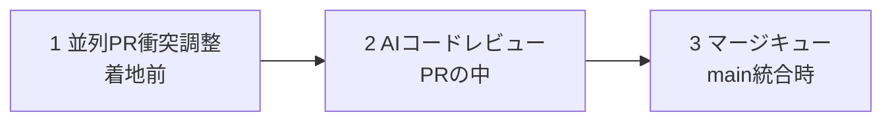
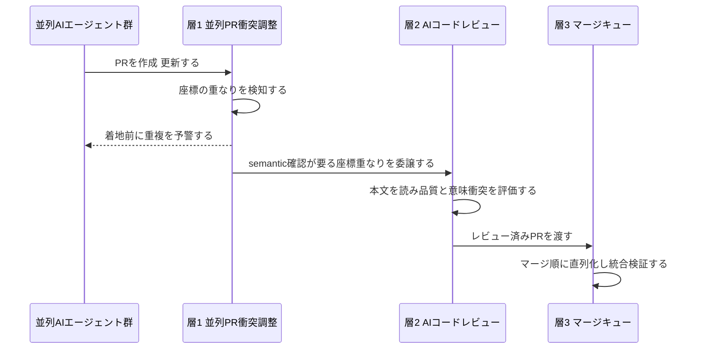
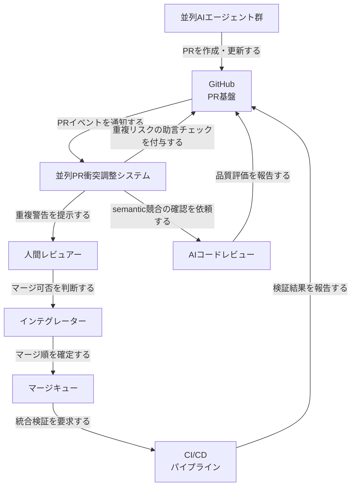
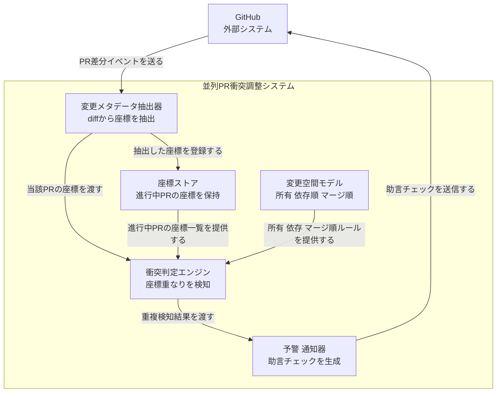
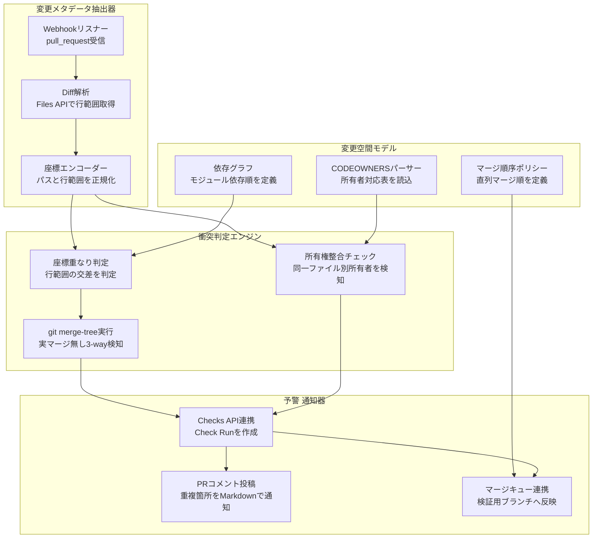
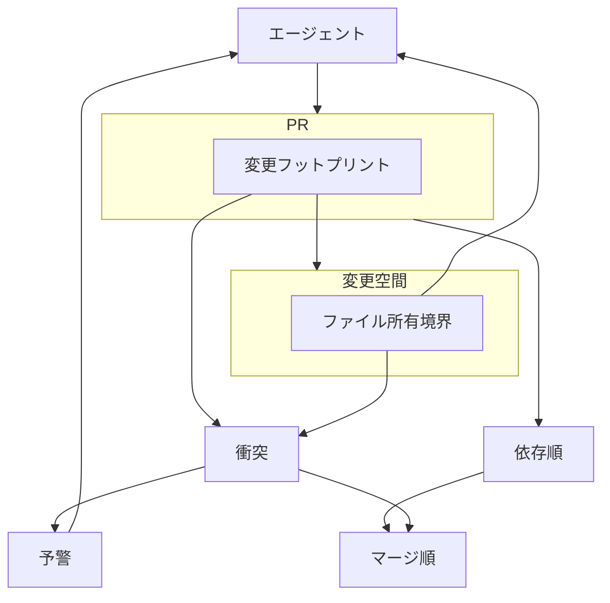
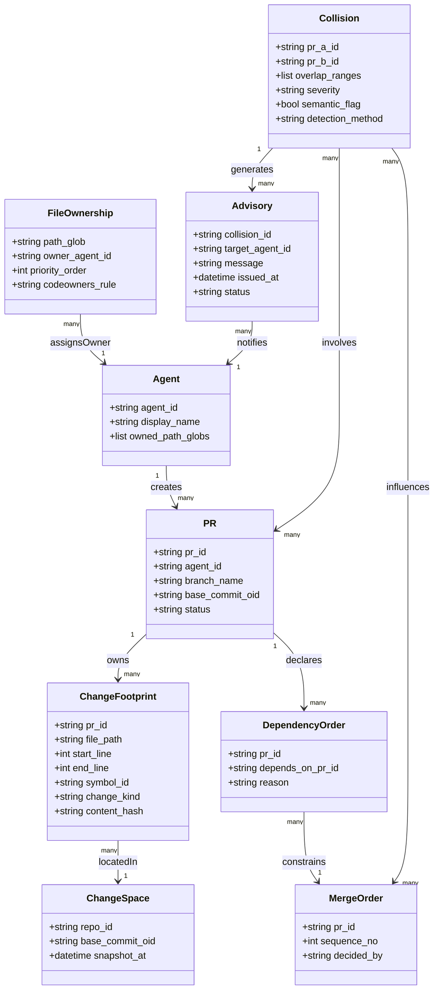

複数の AI エージェントを並列稼働させて開発を進めると、真のボトルネックは CI 速度でもレビュー人数でもなく「変更空間の分割失敗」として現れます。本記事は、Veripsa の記事「AIエージェント並列実行におけるPR衝突調整」が提示する **content-free（本文を保持しない座標ベース）な並列 PR 衝突調整**という方法論を、C4 モデルの論理構造・データモデル・実装手段・運用に分解して構造化します。

> 本稿は「方法論・設計論」の調査です。Veripsa Core は本方法論を実装した GitHub App の一例として扱い、システムコンテキスト図・コンテナ図では役割名のみを使います。具体製品・具体技術（git worktree / CODEOWNERS / GitHub Checks API 等）はコンポーネント図と構築・利用セクションで用います。補完したコード例は「記事の主張」ではなく「実装例」であることを明示します。

## 概要

### 解こうとしている問題

複数の AI エージェントを並列実行して開発を進めると、エージェント A とエージェント B が別ブランチで同じ関数の同じ行を別々に書き換えることがあります。この状態で両方が PR を出すと、着地の段階で衝突します。

この衝突は CI を速くしても解消しません。コードレビューを厚くしても解消しません。従来のレビューは「この PR の中身が良いか」だけを検証する仕組みです。「開いている PR 同士が同じ場所に着地しようとしている」という横の関係は、レビューの視野に入りません。

つまり真のボトルネックは、CI 速度でもレビュー人数でもありません。**変更空間の分割に失敗していること**です。エージェントを並列化するほど、この失敗は顕在化します。実際に AgenticFlict（arXiv: 2604.03551、Daniel Ogenrwot・John Businge）の大規模データセット分析では、正常に処理できた AI エージェント生成 PR **107,026 件のうち 29,609 件（27.67%）**がマージ衝突を起こし、衝突領域は **336,380 個**に達しています。並列で出す PR が増えるほど、この衝突の総量は看過できない規模になります。

### 位置づけ

この設計手法は、マージキューや AI コードレビューを置き換えるものではありません。両者の**隣に足す 1 層**として機能します。3 つの層は、それぞれ見ている範囲と時間軸が異なります。



| 層 | 見る範囲 | 時間軸 | 主な問い |
|---|---|---|---|
| 1 並列PR衝突調整 | 開いている PR 群の横の関係 | 着地前 | 同じ場所に着地しそうな PR はどれか |
| 2 AIコードレビュー | 個別 PR の中身 | PR オープン中 | この PR 単体の品質は妥当か |
| 3 マージキュー | レビュー済み PR の統合順序 | main 統合時 | 安定した順序で main に入れられるか |

層 1 は層 2・層 3 より手前の工程です。層 2・層 3 がどれだけ強化されても、層 1 が欠けていると「レビューは通ったが着地時に衝突する PR 群」を防げません。

3 層がどうハンドオフするかを、予警発生から着地まででたどると次のようになります。



層 1 は座標だけで「どの PR が近いか」を先に鳴らし、本文読解が要る判断だけを層 2 に渡します。層 3 は最後に順序で捌きます。前段が後段の負荷を減らす一方向の受け渡しです。

## 特徴

### content-free 設計

この設計手法の起点は、「本文を保存しない・表示しない」という原則です。判定に使う情報を「どこを触ったか」というメタデータ（座標）だけに絞り込み、PR の diff 本文そのものは保持しません。

この制約から、2 つの実利が生まれます。

| 観点 | 効果 |
|---|---|
| プライバシー | diff 本文を外部に渡さずに済む。座標情報だけで判定が成立するため、本文を預ける必要がない |
| 再現性 | 同じ commit には同じ判定が返る。本文を LLM に読み直させる設計につきまとう解釈ブレを排除できる |

一方で、本文を読まない設計には構造的な限界があります。関数名は異なるものの API の前提を静かに破壊するような、本文を読めば分かる semantic な衝突は取りこぼします。この限界を補うのが、層 2 の AI コードレビューです。content-free な座標ベース判定と、本文を読む AI コードレビューは、役割を分けた補完関係にあります。

### 座標ベースの衝突検知

座標ベース検知とは、ファイル名や行番号など「どこを触ったか」というメタデータのみを突き合わせ、開いている PR 同士が同じ座標に触れていないかを事前に照合する方式です。本文の意味解釈を伴わないため、判定は機械的かつ決定的になります。

### 類似アプローチとの比較

変更空間の分割・衝突回避には複数のアプローチがあります。隔離レベル・検知タイミング・semantic 衝突の検知可否・運用コストで整理すると、次のようになります。

| アプローチ | 隔離レベル | 検知タイミング | semantic衝突検知 | 運用コスト |
|---|---|---|---|---|
| git worktree による物理隔離 | ファイルシステムレベル（作業ディレクトリを分離） | 実行前（タスク分解時に手動でファイル重複を確認） | 不可（人手のタスク設計に依存） | 中〜高（タスクごとの所有権表を事前作成・維持） |
| CODEOWNERS / ファイル所有権マッピング | ディレクトリ・ファイル単位の宣言的隔離 | 実行前（静的な所有権定義） | 不可 | 低〜中（定義ファイルの保守のみ） |
| マージキュー | 隔離なし（main 統合時に直列化） | 統合時（着地後） | 不可（CI 失敗として顕在化） | 低（統合順序の自動制御） |
| メタデータ座標ベース衝突検知 | 隔離なし（検知・助言に特化） | 着地前（PR オープン中に横串で予警） | 不可（座標一致のみ判定。semantic 衝突は AI コードレビューに委譲） | 低（content-free でメタデータのみ処理） |

git worktree や CODEOWNERS は、実行前に変更空間を人手または静的定義で切り分けるアプローチです。マージキューは、逆に統合時点で衝突を検出し順序で捌くアプローチです。メタデータ座標ベース衝突検知は、この 2 つの間、つまり PR がオープンされてから着地するまでの間隙を埋める位置にあります。

## 構造

本セクションでは「並列 PR 衝突調整」という方法論を、C4 モデルの 3 段階（システムコンテキスト / コンテナ / コンポーネント）の論理構造として読み替えます。

### システムコンテキスト図



| 要素名 | 説明 |
|---|---|
| 並列AIエージェント群 | 個別ブランチで並列にコードを変更し、PR を作成・更新するアクターです。3 体以上を同時稼働させ始めると衝突が顕在化します |
| 人間レビュアー | PR の中身を読み、マージ可否を最終判断するアクターです |
| インテグレーター | 複数 PR のマージ順序を決定し、統合を実行するアクターです。人間が兼ねる場合と、自動化プロセスが兼ねる場合があります |
| 並列PR衝突調整システム | 本調査の対象です。PR の diff から座標情報のみを抽出し、他の進行中 PR との重複を着地前に助言します。本文そのものは保持しません |
| GitHub | PR の作成・更新イベントを発行し、調整システムからの助言チェックを表示する PR 基盤です |
| CI/CDパイプライン | 各 PR・マージ候補に対して自動テストとビルド検証を実行する外部システムです |
| マージキュー | レビュー済み PR を main に入れる順番と安定性で捌く外部システムです |
| AIコードレビュー | PR 単体の中身の良し悪しを見る、調整システムとは独立した外部システムです。座標だけでは検出できない semantic な競合はこちらの領分です |

### コンテナ図



#### 並列PR衝突調整システム

| 要素名 | 説明 |
|---|---|
| 変更メタデータ抽出器 | PR の diff から、触れたファイルパスと行範囲を「座標」として抽出します。本文コードは取り出しません |
| 座標ストア | 進行中の他 PR の座標だけを一時的に保持するストアです。本文を持たないため、漏えい時の影響が小さい設計です |
| 変更空間モデル | ファイル所有・モジュール依存順・マージ順という 3 種のルールを保持するナレッジベースです。座標同士の重なりが「実害のある衝突」かどうかを判断する基準を与えます |
| 衝突判定エンジン | 当該 PR の座標と、座標ストア内の他 PR の座標を突き合わせ、変更空間モデルのルールに沿って重なりを検知します |
| 予警・通知器 | 衝突判定エンジンの結果を、GitHub 上の助言チェックとして可視化します。ブロッキングではなく着地前の予警として提示します |

#### 外部システム

| 要素名 | 説明 |
|---|---|
| GitHub | システムコンテキスト図と同一の外部システムです。PR イベントの発生源であり、助言チェックの表示先でもあります |

### コンポーネント図



#### 変更メタデータ抽出器

| 要素名 | 説明 |
|---|---|
| Webhookリスナー | GitHub の pull_request イベント（作成・更新）を受信し、抽出処理を起動します |
| Diff解析 | GitHub の Files API（`GET /repos/{owner}/{repo}/pulls/{pull_number}/files`）を呼び出し、変更ファイルと `patch` 文字列を取得します。行範囲は構造化されて返らないため、patch の hunk header `@@ -a,b +c,d @@` から自前で導出します |
| 座標エンコーダー | 取得した行範囲をファイルパス単位の座標オブジェクトへ正規化し、後段に渡せる形に整えます |

#### 変更空間モデル

| 要素名 | 説明 |
|---|---|
| CODEOWNERSパーサー | リポジトリの `CODEOWNERS` ファイルを読み込み、ファイルパターンと所有者・チームの対応表を構築します |
| 依存グラフ | モジュール間の依存順序を定義します。下位パッケージを触る変更は、上位パッケージの変更より先に統合されるべき、という順序関係を持ちます |
| マージ順序ポリシー | マージキューが採用する直列マージ順のルールを保持し、座標重なりの重大度判定に反映します |

#### 衝突判定エンジン

| 要素名 | 説明 |
|---|---|
| 座標重なり判定 | 2 つの PR の座標（ファイルパス＋行範囲）が交差するかどうかを判定します。本文を読まない、構造的な判定です |
| git merge-tree実行 | `git merge-tree` を用いて実際にマージを実行せず 3-way マージを試行し、座標が重なった PR 同士が実際に衝突するかを事前検知します |
| 所有権整合チェック | CODEOWNERSパーサーの対応表と座標を突き合わせ、同一ファイルを別の所有者が触れているケースを検知します |

#### 予警・通知器

| 要素名 | 説明 |
|---|---|
| Checks API連携 | Check Run を作成し、`annotation_level`（notice/warning/failure）や `conclusion`（neutral 等）を使って、マージをブロックしない助言として結果を返します |
| PRコメント投稿 | 重複箇所を Markdown 形式で PR にコメント投稿し、レビュアーに可視化します |
| マージキュー連携 | `gh-readonly-queue/{base_branch}` のような検証用ブランチでの結果を、マージキューの判断材料として反映します |

判定エンジン内の `座標重なり判定 → git merge-tree実行 → Checks API連携` という順序には理由があります。座標重なり判定は本文を読まない粗い一次フィルタで、大量の open PR を安価にふるい落とします。`git merge-tree` はコストの高い精査なので、座標が重なった候補だけに絞って走らせます。なお「座標ストア」はコンポーネント図では分解していません。進行中 PR の座標を保持し、PR クローズ・マージ時に該当行を削除するだけの単純なキー値ストアで足りるためです（スキーマ例は構築方法を参照）。

## データ

content-free 設計は「本文を保持しない」という制約から出発します。その制約は、扱えるデータの形にそのまま反映されます。ここでは、①どのエンティティが存在し、②誰が誰を所有し、③各エンティティがどんな属性を持つか、の 3 点をモデル化します。起点記事は ER 図を明示していないため、記事本文の語彙（変更空間・座標・着地前）と CODEOWNERS の所有権表現、AgenticFlict の衝突領域スキーマを手がかりに再構成しています。

### 概念モデル

登場するエンティティは 9 個です。

| エンティティ | 一言で言うと |
|---|---|
| 変更空間 | 並列 PR 群が着地しようとしている main 上の座標全体 |
| ファイル所有境界 | 変更空間をエージェント単位に区分する宣言的な境界 |
| 変更フットプリント | 1 つの PR が実際に触った座標（本文は含まない） |
| PR | エージェントが変更フットプリントを添えて提出する変更提案 |
| エージェント | 並列に PR を作るアクター |
| 依存順 | PR 同士の「先にこれが要る」という論理的な前後関係 |
| マージ順 | main へ実際に統合する順序 |
| 衝突 | 複数 PR の変更フットプリントが重なった状態 |
| 予警 | 衝突をもとに着地前にエージェントへ伝える通知 |

所有関係は subgraph、利用関係は矢印で表します。



「変更空間」は「ファイル所有境界」を内包します。「PR」は「変更フットプリント」を内包します。それ以外はすべて利用・生成・通知の矢印です。エージェントが PR を作り、ファイル所有境界がエージェントに割り当てられ、変更フットプリントが変更空間上の位置を参照しつつ衝突判定に使われ、衝突が予警を生み、予警がエージェントに通知され、PR が宣言する依存順がマージ順を制約し、衝突がマージ順に割り込みます。

### 情報モデル

各エンティティの主要属性です。**本文（関数の中身）を保持する属性は 1 つもありません。** 保持するのは座標・識別子・ハッシュ・列挙値だけです。



| エンティティ | 属性の意図 |
|---|---|
| 変更フットプリント | `file_path` `start_line` `end_line` `symbol_id` で「どこを触ったか」だけを特定します。`content_hash` はハッシュ止まりで本文自体は含みません。`change_kind` は追加・削除・変更などの種別を持たせ、意味の解釈はしません |
| ファイル所有境界 | GitHub CODEOWNERS の構文に合わせ、`path_glob` と `owner_agent_id` の組を基本単位にします。CODEOWNERS は「後に書いたパターンが優先」というルールを持つため、`priority_order` で同じ表現をモデルに反映します |
| 衝突 | `overlap_ranges` は変更フットプリント同士が重なった座標のリストです。`severity` は重なりの強さの分類、`semantic_flag` は「本文を読まないと判断できない衝突かもしれない」という委譲マーカーで、自動検知の対象外であることを明示します |
| 予警 | 衝突 1 件から複数のエージェントへ複数の予警が生成され得るため、`collision_id` に対して 1 対多です |

2 点、モデルの粒度について補足します。

- **衝突の主語**: 概念モデルは「変更フットプリント同士の重なり」を衝突として描きますが、情報モデルの `Collision` は可読性のため PR 対（`pr_a_id` / `pr_b_id`）に射影しています。`overlap_ranges` に重なった座標対を畳み込む形で、フットプリント単位の情報を PR 単位に集約したレコードと捉えてください。
- **所有範囲の正規化**: `Agent.owned_path_globs` は `FileOwnership` から導出できる冗長な派生値です。正本は `FileOwnership`（CODEOWNERS 由来）に置き、`Agent` 側は参照の便宜のためのキャッシュとして扱います。

AgenticFlict データセットが衝突領域を `file_path` / `region_index` / 開始・中間・終了行 / 各側コードブロックの SHA-256 ハッシュ / プレビュー行数、というほぼ同型の構成で表現している点も、この設計が特異ではなく座標ベース衝突検知の標準的な表現であることを裏付けます。

### 座標ベース衝突と semantic 衝突の区別

`Collision.severity` と `Collision.semantic_flag` は、検知できる衝突とできない衝突を分けるための属性です。

| 区分 | 判定に使うデータ | Collision 上の表現 | 例 |
|---|---|---|---|
| 座標ベースで検知できる衝突 | `file_path` `start_line` `end_line` の重なりのみ | `detection_method = footprint_overlap`、`semantic_flag = false` | 2 つの PR が同じ関数の同じ行を書き換えている |
| semantic 衝突（検知対象外） | 本文の意味解釈が必要。変更フットプリントには表現できない | `semantic_flag = true` として層 2 の AI コードレビューへ委譲するのみで、自動では確定しない | 関数名も行番号も異なるが、片方が API の前提を静かに壊している |

`semantic_flag` は「衝突として確定した」ことを意味する属性ではなく、「座標だけでは判定しきれないので、本文を読む工程（AI コードレビュー）に回す」ことを示す委譲マーカーです。

## 構築方法

起点記事は方法論の思想面が中心で、具体的なコマンドや設定ファイルの記載はありません。以下のコード例は、記事の思想（変更面の分割による衝突回避）を実現する**実装例**を、git worktree・CODEOWNERS・GitHub merge queue・Checks API という既存ツールの公式ドキュメントから補完したものです。

### git worktree による物理隔離

複数のエージェントを同時に走らせるとき、共有ディレクトリ・共有 index を使うと「同じファイルへの同時書き込み」がサイレントに握りつぶされる恐れがあります。`git worktree` はブランチごとに独立した作業ディレクトリと index を割り当てるため、この事故を防止します。

前提条件は次のとおりです。

- `git worktree` が利用できること（Git 2.5 で `add`、2.17 で `list --porcelain` などが導入されました）。
- 通常の clone でもベアリポジトリでも動作します。ベアリポジトリは main worktree を持たず linked worktree だけを持つ構成になるため、`git worktree add` 時の初期ブランチ挙動を追加確認します（`.git` オブジェクトストアは全 worktree で共有されます）。
- 各 worktree でビルド・依存関係インストールを個別に行う想定であること（`node_modules` 等は worktree 間で共有されません）。

エージェント 1 体につき「worktree 1 つ + 専用ブランチ 1 本」を割り当てる実装例です（補完元: Augment Code / MindStudio）。

```bash
# 実装例: エージェントごとに worktree + ブランチを新規作成
git fetch origin main
git worktree add -b feat/agent-a-auth      ../agent-a-auth      origin/main
git worktree add -b feat/agent-b-payment   ../agent-b-payment   origin/main
git worktree add -b feat/agent-c-dashboard ../agent-c-dashboard origin/main
```

各 worktree で依存関係を個別に整えます。

```bash
# 実装例: worktree ごとの初期化
cd ../agent-a-auth
npm ci --prefer-offline
cp ../pkm/.env .env.local   # .env は worktree 間で自動共有されないため手動コピー
```

実行中の worktree を誤って削除しないための保護と、稼働状況の一覧確認です。

```bash
# 実装例: 実行中 worktree のロックと一覧表示
git worktree lock --reason "agent-a running" ../agent-a-auth
git worktree list --porcelain
```

タスク完了後のクリーンアップです。

```bash
# 実装例: 後片付け
git worktree unlock ../agent-a-auth
git worktree remove ../agent-a-auth
git worktree prune --verbose
```

開発サーバーやテスト DB のポート衝突を避けたい場合は、ブランチ名から決定的にポート番号を導出できます（補完元: Augment Code ガイド）。

```bash
# 実装例: ブランチ名ハッシュから安定したポートを割り当て
PORT=$(( 3100 + $(echo "$BRANCH_NAME" | cksum | cut -d' ' -f1) % 6899 ))
echo "DEV_PORT=${PORT}" >> .env.local
```

### ファイル所有マッピング（CODEOWNERS）

worktree を作成する**前**に、どのエージェントがどのファイル/モジュールを触るかを明文化しておくと、変更面の重複を事前に発見できます。GitHub の CODEOWNERS はこの割り当てをそのままレビュー担当の強制にも転用できます。

CODEOWNERS の仕様は次のとおりです（出典: GitHub Docs - About code owners）。

| 項目 | 仕様 |
|---|---|
| 配置場所 | `.github/CODEOWNERS`、リポジトリルート、`docs/CODEOWNERS` のいずれか（この優先順で最初に見つかったものだけを使用） |
| 書式 | `<パターン> @owner1 @owner2` の 1 行 1 ルール |
| owner の指定形式 | `@username` / `@org/team-name` / メールアドレス |
| 優先順位 | 複数パターンがマッチする場合、**ファイル内で最後に書かれたパターンが優先** |
| 非対応の記法 | `!` による否定、`[ ]` の文字範囲、`#` のエスケープ（gitignore と同一構文ではない） |

変更空間をエージェント単位で分割する CODEOWNERS の実装例です。

```
# .github/CODEOWNERS
# 実装例: エージェントの担当領域をファイル所有として明文化

# 認証モジュール = agent-a の担当領域
/src/auth/**        @agent-a-bot @human-reviewer-1

# 支払い処理 = agent-b の担当領域
/src/payment/**     @agent-b-bot @human-reviewer-2

# ダッシュボードUI = agent-c の担当領域
/src/dashboard/**   @agent-c-bot @human-reviewer-1

# 共有ロックファイルは統合(integrator)エージェントのみ変更可能
package-lock.json   @integrator-bot
/db/migrations/**   @integrator-bot
```

この割り当てが「1 ファイルに複数エージェントの owner が重複する」状態になっていれば、worktree 作成前にタスク分割をやり直すシグナルとして使えます。

### マージキューの有効化

複数エージェントの PR が同時にマージ可能状態になったとき、手動で「誰が先にマージするか」を捌くとヒューマンエラーの温床になります。GitHub merge queue はこの直列化を自動化します（出典: GitHub Docs - Managing a merge queue）。

1. リポジトリの Settings から Branches に進みます。
2. 対象ブランチ（例: `main`）の branch protection rule を開くか新規作成します。
3. **Require merge queue** を有効化します。
4. 必要に応じて次の詳細設定を行います。

| 設定項目 | 役割 |
|---|---|
| マージ方法 | merge / rebase / squash から選択 |
| ビルド並行数 | 同時に走らせる `merge_group` の最大数（上限 100） |
| 失敗PRの扱い | キュー内で失敗した PR を後続からどう除外するか |
| ステータスチェックのタイムアウト | CI 応答を待つ上限時間 |
| マージ制限（最小/最大） | base ブランチへ同時にマージする PR 件数（1〜100）。`merge_group` のビルド並行数とは別の設定 |

merge queue は「Require branches to be up to date before merging」と同等の効果を、PR 作成者の手動リベースなしで実現します。merge queue 自体は変更面の重複を検知する機能ではなく、統合順序の直列化と required checks の強制を担います。CODEOWNERS と組み合わせると、「所有境界で分かれた PR はキューが自動で直列マージする」「変更面が重なる PR は統合時の required checks（CI）で顕在化する」という運用が成立します。

### 並列PR衝突検知アプリの導入

起点記事が扱う「PR 同士の座標を比較して衝突を検知する」仕組みは、GitHub の Checks API を使う GitHub App として実装するのが標準的な形です（出典: GitHub Docs - Building CI checks with a GitHub App / Permissions required for GitHub Apps）。

1. GitHub App をリポジトリ（または Organization）にインストールします。
2. アプリの Repository permissions で **Checks: Read & write** を付与します。
3. Subscribe to events で **Check suite** / **Check run** を購読します。
4. コードが push されると GitHub が自動で `check_suite` イベント（action: `requested`）をアプリへ送信します。
5. アプリはこのイベントを受けて `check_run` を作成し、他の open PR との変更面重複を判定した結果を Check の conclusion として返します。

Check run を作成・更新する API 呼び出しの実装例です（出典: REST API endpoints for check runs）。

```bash
# 実装例: 衝突検知結果を Check run として作成
curl -X POST \
  -H "Authorization: Bearer <GitHub App installation token>" \
  -H "Accept: application/vnd.github+json" \
  https://api.github.com/repos/<owner>/<repo>/check-runs \
  -d '{
    "name": "pr-collision-check",
    "head_sha": "ce587453ced02b1526dfb4cb910479d431683101",
    "status": "in_progress",
    "output": {
      "title": "変更面の重複チェック",
      "summary": "他のopen PRとの座標比較を実行中"
    }
  }'
```

```bash
# 実装例: 判定結果でCheck runを更新(conclusionを指定するとstatusは自動でcompletedになる)
curl -X PATCH \
  -H "Authorization: Bearer <GitHub App installation token>" \
  -H "Accept: application/vnd.github+json" \
  https://api.github.com/repos/<owner>/<repo>/check-runs/<check_run_id> \
  -d '{
    "conclusion": "action_required",
    "output": {
      "title": "衝突の可能性を検出",
      "summary": "PR #42 と /src/payment/checkout.ts で変更面が重複しています"
    }
  }'
```

Checks の作成・更新は主に GitHub App 向けの機能です。OAuth App や通常の認証ユーザートークンでは実行できません（閲覧のみ可能）。fine-grained PAT の可否は、endpoint 個別ドキュメントの token matrix で確認します。

### 衝突判定エンジンのコア実装

コンポーネント図の「衝突判定エンジン」は、①座標重なりの粗い一次フィルタ、②`git merge-tree` による精査、の 2 段で構成します。まず座標（ファイルパス＋行範囲）の交差だけを機械的に判定する一次フィルタの実装例です（本文は読みません）。

```python
# 実装例: 座標重なりの一次フィルタ (本文を読まない content-free 判定)
def footprints_overlap(a, b):
    # a, b は {"file_path", "start_line", "end_line"} を持つ変更フットプリント
    if a["file_path"] != b["file_path"]:
        return False
    return a["start_line"] <= b["end_line"] and b["start_line"] <= a["end_line"]

def detect_collisions(target_footprints, open_pr_footprints):
    hits = []
    for t in target_footprints:
        for o in open_pr_footprints:
            if footprints_overlap(t, o):
                hits.append((t["pr_id"], o["pr_id"], t["file_path"]))
    return hits
```

一次フィルタで座標が重なった PR ペアだけを、`git merge-tree` で実際に 3-way マージを試行して精査します。`git merge-tree`（Git 2.38 以降の `--write-tree` 形式）は実マージを行わずに衝突の有無を返します。比較対象は「main と 1 本のブランチ」ではなく **2 本の PR の head 同士**である点に注意します。main との比較では、PR 間の衝突は検知できません。

```bash
# 実装例: 2つのPRのhead同士を実マージせず突き合わせる
# 共通ベースを明示し、PR A と PR B の head を比較する
git merge-tree --write-tree \
  --merge-base="$(git merge-base feat/agent-a-auth feat/agent-b-payment)" \
  feat/agent-a-auth feat/agent-b-payment
# 終了コード 0 = 衝突なし / 1 = 衝突あり。人間向けの競合情報は stdout に出る
# (競合ファイル一覧が必ず返るとは限らないため、判定は終了コードで行う)
```

座標ストア（コンポーネント図の STORE）は、進行中 PR の座標だけを保持する単純なテーブルで足ります。本文カラムを持たない点が content-free 設計の要です。

```sql
-- 実装例: 座標ストアの最小スキーマ (本文カラムを持たない)
CREATE TABLE pr_coordinates (
    pr_id       TEXT    NOT NULL,
    file_path   TEXT    NOT NULL,
    start_line  INTEGER NOT NULL,
    end_line    INTEGER NOT NULL,
    symbol_id   TEXT,
    change_kind TEXT    NOT NULL,   -- add / delete / modify
    updated_at  TIMESTAMPTZ NOT NULL DEFAULT now(),
    PRIMARY KEY (pr_id, file_path, start_line)
);
-- PR がクローズ/マージされたら該当 pr_id の行を削除して陳腐化を防ぐ
```

GitHub App の受信側は、`pull_request` webhook を受けて座標を抽出・登録し、判定結果を Check run として返す最小フローになります。

```javascript
// 実装例: webhook 受信から Check run 作成までの最小スケルトン (Probot 風)
module.exports = (app) => {
  app.on(["pull_request.opened", "pull_request.synchronize"], async (ctx) => {
    const files = await ctx.octokit.paginate(ctx.octokit.pulls.listFiles, ctx.pullRequest());
    const footprints = files.flatMap(extractCoordinates); // patch の @@ ヘッダから行範囲を抽出
    await upsertCoordinates(ctx.payload.pull_request.id, footprints);
    const hits = detectCollisions(footprints, await loadOpenPrCoordinates(ctx));
    await ctx.octokit.checks.create(ctx.repo({
      name: "pr-collision-check",
      head_sha: ctx.payload.pull_request.head.sha,
      status: "completed",
      conclusion: hits.length ? "action_required" : "neutral",
      output: { title: "変更面の重複チェック", summary: summarize(hits) },
    }));
  });
};
```

## 利用方法

必須パラメータ/設定の一覧です。

| 項目 | 必須設定 | 備考 |
|---|---|---|
| worktree パス命名規則 | `<repo>-<agent-id>-<task>` 等の一貫命名 | `git worktree list` での視認性を確保 |
| ブランチ命名規則 | `feat/agent-<id>-<task>` 等 | CODEOWNERS のパターンと対応させる |
| CODEOWNERS の owner | エージェント bot アカウント + 人間レビュアー | 共有ファイル（lockfile・migration）は integrator 専有に固定 |
| branch protection | Require merge queue を有効化 | 直列マージを強制 |
| GitHub App 権限 | Checks: Read & write、check_suite/check_run 購読 | 衝突検知の前提 |

### タスク分解を「変更面」で設計する

機能単位（「認証機能を作る」）ではなく、変更面（ファイル所有・依存順・マージ順）を軸にタスクを割ります。分解時に次の 3 点を表にして事前合意します（補完元: MindStudio - Parallel agentic development）。

| エージェント | 触るファイル/ディレクトリ | 依存先 | マージ順 |
|---|---|---|---|
| agent-a | `/src/auth/**` | なし | 1番目 |
| agent-b | `/src/payment/**`（agent-a の認証APIを利用） | agent-a の完了 | 2番目 |
| agent-c | `/src/dashboard/**` | なし | agent-a と並行可 |
| integrator | `package-lock.json`, `/db/migrations/**` | 全エージェント完了後 | 最終 |

「複数エージェントが同じファイルに異なる角度からアクセスする」分解（例: 全員が `utils.ts` を触る）は避け、ドメイン境界でファイルを割ります。

### 衝突予警が出たときのオペレーション

Checks API 経由で衝突予警（`conclusion: action_required` 等）が出た場合、次のいずれかで対応します。

- **依存順の入れ替え**: 片方のタスクがもう片方の完了を前提にしていた場合、依存関係の表を修正し、先行させるべきエージェントを明示し直します。
- **マージ順の直列化**: 変更面が偶発的に重なっただけの場合、merge queue の並び順（先着 PR を優先）に従わせ、後発 PR には「先行 PR のマージ後にリベース」を指示します。
- **タスク再分割**: 重複が構造的（同じファイルを本質的に両方が必要とする）であれば、そのファイルを新たな担当（多くは integrator）に付け替え、CODEOWNERS を更新してから再実行します。

### integrator エージェントへのマージ順集約

規模が大きくなるほど、各エージェントの成果を個別 PR としてマージするより、**統合専用のエージェント（integrator）がマージ順を一括管理する**方式が有効です（補完元: MindStudio ブログ）。

- 各エージェントの worktree/ブランチは integrator 専用のブランチ（例: `integration/sprint-12`）に順番に取り込みます。
- 共有ロックファイル（`package-lock.json` 等）と DB マイグレーションは integrator のみが変更し、他エージェントは触らない運用にします（CODEOWNERS の割り当てと一致させます）。
- 取り込み前に lint・テストの合格、API 契約の凍結（仕様変更なし）を integrator 側のチェックリストとして課します。
- 小規模チームでは「各エージェントの PR を人間がレビュー・マージ」する方式の方が監査性は高く、integrator 方式は並列度が上がったときの選択肢と位置づけます。

```bash
# 実装例: integratorが担当エージェントのブランチを順番に取り込む
git checkout integration/sprint-12
git merge --no-ff feat/agent-a-auth      # 1番目: 依存なし
git merge --no-ff feat/agent-c-dashboard # 依存なし、並行マージ可
git merge --no-ff feat/agent-b-payment   # 2番目: agent-aのAPIに依存するため後続
```

## 運用

並列 AI エージェント開発を実運用に乗せると、設計時には見えなかった運用指標の管理が必要になります。

### 並列度と衝突率のトレードオフ管理

- 並列稼働エージェント数を増やすほど、同一座標へ複数 PR が着地する確率は上がると考えられます（本稿の推論。AgenticFlict はエージェント数と衝突率の関係そのものは分析していません）。その AgenticFlict（arXiv: 2604.03551）の大規模データセット分析では、正常に処理できた PR **107,026 件のうち 29,609 件（27.67%）**がマージ衝突を起こしています。
- 衝突率は PR サイズ（追加＋削除の code churn）と強く相関します。中央値 **2 行**の PR では衝突率 **約 9.9%** に留まる一方、中央値 **25 行**の PR では **約 30%** まで急上昇し、中央値 46〜185 行の中規模 PR では **32〜33%** で頭打ちになります。並列度を上げる判断は、稼働中の平均 PR サイズとセットで見る必要があります。
- 衝突率はエージェントの実装方式によっても差があります。データセットの 5 エージェント（論文 Table 2 の値）では **Copilot 15.24%**、**Cursor 19.75%**、**Devin 22.85%**、**Claude Code 25.93%**、**OpenAI Codex 31.85%** と、Codex は Copilot の 2 倍を超えます（論文本文の散文には別の近似値が併記されており、ここでは Table 2 を採用します）。混在運用では、衝突率の高いエージェントに割り当てるタスクの粒度をより小さく制御するなど、エージェント別のポリシー調整が要ります。
- 運用指標としては「並列度あたりの衝突率」を定点観測し、閾値を超えたら並列度を落とすか、タスク分解の粒度を見直すトリガーにします。

### 衝突予警の監視・トリアージ運用

- 座標ベース衝突検知（層 1）が「同じ場所に着地しそうな PR」を予警したら、人間またはトリアージ役のエージェントが対応要否を判断するフローが要ります。予警はあくまで「座標が重なっている」事実の通知であり、実際に semantic な衝突を起こすかどうかまでは判定しません。
- トリアージでは、予警された PR ペアのうち「先に着地させる側」を決め、後発側には自身のブランチをリベースさせる、または着地を保留させる運用にします。
- マージ順のスケジューリングは、依存関係の薄い PR から先に着地させ、同一ファイル・同一関数に触れる PR 群は意図的に時間をずらして着地させると、リベースコストを最小化できます。

### 座標ベース検知の 2 種類の取りこぼし

座標ベース検知の限界は、方向の異なる 2 種類に分けて管理します。混同すると、片方だけ対策して安心する事故につながります。

| 取りこぼし | 何が起きるか | 主因 | 緩和策 |
|---|---|---|---|
| false negative（見逃し） | 実際は同じ箇所を触っているのに座標が一致せず、衝突を検知できない | リファクタや先行マージで行番号がずれ、`start_line`/`end_line` が実態と食い違う | `symbol_id`（関数・シンボル単位の識別子）でも突き合わせる。base commit を揃えてから座標を比較する |
| false positive（誤検知） | 実際は無関係な PR 同士を衝突として予警し続ける | 所有権表・座標マップの陳腐化で、古い境界に基づく判定が残る | 変更空間モデルを定期再生成する（次項）。予警の的中率を定点観測する |

座標のみの比較（`start_line`/`end_line`）は行番号ずれに弱く見逃しを生みます。`symbol_id` を併用すると、行がずれても同一シンボルへの変更を捕捉でき、見逃しを減らせます。

### 変更空間モデルの陳腐化への追随

- 座標ベース検知や CODEOWNERS によるファイル所有権マッピングは、リファクタでファイル移動・分割が起きると実態とずれます。所有権表が古いまま運用を続けると、予警が「実際には無関係な PR 同士」を指し続け、誤検知が増えて形骸化します。
- リファクタが入った直後は、ファイル所有権マッピングの再生成を運用フローに組み込みます（例: ディレクトリ構成変更を伴う PR のマージ後に、所有権定義の見直しタスクを自動起票する）。
- 座標ベース検知は「機械的に決定的」であることが利点ですが、それは入力の変更空間モデルが最新であることが前提です。モデルの陳腐化を放置すると、決定的であることが逆に「古い誤りを一貫して繰り返す」リスクに転じます。

## ベストプラクティス

- **PR を小さく保つ**。衝突率は PR サイズと強く相関するため（2 行で約 9.9% → 25 行で約 30%）、1 PR あたりの変更行数を小さく制限することが、他のどの施策よりも衝突率を直接下げます。
- **タスク分解を変更面（どのファイル・どの関数に触れるか）で行う**。機能単位ではなく変更面単位でタスクを切ると、エージェント間の座標重複を設計段階で減らせます。
- **統合専用のエージェント（または役割）にマージ順の決定を集約する**。個々の実装エージェントにマージ順の判断を委ねると、局所最適な順序がぶつかり合います。統合役を 1 つに絞ることで、全体最適なマージ順を一元管理できます。
- **CODEOWNERS + マージキュー + 座標ベース予警の多層防御**を組みます。CODEOWNERS は実行前の静的な所有権宣言、座標ベース予警は着地前の横串チェック、マージキューは着地時点の直列化という、時間軸の異なる 3 層を重ねることで、単層では防げない衝突を段階的に減らせます。
- **content-free 設計を運用の前提にする**。座標情報（ファイル名・行番号などのメタデータ）のみで判定する設計は、PR の diff 本文を外部の衝突検知サービスに渡す必要がありません。機密コードを含むリポジトリでも、衝突検知の恩恵を受けられる運用上の利点になります。

## トラブルシューティング

| 症状 | 原因 | 対処 |
|---|---|---|
| 並列度を上げたら衝突が急増した | 並列度と衝突率はトレードオフ関係にあり、特に大きめの PR（25 行以上）を並列に流すと衝突率が 30% 前後まで跳ね上がる | 並列度を一段階下げるか、1 PR あたりの変更行数の上限をタスク分解時に強制する。エージェント別衝突率（例: Copilot 15.24% / OpenAI Codex 31.85%）を踏まえ、衝突率の高いエージェントの並列枠を絞る |
| semantic な衝突がレビューをすり抜けた | 座標ベース検知は「どこを触ったか」というメタデータのみを見る content-free 設計であり、関数名は別でも API の前提を静かに壊すような semantic な衝突は構造的に取りこぼす | 座標ベース検知を「予警」止まりと位置づけ、semantic 衝突の検知は層 2 の AI コードレビュー（本文を読む工程）に委ねる。座標が重ならなくても API 契約変更を伴う PR は追加レビューを必須化する |
| worktree 間で環境差異が出る（ビルドが片方でだけ壊れる） | 複数 worktree が共有のビルドキャッシュ（`.next/`、`dist/`、`tsconfig.tsbuildinfo` 等）や symlink された `node_modules` を参照し、互いの成果物を汚染している | worktree ごとにビルドキャッシュ・依存ディレクトリを独立させる。lock ファイルの更新はタスクとして明示されたエージェントのみに限定し、共有 symlink 経由の同時 install を避ける |
| worktree の `index.lock` が残ってコマンドが失敗する | エージェントプロセスのクラッシュや強制終了時に、git 操作中に作成される `index.lock` が削除されずに残留した | 残留プロセスがないことを確認したうえで `index.lock` を手動削除する。定期的に `git worktree list` で棚卸しし、不要な worktree は `git worktree remove` → `git worktree prune` で片付ける |
| CODEOWNERS が広すぎて全員レビュー要求が飛ぶ | ディレクトリ単位の所有権定義が粗く、1 PR が複数チームの所有範囲にまたがる変更を含んでいる | 所有権をチーム単位（`@org/team-name`）で細かく切り直し、`* @core-team` のような広域ルールは「他に一致しない場合の受け皿」に限定する。変更面単位のタスク分解と組み合わせ、1 PR が複数所有領域を跨がないようにする |
| マージキュー導入後、CODEOWNERS のレビューがバイパスできず着地が詰まる | マージキュー有効時に CODEOWNERS レビューのバイパス権限が効かない事例が報告されている（第三者事例ベース。GitHub 公式の明記は未確認） | バイパス運用を前提にする場合は、マージキューと CODEOWNERS の相互作用を事前に検証し、緊急着地用の別経路（レビュー免除ルールの明示的定義など）を用意しておく |
| 変更空間モデル（所有権表・座標マップ）の予警が実態と合わなくなった | リファクタでファイルの移動・分割が起き、所有権表や座標マップが更新されないまま運用が続いている | リファクタを含む PR のマージ後に所有権定義・変更空間モデルの見直しタスクを自動起票する。予警の的中率を定点観測し、下がってきたらモデルの陳腐化を疑う |

## まとめ

複数の AI エージェントを並列で動かすと、最初に詰まるのは CI 速度でもレビュー人数でもなく、開いている PR 同士が同じ場所に着地しようとする「変更空間の分割失敗」です。本記事では、本文を保持せず座標メタデータだけで着地前に衝突を予警する content-free 設計を軸に、3 層の役割分担（並列PR衝突調整 / AIコードレビュー / マージキュー）・データモデル・git worktree や CODEOWNERS を使った実装・運用指標までを、C4 の論理構造に分解して整理しました。

この記事が少しでも参考になった、あるいは改善点などがあれば、ぜひリアクションやコメント、SNSでのシェアをいただけると励みになります！

## 参考リンク

### 一次（起点記事・論文）

- [AIエージェント並列実行におけるPR衝突調整（Zenn, veripsa）](https://zenn.dev/veripsa/articles/ai-agent-pr-collision-content-free)
- [AgenticFlict: A Large-Scale Dataset of Merge Conflicts in AI Coding Agent Pull Requests on GitHub（arXiv abs）](https://arxiv.org/abs/2604.03551)
- [AgenticFlict（arXiv HTML版）](https://arxiv.org/html/2604.03551v1)

### 構造・データ（GitHub 公式）

- [About code owners（GitHub Docs）](https://docs.github.com/en/repositories/managing-your-repositorys-settings-and-features/customizing-your-repository/about-code-owners)
- [Managing a merge queue（GitHub Docs）](https://docs.github.com/en/repositories/configuring-branches-and-merges-in-your-repository/configuring-pull-request-merges/managing-a-merge-queue)
- [REST API endpoints for check runs（GitHub Docs）](https://docs.github.com/en/rest/checks/runs)
- [Building CI checks with a GitHub App（GitHub Docs）](https://docs.github.com/en/apps/creating-github-apps/writing-code-for-a-github-app/building-ci-checks-with-a-github-app)
- [Permissions required for GitHub Apps（GitHub Docs）](https://docs.github.com/en/rest/authentication/permissions-required-for-github-apps)
- [Webhook events and payloads: pull_request（GitHub Docs）](https://docs.github.com/en/webhooks/webhook-events-and-payloads#pull_request)

### 実装パターン（git worktree / 並列エージェント）

- [git-worktree 公式マニュアル（git-scm.com）](https://git-scm.com/docs/git-worktree)
- [git-merge-tree 公式マニュアル（git-scm.com）](https://git-scm.com/docs/git-merge-tree)
- [How to Use Git Worktrees for Parallel AI Agent Execution（Augment Code）](https://www.augmentcode.com/guides/git-worktrees-parallel-ai-agent-execution)
- [Parallel Agentic Development With Git Worktrees（MindStudio）](https://www.mindstudio.ai/blog/parallel-agentic-development-git-worktrees)
- [Git Worktrees for AI Coding（MindStudio）](https://www.mindstudio.ai/blog/git-worktrees-parallel-ai-coding-agents)
- [Running Multiple AI Coding Agents in Parallel（Zen van Riel）](https://zenvanriel.com/ai-engineer-blog/running-multiple-ai-coding-agents-parallel/)

### 運用・トラブルシューティング

- [Git Worktree Conflicts with Multiple AI Agents: Diagnosis and Fixes（Termdock）](https://www.termdock.com/en/blog/git-worktree-conflicts-ai-agents)
- [The Ultimate CODEOWNERS File Guide for Better Code Reviews（Aviator）](https://www.aviator.co/blog/a-modern-guide-to-codeowners/)
- [Can GitHub CODEOWNERS Bypass and Merge Queue Coexist?（codenote.net）](https://codenote.net/en/posts/github-codeowners-bypass-merge-queue-verification/)
</content>
