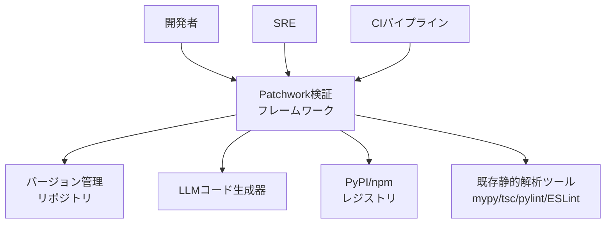
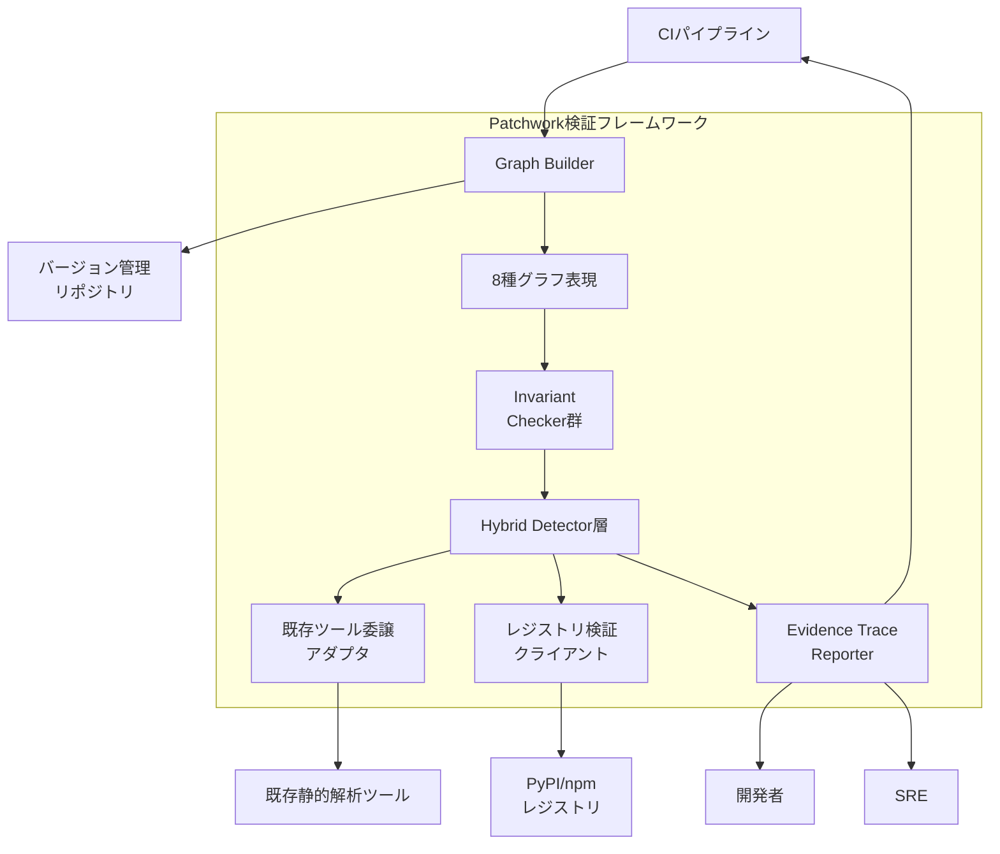
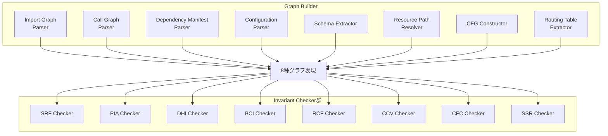
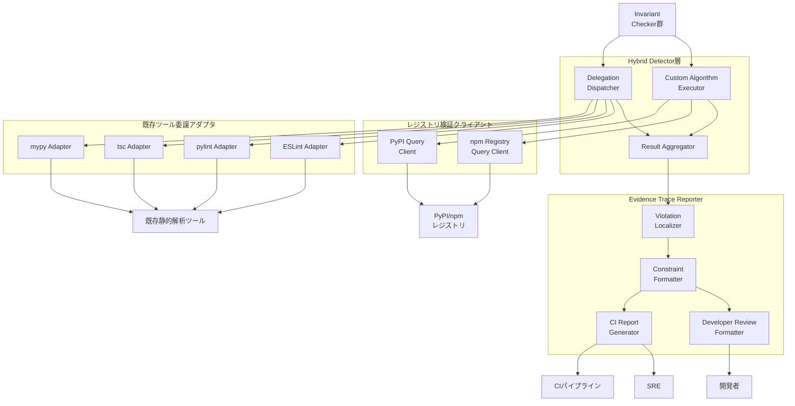
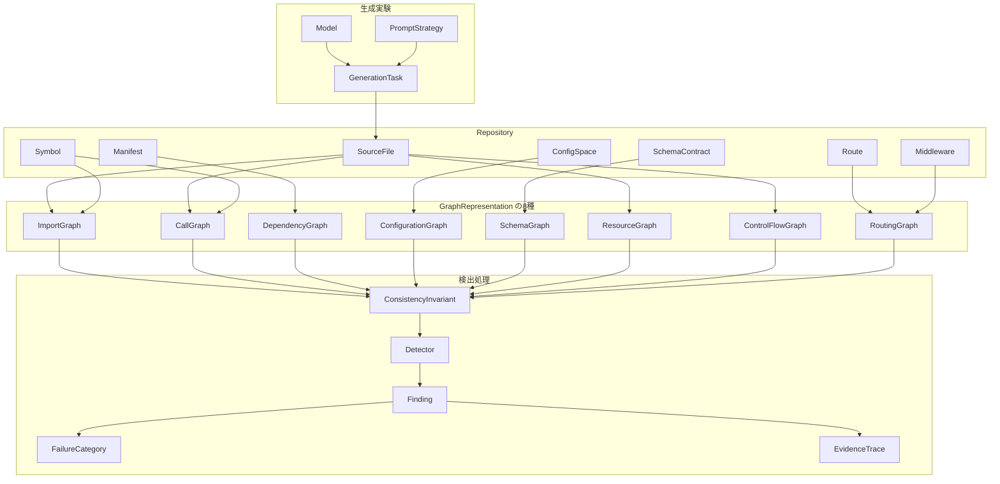
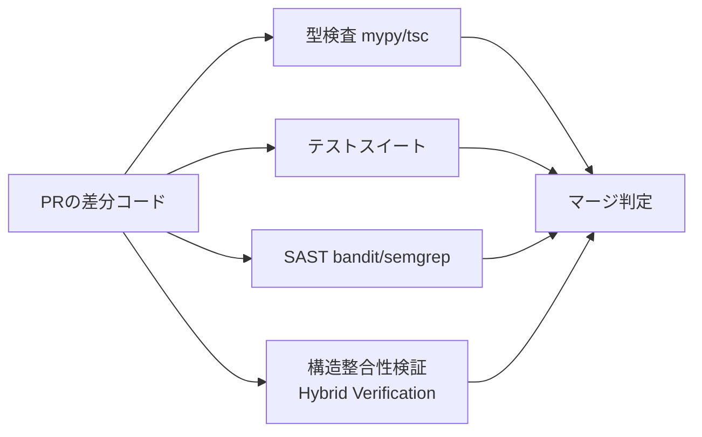

> 対象論文: Viraaji Mothukuri, Reza M. Parizi, *"The Patchwork Problem in LLM-Generated Code"*, arXiv:2607.08981 [cs.SE, cs.AI], 2026-07-09, Decentralized Science Lab, College of Computing and Software Engineering, Kennesaw State University, GA, USA。査読前のプレプリントです。論文は検出フレームワークの公式実装を公開しています ([decentralizedsciencelab/PatchWork](https://github.com/decentralizedsciencelab/PatchWork))。本記事のコード例はその転載ではなく、8 グラフ表現・アルゴリズムの考え方を最小限に示す教育用の簡略実装です (stdlib 除外や guard 網羅などの実務対応は省略しています)。論文に無い数値・閾値は出典を添えます。

LLM にコード生成を頼むと、個々のファイルは正しく見えます。コンパイルは通り、テストも緑になります。それでも、リポジトリ全体では構造が壊れていることがあります。

本記事で紹介する論文は、この現象を **Patchwork Problem** と名付けました。核心はひとつです。生成コードは「局所的には正しい」が「全体では不整合」であり、その不整合は既存の型検査・テスト・SAST をほぼ素通りします。論文は、この不整合を複数グラフ上の整合性不変条件として形式化し、8 カテゴリの失敗タクソノミーと検出フレームワークを提案しました。

## 概要

Patchwork Problem の要点は次のとおりです。

- 生成コードは局所的に正しいです。コンパイルが通り、テストが通ります。
- 同じコードがリポジトリ全体では構造的に不整合です。
- 本論文が対象とする失敗では、論理的な誤りよりも構造的な不整合が主要因です。

論文は、この不整合を「複数グラフ表現上の整合性不変条件 (consistency invariant)」として形式化しました。import・call・dependency・configuration・schema・resource・control flow・routing の 8 種類のグラフを構築し、各グラフが満たすべき制約を定義します。制約に違反した箇所を、構造的失敗として検出します。

### 既存 CI では検出できない理由

論文は、検出した構造的失敗が既存の CI (Continuous Integration) ツールチェーンを素通りする実態を数値で示しました。

| 検証手段 | 回避率 (検出された構造的失敗 67 件に対して) |
|---|---|
| 型検査 (mypy --strict / tsc --strict) | 97.01% が回避 (検出 2 件のみ) |
| テストスイート | 100% が回避 (検出 0 件) |
| SAST (Static Application Security Testing、bandit/semgrep) | 100% が回避 (検出 0 件) |

型検査・テスト・SAST は、それぞれ次を検証対象にしています。

- 型検査: ファイル内の型整合性
- テスト: 期待した入出力の再現性
- SAST: 既知の taint flow パターン

型検査はクロスモジュールのシンボルやシグネチャの一部を検出できます。しかし、設定・リソース・スキーマ・ルーティングを横断する 8 カテゴリを一貫して検証する仕組みは持ちません。この盲点が、Patchwork Problem が既存 CI を素通りする理由です。

### 位置づけ

本記事では、LLM 生成コードの評価軸を 3 つの観点として整理します。本論文は、このうち第三の観点 (構造的整合性) に対応します。

1. コード生成の能力評価 (例: SWE-bench、RepoBench): タスク成功/失敗という結果指標で評価します。
2. adversarial 安全性 (例: 脆弱性注入・taint flow 検出の SAST 研究): 悪意ある入力やコード内の既知脆弱性パターンを検証対象にします。
3. 構造的整合性 (本論文): 生成コードが成功しても失敗しても、リポジトリの構造的な不変条件を満たしているかを検証します。

既存研究との違いは次のように整理できます。

- Hallucination の実証研究 (dependency/package hallucination 系) は、構造的欠陥の発生実態を記述的に特徴づけるにとどまります。本論文は、これを検証可能な制約違反として形式化します。
- Repository-level ベンチマーク (RepoBench 等) は、スニペット単位の性能がリポジトリ規模のタスクに転移しないことを示します。評価基準は結果志向 (outcome-oriented) のままです。本論文は、どの構造的不変条件に違反したかを診断します。

### 関連研究・既存手法との比較

| 手法 | 検証対象 | 検出できる欠陥クラス | 盲点 | 粒度 |
|---|---|---|---|---|
| 型検査 (mypy/tsc --strict) | ファイル内/シグネチャの型整合性 | 型不一致の一部 | ファイル境界を越えた契約・リソース・設定・ルーティングの整合性 | ファイル単位 |
| SAST (bandit/semgrep) | 既知の taint flow パターン | 古典的脆弱性 | 構文的に正しいが配線が誤っているセキュリティ構造 | パターンマッチ単位 |
| テスト実行 | 期待した入出力の再現 | テストケースが網羅する範囲の欠陥 | テストが書かれていない結線・設定・依存関係 | テストケース単位 |
| dependency/package hallucination 研究 (slopsquatting 系) | 生成コードが参照する外部パッケージ名の実在性 | 存在しないパッケージ参照 | 実態の記述にとどまり、他の構造的欠陥クラスは対象外 | import 文単位 |
| repository-level 生成ベンチマーク (RepoBench 等) | クロスファイル文脈を用いたコード補完性能 | 性能指標 (Exact Match / Edit Similarity 等) | 生成コードの構造的整合性そのものは非対象 | スニペット/補完単位 |
| SWE-bench 系 | 実 GitHub issue に対するパッチの成否 | issue 解決の成否 (テスト合格で判定) | パッチが通っても構造的に不整合な場合を捕捉しない | タスク (issue) 単位 |
| 本フレームワーク (構造不変条件検証) | 8 グラフ表現上の整合性不変条件 | 8 カテゴリ全般 | 意味論的な正しさ (ロジックの妥当性) 自体は対象外 | リポジトリ横断 (ファイル境界越え) |

補足として、dependency/package hallucination の系譜では、16 種のコード生成モデルを対象にした大規模実証研究が、商用モデルで少なくとも 5.2%、OSS モデルで 21.7% のパッケージ幻覚率を報告しています (出典: "We Have a Package for You!", arXiv:2406.10279)。本論文はこの現象を DHI カテゴリとして取り込み、レジストリ検証 (PyPI/npm) による専用検出器で不変条件違反として扱っています。

## 特徴

- 8 カテゴリ失敗タクソノミー: Symbol Resolution Failures (SRF) / Phantom Internal API (PIA) / Dependency Hallucination (DHI) / Build/Configuration Incoherence (BCI) / Resource Coherence Failures (RCF) / Control Flow Coherence (CFC) / Cross-File Contract Violations (CCV) / Security Structural Regressions (SSR) の 8 種類に失敗を分類します。
- 8 グラフ表現: import / call / dependency / configuration / schema / resource / control flow (CFG) / routing の 8 グラフ上で整合性不変条件を形式化します。
- LLM 固有 (LLM-specific) と amplified の区別: DHI は LLM 特有の失敗 (実在しないパッケージ名の発明) です。他のカテゴリの多くは、人間も起こしうる失敗が LLM によって増幅 (amplified) されたもの、または一般的 (general) な失敗として区別しています。
- evidence trace 付き診断: 各検出結果に、違反した不変条件・該当ファイル/行番号・成立すべき制約を含む localized evidence trace を付与します。
- precision-first の hybrid 検出設計: 成熟した静的解析 (mypy/tsc) が扱える意味論はそちらに委譲し、専用検出器はクロスグラフ推論が必要なカテゴリに特化します。
- CI 実用レベルの性能: 1 ファイルあたり中央値 47ms (グラフ構築から 7 検出器実行までの end-to-end) で、論文著者は中規模リポジトリの CI 統合に実用的と評価しています。
- pass/fail でなく actionable diagnostics: 合否判定ではなく、開発者レビューと CI 統合の両方を支援する診断情報を出力します。
- 実運用リポジトリでの外部検証: 43 の実在 AI 生成リポジトリ・1,581 ファイルを対象にした外部検証で、81.4% (35/43) のリポジトリに構造的失敗を確認しました。

### 8 カテゴリ失敗タクソノミー詳細

| 略号 | 名称 | 定義 | LLM 固有性 |
|---|---|---|---|
| SRF | Symbol Resolution Failures | 参照シンボルがリポジトリの module graph 内で解決できない | Amplified |
| PIA | Phantom Internal API | 宣言済みインタフェースと不整合なシグネチャで内部関数を呼び出す | Strongly amplified |
| DHI | Dependency Hallucination | 外部 import が依存マニフェスト宣言のパッケージを参照しているか検証 | LLM 固有 |
| BCI | Build/Configuration Incoherence | リポジトリの宣言済み状態と不整合な設定を仮定 | Amplified |
| RCF | Resource Coherence Failures | 宣言されたリソース (ファイルシステム資源 + 計算契約) を提供できない | Amplified |
| CFC | Control Flow Coherence | 到達不能ブロック・矛盾条件・例外フロー誤用・dead error handling などの CFG 異常 | General/Amplified |
| CCV | Cross-File Contract Violations | producer と consumer モジュールがファイル境界でインタフェース不一致 | Amplified |
| SSR | Security Structural Regressions | 古典的 taint flow 脆弱性が無いのにアプリ配線がセキュリティ契約に違反 | Amplified |

### 実験セットアップと主要数値

実験セットアップは次のとおりです。

- 対象モデル: GPT-4o (2024-08-06、128K context)、Claude 3.5 Sonnet (2024-10-22、200K context)。いずれも temperature 0。
- プロンプト戦略 4 種: P1 Minimal (タスク説明のみ) / P2 Local (同一ディレクトリ 2–5 ファイル) / P3 Retrieved (類似度上位 10 ファイル) / P4 Oracle (ground-truth 5–15 ファイル)。
- データセット: 10 の実運用 OSS リポジトリ (Python: Django, FastAPI / TypeScript: Express, Next.js)。採用条件は最低 50 ファイル・10K LOC・型注釈率 >50%・テストカバレッジ >60%。
- タスク: マージ済み PR と closed issue から 60 タスク。複雑度 L1 単一ファイル (30) / L2 複数ファイル (20) / L3 横断 (10)。
- 総生成数: 336 (GPT-4o 192、Claude 3.5 Sonnet 144)。
- 外部検証: 43 の実在 AI 生成リポジトリ、1,581 ファイル。

制御実験 (336 生成) の主要数値です。

- 総検出 67 件。内訳: RCF 29 / CCV 18 / BCI 12 / DHI 3 / PIA 3 / SRF 2 / CFC 0 / SSR 0。
- GPT-4o: 192 生成中 25 生成で 39 件 (失敗率 13.0%)。
- Claude 3.5 Sonnet: 144 生成中 17 生成で 28 件 (失敗率 11.8%)。
- モデル間で質的に異なる失敗プロファイル (χ²=25.1、p=2.73×10⁻⁷)。ただし 67 件の検出に基づく記述的観察であり、モデル固有特性としての一般化には追試が必要です。
- 戦略別総検出: P1 8 / P2 17 / P3 24 / P4 18 件。
- 複雑度別発生率: L1 16.1% / L2 13.4% / L3 44.6%。

既存ツール検出率 (67 件中) です。

- 型検査 (mypy/tsc): 2/67 (2.99%)。
- テスト実行: 0 件。SAST (bandit/semgrep): 0 件。正規表現ヒューリスティック: 0 件。
- カテゴリ別: BCI 0/12・DHI 0/3・PIA 0/3・SRF 0/2・CCV 0/18・RCF 2/29 (6.9%)。

外部検証 (43 リポジトリ、1,581 ファイル) の主要数値です。

- 総検出 1,152 件、43 中 35 リポジトリ (81.4%) に構造的失敗。
- 内訳: DHI 474 / RCF 270 / PIA 177 / BCI 148 / SRF 62 / CFC 16 / CCV 5。

補足として、横断的変更で失敗率が跳ね上がる点が実務上重要です。L1 16.1%・L2 13.4% と単調ではありませんが、複数ファイルにまたがる L3 では 44.6% に大きく上昇します。ファイル境界を越える変更ほど、構造的不整合が起きやすいことを示します。

## 構造

本論文は具体プロダクトではなく提案フレームワーク (Hybrid Verification Framework) です。ここでは C4 モデルを「提案手法の論理構造」に読み替えて記述します。システムコンテキスト図はフレームワークを取り巻くアクターと外部システム、コンテナ図はフレームワーク内部の主要構成要素、コンポーネント図は各構成要素のドリルダウンを示します。

### システムコンテキスト図



| 要素名 | 説明 |
|---|---|
| 開発者 | LLM生成コードのレビュー担当者。フレームワークが出力する evidence trace を読み、修正判断を行う |
| SRE | CIゲートの運用担当者。フレームワークの検出結果を品質ゲートの基準として扱う |
| CIパイプライン | PRマージ前にフレームワークを自動起動する実行主体 |
| Patchwork検証フレームワーク | 本論文が提案する構造的整合性検証システム本体。複数グラフ上の不変条件検証を担う |
| LLMコード生成器 | 検証対象コードを生成する外部システム。GPT-4o・Claude 3.5 Sonnet 等が該当する |
| PyPI/npmレジストリ | 外部パッケージの実在性を照会する対象。Dependency Hallucination 検証に用いる |
| 既存静的解析ツール | mypy・tsc・pylint・ESLint。成熟した意味論検証をフレームワークが委譲する先 |
| バージョン管理リポジトリ | 検証対象のソースコード・マニフェスト・設定を保持するリポジトリ本体 |

### コンテナ図



| 要素名 | 説明 |
|---|---|
| Graph Builder | リポジトリのソースコード・マニフェスト・設定を解析し、8種グラフ表現を構築する |
| 8種グラフ表現 | Import・Call・Dependency・Configuration・Schema・Resource・CFG・Routingの各グラフを保持するストア |
| Invariant Checker群 | 8カテゴリ (SRF/PIA/DHI/BCI/RCF/CFC/CCV/SSR) に対応する不変条件検証器の集合 |
| Hybrid Detector層 | precision-first方針のもと、既存ツール委譲と専用アルゴリズムの結果を統合する層 |
| Evidence Trace Reporter | 確定した finding を、違反した不変条件・該当ファイル/行番号・成立すべき制約とともに出力する |
| レジストリ検証クライアント | Dependency Hallucination検証のため、PyPI/npmレジストリに外部パッケージの実在性を照会する補助コンテナ |
| 既存ツール委譲アダプタ | SRF・PIA・CFCの検証をmypy/tsc/pylint/ESLintに委譲する補助コンテナ |

### コンポーネント図

Graph BuilderとInvariant Checker群のドリルダウンです。Graph Builderは8種グラフ表現それぞれに対応するパーサー群、Invariant Checker群は8カテゴリの検出器群で構成されます。



Graph Builder の内訳です。

| 要素名 | 説明 |
|---|---|
| Import Graph Parser | ファイル横断のモジュール依存・シンボルimportを抽出する |
| Call Graph Parser | 関数呼び出しとシグネチャを抽出する |
| Dependency Manifest Parser | マニフェスト宣言の外部パッケージ情報を抽出する |
| Configuration Parser | 環境変数・フレームワーク設定の宣言を抽出する |
| Schema Extractor | Pydantic・SQLAlchemy・Zod・Prismaの定義からスキーマを抽出する |
| Resource Path Resolver | コード参照とファイルシステムパス/資産の対応を解決する |
| CFG Constructor | 手続き内の分岐・例外処理から制御フローグラフを構築する |
| Routing Table Extractor | フレームワーク固有のルート定義・middleware chainを抽出する |

Invariant Checker群の内訳です。

| 要素名 | 説明 |
|---|---|
| SRF Checker | import/call graph解析でシンボル解決を検証し、mypy/tscに委譲する |
| PIA Checker | import/call graph解析で内部APIシグネチャ整合性を検証し、mypy/tscに委譲する |
| DHI Checker | レジストリ検証クライアント経由でPyPI/npmへの外部依存の実在性を検証する専用検出器 |
| BCI Checker | unsafe-accessパターンとconfig-space検証によりAlgorithm1で判定する |
| RCF Checker | CFG return-path解析とschema解析を組み合わせたhybrid Algorithm4で判定する |
| CCV Checker | cross-graph disconnect検出のAlgorithm5で判定する |
| CFC Checker | 3層hybridのAlgorithm6にpylint/ESLintを組み合わせて判定する |
| SSR Checker | resource-clustered majority-rule解析のAlgorithm7で判定する |

論文は 8 カテゴリを 7 アルゴリズムで扱います。SRF と PIA が Algorithm 3 を共有し、DHI は Algorithm 2、BCI は Algorithm 1、RCF は Algorithm 4、CCV は Algorithm 5、CFC は Algorithm 6、SSR は Algorithm 7 に対応します。

Hybrid Detector層とEvidence Trace Reporter、および補助コンテナのドリルダウンです。



Hybrid Detector層の内訳です。

| 要素名 | 説明 |
|---|---|
| Delegation Dispatcher | SRF・PIA・CFCの検証要求を既存ツール委譲アダプタへ振り分ける |
| Custom Algorithm Executor | DHI・BCI・RCF・CCV・SSRの専用アルゴリズム (Algorithm 2=DHI・1=BCI・4=RCF・5=CCV・7=SSR、およびレジストリ照会) を実行する |
| Result Aggregator | precision-first方針のもと、委譲結果と専用検出結果を統合し確定findingを決定する |

レジストリ検証クライアントの内訳です。

| 要素名 | 説明 |
|---|---|
| PyPI Query Client | Python importのパッケージ名がPyPIに実在するか照会する |
| npm Registry Query Client | TypeScript importのパッケージ名がnpmに実在するか照会する |

既存ツール委譲アダプタの内訳です。

| 要素名 | 説明 |
|---|---|
| mypy Adapter | Pythonのシンボル解決・シグネチャ互換性検証をmypy --strictに委譲する |
| tsc Adapter | TypeScriptのシンボル解決・シグネチャ互換性検証をtsc --strictに委譲する |
| pylint Adapter | Pythonの制御フロー異常検出をpylintに委譲する |
| ESLint Adapter | TypeScriptの制御フロー異常検出をESLintに委譲する |

Evidence Trace Reporterの内訳です。

| 要素名 | 説明 |
|---|---|
| Violation Localizer | 確定findingについて、違反箇所のファイル/行番号を特定する |
| Constraint Formatter | 違反した不変条件と成立すべき制約を記述形式に整える |
| CI Report Generator | CIパイプライン・SRE向けにpass/fail判断材料としての診断レポートを生成する |
| Developer Review Formatter | 開発者向けにevidence trace付きのレビュー用出力を生成する |

## データ

論文が扱う概念をエンティティとして抽出します。論文自体には明示的な ER 図はありません。本節のモデルは、論文本文の形式的定義 (invariant 記法・アルゴリズムの入出力・実験セットアップ記述) から構成したものです。論文に直接記載のない属性・型には、都度「論文記述から推測」と注記します。

### 概念モデル

Repository を起点に、8 種のグラフ表現・検出処理・生成実験という 3 つの領域が参照し合う構造です。



概念モデルの説明です。

| 要素名 | 説明 |
|---|---|
| Repository | 対象 OSS リポジトリ。SourceFile・Manifest・ConfigSpace・SchemaContract・Route・Symbol を内包する箱 |
| SourceFile | Python/TypeScript のソースファイル1つ。Import/Call/CFG/Resource の各グラフの構築元 |
| Manifest | 依存宣言ファイル (pyproject.toml/package.json 等)。Dependency Graph の構築元 |
| ConfigSpace | .env・docker-compose.yml・フレームワーク設定から得られる宣言済み設定キー集合。Configuration Graph の構築元 |
| SchemaContract | Pydantic/SQLAlchemy/Zod/Prisma で定義されたモデル定義。Schema Graph の構築元 |
| Route | フレームワーク固有のエンドポイント定義。Routing Graph の構築元 |
| Middleware | Route に付与される認可・認証ガード。Routing Graph の構築元 |
| Symbol | モジュールが export する関数・クラス・変数。Import Graph・Call Graph が参照 |
| GraphRepresentation | Import/Call/Dependency/Configuration/Schema/Resource/CFG/Routing の各グラフ表現。Repository の各要素から構築される |
| ConsistencyInvariant | 各グラフ表現が満たすべき整合性不変条件 (形式記法で定義) |
| Detector | ConsistencyInvariant を検証するアルゴリズム |
| Finding | Detector が出力する構造的失敗の検出結果 |
| FailureCategory | Finding の分類 (SRF/PIA/DHI/BCI/RCF/CFC/CCV/SSR の8種) |
| EvidenceTrace | Finding に付随する局所化された証跡 (違反箇所・行番号・成立すべき制約) |
| Model | 生成実験で使用した LLM (GPT-4o / Claude 3.5 Sonnet) |
| PromptStrategy | プロンプト戦略 (P1 Minimal〜P4 Oracle) |
| GenerationTask | 複雑度別のコード生成タスク (L1/L2/L3)。Model と PromptStrategy の組合せで実行される |

### 情報モデル

概念モデルと同じエンティティ集合について、主要属性を定義します。型は言語非依存の汎用名 (string/int/float/bool/list/map/set) で表記します。

```mermaid
classDiagram
    class Repository {
        +string id
        +string primaryLanguage
        +int fileCount
        +int locCount
        +float typeAnnotationRatio
        +float testCoverageRatio
    }

    class SourceFile {
        +string path
        +string language
    }

    class Symbol {
        +string name
        +string moduleName
        +string signature
        +string typeAnnotation
    }

    class Manifest {
        +string ecosystem
        +map declaredPackages
    }

    class ConfigSpace {
        +set declaredKeys
    }

    class SchemaContract {
        +string frameworkName
        +string modelName
        +map fields
    }

    class Route {
        +string path
        +string httpMethod
    }

    class Middleware {
        +string name
        +string guardType
    }

    class GraphRepresentation {
        +string graphType
        +set nodes
        +set edges
    }

    class ImportGraph
    class CallGraph
    class DependencyGraph
    class ConfigurationGraph
    class SchemaGraph
    class ResourceGraph
    class ControlFlowGraph
    class RoutingGraph

    class ConsistencyInvariant {
        +string formalNotation
        +string description
        +string targetGraphType
    }

    class Detector {
        +string algorithmId
        +string targetCategory
        +string strategy
    }

    class Finding {
        +string category
        +string violatedInvariant
        +string file
        +int line
        +string symbolOrReference
        +string expectedValue
        +string actualValue
    }

    class FailureCategory {
        +string code
        +string name
        +string definition
        +string llmSpecificity
    }

    class EvidenceTrace {
        +string violatedConstraint
        +string file
        +int line
        +string requiredConstraint
    }

    class PromptStrategy {
        +string code
        +string name
        +string contextSource
    }

    class Model {
        +string name
        +string version
        +int contextWindow
        +float temperature
    }

    class GenerationTask {
        +string complexityLevel
        +string scope
        +int taskCount
    }

    GraphRepresentation <|-- ImportGraph
    GraphRepresentation <|-- CallGraph
    GraphRepresentation <|-- DependencyGraph
    GraphRepresentation <|-- ConfigurationGraph
    GraphRepresentation <|-- SchemaGraph
    GraphRepresentation <|-- ResourceGraph
    GraphRepresentation <|-- ControlFlowGraph
    GraphRepresentation <|-- RoutingGraph

    Repository "1" *-- "many" SourceFile
    Repository "1" *-- "0..1" Manifest
    Repository "1" *-- "1" ConfigSpace
    Repository "1" *-- "many" SchemaContract
    Repository "1" *-- "many" Route
    Route "1" *-- "many" Middleware
    SourceFile "1" --> "many" Symbol : declares

    ImportGraph "many" --> "many" SourceFile : builds from
    CallGraph "many" --> "many" SourceFile : builds from
    ControlFlowGraph "many" --> "many" SourceFile : builds from
    ResourceGraph "many" --> "many" SourceFile : builds from
    DependencyGraph "1" --> "1" Manifest : builds from
    ConfigurationGraph "1" --> "1" ConfigSpace : builds from
    SchemaGraph "many" --> "many" SchemaContract : builds from
    RoutingGraph "many" --> "many" Route : builds from

    GraphRepresentation "many" --> "many" ConsistencyInvariant : must satisfy
    Detector "1" --> "many" ConsistencyInvariant : verifies
    Detector "1" --> "many" Finding : produces
    Finding "many" --> "1" FailureCategory : classified as
    Finding "1" --> "1" EvidenceTrace : contains

    Model "1" --> "many" GenerationTask : generates via
    PromptStrategy "1" --> "many" GenerationTask : used in
    GenerationTask "1" --> "many" SourceFile : produces
```



情報モデルの説明です。Repository の fileCount 以下 4 属性は、データセット採用条件 (最低50ファイル・10K LOC・型注釈率>50%・カバレッジ>60%) に対応します。Repository の属性として持たせる設計は論文記述からの推測です。SchemaContract の fields は「フィールド名→型・必須/任意」の map で、論文記述から推測した内部構造です。llmSpecificity は "LLM固有"/"Amplified"/"Strongly amplified"/"General" のいずれかです。

### 8 グラフ表現と整合性不変条件

論文が形式化した各グラフの不変条件です。記法は論文本文に準じます。

| グラフ | 説明 | 形式不変条件 (論文記法) |
|---|---|---|
| Import Graph | ファイル横断のモジュール依存・シンボル import | `resolve(r,f,M)→d` (全シンボル参照) |
| Call Graph | 関数呼び出しとシグネチャ互換性 | `compatible(sig(c),Σ(s))=true` (全 call site) |
| Dependency Graph | マニフェスト宣言の外部パッケージ | 外部 import はマニフェスト宣言済み、または未宣言ならレジストリに実在 |
| Configuration Graph | 環境変数・フレームワーク設定 | config 仮定は宣言済み集合 `C` に存在必須 |
| Schema Graph | Pydantic/SQLAlchemy/Zod/Prisma 定義から抽出 | `schema(P.output)⊇schema(C.input)` |
| Resource Graph | コード参照とファイルシステムパス/資産 | `exists(resolve_path(r,root))=true` |
| Control Flow Graph | 手続き内分岐・例外処理 | `reachable(v0,v)` (全頂点) |
| Routing Graph | フレームワーク固有のルート定義・middleware chain | `guarded_by(r,M)` (セキュリティ critical route) |

なお `schema(P.output)⊇schema(C.input)` は、論文では厳密には CCV (Cross-File Contract Violations) の不変条件として導入されています。後述の RCF スキーマ完全性の実装では、この記法を援用します。

## 構築方法

ここから示すコードは、論文が記述する 8 グラフ表現・アルゴリズムの考え方を最小限に示す教育用の簡略実装です。論文の公式実装は別途公開されているため (前掲の PatchWork リポジトリ)、本節のコードはその転載ではなく、既存 OSS ツール (`ast` / `mypy` / `tsc` / `pylint` / `ESLint` / PyPI・npm レジストリ API / Pydantic・SQLAlchemy・Zod・Prisma) で概念を再現した説明用の断片です。stdlib/ローカルモジュール除外・guard パターンの網羅・import 名と配布名の対応など、実務に必要な処理は省略しています。論文中の閾値は arXiv HTML 本文からの引用箇所に出典を明記します。

### 前提条件・セットアップ

グラフ構築に入る前に、対象リポジトリで満たしておく前提を整理します。

| 対象 | 前提条件 |
|---|---|
| Python 全般 | Python 3.11+ (標準ライブラリ `tomllib` を使うため。3.10 以下は `tomli` を別途導入) |
| Python: import/call graph | 対象コードが `ast.parse` できる (構文エラーがない) こと |
| Python: call graph 詳細解析 | PyCG (`pip install pycg`) を使う場合、Python 3.4+ 対応・依存なしの静的解析ツール |
| Python: dependency graph | `pyproject.toml` / `requirements.txt` / `poetry.lock` のいずれかが存在すること |
| TypeScript 全般 | `typescript` パッケージ (`tsc`) と `tsconfig.json` が存在すること |
| TypeScript: 詳細ノード操作 | ts-morph (`npm install ts-morph`) — TypeScript Compiler API のラッパー |
| Schema 抽出 (Python) | Pydantic v2 (`model_json_schema()`) または SQLAlchemy 2.0 (`sqlalchemy.inspect`) |
| Schema 抽出 (TypeScript) | Zod (`.shape` + `zod-to-json-schema`) または Prisma (`schema.prisma` / `prisma db pull`) |
| レジストリ照合 (DHI) | PyPI JSON API・npm Registry API への外向き HTTP アクセス |
| 既存ツール委譲 | `mypy --strict` / `tsc --strict --noEmit` / `pylint` / `eslint` が CI 環境にインストール済みであること |

### Import Graph

- 目的: ファイル横断のモジュール依存・シンボル import を捕捉し、`resolve(r,f,M)→d` を検証可能にします。
- Python 実装案: 標準ライブラリ `ast` で `Import` / `ImportFrom` ノードを収集し、相対 import は `node.level` で解決します。
- TypeScript 実装案: `ts.createProgram` に `tsconfig.json` の設定を渡し、コンパイラのモジュール解決に相乗りします。

```python
# 実装例: Python Import Graph 構築 (ast)
import ast
from pathlib import Path


def extract_imports(file_path: Path) -> list[dict]:
    tree = ast.parse(file_path.read_text(), filename=str(file_path))
    edges = []
    for node in ast.walk(tree):
        if isinstance(node, ast.Import):
            for alias in node.names:
                edges.append({
                    "file": str(file_path), "line": node.lineno,
                    "module": alias.name, "symbol": None, "level": 0,
                })
        elif isinstance(node, ast.ImportFrom):
            for alias in node.names:
                edges.append({
                    "file": str(file_path), "line": node.lineno,
                    "module": node.module or "", "symbol": alias.name,
                    "level": node.level,  # 相対import解決に使用
                })
    return edges
```

```typescript
// 実装例: TypeScript Import Graph 構築 (tsc Compiler API)
import * as ts from "typescript";

function buildImportGraph(tsconfigPath: string) {
  const configFile = ts.readConfigFile(tsconfigPath, ts.sys.readFile);
  const parsed = ts.parseJsonConfigFileContent(configFile.config, ts.sys, ".");
  const program = ts.createProgram({ rootNames: parsed.fileNames, options: parsed.options });
  const edges: { file: string; line: number; module: string }[] = [];

  for (const sourceFile of program.getSourceFiles()) {
    if (sourceFile.isDeclarationFile) continue;
    ts.forEachChild(sourceFile, (node) => {
      if (ts.isImportDeclaration(node) && ts.isStringLiteral(node.moduleSpecifier)) {
        const { line } = sourceFile.getLineAndCharacterOfPosition(node.getStart());
        edges.push({ file: sourceFile.fileName, line: line + 1, module: node.moduleSpecifier.text });
      }
    });
  }
  return edges;
}
```

### Call Graph

- 目的: 関数呼び出しとシグネチャ互換性 `compatible(sig(c),Σ(s))=true` を検証可能にします。
- Python 実装案: PyCG を CLI 実行し、呼び出しエッジを後続の SRF/PIA 検出に渡します。

```bash
# 実装例: PyCG で呼び出しグラフを生成
pip install pycg
python -m pycg --package myrepo $(find myrepo -name '*.py') -o callgraph.json
```

- TypeScript 実装案: `ts.TypeChecker` の型解決付き呼び出し解析で、呼び出し先のシグネチャと引数の型を突合します。

```typescript
// 実装例: 呼び出しシグネチャ互換性チェック (tsc TypeChecker)
function checkCallCompatibility(program: ts.Program) {
  const checker = program.getTypeChecker();
  const findings: { file: string; line: number; message: string }[] = [];

  for (const sourceFile of program.getSourceFiles()) {
    if (sourceFile.isDeclarationFile) continue;
    ts.forEachChild(sourceFile, function visit(node) {
      if (ts.isCallExpression(node)) {
        const signature = checker.getResolvedSignature(node);
        if (!signature) {
          const { line } = sourceFile.getLineAndCharacterOfPosition(node.getStart());
          findings.push({ file: sourceFile.fileName, line: line + 1, message: "呼び出し先シグネチャを解決できない" });
        }
      }
      ts.forEachChild(node, visit);
    });
  }
  return findings;
}
```

### Dependency Graph

- 目的: マニフェスト宣言の外部パッケージを収集し、DHI 検証の入力にします。
- Python 実装案: `pyproject.toml` (`tomllib`) / `requirements.txt` / `poetry.lock` からパッケージ名を抽出します。
- TypeScript 実装案: `package.json` の `dependencies`/`devDependencies` と lockfile を突合します。

```python
# 実装例: Python 依存マニフェストの宣言パッケージ抽出
import tomllib
from pathlib import Path


def declared_python_deps(repo_root: Path) -> set[str]:
    deps: set[str] = set()
    pyproject = repo_root / "pyproject.toml"
    if pyproject.exists():
        data = tomllib.loads(pyproject.read_text())
        raw = data.get("project", {}).get("dependencies", [])
        deps |= {d.split(";")[0].split(">=")[0].split("==")[0].strip() for d in raw}
    requirements = repo_root / "requirements.txt"
    if requirements.exists():
        for line in requirements.read_text().splitlines():
            line = line.strip()
            if line and not line.startswith("#"):
                deps.add(line.split("==")[0].split(">=")[0].strip())
    return deps
```

### Configuration Graph

- 目的: 環境変数・フレームワーク設定の宣言済み集合 `C` を構築し、BCI 検証の入力にします。
- 共通実装案: `.env` / `.env.example` / `docker-compose.yml` / フレームワーク設定からキーを列挙します。

```python
# 実装例: Configuration Graph 構築
from pathlib import Path
import yaml


def extract_config_keys(repo_root: Path) -> set[str]:
    keys: set[str] = set()
    for env_file in (".env", ".env.example"):
        p = repo_root / env_file
        if p.exists():
            for line in p.read_text().splitlines():
                if "=" in line and not line.strip().startswith("#"):
                    keys.add(line.split("=", 1)[0].strip())
    compose = repo_root / "docker-compose.yml"
    if compose.exists():
        data = yaml.safe_load(compose.read_text()) or {}
        for svc in (data.get("services") or {}).values():
            env = svc.get("environment")
            if isinstance(env, dict):
                keys |= set(env.keys())
            elif isinstance(env, list):
                keys |= {e.split("=")[0] for e in env}
    return keys
```

### Schema Graph

- 目的: Pydantic / SQLAlchemy (Python) と Zod / Prisma (TypeScript) の型定義からスキーマを抽出し、`schema(P.output)⊇schema(C.input)` の検証入力にします。

```python
# 実装例: Pydantic v2 モデルから JSON Schema を抽出
from myapp.models import UserResponse


def extract_pydantic_schema() -> dict:
    return UserResponse.model_json_schema()
```

```python
# 実装例: SQLAlchemy 2.0 でテーブル定義を抽出
from sqlalchemy import inspect
from sqlalchemy.engine import Engine


def extract_sqlalchemy_schema(engine: Engine) -> dict:
    insp = inspect(engine)
    return {table: insp.get_columns(table) for table in insp.get_table_names()}
```

```typescript
// 実装例: Zod スキーマを JSON Schema 相当に変換
// Zod 自体の公開 API は .shape / .keyof のみで JSON Schema を直接出さないため、
// zod-to-json-schema (別パッケージ) を併用する。
import { zodToJsonSchema } from "zod-to-json-schema";
import { UserResponseSchema } from "./schemas";

const schema = zodToJsonSchema(UserResponseSchema, "UserResponse");
```

### Resource Graph

- 目的: コード参照とファイルシステムパス/資産の対応 `exists(resolve_path(r,root))=true` を検証可能にします。
- Python 実装案: `ast` で `open()` / `pathlib.Path(...)` 呼び出し、テンプレートローダのパス引数、マイグレーション依存を収集します。

```python
# 実装例: ファイルシステムリソース参照の抽出
import ast


def extract_resource_refs(tree: ast.AST) -> list[dict]:
    refs = []
    for node in ast.walk(tree):
        if isinstance(node, ast.Call):
            name = getattr(node.func, "id", None) or getattr(node.func, "attr", None)
            if name in {"open", "Path"} and node.args:
                arg = node.args[0]
                if isinstance(arg, ast.Constant) and isinstance(arg.value, str):
                    refs.append({"line": node.lineno, "path": arg.value})
    return refs
```

- TypeScript 実装案: 同等パターン (`fs.readFileSync`, `path.join`, Next.js の `public/` 参照) を `ts-morph` の `CallExpression` 走査で収集します。

### Control Flow Graph (CFG)

- 目的: 到達不能ブロック・矛盾条件などの CFG 異常検出、および RCF の戻り値パス網羅性検証の入力にします。
- Python 実装案: `ast` で関数本体の分岐 (`If`/`Try`/`Return`/`Raise`) を辿り、深い解析は `pylint` に委譲します。
- TypeScript 実装案: `ts-morph` でノードを走査し、深い解析は `ESLint` に委譲します。

```bash
# 実装例: CFG の深い解析を pylint / ESLint に委譲 (JSON出力で後続処理に渡す)
pylint --output-format=json --disable=all --enable=unreachable myrepo/ > pylint_result.json
npx eslint --format json --rule '{"no-unreachable":"error","no-constant-condition":"error"}' src/ > eslint_result.json
```

### Routing Graph

- 目的: フレームワーク固有のルート定義・middleware chain を収集し、`guarded_by(r,M)` を検証可能にします。
- Python 実装案: FastAPI は `app.routes` を、Django は `django.urls.get_resolver()` の `url_patterns` を走査します。

```python
# 実装例: FastAPI Routing Graph 構築
from fastapi import FastAPI


def extract_fastapi_routes(app: FastAPI) -> list[dict]:
    routes = []
    for route in app.routes:
        routes.append({
            "path": getattr(route, "path", None),
            "methods": sorted(getattr(route, "methods", None) or []),
            "guards": [dep.dependency.__name__ for dep in getattr(route, "dependencies", [])],
        })
    return routes
```

- TypeScript 実装案: Express は `app._router.stack` のミドルウェアチェーンを、Next.js は `middleware.ts` の `matcher` 設定を解析します。

```typescript
// 実装例: Express Routing Graph 構築 (概略)
function extractExpressRoutes(app: import("express").Express) {
  const routes: { path: string; methods: string[]; guards: string[] }[] = [];
  // app._router はランタイム内部構造 (公開APIではない) のため、
  // バージョン差異に注意しつつミドルウェア名を layer.name から収集する。
  const stack = (app as any)._router?.stack ?? [];
  for (const layer of stack) {
    if (layer.route) {
      routes.push({
        path: layer.route.path,
        methods: Object.keys(layer.route.methods),
        guards: layer.route.stack.map((s: any) => s.name).filter((n: string) => n !== "<anonymous>"),
      });
    }
  }
  return routes;
}
```

### 既存ツールへの委譲

論文の設計思想は precision-first です。成熟した静的解析が扱える意味論 (シンボル解決・シグネチャ互換) は既存ツールに委譲し、専用検出器は edge-case (DHI・BCI・RCF・CCV・SSR) に集中させます。SRF/PIA は import/call graph 解析に加えて mypy/tsc に委譲します。

| ツール | 役割 | 実装例コマンド |
|---|---|---|
| `mypy --strict` | Python の型不整合検出 (SRF/PIA の一次フィルタ) | `mypy --strict --output=json src/ > mypy_result.json` |
| `tsc --strict --noEmit` | TypeScript の型不整合検出 | `tsc --strict --noEmit -p tsconfig.json` |
| `pylint` | Python の CFC 3層目 (到達不能コード等) | `pylint --output-format=json --enable=unreachable src/` |
| `eslint` | TypeScript/JavaScript の CFC 3層目 | `eslint --format json src/` |

- `mypy --strict` は単独フラグではなく `--disallow-untyped-defs` などの集合を一括有効化するショートハンドです。
- `tsc --strict` は `noImplicitAny` / `strictNullChecks` などを一括有効化します。
- 論文の決定的所見 (検出された構造的失敗の 97% が型検査を通過、100% がテスト・SAST を通過) は、これら既存ツールが Patchwork Problem のカテゴリをほぼ検出できないことを示します。既存ツールは一次フィルタであり、専用検出器の代替にはなりません。

## 利用方法

### 必須パラメータ一覧

各チェック関数を呼び出す前に、以下の入力を前段のグラフ構築ステップから用意します。

| チェック対象 | 関数名 (実装例) | 必須パラメータ | 由来グラフ |
|---|---|---|---|
| DHI | `verify_dependency_hallucination` | `import_edges`, `declared_deps`, `ecosystem` | Import Graph + Dependency Graph |
| BCI | `verify_config_space` | `source_files`, `declared_config_keys` | Configuration Graph |
| RCF (戻り値) | `check_return_path_coverage` | `func`, `declared_return_type` | CFG |
| RCF (スキーマ) | `check_schema_subset` | `producer_schema`, `consumer_required_fields` | Schema Graph |
| CCV (middleware) | `check_middleware_registration` | `registered_middlewares`, `route_import_edges` | Routing Graph + Import Graph |
| CCV (contract) | `check_cross_file_contract` | `producer_fields`, `consumer_accessed_fields` | Schema Graph + Call Graph |
| SSR | `detect_security_regressions` | `routes` (`path`,`method`,`guards`) | Routing Graph |

### DHI: 依存関係ハルシネーション検証

- Import Graph の外部 import を Dependency Graph の宣言済みパッケージと突合します。
- 未宣言の場合のみレジストリにクエリし、「未宣言だが実在」と「完全な幻覚 (レジストリにも存在しない)」を区別します。
- 以下は概念を示す簡略例です。実在する未宣言依存も可視化のため finding として返しますが、実運用では stdlib/ローカルモジュールの除外、Python の import 名と配布名の対応、npm の scoped/サブパス正規化が必要です。

```python
# 実装例: DHI (Dependency Hallucination) 検証
import httpx

PYPI_JSON = "https://pypi.org/pypi/{name}/json"
NPM_REGISTRY = "https://registry.npmjs.org/{name}"


def verify_dependency_hallucination(
    import_edges: list[dict],
    declared_deps: set[str],
    ecosystem: str,  # "pypi" | "npm"
) -> list[dict]:
    findings: list[dict] = []
    registry_cache: dict[str, bool] = {}

    for edge in import_edges:
        pkg = edge["module"].split(".")[0]
        if pkg in declared_deps:
            continue  # 宣言済み → DHI対象外

        if pkg not in registry_cache:
            url = (PYPI_JSON if ecosystem == "pypi" else NPM_REGISTRY).format(name=pkg)
            resp = httpx.get(url, timeout=5.0)
            registry_cache[pkg] = resp.status_code == 200

        findings.append({
            "invariant": "外部importはマニフェスト宣言済み、またはレジストリ実在パッケージであること",
            "category": "DHI",
            "file": edge["file"],
            "line": edge["line"],
            "symbol": pkg,
            "status": "undeclared_but_exists" if registry_cache[pkg] else "phantom_package",
        })
    return findings
```

### BCI: 設定空間 (config-space) 検証

- 未ガードの環境変数アクセス (`os.environ["K"]` / ガードのない `process.env.K`) を抽出します。
- `try/except KeyError` 内・メンバーシップテスト前置・`||`/`??` フォールバック付きアクセスを除外します。
- 抽出済みキーが Configuration Graph の宣言済みキー集合に存在するか検証します。
- 以下のコード例は `try/except KeyError` のみを扱う部分実装です。membership test 前置や `||`/`??` フォールバックの除外、TypeScript 側の解析は省略しています。

```python
# 実装例: BCI (Build/Configuration Incoherence) 検証
import ast


class UnsafeEnvAccessVisitor(ast.NodeVisitor):
    """ガードされた os.environ アクセスを除外する。"""

    def __init__(self) -> None:
        self.guarded_lines: set[int] = set()
        self.findings: list[dict] = []

    def visit_Try(self, node: ast.Try) -> None:
        handles_keyerror = any(
            h.type is None or (isinstance(h.type, ast.Name) and h.type.id == "KeyError")
            for h in node.handlers
        )
        if handles_keyerror:
            for child in ast.walk(node):
                if hasattr(child, "lineno"):
                    self.guarded_lines.add(child.lineno)
        self.generic_visit(node)

    def visit_Subscript(self, node: ast.Subscript) -> None:
        is_environ_access = (
            isinstance(node.value, ast.Attribute)
            and node.value.attr == "environ"
            and isinstance(node.value.value, ast.Name)
            and node.value.value.id == "os"
        )
        if is_environ_access and node.lineno not in self.guarded_lines:
            key = node.slice.value if isinstance(node.slice, ast.Constant) else None
            self.findings.append({"line": node.lineno, "key": key})
        self.generic_visit(node)


def verify_config_space(
    source_files: list[tuple[str, str]],  # (file_path, source_text)
    declared_config_keys: set[str],
) -> list[dict]:
    findings: list[dict] = []
    for file_path, source in source_files:
        tree = ast.parse(source, filename=file_path)
        visitor = UnsafeEnvAccessVisitor()
        visitor.visit(tree)
        for f in visitor.findings:
            if f["key"] is not None and f["key"] not in declared_config_keys:
                findings.append({
                    "invariant": "設定アクセスは宣言済み config space C に存在すること",
                    "category": "BCI",
                    "file": file_path,
                    "line": f["line"],
                    "symbol": f["key"],
                })
    return findings
```

### RCF: CFG 戻り値パス + schema サブセット検証

RCF は 3 つの副カテゴリ (戻り値契約 / ファイルシステムリソース / スキーマ完全性) の hybrid 検証です。以下は戻り値契約とスキーマ完全性の実装例です。`schema(P.output)⊇schema(C.input)` の形式記法は、論文では厳密には CCV の不変条件として導入されています。RCF のスキーマ完全性サブカテゴリ (consumer が要求するフィールドを producer 定義が欠く) には論文中に個別の形式記法が与えられていないため、ここでは CCV の記法を援用した実装案として示します。

```python
# 実装例: RCF 戻り値契約 (Return-path coverage)
import ast


def terminates_properly(stmts: list[ast.stmt]) -> bool:
    if not stmts:
        return False
    last = stmts[-1]
    if isinstance(last, ast.Return) and last.value is not None:
        return True
    if isinstance(last, ast.Raise):
        return True
    if isinstance(last, ast.If):
        body_ok = terminates_properly(last.body)
        orelse_ok = terminates_properly(last.orelse) if last.orelse else False
        return body_ok and orelse_ok
    if isinstance(last, ast.Try):
        body_ok = terminates_properly(last.body)
        handlers_ok = all(terminates_properly(h.body) for h in last.handlers)
        return body_ok and handlers_ok
    return False


def check_return_path_coverage(func: ast.FunctionDef, file_path: str, declared_return_type: str | None) -> list[dict]:
    if declared_return_type is None or terminates_properly(func.body):
        return []
    return [{
        "invariant": f"宣言された戻り値型 {declared_return_type} を持つ関数は全終了パスで値を返すか例外送出すること",
        "category": "RCF",
        "file": file_path,
        "line": func.lineno,
        "symbol": func.name,
    }]
```

```python
# 実装例: RCF スキーマ完全性 (schema(P.output) ⊇ schema(C.input) の近似検証)
def check_schema_subset(producer_schema: dict, consumer_required_fields: set[str], file_path: str, line: int) -> list[dict]:
    producer_fields = set(producer_schema.get("properties", {}).keys())
    missing = consumer_required_fields - producer_fields
    return [
        {
            "invariant": "schema(P.output) ⊇ schema(C.input)",
            "category": "RCF",
            "file": file_path,
            "line": line,
            "symbol": field,
            "status": "missing_in_producer_schema",
        }
        for field in missing
    ]
```

### CCV: producer/consumer 契約突合

CCV は cross-graph disconnect 検出です。ミドルウェア登録と route module の import graph が不整合な場合、および producer/consumer 間でフィールド不一致がある場合を検出します。

```python
# 実装例: CCV (Cross-File Contract Violations) 検証
def check_middleware_registration(registered_middlewares: list[str], route_import_edges: set[str]) -> list[dict]:
    findings: list[dict] = []
    seen: set[str] = set()
    for m in registered_middlewares:
        if m not in route_import_edges:
            findings.append({
                "invariant": "登録済み middleware は route module に import されていること",
                "category": "CCV", "symbol": m, "status": "not_imported",
            })
        if m in seen:
            findings.append({
                "invariant": "middleware 登録は重複しないこと",
                "category": "CCV", "symbol": m, "status": "duplicate_registration",
            })
        seen.add(m)
    return findings


def check_cross_file_contract(producer_fields: set[str], consumer_accessed_fields: set[str]) -> list[dict]:
    missing = consumer_accessed_fields - producer_fields
    return [
        {
            "invariant": "consumer が参照するフィールドは producer 出力に含まれること",
            "category": "CCV", "symbol": f, "status": "phantom_field",
        }
        for f in missing
    ]
```

### SSR: routing graph の guard 有無チェック (majority-rule)

Algorithm 7 は「パスセグメントでクラスタリングし、クラスタサイズと最頻ガードの比率が閾値以上のとき、その多数派ガードを期待値として mutating route (POST/PUT/DELETE/PATCH) のガード欠落を検出する」多数決分析です。クラスタサイズ最小 4 (論文本文 "at least 4 endpoints")、多数決比率 0.9 (同 "ratio≥0.9") は arXiv HTML 本文に明記された値です。なお public 除外リストは説明用の例で、論文の例示 (health/auth/docs/webhook/metrics) とは一致させていません。

```python
# 実装例: SSR (Security Structural Regression) 検証
from collections import defaultdict

PUBLIC_WHITELIST_PATTERNS = ("health", "auth", "docs", "openapi", "static")  # 実装例: public 除外リスト
MUTATING_METHODS = {"POST", "PUT", "DELETE", "PATCH"}
MIN_CLUSTER_SIZE = 4    # 出典: arXiv HTML v1, Algorithm 7 (SSR) "at least 4 endpoints"
MAJORITY_RATIO = 0.9    # 出典: arXiv HTML v1, Algorithm 7 (SSR) "ratio >= 0.9"


def detect_security_regressions(routes: list[dict]) -> list[dict]:
    """routes: [{"path": str, "method": str, "guards": list[str], "file": str, "line": int}]"""
    clusters: dict[str, list[dict]] = defaultdict(list)
    for r in routes:
        segment = r["path"].split("/")[1] if "/" in r["path"] else r["path"]
        if any(w in segment for w in PUBLIC_WHITELIST_PATTERNS):
            continue
        clusters[segment].append(r)

    findings: list[dict] = []
    for segment, cluster in clusters.items():
        if len(cluster) < MIN_CLUSTER_SIZE:
            continue
        guard_counts: dict[str, int] = defaultdict(int)
        for r in cluster:
            for g in (r["guards"] or ["<none>"]):
                guard_counts[g] += 1
        majority_guard, majority_count = max(guard_counts.items(), key=lambda kv: kv[1])
        if majority_guard == "<none>" or majority_count / len(cluster) < MAJORITY_RATIO:
            continue
        for r in cluster:
            if r["method"] in MUTATING_METHODS and majority_guard not in (r["guards"] or []):
                findings.append({
                    "invariant": f"guarded_by(r, {majority_guard})",
                    "category": "SSR",
                    "file": r.get("file"),
                    "line": r.get("line"),
                    "symbol": f"{r['method']} {r['path']}",
                    "status": "missing_guard",
                })
    return findings
```

### Evidence Trace 出力形式

論文は各 finding を「違反した不変条件・該当ファイル/行番号・成立すべき制約」の localized evidence trace として出力します。以下は各チェック関数の戻り値を統一フォーマットへ整形する実装例です。

```python
# 実装例: Evidence Trace の統一出力
from datetime import datetime, timezone


def to_evidence_trace(finding: dict, constraint: str) -> dict:
    return {
        "category": finding.get("category"),
        "invariant": finding.get("invariant"),
        "file": finding.get("file"),
        "line": finding.get("line"),
        "symbol": finding.get("symbol"),
        "constraint": constraint,               # 成立すべき制約 (修復のヒント)
        "status": finding.get("status", "violation"),
        "detected_at": datetime.now(timezone.utc).isoformat(),
    }
```

出力例です。

```json
{
  "category": "SRF",
  "invariant": "resolve(r,f,M)→d が全シンボル参照で成立すること",
  "file": "src/services/user_service.py",
  "line": 42,
  "symbol": "UserRepository.find_by_email",
  "constraint": "UserRepository モジュールに find_by_email メソッドが定義されていること",
  "status": "unresolved_symbol",
  "detected_at": "2026-07-14T00:00:00+00:00"
}
```

- 論文はこの検証の性能を「1 ファイルあたり中央値 47ms (graph 構築から 7 検出器まで end-to-end)」と報告し、中規模リポジトリで CI 統合に実用的だと位置づけています。
- この仕組みは pass/fail の二値判定ではなく actionable diagnostics (evidence trace 付き) を提供し、CI 統合と開発者レビュー双方を支援します。

## 運用

本節は論文の実験結果を CI 運用に翻訳します。論文自体は検出アルゴリズムの評価が主題であり、CI ワークフロー実装は論文に記載がありません。以下のコード例はすべて実装案です。

### 前提となる論文の事実

- 検出パイプラインは graph 構築から 7 検出器の実行まで含めて 1 ファイルあたり中央値 47ms です。
- この速度は中規模リポジトリでの CI 統合に実用的です。
- 検出器は pass/fail の二値判定でなく、evidence trace を返します。
- 設計思想は precision-first です。誤検出を避ける代わりに見逃し (recall 低下) を許容します。

### pre-merge gate としての位置づけ (実装案)

- 47ms/file の速度を活かし、型検査・SAST と同じ pre-merge gate の 1 ステップとして PR 差分ファイルに対して実行します。
- リポジトリ全量スキャンは nightly、PR 差分は増分スキャンという 2 段構成にすると、大規模リポジトリでも待ち時間を抑えられます。

```yaml
# 実装案: GitHub Actions への統合イメージ
# (論文はCI実装を提供していないため、検出パイプラインを想定した独自ラッパーを前提にした構成例)
name: structural-consistency-check

on:
  pull_request:
    branches: [main]

jobs:
  patchwork-gate:
    runs-on: ubuntu-latest
    steps:
      - uses: actions/checkout@v4
        with:
          fetch-depth: 0

      - name: Build repo graphs and run detectors
        run: |
          patchwork-check \
            --changed-files "$(git diff --name-only origin/main...HEAD)" \
            --format sarif \
            --output findings.sarif

      - name: Upload SARIF for Code Scanning
        uses: github/codeql-action/upload-sarif@v3
        with:
          sarif_file: findings.sarif

      - name: Post PR comment with evidence trace
        uses: reviewdog/action-suggester@v1
        with:
          reporter: github-pr-review
```

### finding の重大度別ハンドリング (実装案)

論文は severity ラベルを定義していません。8 カテゴリの性質から重大度をマッピングする案です。

| 重大度 | 対象カテゴリ | ハンドリング | 根拠 |
|---|---|---|---|
| block (merge 不可) | DHI、SSR | CI を失敗させ merge を止める | DHI はビルド即失敗に直結、SSR はセキュリティ契約違反で実害が大きい |
| block | PIA、CCV | CI を失敗させる | 内部 API 不整合・producer/consumer 契約違反は実行時エラーに直結しやすい |
| warning (merge は可) | RCF、BCI、SRF | PR コメントで警告し、レビュアー判断に委ねる | 一定数が実害の薄い規約差分を含み得る |
| 情報提供のみ | CFC | ログ/ダッシュボードに記録するだけ | 制御実験では検出 0 件、外部検証でも 16 件と相対的に少ない |

- 重大度マッピングは論文に根拠がない運用側の判断です。組織のリスク許容度に応じて調整が必要です。

### precision-first ゆえの見逃し監視 (実装案)

- 論文の検出アーキテクチャは precision を優先する設計です。precision-first は一般に recall 低下の可能性を伴いますが、本論文はフレームワーク自身の recall を定量評価していません。CI が green でも構造的失敗が残る可能性を前提に運用します。
- 外部検証結果 (43 リポジトリ中 81.4% で構造的失敗を検出) は、選定された AI 生成リポジトリでの発生率であり、監査導入の動機となる観察結果です。数値目標にはせず、定期的なサンプル監査を組み合わせます。
- 監査で見逃しが見つかった場合は、該当パターンを新しい不変条件・検出ルールとして追加し、検出器側にフィードバックします。

## ベストプラクティス

### AI 生成コードのレビューを人的目視から構造不変条件の機械検証へ

- 本記事では、AI 生成コードのレビューを人的目視だけに頼らない設計を提案します。人は「正しそうに見える」ことと「リポジトリ全体で整合している」ことを混同しやすい構造です (人間の認知的限界そのものは本論文の分析対象ではありません)。
- 判断支援の統制設計は、レビュアーの目視確認を「構造不変条件が機械的に成立しているか」の確認に置き換えることです。目視は意図・設計判断の妥当性確認に集中させます。
- この役割分担により、レビュアーの認知負荷を「読んで探す」から「機械が出した違反を評価する」に変えられます。

### 組織固有の構造不変条件を CI の第一級資源としてモデル化する

- 論文の 8 グラフ表現は汎用的な骨格です。組織固有の不変条件をこの骨格に載せる形で明文化・資産化します。

| 組織固有の不変条件の例 | 対応するグラフ表現 |
|---|---|
| 認可ガード必須ルート (例: `/admin/*` は必ず認証 middleware を通過する) | Routing Graph |
| API レスポンスの schema 契約 (producer/consumer 間で型が一致する) | Schema Graph |
| 許容される config 空間 (環境変数・フラグの組み合わせ制約) | Configuration Graph |

- これらをコードや設定ファイルとして明文化し、バージョン管理下に置くことで、CI の第一級資源 (テストコードと同格の資産) として扱えます。
- 経営判断としては、「型検査・テスト・SAST は素通りするがビジネス上重大な契約違反」をどの粒度まで不変条件化するかの投資判断が必要になります。

### 既存 SAST/型検査/テストの盲点を前提に多層防御を組む

- 制御実験では検出された構造的失敗の 97% が型検査を通過し、100% がテストスイートと SAST を通過しました。
- この数値は、既存の CI ツールチェーンだけでは Patchwork Problem を捕捉できないことを意味します。
- 型検査・テスト・SAST・構造整合性検証を独立した層として並走させ、いずれか 1 層の通過を「安全」と誤認しない運用にします。



### LLM 固有 (DHI) と amplified を区別した検出優先度

- 論文のタクソノミーは失敗を「LLM 固有」と「amplified (既存の失敗パターンの増幅)」に区別しています。

| 区分 | カテゴリ | 意味 | 優先度の考え方 |
|---|---|---|---|
| LLM 固有 | DHI | 実在しないパッケージ名を LLM が発明する、LLM 出力に特徴的な失敗 | 検出精度を最優先で高める。外部検証でも 474 件と最多カテゴリ |
| Strongly amplified | PIA | 命名規則から内部 API シグネチャを幻覚する | 発生頻度が増幅されている前提で監視強化 |
| Amplified | SRF / BCI / RCF / CCV / SSR | 人間も起こし得るが LLM がより高頻度に起こす | 既存の静的解析・レビュー慣行を強化する形で対応 |
| General/Amplified | CFC | 人間のコードでも起きる一般的な失敗が LLM で増幅 | 相対的に優先度は低いが監視は継続 |

- LLM 固有カテゴリ (DHI) は LLM 出力に特徴的な失敗モードです。既存のレビュー慣行に頼らず専用検出 (レジストリ照合) を最優先で組み込みます。

### Human-in-the-loop の限界を構造ゲートで補完する

- AI 生成コードは「局所的には正しく見える」ため、人間のレビュアーが全体の不整合を見抜きにくくなります (本記事の観点です)。
- 制御実験で型検査・テスト・SAST が軒並み検出できなかった事実は、人間のレビュアーが依拠する「CI が green」というシグナル自体が Patchwork Problem に対して機能しないことを示します。
- 構造ゲート (Hybrid Verification) を人間のレビューの前段に置き、レビュアーには機械検証済みの evidence trace 付き finding だけを提示する流れにします。

## トラブルシューティング

| 症状 | 原因 | 対処 |
|---|---|---|
| 規約ベースのパス生成が RCF として誤検出される (false positive) | フレームワークの規約 (例: Next.js の `pages/` 配下の動的ルーティング) を構造検証器が認識できず、存在しないパスと誤判定する | フレームワーク固有の規約パターンをリソースグラフの解決ルールに追加し、除外リストではなく解決ロジック側で吸収する |
| CI が green なのに本番で構造的不整合が発覚する (false negative) | precision-first 設計は recall 低下を伴い得る。フレームワーク自身の recall は論文で未評価。なお既存ツール (型検査 2.99%・テスト/SAST 0%) はこの領域をほぼ検出しない | サンプル監査を定期実施し、見逃しパターンを新規不変条件として検出器にフィードバックする。CI green を「安全確定」でなく「既知パターン不在」と解釈する |
| 動的 import / reflection を含むコードで検出漏れ・過検出が同時に起きる | Import Graph・Call Graph の構築が静的解析ベースのため、`eval` や動的 import、`getattr`/reflection 経由の呼び出しを解決できない | 動的解決部分は保守的に「未解決」とマークし、該当ファイルは人手レビュー対象として明示する。可能な範囲でランタイムトレース (動的解析) を併用する |
| monorepo・多言語構成でグラフが分断され、cross-package の不整合を検出できない | 論文の実験対象は単一言語リポジトリ (Python or TypeScript) が前提であり、言語境界・パッケージ境界を跨ぐグラフ結合の検証は行われていない | 言語ごとにグラフを構築したうえで、パッケージ間の contract point (API schema・共有型定義) を明示的な結合ポイントとして手動で橋渡しする |
| DHI 検出 (レジストリ照合) がオフライン環境や社内レジストリで機能しない | DHI 検出は PyPI/npm など公開レジストリへの問い合わせに依存する | 社内 registry mirror のインデックスをローカルキャッシュし、レジストリ照合をオフラインでも実行できるようにする。ネットワーク不通時は DHI 検出をスキップし warning として明示する |
| L3 (横断的変更) のタスクで検出件数が急増し、CI が頻繁に block する | 複雑度別発生率が L1 16.1%・L2 13.4% に対し L3 44.6% と大幅に高い。複数ファイルにまたがる変更ほど構造的不整合が起きやすい | L3 相当の PR は検出結果を warning でなく必ず人手レビュー必須にする運用ルールを設ける。件数急増自体を「レビュー強化のシグナル」として扱う |

### 反証・限界の明示

- プレプリントである点: 本論文は査読前の preprint (arXiv:2607.08981) です。数値・アルゴリズムの妥当性は査読を経ていません。
- 対象モデルの世代限定: 実験は GPT-4o (2024-08-06) と Claude 3.5 Sonnet (2024-10-22) に限定されています。以降の世代のモデルでは失敗率・プロファイルが変化する可能性があります。
- 対象言語の限定: 検証対象は Python と TypeScript のみです。他言語 (Java, Go, Rust 等) への一般化は論文の範囲外です。
- リポジトリ多様性の限定: 制御実験のデータセットは 10 リポジトリですが、実体は Django・FastAPI (Python) と Express・Next.js (TypeScript) の 4 フレームワークファミリーに限定されています。
- 統計的検出力: 制御実験のサンプルサイズ (10 リポジトリ・336 生成) に対する統計的検出力・多重検定補正の扱いは、論文中に明記がありません。
- precision-first の recall トレードオフ: 検出アーキテクチャは精度優先で見逃しを許容します。CI 導入時は「検出されない構造的失敗が一定数存在する」ことを前提にした多層防御が必須です。
- 静的解析一般の動的挙動限界: 動的 import・reflection・`eval` を含むコードでは、グラフ構築自体が静的解析の原理的限界に直面します。この限界は本論文固有ではなく静的解析一般に共通する制約です。

## まとめ

LLM 生成コードは、型検査・テスト・SAST を素通りしながらリポジトリ全体では壊れることがあります。本論文はこれを Patchwork Problem と名付け、8 グラフ上の不変条件として形式化しました。既存ツールへの委譲と専用検出器を組み合わせた precision-first の hybrid 検出で、論文著者が CI 統合に実用的と評価する速度 (中央値 47ms/file) を示しています。実務への含意は、AI 生成コードのレビューを人的目視から構造不変条件の機械検証へ移し、組織固有の不変条件 (認可ガード・schema 契約・設定空間) を CI の第一級資源として資産化する、という統制設計の転換です。

この記事が少しでも参考になった、あるいは改善点などがあれば、ぜひリアクションやコメント、SNSでのシェアをいただけると励みになります！

## 参考リンク

- 一次情報 (本論文)
  - [The Patchwork Problem in LLM-Generated Code — arXiv HTML (v1)](https://arxiv.org/html/2607.08981v1)
  - [同 abstract ページ](https://arxiv.org/abs/2607.08981)
  - [公式実装 decentralizedsciencelab/PatchWork (GitHub)](https://github.com/decentralizedsciencelab/PatchWork)
- 関連学術論文 (系譜)
  - [We Have a Package for You! A Comprehensive Analysis of Package Hallucinations by Code Generating LLMs](https://arxiv.org/html/2406.10279v3)
  - [RepoBench: Benchmarking Repository-Level Code Auto-Completion Systems](https://arxiv.org/pdf/2306.03091)
  - [SWE-bench Overview](https://www.swebench.com/SWE-bench/)
  - [SWE-Bench+: Enhanced Coding Benchmark for LLMs](https://arxiv.org/pdf/2410.06992)
- 反証・関連 (静的解析の限界)
  - [An Empirical Study of LLMs for Type and Call Graph Analysis in Python and JavaScript](https://arxiv.org/pdf/2410.00603)
  - [Static JavaScript Call Graphs: a Comparative Study](https://arxiv.org/html/2405.07206v1)
- サプライチェーン (slopsquatting)
  - [The Rise of Slopsquatting: How AI Hallucinations Are Fueling a New Class of Supply Chain Attacks](https://socket.dev/blog/slopsquatting-how-ai-hallucinations-are-fueling-a-new-class-of-supply-chain-attacks)
- 公式ドキュメント (Python)
  - [ast — Abstract Syntax Trees](https://docs.python.org/3/library/ast.html)
  - [tomllib](https://docs.python.org/3/library/tomllib.html)
  - [PyCG: Practical Call Graph Generation in Python](https://github.com/vitsalis/PyCG)
  - [mypy command line](https://mypy.readthedocs.io/en/stable/command_line.html)
  - [pylint output format](https://pylint.readthedocs.io/en/stable/user_guide/usage/output.html)
  - [PyPI JSON API](https://docs.pypi.org/api/json/)
- 公式ドキュメント (TypeScript)
  - [TypeScript: tsconfig strict オプション](https://www.typescriptlang.org/tsconfig/strict.html)
  - [ts-morph (TypeScript Compiler API wrapper)](https://ts-morph.com/)
  - [ESLint Formatters Reference](https://eslint.org/docs/latest/use/formatters/)
  - [npm/registry REGISTRY-API.md](https://github.com/npm/registry/blob/main/docs/REGISTRY-API.md)
- 公式ドキュメント (Schema 抽出)
  - [Pydantic v2: JSON Schema](https://docs.pydantic.dev/latest/concepts/json_schema/)
  - [SQLAlchemy 2.0: Runtime Inspection API](https://docs.sqlalchemy.org/en/20/core/inspection.html)
  - [Zod: API Reference](https://zod.dev/api)
  - [Prisma: Introspection](https://www.prisma.io/docs/orm/prisma-schema/introspection)
- CI 運用参考
  - [reviewdog](https://github.com/reviewdog/reviewdog)
  - [GitHub Code Scanning quality gate](https://docs.github.com/en/code-security/how-tos/maintain-quality-code/unblock-your-pr)
