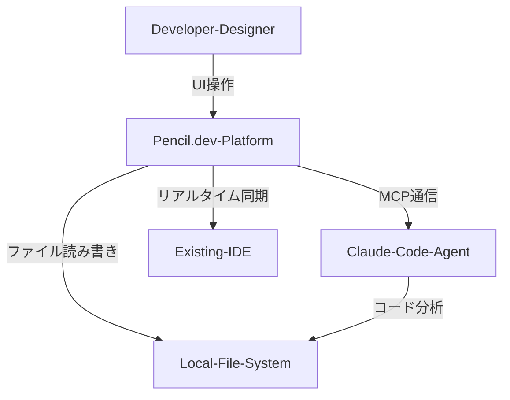
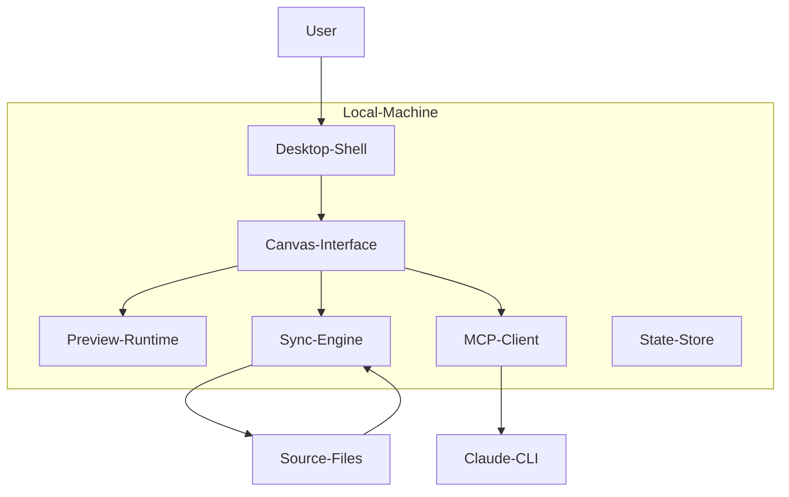
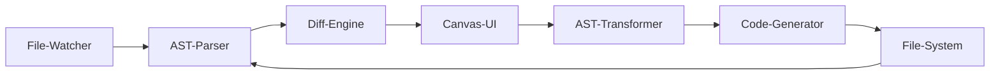

# 技術調査 - Pencil.dev

## ■1. 概要

Pencil.devは、IDEのテキスト管理とデザインツールの視覚的操作を融合させたGenerative UIプラットフォームです。
このツールは、Model Context Protocol（MCP）を中核に据えたエージェント駆動型キャンバスとして機能します。
コードを唯一の真実として扱い、抽象構文木のリアルタイム変換で視覚的変更を反映します。


## ■2. 特徴

### 2.1 IDEの変遷と視覚的文脈の乖離
ソフトウェア開発は、抽象化の向上によって進化しました。
現代のフロントエンド開発には、依然としてデザイナーとエンジニアの間に断絶が存在します。
デザイナーはFigmaなどの視覚的ツールを使用します。
エンジニアはVS Codeなどの言語的ツールを使用します。
両者の橋渡しには手作業が必要であり、非効率性が生じます。
従来のWYSIWYGエディタは、生成コードの品質や保守性に課題がありました。

### 2.2 Generative UIとVibe Codingの定義
Pencil.devは、この課題を解決するためにGenerative UIとVibe Codingを導入します。

| 要素名        | 説明                                                                                                  |
| :------------ | :---------------------------------------------------------------------------------------------------- |
| Generative UI | AIがコンテキストを理解し、実行可能なコードを動的に生成するプロセス                                    |
| Vibe Coding   | 自然言語による「雰囲気（Vibe）」や意図を、AST変換を通じて厳密な実装コードへと着地させる技術パラダイム |

### 2.3 Pencil.devの独自性
Pencil.devは、MCPを介してローカル環境やAIモデルと深く統合します。
このツールは、ローカルファーストのアーキテクチャを採用します。
ユーザーのローカルマシン上のファイルやGitリポジトリを直接活用します。
AIエージェントがコードベースを理解するための共有ワークスペースとして機能します。

## ■3. 構造

### 3.1 C4モデルによる階層的分析
Pencil.devのアーキテクチャは、ユーザーインターフェース層、データ処理層、AI連携層、ファイルシステム層を統合します。
コードベースの上に広がる編集レイヤーとして機能します。

### 3.2 System Context (Level 1)
システムの外部接続関係を定義します。



| 要素名              | 説明                                         |
| :------------------ | :------------------------------------------- |
| Developer-Designer  | UI設計やプロンプト入力を行う主体             |
| Pencil.dev-Platform | 視覚的操作とコード生成を同期するキャンバス   |
| Claude-Code-Agent   | 自律型コーディングエージェント               |
| Local-File-System   | 唯一の信頼できる情報源となるソースファイル群 |
| Existing-IDE        | 開発者が日常的に使用するエディタ             |

### 3.3 Container Architecture (Level 2)
Pencil.dev内部の主要なプロセスを分解します。



| 要素名           | 説明                                                   |
| :--------------- | :----------------------------------------------------- |
| Desktop-Shell    | ウィンドウ管理やファイルアクセス権限を制御する基盤     |
| Canvas-Interface | 無限キャンバスやコンポーネント配置を提供するUI層       |
| Preview-Runtime  | Reactコードを実行し、レンダリング結果を表示する環境    |
| Sync-Engine      | ファイル監視やAST変換を実行する中核コンポーネント      |
| MCP-Client       | 外部のAIエージェントと通信するためのブリッジ           |
| State-Store      | 付箋の位置などコード化されないメタデータを管理する領域 |
| Source-Files     | ローカルディスク上のプロダクトコード                   |
| Claude-CLI       | MCPサーバーとして機能する自律型AIプロセス              |

### 3.4 Component Breakdown (Level 3)
同期エンジンの内部構造を示します。



| 要素名          | 説明                                          |
| :-------------- | :-------------------------------------------- |
| File-Watcher    | ファイルシステムの変更イベントを監視する機能  |
| AST-Parser      | ソースコードを抽象構文木に変換する機能        |
| AST-Transformer | キャンバス操作をASTノードの変更に変換する論理 |
| Code-Generator  | 変更後のASTからソースコードを再構成する機能   |
| Diff-Engine     | 外部変更とキャンバス操作の競合を解決する機能  |

## ■4. データ

### 4.1 コード＝真実の原則
Pencil.devでは、Gitリポジトリにあるファイルが唯一の信頼できるデータモデルです。

| データ種別         | 形式             | 役割                     |
| :----------------- | :--------------- | :----------------------- |
| コンポーネント定義 | .tsx, .jsx, .vue | UIの構造とロジックの管理 |
| スタイルデータ     | .css, Tailwind   | 見た目の定義と同期       |
| プロジェクト設定   | package.json     | 依存関係やパスの解決     |

### 4.2 デザインメタデータ
Pencil.devは独自のメタデータファイルを保持します。
このファイルは、キャンバス上の配置やAIへの指示履歴を保存します。
ソースコードと疎結合な状態でデータを永続化します。

### 4.3 ブランドキットの統合
プロジェクト内のCSS変数や定数からデザイントークンを抽出します。
AIが新しいUIを生成する際、既存のコンポーネントやトークンを優先して使用します。

## ■5. 主要機能

### 5.1 双方向同期のメカニズム
HMRを利用してプレビューを即座に更新します。
キャンバス上の視覚的変更を最適なJSX構造やCSSへ反映します。
手動編集機能によりトークンを消費せずにコードを調整できます。

### 5.2 ローカルLLM連携
Claude CLIを介してAIモデルと通信します。
プロンプトやコードスニペットはローカルプロセスを経由して処理されます。
企業のセキュリティポリシーに合わせたログ監視が可能です。

### 5.3 AIマルチプレイヤー
人間とAIが同じキャンバス上で並行して作業します。
Gitブランチを使用した変更管理戦略を採用します。
ユーザーの承認後に変更をメインコードに統合します。

### 5.4 競合技術との比較

| 比較項目   | Pencil.dev       | Figma            | V0.dev           | Cursor           |
| :--------- | :--------------- | :--------------- | :--------------- | :--------------- |
| 信頼の源泉 | ソースファイル   | デザインファイル | 生成コード       | テキストバッファ |
| 実行環境   | ローカルDesktop  | クラウドブラウザ | クラウドブラウザ | ローカルDesktop  |
| 同期方向   | 双方向           | 一方向           | 一方向           | テキスト中心     |
| AIの役割   | 自律エージェント | 補助ツール       | 生成エンジン     | コード補完       |

## ■6. 環境構築と制限

### 6.1 前提条件と制限事項 (Early Access)
Pencil.devは現在ベータ版（Early Access）であり、利用には待機リストへの登録が必要です。
また、AI機能の中核として **Claude Code** を利用するため、AnthropicのアカウントおよびCLIツールの導入が必須となります。

**注意: MCP設定の不安定性**
Pencil.dev（および類似のGitHub Copilot CLIなど）におけるMCP連携は発展途上です。
特に、自動インストールプロセスに対応していないMCPサーバーを手動で設定した場合、プロセスが予期せず終了したり、エラーを吐いてクラッシュしたりするケースが確認されています。

### 6.2 インストール手順

ここでは主な2つの導入パターンを紹介します。

#### パターンA: VS Code / Cursor 拡張機能
1. **拡張機能の追加**: マーケットプレイスから「Pencil」をインストール。
2. **アカウント有効化**: メール認証を実施。
3. **Claude Codeの準備**:
   ```bash
   npm install -g @anthropic-ai/claude-code-cli
   claude login
   ```
4. **.penファイルの作成**: プロジェクト内にファイルを作成して起動確認。

#### パターンB: Desktop App (macOS/Linux)
1. **アプリのダウンロード**: 公式サイトからdmgなどを取得してインストール。
2. **認証**: アプリ内ブラウザまたはシステムブラウザで認証。
3. **プロジェクトを開く**: ローカルフォルダを指定して起動。

※ Windowsネイティブアプリは未提供のため、パターンAを利用してください。

## ■7. 利用方法

### 7.1 基本フロー
1. `.pen` ファイルを作成し、Pencilエディタを起動。
2. 無限キャンバス上で「Design」と「Code」を行き来する。

### 7.2 Design to Code
キャンバスにフレームを描画し、`Cmd+K` でAIプロンプトを呼び出します。
「ログイン画面を作って」と指示すると、対応するReactコンポーネントが生成されます。

### 7.3 Code to Design
既存の `Login.tsx` などをキャンバスにドラッグまたはインポートします。
コード構造を保ったまま視覚的に編集し、変更をコードに書き戻せます。

## ■8. ベストプラクティス

Pencil.devの特性を活かすための推奨プラクティスです。

- **コンポーネントライブラリの早期構築**
  ボタンやカードなど、基本となるUIパーツを早めにコンポーネント化し、Pencil内で再利用可能な状態にします。
- **具体的なプロンプト**
  「いい感じにして」よりも「背景を青のグラデーションにし、白文字で配置して」のように、視覚的特徴を具体的に指示します。
- **バージョン管理の徹底**
  `.pen` ファイルもGit管理対象です。デザインの変更履歴をコードと共にコミットしましょう。
- **Figmaとの使い分け**
  複雑なベクター描画やロゴ作成はFigmaで行い、Pencilへはコピー＆ペーストで持ち込むのが効率的です。

## ■9. トラブルシューティング

### 9.1 認証メールが届かない
迷惑メールを確認し、それでも届かない場合は再インストールを試してください。

### 9.2 Claude Code未接続
ターミナルで `claude` コマンドが通るか確認してください。
APIキーの競合（環境変数 `ANTHROPIC_API_KEY`）がある場合は整理が必要です。
また、エラーログに `JSON-RPC error: -32601` 等が記録されている場合、MCPサーバー側の定義とクライアント（Pencil）側の要求メソッドが不一致を起こしています。`.pen/config.json` の設定を見直してください。

## ■10. まとめ

Pencil.devは、長らく分断されていた「デザイン」と「エンジニアリング」の世界を、AIとAST変換技術によって強引かつ鮮やかに接続しようとしています。
まだ早期アクセス段階であり、MCP設定の不安定さや、Claude Codeへの強い依存といった課題は残ります。しかし、ソースコードを唯一の正解としながら、視覚的な試行錯誤を許容するそのアーキテクチャは、間違いなくAI時代のIDEが向かうべき一つの未来形を示しています。

まずはCursorやVS Codeの拡張機能として、小さなコンポーネントのデザインから試してみることをお勧めします。「コードを書く」感覚と「絵を描く」感覚が融合する新しい体験が、そこにはあるはずです。

## ■参考リンク

- 公式ドキュメント
  - [Pencil – Design on canvas. Land in code.](https://www.pencil.dev/)
  - [Pencil.dev Documentation](https://docs.pencil.dev/)

