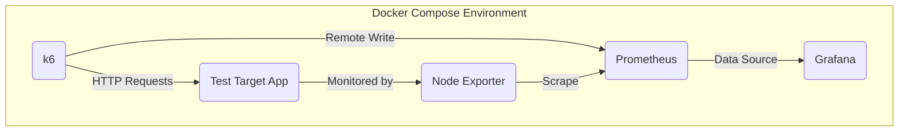
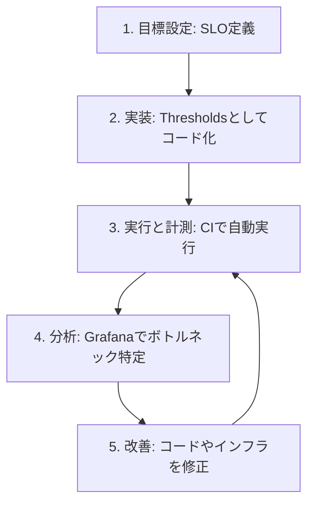

## ■はじめに

Webサイトやアプリケーションのパフォーマンスは、ユーザーエクスペリエンス、ひいてはビジネスの成功を左右する生命線です。パフォーマンスの低下は、ユーザーの離脱やコンバージョン率の悪化に直結します。

この課題に対し、開発の早期段階から継続的にテストを組み込む「**シフトレフト**」のアプローチが不可欠です。このアプローチでは、開発者自身がパフォーマンスへの責任を持ちます。

**Grafana k6**のようなモダンなテストツールは、このシフトを強力に支援します。JavaScriptでテストを記述でき、CI/CDパイプラインへも容易に統合可能です。

効果的なテストの鍵は、明確な目標設定にあります。例えば、「**95%のログインリクエストは200ミリ秒以内に完了する**」といった具体的で測定可能な **サービスレベル目標（SLO）** を定義します。このSLOが、テストの合否を判定する客観的な基準となります。

この記事は、パフォーマンステストの戦略的な観点を整理し、Grafana k6を用いて実践する方法を網羅的に解説します。理論と実践を橋渡しすることで、読者がパフォーマンスを継続的に改善し、ビジネス価値を最大化するための一助となることを目指します。


## ■第1部：パフォーマンステストの戦略的フレームワーク

パフォーマンステストを成功させるには、まず目的と種類を戦略的に理解する必要があります。本章では、パフォーマンステストの主要な観点と、評価に用いる核心的な指標を解説します。

### ●1.1 パフォーマンステストの主要な観点と目的

パフォーマンステストは、それぞれ異なる目的を持つ複数のテストタイプの集合体です。これらを戦略的に組み合わせることで、システムのパフォーマンス特性を多角的に理解できます。

| テストタイプ | 主な問い | 目的 | 代表的な負荷パターン | 主な監視指標 |
| :--- | :--- | :--- | :--- | :--- |
| **負荷テスト** | 通常・ピーク時の負荷で期待通りに動作するか | 期待される負荷に対するパフォーマンスの検証、SLOの遵守確認、ボトルネックの早期発見 | 段階的に負荷を上げ、一定期間ピーク負荷を維持 | 応答時間、スループット、エラー率、リソース使用率 |
| **ストレステスト** | システムの限界はどこか。どう壊れ、どう回復するか | システムの破壊点の特定、障害発生時の挙動の評価、回復時間の測定 | 限界を超えると予想されるレベルまで負荷を急激に増加 | システムの安定性、回復時間、エラー処理能力、リソースの飽和点 |
| **耐久テスト** | 長時間稼働に耐えられるか。性能は劣化しないか | メモリリークやリソース枯渇の検出、長期間運用におけるパフォーマンス劣化の特定 | 通常またはやや高めの負荷を長時間（数時間〜数日）維持 | メモリ使用量の推移、応答時間の経時変化、システム全体の健全性 |
| **スパイクテスト** | 突発的なトラフィック急増に対応できるか | 瞬間的な負荷急増に対するシステムの応答性と回復力の評価、オートスケーリングの検証 | 短時間に負荷を爆発的に増加させ、その後すぐに元に戻す | 負荷急増時の応答時間、回復時間、エラー率、オートスケーリングの追従性 |
| **スケーラビリティテスト** | 負荷増に応じて効率的にスケールできるか | リソース追加とパフォーマンス向上の関係性の特定、スケーリングの制約の発見 | 負荷とリソースを段階的に増やしながらテストを繰り返し実行 | リソース使用率、負荷増加に対する応答時間の一貫性、スケーラビリティ係数 |
| **キャパシティテスト** | 性能要件を満たす最大容量はどれくらいか | パフォーマンスが劣化する前の最大ユーザー数やトランザクション量の特定、キャパシティプランニングの支援 | 性能がSLAを満たさなくなるまで負荷を徐々に増加 | 最大同時ユーザー数、リソース使用率、システムの破壊点 |

### ●1.2 計測すべき主要パフォーマンス指標

効果的なパフォーマンス分析のためには、適切な指標を計測することが不可欠です。指標は「サーバーサイド」「クライアントサイド」「リソース」の3つの階層で捉え、これらの因果関係を理解することがボトルネック分析の鍵となります。

#### ▷サーバーサイド指標 (The RED Method)

| 要素 | 説明 | k6メトリクス |
| :--- | :--- | :--- |
| **Rate (R)** | サービスが処理しているリクエスト数（1秒あたり）。システムの処理能力を示す | `http_reqs` |
| **Errors (E)** | 失敗したリクエストの割合。システムの信頼性を示す | `http_req_failed` |
| **Duration (D)** | リクエストの処理にかかる時間。ユーザーの体感速度に直接影響する | `http_req_duration` |

#### ▷クライアントサイド指標 (Core Web Vitalsなど)

| 指標 | 説明 |
| :--- | :--- |
| **LCP** | ページの主要コンテンツが表示されるまでの時間。読み込み速度を測る |
| **INP** | ユーザーの操作からブラウザが応答するまでの時間。ページの応答性を示す |
| **CLS** | ページ読み込み中に発生するレイアウトのズレの大きさ。視覚的な安定性を示す |
| **TTFB** | ブラウザがリクエストを送信してから最初の1バイトを受け取るまでの時間。サーバーの応答速度を示す |
| **FCP** | 何らかのコンテンツが初めて描画されるまでの時間。ユーザーが「読み込みが始まった」と感じる瞬間を捉える |

#### ▷リソース指標 (The USE Method)

| 要素 | 説明 | 監視対象例 |
| :--- | :--- | :--- |
| **Utilization (U)** | リソースがビジー状態であった時間の割合 | CPU使用率 |
| **Saturation (S)** | リソースが処理しきれない要求を抱えている度合い | CPUのロードアベレージ、メモリスワップ |
| **Errors (E)** | リソースで発生したエラーイベントの数 | ディスクI/Oエラー |


## ■第2部：Grafana k6によるテスト実装

本章では、Grafana k6を用いて、第1部で定義した各種パフォーマンステストを実装する方法を、実践的なコード例を交えて解説します。

### ●2.1 k6テストスクリプトの基本構造

k6のテストは、明確に定義されたライフサイクルに沿って実行されます。

1.  **initコンテキスト**: テストの準備段階。モジュールのインポートやテスト設定の定義を行います。
2.  **setup()関数**: テスト全体の開始時に1回だけ実行されます。テストデータの準備などに使用します。
3.  **VUコード (default()関数)**: テストの本体。各仮想ユーザー（VU）が繰り返し実行するコードです。
4.  **teardown()関数**: テスト全体の終了時に1回だけ実行されます。テストデータのクリーンアップなどに使用します。

<!-- end list -->

```javascript
// 1. initコンテキスト
import http from 'k6/http';
import { sleep } from 'k6';

export const options = {
  vus: 10,
  duration: '30s',
};

// 2. setup関数
export function setup() {
  console.log('テストのセットアップを開始します...');
  const authToken = 'dummy_token'; // 例: 認証トークン取得
  return { token: authToken };
}

// 3. VUコード
export default function (data) {
  const res = http.get('https://test.api.k6.io/my/crocodiles/', {
    headers: {
      Authorization: `Bearer ${data.token}`,
    },
  });
  sleep(1);
}

// 4. teardown関数
export function teardown(data) {
  console.log('テストの後処理を開始します...');
}
```

### ●2.2 テストシナリオの構築

k6の`scenarios`と`executors`機能により、多様な負荷パターンを忠実に再現できます。

| テストタイプ | 主な目的 | 推奨k6 Executor | options設定例 |
| :--- | :--- | :--- | :--- |
| **負荷テスト** | 期待負荷での性能検証 | `ramping-vus` | `stages: [{ duration: '5m', target: 100 }, ...]` |
| **ストレステスト** | システムの破壊点の特定 | `ramping-vus` | `stages: [{ duration: '2m', target: 2000 }, ...]` |
| **耐久テスト** | 長期的な安定性の検証 | `constant-vus` | `executor: 'constant-vus', vus: 50, duration: '8h'` |
| **スパイクテスト** | 突発的な負荷への耐性評価 | `ramping-arrival-rate` | `executor: 'ramping-arrival-rate', stages: [...]` |
| **スケーラビリティテスト** | リソース追加と性能向上の関係特定 | `per-vu-iterations` | `executor: 'per-vu-iterations', vus: 50, iterations: 100` |
| **キャパシティテスト** | 性能要件を満たす最大容量の特定 | `ramping-vus` | `stages: [{ duration: '30m', target: 5000 }]` |

#### ▷複数シナリオの組み合わせ

現実のトラフィックは多様なユーザー行動で構成されます。k6の`scenarios`機能は、これらの異なる行動を異なる負荷パターンで同時に実行し、テストの現実性を高めます。

```javascript
import http from 'k6/http';
import { sleep } from 'k6';

// ユーザー行動1: Webサイト閲覧
export function browse_website() {
  http.get('https://test.k6.io/contacts.php');
  sleep(1);
}

// ユーザー行動2: API問い合わせ
export function query_api() {
  http.get('https://test.api.k6.io/public/crocodiles/');
  sleep(1);
}

export const options = {
  scenarios: {
    // シナリオ1: Webサイトの通常ブラウジング
    website_Browse: {
      executor: 'ramping-vus',
      exec: 'browse_website',
      stages: [
        { duration: '5m', target: 200 },
      ],
    },
    // シナリオ2: APIへの定常的なアクセス
    api_queries: {
      executor: 'constant-arrival-rate',
      exec: 'query_api',
      rate: 50,
      timeUnit: '1s',
      duration: '5m',
      preAllocatedVUs: 100,
    },
  },
};
```

### ●2.3 アサーションと合否判定

パフォーマンステストでは、負荷状況下でシステムが「正しく」かつ「十分に速く」動作するかを確認します。

  * **Checks**: **機能的正当性**を検証します。HTTPレスポンスのステータスコードなどを確認します。Checkが失敗してもテストは中断されず、成功率が記録されます。
  * **Thresholds**: **性能要件（SLO）をコード化し、テスト全体の合否を自動判定**します。基準を満たせない場合、k6は非ゼロの終了コードを返し、CI/CDパイプラインのビルドを失敗させることができます。

<!-- end list -->

```javascript
import http from 'k6/http';
import { check } from 'k6';

export const options = {
  thresholds: {
    // HTTPエラー率は1%未満
    'http_req_failed': ['rate<0.01'],
    // リクエストの95%は500ms以内に完了
    'http_req_duration': ['p(95)<500'],
    // Checksの成功率は99%以上
    'checks': ['rate>0.99'],
  },
};

export default function () {
  const res = http.get('https://test.k6.io/');
  check(res, { 'status is 200': (r) => r.status === 200 });
}
```


## ■第3部：統合観測環境の構築と高度な分析

テストの真価は、メトリクスをリアルタイムで可視化し、アプリケーションやインフラの状態と相関させることで発揮されます。本章では、k6、Prometheus、Grafanaなどを組み合わせた統合観測環境の構築方法を解説します。

### ●3.1 Docker Composeによるテスト・観測環境の構築

Docker Composeを使うと、複数のコンポーネントからなる環境を単一の設定ファイルで管理できます。

#### ▷環境構成図



| 要素名 | 説明 |
| :--- | :--- |
| **k6** | 負荷を生成し、テストメトリクスをPrometheusに送信するクライアント |
| **Prometheus** | k6やNode Exporterからのメトリクスを収集・保存する時系列データベース |
| **Node Exporter** | テスト対象サーバーのCPU、メモリなどのシステムメトリクスを収集・公開するエージェント |
| **Grafana** | Prometheusに保存されたメトリクスを可視化するダッシュボードツール |
| **Test Target App** | パフォーマンステストの対象となるアプリケーション |

### ●3.2 k6から時系列データベースへのリアルタイム連携

k6で生成されたメトリクスをリアルタイムでTSDBに送信し、テスト実行中のパフォーマンスをライブで監視します。

  * **Prometheus Remote Write**: k6はPrometheusのRemote Writeプロトコルをネイティブサポートしており、`--out`フラグで簡単に連携できます。

<!-- end list -->

```bash
# Dockerコンテナ内でk6テストを実行し、結果をPrometheusに送信
docker-compose run --rm k6 run /scripts/test.js -o experimental-prometheus-rw
```

### ●3.3 Grafanaによる統合ダッシュボードと相関分析

Grafanaは、複数のデータソースからの情報を単一のダッシュボードに統合し、相関関係を明らかにします。

#### ▷相関分析によるボトルネック特定プロセス

1.  **統合ダッシュボード作成**: Grafanaで、k6のテストメトリクス（応答時間など）とNode Exporterのシステムメトリクス（CPU使用率など）を同じ時間軸で表示するダッシュボードを作成します。
2.  **テスト実行と監視**: k6で負荷テストを実行し、統合ダッシュボードをリアルタイムで監視します。
3.  **相関の発見**: 応答時間（p95）のグラフが急上昇したタイミングで、テスト対象サーバーのCPU使用率も95%に張り付いていることを確認します。
4.  **結論**: この観測結果から、「**仮想ユーザー数の増加が原因でサーバーのCPUが飽和し、リクエスト処理が遅延した**」という仮説を立てます。

このように、異なるメトリクスを相関させることで、パフォーマンス問題の根本原因をデータに基づいて特定できます。


## ■第4部：パフォーマンステストの継続的改善

パフォーマンステストは一度きりの活動ではありません。継続的に実施し、結果を開発のフィードバックループに組み込むことが重要です。

### ●4.1 CI/CDパイプラインへの統合

CI/CDパイプラインにパフォーマンステストを自動で組み込むことで、コード変更がパフォーマンスに与える影響（リグレッション）を迅速に検出できます。k6の**Thresholds**機能は、設定した基準を満たせなかった場合に非ゼロの終了コードを返すため、CI/CDツールのビルドを自動的に失敗させ、即座にフィードバックを提供できます。

#### ▷GitHub Actionsによる実装例

```yaml
#.github/workflows/performance-test.yml
name: 'k6 Performance Test'

on:
  pull_request:
    branches: [ main ]

jobs:
  k6-test:
    runs-on: ubuntu-latest
    steps:
      - name: Checkout
        uses: actions/checkout@v3

      - name: Install k6
        run: |
          # k6のインストールスクリプト
          sudo apt-get update
          sudo apt-get install k6

      - name: Run k6 performance test
        # このスクリプトにはThresholdsが設定されている
        run: k6 run k6-scripts/test-pr.js
```

### ●4.2 結果の分析とフィードバックループ

テストの自動化に加え、結果を分析し、改善に繋げるサイクルを確立します。

#### ▷パフォーマンス改善サイクル



このフィードバックループを継続的に回すことで、パフォーマンスは「時々気にする問題」から「**常に管理される品質特性**」へと変わります。


## ■まとめ

この記事では、パフォーマンステストの戦略から実践までを網羅的に解説しました。現代のアプリケーション開発において、パフォーマンステストは単発のイベントではなく、ビジネスの成功に直結する**継続的な品質保証活動**です。

* **目的指向のテスト**: 負荷テストやストレステストなど、多様なテストを戦略的に組み合わせ、システムのパフォーマンスを包括的に理解します。
* **SLOに基づく自動化**: k6の**Thresholds**機能でSLOをコード化し、CI/CDパイプラインに「品質ゲート」を組み込み、デグレードを未然に防ぎます。
* **メトリクスの相関分析**: k6のテストメトリクス（原因）とシステムのメトリクス（結果）を相関させ、問題の根本原因をデータに基づいて特定します。

最終的な目標は、組織内に「**パフォーマンス文化**」を醸成することです。すべてのエンジニアが自らのコードのパフォーマンスに責任を持ち、品質の一部として常に意識する状態を目指しましょう。k6のような開発者フレンドリーなツールは、この文化を育む強力な触媒となります。

少しでも参考になった、あるいは改善点などがあれば、ぜひリアクションやコメント、SNSでのシェアをいただけると励みになります！


## ■引用リンク

はい、承知いたしました。ご指定のフォーマットで引用文献を再分類します。

***

### ●パフォーマンステストの観点・指標
- [13 Metrics to Measure Website Performance in 2025 - NitroPack](https://nitropack.io/blog/post/website-performance-metrics)
- [Different Types of Performance Testing Explained - Radview](https://www.radview.com/blog/different-types-of-performance-testing-explained/)
- [Node Exporter Full | Grafana Labs](https://grafana.com/grafana/dashboards/1860-node-exporter-full/)
- [Our beliefs - Load testing manifesto - Grafana k6](https://k6.io/our-beliefs/)
- [Performance Testing: Types, Tools, and Tutorial - TestRail](https://www.testrail.com/blog/performance-testing-types/)
- [The Ultimate Guide to Website Performance Metrics - Network Solutions](https://www.networksolutions.com/blog/website-performance-metrics/)
- [Top Web Performance Metrics to Track - Catchpoint](https://www.catchpoint.com/guide-to-synthetic-monitoring/web-performance-monitoring)
- [WEBパフォーマンス改善に取り組む前に知っておきたいこと - Qiita](https://qiita.com/h3sn/items/61b989583d69d9b61709)
- [Website Performance Metrics | An Actionable Guide - Cronitor](https://cronitor.io/guides/website-performance-metrics)
- [コアウェブバイタルとは？3つの指標でSEO評価を解説 | SEMLabo. - 株式会社オロ](https://www.oro.com/semlabo/265/)
- [サイトパフォーマンスとは｜指標や重要性・改善の目的と方法を解説](https://www.onamae.com/business/article/22381/)
- [ソフトウェアパフォーマンステストとは何か？ - Apidog](https://apidog.com/jp/blog/what-is-software-performance-testing-jp/)

---
### ●Grafana k6

#### ▷公式
- [Advanced Examples | Grafana k6 documentation](https://grafana.com/docs/k6/latest/using-k6/scenarios/advanced-examples/)
- [Checks | Grafana k6 documentation](https://grafana.com/docs/k6/latest/using-k6/checks/)
- [Grafana dashboards | Grafana k6 documentation](https://grafana.com/docs/k6/latest/results-output/grafana-dashboards/)
- [InfluxDB | Grafana k6 documentation](https://grafana.com/docs/k6/latest/results-output/real-time/influxdb/)
- [Metrics | Grafana k6 documentation](https://grafana.com/docs/k6/latest/using-k6/metrics/)
- [Prometheus remote write | Grafana k6 documentation](https://grafana.com/docs/k6/latest/results-output/real-time/prometheus-remote-write/)
- [Scenarios | Grafana k6 documentation](https://grafana.com/docs/k6/latest/using-k6/scenarios/)
- [Test lifecycle | Grafana k6 documentation](https://grafana.com/docs/k6/latest/using-k6/test-lifecycle/)
- [Thresholds | Grafana k6 documentation](https://grafana.com/docs/k6/latest/using-k6/thresholds/)
- [Website Stress Testing | k6](https://k6.io/website-stress-testing/)
- [grafana.com](https://grafana.com/ja/products/cloud/k6/#:~:text=Grafana%20Cloud%20k6%E3%81%AF%E3%80%81%E7%8F%BE%E4%BB%A3,%E3%82%A2%E3%83%97%E3%83%AA%E3%82%B1%E3%83%BC%E3%82%B7%E3%83%A7%E3%83%B3%E3%82%92%E6%8F%90%E4%BE%9B%E3%81%97%E3%81%BE%E3%81%99%E3%80%82)
- [k6 Prometheus | Grafana Labs](https://grafana.com/grafana/dashboards/19665-k6-prometheus/)

#### ▷GitHub
- [docker-compose.yml - grafana/xk6-output-influxdb - GitHub](https://github.com/grafana/xk6-output-influxdb/blob/main/docker-compose.yml)
- [docker-compose.yml - savvagen/k6-prometheus-exporter - GitHub](https://github.com/savvagen/k6-prometheus-exporter/blob/master/docker-compose.yml)
- [k6-learn/Modules/II-k6-Foundations/07-Setting-test-criteria-with-thresholds.md at main](https://github.com/grafana/k6-learn/blob/main/Modules/II-k6-Foundations/07-Setting-test-criteria-with-thresholds.md)
- [SwissLife-OSS/K6-MultiScenario-template: A K6 Multi Scenario template applying some best practices along some examples - GitHub](https://github.com/SwissLife-OSS/K6-MultiScenario-template)

#### ▷記事
- [API Performance Testing with k6 - A Quick Start Guide - DEV Community](https://dev.to/nadirbasalamah/api-performance-testing-with-k6-a-quick-start-guide-2ngc)
- [Analysing Application Performance Metrics with k6 | by Sahani Perera - Medium](https://medium.com/@sahaniperera995/analysing-application-performance-metrics-with-k6-77a9c155e0bf)
- [Grafana k6とは？機能や特徴・製品の概要まとめ - Findy Tools](https://findy-tools.io/products/grafana-k6/359)
- [Grafana: Using Prometheus - Stackhero](https://www.stackhero.io/en-US/services/Grafana/documentations/Using-Prometheus)
- [HTTP request testing with k6 - CircleCI](https://circleci.com/blog/http-request-testing-with-k6/)
- [How to Execute Load Tests Using the k6 Framework - Baeldung](https://www.baeldung.com/k6-framework-load-testing)
- [Introduction to Modern Load Testing with Grafana K6 | Better Stack Community](https://betterstack.com/community/guides/testing/grafana-k6/)
- [Learn k6 Series - E5 - Checks - YouTube](https://www.youtube.com/watch?v=b44GPyTavpI)
- [Load and stress testing with k6 | Željko Šević | Node.js Developer](https://sevic.dev/notes/load-stress-testing-k6/)
- [Load test with k6 | Sylhare's blog](https://sylhare.github.io/2024/03/26/Load-test-with-k6.html)
- [Load testing using k6 - DEV Community](https://dev.to/eminetto/load-testing-using-k6-57ph)
- [Performance Testing with K6, InfluxDB, and Grafana using Docker Compose - Medium](https://medium.com/@rundcodehero/performance-testing-with-k6-influxdb-and-grafana-using-docker-compose-5a418b39b50e)
- [Performance under control with k6 – Docker and integration with InfluxDB and Grafana](https://sii.pl/blog/en/performance-under-control-with-k6-docker-and-integration-with-influxdb-and-grafana/)
- [Setting Up Load Testing and Monitoring with Docker, k6, Prometheus, Grafana, and InfluxDB](https://justinecodez.medium.com/setting-up-load-testing-and-monitoring-with-docker-k6-prometheus-grafana-and-influxdb-f311b8f1f271)
- [負荷テストツール「k6」入門 - Zenn](https://zenn.dev/pharmax/articles/98ed49994cdaf2)
