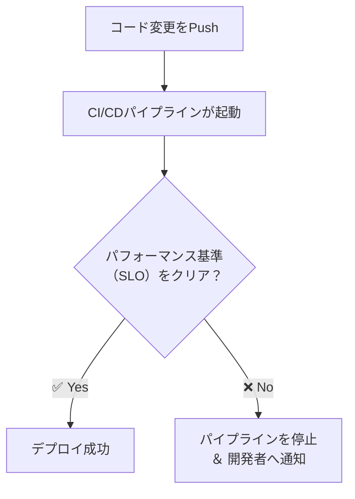

## ■はじめに: なぜ今、負荷テストツールの「選び方」が重要なのか？

「どの負荷テストツールが一番良いですか？」——この問いに、唯一絶対の正解はありません。なぜなら、最適なツールは、あなたのチームの**開発文化、技術スタック、そして未来のビジョン**によって決まるからです。

パフォーマンスが製品の成功に直結する現代において、ツールの選定はもはや単なる機能比較ではなく、**ビジネスの成否を左右する戦略的な意思決定**です。

本記事では、ツールの表面的な機能に惑わされることなく、本質的な価値を捉え、自社の状況に最適なツールを論理的に選定するための**7つの評価軸からなる戦略的フレームワーク**を提案します。

1.  **テストの目的**: 何を明らかにしたいのか？ (プロトコル vs ブラウザ)
2.  **シナリオ作成**: 誰が、どう作るのか？ (Tests-as-Code vs GUI)
3.  **チームのスキルセット**: 誰が、無理なく使えるか？ (言語との親和性)
4.  **CI/CDへの統合**: どうやって自動化し続けるか？
5.  **オブザーバビリティ連携**: どうやって原因を特定するか？
6.  **負荷インフラ**: 自前で構築(Build)か、サービス利用(Buy)か？
7.  **総所有コスト (TCO)**: 見えざるコストを含めた真の費用は？

このフレームワークが、あなたのチームにとって最良の選択をするための一助となれば幸いです。

:::message
本記事では主にオープンソースツールに焦点を当てて解説しますが、このフレームワークは商用のSaaSを選択する際の判断基準としても活用できます。
:::

## ■第1章: 負荷テストツール選定の戦略的フレームワーク

本章では、ツール選定を成功に導く**7つの重要な評価軸**を一つずつ掘り下げて解説します。

### ●1.1. テストの目的：プロトコルレベル vs ブラウザレベル

ツール選定の最初のステップは、「テストによって何を明らかにしたいのか？」という**コア目標の定義**です。これは、システムの裏側を測る「プロトコルレベルテスト」と、ユーザー体験を測る「ブラウザレベルテスト」の2つに大別されます。

| テスト種別 | プロトコルレベルテスト | ブラウザレベルテスト |
| :--- | :--- | :--- |
| **目的** | バックエンド（サーバー、DB等）の限界性能やボトルネックの特定 | ユーザーが実際に体感する表示速度（レンダリング性能）の測定 |
| **シミュレーション対象** | APIリクエスト等のサーバー通信（HTTP/S, gRPC等） | 実際のブラウザ上でのユーザー操作（クリック、入力等） |
| **測定項目例** | 応答時間、スループット(RPS)、エラーレート | Core Web Vitals、DOMレンダリング時間、JS実行時間 |
| **リソース効率** | **◎ 高効率**（1台で数千〜数万の仮想ユーザーを生成可能） | **△ 低効率**（ブラウザ実行のためリソース消費大） |
| **主なツール** | JMeter, Gatling, k6, Locust | k6 browser, Playwright, Puppeteer |
| **適したアプリ** | APIサーバー、マイクロサービス、バックエンド処理 | JavaScriptを多用するSPA、ECサイトの決済画面など |

かつては両者を別々のツールで測定していましたが、データの分断が課題でした。現代のトレンドは、両者を融合させる**ハイブリッドテスト**です。

その代表格が **Grafana k6** です。k6は、高効率なプロトコルレベルテストを主軸としつつ、「k6 browserモジュール」で、同一スクリプト内でブラウザテストも実行できます。このアプローチにより、「APIサーバーに高負荷がかかった状態で、ユーザーの決済完了までの画面表示はどれほど遅くなるか？」といった、**より現実世界に近いシナリオ**の分析が可能になります。

:::message
**選定のポイント**: 自社の実態に合った**ハイブリッドテスト**を、いかにスムーズに実現できるか？
:::

### ●1.2. シナリオ作成：Tests-as-Code vs GUI

テストシナリオをどう作るか？ この選択は、チームの生産性と保守性を大きく左右します。直感的なGUIベースか、柔軟なコードベース（**Tests-as-Code**）か、その違いを見ていきましょう。

| アプローチ | GUI駆動型アプローチ（旧来） | Tests-as-Code（現代） |
| :--- | :--- | :--- |
| **代表的なツール** | Apache JMeter | **Grafana k6, Locust, Gatling** |
| **テスト作成方法** | GUI画面で要素を配置・設定する | 汎用プログラミング言語でシナリオを記述する |
| **成果物** | 巨大で可読性の低いXMLファイル（例: .jmx） | 読みやすいテキストベースのコード（例: .js, .py） |
| **バージョン管理(Git)** | 困難（差分確認やマージがほぼ不可能） | **容易（コードレビュー、変更履歴の追跡が可能）** |
| **コラボレーション** | 専任のQA担当者に依存しがち | **開発者とQAが共同で作成・保守できる** |
| **開発プロセスへの影響** | 開発サイクルの終盤で実施されがち | **開発初期から組み込む「シフトレフト」を強力に推進** |

「Tests-as-Code」は、テストをアプリケーションコードと同じように扱います。これにより、パフォーマンスは特定の誰かの仕事ではなく、開発者とQAが一体となって取り組む「**共有責任（Shared Responsibility）**」へと昇華し、問題の早期発見・修正による手戻りコストを劇的に削減します。

:::message
**選定のポイント**: 「**Tests-as-Code**」をサポートし、**シフトレフト**の文化を醸成できるか？
:::

### ●1.3. チームのスキルセット：学習コストの最小化

新しいツールの導入で最も見過ごされがちなのが、チームの**既存スキルセットとの相性**です。エンジニアが慣れ親しんだ言語やエコシステムに適合するツールを選ぶことで、学習コストを最小限に抑え、迅速な立ち上がりを実現できます。

**主要言語と適合ツール**

| 主要言語 | 最適なツール候補 |
| :--- | :--- |
| **JavaScript/TypeScript** | **Grafana k6**, Gatling (JS/TS SDK) |
| **Python** | **Locust**, The Grinder |
| **Java/JVM (Scala, Kotlin)** | **Gatling**, Apache JMeter (Groovy, JMeter DSL) |

言語だけでなく、IDEの補完機能、ビルドツール（Maven/npm等）、依存関係の管理方法といった**開発エコシステム全体**との連携も重要です。ツール選定時には「ツールチェーンの監査」を行い、既存の環境に自然に溶け込むかを評価しましょう。

:::message
**選定のポイント**: チームが日常的に使っている**言語やツールとの親和性**は高いか？
:::

### ●1.4. CI/CDへの統合：リグレッションの自動防止

現代のパフォーマンステストは、一度きりのお祭りではありません。**CI/CDパイプラインに組み込み、継続的に自動実行する**ことで真価を発揮します。そのため、CI/CDツールとのシームレスな統合は絶対条件です。

**CI/CD親和性の高いツール**

  * **Grafana k6:** 公式のGitHub Actionsが優秀。テストコード内に「**閾値（Thresholds）**」としてSLOを直接定義でき、基準未達の場合にCIジョブを自動で失敗させられるため、設定が非常に簡単です。
  * **Gatling:** 公式のJenkins/Maven/Gradleプラグインが提供されており、JVMベースのプロジェクトにスムーズに統合できます。
  * **Apache JMeter:** 統合は可能ですが、設定が煩雑になりがちです。**Taurus**のようなツールで抽象化するのが一般的です。

:::message
**選定のポイント**: CI/CDへの組み込みが容易で、**開発者へのフィードバックループを短縮**できるか？
:::

### ●1.5. 分析の鍵：オブザーバビリティとの連携

負荷テストは、**負荷をかけることがゴールではありません。** テスト結果（点）と、その時のサーバーの状態（点）を結びつけ、パフォーマンス問題の**根本原因を特定すること**が目的です。これを実現するのが **オブザーバビリティ（可観測性）** です。

理想は、負荷テストの結果、サーバーメトリクス（CPU/メモリ）、ログ、トレースといった全てのデータを「**単一のダッシュボード（Single Pane of Glass）**」で相関分析できる環境です。

**ツールとオブザーバビリティプラットフォームの連携**

  * **k6 と Grafana:** 同じGrafana Labs製品であり、**最高の連携性**を誇ります。特別な設定なしで、k6のテスト結果をGrafanaダッシュボードにリアルタイムで出力し、他のシステムメトリクスと重ね合わせて分析できます。
  * **Gatling と JMeter:** Backend Listener等を介してInfluxDBやGraphiteにデータを出力し、それをデータソースとしてGrafanaで可視化するのが一般的な構成です。
  * **商用ツール (LoadRunner等):** DatadogやDynatraceといった主要APMツールとの直接的な連携機能を備えています。

:::message
**選定のポイント**: 自社で利用中の**オブザーバビリティ基盤と、いかに簡単に連携できるか？**
:::

### ●1.6. 負荷インフラ：自前構築 (Build) vs サービス利用 (Buy)

大規模な負荷を生成するには、相応のインフラが必要です。その準備・管理方法は、大きく「**自前で構築する（Build）**」か、「**マネージドSaaSを利用する（Buy）**」かの2択に分かれます。

| インフラ戦略 | セルフホスト（自前で構築） | マネージドSaaS（サービス利用） |
| :--- | :--- | :--- |
| **概要** | 自社のサーバーやクラウドVM上でOSSツールを直接実行 | クラウドベースの負荷テストプラットフォームを利用 |
| **担当範囲** | 負荷生成マシンの準備、設定、管理、保守の**すべて** | インフラ管理は**サービス提供者**が担当 |
| **主なツール/サービス** | JMeter, Locust, k6, Gatling | **Grafana Cloud k6**, BlazeMeter, LoadNinja |
| **メリット** | ・完全なコントロール\<br/\>・初期コストが低い（OSSの場合） | ・**インフラ管理が不要**\<br/\>・大規模・地理分散テストが**数クリックで可能**\<br/\>・高度な分析・レポート機能\<br/\>・迅速なテスト開始 |
| **デメリット** | ・インフラの構築・管理に**多大な工数がかかる**\<br/\>・スケーリングが複雑\<br/\>・総所有コスト(TCO)が高くなる可能性 | ・サブスクリプション料金が発生\<br/\>・プラットフォームへの依存 |
| **意思決定** | **Build (自社構築)** | **Buy (サービス購入)** |

SaaSプラットフォームは、エンジニアリングチームをインフラ管理という「**差別化につながらない重労働**」から解放します。例えば、5万ユーザーのテストを自前で実施するには、数十台のVMと複雑なネットワーク設定が必要ですが、SaaSなら数分で完了します。

:::message
**選定のポイント**: インフラ管理のコストと手間を考慮した上で、**BuildとBuyのどちらが合理的か？**
:::

### ●1.7. 見えざるコスト：総所有コスト (TCO) の評価

ツールの価値は、ライセンス費用だけでは測れません。ツールの導入から運用、保守にかかるすべてのコストを総合した **総所有コスト（TCO）** で判断する必要があります。

| コスト種別 | オープンソース（OSS） | 商用ツール（ライセンス/SaaS） |
| :--- | :--- | :--- |
| **ソフトウェア費用** | **無料** | ・初期ライセンス費用\<br/\>・サブスクリプション料金 |
| **エンジニアリングコスト** | ・学習、スクリプト作成、保守\<br/\>・**インフラ構築・管理**\<br/\>・トラブルシューティング | ・（SaaSの場合）インフラ管理コストは**ほぼ不要**\<br/\>・公式サポートにより問題解決時間を短縮 |
| **インフラコスト** | ・サーバー（VM）、ネットワーク、電力など | （SaaSの場合）サブスクリプション料金に**含まれる** |
| **機会損失** | インフラ管理やツールの制約回避に費やす時間 | 最小限 |

TCO評価の本質は、「**エンジニアの貴重な時間を、ツールやインフラの管理ではなく、本来の製品開発に使うべきではないか？**」という問いにあります。

  * **小規模なテスト**であれば、OSSをローカル実行するのが最もTCOが低くなります。
  * しかし、 **大規模なテスト（例: ブラックフライデー対策）** では、自前で構築するコストとリスクは計り知れません。この場合、SaaSを選択する方が、サイトダウンによるビジネス損失と比較して、はるかに合理的な投資となるでしょう。

:::message
**選定のポイント**: ソフトウェア費用だけでなく、**人件費やインフラコストを含めたTCO**で判断しているか？
:::

## ■第2章: 主要オープンソースツールの詳細分析

本章では、第1章のフレームワークに基づき、主要なオープンソース負荷テストツール4選を分析します。各ツールの特徴を理解し、あなたのチームに最適な選択肢を見つけましょう。

### ●比較概要: 主要オープンソースツール4選

| 項目 | Apache JMeter | Gatling | Locust | Grafana k6 |
| :--- | :--- | :--- | :--- | :--- |
| **主要言語** | Java (GUI), Groovy | Scala, Java, Kotlin, JS | Python | JavaScript (Goランタイム) |
| **アーキテクチャ** | スレッドベース | イベント駆動 (非同期) | イベント駆動 (非同期) | イベント駆動 (非同期) |
| **スクリプトパラダイム** | GUI駆動 (XML) | Tests-as-Code | Tests-as-Code | Tests-as-Code |
| **主な強み** | 圧倒的なプロトコル対応範囲 | JVMエコシステムとの親和性と高パフォーマンス | Pythonによる高い柔軟性と拡張性 | モダンな開発体験とオブザーバビリティ統合 |
| **CI/CD親和性** | 可能 (Taurus等で補強推奨) | 高い (Maven/Gradle/Jenkins連携) | 高い (Pythonスクリプトとして実行) | 非常に高い (公式Action, 閾値設定) |

### ●2.1. Apache JMeter: 広範なプロトコルをカバーする確立された主力ツール

長年オープンソース負荷テストの標準ツールとして君臨してきた、100% Java製のアプリケーションです。

  * **強み:**
      * **広範なプロトコルサポート:** Web (HTTP/S)、Webサービス、FTP、データベース(JDBC)、LDAP、JMS、メールなど、標準で多岐にわたるプロトコルに対応します。
      * **高い拡張性:** 豊富なプラグインにより、HTTP/2やgRPCなどのモダンなプロトコルにも対応可能です。
  * **特徴:**
      * **GUIベースのテスト作成:** コーディング経験が少ないテスターにも直感的です。
      * **詳細なHTMLレポート:** テスト実行後に、分析の起点となる詳細なダッシュボードを生成します。
  * **課題:**
      * **バージョン管理:** テストプラン（.jmxファイル）はXML形式のため、Gitなどでの差分管理や共同作業が困難です。
      * **リソース効率:** スレッドベースのアーキテクチャのため、大量のユーザーをシミュレートする際に多くのメモリとCPUを消費します。
  * **こんなチームに最適:**
      * 多様なレガシープロトコル（JDBC, JMS等）のテストが必要なチーム。
      * QA専任の担当者がおり、GUIベースの操作を好む文化を持つチーム。

### ●2.2. Gatling: パフォーマンスと開発者体験を両立するJVMの雄

高パフォーマンスと優れた開発者体験を目指す、Scalaベースのツールです。

  * **強み:**
      * **高性能アーキテクチャ:** Nettyベースの非同期・イベント駆動型アーキテクチャにより、少ないリソースで多くの仮想ユーザーを生成可能です。
      * **Tests-as-Code:** 表現力豊かなDSLを使い、Scala、Java、Kotlin、JS/TSでテストをコードとして記述します。IDEの補完機能やGitでのバージョン管理が容易です。
      * **高いCI/CD親和性:** 公式のMaven/Gradle/Jenkinsプラグインにより、既存のビルドプロセスへ容易に統合できます。
  * **特徴:**
      * **充実したプロトコルサポート:** HTTP/S, WebSocket, SSE, JMS, MQTT, gRPCなどを公式にサポートします。
      * **優れたHTMLレポート:** 視覚的に分かりやすく、一目でパフォーマンスの全体像を把握できるレポートを自動生成します。
  * **こんなチームに最適:**
      * 開発の主体がJavaやScalaなど、JVM言語中心のチーム。
      * 既存のMaven/Gradleビルドプロセスにテストを深く統合したいチーム。

### ●2.3. Locust: Pythonicなテストで柔軟性を極める

テストシナリオを純粋なPythonコードで記述することに特化したツールです。

  * **強み:**
      * **Pythonによる高い柔軟性:** Pythonの豊富なライブラリ（PyPI）を活用し、非常に複雑なテストロジックも実装できます。
      * **高いスケーラビリティ:** geventベースのイベント駆動型アーキテクチャと、ネイティブの分散テスト機能により、数百万ユーザー規模へスケールアウト可能です。
  * **特徴:**
      * **リアルタイムWeb UI:** テスト実行中に、アクティブユーザー数やRPSなどを監視できるインタラクティブなUIを提供します。
      * **Tests-as-Code:** テストスクリプトはバージョン管理が容易で、CI/CDパイプラインにも簡単に組み込めます。
  * **こんなチームに最適:**
      * バックエンドがPythonで構築されている、またはデータサイエンス系の複雑なロジックをテストシナリオに組み込みたいチーム。
      * スクリプトのシンプルさと拡張性を重視するチーム。

### ●2.4. Grafana k6: モダンなDevOpsのためのオブザーバビリティ指向ツール

開発者体験（DX）を最優先に設計された、Go製のモダンな負荷テストツールです。

  * **強み:**
      * **優れた開発者体験:** スクリプト言語としてJavaScript/TypeScriptを採用しており、フロントエンド開発者にも馴染みやすいです。
      * **最高のオブザーバビリティ連携:** Grafanaエコシステムとシームレスに連携し、負荷テストメトリクスとサーバーサイドのメトリクスを単一ダッシュボードで相関分析できます。
      * **高度なCI/CD統合:** 公式のGitHub Actionsや、コード内にSLOを定義できる「閾値（Thresholds）」機能により、パフォーマンスリグレッションの自動検知を容易に実現します。
  * **特徴:**
      * **ハイブリッドテスト:** プロトコルレベルの負荷と、実際のブラウザを動作させるテストを同一スクリプト内で実行できます。
      * **モダンなプロトコルサポート:** HTTP/2, WebSocket, gRPCをネイティブサポートします。
  * **こんなチームに最適:**
      * JavaScript/TypeScriptが開発の中心であるチーム。
      * DevOps/SRE文化が根付いており、オブザーバビリティとCI/CD連携を最重要視するチーム。

## ■第3章: フレームワークを利用した評価の例

それでは、このフレームワークを使って、ある架空の企業がどのようにツール選定を行うかシミュレーションしてみましょう。

### ●3.1. 前提となる自社の状況（例）

  * **企業体質:** アジャイル開発とDevOps文化が浸透している中規模テック企業。
  * **技術スタック:**
      * バックエンド: **Python** (メイン) と **JavaScript/TypeScript (Node.js)** を利用したマイクロサービスアーキテクチャ。
      * フロントエンド: モダンなSPA (React, Vueなど)。
  * **チームスキル:** エンジニアは**JavaScript**と**Python**に習熟している。
  * **CI/CD:** **GitHub Actions** を全面的に採用している。
  * **オブザーバビリティ:** **Grafana** と Prometheus を監視基盤の標準としている。
  * **目指す姿:**
      * テストをコードで管理する **Tests-as-Code** を推進したい。
      * 開発の早い段階で性能問題を検知する **シフトレフト** を実現したい。
      * APIの負荷テスト (プロトコル) と、重要な画面のUX評価 (ブラウザ) を両方実施したい (**ハイブリッドテスト**)。
      * 大規模テストは自前でインフラを管理せず、**SaaS (Buy)** を利用して効率化したい。

### ●3.2. 負荷テストツール評価比較表（例）

| 評価軸 (7つのフレームワーク) | Apache JMeter | Gatling | Locust | **Grafana k6** |
| :--- | :--- | :--- | :--- | :--- |
| **1. テストの目的**\<br/\>(ハイブリッドテスト) | **△ 微妙**\<br/\>プロトコルは強いが、ブラウザテストは別ツール扱い。連携がスムーズでない。 | **◯ 良い**\<br/\>プロトコルに強く、ブラウザも可能。ただしk6ほど統合的ではない。 | **△ 微妙**\<br/\>プロトコルは強力だが、統合されたブラウザテスト機能を持たない。 | **◎ 最適**\<br/\>**同一スクリプト**でプロトコルとブラウザを扱え、まさに理想的。 |
| **2. シナリオ作成**\<br/\>(Tests-as-Code) | **✕ 不適合**\<br/\>GUI駆動であり、文化に合わない。XMLファイルのGit管理は困難。 | **◯ 良い**\<br/\>コードで記述可能。ただしチームの主力言語(Scala)ではない。 | **◎ 最適**\<br/\>主力言語の **Python** で書けるため、開発者にとって非常に自然。 | **◎ 最適**\<br/\>主力言語の **JavaScript** で書ける。学習コストがほぼゼロ。 |
| **3. チームのスキルセット** | **△ 微妙**\<br/\>GUI中心。Groovyでのコード化は可能だが、誰も得意ではない。 | **△ 微妙**\<br/\>JVM言語(Scala/Kotlin)はチームの主要スキルではない。学習コストが発生。 | **◎ 最適**\<br/\>バックエンドチームの**主力言語Python**と完全に一致。 | **◎ 最適**\<br/\>フロント/バックエンド両チームの**主力言語JavaScript**と一致。 |
| **4. CI/CDへの統合**\<br/\>(GitHub Actions) | **△ 微妙**\<br/\>連携は可能だが設定が煩雑。スマートなパイプライン構築が難しい。 | **◯ 良い**\<br/\>Maven/Gradle連携は強いが、GitHub Actionsとの親和性はk6に劣る。 | **◯ 良い**\<br/\>Pythonスクリプトとして簡単に実行可能。 | **◎ 最適**\<br/\>公式の**GitHub Actionが優秀**で、閾値設定による自動判定も簡単。 |
| **5. オブザーバビリティ連携**\<br/\>(Grafana) | **△ 微妙**\<br/\>プラグイン等で連携は可能だが、設定が必須で手間がかかる。 | **◯ 良い**\<br/\>標準的な構成でGrafanaにデータを送れる。 | **◯ 良い**\<br/\>Exporterを使えばPrometheus経由でGrafanaに連携可能。 | **◎ 最適**\<br/\>**ネイティブにGrafana連携**をサポート。設定不要で理想の環境を構築できる。 |
| **6. 負荷インフラ**\<br/\>(Build vs Buy) | **◯ 良い**\<br/\>自前構築も、BlazeMeter等のSaaS利用も可能。 | **◯ 良い**\<br/\>自前構築も、Gatling Enterprise (SaaS) も可能。 | **◯ 良い**\<br/\>自前での分散は得意。SaaSの選択肢は少ない。 | **◎ 最適**\<br/\>ローカルでの実行から **Grafana Cloud k6** への移行がシームレス。 |
| **7. 総所有コスト (TCO)** | **△ 微妙**\<br/\>学習・メンテ・CI連携に多大な**人件費**がかかり、TCOは高くなる。 | **△ 微妙**\<br/\>新言語の学習コストと、JVMの専門知識が必要になる可能性がある。 | **◯ 良い**\<br/\>学習コストは低いが、大規模テストインフラや結果分析基盤は自前で構築する必要がある。 | **◎ 最適**\<br/\>学習コストが低く、既存ツールと連携しやすいため、**エンジニア時間を節約**できる。 |
| **総合評価** | **不採用** | **候補だが優先度 低** | **有力候補 (API限定)** | **第一推奨** |

### ●3.3. 評価結果（例）

**結論:** この状況では、**Grafana k6を第一推奨**とし、小規模なテストから導入を始め、将来的には大規模テストのためにSaaS版 (Grafana Cloud k6) の利用を視野に入れるのが最適です。

**理由:**

  * チームの主力言語（**JavaScript/Python**）との親和性が極めて高く、学習コストが最小です。
  * 目指す開発文化（**Tests-as-Code, シフトレフト**）を強力に推進できます。
  * 既存の技術スタック（**GitHub Actions, Grafana**）とシームレスに連携でき、導入コストとTCOを低く抑えられます。
  * **ハイブリッドテスト**や**クラウドでの大規模テスト (Buy)** といった、将来的な要求にも柔軟に対応できる拡張性を備えています。

次点の候補として **Locust** も挙がりますが、統合されたブラウザテスト機能の欠如が現時点での大きなマイナスポイントです。APIテストに限定すれば、Locustは非常に強力な選択肢であり続けます。

## ■おわりに: 最適なツールは、あなたのチームを映す鏡

本記事では、負荷テストツールを選定するための7つの戦略的フレームワークと、それに基づいた主要ツールの分析を提示しました。

ご覧いただいた通り、最適なツールは一つではありません。それは、あなたのチームが「Tests-as-Code」の文化を重視するのか、既存のJVMエコシステムとの親和性を取るのか、あるいは最先端のオブザーバビリティを追求するのかによって変わります。ツール選定とは、すなわち**自分たちのチームが何を大切にするかを再確認するプロセス**なのです。

ぜひこのフレームワークをチームに持ち帰り、議論のたたき台としてください。この記事が、皆さんのプロジェクトを成功に導く、戦略的な技術選定の一助となれば幸いです。

少しでも参考になった、あるいは改善点などがあれば、ぜひリアクションやコメント、SNSでのシェアをいただけると励みになります！

## ■引用リンク

### ●全般・比較記事

  * [15 Top Load Testing Software Tools for 2025 (Open Source Guide) - Test Guild](https://testguild.com/load-testing-tools/)
  * [5 Open Source Load Testing Tools (and When to Go Commercial) - LoadNinja](https://loadninja.com/articles/open-source-load-testing/)
  * [JMeter vs. Locust vs. k6 Comparison - SourceForge](https://sourceforge.net/software/compare/JMeter-vs-Locust-vs-k6/)
  * [Jmeter vs k6 - DEV Community](https://dev.to/gpiechnik/jmeter-vs-k6-470)
  * [Locust Vs Jmeter Vs Gatling - Software Testing Sapiens - Medium](https://medium.com/@softwaretestingsapiens/locust-vs-jmeter-vs-gatling-932bf73ad88c)
  * [Performance Testing Options : r/QualityAssurance - Reddit](https://www.reddit.com/r/QualityAssurance/comments/12q5tkf/performance_testing_options/)
  * [Loadium | High Performing Load Testing Tool](https://loadium.com/)

### ●Apache JMeter

  * [Apache JMeter - Apache JMeter™](https://jmeter.apache.org/)
  * [User's Manual: Generating Dashboard Report - Apache JMeter](https://jmeter.apache.org/usermanual/generating-dashboard.html)
  * [JMeter - HTML Report Generation | Step-by-step | - PerfMatrix](https://www.perfmatrix.com/jmeter-html-report-generation/)

### ●Gatling

  * [Gatling: Load testing designed for DevOps and CI/CD](https://gatling.io/)
  * [Gatling documentation](https://docs.gatling.io/)
  * [Gatling (software) - Wikipedia](https://en.wikipedia.org/wiki/Gatling_\(software\))
  * [Testing With Gatling Using Scala - Baeldung](https://www.baeldung.com/scala/gatling-load-testing)
  * [Load Testing with Gatling - The Complete Guide | James Willett](https://www.james-willett.com/gatling-load-testing-complete-guide/)
  * [Run Gatling Tests From Jenkins | Baeldung on Ops](https://www.baeldung.com/ops/jenkins-run-gatling-tests)
  * [how to integrate gatling with jenkins - Stack Overflow](https://stackoverflow.com/questions/38695062/how-to-integrate-gatling-with-jenkins)
  * [Gatling Jenkins Plugin](https://www.jenkins.io/doc/pipeline/steps/gatling/)
  * [jenkinsci/gatling-plugin: Jenkins plugin for Gatling - GitHub](https://github.com/jenkinsci/gatling-plugin)
  * [Gatling Report | Grafana Labs](https://grafana.com/grafana/dashboards/9935-grafana-report/)

### ●Locust

  * [Locust - A modern load testing framework](https://locust.io/)

### ●Grafana k6

  * [Grafana k6 | Grafana k6 documentation](https://grafana.com/docs/k6/latest/)
  * [Performance testing with Grafana k6 and GitHub Actions](https://grafana.com/blog/2024/07/15/performance-testing-with-grafana-k6-and-github-actions/)
  * [Introduction to Modern Load Testing with Grafana K6 | Better Stack Community](https://betterstack.com/community/guides/testing/grafana-k6/)
  * [K6 (software) - Wikipedia](https://en.wikipedia.org/wiki/K6_\(software\))
  * [grafana/k6-example-github-actions](https://github.com/grafana/k6-example-github-actions)
  * [k6-example-github-actions/.github/workflows/basic.yml at main · grafana/k6-example-github-actions · GitHub](https://github.com/grafana/k6-example-github-actions/blob/master/.github/workflows/basic.yml)
  * [k6-example-github-actions/.github/workflows/browser.yml at main · grafana/k6-example-github-actions · GitHub](https://github.com/grafana/k6-example-github-actions/blob/main/.github/workflows/browser.yml)
  * [k6-example-github-actions/.github/workflows/env-vars.yml at main · grafana/k6-example-github-actions · GitHub](https://github.com/grafana/k6-example-github-actions/blob/master/.github/workflows/env-vars.yml)
  * [k6-example-github-actions/.github/workflows/k6\_extension.yml at main · grafana/k6-example-github-actions · GitHub](https://github.com/grafana/k6-example-github-actions/blob/main/.github/workflows/k6_extension.yml)
  * [Grafana dashboards | Grafana k6 documentation](https://grafana.com/docs/k6/latest/results-output/grafana-dashboards/)
  * [k6 Load Testing Results | Grafana Labs](https://grafana.com/grafana/dashboards/2587-k6-load-testing-results/)
  * [k6 Load Testing Results | Grafana Labs](https://grafana.com/grafana/dashboards/4411-k6-load-testing-results/)
  * [Run a load test with k6 - GOV.UK Developer Documentation](https://docs.publishing.service.gov.uk/manual/load-test.html)

### ●BlazeMeter

  * [What is BlazeMeter? | Blazemeter](https://www.blazemeter.com/blog/what-is-blazemeter)
  * [What is BlazeMeter and use cases of BlazeMeter? - DevOpsSchool.com](https://www.devopsschool.com/blog/what-is-blazemeter-and-use-cases-of-blazemeter/)
  * [BlazeMeter Pricing: Scalable Plans for Every Testing Need](https://www.blazemeter.com/pricing)
  * [BlazeMeter Performance Testing Pricing 2022 : Demo, Reviews & Features - 360Quadrants](https://www.360quadrants.com/software/performance-testing-software/blazemeter)
  * [BlazeMeter Pricing - Automated Testing Software - SaaSworthy](https://www.saasworthy.com/product/blazemeter/pricing)
  * [BlazeMeter - AWS Marketplace](https://aws.amazon.com/marketplace/pp/prodview-rrekx3l2ezjp4)

### ●LoadRunner

  * [LoadRunner - Wikipedia](https://en.wikipedia.org/wiki/LoadRunner)
  * [DevWeb Vs TruClient Protocol - QAInsights](https://qainsights.com/devweb-vs-truclient-protocol/)
  * [LoadRunner Professional - Datadog Docs](https://docs.datadoghq.com/integrations/loadrunner-professional/)
