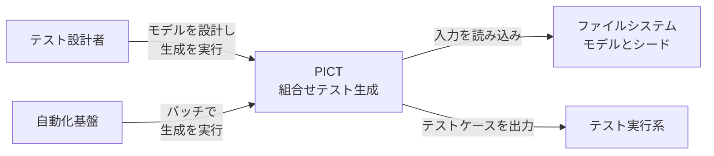
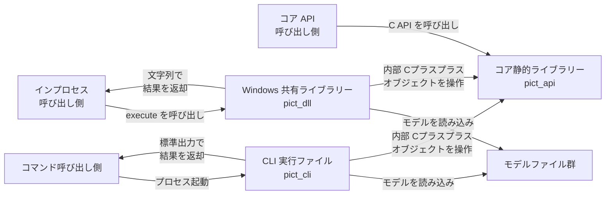
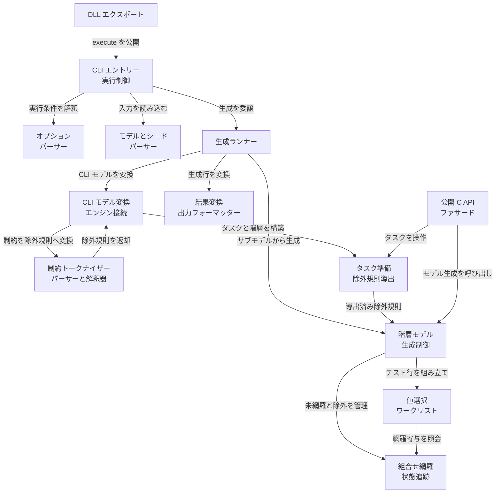
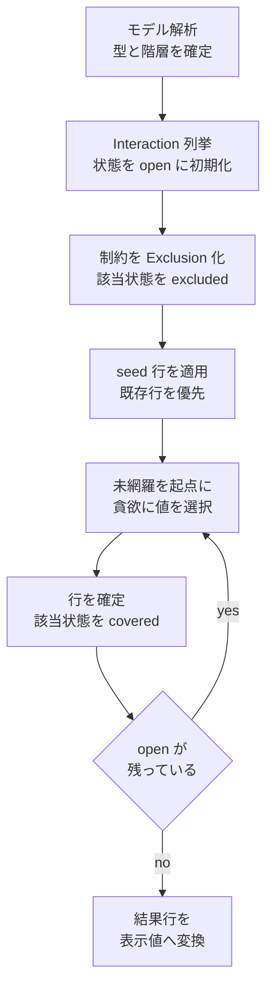
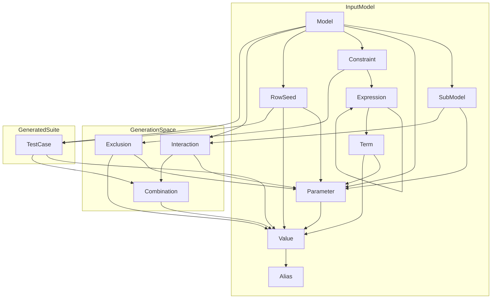
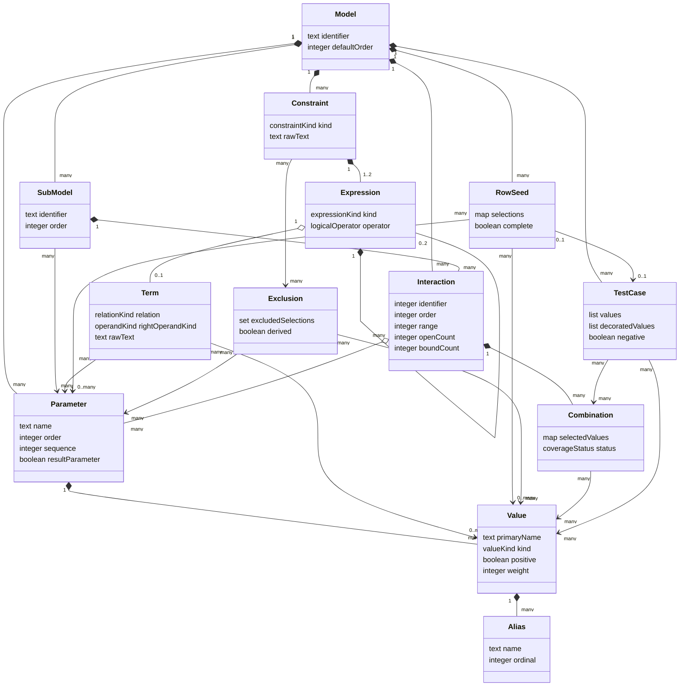

> 調査日: 2026-07-16。公開バイナリは v3.7.4、ソース調査は main commit `260939c4928c27dc9fd09674a7cffb4beb54f615` を基準にしています。main は未リリース変更を含むため、公開版と区別して記載します。

本記事は、複数条件の組合せテストを CI へ導入したいテスト設計者と開発者を対象にしています。まず概要・特徴・利用方法で採用可否を判断し、再現性や更新手順が必要な場合は運用・ベストプラクティスを参照してください。内部構造とデータモデルは、現行 main を macOS でビルドし、同梱テスト 2 件の成功と CLI の実行結果を確認したうえで、固定コミットのソースコードと照合しています。一般的な操作説明に加え、row seed の黙示的な除外、終了コード 0 での制約スキップ、公開文書と実装の構文差まで検証します。

## 概要

PICT（Pairwise Independent Combinatorial Tool）は、有限個のパラメーターと候補値から、指定した相互作用強度を満たす小さなテスト集合を生成する Microsoft 製の組合せテスト生成ツールです。既定の pairwise は、異なる 2 パラメーター間の値の組合せを少なくとも 1 回ずつ含むようにテストケースを構成します。1 件のテストケースで複数の組合せを同時に覆うため、全組合せを列挙するより実行対象を抑えられます。

PICT 自体はテストランナーではありません。利用者が対象システムの入力、構成、環境などを有限のパラメーターと値にモデル化し、PICT がテストデータを TSV 形式で標準出力へ生成します。生成結果をテストコード、CI、手動試験票などへ渡して実際の検証を行います。この分離により、特定のテストフレームワークに依存せず、API 入力、OS とブラウザーの互換性、製品構成、インストール条件などへ適用できます。

PICT は covering array を実用的なテスト設計へ適用する位置にあります。pairwise は「すべての 2-way 組合せを覆う」という網羅条件を保証しますが、欠陥検出そのものや要件の正しさは保証しません。公式論文も、pairwise を他のテスト技法と組み合わせ、対象に応じて慎重に使う必要性を示しています。

### 関連技術との位置づけ

| 技術・活動 | 網羅または選択の考え方 | PICT との関係 |
|---|---|---|
| 同値分割・境界値分析 | 広い入力空間から代表値を選びます | PICT に渡す有限な値集合を設計する前処理です |
| 全組合せテスト | N 個のパラメーターに対する全組合せを実行します | PICT でも強度をパラメーター数まで上げれば全組合せになりますが、通常はテスト数が急増します |
| ランダムテスト | 確率的に入力を選びます | PICT は指定した t-way の網羅を維持したまま、必要に応じて seed で生成結果を変えられます |
| 直交表 | 各組合せを同じ回数だけ出現させることを重視します | PICT は各組合せを少なくとも 1 回覆う covering array を生成し、均等な出現回数は目的にしません |
| プロパティベーステスト | 値生成と性質の検証をテストフレームワーク内で反復します | PICT は有限の離散値間の t-way 網羅に集中します。生成結果をプロパティや通常のテストへ入力できます |
| テスト実行・判定 | 対象を呼び出し、期待結果と実結果を比較します | PICT の範囲外です。生成した各行を別のランナーで実行します |

### 適用しやすいテスト領域

- API や関数の複数引数を、同値クラスと境界値へ離散化した入力テストに適します。
- OS、CPU、ブラウザー、データベースなどの互換性マトリクスから代表構成を選ぶ試験に適します。
- 機能フラグ、権限、プラン、設定値など、全組合せが急増する構成試験に適します。
- 無効値を 1 件ずつ含め、入力マスキングを避ける堅牢性試験に適します。
- 既存ケースを seed として残し、モデル変更後の追加ケースを抑える回帰テスト設計に適します。

### バージョンと配布状況

2026 年 7 月 16 日時点で GitHub Releases の最新版は v3.7.4 です。公開日は 2022 年 3 月 31 日で、配布アセットは 207,360 bytes の Windows 用 `pict.exe` です。このリリースの変更点は CMake 対応、コンパイラー警告の厳格化、バージョン更新などのビルド関連です。

一方、`main` ブランチでは v3.7.4 後も README とモデル文書が更新されています。現在の README にあるネイティブのベンチマークハーネスとコンテナー実行、現在のモデル文書にある一部の制約関数や、randomization seed による行数変動と coverage に関する説明は、v3.7.4 タグの文書には含まれません。row seeding の `/e` は v3.7.4 文書にもあります。バイナリの挙動を厳密に扱う場合は v3.7.4 タグの文書とソースを基準にし、`main` の機能を利用する場合はソースからビルドして確認する必要があります。

### 類似ツールとの比較

以下は各ツールの公式資料で確認できる実行方式と機能を比較したものです。「公式比較なし」は、同一環境・同一モデルでのメモリー、CPU、起動時間または生成時間を比較した一次資料を確認できなかった項目です。

| ツール | 実行方式 | リソースに関する公式情報 | 主な対応機能 | 起動・生成速度の根拠 |
|---|---|---|---|---|
| PICT | ネイティブ C++ の CLI。Windows バイナリ、Unix 系でのソースビルド、`main` ではコンテナー、コア API と Windows DLL の形態があります | v3.7.4 の Windows バイナリは 207,360 bytes です。メモリー・CPUの公式比較はありません | 1-way から全組合せまでの強度、制約、サブモデル、無効値、seed、重み、別名、パラメーター定義の再利用 | 2006 年の公式論文は、50 パラメーター × 20 値の pairwise を Pentium M 1.8 GHz、Windows XP SP2 で 20 秒未満と報告しています。現在環境の起動時間と他ツールとの実時間比較は公式比較なしです |
| ACTS | Java の単一 JAR で CLI と GUI を提供します。Java 実行環境が必要です | NIST のガイドは、大規模構成で JVM の既定ヒープが不足する場合にヒープ調整を推奨しています。同一モデルのメモリー・CPU比較はありません | 1-way から 6-way、base-choice、mixed-strength、制約、無効値、既存テストの拡張、coverage verification。機能の対応範囲は選択アルゴリズムに依存します | 現行 NIST ページと User Guide for Basic 1.0 / Advanced 3.3 では、PICT を含む同一条件の起動時間・生成時間の公式比較なしです |
| AllPairsPy | Python のライブラリーで、呼び出し元プロセス内の iterator として組合せを返します | Python 実行環境が必要です。メモリー・CPUの公式比較はありません | pairwise と n-wise、Python 関数による無効な部分組合せの filter、`OrderedDict`、pytest への組み込み | 起動時間・生成時間とも公式比較なしです |
| Jenny | C ソースから作るネイティブ CLIです。公式ページは古い Windows バイナリも提供しています | ネイティブ実行ですが、メモリー・CPUのツール横断比較はありません。公式ページは pairwise の経験的計算量を示しています | 1-way から 32-way、禁止組合せ、乱数 seed、既存テストの再利用。入力は次元ごとの値数で、意味名への変換は利用側が行います | 公式ページに経験的計算量はありますが、現在環境の起動時間と PICT との実時間比較は公式比較なしです |

PICT の公式論文と pairwise.org には、生成時間ではなく「生成されたテスト行数」を比べる共通ベンチマークがあります。これはテストスイートの圧縮効率を示す指標であり、起動速度や生成速度ではありません。

| pairwise モデル | PICT の行数 | Jenny の行数 |
|---|---:|---:|
| 3⁴ | 9 | 11 |
| 3¹³ | 18 | 18 |
| 4¹⁵ 3¹⁷ 2²⁹ | 37 | 38 |
| 4¹ 3³⁹ 2³⁵ | 27 | 28 |
| 2¹⁰⁰ | 15 | 16 |
| 10²⁰ | 210 | 193 |

この公開値では PICT と Jenny のどちらか一方が全モデルで最小になるわけではありません。また、値は制約付きモデル、mixed-strength、現在の実装、実行時間を比較していません。性能を選定条件にする場合は、実際のモデルを固定し、行数、生成時間、ピークメモリーを同一環境で測る必要があります。

### ユースケース別の推奨

| ユースケース | 推奨 | 選定理由 |
|---|---|---|
| テキストモデルをリポジトリー管理し、ネイティブ CLI を CI へ組み込みたい | PICT | 単一 CLI、TSV 出力、再現可能な seed、制約、サブモデル、無効値、既存ケースの seed を一つのモデル方式で扱えます |
| GUI でモデルを編集し、生成後の t-way coverage も検証したい | ACTS | GUI と CLI、coverage verification、base-choice、複数アルゴリズムを公式に提供します |
| Python や pytest のコード内で値を直接列挙したい | AllPairsPy | iterator と Python の filter 関数をテストコードへ直接組み込めます |
| 小さな C 製 CLI を使い、次元数と禁止組合せを簡潔に指定したい | Jenny | 単純なネイティブ CLI で n-wise、禁止組合せ、seed、既存テストを扱えます。出力の意味名への変換は別途必要です |
| 全組合せを現実的な件数で実行できる、または高い保証が必要 | 全組合せまたは対象に応じた高い t | pairwise だけでは 3 個以上の値の相互作用を網羅しません。PICT や ACTS で強度を上げる場合も、ケース数と試験コストを事前評価します |

この推奨は公開機能に基づく選択です。現在版同士の公式な速度・資源比較はないため、性能要件がある場合は候補を実モデルで評価します。

## 特徴

- **小さなテスト集合で t-way 網羅を作れます。** 既定は pairwise で、強度を 1 からパラメーター数まで変更できます。全組合せよりケース数を抑えながら、指定した強度の組合せをすべて覆います。
- **プレーンテキストでテスト空間を管理できます。** パラメーター、有限の候補値、任意のサブモデル、任意の制約を記述します。モデルをレビューし、バージョン管理できます。
- **実行不能な組合せを生成時に除外できます。** 条件付き制約と常に成立すべき不変条件を扱えます。生成後に無効行だけを削除して網羅を崩す問題を避けられます。
- **重要な領域だけ強度を変えられます。** サブモデルにより、特定のパラメーター群を別の強度で組み合わせられます。高価な環境構成の種類を抑える用途にも使えます。
- **無効値を分離した堅牢性テストを生成できます。** 1 行に複数の無効値が入ることを避け、先に検出された無効値が別の検証を隠す入力マスキングを抑えます。
- **既存ケースを seed として再利用できます。** 重要な既知組合せを必ず含める用途と、モデル変更時に既存テストをできるだけ維持する用途があります。完全な行だけでなく部分行も利用できます。
- **同じ入力から再現可能な出力を得られます。** 既定の生成は決定的です。ランダム化時も seed を記録して同じ生成を再現できます。現在の `main` 文書は、seed により行数が 5〜10%程度変動する場合がある一方、要求した網羅条件は変わらないと説明しています。
- **値の出現を緩やかに誘導できます。** 重みは網羅を損なわない選択肢が複数ある場面で使われます。指定比率どおりの出現回数を保証する機能ではありません。
- **他ツールへ渡しやすい出力契約です。** ヘッダー付き TSV を標準出力へ出し、診断情報を標準エラーへ分離します。テストコードや CI との連携を単純化できます。
- **複数の組み込み形態があります。** CLI に加え、リポジトリーはコア API、Windows DLL と各利用例を含みます。`main` にはコンテナー構築とベンチマークハーネスもあります。
- **MIT License で公開されています。** 利用、改変、再配布、商用利用が可能です。
- **モデル品質が結果を左右します。** PICT は未定義のパラメーター、欠けた同値クラス、誤った制約、試験オラクルを補いません。組合せテストに加え、単体、境界、状態遷移、ストレス、既知障害の回帰などを組み合わせます。

## 構造

PICT の公式 README は、コア生成エンジンの `api`、コマンドラインツールの `cli`、CLI を Windows DLL として再パッケージする `clidll` を主要プロジェクトとしています。現行の CMake 構成でも、`pict_cli` と `pict_dll` はどちらも `pict_api` 静的ライブラリーにリンクします。公式論文が説明する「準備」と「生成」の2段階は、実装上では CLI 側のパースとエンジンモデル構築、および `api` 側の組合せ生成に対応します。

### システムコンテキスト図



| 要素名 | 説明 |
|---|---|
| テスト設計者 | テスト対象のパラメーター空間と制約を定義し、PICT に生成を依頼します。 |
| 自動化基盤 | 継続的テストやバッチ処理から PICT を呼び出します。 |
| PICT | モデルと制約を解釈し、指定された組合せ強度を満たす小さなテストケース集を生成します。 |
| ファイルシステム | 入力モデルと任意のローシードを PICT に提供します。 |
| テスト実行系 | PICT が出力したパラメーター値の組を、実際のテスト入力として消費します。 |

### コンテナ図



| 要素名 | 説明 |
|---|---|
| コマンド呼び出し側 | CLI プロセスを起動し、標準出力から生成結果を受け取ります。 |
| インプロセス呼び出し側 | Windows 上で CLI 相当の `execute` 関数を共有ライブラリーから呼び出します。 |
| コア API 呼び出し側 | モデル構築と結果取得の C API を直接利用します。 |
| CLI 実行ファイル | `cli/CMakeLists.txt` が定義する `pict_cli` です。入力パース、生成制御、結果整形を実行します。 |
| Windows 共有ライブラリー | `clidll/CMakeLists.txt` が定義する `pict_dll` です。CLI のソース一式を共有ライブラリーへ再パッケージします。 |
| コア静的ライブラリー | `api/CMakeLists.txt` が定義する `pict_api` です。公開 C API と組合せ生成エンジンの内部実装を含みます。 |
| モデルファイル群 | パラメーター、サブモデル、制約、任意のシードを CLI フロントエンドに渡します。 |

### コンポーネント図



| 要素名 | 説明 |
|---|---|
| DLL エクスポート | `clidll/pictclidll.def` が `cli/pict.cpp` の `execute` を公開します。`clidll/dllmain.cpp` は Windows DLL のロードイベントを受け付けます。 |
| CLI エントリー・実行制御 | `cli/pict.cpp` の `main`、`wmain`、`execute` が、引数解釈、入力読み込み、生成、結果出力の順序を制御します。 |
| オプション・パーサー | `cli/cmdline.cpp` と `cli/cmdline.h` が CLI 引数を `CModelData` の実行条件へ反映します。 |
| モデルとシード・パーサー | `cli/mparser.cpp`、`cli/model.cpp`、`cli/model.h` が入力をパラメーター、サブモデル、制約テキスト、シードに分解します。 |
| 生成ランナー | `cli/gcd.cpp` と `cli/gcd.h` の `GcdRunner` が入力変換、階層下位からの生成、生成行の CLI 結果への変換を統括します。 |
| CLI モデル変換・エンジン接続 | `cli/gcdmodel.cpp` と `cli/gcdmodel.h` の `CGcdData` が `CModelData` から `pictcore::Task`、`Model`、`Parameter` を構築します。CLI はこの経路で内部 C++ 型を直接利用し、公開 C API ファサードを経由しません。 |
| 制約トークナイザー・パーサーと解釈器 | `cli/ctokenizer.cpp`、`cli/cparser.cpp`、`cli/ccommon.cpp`、`cli/gcdexcl.cpp` と対応するヘッダーが、制約のトークン化、構文木生成、検証、エンジンの除外規則への変換を担います。 |
| 結果変換・出力フォーマッター | `cli/gcdmodel.cpp` の `CResult` がエンジンの値番号をモデルの表示名に戻し、出力文字列を組み立てます。 |
| 公開 C API ファサード | `api/pictapi.cpp` と `api/pictapi.h` がハンドルベースのモデル構築、制約とシードの追加、生成、結果行取得を外部ネイティブ呼び出し側に公開します。 |
| タスク準備・除外規則導出 | `api/task.cpp`、`api/deriver.cpp`、`api/deriver.h`、`api/exclusion.cpp`、`api/trie.h` が、階層モデルへの除外規則の配置、暗黙の除外規則の導出、生成用ワーク領域の準備を担います。 |
| 階層モデル・生成制御 | `api/model.cpp` と `api/generator.h` の `Model` が、サブモデルの結果を擬似パラメーターに変換し、準備された組合せ集からテスト行を1行ずつ生成します。 |
| 組合せ網羅・状態追跡 | `api/combination.cpp` と `api/generator.h` の `Combination` が、公式論文のパラメーター相互作用構造に対応する網羅状態を管理します。 |
| 値選択・ワークリスト | `api/parameter.cpp`、`api/worklist.cpp`、`api/generator.h` が、現在の部分行で最も多くの未網羅組合せに寄与する値を選び、次に割り当てるパラメーターを管理します。 |

### 生成処理フロー



| 要素名 | 説明 |
|---|---|
| モデル解析 | CLI がパラメーター、型、次数、サブモデル、制約、seed を読み、エンジンの Task、Model、Parameter へ変換します。 |
| Interaction 列挙 | 指定次数ごとのパラメーター集合と値直積を準備し、各 Combination の状態を open にします。 |
| Exclusion 化 | 制約から禁止される値集合を導出し、対応する Combination を excluded にします。excluded は未網羅の母数から外れます。 |
| seed 適用 | 完全または部分 seed を既存行として取り込み、未指定値を生成時に補います。制約違反の seed は警告なしで削除されるため、重要行が結果に残ったかを呼び出し側で検査します。 |
| 貪欲な値選択 | 未網羅 Combination を起点に、現在の部分行で多くの open 状態を覆う値を選びます。 |
| covered 更新 | 1行を確定し、その行が満たした Combination を covered に変えます。 |
| 完了判定 | Regular mode では excluded を除く open がなくなるまで反復します。hidden の Preview / Approximate mode はこの完全網羅条件を緩めるため、通常の coverage 契約には使いません。 |
| 結果変換 | 値序数を alias と負値 prefix を含む表示値へ変換し、TSV または main の JSON を生成します。 |

## データ

PICT は、モデルファイルから読み取ったパラメーターと値を、生成エンジンが扱うパラメーター間相互作用と値組合せに変換します。制約は論理式として解析された後、出現を許さない値組合せである除外条件に変換されます。生成結果は、各パラメーターの値を 1 つずつ選択したテストケースの集合です。

以下では、公式論文の「parameter interaction structure」を `Interaction` と呼びます。実装上は `pictcore::Combination` クラスに対応します。一方、そのクラスが保持するビットベクターの各スロットに対応する具体的な値組合せを `Combination` と呼びます。この区別により、論文の用語と C++ の型名の衝突を避けます。

### 概念モデル



#### InputModel

| 要素名 | 説明 |
|---|---|
| Model | PICT が扱うテスト領域全体です。パラメーター、任意のサブモデル、制約、シード行をまとめます。 |
| SubModel | 一部のパラメーター群を独自の組合せ次数で先に生成する階層モデルです。その結果は上位モデルで複合パラメーターの値として扱われます。 |
| Parameter | テスト対象の因子です。名前、モデル中の順序、組合せ次数、結果パラメーターかどうかを持ちます。 |
| Value | パラメーターが取り得る 1 つの値です。複数の名前、正値か負値かの区分、選択の重みを持ちます。重みは独立エンティティではなく正の整数属性です。 |
| Alias | 同じ Value を表す別名です。先頭名は型判定、制約比較、正値と負値の判定に使われ、出力時は複数名が順番に使われます。 |
| Constraint | 許されないテスト条件を表すルールです。無条件の項、または IF 条件と THEN・ELSE 側の項から構成されます。 |
| Expression | 制約の論理式です。AND、OR、NOT による再帰的な構文木として Term を結合します。正値・負値判定関数も構文木の葉として扱われます。 |
| Term | 1 つのパラメーターと、値、値集合、または別パラメーターとの関係を表す制約式の葉です。 |
| RowSeed | 生成結果に反映したいパラメーターと値の選択集合です。全パラメーターを指定する完全行と、一部だけを指定する部分行を扱えます。 |

#### GenerationSpace

| 要素名 | 説明 |
|---|---|
| Exclusion | 同時に出現してはならないパラメーターと値序数の集合です。制約から導出され、Interaction 内の該当 Combination を除外状態にします。 |
| Interaction | 組合せ対象となるパラメーター集合です。公式論文の parameter interaction structure、実装の `pictcore::Combination` に対応し、参加パラメーターの値の直積を状態ベクターで管理します。 |
| Combination | 1 つの Interaction に含まれる具体的な値組合せです。実装では独立クラスではなく、混合基数で算出した添字に対応するビットベクターのスロットです。状態は open、covered、excluded です。 |

#### GeneratedSuite

| 要素名 | 説明 |
|---|---|
| TestCase | 各パラメーターに対応する値序数を並べた生成行です。テキスト出力への変換時に別名と負値プレフィックが反映され、1 行が複数の Combination をカバーします。 |

### 情報モデル



| 要素名 | 説明 |
|---|---|
| Model | CLI の `CModelData` と生成エンジンのルート `Model` を統合した概念型です。`defaultOrder` はパラメーター個別の次数が指定されない場合の組合せ次数です。 |
| SubModel | CLI ではパラメーター序数の一覧と次数を持ち、生成エンジンでは親 Model に接続された子 Model として表現されます。 |
| Parameter | CLI の `CModelParameter` とエンジンの `Parameter` に対応します。名前、入力順、組合せ次数、結果パラメーターフラグを持ちます。 |
| Value | CLI の `CModelValue` とエンジンが扱う値序数を統合した概念型です。型と正負は先頭名から決まり、`weight` の省略値は 1 です。 |
| Alias | `CModelValue` の名前リストを多重度つきで表す概念型です。実装に独立クラスはありませんが、先頭名と出力時の循環順序を明示するため分離しています。 |
| Constraint | トークン列から作られる `CConstraint` に対応します。条件付き制約は条件側と禁止条件側の 2 本の Expression を持ち、無条件制約は禁止条件側だけを持ちます。 |
| Expression | `CSyntaxTreeItem` と `CSyntaxTreeNode` で構成される論理構文木です。ノードは左右の子を最大 2 つ持ち、葉は Term または正値・負値の判定関数です。 |
| Term | `CTerm` に対応します。左辺の Parameter、比較関係、右辺の種類、右辺データ、診断用の元テキストを持ちます。 |
| RowSeed | CLI ではパラメーター名と値名の対、エンジンでは Parameter と値序数の対の集合です。部分行は未指定値を生成アルゴリズムに委ねます。 |
| Exclusion | エンジンの `Exclusion` に対応します。要素は Parameter と値序数の対であり、項数の少ない順に管理されます。 |
| Interaction | エンジンの `pictcore::Combination` に対応します。参加 Parameter、識別子、値の直積サイズ、未カバー数、現在のバインド数を持ちます。 |
| Combination | Interaction の値空間の 1 スロットを概念型として表します。`selectedValues` は混合基数の添字から復元され、`status` は open、covered、excluded のいずれかです。 |
| TestCase | エンジンの `ResultRow` と CLI の `CRow` に対応します。エンジンでは値序数の一覧、CLI では表示名の一覧、負値記号付きの表示名一覧、負値テストフラグとして扱われます。 |

情報モデルは実装と概念を対応づけるための説明モデルです。`RowSeed.complete` と `Exclusion.derived` は格納フィールドではなく集合内容から導く属性です。`Combination` も独立オブジェクトではなく、実装の `pictcore::Combination` が持つビットベクター上のスロットを概念化しています。

## 構築方法

### 対象バージョンと配布形態

- 公式 Releases が公開している最新のビルド済み成果物は、2022 年 3 月 31 日公開の `v3.7.4` 向け Windows 実行ファイル `pict.exe` です。
- 本節でいう「現行 main」は、2026 年 7 月 7 日のコミット `260939c4928c27dc9fd09674a7cffb4beb54f615` を指します。
- `v3.7.4` の製品バージョンは `3.7.4.0` です。現行 main は `cli/ver.h` が `3.7.5.0` を示す一方、ルート `CMakeLists.txt` は `3.7.4` のままです。現行 main には JSON 出力の `/f:text|json` など未リリース変更が含まれるため、公開版 `3.7.5` とは扱いません。
- 再現可能な調査やビルドでは、表示上の `3.7.4` だけでなく、リリースタグまたはコミット SHA を固定します。

| 入手方法 | 固定対象 | 実行環境 | `/f:json` |
|---|---|---|---|
| Releases の `pict.exe` | `v3.7.4`、コミット `d529bb1` | Windows | 非対応 |
| ソースから CMake ビルド | コミット `260939c` | Windows、Linux、macOS、BSD 系 | 対応 |
| `Containerfile` からビルド | コミット `260939c` のソース | Podman | 対応 |

```text
公開バイナリ: v3.7.4 (2022-03-31)
現行 main:    260939c4928c27dc9fd09674a7cffb4beb54f615 (2026-07-07)
```

### Windows で公開バイナリを取得する

- GitHub Releases の `v3.7.4` で手動アップロードされたバイナリアセットは `pict.exe` 1件です。GitHub UI の Assets 件数には、自動生成されるソースの zip と tar.gz も含まれます。
- インストーラーはありません。任意のディレクトリへ配置し、そのディレクトリを `PATH` に加えるか、相対パスで実行します。
- 実行ファイルの Windows バージョンリソースは `3.7.4.0` です。

```powershell
$installDir = "$env:LOCALAPPDATA\Programs\PICT"
New-Item -ItemType Directory -Force -Path $installDir | Out-Null
Invoke-WebRequest `
  -Uri "https://github.com/microsoft/pict/releases/download/v3.7.4/pict.exe" `
  -OutFile "$installDir\pict.exe"

& "$installDir\pict.exe" /?
```

- `/?` はヘルプを標準出力へ表示します。ただし実装上は「オプション解析を終了した」扱いになるため、終了コードは `3` です。
- 公開バイナリには `--version` がありません。Windows のファイル情報で確認します。

```powershell
(Get-Item "$installDir\pict.exe").VersionInfo |
  Select-Object FileVersion, ProductVersion
```

### Unix 系で CMake ビルドする

- 現行 main のプロジェクトが要求する最小 CMake バージョンは `3.13` です。以下の基本ビルドは 3.13 で実行できます。
- CMake ビルドは C++17 を要求します。テストを実行する場合は Perl も用意します。
- `PICT_RUN_TESTS_ENABLED` の既定値は `ON` です。生成される CLI は `build/cli/pict` です。

```bash
git clone https://github.com/microsoft/pict.git
cd pict
git checkout 260939c4928c27dc9fd09674a7cffb4beb54f615

cmake -DCMAKE_BUILD_TYPE=Release -S . -B build
cmake --build build
(cd build && ctest -V)
./build/cli/pict '/?'
```

- テストを構成から外す場合は、明示的に `PICT_RUN_TESTS_ENABLED=OFF` を渡します。

```bash
cmake \
  -DCMAKE_BUILD_TYPE=Release \
  -DPICT_RUN_TESTS_ENABLED=OFF \
  -S . -B build
cmake --build build
```

- 現行 main のインストール規則は `pict` と `pict-benchmark` を `bin`、`doc/pict.md` と `LICENSE.TXT` を文書ディレクトリへ配置します。`pict-benchmark` は v3.7.4 後の追加です。書き込み可能な接頭辞を指定できます。
- `cmake --install` は CMake 3.15 以降の CLI です。CMake 3.13 または 3.14 を使う場合は、configure 時に `CMAKE_INSTALL_PREFIX` を指定し、`cmake --build build --target install` を実行します。

```bash
cmake --install build --prefix "$PWD/dist"
./dist/bin/pict '/?'
```

### コンテナイメージを構築する

- `Containerfile` と `make image-build` は現行 main に存在します。`v3.7.4` タグには `Containerfile` がありません。
- 公式手順は Podman を使います。ビルダーは UBI 9 toolbox、実行イメージは UBI 9 micro です。
- 実行イメージは非 root の `pict` ユーザー、作業ディレクトリ `/var/pict`、`ENTRYPOINT ["pict"]` で動作します。

```bash
git checkout 260939c4928c27dc9fd09674a7cffb4beb54f615
make image-build
make image-run
```

- 独自モデルは、ホストのモデルディレクトリを `/var/pict` へマウントして渡します。

```bash
podman run --rm \
  -v "./models:/var/pict:Z" \
  pict:latest \
  model.txt /o:3
```

### ビルド元を確認する

- PICT CLI 自体には、コミット SHA を表示するオプションがありません。
- 現行 main の CMake 構成ログも `PICT version 3.7.4` と表示します。そのため、main ビルドと公開バイナリの識別には Git の SHA を使います。

```bash
git rev-parse HEAD
git describe --tags --always --dirty
cmake -DCMAKE_BUILD_TYPE=Release -S . -B build
```

## 利用方法

### 必須引数と全公開オプション

- 基本構文は `pict model [options]` です。モデルファイルのパスだけが必須です。
- オプションの先頭には `/` と `-` のどちらも使えます。`/O` と `/o` のようなスイッチ文字は大文字と小文字を区別しません。一方、`max`、`text`、`json`、`space`、`tab` などの値は小文字で指定します。
- 同じオプションを 1 回の実行で複数回指定すると入力エラーになります。
- 下表はヘルプに表示される公開オプションを網羅しています。`/v`、`/p`、`/x[:N]` はソースに存在しますが、ヘルプから隠された内部向けスイッチであり、公開 CLI 契約には含めません。

| 引数・オプション | 必須 | 既定値 | `v3.7.4` 公開バイナリ | main `260939c` | 説明 |
|---|---:|---|---:|---:|---|
| `model` | 必須 | なし | 対応 | 対応 | プレーンテキストのモデルファイルです。第 1 引数に置きます。 |
| `/o:N`、`/o:max` | 任意 | `2` | 対応 | 対応 | 組合せ次数を指定します。`max` はモデルで可能な最大次数です。 |
| `/d:C` | 任意 | `,` | 対応 | 対応 | モデル内の値区切りを 1 文字で指定します。`space` と `tab` も指定できます。 |
| `/a:C` | 任意 | `\|` | 対応 | 対応 | 値の別名を区切る 1 文字を指定します。`space` と `tab` も指定できます。 |
| `/n:C` | 任意 | `~` | 対応 | 対応 | ネガティブ値を示す 1 文字の接頭辞を指定します。 |
| `/e:file` | 任意 | なし | 対応 | 対応 | シード行を収めた TSV ファイルを指定します。 |
| `/r`、`/r:N` | 任意 | 固定シード `0` | 対応 | 対応 | `/r` は時刻由来のシード、`/r:N` は指定シードで生成をランダム化します。 |
| `/f:text`、`/f:json` | 任意 | `text` | **非対応** | 対応 | 出力形式を選びます。main のパーサーはコロンと値を必須とします。 |
| `/c` | 任意 | 無効 | 対応 | 対応 | パラメーター名、値、制約の評価を大文字・小文字区別にします。 |
| `/s` | 任意 | 無効 | 対応 | 対応 | テストケースの代わりにモデルと生成の統計を表示します。 |

```text
Usage: pict model [options]
```

### ヘルプを表示する

- 引数なし、`/?`、`-?` のいずれかで利用方法を表示します。
- `--help` と `--version` は実装されていません。
- `/?` と `-?` はヘルプを表示した後に終了コード `3` を返します。スクリプトで成功判定を行う場合は考慮します。

```bash
./pict '/?'
./pict '-?'
```

### 基本モデルを作成して生成する

- モデルは、先にパラメーター定義、次に任意のサブモデル、最後に任意の制約を記述します。
- パラメーターは 1 行に 1 つ記述します。既定では値をカンマで区切ります。
- 空行を使用できます。`#` から始まる行はコメントです。
- PICT はリソースを保持する CRUD 型の CLI ではありません。モデルファイルを作成・更新し、実行のたびにテストケースを標準出力へ生成します。

```text
# browser.txt
OS: Windows, Linux, macOS
Browser: Edge, Chrome, Firefox
Locale: ja-JP, en-US
```

```bash
./pict browser.txt
```

- text 形式の先頭行はパラメーター名です。以降の各行が 1 テストケースで、列はタブ区切りです。

### 制約を記述する

- 条件制約は `IF ... THEN ... [ELSE ...];` で記述します。
- 比較演算子は `=`、`<>`、`>`、`>=`、`<`、`<=`、`LIKE` です。集合比較には `IN` を使えます。
- 文字列パターンの否定は `NOT LIKE`、集合の否定は `NOT IN` を使えます。`LIKE` の `*` は任意長、`?` は任意の1文字に一致します。
- `NOT`、`AND`、`OR` と丸括弧を組み合わせられます。
- 右辺には値だけでなく別のパラメーターも置けます。固定コミットの実装が受理する負値判定は `ISNEGATIVE(P)` と `ISPOSITIVE(P)` です。引数なしの形式は全非結果パラメーターへ展開されます。
- 現行 `doc/pict.md` の例は引数を角括弧で囲んでいますが、`ISNEGATIVE([P])` と書くと実装は `[P]` 全体を名前として検索します。未知パラメーターの警告後に制約をスキップし、終了コード 0 になるため、実行時の警告と生成結果を確認します。
- `IF` を付けずに式だけを記述すると、常に満たすべき不変条件になります。
- モデルパーサーが最初の制約行を認識するパターンは制約文法より狭いため、無条件制約は `[P] ...;` または `([P] ...);` で始めます。最初の制約を裸の `NOT`、`ISNEGATIVE`、`ISPOSITIVE` で始めるとパラメーター行と誤認され得ます。条件付き制約は `IF` で始めます。

```text
OS: Windows, Linux, macOS
Browser: Edge, Chrome, Firefox
Locale: ja-JP, en-US

IF [OS] = "macOS" THEN [Browser] <> "Edge";
IF [Browser] = "Edge" THEN [OS] = "Windows";
[OS] <> "Linux" OR [Locale] = "en-US";
```

```bash
./pict browser.txt > cases.tsv
```

### n-wise の次数を指定する

- 既定の `/o:2` は pairwise です。
- `/o:1` は各値を少なくとも 1 回カバーします。
- `/o:3` は全 3 値組をカバーします。次数を上げると生成件数は通常増えます。
- `/o:max` は、モデルで可能な最大次数を使います。サブモデルを使わないモデルでは全組合せ相当です。

```bash
./pict browser.txt /o:2 > pairwise.tsv
./pict browser.txt /o:3 > three_way.tsv
./pict browser.txt /o:max > exhaustive.tsv
```

### 高度なモデル記法を使う

- 既存パラメーターの値集合は `<ParameterName>` で再利用できます。参照先は先に定義します。
- サブモデルは `{ P1, P2, ... } @ N` で定義します。任意個のサブモデルを作成でき、1つのパラメーターを複数のサブモデルへ含められます。ただし階層は1段だけで、次数はサブモデル内のパラメーター数以下にします。
- 値末尾の正整数 `(N)` は重みです。重みは coverage が同じ候補間の選択を傾けるだけで、出現回数の比率を保証しません。
- 値の別名は既定で `|` 区切りです。組合せ空間では同じ1値として扱い、出力時に名前を循環させます。型判定、制約、負値判定には先頭名だけを使います。

```text
OS_1: Windows, Linux, macOS
OS_2: <OS_1>
Browser: Chrome (5), Firefox, Safari
Tier: Standard | Std, Enterprise

{ OS_1, Browser } @ 2
```

- 実装の `cli/mparser.cpp` は `Parameter @ N: ...` というパラメーター単位の次数も受理します。これは mixed-strength generation に利用されていますが、`doc/pict.md` では公開記法として説明されていません。採用時はタグまたは commit を固定し、回帰テストを用意します。
- 同実装は `$RESULT` のように `$` で始まる結果パラメーターも認識し、制約から期待値を導出できます。seed 読み込みは結果パラメーターを無視します。この機能も公式利用文書にないため、移植可能なモデル契約には含めず、実装依存機能として扱います。
- 結果が制約から一意に決まらない行では `?` が出力されます。結果パラメーターはユーザー定義サブモデルへ含めません。
- main `260939c` では `$RESULT` を先頭に置いて引数なしの `ISNEGATIVE()` / `ISPOSITIVE()` を使うと、不正な式へ展開される実装上の問題があります。結果パラメーターは非結果パラメーターより後、できれば末尾に置き、必要に応じて関数の対象パラメーターを明示します。

```text
Type @ 3: Small, Medium, Large
Size: Small, Medium, Large
$RESULT: Match, Mismatch

IF [Type] = [Size] THEN [$RESULT] = "Match";
IF [Type] <> [Size] THEN [$RESULT] = "Mismatch";
```

モデル記法を版と公開範囲で整理すると、次のようになります。

| 記法 | 構文 | 意味 | `doc/pict.md` | v3.7.4 | main `260939c` | 注意点 |
|---|---|---|:---:|:---:|:---:|---|
| パラメーター | `P: v1, v2` | 値集合を持つ因子です | 掲載 | 対応 | 対応 | パラメーターはサブモデルと制約より前に定義します。実装は最初の値 delimiter も名前区切りとして受理しますが、公開形式のコロンを使います |
| コメント | `# text` | 行コメントです | 掲載 | 対応 | 対応 | `#` から始まる行を使います |
| 値集合再利用 | `P2: <P1>, extra` | 先に定義した値集合を展開します | 掲載 | 対応 | 対応 | 未定義参照は通常値として扱われ得るため順序を固定します |
| alias | `primary \| alias` | 1値へ複数名を付けます | 掲載 | 対応 | 対応 | 制約・型・負値判定は先頭名だけを使います |
| weight | `value (N)` | 同じ coverage の候補間で選択を傾けます | 掲載 | 対応 | 対応 | `N` は正整数で、出現比率を保証しません |
| negative | `~value` | 入力マスキングを避ける負値です | 掲載 | 対応 | 対応 | prefix は `/n:C` で変更できます |
| sub-model | `{ P1, P2 } @ N` | 一部の因子群へ別次数を適用します | 掲載 | 対応 | 対応 | 階層は1段、次数は因子数以下です |
| parameter order | `P @ N: v1, v2` | 因子単位の mixed-strength 指定です | 未掲載 | 実装対応 | 実装対応 | 実装依存として commit を固定します |
| result parameter | `$RESULT: ok, ng` | 制約から期待結果を導出します | 未掲載 | 実装対応 | 実装対応 | seed 対象外であり、移植可能な契約から外します |
| 制約 | `IF A THEN B ELSE C;` または `Predicate;` | 禁止組合せへ変換する論理式です | 掲載 | 対応 | 対応 | `NOT LIKE`、`NOT IN`、パラメーター比較も扱えます |
| 負値関数 | `ISNEGATIVE(P)` | 負値・正値を制約から判定します | main 文書は角括弧付きで掲載 | 実装対応 | 実装対応 | 実装では引数の角括弧を外します。引数なしでは全非結果パラメーターへ展開します |

- 全値が数値へ変換できる場合だけ、そのパラメーターは数値型になります。1値でも変換できない値があれば文字列型です。制約では数値を裸で、文字列を二重引用符で記述します。
- order と weight の公開記法は正の整数ですが、実装は浮動小数点から整数型へ変換する箇所があり、`2.9` のような値を受理して切り捨てる場合があります。モデル lint と CI 側で整数性と範囲を検査します。
- モデルの値側で二重引用符は一般的なエスケープ機構ではありません。値に既定 delimiter を含める場合は `/d:C` で別文字を選びます。alias delimiter も同様に `/a:C` で変更します。
- 前後の空白は trim されます。空名、タブを含む名前、重複する値・alias は通常生成で受理される場合がありますが、TSV seed の対応が曖昧になるため避けます。

### 区切り文字・別名・ネガティブ値を変更する

- `/d` は値の区切り、`/a` は同一値の別名区切り、`/n` は無効値の接頭辞を変更します。
- 別名は組合せ上では 1 つの値として扱われ、出力時に順番に使われます。制約評価、型判定、ネガティブ判定には最初の名前だけを使います。
- ネガティブ値を含むケースでは、入力マスキングを避けるため、1 ケースに複数のネガティブ値を詰めません。

```text
# custom.txt を /d:; /a:+ /n:! で読む例
Browser: Chrome;Edge;Firefox
Tier: Standard+Std;Enterprise
Input: valid;!empty;!too-long
```

```bash
./pict custom.txt '/d:;' '/a:+' '/n:!'
```

- 既定の記法なら、次のように記述します。

```text
Tier: Standard | Std, Enterprise
Input: valid, ~empty, ~too-long
```

### 既存ケースをシードする

- `/e:file` は、重要な回帰ケースを必ず含める用途と、モデル変更後も以前のケースをできるだけ再利用する用途に使います。
- シードファイルは PICT の text 出力と同じ TSV 形式です。1 行目にパラメーター名、2 行目以降に値を置きます。
- 空欄を含む部分行も使えます。PICT が空欄に適した値を補います。

```text
OS	SKU	Browser
Windows	Pro	Edge
Linux		Firefox
macOS	Home	Chrome
```

```bash
./pict browser.txt /e:seedrows.tsv > cases.tsv
```

- 現在のモデルにない列は列全体が無視されます。現在のモデルにない値はそのセルだけが無視されます。
- 現在のモデルにない列や値は標準エラーの警告で確認できます。一方、制約違反のシード行は行全体が警告なしで除外されます。重要な完全 seed は生成結果にも含まれることを別途検査します。

### ランダムシードを指定・再現する

- `/r` を付けない場合、同じモデルと同じオプションは決定的な出力になります。
- `/r` は現在時刻からシードを作り、実際に使った値を `Used seed: N` として標準エラーへ表示します。
- `/r:N` にその値を渡すと、同じ生成を再現できます。
- 実装はシードを `unsigned short` で保持します。再現には、標準エラーへ表示された値をそのまま使うのが確実です。
- シードは組合せを行へ詰める順序に影響します。要求した n-wise カバレッジ自体は変えません。

```bash
./pict browser.txt /r > randomized.tsv 2> randomized.log
rg 'Used seed:' randomized.log

./pict browser.txt /r:12345 > replay.tsv 2> replay.log
```

### 統計を表示する

- `/s` は通常のテストケースを出力せず、組合せ数、生成テスト数、生成時間を標準出力へ表示します。
- `/r` と併用した場合、使用シードは引き続き標準エラーへ表示されます。

```bash
./pict browser.txt /s
```

```text
Combinations:   <組合せ数>
Generated tests:<生成テスト数>
Generation time:<時:分:秒>
```

### text と JSON を選ぶ

- `v3.7.4` の公開 `pict.exe` は text 出力だけに対応します。`/f:json` を渡すと `Unknown option` になり、終了コード `3` を返します。
- 現行 main のコミット `260939c` は `/f:text` と `/f:json` に対応します。この機能はリリース後のコミット `d8036dc` で追加されました。
- main のヘルプは `/f[:text|json]` と表示しますが、実装上は `/f` 単独ではなく `/f:text` または `/f:json` が必要です。

```bash
# v3.7.4 はオプションを付けずに text 形式を出力します。
./pict browser.txt > cases.tsv

# 現行 main は形式を明示できます。
./build/cli/pict browser.txt /f:text > cases.tsv

# 現行 main でのみ利用できます。
./build/cli/pict browser.txt /f:json > cases.json
```

- JSON は「テストケースの配列」の中に、`key` と `value` を持つパラメーター配列を格納します。

```json
[
  [
    {"key": "OS", "value": "Windows"},
    {"key": "Browser", "value": "Edge"},
    {"key": "Locale", "value": "ja-JP"}
  ]
]
```

- コミット `260939c` の JSON 実装は、パラメーター名と値を JSON 文字列として直接出力します。引用符やバックスラッシュを含む名前・値を扱う場合は、生成物を JSON パーサーで検証します。
- UTF-8 BOM 付きモデルでは、先頭パラメーター名に `U+FEFF` が残った JSON を出力します。JSON 連携では BOM なし UTF-8 のモデルを使い、期待するキー名も検査します。

```bash
./build/cli/pict browser.txt /f:json | jq empty
```

### 標準出力と標準エラーを分離する

- 正常時のテストケース、`/s` の統計、ヘルプは標準出力です。
- 入力エラー、生成エラー、シードの警告、制約の警告は標準エラーです。
- `/r` で使ったシードも標準エラーです。生成データだけをファイルへ安全に保存できます。

```bash
./pict browser.txt /r \
  > cases.tsv \
  2> pict.log

status=$?
printf 'exit=%s\n' "$status"
```

### 終了コードを処理する

- `wmain` または Unix の `main` は、内部の `ErrorCode` をそのままプロセス終了コードとして返します。
- ヘルプ表示も `BadOption` の経路を通るため、`3` です。

| 終了コード | 内部名 | 意味 |
|---:|---|---|
| `0` | `ErrorCode_Success` | 生成または統計表示に成功しました。 |
| `1` | `ErrorCode_OutOfMemory` | 列挙上はメモリー確保失敗です。固定コミットの通常 CLI では、生成例外を `2` へまとめるため、明確な返却経路を確認できません。 |
| `2` | `ErrorCode_GenerationError` | 組合せ生成に失敗しました。 |
| `3` | `ErrorCode_BadOption` | 引数不足、ヘルプ要求、未知・重複・不正形式のオプションです。 |
| `4` | `ErrorCode_BadModel` | モデルファイルの読み込みまたはモデル構文が不正です。 |
| `5` | `ErrorCode_BadConstraints` | 制約の解析または適用に失敗しました。 |
| `6` | `ErrorCode_BadRowSeedFile` | シードファイルの読み込みまたは検証に失敗しました。 |

```bash
./pict browser.txt > cases.tsv 2> pict.log
case $? in
  0) printf '%s\n' 'generated' ;;
  3) printf '%s\n' 'bad option or help requested' ;;
  4|5|6) printf '%s\n' 'input data error' ;;
  *) printf '%s\n' 'generation or system error' ;;
esac
```

## 運用

### 公開版と main の境界を固定する

- 2026-07-16 時点の最新 GitHub Release は `v3.7.4` です。公開日は 2022-03-31 で、配布アセットは Windows 用の `pict.exe` です。
- `main` は未リリースの開発系列です。`cli/ver.h` は 3.7.5.0 を示す一方、`CMakeLists.txt` は 3.7.4 のままです。このため、`main` を「公開版 3.7.5」とは扱いません。
- 公開版を使うジョブでは、Release の `pict.exe` と SHA-256 を固定します。Unix 系でビルドする場合は、タグまたはコミット SHA を固定します。
- 更新時は、同じモデル、同じオプション、同じ明示 seed で旧版と新版を並走させます。終了コード、標準エラー、生成行数、実行時間、出力差分を確認してから切り替えます。

| 項目 | 公開 `v3.7.4` | `main` の追加・変更 | 運用上の扱い |
|---|---|---|---|
| 既定出力 | タブ区切りテキスト | 継続して既定です | 互換性を優先する場合は TSV を使います |
| JSON | `/f:json` はありません | `/f:text` と `/f:json` が追加されています | コミット SHA を固定し、JSON 構文を検証します |
| 多言語入力 | ANSI / UTF-8 の判定はありますが、ロケール処理は旧実装です | 2026-01 の DBCS 対応でグローバルロケールと入力ストリームのロケールを合わせ、日本語モデルの回帰テストが追加されています | 日本語モデルを使う場合は実行環境のロケールも固定します |
| 性能計測 | CLI の `/s` で組合せ数、生成テスト数、秒単位の生成時間を表示できます | 複数 seed の生成行数を比較する `pict-benchmark` が追加されています | 時間計測は `/s` または外部計測、生成行数探索は固定 SHA の benchmark を使います |
| 出力分析 | リポジトリ同梱スクリプトはありません | `count-uniques.pl` と `compare-uniques.pl` が追加されています | 前者はペアだけ、後者は重複数を含む行集合を比較する点を明示します |
| 制約関数と文書 | 実装済みでも説明が限定的です | `ISNEGATIVE` / `ISPOSITIVE` と制約文法の説明が更新されています | 実際に使うバイナリのタグの実装を基準にします |
| コンテナ | 公式 Containerfile はありません | `Containerfile` と Make ターゲットが追加されています | `pict:latest` ではなくイメージ digest を固定します |

### 決定性と `/r` の再現性を管理する

- 同一バイナリと同一実行環境でモデルとオプションが同じ場合、既定 seed は `0` であり、PICT は同じ出力を生成します。C ランタイムの `rand()` 系列は処理系を跨いだ同一性を保証しないため、出力を固定する CI ではバイナリと OS も固定し、`/r` を付けない構成を使います。
- `/r` だけを指定すると、秒単位の現在時刻を `unsigned short` に変換した seed を使います。多くの場合は変わりますが、同じ秒の起動や約65,536秒ごとの16 bit 折り返しで衝突し得ます。差分比較を行う CI では使わず、探索時も外部で明示 seed 集合を管理します。
- `/r:N` は seed を標準エラーへ `Used seed: N` として出力します。同じバイナリ、モデル、オプション、seed を保存すれば再実行できます。
- CLI の seed は 16 bit です。入力値は実装で `unsigned short` に縮められるため、運用では `0..65535` の整数に制限します。非数値を明示的に拒否しないケースもテスト群にあるため、CI 側で数値検証します。
- seed は組合せの充足条件を緩めません。ヒューリスティックによる詰め方だけが変わり、生成行数は seed ごとに 5〜10% 程度変わる場合があります。

固定 seed を使う場合は、標準出力と標準エラーを別々に保存します。

以下の `tools/`、`models/`、`seeds/`、`artifacts/` は利用側リポジトリーの想定配置であり、上流 PICT に同名のサンプル一式はありません。事前に `build/cli/pict` を `tools/pict` へ配置し、各ディレクトリとモデルを作成する前提です。

```bash
set -euo pipefail

seed=4242
test "$seed" -ge 0 && test "$seed" -le 65535

./tools/pict models/checkout.txt "/r:${seed}" \
  > artifacts/checkout-cases.tsv \
  2> artifacts/checkout-pict.stderr

grep -Fx "Used seed: ${seed}" artifacts/checkout-pict.stderr
```

### CI でモデル、seed、出力を成果物として管理する

- モデルファイル、seed ファイル、PICT のバイナリ SHA、実行オプション、標準出力、標準エラー、終了コードを同じ実行単位で保存します。
- 既定の決定的出力をゴールデンファイルとして比較する場合は、バイナリと実行 OS も固定します。PICT 本体のリポジトリにもランダム化された出力が baseline に残る既知の課題があるため、時刻 seed の出力を baseline にしません。
- upstream CI は push、pull request、週次で Ubuntu、Windows、macOS のビルドとテストを実行し、別ワークフローで C++ の CodeQL を実行します。利用側ではこれに加えて、自分の代表モデルを対象にした回帰テストを持ちます。
- 出力差分が目的の場合は、`main` の `compare-uniques.pl` でヘッダーを除いた行の多重集合を比較できます。これは「同じ t-wise coverage」の証明ではなく、行と重複数の一致確認です。
- `count-uniques.pl` は各行が初めて追加する値ペア数を表示します。3-wise 以上の充足確認には使いません。

Ubuntu の GitHub Actions で終了コードと成果物を残す実装例です。

```bash
set +e
./tools/pict models/checkout.txt /r:4242 \
  > artifacts/cases.tsv \
  2> artifacts/pict.stderr
rc=$?
set -e

printf '%s\n' "$rc" > artifacts/exit-code.txt
sha256sum ./tools/pict models/checkout.txt > artifacts/inputs.sha256

if [ "$rc" -ne 0 ]; then
  sed -n '1,160p' artifacts/pict.stderr >&2
  exit "$rc"
fi

rows=$(( $(wc -l < artifacts/cases.tsv) - 1 ))
printf 'generated_rows=%s\n' "$rows" > artifacts/metrics.txt
```

### TSV と JSON の互換性を保つ

- テキスト出力は、先頭行がパラメーター名、以降がテストケース、区切りがタブの TSV です。標準出力をそのまま `/e:file` の seed に再利用できます。
- `main` の JSON は、テストケースの配列の中に `{"key": ..., "value": ...}` の配列を持つ形式です。公開 `v3.7.4` にはありません。
- `main` の `doc/pict.md` は `/f` をまだ列挙していません。CLI の `showUsage()` と実装が先行しているため、JSON を使う場合は commit SHA を記録します。
- 現行の JSON 実装は値を JSON エスケープせずに書き出します。引用符、バックスラッシュ、制御文字を含む名前や値では不正な JSON になり得ます。
- JSON 実装は負値の表示用 prefix を含む `DecoratedValues` ではなく、装飾前の `Values` を出力します。負値を使うモデルでは TSV と JSON の値が一致しません。
- seed ファイルの読み込みは TSV 前提です。JSON を `/e` に渡しません。安定した機械連携には TSV を正本とし、必要なら検証済みの変換処理で JSON を作ります。

`main` の JSON を採用する場合の最低限の検査例です。

```bash
./pict models/checkout.txt /f:json > artifacts/cases.json
jq -e 'type == "array" and all(.[]; type == "array")' artifacts/cases.json >/dev/null
```

### 生成行数と時間を継続計測する

- `/s` はテストケース本体の代わりに `Combinations`、`Generated tests`、`Generation time` を標準出力へ表示します。時間は `H:MM:SS` で秒単位です。
- `/s` の分岐では通常出力時の制約警告を表示しません。制約警告の確認と統計取得は別実行にします。
- PR CI では代表モデルの生成行数と時間の上限を監視します。nightly では複数の固定 seed を試し、最小、中央値、最大の行数と時間を保存します。
- `main` の `pict-benchmark` は既定で 6 つの標準シナリオを各 1,000 回実行します。`--seed` は試行 seed 列の再現用で、各 trial のモデル形状、seed、行数は標準エラーへ出ます。このハーネスは経過時間を計測しないため、性能回帰には外部の時間・メモリー計測を併用します。
- CLI の高い `/o`、値数の多いパラメーター、複雑な制約は、準備段階の組合せ数とメモリーを増やします。最初は pairwise とし、障害リスクが高い部分だけ sub-model や parameter-specific order で強度を上げます。
- エンジンには exhaustive 用の `MaxRowsToGenerate = 1,000,000` があります。ただし、この検査は `GenerationType::Full` の直積見積もりに置かれており、CLI の全モードに対する一般的な 100 万行制限ではありません。`/o:max` の安全装置として依存せず、外側で時間、メモリー、成果物サイズを制限します。

```bash
# 通常 CLI の統計です。ケース出力と制約警告の検査は別に実行します。
./tools/pict models/checkout.txt /r:4242 /s \
  > artifacts/pict-stats.txt \
  2> artifacts/pict-stats.stderr

# main を固定ビルドした場合の性能回帰です。
./pict-benchmark --runs 250 --seed 123 \
  --benchmark '3^13' \
  --benchmark '4^15 3^17 2^29' \
  > artifacts/benchmark.txt \
  2> artifacts/benchmark-trials.stderr
```

### 制約を変更可能な仕様として保守する

- 不可能な組合せは生成後に行削除せず、モデルの制約として除外します。生成後の削除は、その行だけが覆っていた有効な組合せを失う可能性があります。
- 制約の変更はコード変更と同様にレビューします。業務ルールの根拠、対象パラメーター、境界値、追加日をコメントで残します。
- 制約が 1 つの値を完全に除外すると、PICT は `Constraints Warning` を出して終了コード 0 を返す場合があります。全値を除外すると `Too restrictive constraints` と終了コード 5 になります。警告も CI 成果物として確認します。
- 未知のパラメーターを含む制約は、警告後に制約全体を削除して終了コード 0 になる場合があります。CI では constraint warning を失敗扱いにし、禁止組合せが出力に含まれないことも検査します。
- 数値と文字列の型は値集合から自動推論されます。境界値を比較するパラメーターでは全値を数値表記にそろえ、文字列は引用します。
- 制約用の小型モデルを用意し、許可すべき組合せが残ることと、禁止すべき組合せが出ないことを検査します。大きな本番モデルの行数だけでは、制約の過不足を判断しません。
- 論文は、PICT が制約を exclusion に変換して生成前に処理するため、出力後の妥当性修正を不要にできると説明しています。一方、期待結果ルールの完全性を自動検証する機能はないとも説明しています。

### seeding で重要ケースと差分を安定させる

- `/e:file` は重要な回帰ケースを必ず含める用途と、モデル変更時に既存ケースをできるだけ再利用する用途に使います。
- seed は PICT の TSV 出力と同じ形式です。完全行だけでなく、一部の列を空欄にした部分行も使えます。
- seed 側だけにあるパラメーター列は警告付きで無視されます。モデルにない値も警告付きで無視され、残りの値で部分 seed になります。制約違反の seed 行は行全体が**警告なしで**スキップされます。
- モデル更新時は `Seeding Warning` の増加だけでなく、重要な完全 seed 行が生成結果に残っていることを別途確認します。警告 grep だけでは制約違反による消失を検出できません。
- 空ファイルは警告と終了コード0、カンマ区切りの CSV はヘッダー全体を未知パラメーターとして警告して終了コード0になる場合があります。seed TSV の途中に空行があると、その位置で読み込みを終え、後続行を警告なしで無視します。実行前に、非空のタブ区切りヘッダー、列名、途中の空行、期待行数を呼び出し側で検査します。
- 空の名前、名前内のタブ、同一パラメーター内で重複する値または alias は seed の対応を曖昧にします。モデル lint の対象にします。

```bash
./tools/pict models/checkout.txt \
  /e:seeds/checkout-regressions.tsv \
  /r:4242 \
  > artifacts/cases.tsv \
  2> artifacts/pict.stderr

if grep -E '^(Seeding Warning|Seeding Error):' artifacts/pict.stderr; then
  echo 'seed と現行モデルの対応を確認してください' >&2
  exit 1
fi
```

### 入力エンコーディングとロケールを固定する

- モデルと seed は ANSI または UTF-8 を使います。UTF-16 / UTF-32 の BOM は判定されますが、実装は `Only ANSI and UTF-8 are supported` として拒否します。
- 出力 TSV は入力モデルで検出した BOM を引き継ぎます。seed を別ツールで編集する場合は BOM とタブを維持します。
- `main` は Windows で環境ロケール、非 Windows のエントリーポイントで `C.UTF-8` を設定し、日本語のパラメーター名と制約を回帰テストしています。
- 公開 `v3.7.4` と `main` では多バイト文字の扱いが異なります。日本語モデルの CI は `main` の固定 SHA または検証済みの自前ビルドを使い、同じモデルを対象に文字化け回帰を持ちます。
- ファイルパスは内部で wide string から単純な narrow string へ変換する箇所が残っています。非 ASCII のディレクトリ名も代表環境で検証し、問題がある環境では ASCII の作業パスを使います。

### 終了コードと標準エラーを監視する

| 終了コード | 定義名 | 主な意味 | CI の扱い |
|---:|---|---|---|
| 0 | `SUCCESS` | 生成成功です | 標準エラーの警告も確認します |
| 1 | `OUT_OF_MEMORY` | 列挙上はメモリー不足です | 現行 CLI の生成例外処理ではメモリー不足も 2 へまとめる経路があるため、1 だけを待ちません |
| 2 | `GENERATION_ERROR` | 内部生成失敗、メモリー不足、過大な full generation などです | `/o` を下げ、モデルを分割し、同じ入力で再現します |
| 3 | `BAD_OPTION` | 不明、重複、形式不正のオプションです | コマンド組み立てを修正します |
| 4 | `BAD_MODEL` | ファイルを開けない、定義順・型・パラメーターが不正などです | モデルとパスを検査します |
| 5 | `BAD_CONSTRAINTS` | 制約構文が不正、または全値が除外されています | 制約の最小再現モデルを作ります |
| 6 | `BAD_ROWSEED_FILE` | seed ファイルを開けない、または UTF-16 / UTF-32 など非対応エンコーディングです | パス、権限、ANSI / UTF-8 を確認します。TSV 構造不正が常に6になるわけではありません |

- テストハーネスの `test/errors.ini` も 0〜6 の対応を baseline として使っています。
- エラー、警告、`/r` の seed は標準エラーへ出ます。標準出力だけを保存すると原因と再現 seed を失います。
- 内部生成失敗時のメッセージは `/r` を数回試す回避策を示します。運用では、最初に失敗入力を固定して保存し、再試行で成功した場合も障害を隠さず報告します。

### 更新と脆弱性報告を運用に組み込む

- GitHub Release と upstream の CI 状態を定期確認します。`main` の先頭を自動取得せず、検証済み tag または commit SHA を昇格します。
- 脆弱性は公開 GitHub issue に投稿しません。MSRC の報告フォームを使うか、`secure@microsoft.com` へ送ります。
- 報告には、問題種別、該当ファイルの完全パス、tag / branch / commit、再現に必要な設定、再現手順、可能なら PoC、影響を含めます。
- メール利用時は MSRC の PGP 鍵を利用できます。Microsoft は英語を推奨し、通常 24 時間以内の応答を案内しています。
- 未信頼のモデルや seed を CI へ直接投入しません。PICT はネイティブ C++ のパーサーと生成エンジンで入力を処理するため、実行時間、メモリー、成果物サイズを runner 側で制限します。

更新候補の昇格判定は、同じモデルと seed で次を確認します。

| 判定項目 | 合格条件 |
|---|---|
| バイナリ同一性 | tag または commit SHA と SHA-256 を記録できます |
| 終了コード・警告 | 期待する終了コードで、新規の constraint / seeding warning がありません |
| 制約適合 | 禁止組合せがなく、必要な代表組合せが残っています |
| coverage | 要求した t-wise coverage を別の検査で確認できます |
| 行集合・行数 | 変更理由を説明でき、テスト実行予算内です |
| 性能 | 生成時間、ピークメモリー、成果物サイズが設定上限内です |
| 出力互換性 | TSV 列と seed 再利用、採用時は JSON parse と負値表現を確認できます |
| 多言語 | 日本語を含む代表モデルが固定 locale で文字化けせず通ります |

## ベストプラクティス

### モデル設計

- 連続値をそのまま列挙せず、同値分割と境界値分析で有限の代表値にします。
- 既定は pairwise にします。過去障害やリスク分析で相互作用が強い部分だけ、parameter-specific order や sub-model で高い強度を設定します。
- sub-model は環境構成数を減らせますが、モデル全体の全 t-wise 組合せを覆うとは限りません。削減した構成コストと失う相互作用をレビューします。
- 不正値は負値 prefix を使い、1 行に複数の不正値が混ざって input masking を起こすことを避けます。
- 制約、alias、重み、seeding を「最小行数を作る機能」として混用しません。それぞれ、妥当性、表記、選択傾向、既存ケース再利用という目的で使います。

### CI と再現性

- 安定したゴールデン比較には既定 seed `0`、探索には明示 `/r:N` を使います。時刻 seed の `/r` は nightly の探索に限定し、出力された seed を必ず保存します。
- バイナリ hash、モデル hash、seed、オプション、OS、終了コード、stdout、stderr、行数、時間を 1 セットの provenance として保存します。
- PR では固定 seed の再現性と制約回帰を検査します。nightly では複数 seed と代表 benchmark で行数・時間の分布を追います。
- upgrade の差分は「行が同じか」と「要求 coverage と制約を満たすか」を分けて評価します。ヒューリスティックの変更で行が変わっても、coverage は有効な場合があります。

### 出力と設定管理

- 公開版との互換性、seeding、負値の保持を優先し、TSV を正本にします。
- JSON は `main` 固定 SHA のオプトイン機能として扱い、`jq` 検証と特殊文字の回帰テストを追加します。
- モデル、制約、seed は Git でレビューします。生成物はサイズと用途に応じて CI artifact またはゴールデンファイルとして保持します。
- warning を捨てません。特に constraint と seeding の warning は、成功終了でもモデルの意味が変わった兆候です。

### 性能

- `/o:max` を通常 CI で使いません。高強度が必要な場合は対象パラメーターを限定します。
- 行数だけでなく、準備を含む実行時間、最大メモリー、artifact サイズを監視します。
- 100 万行の engine 定数を一律の CLI 上限と解釈しません。runner timeout とリソース上限を別に設けます。
- 性能比較では seed、モデル、compiler、build type、commit SHA を固定します。`main` の benchmark は trial ごとの seed と行数も保存します。

### セキュリティ

- 公式 Release または固定 commit からビルドし、バイナリ hash を検証します。
- 外部提供モデルは隔離 runner で処理し、ネットワーク、CPU、メモリー、時間、出力容量を制限します。
- upstream の CodeQL とマルチ OS テストを参照しつつ、自分の入力特性と実行環境のテストを追加します。
- 脆弱性は Coordinated Vulnerability Disclosure に従い、MSRC へ非公開で報告します。

### 非公開 CLI スイッチを運用契約に含めない

- ソースは `/p`、`/x[:N]`、`/v` を受理しますが、`showUsage()` は意図的に表示していません。
- `/p` は preview で大半の組合せを未充足のままにします。`/x` は approximate で best effort です。coverage を保証する通常 CI では使いません。
- `/v` は内部診断用で、upstream の Perl テストハーネスがログ採取のために注入しています。ログ形式を安定 API として解析しません。
- これらは公式利用方法として推奨せず、障害解析でソース実装を確認する場合だけ参考にします。

## トラブルシューティング

### 症状から原因を切り分ける

| 症状 | 主な原因 | 対処 |
|---|---|---|
| 同じジョブなのに TSV が毎回変わります | `/r` が引数なしで指定され、時刻由来 seed を使っています | `/r` を外して既定 seed `0` にするか、`/r:0..65535` を固定し、stderr の `Used seed` を保存します |
| `/r:N` を固定したのに期待した seed と違います | CLI の seed が 16 bit へ縮められています。または非数値入力が `0` 扱いになっています | CI で 0〜65535 の整数に検証し、stderr の実使用 seed と突き合わせます |
| seed を変えると行数が増減します | greedy heuristic の初期条件が変わり、組合せの詰め方が変わっています | coverage 低下とは判断せず、同じ要求強度と制約を検証します。最小行数が必要なら複数固定 seed を benchmark します |
| TSV を `/e` へ渡すと warning が出ます | パラメーター削除、値変更、重複 alias、空ファイル、タブ入り名前があります | stderr の `Seeding Warning` を確認し、seed を現行モデルへ移行します。制約違反行は警告なしで落ち、途中の空行は後続 seed を打ち切るため、重要行の保持も検査します |
| seed ファイルで終了コード 6 になります | ファイル不在、読取不可、UTF-16 / UTF-32 など非対応エンコーディングです | パス、権限、ANSI / UTF-8 を確認します。空、CSV、列不整合は終了0の場合があるため事前にTSV構造を検査します |
| seed を渡したのに重要ケースが生成結果にありません | constraint 違反行が警告なしで削除されたか、CSV・列名不整合で seed が実質空になっています | 完全 seed 行が生成結果に含まれることを検査し、部分 seed は期待する列値の組が保持されたかを確認します |
| JSON が `jq` で parse error になります | `main` の JSON writer が引用符やバックスラッシュを escape しません | TSV を利用するか、値の文字種を制約し、変換層で正しく JSON escape します |
| JSON で `~` 付き負値が通常値に見えます | JSON writer が装飾前の値を出力します | 負値を扱う連携では TSV を使い、JSON を正本にしません |
| 日本語名が文字化けする、またはモデルを読めません | `v3.7.4` と `main` のロケール処理差、UTF-16、非 UTF-8 locale、非 ASCII パスです | UTF-8 と UTF-8 locale を固定し、`main` の固定 SHA で日本語回帰を実行します。必要なら ASCII の作業パスへ移します |
| 終了コード 5 と `Too restrictive constraints` が出ます | あるパラメーターの全値が制約で除外されています | constraint を最小モデルへ分離し、各値に少なくとも 1 つの有効組合せがあるか確認します |
| 終了 0 ですが値が出力から消えます | single-item exclusion が値を完全除外し、warning だけが出ています | `Constraints Warning` を確認し、意図した除外なら承認済み warning として記録します |
| `ISNEGATIVE([P])` の制約が効きません | 現行文書の角括弧付き例と、引数を生のパラメーター名として読む実装が一致していません | 固定コミットでは `ISNEGATIVE(P)` と書き、stderr に unknown parameter warning がないことと禁止行が出ないことを確認します |
| 終了コード 2、`Out of memory`、または内部生成エラーになります | `/o`、値数、制約、直積が大きすぎるか、ヒューリスティックが失敗しました | `/o` を下げ、モデルを分割し、sub-model を検討します。入力と seed を保存して再現し、再試行は固定 seed で記録します |
| `/o:max` で大量出力または長時間実行になります | 直積に近い exhaustive generation を要求し、100 万行定数が CLI 全体の上限として働きません | 通常 CI から除外し、外部 timeout、メモリー上限、出力上限を設定します |
| `/s` で制約 warning が見えません | 統計分岐は `PrintConstraintWarnings()` を呼びません | 通常生成と `/s` を別に実行し、通常生成の stderr を確認します |
| 旧版から `main` へ上げると `/f`、日本語、行集合が変わります | JSON、DBCS、乱数説明、生成結果クリアなどが `v3.7.4` 後に追加されています | tag と main SHA の機能差を migration checklist にし、同じ入力を並走させます |
| `compare-uniques.pl` が差分を報告します | 行の集合または重複数が違います | seed とバイナリを確認します。coverage の同等性は別の検査で判断します |
| `count-uniques.pl` が高強度 coverage を示していると思いました | スクリプトは新規の値ペアだけを数えます | 2-wise の分析補助に限定し、3-wise 以上は専用の coverage 検査を使います |
| `/p` や `/x` では速いのに必要な組合せがありません | hidden preview / approximate mode を使っています | coverage が必要なジョブでは hidden mode を外し、通常 generation を使います |
| セキュリティ上の問題を見つけました | 公開 issue では機密情報が露出します | PoC、commit、影響をまとめて MSRC のフォームまたは `secure@microsoft.com` へ非公開報告します |

### 最小診断セットを収集する

障害報告では、モデルを縮小しても次の情報を残します。

```text
PICT source: v3.7.4 または commit SHA
binary SHA-256:
OS / architecture / locale:
command line:
model SHA-256:
seed file SHA-256:
exit code:
stdout file:
stderr file:
generated rows:
elapsed time / peak memory:
```

## まとめ

PICT は、制約や seed を含むテキストモデルから、指定した t-way 網羅を満たすテスト集合を生成する小さな CLI です。導入時はバージョンと seed を固定し、終了コードだけでなく警告、生成結果への seed 反映、coverage まで検証すると、CI でも安定して運用できます。

この記事が少しでも参考になった、あるいは改善点などがあれば、ぜひリアクションやコメント、SNS でのシェアをいただけると励みになります！

## 参考リンク

- 公式ドキュメント
  - [Microsoft PICT 公式リポジトリ](https://github.com/microsoft/pict)
  - [README - main](https://github.com/microsoft/pict/blob/260939c4928c27dc9fd09674a7cffb4beb54f615/README.md)
  - [PICT v3.7.4 release](https://github.com/microsoft/pict/releases/tag/v3.7.4)
  - [v3.7.4 と main の比較](https://github.com/microsoft/pict/compare/v3.7.4...main)
  - [MIT License](https://github.com/microsoft/pict/blob/260939c4928c27dc9fd09674a7cffb4beb54f615/LICENSE.TXT)
  - [Security Policy](https://github.com/microsoft/pict/blob/260939c4928c27dc9fd09674a7cffb4beb54f615/SECURITY.md)
  - [PICT 詳細ドキュメント](https://github.com/microsoft/pict/blob/260939c4928c27dc9fd09674a7cffb4beb54f615/doc/pict.md)
  - [Pairwise Testing in Real World](https://github.com/microsoft/pict/blob/260939c4928c27dc9fd09674a7cffb4beb54f615/doc/Pairwise%20Testing%20in%20Real%20World.pdf)
  - [NIST ACTS User Guide - Basic 1.0 / Advanced 3.3](https://csrc.nist.gov/csrc/media/Projects/automated-combinatorial-testing-for-software/documents/acts_user_guide_for_basic1.0_and_advanced3.3_versions_nov23.pdf)
  - [CMake 3.15 CLI manual](https://cmake.org/cmake/help/v3.15/manual/cmake.1.html)
  - [CTest --test-dir documentation](https://cmake.org/cmake/help/latest/manual/ctest.1.html#cmdoption-ctest-test-dir)
- GitHub ソース
  - [CLI モデル型](https://github.com/microsoft/pict/blob/260939c4928c27dc9fd09674a7cffb4beb54f615/cli/model.h)
  - [モデルと seed のパーサー](https://github.com/microsoft/pict/blob/260939c4928c27dc9fd09674a7cffb4beb54f615/cli/mparser.cpp)
  - [制約パーサー](https://github.com/microsoft/pict/blob/260939c4928c27dc9fd09674a7cffb4beb54f615/cli/cparser.cpp)
  - [CLI とエンジンの変換](https://github.com/microsoft/pict/blob/260939c4928c27dc9fd09674a7cffb4beb54f615/cli/gcdmodel.cpp)
  - [生成エンジン型・アルゴリズム](https://github.com/microsoft/pict/blob/260939c4928c27dc9fd09674a7cffb4beb54f615/api/generator.h)
  - [C API](https://github.com/microsoft/pict/blob/260939c4928c27dc9fd09674a7cffb4beb54f615/api/pictapi.h)
  - [ルート CMake 定義](https://github.com/microsoft/pict/blob/260939c4928c27dc9fd09674a7cffb4beb54f615/CMakeLists.txt)
  - [CLI CMake 定義](https://github.com/microsoft/pict/blob/260939c4928c27dc9fd09674a7cffb4beb54f615/cli/CMakeLists.txt)
  - [Containerfile](https://github.com/microsoft/pict/blob/260939c4928c27dc9fd09674a7cffb4beb54f615/Containerfile)
  - [CLI オプション実装](https://github.com/microsoft/pict/blob/260939c4928c27dc9fd09674a7cffb4beb54f615/cli/cmdline.cpp)
  - [CLI エントリーポイント](https://github.com/microsoft/pict/blob/260939c4928c27dc9fd09674a7cffb4beb54f615/cli/pict.cpp)
  - [JSON 出力追加コミット](https://github.com/microsoft/pict/commit/d8036dc)
  - [DBCS 対応コミット](https://github.com/microsoft/pict/commit/17e1f55)
  - [テストハーネス](https://github.com/microsoft/pict/blob/260939c4928c27dc9fd09674a7cffb4beb54f615/test/test.pl)
  - [終了コード baseline](https://github.com/microsoft/pict/blob/260939c4928c27dc9fd09674a7cffb4beb54f615/test/errors.ini)
  - [マルチ OS build/test workflow](https://github.com/microsoft/pict/blob/260939c4928c27dc9fd09674a7cffb4beb54f615/.github/workflows/main.yml)
  - [CodeQL workflow](https://github.com/microsoft/pict/blob/260939c4928c27dc9fd09674a7cffb4beb54f615/.github/workflows/codeql-analysis.yml)
  - [Benchmark harness](https://github.com/microsoft/pict/blob/260939c4928c27dc9fd09674a7cffb4beb54f615/benchmark/pict_benchmark.cpp)
  - [出力分析スクリプト](https://github.com/microsoft/pict/blob/260939c4928c27dc9fd09674a7cffb4beb54f615/scripts/README.md)
  - [AllPairsPy 公式リポジトリ](https://github.com/thombashi/allpairspy)
- 記事・関連資料
  - [pairwise.org 生成効率比較](https://www.pairwise.org/efficiency.html)
  - [Jenny 公式ページ](https://burtleburtle.net/bob/math/jenny.html)
  - [NIST ACTS tools](https://csrc.nist.gov/Projects/automated-combinatorial-testing-for-software/downloadable-tools)
