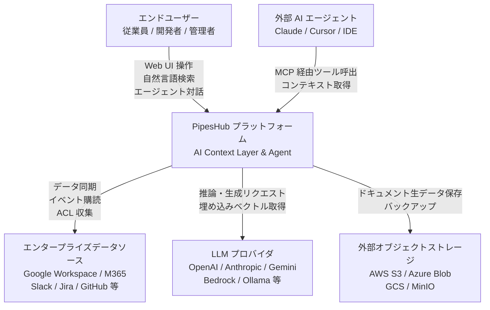
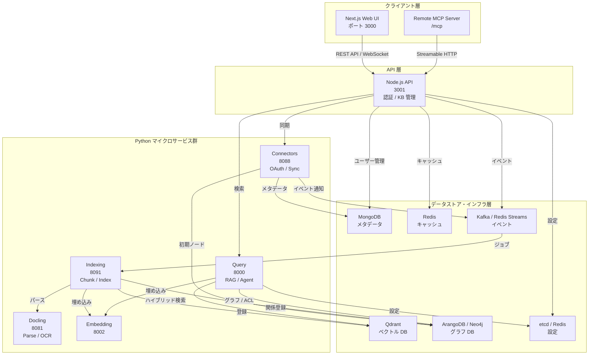
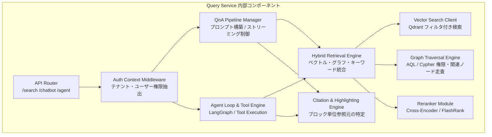
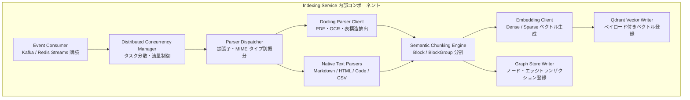
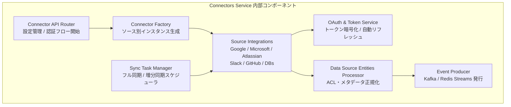
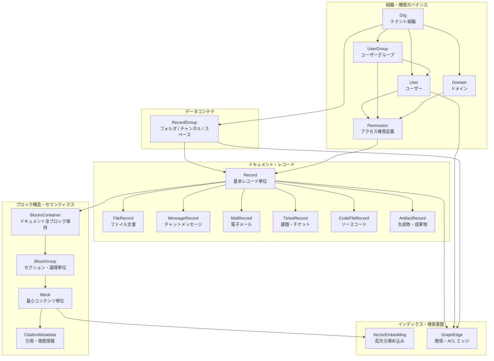
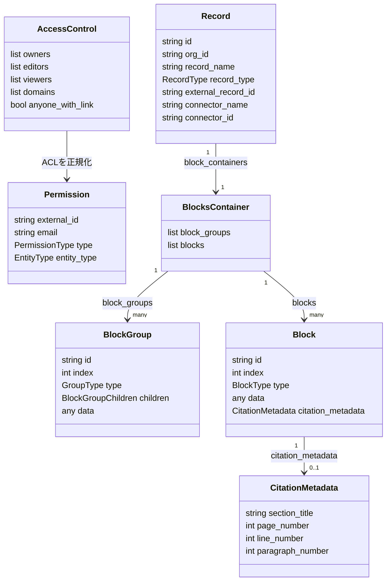

PipesHub は、企業内に散在するデータを権限付きで検索し、引用可能なコンテキストとして AI エージェントへ渡すためのオープンソース基盤です。本記事では、全体アーキテクチャ、権限とブロックを中心にしたデータモデル、Docker Compose・Kubernetes での導入、利用と運用上の要点までを一続きで解説します。

一般的な Enterprise RAG の認可論ではなく、PipesHub 固有の「コネクタから ACL を取り込み、Record / Block へ構造化し、検索結果と citation を返す」経路に焦点を当てます。API、Compose、内部モデルの例は 2026 年 8 月 17 日時点の [`097295c`](https://github.com/pipeshub-ai/pipeshub-ai/commit/097295cda7bb944b4f47e6a34a6395bda43c7576) を基準に確認しています。


*この記事の全体像。以下、順に解説します。*

## 概要

PipesHub は、企業内に分散する膨大な業務データソースを統合し、正確な引用（Citation）を伴うエンタープライズ検索と自律型 AI エージェントの実行基盤を提供するオープンソース（Apache 2.0）の AI Context Layer です。


従来のエンタープライズ検索や汎用 RAG（Retrieval-Augmented Generation）システムでは、データソース元の権限モデル（ACL: Access Control List）の維持や、ドキュメント内のどの段落・テーブル・画像に基づいた回答であるかの根拠提示が困難でした。PipesHub は、50 種類以上のエンタープライズコネクタ（Google Workspace、Microsoft 365、Slack、Notion、Jira、Confluence、GitHub 等）からデータを同期し、対応コネクタで ID・メールアドレスなどの対応付け条件を満たす範囲でソース権限を検索へ反映します。

権限同期はコネクタ固有の制約を受けます。たとえば外部サービスと PipesHub のメールアドレスが一致しない場合や、Confluence 側でユーザーのメールアドレスが非公開の場合は、正しい主体へ ACL を割り当てられないことがあります。導入時は同期件数だけでなく、代表ユーザーごとの検索可視性を必ず確認します。

さらに、ベクトル検索（Qdrant / OpenSearch / Redis）とナレッジグラフ（ArangoDB / Neo4j）を融合したハイブリッド検索エンジンを内包しています。これにより、意味的な類似度検索に加えて、組織・人・プロジェクト・ドキュメント間の関係性を辿るグラフ走査を行い、精度の高いコンテキストを LLM に供給します。完全セルフホスト可能であり、プライベートクラウドやオンプレミス環境においてデータ主権を維持しながら導入できます。

### 関連技術との位置づけと詳細比較

PipesHub は「検索 UI」だけでなく、コネクタ、ACL、ブロック構造、検索、引用、エージェント実行を一体でセルフホストする設計です。関連製品とは提供形態と拡張境界が異なるため、単純な機能数やメモリ量ではなく、次の軸で見ると位置づけが分かりやすくなります。表は 2026 年 8 月 17 日時点の各公式情報を基準にしています。

| 比較対象 | 提供形態 | 主な拡張境界 | 権限連携の考え方 |
|---|---|---|---|
| **PipesHub** | Apache 2.0、セルフホスト | コネクタ、検索、Agent、MCP | ソースのユーザー・グループ情報を同期し、検索時に適用 |
| **Glean** | マネージド SaaS | 管理されたコネクタとワークスペース AI | SaaS 側でコネクタごとの権限を同期 |
| **Onyx** | Community Edition は MIT、`ee` 配下は独自 Enterprise License | 検索・アシスタント・コネクタ | コネクタ権限同期は Enterprise 機能を含む |
| **AnythingLLM** | MIT、デスクトップ／サーバー | ワークスペースとローカル連携 | ワークスペース単位のアクセス管理が中心 |
| **LangChain / LangGraph** | MIT、アプリケーションライブラリ | 検索・認可・実行フローをコードで構成 | アプリケーション側で設計・実装 |

Onyx は公式 README で 50 種類以上のインデックス型コネクタを案内しています。各製品は Lite 構成、標準構成、SaaS で計測条件が揃わないため、必要メモリの横並び比較は行いません。

### ユースケース別の推奨技術

| ユースケース | 推奨ツール | 選定理由 |
|---|---|---|
| **完全オンプレミス / VPC でのセキュアな企業検索** | **PipesHub** | データ主権を維持しつつ、Neo4j/ArangoDB ナレッジグラフと Qdrant による高度な権限付きハイブリッド検索が可能なため。 |
| **エンタープライズ SaaS によるフルマネージド導入** | **Glean** | インフラ運用の負担をなくし、多数の SaaS と即座に連携した高品質な社内検索を求める場合に最適。 |
| **軽量な社内ナレッジアシスタントの迅速な立ち上げ** | **Danswer (Onyx)** | 構成が比較的シンプルで、素早く導入して基本的な社内チャットボットを構築する用途に適しているため。 |
| **個人・小規模チーム向けローカル AI ドキュメント検索** | **AnythingLLM** | 単一デスクトップアプリまたは軽量コンテナで動作し、デスクトップ環境で完結するため。 |
| **独自のドメイン特化 AI エージェントのスクラッチ開発** | **LangChain / LangGraph** | ロジックや制御フローをコードレベルで完全にカスタマイズして構築できるため。 |

---

## 特徴

PipesHub の中核的な技術的特徴は以下のとおりです。

- **50 種以上のエンタープライズコネクタによる包括的データ統合**
  - Google Workspace（Drive, Gmail, Calendar）、Microsoft 365（OneDrive, SharePoint, Outlook, Teams）、Atlassian（Confluence, Jira）、Slack、Notion、GitHub、GitLab、Salesforce、ServiceNow、各種 RDBMS/DWH（PostgreSQL, Snowflake, MariaDB）およびオブジェクトストレージ（S3, Azure Blob, GCS, MinIO）に対応します。
  - 定期ポーリング同期および Webhook / イベント駆動型のリアルタイム差分同期をサポートします。

- **ソースレベルの厳密なパーミッション制御（Permission-Aware Search）**
  - 元データソースのユーザー、グループ、組織階層、リンク公開設定を同期・マッピングします。
  - 検索時および RAG 実行時にユーザーのコンテキストに基づいた認可フィルタリングを適用し、閲覧権限のない情報の漏洩を防止します。

- **ベクトル検索とナレッジグラフのハイブリッド RAG**
  - 高速な高次元ベクトル検索（Qdrant / OpenSearch / Redis）により意味的な関連文書を抽出します。
  - グラフデータベース（ArangoDB / Neo4j）を活用し、文書間の親子・参照関係、起票者・担当者・メンション、プロジェクト・コンテナのトポロジー構造を走査して高度なコンテキストを構築します。

- **ブロック単位の精密かつ説明可能な引用（Explainable Block Citations）**
  - ドキュメントを段落、テーブル、コード、リスト、画像などの「Block」単位に構造化してインデックスします。
  - LLM の回答生成時に参照元の特定ブロックをハイライトし、根拠となるソースを正確に追跡できます。

- **高度なマルチモーダル解析と文書パースエンジン**
  - PDF パーサーの既定は pdfplumber です。Docling は `PARSER_BACKEND` で選択でき、複雑なレイアウト、表、画像を扱う構成に切り替えられます。
  - VLM（Vision-Language Model）との連携による OCR 処理および画像内容のセマンティック抽出に対応します。

- **BYOM（Bring Your Own Model）とマルチ LLM オーケストレーション**
  - LiteLLM および LangChain / LangGraph をベースとし、OpenAI、Anthropic、Google Gemini、AWS Bedrock、Azure OpenAI、Ollama、vLLM 等の多様なプロバイダを切り替え可能です。
  - ローカル Embedding サーバー（SentenceTransformers / HuggingFace）を内包し、外部通信不要の完全オフライン運用にも対応します。

- **ノーコード Agent Builder と MCP（Model Context Protocol）ネイティブ対応**
  - GUI 上で業務特化エージェントを視覚的に構築し、企業データとツール（Toolset / Skill）を連携できます。
  - MCP Server および Client 機能を備え、外部の AI エージェント（Claude Code, Cursor 等）から PipesHub のナレッジをツールとして呼び出すことが可能です。

- **クラウドネイティブかつ高可用性なマイクロサービスアーキテクチャ**
  - Python FastAPI（5 サービス）と Node.js API、Next.js フロントエンドで構成され、Kafka / Redis Streams による非同期分散メッセージングを採用しています。
  - Docker Compose によるシングルノード展開から、Kubernetes（Helm Chart）による高可用性マルチレプリカ構成まで柔軟にスケーリング可能です。

---

## 構造

PipesHub のシステム構造を C4 モデルの 3 段階（システムコンテキスト、コンテナ、コンポーネント）で図解します。

### システムコンテキスト図

システムコンテキスト図は、エンドユーザー、外部の各種エンタープライズデータソース、外部 LLM プロバイダ、外部 MCP クライアントと PipesHub の全体的な相互関係を示します。



| 要素名 | 説明 |
|---|---|
| **エンドユーザー** | 検索・Q&A・チャットボット・ノーコード Agent を利用する企業の従業員、システム管理者、開発者です。 |
| **外部 AI エージェント** | Model Context Protocol（MCP）を通じて PipesHub の検索機能やナレッジを外部ツールとして呼び出すエージェント環境です。 |
| **PipesHub プラットフォーム** | 企業内データを同期・構造化・インデックス化し、権限を維持したハイブリッド検索とエージェント実行を提供するコアシステムです。 |
| **エンタープライズデータソース** | 社内文書、メッセージ、チケット、リポジトリ等を保有する外部 SaaS およびオンプレミスデータソース群です。 |
| **LLM プロバイダ** | 回答生成、クエリ書き換え、リランキング、エンベディング計算を行うクラウドまたはローカルの LLM サービスです。 |
| **外部オブジェクトストレージ** | 大規模ファイル、アップロードされたドキュメント原本、エクスポートデータを永続化する外部ストレージです。 |

---

### コンテナ図

コンテナ図は、PipesHub プラットフォームを構成する Web フロントエンド、API ゲートウェイ、マイクロサービス群、および各種バックエンドデータストアの連携構成を示します。



| 要素名 | 説明 |
|---|---|
| **Next.js Web UI** | React / Next.js / TypeScript で構築されたユーザーインターフェースであり、検索、対話、Agent 作成、管理機能を提供します。 |
| **Remote MCP Server** | 外部の MCP client が PipesHub のナレッジを利用するための Streamable HTTP エンドポイントです。 |
| **Node.js Express API** | 認証（JWT / SAML / OAuth）、組織・ユーザー管理、ナレッジベース設定、オブジェクトストレージ抽象化、API Gateway を担います。 |
| **Query Service** | FastAPI 製の検索・RAG・AI Agent ランタイムであり、LiteLLM / LangGraph を統合して高精度な回答生成とワークフロー実行を行います。 |
| **Indexing Service** | FastAPI 製のデータ取り込み・インデックスパイプラインであり、文書分割、埋め込み、ベクトル DB およびグラフ DB への登録を統括します。 |
| **Connectors Service** | FastAPI 製のコネクタ管理サービスであり、OAuth トークン管理、外部 SaaS との差分同期、イベント監視を実行します。 |
| **Docling Service** | PDF、Word、Excel、画像等の高度なレイアウト解析、表抽出、OCR を実行するドキュメント処理エンジンです。 |
| **Embedding Service** | HuggingFace / SentenceTransformers モデルをローカルでホストし、OpenAI 互換の埋め込みエンドポイントを提供するサービスです。 |
| **Qdrant** | ドキュメントチャンクおよびブロックの高次元埋め込みベクトルを保存し、高速な近似近傍探索（ANN）を提供するベクトル DB です。 |
| **ArangoDB / Neo4j** | ドキュメント、ユーザー、組織、プロジェクト間の関係性やパーミッション構造を管理するナレッジグラフ DB です。 |
| **MongoDB** | ユーザーアカウント、組織設定、セッション履歴、コネクタ接続情報などのメタデータを管理するドキュメント DB です。 |
| **Redis** | キャッシュ、API レートリミット、および軽量メッセージング（Redis Streams）を提供するインメモリデータストアです。 |
| **Kafka / Redis Streams** | コネクタからインデクサーへの非同期データ同期イベントやジョブキューを安全に配送するメッセージブローカーです。 |
| **etcd / Redis** | 分散環境における設定管理や動的パラメータの同期を行うキーバリューストアです。 |

---

### コンポーネント図

主要な 3 つのマイクロサービス（Query Service、Indexing Service、Connectors Service）の内部コンポーネント構成を図解します。

#### 1. Query Service 内部コンポーネント



| 要素名 | 説明 |
|---|---|
| **API Router** | 検索（`/search`）、チャットボット（`/chatbot`）、Agent 実行（`/agent`）、音声（`/speech`）等のリクエストを受け付けるエンドポイントです。 |
| **Auth Context Middleware** | リクエストヘッダーから JWT / API トークンを検証し、組織 ID、ユーザー ID、所属グループ、権限スコープをコンテキストにバインドします。 |
| **QnA Pipeline Manager** | ユーザーの質問意図解析、コンテキスト注入、Prompt テンプレート適用、LLM ストリーミング応答のフォーマットを行います。 |
| **Hybrid Retrieval Engine** | ベクトル類似度検索、ナレッジグラフ探索、キーワード検索を組み合わせ、権限フィルタを適用した候補抽出を行います。 |
| **Reranker Module** | 抽出された候補ブロックを Cross-Encoder や FlashRank 等を用いて関連度順に高精度に再順位付けします。 |
| **Agent Runtime** | LangGraph ベースの自律エージェントループを駆動し、ツールの呼び出し、状態管理、ステップ実行を統括します。 |
| **Graph Traversal Engine** | ArangoDB（AQL）または Neo4j（Cypher）上で ACL 走査およびエンティティ関係のホップ検索を実行します。 |
| **Vector Search Client** | Qdrant 等のベクトルデータベースに対して、組織・権限メタデータでフィルタリングされたベクトル検索を実行します。 |
| **Citation Engine** | 生成された回答テキストに対して、参照元ドキュメントの Block ID を正確に対応付け、根拠引用メタデータを生成します。 |

#### 2. Indexing Service 内部コンポーネント



| 要素名 | 説明 |
|---|---|
| **Event Consumer** | メッセージブローカーから新規文書作成、更新、削除、再インデックスイベントを受信します。 |
| **Distributed Concurrency Manager** | ノード間でのタスク重複実行を防止し、システム負荷に応じた同時実行制御（並列パース・インデックス）を行います。 |
| **Parser Dispatcher** | 取り込んだファイルの MIME タイプや形式に応じて、最適なパースエンジンを選択してルーティングします。 |
| **Docling Parser Client** | PDF や画像、複雑なスプレッドシートを Docling サービスに転送し、階層構造や表データを抽出します。 |
| **Native Text Parsers** | Markdown、HTML、ソースコード、プレーンテキストを高速にローカルパースする軽量パーサー群です。 |
| **Semantic Chunking Engine** | パース結果を論理構造（見出し、段落、表、コード）を維持した Block および BlockGroup 単位にチャンク化します。 |
| **Embedding Client** | 分割されたブロックテキストを Embedding サービスに送信し、高次元埋め込みベクトルを取得します。 |
| **Qdrant Vector Writer** | ベクトルデータにドキュメント ID、組織 ID、権限メタデータをペイロードとして付与し、Qdrant に登録します。 |
| **Graph Store Writer** | ドキュメント、作成者、フォルダ、リンク関係をグラフ DB（ArangoDB / Neo4j）のノードおよびエッジとして永続化します。 |

#### 3. Connectors Service 内部コンポーネント



| 要素名 | 説明 |
|---|---|
| **Connector API Router** | コネクタの接続設定登録、OAuth コールバック処理、手動同期トリガー等のエンドポイントです。 |
| **Connector Factory** | データソース種別（Slack, Drive, Jira 等）に応じた専用コネクタクラスのインスタンスを生成・管理します。 |
| **OAuth & Token Service** | 外部 SaaS のアクセス・リフレッシュトークンを安全に暗号化保存し、期限切れ前の自動リフレッシュを行います。 |
| **Sync Task Manager** | コネクタごとの定期同期スケジュール、チェックポイント管理、差分取得カーソルを制御します。 |
| **Source Integrations** | 各外部サービス固有の API を呼び出し、ファイル、メッセージ、チケット、権限情報を取得するアダプタ群です。 |
| **Data Source Entities Processor** | 各種 SaaS から取得した生データを PipesHub の共通データモデル（Record / RecordGroup / Permission）に正規化します。 |
| **Event Producer** | 正規化されたデータエンティティをインデックス用イベントとしてメッセージブローカーに送信します。 |

---

## データ

PipesHub におけるデータ構造を「概念モデル」と「情報モデル」の 2 つの側面から詳細に定義します。

### 概念モデル

概念モデルは、組織・権限、データコンテナ（RecordGroup）、個別アイテム（Record）、コンテンツを構成するブロック構造（BlocksContainer / BlockGroup / Block）、およびベクトル・グラフインデックスの論理的な関係を示します。



| 要素名 | 説明 |
|---|---|
| **Org** | テナントおよび企業組織を表す最上位エンティティであり、ドメイン、ユーザー、データを論理的に分離します。 |
| **Domain** | 組織に紐づくドメイン名（企業メールアドレスのドメイン等）であり、同一組織内アクセス権限の判定に使用されます。 |
| **User** | システムを利用する個別ユーザーまたは外部データソースから同期されたアカウントです。 |
| **UserGroup** | 部署、チーム、プロジェクト単位で複数の User をまとめるグループエンティティです。 |
| **Permission** | レコードやコンテナに対する閲覧・編集・共有権限（ACL）を定義するエンティティです。 |
| **RecordGroup** | Google Drive フォルダ、Slack チャンネル、Confluence スペース、Notion ワークスペース等のグループ単位です。 |
| **Record** | 外部データソースから同期された個別アイテムの基底エンティティです。 |
| **FileRecord** | PDF、Office 文書、画像等のファイル形式のレコードです。 |
| **MessageRecord** | Slack、Teams 等のチャットメッセージおよびスレッド単位のレコードです。 |
| **MailRecord** | Gmail、Outlook 等の個別メールまたはスレッドレコードです。 |
| **TicketRecord** | Jira、ServiceNow、GitHub Issue 等のチケット・課題レコードです。 |
| **CodeFileRecord** | GitHub、GitLab、Bitbucket 等のリポジトリ内ソースコードファイルです。 |
| **ArtifactRecord** | AI エージェントやコードサンドボックスの実行によって生成された成果物レコードです。 |
| **BlocksContainer** | 1 つの Record 内に含まれる全 Block および BlockGroup を束ねるコンテナです。 |
| **BlockGroup** | 見出しや章、論理的なセクション単位で複数の Block をまとめるグループです。 |
| **Block** | 段落、表セル、コード片、リスト項目、画像などの最小意味単位です。 |
| **CitationMetadata** | LLM が回答を生成する際に、どの Block を参照したかを追跡・証明するための引用メタデータです。 |
| **VectorEmbedding** | 各 Block のセマンティクスを表現する高次元ベクトル（Qdrant 等に格納）です。 |
| **GraphEdge** | レコード間の親子関係、参照リンク、作成者・担当者関係、権限伝播を表現するグラフエッジです。 |

---

### 情報モデル

次の図は、現行ソースの Pydantic モデルから検索と引用に関係するフィールドだけを抜き出した簡略図です。永続化先では一部が camelCase に変換されるため、API のレスポンス型と Python 内部モデルを混同しないでください。



| モデル | 現行ソースの主要フィールド | 役割 |
|---|---|---|
| `Permission` | `external_id`, `email`, `type`, `entity_type` | 個々の主体と `READER` / `WRITER` / `OWNER` 等の関係を表現 |
| `AccessControl` | `owners`, `editors`, `viewers`, `domains`, `anyone_with_link` | コネクタが取得した ACL を用途別リストへ正規化 |
| `Record` | `record_name`, `external_record_id`, `connector_name`, `connector_id`, `block_containers` | 外部アイテムの識別情報、同期元、構造化本文を保持 |
| `BlocksContainer` | `block_groups`, `blocks` | セクション階層と最小コンテンツ単位を分離して保持 |
| `BlockGroup` | `index`, `type`, `children`, `data` | 見出し、表、リストなどの階層と子範囲を表現 |
| `Block` | `index`, `type`, `data`, `citation_metadata` | 検索・引用に使う最小単位とソース位置を保持 |
| `CitationMetadata` | `section_title`, `page_number`, `line_number`, `paragraph_number` など | PDF、テキスト、表計算、音声・動画の参照位置を表現 |

この構造では、ACL は `allowedUserIds` のような単一配列へ押し込められていません。コネクタが取得した主体と権限種別を正規化し、Record とグラフ上の関係へ反映します。検索レスポンスはさらに別の公開スキーマへ変換され、`metadata.recordName` や `metadata.score` などを返します。

---

## 構築方法

PipesHub の環境構築手順、前提条件、デプロイ方法（Docker Compose および Kubernetes / Helm）、および初期セットアップについて説明します。

### 前提条件とシステム要件

公式 Quickstart が Compose 実行の前提として挙げるのは Git と Docker Compose v2 です。CPU、メモリ、ストレージは、有効にする parser、Embedding、グラフ DB、メッセージブローカー、対象データ量で大きく変わるため、一律の最小値とはしません。`APP_MEMORY_LIMIT` は予約量ではなく OOM cap です。

ソースコードからコネクタを開発する場合は、実行環境とは要件を分けて考えます。現行の Connector Integration Playbook は Python 3.12 と Node.js 22.15 を案内しています。Kubernetes / Helm の対応版は、利用する chart とクラスタのリリースノートで確認してください。

```bash
# Docker および Docker Compose バージョンの確認
docker --version
docker compose version

# 公式 Compose がホストへ公開するポート 3000 の空き確認
nc -z -v -w5 localhost 3000 2>&1 || echo "Port 3000 is available"
```

### Docker Compose によるクイックデプロイ

Docker Compose を使用して、最も手軽に PipesHub 環境を起動する手順です。PipesHub はプロファイル駆動型の構成を採用しています。

- **リポジトリのクローンと対話型インストーラーの実行**
  - `install.sh` は `SECRET_KEY` だけでなく、MongoDB、Qdrant、ArangoDB など選択した構成に必要な credential を生成します。既知の placeholder を残さないため、これを基本手順にします。

```bash
# リポジトリのクローン
git clone https://github.com/pipeshub-ai/pipeshub-ai.git
cd pipeshub-ai/deployment/docker-compose

# 対話に沿って構成を選び、安全な .env を生成して起動
./install.sh
```

手動で `env.template` を使う場合は、少なくとも `SECRET_KEY`、`MONGO_PASSWORD`、`QDRANT_API_KEY`、選択したグラフ DB の password をランダム値へ置換し、`your_...` の placeholder が残っていないことを起動前に確認します。

### プロファイル別 Docker Compose 構成

PipesHub は、用途やリソース規模に応じてプロファイルを切り替えて起動できます。ただし、`COMPOSE_PROFILES` はコンテナを起動するだけです。アプリケーションが利用するバックエンドは `DATA_STORE`、`MESSAGE_BROKER`、`KV_STORE_TYPE` も合わせて指定します。

- **軽量構成（Neo4j + Redis Streams）の起動**
  - メモリ消費を抑え、Kafka や Zookeeper を起動せずに Redis Streams をメッセージブローカーとして利用します。

```bash
# Neo4j + Redis Streams。Redis は KV store と broker を兼用
DATA_STORE=neo4j \
MESSAGE_BROKER=redis \
KV_STORE_TYPE=redis \
COMPOSE_PROFILES=graph-neo4j \
docker compose -p pipeshub-ai up -d

# 起動ログの確認
docker compose -p pipeshub-ai logs -f pipeshub-ai
```

- **ArangoDB + etcd + Kafka を使う単一ノード構成の起動**
  - 各 backend の組み合わせをローカルで検証する Compose 例です。各サービスは単一インスタンスで、HA や本番可用性を意味しません。本番は後述の Helm 構成を基準にします。

```bash
# ArangoDB + etcd + Kafka
DATA_STORE=arangodb \
MESSAGE_BROKER=kafka \
KV_STORE_TYPE=etcd \
COMPOSE_PROFILES=graph-arango,kv-etcd,broker-kafka \
docker compose -p pipeshub-ai up -d
```

- **対話型インストールスクリプトの再実行**
  - 構成を選び直す場合も `deployment/docker-compose/install.sh` を使い、profile と選択変数の組み合わせを揃えます。

```bash
# インストールスクリプトの実行
./install.sh
```

### Kubernetes (Helm) による本番デプロイ

大規模組織や高可用性（HA）が求められる本番環境では、公式 Helm チャートを使用して Kubernetes クラスタへ展開します。

- **Helm リポジトリの準備と設定調整**
  - `deployment/helm/pipeshub-ai` ディレクトリの値（`values-cloud.yaml`）をカスタマイズします。

```bash
cd deployment/helm/pipeshub-ai

# Helm チャートの依存関係更新
helm dependency update .

# クラウド本番用 values を適用したデプロイ
helm upgrade --install pipeshub-ai . \
  --namespace pipeshub \
  --create-namespace \
  -f values-cloud.yaml \
  --set global.secretKey="your-production-secret-key" \
  --set global.frontendPublicUrl="https://pipeshub.example.com"
```

- **Kubernetes Pod 起動状態の検証**

```bash
# Pod の稼働状態確認
kubectl get pods -n pipeshub -o wide

# Ingress およびサービスエンドポイントの確認
kubectl get ingress,svc -n pipeshub
```

### 初期セットアップと管理者アカウント作成

コンテナが起動した後、Web ブラウザから初期管理者のセットアップを行います。

- **初期ウィザードの完了**
  - ブラウザで `http://localhost:3000`（または設定した `FRONTEND_PUBLIC_URL`）を開きます。
  - 初期管理者メールアドレス、パスワード、組織名（テナント名）を入力して管理者アカウントを作成します。
  - 設定画面から LLM プロバイダの API キー（OpenAI, Anthropic 等）を登録します。

```bash
# API 経由でのヘルスチェックによる起動完了確認
curl -f http://localhost:3000/api/v1/health/services || echo "Waiting for services..."
```

---

## 利用方法

PipesHub の主要機能（認証、コネクタ同期、検索 API、チャットボット、SDK 利用、MCP 連携、No-Code Agent）の利用手順を解説します。


### 必須パラメータと API 認証仕様

PipesHub の REST API を呼び出す際は、Bearer トークン認証が必要です。

| パラメータ名 | 配置場所 | 必須 | 型 | 説明 |
|---|---|:---:|---|---|
| `Authorization` | HTTP Header | ◯ | `string` | `Bearer <JWT_OR_PERSONAL_ACCESS_TOKEN>` 形式で指定します。 |
| `Content-Type` | HTTP Header | ◯ | `string` | `application/json` を指定します。 |

- **Personal Access Token（PAT）の発行**
  - Web UI の「Workspace → Developer settings → Personal Access Tokens」から有効期限を指定してトークンを生成します。

```bash
# 環境変数に API トークンとエンドポイントを設定
export PIPESHUB_API_URL="http://localhost:3000"
export PIPESHUB_TOKEN="your_personal_access_token_here"
```

### コネクタの登録とデータ同期

コネクタごとに OAuth、サービスアカウント、同期フィルタのスキーマが異なるため、最初の接続は Web UI から作成するのが安全です。現行バックエンドでは、作成したコネクタを ID で管理します。

| 操作 | 現行 API |
|---|---|
| 構成済みコネクタの一覧 | `GET /api/v1/connectors/configured` |
| コネクタの作成 | `POST /api/v1/connectors/` |
| 認証構成の更新 | `PUT /api/v1/connectors/{connector_id}/config/auth` |
| 同期フィルタの更新 | `PUT /api/v1/connectors/{connector_id}/config/filters-sync` |
| 有効化・無効化 | `POST /api/v1/connectors/{connector_id}/toggle` |
| 再インデックス | `POST /api/v1/connectors/{connector_id}/reindex` |

これらのリクエスト本文はコネクタ種別によって変わります。固定の `connectorType` と `folderId` を全コネクタ共通の公開スキーマとして扱わず、デプロイしたバージョンの OpenAPI または Connector Manager 画面で確認してください。

### エンタープライズ検索 API の実行

権限を考慮したハイブリッド検索を実行し、関連ドキュメントおよびブロックを取得します。

- **検索リクエストの送信**

```bash
curl -X POST "${PIPESHUB_API_URL}/api/v1/search" \
  -H "Authorization: Bearer ${PIPESHUB_TOKEN}" \
  -H "Content-Type: application/json" \
  -d '{
    "query": "2026年度 Q3 セキュリティ監査報告書",
    "limit": 5
  }'
```

検索範囲を絞る場合は、`filters.apps` にコネクタアプリの ID、`filters.kb` に Knowledge Base / RecordGroup の ID を指定します。名前やレコード種別を渡すフィールドではありません。

- **検索レスポンスの例（抜粋）**

```json
{
  "searchId": "68a000000000000000000001",
  "searchResponse": {
    "searchResults": [
      {
        "content": "SOC2 Type II 監査における指摘事項はゼロ件であり...",
        "chunkIndex": 0,
        "citationType": "text",
        "metadata": {
          "recordId": "rec_789abc",
          "recordName": "Q3_Security_Audit_Report_2026.pdf",
          "webUrl": "https://drive.google.com/file/d/xxx/view",
          "blockType": "text",
          "pageNum": [4],
          "score": 0.942
        }
      }
    ],
    "records": [],
    "status": "success",
    "status_code": 200,
    "message": "Search completed"
  }
}
```

文書名とスコアはトップレベルではなく、それぞれ `metadata.recordName`、`metadata.score` にあります。`searchResults` はブロックまたはレコード要約のヒットで、グラフ側のレコードは `searchResponse.records` に分離されます。

上の形は対象コミットに含まれる OpenAPI を優先しています。この版では `records` は配列で、`status`、`status_code`、`message` も必須です。ホスト済みドキュメントには `records` を ID キーの map とする旧例が残っているため、異なる版を使う場合は、そのインスタンスが配布する OpenAPI と SDK の生成版を揃えてください。

### チャットボット・Q&A API（ストリーミングと引用）

引用付きの回答を Server-Sent Events（SSE）で受信します。新しい会話をストリームで開始する公開 API は `/api/v1/conversations/stream` です。

- **チャット対話リクエスト（Server-Sent Events: SSE）**

```bash
curl -N -X POST "${PIPESHUB_API_URL}/api/v1/conversations/stream" \
  -H "Authorization: Bearer ${PIPESHUB_TOKEN}" \
  -H "Content-Type: application/json" \
  -d '{
    "query": "新しいオンボーディング手順について教えてください",
    "chatMode": "internal_search"
  }'
```

ストリームは AG-UI のイベント語彙を使い、最初に `conversation_created`、成功時に `RUN_FINISHED`、失敗時に `RUN_ERROR` を返します。既存会話への追加ターンは `POST /api/v1/conversations/{conversationId}/messages/stream` を使います。

ホスト済みドキュメントや一部 SDK 説明には `connected`、`chunk`、`citation`、`complete`、`error` という旧イベント名も残っています。対象コミットの gateway OpenAPI と route 実装は AG-UI を正本としているため、client と server の版がずれる場合はイベント名を固定せず、未知イベントを無視できる実装にします。

### Python SDK による連携実装

公式 Python SDK（`pipeshub-sdk`）を利用したセマンティック検索の例です。

- **SDK のインストール**

```bash
pip install pipeshub-sdk
```

- **Python スクリプト例**

```python
import os
from pipeshub_sdk import Pipeshub, models

with Pipeshub(
    server_idx=0,
    instance_url="http://localhost:3000",
    security=models.Security(
        bearer_auth=os.getenv("PIPESHUB_BEARER_AUTH", ""),
    ),
) as pipeshub:
    result = pipeshub.semantic_search.search(
        query="リモートワーク規定",
        limit=3,
    )
    print(result)
```

SDK のレスポンス型は `SemanticSearchExecuteResponse` です。`enterprise_search` や `.results` ではなく、`semantic_search.search()` の戻り値として扱います。

### TypeScript SDK による連携実装

公式 TypeScript SDK（`@pipeshub-ai/sdk`）を利用した Node.js 連携です。

- **SDK のインストール**

```bash
npm install @pipeshub-ai/sdk
```

- **TypeScript 実装例**

```typescript
import { Pipeshub } from "@pipeshub-ai/sdk";

const pipeshub = new Pipeshub({
  serverIdx: 0,
  instanceUrl: "http://localhost:3000",
  security: {
    bearerAuth: process.env.PIPESHUB_TOKEN ?? "",
  },
});

async function run() {
  const result = await pipeshub.semanticSearch.search({
    query: "AWS コスト最適化ガイドライン",
    limit: 5,
  });
  console.log(result);
}

run().catch(console.error);
```

### Model Context Protocol (MCP) サーバー連携

PipesHub は `/mcp` に Streamable HTTP の Remote MCP Server を公開します。Claude Code や Cursor は MCP client としてこの URL へ直接接続でき、ローカル npm プロセスは必須ではありません。

- **Claude Code から OAuth で接続する例**

```bash
claude mcp add --transport http \
  --client-id YOUR_CLIENT_ID \
  --client-secret \
  --callback-port 8080 \
  pipeshub http://localhost:3000/mcp
```

`--client-secret` に値を付けないとマスク入力が開きます。PipesHub の Developer Settings で OAuth App を作成し、コールバック URL と公開される `MCP_SCOPES` をクライアント設定に合わせます。Bearer token を扱えるクライアントでは、同じ `http://localhost:3000/mcp` に JWT を付けて接続できます。

### No-Code Agent Builder と Toolsets の作成

PipesHub の GUI 上で自律エージェントを構築し、特定のワークフローを実行する手順です。

- **エージェントの作成手順**
  - Web UI の「Agents → New Agent」を開きます。
  - システムプロンプト、使用する LLM モデル、アクセス可能なナレッジベース（KB）を選択します。
  - Toolsets（Slack 投稿、Jira チケット作成、Web 検索等）をエージェントに割り当てます。
  - 作成したエージェントは Web UI 上で対話でき、安定した `agentKey` を使って API からも実行できます。

```bash
# Agent との新しい会話を作成し、応答を SSE で受信
curl -N -X POST "${PIPESHUB_API_URL}/api/v1/agents/agent_456/conversations/stream" \
  -H "Authorization: Bearer ${PIPESHUB_TOKEN}" \
  -H "Content-Type: application/json" \
  -d '{
    "query": "先週オープンしたバグチケットのサマリを作成してください",
    "chatMode": "quick"
  }'
```

続きのメッセージは `POST /api/v1/agents/{agentKey}/conversations/{conversationId}/messages/stream` へ送ります。Agent のストリームでも AG-UI が使われ、OAuth token では `agent:execute` scope が必要です。

---

## 運用

稼働中における PipesHub のライフサイクル管理、監視、ヘルスチェック、ログ管理、およびデータバックアップ手順を説明します。

### サービスの起動・停止・再起動

Docker Compose または Kubernetes 上で各マイクロサービスの状態を安全に制御します。

- **Docker Compose での操作コマンド**

```bash
# 全コンテナの起動
docker compose -p pipeshub-ai up -d

# 稼働ステータスとヘルスチェック状態の確認
docker compose -p pipeshub-ai ps

# サービスの安全な停止
docker compose -p pipeshub-ai stop

# コンテナの破棄とボリュームの維持
docker compose -p pipeshub-ai down
```

### ヘルスチェックと健全性監視

公式 Docker Compose はホストへアプリの 3000 番ポートだけを公開します。内部サービスの 8000、8088、8091 番などをホストの `localhost` へ直接問い合わせる構成ではありません。

- **集約ヘルスチェックの実行**

```bash
# Compose が公開する集約エンドポイント
curl -fsS http://localhost:3000/api/v1/health/services | jq .
```

### ログ収集とローテーション管理

PipesHub は Docker のローカルログドライバによるローテーションを設定ファイルで制御しています。

- **ログの監視とフィルタリング**

```bash
# 特定サービスのログをリアルタイム追跡
docker compose -p pipeshub-ai logs -f --tail=100 pipeshub-ai

# エラーログの抽出
docker compose -p pipeshub-ai logs pipeshub-ai 2>&1 | grep -i "error"
```

- **Docker デーモン側のログローテーション設定（`docker-compose.yml` での指定）**

```yaml
logging:
  driver: local
  options:
    max-size: "20m"
    max-file: "15"
    compress: "true"
```

### メトリクス監視と Telemetry (OpenTelemetry)

PipesHub は OpenTelemetry を組み込んでいますが、公式 Compose はホストの `localhost:3001/metrics` を公開しません。Telemetry を有効化するときは OTLP の送信先を構成し、Collector、Prometheus、Jaeger 側で受信を確認します。内部ポートをホストへ追加公開する場合は、Compose override とネットワーク境界を明示し、認証なしのメトリクス endpoint を外部へ露出させないでください。

### データベースのバックアップとリストア

MongoDB、ArangoDB / Neo4j、Qdrant の定期バックアップはシステムの事業継続性に不可欠です。

- **各データストアのバックアップ実行例**

```bash
# MongoDB の archive をホスト側へ保存
mkdir -p backups
docker compose -p pipeshub-ai exec -T mongodb mongodump \
  --username admin --password your_mongodb_password \
  --authenticationDatabase admin --archive \
  > backups/mongodb-$(date +%Y%m%d).archive

# Qdrant snapshot を作成。レスポンスに含まれる snapshot 名を控える
docker compose -p pipeshub-ai exec -T pipeshub-ai \
  curl -fsS -X POST "http://qdrant:6333/collections/<collection_name>/snapshots" \
  -H "api-key: ${QDRANT_API_KEY}"

# snapshot を Compose volume 外のホストへダウンロード
docker compose -p pipeshub-ai exec -T pipeshub-ai \
  curl -fsS "http://qdrant:6333/collections/<collection_name>/snapshots/<snapshot_name>" \
  -H "api-key: ${QDRANT_API_KEY}" \
  > backups/qdrant-<snapshot_name>
```

ArangoDB / Neo4j も利用中の backend に応じて別媒体へ退避します。バックアップは作成だけで完了とせず、暗号化したオブジェクトストレージなど別障害ドメインへ転送し、定期的に隔離環境でリストアを確認します。

### ワーカー並列度とスケーリングチューニング

ドキュメントのインデックス流量に応じて、環境変数でワーカー数を調整します。

```bash
# .env での並列度チューニング例
INDEXING_UVICORN_WORKERS=2
PARSING_UVICORN_WORKERS=2
MAX_CONCURRENT_PARSING=8
MAX_CONCURRENT_INDEXING=10
MAX_PENDING_INDEXING_TASKS=50
```

---

## ベストプラクティス

PipesHub を安全かつ高パフォーマンスに運用するための推奨構成および設計指針です。

### ゼロトラストセキュリティと権限設計

- **厳格なトークン管理**
  - Personal Access Token は必要最小限の有効期限（30日または90日）を設定し、不要になったトークンは直ちに失効させます。
- **HTTPS の強制**
  - クラウドや社内ネットワークに公開する際は必ずリバースプロキシ（Nginx / Traefik / ALB）で TLS 終端を行い、`FRONTEND_PUBLIC_URL` に `https://` を指定します。

### インデックスと検索エンジンの最適化

- **ハイブリッド検索のパラメータ調整**
  - 高精度な検索を実現するため、ベクトル類似度の閾値とグラフ探索ホップ数（推奨: 1〜2ホップ）をデータ規模に応じてチューニングします。
- **Qdrant の HNSW インデックスチューニング**
  - 大規模データ（100万件以上）を扱う場合は、Qdrant の `m`（リンク数）および `ef_construct` パラメータを調整して検索レイテンシと精度のバランスを取ります。

### CI/CD パイプライン連携と自動化

- **インフラのコード化（IaC）**
  - Helm チャートまたは Terraform を使用して、PipesHub のクラスタ設定やコネクタのシークレットをバージョン管理下で自動デプロイします。

```yaml
# GitHub Actions ワークフロー例 (抜粋)
name: Deploy PipesHub to Staging
on:
  push:
    branches: [ main ]
jobs:
  deploy:
    runs-on: ubuntu-latest
    steps:
      - uses: actions/checkout@v4
      - name: Deploy via Helm
        run: |
          helm upgrade --install pipeshub ./deployment/helm/pipeshub-ai \
            --namespace staging -f values-staging.yaml
```

### リソース割り当てと OOM 対策

- **コンテナメモリ上限の明確な設定**
  - 巨大な PDF や Office 文書の一括パース時は、メモリ使用量が一時的に増えます。`env.template` の `APP_MEMORY_LIMIT`、`MONGO_MEMORY_LIMIT`、`MONGO_CACHE_GB` は予約量ではなく上限・cache 設定です。ホスト容量、同時パース数、実データの観測値を基に調整し、固定値を全環境へ流用しないでください。

---

## トラブルシューティング

PipesHub の運用中に発生しやすい障害事象、その原因、および具体的な対処手順をまとめます。

### 障害切り分けとログ調査の基本手順

トラブルシューティング時の迅速な原因特定のための基本方針です。

- **ログレベルの一時的引き上げ**: 問題が発生しているコンポーネントの `LOG_LEVEL=debug` に設定し、詳細なリクエスト/レスポンスログを取得します。
- **コンテナ健全性ステータスの確認**: `docker compose ps` または `kubectl get pods` で各サービスの再起動回数（Restarts）と終了コード（Exit Code）を確認します。
- **データストア接続性の個別疎通確認**: Redis と MongoDB は各コンテナ内の client を使います。Qdrant はホストへ公開されないため、`docker compose -p pipeshub-ai exec -T pipeshub-ai curl -fsS http://qdrant:6333/healthz` のように Compose network 内から確認します。
- **メッセージブローカーキューの滞留確認**: Kafka または Redis Streams のコンシューマー遅延（Lag）および未処理タスク数を確認します。

### トラブルシューティング一覧

| 症状・エラーメッセージ | 主な原因 | 対処手順 |
|---|---|---|
| **MongoDB コンテナが exit 139 (Segfault) でクラッシュループする** | 新しいホスト Linux カーネルの `rseq`（Restartable Sequences）との互換性問題 | `.env` に `MONGO_GLIBC_TUNABLES=glibc.pthread.rseq=1` を追加してコンテナを再作成するか、MongoDB のイメージタグを安定版（`8.0.17`）に固定します。 |
| **Web UI でログイン後「Network Error」や CORS ブロックが発生する** | `FRONTEND_PUBLIC_URL` または `ALLOWED_ORIGINS` の不一致 | `.env` の `FRONTEND_PUBLIC_URL` にブラウザからアクセスする正確な公開 URL（例: `https://pipeshub.example.com`）を設定し、サービスを再起動します。 |
| **大容量 PDF のインデックス時に OOM（Out of Memory）で停止する** | Docling / Indexing の同時パース数がメモリ許容量を超過 | `.env` の `MAX_CONCURRENT_PARSING` を 2〜3 に下げ、`LOCAL_DOCLING_PARSE_WORKERS` を 1 に制限します。 |
| **Kafka ブローカーへの接続タイムアウト・メッセージ未達** | Zookeeper または Kafka コンテナの起動順序遅延、DNS 解決失敗 | `COMPOSE_PROFILES=broker-kafka` を確認し、Kafka の Advertised Listeners 設定をホスト名に合わせて修正します。または `MESSAGE_BROKER=redis` に切り替えます。 |
| **外部コネクタ（Google Drive, Slack 等）の同期が 401 Unauthorized で失敗する** | OAuth リフレッシュトークンの失効または暗号化シークレットキーの変更 | Web UI のコネクタ管理画面から再認証（Re-authenticate）を実行します。また、運用中に `SECRET_KEY` を変更しないよう保護します。 |
| **ベクトル検索で結果が 0 件になる** | Qdrant の API キー不一致またはコレクション未初期化 | `QDRANT_API_KEY` の設定を確認し、Indexing ログでベクトル登録が完了しているか確認します。必要に応じて再インデックス API を呼び出します。 |
| **ファイル記述子枯渇エラー (`EMFILE: too many open files`)** | 複数サービス共有による Docker デフォルト `nofile` 上限超過 | `docker-compose.yml` で `ulimits.nofile.soft: 65536` / `hard: 65536` が設定されていることを確認し、ホスト側の `ulimit -n` を拡張します。 |

---

## まとめ

PipesHub の特徴は、コネクタの多さだけではありません。Record と Block を中心に文書構造を保持し、ユーザー・グループ・組織の権限情報を検索経路へ組み込むことで、企業データを AI に渡す際の「検索精度」「根拠提示」「情報漏えい防止」を同じ設計上で扱えます。

一方で、Query・Indexing・Connectors・Docling・Embedding の各サービスと、ベクトル DB、グラフ DB、メタデータストア、メッセージブローカーを運用するため、軽量な個人向け RAG よりインフラ負荷は高くなります。まず Docker Compose の軽量プロファイルで対象コネクタ、ACL、引用表示を検証し、必要なデータ量と可用性が見えてから Kubernetes や Kafka を含む構成へ進むのが現実的です。

この記事が少しでも参考になった、あるいは改善点などがあれば、ぜひリアクションやコメント、SNSでのシェアをいただけると励みになります！

## 参考リンク

### 公式ドキュメント・ポータル
- [PipesHub Official Website](https://pipeshub.com)
- [PipesHub Official Documentation](https://docs.pipeshub.com/)
- [PipesHub Quickstart Guide](https://docs.pipeshub.com/quickstart)
- [PipesHub Connector Overview](https://docs.pipeshub.com/connectors/overview)
- [PipesHub Enterprise Search API](https://docs.pipeshub.com/system-overview/enterprise-search)
- [PipesHub Troubleshooting Guide](https://docs.pipeshub.com/troubleshooting)
- [PipesHub Product Roadmap (Notion)](https://plum-myrtle-9f7.notion.site/Pipeshub-s-Product-Roadmap-33841c164f54803a9989fd0fdbfdb1ee)

### ソースコードリポジトリ・SDK
- [PipesHub Main GitHub Repository](https://github.com/pipeshub-ai/pipeshub-ai)
- [PipesHub OpenAPI at `097295c`](https://github.com/pipeshub-ai/pipeshub-ai/blob/097295cda7bb944b4f47e6a34a6395bda43c7576/backend/nodejs/apps/src/modules/api-docs/pipeshub-openapi.yaml)
- [PipesHub Permission Model at `097295c`](https://github.com/pipeshub-ai/pipeshub-ai/blob/097295cda7bb944b4f47e6a34a6395bda43c7576/backend/python/app/models/permission.py)
- [PipesHub Record Model at `097295c`](https://github.com/pipeshub-ai/pipeshub-ai/blob/097295cda7bb944b4f47e6a34a6395bda43c7576/backend/python/app/models/entities.py)
- [PipesHub Block Model at `097295c`](https://github.com/pipeshub-ai/pipeshub-ai/blob/097295cda7bb944b4f47e6a34a6395bda43c7576/backend/python/app/models/blocks.py)
- [PipesHub Python SDK Repository](https://github.com/pipeshub-ai/pipeshub-sdk-python)
- [PipesHub TypeScript SDK Repository](https://github.com/pipeshub-ai/pipeshub-sdk-typescript)
- [PipesHub Go SDK Repository](https://github.com/pipeshub-ai/pipeshub-sdk-go)
- [PipesHub MCP Server Repository](https://github.com/pipeshub-ai/mcp-server)
- [Onyx Repository](https://github.com/onyx-dot-app/onyx)
- [Onyx License](https://github.com/onyx-dot-app/onyx/blob/main/LICENSE)

### コミュニティ・エコシステム
- [PipesHub Discord Community](https://discord.com/invite/K5RskzJBm2)
- [PipesHub GitHub Issues](https://github.com/pipeshub-ai/pipeshub-ai/issues)
