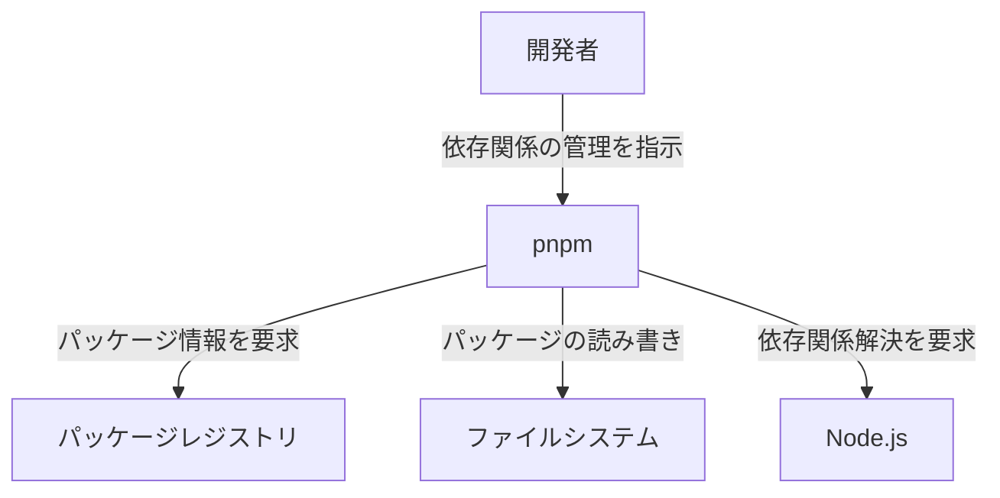
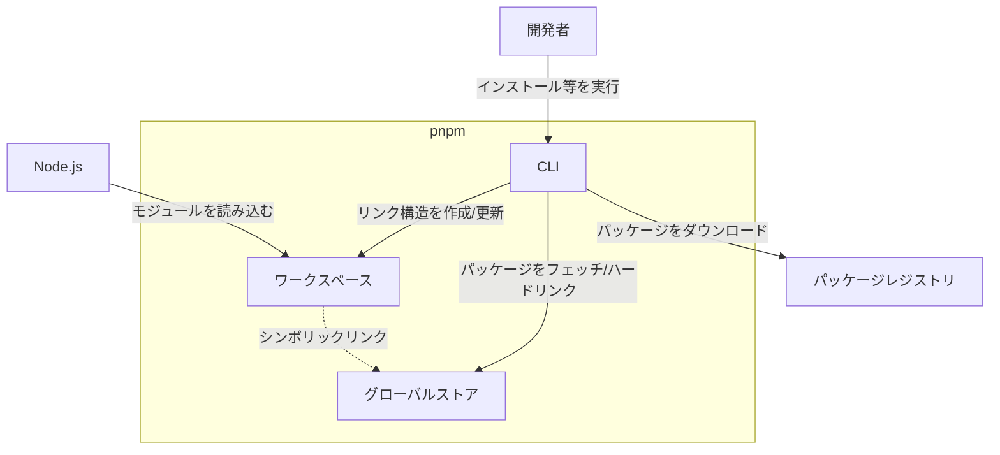
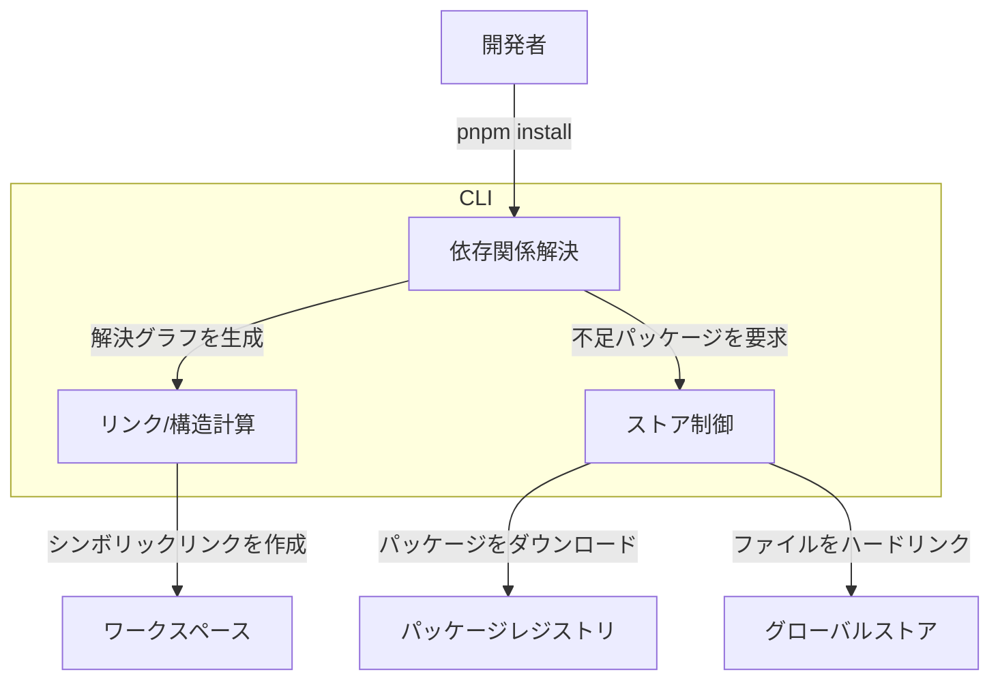
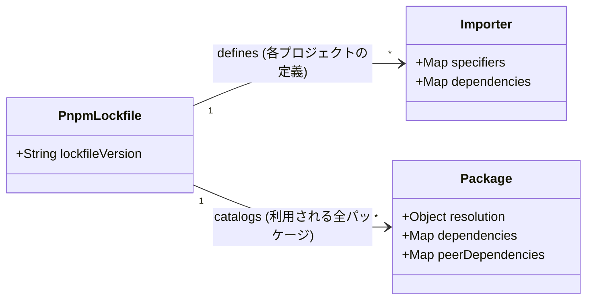

## ■概要

pnpmは、高速化とディスク効率化を両立したNode.js用のパッケージマネージャです。

従来のnpmやYarn Classicは、プロジェクトごとに依存関係をコピーするため、ディスクスペースを重複して消費します。また、フラットな`node_modules`構造を採用しているため、「ファントム依存関係」が発生します。これは、`package.json`に宣言していないパッケージでも、他の依存パッケージが内部で利用していれば、コードから直接アクセスできてしまう問題です。

pnpmは、独自のアーキテクチャでこれらの課題を解決します。

1.  **ディスク効率:** すべてのパッケージをグローバルな「コンテンツアドレス可能ストア（CAS）」に集約し、各プロジェクトからはハードリンクで実体を参照します。同一バージョンのパッケージはディスク上に一つしか存在しません。
2.  **厳格性:** シンボリックリンクを用いて、必要なパッケージのみを露出させる「非フラットな`node_modules`」を構築します。これにより、宣言外の依存関係へのアクセスを物理的に遮断します。

この厳格な構造は、プロジェクトの信頼性、再現性、保守性を大幅に向上させます。

## ■特徴

pnpmの主なメリットは以下の通りです。

| 特徴 | 説明 |
| :--- | :--- |
| **ディスクスペースの節約** | 依存関係の実体をグローバルストアに集約。複数プロジェクト間で同一バージョンを共有し、消費を劇的に抑制します。 |
| **高速なインストール** | ストアからのハードリンク作成が中心のため、ダウンロードやコピーの時間を短縮します。キャッシュが効くCI/CD環境でも有効です。 |
| **厳格な依存関係** | `package.json`に明記されたパッケージのみがアクセス可能となります。環境差異による「私の環境では動く」問題を防止します。 |
| **モノレポサポート** | 高機能なワークスペース機能を標準搭載。複数パッケージの一括管理や、変更があったパッケージのみを対象としたフィルタ実行が可能です。 |

## ■構造

pnpmの内部アーキテクチャを、C4モデルを用いて「全体像」から「詳細」へと段階的に解説します。

### ●システムコンテキスト図（全体像）

pnpmが、開発者や外部システムとどのように関わるかを示した最上位の視点です。



| 要素 | 説明 |
| :--- | :--- |
| **開発者** | pnpmを利用してプロジェクトの依存関係を管理するユーザー |
| **pnpm** | パッケージマネージャ本体 |
| **パッケージレジストリ** | npmjs.comなどの外部パッケージリポジトリ |
| **ファイルシステム** | ローカルのディスク領域（ストアやプロジェクトディレクトリ） |
| **Node.js** | JavaScriptランタイム環境 |

### ●コンテナ図（構成要素）

pnpmシステム内部の主要な構成要素です。「グローバルな状態（ストア）」と「ローカルな状態（ワークスペース）」の分離が設計の核心です。



| 要素 | 説明 |
| :--- | :--- |
| **CLI** | コマンドラインインターフェース。ユーザー操作を受け付け、処理を統括します。 |
| **グローバルストア** | コンテンツアドレス可能ストア(CAS)。不変のパッケージ実体を保持する共通領域です。 |
| **ワークスペース** | 各プロジェクトの領域。ストアへの参照を持つ固有のシンボリックリンク構造を保持します。 |

### ●コンポーネント図（処理フロー）

`pnpm install` 実行時に、CLI内部でどのように処理が進むかを示します。



| 要素 | 説明 |
| :--- | :--- |
| **依存関係解決** | 必要なパッケージとそのバージョンを特定し、依存関係グラフを生成するモジュール |
| **ストア制御** | グローバルストアへのパッケージ追加や取得、整合性を管理するモジュール |
| **リンク/構造計算** | プロジェクト内の`node_modules`に必要なシンボリックリンク構造を計算し、実際に作成するモジュール |

## ■データモデル

`pnpm-lock.yaml`は、`node_modules`の構造を物理的に完全に再現するための設計図です。

### ●情報モデル (pnpm-lock.yaml)

ロックファイルは、「パッケージのカタログ（利用可能な全パッケージ）」と「インポーター（各プロジェクトが何を使うかの定義）」で構成されます。



| 要素 | 説明 |
| :--- | :--- |
| **PnpmLockfile** | ロックファイル全体。バージョン情報などを保持 |
| **Importer** | プロジェクトルートや各ワークスペースごとの依存関係定義 |
| **Package** | ストアに格納されるパッケージの詳細情報（ハッシュ値、依存関係など） |

## ■構築方法

### ● Corepackによる有効化（推奨）

Node.js v16.13以降は、Node.jsに標準同梱されているCorepackでの管理が推奨されます。これにより、プロジェクトごとにpnpmのバージョンを固定できます。

```bash
corepack enable pnpm
# プロジェクトで使用するバージョンを固定（package.jsonの"packageManager"フィールドに追記される）
corepack use pnpm@latest
```

### ● その他のインストール方法

  * **npm経由:** `npm install -g pnpm`
  * **スタンドアロン (Linux/macOS):** `curl -fsSL https://get.pnpm.io/install.sh | sh -`

### ● プロジェクトの移行

既存の`package-lock.json`や`yarn.lock`から、pnpm用のロックファイルを生成します。

```bash
pnpm import
```

## ■利用方法

### ● 基本コマンド

npmと高い互換性があるため、学習コストは低いです。

| コマンド | 説明 |
| :--- | :--- |
| `pnpm install` (または `pnpm i`) | 依存関係のインストール |
| `pnpm add <pkg>` | パッケージの追加（`-D`でdevDependenciesへ追加） |
| `pnpm remove <pkg>` | パッケージの削除 |
| `pnpm <script>` | `npm run <script>` と同等。`run`を省略可能。 |

### ● ワークスペース（モノレポ）操作

| コマンド | 説明 |
| :--- | :--- |
| `pnpm -r <command>` | 定義された全ワークスペースでコマンドを再帰的に実行 |
| `pnpm --filter <pkg> <command>` | 特定のパッケージとその依存関係のみを対象にコマンドを実行 |

## ■運用とトラブルシューティング

### ● グローバルストアの管理

pnpmはパッケージをキャッシュし続けます。ディスク容量を確保するため、参照されなくなった古いパッケージは定期的に削除します。

```bash
pnpm store prune
```

### ● 互換性問題への対処 (Hoisting)

pnpmの厳格な構造では、依存関係の宣言が不完全な古いライブラリ（ファントム依存関係に頼っていたもの）が動作しない場合があります。
その際は、ルートの`.npmrc`ファイルで「Hoisting（巻き上げ）」を設定し、擬似的にフラットな構造へ近づけることで解決します。

```ini
# .npmrc
# 例: React Nativeなどで必要なパッケージをルートのnode_modulesに巻き上げる
public-hoist-pattern[]=*types*
public-hoist-pattern[]=*eslint*
public-hoist-pattern[]=@react-native*

# npm/Yarn互換モード（最終手段）
# すべてのパッケージを巻き上げ、フラットな構造を模倣します
# shamefully-hoist=true
```

## ■まとめ

pnpmは、「ディスク効率」と「インストール速度」において明確な優位性を持ちます。さらに、その副産物である「厳格な依存関係管理」は、中〜大規模プロジェクトやモノレポ構成において、長期的な保守性と堅牢性を高める大きな武器となります。

既存プロジェクトからの移行も容易なため、開発環境のパフォーマンス改善における最有力な選択肢の一つです。

この記事が少しでも参考になった、あるいは改善点などがあれば、リアクションやコメント、SNSでのシェアをいただけると励みになります！

---

## ■参考リンク

  - 公式ドキュメント
      - [Motivation](https://pnpm.io/motivation)
      - [Symlinked node\_modules structure](https://pnpm.io/symlinked-node-modules-structure)
      - [Installation](https://pnpm.io/installation)
      - [pnpm CLI](https://pnpm.io/pnpm-cli)
      - [.npmrc](https://pnpm.io/9.x/npmrc)
      - [pnpm setup](https://pnpm.io/cli/setup)
  - GitHub
      - [Lockfile format discussion](https://github.com/pnpm/pnpm/issues/6113)
      - [Lockfile v6 discussion](https://github.com/pnpm/pnpm/issues/6342)
      - [Frequently asked questions](https://github.com/orgs/pnpm/discussions/3205)
      - [LibreChat discussion on pnpm adoption](https://github.com/danny-avila/LibreChat/discussions/7785)
  - 記事
      - [pnpm vs Bun vs npm vs Yarn: Which one to choose? - Better Stack](https://betterstack.com/community/guides/scaling-nodejs/pnpm-vs-bun-install-vs-yarn/)
      - [pnpm explained: incredible package manager - Better Stack](https://betterstack.com/community/guides/scaling-nodejs/pnpm-explained/)
      - [What is pnpm and is it really so fast and space-efficient? - DEV Community](https://dev.to/stackblitz/what-is-pnpm-and-is-it-really-so-fast-and-space-efficient-29la)
      - [How to share a common node\_modules folder using pnpm - Medium](https://medium.com/@nipunasan/how-to-share-a-common-node-modules-folder-to-your-node-projects-using-pnpm-55a3270a786f)
      - [An abbreviated history of javascript package managers](https://javascript.plainenglish.io/an-abbreviated-history-of-javascript-package-managers-f9797be7cf0e)
      - [Ditching Yarn: Creating a monorepo with pnpm workspaces - Medium](https://medium.com/hike-medical/ditching-yarn-creating-a-monorepo-with-pnpm-workspaces-6fa7e3bfe19c)
      - [Monorepo insights: Nx, Turborepo and pnpm - Medium](https://medium.com/ekino-france/monorepo-insights-nx-turborepo-and-pnpm-4-4-96a3fb363cf4)
      - [pnpm - DeepWiki](https://deepwiki.com/pnpm/pnpm)
      - [Lockfile merge conflicts: how to handle it correctly - DEV Community](https://dev.to/francecil/lockfile-merge-conflicts-how-to-handle-it-correctly-588b)
      - [pnpm-lock.yaml specification - Rush Stack](https://lfx.rushstack.io/pages/concepts/pnpm_lockfile/)
      - [Lockfiles in software engineering (arXiv)](https://arxiv.org/html/2505.04834v2)
      - [pnpm for Linux - LightNode](https://go.lightnode.com/tech/pnpm-for-linux)
