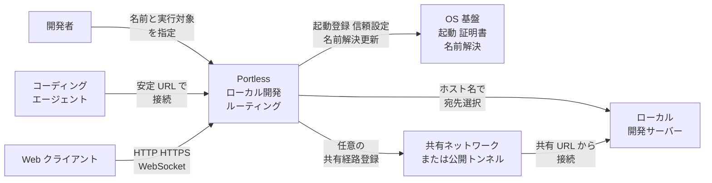
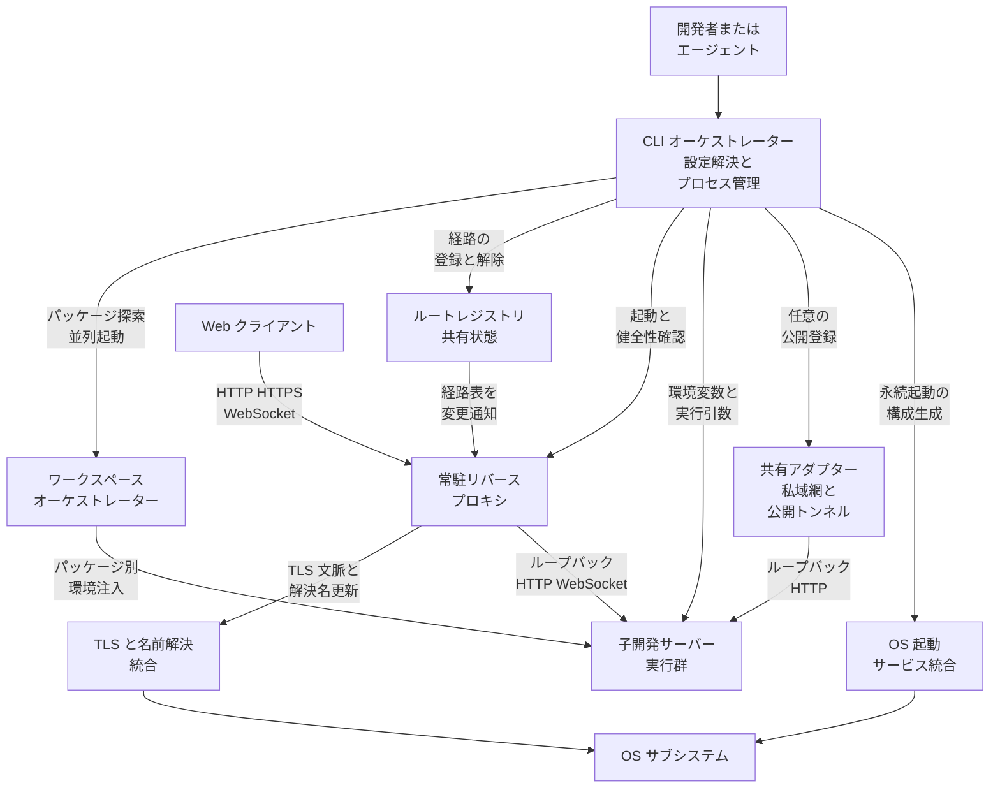
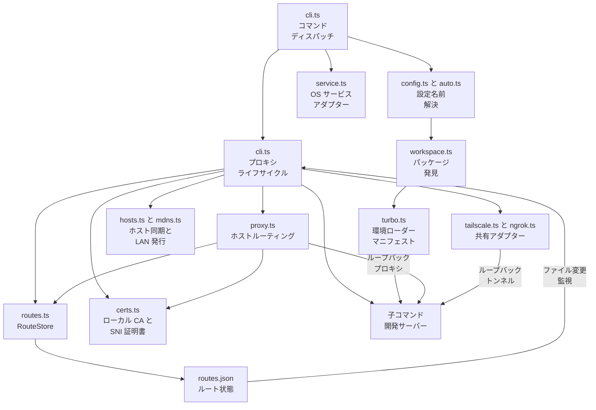
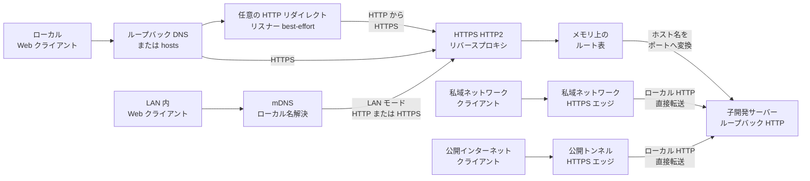
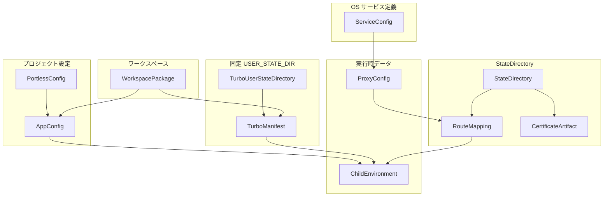
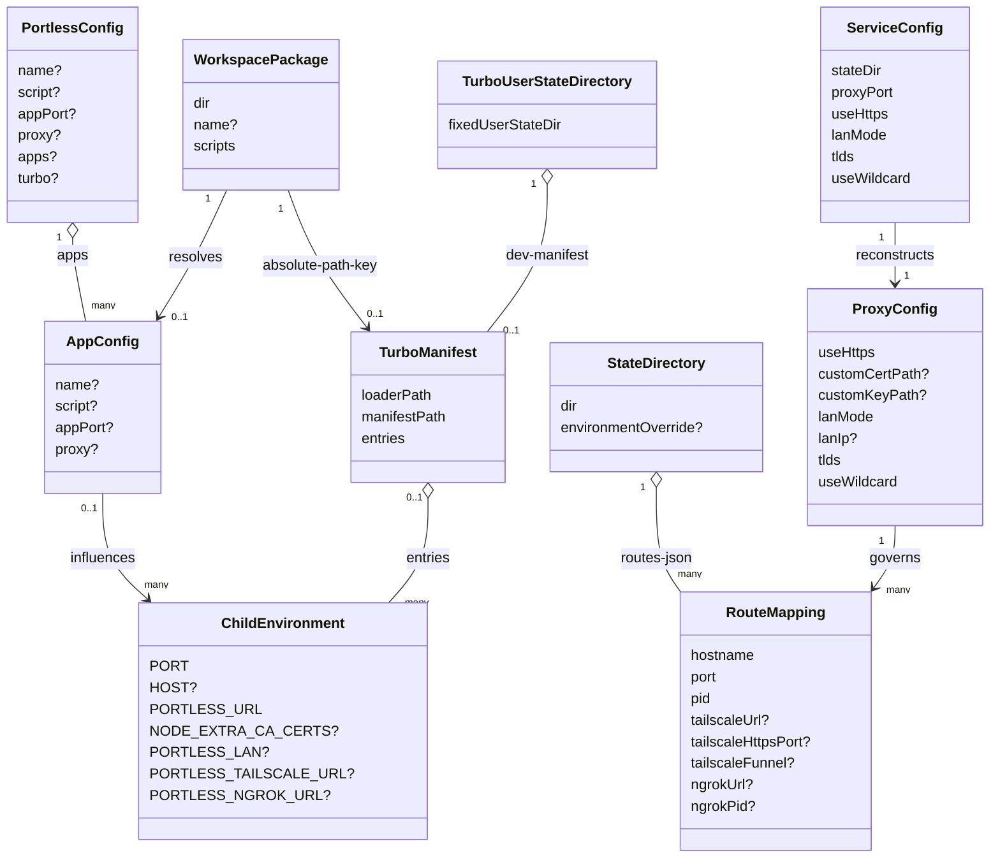

複数の開発サーバーを動かしていると、`localhost:3000` や `localhost:5173` のようなポート番号が増えていきます。空きポートの探索、再起動によるURL変更、CookieやWeb Storageの混在は、人間だけでなくブラウザーを操作するコーディングエージェントにとっても厄介です。

[Portless](https://github.com/vercel-labs/portless)は、可変ポートの開発サーバーを`https://<name>.localhost`という安定したURLへ割り当てるVercel LabsのオープンソースCLIです。この記事では、Portless 0.15.5とGitHubの固定コミット`2e87792c0da55ee514ce1d566045877f6d86cc24`を基準に、構造、データ、導入、運用上の注意点まで解説します。


*この記事の全体像。以下、順に解説します。*

## 概要

Portlessは、既存のdev serverを置き換えるフレームワークではありません。dev serverを子プロセスとして起動し、その手前にローカルリバースプロキシを置くプロセスランナーです。

たとえば次のコマンドを実行すると、子プロセスには4000〜4999の空きポートが割り当てられます。一方、ブラウザーからはポート番号を覚えずに`https://shop.localhost`へアクセスできます。

```bash
portless shop next dev
```

名前付きホストを使うと、Web Storageやhost-only Cookieをhostname単位で分離でき、CORS originやOAuth callback URLもアプリごとに別の値になります。`Domain`属性を付けたCookieはサブドメイン間で共有される点に注意してください。また、OAuth providerによっては`.localhost`や`.test`をcallbackへ登録できないため、その場合は所有ドメインを使ったmulti-segment TLDが必要です。Git worktreeではブランチ名を接頭辞にしたURLを生成できるため、同じアプリの複数checkoutも衝突しません。

### 現行版の前提

| 項目 | Portless 0.15.5 |
|---|---|
| Node.js | 24以上 |
| 対応OS | macOS、Linux、Windows |
| ライセンス | Apache License 2.0 |
| 既定URL | `https://<name>.localhost` |
| 子アプリの自動割当ポート | 4000〜4999 |
| 既定proxy port | HTTPSは443、HTTPは80 |
| runtime dependency | 0件 |

0.15.5は2026年7月30日に公開されたpre-1.0版です。状態形式や証明書の扱いがリリース間で変わり得るため、チーム利用ではexact versionとlockfileを揃えるのが安全です。

### 類似ツールとの違い

| ツール | 得意な範囲 | Portlessとの主な違い |
|---|---|---|
| Caddy 2 | 汎用リバースプロキシ、詳細なrouting、HTTP/3、productionに近い構成 | backendの起動やアプリ名推論は利用者が構成 |
| puma-dev 0.18.3 | Rails・Rackアプリのアクセス時起動とidle shutdown | Ruby・Rackのライフサイクル管理が中心 |
| Laravel Valet 4.12.0 | macOS上のPHP、Nginx、DnsMasq、site link・park | Laravel・PHP開発環境を一体化 |
| Portless 0.15.5 | JavaScript系dev server、monorepo、worktree、AIエージェント | 子プロセス起動からroute削除までを1コマンドへ統合 |

## 特徴

- 空きポートを使いながら、アプリごとに安定した名前付きURLを提供
- `package.json`、Git root、ディレクトリ名からアプリ名と`dev` scriptを推論
- Vite、VitePlus、React Router、Rsbuild、Astro、Angular、Expo、React Nativeのserver commandへport・host flagを自動注入
- ローカルCAによるHTTPSとHTTP/2、HTTP/1.1・HTTP/2のWebSocket HMRに対応
- pnpm workspaceとnpm・Yarn・Bun workspacesを検出
- Turborepoのtask graphを保った複数package起動に対応
- linked worktreeのブランチ名をURL接頭辞へ変換
- `.localhost`、`.test`、複数TLD、multi-segment TLDに対応
- 通常時はloopbackだけへbindし、明示したLAN modeだけ全interfaceへ公開
- Tailscale Serve・Funnel、ngrokの共有URLを子プロセスのlifecycleと一緒に管理
- `doctor`、`list`、`prune`、`clean`による診断と状態整理

自動flag注入には境界があります。compound command、環境変数prefix、別scriptへの委譲、末尾コメント、既存の`--`を含むscriptなど、安全に分類できない場合は変更しません。また、自動注入は単一アプリのnamed・`run`・package-script経路に限られます。bare `portless`によるmulti-app direct spawnとTurbo経路では環境変数だけが渡されるため、`PORT`を無視するframeworkはscript側でportを指定します。

## 構造

Portlessの中核は、コマンド実行を管理するCLI、Hostヘッダーで中継先を選ぶ常駐proxy、ホスト名とポートを共有するroute registryです。外部共有はローカルproxyを経由せず、Tailscaleやngrokが子サーバーのloopback portを直接公開します。

### システムコンテキスト図



利用者はPortlessへアプリ名と実行対象を渡します。ローカルクライアントはPortless proxyへ接続しますが、Tailscaleやngrokの共有URLは共有edgeから子dev serverへ直接転送されます。

### コンテナ図



CLIオーケストレーターは設定解決、proxyの自動起動、route登録、子プロセスの終了処理を担当します。ワークスペースオーケレーターはpackageを発見して直接起動またはTurbo経由で実行し、TLS・名前解決・常駐サービスはOS固有の機能と連携します。

### コンポーネント図



主要コンポーネントの役割は次のとおりです。

| 実装 | 役割 |
|---|---|
| `cli.ts` | コマンド分岐、proxyと子プロセスのlifecycle、共有経路の編成 |
| `config.ts` / `auto.ts` | 設定優先順位、script、アプリ名、worktree接頭辞の解決 |
| `workspace.ts` / `turbo.ts` | workspace探索、package別環境変数の受け渡し |
| `routes.ts` | `routes.json`の排他更新、route登録・解除・stale判定 |
| `proxy.ts` | HostまたはauthorityによるHTTP・WebSocket転送 |
| `certs.ts` | ローカルCA、既定証明書、SNI hostname別証明書の管理 |
| `hosts.ts` / `mdns.ts` | hosts同期とLAN modeのmDNS公開 |
| `service.ts` | launchd、systemd、Task Scheduler向け定義の生成 |
| `tailscale.ts` / `ngrok.ts` | 子portの共有登録と終了時cleanup |

### ネットワーク構成図



通常modeではproxyが`127.0.0.1`と`::1`だけで待ち受けます。LAN modeでは`0.0.0.0`と`::`へ公開し、mDNSの`.local`名を使います。TLS有効時のport 80 redirect listenerはbest-effortであり、bindに失敗しても主proxyは起動します。

## データ

Portlessのデータは、プロジェクト設定、ユーザー単位の状態、OSの常駐サービス定義、子プロセスへ渡す実行時環境に分かれます。中心となる保存先は`~/.portless`ですが、`PORTLESS_STATE_DIR`でroute、proxy marker、certificate、service logの保存先を変更できます。

0.15.5には例外があります。Turbo用の`turbo-env-loader.cjs`と`dev-manifest.json`はcustom state directoryを使わず、invoking userの`~/.portless`へ固定されます。

### 概念モデル



`PortlessConfig`は`portless.json`または`package.json`の`portless`キーから読みます。`RouteMapping`はhostname、子port、所有PIDを結び付け、`CertificateArtifact`はCAとSNI証明書を表します。Turbo経路ではpackageの絶対パスをキーにした一時manifestから子環境を復元します。

### 情報モデル



公開設定で特に重要なのは`AppConfig`です。`name`と`script`は空でない文字列、`appPort`は1〜65535の整数、`proxy`はbooleanです。`RouteMapping`の必須fieldは`hostname`、`port`、`pid`で、静的aliasは`pid: 0`を使います。共有中はTailscaleのURL・HTTPS port・Funnel判定や、ngrokのURL・PIDも同じentryへ追加されます。

### データの保存先と寿命

| データ | 保存先 | 寿命 |
|---|---|---|
| `PortlessConfig` / `AppConfig` | `portless.json`または`package.json` | プロジェクトに永続 |
| `WorkspacePackage` | 起動時にpackage metadataから構築 | CLI実行中 |
| `ProxyConfig` | CLI内と`proxy.*` marker | proxy稼働中、異常終了時はmarkerが残る場合あり |
| `RouteMapping` | `routes.json` | route登録中 |
| CA・server certificate | state directoryと`host-certs` | 複数実行で再利用 |
| `ServiceConfig` | OSのサービス定義 | uninstallまで |
| `TurboManifest` | 固定`~/.portless/dev-manifest.json` | Turbo multi-app実行中 |
| `ChildEnvironment` | 子プロセス環境 | 子プロセス実行中 |

### 状態ディレクトリの実ファイル

| パス | 内容 | 注意点 |
|---|---|---|
| `routes.json` | hostname、port、所有PID、共有metadataの配列 | 複数CLIで共有 |
| `routes.lock` | 書き込み排他用ディレクトリ | 10秒より古いlockはstale扱い |
| `proxy.pid` / `proxy.port` | 実行中proxyのPIDとport | 正常停止で削除 |
| `proxy.tls` / `proxy.custom-cert` | TLSとcustom certificateのmarker | 正常停止で削除 |
| `proxy.tld` / `proxy.tlds` | primary TLDと複数TLD | 非既定TLDで作成 |
| `proxy.lan` | LAN modeの直近IP | LAN無効化で削除 |
| `ca-key.pem` / `ca.pem` | CA秘密鍵と公開証明書 | 秘密鍵を共有・commitしない |
| `server-key.pem` / `server.pem` | 既定server証明書 | SAN不足や期限で再生成 |
| `host-certs/*` | SNI hostname別の証明書 | 有効なcacheを再利用 |
| `ca.trusted` | 信頼済みCAのfingerprint | WSLでは`wsl:` prefix付き |
| `turbo-env-loader.cjs` | Turbo用CommonJS loader | 0.15.5では固定`~/.portless` |
| `dev-manifest.json` | package絶対パスから子環境へのmap | Turbo終了時に削除 |

`routes.json`は`routes.lock`で書き込みを調停します。運用スクリプトから直接編集すると、route更新との競合や不完全JSONを作るため避けてください。

### 設定解決の優先順位

| 対象 | 高い順 |
|---|---|
| 単一アプリ名 | `run --name` → `portless.json`、なければ`package.json.portless` → 推論 |
| 単一アプリscript | `--script` → プロジェクト設定 → `dev` |
| 子アプリport | `--app-port` → `PORTLESS_APP_PORT` → app設定 → 自動割当 |
| monorepo package設定 | package個別`package.json.portless` → rootの`apps` → 推論 |
| 自動起動proxyのTLS・TLD・LAN | 明示環境変数 → 異常終了後の残存marker → 既定値 |
| `proxy start`のport | `--port` → `PORTLESS_PORT` → protocol既定値 |

0.15.5では、異常終了後に残った非既定`proxy.port`が自動起動時の`PORTLESS_PORT`より優先される例外があります。また、wildcard用の通常state markerはありません。再起動後も維持する場合は`service install --wildcard`でOSサービス定義へ保存します。

TLSの解決も項目固有です。`--no-tls`または`PORTLESS_HTTPS=0/false`のどちらかがあるとHTTPになります。`--https`だけでは無効化環境変数を打ち消しません。ただしcustom `--cert`と`--key`の組はHTTPSを有効にします。

### サービス設定の永続化形式

| OS | 定義パス | 形式 |
|---|---|---|
| macOS | `/Library/LaunchDaemons/sh.portless.proxy.plist` | launchdの`ProgramArguments`と`EnvironmentVariables` |
| Linux | `/etc/systemd/system/portless.service` | systemdの`ExecStart`と`Environment=` |
| Windows | `%ProgramData%\portless\service\portless-service.cmd`と`portless-task.xml` | SYSTEMで動くTask Scheduler定義 |

## 構築方法

### 前提条件

- Node.js 24以上
- macOS、Linux、Windowsのいずれか
- 既定HTTPSで証明書を生成する場合はPATH上のOpenSSL CLI
- 共有機能を使う場合だけTailscale CLIまたはngrok CLI

Portless自身を開発する場合はpnpm 11も必要ですが、利用するだけならnpmで導入できます。

### グローバルインストール

公式READMEはグローバルインストールを推奨しています。標準portへのbind時に権限昇格があり得るため、`npx portless`や`pnpm dlx portless`による一時取得コードの実行はCLIが拒否します。

```bash
npm install -g portless@0.15.5
portless --version
# 0.15.5
```

チームでversionを固定する場合はdev dependencyにできます。

```bash
npm install -D --save-exact portless@0.15.5
```

```json
{
  "scripts": {
    "dev": "portless run next dev"
  },
  "devDependencies": {
    "portless": "0.15.5"
  }
}
```

### 初回HTTPSとローカルCA

HTTPSとHTTP/2は既定で有効です。初回にPortlessがローカルCAとserver certificateを生成し、CAをOSのtrust storeへ追加します。Node.jsはOSのtrust storeを直接使わないため、条件を満たす子プロセスには`NODE_EXTRA_CA_CERTS`として`ca.pem`のpathも渡します。

```bash
portless myapp next dev

# 初回の信頼登録を後から行う場合
portless trust
```

443へのbindはmacOSとLinuxで権限昇格を伴います。port bindのsudoを避けたい場合は、1024以上を指定します。

```bash
portless proxy start --port 1355
portless myapp next dev
# https://myapp.localhost:1355
```

非rootではport 80のredirect listenerが起動できない場合があります。`http://myapp.localhost`からの転送を前提にせず、HTTPS URLへ直接アクセスしてください。再起動後も1355を維持する運用では、実行中markerではなくservice definitionへ保存します。

```bash
portless service install --port 1355
```

TLSも権限昇格も不要なら、HTTPと非特権portを組み合わせます。

```bash
portless proxy start --no-tls --port 1355
portless myapp next dev
# http://myapp.localhost:1355
```

## 利用方法

### 3つの起動モード

```bash
# zero-arg: package.jsonのdev scriptと名前を推論
portless

# run: 名前を推論し、子commandを明示
portless run next dev

# named: 完成済みの名前を明示
portless shop next dev
```

`portless run --name shop`はbase nameを上書きしつつworktree prefixを維持します。一方、`portless shop ...`は完成済みの名前として扱い、worktree prefixを付けません。Portless自身のflagは子commandより前へ置きます。

### 固定portとframework注入

```bash
portless run --app-port 4173 vite preview

# 同じ指定を環境変数で行う
PORTLESS_APP_PORT=4173 portless run vite preview
```

固定portの優先順位は`--app-port`、`PORTLESS_APP_PORT`、app設定、自動割当です。通常の子プロセスには`HOST=127.0.0.1`を渡し、LAN modeでもchildはloopbackへbindします。例外はExpoのLAN modeで、Expo自身のdiscoveryを妨げないよう`HOST`を省略します。

### URL取得と静的alias

```bash
BACKEND_URL="$(portless get backend)"
export BACKEND_URL

portless alias admin-ui 8080
portless list
portless alias --remove admin-ui
```

`alias`はPortlessが起動しない既存のplain HTTP・WebSocket backendに名前を付けます。proxy transportはHTTPとWebSocketであり、PostgreSQLやRedisなどのraw TCP protocolは中継できません。

### portless.json

```json
{
  "name": "shop",
  "script": "dev:app",
  "appPort": 3100,
  "proxy": true,
  "turbo": false
}
```

これは単一アプリ用の例です。`portless.json`は配置したディレクトリだけを読み、親へ探索しません。代わりに`package.json`の`portless`キーも使えます。同じディレクトリに両方ある場合、0.15.5は`portless.json`を優先します。

### monorepoとTurborepo

workspace rootでzero-argを実行すると、対象scriptを持つpackageをまとめて起動します。`pnpm-workspace.yaml`を先に確認し、次に`package.json`のworkspacesを確認します。

```json
{
  "apps": {
    "apps/web": { "name": "shop" },
    "apps/api": { "name": "api.shop" },
    "packages/typecheck": { "proxy": false }
  },
  "turbo": true
}
```

`apps`がある場合は、一致したpackageのentryだけがそのpackageの設定になります。トップレベルの`name`、`script`、`appPort`、`proxy`は`apps`配下へ共通defaultとしてmergeされないため、必要な値は各entryへ明記します。

`turbo.json`があり`turbo`が`false`でなければ、packageごとの`PORT`、`HOST`、`PORTLESS_URL`をmanifestへ書き、Node loaderを`NODE_OPTIONS`へ追加します。`turbo: false`ではPortlessが各packageを直接spawnします。

package script自体からPortlessを呼ぶ場合は、実際のdev serverを別scriptへ分けて再帰を避けます。

```json
{
  "scripts": {
    "dev": "portless",
    "dev:app": "next dev"
  },
  "portless": {
    "name": "shop",
    "script": "dev:app"
  }
}
```

### Git worktree

linked worktreeではbranch名の最後のsegmentがprefixになります。

```bash
# main worktree
portless run --name shop next dev
# https://shop.localhost

# branch feature/fix-ui の linked worktree
portless run --name shop next dev
# https://fix-ui.shop.localhost

portless get backend --no-worktree
```

### custom TLDとLAN mode

```bash
portless proxy start --tld test
portless shop next dev
# https://shop.test

portless proxy stop
portless proxy start --tld localhost --tld dev.example.com
```

`--tld`は繰り返し指定でき、longest matchで解決します。`.test`はIANA予約済みです。`.local`はmDNS、`.dev`はHSTSと衝突するため避けます。

LAN modeはTLDを`.local`へ切り替え、custom TLDとは併用しません。

```bash
portless proxy start --lan

# LAN IPを固定
portless proxy stop
portless proxy start --lan --ip 192.168.1.42
```

macOSは`dns-sd`、Linuxは`avahi-publish-address`を使います。0.15.5のLAN modeはWindows非対応です。別端末からgenerated CAのHTTPSを使う場合は、公開証明書`ca.pem`だけを端末へ配布してtrust storeへ登録します。`ca-key.pem`は配布しません。

### Tailscale、Funnel、ngrok

```bash
# tailnet内
portless shop --tailscale next dev

# public Funnel
portless shop --funnel next dev

# public ngrok
portless shop --ngrok next dev
```

Tailscale Serveは既存設定を含む使用中portを調べ、443、8443、8444…の優先列から未使用portを選びます。Funnelの候補は443、8443、10000です。実効URLは`portless list`で確認してください。

共有edgeはchild portへ直接転送します。ローカルPortlessのTLSやhostname routingを共有URLの認証境界と考えてはいけません。Portlessはアプリ認証を追加しないため、ACL、provider側のaccess policy、アプリの認証・認可が必要です。

### 一時的にPortlessを使わない

```bash
PORTLESS=0 pnpm dev
PORTLESS=0 portless run next dev
```

公開ドキュメントが案内する値は`PORTLESS=0`です。0.15.5は互換値として`false`と`skip`も受け付けますが、自動化では`0`に揃えると意図が明確です。

## 運用

### 日常確認とforeground診断

```bash
portless list
portless doctor
portless service status
```

`list`は生存中の動的routeと静的aliasを表示します。`doctor`はNode.js、state directory、proxy応答、route、名前解決、CA trust、LAN前提条件を読み取り専用で診断します。proxy停止はwarningなので、終了codeだけでなく表示内容を確認してください。

詳細ログが必要ならforegroundで起動します。

```bash
portless proxy stop
portless proxy start --foreground --port 1355
```

### OS起動サービス

```bash
portless service install
portless service status
portless service uninstall
```

install時のport、TLS、LAN、IP、TLD、wildcard、custom certificate、state directoryはOSのservice definitionへ保存されます。shellで一時指定した環境変数とは別の永続経路なので、設定変更後は再installして`doctor`で確認します。

### routeと孤児プロセス

動的routeは所有CLIのPIDを記録し、正常終了時に自分のrouteを削除します。静的aliasは`pid: 0`で、死活判定から除外されます。

`portless prune`には重要な注意点があります。所有CLIが死んだrouteを除去した後、そのrouteに記録されたportの**現在のlistener**へSIGTERMを送ります。元のdev serverとの同一性や親子関係は確認しません。portが別processに再利用されていると、無関係なprocessを停止する可能性があります。

`portless list`はstale routeを表示しません。prune前に`PORTLESS_STATE_DIR/routes.json`、未指定なら`~/.portless/routes.json`を読み取り専用で確認し、記録portのlistenerを`lsof -i :<port>`またはWindowsの`netstat -ano`で照合してください。`prune --force`は同じlistenerへSIGKILLを送るため最終手段です。

### CA、hosts、stateの清掃

```bash
portless trust
portless hosts sync
portless hosts clean
portless clean
```

`hosts clean`はPortless管理blockだけを除去します。`clean`はproxy、service、Tailscale登録、CA trust、hosts block、allowlistに含まれるstate artifactを整理します。custom certificateの入力ファイルやstate directory内の未知のファイルは削除しません。

## ベストプラクティス

### versionとstateをチームで揃える

pre-1.0ではversion差がstate formatやCA trustへ影響する可能性があります。global installの更新時期を揃えるか、dev dependencyをexact versionで固定してください。更新後は`portless --version`、`doctor`、主要routeのHTTPSとWebSocket HMRを確認します。

### 通常・LAN・public共有を分離する

| 経路 | 到達範囲 | Portless local TLS | 主な対策 |
|---|---|---|---|
| 通常proxy | 原則として同一host | 適用 | CA秘密鍵を保護、loopbackを維持 |
| LAN mode | 同一network | proxy設定に従う | 信頼できるLANと必要時間に限定、端末へCA公開証明書のみ配布 |
| Tailscale Serve | tailnet policyの範囲 | 経由しない | ACL・grantsとアプリ認証を確認 |
| Tailscale Funnel | Internet | 経由しない | debug endpointやsource mapを除き短時間だけ公開 |
| ngrok | Internet | 経由しない | provider policyとアプリ認証を設定 |

Funnelとngrokの生成URLは「秘密URL」ではありません。開発環境のdebug endpoint、環境情報、認証bypassが露出しないかを公開前に確認してください。

### state directoryを手編集しない

`routes.json`は複数CLIが共有します。route conflictは対象を確認して`--force`、stale routeはlistenerを照合して`prune`、全体初期化は削除範囲を確認して`clean`を使います。`ca-key.pem`やhost certificate keyをリポジトリや共有ストレージへ置かないでください。

### CIではproxyを事前準備する

proxy未起動で443のbindやCA trustにsudo promptが必要な場合、TTYのない環境は早期終了します。TLSが不要なCIでは、非特権portかつHTTPのforeground proxyを先に起動します。HTTPSが必要なら、権限のある事前setupでCA生成と`portless trust`を済ませてからproxyを起動してください。

```bash
portless proxy start --foreground --no-tls --port 1355 &
PORTLESS_PORT=1355 portless run npm run dev

# proxy不要のbuildやtest
PORTLESS=0 npm run build
```

## トラブルシューティング

| 症状 | 主な原因 | 対処 |
|---|---|---|
| TTYなしで初回起動できない | 443 bindまたはCA trustにsudo promptが必要 | TLS不要なら`--no-tls --port 1355`、HTTPS必須なら権限のある事前setupでCA生成と`trust`を完了 |
| 証明書警告 | CA未信頼、CA更新、markerとOS storeのずれ | `doctor`後に`trust`を再実行。WSLはWindows側も確認 |
| custom TLDだけ名前解決できない | hosts同期失敗、resolver差 | `hosts sync`を実行し権限を確認 |
| 404 | route未登録、終了済み、strict modeの未登録subdomain | `list`でexact hostnameを確認し再登録。必要時だけ`--wildcard` |
| 502 | child停止、別portでlisten、loopbackから到達不能 | child logと`doctor`を確認し`PORT`または`--app-port`を反映 |
| 508 | upstream proxyがPortlessへ戻るloop | Vite等のproxy設定を見直し、再帰routeを解消 |
| LAN mode失敗 | OS非対応、IP未検出、LinuxのAvahi不足 | `doctor`、`avahi-utils`、`--lan --ip`を確認 |
| Tailscale共有失敗 | CLI未接続、HTTPS capability、Funnel permission不足 | `tailscale status`と管理画面を確認 |
| ngrok共有失敗 | CLI未導入、authtoken未設定 | `ngrok config add-authtoken <token>`後に再実行 |
| dev serverが残る | CLI異常終了とstale route | `routes.json`と現在listenerを照合してから`prune`。`--force`は最終手段 |
| proxy設定が期待と違う | 実行中・残存marker、service definition | `service status`と`doctor`を確認し、必要ならserviceを再install |
| `routes.json`破損 | 異常終了や外部編集 | 稼働アプリを止め、`clean`後に再登録。手修復しない |

custom state directoryを使う場合は、診断commandにも同じ`PORTLESS_STATE_DIR`を渡してください。指定を忘れると別のstateを読んでいるように見えます。

```bash
PORTLESS_STATE_DIR="$PWD/.portless-debug" \
  portless proxy start --foreground --port 1355
```

## まとめ

Portlessは、可変portのdev serverを安定した名前付きHTTPS URLへ置き換え、アプリ起動、route登録、monorepo、worktree、共有URLまでを一つのCLIへまとめます。複数プロジェクトやAIコーディングエージェントを並行稼働させる環境では、ポート探索をなくし、ブラウザー状態をhostname単位で分離できる点が大きな利点です。

一方で、0.15.5はNode.js 24以上を要求するpre-1.0版です。Turboのcustom state directory例外、共有edgeがlocal proxyを迂回する認証境界、`prune`が現在のport占有者を停止する仕様など、実装上の制約を理解して導入してください。通常はloopbackを維持し、LAN・Funnel・ngrokは必要な時間だけ明示的に有効にする運用が適しています。

この記事が少しでも参考になった、あるいは改善点などがあれば、ぜひリアクションやコメント、SNSでのシェアをいただけると励みになります！

## 参考リンク

- [Portless公式サイト](https://portless.sh/)
- [Portless GitHubリポジトリ](https://github.com/vercel-labs/portless)
- [Portless README（検証コミット）](https://github.com/vercel-labs/portless/blob/2e87792c0da55ee514ce1d566045877f6d86cc24/README.md)
- [Portless CHANGELOG（検証コミット）](https://github.com/vercel-labs/portless/blob/2e87792c0da55ee514ce1d566045877f6d86cc24/CHANGELOG.md)
- [portless 0.15.5 npm package](https://www.npmjs.com/package/portless/v/0.15.5)
- [Commands](https://github.com/vercel-labs/portless/blob/2e87792c0da55ee514ce1d566045877f6d86cc24/apps/docs/src/app/commands/page.mdx)
- [Configuration](https://github.com/vercel-labs/portless/blob/2e87792c0da55ee514ce1d566045877f6d86cc24/apps/docs/src/app/configuration/page.mdx)
- [HTTPS](https://github.com/vercel-labs/portless/blob/2e87792c0da55ee514ce1d566045877f6d86cc24/apps/docs/src/app/https/page.mdx)
- [CLI orchestration](https://github.com/vercel-labs/portless/blob/2e87792c0da55ee514ce1d566045877f6d86cc24/packages/portless/src/cli.ts)
- [Proxy implementation](https://github.com/vercel-labs/portless/blob/2e87792c0da55ee514ce1d566045877f6d86cc24/packages/portless/src/proxy.ts)
- [Route store](https://github.com/vercel-labs/portless/blob/2e87792c0da55ee514ce1d566045877f6d86cc24/packages/portless/src/routes.ts)
- [Configuration schema](https://github.com/vercel-labs/portless/blob/2e87792c0da55ee514ce1d566045877f6d86cc24/packages/portless/src/config.ts)
- [Certificate lifecycle](https://github.com/vercel-labs/portless/blob/2e87792c0da55ee514ce1d566045877f6d86cc24/packages/portless/src/certs.ts)
- [Turbo environment handoff](https://github.com/vercel-labs/portless/blob/2e87792c0da55ee514ce1d566045877f6d86cc24/packages/portless/src/turbo.ts)
- [OS service integration](https://github.com/vercel-labs/portless/blob/2e87792c0da55ee514ce1d566045877f6d86cc24/packages/portless/src/service.ts)
- [Tailscale sharing](https://github.com/vercel-labs/portless/blob/2e87792c0da55ee514ce1d566045877f6d86cc24/packages/portless/src/tailscale.ts)
- [ngrok sharing](https://github.com/vercel-labs/portless/blob/2e87792c0da55ee514ce1d566045877f6d86cc24/packages/portless/src/ngrok.ts)
