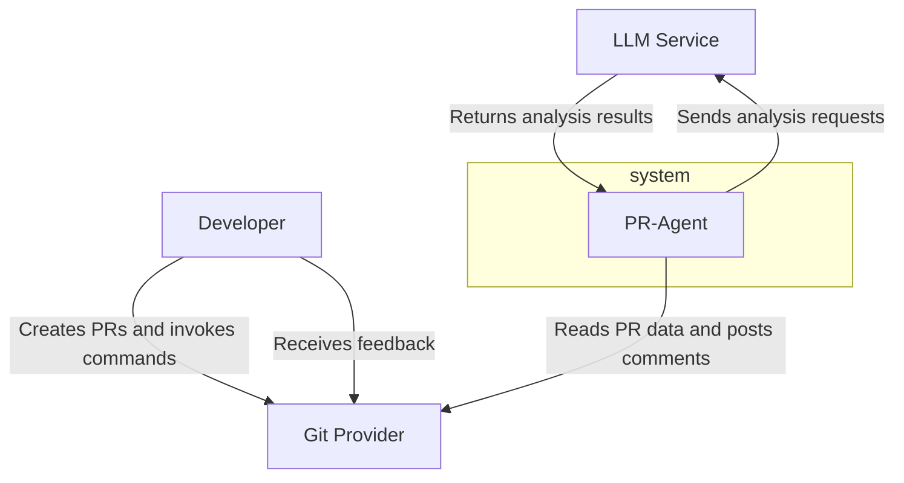
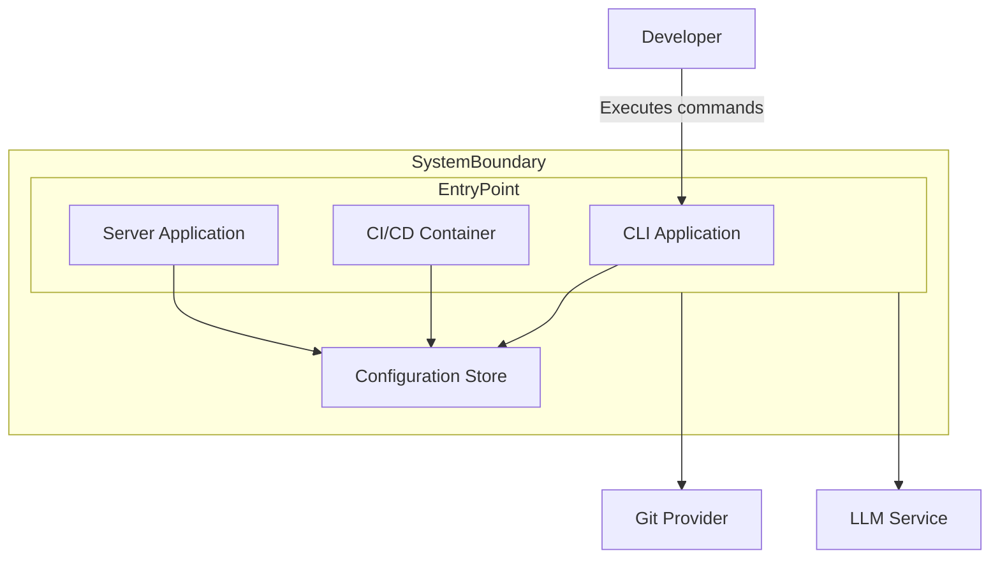
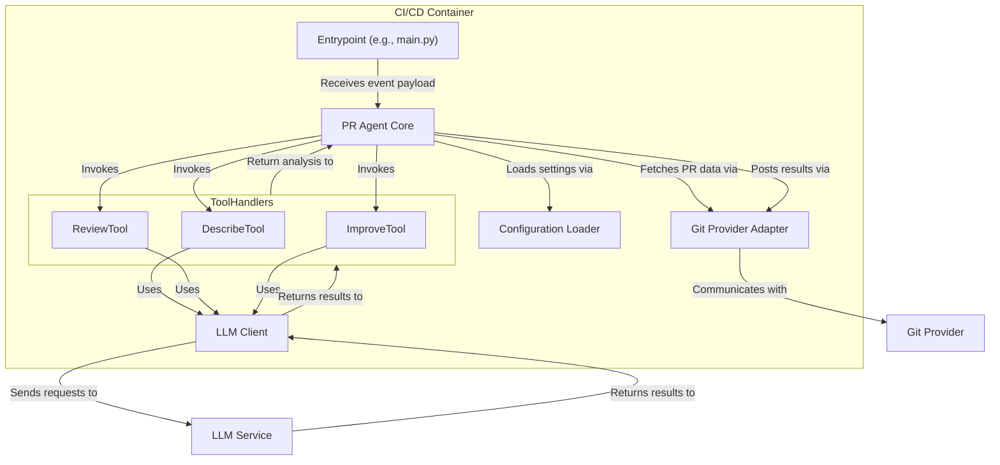
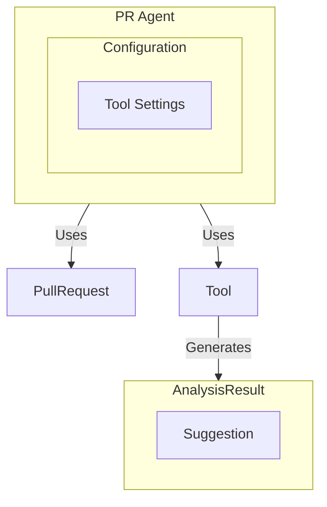
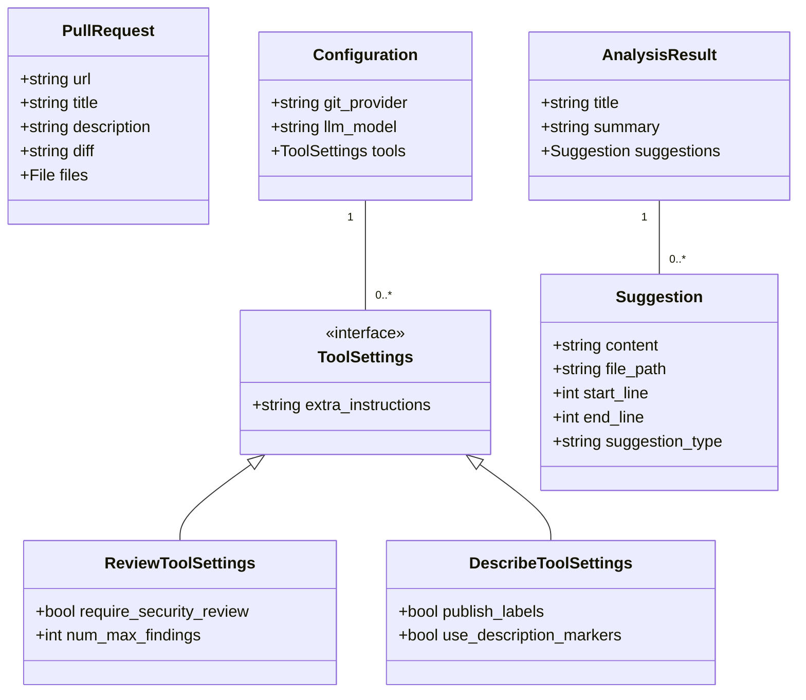

## ■概要

`pr-agent`は、AIを活用してPull Request (PR) のレビュープロセスを自動化・効率化するオープンソースツールです。商用SaaSプロダクト「Qodo Merge」のオープンソース版であり、**オープンコアモデル**を採用しています。

> **オープンコアモデルとは？**
>
> コアとなる基本機能をオープンソース（無償）で提供し、ホスティングや高度なプライバシー保護、コンプライアンスチェックといった追加機能を有償版で提供するビジネスモデルです。これにより、個人や小規模チームは無償で強力な機能を利用でき、企業はセキュリティやサポートが充実した有償版を選択できます。

## ■特徴

`pr-agent`は、開発現場での実用性を重視しており、以下の特徴を備えています。

  * **広範なプラットフォーム互換性**
      * **Gitプロバイダー**: GitHub, GitLab, BitBucketなど主要なサービスに対応
      * **LLMサービス**: OpenAI (GPTシリーズ), Anthropic (Claude), Google (Gemini)など多様な大規模言語モデル（LLM）をサポート
      * **実行環境**: CLI, Docker, GitHub Actions, AWS Lambdaなど様々な環境で実行可能
  * **効率的かつ実用的なAI統合**
      * **迅速な応答**: 各ツールは原則1回のLLM呼び出しで完結するように設計されており、約30秒の高速応答と低コストを実現
      * **PR圧縮戦略**: 大規模なPRでもLLMのコンテキストウィンドウの制約を受けずに処理するため、独自のPR圧縮戦略を採用
      * **モジュール化されたプロンプト**: 内部的にJSON形式のプロンプト戦略を採用し、ツールのモジュール化と高いカスタマイズ性を実現
  * **柔軟なワークフロー**
      * **コマンド駆動の対話**: 開発者はPR上のコメントでスラッシュコマンドを入力するだけで、必要な機能を対話的に呼び出し可能
      * **イベント駆動の自動化**: 新しいPRの作成時に説明文を自動生成するなど、特定のイベントをトリガーとしてツールを自動実行可能
  * **高いカスタマイズ性**
      * リポジトリ内の設定ファイル（`.pr_agent.toml`）や環境変数を通じて、ツールの挙動を詳細にカスタマイズ可能

## ■構造

`pr-agent`のアーキテクチャを、C4モデルを用いてシステムコンテキスト、コンテナ、コンポーネントの順に解説します。

### ●システムコンテキスト図

システムが連携する外部システムと利用者を表現します。

| 要素名 | 説明 |
| :--- | :--- |
| Developer | PRの作成やコマンド実行を通じてシステムを利用する開発者 |
| PR-Agent | PRを解析し、AIによるフィードバックを生成する本システム |
| Git Provider | ソースコードリポジトリをホスティングする外部システム (例: GitHub) |
| LLM Service | コード解析や文章生成機能を提供する外部のAIサービス (例: OpenAI) |

### ●コンテナ図

システムを構成する主要な実行可能ユニット（コンテナ）を表現します。コアロジックを複数のエントリーポイントから呼び出す分離設計により、多様な利用方法を可能にしています。

| 要素名 | 説明 |
| :--- | :--- |
| CLI Application | 開発者がローカル環境でエージェントを実行するためのCLI |
| CI/CD Container | GitHub Actionsなど、CI/CDパイプライン内で実行されるコンテナ |
| Server Application | GitHub App連携などで利用される、Webhookイベントを待ち受ける常駐サービス |
| Configuration Store | ツールの挙動を定義する`.toml`形式の設定ファイル |
| Developer | CLIアプリケーションを直接実行するアクター |
| Git Provider | 各コンテナがPR情報を取得し、結果を書き込む外部システム |
| LLM Service | 各コンテナがコード解析を依頼する外部のAIサービス |

### ●コンポーネント図

CI/CDコンテナの内部構造と、各コンポーネントの役割やデータの流れを表現します。

| 要素名 | 説明 |
| :--- | :--- |
| Entrypoint | イベント情報を受け取り、処理を開始する起点 |
| Configuration Loader | `.pr_agent.toml`設定ファイルを読み込み、解析する責務 |
| Git Provider Adapter | GitプロバイダーAPIと通信し、PR情報の取得やコメント投稿を実行 |
| PR Agent Core | コマンドに応じて適切なツールハンドラを呼び出すオーケストレーター |
| Tool Handlers | `/describe`や`/review`など、各コマンドの具体的な処理を実行するコンポーネント群 |
| LLM Client | LLMサービスへのリクエストを整形し、API呼び出しを実行 |

## ■情報

`pr-agent`は、処理の都度データを読み込んで結果を出力するステートレスな設計です。ここでは、内部で扱うデータの構造を概念モデルと情報モデルの2段階で説明します。

### ●概念モデル

システムが扱う主要な情報とその関係性を、技術的な詳細を省いて表現します。

| 要素名 | 説明 |
| :--- | :--- |
| PR Agent | システム全体 |
| Configuration | ツールの挙動を制御する設定情報 |
| Tool Settings | 個別のツールの設定情報 |
| Pull Request | 解析対象となるPRの情報（差分、タイトルなど） |
| Tool | 特定の機能を提供する単位 (例: `/review`) |
| AnalysisResult | ツールの実行によって生成される解析結果 |
| Suggestion | 解析結果に含まれる具体的な提案内容 |

### ●情報モデル

概念モデルの各要素に具体的な属性を付与し、クラス図として表現します。

| 要素名 | 説明 |
| :--- | :--- |
| PullRequest | 解析対象のPRを表すクラス |
| Configuration | システム全体の設定を表すクラス |
| ToolSettings | 各ツールの設定の基底となるインターフェース |
| ReviewToolSettings | `/review`ツールの設定クラス |
| DescribeToolSettings | `/describe`ツールの設定クラス |
| AnalysisResult | AIによる解析結果を格納するクラス |
| Suggestion | コードの改善提案など、個別の指摘事項を格納するクラス |

## ■構築方法

`pr-agent`は、用途に応じて複数の方法で構築できます。

### ●前提条件

  * **LLM APIキーの取得**: OpenAIなど、利用したいLLMサービスのAPIキー
  * **Gitプロバイダートークンの生成**: GitHubなどで、リポジトリへのアクセス権限を持つパーソナルアクセストークン

### ●GitHub Actionsとしての利用 (推奨)

リポジトリのCI/CDワークフローに組み込む最も一般的な方法です。

1.  `.github/workflows/pr_agent.yml`パスにワークフローファイルを作成します。
2.  トリガーとして`pull_request`や`issue_comment`イベントを指定します。
3.  ジョブに必要な権限（`issues: write`, `pull-requests: write`, `contents: write`）を設定します。
4.  `uses: qodo-ai/pr-agent@main`のように、公開Actionを指定します。
5.  リポジトリのSecretsに`OPENAI_KEY`としてLLMのAPIキーを登録します。

### ●Docker (CLI)によるローカル実行

ローカル環境で特定のPRを対象にツールを実行する方法です。

1.  `docker pull qodo-ai/pr-agent:latest`コマンドで公式Dockerイメージを取得します。
2.  `docker run`コマンドを実行します。その際、`-e`オプションでAPIキーやGitトークンを環境変数として渡し、引数として対象PRのURLを指定します。

### ●GitHub Appとしての利用

組織全体での利用などに適した、より高度な連携方法です。

1.  GitHubのDeveloper Portalから新しいGitHub Appを作成します。
2.  Appに必要な権限（例: `Pull requests: Read & write`）を付与します。
3.  購読するイベント（例: `Issue comment`, `Pull request`）を選択します。
4.  GitHubからのWebhookを受信するためのサーバーアプリケーションを別途デプロイします。

### ●AWS Lambdaへのデプロイ

サーバーレス環境で実行する方法です。

1.  `Dockerfile.lambda`をターゲットとして、Lambda用のDockerイメージをビルドします。
2.  ビルドしたイメージをAmazon ECR（Elastic Container Registry）にプッシュします。
3.  ECR上のイメージを利用して新しいLambda関数を作成し、関数URLを設定します。

## ■利用方法

PR上のコメントを通じて対話的に利用します。

### ●コマンドによる手動実行

PRのコメント欄で、エージェントをメンションし、続けて実行したいコマンドを入力します（例: `@your-agent-name /review`）。

> **Note:** 公開リポジトリで利用できる`@Qodo-Agent`は宣伝・デモ目的のボットであり、機能が制限されています。プライベートリポジトリでは利用できませんので、自身でホストする必要があります。

### ●イベントによる自動実行

リポジトリのルートに`.pr_agent.toml`設定ファイルを配置すると、特定のイベント発生時にツールを自動実行できます。
例えば、`[github_app]`セクションに`pr_commands = ["/describe"]`と記述すると、新規PR作成のたびに`/describe`コマンドが自動実行されます。

### ●主要な利用可能ツール

以下に主要なツールの一覧を示します。

| コマンド | 説明 | 提供形態 |
| :--- | :--- | :--- |
| `/describe` | PRのタイトル、要約、種類、関連ラベルを自動生成 | 無償版 (Open-Source) |
| `/review` | コードをレビューし、潜在的な問題点やセキュリティ懸念を指摘 | 無償版 (Open-Source) |
| `/improve` | コード品質を向上させるための具体的な修正案を提示 | 無償版 (Open-Source) |
| `/ask "..."` | PRの内容に関する自由形式の質問に回答 | 無償版 (Open-Source) |
| `/update_changelog` | 変更内容に基づき`CHANGELOG.md`ファイルを自動更新 | 無償版 (Open-Source) |
| `/add_docs` | 変更されたコードに対するドキュメントを自動生成 | 💎 有償版 (Qodo Merge) |
| `/test` | 変更されたコードに対するユニットテストを自動生成 | 💎 有償版 (Qodo Merge) |
| `/analyze` | 変更されたコードを特定し、テストやドキュメント生成を対話形式で指示 | 💎 有償版 (Qodo Merge) |
| `/compliance` | セキュリティや組織独自のルールなど、包括的なコンプライアンスチェックを実行 | 💎 有償版 (Qodo Merge) |

## ■運用

### ●バージョン管理

GitHub Actionsとして利用する場合、安定性と最新性のバランスを考慮してバージョンを選択できます。

  * **`@main`**: 最新の開発版。不安定になる可能性あり。
  * **`@<release_tag>`** (例: `@v1.2.3`): 特定のリリースバージョン。安定した運用が可能。
  * **`@sha256:<digest>`**: Dockerイメージのダイジェスト値。セキュリティと再現性が最も高い。

### ●セキュリティとプライバシー

セキュリティモデルはオープンソース版と商用版で明確に分かれています。

  * **セルフホスト（無償版）**: ユーザーが自身のAPIキーを管理し、データはユーザー環境、Gitプロバイダー、LLMプロバイダー間で直接やり取りされます。Qodo社のサーバーは介在せず、コンプライアンスの責任はユーザー側にあります。
  * **Qodo Merge（有償版）**: 企業が懸念するデータプライバシー問題に対応します。Qodo社がサービスを管理し、ユーザーのコードを保存せず、モデルのトレーニングにも利用しない「ゼロデータリテンション」ポリシーを保証しています。

### ●カスタマイズと拡張

システムの挙動は、主に`.pr_agent.toml`設定ファイルを通じてカスタマイズします。環境変数を設定すると、ファイル内の設定を上書きすることも可能です。

## ■まとめ

`pr-agent`は、AIを活用してPRレビューを自動化・効率化するオープンソースツールで、開発チームの生産性向上とコードレビューの品質向上に貢献します。記事で解説したアーキテクチャや構築方法を参考に、あなたの開発ワークフローにもAIアシスタントを導入してみてはいかがでしょうか。

この記事が少しでも参考になった、あるいは改善点などがあれば、ぜひリアクションやコメント、SNSでのシェアをいただけると励みになります！

## ■参考リンク

### ●公式

  * [GitHub - qodo-ai/pr-agent](https://github.com/qodo-ai/pr-agent)
  * [Official Documentation - Qodo Merge (and open-source PR-Agent)](https://qodo-merge-docs.qodo.ai/)
  * [Qodo Merge | AI Code Review Agent for Confident Commits](https://www.qodo.ai/)
  * [YouTube - Automate & Improve Pull Requests with PR-Agent](https://www.youtube.com/watch?v=xA8UDIm0g6g)

### ●記事

  * [qodo-ai/pr-agent - deepwiki](https://deepwiki.com/qodo-ai/pr-agent)
  * [I used CodiumAI's PR Agent, and I love it - DEV Community](https://dev.to/akshayballal/i-used-codiumais-pr-agent-and-i-love-it-1nb8)
  * [Automating Pull Request Reviews With CodiumAI PR-Agent - DevCube](https://rnemet.dev/posts/ai/codium-pragent/)
