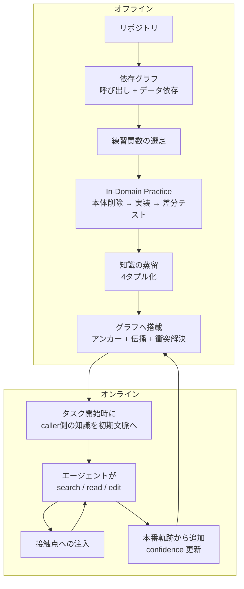
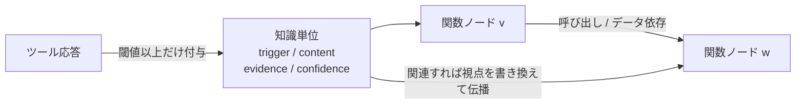

社内フレームワークや自社ドメインのコードをAIエージェントに書かせると、構文は通るのにテストが全部落ちる、という失敗をよく見ます。関連ソースを全部コンテキストに渡しても直りません。抜けているのは「読めば分かる情報」ではなく、**その現場の開発者だけが手を動かして覚えた規約**だからです。

この記事では、その規約をコードの依存グラフ上に蓄積して再利用する枠組み [PRAXIS](https://arxiv.org/abs/2608.19784)(arXiv:2608.19784、2026-08-20)を読み解きます。読み終えると、次の判断ができるようになります。

- エージェントの「記憶」を自由文メモではなくコード実体に紐づける意味
- 知識を検索させるのではなく能動的に注入する設計の狙い
- 報告された精度向上のうち、どこまでが自分の現場に持ち込めるか

想定読者は、コーディングエージェントを自社コードベースに適用しようとしている開発者と、エージェント記憶の設計方針を決める立場の方です。

*この記事の全体像。以下、順に解説します。*

## ドメインコード生成でエージェントが落ちる場所

まず、どれくらい落ちるのかを押さえます。PRAXIS と同じ研究グループによるベンチマーク [KoCo-Bench](https://aclanthology.org/2026.acl-long.1311/)(ACL 2026 Long, pp.28422–28441)は、知識コーパス付きで「新しいドメインの知識を獲得して適用できるか」を測ります。

| 条件 | Pass@1 |
|---|---|
| 非エージェントの LLM 単体(Kimi-K2 / Gemini-2.5-pro) | 8〜9% |
| OpenHands + Qwen2.5-Coder-32B | 3.6% |
| Claude Code(Claude-Sonnet-4-5) | 34.2% |

同ベンチの追加検証では、SFT / RAG / kNN-LM のいずれもコード生成で一貫した改善を出せず、コーパス規模を増やすと SFT・LoRA はむしろ悪化しました。クロスドメインの逐次 SFT では Pass@1 が 7.1 から 3.6 へ下がっています。**知識を足す方向の素朴な手当てが効かない**のが出発点です。

PRAXIS の予備実験(OpenHands + DeepSeek-V3.2)はここをもう一段掘ります。

- 標準構成の Pass@1: 19.1%
- 正解実装が依存するソースを全部渡す: 相対 +19.9%
- さらに探索結果の要約も渡す: 相対 +4.8%

情報を積み増しても頭打ちになります。論文が挙げる失敗例 `_create_rag_instance` は、実行時エラーが一切出ないまま全テストが落ちました。欠けていたのは次の2つの契約です。

1. embedding にかける前に、retrieval prompt で chunk を揃えること
2. 共有される `llm_router` へ LLM の callback を登録すること

どちらも工場関数のシグネチャにも docstring にも現れません。呼び出し側と実装側の慣習として暗黙に共有されているだけです。

:::message
ただしこの予備実験は「暗黙知だけを独立に操作した因果実験」ではありません。全ソースを渡しても残る失敗がある、という観察から著者らが立てた仮説と読むのが妥当です。
:::

## PRAXIS が置く仮説: 暗黙知は依存グラフ上にある

著者らは、この種の知識に3つの性質を与えています。

| 性質 | 内容 | 設計上の帰結 |
|---|---|---|
| 実践依存 | ドキュメントではなく開発行為でしか表に出ない | 読ませるのでなく書かせて学ぶ |
| 依存伝播 | 単一関数に閉じず依存パスに沿って広がる | 記憶の番地をコードグラフにする |
| 無自覚 | エージェントは自分に何が欠けているか気づけない | 検索させず注入する |

3番目が重要です。RAG やスキル検索は「足りないものを自覚して問い合わせる」前提に立ちます。その前提が崩れている以上、エージェントが触った実体に対して知識のほうから寄っていく必要がある、という主張です。

## 4段の仕組み

PRAXIS はオフライン3段とオンライン1段で構成されます。

### 段1: 書かせて学ぶ

既存リポジトリから練習対象の関数を選び、本体を削除します。選定基準は3系統の和集合です。

- 業務ロジックを持つ関数(LLM がユーティリティを除外)
- 被呼び出しが多い関数(in-degree)
- 呼び出しが多い関数(out-degree)

そのうえで LLM が生成した要件とテスト入力を与えて実装させ、正解実装との差分テストで修正させます。テスト入力は正解実装に対する行カバレッジ 80% 超を条件にしています。この「失敗して直す」過程そのものが、性質1に対する回答です。

### 段2: 差分を4タプルへ蒸留

得られた知識は自由文の反省メモではなく、次の構造に落とします。

| フィールド | 役割 |
|---|---|
| `trigger` | どんな状況で適用するか |
| `content` | 守るべき契約の内容 |
| `evidence` | 根拠となった差分 |
| `confidence` | 確からしさ |

`evidence` が残る点が、要約ベースのスキル化との実務上の差です。後から人間が真偽を確認できます。

### 段3: グラフへ載せる

知識単位は関数ノードへアンカーし、依存辺の双方向へ伝播させます。オフラインの伝播は最大4ホップです。

重複はマージし、その信頼度は `1 − Π(1 − confidence)` で合成します。矛盾する知識の裁定は LLM が行います。

### 段4: 接触点へ注入する

オンラインでは、タスク開始時に呼び出し元側の知識を初期コンテキストへ置き、以後は `search` / `read` / `edit` の戻り値に、触れた実体へ紐づく知識を付けて返します。エージェントに専用の検索ツールを増やすわけではありません。公開実装でも、評価時の Stage 4 は `knowledge_search` を付けずにグラフ注入だけを行います。

注入の閾値には注意が必要です。**論文の θ は 0.7、公開実装の CLI 既定は 0.6** と食い違っています。再現時はここを固定してから比較してください。

## 実験結果をどう読むか

KoCo-Bench(DeepSeek-V3.2)での主結果です。

| 手法 | Pass@1 | AvgPassRatio |
|---|---|---|
| Base Model | 10.69 | 29.65 |
| SWE-Exp | 7.83 | 20.84 |
| OpenHands | 19.08 | 44.96 |
| OpenCode | 24.43 | 52.39 |
| Trace2Skill | 25.19 | 51.42 |
| SWE-Agent | 25.96 | 47.88 |
| OpenCollab | 27.48 | 50.29 |
| **PRAXIS** | **32.06** | **56.01** |

ablation では、段1の練習を外したときの落差が最大でした。

| 除去した要素 | Pass@1 |
|---|---|
| なし | 32.06 |
| Development Practice | 27.48 |
| Graph Organization | 28.25 |
| Proactive Injection | 28.24 |
| Procedural Memory | 29.01 |

「書かせて学ぶ」が最も効いていて、グラフ構造と能動注入もそれぞれ約4ポイント分を担っている、という内訳です。枠組みとモデルを替えても方向は同じでした。

| 枠 | モデル | ベース | PRAXIS |
|---|---|---|---|
| OpenHands | GPT-5.5 | 16.03 | 42.75 |
| OpenHands | Qwen3.6-Plus | 25.95 | 27.48 |
| OpenHands | DeepSeek-V3.2 | 19.08 | 32.06 |
| SWE-Agent | DeepSeek-V3.2 | 25.96 | 35.12 |

バグ修正ベンチ AInsteinBench でも、パイプライン無改変のまま Resolved 27.2% → 31.2%(Hard は 19.1 → 26.6)へ改善しています。

知識の中身も人手で検査されています(n=75)。内訳は business rules 34.7%、API patterns 24.0%、interface contracts 22.7%、error handling 14.7%。真実性の平均は 5点満点で 4.28、confidence と人手評価の順位相関は ρ=0.75 でした。50軌跡のうち 82% が知識を実際に参照し、そのうち 87.8% が有意味に寄与しています。

### ただし数字の読み方に3つ注意があります

**絶対値はまだ低い。** Pass@1 32.06% は、約68%のタスクが全テスト合格に至っていないという意味です。AvgPassRatio 56.01 は部分点であり「半分は動く」ではありません。AInsteinBench の cheminformatics は 0.0% → 5.4% で、ゼロから動いたという段階です。

**「相対16.7%改善」の分母は OpenCollab です。** KoCo-Bench で 34.2% を出している Claude Code は、この比較表に入っていません。ベースモデルが違うため、PRAXIS が Claude Code を上回ったとは論文も主張していません。

**改善は一様ではありません。** Qwen3.6-Plus では +1.53ポイントにとどまり、GPT-5.5 では大きく伸びます。オンライン進化も RAG ドメインでは横ばいと報告されています。

## 既存アプローチとの違い

エージェントの記憶戦略は複数あります。PRAXIS の位置づけを整理します。

| 基準 | 構造だけのコード知識グラフ | 経験バンク(SWE-Exp型) | スキル(Trace2Skill型) | PRAXIS |
|---|---|---|---|---|
| 蓄えるもの | AST / 呼び出し / データフロー | 軌跡の教訓テキスト | 手続き書(SoP) | 差分から蒸留した契約 |
| 索引 | グラフ走査 | タスク類似の埋め込み | スキルディレクトリ | コード実体ノード |
| 渡し方 | エージェントが自分で辿る | 類似検索で一塊を渡す | グローバルスキル | 接触点へ分散注入 |
| 欠落の自覚 | 必要 | 不要 | 実装依存 | 不要 |
| 前提 | 静的解析が動けばよい | 成功/失敗の軌跡 | 軌跡プール | 正解実装をオラクルにできること |

repository-level の知識グラフ生成([arXiv:2505.14394](https://arxiv.org/abs/2505.14394))や `code-graph-rag` のような構造 RAG は、検索の品質を上げます。PRAXIS が足すのは「グラフ上の事実」ではなく**グラフ上の未文書化の契約**です。構造グラフは前提であって、運用層の代わりにはなりません。

経験バンクの評価にも注意が要ります。[SWE-Exp](https://arxiv.org/abs/2507.23361) 本家は SWE-Bench Verified で Claude 4 Sonnet の Pass@1 73.0% を報告しています。KoCo の関数生成タスクへ無改変で当てると 7.83 でベースを下回りますが、これは経験手法一般が弱いのではなく、**この比較条件では弱い**というだけです。

## 効かない条件と落とし穴

実務へ持ち込む前に、成立条件を確認します。

**オラクル前提。** 段1の練習は、正解実装との差分テストが成立することに依存します。失敗時には正解実装そのものを比較用に渡します。本番で新規に書く関数には、当然その参照実装がありません。テストオラクル問題(Barr et al., 2015)を回避しているのではなく、オフライン学習の場に限って回避条件を作っている構造です。

**誤った慣習が固定されうる。** オンライン進化は confidence を β=0.8 で増減しますが、タスクの合否をヒットした知識単位に帰属させるだけで、信用割当がありません。参照されなかった誤った単位は減衰しません。SWE-Exp でも経験は1件でピークになり、2〜4件で性能が下がる報告があります。**記憶は積むほど良いとは限らない**という前提で運用すべきです。

**知識の失効を表現できない。** API の破壊的変更やルーティング規約の廃止をグラフ上でどう表すかは未解決です。confidence の減衰は「ヒットかつ失敗」にしか反応しません。

**論文と実装がずれています。** θ は 0.7 対 0.6、オフライン伝播は最大4ホップに対しオンラインの伝播は呼び出し元1ホップのみ、リトライ回数の既定値も異なります。論文のハイパーパラメータをコードの既定値と同一視しないでください。

**評価の境界。** 評価用テストコードは除外されていますが、同一リポジトリの関連関数と4ホップ伝播は残ります。継続学習の検証では評価タスク自体を逐次学習しています。

**成果物の状態。** [公開実装](https://github.com/jiangxxxue/PRAXIS)は 2026-08-22 時点でライセンス記載がなく、issue も 0 件です。確認できた範囲では独立した再現報告や第三者の批判も見つかりませんでした。社内利用の前にライセンスの確認が必要です。

なお、用語としての厳密さにも留保があります。抽出されるのは正解差分から書き下せる implicit / relational な知識であり、Polanyi の言う「語り得ない」tacit knowledge そのものではありません。

## 自分の現場で試すなら

手法全体をドロップインするより、次の3点を設計原則として借りるほうが現実的です。

1. **記憶の番地をコード実体にする。** 自由文メモやタスク類似の経験バンクにしない
2. **渡すタイミングを検索クエリではなくツール応答に乗せる。** エージェントが欠落に気づかない前提を設計へ入れる
3. **抽出時に差分と根拠を残す。** 要約だけのスキル化は後から監査できない

逆に、次は後回しでよいでしょう。

- 正解実装なしでの自動オンライン進化(信用割当と失効の仕組みがない)
- 「グラフを作った=暗黙知が貯まった」という読み替え
- 論文のハイパーパラメータをそのまま既定値として使うこと

最小の実験手順としては、次の4ステップを勧めます。

1. テストが厚い中核モジュールに限定し、正解差分から知識単位を10件未満だけ作る
2. 各単位に適用地点(関数)と失効条件(「このルータを廃止したら捨てる」)を人手で書く
3. エージェントの read / edit フックにだけ注入し、検索ツールは増やさない
4. 失敗タスクで自動減衰させず、人間が KEEP / REVISE / KILL を判断する

これなら、オラクルが成立する範囲を自分で線引きしたうえで、接触点注入の効き目だけを確かめられます。

:::message alert
同名の研究が複数あります。生物研究の PRAXIS(arXiv:2605.23169)、クラウド障害の根本原因分析の Praxis(arXiv:2512.22113)とは別物です。検索時に混同しないよう注意してください。
:::

## まとめ

- ドメイン特化のコード生成が落ちる主因は情報量ではなく、依存関係に分散した未文書化の契約にある
- PRAXIS は「書かせて学ぶ → 4タプルへ蒸留 → 依存グラフへ搭載 → 接触点へ注入」の4段でこれを扱い、KoCo-Bench で Pass@1 19.08 → 32.06 を報告している
- ablation の最大要因は練習ステージで、グラフ構造と能動注入もそれぞれ約4ポイント寄与する
- ただし絶対値は 32% 台であり、成立には正解実装をオラクルにできる条件が要る。誤った知識の失効と信用割当は未解決
- 借りるべきは手法全体ではなく、記憶をコード実体へ紐づけ、ツール応答に乗せて渡し、根拠を残すという3原則

この記事が少しでも参考になった、あるいは改善点などがあれば、ぜひリアクションやコメント、SNSでのシェアをいただけると励みになります！

## 参考リンク

- [PRAXIS: Graph-Grounded Tacit Knowledge for Domain Code Generation(arXiv:2608.19784)](https://arxiv.org/abs/2608.19784) — 本記事の対象論文(2026-08-20 提出、会議採録は未確認)
- [jiangxxxue/PRAXIS(GitHub)](https://github.com/jiangxxxue/PRAXIS) — 公開実装(2026-08-22 時点)
- [KoCo-Bench: Can Large Language Models Leverage Domain Knowledge in Software Development?(ACL 2026)](https://aclanthology.org/2026.acl-long.1311/) — 評価ベンチマーク。DOI [10.18653/v1/2026.acl-long.1311](https://doi.org/10.18653/v1/2026.acl-long.1311)
- [SWE-Exp: Experience-Driven Software Issue Resolution(arXiv:2507.23361)](https://arxiv.org/abs/2507.23361) — 比較対象の経験バンク手法
- [Trace2Skill(arXiv:2603.25158)](https://arxiv.org/abs/2603.25158) — 比較対象のスキル抽出手法
- [AInsteinBench(arXiv:2512.21373)](https://arxiv.org/abs/2512.21373) — 追加評価に使われたバグ修正ベンチマーク
- [Repository-level knowledge graph generation(arXiv:2505.14394)](https://arxiv.org/abs/2505.14394) — 構造ベースのコード知識グラフ
- E. T. Barr et al., *The Oracle Problem in Software Testing: A Survey*, IEEE TSE 41(5), 2015
