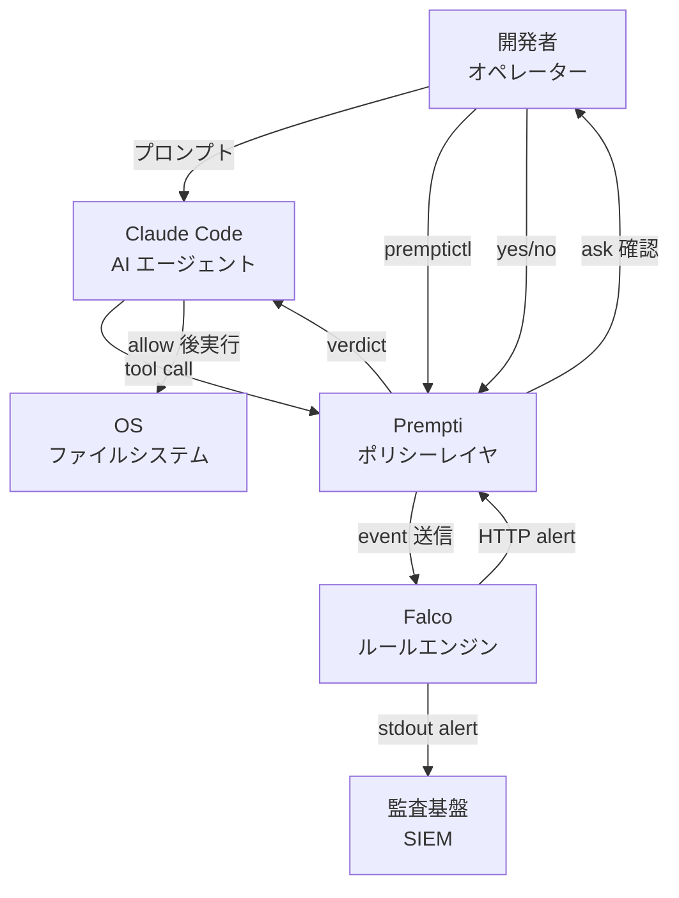
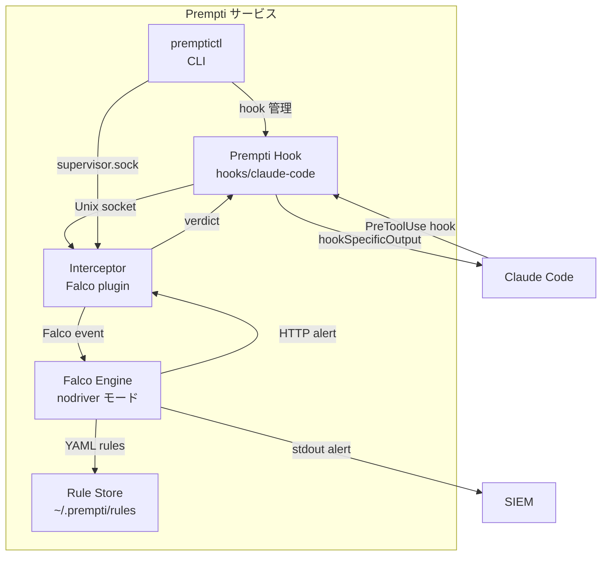
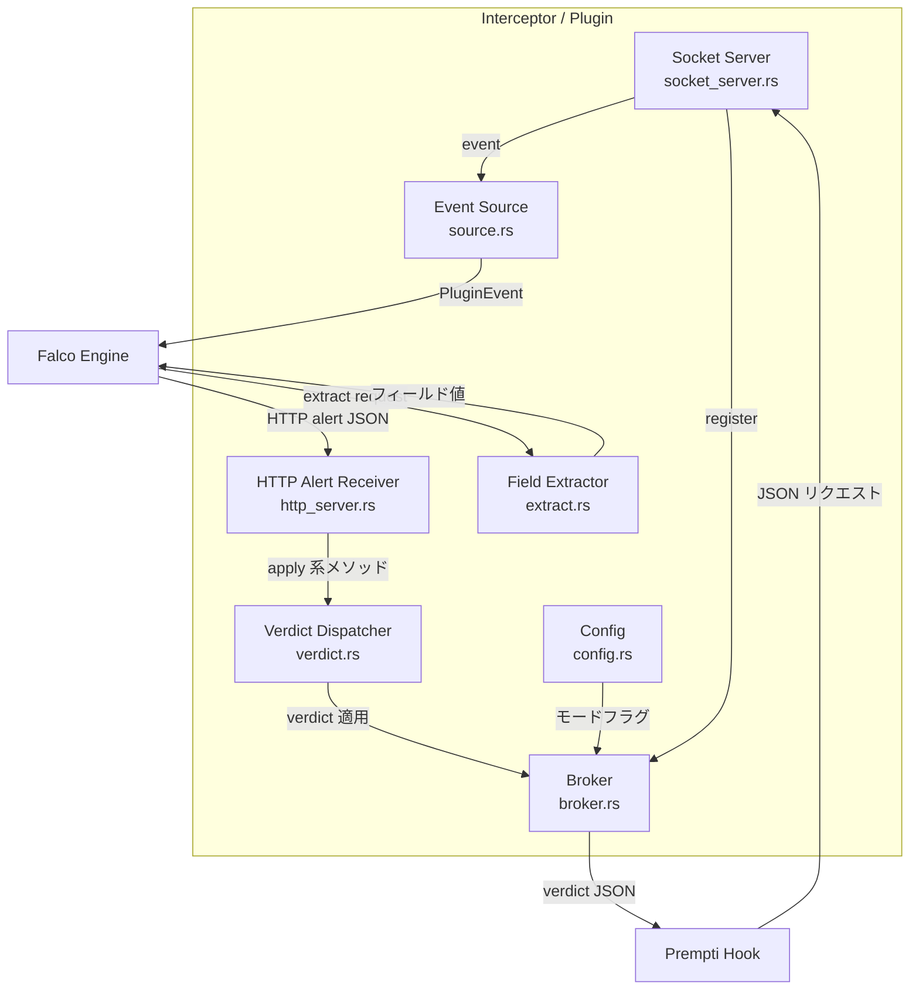
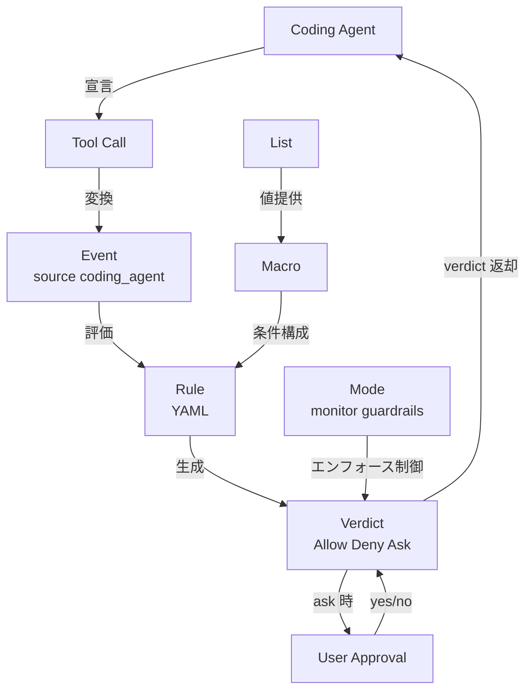
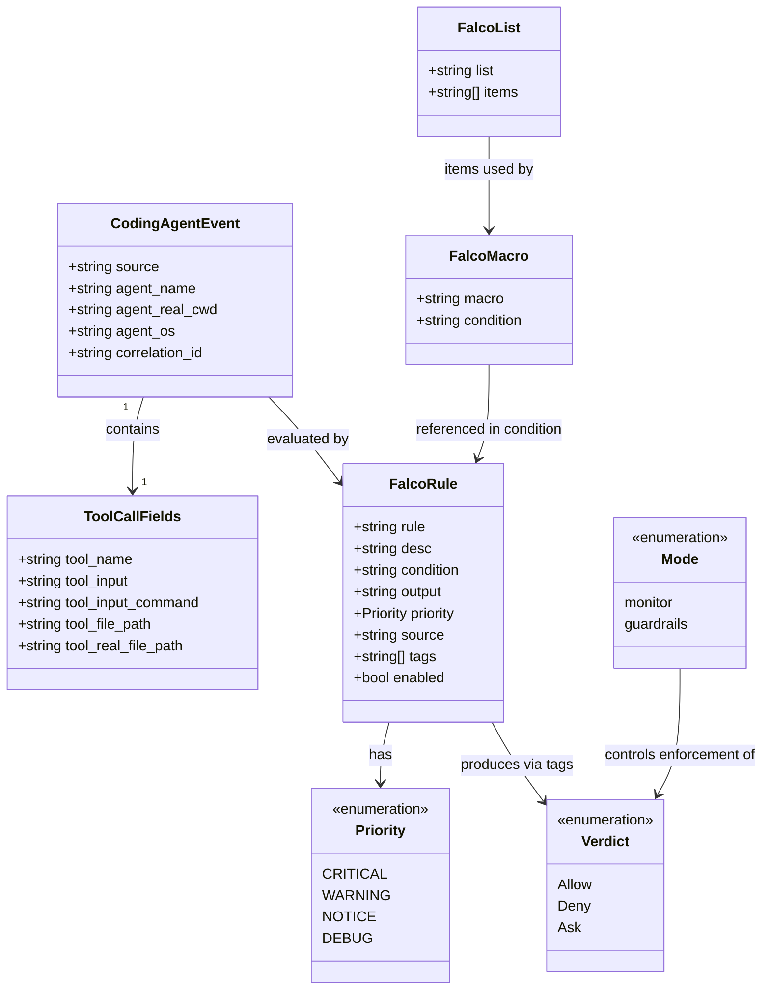
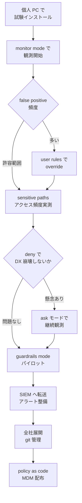

> 調査日: 2026-05-21 / 対象バージョン: v0.2.1 (2026-05-12 release) / ステータス: experimental preview (Falco Ecosystem Sandbox tier)

## 概要

Prempti は、Claude Code などの AI コーディングエージェントが実行する tool call (Bash / Read / Write / Edit / MCP 呼び出し等) を、実行直前に検査するユーザースペースのポリシーレイヤです。`Allow / Deny / Ask` の 3 値の verdict を返し、判定エンジンには CNCF Graduated プロジェクトの Falco を採用しています。ルールは Falco の YAML DSL で記述します。

2026-05-20 に CNCF Blog で正式アナウンスされました。v0.2.1 (2026-05-12 リリース) が最新版です。前身は 2026-03 に `coding-agents-kit` として開始されたリポジトリで、2026-05 に Prempti へリネームされました。

AI コーディングエージェントはユーザー権限で Bash を実行し、ファイルを読み書きし、外部 API を呼びます。しかしその実行過程はほぼブラックボックスで、事後ログを見るだけでは遅すぎます。Prempti は「エージェントが tool call を宣言した瞬間」という制御点に割り込み、ポリシーに照らして許可・拒否・確認を判定します。主な想定ユーザーは、AI コーディングエージェントを個人または組織で導入する実装エンジニア、プラットフォームエンジニア、セキュリティエンジニアです。開発者ローカル PC から始めて段階的に組織展開できる点を設計方針の軸にしています。

Falco 上に構築されることで、Kubernetes / Linux での実績がある rule 言語と評価エンジンを再利用できます。Prempti は `coding_agent` という新規イベントソースを定義し、AI エージェントの tool call を Falco の評価パイプラインに流します。既に Falco rules を書いてきた組織にとっては、AI エージェント側のガードレール導入コストが低くなります。逆に Falco に馴染みのない組織は、Prempti 導入前に Falco rule 言語を習得する先行投資が必要になります。

experimental preview の現在地は率直に共有しておきます。README 冒頭に「Experimental Preview」と明記されており、Falco エコシステム内では Sandbox tier バッジが付きます。v0.1.0 (2026-03-20) → v0.2.0 (2026-05-04) → v0.2.1 (2026-05-12) の 2 ヶ月で破壊的変更を含む PR が複数マージされました。GitHub stars は約 60、Issue / Discussion はともに 0 件 (2026-05-21 確認時点。stars は変動値) という未成熟段階にあります。メンテナ自身が「not a sandbox, not OS-level security, not a substitute for least-privilege environments」「does not contain a determined adversarial agent」と明示しており、現時点では monitor mode での observability 用途から始める段階導入が唯一現実的なルートです。

## 特徴

- 制御点は tool call 直前。システムコールではなくエージェントが宣言した tool name と input を検査
- 3 値 verdict (Allow / Deny / Ask)。Deny は理由メッセージをエージェントに返却、Ask はユーザーへの同期確認プロンプトを挿入
- 2 モード切替 (monitor / guardrails) を `premptictl mode` で切替
- ルール DSL は Falco YAML。verdict は tag (`coding_agent_deny` / `coding_agent_ask`) で制御
- 新規イベントソース `coding_agent`。`tool.name` / `tool.input_command` / `tool.file_path` / `agent.real_cwd` などのフィールドを公開
- 対応エージェントは Claude Code (Linux x86_64/aarch64, macOS Apple Silicon/Intel, Windows x86_64/ARM64)。Codex は planned
- クロスプラットフォーム、非 root インストール。カーネルモジュール不要
- デフォルトルールが 6 カテゴリ (working-dir 境界、sensitive paths、sandbox bypass、threat patterns、MCP 設定汚染、persistence vectors) をカバー
- `~/.prempti/rules/default/` と `~/.prempti/rules/user/` の分離により、upgrade を跨いで組織ルールを保持
- Apache-2.0 ライセンス。Falco Ecosystem の Sandbox tier
- `PREMPTI_FAIL_OPEN=1` 環境変数で全エンフォースメントを即無効化可能 (2026-05-14 マージ)

## 構造

### システムコンテキスト図



| 要素名 | 説明 |
|---|---|
| 開発者 / オペレーター | ローカル PC でエージェントを操作。Prempti のモード切替も担当 |
| Claude Code | LLM が生成した tool call を実行する agent loop。PreToolUse hook が捕捉される |
| Prempti | tool call を実行直前に検査するポリシーレイヤ。verdict を返却 |
| Falco | CNCF Graduated のルール評価エンジン。`nodriver` モードで稼働 |
| OS / ファイルシステム | shell exec / file write / network の実行先。allow 後にのみ実行される |
| 監査基盤 / SIEM | Falco の stdout alert を受信する外部システム |

### コンテナ図



| 要素名 | 説明 |
|---|---|
| Prempti Hook | Claude Code の PreToolUse hook として登録される Rust binary |
| Interceptor / Plugin | Falco plugin。`coding_agent` イベントソースを実装し Broker で相関 ID を管理 |
| Falco Engine | ルール評価エンジン。`nodriver` モードで動作 |
| Rule Store | YAML ルール格納ディレクトリ。`default/` と `user/` に分離 |
| premptictl CLI | サービス管理 CLI。`supervisor.sock` 経由で daemon を制御 |

### コンポーネント図

ドリルダウン対象は Interceptor / Plugin (`plugins/coding-agents-plugin`) です。



| 要素名 | 説明 |
|---|---|
| Socket Server | Unix domain socket リスナ。stale socket を自動削除し read timeout を設定 |
| Event Source | Falco plugin SDK の `SourcePlugin`。`coding_agent` Plugin ID 28 を実装 |
| Broker | 相関 ID ごとの pending request を DashMap で管理。stale 要求を reaper で deny |
| Field Extractor | JSON payload からフィールドを抽出。`tool.name` / `tool.file_path` 等 |
| HTTP Alert Receiver | Falco からの HTTP alert を受信。タグから verdict 種別を判定 |
| Verdict Dispatcher | `Allow` / `Deny` / `Ask` の 3 値を escalate ロジックで集約 |
| Config | `monitor` / `passthrough` フラグを AtomicBool で保持 |

## データ

### 概念モデル



| 要素名 | 説明 |
|---|---|
| Coding Agent | tool call を宣言する AI エージェント本体 |
| Tool Call | アクション単位 (Bash / Read / Write / Edit / Glob / MCP 等) |
| Event | Falco 評価単位。`source: coding_agent` として定義 |
| Rule | 条件と verdict を結びつける YAML エントリ |
| Macro | rule / 他 macro から再利用される条件式スニペット |
| List | macro / condition で参照される値コレクション |
| Verdict | Falco が返す 3 値判定 |
| Mode | `monitor` (記録のみ) / `guardrails` (実エンフォース) |
| User Approval | ask verdict 時のユーザーインタラクション |

### 情報モデル



| 要素名 | 説明 |
|---|---|
| CodingAgentEvent | event source `coding_agent` の基本情報。agent 識別子と相関 ID を保持 |
| ToolCallFields | tool call の内容。`tool.input` は JSON 全体、`tool.input_command` は Bash 用 |
| FalcoRule | 評価ルール本体。`tags` で verdict 種別を制御 |
| FalcoMacro | 再利用条件式 |
| FalcoList | 値の配列。`pmatch` / `in` 演算子で参照 |
| Verdict | 3 値判定 |
| Priority | Falco の重大度。Prempti では `CRITICAL` / `WARNING` / `NOTICE` を主に使用 |
| Mode | 動作モード |

#### Verdict 決定ロジック

| priority | tags | verdict | 動作 |
|---|---|---|---|
| `CRITICAL` | `[coding_agent_deny]` | Deny | tool call ブロック。理由を agent に返す |
| `WARNING` | `[coding_agent_ask]` | Ask | ユーザーに確認。yes → Allow / no → Deny |
| `NOTICE` | (タグなし) | Allow | ログ記録のみ |
| `DEBUG` | catch-all | Allow | audit ログ出力 |

> 推測情報: タグなし `WARNING` の挙動は一次ソース未確認です。broker 層でのタグ解釈ロジック詳細も実装コードからの推定です。

## 構築方法

### 前提

- Claude Code がインストール済み
- 対応 OS とアーキテクチャ

| OS | アーキテクチャ |
|---|---|
| Linux | x86_64、aarch64 |
| macOS | Apple Silicon (aarch64)、Intel (x86_64) |
| Windows | x86_64、ARM64 |

最新リリースは v0.2.1 (2026-05-12) です。ただし README で Experimental Preview と明記されている点には留意します。

### インストール (macOS)

```bash
# GUI インストーラー
open prempti-0.2.1-darwin-universal.pkg

# 非対話型
installer -pkg prempti-0.2.1-darwin-universal.pkg \
          -target CurrentUserHomeDirectory
```

インストール先は `~/.prempti/` です。バイナリは未コード署名のため、初回実行で Gatekeeper がブロックする場合があります。検疫属性を除去します。

```bash
xattr -dr com.apple.quarantine ~/.prempti
echo 'export PATH="$HOME/.prempti/bin:$PATH"' >> ~/.zshrc
source ~/.zshrc
```

### インストール (Linux)

```bash
tar xzf prempti-0.2.1-linux-x86_64.tar.gz
cd prempti-0.2.1-linux-x86_64
bash install.sh

echo 'export PATH="$HOME/.prempti/bin:$PATH"' >> ~/.bashrc
source ~/.bashrc
```

`install.sh` が systemd user service の登録と Claude Code hook の自動登録まで行います。

### インストール (Windows)

```powershell
# Intel / AMD64
msiexec /i prempti-0.2.1-windows-x64.msi

# ARM64
msiexec /i prempti-0.2.1-windows-arm64.msi
```

インストール先は `%LOCALAPPDATA%\prempti\` です。MSI が PATH 追加、hook 登録、ログオン時自動起動、サービス即時起動まで自動で行います。

### Claude Code との接続

tool call インターセプト機能はインストール直後から有効です (プラグイン不要)。以下はカスタムルール作成補助スキルを追加する任意の手順です。

```
/plugin marketplace add falcosecurity/prempti
/plugin install prempti-falco-rules@prempti-skills
```

スキルを入れると Claude Code 上で自然言語でルール作成を依頼できます。

```
Block the agent from running git push
Deny any read outside the working directory
Create a rule that requires confirmation before editing Dockerfiles
```

スキルが `~/.prempti/rules/user/` への書き出しと Falco での検証を自動で行います。

### 初期確認

```bash
premptictl status
premptictl hook status
premptictl health
```

`premptictl health` の期待出力は `OK: pipeline healthy (synthetic event → allow)` です。サービスが起動していない場合は `premptictl start` で手動起動します。

## 利用方法

### モード切替

| モード | 動作 |
|---|---|
| guardrails (デフォルト) | verdict を実エンフォース |
| monitor | 全 tool call を通過させ verdict はログのみ |

```bash
# 監視のみ
premptictl mode monitor

# ガードレール有効化
premptictl mode guardrails
```

導入初期は `monitor` で開始します。`premptictl logs -f` を眺めながら false positive を確認し、業務フローでどの deny が引っかかるかを把握してから `guardrails` へ移行する流れが推奨です。既存ルールを書き換えた後も一度 `monitor` に戻して影響範囲を確認すると安全です。

### ルール作成

カスタムルールは `~/.prempti/rules/user/` (Linux / macOS) または `%LOCALAPPDATA%\prempti\rules\user\` (Windows) に配置します。このディレクトリは upgrade をまたいで保持されます。デフォルトルール (`rules/default/`) は触らず、組織固有の制約だけを `user/` に追加する慣習です。

Falco の標準 YAML 形式を使います。`macro` で条件を部品化し、`rule` で組み合わせます。

```yaml
- macro: is_bash
  condition: tool.name = "Bash"

- macro: is_pipe_to_shell
  condition: >
    tool.input_command contains "| bash"
    or tool.input_command contains "|bash"
    or tool.input_command contains "| sh"
    or tool.input_command contains "|sh"
    or tool.input_command contains "| zsh"
    or tool.input_command contains "|zsh"
    or tool.input_command contains "bash <("

- rule: Deny pipe to shell interpreter
  desc: >
    Blocks Bash commands that pipe network-fetched or generated content directly
    into a shell interpreter. Covers curl|bash, wget|sh, bash <(...), and
    similar patterns used for remote code execution and supply chain attacks.
  condition: is_bash and is_pipe_to_shell
  output: >
    Falco blocked piping content to a shell interpreter (%tool.input_command)
  priority: CRITICAL
  source: coding_agent
  tags: [coding_agent_deny]
```

| フィールド | 役割 |
|---|---|
| `source` | `coding_agent` 固定 |
| `tags` | `coding_agent_deny` で deny、`coding_agent_ask` で ask |
| `condition` | Prempti フィールドを参照する論理式 |
| `output` | エージェントへ返す LLM-friendly なメッセージ |

ルール配置後はサービスを再起動して反映します。

```bash
premptictl stop
premptictl start
```

### Ask モードの体験

`tags: [coding_agent_ask]` を付けたルールにマッチした tool call は、実行前にユーザーへ確認を求めます。Claude Code のターミナルに `output` フィールドのメッセージが表示され、エージェントは処理を一時停止してユーザーの応答を待ちます。`output` の文章は LLM が直接読むことを想定した構造で、エージェントがコンテキストを把握したうえでユーザーに何をすべきか伝えられます。

ユーザーは端末で `y` (allow) または `n` (deny) を入力します。`n` を選んだ場合、エージェントは deny と同様に LLM-friendly な理由を受け取り、別の手段を検討します。

## 運用

### ロギング・監査

`premptictl logs -f` でリアルタイムに tool call の verdict を tail できます。

```
[session: abc123] [ALLOW] Bash: ls -la /home/user/project
[session: abc123] [DENY]  Bash: cat ~/.aws/credentials
[session: abc123] [ASK]   Write: /etc/hosts
```

Falco の `http_output` を設定すれば、coding_agent イベントを HTTP エンドポイントへ転送できます。`passthrough` モードでも「イベントは Falco に enqueue されるため observability は維持される」とメンテナが明記しており、enforcement を無効化しても監査ログは取れる設計です。

SIEM / Grafana 連携の想定パターン (推測ベース) は以下です。

```
Falco http_output → Fluentd / Vector → Elasticsearch / Loki
                                      → Grafana Dashboard
                                      → SIEM (Splunk / Datadog)
```

既存 Falco-SIEM 連携を持つ組織は、`source: coding_agent` のルールを既存スタックへ追加する形で統合できる可能性が高いです。ローカル PC 上の user service から SIEM への経路は組織のネットワーク設計に依存するため、別途確認が必要です。

### ルールのライフサイクル管理

```
~/.prempti/rules/
├── default/   ← premptictl upgrade で更新。直接編集禁止
│   └── coding_agents_rules.yaml
└── user/      ← upgrade を跨いで保持。組織の管理責任
    └── custom.yaml
```

`default` を改変すると次の upgrade で上書きされるため、必ず `user/` に override を書きます。ルール変更後は `premptictl stop && premptictl start` でサービスを再起動します (hot-reload ではなく ctl-driven restart に変更済み)。

MDM 配布時は `rules/user/` をシンボリックリンクまたは配布スクリプトで同期する方法が現実的です。公式の配布機構は存在しないため別途整備が必要です。

### 段階導入 (monitor → guardrails)



| 段階 | 確認指標 | 判断基準 |
|---|---|---|
| monitor 開始直後 | DENY/ASK 件数 | 1 時間あたりの件数を記録 |
| false positive 評価 | 業務影響 | 業務必須コマンドが deny されていないか |
| ask 頻度評価 | クリック数 | 1 日 5 回超なら DX 問題として扱う |
| guardrails パイロット | 失敗タスク数 | エージェントが完遂できないタスクが増えていないか |
| SIEM 連携後 | S/N 比 | アラートのノイズ比率 |

### 限界の認識

メンテナ自認の制限 (README "Known Limitations" より) は次のとおりです。

> Prempti intercepts tool calls at the coding agent's hook API — it sees the commands the agent asks to run, not the side effects those commands produce on the system.

> It is not a sandbox, OS-level security, or a substitute for least-privilege environments.

> It does not contain a determined adversarial agent.

これは Prempti を否定する材料ではなく、設計の境界を正直に示したものです。運用者はこの認識を必ず共有します。

bypass 経路 (技術的に検知できないケース) は以下です。

1. **shell metacharacter / 難読化**: ルールは `contains "| bash"` の substring マッチが中心。`bash -c "$(echo cm0gLXJmIC8K | base64 -d)"` や `|  sh` (スペース多重)、`xargs sh` は素通りする可能性があります
2. **コンパイル済みバイナリ**: `Write` で書いた実行ファイルを `./main` で起動した場合、Write 自体は許可されつつ main が行う syscall は不可視。README で「Falco can inspect the compile and run commands but cannot analyze what the compiled program actually does at runtime」と明示
3. **subagent inheritance**: Claude Code の Task / Agent tool 経由でサブエージェントが起動した場合の hook context 継承挙動が README に明示されていません。Claude Code 側仕様変更で変わる可能性 (推測)
4. **MCP side effect**: MCP server への呼び出しは input 側のみ検査可能。サーバ側の副作用は不可視。README に「Input-side only for external systems such as MCP」と明記

PR #35 (MERGED / 2026-05-20) で追加された `PREMPTI_FAIL_OPEN=1` 環境変数の存在には注意が必要です。

- `PREMPTI_FAIL_OPEN=1` を set すると、broker 通信失敗時に deny ではなく allow にフォールバック
- `mode: passthrough` を設定すると、rule evaluation を待たず即 allow になります (観測ログは保持)

CI/CD パイプラインで `.envrc` や Docker Compose の environment に誤って `PREMPTI_FAIL_OPEN=1` が含まれると、guardrails が静かに無効化されます。`premptictl status` で `Mode:` を確認することで誤 set を検出できます。

## ベストプラクティス

### 最初は ask モード優先

いきなり deny にすると DX が崩壊します。特に `/etc`、`~/.ssh`、`~/.aws` へのアクセスは多くの開発者にとって日常的で、default rules がこれらを deny に設定している場合、Claude Code が動かないとチーム全体から反発を受けます。

推奨手順は次のとおりです。

1. default rules の deny タグを ask に降格した user rules を作成
2. ask の発生頻度を 1 週間実測
3. 頻度が低いものから deny に昇格、頻度が高いものは allow を検討
4. 「なぜ deny か」をルールのコメントに書く

```yaml
- rule: Override sensitive path access to ask
  desc: Default deny になっている sensitive path アクセスを ask に降格
  condition: tool.file_path startswith "/etc"
  output: "Sensitive path access (%tool.file_path)"
  priority: WARNING
  source: coding_agent
  tags: [coding_agent_ask]
```

### Falco rule 経験の流用

既存 Kubernetes Falco ruleset を持つ組織は、`source: coding_agent` を追加するだけで既存の DSL 知識、ツールチェーン、レビュープロセスを流用できます。Falco 未経験組織は、Prempti 導入前に Falco rule 言語の先行投資が必要です。README 自身も「デフォルトルールは deliberate に generic」と認めており、最大効果を得るには自分でルールを書く必要があります。学習コストが高い場合、Anthropic 公式の Claude Code hooks (PreToolUse / PostToolUse) + シェルスクリプトで同等のロジックを実装する代替案が技術的ハードルは低くなります。

### monitor mode 主体で始める

Prempti は Falco Ecosystem の experimental tier であり、v0.1.0 (2026-03-20) からわずか 2 ヶ月で複数の breaking change と installer バグ修正が続いています。この成熟度では本番 guardrails の適用は時期尚早と判断するのが妥当です。

現実的な用途の中心は「monitor mode で Falco events を SIEM に流し、AI エージェントが組織内で何をしているかを可視化する」ことです。blocking enforcement は別レイヤ (macOS Seatbelt、Linux bubblewrap / firejail、rootless container) に任せる設計が defense-in-depth として堅牢です。

### user rules を継続的に育てる

デフォルトルールは deliberately generic と明記されています。組織固有の制約 (特定外部ドメインへの curl 禁止、社内 VPN 外への write 禁止等) は自分で書く必要があります。`rules/user/` を git リポジトリで管理し、Pull Request レビューを経てルール変更する運用 (policy as code) が長期運用では必須です。

判断基準は次のとおりです。

- `premptictl logs` で繰り返し同じパターンが現れたら rule 化
- 「deny したが業務に必要だった」事例を蓄積し、ask/allow への変更判断に使う
- default rules の upgrade 時に差分を確認し、新組み込みルールが user rules と競合しないか確認

### CI/CD では PREMPTI_FAIL_OPEN を明示的に管理する

- `PREMPTI_FAIL_OPEN` を CI 環境変数に絶対に含めない
- `premptictl status` を CI の pre-flight check に組み込み、`Mode:` が期待値であることを確認
- passthrough mode は観測目的専用とし、本番 enforcement パイプラインには使わない

```bash
# CI pre-flight check (推測ベースの実装例)
MODE=$(premptictl status | grep "Mode:" | awk '{print $2}')
if [ "$MODE" = "passthrough" ]; then
  echo "ERROR: Prempti is in passthrough mode — enforcement disabled"
  exit 1
fi
```

## トラブルシューティング

### インストール失敗

v0.1.0 → v0.2.1 の 2 ヶ月間で installer / service 起動の基本バグが連続して修正されています。本番 fleet-wide デプロイ前に安定性を確認します。

| PR | 状態 | 1 行要約 |
|---|---|---|
| #29 | MERGED | Windows fresh-install で service start が unblock されない |
| #23 | MERGED | macOS で socket I/O 前に timeout 設定しないと EINVAL race condition |
| #20 | MERGED | hook remove scope と uninstall cleanup の不具合 |
| #16 | MERGED | macOS release-validation で見つかった複数の cleanup 修正 |
| #15 | MERGED | Windows release-validation の cleanup 修正 |
| #9 | MERGED | macOS pkg install lifecycle / ctl enable / idempotency 修正 |
| #8 | MERGED | Windows MSI install/uninstall lifecycle と plugin/ctl hardening |

対処は必ず最新 release (v0.2.1 以降) を使うことです。macOS Gatekeeper ブロックは `xattr -dr com.apple.quarantine ~/.prempti` で対処します。エンタープライズ MDM 配布時は Gatekeeper / Notarization 要件と競合する可能性があるため事前確認が必要です。

### hook が発火しない

```bash
premptictl health
premptictl status
premptictl stop && premptictl start
```

Claude Code の `.claude/settings.json` に `PreToolUse` hook を手動設定している場合、Prempti の hook と競合する可能性があります。`premptictl logs` に何も出ない場合、Claude Code が Prempti の hook を登録できていない可能性があります。

Claude Code の Task / Agent tool で起動したサブエージェントからの tool call が premptictl logs に現れない場合、hook の recursive enforcement が機能していない可能性があります。この挙動は README に明示されておらず仕様不明 (推測) です。

### false positive が多い

```bash
cat ~/.prempti/rules/default/coding_agents_rules.yaml
```

どの condition が hit しているかを `premptictl logs` の output フィールドで確認します。`contains` ベースのマッチが想定外のコマンドを捕捉している場合が多くなります。

user rules で override する例です。

```yaml
# プロジェクトディレクトリへの Write を監査ログのみとし、deny/ask には該当させない例
# (deny/ask タグを付けないルールは Falco 上でログ記録のみとなり Verdict は Allow になります)
- rule: Audit write to project dir
  desc: プロジェクトディレクトリへの Write を監査ログに記録
  condition: >
    tool.name = "Write"
    and tool.file_path startswith "/home/user/projects/"
  output: "Audited write to project dir (%tool.file_path)"
  priority: NOTICE
  source: coding_agent
```

> 注意: 既存の deny / ask ルールに該当しない tool call は自動的に Allow されます。「明示的に allow するタグ」が公開仕様にあるかは一次ソースで未確認のため、上記のように deny/ask に該当しないルールでログだけを記録する形が安全です。

よくある誤検知パターンは次のとおりです。

- `git push origin main` → "push" を含む別ルールに引っかかる
- `ssh-keygen -t ed25519` → `~/.ssh` 系ルールに該当
- `npm install` → package.json の write が sensitive path ルールに触る

### monitor で記録は出るが guardrails で何も止まらない

```bash
premptictl status
echo $PREMPTI_FAIL_OPEN
```

`premptictl mode guardrails` を実行してもコマンドが止まらない場合の確認順は次のとおりです。

1. `PREMPTI_FAIL_OPEN` 環境変数が shell / `.envrc` / systemd unit で set されていないか
2. `premptictl stop && premptictl start` でサービス再起動
3. `premptictl health` でパイプライン疎通
4. ルールの `tags` が `coding_agent_deny` か (`coding_agent_ask` になっていると ask 動作)

## まとめ

Prempti は AI コーディングエージェントの tool call を Falco でポリシー制御する experimental preview のレイヤです。tool call 直前という制御点と Allow / Deny / Ask の 3 値判定、monitor → guardrails の段階導入を一級の運用パターンとして組み込んだ設計が特徴ですが、現状は Issue 0 / stars 61 / `PREMPTI_FAIL_OPEN` 設計など未成熟な側面も率直に書かれており、本番採用より monitor mode での observability 用途から始めるのが現実的です。

この記事が少しでも参考になった、あるいは改善点などがあれば、ぜひリアクションやコメント、SNSでのシェアをいただけると励みになります！

## 参考リンク

- 公式ドキュメント
  - [CNCF Blog: Introducing Prempti — Policy and Visibility for AI Coding Agents (2026-05-20)](https://www.cncf.io/blog/2026/05/20/introducing-prempti-policy-and-visibility-for-ai-coding-agents/)
  - [Prempti landing page](https://prempti.falco.org/)
  - [Falco (CNCF Graduated)](https://falco.org/)
  - [Falco Docs: Basic Elements of Rules](https://falco.org/docs/concepts/rules/basic-elements/)
  - [Falco Docs: Rules Overview](https://falco.org/docs/concepts/rules/)
  - [Falco Graduation Announcement (2024-02-29)](https://falco.org/blog/falco-graduation/)
  - [Claude Code Hooks reference (Anthropic)](https://docs.anthropic.com/en/docs/claude-code/hooks)
  - [Model Context Protocol (MCP) Spec](https://modelcontextprotocol.io/)
- GitHub
  - [falcosecurity/prempti](https://github.com/falcosecurity/prempti)
  - [Prempti README](https://github.com/falcosecurity/prempti/blob/main/README.md)
  - [最新リリース (v0.2.1)](https://github.com/falcosecurity/prempti/releases/tag/v0.2.1)
  - [Default rules YAML](https://github.com/falcosecurity/prempti/blob/main/rules/default/coding_agents_rules.yaml)
  - [tools/premptictl/README.md](https://github.com/falcosecurity/prempti/blob/main/tools/premptictl/README.md)
  - [Falco Plugin Registry](https://github.com/falcosecurity/plugins/blob/main/registry.yaml)
  - [PR #35: Opt-in fail-open hook (MERGED / 2026-05-20)](https://github.com/falcosecurity/prempti/pull/35)
  - [PR #13: hot-reload を ctl-driven restart に変更 (MERGED / 2026-04-24)](https://github.com/falcosecurity/prempti/pull/13)
- 記事
  - [Cloudflare: Claude Managed Agents — brain/hands separation (2026-05-19)](https://blog.cloudflare.com/claude-managed-agents/)
  - [Claude Code Security Bypass Research (Penligent)](https://www.penligent.ai/hackinglabs/claude-code-security-bypass-research/)
  - [MCP Security in 2026: Tool Poisoning](https://mcpplaygroundonline.com/blog/mcp-security-tool-poisoning-owasp-top-10-mcp-scan)
  - [Falco Rules for K8s Threat Hunting 2026](https://johal.in/sec-arch-design-python-falco-rules-for-kubernetes-threat-hunting-2026-2/)
