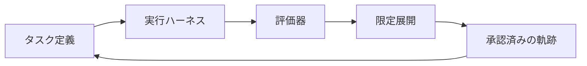

モデルを小さくすると、直接費は下がります。

ただし、再試行やレビュー待ちが増えれば、製品全体のコストは下がりません。モデルの切替を価格だけで決めると、この差分を見落とします。

Microsoft は 2026 年 7 月、GitHub Copilot の MAI-Code-1-Flash を起点に、Excel の強化学習環境で追加学習した専用モデルを紹介しました。同社はモデル、実行ハーネス、エージェント、製品固有の評価を一体で回す仕組みを「hill-climbing machine」と呼んでいます。

この記事では、この発表をモデル性能の勝敗としてではなく、小型モデルを製品へ安全に移す評価設計として読み解きます。

## 先に結論

小型モデルへ移す単位は、モデル名ではなく「タスクと評価契約」です。

評価契約には、成功の定義だけでなく、実行条件、失敗時の扱い、観測するコスト、ロールバック条件を含めます。この契約があれば、モデルを入れ替えても、品質と運用負荷を同じ軸で比較できます。

## Microsoft の発表が示したこと

Microsoft は、MAI-Code-1-Flash を GitHub Copilot の本番ハーネス内で後学習し、そのチェックポイントを Excel 評価へ展開したと説明しています。Excel では、ツール利用とスプレッドシートの知識ワークフローを学ぶ強化学習環境を使ったとしています。

同社の報告では、Copilot でコード受諾率がおよそ 10% 高く、中央値トークン使用量は 10% 低いとしています。Excel では、最頻タスクで GPT-5.6 と同等の品質で、より費用効率がよいと報告しています。

数値は Microsoft 自身の製品内計測です。対象ユーザー、実験条件、失敗タスクの内訳は公開資料だけでは十分に分かりません。別の組織が採用判断へ転記するのではなく、自組織で再現する仮説として使うのが適切です。

## モデル比較だけで決められない理由

オフラインの正答率は重要です。しかし、製品の実運用には次の要素もあります。

| 観測対象 | 見るべき内容 |
| --- | --- |
| ツール利用 | 呼び出し失敗、権限不足、やり直し |
| 利用者の反応 | 受諾、修正、放棄、再訪 |
| 人手の負荷 | レビュー時間、エスカレーション |
| 例外処理 | 空データ、曖昧な指示、取り消し |

トークン量だけを下げても、再試行が増えれば費用は戻ります。受諾率だけを上げても、利用者が検知できない誤りが残ることがあります。

そのため、モデルの比較対象を「ベンチマーク上のモデル」から「同じタスクを同じ実行条件で完了するシステム」へ変えます。

## 評価ループの最小構成

| 要素名 | 説明 |
| --- | --- |
| タスク定義 | 入力、完了条件、許可する権限 |
| 実行ハーネス | モデル、プロンプト、ツール、実行結果 |
| 評価器 | 自動判定、人手レビュー、禁止条件 |
| 限定展開 | 対象トラフィック、上限、ロールバック |
| 承認済みの軌跡 | 次の評価セットと改善候補 |

ポイントは、ログを学習へ使う前に、何を成功と見なすかを固定することです。改善が見えても、評価器の偏りを検査できます。

## 四つの指標を同時に見る

タスクごとに、少なくとも次の四つを計測します。

1. **成果品質**: タスク完了率、利用者の受諾率、重大な誤り率
2. **運用コスト**: 入出力トークン、API または GPU 費用、待ち時間
3. **修正コスト**: 再試行率、エスカレーション率、人手レビュー時間
4. **安全性**: 権限逸脱、機密データの混入、ロールバック発生

この四つを一つのダッシュボードで見ると、安いモデルが本当に安いかを確認できます。

## 小型モデルへ移す手順

1. 高頻度で、失敗しても戻せるタスクを一つ選びます。
2. 現行モデルを基準に、成功、失敗、エスカレーションの判定を固定します。
3. 小型モデルを限定トラフィックで動かし、四つの指標を比較します。
4. 悪化の上限を超えたら、現行モデルへ戻します。
5. 合格した軌跡だけを、次の評価セットや改善候補へ追加します。

利用ログを無条件に学習データへ変換する必要はありません。利用許諾、機密性、保持期間、アクセス権を確認し、承認済みの軌跡だけを扱います。

## 過適合を防ぐチェック

製品固有の評価は、既存ユーザーの行動へ過適合する危険があります。特に低頻度で高損害な失敗は、受諾率や再訪率に現れにくい領域です。

評価セットには通常ケースに加え、権限エラー、空データ、曖昧な指示、取り消し、例外操作を含めます。限定展開中は、品質が落ちたときに自動で戻す条件を実装します。

## まとめ

小型モデルへの移行は、単価を下げる施策ではありません。製品内の実行、評価、展開制御をつなげ、タスクごとに改善を判断できる状態を作る施策です。

まずは一つの可逆的なタスクで、品質、運用コスト、修正コスト、安全性を同時に測る評価契約を作ると、次のモデル切替が比較可能になります。この記事が参考になった、または改善点があれば、ぜひリアクションやコメントをお願いします。

## 参考リンク

- Microsoft AI
  - [Hill-Climbing MAI models for GitHub Copilot and Excel](https://microsoft.ai/news/hill-climbing-mai-models-for-github-copilot-and-excel/)
  - [Building a hill-climbing machine: Launching seven new MAI models](https://microsoft.ai/news/building-a-hillclimbing-machine-launching-seven-new-mai-models/)
  - [Introducing MAI-Code-1-Flash](https://microsoft.ai/news/introducingmai-code-1-flash/)
