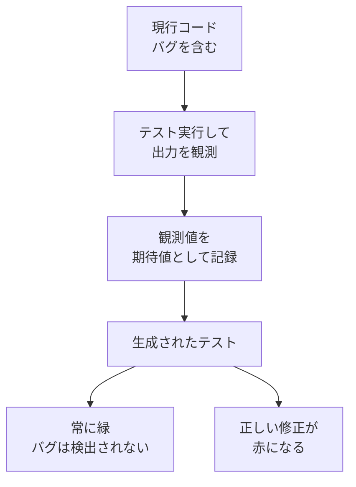
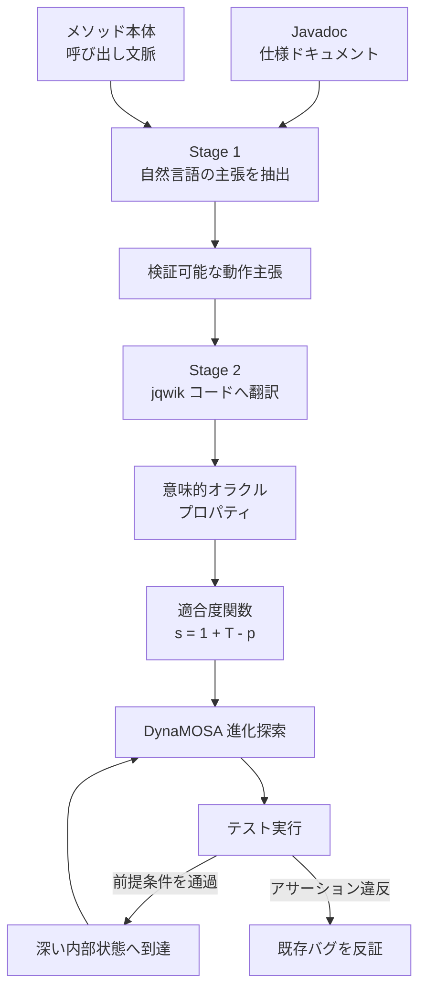

## この記事の対象と、読んで得られるもの

AIコーディングアシスタントに「テストを書いて」と頼んだとき、生成されたテストが**すでに存在するバグを「正解」として固定してしまう**問題があります。本記事はこの現象（自己参照オラクル、いわゆる写経オラクル）を、2026年7月にarXivへ公開された論文 **PROGRESS**（PROperty-Guided REgression Search for Semantic Falsification, arXiv:2607.27359）を手がかりに整理します。

対象読者は次のとおりです。

- LLMにテストコードを書かせている開発者・テックリード
- テスト自動生成の品質をどう評価すべきか判断したい立場の方
- プロパティベーステスト（PBT）の導入可否を検討している方

読み終えると、以下が得られます。

- テスト生成を「カバレッジ」と「オラクル」の2軸に分けて評価する視点
- 実装コードを渡すか、仕様ドキュメントを渡すかで結果がどう変わるかの定量的な根拠
- 明日から自分のプロジェクトで試せる、プロンプト設計と運用の具体策

---

## なぜ自動生成テストは既存バグを見逃すのか

### テストは「カバレッジ」と「オラクル」の2要素でできている

テストケースは大きく2つの要素に分解できます。

| 要素 | 役割 | 典型的な自動化手段 |
|---|---|---|
| 入力生成（カバレッジ） | 対象コードの実行経路へ到達させる | 探索型生成、ファジング、乱数生成 |
| オラクル（期待値） | 実行結果が正しいかを判定する | アサーション、不変条件、参照実装 |

自動テスト生成の研究は長らく前者、つまり「どこまで実行できたか」を競ってきました。EvoSuiteに代表される探索型回帰テスト生成（Search-based regression testing）は、遺伝的アルゴリズムでカバレッジを最大化する点で非常に優秀です。

問題は後者です。探索型の回帰テスト生成は、**アサーションを「実行時点の現行コードの挙動」から自動作成します**。つまり「いま返ってきた値」をそのまま期待値として記録します。

### 現行コードから期待値を作ると何が起きるか

現行コードにバグがある場合、そのバグの出力がそのまま「仕様」として記録されます。結果として次の状態になります。

- テストは緑になる（現行コードと一致するのだから当然）
- しかしバグは検出されない
- さらに悪いことに、後から正しい実装へ直そうとすると**テストが赤くなる**（バグが仕様として固定されたため）

これが自己参照オラクルの問題です。テストがバグの検出装置ではなく、**バグの永続化装置**として機能してしまいます。

LLMによるテスト生成でもまったく同じ構図が起きます。実装コードをコンテキストに渡して「このコードのテストを書いて」と頼めば、LLMは実装を読んで期待値を組み立てます。仕様ではなく実装を写しているため、実装の誤りは検出できません。

### プロパティベーステストが解決すること、しないこと

この問題への正攻法がプロパティベーステスト（PBT）です。PBTは個別の入出力ペアではなく、**「どんな入力に対しても成り立つべき性質」**を宣言します。

- ラウンドトリップ性: `decode(encode(x)) == x`
- 冪等性: `f(f(x)) == f(x)`
- 不変条件: ソート後も要素の多重集合は変わらない

これらは実装から独立した**意味的オラクル（Semantic Oracle）**です。実装がどう書かれていようと、性質が破れれば検出されます。

ただしPBTには弱点があります。**入力生成が乱数ベース**であるため、複雑なオブジェクト構造や厳しい前提条件（precondition）を持つメソッドでは、性質を検査する地点まで到達できません。前提条件を満たさない入力は棄却されるだけで、テストは「実行されなかった」まま緑になります。

つまり現状は次のように役割が割れています。

| 手法 | 入力生成（到達性） | オラクル（意味） |
|---|---|---|
| 探索型回帰テスト生成 | 強い | 弱い（現行コードの写経） |
| プロパティベーステスト | 弱い（深い状態へ届かない） | 強い（仕様から独立） |

PROGRESSはこの2つを噛み合わせる、という発想のフレームワークです。

---

## PROGRESSは何をしているのか

PROGRESSの構成は、大きく「プロパティをLLMで作る部分」と「そのプロパティを探索の目標に組み込む部分」に分かれます。

### 1. 実装の漏れ込みを抑える2段階LLMパイプライン

プロパティ生成は2段階に分けられています。

- **Stage 1（自然言語の主張抽出）**: 対象メソッド（MUT）のコード、Javadoc、呼び出し元・呼び出し先の文脈をまとめて受け取り、実装の細部に引きずられない自然言語の動作主張を抽出する。
- **Stage 2（実行可能コードへの翻訳）**: 抽出した主張を、jqwikの `@Property` と `@Provide` ジェネレータへ翻訳する。

ここで肝になるのが**実装漏洩（Implementation Leakage）の制御**です。実装コードだけを根拠にプロパティを作らせると、現行コードの不具合までプロパティ側へ写ってしまい、結局は自己参照に戻ります。そこでPROGRESSは、**意図の主たる根拠をJavadoc等のドキュメントに置き**、コード文脈は「コンパイル可能なAPIシグネチャを組み立てるための参照」に役割を限定しています。

一段目で自然言語に落としてから二段目でコード化する構成そのものが、実装の細部を一度剥がすためのフィルタとして働いています。

### 2. 前提条件の通過度を適合度に変える

生成したプロパティは、EvoSuiteのDynaMOSAアルゴリズムに**第1級の検索目標**として組み込まれます。核となるのが適合度関数です。

$$s = 1 + T - p$$

- $T$: そのプロパティに含まれる `Assume.that(...)` 前提条件の総数
- $p$: そのテスト実行で実際にクリアできた前提条件の数

値が小さいほど高評価という設計です。ここから2つの挙動が導かれます。

1. **段階的インセンティブ**: 前提条件を1つでも多く通過したテストケースはスコアが改善するため、遺伝的探索が「前提条件を通す方向」へ誘導される。通常のPBTでは「棄却されたかどうか」の0/1しか情報がないのに対し、途中経過が勾配として使えるようになる。
2. **反証の最優先**: アサーション違反が起きた瞬間、つまりバグが露出した瞬間、スコアは $s = 0$ となり、そのテストケースが進化的選択で最優先される。

「前提条件をどこまで通せたか」を連続的な指標に変えたことが、PBT単体では届かなかった深い状態への到達を可能にしています。

### 3. パラメータのバインディングとジェネレータのフック

プロパティの `@ForAll` パラメータは、テストケースの進化中にテスト変数として具現化（マテリアライズ）され結合されます。加えて、進化探索が苦手とする特定のドメイン制約（一定範囲の数値、特定のオブジェクト状態など）に対しては、jqwikの `@Provide` ジェネレータから値を確率的に注入するフックが用意されています。

構造の探索はEvoSuiteの進化探索が、ドメイン固有の値生成はjqwikのジェネレータが担う、という分担です。

---

## 実験結果は何を示しているか

評価は25の大型Javaシステム（EvoSuiteベンチマーク8件、Apache Commons 17件）から選ばれた240のMUT–Javadocペアと、562件のソースレベル変異バグ（PIT/PITMuS）を用いて行われています。

### 既存バグの検出率: 58% 対 0%

もっとも直接的な結果がこれです。

| 手法 | 対象変異バグ | 検出数 | 検出率 |
|---|---|---|---|
| PROGRESS | 562 | 328 | 58% |
| 従来の回帰テスト生成（EvoSuite） | 562 | 0 | 0% |

EvoSuiteの0%は「バグのある行を実行できなかった」からではありません。**実行できているのに検出できない**のです。アサーションを変異後のコード（＝現行コード）から抽出するため、「バグった動作が正解」として記録され、テストが通ってしまいます。カバレッジとオラクルが独立した評価軸であることが、この0%という数字に凝縮されています。

変異オペレータ別に見ると得意・不得意がはっきり分かれます。

| 変異オペレータ | 変異バグ数 | 検出数 | 検出率 |
|---|---|---|---|
| Boolean True Return | 13 | 12 | 92% |
| Return Value（他値返却） | 55 | 47 | 85% |
| Negated Conditional（条件反転） | 236 | 168 | 71% |
| Math Operator（算術演算変更） | — | — | 30% |
| Conditional Boundary（境界値変更） | — | — | 20% |
| 全体 | 562 | 328 | 58% |

戻り値や条件分岐の反転のように、**ドキュメントに書かれた意図と正面から矛盾する変異**は高率で検出されています。一方、算術演算子の差し替えや境界値のずらしは20〜30%にとどまります。Javadocが「境界値をどちらに含めるか」まで書いていないことが多く、そもそも意図が文書化されていない領域はプロパティ化できない、と読むのが妥当でしょう。

:::message
この検出率の非対称性は、そのまま「自分のプロジェクトでこの手法がどこまで効くか」の見積もりに使えます。ドキュメントが薄いコードベースでは上限が低くなります。
:::

### 到達困難な前提条件の突破: 3〜9倍

「PBT単体では10回以上試行してもクリアできない」150個の前提条件について、3分間の探索で比較した結果です。

| 評価指標 | jqwik単体 | PROGRESS | 倍率 |
|---|---|---|---|
| 第1前提条件を満たしたMUT数 | 19 / 150（12.7%） | 70 / 150（46.7%） | 3.68倍 |
| 全前提条件を満たしたMUT数 | 18 / 150（12.0%） | 70 / 150（46.7%） | 3.89倍 |
| 呼び出しレベルの全前提条件クリア率 | 3.6% | 34.0% | 9.44倍 |

注目すべきは1行目と2行目の差です。jqwik単体では「第1前提条件は通ったが全部は通らなかった」ケースが存在するのに対し、PROGRESSでは第1前提条件を通した70件がそのまま全前提条件も通しています。前提条件を勾配として扱う設計が、途中で止まらずに最後まで押し切る挙動を生んでいると読めます。

### どの文脈情報が効いているのか

8つのプロンプト構成でアブレーションが行われています。主要な構成を抜粋します。

| 構成 | 入力文脈 | Invalid率 | バグ検出数 |
|---|---|---|---|
| P1（Full） | メソッド本体 + Javadoc + 呼び出しグラフ文脈 | 6% | 328 |
| P2 | メソッド本体 + Javadoc | 13% | 325 |
| P4 | シグネチャ + Javadoc（本体なし） | 11% | 224 |
| P5 | メソッド本体 + コード文脈（ドキュメントなし） | 42% | — |
| P7 | メソッド本体 + ドキュメント文脈（コード文脈なし） | 39% | 152 |

ここから読み取れる示唆は2つです。

- **Javadoc（ドキュメント）が意図の担い手**である。論文はプロパティ意図の73.4%、バグ検出の75.7%をJavadocが担うと報告している。ドキュメントを外したP5はInvalid率が42%へ跳ね上がる。
- **コード／呼び出しグラフは「コンパイル可能性」の担い手**である。コード文脈を外したP7はInvalid率39%で、検出数も152まで落ちる。複雑なプロパティを書こうとするとAPIの使い方を誤ってコンパイルエラーになる。

つまり、**意図はドキュメントから、型とAPIの整合はコードから**という役割分担が成立しているときにもっとも良い結果が出ています。P1とP2の検出数がほぼ同じ（328対325）である点も実務的には重要で、呼び出しグラフ全体を集める投資対効果は限定的だと読めます。

---

## 手法の限界

論文自身が挙げている限界を、そのまま押さえておきます。

1. **厳密なフォーマット制約には届かない**。CDLのCSVパース処理のように、前提条件が相互依存するフォーマット（ヘッダー文字列とCSV本体の整合など）に強く依存する場合、DynaMOSAの構造探索と `@Provide` フックを併用しても前提条件を突破できない事例が存在した。
2. **LLMが誤ったプロパティを作ることがある**。生成された880個のプロパティのうち64個（7%）は、変異のないベースラインコードで失敗したため破棄された。仕様解釈ミスはゼロではない。
3. **仕様の部分読みによる誤ったオラクル**。仕様の一節だけを抽出してプロパティ化すると、別の節に書かれた前提や例外条件を見落とし、無効なオラクルを作るリスクがある。

2点目は運用上とくに重要です。**「変異のないベースラインで落ちるプロパティは捨てる」というフィルタが前提**であり、この検証工程を省くと誤検出（False Positive）がそのまま流れ込みます。プロパティ生成をパイプラインに組み込むなら、ベースライン検証は必須の関門として設計してください。

---

## 自分のプロジェクトで何ができるか

論文の実装をそのまま使わなくても、設計思想は日々のAIコーディングに転用できます。

### 1. テスト生成時にコンテキストを分離する

もっとも即効性がある対策です。テストを生成させるとき、**実装コードをコンテキストから外し、仕様書・JSDoc・要件定義だけを渡して期待値（アサーション／プロパティ）を先に作らせます**。

手順としては次の順序になります。

1. 仕様ドキュメントのみを渡し、満たすべき性質と期待値を書かせる
2. その後で実装コードを渡し、コンパイル・型整合のためだけに調整させる
3. 現行コードで落ちたテストを「バグ候補」として人間がレビューする

ポイントは3番目です。**現行コードで落ちること自体は失敗ではなく、検出**です。ここを「テストが間違っているから直そう」と処理してしまうと、写経オラクルへ逆戻りします。

なおPROGRESSのアブレーション結果が示すとおり、コード文脈を完全に外すとコンパイルできないコードが増えます。**意図の生成フェーズでだけ実装を隠し、コード化フェーズでは型情報を与える**、という段階分けが現実的です。

### 2. 例ベースから性質ベースへテストの粒度を上げる

テストケースを「入力と出力のペア例」として書くのをやめ、**「どんな入力に対しても満たすべき不変条件」**として記述します。

- ラウンドトリップ: シリアライズ→デシリアライズで元に戻るか
- 冪等性: 2回適用しても結果が変わらないか
- 不変条件: 処理の前後で保存されるべき量（件数、合計、集合としての等価性）

これらを探索エンジン（PBT、ファジング、進化的探索）に食わせれば、AI生成コードに対する防御壁を自動で広げられます。例ベースのテストは書いた本人が想定した入力しか守りませんが、性質ベースのテストは想定外の入力まで守ります。

### 3. ドキュメントを「テストの原資」として扱う

PROGRESSの結果は、**Javadocの品質がそのままバグ検出率の上限になる**ことを示しています。これはドキュメント整備の投資対効果に対する、これまでとは別の根拠になります。

- ドキュメントは人間の読み物であると同時に、**意味的オラクルの供給源**である
- 境界値の扱いや例外条件が書かれていないメソッドは、AIにテストを書かせても弱いテストしか出てこない（検出率20〜30%の領域）
- ドキュメントを直すことが、そのままテスト品質を直すことになる

「AIが書くからドキュメントは要らない」ではなく、「AIに正しく書かせるためにドキュメントが要る」という向きに反転する、というのがこの論文の実務的な含意です。

---

## まとめ

- 探索型の回帰テスト生成は、期待値を現行コードから写すため、既存バグを「仕様」として固定してしまう。実験では562件の変異バグに対し検出率0%だった。
- PROGRESSは、LLMでドキュメントから意味的プロパティを生成し、それをEvoSuiteのDynaMOSAの検索目標と適合度関数に組み込むことで、同じ562件のうち328件（58%）を検出した。
- 適合度 $s = 1 + T - p$ により「前提条件をどこまで通せたか」が勾配になり、PBT単体では届かなかった深い状態へ到達できる（前提条件のクリア率で3〜9倍）。
- アブレーションでは、意図はドキュメントが（意図の73.4%、検出の75.7%）、コンパイル可能性はコード文脈が担う役割分担が確認された。
- 限界もある。算術演算や境界値の変異は検出率20〜30%にとどまり、生成プロパティの7%はベースラインで落ちるため破棄が必要だった。
- 実務では、①意図生成フェーズで実装コードを隠す、②例ベースから性質ベースへ移行する、③ドキュメントをオラクルの原資として整備する、の3点から着手できる。

この記事が少しでも参考になった、あるいは改善点などがあれば、ぜひリアクションやコメント、SNSでのシェアをいただけると励みになります！

## 参考リンク

- [PROGRESS: Property-Guided Regression Search for Semantic Falsification (arXiv:2607.27359)](https://arxiv.org/abs/2607.27359)
- [PROGRESS HTML版](https://arxiv.org/html/2607.27359)
- [jqwik — Property-Based Testing for Java / JUnit 5](https://jqwik.net/)
- EvoSuite（Search-based Test Generation for Java）: Fraser & Arcuri, TSE 2011.
- DynaMOSA（Dynamic Many-Objective Sorting Algorithm）: Panichella et al., ICST 2017.
