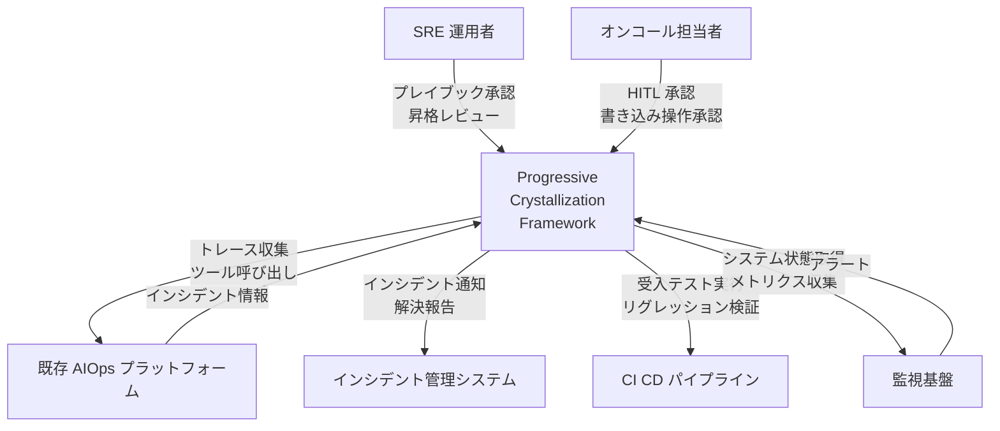
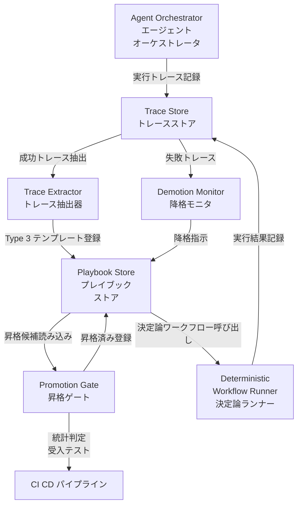
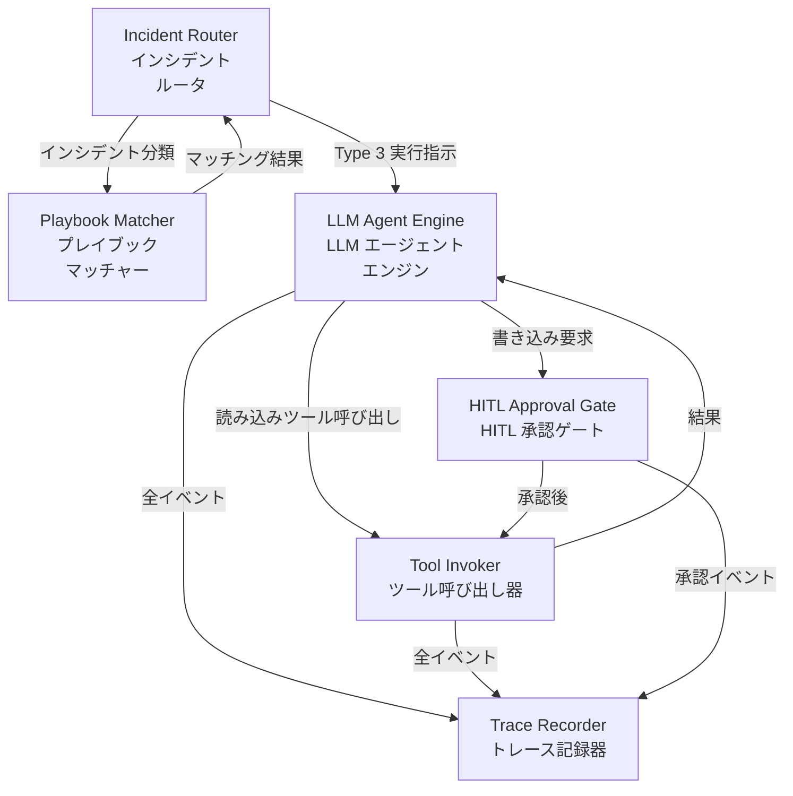
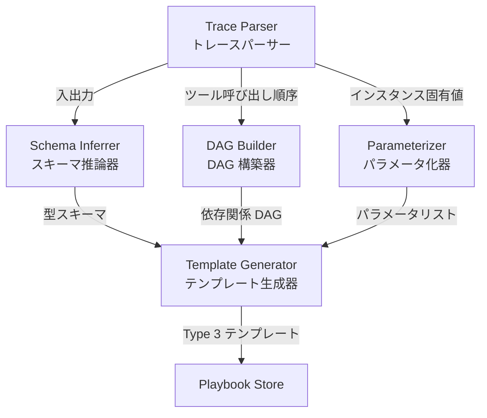
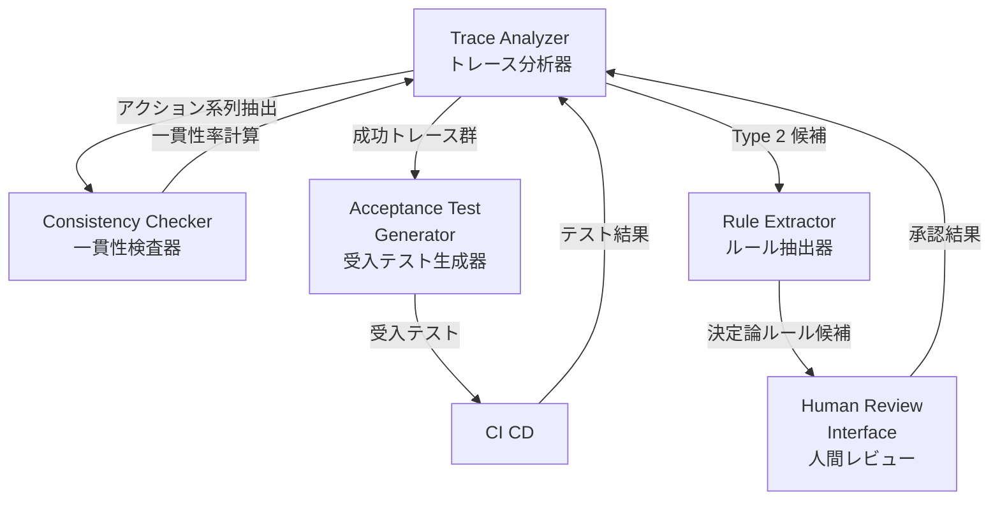
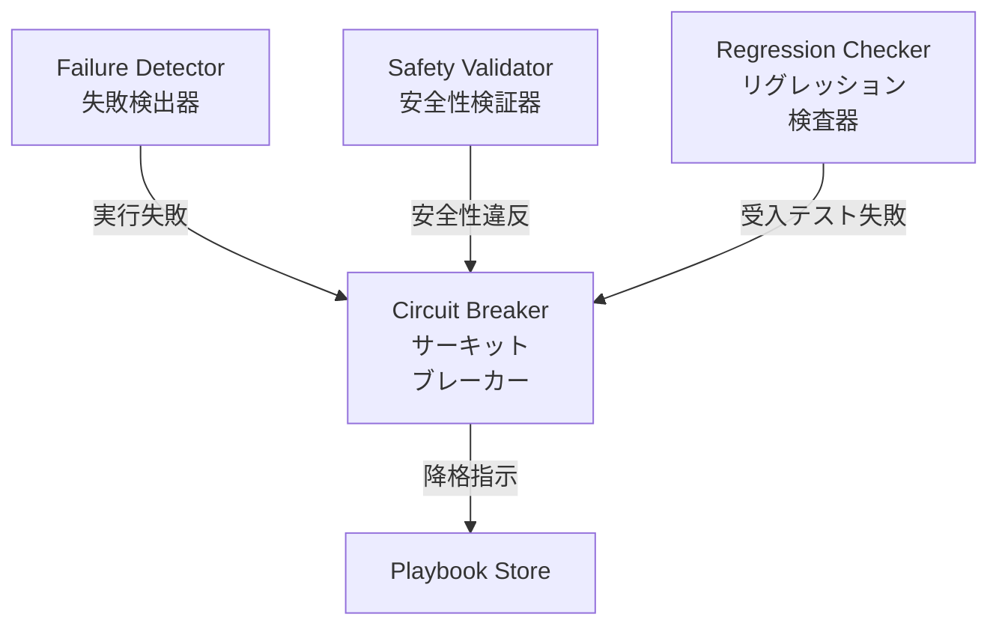
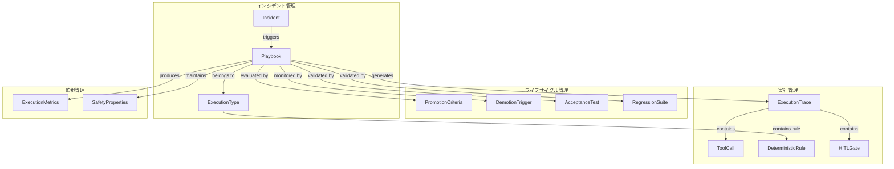
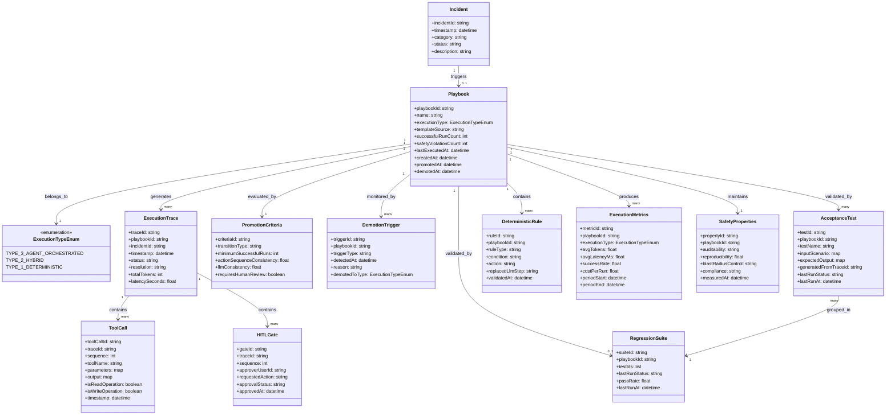

> 対象: arXiv:2607.07052 "Progressive Crystallization: Turning Agent Exploration into Deterministic, Lower-Cost Workflows in Production"（Arun Malik、2026-07-08 投稿、cs.SE）
> 本記事は論文が提案する運用ライフサイクルを技術調査として構造化したものです。論文は方法論を提示し参照実装を持たないため、構築方法・利用方法のコード例は論文の意図を反映した**実装案**であり、補完元を明示します。

LLM エージェントを IT 運用に常時投入すると、便利さと引き換えに「永続的なコストセンター」を抱えます。同じインシデントが再発するたびに、毎回フル推論のトークン代を払い続けるからです。この論文は、その構造を「エージェント探索は発見の手段であって、実行の本体ではない」と捉え直し、検証済みの挙動を段階的に決定論ワークフローへ**結晶化（crystallize）**していく運用ライフサイクルを提案します。

## 概要

### 解決する問題

エージェントは毎回のインシデント対応で完全な LLM 推論を実行します。同じ問題が繰り返し発生しても、毎回数千〜数万トークンを消費します。この構造には次の課題があります。

- **線形コスト増加**: インシデント量に比例したトークン消費
- **非決定論的実行**: 同じ問題でも毎回異なる調査パス
- **知識の破棄**: 成功した調査結果の未活用（次回発生時に同コストで再発見）
- **再現性の欠如**: 監査・デバッグの困難

論文は既存手段の限界も指摘します。従来のワークフローエンジンは新規シナリオを扱えず、自動化ごとにエンジニアリングスプリントを要します。制約のないエージェントは安価になりません。ファインチューニングは決定論ワークフローではなく小さい確率モデルを生みます。記録マクロや RPA は表層アクションのみを捉え、推論やデータフローを捉えず環境変化に脆弱です。

### 提案手法の位置づけ

Progressive Crystallization は、エージェントの探索的挙動を**発見メカニズム**として扱い、検証済みの挙動を段階的に決定論ワークフローへ昇格させるライフサイクルです。エージェントが発見・検証した挙動を、ランタイムでゼロトークンで動く決定論ワークフローへ体系的に変換します。エージェント層は真に新規な問題のために残ります。時間経過とともに次を実現します。

- **コスト削減**: トークン消費ゼロの決定論的実行への移行
- **高速化**: ミリ秒単位の実行時間
- **安全性向上**: 完全な再現性と監査可能性

論文の 4 つの貢献は、実行タイプタクソノミー、昇格・降格ライフサイクル、経済モデル、安全単調性の議論と本番実証です。

### 適用範囲

本手法は**繰り返しパターンが存在する運用環境**に適します。クラウドネットワーク運用のような大規模 IT 環境では、月に数万件のインシデントが発生しますが、その多くは既知パターンの変形です。

- 同種インシデントが繰り返し発生する環境
- トレース記録が構造化されている環境
- 新規パターンと既知パターンが混在する環境

逆に、完全に新規かつ一度限りのインシデントが大半を占める環境では効果は限定的です。ライフサイクル自体はドメイン非依存として設計されています。

## 特徴

### 3 段階実行タイプタクソノミー

運用プレイブックを 3 つの実行タイプで分類します。プレイブックは証拠の蓄積に応じて、確率的（左）から決定論的（右）へ昇格します。

| 要素名 | 説明 |
|--------|------|
| Type 3: Agent-orchestrated | 決定論的チェックポイントと HITL（Human-In-The-Loop）ゲートを伴う境界内調査。読み取りは自律実行、書き込みは HITL 承認。決定論性 約50%、トークン 10,000〜50,000、完了は秒〜分 |
| Type 2: Hybrid | 固定ステップ構造。LLM は解釈・分類・要約のみ担当。全アクションが型付き・スキーマ検証済み。決定論性 約90%、トークン 1,000〜5,000 |
| Type 1: Deterministic | 事前コード化ロジック・条件分岐・型付き API 呼び出し。ランタイムに LLM を使わない。決定論性 100%、トークン ゼロ、完了はミリ秒 |

3 つのタイプは別々のシステムではなく、同一の発見済み挙動のライフサイクル段階です。LLM は「何をするか」ではなく「理解」を担当します。

### 4 段階クリスタライゼーションライフサイクル

プレイブックは証拠の蓄積に応じて、より確率的なタイプからより決定論的なタイプへ段階的に昇格します。

| 要素名 | 説明 |
|--------|------|
| Stage 1: Discovery | 一致プレイブックのない新規インシデントによる Type 3 起動。読み取りは自律、書き込みは承認待ち。完全な実行トレースの記録 |
| Stage 2: Capture | 検証済み成功パスの Type 3 テンプレート抽出。順序付きツール呼び出しへの分解、分岐条件の検出、入出力スキーマの推論、ツール依存の有向非巡回グラフ（DAG）構築、インスタンス固有値（デバイス ID・タイムスタンプ）のパラメータ化、人手承認ポイントの明示ゲート化 |
| Stage 3: Promotion to Hybrid | 繰り返し成功後、一貫分類の LLM ステップの決定論ルール化、変動推論だが安定結果のステップのスコープ化単目的プロンプト化。成功トレースからの受入テスト自動生成と Type 2 候補の通過必須 |
| Stage 4: Promotion to Deterministic | LLM 不一致のないハイブリッド実行をさらに重ねた後、有限集合出力やルール化可能な決定境界を持つ残りの LLM ステップの決定論的等価物への置換。最終 Type 1 はランタイムトークンゼロで Stage 3 の受入テストにより継続検証 |

### エビデンスベースの昇格基準

昇格は次の基準（論文 Table II、デフォルト値・設定可能）でゲート制御されます。

| 移行 | 要件 |
|------|------|
| Type 3 → 2 | 成功実行 10 回以上、安全性違反ゼロ、同一アクション系列 90% 以上、自動生成受入テスト全合格、直近ウィンドウでの人手上書きなし |
| Type 2 → 1 | 成功ハイブリッド実行 50 回以上、LLM 分類一貫性 99% 以上、決定論ルールによる観測入力全体のカバー、LLM なしでの完全リグレッションスイート合格、決定論ロジックの人手レビュー |

重要な設計原則として、**自律性はモデルの能力ではなく、特定のプレイブッククラスとアクションタイプの証拠に基づいて付与**されます。より高性能なモデルでも、実績がなければ自動的に高い自律性を得ません。

### 自動降格メカニズム

クリスタライゼーションは一方向ではありません。各昇格済みプレイブックは監視され、次の条件でサーキットブレーカーがより高い実行タイプへ自動降格します。

- 実行失敗
- 安全性違反
- 受入テスト回帰

実例として、ファームウェア更新でコマンド出力形式が変更された際、決定論パーサが失敗しました。システムは自動的にプレイブックをハイブリッドへ降格し、LLM が新形式を処理できるようにしました。一連のクリーンな実行後、再昇格されました。完全に新規のインシデントは常に Type 3 として開始されるため、発見パイプラインは閉じません。

### 経済モデル

本手法の経済的特性は、個別実行のコストではなく**実行タイプの混合比率の時間的変化**にあります。繰り返しパターンが結晶化するにつれ、プラットフォームは各リクエストをそのパターンに利用可能な最低コストタイプへルーティングします。結果として、自動化ボリュームが増加しても Type 1 実行の割合が増え、総推論コストは減少します。エージェント層は、すべての発生で課金される実行エンジンではなく、発見コストが将来の決定論的実行全体に償却される発見メカニズムになります。

### 安全性の単調向上

クリスタライゼーションは、コスト削減と引き換えに安全性を犠牲にしません。追跡するすべての安全性プロパティを保持または向上させます。

| プロパティ | Type 3 | Type 2 | Type 1 | 傾向 |
|-----------|--------|--------|--------|------|
| 監査可能性 | 完全トレース | 完全トレース | 完全トレース | 保持 |
| 再現性 | 約 50% | 約 90% | 100% | 単調増加 |
| 爆発半径制御 | HITL ゲート | スキーマ検証 | 決定論的ロジック | 強化（事後検出から事前検証へ） |
| コンプライアンス | 条件付き | 組み込み | 組み込み | 強化 |

決定論的ロジックは実行前に静的検証できるため、実行中に捕捉する HITL ゲートより強い制御です。決定論的プレイブックは、抽出元のエージェント実行よりも検証・再現・監査が容易です。なお、実行タイプの「決定論性」（Table I）と安全性の「再現性」（Table III）は論文上は別概念ですが、いずれも近似値として 50%/90%/100% が置かれています。

### 本番環境での実証結果

月に数万件のインシデントを処理するクラウドネットワーク運用の本番エージェントプラットフォームで、8 ヶ月間評価されました。

- **決定論的実行への移行**: 開始時はほぼ全実行が Type 3。8 ヶ月後に Type 1 が約 45%、Type 2 が約 30%、Type 3 が約 25% に推移。Type 1:2:3 比率はプラットフォーム成熟度の有用な指標
- **コストとボリュームの逆相関**: per-incident エージェントコストの 70% 以上削減と、同時のインシデントボリューム約 2 倍増加。学習済み作業への推論コスト不払いによる、処理量増加に伴う低コスト化
- **自律性と品質の維持**: 一般的なインシデントカテゴリの 90% 以上の自律解決、平均解決時間（MTTR）の数時間から数分への短縮、偽陽性修復率 5% 未満で顧客影響なし

### 類似アプローチとの比較

| アプローチ | 実行コスト | 再現性 | 新規パターン対応 | 主な課題 |
|-----------|----------|--------|---------------|---------|
| **Progressive Crystallization（本手法）** | 時間経過で減少（Type 3→1） | 時間経過で向上（50%→100%） | Type 3 で常時対応 | 繰り返しパターンとトレース記録基盤の必要 |
| 純エージェント常時実行 | 高（毎回 LLM 推論） | 低（非決定論的） | 優れる | 線形コスト増加 |
| RPA・静的自動化 | 最低（スクリプト実行） | 最高（完全決定論） | なし（人手作成） | 新規パターン非対応、環境変化への脆弱性 |
| FrugalGPT（モデルカスケード・ルーティング） | 中（推論単価を下げる） | 低（確率的のまま） | 優れる | 解決済み問題での推論の残存 |
| Fine-tuning / 蒸留 | 中（小モデル推論） | 中（確率的） | 訓練データ範囲内 | 決定論ワークフローの非生成 |

本手法の貢献は FrugalGPT 等と直交・補完的です。各推論を安くするのではなく、実証済みの作業から決定論ワークフローを抽出して推論そのものを除去します。抽出ステップはプロセスマイニング（イベントログからプロセスモデルを復元する手法）を土台にし、ここではイベントログがエージェント実行トレース、復元モデルが実行可能プレイブックです。

## 構造

提案フレームワークを C4 モデルで 3 段階に示します。以下の C4 図は論文の方法論から導いた著者解釈であり、論文本体に掲載された図ではありません。論文は具体的な実装を記述しないため、構造は論理コンポーネント間の関係に焦点を当てます。

### システムコンテキスト図

提案フレームワークと外部システム・アクターの関係を示します。



| 要素名 | 説明 |
|--------|------|
| SRE 運用者 | プレイブック昇格判定のレビューと決定論ワークフロー最終ロジックの承認 |
| オンコール担当者 | Type 3 実行時の書き込み操作への HITL 承認 |
| Progressive Crystallization Framework | エージェント探索を決定論ワークフローへ昇格させるライフサイクルの実行本体 |
| 既存 AIOps プラットフォーム | エージェントによるツール経由の調査・操作の既存基盤 |
| インシデント管理システム | インシデントの登録・追跡・解決報告の管理 |
| CI/CD パイプライン | プレイブック昇格時の受入テスト実行とリグレッション検証 |
| 監視基盤 | システム状態・メトリクス・アラートの提供 |

### コンテナ図

提案フレームワークの主要構成要素を示します。



| 要素名 | 説明 |
|--------|------|
| Agent Orchestrator | Type 3 実行の統括、エージェントへのツール呼び出し・承認ゲートの提供、全実行トレースの記録 |
| Trace Extractor | 成功トレースからのツール呼び出し順序・分岐条件・スキーマ・依存関係の抽出と Type 3 テンプレート生成 |
| Promotion Gate | 統計的判定（成功回数・一貫性閾値・安全性違反ゼロ）と受入テストによる Type 3→2→1 の昇格判定 |
| Deterministic Workflow Runner | Type 1・Type 2 プレイブックの実行によるゼロ・最小トークンでのインシデント解決 |
| Demotion Monitor | 実行失敗・安全性違反・受入テスト回帰の検知とサーキットブレーカーによる降格 |
| Playbook Store | Type 1・2・3 プレイブックとメタデータ（成功回数・昇格履歴・受入テスト）の永続化 |
| Trace Store | 全実行タイプのトレース（ツール呼び出し・入出力・分岐・承認）の永続化と抽出・分析・監視への提供 |

### コンポーネント図

主要コンテナの内部構成を示します。ここでは代表的な補完ツール名を具体例として含めます。

#### Agent Orchestrator の詳細



| 要素名 | 説明 |
|--------|------|
| Incident Router | 新規インシデントの受け取りと適切な実行タイプへのルーティング |
| Playbook Matcher | インシデント特徴と既存プレイブックの照合、最低コスト実行タイプの選択、未マッチ時の Type 3 発見への回送 |
| LLM Agent Engine | Type 3 実行時の ReAct ループによるツール呼び出しと推論の反復 |
| Tool Invoker | システムツール（SSH・API クライアント・診断スクリプト・修復コマンド）の呼び出し。例: Ansible・Terraform・kubectl |
| HITL Approval Gate | 書き込み操作への人間承認の待機と承認後の Tool Invoker への委譲。例: PagerDuty・Slack と統合 |
| Trace Recorder | 全イベントの構造化ログ記録と Trace Store への永続化。例: OpenTelemetry で実装可能 |

#### Trace Extractor の詳細



| 要素名 | 説明 |
|--------|------|
| Trace Parser | 実行トレースからの個別ツール呼び出し・分岐条件・承認ポイントの抽出と構造化 |
| Schema Inferrer | 各ステップ入出力からの型スキーマ推論（Type 2 の型検証の基礎） |
| DAG Builder | ツール呼び出し間の依存関係の解析と有向非巡回グラフの構築（プロセスマイニング手法を適用可能） |
| Parameterizer | インスタンス固有値（デバイス ID・タイムスタンプ・IP アドレス）のテンプレート変数化 |
| Template Generator | 各出力の統合と再利用可能な Type 3 テンプレートの生成 |

#### Promotion Gate の詳細



| 要素名 | 説明 |
|--------|------|
| Trace Analyzer | 複数成功トレースからのアクション系列・分岐条件・LLM 推論箇所の抽出と昇格基準（Table II）の評価 |
| Consistency Checker | トレース群のアクション系列比較と一貫性率（90%・99%）の計算、決定論化候補の識別 |
| Acceptance Test Generator | 成功トレースからの入出力ペア抽出と、昇格後の同一結果を検証するテストの自動生成 |
| Rule Extractor | Type 2→1 昇格時の LLM 分類ステップの出力集合・決定境界の分析と決定論ルールへの変換 |
| Human Review Interface | Type 2→1 昇格時の最終決定論ロジックの SRE レビューと承認・差し戻し |

#### Demotion Monitor の詳細



| 要素名 | 説明 |
|--------|------|
| Failure Detector | Type 1・2 プレイブックの実行失敗（エラー・タイムアウト・解決不能）の検出 |
| Safety Validator | 実行中の安全性違反（不正な書き込み・スキーマ違反・blast-radius 超過）の検出 |
| Regression Checker | 昇格済みプレイブックへの受入テスト再実行と環境変化（ファームウェア更新・API 変更）による新規失敗の捕捉 |
| Circuit Breaker | 失敗・違反・リグレッション通知による 1 段階降格と降格後の再昇格証拠蓄積の待機 |

## データ

論文には明示的な ER 図はありませんが、登場する概念を抽出してデータモデルを構築します。以下のモデルは著者による構成であり、論文本体の記載ではありません。

### 概念モデル



| 要素名 | 説明 |
|--------|------|
| Incident | ネットワーク運用で発生するインシデント（障害） |
| Playbook | インシデント解決手順の実行可能ワークフロー |
| ExecutionType | 実行タイプ（Type 3 / Type 2 / Type 1） |
| ExecutionTrace | エージェント実行の完全な記録 |
| ToolCall | トレース内の個別ツール呼び出し |
| HITLGate | Human-in-the-loop の承認ポイント |
| PromotionCriteria | より低コストな実行タイプへの昇格基準 |
| DemotionTrigger | より高コストな実行タイプへの降格トリガ |
| AcceptanceTest | 成功トレースから自動生成される受入テスト |
| RegressionSuite | 決定論ワークフローの回帰テストスイート |
| DeterministicRule | LLM 推論を置き換える決定論ルール |
| ExecutionMetrics | トークンコスト・レイテンシ・成功率などの実行メトリクス |
| SafetyProperties | 監査可能性・再現性・爆発半径制御・コンプライアンスの安全性特性 |

### 情報モデル



| クラス名 | 説明 |
|----------|------|
| Incident | ネットワーク運用のインシデント。カテゴリとステータスでの管理 |
| Playbook | インシデント解決手順。ExecutionType（Type 3→2→1）のライフサイクル遷移 |
| ExecutionTypeEnum | 実行タイプの列挙型 |
| ExecutionTrace | エージェント実行の完全な記録。ToolCall と HITLGate の順序付きリストを包含 |
| ToolCall | トレース内の個別ツール呼び出し。読み取りは自律、書き込みは承認が必要 |
| HITLGate | Type 3 実行時の Human-in-the-loop 承認ポイント。書き込み操作の前段に配置 |
| PromotionCriteria | Type 3→2 または Type 2→1 の昇格基準。成功回数・一貫性・テスト合格・人手レビューの閾値定義 |
| DemotionTrigger | 実行失敗・安全性違反・テスト回帰時の降格トリガ。サーキットブレーカーとしての動作 |
| AcceptanceTest | 成功トレースから自動生成される受入テスト。昇格前の合格が必須 |
| RegressionSuite | 決定論 Playbook の回帰テストスイート。複数 AcceptanceTest のグループ化 |
| DeterministicRule | LLM 推論を置き換える決定論ルール。Type 2 では分類ルール、Type 1 では完全な制御フロー |
| ExecutionMetrics | トークンコスト・レイテンシ・成功率などの実行メトリクス。期間単位での集計 |
| SafetyProperties | 監査可能性・再現性・爆発半径制御・コンプライアンスの安全性特性 |

論文に明示されない属性は、論文記述からの推測または既存実装からの補完です。`templateSource`（Stage 2 の抽出元）、`ToolCall.parameters/output`（トレースから推論するスキーマ付き入出力）、`DeterministicRule.condition/action`（「決定論的等価物」の具体スキーマは未記載）、`SafetyProperties` の各属性（Table III の定性記述を定量化）が該当します。

## 構築方法

本論文は方法論のみを提示し参照実装を持ちません。以下は論文の意図を反映した**実装案**であり、補完に用いた OSS・ツールを各項目と参考リンクに明示します。導入は「トレース記録 → テンプレート抽出 → 昇格ゲート → 受入テスト → 降格モニタ → 決定論ランナー」の順で積み上げます。

### 前提条件

| 前提 | 内容 | 補完に使えるツール例 |
|------|------|--------------------|
| 構造化トレース記録 | 全ツール呼び出し・入出力・分岐・承認イベントの構造化ログ基盤 | OpenTelemetry、構造化 syslog、JSON ログ |
| 繰り返しパターンの存在 | 同種インシデントが反復する運用ドメイン | — |
| 受入テスト自動化の土台 | トレースからのテスト生成と CI 実行の基盤 | pytest、GitHub Actions |

論文は「疎または構造化されていないログは結晶化を制限する」と述べています。トレース記録の品質が導入の成否を左右します。

### トレース記録の整備

Type 3 実行の全イベントを構造化して記録します。読み取り操作は自律実行し、書き込み操作は承認ゲートを挟みます（Stage 1）。以下は OpenTelemetry を補完に用いた実装案です。

```python
# 実装案: エージェント実行トレースの構造化記録（OpenTelemetry を補完利用）
from opentelemetry import trace
from datetime import datetime, timezone

tracer = trace.get_tracer("agent.playbook")

def record_tool_call(incident_id, tool_name, params, output, is_write):
    with tracer.start_as_current_span(tool_name) as span:
        span.set_attribute("incident.id", incident_id)
        span.set_attribute("tool.name", tool_name)
        span.set_attribute("tool.is_write", is_write)
        span.set_attribute("tool.params", str(params))
        span.set_attribute("tool.output", str(output))
        span.set_attribute("ts", datetime.now(timezone.utc).isoformat())
```

### Type 3 テンプレート抽出器の実装

成功トレースから再利用可能な Type 3 テンプレートを抽出します。論文の抽出アルゴリズムは「順序付きツール呼び出しリスト化 → 分岐条件検出 → ステップごとの入出力スキーマ推論 → ツール依存の DAG 構築 → インスタンス固有値のパラメータ化 → 人手承認ポイントの明示ゲート化」で構成されます（Stage 2）。DAG 構築とプロセスモデル復元には、論文が引用する van der Aalst のプロセスマイニング手法を補完利用でき、OSS では `pm4py` が使えます。

```python
# 実装案: 成功トレースからの Type 3 テンプレート抽出
def extract_template(trace):
    steps = [{"tool": c["tool"], "in": c["params"], "out": c["output"]}
             for c in trace["tool_calls"]]
    dag = build_dependency_dag(steps)                       # ツール依存の DAG
    schemas = {s["tool"]: infer_schema(s) for s in steps}   # I/O スキーマ推論
    params = parameterize(steps)                            # device_id / timestamp を変数化
    gates = [i for i, c in enumerate(trace["tool_calls"]) if c["is_write"]]
    return {
        "type": 3,
        "steps": steps,
        "dag": dag,
        "schemas": schemas,
        "parameters": params,        # 例: $DEVICE_ID, $TIMESTAMP
        "approval_gates": gates,     # 人手承認ポイント
    }
```

### 昇格ゲートの実装

論文 Table II のデフォルト昇格基準を設定として外出しします。閾値は設定可能です。

```yaml
# 実装案: 昇格基準の設定（論文 Table II のデフォルト値）
promotion_criteria:
  type3_to_type2:
    min_successful_runs: 10
    max_safety_violations: 0
    min_action_sequence_consistency: 0.90   # 90% が同一アクション系列
    acceptance_tests_pass_rate: 1.0          # 全受入テスト合格
    max_human_overrides_recent: 0            # 直近ウィンドウで人手上書きゼロ
  type2_to_type1:
    min_successful_hybrid_runs: 50           # 50 回以上
    min_llm_classification_consistency: 0.99 # LLM 分類一貫性 99% 以上
    deterministic_rule_covers_all_inputs: true
    full_regression_suite_passes_without_llm: true
    requires_human_review: true              # 決定論ロジックの人手レビュー
```

昇格判定は蓄積した証拠で行います。自律性はモデルの能力ではなく特定プレイブックの実績に付与されます。

```python
# 実装案: Type 3 -> 2 昇格判定
def can_promote_to_hybrid(stats, criteria):
    c = criteria["type3_to_type2"]
    return (
        stats["successful_runs"] >= c["min_successful_runs"]
        and stats["safety_violations"] == 0
        and stats["action_sequence_consistency"] >= c["min_action_sequence_consistency"]
        and stats["acceptance_tests_pass_rate"] >= c["acceptance_tests_pass_rate"]
        and stats["human_overrides_recent"] <= c["max_human_overrides_recent"]
    )
```

### 受入テストの自動生成と CI 連携

成功トレースの入出力ペアから受入テストを自動生成し、CI で回します（Stage 3）。

```python
# 実装案: 成功トレースから pytest 受入テストを生成
def generate_acceptance_tests(traces, playbook_id):
    cases = [{"input": t["initial_input"], "expected": t["resolution"]} for t in traces]
    body = "\n".join(
        f"def test_{playbook_id}_{i}():\n"
        f"    assert run_playbook('{playbook_id}', {c['input']}) == {c['expected']!r}\n"
        for i, c in enumerate(cases)
    )
    with open(f"tests/acceptance/test_{playbook_id}.py", "w") as f:
        f.write(body)
```

```yaml
# 実装案: 昇格候補プレイブックの受入テストを CI で回す（GitHub Actions）
name: playbook-acceptance
on: [workflow_dispatch]
jobs:
  acceptance:
    runs-on: ubuntu-latest
    steps:
      - uses: actions/checkout@v4
      - run: pip install pytest
      - run: pytest tests/acceptance -q   # 全合格が Type 3 -> 2 昇格の必須条件
```

### 決定論ワークフローランナーの実装

Type 2→1 昇格時に、有限集合出力やルール化可能な決定境界を持つ LLM ステップを決定論ロジックへ置換します（Stage 4）。typed action の実体には Ansible・Terraform・kubectl・クラウド SDK を、決定論ワークフローエンジンには Temporal や Airflow を補完利用できます。

```python
# 実装案: LLM 分類ステップを決定論ルールへ置換した Type 1 実行
def classify_error_deterministic(log_output):
    # 元は LLM が分類していたが、観測入力を全カバーする規則へ置換
    if "connection timeout" in log_output:
        return "network_timeout"
    if "permission denied" in log_output:
        return "auth_error"
    return "unknown"   # unknown は昇格対象外。Type 3 探索へ回す

def run_type1_playbook(incident):
    category = classify_error_deterministic(incident.logs)  # zero token
    action = DETERMINISTIC_ACTIONS[category]                # typed API 呼び出し
    return execute_typed_action(action, incident)
```

## 利用方法

結晶化ライフサイクルの日常運用オペレーションを説明します。運用は「新規は探索、既知は最低コストへルーティング」という一貫した流れで回します。以下の CLI 例（`pcx`）は実装案です。

### 主要オペレーションの必須パラメータ

| オペレーション | 必須パラメータ | 説明 |
|--------------|--------------|------|
| インシデント投入 | `incident_id`, `category` | ルーティングの起点 |
| テンプレート抽出 | `trace_id` | 抽出元の成功トレース |
| 昇格実行 | `playbook_id`, `target_type` | 昇格対象と遷移先 |
| 比率確認 | `period` | 集計期間 |

### 新規インシデントの探索（Type 3）

パターン未マッチのインシデントを Type 3 探索へルーティングします。発見パイプラインは常に開いた状態を保ちます。

```python
# 実装案: インシデントを最低コストの実行タイプへルーティング
def route_incident(incident):
    playbook = find_matching_playbook(incident)   # Type 1/2/3 のいずれか
    if playbook:
        return execute_playbook(playbook, incident)   # 最低コスト型で解決
    return execute_agent_exploration(incident)        # 新規 -> Type 3 探索
```

### 成功トレースの capture と昇格

解決が検証できたトレースをテンプレート化し、証拠が基準に達したら昇格します。Type 2→1 では決定論ロジックの人手レビューが必須です。

```bash
# 実装案: 成功トレースを Type 3 テンプレートへ capture
pcx capture --trace-id trace-98765 --playbook-id net-restart-svc

# 昇格候補を一覧表示
pcx promotions list --status eligible

# Type 3 -> 2 昇格（受入テスト全合格が前提）
pcx promote --playbook-id net-restart-svc --to hybrid

# Type 2 -> 1 昇格（人手レビュー承認が前提）
pcx promote --playbook-id net-restart-svc --to deterministic --require-review
```

### 成熟度メトリクス（Type 1:2:3 比率）の確認

実行タイプの混合比率はプラットフォーム成熟度の指標です。本番環境では 8 ヶ月で Type 1 が 0% から約 45%、Type 2 が約 30%、Type 3 が約 25% へ推移しました。

```bash
# 実装案: 月次の成熟度比率とコスト推移を確認
pcx metrics ratio --period 2026-07
pcx metrics cost  --period 2026-07   # per-incident コスト推移
```

## 運用

Progressive Crystallization を本番環境で運用する際の実践を説明します。

### トレース抽出の運用

実行トレースの抽出品質が結晶化の成否を左右します。

- **完全なトレースの記録**: Type 3 実行での全ツール呼び出し・分岐条件・入出力スキーマ・承認ポイントのキャプチャ
- **パラメータ化**: インスタンス固有値の自動パラメータ化による再利用可能なテンプレート生成
- **依存関係グラフの構築**: ツール間依存の有向非巡回グラフ（DAG）としての抽出

```python
# トレース抽出の概念例
trace = {
    "execution_id": "inc-12345",
    "steps": [
        {"tool": "get_device_status", "input": {"device_id": "$DEVICE_ID"}, "output": {}},
        {"tool": "analyze_logs", "input": {"logs": "$LOGS"}, "output": {}},
        {"tool": "restart_service", "input": {"service": "$SERVICE_NAME"}, "approval_required": True},
    ],
    "dag": {"get_device_status": [], "analyze_logs": ["get_device_status"], "restart_service": ["analyze_logs"]},
}
```

### 降格の運用

降格メカニズムは、結晶化されたワークフローが予期しない変化に適応するための要素です。各昇格済みプレイブックは監視され、実行失敗・安全性違反・受入テスト回帰でサーキットブレーカーが自動降格します。本番では、ファームウェア更新がコマンド出力形式を変えた際に決定論パーサが失敗し、システムがハイブリッドへ自動降格して即時復旧しました。

```python
# 降格トリガーの概念例
def circuit_breaker(execution):
    if execution.failed:
        demote_playbook(execution.playbook_id, reason="execution_failure")
    elif execution.safety_violation:
        demote_playbook(execution.playbook_id, reason="safety_violation")
    elif not acceptance_tests_pass(execution.playbook_id):
        demote_playbook(execution.playbook_id, reason="acceptance_test_regression")
```

### 本番メトリクスの監視

プラットフォームの成熟度と経済性を追跡する主要指標です。

Type 1:2:3 比率は成熟度指標として機能します。

```python
# メトリクス計算の概念例
def calculate_type_ratio(executions):
    total = len(executions) or 1
    type1 = len([e for e in executions if e.type == "deterministic"])
    type2 = len([e for e in executions if e.type == "hybrid"])
    type3 = len([e for e in executions if e.type == "agent"])
    return {"type1_ratio": type1 / total, "type2_ratio": type2 / total, "type3_ratio": type3 / total}
```

per-incident コストと品質の指標は次のとおりです。

- **コスト**: Type 3（10,000〜50,000 トークン、秒〜分）、Type 2（1,000〜5,000 トークン）、Type 1（ゼロトークン、ミリ秒）。本番実績では 8 ヶ月でインシデント量が約 2 倍でも per-incident コストは 70% 以上削減
- **品質**: 一般的なインシデントカテゴリの 90% 以上の自律解決、MTTR の数時間から数分への短縮、偽陽性修復率 5% 未満

安全性メトリクスは次のとおりです。

| 属性 | Type 3 | Type 2 | Type 1 |
|------|--------|--------|--------|
| 監査可能性 | フルトレース | フルトレース | フルトレース |
| 再現性 | 〜50% | 〜90% | 100% |
| 爆発半径制御 | HITL ゲート | スキーマ検証 | 決定論的ロジック |
| コンプライアンス | 条件付き | ビルトイン | ビルトイン |

## ベストプラクティス

論文の知見と補強情報から導かれる運用上の推奨事項です。

### 閾値較正

論文は「特定の閾値と比率は他の環境で再導出すべき」と明示しています。デフォルト閾値（10 回以上成功・90% 以上一貫性など）を全環境に流用しないでください。

- 本番導入前の、自組織のヒストリカルノイズとパターン安定性の測定
- 初期の保守的な閾値（例: 20 回以上成功、95% 以上一貫性）からの段階的緩和
- 過去データからのベースライン確立と、偽陽性率・真陽性率のトレードオフ分析

### 適用条件の認識

論文は「反復パターンを前提とするため、真に新規で一回限りのインシデントが支配的な環境では効果が小さい」と述べています。

- **高頻度反復ドメインで効果大**: ネットワーク運用、クラウドインフラ、定型的なインシデント対応
- **低頻度・一回限りドメインでは慎重に**: 新製品開発、研究プロジェクト、非定型業務での Type 3 主体
- **混合戦略**: 定型の結晶化と、新規の探索パイプラインの常時開放

### 安全単調性の保証

決定論化で安全性が単調に向上します。監査可能性は全タイプでフルトレース、再現性は 50%→90%→100% と単調増加、爆発半径制御は HITL ゲート→スキーマ検証→静的検証可能な決定論ロジックへ強化、コンプライアンスは条件付き→ビルトインへ移行します。昇格前の安全性プロパティの向上検証、決定論ロジックの静的解析による実行前の危険操作検出、降格メカニズムの常時有効化を推奨します。

### トレース品質の確保

トレースの豊富さと構造が結晶化品質を決定します（プロセスマイニングの既知の依存性）。構造化ログ（JSON・OpenTelemetry）の標準化、ツール呼び出し・入出力・分岐条件・承認イベントの網羅的記録、インシデント ID・実行 ID・相関 ID によるトレース可能性を確保します。

```json
{
  "execution_id": "exec-98765",
  "incident_id": "inc-12345",
  "timestamp": "2026-07-10T09:30:00Z",
  "tool": "analyze_logs",
  "input": {"log_source": "/var/log/app.log", "pattern": "ERROR"},
  "output": {"matched_lines": 42, "error_type": "connection_timeout"},
  "duration_ms": 1230,
  "decision": "restart_service",
  "approval_required": false
}
```

### 人間レビューの組み込みと段階的ロールアウト

観測不足のパターンは早期昇格されうるため、降格と最終決定論ロジックの人手レビューが設計の一部です。Type 2→1 昇格時のコードレビュー実施と、降格イベントの根本原因の定期分析を推奨します。導入は段階的に進めます。

1. **Phase 1（1〜2 ヶ月）**: 非クリティカルなカテゴリでの Type 3 のみ試験運用
2. **Phase 2（3〜4 ヶ月）**: Type 3→2 昇格の保守的閾値での開始
3. **Phase 3（5〜6 ヶ月）**: Type 2→1 昇格の開始と決定論ロジックの人手レビュー厳格化
4. **Phase 4（7〜8 ヶ月以降）**: 成熟期。Type 1:2:3 比率の目標値設定と継続最適化

## トラブルシューティング

| 症状 | 原因 | 対処 |
|------|------|------|
| 誤った昇格（過学習） | 観測不足パターンの早期昇格による稀ケースでの失敗 | 昇格閾値（最小成功回数）の引き上げ / 受入テストのエッジケース拡充 / 降格後の人手レビューでの根本原因分析 |
| 決定論ワークフローの回帰 | 環境変化（ファームウェア更新・API 変更）による決定論パーサの失敗 | サーキットブレーカーの自動ハイブリッド降格（即時復旧）/ 変更管理連携での事前影響評価 / 決定論ロジックの単体テスト継続実行 |
| 分類の非一貫性 | Type 2 での LLM 判断のばらつきによる Type 1 昇格ブロック | プロンプトの単一目的への精緻化 / 温度パラメータの引き下げ / 分類カテゴリの曖昧さ排除 |
| トレース抽出の欠損 | 疎なログによるツール呼び出し・分岐条件の欠落 | 構造化形式（JSON・OpenTelemetry）の採用 / ツール実装へのトレース出力強制 / 既存ログの後処理エンリッチ |
| Type 1:2:3 比率の停滞 | 新規パターン発見の少なさによる結晶化の停滞 | インシデント分類粒度の見直し / 類似パターンのグルーピング / 低頻度ドメインでないかの再評価 |
| 降格の頻発 | 受入テストの過度な厳格さ、または環境の不安定 | 受入テスト閾値の緩和 / ノイズ源の除去 / 降格トリガーログの分析 |
| コスト削減が期待以下 | 反復パターンの少なさ、または決定論化不能な複雑さ | ドメイン適合性の再評価 / Type 2 の最終形としての受容 / 経済モデルの期待値の現実化 |
| 安全性違反の増加 | 決定論ロジックのバグ、または爆発半径制御の不足 | 該当プレイブックの即降格・無効化 / 静的解析とコードレビューの再実施 / Type 1 昇格前の承認ゲート厳格化 |

運用のベストプラクティスとして、全昇格・降格イベントと実行失敗・安全性違反の詳細ログ記録、Type 1:2:3 比率・コスト推移・降格頻度・品質メトリクスのダッシュボード可視化、降格頻発・安全性違反・コスト目標未達時の自動アラート、月次での運用メトリクスと降格ログのレビューを推奨します。

## 限界と妥当性への脅威

導入判断の前に、論文が自ら述べる限界（Section IX）を押さえておくと過大評価を避けられます。

| 観点 | 限界の内容 | 実務での読み替え |
|------|-----------|----------------|
| 外部妥当性 | 結果は単一組織・単一運用ドメイン由来。特定の閾値・比率は他環境で再導出が必要 | 数値はそのまま流用せず、自組織のデータで較正する。移植可能なのはライフサイクル構造のみ |
| 適用前提 | 繰り返しパターンの存在が前提。一回限りのインシデントが支配的だと大半が Type 3 のまま | 高頻度反復ドメインから着手し、ROI を測ってから拡大する |
| 内部妥当性 | 経済的数値はプラットフォームレベルの観測であり、対照実験ではない。8 ヶ月は単一の成熟軌跡 | 「70% 削減」を因果保証と読まない。自組織で before/after を計測する |
| 昇格品質 | 自動昇格はトレースから生成した受入テストの品質に依存。観測不足パターンの早期昇格リスク | 降格メカニズムと最終ロジックの人手レビューを必須の安全弁として残す |
| 抽出品質 | 疎・非構造ログは結晶化を制限（プロセスマイニングと同じ依存性） | 構造化トレースへの先行投資を、導入の前提条件として扱う |

単一著者・単一組織の事例報告である点を踏まえ、本手法は「万能の効率化」ではなく「反復性の高い運用を対象とした成熟度設計のパターン」として受け止めるのが妥当です。

## まとめ

Progressive Crystallization は、エージェント探索を「発見の手段」と位置づけ、検証済みの挙動を Type 3（探索）→ Type 2（ハイブリッド）→ Type 1（決定論）へ証拠ベースで昇格し、退行時には自動降格する運用ライフサイクルです。本番のクラウドネットワーク運用では、8 ヶ月で決定論実行が 0% から約 45% へ増え、インシデント量が倍増しても per-incident コストが 70% 以上下がり、再現性・監査性という安全性も単調に向上しました。エージェント基盤を「永続的なコストセンター」で終わらせないための、実務に落とせる成熟度設計として参考になります。

この記事が少しでも参考になった、あるいは改善点などがあれば、ぜひリアクションやコメント、SNSでのシェアをいただけると励みになります！

## 参考リンク

- 一次論文（arXiv）
  - [Progressive Crystallization: Turning Agent Exploration into Deterministic, Lower-Cost Workflows in Production（Abstract）](https://arxiv.org/abs/2607.07052)
  - [Progressive Crystallization（HTML 全文）](https://arxiv.org/html/2607.07052v1)
  - [Progressive Crystallization（PDF）](https://arxiv.org/pdf/2607.07052)
- 関連論文（系譜）
  - [ReAct: Synergizing Reasoning and Acting in Language Models](https://arxiv.org/abs/2210.03629)
  - [Toolformer: Language Models Can Teach Themselves to Use Tools](https://arxiv.org/abs/2302.04761)
  - [FrugalGPT: How to Use Large Language Models While Reducing Cost and Improving Performance](https://arxiv.org/abs/2305.05176)
  - [The Rise and Potential of Large Language Model Based Agents: A Survey](https://arxiv.org/abs/2309.07864)
  - [A Survey of AIOps in the Era of Large Language Models](https://arxiv.org/abs/2507.12472)
  - [Autonomous Incident Resolution at Hyperscale（本論文の本番評価基盤）](https://arxiv.org/abs/2606.09122)
  - [Process Mining: Data Science in Action（抽出手法の土台）](https://link.springer.com/book/10.1007/978-3-662-49851-4)
- 関連ツール公式（実装案の補完元）
  - [OpenTelemetry 公式ドキュメント](https://opentelemetry.io/docs/)
  - [pm4py: プロセスマイニング Python ライブラリ](https://pm4py.fit.fraunhofer.de/)
  - [pytest 公式ドキュメント](https://docs.pytest.org/)
  - [Temporal: 決定論ワークフローエンジン](https://docs.temporal.io/)
