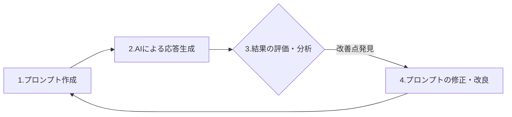
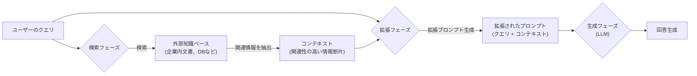
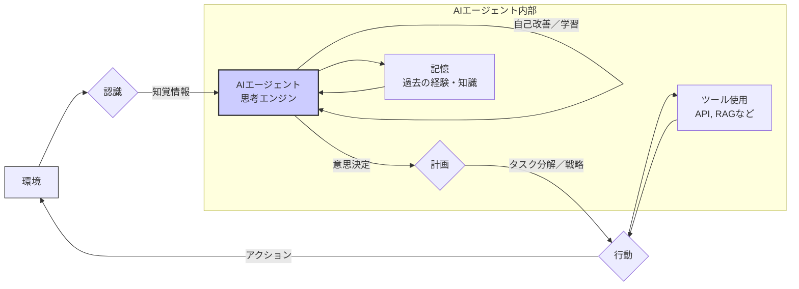
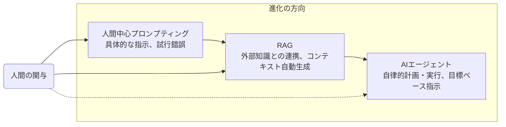
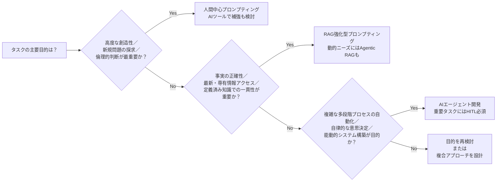

## 1. はじめに

生成AIの能力を最大限に引き出すために不可欠な**プロンプトエンジニアリング**。これは、AIモデルから望む出力を得るための入力（プロンプト）を設計し、洗練させる技術であり科学です。プロンプトの質がAIの成果に大きく影響するため、その重要性は日々増しています。AI技術に関わる開発者や企画者、あるいは最新のAIトレンドを深く理解したい方々にとって、本記事がプロンプトエンジニアリングの進化の全体像を掴む一助となれば幸いです。

この記事では、プロンプトエンジニアリングの主要な3つのアプローチを深掘りします。

* **人間中心のプロンプトエンジニアリング**: 人間の知性と試行錯誤によって進化する、従来の手動アプローチです。
* **検索拡張生成（RAG）**: 外部の知識ベースから情報を検索し、プロンプトを動的に強化するハイブリッドアプローチです。
* **AIエージェント**: 自律的なエージェントが、意思決定とタスク実行の一環としてプロンプトを内部で生成・管理・適応する、最先端のパラダイムです。

2025年は「AIエージェント元年」とも言われるように、AIはより自律的なシステムへと移行しつつあります（この表現は業界の一部で見られる期待感を示すものであり、具体的な出典や広範な合意に基づくものではない点にご留意ください）。この背景には、認知作業の自動化、そして状況を理解し自律的に行動するAIシステムへの需要の高まりがあります。

プロンプト作成は、当初人間がその主要な役割を担っていました。しかし、大規模言語モデル（LLM）の知識の限界や誤情報（ハルシネーション）を補うため、知識注入を自動化する**検索拡張生成（RAG）**が登場しました。さらに**AIエージェント**は、情報検索に加えて、計画立案、ツールの使用、自己修正といったタスクまでを自動化し、AIの自律性と洗練性を飛躍的に向上させています。

RAGやAIエージェントの進化が進んでも、人間の関与は依然として不可欠です。人間の役割は、高レベルな設計、戦略的な目標設定、倫理的なガバナンスへと変化していきます。特にAIエージェントにおいては、人間が目標や倫理的境界、利用可能なツールセットを定義する「**ヒューマン・イン・ザ・ループ（HITL）**」の考え方が極めて重要になります。

## 2. 人間中心のプロンプトエンジニアリング

人間中心のプロンプトエンジニアリングは、生成AIとの対話における最も基本的なアプローチです。これは、人間の創造性、直感、そして反復的な試行錯誤に深く依存しており、単に指示文を作成するだけでなく、AIとの「対話」を通じて望む結果に近づけていくプロセスです。

### 2.1. 概要

効果的な人間中心のプロンプトエンジニアリングは、主に以下のテクニックに基づいています。

* **明確性と具体性**
    * 直接的で曖昧さのない言葉を使い、AIの誤解を最小限に抑えます。
    * （例：「この記事を要約してください」ではなく、「この記事の主要なポイントに焦点を当て、3つの箇条書きで要約してください」と具体的に指示します。）
* **文脈的フレーミング**
    * 必要な背景情報を提供し、AIに特定のペルソナ（役割）を設定します（例：「あなたは経験豊富なファイナンシャルアナリストとして…」）。これにより、回答の質と方向性を制御できます。
* **反復的改良**
    * 一度で完璧な結果が得られない場合、AIの返答を基に質問を変更したり、追加情報を提供したりします。対話を繰り返し、望む結果へ徐々に近づけていく試行錯誤が不可欠です。
* **例示（フューショットプロンプティング）**
    * AIに望ましい出力形式やスタイルの例をいくつか提示する手法です。
* **役割演技**
    * AIに特定の役割（例：特定の専門家、キャラクターなど）を割り当て、その役割になりきらせることで、口調や応答内容に影響を与えます。
* **思考の連鎖（Chain-of-Thought; CoT）プロンプティング**
    * AIに複雑な問題を段階的に分解して考察するように促す手法です。これは初期からあるテクニックですが、AIの推論プロセスを導く上での基本原則は依然として重要です。

### 2.2. 強みと課題

| 強み                             | 課題                                     |
| :------------------------------- | :--------------------------------------- |
| 創造性と新規性の発揮             | スケーラビリティと効率性の限界           |
| 細かいニュアンスの理解と指示     | 一貫性の担保の難しさ                     |
| 倫理的判断とバイアスの緩和の試み | コスト（専門家の時間と労力）             |
| 予期せぬ状況への柔軟な適応性     | 主観性と個人のバイアス混入リスク         |
| 複雑な推論と「なぜ」の深い探求   | 特定のスキルへの依存（属人性が出やすい） |

### 2.3. 主要なトレンド

人間中心の**プロンプトエンジニアリング**は、単なる技術的なスキルから、**戦略的なコミュニケーション能力と設計スキル**へと進化しています。プロダクトマネジメントや各分野の専門知識と深く関わるようになり、プロダクトマネージャー（PM）や対象分野の専門家（SME: Subject Matter Expert）がプロンプティングに優れていることが多いのは、彼らが問題の「**何を**」解決すべきか、そして「**なぜ**」それが必要なのかを深く理解しているためです。プロンプトエンジニアリングは単なる構文の知識ではなく、**問題領域と望ましい結果への深い理解が重要**となるのです。

* **メタプロンプティング**または**戦略的プロンプティング**への移行
    * 個々のプロンプトを作成するだけでなく、プロンプト戦略全体、テンプレート設計、評価フレームワークの構築といった、より上位の設計に重点が移っています。
* **プロダクトマネージャー（PM）**および**対象分野専門家（SME）の役割増大**
    * ユーザーのニーズとドメイン固有の知識を最もよく理解しているPMや専門家が、プロンプトエンジニアリングにおいて中心的な役割を担うケースが増えています。
* **プロンプトライブラリ**と**共同プラットフォーム**の開発
    * 効果的なプロンプトを共有し、組織的に洗練していくためのライブラリやプラットフォームが登場しています。
* **高付加価値業務への集中**
    * 人間は、高度な創造性、倫理的な判断、複雑な問題解決といった、AIにはまだ難しいタスクに集中するようになります。
    * より定型的なプロンプティング作業は、自動化システムやシンプルなユーザーインターフェースに委任される傾向にあります。
* **スキルの民主化と専門性の両立**:
    * 一般ユーザーにとっても「ちょっとしたコツやTips」レベルでのプロンプトエンジニアリングスキルは広く浸透し、民主化が進んでいます。
    * その一方で、複雑なAIアプリケーションにおける深い専門知識は、引き続き高い価値を持ち続けます。

モデルがより強力になるにつれて、**人間によるプロンプトエンジニアリング**は、**曖昧さへの対応、イノベーションの推進、倫理的整合性の確保**といった、自動化が難しい領域でその重要性を増していきます。AIの創造性を価値ある目的に導くには、依然として人間のガイダンスが不可欠です。AIが複雑な問題に取り組む際、プロンプトを通じて問題を適切に枠組み化する人間の能力は、単に答えを得るだけでなく、新しい目的のために「正しい種類」の答えを得るために重要であり続けます。

しかし、人間によるプロンプティングには、**スケーラビリティ、コスト、一貫性**といった限界が存在します。これらの限界が、後述する**RAGやAIエージェントといった技術の開発と採用**を促す主な要因となりました。RAGは知識の限界や事実性の問題に対処し、AIエージェントはワークフロー全体の自動化を目指します。このように、人間中心のアプローチが持つ限界が、プロンプシングパラダイムにおけるイノベーションを加速させているのです。

## 3. 検索拡張生成（RAG）

検索拡張生成（RAG; Retrieval-Augmented Generation）は、大規模言語モデル（LLM）を外部のデータソースに接続する技術です。これにより、LLMが元々持っている知識を補強し、その信頼性を向上させます。結果として、LLMはより正確で、文脈に即した、最新情報に基づいた回答を生成できるようになります。

### 3.1. 概要

RAGシステムは、主に以下の3つのフェーズで構成されます。

1.  **検索フェーズ（Retrieval Phase）**:
    * ユーザーのクエリ（質問）が入力されると、システムはまず接続された外部の知識ベース（例：社内文書データベース、製品マニュアル、最新ニュース記事など）を検索します。
    * **使用技術**:
        * **ベクトル検索**: 単語や文の意味を数値のベクトルとして表現し、意味の類似性に基づいて情報を検索します。これにより、キーワードが完全に一致しなくても関連性の高い情報を見つけ出すことができます。
        * **キーワード検索**: 特定の単語やフレーズの出現に基づいて情報を検索する、従来型の検索方法です。
        * **ハイブリッド検索**: ベクトル検索とキーワード検索を組み合わせ、双方の長所を活用することで、より高い検索精度を追求します。
    * 検索結果として、クエリと関連性の高いドキュメントやその一部（チャンクと呼ばれる小さな情報単位）を「コンテキスト」として抽出します。
2.  **拡張フェーズ（Augmentation Phase）**:
    * 検索フェーズで取得したコンテキスト（関連情報）と、元のユーザークエリを結合し、LLMへの入力となる拡張されたプロンプトを形成します。
3.  **生成フェーズ（Generation Phase）**:
    * 拡張されたプロンプトをLLMに入力します。LLMはこの提供された情報に基づいて、より正確で文脈に沿った回答を生成します。

### 3.2. プロンプトエンジニアリングの役割

RAGは、プロンプトエンジニアリングのあり方を根本的に変革します。なぜなら、プロンプトの「コンテキスト」部分を人間が手作業で苦心して作成するのではなく、動的かつデータ駆動型でシステムが生成するようになるためです。

ユーザーが入力する最初のプロンプト（クエリ）は、依然として**検索プロセスを効果的に誘導する**ために重要です。効果的なRAG向けのプロンプトは、検索対象の知識ベースの特性を考慮し、しばしば特定のキーワードを含んだり、情報検索を助けるような形で質問を構成したりすることもあります。

RAGにおけるプロンプトエンジニアリングは、ユーザークエリと **検索されたコンテキストをLLMが最も理解しやすい形に組み合わせる「テンプレート」** の設計にも及びます。このテンプレートの質が、最終的な回答の質を左右することもあります。

### 3.3. 強みと課題

| 強み                                                           | 課題                                                                   |
| :------------------------------------------------------------- | :--------------------------------------------------------------------- |
| ハルシネーション（誤情報生成）の軽減と事実に基づいた精度の向上 | 検索品質への強い依存（不適切な情報源からは不適切な結果）               |
| 最新情報へのリアルタイムアクセス（知識ベースが最新なら）       | 実装と運用における複雑性                                               |
| ドメイン固有知識や企業独自の専有知識の活用が可能               | データセキュリティとプライバシーに関する懸念                           |
| モデル全体のファインチューニングと比較してコスト効率が高い     | 検索・生成パイプラインのためのインフラコスト                           |
| 回答の根拠となった情報源を提示することによる透明性・説明可能性 | 既存情報に基づくため、全く新しいコンテンツの生成には限界がある         |
|                                                                | 検索と生成のステップがあるため、応答に遅延（レイテンシ）が生じる可能性 |

### 3.4. 主要なトレンド

* **高度な検索戦略の導入**
    * 単純なベクトル検索だけでなく、グラフ構造を利用した検索、複数のクエリを内部的に生成して多角的に検索するマルチクエリ検索、検索結果をさらにランキングし直す再ランキングメカニズムなどが導入されつつあります。
* **ハイブリッド検索の標準化**
    * キーワード検索の確実性とセマンティック検索（意味に基づいた検索）の柔軟性を組み合わせることで、より頑健な情報検索を目指すアプローチが一般的になりつつあります。
* **最適化されたデータチャンキングとインデックス作成**
    * 効率的で精度の高い検索のためには、知識ベースとなるデータを適切に分割（チャンキング）し、効果的なインデックスを作成する技術がより一層重要になっています。
* **RAG特化型LLMの登場**
    * 検索によって得られたコンテキスト情報をより効果的に活用できるように、特別にファインチューニング（微調整）されたLLMが登場し始めています。
* **プロンプトエンジニアリングとの緊密な統合**
    * RAGパイプライン全体の効果を最大化するために、「検索を意識した」プロンプト設計や、検索結果をLLMに渡す際の指示方法の工夫が進んでいます。
* **Agentic RAG（エージェント的RAG）への進化**
    * 後述するAIエージェントが、RAGをいつ、どのように使用するかを動的に判断し、より高度な情報収集・活用を行う形態へと進化しています。

https://zenn.dev/suwash/articles/rag_accuracy_20250516

**RAG**は、企業のAI活用において重要なインフラ層となりつつあり、「プロンプトエンジニアリング」の負荷を**データ検索とコンテキスト拡張のエンジニアリング**へと移行させます。これはLLMが持つ知識の限界を補い、タスクに必要な事実情報を自動的に注入することを可能にします。この変化により、プロンプトエンジニアリングは、**データエンジニアリングや検索アルゴリズムの最適化**といった、より広範な情報フローの設計へと人間の役割を広げました。

RAGの成功は、**外部知識の質と構造**に大きく依存します。そのため、効果的なRAGシステムを構築・運用するには、「**知識管理（ナレッジマネジメント）**」が不可欠です。外部データが不正確であったり、古かったり、あるいは整理されていなかったりする場合、RAGはその真価を発揮できません。RAGを活用する組織は、自社の知識資産の**キュレーション（収集・整理）、更新、構造化**に継続的に投資する必要があります。

RAGは万能な解決策ではなく、あくまで**強力なコンポーネントの一つ**です。既存情報に基づいているため、全く新しいコンテンツの生成能力には限界があります。そのため、複雑なタスクでは**人間の創造性や、次に説明するAIエージェント**といった他の要素との組み合わせが必要となる場合があります。Agentic RAGのように、RAGは人間やAIエージェントがタスクを遂行するための強力な「ツール」として機能します。RAGが出力した結果を基に、さらに複雑なプロンプティングや人間の介入が必要となることもあります。

## 4. AIエージェント

AIエージェントは、プロンプトエンジニアリングのパラダイムをさらに進化させる存在です。AIが単にユーザーの指示に応答を生成するだけでなく、自律的に目標を達成するために計画を立て、行動するシステムを指します。

### 4.1. 概要

AIエージェントは、自身が置かれた環境を認識し、その認識に基づいて意思決定を行い、特定の目標を達成するために自律的に行動するシステムです。単なる応答生成を超え、「自律的に問題解決やタスク実行を行う」システムと定義できます。

主な特徴は以下の通りです。

* **自律性**
    * タスクの各ステップにおいて、人間の直接的な指示や制御なしに動作します。
* **計画（プランニング）**
    * 複雑な目標を、実行可能な一連のタスクやサブタスクに分解し、それらを達成するための計画を立案します。
* **ツール使用（Function Callingなど）**
    * 外部のツール、API（Application Programming Interface）、データソースと連携し、それらを利用して情報を収集したり、アクションを実行したりします。
    * 前述のRAGも、AIエージェントにとっては強力なツールの一つとなり得ます。
* **記憶（メモリ）**
    * 過去の対話の履歴や、タスクの実行状況に関する情報を保持し、それを将来の行動や意思決定に活用します。
* **学習・自己改善**
    * 実行結果からのフィードバックや新たな経験に基づいて、自身の行動や戦略を適応させ、改善していく能力を持つものも研究・開発されています。
    * これには、エージェントによる「自律的な評価・フィードバックの実施と、それに基づく調整」も含まれます。

### 4.2. プロンプトエンジニアリングの役割

AIエージェントの登場により、プロンプトエンジニアリングの役割はさらに多岐にわたります。

* **目標定義とタスク仕様の策定**
    * エージェントが達成すべき包括的な目標、具体的な目的、そしてタスクの範囲を人間がプロンプトを通じて定義します。
    * このプロンプトは、自律型エージェントの知能、応答性、信頼性を最適化するための、高レベルな指示書として機能します。
* **エージェントのペルソナ（個性）と行動指針の定義**
    * エージェントの「個性」、コミュニケーションのスタイル、意思決定の際のバイアス（優先順位など）をプロンプトによって形成します。
* **ツール使用に関する指示**
    * エージェントが利用可能なツール（API、データベース、他のAIモデルなど）を「どのように」「いつ」使用すべきかといった指示を与えます。
    * これには、RAGシステムや他のAPIへのクエリ（問い合わせ）をどのように定式化するかの指示も含まれます。
* **動的・内部的なプロンプト生成の制御**
    * 高度なエージェントは、自身の推論や計画プロセスの一環として、自身のため、あるいは他のサブエージェント（連携する別のエージェント）のためのプロンプトを内部的に生成することがあります。この生成ロジックの設計もプロンプトエンジニアリングの範疇に入ります。
    * 例：計画を担当するエージェントが、情報検索のためにRAGツールを使用する別のエージェントに対して、適切な検索クエリとなるプロンプトを生成する。
* **自己修正と反省を促すプロンプト**
    * エージェントが自身の作業結果をレビューし、エラーを特定し、それを修正するよう試みることを促すためのプロンプトを受け取ることがあります。
* **マルチエージェントコミュニケーションの設計**
    * 複数のエージェントが協調してタスクを遂行するマルチエージェントシステムにおいて、エージェント間のコミュニケーションプロトコルや交換されるメッセージの内容を定義します。

### 4.3. 強みと課題

| 強み                                                         | 課題                                                                       |
| :----------------------------------------------------------- | :------------------------------------------------------------------------- |
| 複雑なタスクの自動化とエンドツーエンドのプロセス実行         | 設計と実装の複雑性が非常に高い                                             |
| 受動的な応答だけでなく、能動的な振る舞いが可能               | 内部の推論プロセスが「ブラックボックス」化しやすく、説明性が低い場合がある |
| プロセスの効率性とスケーラビリティの向上                     | 人間の意図や価値観との整合性を保つことの難しさ（AIアラインメント問題）     |
| 環境変化や予期せぬ事態への適応性（高度なエージェントの場合） | 外部ツール連携などによるセキュリティ脆弱性のリスク                         |
| 人的ミスの削減（定型的なタスクにおいて）                     | 計算コストが高くなる傾向                                                   |
|                                                              | エラーハンドリングとシステムの堅牢性確保の難しさ                           |
|                                                              | 人間がAIに過度に依存し、自身のスキルが低下するリスク                       |

### 4.4. 主要なトレンド

* **マルチエージェントシステム（MAS）の進化**
    * 複数の特化型エージェントが協力して複雑なタスクを遂行するフレームワーク（例：MicrosoftのAutoGenなど）が急速に進化しています。
* **Agentic RAG（エージェント的RAG）の普及**
    * AIエージェントが、RAGをいつ、どのように使用するかをインテリジェントかつ動的に判断し、その出力結果を評価したり、必要に応じて反復的に検索を試みたりするアプローチが進んでいます。
* **自己改善エージェントと適応型プロンプティング**
    * 過去の経験から学習し、自身の内部的なプロンプティング戦略や意思決定モデルを洗練させていく能力を持つエージェントが登場しています。
    * これには、状況に応じてプロンプトを動的に生成する適応型プロンプト生成や、人間からのフィードバックに基づいてプロンプトを最適化する手法（POHF: Prompt Optimization with Human Feedback）なども開発されています。
* **エージェント向け説明可能AI（XAI）への注力**
    * AIエージェントの意思決定プロセスをより透明にし、人間が理解・信頼できるようにするための研究が進展しています。
* **エージェントコンポーネントとコミュニケーションの標準化の動き**
    * エージェントがツールを統一的に使用するためのプロトコル（例：Model Context Protocol - MCP のような取り組み）など、標準化に向けた動きが進んでいます。
* **ヒューマン・イン・ザ・ループ（HITL）for Agents の重要性増大**
    * 自律的に動作するAIエージェントに対して、人間が適切に監視、介入、協力するための洗練されたインターフェースとプロトコルが開発されています。

https://zenn.dev/suwash/articles/agui_copilotkit_20250523

**AIエージェント**は、プロンプトエンジニアリングを単なる「指示文作成」から、「**行動プログラミング**」や「**目標エンジニアリング**」へと進化させるパラダイムシフトをもたらします。プロンプトは、エージェントの**目的、能力、そして行動の制約条件を定義する包括的な指示セット**となり、エージェントはこれらの指示に基づいて目標達成のために自律的に行動を決定し、場合によっては独自のプロンプトを内部生成することさえ行います。この変化により、プロンプトエンジニアは、AIシステム全体の振る舞いをデザインする「**AIコミュニケーションストラテジスト**」や「AIシステムアーキテクト」のような、より戦略的な役割を担うようになるでしょう。

AIエージェントの出現と発展に伴い、 **安全性、倫理、そして制御（アラインメント：人間との価値観の整合）** への焦点がこれまで以上に強まります。自律的に動作するエージェントが誤った判断や行動をとった場合、その影響は深刻なものとなり得るため、AIアラインメントの問題や、悪意のある入力（プロンプトインジェクション）による乗っ取りは重大な懸念事項です。前述の **HITL（人間参加型ループ）** の導入は、この制御と安全性の確保という喫緊の課題への対応策の一つです。

AIエージェントの開発は、LLMの利用方法にもイノベーションを促しています。LLMは、単一の万能な頭脳として扱われるのではなく、より複雑な認知アーキテクチャ内の **構成要素（コンポーネント）** として使われるようになります。複数のLLMが、それぞれ専門的な役割を持つエージェントとして連携し、協調してタスクを処理するようになるかもしれません。この場合、プロンプトエンジニアリングは、エージェント全体とその各コンポーネントに対して、複数レベルで適用されることになります。これは、LLMが「すべてを支配する万能の存在」から、「**より大きなシステムを構成する洗練された歯車**」へと移行することを示唆しています。

## 5. 比較

### 5.1. 主要属性の比較

| 属性/次元                    | 人間中心のプロンプティング                                                                             | RAG強化型プロンプティング                                                                                     | AIエージェントベースのプロンプティング                                                                             |
| :--------------------------- | :----------------------------------------------------------------------------------------------------- | :------------------------------------------------------------------------------------------------------------ | :----------------------------------------------------------------------------------------------------------------- |
| プロンプト設計の主要な担い手 | 人間の知性・創造性・反復的試行錯誤                                                                     | 人間の初期クエリ、検索システムが収集したデータ、LLM                                                           | エージェントの内部ロジック・計画・動的生成、および人間による事前の高レベルな目標・行動指針定義                     |
| 「プロンプト」の性質         | LLMへの直接的な指示・質問                                                                              | ユーザークエリと、システムによって拡張されたコンテキスト情報                                                  | 包括的な目標指示、行動スクリプト、ツール呼び出し規約、エージェント内部の対話や自己指示                             |
| 柔軟性と適応性               | 人間によるリアルタイムでの高い柔軟性と微調整が可能                                                     | 知識ベースのデータには適応できるが、定義外の新規タスクへの即時適応性は低い                                    | 潜在的に非常に高い適応性を持つが、あらゆる不測の事態に対応できる堅牢な設計は非常に複雑                             |
| 実装/使用の複雑性            | 基本的な使用は比較的容易だが、高度なプロンプト作成には熟練スキルが必要。                               | RAGシステムの設定と最適化は中～高程度の技術的複雑性を伴う。                                                   | 堅牢で信頼性の高いAIエージェントの設計・開発は高～非常に高い複雑性を伴う。                                         |
| コストへの影響               | 主に人間の時間コストと専門知識獲得コスト。                                                             | RAGインフラ（VectorDB、API利用料など）、データ維持・更新コスト。                                              | エージェントの開発コスト、高度な計算資源、外部ツールAPI利用料、継続的な監視・メンテナンスコスト。                  |
| 典型的なユースケース         | 創造的な文章作成、複雑な問題解決の初期段階、ニュアンスが重要な質疑応答、倫理的判断が求められるタスク。 | 事実に基づくQ&Aシステム、特定の知識ベースに基づいた顧客サポート、社内文書に基づくコンテンツ生成。             | 複雑なビジネスプロセスの自動化、自律的な調査・分析タスク、対話型のタスク管理システム、多段階の意思決定を伴う業務。 |
| 主要な人間の役割/トレンド    | プロンプトの直接作成、AIの戦略的監督、倫理的ガイダンスの提供。PMや専門家が主導する傾向。               | RAGシステムの設計・構築、知識ベースのキュレーションと品質管理、クエリの最適化、システムパフォーマンスの監督。 | 包括的な目標設定、エージェントの行動設計、倫理的枠組みの策定、パフォーマンス監視、HITLによる介入と協調。           |
| 進化的トレンド               | より高価値で人間特有のスキル（戦略的思考、創造性、倫理観）が求められる領域へ焦点がシフト。             | LLMの能力を基礎づけるための標準的なコンポーネントとして普及・成熟化。                                         | より高性能で自己完結型のシステムへ、そして複数のエージェントが協調するマルチエージェントシステムへと急速に発展。   |

### 5.2. 傾向分析

プロンプト設計の主導権は、人間の直接的な作成から、RAGによるシステム駆動型の拡張、そしてAIエージェントによる自律的な生成・適応へと徐々に移行しています。この変化は、**AIとの対話における自動化の度合いを高め、人間の役割を変容**させています。

これら3つのアプローチは必ずしも競合するものではなく、むしろ**人間とAIの協調における自動化のスペクトラム**として捉えることができます。現在のトレンドは、これらの能力を柔軟に組み合わせた**ハイブリッドシステム**へと向かっており、それぞれのタスクや目的に応じて最適な組み合わせを見つけ出すことが重要になっています。

人間中心のアプローチからRAG、そしてAIエージェントへと移行するにつれて、プロンプトエンジニアリングの **「対象領域」は拡大** しています。それは、単純なテキスト入力から、検索クエリ、知識ベースの構造、そしてエージェントの包括的な目標設定、利用可能なツール群、ペルソナ設定、さらには計画ロジックの設計へと広がっていきます。ここでの「エンジニアリング」は、単なる指示文作成を超え、より広範なシステムアーキテクチャに関わるようになり、「プロンプト」という言葉自体が、AIシステムの振る舞いを形作るより包括的な**設計図（ブループリント）**のような意味合いを帯びてきます。

「良いプロンプト」の定義も、この進化と共に変化します。人間中心のアプローチでは高品質なテキスト出力を直接引き出すことが目的でしたが、RAGでは効果的な情報検索を促すことが重要となり、AIエージェントにおいては自律的なタスク実行の成功を導くことが目標となります。このように、**「良さ」を測る指標は、採用するアプローチとともに進化**していくのです。

## 6. 統合されたプロンプトエンジニアリングの未来

**プロンプトの自動生成と最適化、マルチモーダルプロンプティング（テキストだけでなく画像や音声なども含むプロンプト）、そして高度なパーソナライゼーション**といった技術トレンドを踏まえると、統合されたプロンプトエンジニアリングの未来では、AIとのインターフェースはより直感的になり、一般的なタスクにおいては複雑なプロンプトを手動で作成する必要性は減っていくでしょう。人間、RAG、そしてAIエージェントの**能力がシームレスに融合し、それぞれが互いの強みを補完し合うことで、AIの可能性をさらに広げていく**ことになりそうです。

この未来においては、単一の最適なアプローチに固執するのではなく、人間、RAG、エージェント技術といった要素からなる**柔軟な「ツールキット」**を持つことが重要になります。これらは、特定の課題や目的に応じて動的に組み合わされ、活用されるでしょう。Agentic RAGの進展やHITLの重視が示すように、システム間の連携と統合はますます深化していきます。

プロンプトエンジニアリングの統合と自動化が進むにつれて、人間のスキルセットも変化します。AIシステムの **「目標」を明確に定義し、その行動範囲や倫理的な制約条件を設定する** といった、より上流の戦略的な役割が中心となるでしょう。この文脈において、プロンプトはAIに対するミッションステートメントや倫理憲章のような、より抽象的かつ包括的な役割を果たすようになるかもしれません。

AIとの対話がより高度化し、多層的になるに伴い、ユーザーと開発者の双方に **新しい「リテラシー（読み書き能力）」** が求められます。高度なAIシステムに対して自らの意図を正確に伝え、その応答や行動を適切に解釈し、そして複雑な対話パラダイムを設計・運用できるようになる必要があります。これは、AI時代における新しい教育のあり方や、より洗練されたUI/UXアプローチの必要性を示唆しています。

## 7. 活用のポイント

プロンプトエンジニアリングの各アプローチ（人間中心、RAG、AIエージェント）を効果的に活用するためには、それぞれの特性を深く理解し、達成したい目的に応じた戦略的なアプローチを選択することが重要です。

### 7.1. アプローチ選択の指針

* **高度な創造性、繊細なニュアンスの理解、倫理的な判断、あるいは人間の深い洞察が最も重要となる新規問題の探求や、前例のないタスク**
    * このような場合は、**人間中心のプロンプティング**を優先すべきです。効率化のために、基本的なRAG機能が組み込まれたLLMを人間が調査目的で利用するなど、AIツールによる補強を検討することも有効です。
* **事実の正確性、最新情報や企業独自の専有情報へのアクセス、定義済みの知識コーパス（情報の集まり）に基づく一貫した応答が求められるアプリケーション**
    * この場合は、**RAG強化型プロンプティング**の実装が適しています。具体的な例としては、顧客サポート用のFAQシステム、社内ナレッジ検索エンジン、ドキュメントに基づいたコンテンツ生成などが挙げられます。より動的な情報ニーズや複雑な問い合わせに対応する必要がある場合は、Agentic RAGの導入も視野に入れるべきでしょう。
* **複雑な多段階のプロセスを自動化したい、定義された境界内で自律的な意思決定を実現したい、あるいは環境と能動的にインタラクションするシステムを構築したい場合**
    * **AIエージェント**の開発を検討すべきです。特にビジネスクリティカルなタスクや、誤動作が大きな影響を及ぼす可能性がある領域では、堅牢なHITL（ヒューマン・イン・ザ・ループ）メカニズムを組み込み、人間の監視と介入を可能にすることが不可欠です。

### 7.2. 開発のポイント

* **明確な目標設定から開始する**
    * どのアプローチを採用するにしても、まず解決すべき問題は何か、そしてAIシステムに何を達成してほしいのか、その望ましい結果を明確に定義することから始めましょう。
* **反復的な開発とテストを心掛ける**
    * 特にRAGシステムやAIエージェントの開発においては、反復的なアプローチ（アジャイル開発など）の採用が不可欠です。まずはシンプルな機能から始め、厳密なテストと評価を繰り返しながら、段階的に複雑性を増していく進め方が賢明です。
* **データ品質への投資を惜しまない（特にRAG向け）**
    * RAGの効果は、基盤となる知識ソースの品質、構成、そして鮮度に大きく依存します。この「データ」という土台への投資を惜しまないでください。
* **セキュリティと倫理を最優先事項とする**
    * プロンプトインジェクション（悪意のあるプロンプトによるシステムの乗っ取り）対策などのセキュリティベストプラクティスを初期段階から実装しましょう。また、倫理的な行動指針、バイアスの緩和策、そして人間の価値観との整合性を設計の初期段階から組み込むことが極めて重要です。
* **ユーザーエクスペリエンス（UX）への注力**
    * 人間がAIと対話するシステムにおいては、直感的なインターフェースと明確なコミュニケーションの確保が不可欠です。特にHITLシナリオでは、AIエージェントと人間エージェント間のスムーズな移行や情報共有が重要になります。
* **分野横断的な協力を促進する**
    * 効果的なAIシステムを開発するためには、AIの専門家だけでなく、対象となる業務ドメインの専門家、倫理学者、UXデザイナーといった多様なバックグラウンドを持つ人材間の協力が不可欠です。
* **継続的な学習と情報収集を奨励する**
    * AIとプロンプトエンジニアリングの分野は急速に進化しています。チームメンバーが新しい技術、ツール、ベストプラクティスに関する情報を継続的に収集し、学び続ける文化を醸成しましょう。

高度なマルチエージェントシステムのような複雑なAIの実装には、多大な投資と高度な専門知識が必要です。そのため、多くの組織にとっては、自社の現在のAI活用能力と、対象とするアプリケーションの重要性を慎重に評価し、人間主導のプロンプティングからRAG、そしてAIエージェントへと**段階的に導入・移行していく**のが賢明な戦略と言えるでしょう。**組織のAI成熟度、リスク許容度、そして利用可能なリソースに合わせた戦略的な意思決定**が求められます。

プロンプトエンジニアリングにおける **「メタスキル」への投資**は、長期的な視点で見ると大きな利益をもたらします。ここでのメタスキルとは、**批判的思考能力、問題を適切に分解する能力、意図を明確に伝えるコミュニケーション能力、そして倫理的な推論能力**といった、特定の技術やツールに依存しない、普遍的に応用可能な能力を指します。基盤となるAIモデルがどれほど進化し、プロンプトの具体的な構文が変わったとしても、人間が問題の本質を定義し、必要な文脈を提供し、期待する結果を特定し、そしてAIの出力を批判的に評価するという能力は、**AI時代における不可欠な知的スキル**として残り続けるでしょう。

---

この記事が、プロンプトエンジニアリングの多様なアプローチと、その進化し続けるトレンドに関する皆様の理解を深め、今後のAI戦略立案や技術活用の検討において、少しでもお役に立てれば幸いです。

## 8. 参考リンク

* プロンプトエンジニアリング
    * [プロンプトエンジニアリングとは？ ChatGPTで代表的な12個のテクニックも紹介](https://exawizards.com/column/article/dx/prompt-engineering/)
    * [プロンプトエンジニアリングとは？](https://www.servicenow.com/jp/ai/what-is-prompt-engineering.html)
    * [What is prompt engineering?](https://www.ust.com/en/ust-explainers/what-is-prompt-engineering)
    * [プロンプトエンジニアリング](https://www.nri.com/jp/knowledge/glossary/prompt_engineering.html)
    * [ChatGPTのプロンプトエンジニアリングとは｜7つのプロンプト例や記述のコツを紹介](https://www.skillupai.com/blog/ai-knowledge/chatgpt-prompt-engineering/)
    * [“GPT-10”が登場するころ、プロンプトエンジニアはどうなるのか](https://ascii.jp/elem/000/004/248/4248227/)
    * [Is Prompt Engineering Dead? The Future of AI Prompting](https://blog.promptlayer.com/is-prompt-engineering-dead/)
    * [私のかんがえたさいきょうのプロンプト vs OpenAI Prompt Generator](https://www.softbank.jp/biz/blog/cloud-technology/articles/202412/prompt-battle/)
    * [孫正義氏「もうプロンプトエンジニアリングはいらない」——人間がAIを教える時代は終わった\!? AIがAIを進化させる新トレンド「AI2AI」の無料相談の受付を開始（3月3社限定）](https://prtimes.jp/main/html/rd/p/000000434.000099810.html)
    * [AI Is Blurring the Line Between PMs and Engineers](https://humanloop.com/blog/ai-is-blurring-the-lines-between-pms-and-engineers)
    * [最新のプロンプトエンジニアリング実践ガイド｜けいすけ](https://note.com/tyaperujp01/n/n9d3a8b1bf851)
    * [AIの推論を人間的思考限界から逸脱させるには？](https://note.com/fladdict/n/n247e5dcbaf1b)
    * [【2025年最新】知らないと損するChatGPT活用術17選｜株式会社AIworker](https://note.com/ai__worker/n/n543e28981247)
* RAG
    * [技術解説 生成AIのハルシネーションを低減するRAG。図表データまで特定できる"企業向けRAG"とは？（前編）](https://blog-ja.allganize.ai/allganize_rag-1/)
    * [【完全攻略】今さら聞けないRAG（検索拡張生成）とは？AIの進化を支える仕組み](https://jp.ext.hp.com/techdevice/ai/ai_explained_04/)
    * [RAGのデメリットとは？導入前に知るべき5つの課題と対策](https://hellocraftai.com/blog/166/)
    * [RAG（Retrieval-Augmented Generation：検索拡張生成）とは？主な特徴や活用メリット、LLMの課題を解決する仕組みについて解説](https://products.sint.co.jp/aisia-ad/blog/rag)
    * [RAG（検索拡張生成）とは？仕組み・メリット・活用シーンを解説 | ZEAL DATA TIMES](https://www.zdh.co.jp/bi-online/rag/)
    * [プロンプトエンジニアリングとRAGの違いとは？活用事例と実践方法を紹介](https://note.com/akira_sakai/n/n98b60cab9a89)
    * [社内ナレッジ検索向けRAG実装アプローチの比較｜bodybeat](https://note.com/ko_yamazaki/n/nb2babd7f5af1)
* AIエージェント
    * [チャットボットの先にある世界：現場で使いたいAIエージェント設計パターン](https://zenn.dev/o_kai/articles/f6f34408acd064)
    * [arXiv:2402.07927v1 [cs.AI] 5 Feb 2024](https://arxiv.org/pdf/2402.07927)
    * [Is Your AI Strategy Stuck on Prompt Engineering? How Multi-Agent Systems Can Transform Your Business](https://council.aimresearch.co/is-your-ai-strategy-stuck-on-prompt-engineering-how-multi-agent-systems-can-transform-your-business/)
    * [How Prompt Engineering Is Shaping the Future of Autonomous Enterprise Agents](https://aithority.com/machine-learning/how-prompt-engineering-is-shaping-the-future-of-autonomous-enterprise-agents/)
    * [RAGによる質問応答を生成AIエージェントへ](https://aitc.dentsusoken.com/column/rag_to_ai_agents/)
    * [Secure “Human in the Loop” Interactions for AI Agents](https://auth0.com/blog/secure-human-in-the-loop-interactions-for-ai-agents/)
    * [AIエージェントでRAGはどうなる？「Agentic RAG」と「Traditional RAG」の違いを比較解説](https://edge-works.ai/blog/agentic-rag-vs-traditional-rag-differences-20250125)
    * [AIアライメントとは](https://www.ibm.com/jp-ja/think/topics/ai-alignment)
    * [エージェント型RAGとは](https://www.ibm.com/jp-ja/think/topics/agentic-rag)
    * [LLMの業務利用上の課題と解決策としてのAIエージェント](https://kpmg.com/jp/ja/home/insights/2025/03/llm-ai-agent.html)
    * [AIエージェントの定義。2025年の最重要AI用語の概念を整理](https://laboro.ai/activity/column/engineer/aiagent/)
    * [AIエージェントとは｜マニアックなプロンプトエンジニアリングは不要？業務自動化の未来](https://ledge.ai/articles/about_ai-agent)
    * [プロンプトエンジニアリング vs ファインチューニング vs RAG](https://myscale.com/blog/ja/prompt-engineering-vs-finetuning-vs-rag/)
    * [【論文瞬読】LLMからエージェントAIへ：最新研究レビューから見る自律的AIの進化](https://note.com/ainest/n/n250b97f66027)
    * [Agentic RAG Chatbotのアーキテクチャーとコンポーネント](https://note.com/wandb_jp/n/n80325452b195)
    * [講演「生成AIの現場利用は新たな段階へ！自律型AIエージェントによる未来型業務パートナー開発の取り組み」～EdgeTech+ 2024](https://tech.scsk.jp/n/n5cf7907a1ec6)
    * [Best Practices for Hybrid Chatbot Implementation](https://www.teksystems.com/en/insights/article/hybrid-conversational-agents-part-3)
    * [【使い分け必須】従来のRAGとは異なる、Agentic RAGについて解説します](https://zenn.dev/aimasaou/articles/6212308dbfac4c)
    * [【2025年最新】AIエージェントと生成AIの違いとは？仕組み・事例を徹底解説](https://keiei-digital.com/column/ai-agent/ai-agent-vs-generative-ai/)
    * [【最新】AIエージェントとは？種類やメリット・活用例などをわかりやすく解説](https://sogyotecho.jp/ai-agent/)
    * [人工知能研究の新潮流2025 ～基盤モデル・生成AIのインパクトと課題～](https://www.jst.go.jp/crds/pdf/2024/RR/CRDS-FY2024-RR-07.pdf)

この記事が少しでも参考になった、あるいは改善点などがあれば、ぜひリアクションやコメント、SNSでのシェアをいただけると励みになります！