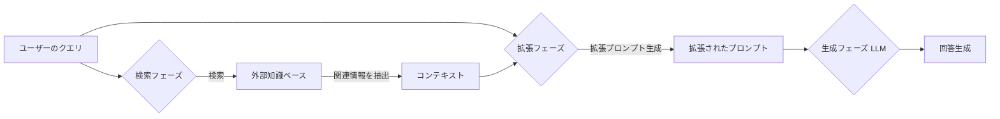

## 1. はじめに

プロンプトエンジニアリングは、生成AIの能力を効果的に引き出す基盤として、重要性が急速に増している専門分野です。これは、AIモデルから望ましい出力を得るために、入力を設計し洗練する技術や科学的手法です。プロンプトの質は生成AIの成果に大きく影響するため、この技術は不可欠です。

この記事では、プロンプトエンジニアリングにおける主要な3つの用途を分析します。

* **人間中心のプロンプトエンジニアリング**: 人間の知性と反復的な改良で進める従来型の手動アプローチです。
* **検索拡張生成（RAG）**: 外部知識ベースから関連情報を検索し、プロンプトを動的に強化するハイブリッドアプローチです。
* **AIエージェント**: 自律的エージェントが意思決定とタスク実行プロセスの一部としてプロンプトを内部で生成・管理・適応する高度なパラダイムです。

2025年は「AIエージェント元年」と呼ばれ、AIはより自律的なシステムへ移行しています。この背景には、認知作業の機械への移行や、状況を理解し行動するAIシステムへの需要の高まりがあります。

プロンプト作成は、当初人間が全て担っていました。その後、LLMの限界を補うためにRAGが登場し、知識注入を自動化しました。さらにAIエージェントは、情報検索に加え、計画、ツール使用、自己修正までを自動化します。この進化により、AIの自律性と洗練性が向上しました。

RAGやAIエージェントが進展しても人間の関与は不可欠です。人間の役割は、高レベルの設計、戦略的な目標設定、倫理的なガバナンスへと変化します。AIエージェントでは、人間が目標や倫理的境界、ツールセットを定義し、ヒューマンインザループ（HITL）が特に重要になります。

## 2. 人間中心のプロンプトエンジニアリング

人間中心のプロンプトエンジニアリングは、生成AIとの対話における最も基本的な形態です。このアプローチは、人間の創造性、直感、反復的な試行錯誤に深く依存します。単に指示文を書く作業ではなく、AIとの「対話」を通じて望む結果に近づくプロセスです。

### 2.1. 概要

効果的な人間中心のプロンプトエンジニアリングは、主に以下のテクニックに基づきます。

* **明確性と具体性**:
    * 直接的で曖昧さのない言葉を使用します。
    * 要求を明確に定義し、AIの誤解を最小化します。（例：「この記事を要約してください」ではなく、「この記事の主要なポイントに焦点を当て、3つの箇条書きで要約してください」と具体的に指示します。）
* **文脈的フレーミング**:
    * 必要な背景情報を提供します。
    * AIに特定のペルソナを設定（例：「ファイナンシャルアナリストとして…」）し、回答の質と方向性を制御します。
* **反復的改良**:
    * 一度の指示で完璧な結果が得られない場合は、AIの返答を基に質問の変更や追加情報の提供をします。
    * 対話を繰り返し、望む結果へ接近させます。試行錯誤が不可欠です。
* **例示（フューショットプロンプティング）**: AIに望ましい出力形式やスタイルの例の提示。
* **役割演技**: AIへの特定の役割割当による、口調や応答内容への影響。
* **思考の連鎖（Chain-of-Thought）プロンプティング**: AIに複雑な問題を段階的に分解して考察するよう促す手法です。これは初期のテクニックです。より高度なモデルでは必要性が薄れる可能性があります。しかし、AIの推論プロセスを導く基本原則は依然として重要です。

### 2.2. 強み

人間がプロンプトを作成するアプローチには、独自の強みがあります。

* **創造性と新規性**:
    * 人間による独創的なプロンプト生成
    * 既成概念にとらわれないユニークな出力の引き出し
    * 革新的アイデアが必要なタスクで不可欠
* **ニュアンスの理解**:
    * AIが見逃しがちな文脈の微妙な手がかり、皮肉、暗示的な意味の人間の把握
    * 医療や法律のような専門分野で特に重要
* **倫理的判断とバイアス緩和**:
    * 人間による倫理的考慮（理想的な場合）
    * プロンプトや出力におけるバイアスの積極的な打ち消しの試み
* **予期せぬ状況への適応性**: AIの予期せぬ振る舞いや新たな要件への直面時における、人間によるその場での柔軟なプロンプト調整
* **複雑な推論と「なぜ」の探求**:
    * 人間によるより深い問いの探求
    * AIの推論を精査するためのプロンプト設計
    * 「価値創造」に不可欠

### 2.3. 課題

一方で、人間中心のアプローチには限界も存在します。

* **スケーラビリティと効率性**:
    * 手作業によるプロンプト作成の時間消費
    * 大量タスクへのスケールアップ困難性
* **一貫性**:
    * プロンプターのスキルやその時々の状態による出力品質の変動可能性
    * 出力の安定化困難性
* **コスト**: 人間の時間と専門知識への依存によるコスト高の可能性
* **主観性とバイアス**: プロンプター自身による意図しない独自のバイアスのプロンプトへの混入可能性
* **「職人的」スキルへの依存（属人性）**:
    * 効果の個人スキルや経験への大きな左右
    * 標準化困難性

### 2.4. 主要なトレンド

人間中心の**プロンプトエンジニアリング**は、技術的なスキルから**戦略的なコミュニケーションと設計スキル**へと進化しています。プロダクトマネジメントや専門知識に深く関わるようになり、PMや専門家がプロンプティングに優れているのは、問題の「**何を**」と「**なぜ**」を理解しているからです。これは、プロンプトエンジニアリングが単なる構文ではなく、**問題領域と望ましい結果への深い理解が重要**であることを示します。その価値は、複雑なコマンドではなく、**明確で文脈豊かな意図を伝えること**にあります。

この分野での主要なトレンドは以下の通りです。

* **「メタプロンプティング」または戦略的プロンプティングへの移行**: 人間による個々のプロンプト作成だけでなく、プロンプト戦略、テンプレート、評価フレームワーク設計への重点化
* **プロダクトマネージャー（PM）および対象分野専門家（SME）の役割増大**: ユーザーニーズとドメイン固有知識を最もよく理解するPMやSMEによる、プロンプトエンジニアリングでの中心的役割担当。「PMやドメイン専門家は通常、ソフトウェアエンジニアよりもプロンプティングに優れている」との指摘あり。
* **「プロンプトライブラリ」と共同プラットフォームの開発**: プロンプトを共有し洗練するためのライブラリやプラットフォームの登場
* **高付加価値業務への集中**:
    * 人間による高度な創造性、倫理的判断、複雑な問題解決を必要とするタスクへの集中
    * より定型的なプロンプティングの自動化システムやシンプルなインターフェースへの委任傾向
* **スキルの民主化と専門性の両立**:
    * 一般ユーザーにとっての「ちょっとしたコツやTips」レベルでのプロンプトエンジニアリングスキルの民主化
    * 複雑なアプリケーションにおける深い専門知識の継続的な価値

モデルがより強力になるにつれて、**人間によるプロンプトエンジニアリング**は、**曖昧さへの対応、イノベーションの推進、倫理的整合性の確保**といった、自動化が難しい領域で重要になります。AIの創造性を価値ある目的に導くには人間の指導が不可欠です。AIが複雑な問題に取り組む際、プロンプトで問題を枠組み化する人間の能力は、単に答えを得るだけでなく、新しい目的のために「正しい種類」の答えを得るために重要です。

人間によるプロンプティングには、**スケーラビリティ、コスト、一貫性**の限界があります。これらの限界が、**RAGやAIエージェント技術の開発と採用**を促す主な要因となりました。RAGは知識の限界や事実性の問題に対処し、AIエージェントはワークフロー全体の自動化を目指します。このように、人間の限界がプロンプティングパラダイムのイノベーションを加速させています。

## 3. 検索拡張生成（RAG）

検索拡張生成（RAG）は、大規模言語モデル（LLM）を外部データソースに接続する技術です。これにより、LLMの知識を補強し、信頼性を向上させます。結果として、LLMはより正確で文脈に即した、最新情報に基づく回答を生成できます。

### 3.1. 概要

RAGシステムは、主に以下の3つのフェーズで構成します。

1.  **検索フェーズ（Retrieval Phase）**:
    * ユーザーのクエリ（質問）入力後、システムはまず外部知識ベース（例：ベクトルデータベース、ドキュメントリポジトリ）を検索します。
    * **使用技術**:
        * **ベクトル検索**: 単語や文の意味を数値ベクトルとして表現し、意味の類似性に基づいて情報を検索します。
        * **キーワード検索**: 特定の単語やフレーズの出現に基づき情報を検索します。
        * **ハイブリッド検索**: ベクトル検索とキーワード検索を組み合わせ、双方の長所を活用し高精度を追求します。
    * 検索結果として関連性の高いドキュメントやその一部（チャンク）を「コンテキスト」として抽出します。
2.  **拡張フェーズ（Augmentation Phase）**:
    * 検索フェーズで取得したコンテキスト（関連情報）と元のユーザークエリを結合します。
    * これにより、拡張されたプロンプトを形成します。
3.  **生成フェーズ（Generation Phase）**:
    * 拡張されたプロンプトをLLMに入力します。
    * LLMが提供情報に基づいて回答を生成します。

| 要素名               | 説明                                                                            |
| :------------------- | :------------------------------------------------------------------------------ |
| ユーザーのクエリ     | 利用者がシステムに入力する質問や指示                                            |
| 検索フェーズ         | 外部知識ベースから関連情報を検索する段階                                        |
| 外部知識ベース       | LLMの知識を補強するための情報源（例：ベクトルDB、ドキュメント）                 |
| コンテキスト         | 検索フェーズで取得された、クエリに関連する情報                                  |
| 拡張フェーズ         | 元のクエリと取得されたコンテキストを結合し、LLMへの入力プロンプトを作成する段階 |
| 拡張されたプロンプト | クエリとコンテキストが結合された、LLMへの最終的な入力                           |
| 生成フェーズ LLM     | 拡張されたプロンプトに基づき、LLMが回答を生成する段階                           |
| 回答生成             | LLMによって生成された最終的な出力                                               |

### 3.2. プロンプトエンジニアリングの役割

RAGは、プロンプトエンジニアリングのあり方を根本的に変革します。これは、プロンプトの「コンテキスト」部分を人間が手作業で作成せず、動的かつデータ駆動型にするためです。

ユーザーが入力する最初のプロンプト（クエリ）は、依然として検索プロセスを誘導するために重要です。効果的なRAG向けプロンプトは、しばしば特定のキーワードを含みます。また、情報検索を助けるような形で質問を構成することもあります。

RAGでのプロンプトエンジニアリングは、「テンプレート」の設計にも及びます。そのテンプレートは、ユーザークエリと検索されたコンテキストをLLMのために組み合わせるものです。

### 3.3. 強み

RAGの導入は多くの利点をもたらします。

* **ハルシネーション軽減と事実精度向上**:
    * 関連性の高い事実に基づいたデータのプロンプトへの包含。
    * LLMによる不正確な情報や無意味な情報の生成傾向低減。RAGは、信頼性の高い外部データベースを利用し、ハルシネーションを低減。
* **最新情報へのアクセス**:
    * LLM知識の訓練データ依存とカットオフデート存在の克服。
    * RAGによる動的な外部ソースからの最新情報アクセスと活用。
* **ドメイン固有知識・専有知識の活用**: 企業の内部文書、FAQ、特定専門分野データベースなど、LLMの元訓練データに非含有の情報に基づく回答生成実現。
* **完全なファインチューニングと比較したコスト効率**: LLM全体の再訓練や広範なファインチューニングとの比較。RAGはLLMを特定知識ドメインに適応させる、より経済的な方法の可能性。RAGはLLM知識拡張の「コスト効率の高い」手段。
* **透明性・説明可能性**:
    * 回答に使用したソースドキュメント引用の可能性。
    * ある程度の説明可能性提供。

### 3.4. 課題

一方で、RAGにはいくつかの限界と課題も存在します。

* **検索品質への依存（「Garbage In, Garbage Out」）**:
    * RAG出力品質の、検索された情報の正確性と関連性への大きな依存。
    * 不適切な検索結果による、不適切な生成。
* **実装の複雑性**:
    * 効率的なRAGシステムの構築と維持の複雑性。
    * ベクトルデータベース、インデックス作成、検索アルゴリズムなどを含み、専門知識の必要性。
* **データセキュリティとプライバシー**: 専有データや機密データをRAGシステムで使用する場合、情報漏洩を防ぐ堅牢なセキュリティ対策の必要性。
* **インフラコスト**: エンベディング用GPUコスト、ベクトルDBストレージ、データ更新パイプラインなどの高額化可能性。
* **新規コンテンツ生成の限界**:
    * RAGの主な設計目的は既存情報からの回答統合。
    * その情報を超えた全く新しいアイデアや高度に創造的なコンテンツ生成への不適合。
* **レイテンシ**: 特に大規模データセットの場合、検索ステップによる応答時間への遅延追加可能性。

### 3.5. 主要なトレンド

RAG分野では、以下のような主要なトレンドが見られます。

* **高度な検索戦略**: 単純なベクトル検索を超えた、グラフベース検索、マルチクエリ検索、再ランキングメカニズムなどの導入
* **ハイブリッド検索の標準化**: キーワード検索とセマンティック検索を組み合わせ、頑健性を向上させるアプローチの一般化
* **最適化されたデータチャンキングとインデックス作成**: 効率的検索のための、知識ベース準備・構造化技術のより良い開発
* **RAG特化型LLM**: 検索されたコンテキストをより効果的に活用できるようファインチューニングしたモデルの登場
* **プロンプトエンジニアリングとの緊密な統合**: RAGパイプライン効果最大化のための、「検索を意識した」プロンプト設計の進行
* **Agentic RAGへの進化**: エージェントによるRAGの使用時期や方法の動的決定、より高度な形態への移行

https://zenn.dev/suwash/articles/rag_accuracy_20250516

**RAG**は、企業のAI活用で重要なインフラ層であり、「プロンプトエンジニアリング」の負荷を**データ検索とコンテキスト拡張のエンジニアリング**へ移行させます。これはLLMの知識の限界を解決し、必要な事実の自動注入を可能にします。これにより、プロンプトエンジニアリングは**データエンジニアリングや検索アルゴリズムの最適化**など、情報フローの設計へと人間の役割を広げました。

RAGの成功は、**外部知識の質と構造**に依存します。そのため、効果的なRAGには「**知識管理**」が不可欠です。外部データが不正確、古い、または未整理の場合、RAGは機能しません。RAGを活用する組織は、知識資産の**キュレーション、更新、構造化**に投資が必要です。

RAGは万能な解決策ではなく、**強力なコンポーネント**です。新規コンテンツ生成の限界から、複雑なタスクでは**人間の創造性やAIエージェント**との組み合わせが必要です。Agentic RAGのように、RAGは人間やAIエージェントが使う「ツール」として機能します。RAGの出力は、さらに複雑なプロンプティングや人間の介入を必要とすることもあります。

## 4. AIエージェント

AIエージェントは、プロンプトエンジニアリングのパラダイムをさらに進化させます。AIが単に応答を生成するだけでなく、自律的に目標を達成するために行動するシステムを指します。

### 4.1. 概要

AIエージェントは、環境を認識し、意思決定を行い、特定の目標を達成するために自律的に行動するシステムです。AIエージェントは「自律的に問題解決やタスク実行を行う」システムと定義されます。

主な特徴は以下の通りです。

* **自律性**: 各ステップでの人間の直接的制御なしの動作
* **計画**: 複雑な目標の実行可能なタスクやサブタスクへの分解と計画立案
* **ツール使用（ファンクションコーリング）**: 外部ツール、API、データソースとの対話（RAGはエージェントにとってのツール）
* **記憶**: 過去の対話や状態に関する情報の保持と将来行動への活用
* **学習・自己改善**: フィードバックや経験に基づく行動適応（エージェントによる「自律的な評価・フィードバック実施と調整」）

### 4.2. プロンプトエンジニアリングの役割

AIエージェントにおいて、プロンプトエンジニアリングは多岐にわたる役割を果たします。

* **目標定義とタスク仕様**: エージェントの包括的な目標、目的、タスク範囲の基本的定義（プロンプトは、自律型エージェントの知能、応答性、信頼性を最適化する高レベルの指示として機能）
* **エージェントのペルソナと行動の定義**: エージェントの「個性」、コミュニケーションスタイル、意思決定バイアスの形成。
* **ツール使用の指示**: エージェントの利用可能なツールの「どのように」「いつ」使用するかの指示。RAGシステムや他APIへのクエリ定式化方法の指示。
* **動的・内部的プロンプト生成**: エージェントによる推論や計画プロセスの一環としての、自身のため、あるいはサブエージェントのための内部的プロンプト生成（例：計画エージェントによるRAGツール使用エージェントのためのプロンプト生成）
* **自己修正と反省プロンプト**: エージェント自身の作業レビュー、エラー特定、修正試行を促すプロンプト受信
* **マルチエージェントコミュニケーション**: マルチエージェントシステムにおける、エージェント間コミュニケーションプロトコルや内容の定義

### 4.3. 強み

AIエージェントは、以下のような顕著な能力と強みを持っています。

* **複雑なタスクの自動化**: 単純なQ&Aやコンテンツ生成を超えた、多段階で複雑なワークフロー処理（例：複数チェックとアクションを伴う会議室予約自動化）
* **能動的な振る舞い**: 明示的なユーザーコマンドへの反応だけでなく、目標と環境状態に基づいた自発的な行動開始
* **プロセスの効率性とスケーラビリティ**: ビジネスプロセス全体の自動化による大幅な効率向上の可能性
* **適応性**: 新しい情報や変化する状況に基づいた計画や行動の調整
* **人的ミスの削減**: 定義されたタスクに関する、手動実行で起こりがちなエラーの削減

### 4.4. 課題

AIエージェントの実現には、多くの課題も伴います。

* **設計と実装の複雑性**: 堅牢で信頼性の高いAIエージェント構築のエンジニアリング上の課題
* **「ブラックボックス」な推論**: エージェントの意思決定理由の理解が困難になる。デバッグや信頼性確保が困難になる。
* **人間の意図・価値観との整合性（AIアラインメント問題）**: エージェント行動と人間の目標・倫理原則との整合性保証
* **セキュリティ脆弱性**: 外部システムと対話したり外部データを処理したりするエージェントのプロンプトインジェクションやその他攻撃への脆弱性
* **計算コスト**: 複雑なエージェントのリソース集約（特に複数LLM呼び出しやツール使用エージェント）
* **エラー処理と堅牢性**: エージェントによる予期せぬ状況やツール障害への適切な対処保証
* **過度の依存とスキル低下**: タスクのエージェントへの過度な委任による人間のスキル低下の可能性

### 4.5. 主要なトレンド

AIエージェントの分野では、以下のような活発なトレンドが見られます。

* **マルチエージェントシステム（MAS）**: 複数の特化型エージェントが協力して作業するフレームワーク（AutoGenなど）
* **Agentic RAG**: エージェントによるRAGの使用時期や方法のインテリジェントかつ動的な決定、その出力評価や反復アプローチ実行
* **自己改善エージェント・適応型プロンプティング**: 経験から学習し、自身の内部プロンプティング戦略や意思決定モデルを洗練させるエージェント。適応型プロンプト生成や人間フィードバックによるプロンプト最適化（POHF）などの手法
* **ヒューマンインザループ（HITL）for Agents**: 自律型エージェントとの人間の監視、介入、協力のために洗練されたインターフェースとプロトコルの開発
* **エージェントコンポーネントとコミュニケーションの標準化**: ツール使用のためのMCP（Model Context Protocol）のような取り組み
* **エージェント向け説明可能AI（XAI）への注力**: 意思決定プロセスをより透明にするための研究進展

**AIエージェント**は、プロンプトエンジニアリングを「**行動プログラミング**」や「**目標エンジニアリング**」へと進化させるパラダイムシフトをもたらします。プロンプトは、エージェントの**目的、能力、制約を定義する指示セット**となり、エージェントは目標達成のために自律的に行動を決定し、独自のプロンプト生成も行います。この変化により、プロンプトエンジニアは「**AIコミュニケーションストラテジスト**」のような役割に変わります。

AIエージェントの出現に伴い、 **安全性、倫理、制御（アラインメント）** への焦点が強まります。自律エージェントの誤動作は深刻な影響をもたらすため、AIアラインメント問題やプロンプトインジェクションは重大な懸念事項です。 **HITL（人間参加型ループ）** の導入は、この制御と安全性の必要性への対応です。

AIエージェントの開発は、LLMの利用方法にもイノベーションを促します。LLMは単一の頭脳としてではなく、より複雑な認知アーキテクチャ内の**コンポーネント**として使われるようになります。複数のLLMが専門的な役割を持つエージェントとして連携し、プロンプトエンジニアリングはエージェント全体とその各コンポーネントに複数レベルで適用されます。これは、LLMが「すべてを支配する存在」から「**より大きな機械の歯車**」へと移行することを示します。

## 5. 比較

### 5.1. 主要属性の比較

以下の表は、各モダリティを複数の重要な側面から比較したものです。

| 属性/次元                    | 人間中心のプロンプティング                                           | RAG強化型プロンプティング                                                   | AIエージェントベースのプロンプティング                                                           |
| :--------------------------- | :------------------------------------------------------------------- | :-------------------------------------------------------------------------- | :----------------------------------------------------------------------------------------------- |
| プロンプト設計の主要な担い手 | 人間の知性・創造性・反復                                             | 人間のクエリ、検索データ、LLM                                               | エージェントの内部ロジック・計画・動的生成、人間による事前定義目標・行動                         |
| 「プロンプト」の性質         | LLMへの直接的指示・クエリ                                            | ユーザークエリ、システムによる拡張コンテキスト                              | 目標指示、行動スクリプト、ツール呼び出し、内部対話                                               |
| 柔軟性と適応性               | 人間によるリアルタイムでの高い柔軟性                                 | データには適応、新規タスクへの適応性は低い                                  | 潜在的に非常に高いが、あらゆる不測の事態に対応する設計は複雑                                     |
| 情報品質 - 正確性            | 人間知識とLLM依存で可変                                              | 検索データ良質なら一般的に高、ハルシネーション削減                          | エージェントツール（例：RAG使用）と推論依存で可変、設計不十分ならハルシネーション可能性          |
| 情報品質 - 適時性            | 人間知識とLLMのカットオフに限定                                      | 高い、RAGは最新の外部データにアクセス可能                                   | エージェントがRAGや他のリアルタイムツールを使用すれば潜在的に高い                                |
| 情報品質 - 新規性/創造性     | 潜在的に非常に高い                                                   | 低～中程度、既存データに基づく                                              | 中～高程度、情報新結合や創造的タスク設計なら可能だが真の「独創性」は議論の余地あり               |
| 情報品質 - バイアス制御      | 人間が緩和試行、人間のバイアス影響を受けやすい                       | LLMまたは検索データからのバイアス可能性あり、明示的データソースが有用       | 複雑、エージェント目標・学習データ・ツールにバイアス潜む可能性、慎重設計と倫理的ガードレール必要 |
| 効率性とスループット         | 低い、手動                                                           | 中程度、知識検索を自動化                                                    | 自動化されたタスクに対して高い                                                                   |
| スケーラビリティ             | 低い                                                                 | 中程度、インフラ依存でスケール                                              | 定義されたエージェントタスクに対して高い                                                         |
| 自律性レベル                 | 低い、人間主導                                                       | 中程度、システムがプロンプトを拡張                                          | 高い、エージェントがタスクを実行                                                                 |
| 実装/使用の複雑性            | 基本使用は容易、習熟には高度スキルが必要                                 | RAG設定は中～高程度の複雑性                                                 | 堅牢なエージェント設計は高～非常に高い複雑性                                                     |
| コストへの影響               | 主に人間の時間/専門知識                                              | RAGインフラ（VectorDB、API）、データ維持コスト                              | エージェント開発、計算資源、ツールAPI、継続的監視コスト                                          |
| 典型的なユースケース         | 創造的執筆、複雑な問題解決、ニュアンスあるクエリ、倫理的判断要タスク | 事実に基づくQ&A、特定知識ベースでの顧客サポート、文書に基づくコンテンツ生成 | 複雑なプロセス自動化、自律的調査、対話型タスク管理、多段階の意思決定                             |
| 主要な人間の役割/トレンド    | 直接作成、戦略的監督、倫理的指導、PM/専門家が主導                         | システム設計、知識ベースキュレーション、クエリ最適化、監督                  | 目標設定、エージェント設計、倫理的枠組み、監視、HITL介入                                         |
| 進化的トレンド               | より高価値・人間特有スキルへ焦点                                     | LLM基礎づける標準コンポーネント化                                           | より高性能・自己完結型システム、マルチエージェント協力へ急速な発展                               |

### 5.2. 傾向分析

プロンプト設計の主導権は、人間の直接作成からRAGのシステム駆動型拡張、そしてAIエージェントの自律的な生成・適応へと移行し、**AIとの対話における自動化の度合いと人間の役割を変容**させています。

これら3つの用途は競合せず、**人間とAIの協調における自動化のスペクトラム**として捉えられます。トレンドは、これらの能力を組み合わせた**ハイブリッドシステム**へと向かっており、それぞれが特定のタスクで最適な組み合わせを見つけます。

人間からRAG、AIエージェントへと移行するにつれて、プロンプトエンジニアリングの **「対象領域」は拡大** します。テキストからクエリ、知識ベース、そしてエージェントの目標、ツール、パーソナリティ、計画ロジックへと広がります。「エンジニアリング」はシステムアーキテクチャに関わり、「プロンプト」はAIシステムの振る舞いを形作る**青写真**となります。

「良いプロンプト」の定義も変化します。人間にとっては高品質なテキスト出力、RAGにとっては効果的な情報検索、AIエージェントにとっては自律的なタスク実行の成功が目的となり、その **「良さ」の指標は用途とともに進化** します。

## 6. 統合されたプロンプトエンジニアリングの未来

**プロンプトの自動生成と最適化、マルチモーダルプロンプティング、パーソナライゼーション**などのトレンドを踏まえると、統合されたプロンプトエンジニアリングの未来は、インターフェースはより直感的になり、一般的なタスクでの複雑なプロンプトの必要性は減っていきます。人間、RAG、エージェントの**能力がシームレスに融合し、AIの可能性を広げていく**事になりそうです。

この未来では、単一の最適なアプローチではなく、人間、RAG、エージェント技術からなる **柔軟な「ツールキット」** が重要です。これらは特定の課題に応じて動的に組み合わせて使われます。Agentic RAGやHITLの重視が示すように、システム間の連携と統合が進みます。

プロンプトエンジニアリングの統合と自動化が進むにつれて、人間のスキルは変化します。AIシステムの **「目標」を明確に定義し、制約条件を設定する** ことが中心となり、プロンプトはAIのミッションステートメントや倫理憲章のような役割を果たすでしょう。

AIとの対話の高度化に伴い、ユーザーと開発者双方に **新しい「リテラシー」** が求められます。高度なシステムに意図を伝え、応答を解釈する方法を理解し、複雑な対話パラダイムを設計できるようになる必要があります。これは、新しい教育とUI/UXアプローチの必要性を示します。

## 7. 活用のポイント

プロンプトエンジニアリングの各用途（人間中心、RAG、AIエージェント）を効果的に活用するためには、それぞれの特性を理解することが重要です。そして、目的に応じた戦略的なアプローチを選択することが重要です。

### 7.1. アプローチ選択の指針

* **高度な創造性、ニュアンス理解、倫理的判断、または人間の洞察が最重要となる新規問題の探求を要するタスク**
  * 人間中心のプロンプティングの優先。効率化のためのAIツールによる補強検討（例: 基本的RAG機能付きLLMの人間による調査利用）。
* **事実の正確性、最新・専有情報へのアクセス、定義済み知識コーパスに基づく一貫した応答を必要とするアプリケーション**
  * RAG強化型プロンプティングの実装。顧客サポート、社内ナレッジQ&Aなどが例。より動的な情報ニーズにはAgentic RAGの検討。
* **複雑な多段階プロセスの自動化、定義された境界内での自律的な意思決定の実現、あるいは能動的なシステムの構築**
  * AIエージェントの開発。重要タスクには堅牢なHITLメカニズムの確保。

### 7.2. 開発のポイント

* **明確な目標設定からの開始**
  * すべての用途で共通。解決すべき問題と望ましい結果の明確な定義。
* **反復的な開発とテスト**
  * 特にRAGとAIエージェントは反復的アプローチの採用が必要。シンプルにはじめて、厳密なテスト、段階的な複雑性の追加へと進んでいく。
* **データ品質への投資（RAG向け）**
  * RAG効果の基礎となる知識ソースの品質・構成・鮮度への大きく依存。
* **セキュリティと倫理の優先**
  * セキュリティベストプラクティス実装（プロンプトインジェクション対策等）。倫理的行動、バイアス緩和、人間の価値観との整合性の初期設計への組込み。
* **ユーザーエクスペリエンス（UX）への注力**
  * 人間対話型システムにおける直感的インターフェースと明確なコミュニケーション確保（特にHITLシナリオでのAI・人間エージェント間移行時）。
* **分野横断的な協力促進**
  * 効果的なAIシステム開発のための協力。特にエージェント開発におけるAI専門家、ドメイン専門家、倫理学者、UXデザイナー間の協力推進。
* **継続的な学習奨励**
  * 急速進化している分野。チームによる新技術、ツール、ベストプラクティスの継続的な情報収集が必要。

高度なマルチエージェントシステムの実装には多大な投資と専門知識が必要なため、組織は自社の能力とアプリケーションの重要性を評価し、人間主導のプロンプティングからRAG、そしてエージェントへと**段階的に導入する**のが賢明です。**組織のAI成熟度、リスク許容度、利用可能なリソースに合わせた戦略的な決定**を行うことが重要です。

プロンプトエンジニアリングにおける **「メタスキル」への投資** は長期的な利益をもたらします。これには、**批判的思考、問題分解、明確なコミュニケーション、倫理的推論**といった、普遍的に応用できる能力が含まれます。モデルの進化でプロンプトの構文が変わっても、問題定義、文脈提供、結果特定、AI出力評価の能力は**不可欠な知的スキル**として残り続けます。

この記事が、プロンプトエンジニアリングの多様なアプローチと進化するトレンドに関する理解を深め、今後のAI戦略立案の一助となれば幸いです。

## 9. 参考リンク

* プロンプトエンジニアリング
  * [プロンプトエンジニアリングとは？ ChatGPTで代表的な12個のテクニックも紹介](https://exawizards.com/column/article/dx/prompt-engineering/)
  * [AI時代の必須スキル「プロンプトエンジニアリング」とは](https://maisonai.io/blogs/article/what-is-prompt-engineering-an-essential-skill-in-the-age-of-ai)
  * [プロンプトエンジニアリングとは？](https://www.servicenow.com/jp/ai/what-is-prompt-engineering.html)
  * [What is prompt engineering?](https://www.ust.com/en/ust-explainers/what-is-prompt-engineering)
  * [プロンプトエンジニアリング](https://www.nri.com/jp/knowledge/glossary/prompt_engineering.html)
  * [ChatGPTのプロンプトエンジニアリングとは｜7つのプロンプト例や記述のコツを紹介](https://www.skillupai.com/blog/ai-knowledge/chatgpt-prompt-engineering/)
  * [“GPT-10”が登場するころ、プロンプトエンジニアはどうなるのか](https://ascii.jp/elem/000/004/248/4248227/)
  * [Is Prompt Engineering Dead? The Future of AI Prompting](https://blog.promptlayer.com/is-prompt-engineering-dead/)
  * [私のかんがえたさいきょうのプロンプト vs OpenAI Prompt Generator](https://www.softbank.jp/biz/blog/cloud-technology/articles/202412/prompt-battle/)
  * [孫正義氏「もうプロンプトエンジニアリングはいらない」——人間がAIを教える時代は終わった\!? AIがAIを進化させる新トレンド「AI2AI」の無料相談の受付を開始（3月3社限定）](https://prtimes.jp/main/html/rd/p/000000434.000099810.html)
  * [「プロンプトエンジニアリングは今後どうなるの？」を最先端AIに聞いてみたの巻](https://www.google.com/search?q=https://note.com/sharakusah/n/n45001dfdcab5)
  * [AI Is Blurring the Line Between PMs and Engineers](https://humanloop.com/blog/ai-is-blurring-the-lines-between-pms-and-engineers)
  * [最新のプロンプトエンジニアリング実践ガイド｜けいすけ](https://note.com/tyaperujp01/n/n9d3a8b1bf851)
  * [信頼関係構築エージェントボットのプロンプト作成過程](https://asma.ooo/posts/3Dely7DV)
  * [AIの推論を人間的思考限界から逸脱させるには？](https://note.com/fladdict/n/n247e5dcbaf1b)
  * [【2025年最新】知らないと損するChatGPT活用術17選｜株式会社AIworker](https://note.com/ai__worker/n/n543e28981247)
* RAG
  * [技術解説 生成AIのハルシネーションを低減するRAG。図表データまで特定できる"企業向けRAG"とは？（前編）](https://blog-ja.allganize.ai/allganize_rag-1/)
  * [【完全攻略】今さら聞けないRAG（検索拡張生成）とは？AIの進化を支える仕組み](https://jp.ext.hp.com/techdevice/ai/ai_explained_04/)
  * [RAGのデメリットとは？導入前に知るべき5つの課題と対策](https://hellocraftai.com/blog/166/)
  * [RAG（Retrieval-Augmented Generation：検索拡張生成）とは？主な特徴や活用メリット、LLMの課題を解決する仕組みについて解説](https://products.sint.co.jp/aisia-ad/blog/rag)
  * [RAG（検索拡張生成）とは？仕組み・メリット・活用シーンを解説 | ZEAL DATA TIMES](https://www.zdh.co.jp/bi-online/rag/)
  * [プロンプトエンジニアリングとRAGの違いとは？活用事例と実践方法を紹介](https://note.com/akira_sakai/n/n98b60cab9a89)
  * [社内ナレッジ検索向けRAG実装アプローチの比較｜bodybeat](https://note.com/ko_yamazaki/n/nb2babd7f5af1)
* AIエージェント
  * [Is Your AI Strategy Stuck on Prompt Engineering? How Multi-Agent Systems Can Transform Your Business](https://council.aimresearch.co/is-your-ai-strategy-stuck-on-prompt-engineering-how-multi-agent-systems-can-transform-your-business/)
  * [How Prompt Engineering Is Shaping the Future of Autonomous Enterprise Agents](https://aithority.com/machine-learning/how-prompt-engineering-is-shaping-the-future-of-autonomous-enterprise-agents/)
  * [RAGによる質問応答を生成AIエージェントへ](https://aitc.dentsusoken.com/column/rag_to_ai_agents/)
  * [Secure “Human in the Loop” Interactions for AI Agents](https://auth0.com/blog/secure-human-in-the-loop-interactions-for-ai-agents/)
  * [AIエージェントでRAGはどうなる？「Agentic RAG」と「Traditional RAG」の違いを比較解説](https://edge-works.ai/blog/agentic-rag-vs-traditional-rag-differences-20250125)
  * [AIアライメントとは](https://www.ibm.com/jp-ja/think/topics/ai-alignment)
  * [エージェント型RAGとは](https://www.ibm.com/jp-ja/think/topics/agentic-rag)
  * [LLMの業務利用上の課題と解決策としてのAIエージェント](https://kpmg.com/jp/ja/home/insights/2025/03/llm-ai-agent.html)
  * [AIエージェントの定義。2025年の最重要AI用語の概念を整理](https://laboro.ai/activity/column/engineer/aiagent/)
  * [AIエージェントとは｜マニアックなプロンプトエンジニアリングは不要？業務自動化の未来](https://ledge.ai/articles/about_ai-agent)
  * [プロンプトエンジニアリング vs ファインチューニング vs RAG](https://myscale.com/blog/ja/prompt-engineering-vs-finetuning-vs-rag/)
  * [【論文瞬読】LLMからエージェントAIへ：最新研究レビューから見る自律的AIの進化](https://note.com/ainest/n/n250b97f66027)
  * [AIエージェントの回答品質を向上させる「プロンプト・レスポンス最適化」技術](https://www.google.com/search?q=https://note.com/jurio_ai/n/n18ae9ef60ee)
  * [Agentic RAG Chatbotのアーキテクチャーとコンポーネント](https://note.com/wandb_jp/n/n80325452b195)
  * [講演「生成AIの現場利用は新たな段階へ！自律型AIエージェントによる未来型業務パートナー開発の取り組み」～EdgeTech+ 2024](https://tech.scsk.jp/n/n5cf7907a1ec6)
  * [Best Practices for Hybrid Chatbot Implementation](https://www.teksystems.com/en/insights/article/hybrid-conversational-agents-part-3)
  * [【使い分け必須】従来のRAGとは異なる、Agentic RAGについて解説します](https://zenn.dev/aimasaou/articles/6212308dbfac4c)
  * [チャットボットの先にある世界：現場で使いたいAIエージェント設計パターン](https://zenn.dev/o_kai/articles/f6f34408acd064)
  * [arXiv:2402.07927v1 [cs.AI] 5 Feb 2024](https://arxiv.org/pdf/2402.07927)
  * [【2025年最新】AIエージェントと生成AIの違いとは？仕組み・事例を徹底解説](https://keiei-digital.com/column/ai-agent/ai-agent-vs-generative-ai/)
  * [【最新】AIエージェントとは？種類やメリット・活用例などをわかりやすく解説](https://sogyotecho.jp/ai-agent/)
  * [人工知能研究の新潮流2025 ～基盤モデル・生成AIのインパクトと課題～](https://www.jst.go.jp/crds/pdf/2024/RR/CRDS-FY2024-RR-07.pdf)
  * [次世代 AI モデルの研究開発](https://www.jst.go.jp/crds/pdf/2023/SP/CRDS-FY2023-SP-03.pdf)

この記事が少しでも参考になった、あるいは改善点などがあれば、ぜひリアクションやコメント、SNSでのシェアをいただけると励みになります！
