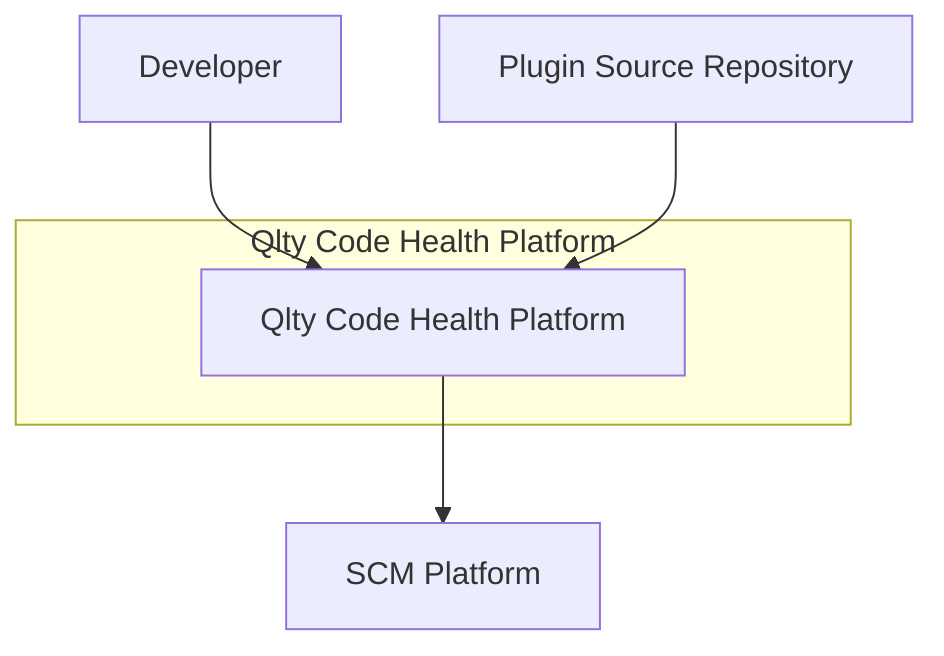
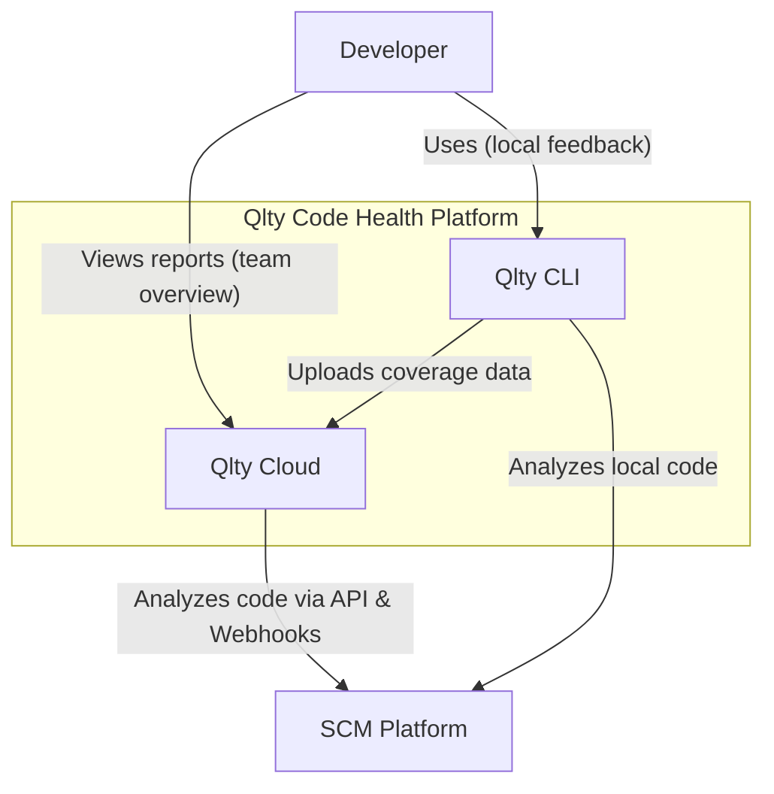
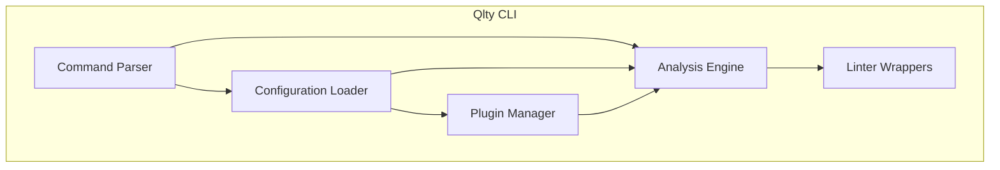
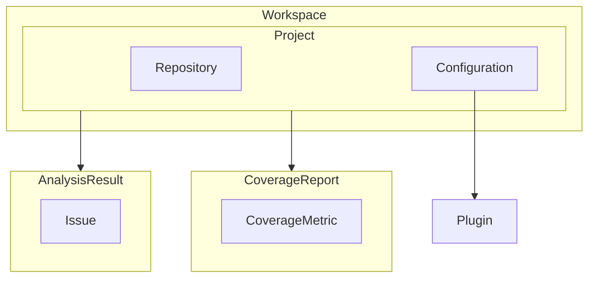
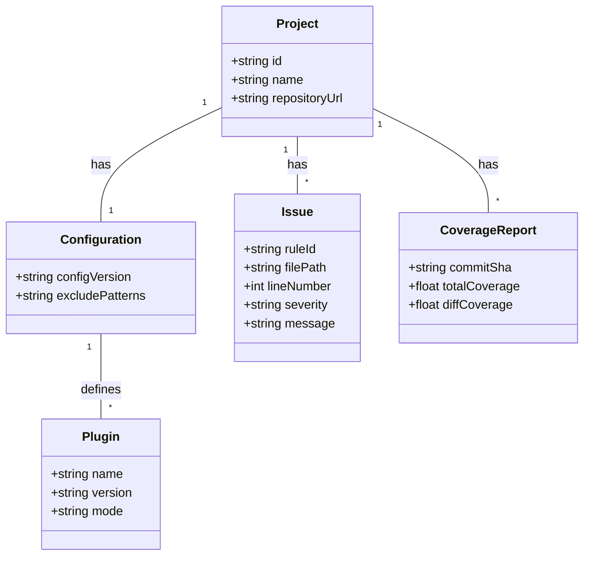

## ■はじめに

Qlty (qlty.sh) は、静的解析、フォーマット、セキュリティスキャン、コードカバレッジ測定といった多彩な機能を一つのツールセットに統合した、モダンなコードヘルスプラットフォームです。

開発プロセスにおける「レビューの高速化」「解析ノイズの削減」「ツールの乱立防止」「技術的負債の可視化」といった共通の課題に対し、Qltyは**高速なCLIと強力なクラウドサービスの連携**によって、開発者個人とチーム全体の生産性を向上させる包括的な解決策を提供します。

## ■概要

Qltyは、複数のプログラミング言語に対応し、コード品質管理を効率化します。

### ●プラットフォームの構成

Qltyは、CLIツールとクラウドサービスの2つのコンポーネントで構成されます。

  - **Qlty CLI**
      - Rustで記述された高速なコマンドラインインターフェース（CLI）ツール
      - 各言語で広く利用されている静的解析ツールのファサード（統一的な窓口）として動作
      - リンティング、自動フォーマット、セキュリティスキャンなどを実行
      - ローカル環境やCI/CDパイプラインで直接実行
      - 商用プロジェクトを含めて無償利用可能
  - **Qlty Cloud**
      - GitHubなどSCMプラットフォームと連携するクラウドベースのSaaS
      - チームや組織レベルでのコード品質管理を支援
          - プルリクエストへの自動コードレビュー
          - 品質の傾向分析
          - コードカバレッジレポートの提供

### ●ビジネスモデルとライセンス

Qltyは、高性能な無償CLIツールを広く提供し、開発者個人の生産性向上を支援することで、Qltyエコシステムへの導入を促進します。チームでの品質基準の統一やプロジェクト横断での品質可視化といった高度な機能は、有償のQlty Cloudで提供されます。

このモデルを支えるため、Qlty CLIは Fair Sourceライセンス を採用しています。これは「ソースコードを公開し、誰でも利用・改変できる」点ではオープンソースに近い一方で、利用者数や用途に制限を設けることで、持続的な製品開発と事業モデルを両立させる仕組みです。

さらにQltyでは、Delayed Open Source Publication (DOSP) という形態をとっており、一定の遅延期間を経た後にOSI承認のオープンソースライセンスへ戻す方針を掲げています。これにより、商用開発とコミュニティの双方にメリットをもたらすことを狙っています。

### ●競合ツールとの比較

SonarQubeやCodeClimateといった既存の統合静的解析ツールと比較して、Qltyは特に **開発者体験（Developer Experience）** に重点を置いています。Rustによる高速なローカル実行、Gitと連携した変更箇所への集中分析、単一の設定ファイルによる管理の容易さなどが、日々の開発サイクルにおける摩擦を低減します。

## ■特徴

### ●包括的な分析機能

  - **リンティング**
      - JavaScript, Python, Ruby, Go, Terraformなど40以上の言語とテクノロジーに対応
      - ESLint, RuboCop, Flake8, Checkovなど70以上の静的解析ツールを統合し、単一インターフェースで実行
  - **自動フォーマット**
      - Prettier, Black, gofmtなどをサポートし、プロジェクト全体で一貫したコードスタイルを強制
  - **セキュリティスキャン**
      - SAST（静的アプリケーションセキュリティテスト）
      - SCA（ソフトウェア構成分析）による脆弱な依存関係の検出 (osv-scannerなど)
      - シークレット検出
      - IaC（Infrastructure as Code）分析
  - **保守性分析**
      - コードの重複や複雑度といった「コードの匂い」を検出し、リファクタリング対象を特定
  - **コードカバレッジ**
      - テストカバレッジの詳細なレポート
      - プルリクエストの変更箇所のみを対象とする「差分カバレッジ」分析
      - マージ可否を判断する品質ゲート機能

### ●優れた開発者体験とパフォーマンス

  - **Git-aware**
      - Gitと連携し、新規または変更されたコードに焦点を当てて分析。既存コードの大量の指摘に埋もれず、新たな問題に集中可能
  - **高速な実行**
      - Rust製の本体、キャッシュ機構、並列処理の最適化による高速分析
      - 各リンターをDockerコンテナを介さずネイティブに実行し、パフォーマンスを最大化
  - **自動修正機能**
      - 各ツールの自動修正機能 (`qlty check --fix`)
      - **AIによる修正提案**: `qlty check --ai` でAI生成の修正案を適用可能（OpenAI API Keyが必要）

### ●高い設定能力と拡張性

  - **Configuration as Code**
      - すべての設定を単一ファイル `.qlty/qlty.toml` でバージョン管理。チーム内共有やCI/CDでの再現性を確保
  - **プラグインアーキテクチャ**
      - サードパーティ製ツールや独自カスタムルールの柔軟な統合

### ●ワークフローへのシームレスな統合

  - **CI/CD非依存**
      - macOS, Linux, Windowsで動作し、特定のCI/CDプラットフォームに縛られない
  - **強力なGitHub連携**
      - 専用のGitHub Appがプルリクエストへのコメント投稿や品質ゲートなどを自動化
  - **CI設定不要（Qlty Cloud）**
      - Qlty Cloudのインフラ上で分析を実行するため、ユーザーは自身のCI環境に静的解析基盤を構築する必要がない

## ■システム構成

Qltyプラットフォームのアーキテクチャを、C4モデルを用いて3つのレベルで解説します。

### ●レベル1: システムコンテキスト図

Qltyプラットフォームと、それを取り巻く外部要素との相互作用を示します。



| 要素名 | 説明 |
| :--- | :--- |
| Developer | Qlty CLIを利用してローカルでコード品質をチェックし、Qlty Cloudのダッシュボードを閲覧する開発者 |
| Qlty Code Health Platform | CLIとCloudサービスから構成されるシステム全体 |
| SCM Platform | GitHubなどのソースコード管理プラットフォーム。Qltyはここからソースコードを取得し、分析結果をフィードバックする |
| Plugin Source Repository | リンターやフォーマッターなどのプラグイン定義が格納されているGitリポジトリ。Qltyはここからプラグイン情報を取得する |

### ●レベル2: コンテナ図

次に、「Qlty Code Health Platform」を構成する主要な実行単位（コンテナ）を示します。



| 要素名 | 説明 |
| :--- | :--- |
| Qlty CLI | 開発者のローカルマシンやCI/CD環境で動作するRust製のアプリケーション。ソースコードの静的解析やフォーマットを直接実行する |
| Qlty Cloud | ウェブブラウザを通じてアクセスするSaaSアプリケーション。ダッシュボード、API、分析バックエンドを提供し、SCMプラットフォームと連携して自動コードレビューなどを実行する |

この構成は、Qltyが提供する2つの異なる分析実行モデルを明確に示しています。

1.  **命令的な実行モデル (Qlty CLI)**
      - **利用シーン**: 開発者がコーディング中に `qlty check` を実行し、即座にフィードバックを得る。
      - **目的**: 数秒単位の高速なフィードバックで、個人の開発サイクル（**インナーループ**）の生産性を最大化する。
2.  **宣言的なイベント駆動モデル (Qlty Cloud)**
      - **利用シーン**: 開発者がGitHubにプルリクエストを作成すると、WebhookをトリガーにQltyが自動でコードを分析し、結果をコメントする。
      - **目的**: チーム全体の品質ポリシーを自動で強制し、コードレビュープロセス（**アウターループ**）の一貫性と品質を保つ。

このアーキテクチャ分離により、個人の生産性向上とチームの品質統制という異なる要求を、それぞれに最適化された形で満たします。そして、両者をつなぐのが設定ファイル `qlty.toml` であり、分析ルールの一貫性を担保します。

### ●レベル3: コンポーネント図

最後に、「Qlty CLI」コンテナの内部を構成する主要コンポーネントとその連携を示します。



| 要素名 | 説明 |
| :--- | :--- |
| Command Parser | ユーザーが入力したコマンドライン引数（`check`, `fmt`など）を解釈し、処理を各コンポーネントに振り分ける |
| Configuration Loader | `.qlty/qlty.toml` ファイルを読み込み、解析設定を他のコンポーネントに提供する |
| Plugin Manager | `qlty.toml` の定義に基づき、外部リポジトリからプラグイン定義を取得し、必要なツールをインストール・管理する |
| Analysis Engine | 設定とコマンドに基づき、分析プロセス全体を統括する。Gitと連携して変更ファイルを特定し、準備されたツールを実行する |
| Linter Wrappers | ESLint, RuboCopなど、個別の静的解析ツールを実行するインターフェース。各ツールの実行方法や出力形式の違いを吸収する |

## ■データモデル

Qltyが内部で扱う主要なデータエンティティの構造を解説します。

### ●概念モデル

システム内の主要エンティティとそれらの関係性を示します。



| 要素名 | 説明 |
| :--- | :--- |
| Workspace | Qlty Cloudにおける最上位の管理単位。複数のプロジェクトを内包 |
| Project | 特定のソースコードリポジトリに対応する分析・管理の単位 |
| Repository | 分析対象のソースコードが格納されている場所 (例: GitHubリポジトリ) |
| Configuration | `qlty.toml` ファイルに記述された分析設定 |
| Plugin | ESLintやRuboCopなど、個別の静的解析ツールやフォーマッター |
| AnalysisResult | 特定のコミットやプルリクエストに対する静的解析の実行結果 |
| Issue | 解析によって検出された個々の問題点 |
| CoverageReport | テスト実行によって生成されたコードカバレッジのレポート |
| CoverageMetric | 全体カバレッジや差分カバレッジなど、具体的なカバレッジの測定値 |

### ●情報モデル

概念モデルの各エンティティに主要な属性を追加し、データ構造をより具体的に示します。



| 要素名 | 説明 |
| :--- | :--- |
| Project | プロジェクトの一意なID、名前、リポジトリURLなどの属性 |
| Configuration | 設定ファイルのバージョン、分析から除外するファイルのパターンリストなどの属性 |
| Plugin | プラグイン名、バージョン、Qlty Cloudでの振る舞いを決定するモード (`disabled`, `monitor`, `comment`, `block`) などの属性 |
| Issue | ルールID、ファイルパス、行番号、重要度、メッセージなどの属性 |
| CoverageReport | コミットSHA、全体カバレッジ、差分カバレッジなどのメトリクス |

## ■構築方法

### ●インストーラースクリプト (推奨)

OSに対応したインストーラースクリプトを実行する方法が最も手軽です。

  - **macOS / Linux**
    ```bash
    curl -sSL https://qlty.sh | bash
    ```
  - **Windows**
    ```powershell
    powershell -c "iwr https://qlty.sh | iex"
    ```

### ●Dockerイメージ

Qlty CLIは、GitHub Container Registry (GHCR) でDockerイメージとしても提供され、コンテナ環境での利用に適しています。

```bash
docker pull ghcr.io/qltysh/qlty:main
```

### ●ソースコードからのビルド

Rustのツールチェーンを使用して、ソースコードから手動でビルドします。

1.  **前提条件**: Git, Rust toolchain (`rustc`, `cargo`)
2.  **ソースコードの取得**
    ```bash
    git clone https://github.com/qltysh/qlty.git
    cd qlty
    ```
3.  **ビルド**
    ```bash
    # リリースビルド
    cargo build --release
    ```
4.  **テスト**
    ```bash
    cargo test
    ```

## ■利用方法

### ●1. リポジトリの初期化

`qlty init` コマンドで、リポジトリの内容を解析し、推奨設定を含む `.qlty/qlty.toml` ファイルを自動生成します。

```bash
qlty init
```

### ●2. 静的解析の実行

`qlty check` コマンドでリンターを実行し、コードの問題点を検出します。デフォルトでは、Gitで追跡されている変更ファイルのみを対象とします。

  - **変更ファイルのみを解析**
    ```bash
    qlty check
    ```
  - **すべてのファイルを解析**
    ```bash
    qlty check --all
    ```
  - **特定のリンターのみを実行**
    ```bash
    qlty check --all --filter=eslint
    ```
  - **自動修正を適用**
    ```bash
    qlty check --fix
    ```

### ●3. コードの自動フォーマット

`qlty fmt` コマンドでフォーマッターを実行し、コードスタイルを統一します。

  - **変更ファイルのみをフォーマット**
    ```bash
    qlty fmt
    ```
  - **すべてのファイルをフォーマット**
    ```bash
    qlty fmt --all
    ```

### ●4. コードメトリクスの取得

`qlty metrics` コマンドで、複雑度・重複・LOC（行数）・クラス数・凝集度などのメトリクスを素早く集計できます。変更差分だけでなく、全体傾向の把握（ベースライン作成）やホットスポット特定に有効です。

  -	**変更ファイルのみ（デフォルト）を集計**

    ```bash
    qlty metrics
    ```

  -	**全ファイルを集計（初回のベースライン作りに）**

    ```bash
    qlty metrics --all
    ```

  -	**ディレクトリ単位の統計を出力（層/モジュールごとの比較に）**

    ```bash
    qlty metrics --dirs
    ```

  -	**関数単位の統計を出力（高複雑度関数の洗い出しに）**

    ```bash
    qlty metrics --functions
    ```

:::message
定期的に `--all` を回してメトリクスのベースラインを更新し、PRレビューでは通常の `qlty metrics` で差分による悪化の早期発見を狙うと効果的です。メトリクスはCloud側でもトレンドとして活用できます。
:::

### ●5. プラグイン管理

`qlty plugins` サブコマンド群で、`.qlty/qlty.toml` ファイルを自動編集し、利用するプラグインを管理します。

  - **利用可能なプラグインの一覧を表示**
    ```bash
    qlty plugins list
    ```
  - **新しいプラグインを有効化**
    ```bash
    qlty plugins enable rubocop
    ```
  - **有効なプラグインを無効化**
    ```bash
    qlty plugins disable rubocop
    ```

## ■設定

`.qlty/qlty.toml` は、Qltyの静的解析の振る舞いを細かく制御するための中心的な役割を担う、まさに「心臓部」と言えるファイルです。ファイルはTOML形式で記述され、リポジトリのルートにある`.qlty/`ディレクトリ内に配置します。

この章では、以下の主要な設定ブロックについて解説します。

  - `トップレベル設定`: プロジェクト全体に適用される基本設定
  - `[checks]` / `[smells]`: 保守性（コードの匂い）に関する組み込みチェック
  - `[[source]]`: プラグイン定義を取得するリポジトリの指定
  - `[[plugin]]`: 利用する各リンターやフォーマッターの設定
  - `[[triage]]`: 検出された問題の重要度などを動的に変更するルール

### ●トップレベル設定

ファイル全体に適用される基本的な設定項目です。

| パラメータ | 説明 |
| :--- | :--- |
| `config_version` | 設定ファイルのフォーマットバージョンを指定します。現在は常に`"0"`です。将来的なフォーマット変更のために予約されています。 |
| `exclude_patterns` | プロジェクト全体で、Qltyの全ての分析（CLIおよびCloud）から除外したいファイルやディレクトリをglobパターンの配列で指定します。`.gitignore`ファイルの設定は自動で尊重されますが、それに追加する形で指定します。生成されたコードやサードパーティライブラリの除外に便利です。 |
| `test_patterns` | テストコードが含まれるファイルやディレクトリをglobパターンの配列で指定します。Qlty Cloudはこの情報を利用して、より精度の高い分析結果を提供します。 |

**記述例:**

```toml
config_version = "0"

exclude_patterns = [
  "**/node_modules/**",
  "**/dist/**",
  "**/*.min.js"
]

test_patterns = [
  "**/test/**",
  "**/spec/**",
  "**/*_test.py"
]
```

### ●`[checks]` / `[smells]` (保守性チェック)

コードの保守性（コードの匂い）に関する組み込みのチェックを制御します。これらは特定の言語に依存しない普遍的な指標（複雑度、重複など）を分析します。

| パラメータ | 説明 |
| :--- | :--- |
| `mode` | 検出された「コードの匂い」に対するQlty Cloudの振る舞いを設定します。<br>・`block`: 問題をPRコメントし、品質ゲートを失敗させます。<br>・`comment`: (デフォルト) PRコメントはしますが、品質ゲートは失敗させません。<br>・`monitor`: Qlty CloudのUI上でのみ問題を確認でき、PRには通知しません。<br>・`disabled`: 保守性チェックを完全に無効化します。 |
| `.enabled` | 特定のチェック項目（例: `return_statements`）を個別に有効化 (`true`) または無効化 (`false`) します。デフォルトでは全て有効です。 |
| `.threshold` | 各チェック項目の閾値をカスタマイズします。<br>・`boolean_logic`: 1つの式内の論理演算子の最大数 (デフォルト: 5)<br>・`nested_control_flow`: ネストされた制御フローの最大深度 (デフォルト: 5)<br>・`function_parameters`: 関数の引数の最大数 (デフォルト: 5)<br>・`return_statements`: 関数内の`return`文の最大数 (デフォルト: 6)<br>・`file_complexity`: ファイルの循環的複雑度の最大値 (デフォルト: 50)<br>・`function_complexity`: 関数の循環的複雑度の最大値 (デフォルト: 15) |
| `[smells.duplication]` | コードの重複（コピー＆ペースト）検出に関する設定です。<br>・`threshold`: 重複と見なす最小の行数 (デフォルト: 12)<br>・`nodes_threshold`: 検出対象とする最小のASTノード数 (デフォルト: 50) |

**記述例:**

```toml
# 保守性チェック全体をコメントモードに設定
[checks]
mode = "comment"

# 関数の引数の上限を7に緩和
[smells.function_parameters]
threshold = 7

# return文が多すぎるというチェックを無効化
[smells.return_statements]
enabled = false
```

### ●`[language.LANGUAGE_NAME]` (言語別設定)

特定のプログラミング言語に対して、保守性チェックの閾値などを上書き設定します。

**記述例:**

```toml
# Pythonの関数でのみ、引数の上限を8に設定
[language.python.smells.function_parameters]
threshold = 8

# Rustの重複検出で特定のパターンを除外
[language.rust.smells.duplication]
filter_patterns = ["(use_declaration _)"]
```

### ● `[[source]]` (プラグインソース)

リンターやフォーマッターなどのプラグイン定義を取得するためのGitリポジトリ（ソース）を指定します。

| パラメータ | 説明 |
| :--- | :--- |
| `name` | このソースを識別するための名前。 |
| `default` | `true`に設定すると、Qltyが公式にメンテナンスしているデフォルトのソースを利用します。 |
| `repository` | カスタムソースを利用する場合のGitリポジトリのURL。 |
| `tag` / `branch` | `repository`から取得するGitのタグまたはブランチを指定します。両方を指定した場合は`tag`が優先されます。 |

**記述例:**

```toml
# Qlty公式のプラグイン定義を利用する（通常はこれで十分）
[[source]]
name = "default"
default = true

# 独自のプラグイン定義リポジトリを追加する場合
[[source]]
name = "my-custom-plugins"
repository = "https://github.com/my-org/qlty-plugins.git"
branch = "main"
```

### ●`[[plugin]]` (プラグイン設定)

利用する各プラグイン（リンター、フォーマッター、セキュリティスキャナ）を個別に設定します。

| パラメータ | 説明 |
| :--- | :--- |
| `name` | プラグインの名前 (例: `eslint`, `rubocop`)。必須項目です。 |
| `version` | 使用するプラグインのバージョンを固定します。 |
| `mode` | このプラグインが検出した問題に対するQlty Cloudの振る舞いを設定します (`block`, `comment`, `monitor`, `disabled`)。 |
| `extra_packages` | ESLintの共有設定など、プラグインが依存する追加のnpmパッケージなどを指定します。 |
| `package_file` | プラグインが参照する`package.json`や`Gemfile`などのパスを指定します。 |
| `package_filters` | `package_file`を使用する際に、インストール対象を特定のパッケージのみに絞り込みます。 |
| `prefix` | モノレポ構成で、特定のサブディレクトリでのみプラグインを実行する場合にそのパスを指定します。 |
| `skip_upstream` | `true`にすると、ベースブランチとの比較を行わず、現在のブランチのコードのみを対象とします。デフォルトは`false`です。 |

**記述例:**

```toml
[[plugin]]
name = "rubocop"
version = "1.64.1" # バージョンを固定
mode = "block"     # RuboCopの指摘は品質ゲートを失敗させる

[[plugin]]
name = "eslint"
# prefixを指定し、frontendディレクトリでのみ実行
prefix = "frontend"

[[plugin]]
name = "osv-scanner"
mode = "monitor"   # 脆弱性スキャンはPRにコメントせず、Qlty Cloud上でのみ確認
```

### ●`[[triage]]` (トリアージルール)

検出された問題の重要度やカテゴリなどを、特定の条件に基づいて動的に変更するための強力なルールです。各ルールは`match`（条件）と`set`（変更内容）のブロックで構成されます。

#### ▷`match`ブロック (条件)

| パラメータ | 説明 |
| :--- | :--- |
| `plugins` | 対象とするプラグイン名の配列 (例: `["eslint"]`)。 |
| `rules` | 対象とするルールIDの配列 (例: `["eslint:no-console"]`)。ワイルドカードも利用可能です。 |
| `levels` | 対象とする問題の重要度の配列 (`low`, `medium`, `high`など)。 |
| `file_patterns` | 対象とするファイルのglobパターンの配列。 |

#### ▷`set`ブロック (変更内容)

| パラメータ | 説明 |
| :--- | :--- |
| `level` | 新しい重要度 (`unspecified`, `fmt`, `low`, `medium`, `high`)。 |
| `category` | 新しいカテゴリ (`bug`, `vulnerability`, `style`など)。 |
| `mode` | 新しい振る舞いモード (`block`, `comment`, `monitor`, `disabled`)。 |
| `ignored` | `true`に設定すると、この問題を完全に無視します。 |

**記述例:**

```toml
# RuboCopのStyleカテゴリの指摘は、重要度を"low"に変更する
[[triage]]
  [triage.match]
  plugins = ["rubocop"]
  rules = ["Style/*"]
  [triage.set]
  level = "low"

# UIコンポーネント内のファイルでは、Reactのprop-typesに関するルールを無視する
[[triage]]
  [triage.match]
  rules = ["eslint:react/prop-types"]
  file_patterns = ["frontend/components/ui/**"]
  [triage.set]
  ignored = true
```

## ■運用方法

Qltyをチーム開発で効果的に運用するために、CI/CDパイプラインやGitワークフローへ統合します。

### ●CI/CD連携 (GitHub Actions)

公式のGitHub Actionを利用して、CI/CDプロセスにQltyを簡単に統合できます。コードカバレッジレポートのアップロードによく利用されます。

#### ▷OIDC連携 (推奨)

シークレット管理が不要なため、より安全な方法です。ワークフローファイルに `id-token: write` 権限を付与します。

```yaml
# .github/workflows/ci.yml
name: CI
on: [push, pull_request]

permissions:
  contents: read
  id-token: write # OIDC連携に必須

jobs:
  test-and-coverage:
    runs-on: ubuntu-latest
    steps:
      - uses: actions/checkout@v4
      - name: Run tests with coverage
        run: npm test -- --coverage # プロジェクトのテストコマンドに置き換えてください
      - name: Upload coverage to Qlty Cloud
        uses: qltysh/qlty-action/coverage@v2
        with:
          oidc: true
          files: coverage/lcov.info # カバレッジレポートのパスを指定してください
```

#### ▷カバレッジトークン連携

Qlty Cloudで発行したカバレッジトークンを、GitHubリポジトリのSecretsに `QLTY_COVERAGE_TOKEN` として登録する方法もあります。

### ●設定ファイル管理 (qlty.toml)

`.qlty/qlty.toml` は、Qltyの振る舞いを定義する中心的なファイルです。このファイルをバージョン管理することで、ローカル環境、CI環境、Qlty Cloud環境で一貫した分析ルールを適用できます。この一貫性の担保こそが、Qltyの設計における重要な思想です。開発者がローカルで確認したルールと、プルリクエストで自動レビューされるルールが同一であるため、「手元では動いた」という問題を静的解析の領域で排除できます。

#### ▷ネイティブ設定ファイルとの連携

Qltyは、各静的解析ツールが持つネイティブな設定ファイル（例: `.eslintrc`, `.rubocop.yml`）を置き換えるのではなく、尊重し、利用するように設計されています。

`qlty.toml`と各ツールの設定ファイルは、明確に役割が分担されています。

  - **`qlty.toml` の役割（オーケストレーション層）**:
    `qlty.toml`は、複数のツールを横断して管理する上位のオーケストレーションを担当します。

      - **プラグイン（ツール）の有効化**: プロジェクトでどの静적解析ツールを実行するかを定義します。
      - **ツールのバージョン管理**: 使用するツールのバージョンを固定し、環境間での実行結果の一貫性を保証します。
      - **実行モードの制御**: 検出された問題をQlty Cloud上でどう扱うか（`block`, `comment`, `monitor`など）を設定します。
      - **実行対象のフィルタリング**: モノレポ構成で特定のディレクトリでのみプラグインを実行する (`prefix`) など、実行範囲を制御します。

  - **各ツールの設定ファイルの役割（ルール定義層）**:
    `.eslintrc`や`.rubocop.yml`といった各ツール固有の設定ファイルは、そのツールが「何を」「どのように」チェックするかという具体的なルールを定義します。Qltyはこれらの既存の設定をそのまま読み込んで利用します。

      - **ルールの有効化・無効化**
      - **ルールごとの詳細なオプション設定**
      - **ツール固有の拡張機能（ESLintプラグインなど）の読み込み**

このように、開発者は使い慣れた各リンターの設定ファイルをそのまま利用し続けることができます。この役割分担をまとめると以下のようになります。

| ファイル | 役割 |
| :---- | :---- |
| **`qlty.toml`** | **オーケストレーション層**: どのツールを、どのバージョンで、いつ実行し、結果をどう扱うかを定義する。 |
| **`.eslintrc`, `.rubocop.yml`等** | **ルール定義層**: 各ツール固有の静的解析ルール、スタイル規約、拡張機能などを詳細に定義する。 |

Qltyは、各ツールが標準的に期待する場所（通常はプロジェクトのルートディレクトリ）にある設定ファイルを自動で認識します。また、リポジトリのルートディレクトリを整理したい場合、これらの設定ファイルを`.qlty/configs/`ディレクトリにまとめて配置することも可能です。

#### ▷設定例

```toml:.qlty/qlty.toml
# .qlty/qlty.toml

# 設定ファイルのバージョン
config_version = "0"

# 全ての分析から除外するファイル・ディレクトリのパターン
exclude_patterns = ["**/node_modules/**", "**/vendor/**", "**/generated/**"]

# 組み込みの保守性チェック（コードの匂い）に関する設定
# ここでは、構造と重複に関する指摘はPRコメントとして投稿するが、PRをブロックはしないように設定
[checks]
mode = "comment"

# smells.function_parameters の閾値をデフォルトの5から6に変更
[smells.function_parameters]
threshold = 6

# プラグイン定義を取得するリポジトリ（Source）の指定
# "default" はQltyが公式にメンテナンスしているSource
[[source]]
name = "default"
default = true

# 利用するプラグインの指定
[[plugin]]
name = "rubocop"
version = "1.64.1" # 特定のバージョンに固定

[[plugin]]
name = "shellcheck"
# versionを指定しない場合は最新版が利用される

[[plugin]]
name = "osv-scanner"
mode = "monitor" # 指摘をQlty Cloud上でのみ閲覧可能にし、PRにはコメントしない

# 特定の指摘の重要度などを変更するTriageルールの定義
[[triage]]
  # マッチ条件: rubocopのStyle/Documentationルールに一致する指摘
  [triage.match]
  plugins = ["rubocop"]
  rules = ["Style/Documentation"]
  # 変更内容: 重要度を"low"に設定
  [triage.set]
  level = "low"
```

### ●Gitフック連携

`pre-commit` や `pre-push` などのGitフックとQlty CLIを連携させると、品質基準を満たさないコードのコミットやプッシュをローカルで防げます。

**pre-commitフックの設定例**

```sh
#!/bin/sh
# .git/hooks/pre-commit

echo "Running Qlty checks..."
qlty check

# コマンドの終了コードをチェック
if [ $? -ne 0 ]; then
  echo "Qlty checks failed. Commit aborted."
  exit 1
fi

echo "Qlty checks passed."
exit 0
```

### ●チーム導入のポイント

Qltyをチームで成功させるには、以下のステップが有効です。

1.  **ルールの合意形成**: `qlty.toml` で定義するルールセットについてチームで議論し、合意を形成します。
2.  **CIへの統合**: まずはCIプロセスに `qlty check` を組み込み、品質ゲートとして機能させます。
3.  **ローカル環境への展開**: CIでの運用が安定したら、各開発者のローカル環境やGitフックへの導入を推奨し、フィードバックのサイクルを早めます。
4.  **定期的な見直し**: プロジェクトの成長に合わせて、`qlty.toml` の設定を定期的に見直し、最適化します。

## ■まとめ

Qltyは、Rust製の高速なCLIと強力なクラウドサービスを連携させることで、 **優れた開発者体験（インナーループ）** と **チーム全体の品質統制（アウターループ）** を高いレベルで両立させる、次世代のコードヘルスプラットフォームです。

その核心は、Git連携による差分解析と、`.qlty/toml`による一貫したルール適用にあります。これにより、開発者は既存コードのノイズに惑わされることなく新たな問題に集中でき、「手元では通ったのにCIで落ちる」という体験から解放されます。

この洗練されたアーキテクチャは、日々の開発の摩擦を減らし、開発者が本質的な作業に集中できる環境を提供します。

開発中のAIによる修正提案機能など、今後の進化も期待されるこのツールを、まずは`qlty init`から試してみてはいかがでしょうか。

この記事が参考になりましたら、ぜひリアクションやコメント、SNSでのシェアをいただけると励みになります！


---

## ■参考リンク

  - **公式ドキュメント**
      - [What is Qlty?](https://docs.qlty.sh/what-is-qlty)
      - [Analysis Configuration](https://docs.qlty.sh/analysis-configuration)
      - [check](https://docs.qlty.sh/cli/commands/check)
      - [CI Integration / Uploader](https://docs.qlty.sh/coverage/ci)
      - [Commit Statuses](https://docs.qlty.sh/coverage/commit-statuses)
      - [FAQ](https://docs.qlty.sh/cli/faq)
      - [fmt](https://docs.qlty.sh/cli/commands/fmt)
      - [GitHub App](https://docs.qlty.sh/cloud/github-app)
      - [Migration Overview](https://docs.qlty.sh/migration/overview)
      - [plugins disable](https://docs.qlty.sh/cli/commands/plugins-disable)
      - [Project Config (qlty.toml)](https://docs.qlty.sh/qlty-toml)
      - [Quality Gates](https://docs.qlty.sh/cloud/gates)
      - [Sources](https://docs.qlty.sh/cli/concepts/sources)
  - **GitHub**
      - [qltysh/qlty: Code quality CLI for universal linting, auto ...](https://github.com/qltysh/qlty)
      - [Available Linters](https://github.com/qltysh/qlty?tab=readme-ov-file#-available-linters)
  - **記事**
      - [Qlty - Code Quality and Coverage](https://qlty.sh/)
      - [The Qlty CLI is Fair Source - Qlty Software Blog](https://qlty.sh/blog/qlty-cli-is-fair-source)
      - [qlty-coverage - Lib.rs](https://lib.rs/crates/qlty-coverage)
