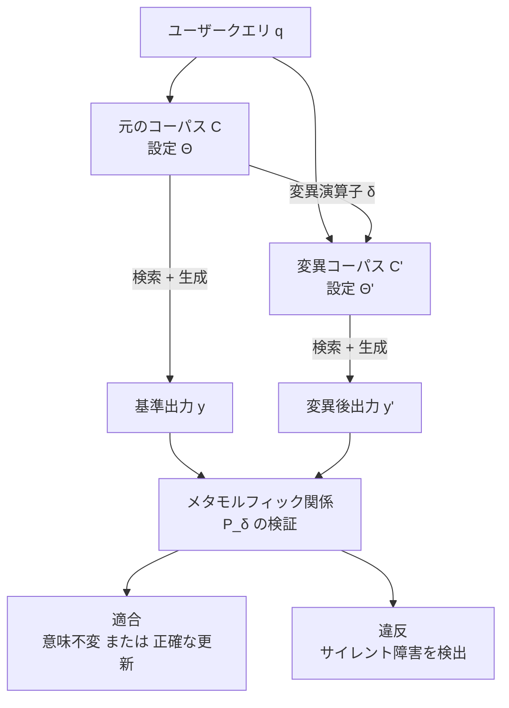

## この記事の対象と、読み終えて持ち帰れるもの

社内マニュアルや規程を検索させる RAG (Retrieval-Augmented Generation) を運用していると、必ず次の問いに突き当たります。

> ドキュメントを 1 本更新したら、この RAG はまだ正しく答えるのか。

RAGAS や ARES のような既存の評価ツールは、この問いに答えるようにはできていません。固定されたコーパスのスナップショットと、人手で用意した正解ペアを前提にしているためです。運用中のコーパスは毎週変わるのに、テストは去年の正解表を見続けている、という状態になります。

この記事では、arXiv に投稿された論文 "When Knowledge Changes: Metamorphic Testing of RAG Systems with Mutations" ([arXiv:2607.26843](https://arxiv.org/abs/2607.26843)) を題材に、**正解データを一切用意せず、コーパスを意図的に変異させて RAG の回帰テストを回す**という発想を整理します。

読み終えると次を持ち帰れます。

- 正解データなしでテストのオラクル (合否判定) を成立させる原理
- 「どこを壊すか」の 2 つのスコープと、11 種類の変異演算子
- 論文が報告した検出精度・修復率と、そこから読み取れる限界
- 自分の CI に最小構成で入れるときの優先順位

前提知識は、RAG のパイプライン (チャンク分割 → 埋め込み → 検索 → 生成) をひととおり触ったことがある程度で十分です。

## なぜ既存の RAG 評価では足りないのか

RAG の障害には、落ちないタイプがあります。例外も出ず、レスポンスも自然な日本語で返ってくるのに、内容だけが古い、あるいは誤っている。論文はこれを **サイレント障害 (Silent Faults)** と呼んでいます。

料金表を「1,000 円/月」から「1,500 円/月」に改定したとします。理想的には回答も 1,500 円に追従してほしい。しかし旧版の記述がコーパスに残っていたり、チャンク境界の都合で新しい記述が検索に乗らなかったりすると、システムは自信たっぷりに 1,000 円と答え続けます。HTTP 200 が返り、faithfulness スコアも高い。誰も気づきません。

既存手法との差を整理すると次のようになります。

| | 従来手法 (RAGAS, ARES など) | メタモルフィックテスト |
|---|---|---|
| 判定の基準 | 固定スナップショット + 固定の正解ペア | 変異前後の**出力どうしの関係** |
| 必要な準備 | クエリごとの正解回答 | 変異演算子と関係の定義のみ |
| 見るもの | 1 回の回答の絶対的な良し悪し | 知識が変わったときの追従性・不変性 |
| 苦手なこと | 改定・削除・ノイズ混入への追従失敗 | 個々の回答の絶対品質 |

つまり両者は置き換え関係ではなく、**測っている軸が違う**ものです。RAGAS は「今の答えは良いか」、メタモルフィックテストは「知識が変わったとき、答えは正しく変わった/変わらなかったか」を見ています。

## 正解データなしで合否を決められる理由

メタモルフィックテスト自体は、ソフトウェアテストの分野で以前からある考え方です。核心は「正解がわからなくても、**入力を決まった形で変えたときの出力の変わり方**なら予測できる」という点にあります。

`sin(x)` の正しい値を知らなくても、`sin(x) == sin(x + 2π)` は成り立つはずだ、と言えます。この「成り立つはずの関係」を **メタモルフィック関係 (Metamorphic Relation: MR)** と呼び、これがそのままテストのオラクルになります。

RAG に持ち込むと、こうなります。



関係は 2 種類だけです。

**意味不変関係 (Invariance)**
回答に必要な核心情報が残っている変異であれば、答えは変わってはいけません。無関係な広告文を混ぜても、チャンク境界をずらしても、埋め込みモデルを差し替えても、「Standard プランは 1,000 円」という答えは同じであるべきです。`y ≈ y'` を期待します。

**意味変化関係 (Variance)**
対象の事実そのものを書き換えた変異なら、答えは**変わらなければいけません**。料金表を 1,500 円に改定したのに 1,000 円と答え続けるなら、それは障害です。`y ≠ y'` を期待し、さらに新しい事実に追従しているか、あるいは「矛盾する記述があるため回答できない」と明示的に降参しているかを見ます。

正解回答の一覧表はどこにも登場しません。必要なのは「どう壊すか」と「壊したとき何が起きるべきか」の定義だけです。テストケースは変異によっていくらでも自動生成できます。これが、正解データの作成・維持コストを払わずに回帰テストを回せる理由です。

## どこを壊すか: 2 つのスコープ

論文が実務的に効いていると感じるのは、変異を注入する場所を 2 つに明示的に分けている点です。

| スコープ | 注入先 | 再インデックス | 何を試せるか |
|---|---|---|---|
| **Pre-chunk** | 原本文書・検索インデックス・パラメータ | 必要 (遅い) | 検索器を含むシステム全体 |
| **Post-chunk** | 検索結果チャンク (プロンプト直前) | 不要 (速い) | 生成 LLM 単体の脆さ |

Post-chunk は、検索が返してきたチャンクにその場でノイズを混ぜてから LLM に渡すだけなので、埋め込み計算が走りません。実行は圧倒的に速い。

ここで直感に反する報告があります。**両スコープで検出される障害の重複率 (Jaccard 指数) は平均 12%〜18% しかありません** (合成データセット RepLiQA のみ 45%)。速い Post-chunk だけ回しておけば Pre-chunk の障害もだいたい拾える、という期待は成り立ちません。両者はほとんど別の障害経路を刺激しています。

理由は考えてみれば自然です。Pre-chunk の変異は「そもそも検索に乗るか」を揺らします。Post-chunk の変異は「乗ってきたものを LLM が正しく読めるか」を揺らします。壊れる場所が違うので、見つかる障害も重ならない。**速いほうだけ回す運用は、検索側の障害をまるごと見逃します。**

## 何を壊すか: 11 の変異演算子

論文は 11 種類の変異演算子を定義しています。適用スコープが Pre のみのものは、再インデックスが前提になるためです。

| 演算子 | 名称 | 何をするか | スコープ |
|---|---|---|---|
| SeN | Semantic Noise | 無関係なドメインの文を散りばめる | Pre / Post |
| DN | Datatype Noise | コード・JSON・URL など異種データを混入 | Pre / Post |
| ISN | Illegal Sentence Noise | 構文的に崩れたガベージ文を挿入 | Pre / Post |
| CN | Counterfactual Noise | 事実に反する文を別 LLM で作って挿入 | Pre / Post |
| SuN | Supportive Noise | キーワードは含むが情報量ゼロのフィラー文 | Pre / Post |
| ON | Orthographic Noise | 1% の確率でタイポ・文字置換を発生 | Pre / Post |
| CM | Chunk Merge | 隣接チャンクを結合 | Pre のみ |
| CSp | Chunk Split | チャンクをより細かく分割 | Pre / Post |
| CSh | Chunk Shift | 50% オフセットで再チャンク化 | Pre / Post |
| EM | Embedding Model Swap | 埋め込みモデルを小型から大型へ変更 | Pre のみ |
| TK | Top-k Perturbation | 検索取得件数 k を変更 (1 → 3 など) | Pre のみ |

これらは、論文が整理した 3 カテゴリの障害分類に対応しています。

**ノイズ感度障害 (Noise Sensitivity)**
- Context Overfitting: 情報量のない類似キーワード (SEO テキストやフィラー) に LLM が釣られ、誤った根拠を採用する
- Knowledge Conflict: 新旧マニュアルが混在したとき、矛盾に気づかず古い情報に引っ張られる
- Input Robustness: 軽微な文字化けやタイポで検索精度と生成結果が崩れる

**フォーマット非寛容障害 (Format Intolerance)**
- Heterogeneous Data: 自然言語中に SQL・JSON・Python コード・財務表が混在すると解釈を誤る
- Syntactic Filtering: HTML タグ崩れやエンコーディングエラーを「不適格」として捨てられず、無理に処理して失敗する

**構造的脆さ障害 (Architectural Brittleness)**
- Segmentation Boundary: チャンク分割位置が少しずれ、免責事項と本文のような意味的つながりが切断される (Lost-in-the-middle 現象を含む)
- Configuration Overfitting: Top-k や特定のベクトル配置に過剰適合し、設定変更で回答能力が大きく落ちる

自分のシステムを見て「うちはどのカテゴリが痛いか」を先に決めると、演算子の取捨選択がしやすくなります。財務表や規程 PDF を扱っているなら Heterogeneous Data と Segmentation Boundary、改定の多い規程なら Knowledge Conflict が主戦場です。

## 論文が報告した数字と、その読み方

評価は 5 つのベンチマーク (T2-RAGBench 傘下の ConvFinQA・FinQA・TAT-DQA・VQAonBD、および新興ナレッジデータ RepLiQA) を対象に、計 28,500 個の変異体を生成して行われました。

### 検出精度

正解データを使ったメタ評価 (テスト手法自体の良し悪しを測る評価) の結果です。

| 評価フレームワーク | F1 (RepLiQA) | F1 (財務 4 データセット) |
|---|---|---|
| 本手法 (MR オラクル) | 0.927 | 1.000 |
| RAGAS (Context Recall) | 0.570 | < 0.460 |
| RAGAS (Faithfulness 等) | < 0.450 | < 0.460 |

差は大きいのですが、**この数字を「MT のほうが評価手法として優れている」と読むのは正しくありません**。測っている対象が違います。ここでの正解ラベルは「コーパス変異によってシステムが壊れたか否か」であり、RAGAS はそもそもそれを検出するために設計されていません。読み取るべきは「静的スコアはコーパス変化に起因する不整合をほとんど拾えない (偽陰性が多発する)」という一点です。

### どの演算子が凶悪か

- MR 違反率: Pre-chunk 変異で 6.0%〜8.1%、Post-chunk 変異で 4.9%〜10.2%
- 最も違反を引き起こした演算子は **CN (Counterfactual Noise)** で、VQAonBD データセットでは違反率 27.6%

事実そのものを書き換える変異が最も障害を暴く、という結果は素直です。そしてこれは、実運用で最も頻繁に起きる変化 (価格改定・規程改訂・仕様変更) と一致します。**優先度をつけるなら CN から**という判断根拠になります。

### 障害は直せるのか

検出された障害に対し、3 つのありふれた対処を適用した実験も行われています。

1. 検索 Top-k の拡張 (k = 1 → 3, 5)
2. 生成 LLM のアップグレード (GPT-5-mini → GPT-5.4)
3. LLM ベースのリランカーを前段に挿入

結果は全体の **43.1%** が解決。ただし内訳の開きが重要です。

- 財務データセット: 47.3%〜63.0% が修復
- 合成データセット RepLiQA: **10.2%** にとどまる

半分以上は、検索バジェットを増やしてもモデルを上げても直りません。ここが実務的に一番効く示唆だと思います。**「精度が出ないからモデルを上げる」という反射的な対処では、検出された障害の半分以上に届かない。** 矛盾検知や深い推論を要する障害は、パイプラインの設計側 (コーパスの重複排除、改定時の旧版パージ、矛盾検出の明示的な組み込み) で対処するしかありません。逆に言えば、MT を入れる価値は「直る障害と直らない障害を分離できる」ことにあります。

## 自分の CI に入れるなら

論文の限界と、そこから導ける実践手順を整理します。

### 限界として押さえておくこと

**実行コストが重い**
Pre-chunk 変異は再インデックス化 (埋め込み計算) を伴います。全クエリ × 全 11 演算子を毎コミット走らせるのは非現実的です。

**LLM-as-a-Judge の判定が揺れる**
自然言語の同義性判定には、論文で約 5% 前後の判定不確定性があるとされています。テストが確率的に落ちる = 誰も見なくなるフレーキーテストになりかねません。

### 最小構成の導入順序

上記を踏まえると、次の順で入れるのが現実的です。

1. **Post-chunk × CN だけを PR ごとに回す**
   再インデックス不要で速く、最も障害を暴く演算子。ここから始める。
2. **重要フィールドは決定論的にアサートする**
   金額・日付・型番のような値は、LLM 判定ではなく正規表現や構造化パースで検証する。判定の揺らぎを一番効く場所から排除する。
3. **Pre-chunk は夜間バッチに寄せる**
   CN と CSh (Chunk Shift) に絞ったスモークテストを nightly で回す。全演算子は週次かリリース前に限定する。
4. **修復不能な障害を別レーンに分ける**
   Top-k 拡張やモデル更新で消えない違反は、パイプライン設計の課題として issue 化する。テストの緑化ではなく設計変更で閉じる。

### 概念コード

料金改定を Counterfactual Noise として注入する、Variance 関係のテストです。

```python
# メタモルフィック回帰テストの概念コード例 (CI 組み込みイメージ)

def test_rag_price_update_metamorphic():
    query = "Standardプランの月額料金はいくらですか？"

    # 1. 既存コーパスでの回答取得
    base_response = rag_pipeline.query(query)  # 例: "月額 1,000 円です。"

    # 2. 変異演算子: 価格改定 (CN: Counterfactual Mutation) をコーパスに注入
    mutated_corpus = corpus.copy_and_update(
        target_doc="price_list.md",
        old_text="Standardプラン: 1,000円/月",
        new_text="Standardプラン: 1,500円/月 (2026年改定)",
    )

    # 3. 変異コーパスでの回答取得
    mutated_response = rag_pipeline_with_corpus(mutated_corpus).query(query)

    # 4. Metamorphic Relation (Variance Predicate) のアサーション
    assert mutated_response != base_response, "価格改定が回答に反映されていません"
    assert "1,500" in mutated_response, "新価格が正確に参照されていません"
```

擬似コードなので、`rag_pipeline` 周辺は自分のパイプラインに読み替えてください。要点は 4 行目のアサーションです。「新価格が入っているか」を決定論的な文字列チェックで見ており、LLM 判定に頼っていません。前節の 2 番目の指針をそのまま形にしたものです。

日本語で運用する場合は、表記揺れへの対応が追加で必要になります。「1,500円」「1500円」「1,500 円」を同一視する正規化を挟まないと、正しく追従しているのに落ちるテストになります。論文自身も、日本語特有の形態素・表記揺れに対応した変異演算子の構築を今後の課題として挙げています。

## まとめ

- RAG の運用障害には、エラーも出ず自然な回答が返るのに内容だけが古い**サイレント障害**がある。静的評価ツールはこれを構造的に拾えない
- メタモルフィックテストは、正解データの代わりに**変異前後の出力の関係**をオラクルにする。「変わってはいけない」(意味不変) と「変わらなければいけない」(意味変化) の 2 種類だけで成立する
- 変異の注入先は Pre-chunk (再インデックスあり・遅い) と Post-chunk (プロンプト直前・速い) に分かれ、**検出される障害の重複は 12%〜18% しかない**。速いほうだけでは検索側の障害を見逃す
- 最も障害を暴く演算子は CN (Counterfactual Noise)。実運用で最も頻発する「改定」と一致するため、優先度を付けるならここから
- 検出された障害のうち Top-k 拡張・モデルアップグレード・リランカーで直るのは 43.1%。**残りはパイプライン設計側の課題**であり、MT の価値は両者を分離できることにある
- 導入は「Post-chunk × CN を PR ごと」「重要フィールドは決定論的アサート」「Pre-chunk は夜間バッチ」の順が現実的

正解データを作り続けるコストが理由で RAG の回帰テストを諦めているなら、この方向は一度試す価値があります。テストケースは変異が勝手に増やしてくれます。

この記事が少しでも参考になった、あるいは改善点などがあれば、ぜひリアクションやコメント、SNSでのシェアをいただけると励みになります！

## 参考リンク

- Jinhan Kim, Samuele Pasini, Paolo Tonella. "When Knowledge Changes: Metamorphic Testing of RAG Systems with Mutations." arXiv preprint arXiv:2607.26843 (cs.SE), 2026. — https://arxiv.org/abs/2607.26843
  - HTML 版: https://arxiv.org/html/2607.26843
  - 実装コード: https://github.com/dbr7/RAG-metamorphic-mutation (CC BY 4.0)
- Shahul Es, Jatin James, Luis Espinosa Anke, Steven Schockaert. "RAGAS: Automated Evaluation of Retrieval Augmented Generation." EACL 2024.
- Patrick Lewis, et al. "Retrieval-Augmented Generation for Knowledge-Intensive NLP Tasks." NeurIPS 2020.
- Nelson F. Liu, et al. "Lost in the Middle: How Language Models Use Long Contexts." TACL 2024.
