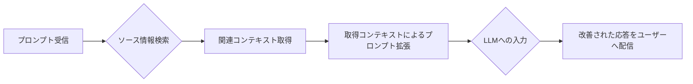
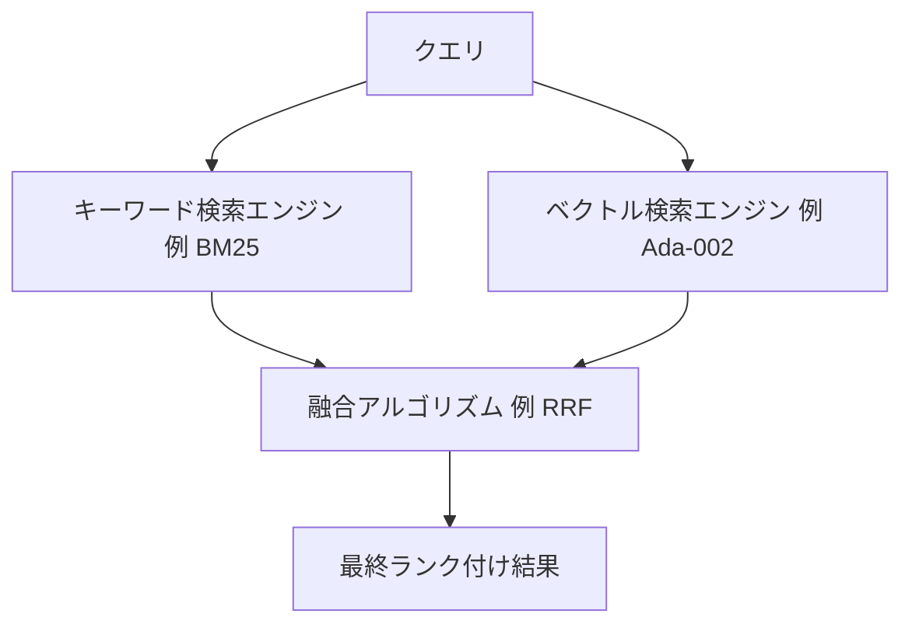
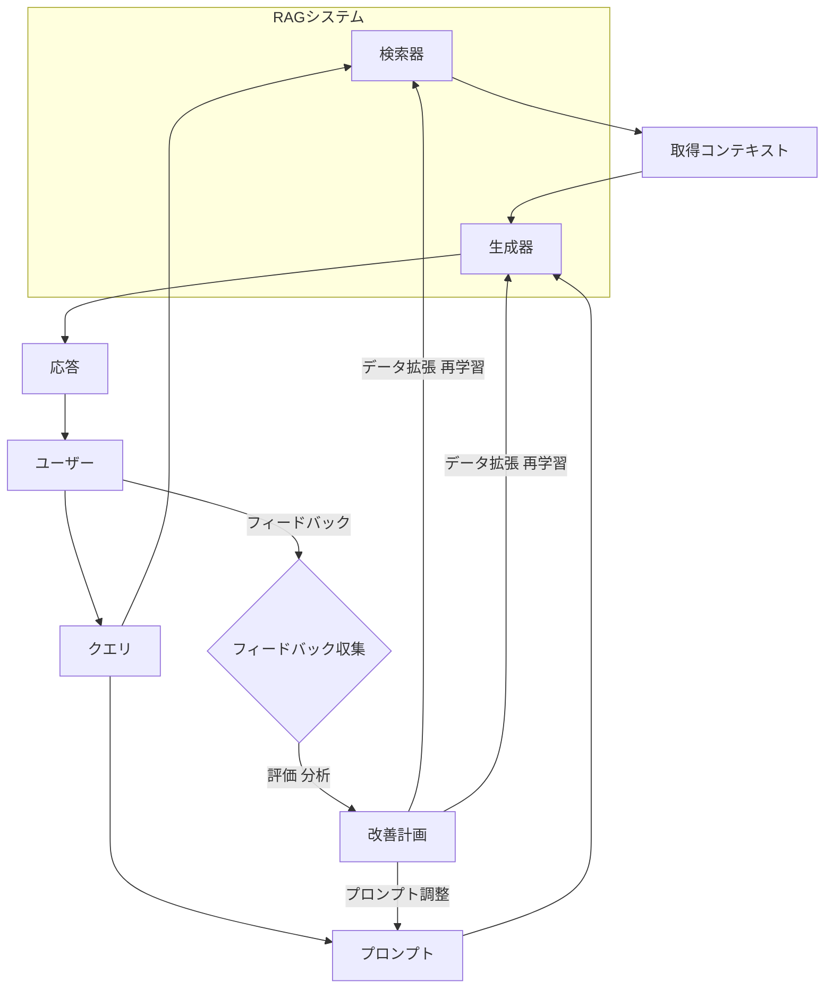
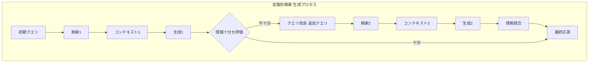

## 1. RAGと精度向上の重要性

### 1.1. 検索拡張生成（RAG）の定義

検索拡張生成（Retrieval Augmented Generation: RAG）は、**検索ベースの手法とLLMを組み合わせる技術**です。この技術は、特に自然言語処理（NLP）において出力を強化します。RAGはLLMの出力を最適化するプロセスです。そのプロセスでは、LLMが訓練データ外の権威ある知識ベースを参照してから応答を生成します。

RAGの基本的なメカニズムは、ユーザーのクエリ（プロンプト）に応じて関連性の高い文書やデータ断片を取得します。そして、これらの情報を後続のLLMが利用し、より正確で文脈に即した出力を生成します。このプロセスは、一般的に以下のステップを含みます。

| 要素名                               | 説明                                                                              |
| :----------------------------------- | :-------------------------------------------------------------------------------- |
| プロンプト受信                       | ユーザーからの質問や指示を受け付けます。                                          |
| ソース情報検索                       | 受け取ったプロンプトに基づいて、関連情報を含むデータソースを検索します。          |
| 関連コンテキスト取得                 | 検索結果から、プロンプトに最も関連性の高い情報を抽出します。                      |
| 取得コンテキストによるプロンプト拡張 | 元のプロンプトに取得したコンテキスト情報を追加し、LLMへの指示をより明確にします。 |
| LLMへの入力                          | 拡張されたプロンプトを大規模言語モデルに入力します。                              |
| 改善された応答をユーザーへ配信       | LLMが生成した、より正確で文脈に即した応答をユーザーに提供します。                 |

RAGの重要な点は、**モデルを再訓練することなく**LLMの能力を**特定のドメインや組織の内部知識ベースに拡張できる**ことです。これにより、広大なデータリザーブと精密な生成の必要性との間のギャップを埋めることができます。

### 1.2. RAGシステムにおける精度の決定的役割

RAGシステムの精度は、ユーザーの信頼とシステムの信頼性に直接影響します。RAGシステムの精度が低いと誤情報が拡散し、有用性が低下する可能性があります。

精度は、質疑応答、要約、そして事実の正確性を要求するコンテンツ生成などのタスクにおけるRAGの有効性に直接影響します。例えば企業環境では、正確なRAGは意思決定のための信頼できる情報を提供することにより、業務効率を大幅に改善できます。

RAGの主要な利点の一つは、**ハルシネーションを削減**する能力です。ハルシネーションとは、もっともらしいものの事実と異なる、あるいは誤解を招く情報です。RAGは、**検証済みの取得文書に生成プロセスを固定する**ことで、この問題を軽減します。これがRAGを採用する主要な動機となっています。

### 1.3. RAGの精度を妨げる一般的な課題

RAGシステムの精度は、複数の段階で課題に直面する可能性があります。主な課題は以下の通りです。

| フェーズ         | 課題内容                                                                 |
| :--------------- | :----------------------------------------------------------------------- |
| **検索フェーズ** | 無関係または不完全な文書の取得                                           |
|                  | ユーザーのクエリ意図の誤解釈                                             |
|                  | 最適でないデータチャンキングによる、断片的または過剰なコンテキストの生成 |
|                  | ドメイン固有のニュアンスを捉える上での埋め込みモデルの限界               |
| **生成フェーズ** | LLMによる提供コンテキストの見落としや誤解                                |
|                  | ノイズが多い、または矛盾するコンテキストの場合に持続するハルシネーション |
|                  | 複数の取得文書からの情報を首尾一貫して統合することの難しさ               |
| **システム全体** | 外部データの陳腐化（定期的な更新の欠如）                                 |
|                  | 多コンポーネントシステムの評価とデバッグの複雑さ                         |

RAGシステムの精度は、本質的に依存関係の連鎖の問題です。クエリ理解、検索、コンテキスト拡張、生成といったいずれかのコンポーネントの弱点が、エンドツーエンドの精度を不均衡に低下させる可能性があります。この相互接続性は、**全体的な最適化が鍵**であることを意味します。

さらに、**RAGにおける「精度」の定義は多面的**です。事実の正確性だけでなく、**関連性、一貫性、そしてソースへの忠実性も包含**します。**評価もまた多面的**である必要があります。外部データの陳腐化の問題は、単なるデータメンテナンスの問題ではありません。最新情報を提供するというRAGの約束に対する中核的な課題です。このため、RAGシステムの設計において、データ取り込みと更新のパイプラインを後付けではなく、不可欠な部分として組み込む必要があります。

## 2. 優れた精度を実現するための検索フェーズの強化

検索フェーズの品質は、RAGシステム全体の精度に大きく貢献します。このセクションでは、検索精度を高めるための主要な戦略を説明します。

### 2.1. データ前処理とチャンキング戦略の最適化

「Garbage In, Garbage Out（ゴミを入れればゴミが出る）」の原則はRAGシステムにおいて極めて重要です。取得データの品質は、前処理とチャンキングに大きく左右され、RAGの有効性に直接影響します。不適切にセグメント化されたデータは、最適とは言えない結果につながります。

**チャンクサイズとオーバーラップの影響**

チャンクサイズは非常に重要です。

  * 大きすぎるチャンク: 重要な詳細の希薄化、またはLLMトークン制限超過の可能性。
  * 小さすぎるチャンク: コンテキストの喪失、または無関係な情報の混入の可能性。

**最適なチャンクサイズはタスクとデータに依存**し、多くの場合**実験が必要**です。小さなチャンクは詳細な検索を可能にしますが、コンテキストに欠けることが多いです。一方、大きなチャンクはより多くのコンテキストを保持しますが、特定のマッチを薄める可能性があります。チャンクのオーバーラップは、チャンク境界を越えてコンテキストを維持し、重要な情報が失われないようにするのに役立ちます。例えば、LangChainのCharacterTextSplitterはチャンクサイズとオーバーラップの指定を可能にします。

**高度なチャンキング戦略**

以下に代表的なチャンキング戦略とその特徴を示します。

| 戦略名                                 | 説明                                                                                | メリット                                                                           | デメリット                                                                   |
| :------------------------------------- | :---------------------------------------------------------------------------------- | :--------------------------------------------------------------------------------- | :--------------------------------------------------------------------------- |
| 固定長チャンキング                     | テキストの単純な固定文字数またはトークン数での分割。                                | 実装の容易性。                                                                     | 文の途中での分割によるコンテキスト喪失の可能性。                             |
| セクションベース／文書要素チャンキング | 段落、見出し、リストアイテムなど、文書の構造的要素に基づく分割。                    | 文書構造の保持のしやすさ。                                                         | 意味的境界との不一致、または詳細なチャンク取得の困難性。                     |
| 文チャンキング                         | テキストの個々の文への分割。                                                        | 各チャンクでの完全な思考の維持のしやすさ。                                         | 文の長さのばらつきによる、非常に短い文からの非効率的なチャンク生成の可能性。 |
| セマンティックチャンキング             | テキストの意味内容と言葉やフレーズ間の関係に基づく分割。NLPモデルや埋め込みの利用。 | 各チャンクでのコンテキストと関連性保持のしやすさ、取得データの関連性と精度の向上。 | 計算コストの高さ、リソースの消費。                                           |
| 階層的チャンキング                     | 文書の複数粒度（例：章、セクション、段落）でのチャンク化。                          | クエリに応じた適切な詳細レベルの情報との一致のしやすさ。                           | 管理の複雑化の可能性。                                                       |
| 動的チャンキング                       | クエリの複雑さや内容に応じたチャンクサイズの動的調整。                              | クエリに最適化されたコンテキスト提供の可能性。                                     | 実装の複雑性、計算コストの変動。                                             |
| 命題チャンキング                       | 文の、より基本的な意味単位である命題への分割。                                      | より精密な情報検索の実現。                                                         | 前処理の複雑性、文脈の過度な断片化の可能性。                                 |
| コンテキストチャンクヘッダー           | 各チャンク冒頭への、そのチャンクの文脈を示すヘッダー情報の付与。                    | LLMによるチャンク内容理解の容易化。                                                | ヘッダー設計の不適切さによる効果の希薄化の可能性。                           |

**データセットの整理**

データのカテゴリごとの分類、関連情報の一箇所への集約、古い情報の削除と新しい情報の追加は、効率的な検索と新鮮で正確な回答を得るために不可欠です。

**チャンキング**には、**文脈的な完全性と検索精度との間にトレードオフが存在**します。セマンティックチャンキングや命題チャンキングという手法は、**チャンクを意味と整合させる**ことで、この問題の解決を試みます。しかし、これらの手法は**計算コストが高く**なります。一方、単純な固定長分割や文分割は計算コストが低いです。しかし、文脈を壊したり、無関係な情報を含んだりするリスクがあります。セマンティックチャンキングは、「意味のある」単位を作成しようと試みます。そのためには、より深い言語処理が必要です。結果として前処理コストが増加します。その代わり、LLMにとってより関連性の高い文脈を提供できます。これにより、生成エラーを削減できる可能性があります。したがって、**チャンキング戦略の選択は、エンジニアリング上の決定**といえます。精度のニーズとリソースの制約とのバランスを取る必要があります。

以前は単純な固定長分割が用いられていました。現在では、セマンティックチャンキングや動的チャンキングのような、より洗練された手法へと進化しています。この進化は、**「検索単位」自体がRAGの性能にとって重要なハイパーパラメータ**であるという、より深い理解を反映しています。当初、チャンキングは、コンテキストをLLMの処理ウィンドウに収めるための、いわば必要悪と見なされていたかもしれません。しかし研究により、チャンキングが重要な影響を与えることがわかってきました。どのような情報が取得されるか、そしてLLMがそれをどれだけうまく利用できるか、という点に影響します。

**高度な技術では、チャンキングを最適化問題として扱います**。そして、**「検索可能」であり、かつ「生成に適した」チャンクを作成**することを目指しています。効果的なチャンキングは、後続のLLM生成ステップでの効率とコストに直接影響します。より良く、より簡潔なチャンクは、**LLMへ渡される無関係な情報が減る**ことを意味します。その結果、LLMが処理する**トークン数が削減され、レイテンシとコストも低減**します。さらに、ノイズが減ることで**応答品質が向上**する可能性もあります。

### 2.2. 埋め込みモデルの卓越性：選択とファインチューニング

埋め込みモデルは、**テキストを意味的意味を捉えたベクトル表現に変換**し、セマンティック検索と再ランキングに不可欠です。

**適切な埋め込みモデルの選択**

様々なモデルが存在します。

  * **高密度モデル**: セマンティックな意味を捉えるためのE5、OpenAIのAda-002、text-embedding-3-largeなど。
  * **疎なモデル**: キーワードマッチングのためのBM25やSPLADEなど。

選択は、ドメイン特異性、リアルタイム性能、スケーラビリティ、計算リソースといった特定の要件に依存します。実世界のユースケースに対するベンチマークが不可欠です。人気のあるモデルには、Sentence-BERT、OpenAIのtext-embedding-ada-002、BioBERTのようなドメイン固有のオプションが含まれます。

**ドメイン固有データでの埋め込みのファインチューニング**

汎用的な埋め込みモデルは、しばしば金融、法律、医療などの語彙といったドメイン固有の知識に欠けます。ファインチューニングは、類似性メトリクスをドメイン固有のコンテキストと言語に整合させます。これにより、関連文書の検索を改善し、より正確で文脈に適したRAG応答をもたらします。

ファインチューニングのプロセスには、以下の要素が含まれます。

  * ドメイン固有データセットの使用。
  * 合成データセット生成。
  * 適切な損失関数の使用（例：検索タスクのためのMultipleNegativesRankingLoss）。

大幅な改善が示されており、例えば、金融データセットでのファインチューニング後、bge-base-en\_dot\_ndcg@10メトリックが0.59から0.82に改善した事例もあります。ファインチューニングは、専門用語の扱いやドメイン固有の構造的・文脈的パターンの把握に役立ちます。

**継続的な評価と更新**

**埋め込みモデルは定期的に評価**し、必要に応じて**更新または再調整**する必要があります。

汎用埋め込みとドメイン固有言語との間には「意味的ギャップ」が存在します。この**意味的ギャップは、専門分野におけるRAG精度の主要なボトルネック**です。ファインチューニングは単なる最適化ではありません。ファインチューニングは、そのようなドメインで高性能を達成するための必要条件です。汎用モデルは専門用語（例えば「res ipsa loquitur」や「MI」など）を誤解釈したり過小評価したりすることが明確に示されています。これは直接的に質の低い検索につながります。検索が悪ければ、生成器は最適でないコンテキストを受け取ります。その結果、不正確または無関係な回答が生成されることになります。したがって、**埋め込みのファインチューニングはこの意味的ギャップを埋めます**。これにより、直接的に検索が改善されます。そして、その後に続く生成もより良いものになります。

埋め込みモデルの選択とファインチューニングの決定は、RAGシステム設計における重要な初期段階の分岐点です。これらの決定は、精度、コスト、メンテナンスに長期的な影響を与えます。**強力なプロプライエタリモデル**を選択すると、**すぐに使える優れたパフォーマンス**が得られるかもしれません。しかし、その場合、**コストがかかりカスタマイズ性が低い可能性**があります。**オープンソースモデル**は**柔軟性とファインチューニングの可能性**を提供します。しかし、その場合、**より多くのMLOpsの労力**が必要となる場合があります。この決定は、初期の精度に影響します。それだけでなく、ドメインやデータが進化するにつれてシステムを維持・改善するための継続的な労力にも影響します。

埋め込みファインチューニング技術は高度化しています。例えば、合成データ生成や特化型損失関数といった技術があります。この高度化は、RAGの「検索」部分が「生成」部分と同様に複雑で、モデル駆動型になっていることを示しています。**RAGシステムは、複数の特化型ファインチューニングモデルで構成されるように**なっています。この傾向は**システムの能力を高め**ますが、同時にその**複雑さと、構築・維持に必要な専門知識も増大**させます。

### 2.3. 高度なクエリ理解と変換

ユーザーのクエリは曖昧であったり、不適切に表現されていたり、知識ベースの言語と完全に一致していなかったりすることがあります。単純な意味的マッチングは、表現のバリエーションに敏感です。

**クエリ書き換え／再構成**

検索精度を向上させるために、ユーザーのクエリを再構成または拡張します。これには、書き換えやサブクエリへの分解が含まれます。検索エンジンがユーザーの意図をより正確に理解するのを助けることを目的とします。

**クエリ拡張技術**

以下に代表的なクエリ拡張技術を示します。

| 技術名                              | 説明                                                                                                                                                                                                                                                                                       |
| :---------------------------------- | :----------------------------------------------------------------------------------------------------------------------------------------------------------------------------------------------------------------------------------------------------------------------------------------- |
| 仮説的文書埋め込み（HyDE）          | クエリに対する仮の回答生成と、その埋め込み。この埋め込みを使用した類似の実際の文書発見。質問と関連情報とのマッチング向上。                                                                                                                                                                 |
| 同義語拡張                          | 類語辞典やNLPツールを使用した、主要用語の同義語の組み込み。より広範な関連文書の捕捉。                                                                                                                                                                                                      |
| 文脈的再表現                        | 暗黙的な文脈を含むようなクエリ修正。                                                                                                                                                                                                                                                       |
| サブクエリ生成                      | 複雑なクエリの、より単純で回答可能なサブクエリへの分解。特に多段階推論への有用性。Flan-T5によるクエリ拡張のためのファインチューニング可能性。                                                                                                                                              |
| 論理駆動型ターゲット検索            | クエリの論理（因果関係、条件付き制約など）の深い分析による高度な推論。単なる意味的類似性を超えた検索戦略の動的な洗練。例：「糖尿病患者の術後感染リスクを低減する方法は？」という質問に対し、一般的な「糖尿病術後ケア」よりも「血糖コントロール閾値」や「抗生物質使用ガイドライン」の優先。 |
| クエリ拡張と計画                    | 特定のニュアンスに欠ける質問に必要な文脈提供の保証。クエリ計画による、元のクエリを文脈化するサブクエリ生成。階層的な質問構造化やフィードバックに基づく動的なクエリ調整戦略。                                                                                                               |
| LLMによる関連性チェックとクエリ改良 | 追加のLLMによる、取得された断片の関連性チェック実行。必要に応じたユーザークエリ改良による、最も関連性の高い情報のみの生成器への受け渡し。                                                                                                                                                  |

**クエリ変換**は、単純なキーワード拡張から、**洗練されたLLM駆動の推論・計画プロセスへ進化**しています。この進化は、RAGの「理解」コンポーネントが高度になり、適応性が向上することを示します。初期のRAGは、良質なユーザークエリに依存していたと考えられます。HyDEのような技術により、LLMは良質な文書を「想像」できるようになりました。現在では、論理駆動型検索やLLMベースのクエリ改良手法が登場しました。これらの手法は、LLMがクエリを分解・推論し、戦略的に再構成する能力を示します。これにより、LLMは複雑な情報ニーズに合わせて検索を最適化できます。その結果、RAGシステムは不完全なユーザー入力に対する堅牢性が向上します。

**クエリ分解とサブクエリ生成**への移行は、RAGシステムの**多段階推論能力を実現**します。複雑な質問は、複数の情報源から情報を統合したり、一連の論理を追跡したりすることをしばしば必要とします。例えば「マグネシウムとカルシウムの化学的性質は何か？」というクエリは、「マグネシウムの化学的性質は何か？」などに分解されます。この分解により、システムは各サブパートに絞って検索できます。その後、回答を統合できます。この方法は、構成的なクエリに不向きな単純RAGの限界に対処します。

**クエリ変換段階でのLLMの利用**は、**検索フェーズと生成フェーズの間の結合**を緊密にします。また、一貫性があり文脈を意識したRAGシステムにつながる可能性があります。LLMがクエリ改良や仮説文書生成をする際、既に応答に有用な情報種別を「考慮」します。この意図の事前処理により、生成LLMの使用法と整合した文書を取得できるようになるかもしれません。これにより、検索器が見つけるものと生成器が要求するものの間のインピーダンスミスマッチが減少します。

### 2.4. 高度な検索およびランキングメカニズム

**ハイブリッド検索（キーワード＋ベクトル）**

**キーワードベースの検索と、セマンティック検索やベクトル検索の長所を組み合わせ**ます。キーワードベースの検索は、製品名のような重要な用語を完全一致で検索する際に有効です。これにはBM25のようなアルゴリズムが用いられます。セマンティック検索やベクトル検索は、文脈を理解したり、曖昧なクエリを処理したりするのに優れています。単一の検索手法を使用するだけでは限界があるため、これらの長所を組み合わせることで対処します。

高密度ベクトルは文脈の理解に優れています。一方、疎ベクトルはキーワードの扱いに優れています。Reciprocal Rank Fusion (RRF) のような融合アルゴリズムは、並列検索から得られた結果を組み合わせてランク付けをします。Weaviateでは、アルファパラメータを使用して、キーワード検索とベクトル検索の間の重み付けを調整できるようになります。

| 要素名                 | 説明                                                                                    |
| :--------------------- | :-------------------------------------------------------------------------------------- |
| クエリ                 | ユーザーからの入力質問または指示です。                                                  |
| キーワード検索エンジン | BM25などのアルゴリズムを使用し、クエリ内のキーワードに厳密に一致する文書を検索します。  |
| ベクトル検索エンジン   | Ada-002などの埋め込みモデルを使用し、クエリと意味的に類似した文書を検索します。         |
| 融合アルゴリズム       | RRFなどの手法を使用し、キーワード検索とベクトル検索の結果を統合して再ランク付けします。 |
| 最終ランク付け結果     | 統合され、関連性の高い順に並べられた検索結果です。                                      |

**インテリジェントな再ランキング戦略**

初期検索では多くの候補が返される可能性があります。再ランキングはこれらを再評価し、最も関連性の高い情報を優先します。単純な検索スコアを超えて、文脈的および意味的類似性を考慮します。初期検索からのより小さな候補セットに対して、より計算量の多いモデル（例：MonoBERTのようなクロスエンコーダ）を使用できます。

  * **HyperRAG**: 文書側のKVキャッシュ再利用による再ランキング推論の最適化と効率向上。
  * **ASRank**: 「回答の香り」を使用したゼロショット再ランキング。LLMによる、文書由来の回答が期待される回答タイプと一致する可能性の計算。大幅な改善の提示（例：NQ Top-1精度が19.2%から46.5%へ）。

**知識グラフ統合（例：GraphRAG）**

孤立したテキストチャンクを検索するだけでなく、知識グラフ（KG）に保存されている情報エンティティ間の関係を活用します。特に多段階推論を必要とする複雑なクエリに対して、より文脈を意識した正確な情報検索を可能にします。

  * **KG^2RAG**: チャンク間の事実レベルの関係のためのKG使用。多様で一貫性のある検索のためのチャンク拡張と編成の誘導。
  * **KG-RAG**: 訓練なしでのLLMとKGの統合。多段階検索のための質問分解と説明可能性のためのCoTの使用。
  * **HopRAG**: 論理的な接続（エッジとしての疑似クエリ）を持つパッセージグラフ構築。多段階探索のための検索-推論-枝刈りメカニズムの使用。

**その他の高度な検索技術**

  * **アンサンブル検索**: 複数検索モデルの組み合わせ。
  * **多面的フィルタリング**: 複数フィルタリング技術（メタデータ、類似性閾値）の適用。
  * その他: 関連セグメント抽出、コンテキストエンリッチメント、階層的インデックス、ダーツボード検索、マルチモーダル検索など。

検索プロセスは、**多段階パイプラインへと進化**しています。例えば、 初期検索->再ランキング->KGベースの改良 という段階があります。この進化は、複雑な情報ニーズに対して単一の検索では不十分だった経験を反映しています。単純なベクトル検索は結果の幅が広すぎるかもしれません。その後、再ランキングでより詳細に吟味します。ハイブリッド検索は異なる検索の考え方を組み合わせます。KG統合は構造化された推論の層を追加します。この階層的なアプローチにより、各段階で速度と精度のバランスを取り、LLMに渡す最終的な文書セットで高い関連性を目指せるようになります。

LLMは、最終的な生成器としてだけではなく、検索やランキングのプロセス内でもますます使用されるようになっています。これは、**検索器と生成器の間の境界線を曖昧に**します。伝統的に、検索は統計的手法やベクトル類似性に基づいていました。現在では、LLMを文書の回答可能性や関連性の評価に使用するASRankのような手法があります。また、グラフ構造内での探索を導くためにも使用するHopRAGのような手法もあります。LLMの知能がRAGパイプラインの早い段階で活用されるようになり、検索自体をより意味的に洗練されたものにしています。

知識グラフの統合で、RAGシステムは**知識間の関係と構造化された知識を理解し活用できるように**なり、より堅牢な多段階推論と説明可能性を実現できるようになります。テキストベースの検索は、エンティティや概念間の関係を見逃すことがよくありますが、KGはこれらの接続を明示的にします。RAGシステムは、これらのグラフを横断したり、チャンク拡張を導くために使用したりします。HopRAGやKG^2RAGのような手法があります。これにより、純粋にテキストベースのコーパスでは見つけられない情報を論理的な経路でたどれるようになり、複雑な多段階の質問に答える能力を強化します。また、KG-RAGのような手法では、回答がどのように導き出されたかについて、より明確な説明を提供できるようになる場合もあります。これは、より理解しやすく、推論しやすいRAGへの一歩です。

### 2.5. ベクトル検索パラメータの最適化

ベクトルデータベース／ライブラリの選択は重要です。FAISS、Annoy、ScaNNのようなライブラリは、近似最近傍（ANN）検索用に設計されていますが、アルゴリズム、性能トレードオフ、ユースケースが異なります。

| ライブラリ | 主な特徴                                                                                                                        | 最適なユースケース                                           | 留意点                                                                                       |
| :--------- | :------------------------------------------------------------------------------------------------------------------------------ | :----------------------------------------------------------- | :------------------------------------------------------------------------------------------- |
| **FAISS**  | 大規模データセット効率への焦点。GPUアクセラレーション対応。ベクトル量子化（IVF, PQ）使用。近似および完全kNN探索、増分更新可能。 | 大量の動的データ、高速性が求められる場合。                   | 設定の複雑性（クラスタ数、量子化レベルなど）。                                               |
| **Annoy**  | 単純さ、軽量デプロイ、メモリ効率優先。ランダム射影木使用。ディスクバックストレージ。                                            | 中程度の静的データセット、速度重視で厳密な精度が不要な場合。 | 不変インデックス（データ変更時再構築）。GPUサポートなし。精度はFAISS/ScaNNに劣る場合がある。 |
| **ScaNN**  | 内積類似性における高精度への最適化。異方性ベクトル量子化使用。                                                                  | NLPなど内積類似性が重要なタスク、高精度が求められる場合。    | メモリ集約的でチューニングが必要な場合がある。                                               |

**パラメータチューニング**

  * インデックスタイプの選択（例：FAISSにおけるIndexFlatL2、IndexIVFPQ）。
  * `nlist`（IVFのボロノイセルの数）、`m`（PQのサブ量子化器の数）、`nbits`（PQのサブ量子化器あたりのビット数）などのパラメータ。
  * 検索時パラメータ（`k`：取得する近傍の数、`nprobe`：IVFの検索時に訪れるボロノイセルの数）。
  * リコール、精度、クエリレイテンシ、インデックス構築時間／メモリ使用量のバランス調整。

**ANNアルゴリズムの選択とチューニングは**、重要な**エンジニアリング上のトレードオフ**です。検索精度、速度、コスト、そしてデータの動態性の間でバランスを取る必要があります。あらゆる状況で「最良」となるセットアップは存在しません。FAISSは、大規模で動的なデータセットに対しGPUパワーを提供しますが、複雑な側面もあります。Annoyは、静的データに対してシンプルでメモリ効率が良いですが、精度やスケーラビリティの点で劣ります。ScaNNは、特定の類似性タイプで高精度を目指します。これらのライブラリ内のパラメータは、検索の網羅性と速度のバランスを制御します。例えば、FAISSのnlistやnprobeがこれにあたります。大規模で頻繁に更新するデータセットでリアルタイム応答が必要なシステムと、より小さく静的なデータセットを扱うシステムとは、最適な選択肢が異なります。

ANNの「A」は「近似」を意味します。この検索ステップでは、LLMがコンテキストを見る前に、エラーのあるソースや最適でない可能性のあるソースを導入するかもしれません。ベクトル検索の最適化とは、運用上の制約内でこの近似エラーを最小限にすることです。ANNアルゴリズムは、速度を優先するために完全なリコールを犠牲にします。ベクトル検索で**積極的な近似設定をすると、本当に最も関連性の高い文書を見逃してしまう場合**があり、下流の再ランキングやLLMの能力をもってしても、その情報を回復できません。ただし、ハイブリッドセットアップでキーワード検索のような**代替検索パスがあれば、回復できる可能性も**あります。そのため、これらのパラメータを慎重にチューニングすることが不可欠です。初期候補プールが十分に高品質であることを保証できるようになります。

**ベクトルデータベースの規模が大きくなり、リアルタイム性能への要求も高まって**います。この状況が、ANNアルゴリズムとハードウェアアクセラレーションでのイノベーションを推進しています。ハードウェアアクセラレーションの一例として、GPU上でのFAISSの利用が挙げられます。このことは、RAGのインフラストラクチャがアルゴリズム自体と同じくらい重要であることを示します。組織がRAGのためにインデックス化するデータ量が増加すると、ベクトルストア自体のサイズが課題になります。数十億ものベクトルをミリ秒単位で効率的に検索する必要があります。そのためには、**アルゴリズムだけでは不十分で、特殊なハードウェアと分散システムも必要**になります。最先端のRAGシステムを構築するには、高性能コンピューティングインフラストラクチャへのアクセスと専門知識が、ますます重要になっていきます。

## 3. 生成品質と事実整合性の向上

検索フェーズで質の高いコンテキストを取得できたとしても、LLMがそれを効果的に利用し、高品質で事実に整合した応答を生成できなければ、RAGシステムの価値は損なわれます。このセクションでは、生成フェーズにおける精度向上のための戦略を詳述します。

### 3.1. RAGのための戦略的プロンプトエンジニアリング

プロンプトは、取得されたコンテキストをどのように使用してクエリに回答するかをLLMに指示する役割を果たします。RAGでは、拡張プロンプト（元のクエリ＋取得されたコンテキスト）が鍵となります。

**効果的なプロンプトの作成**

  * **明確な指示**: 提供コンテキストに基づくLLMへの回答指示。例：「以下のコンテキストを使用して質問に答えてください...答えがわからない場合は、わからないとだけ言ってください...」。
  * **出力形式の指定**: 必要に応じた、出力形式、スタイル、役割の指定。
  * **具体性**: 曖昧さ回避のための、プロンプトの明確かつ具体的な確認。

**RAGコンテキストにおける高度なプロンプト技術**

| 技術名                      | 説明                                                                                          | RAGにおける応用                                                                                               |
| :-------------------------- | :-------------------------------------------------------------------------------------------- | :------------------------------------------------------------------------------------------------------------ |
| フューショットプロンプト    | プロンプト内での、タスク実行方法を示す少数例（ショット）の提供。                              | コンテキストを使用した質問回答方法の具体例提供によるLLM誘導。                                                 |
| 思考の連鎖（CoT）プロンプト | LLMによる最終回答前の、中間的推論ステップの生成。                                             | 取得コンテキストを利用した中間ステップ生成による、複雑な情報に対する推論向上。                                |
| 思考の木（ToT）プロンプト   | LLMで複数の思考の経路を木構造のように分岐させ、それぞれの経路を評価・探索。                   | 取得コンテキストに基づいて複数の回答候補や解釈を評価・統合することで、文脈に適合し、信頼性を向上。            |
| ロールプロンプト            | LLMへの特定の役割の割り当て。例：「あなたは提供された文書に基づいて回答するアシスタントです」 | LLMの応答スタイルやコンテキストへの準拠度合いへの影響。                                                       |
| システムメッセージ          | 主にチャットモデルにおける、モデルの振る舞いや応答トーンの大局的指示メッセージ。              | 一般的なRAGスタイルシステムメッセージの、タスク説明のためのファインチューニング中および推論中での使用可能性。 |

**プロンプトの最適化**

AutoPromptやAPEのような、プロンプトの自動生成や自動改良をする技術があります。しかし、複雑なRAGプロンプトへ具体的に適用するには、検討が必要です。評価結果に基づいて、プロンプトを繰り返し改良する必要があります。

RAGでのプロンプトエンジニアリングは、単に質問をするだけではありません。それは、LLMに対し、提供されたコンテキストへ忠実であること、必要なら無知を認めることなど、**RAGシステムコンポーネントとしての振る舞いを指示**します。標準的なLLMプロンプトは、知識や創造性を引き出す点に焦点を当てます。一方、RAGプロンプトは、LLMの応答を取得文書に制約する必要があります。これは、RAGの中核的な目標である、ハルシネーションを削減し検証可能性を確保するためです。「**コンテキストから答えがわからない場合は、わからないとだけ言ってください**」という指示は、RAGの信頼性にとって重要です。

**CoT（Chain of Thought）** のような高度なプロンプト技術をRAGと組み合わせると、取得した情報に対して、**単純な抽出を超える統合や推論といった、より洗練された推論ができる**ようになります。基本的なRAGは、事実を提供します。CoTは、推論構造を提供します。CoTとRAGを組み合わせることで、LLMは取得した事実を使い「段階的に考える」ようになります。これは、複数の取得チャンクから情報を統合したり、多段階推論を実行したりする必要がある複雑なクエリへ答えるために必要です。

RAGに **ToT（Tree of Thoughts）** プロンプトを組み合わせることで、取得した情報をどのように解釈し、回答に結びつけるかというプロセスで、複数の思考経路を試すことができます。例えば、検索結果の中からどの情報を重視するか、情報をどのように組み合わせるか、あるいは矛盾する情報がある場合にどのように対処するかといった点について、複数の仮説（思考の枝）を立て、それぞれの妥当性を評価します。これにより、単一の検索結果や解釈に囚われることなく、**より網羅的で質の高い回答を生成**することが可能になります。特に、曖昧な質問や複数の解釈が可能な情報が含まれる場合に有効です。

RAGでのプロンプトエンジニアリングの有効性は、**取得したコンテキストの品質と関連性に大きく左右されます**。コンテキストが貧弱であれば、完璧なプロンプトを使っても良い応答は期待できません。プロンプトは、LLMにコンテキストを使うよう指示します。コンテキストが無関係、誤解を招く、または不十分な場合、最高のプロンプトを使っても最適な回答を導くことは難しいです。**優れたプロンプトは、優れた検索を補完します。置き換えるものではありません。**

### 3.2. 生成モデルのファインチューニング

事前訓練されたLLMは強力ですが、ファインチューニングにより、特定のタスクやドメインに合わせてその性能をさらに向上させることができます。RAGにおいては、主に以下の目的でファインチューニングが利用されます。

  * 取得コンテキストの理解・活用能力向上。
  * 特定ドメインのスタイル／形式での応答生成能力向上。
  * ドメイン固有クエリに対する事実の正確性向上。

**ドメイン固有のファインチューニング**

RAGシステムの意図された用途に関連する、ドメイン固有のQ\&Aペア、文書、または会話データでのファインチューニング。

  * **事例**: ChatDoctorによる、医療ドメイン知識と実際の患者・医師会話でのLLaMAファインチューニング。Adobeによる、製品Q\&Aシステムのための、Adobeデータと訓練済み検索器でのLLMファインチューニング。

**検索対応ファインチューニング**

取得文書が与えられた場合の回答生成タスクについての、LLMの具体的訓練。ALoFTRAGフレームワークは、参照テキストから生成されたQ\&A（識別を改善するための「ハードネガティブ」、つまり不正確だがもっともらしい参照テキストを含む）を使用した自動ローカルファインチューニングを提案しています。

**利点**

  * 提供コンテキストからの情報統合能力向上。
  * ドメイン固有の用語とスタイルへのより良い準拠。
  * 高品質で事実に基づいたデータでファインチューニングされた場合の、ハルシネーションの潜在的削減。
  * 特に検索器もファインチューニングされた場合の、最終的な生成品質の大幅な改善可能性。

生成LLMをRAGタスクに合わせてファインチューニングします。RAGタスクとは、取得したコンテキストから文章を生成するタスクです。このファインチューニングは、汎用LLMと、文脈を理解する特化型生成器との間の能力差を縮める効果的な手法です。汎用LLMは、取得した様々なテキスト断片を最適に利用し、優先順位を付け、統合する方法を理解していないことがあります。ファインチューニングは、LLMにこれらのスキルを教えます。これは、学生に主題を教える状況に似ています。さらに、提供された参考資料を効果的に使い、持ち込み可の試験で解答を作成する方法を訓練することにも例えられます。

「検索対応」ファインチューニングやALoFTRAGのようなフレームワークが注目されています。これらは、**検索器と生成器コンポーネントが共に進化**することを示します。両コンポーネントは、特定のRAGシステムのために連携して最適化します。生成器を、特定の検索器が出力する典型的なデータを使ってファインチューニングすると、検索器と生成器はより高い相乗効果を発揮します。同様に、検索器をファインチューニングすることも、生成の品質を大幅に改善すると報告されています。この全体的な最適化アプローチは、システム全体の性能を向上させる可能性があります。これは、各コンポーネントを個別に最適化する場合よりも高い効果が期待できます。

ALoFTRAGのような手法では、**ファインチューニングに使うQ&Aペアとハードネガティブを自動生成**します。これにより、RAG固有のファインチューニングに必要な、大規模で高品質な訓練データ取得の課題に対応できます。この方法は、アプローチの規模を拡大しやすくします。「文脈、質問、適切な回答」の組み合わせを手動で作成するにはコストがかかります。これらのデータを自動生成し、特に難しい例であるハードネガティブを含めます。これにより、より幅広く訓練できるようになります。この方法は、手作業で準備された大規模データセットへの依存を減らします。その結果、高度に専門的なRAGシステムを、より多くの人が構築できるようになります。

### 3.3. ハルシネーションとの戦いと事実性の確保

RAGの中核的なメカニズム、つまり取得された検証可能な文書に応答を基づかせることは、ハルシネーションを削減するための基本的な技術です。検索の関連性を向上させることは、情報不足や誤解を招くコンテキストによるLLMのハルシネーションの可能性を低減します。

**ハルシネーション抑制と事実性確保のための主要戦略**

| 戦略                       | 説明                                                                                                                                                                                 |
| :------------------------- | :----------------------------------------------------------------------------------------------------------------------------------------------------------------------------------- |
| 忠実性のためのプロンプト   | 提供文書への固執と、答えが存在しない場合の「わからない」表明のLLMへの指示。                                                                                                          |
| 知識グラフ統合             | KGによる、一貫性と深さを改善し、応答をさらに根拠づける構造化された事実知識の提供。RAG-KG-ILフレームワークのこの目的でのKG使用。                                                      |
| 自己改良／自己批判         | LLMによる、取得コンテキストに基づく自身の回答の批判と改良の促進（Self-RAGに関連）。Self-RAGによる、LLMが取得文書と自身の生成応答を評価すること。                                     |
| 事実検証と一貫性チェック   |                                                                                                                                                                                      |
| - RAGuardデータセット      | 誤解を招く検索（Redditからの自然発生的な誤情報）に対するRAGの堅牢性評価のためのベンチマーク設計。LLM RAGシステムのノイズの多い環境への脆弱性の強調。                                 |
| - LLM誘導型アノテーション  | 事実確認試験のシミュレートによる、文書の支持的、誤解を招く、または無関係としてのラベリング。                                                                                         |
| - LLM自己事実確認          | LLMによる自身の生成コンテンツ内主張の真実性評価、およびこの検証のためのRAG自体の潜在的使用。RAGプロンプトによる、LLMが評価できない主張数の大幅削減。                                 |
| - 名詞句衝突の分割         | 意味的に類似しているが異なる名詞句（例：「マグネシウムの化学的性質」対「カルシウムの化学的性質」）分離のためのプロンプト書き換えによる、混乱回避と事実の正確性向上（RAGTruthの例）。 |
| 検索結果とのクロスチェック | 取得された検索エンジンの結果とのクロスチェックによる、根拠付けの奨励。                                                                                                               |

**RAGでのハルシネーション**は、多くの場合、**情報不足が主な原因ではありません**。むしろ、**誤解を招く情報、無関係な情報、または矛盾する情報を取得すること**が原因で起こります。そのため、高度なハルシネーション抑制技術は、ノイズの多いコンテキストを確実に処理することを重視します。基本的なRAGは、取得したコンテキストが適切であることを前提としています。しかし、RAGuardの研究は、実世界の検索結果にはノイズが多い場合があることを示します。LLMに誤解を招く文書を提供すると、ハルシネーションを起こす場合があります。さらに悪いことに、LLMは、提示された「証拠」に基づいて自信を持ち、誤った情報を述べることさえあります。このため、課題は単に情報を取得するだけではなくなります。**正しい情報を取得し、ノイズがある中でもそれを正しく解釈することが重要**です。

LLM自体を、事実確認とハルシネーション削減の仕組みに組み込む傾向が強まっています。これは、**LLMが自身の出力を評価**したり、**取得した追加の証拠に基づいて主張を検証**したりする機能です。LLMが自身で生成したニュースレポートを事実確認する機能について、議論が進んでいます。Self-RAGは、自己評価コンポーネントを備えています。このメタ認知能力とは、LLMが証拠に基づいて自身や他者が生成した結果の品質を推論する能力のことです。この能力は、より信頼できるAIの実現に向けた重要な進歩です。これは、RAGのような原則を繰り返し適用することを意味します。

RAGでの事実性に関する課題は、評価方法の限界を押し広げています。これが、RAGuardのような新しいベンチマーク開発のきっかけになっています。このベンチマークは、誤情報に対するシステムの耐性を具体的にテストします。これにより、より障害に強いRAGシステムの開発が進むでしょう。問題を測定できなければ、それを修正することはできません。従来のRAG評価は、ノイズのない理想的なコンテキストを前提とする場合があります。RAGuardは **「誤解を招く検索」に焦点を当て、この重大な障害モードを評価するための専用のテスト環境** を提供します。そのようなベンチマークで優れた性能を示すシステムは、より高度なフィルタリング機能や推論機能、または競合解決の仕組みを備えている可能性が高いです。

### 3.4. フィードバックループと反復的改良

RAGシステムを持続的に改善し、高い精度を維持するためには、フィードバックループと反復的な改良プロセスが不可欠です。

| 要素名                          | 説明                                                                                                                                               |
| :------------------------------ | :------------------------------------------------------------------------------------------------------------------------------------------------- |
| **ユーザーフィードバック関連**  |                                                                                                                                                    |
| ユーザー                        | RAGシステムを利用する人です。                                                                                                                      |
| クエリ                          | ユーザーからの質問や指示です。                                                                                                                     |
| 検索器                          | クエリに基づいて関連情報を検索するコンポーネントです。                                                                                             |
| 取得コンテキスト                | 検索器によって取得された情報です。                                                                                                                 |
| プロンプト                      | LLMへの指示（クエリ＋取得コンテキスト）です。                                                                                                      |
| 生成器                          | プロンプトに基づいて応答を生成するLLMです。                                                                                                        |
| 応答                            | RAGシステムが生成した回答です。                                                                                                                    |
| フィードバック収集              | ユーザーからの評価（例：良い/悪い、星評価）、修正提案、コメントなどを収集する仕組みです。                                                          |
| 改善計画                        | 収集されたフィードバックを分析し、システムのどの部分（検索器、生成器、プロンプトなど）をどのように改善するかを計画します。                         |
| **反復的検索/生成プロセス関連** |                                                                                                                                                    |
| 初期クエリ                      | 最初のユーザー入力です。                                                                                                                           |
| 検索1, 検索2                    | 情報を取得する検索ステップです。                                                                                                                   |
| コンテキスト1, コンテキスト2    | 各検索ステップで取得された情報です。                                                                                                               |
| 生成1, 生成2                    | 各コンテキストに基づいて生成された中間的な応答や情報です。                                                                                         |
| 情報十分か評価                  | 生成された情報が最終的な回答を構成するのに十分か、またはさらなる情報が必要かを判断するステップです。LLM自身が判断する場合もあります（例：FLARE）。 |
| クエリ改良/追加クエリ           | 情報が不十分な場合に、元のクエリをより具体的にしたり、新たな側面からの検索を行うためのクエリを生成するステップです。                               |
| 情報統合                        | 複数の検索・生成ステップで得られた情報を組み合わせて、首尾一貫した最終応答を形成します。                                                           |
| 最終応答                        | 反復的なプロセスを経て生成された、より質の高い回答です。                                                                                           |

**ユーザーフィードバック**

生成された回答に対するユーザーフィードバック（評価、修正、コメントなど）を組み込み、RAGシステムを継続的に改善します。このフィードバックは、埋め込みモデル、再ランキングモデル、または生成LLMのファインチューニングのための訓練データとして使用できます。

**反復的検索／生成**

初期結果またはLLMの情報ギャップ評価に基づいて、クエリを改良したり、より多くの情報を求めたりするために、複数回の検索と生成を実行できるシステムです。

  * **FLARE**: 生成中にいつ何を取得するかをLLMに能動的に決定させる。
  * **ITER-RETGEN**: 検索拡張生成と生成拡張検索を交互に行う。

**モニタリングと評価**

メトリクスを使用したRAGシステムのパフォーマンスの継続的なモニタリングは、改良すべき領域を特定するために不可欠です。

**効果的なフィードバックループ**は、静的なRAGシステムを、**動的な学習システムへと変革**します。この学習システムは、ユーザーのニーズや進化するデータに時間と共に適応します。フィードバックの仕組みがない場合、RAGシステムの性能は固定化します。あるいは、データや質問が変化するにつれて性能が低下することもあります。ユーザーフィードバックは、システムがうまく機能している点と、そうでない点を明らかにします。この情報に基づいて、コンポーネントを再訓練したりファインチューニングしたりします。これにより、システムを段階的に改善できます。これは、成熟したAIシステムが持つ特徴です。

「反復的改良」という考え方が広がっています。これは、単純なユーザーフィードバックから、RAGシステム内部での自動化された多段階プロセスにまで及びます。例えば、反復的な検索や生成のプロセスがこれに該当します。**ユーザーフィードバックは、一つの改良サイクル**を形成します。一方、**反復的検索は、より高速に動作する別の改良サイクル**です。このサイクルでは、**システム自体が中間的な出力結果を評価**します。そして、追加の情報や異なる情報が必要かどうかを判断します。この内部での反復処理により、システムはより複雑な問題に取り組めるようになります。一回の検索と生成の処理だけでは、これらの複雑な問題の解決は困難です。また、システムは問題解決において、より自律的に動作するようになります。

確実なフィードバックの仕組みと反復的なプロセスを導入すると、**システムの複雑さは増します**。しかし、これらは実世界の動的な環境で高い精度を達成し維持するために不可欠です。ユーザーフィードバックを保存し処理したり、Auto-RAGのような多段階の内部対話を管理したりする必要があります。これらは、開発の負担を増加させます。しかし、これらの仕組みがない場合、システムの適応性は低くなります。その結果、**新しい質問や変化する情報環境への対応が難しく**なります。これは、初期の単純なシステム構成を優先するか、長期的な性能や安定性を重視するかの選択と言えます。

## 4. 高度なRAGアーキテクチャと方法論

RAG技術の進化は、精度、堅牢性、および推論能力の向上を目指し、より洗練されたアーキテクチャと方法論の出現につながっています。これらの高度なアプローチは、単純な検索と生成のパイプラインを超えて、自己修正メカニズム、反復的プロセス、およびエージェントベースのシステムを組み込んでいます。

### 4.1. 自己修正および適応型RAG

基本的なRAGシステムの限界に対処するために、自己修正および適応能力を組み込んだアーキテクチャが開発されています。

  * **Self-RAG**: LLMによる自己反省を通じた、検索要否判断、取得文書品質評価、自己生成応答の関連性・事実性評価。Self-RAGは、「リフレクショントークン」と呼ばれる特別なトークンを使用した、検索と生成の適応的制御。主な目的は、事実の正確性向上、引用精度向上、不要な検索の回避。
  * **Corrective RAG (CRAG)**: 検索が不正確または無関係な文書を返した場合の堅牢性向上のための設計。軽量な検索評価器による、取得文書品質評価と、それに応じたアクショントリガー。アクションには、取得文書の使用（「Correct」）、Web検索結果での補強または置換（「Incorrect」/「Ambiguous」）などを含む。さらに、CRAGは文書を改良し、重要な情報に焦点を当て、ノイズを除去するための分解・再構成アルゴリズムを含む。CRAGはプラグアンドプレイであり、様々なRAGベースのアプローチとの組み合わせが可能。

### 4.2. 反復的検索と生成

単一ステップの検索では、多段階の推論を必要とする複雑なクエリには限界があるため、反復的なアプローチが提案されています。

  * **Auto-RAG**: LLMによる検索器との複数回対話。検索計画、クエリ改良を通じた、十分な情報取得までの自律的反復検索。推論ベースの意思決定指示の使用。
  * **ReaRAG**: 知識誘導型の推論による、反復検索での事実性強化。LLMによる意図的な思考生成と、アクション（検索、終了）選択。検索アクションはRAGエンジンに対してクエリを実行し、その結果が後の推論ステップを誘導。
  * **CoRAG**: LLMの反復的検索・推論訓練。訓練のための中間的検索チェーン生成のためのリジェクションサンプリング使用。
  * その他のアプローチ: **FLARE**（生成中のいつ何を取得するかのLLMによる能動的決定）、**ITER-RETGEN**（検索拡張生成と生成拡張検索の交互実行）、**IRCoT**（思考の連鎖を利用した推論の反復的改良）など。

### 4.3. 多段階検索と推論

複数の文書にまたがる情報を接続したり、複数の推論ステップを必要とする複雑な質問に答えるためには、多段階検索と推論が不可欠です。

  * **論理駆動型検索** : クエリの深い論理分析による検索戦略改良。複雑なクエリ分解による多段階検索サポート。
  * **知識グラフベースのアプローチ (KG^2RAG, KG-RAG, HopRAG)**: 知識グラフによる多段階探索のための明示的経路提供。HopRAGによるパッセージグラフ構築と、検索-推論-枝刈りメカニズムの使用。
  * **LevelRAG**: 複雑なクエリの原子的なクエリへの分解。低レベルの検索器（スパース、ウェブ、デンス）を用いた検索ロジック調整による、多段階の質問応答への対応。
  * **Collab-RAG**: ホワイトボックスの小規模言語モデル（SLM）を使用した複雑なクエリのサブクエリへの分解による検索精度向上。ブラックボックスLLMからのフィードバックを利用したSLMの分解能力改善。

### 4.4. エージェントベースRAGシステム

自律的なAIエージェントをRAGパイプラインに組み込むことで、より動的で適応的なシステムが実現されます。

  * エージェントによる、リフレクション、プランニング、ツール使用（Web検索、KGクエリなど）、マルチエージェントコラボレーションといったエージェント設計パターンの活用。
  * 検索戦略の動的管理、文脈理解の反復的改良、ワークフローの適応。
  * 中核コンポーネント（検索器、拡張器、生成器）は存在するが、エージェントによるこれらの調整。例えば、エージェントによる、どのデータソースにクエリを発行するか、再クエリするかどうか、複数のツールからの情報をどのように統合するかの決定。
  * **AirRAG**: モンテカルロ木探索（MCTS）を使用した解空間拡大。システム分析と推論アクションの統合。システム分析、直接回答、検索回答、クエリ変換、要約回答などのアクション定義。

### 4.5. その他の高度なアーキテクチャと技術

  * **RAG-Fusion**: LLMによる元のクエリからの複数関連クエリ生成。各クエリに対する検索実行と、結果の再ランキングによる最終的なLLMへの提示。ユーザー意図理解の深化と、多様な視点からの情報取得の目指し。
  * **Contrastive In-Context Learning RAG**: ICL中の検索のための、正解例と不正解例を含む知識ベース使用による、識別能力向上。
  * **Focus Mode RAG**: 最も関連性の高い文のみの関連度順取得による、高精度なコンテキスト提供。
  * **AttentionRAG**: アテンション誘導型のコンテキスト枝刈り。RAGクエリの次トークン予測への再定式化によるクエリの意味的焦点分離。クエリとコンテキスト間の正確なアテンション計算と枝刈りの実現。
  * **Multimodal RAG**: RAGの拡張による、テキスト、画像、音声などの複数モダリティからの情報処理・統合。

**表1：高度なRAGアーキテクチャの概要**

| アーキテクチャ                               | コアアイデア／メカニズム                                                                                                                                                   | 精度／堅牢性への主な利点                                                |
| :------------------------------------------- | :------------------------------------------------------------------------------------------------------------------------------------------------------------------------- | :---------------------------------------------------------------------- |
| Self-RAG                                     | LLMによる検索要否、取得文書品質、自己生成応答の自己評価。適応的な検索・生成制御。                                                                                          | 事実の正確性向上、不要な検索の回避。                                    |
| Corrective RAG (CRAG)                        | 軽量な検索評価器による取得文書品質評価。不正確な場合のWeb検索等での補正。文書の分解・再構成によるノイズ除去。                                                              | 不正確な検索結果に対する堅牢性の向上。                                  |
| Iterative RAG (Auto-RAG, ReaRAG, CoRAG)      | 複数回の検索・生成サイクル実行。クエリ改良、またはLLMが情報不足と判断した場合の追加情報探索。Auto-RAG: 自律的対話。ReaRAG: 知識誘導型推論。CoRAG: 反復的検索・推論の訓練。 | 単一検索では困難な複雑なクエリや多段階推論への対応能力向上。            |
| Multi-hop RAG (LevelRAG, HopRAG, Collab-RAG) | 複数の情報源や推論ステップの連結による回答導出。LevelRAG: クエリ分解。HopRAG: パッセージグラフ探索。Collab-RAG: SLMによるクエリ分解とLLMフィードバック利用。               | 複雑な依存関係を持つ質問への回答精度向上。                              |
| Agentic RAG (AirRAG)                         | 自律型AIエージェントによるプランニング、ツール使用、リフレクションを通じたRAGパイプラインの動的管理・実行。AirRAG: MCTSによる解空間探索。                                  | 複雑なタスクに対する適応性と柔軟性の向上、より高度な問題解決能力。      |
| RAG-Fusion                                   | 元のクエリからの複数関連クエリ生成。各検索結果の統合・再ランキングによるLLMへの提示。                                                                                      | ユーザー意図の多角的理解と、より多様で頑健な情報取得。                  |
| AttentionRAG                                 | アテンションスコアに基づく、取得コンテキストからの不要情報枝刈り。クエリの意味的焦点分離と、効率的なアテンション計算の実現。                                               | 長大なコンテキストにおけるノイズ低減とLLMへの入力効率化、応答品質向上。 |

高度なRAGアーキテクチャは進化しています。この進化は、**静的な処理の流れから、動的で推論に基づき自己改善するシステムへの移行**を示します。基本的なRAGは、一方向の処理です。高度なRAGは、反復検索のようなループ処理を導入します。また、Self-RAGやCRAGのような判断の分岐点や、Agentic RAGやAirRAGのような複雑な計画機能も取り入れます。この仕組みは、人間が複雑な問題を解決する方法に似ています。人間は一度で解決しようとせず、探求し、結果を吟味し、戦略を調整しながら問題に取り組みます。これは、RAGが固定的な技術ではなく、より知的なプロセスへと変化しつつあることを示します。

**高度なRAGシステムでは「自律性」が高まっています**。例えば、Auto-RAGでの自律的な対話や、Agentic RAGでの独立した意思決定が挙げられます。この自律性の向上には、利点と欠点の両面があります。**より強力で適応力のあるシステムを実現できる**可能性があります。その一方で、**制御の難しさ、予測の難しさ、評価の難しさといった課題**も生じます。エージェントが検索対象、検索回数、使用ツールを自ら決定できるようになると、新たな解決策を発見できる可能性があります。しかし、この自律性の高さは、システムの動作を予測し、デバッグすることを難しくします。エージェントが初期段階で不適切な判断をすると、処理全体が誤った方向に進むことがあります。このため、より自律的なRAGシステムを適切に誘導し、制約し、評価するための新しいアプローチが求められています。信頼性に関する懸念も、この必要性を裏付けています。

多くの高度なRAGアーキテクチャは、様々な形で**人間の認知プロセスを模倣**しようとしています。例えば、CRAGの評価器に見られる批判的思考、Iterative RAGでの反復的な問題解決、Agentic RAGでの戦略的計画などです。CRAGは、人間が情報源を吟味するのと同じように、使用前に取得した情報を評価します。Iterative RAGは、最初の試みでうまくいかない場合、複数の異なる方法を試します。Agentic RAGは、複雑なタスクを分解し、リソースを割り当てます。このような生物模倣の動きは、RAGの精度と能力を向上させるための一つの方向性を示します。それは、これらのシステムに、より人間らしい推論能力や問題解決戦略を実装することです。

AttentionRAGのようなコンテキストの枝刈り技術や、Focus Mode RAGのような関連文に焦点を当てる技術が開発されています。これらの技術開発は、取得したコンテキストでの **「シグナル対ノイズ」問題** への意識の高まりを示します。この問題は、多段階検索やWeb検索のように検索範囲が広がる場合に特に顕著になります。**より多くの情報を取得**することは**有益な場合**があります。しかし、**無関係な情報や冗長な情報が多すぎると、LLM生成器に過度な負担をかける場合**があります。高度なRAGでは、コンテキストのためにより多くのデータを取得するだけではありません。正しいデータを、簡潔な形で取得することも重視します。これは、精度の向上と効率化の両方にとって不可欠です。効率化とは、例えばLLMが処理するトークン数を減らすことなどです。

## 5. RAGシステムの精度評価

RAGシステムの精度を評価することは、その性能を理解し、改善領域を特定するために不可欠です。この評価は、検索コンポーネントと生成コンポーネントの両方、およびシステム全体を対象とする多面的なアプローチを必要とします。

### 5.1. 多面的な評価の重要性

RAGシステムは明確な検索コンポーネントと生成コンポーネントを持っており、それぞれ個別の評価とエンドツーエンドの評価が必要です。精度目標は事前に定義されるべきです（例：「回答の正解率は5段階中平均4以上」）。評価には、慎重に準備されたデータセット（質問、正解の回答、参照文書）が必要となります。

### 5.2. 検索コンポーネントの主要メトリクス

検索コンポーネントの有効性は、関連性の高い情報をどれだけ効率的に取得できるかで測られます。

  * **Context Precision / Precision@k**: 上位k件取得文書中の、関連性の高い文書の割合。Precision@kに基づくContext Precisionの計算式提供あり。
  * **Context Recall / Recall@k**: コーパス内全関連文書中の、上位k件で取得された文書の割合。
  * **Context Relevance（Ragasでは廃止予定だが概念は重要）**: 取得コンテキストのクエリへの関連度合い。
  * **Mean Reciprocal Rank (MRR)**: 関連性の高い文書のランク上位への評価。
  * **Normalized Discounted Cumulative Gain (nDCG)**: 段階的関連性を考慮したランキング品質評価。bge-base-en\_dot\_ndcg@10の使用例あり。
  * **Retrieval Correctness**: 取得文書を使用した、正解の正確な生成可能性（検索エンジン性能測定）。

### 5.3. 生成コンポーネントの主要メトリクス

生成コンポーネントの評価は、回答の品質、忠実性、関連性に焦点を当てます。

  * **Faithfulness**: 回答の提供コンテキストへの忠実度。コンテキストとの矛盾や、コンテキスト外情報創作の有無。回答内主張の特定と、それらのコンテキストからの推論可能性検証による計算。
  * **Answer Relevance/Relevancy**: 回答の元の質問への関連度合い。事実の正確性に関わらず、不完全または冗長な回答へのペナルティ。回答からの質問再構築と、元の質問との類似性測定による計算。
  * **Answer Correctness/Similarity (to Ground Truth)**: 正解回答と比較した、回答の事実としての正しさ。
  * **オーバーラップベースのメトリクス（しばしば代理として使用されるが限界あり）**:
      * **BLEU (Bilingual Evaluation Understudy)**: Nグラムのオーバーラップ、適合率重視、短さへのペナルティ。翻訳用に開発、他タスクにも使用。
      * **ROUGE (Recall-Oriented Understudy for Gisting Evaluation)**: Nグラム／最長共通部分列（LCS）のオーバーラップ、再現率重視。ROUGE-N（Nグラム）、ROUGE-L（LCS）。ROUGE適合率と再現率のF1スコアの頻繁な使用。
      * **METEOR (Metric for Evaluation of Translation with Explicit ORdering)**: 単語のオーバーラップ、同義語／語幹処理考慮、適合率と再現率のバランス調整。

### 5.4. エンドツーエンド評価とフレームワーク

クエリから最終回答までのパイプライン全体を評価します。特に品質の微妙な側面については、人間による評価がしばしば不可欠ですが、費用と時間がかかる可能性があります。人間の評価者には明確なガイドラインが必要です。RAGASのようなフレームワーク（Context Relevancy廃止予定の情報あり）は、メトリクスのスイートを提供します。

  * **MEMERAG**: 専門アノテーターによる忠実性と関連性評価を行う、ネイティブな多言語メタ評価RAGベンチマーク。
  * **RAGuard**: 事実確認における誤解を招く検索に対するRAGの堅牢性のためのベンチマーク。実世界のノイズや複雑さを反映したベンチマークの必要性。

### 5.5. メトリクスからの問題診断

例えば、**検索結果の正確性が高い**にもかかわらず、**回答の正確性が低い**場合があります。この状況は、検索器は機能しているものの、LLMが**ハルシネーション**を起こしていることを示します。あるいは、LLMが**コンテキストをうまく利用できていない**可能性を示します。

RAGの評価は、標準的なLLMの評価よりも本質的に複雑です。なぜなら、RAGは多くの構成要素を持ち、外部データに依存するからです。**単一の評価指標だけでは不十分**です。LLMは、その直接的な出力内容で評価できます。RAGシステムの出力の質は、何を見つけたかと、それをどのように述べたかの両方に左右されます。検索に関する評価指標が低いと、ほぼ確実に生成に関する評価指標も低くなります。そのため、障害を効果的に診断するには、**処理の各段階に対応した一連の評価指標が必要**です。

RAGに特有の主要な**評価指標として、「忠実性」と「根拠性」がますます重視**されています。これらの指標は、従来の自然言語処理の評価指標、例えばBLEUやROUGEを超えることを目指しています。これらの従来の指標は、コンテキストとの事実に基づいた整合性を捉えることができません。BLEUやROUGEは、参照テキストとの表面的な類似性を測定します。RAGでは、回答が提供されたコンテキストから導き出され、そのコンテキストと一致していることが重要です。これを忠実性（Faithfulness）と呼びます。これは、根拠のない生成を減らすという、RAGの基本的な価値提案を反映しています。忠実性（Faithfulness）のような評価指標や、これに特化したMEMERAGのようなベンチマークの開発は、この重要性を強調しています。

RAGuardやMEMERAGのような専門的なベンチマークが開発されています。この動きは、RAG評価の分野が成熟していることを示します。既存の汎用的な自然言語処理ベンチマークでは、特定のRAGの能力や、問題が起きやすい箇所を評価する上で限界があるという認識が広がっています。例えば、誤解を招く情報の処理や多言語性への対応能力などです。標準的な質問応答データセットでは、RAGの能力を十分にテストできない場合があります。特に、**ノイズの多い文書や矛盾する文書を処理する能力の評価**には、必ずしも適していません。RAGuardは、この目的のために特別に作られました。同様に、多言語RAGの評価には、単なる翻訳データセットではなく、**各言語ネイティブのベンチマーク**が必要です。MEMERAGはそのようなベンチマークの一例です。評価方法がこのように専門化することで、RAGシステムのより的を絞った改善が進むでしょう。

費用はかかりますが、 **評価での「人間参加型」の手法は、依然として最も信頼性の高い基準（ゴールドスタンダード）** です。特に、自動化された評価指標では見逃しやすい、精度、関連性、忠実性の細かな点の評価に適しています。この事実は、RAG評価の完全自動化が依然として難しい課題であることを示しています。BLEUや忠実性のような評価指標は、あくまで近似的なものです。忠実性の評価自体、判断にLLMが使われることもよくあります。人間の評価者は、モデルが見逃してしまうような細かな誤り、論理的な欠陥、または文脈上の適切さを評価できます。「評価者間の高い合意率を達成するための、厳密なフローチャートに基づいた評価プロセス」が必要とされています。これは、信頼できる人間による評価を行うためには多大な労力が必要であることを示します。また、自動化された評価指標がまだ発展途上であることも示しています。

**表2：主要なRAG評価メトリクス**

| メトリック名                                 | 焦点（検索/生成/全体） | 説明（何を測定するか）                                                 | 一般的な計算／解釈方法                                                                       | 主な考慮事項／限界                        |
| :------------------------------------------- | :--------------------- | :--------------------------------------------------------------------- | :------------------------------------------------------------------------------------------- | :---------------------------------------- |
| Context Precision                            | 検索                   | 取得文書中の、関連性の高いものの割合。                                 | Precision@k = (上位k件中の関連文書数) / k                                                    | kの値の選択。バイナリな関連性判断。       |
| Context Recall                               | 検索                   | 全関連文書中の、取得されたものの割合。                                 | Recall@k = (上位k件中の関連文書数) / (全関連文書数)                                          | 全関連文書数の把握の困難性。              |
| MRR (Mean Reciprocal Rank)                   | 検索                   | 最初の関連文書のリスト内ランクの高さ。                                 | 最初の関連文書のランクの逆数の平均。                                                         | 単一の関連文書のみの考慮。                |
| nDCG (Normalized Discounted Cumulative Gain) | 検索                   | ランク付けされた結果の品質。関連性の高い項目が上位にあるほど高スコア。 | 実際のDCGの理想的なDCGでの除算。                                                             | 段階的な関連性スコアの必要性。            |
| Faithfulness                                 | 生成                   | 生成回答の提供コンテキストへの忠実度。                                 | 回答内主張の特定、各主張のコンテキストからの推論可能性のLLM検証。推論可能な主張数/全主張数。 | LLMによる評価の信頼性。主張抽出の困難性。 |
| Answer Relevance                             | 生成                   | 生成回答の元の質問への関連度合い。                                     | 回答からの複数質問生成、元の質問とのコサイン類似度の平均計算。                               | 事実性の非考慮。                          |
| Answer Correctness                           | 生成／全体             | 生成回答のグラウンドトゥルース（正解）と比較した正しさ。               | 人手評価（例：5段階評価）、グラウンドトゥルースとの意味的類似性。                            | グラウンドトゥルース作成コスト。          |
| BLEU                                         | 生成                   | 生成テキストと参照テキストのNグラム適合率。                            | Nグラム一致数に基づく。短い生成へのペナルティ。                                              | 意味や流暢さの把握困難性。主に翻訳用。    |
| ROUGE                                        | 生成                   | 生成テキストと参照テキストのNグラムやLCS再現率。                       | NグラムやLCS一致数に基づく。                                                                 | 意味よりも表層的な一致評価。主に要約用。  |
| METEOR                                       | 生成                   | 単語レベルの一致（同義語や語幹も考慮）。適合率と再現率の調和平均。     | WordNetなどの利用。BLEUやROUGEより相関が高いとされる場合あり。                               | 外部辞書への依存。                        |

## 6. まとめ

### 6.1. RAG精度向上のための重要戦略の総括

本報告では、RAGシステムの精度を向上させるための多岐にわたる戦略を検証しました。
**検索フェーズ**では、以下の点が重要です。

  * データ前処理とチャンキング戦略の最適化
  * ドメイン固有データを用いた埋め込みモデルのファインチューニング
  * 高度なクエリ理解と変換技術
  * ハイブリッド検索や知識グラフ統合を含む洗練された検索・ランキングメカニズムの導入

**生成フェーズ**では、以下の点が精度向上に寄与します。

  * 戦略的なプロンプトエンジニアリング
  * 生成モデルのファインチューニング
  * ハルシネーションの抑制と事実性の確保
  * ユーザーフィードバックや反復的改良プロセスの確立

これらの戦略は個別に有効であるだけでなく、相互に連携し合うことで相乗効果を生みます。RAGの精度は、単一のコンポーネントの最適化だけでなく、システム全体の設計と調和にかかっているという認識が不可欠です。

### 6.2. 新たなトレンドと今後の研究方向

RAG技術は急速に進化しており、今後も多くの革新が期待されます。主要なトレンドと研究方向は以下の通りです。

  * **推論能力のさらなる高度化**: 単純な情報検索を超えた、RAG内部での複雑な多段階推論や演繹的推論実行能力の追求。
  * **自律型およびエージェントベースRAG**: より自律的な計画立案、自己修正、検索・生成戦略の動的適応システムの開発。
  * **マルチモーダルRAG**: テキスト以外の画像、音声、動画など、多様なデータタイプを処理・統合するRAGへの拡張。
  * **GraphRAGと構造化知識**: 知識グラフやその他の構造化データソース活用の拡大による、検索精度と推論能力の向上。
  * **パーソナライズドRAG**: 個々のユーザーのコンテキスト、嗜好、過去の対話履歴に合わせたRAGシステムの調整。
  * **EdgeRAG**: RAGシステムのエッジデバイス展開のための、効率とリソース制約の最適化。
  * **信頼できるRAG**: 信頼性、プライバシー、安全性、公平性、説明可能性、説明責任への継続的な注力。誤解を招く情報や敵対的攻撃に対する堅牢性も含む。
  * **高度なコンテキスト管理**: ATTENTIONRAGのような技術によるインテリジェントなコンテキスト枝刈り。増大するコンテキスト長の処理とノイズ削減。
  * **評価ベンチマークと方法論の改善**: 実世界の複雑さを捉える、より包括的でニュアンスのある評価フレームワークの開発。
  * **RAGにおける小規模で効率的なモデル**: クエリ分解（Collab-RAG）のような特定のRAGタスクやリソース制約のある環境でのSLM利用の探求。
  * **RAGと生成モデルのシームレスな統合**: LLMがRAGパイプラインの全段階で役割を果たすなど、境界線のさらなる曖昧化。

**RAGの将来**は、現在のRAG実装よりもはるかに複雑な情報ニーズと相互作用を処理できる、高度に**適応的で自律的、推論集約的なシステム**に向かっています。エージェントベースRAG、反復的推論、多段階推論能力のようなトレンドはすべて、単に検索して生成するだけでなく、外部知識を使用して能動的に問題解決するシステムを示しています。これは認知能力の大きな進歩です。

RAGシステムがより強力かつ自律的になるにつれて、その**信頼性（信頼性、安全性、公平性、説明可能性）を確保することは、さらに重要な課題**になるでしょう。エージェントがどのツールを選択するかなど、RAGシステムが独自に行う決定が増えるほど、障害やバイアスの潜在的なポイントが増えます。エージェントベースRAGシステムが**なぜこの回答に至ったのかを説明する能力は不可欠**になりそうです。

RAGの「知識源」は、単純なテキストコーパスから、構造化されたKG、マルチモーダルデータ、リアルタイムのWeb情報へと拡大しています。より汎用的な検索および統合メカニズムが必要になります。将来のRAGは、KGをシームレスにクエリし、画像を解釈し、多様で動的な情報源からの情報を統合する必要があります。これには、**より複雑な埋め込み戦略、クエリ言語、および融合技術が必要**になってきます。

効率化への推進（EdgeRAG、RAGにおけるSLM、コンテキスト枝刈り）は、これらの高度なRAGシステムを実世界のアプリケーションに展開するには、**パフォーマンスと計算コストおよび財務コストのバランス**を取る必要があります。学術研究が可能性の限界を押し広げ、実用的な展開ではリソース制約に直面するはずです。精度の犠牲が少ない効率的な技術は高く評価されそうです。これは、**モデルとシステム最適化の双方でイノベーションを推進する健全な緊張関係**を生み出してくれそうです。

## 参考リンク

1. Understanding RAG: 6 Steps of Retrieval Augmented Generation (RAG) - Acorn Labs, [https://www.acorn.io/resources/learning-center/retrieval-augmented-generation/](https://www.acorn.io/resources/learning-center/retrieval-augmented-generation/)
2. What is RAG? - Retrieval-Augmented Generation AI Explained - AWS, [https://aws.amazon.com/what-is/retrieval-augmented-generation/](https://aws.amazon.com/what-is/retrieval-augmented-generation/)
3. RAGの精度を向上させる方法は？チャンキングなど手法や落ちる ..., [https://ai-market.jp/technology/rag-accuracy/](https://ai-market.jp/technology/rag-accuracy/)
4. Worse than Zero-shot? A Fact-Checking Dataset for Evaluating the Robustness of RAG Against Misleading Retrievals - arXiv, [https://arxiv.org/html/2502.16101v1](https://arxiv.org/html/2502.16101v1)
5. RAGの評価のフレームワーク Ragas について 提供されているMetrics（評価指標）を調べる！, [https://qiita.com/warper/items/6b71e6b0325ac23039c4](https://qiita.com/warper/items/6b71e6b0325ac23039c4)
6. 社内規程集について回答してくれる生成AIを評価してみた〜生成AIのアーキテクチャ「RAG」の評価プロセス | LAC WATCH - ラック, [https://www.lac.co.jp/lacwatch/people/20240118](https://www.lac.co.jp/lacwatch/people/20240118)\_003651.html
7. AIにおけるRAG（検索拡張生成）の精度向上手法まとめ！知識や ..., [https://weel.co.jp/media/summary-of-rag-methods/](https://weel.co.jp/media/summary-of-rag-methods/)
8. Enhancing Retrieval-Augmented Generation: A Study of Best Practices - arXiv, [https://arxiv.org/html/2501.07391v1](https://arxiv.org/html/2501.07391v1)
9. Enhancing RAG performance with smart chunking strategies - IBM Developer, [https://developer.ibm.com/articles/awb-enhancing-rag-performance-chunking-strategies/](https://developer.ibm.com/articles/awb-enhancing-rag-performance-chunking-strategies/)
10. A Guide to Chunking Strategies for Retrieval Augmented Generation (RAG) - Zilliz Learn, [https://zilliz.com/learn/guide-to-chunking-strategies-for-rag](https://zilliz.com/learn/guide-to-chunking-strategies-for-rag)
11. Get better RAG by fine-tuning embedding models - Redis, [https://redis.io/blog/get-better-rag-by-fine-tuning-embedding-models/](https://redis.io/blog/get-better-rag-by-fine-tuning-embedding-models/)
12. The Best Embedding Models for Retrieval-Augmented Generation (RAG) - Writingmate, [https://writingmate.ai/blog/the-best-embedding-models](https://writingmate.ai/blog/the-best-embedding-models)
13. How can we evaluate different embedding models to decide which yields the best retrieval performance for our specific RAG use case? - Milvus, [https://milvus.io/ai-quick-reference/how-can-we-evaluate-different-embedding-models-to-decide-which-yields-the-best-retrieval-performance-for-our-specific-rag-use-case](https://milvus.io/ai-quick-reference/how-can-we-evaluate-different-embedding-models-to-decide-which-yields-the-best-retrieval-performance-for-our-specific-rag-use-case)
14. Why might an embedding model fine-tuned on domain-specific data outperform a general-purpose embedding model in a specialized RAG application (for example, legal documents or medical texts)? - Milvus Blog, [https://blog.milvus.io/ai-quick-reference/why-might-an-embedding-model-finetuned-on-domainspecific-data-outperform-a-generalpurpose-embedding-model-in-a-specialized-rag-application-for-example-legal-documents-or-medical-texts](https://blog.milvus.io/ai-quick-reference/why-might-an-embedding-model-finetuned-on-domainspecific-data-outperform-a-generalpurpose-embedding-model-in-a-specialized-rag-application-for-example-legal-documents-or-medical-texts)
15. Synergizing RAG and Reasoning: A Systematic Review - arXiv, [https://arxiv.org/html/2504.15909v1](https://arxiv.org/html/2504.15909v1)
16. arxiv.org, [https://arxiv.org/abs/2502.06872](https://arxiv.org/abs/2502.06872)
17. LegalRAG: A Hybrid RAG System for Multilingual Legal Information Retrieval - arXiv, [https://arxiv.org/html/2504.16121](https://arxiv.org/html/2504.16121)
18. 100% Elimination of Hallucinations on RAGTruth for GPT-4 and GPT-3.5 Turbo - arXiv, [https://arxiv.org/html/2412.05223v2](https://arxiv.org/html/2412.05223v2)
19. About hybrid search | Vertex AI | Google Cloud, [https://cloud.google.com/vertex-ai/docs/vector-search/about-hybrid-search](https://cloud.google.com/vertex-ai/docs/vector-search/about-hybrid-search)
20. Hybrid Search Explained | Weaviate, [https://weaviate.io/blog/hybrid-search-explained](https://weaviate.io/blog/hybrid-search-explained)
21. HyperRAG: Enhancing Quality-Efficiency Tradeoffs in Retrieval-Augmented Generation with Reranker KV-Cache Reuse - arXiv, [https://arxiv.org/html/2504.02921v1](https://arxiv.org/html/2504.02921v1)
22. [2501.15245] ASRank: Zero-Shot Re-Ranking with Answer Scent for Document Retrieval, [https://arxiv.org/abs/2501.15245](https://arxiv.org/abs/2501.15245)
23. [2502.06864] Knowledge Graph-Guided Retrieval Augmented Generation - arXiv, [https://arxiv.org/abs/2502.06864](https://arxiv.org/abs/2502.06864)
24. [2504.08893] Knowledge Graph-extended Retrieval Augmented Generation for Question Answering - arXiv, [https://arxiv.org/abs/2504.08893](https://arxiv.org/abs/2504.08893)
25. HopRAG: Multi-Hop Reasoning for Logic-Aware Retrieval-Augmented Generation - arXiv, [https://arxiv.org/html/2502.12442v1](https://arxiv.org/html/2502.12442v1)
26. What's the difference between FAISS, Annoy, and ScaNN? - Milvus, [https://milvus.io/ai-quick-reference/whats-the-difference-between-faiss-annoy-and-scann](https://milvus.io/ai-quick-reference/whats-the-difference-between-faiss-annoy-and-scann)
27. Annoy vs Faiss on Vector Search - Zilliz blog, [https://zilliz.com/blog/annoy-vs-faiss-choosing-the-right-tool-for-vector-search](https://zilliz.com/blog/annoy-vs-faiss-choosing-the-right-tool-for-vector-search)
28. The Prompt Report: A Systematic Survey of Prompt Engineering Techniques - arXiv, [https://arxiv.org/html/2406.06608v6](https://arxiv.org/html/2406.06608v6)
29. Reverse Prompt Engineering - arXiv, [https://arxiv.org/html/2411.06729v1](https://arxiv.org/html/2411.06729v1)
30. ALoFTRAG: Automatic Local Fine Tuning for Retrieval Augmented Generation - arXiv, [https://arxiv.org/html/2501.11929v1](https://arxiv.org/html/2501.11929v1)
31. Retrieval Augmented Generation for Domain-specific Question Answering - arXiv, [https://arxiv.org/pdf/2404.14760](https://arxiv.org/pdf/2404.14760)
32. A Multi-Agent Hybrid Framework for Reducing Hallucinations and Enhancing LLM Reasoning through RAG and Incremental Knowledge Graph Learning Integration - arXiv, [https://arxiv.org/html/2503.13514v1](https://arxiv.org/html/2503.13514v1)
33. Fact-checking AI-generated news reports: Can LLMs catch their own lies? - arXiv, [https://arxiv.org/html/2503.18293v1](https://arxiv.org/html/2503.18293v1)
34. [2411.19443] Auto-RAG: Autonomous Retrieval-Augmented Generation for Large Language Models - arXiv, [https://arxiv.org/abs/2411.19443](https://arxiv.org/abs/2411.19443)
35. [2503.21729] ReaRAG: Knowledge-guided Reasoning Enhances Factuality of Large Reasoning Models with Iterative Retrieval Augmented Generation - arXiv, [https://arxiv.org/abs/2503.21729](https://arxiv.org/abs/2503.21729)
36. Chain-of-Retrieval Augmented Generation - arXiv, [https://arxiv.org/html/2501.14342v1](https://arxiv.org/html/2501.14342v1)
37. arXiv:2401.15884v3 [cs.CL] 7 Oct 2024, [https://arxiv.org/pdf/2401.15884](https://arxiv.org/pdf/2401.15884)
38. Corrective Retrieval Augmented Generation - arXiv, [https://arxiv.org/html/2401.15884v2](https://arxiv.org/html/2401.15884v2)
39. [2502.18139] LevelRAG: Enhancing Retrieval-Augmented Generation with Multi-hop Logic Planning over Rewriting Augmented Searchers - arXiv, [https://arxiv.org/abs/2502.18139](https://arxiv.org/abs/2502.18139)
40. arXiv:2504.04915v1 [cs.CL] 7 Apr 2025, [https://arxiv.org/pdf/2504.04915](https://arxiv.org/pdf/2504.04915)
41. Agentic Retrieval-Augmented Generation: A Survey on Agentic RAG - arXiv, [https://arxiv.org/html/2501.09136v1](https://arxiv.org/html/2501.09136v1)
42. [2501.09136] Agentic Retrieval-Augmented Generation: A Survey on Agentic RAG - arXiv, [https://arxiv.org/abs/2501.09136](https://arxiv.org/abs/2501.09136)
43. arXiv:2501.10053v2 [cs.AI] 14 Feb 2025, [https://arxiv.org/pdf/2501.10053](https://arxiv.org/pdf/2501.10053)
44. arXiv:2503.10720v1 [cs.CL] 13 Mar 2025, [https://arxiv.org/pdf/2503.10720](https://arxiv.org/pdf/2503.10720)
45. A Survey on Knowledge-Oriented Retrieval-Augmented Generation - arXiv, [https://arxiv.org/html/2503.10677v2](https://arxiv.org/html/2503.10677v2)
46. Retrieval Augmented Generation and Understanding in Vision: A Survey and New Outlook, [https://arxiv.org/html/2503.18016v1](https://arxiv.org/html/2503.18016v1)
47. Towards Trustworthy Retrieval Augmented Generation for Large Language Models: A Survey - arXiv, [https://arxiv.org/pdf/2502.06872](https://arxiv.org/pdf/2502.06872)
48. LLM evaluation metrics and methods, explained simply - Evidently AI, [https://www.evidentlyai.com/llm-guide/llm-evaluation-metrics](https://www.evidentlyai.com/llm-guide/llm-evaluation-metrics)
49. arXiv:2502.17163v1 [cs.CL] 24 Feb 2025, [https://arxiv.org/pdf/2502.17163](https://arxiv.org/pdf/2502.17163)
50. LLM Evaluation Metrics Every Developer Should Know - Comet.ml, [https://www.comet.com/site/blog/llm-evaluation-metrics-every-developer-should-know/](https://www.comet.com/site/blog/llm-evaluation-metrics-every-developer-should-know/)
51. Retrieval Augmented Generation Evaluation in the Era of Large Language Models: A Comprehensive Survey - arXiv, [https://arxiv.org/html/2504.14891v1](https://arxiv.org/html/2504.14891v1)