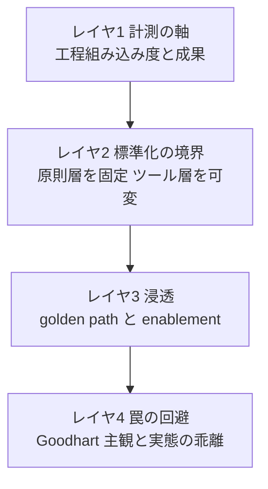

AIコーディングツールを配ったあと、多くの組織が同じ壁にぶつかります。使う人と使わない人の差が開き、組織として本当に生産性が上がったのかを確かめる手段がない、という状態です。

ラクスはこの状態を出発点に、AI活用を個人の裁量から組織の型へ引き上げる取り組みを公開しました。本記事は、この「個人差を組織標準で埋める」という課題を、ラクス1社の事例紹介に閉じず、導入設計の意思決定地図として整理します。一次ソース（公式テックブログ・査読論文・公式ベンチマーク）で裏付けた事実を中心に、二次情報は明示して区別します。

## 概要

「個人差を組織標準で埋める」という課題は、次の4つの問いに分解できます。

| 問い | 設計対象 |
|---|---|
| 計測の軸をどう設計するか | AI活用度を成果と緊張させて測る |
| 何を標準化し何をローカル試行に残すか | 固定層と可変層の分離 |
| どう浸透させるか | 強制でなく能力移転 |
| 計測と標準化が逆効果になる罠をどう避けるか | Goodhart や主観と実態の乖離 |

一次ソースの収束点は明快です。

- AI活用率を単独の指標にしてはいけません。受諾率もAI生成コード比率も、原典の時点で「主観の代理」「活動量の一指標」にすぎず、成果を保証しません。指標自体が水増し（gaming）を誘発します。
- 標準は強制ゲートでなく、推奨デフォルトと自動ガードレールとして薄く始めます。AI領域はベストプラクティスの陳腐化が速いため、固定するのは原則層、可変に残すのはツール・モデル・プロンプトです。
- 個人差には「埋まる差」と「埋まらない差」があります。初学者の立ち上げや標準ワークフローの欠如は底上げで埋まりますが、暗黙知やタスク境界の判断は型では渡せません。標準化の射程を見極めることが設計の核心です。

## この問題がツール導入と違う点

AI導入を「ツールを配る」発想で捉えると、計測も標準も浸透も的を外します。組織標準化として捉え直すと、視点が変わります。

| 論点 | ツール導入の発想 | 組織標準化の発想 |
|---|---|---|
| 計測対象 | ライセンス保有率、起動回数、受諾率 | 工程への組み込み度と、成果と緊張させた指標群 |
| 標準の形 | 使い方マニュアルの配布 | golden path（推奨デフォルト）と guardrail（自動で効く品質基準） |
| 固定範囲 | ツール・プロンプトまで全部決定 | 原則層だけ固定し、陳腐化の速い層は現場可変 |
| 個人差の扱い | 使わない人をスキル不足とみなす | 文化・時間・活用イメージの問題として底上げと境界設計で扱う |
| ゴール | 利用率の向上 | 顧客価値に届く成果を、チーム横断で再現 |

ラクスの担当者が集めた「使わない理由」が示唆的です。技術的な障壁ではなく、次のような複合的な障壁でした（出典: RAKUS Developers Blog, 2026-06-15）。

| 障壁 | 内容 |
|---|---|
| 心理 | 「AI活用しています」と言いにくいエンジニア文化の謙遜 |
| 品質 | ハルシネーションでテスト修正が増え、本来コストを上回る |
| 時間 | 高負荷業務で試行錯誤の時間を取れない |
| プロセス | AIの使い方は知るが、業務への組み込み方がわからない |

個人差はスキルだけの問題ではなく、心理的・時間的・プロセス的な障壁の複合だとわかります。

## 導入設計の4レイヤ

導入設計は、下から積み上がる4つのレイヤで捉えます。

| 要素 | 説明 |
|---|---|
| レイヤ1 計測の軸 | 個人差を可視化する。活動量でなく工程組み込み度と成果で見る |
| レイヤ2 標準化の境界 | 原則層を固定し、ツール層を可変に残す。薄く始める |
| レイヤ3 浸透 | 強制でなく能力移転で広げる。golden path と enablement |
| レイヤ4 罠の回避 | 全レイヤを貫く制約。Goodhart や下流コスト転嫁を避ける |

以下、各レイヤを一次ソースで掘ります。

## レイヤ1 計測の軸

個人差は、可視化されないと埋められません。ラクスが設計したのは、ツール名ではなく「プロセス別AIコミット度」という軸です。各開発フェーズ（設計・実装・レビュー・テスト・インフラ・QA・PdM）でのAI活用度合いを測ります。担当者の言葉では「環境が変わっても変わらない比較軸を持てるようになった」とあります。Salesforce の48項目調査を参考に削り込んだ独自設計です（出典: RAKUS Developers Blog, 2026-06-15）。

### 計測フレームワークの一貫した教え

開発生産性計測の理論は、SPACE フレームワーク（Forsgren ら, ACM Queue Vol.19(1), 2021）に集約されます。核心命題は明快です。

> Developer productivity ... cannot be measured by a single metric or dimension.
> only by examining a constellation of metrics in tension can we understand and influence developer productivity.

要旨は「生産性は単一の指標では測れない。互いに緊張関係にある指標の星座（constellation）を見て初めて理解し動かせる」です。SPACE は生産性を5次元で捉えます。

| 次元 | 内容 |
|---|---|
| Satisfaction | 満足度とウェルビーイング |
| Performance | システムやプロセスの成果 |
| Activity | 完了したアクションやアウトプットの数 |
| Communication | 人とチームの協働 |
| Efficiency | 最小の中断で作業を進める能力 |

重要なのは、「AI活用率」が5次元のうち Activity の一指標にすぎない点です。それ単体で生産性を語るのは、SPACE が名指しで戒めるアンチパターンそのものです。実践ガイダンスは「最低3次元、うち1つは知覚指標（満足度）を含めよ」です。

### AI生成コード比率や受諾率を指標にする落とし穴

「AIをどれだけ使ったか」を指標にしたくなりますが、一次ソースは一様に警告します。

| 指標 | 一次ソースの限定 |
|---|---|
| 受諾率（acceptance rate） | 原典（Ziegler ら, MAPS '22, Copilot 27%）が「生産性の知覚を駆動する変数」と明言。outcome の代理ではなく perception の代理 |
| 行数・受諾数 | GitHub 自身が公式 Metrics API を受諾率・行数から engaged-users 中心へ再設計。現行スキーマに `total_acceptances` は含まれない |
| AI生成コード比率 | autocomplete も混ざる vanity metric になりやすい。50%をAI生成にしつつバグを増やすこともできる |

GitHub が当事者として公式APIから受諾率指標を外した事実は、「受諾率を主たる指標にすべきでない」という業界批判と整合します。

### 工程別計測の現在地

ラクスの「プロセス別AIコミット度」のような工程別の定量フレームは、どのベンダーも公式には確立していません（一次確認）。業界は2つの近似に収束しています。

| 近似 | 提唱・出典 | 内容 |
|---|---|---|
| 3次元と採用ライフサイクル | DX AI Measurement Framework（getdx.com, 2025-07） | utilization・impact・cost の3次元。採用からインパクト、ガバナンスへ進行 |
| 成熟度コホート | GitHub, Augment Code | code-first から agent-first、multi-agent へ。Adopt から Orchestrate へ |

DX が繰り返し強調する事実が、工程別計測の必要性を裏づけます。コーディングは開発者の時間の約14%にすぎず、AIはコード生成を速める一方で、レビューと統合に新しいボトルネックを生みます。コーディング工程の利用率だけ見ても全体最適は測れません。

設計の含意は次のとおりです。ラクスの「工程組み込み度で測る」方向は妥当です。ただし工程別の定量指標は自組織で設計します。その際、Activity 系（各工程の活用度）を必ず Performance や安定性（後述の DORA Change Fail Rate 等）と緊張させて見ます。AIはスループットを上げて安定性を下げる傾向があるため、速度指標単独では「速いが壊れている」状態を見逃します。

## レイヤ2 標準化の境界

「組織標準にする」と言うと、全工程・全ツールを決めたくなります。しかし過度な標準化は逆効果になります。

### 過度な標準化は探索を駆逐する

古典的な実証研究 Benner & Tushman（Academy of Management Review, 2003）は、プロセスマネジメントが設計上 exploitation（既存能力の深掘り）を行い、短期業績圧力の下では exploration（探索）を圧倒すると示しました。標準化は安定文脈では有益ですが、新しい試行錯誤を萎縮させる副作用を持ちます。

より精緻には、探索と深掘りは二択でなく逆U字の相互作用を持ちます（Management and Organization Review）。標準化はゼロでも過剰でも革新を損ない、中庸に最適点があります。「標準化しすぎか、しなさすぎか」は連続量の問題です。

### 到達した実践解は golden path

ソフトウェア組織がたどり着いた答えが golden path / paved road です。

| 事例 | 原則 | 要点 |
|---|---|---|
| Spotify Golden Path | opinionated かつ supported な道 | 外れる自由は残すが、外れるとサポートは外れる。制約でなく認知負荷削減による enablement |
| Netflix Paved Road | Context not Control | 管理者は context を与え最前線が決める。secure-by-default を代替より楽にして自然な採用を駆動 |

### 標準はゲートでなくガードレールとして実装する

標準の実装形態が、現場の行動を決めます（platformsecurity.com「Guardrails, Not Gatekeepers」）。

> A gatekeeper model optimizes for saying no until evidence arrives. A guardrail model optimizes for making the safe path the easy path.
> When security is framed as a gate... Teams learn to route around you, exceptions multiply, and risk hides in shadow paths.

要旨は「ゲートキーパーは証拠が出るまでNoと言うことに最適化し、ガードレールは安全な道を楽な道にすることに最適化する。ゲートにすると現場は迂回路を学び、例外が増殖し、リスクは見えない裏道に隠れる」です。標準を人手の承認関所（gate）にすると、現場は迂回し、リスクは見えない shadow path に潜ります。AI駆動開発でも、レビュー・品質基準・テスト先行を、レビュー会議の関所でなく CI・lint・テンプレート・自動チェックに埋め込みます。判断を一度エンコードして継続適用すれば、強制せずとも従われます。

### 陳腐化の速い層を標準に焼き込まない

AI領域に特有なのは、ベストプラクティスの陳腐化の速さです。モデル・ツール・IDE が短い周期で更新されます。"Ten Simple Rules for AI-Assisted Coding"（arXiv:2510.22254）は、意図的に特定ツールの推奨を避けます。すぐ古くなるからです。代わりに据えるのは、ツールに依存しない不変原則です。

| 不変原則 | 内容 |
|---|---|
| レビュー責任の非妥協 | 評価・デバッグ・保守できないコードを受け入れない。「AIが書いた」は言い訳にならない |
| テスト先行 | AIが実装を生成するときこそ、先にテストで期待挙動を spec し、placeholder や mock を監視する |

これを踏まえた固定層と可変層の分離が、AI駆動開発の標準化の核心になります。

| 工程 | 固定する型（組織標準・guardrail） | 可変に残す（現場のローカル試行） |
|---|---|---|
| 設計 | spec の構造（業務意図をユビキタス言語で、Given/When/Then）、人間レビューの必須化 | spec を起こすツール、詳細化の深さ |
| 実装 | 保守できないコードを受け入れない原則、バージョン管理 | モデル・IDE・プロンプト・補完設定、漸進化の粒度 |
| レビュー | 人間が責任を保持、自動チェックの CI 埋め込み | レビュー観点のローカル拡張、AIレビューア併用の有無 |
| テスト | テスト先行、placeholder と mock の検知 | テスト生成の自動化度合い、カバレッジ目標のチーム調整 |

各社が採る仕様駆動開発（SDD）は、2025年時点でも emerging practice です。提唱者（Thoughtworks）自身が「過度に形式化した spec は変更とフィードバックを遅らせる」「2026年にさらに変化する」と認めています。まだ枯れていない型を硬く固定するのは時期尚早です。固定するのは spec の最小構造（意図と Given/When/Then）に絞り、ワークフローは可変に開きます。

設計の含意は次のとおりです。「AI活用ガイドの wiki、spec テンプレ、推奨フロー」程度の Thinnest Viable Platform（最も薄い型, Team Topologies）からパイロットし、痛点に応じて厚くします。指導原則は「必要以上に厚くするな」です。

## レイヤ3 浸透

標準を定義しても、浸透しなければ個人差は埋まりません。組織浸透の方法論は、すべて「個人に宿る暗黙知を組織の標準能力へ転写する」同一問題を、異なる粒度で解いています。

| 方法論 | 中核メカニズム |
|---|---|
| Enabling team（Team Topologies） | 専門家チームが一時的に伴走・コーチして自走させ、退く。象牙の塔を作らない。監査でなく能力移転 |
| Community of Practice / Guild | 横断 community が規模の経済を生む。他チームが先週解いた問題と格闘しない |
| Champions Program（GitHub 公式） | 45日前から success metrics を定義し champions を育成。実際のコードベースでペアリング |

Spotify モデルの後年の証言が、浸透の本質を突きます。「協働はスキルであり、知識と練習を要する」（Jeremiah Lee）。「ツールを配れば勝手に上手くなる」は誤謬です。Champions育成・レトロ・ペアリングという訓練の場を制度化しないと、個人差は埋まりません。

ラクスの4施策は、この計測から浸透までの連鎖の実装例として読めます。

| 施策 | レイヤ対応 |
|---|---|
| AI駆動開発手法の標準化 | レイヤ2 |
| 商材特性に応じた最適化 | レイヤ2 |
| ナレッジの体系化・横展開（AI活用実践カタログ） | レイヤ3 |
| AI活用浸透度・生産性の可視化 | レイヤ1 |

### 国内各社も同じ型に収束している

国内各社の取り組みも、仕様駆動開発の組織型化とナレッジ横展開に収束しています。

| 企業 | 型 | 一次公開された定量 |
|---|---|---|
| ラクス | プロセス別AIコミット度、SDD型化（進行中） | 全社AI生成比率 43.3%から58.3%（第1回から第2回サーベイ、約15ポイント）。上流工程チーム 20%台から50から60%超。モバイル PR/day iOS 0.346から3.059 |
| メルカリ | Agent-Spec Driven Development、Notion中央ナレッジ、AI Task Force約100名 | 社員AI活用率 95%。AI担当コード生成率 約70%。開発スピード 前年比64% |
| DeNA | 特化型サブエージェント、レビュー指摘のドキュメント自動反映、仕様駆動分析 | 人間レビュー回数/PR 7.2から2.7。コメント数/PR 6.0から1.9。SDAでデバッグ時間 7割から2から3割 |
| ZOZO | 2コマンド標準化、進捗管理表フォーマット | 数百名規模で利用（効果測定は今後の課題と明記） |

出典は engineering.mercari.com（2025-12-25）、engineering.dena.com（2026-01, 2026-04）、techblog.zozo.com（2026-06-08）です。メルカリの「1,100アカウント」「9割」等の流布値は公式記事で裏取りできず二次情報のため、上表は公式値のみ採用しました。

共通するのは、仕様（spec）を信頼できる単一の情報源にして属人性を排除し、レビューを「ミス探し」から「設計・分析の議論」へ昇格させる点です。そして全社が口を揃えて、全自動でなく「半自動と人間の判断境界の設計」を成熟解とします。

## レイヤ4 罠の回避

ここまでの設計は、いくつかの強い反証を踏まえないと足をすくわれます。確証バイアスを排すため、結論を弱める一次エビデンスを明示的に並べます。

### 罠1 指標化そのものが品質を蝕む

GitClear 2025（"AI Copilot Code Quality"、2億1100万 changed lines、PDF本文検証済）は決定的です。

> If 'developer productivity' continues being measured by 'commit count' or by 'lines added,' AI-driven maintainability decay will proliferate.
> AI can juice these metrics by duplicating large swaths of code in each commit.

データ面でも、2024年は史上初めて「コピペ行数が移動（リファクタ）行数を上回った年」でした。5行以上の重複ブロック頻度が約8倍に増加し、churn（書いて2週内に手戻りした行）も上昇しました。ただし GitClear は「AI採用と相関する」と表現し、RCTではないため因果を断定していません。

含意は明確です。AI生成コード比率や受諾率を指標にすると、その指標自体が最適化先になり、保守性を犠牲に数値だけ上がります。

### 罠2 主観生産性と実態は乖離する

METR の RCT 2025（arXiv:2507.09089）は、AI生産性の素朴な前提を覆します。

| 項目 | 内容 |
|---|---|
| 設計 | 経験豊富なOSS開発者16名、成熟リポジトリ（平均22000以上のstars）、246 issue を AI可・不可にランダム割当 |
| 結果 | AI利用時に完了が19%遅くなった |
| 認知ギャップ | 開発者は事前に24%短縮と予測し、体験後もなお20%短縮したと誤認した |
| 最大の原因 | リポジトリの暗黙知にAIが追随できず、提案が的外れになる |

著者自身が「多くの開発者に一般化できると主張しない」「未経験者や不慣れなコードベースには当てはまらない可能性」と留保し、METR は2026年2月に実験デザイン変更を公表しています。頑健性は議論中です。

これは「型を配れば誰でも速くなる」という前提への強い反証です。BCG と Harvard の研究（HBS WP 24-013, 758名）も、フロンティア外タスクではAI利用者の正答率が19パーセントポイント低いと示しました。タスク境界の判断は型では渡せません。

ただし両刃です。同じBCG研究でスキル下位半分は43%向上し、Cui ら（SSRN, 4867名）も「経験の浅い開発者ほど採用率と向上が大きい」傾向を示しました（ただし本文は統計的有意でないと明記）。個人差には「埋まる差」（初学者の底上げ）と「埋まらない差」（熟練者の暗黙知やタスク境界判断）があり、標準化の射程はその手前までです。この切り分けが設計の肝になります。

### 罠3 速くなったが組織成果に変わらない

DORA 2024 は「AI採用は個人の生産性と満足を高めるが、デリバリの安定性とスループットを悪化させる」と報告しました（二次情報: RedMonk 逐語、一次PDF未直読。AI採用25%増ごとにスループット マイナス1.5%、安定性 マイナス7.2%）。

重大な注意があります。この関係は2024年のスナップショット限定で、2025年版ではスループットが正に反転しました（安定性懸念は残存）。DORA 2025 の核心命題は次のとおりです。

> AI doesn't fix a team; it amplifies what's already there. Strong teams use AI to become even better and more efficient. Struggling teams will find that AI only highlights and intensifies their existing problems.

要旨は「AIはチームを直さない。既にあるものを増幅する。強いチームはAIでさらに良くなり、苦しむチームはAIが既存の問題を顕在化・激化させるだけと気づく」です。AI活用は増幅器です。弱い計測・弱い標準・弱いプロセスを増幅すると逆効果になります。だからこそレイヤ1から3の土台が要ります。

### 罠4 標準を整えても実態は乖離する

| 調査 | 数値 |
|---|---|
| Stack Overflow Developer Survey 2025（信頼設問 N約33000） | AIの正確性を不信46%が信頼33%を上回る。不信時は75%が依然「人に聞く」 |
| KPMG 2025（米1019名、全世界48000名） | 44%が無許可または不適切な方法でAIを使用。53%がAI生成物を自作として提示 |

工程ごとに型を統一しても、開発者の半数近くがAI出力を信頼せず、公式の標準がシャドー利用を捕捉できていません。標準は信頼の実態とセットで設計しないと形骸化します。

なお「AI強制がサボタージュや離職を誘発（29%）」といった刺激的な数値はベンダー調査で利益相反があり（二次情報・要留保）、本記事では設計判断の根拠に採用しません。

## 反証が見つからなかった点

誠実性のため、暫定結論を否定しきれなかった点を明記します。その範囲では結論が頑健と読めます。

| 論点 | 状況 |
|---|---|
| AI比率指標の導入で特定企業に gaming が起きた実名一次事例 | 見つからず。GitClear の理論的警告止まり |
| 企業がAI強制を撤回した撤退率の定量一次データ | 見つからず。報道（二次）のみ |
| 型では個人差を埋められないことを直接実験した一次研究 | 見つからず。最も近い実証は METR の暗黙知要因 |
| AI実践は変化が速すぎて標準化が陳腐化するという主張 | 反証が弱い。むしろ「少数の信頼ツールに絞り原則を定めよ」という標準化支持論が優勢 |

## 未解決の問い

- 工程別AI活用度の定量フレームは公式には未確立です。「プロセス別AIコミット度」を成果指標（DORA安定性等）と緊張させる具体的なメトリクス設計は、各組織が自前で詰める領域です。
- golden path から外れたチームの有効なローカル改善を標準へ還流する明示的な機構は、Spotify や Netflix の一次記事でも確認できませんでした。実装案は、逸脱を例外でなく実験として ADR や軽量レポートに記録し、定期レビューで標準候補に昇格させ、enabling team が横展開する流れです。
- 「埋まる差」と「埋まらない差」の境界をデータで判定する方法は未解明です。どのタスクはAIで底上げでき、どこから暗黙知依存になるかの判定基準が要ります。

## 導入設計のチェックリスト

| 観点 | 推奨 |
|---|---|
| 計測 | AI活用度を工程別に可視化しつつ、必ず DORA 安定性・品質指標と緊張させる。受諾率やAI生成比率を単独指標にしない。受け入れ後の rework 率やレビュー時間を併測する |
| 標準の形 | 強制ゲートでなく golden path（推奨デフォルト）と guardrail（CI・lint・テンプレに埋め込む自動チェック） |
| 固定範囲 | 原則層（レビュー責任・テスト先行・spec の最小構造・コンテキスト管理）だけ固定し、ツール・モデル・プロンプトは現場可変。SDD は硬く固定せず薄く |
| 始め方 | Thinnest Viable Platform（wiki、spec テンプレ、推奨フロー）で、代表的な複雑性を持つ単一チームからパイロット |
| 浸透 | 監査でなく enablement（enabling team の一時伴走から自走、Champions、ペアリング、レトロ）。協働をスキルとして訓練の場を制度化 |
| 個人差 | 埋まる差は底上げで埋め、埋まらない差（暗黙知・境界判断）は人間の判断境界として残す。全自動でなく半自動を狙う |

## まとめ

AI駆動開発の個人差を組織標準で埋める鍵は、AI活用率を単独指標にせず成果と緊張させて測り、原則層だけを薄く固定して陳腐化の速いツール層を現場に開き、強制でなく能力移転で浸透させることです。個人差には底上げで埋まる差と、暗黙知のように型では渡せない差があり、その射程の見極めが設計の核心になります。

この記事が少しでも参考になった、あるいは改善点などがあれば、ぜひリアクションやコメント、SNSでのシェアをいただけると励みになります！

## 参考リンク

- 起点・国内事例
  - [AI駆動開発の組織標準化に向き合う（RAKUS Developers Blog）](https://tech-blog.rakus.co.jp/entry/20260615/ai-adoption-standardization)
  - [メルカリ AI-Native Company](https://engineering.mercari.com/blog/entry/20251225-mercari-ai-native-company/)
  - [DeNA 育てるほど楽になるAI開発体制](https://engineering.dena.com/blog/2026/01/ai-driven-develop/)
  - [DeNA 仕様駆動分析（SDA）](https://engineering.dena.com/blog/2026/04/spec-driven-analytics/)
  - [ZOZO AI駆動開発を2コマンドで組織標準に](https://techblog.zozo.com/entry/ai-development-two-commands)
- 計測フレームワーク
  - [The SPACE of Developer Productivity（ACM Queue）](https://queue.acm.org/detail.cfm?id=3454124)
  - [DORA 2024 Report](https://dora.dev/research/2024/dora-report/)
  - [Announcing the 2025 DORA Report](https://cloud.google.com/blog/products/ai-machine-learning/announcing-the-2025-dora-report)
  - [Measuring developer productivity with the DX Core 4](https://getdx.com/research/measuring-developer-productivity-with-the-dx-core-4/)
  - [Introducing the AI Measurement Framework（DX）](https://newsletter.getdx.com/p/introducing-the-ai-measurement-framework)
  - [Productivity Assessment of Neural Code Completion（acceptance rate 原典）](https://arxiv.org/abs/2205.06537)
  - [GitHub Copilot Metrics REST API](https://docs.github.com/en/rest/copilot/copilot-metrics)
- 標準化境界・浸透
  - [Spotify Golden Paths](https://engineering.atspotify.com/2020/08/how-we-use-golden-paths-to-solve-fragmentation-in-our-software-ecosystem)
  - [Scaling Appsec at Netflix（paved road）](https://netflixtechblog.medium.com/scaling-appsec-at-netflix-6a13d7ab6043)
  - [Guardrails, Not Gatekeepers](https://platformsecurity.com/blog/guardrails-not-gatekeepers-platform-security-scales-with-engineering)
  - [Team Topologies Key Concepts](https://teamtopologies.com/key-concepts)
  - [Spec-driven development（Thoughtworks）](https://www.thoughtworks.com/en-us/insights/blog/agile-engineering-practices/spec-driven-development-unpacking-2025-new-engineering-practices)
  - [Driving Copilot adoption in your company（GitHub Docs）](https://docs.github.com/en/copilot/tutorials/rolling-out-github-copilot-at-scale/enabling-developers/driving-copilot-adoption-in-your-company)
- 反証
  - [GitClear AI Copilot Code Quality 2025（PDF）](https://gitclear-public.s3.us-west-2.amazonaws.com/GitClear-AI-Copilot-Code-Quality-2025.pdf)
  - [METR Measuring the Impact of Early-2025 AI on Experienced Developers](https://metr.org/blog/2025-07-10-early-2025-ai-experienced-os-dev-study/)
  - [Navigating the Jagged Technological Frontier（HBS WP 24-013）](https://www.hbs.edu/ris/Publication%20Files/24-013_d9b45b68-9e74-42d6-a1c6-c72fb70c7282.pdf)
  - [The Effects of Generative AI on High-Skilled Work（Cui ら, SSRN）](https://demirermert.github.io/Papers/Demirer_AI_productivity.pdf)
  - [Stack Overflow Developer Survey 2025（AI）](https://survey.stackoverflow.co/2025/ai/)
  - [KPMG Trust, attitudes and use of AI 2025](https://kpmg.com/us/en/media/news/trust-in-ai-2025.html)
