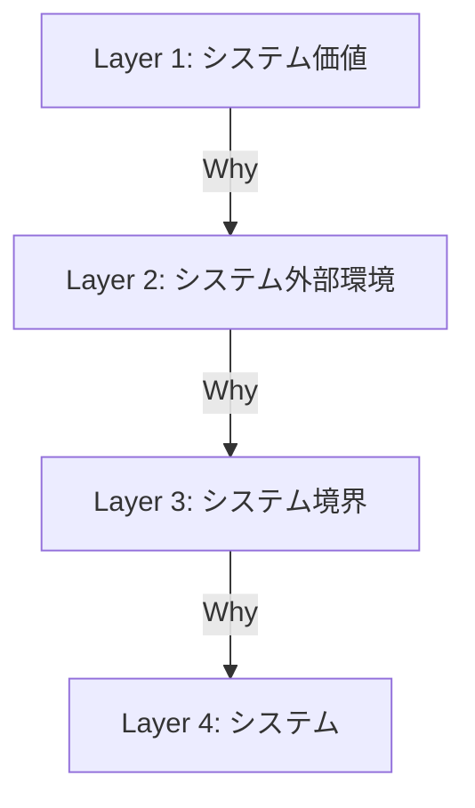
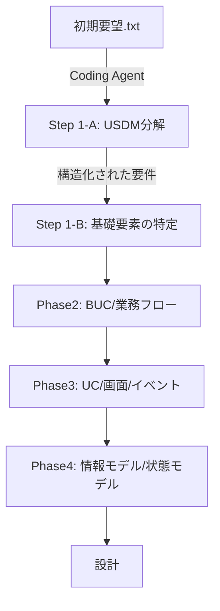
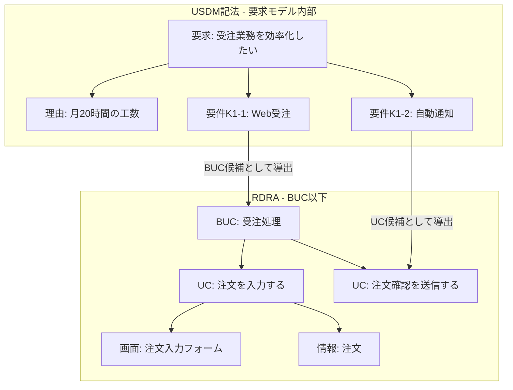
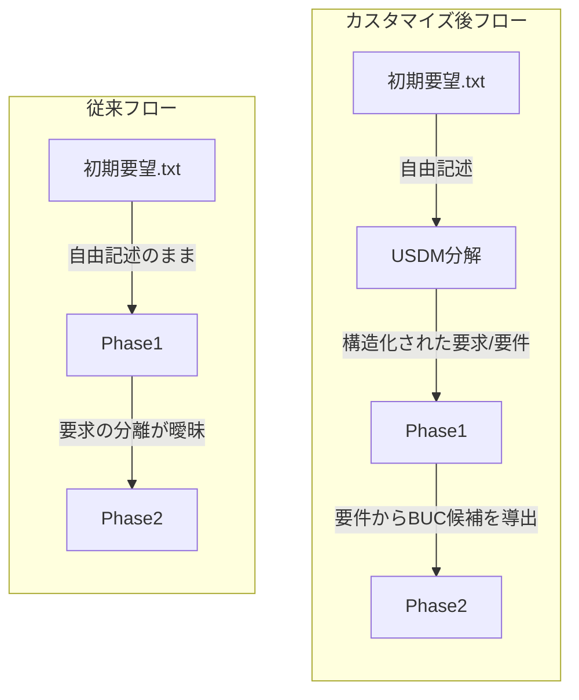
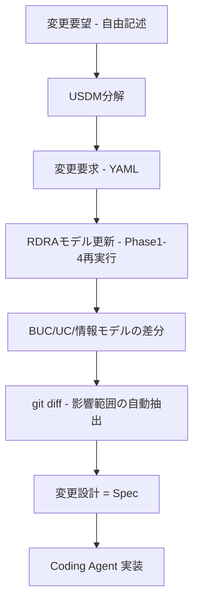

## はじめに

RDRAAgent v0.6 は、初期要望テキストから RDRA2.0 モデルを段階的に自動生成する Coding Agent ツールです。Phase1（基礎要素の特定）は自由記述を入力とするため、要求の分離や根拠の抽出を AI の推測に依存しています。

本記事では、USDM（Universal Specification Describing Manner）の記法を Phase1 の前段に組み込み、入力を構造化して後続フェーズの精度を向上させるアプローチを紹介します。

## RDRA2.0 とは

### 概要

RDRA（Relationship Driven Requirement Analysis）は、2012 年に神崎善司氏（ValueSource Inc.）が提唱した要件定義モデリング手法です。システムとビジネスの関係性を明示的にモデル化し、要件の完全性・一貫性を確保します。

### 4 レイヤー構造

RDRA2.0 は要件定義を 4 つの階層レイヤーで体系化します。各レイヤーは「なぜ？」という Why 依存関係で結合されます。



| 要素名           | 説明                                                                          |
| ---------------- | ----------------------------------------------------------------------------- |
| システム価値     | ビジネス環境と顧客価値を定義するレイヤー。アクター、外部システム、要求を含む  |
| システム外部環境 | ビジネスプロセスの全体像を表すレイヤー。BUC、業務フロー、バリエーションを含む |
| システム境界     | システムが提供する機能を定義するレイヤー。ユースケース、画面、イベントを含む  |
| システム         | システム内部の実装モデル。情報モデル、状態モデルを含む                        |

### 10 種類のアイコン体系

| アイコン             | レイヤー | 説明                               |
| -------------------- | -------- | ---------------------------------- |
| アクター             | L1       | ユーザー、組織、外部ユーザー       |
| 外部システム         | L1       | 連携対象のシステム                 |
| 業務                 | L2       | 業務プロセス、ビジネスコンテキスト |
| ビジネスユースケース | L2       | 業務を実現する価値単位             |
| バリエーション       | L2       | 条件分岐、例外処理                 |
| 条件                 | L2/L3    | 決定ポイント、条件分岐             |
| 画面                 | L3       | UI、ユーザーインターフェース       |
| イベント             | L3       | 外部システムとの連携イベント       |
| 状態                 | L4       | エンティティの状態                 |
| 情報                 | L4       | データ、情報概念                   |

### RDRAAgent v0.6

RDRAAgent は、神崎善司氏が開発した AI アシスタント型の RDRA 自動化ツールです。Claude Code や Cursor で実行できます。

```bash
git clone https://github.com/kanzaki/RDRAAgent_v0.6.git
cd RDRAAgent_v0.6
npm install
node menu.js
```

4 つのフェーズで段階的に要件を詳細化します。

| フェーズ | 名称           | 入力         | 主要出力                                           |
| -------- | -------------- | ------------ | -------------------------------------------------- |
| Phase1   | 基礎要素の特定 | 初期要望.txt | アクター、外部システム、ビジネスルール、情報、状態 |
| Phase2   | 詳細化         | Phase1 出力  | BUC 定義、業務フロー、関連付け                     |
| Phase3   | コンテキスト化 | Phase2 出力  | ユースケース、画面スケッチ、イベント               |
| Phase4   | 関係モデリング | Phase3 出力  | 情報モデル、状態モデル、ビジネスルール仕様         |

## USDM とは

### 概要

USDM（Universal Specification Describing Manner）は、清水吉男氏が提唱した要求仕様記述法です。要求を階層的に分解し、各要求に「なぜそれが必要か」を明示する点が特徴です。

https://zenn.dev/suwash/articles/usdm_xddp_20260325

### 本記事での採用記法

USDM の元来の 4 階層（要求→理由→説明→仕様）から、本記事では 3 階層に絞ります。

| 要素 | 役割                         | 記述内容                             |
| ---- | ---------------------------- | ------------------------------------ |
| 要求 | ビジネス視点で実現したいこと | 「〜したい」形式                     |
| 理由 | 要求の正当化根拠             | 現状の課題、定量データ、ビジネス背景 |
| 要件 | 要求を満たす具体的な条件     | BUC に展開可能な粒度                 |

「説明」は理由に吸収し、「仕様」は設計側の担当として除外しています。要件定義の範囲では、要求の構造化と根拠の明示で十分です。

### USDM の強み

USDM が効果を発揮するのは、要求のブレイクダウンです。

- **要求の分離**: 1 つの要求に 1 つの関心事を対応させる
- **理由の必須化**: 根拠のない要求を排除するフィルタリング機能
- **要件の検証可能性**: 「〜できること」形式で記述し、テスト設計につなげる

## RDRAAgent Phase1 の課題

現状の Phase1 は「初期要望.txt」（自由記述）を入力として、AI が基礎要素を抽出します。

```
【背景】受注業務がFAXベースで月20時間かかっている
【目的】受注業務のデジタル化
【スコープ】受注入力、在庫確認、出荷指示
【制約】既存ERPとの連携必須
```

この自由記述からの抽出には 3 つの課題があります。

| 課題                 | 内容                             | 影響                      |
| -------------------- | -------------------------------- | ------------------------- |
| 要求の分離粒度が曖昧 | 複数の要求が 1 文に混在          | BUC の粒度が不安定        |
| 理由が暗黙的         | 「なぜ」が背景に埋もれている     | 要求の優先度判断が困難    |
| 要件と要求が混在     | 実現手段と実現したいことが未分離 | Phase2 以降で手戻りが発生 |

これらは Phase1 の出力品質に直結します。Phase2 の BUC 抽出、Phase3 の UC 定義まで連鎖的に影響します。

## 提案: Phase1 に USDM 分解を組み込む

### 全体フロー



| 要素名   | 説明                                                 |
| -------- | ---------------------------------------------------- |
| Step 1-A | USDM 分解（要求→理由→要件）。新規追加                |
| Step 1-B | 基礎要素の特定。既存改修（入力を構造化データに変更） |
| Phase2-4 | 既存の RDRAAgent フロー。変更なし                    |

Phase1 の前段に USDM 分解を挟むだけで、Phase2 以降は変更不要です。

### Step 1-A: USDM 分解（新規追加）

初期要望.txt を入力として、Coding Agent が USDM 3 階層に分解します。
USDMはExcelで管理することが多いですが、AIエージェントの扱いやすさ、schema validationなどを活用するため、YAML形式を採用します。

#### 入力（従来の初期要望.txt）

```
【背景】
受注業務がFAXベースで、営業担当者が手入力している。
月20時間の工数がかかり、入力ミスによる出荷トラブルが月3件発生。

【目的】
受注業務のデジタル化による効率化と品質向上。

【スコープ】
受注入力、在庫確認、出荷指示、顧客管理
```

#### 出力（USDM 構造化要件 - YAML 形式）

```yaml
requirements:
  - id: R1
    description: 受注業務を効率化したい
    reason: FAX受注→手入力→確認電話で月20時間かかっている
    conditions:
      - id: K1-1
        description: 受注データをWebフォームから直接取り込めること
      - id: K1-2
        description: 受注入力後の確認を自動メール通知で代替できること

  - id: R2
    description: 受注入力ミスを防止したい
    reason: 手入力ミスによる出荷トラブルが月3件発生している
    conditions:
      - id: K2-1
        description: 受注入力時にマスタデータとの整合性チェックを行うこと
      - id: K2-2
        description: 過去の類似注文をサジェストできること

  - id: R3
    description: 在庫状況をリアルタイムに把握したい
    reason: 受注時に在庫が分からず後から欠品連絡になるケースがある
    conditions:
      - id: K3-1
        description: 受注入力時に在庫数を自動表示すること
      - id: K3-2
        description: 在庫が閾値以下の場合にアラートを表示すること

  - id: R4
    description: 出荷指示を自動化したい
    reason: 受注確定後の出荷指示が手作業で遅延が発生している
    conditions:
      - id: K4-1
        description: 受注確定時に出荷指示を自動生成できること
```

#### YAML フォーマットの利点

| 観点         | テキスト形式         | YAML 形式                                            |
| ------------ | -------------------- | ---------------------------------------------------- |
| 構造の明示性 | インデントで暗黙的   | キーで明示的                                         |
| 機械処理     | 正規表現パースが必要 | YAML パーサで確実に取得                              |
| スキーマ検証 | 不可                 | 必須フィールドの自動検証が可能                       |
| git diff     | 行単位の差分         | キー単位で変更箇所が明確                             |
| 品質チェック | 手作業               | reason 空チェック、conditions 件数チェック等を自動化 |

#### YAML スキーマ定義

```yaml
# requirements.schema.yaml
type: object
required: [requirements]
properties:
  requirements:
    type: array
    items:
      type: object
      required: [id, description, reason, conditions]
      properties:
        id:
          type: string
          pattern: "^R\\d+$"
        description:
          type: string
        reason:
          type: string
        conditions:
          type: array
          minItems: 1
          maxItems: 4
          items:
            type: object
            required: [id, description]
            properties:
              id:
                type: string
                pattern: "^K\\d+-\\d+$"
              description:
                type: string
```

このスキーマにより、USDM 分解の出力を自動検証できます。reason が空、conditions が 0 件または 5 件以上、id のフォーマット不正などを機械的に検出できます。

#### 分解ルール

| ルール             | 判断基準                                               |
| ------------------ | ------------------------------------------------------ |
| 要求の分離（動詞） | 動詞が異なる場合、別の要求に分離                       |
| 要求の分離（対象） | 対象が異なる場合、別の要求に分離                       |
| 要件の分離         | 条件が異なる場合、同一要求の別要件に分離               |
| 理由の品質         | 定量データ付きが望ましい。不明な場合は「理由: 要確認」 |
| 要件の品質         | 「〜できること」形式。検証可能な記述                   |
| 要件の粒度         | 1 要求あたり 1〜4 件                                   |

### Step 1-B: 基礎要素の特定（既存 Phase1 の改修）

USDM 出力を入力として、従来の Phase1 処理を実行します。

#### 変更点

| 従来 Phase1 の出力 | USDM 入力による改善                      |
| ------------------ | ---------------------------------------- |
| アクター           | 要求の主語から明示的に特定               |
| 外部システム       | 要件の動詞・対象から特定                 |
| ビジネスルール     | 理由から制約・条件を抽出                 |
| 情報               | 要件の対象名詞からエンティティ候補を抽出 |
| 状態               | 要件の状態変化記述から抽出               |
| 要求モデル（新規） | USDM 出力をそのまま取り込み              |

最大の改善点は、USDM の要件が Phase2 の BUC 候補として直接機能する点です。従来は AI がゼロから BUC を推測していましたが、構造化された要件が導出の根拠になります。

## RDRA の要求モデルとの関係

RDRA の 4 レイヤーのうち、Layer1（システム価値）の要求モデルは他レイヤーと比べて記法が緩い部分です。アイコン関係によるトレーサビリティはレイヤー間で機能します。一方、要求そのものの内部構造（なぜその要求があるのか、どこまでが 1 つの要求か）は RDRA では規定されていません。

USDM 記法を要求モデルに適用すると、この構造の弱さを補えます。



| 要素名   | 説明                                                        |
| -------- | ----------------------------------------------------------- |
| USDM記法 | 要求の内部構造（Why / What）を担当。要求→理由→要件の 3 階層 |
| RDRA     | 要素間の関係性（BUC 以下）を担当。アイコン関係 + Why 依存   |

USDM の適用範囲を Layer1 の要求モデルに限定し、BUC 以下は RDRA のモデリングに委ねます。

## 従来フローとの比較



| 観点             | 従来フロー                  | カスタマイズ後                 |
| ---------------- | --------------------------- | ------------------------------ |
| 要求の分離       | AI が推測で分離             | USDM 記法で事前に分離済み      |
| 理由の明示       | 背景から暗黙的に推測        | 要求ごとに明示的に記述         |
| BUC 導出         | Phase2 でゼロから抽出       | 要件が BUC 候補として機能      |
| 要求モデル       | 構造が弱い                  | USDM 3 階層で精密              |
| トレーサビリティ | Phase1 出力から事後的に構築 | 要求→要件→BUC が入力段階で接続 |

## 自動化

### Step 1-A の自動化プロンプト

以下は、USDM 分解を Coding Agent に実行させるためのプロンプト例です。

```
あなたはUSDM要件分析の専門家です。
以下の初期要望テキストを、USDM記法のYAML形式で構造化してください。

## USDM記法ルール
- 要求（description）: 「〜したい」形式。ビジネス視点で記述
- 理由（reason）: 現状の課題を定量データ付きで記述
- 要件（conditions）: 要求を満たす具体的条件。1要求あたり1〜4件

## 分解ルール
- 1つの要求に複数の関心事が混在する場合は分離する
- 理由が不明な要求は reason: "要確認" として残す
- 要件は検証可能な記述にする（「〜できること」形式）
- 仕様（実装方法）は書かない。要件（実現条件）に留める

## 出力フォーマット（YAML）
requirements:
  - id: R{N}
    description: {要求テキスト}
    reason: {理由テキスト}
    conditions:
      - id: K{N}-{M}
        description: {要件テキスト}

## 初期要望テキスト
{初期要望.txtの内容}
```

### RDRA_Knowledge への追加

Phase1 カスタマイズに伴い、`RDRA_Knowledge/` にナレッジファイル `USDM_Decomposition.md` を追加します。記載する内容は以下の 4 項目です。

| 項目             | 内容                                                                     |
| ---------------- | ------------------------------------------------------------------------ |
| 出力フォーマット | YAML 形式。`requirements.schema.yaml` に準拠                             |
| フィールド定義   | id、description、reason、conditions の型と記法ルール                     |
| 分解判断基準     | 動詞・対象・条件による分離ルール                                         |
| RDRA 連携        | description → 要求モデル、conditions → BUC 候補、reason → ビジネスルール |

## 変更管理への適用

新規開発だけでなく、既存システムの変更管理にもこのフローを適用できます。

### 従来の USDM 単体での変更管理の課題

従来、USDM で要求仕様を記述した場合、変更の影響範囲を追跡するには XDDP（eXtreme Derivative Development Process）の 3 点セットを別途作成・維持する必要がありました。

| 成果物                     | 内容                 | 課題                            |
| -------------------------- | -------------------- | ------------------------------- |
| 変更要求仕様書             | 変更内容の記述       | USDM と別管理で二重メンテナンス |
| トレーサビリティマトリクス | 要求と実装の対応表   | 手動更新のため陳腐化しやすい    |
| 変更設計書                 | 実装レベルの変更計画 | 影響範囲の特定が属人的          |

USDM はテキスト記述であり、要素間の関係性を構造的に保持しません。「この要求を変えたら何に影響するか」を USDM 単体では追跡できず、XDDP のマトリクスが必要でした。

### RDRA モデルの変更差分による代替

RDRA の場合、モデル自体がアイコン間の関係性を構造として保持しています。モデルを変更すれば、その差分がそのまま影響範囲を表現します。



最終ステップの「変更設計」は、Spec 駆動開発における Spec に相当します。RDRA の影響分析で特定された変更範囲と、USDM の理由による正当性を組み合わせた変更設計書が、Coding Agent の実装 Spec として機能します。

RDRA モデルが Markdown / PlantUML / YAML 等のテキスト形式で Git 管理されていれば、`git diff` で以下を機械的に取得できます。

- **追加されたアイコン**: 新規 BUC、UC、情報エンティティ
- **変更されたアイコン**: 属性の追加・削除、関連の変更
- **影響を受ける既存アイコン**: 変更アイコンから依存関係をたどった先の要素

| 観点             | 従来（USDM + XDDP）               | 本提案（USDM + RDRA）                       |
| ---------------- | --------------------------------- | ------------------------------------------- |
| 影響範囲の追跡   | 手動で TM を作成・更新            | RDRA モデルの git diff で自動抽出           |
| トレーサビリティ | 別成果物として維持                | モデルのアイコン関係に内包                  |
| 変更の正当性     | USDM の理由で担保                 | USDM の理由で担保（同じ）                   |
| 維持コスト       | USDM + TM + 変更設計書の 3 重管理 | USDM（YAML）+ RDRA モデルの 2 つ            |
| 変更設計書       | XDDP で作成                       | RDRA 影響分析 → Spec として Coding Agent へ |

USDM の「理由」が変更の正当性を担保し、RDRA モデルの構造的な差分が影響範囲を自動的に表現します。XDDP の 3 点セットを別途維持する必要がなくなります。変更設計がそのまま Spec 駆動開発の Spec として Coding Agent に渡せるパイプラインが成立します。

## まとめ

RDRAAgent の Phase1 に USDM 分解を組み込むと、自由記述に依存していた入力品質が向上し、後続フェーズの精度が上がります。変更管理においては、RDRA の影響分析から導出された変更設計が Spec 駆動開発の Spec となり、要求定義から実装までが一貫したパイプラインでつながります。

この記事が少しでも参考になった、あるいは改善点などがあれば、ぜひリアクションやコメント、SNSでのシェアをいただけると励みになります！

## 参考リンク

- GitHub
  - [RDRAAgent v0.6](https://github.com/kanzaki/RDRAAgent_v0.6)
- 公式ドキュメント
  - [RDRA 公式サイト](https://www.rdra.jp/)
- 記事
  - [技術調査 - USDM・XDDP](https://zenn.dev/suwash/articles/usdm_xddp_20260325)
- 書籍
  - [RDRA2.0 ハンドブック（神崎善司著）](https://www.amazon.co.jp/dp/B07TNVWNNJ)
  - [「要求を仕様化する技術・表現する技術」（清水吉男著）](https://www.amazon.co.jp/dp/4774138649)
