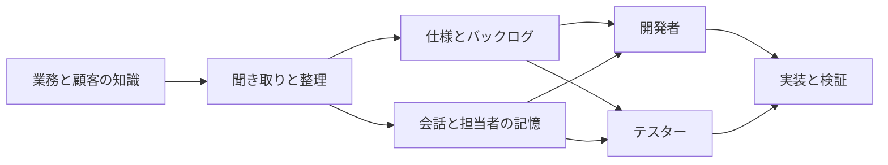
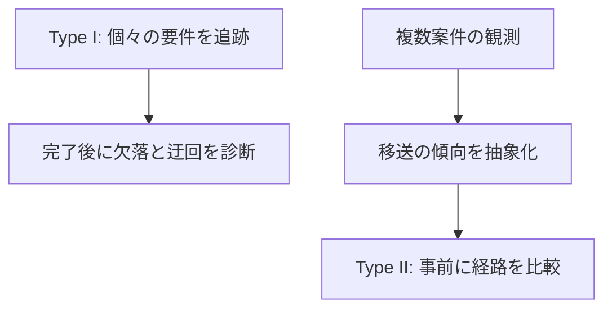
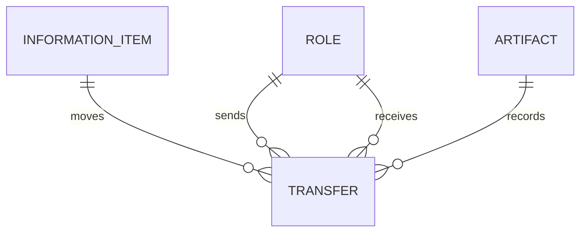

要件定義のレビューで、完全性や曖昧さを確認しても、実装が期待どおりにならないことがあります。仕様書は整っているのに、開発者は会話や過去の経験を頼り、テスターは別の解釈で確認を始める。問題は文書の中だけではなく、情報が役割間をどう移動したかにあります。

2026年7月に公開された、Henning Femmer と Julian Frattini によるプレプリント「[Information is all you need: Requirements Engineering Quality Reframed](https://arxiv.org/abs/2607.21319)」は、要件工学の品質を、成果物の属性だけでなく情報移送の有効性と効率として捉え直す理論を提案しています。arXiv v1 は2026年7月23日投稿、分類は cs.SE です。本記事では、その考え方を、要件・設計・実装・テストをつなぐ実務の観測に落とします。

> これはビジョン論文です。提案モデルの実証済みの効果や、組織横断で使える標準指標を示すものではありません。以下の実務的な設計案は、論文の概念を検証可能な形へ翻訳したものです。

この記事は、論文の提案、論文がまだ検証していない点、本記事が追加する実務上の観測案を区別します。実組織での測定方法、予測精度、誤情報・鮮度の扱いは、論文の例示モデルで検証済みではありません。

## 結論: 良い仕様書だけでは、良い情報移送を保証しない

要件の品質を「文書がよく書けているか」だけで測ると、次の問いが抜け落ちます。

1. 重要な情報は、実装やテストの判断時点に届いているか
2. 誰が、どの経路で、どの根拠を使って判断したか
3. 仕様書を迂回する経路は、どこで情報の欠落や矛盾を生むか

論文の立場では、仕様書、バックログ、会話、担当者の記憶はすべて情報を保存・移送する媒体です。仕様書は中心的な媒体ですが、唯一の媒体ではありません。だからこそ、文書の品質と、文書を含む経路の品質を分けて設計します。

この構図では、会話があるから悪いのではありません。会話は素早く曖昧さを解くことがあります。一方で、会話だけに依存すると、担当変更、時間経過、アクセス制限で情報が失われます。重要なのは、どの情報をどの経路に任せ、どこで証跡を残すかです。

この図は、論文の情報源・有形／無形の情報ストレージ・役割という概念を実務向けに再構成したものです。特定組織の観測結果や、論文中の実験構成を表すものではありません。

## 論文が提案する「情報粒子」と「情報フロー」

論文は、要件を情報粒子と呼ばれる離散的な知識として扱います。たとえば「CSVで出力できる」「応答は100ms以内」「この例外では二者承認が必要」といった粒度です。これらが情報源から開発者・テスターへ移る一連の流れが、要件工学そのものだと考えます。

| 従来の確認 | 情報フローとして追加する確認 |
|---|---|
| 受入条件は書かれているか | 誰が実装・テスト時にそれを参照したか |
| 用語は一貫しているか | 会話やチケットで別の用語に変換されていないか |
| 仕様は最新版か | 判断時点で最新版へ到達できたか |
| レビュー済みか | どの判断に利用されたかを追えるか |

論文は、個々の情報粒子を追跡する Type I と、情報量を連続量として抽象化する Type II を示します。Type II は、個々の粒子を直接追う代わりに、保持・到達した情報量を 0〜1 の量として扱います。論文の例示では、入力情報量、複雑さ、担当者のスキル、投入時間などを移送関数のパラメータに置きます。前者は完了後の診断、後者は将来のシミュレーションに向く構想です。

Type II は特に注意が必要です。論文自身も、現実の移送特性をどのように測定し、パラメータ化するかを今後の課題として挙げています。例示モデルの関数形とパラメータ値は実測から推定されたものではありません。現時点で、この例示モデルなら開発遅延を予測できると解釈してはいけません。

## 仕様書が読まれない現象を、失敗ではなく経路として見る

論文が扱う代表的な異常は、良い仕様書が存在しても、開発者が別の経路から情報を得るために仕様書を迂回する状況です。これは「開発者が仕様を守らない」とだけ診断すると、改善方法を誤ります。

論文の説明を踏まえると、実務では次のような仮説を置けます。

- 仕様書より、担当者へ聞く方が早い
- 例外条件が仕様書に反映される前に、会話で更新された
- 実装時に必要な粒度と、仕様書の粒度が合わない
- テストの観点が別のチケットや口頭の合意にだけ残っている

このとき改善対象は、文書の文体だけではありません。情報源、経路、受信者、時点、根拠を結び直します。

## 最小限の観測モデルを作る

全要件を追跡すると運用が重くなります。まずは、変更の影響が大きい項目だけを対象にします。たとえば、外部連携、性能制約、例外処理、法令・監査要件、承認条件です。

| データ | 最小フィールド | 何を防ぐか |
|---|---|---|
| 情報項目 | ID、種別、重要度、情報源 | 重要な条件の取りこぼし |
| 移送 | 送信者、受信者、経路、時刻、状態 | 遅延と責任の不明確さ |
| 成果物 | 仕様、議事録、PR、テスト、決定記録 | 根拠の散逸 |
| 証跡 | URL、コミット、確認者 | 後からの再現不能 |

ここでの ID は、要件管理ツールを新たに導入するためのものではありません。既存のチケット、設計決定、PR、テストケースを横断して、同じ重要条件を参照できるようにするための接続詞です。矛盾、誤解、鮮度、情報源間の競合は、本記事では実務上必要な観測項目として追加しています。これらは論文の例示モデルで形式化・検証された性質ではありません。

## AI エージェントを含む開発では、情報の配信契約を明示する

以下は本論文の実証結果ではなく、情報中心の見方を AI エージェント基盤へ外挿した、本記事の設計仮説です。AI エージェントを使う開発では、情報フローの問題が顕在化する可能性があります。プロンプト、Issue、設計文書、リポジトリ内ルール、テスト結果が存在していても、エージェントが判断時に参照するとは限りません。

そのため、単に知識を保存するのではなく、どの条件で何を届けるかを設計します。たとえば、変更対象パス、依存更新、外部通信、認可に関わる操作では、対応する設計ルールと検証条件をルールベースで実行コンテキストに含めます。コンテキストに含めても、エージェントが理解・利用したことは保証されません。

これは論文が AI エージェントを検証した結果ではありません。情報を役割・成果物間で移送するという概念を、エージェントの実行基盤へ適用した設計上の推論です。効果を主張する前に、次の証跡を観測できるようにします。

- どの情報源を、いつ、どの実行に渡したか
- エージェントがどの根拠を参照・引用した痕跡があるか
- 必須の情報が未配信だった run はどれか
- 配信した情報が古かった、競合した、不要だった割合はどれくらいか

## 導入時の5ステップ

1. 重要な要件を機能、非機能、例外、承認条件に分けて列挙する
2. 各項目に、情報源、最終利用者、通常の経路、根拠へのリンクを置く
3. 開発とテストの判断時に、その項目を参照した証跡を残す
4. 仕様外の会話や差戻しで補われた項目を、迂回として記録する
5. 最も頻繁に失われる経路だけを、テンプレート、同期、役割、ツール連携で改善する

測るべきなのは、文書閲覧回数のような見栄えのよい数値だけではありません。重要情報が判断時に利用可能だったか、確認にどれだけ待ったか、情報欠落に紐づく手戻りが減ったかを、チーム内の改善前後で比較します。ただし、閲覧・引用の証跡だけでは情報が判断に因果的に使われたと証明できません。未配信条件との比較、再実行、成果物とテスト結果の確認を組み合わせ、案件難易度や担当変更の影響も考慮します。

## まとめ

要件品質を成果物だけで評価すると、良い仕様書があっても実装やテストで別の情報が使われる現象を説明しにくくなります。情報フローとして見ると、改善対象は文書の書き方だけでなく、情報源、経路、役割、鮮度、根拠、判断時点へ広がります。

まずは高リスクな要件から、誰がどの経路で受け取り、どの判断に使ったかを結んでみるのがよい出発点です。文書を増やす前に、情報がどこで止まり、どこで迂回し、誰の記憶へ偏っているかを可視化できます。

## 参考リンク

- [Information is all you need: Requirements Engineering Quality Reframed, arXiv:2607.21319](https://arxiv.org/abs/2607.21319)
- [論文 HTML 版](https://arxiv.org/html/2607.21319v1)
- [Replication package, Zenodo](https://doi.org/10.5281/zenodo.20647995)
