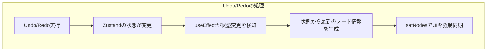
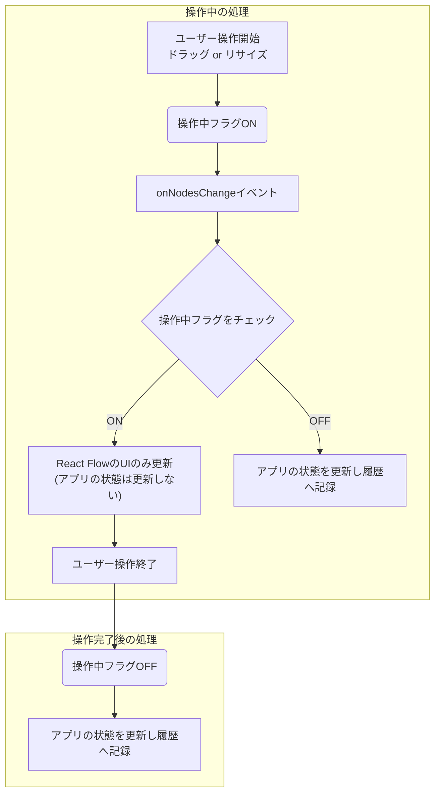
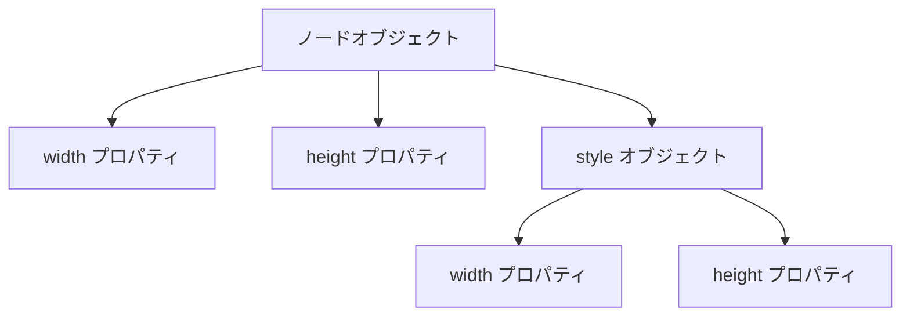
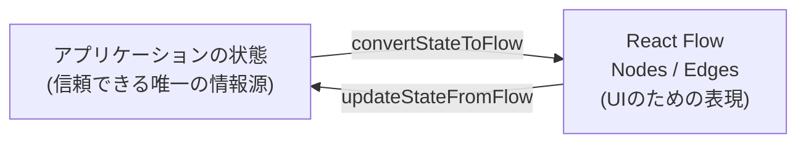

### 1. はじめに：なぜReact FlowのUndo/Redoは難しいのか

React Flow (`@xyflow/react`) でUndo/Redo機能を実装する際、Zustandのような状態管理ライブラリと`zustand-undo`のようなミドルウェアを導入するだけでは、多くの場合、深刻な問題に直面します。

この記事では、Undo/Redo実装で頻発する以下の2つの課題を解決し、パフォーマンスとUIの整合性を両立させるための、実践的なアーキテクチャを詳細に解説します。

- **課題1：意図しない履歴の大量生成**
  ノードのドラッグ操作中に`onNodesChange`が連続発火し、1回の操作で数十件ものUndo履歴が作られてしまうパフォーマンス問題。
- **課題2：状態とUIの乖離**
  Undo操作でZustandの状態は過去に戻るのに、React Flow上のノード位置が追従せず、データと画面表示が食い違う不整合問題。

本記事を読めば、これらの課題を根本から解決し、ユーザーにとって直感的で安定したUndo/Redo体験を提供できるようになります。

### 2. 対象の技術スタック

- React 18以降
- @xyflow/react (React Flow)
- Zustand (with `zustand-undo` middleware or similar)
- TypeScript

### 3. 解決策の全体像：状態更新とUI更新の分離・同期

課題解決の鍵は、**「アプリケーションの状態」**（Zustandが管理する信頼できる唯一の情報源）と **「React FlowのUI状態」** （コンポーネントが描画する一時的な表示）の更新タイミングを明確に分離し、必要な時だけ同期させることです。

これは、以下の3つのアプローチで実現します。

1. **中間状態のフィルタリング**: 操作中（ドラッグ、リサイズ中）に発生する大量のイベントではUIのみを更新し、「アプリケーションの状態」への反映はスキップします。
2. **操作完了時の状態確定**: ユーザーの一連の操作が完了したタイミングで、最終的な結果を「アプリケーションの状態」へ確実に記録します。
3. **状態変更時のUI強制同期**: Undo/Redoによって「アプリケーションの状態」が変更された際、その内容をReact FlowのUIへ強制的に反映させます。





| 要素名 | 説明 |
| :--- | :--- |
| **ユーザー操作** | ユーザーがノードをドラッグ、またはリサイズする一連の動作。 |
| **操作中フラグ** | `useRef`で管理。ドラッグやリサイズといった連続操作の期間を管理する。 |
| **onNodesChange** | React Flowのノード変更イベントを処理するコールバック。 |
| **アプリケーションの状態** | Zustandで一元管理される、永続化すべきすべての情報（ノードの位置、サイズ、接続など）。 |
| **UIの強制同期** | Undo/Redo時に、「アプリケーションの状態」をReact Flowのノードに正しく反映させる処理。 |

### 4. 課題1への対策：`useRef`フラグで中間履歴をスキップする

#### 問題点

ノードのドラッグやリサイズ操作中は、`onNodesChange`イベントが非常に高い頻度で発生します。このイベントのたびに「アプリケーションの状態」を更新すると、大量のUndo履歴が生成され、パフォーマンス低下や意図しない挙動の原因となります。

#### 解決策

`useRef`でフラグを管理し、操作中は状態更新をスキップ。操作完了時にのみ、状態を更新して履歴に記録します。

#### コード例

```typescript
// AppState: アプリケーション全体の状態を示す型
// const { appState, onStateUpdate } = useYourStore();

// 再レンダリングを発生させないuseRefでフラグを管理
const isInteractingRef = useRef(false);

// ... (handleNodeDragStart, handleNodeResizeStartなどで isInteractingRef.current = true とする) ...

const handleNodesChange: OnNodesChange = useCallback((changes) => {
  // フラグが立っている間は、UIのみを更新して描画をスムーズにする
  if (isInteractingRef.current) {
    setNodes((nodes) => applyNodeChanges(changes, nodes));
    return;
  }

  // 通常時のみ、アプリケーションの状態を更新してUndo履歴に記録
  setNodes((nodes) => {
    const updatedNodes = applyNodeChanges(changes, nodes);
    const updatedState = updateStateFromFlow(appState, updatedNodes, edges);
    onStateUpdate(updatedState); // Zustandの状態を更新し、履歴に記録
    return updatedNodes;
  });
}, [setNodes, edges, appState, onStateUpdate]);
```

#### 要点

- **`useRef`の活用**: `useState`と異なり、`useRef`は値の変更が再レンダリングをトリガーしないため、操作中のパフォーマンス低下を防ぎます。
- **確実なフラグのリセット**: 操作終了イベント（`onNodeDragStop`, `onNodeResizeStop`）で、必ずフラグを`false`にリセットすることが極めて重要です。

### 5. 課題1への対策：操作完了時に無条件で状態を記録する

#### 問題点

「グリッドにスナップした場合のみ状態を更新する」といった条件付きのロジックは危険です。条件に合致しない操作（例：スナップしない位置でのドラッグ終了）が履歴に記録されず、ユーザーの操作結果が失われる原因になります。

#### 解決策

操作完了時のイベントハンドラでは、いかなる条件分岐も設けず、**常に**その時点の最新のUI情報で「アプリケーションの状態」を更新します。

#### コード例

```typescript
const handleNodeDragStop = useCallback((_event, node, nodes) => {
  // スナップ処理などのUI補助機能をここで行う ...

  // 条件分岐なしで、常に最終的な状態をアプリケーションに反映
  const updatedState = updateStateFromFlow(appState, nodes, edges);
  onStateUpdate(updatedState);

  // フラグをリセット
  isInteractingRef.current = false;
}, [appState, edges, onStateUpdate]);

// リサイズ終了時も同様
const handleNodeResizeStop = useCallback((_event, node, nodes) => {
  const updatedState = updateStateFromFlow(appState, nodes, edges);
  onStateUpdate(updatedState);
  isInteractingRef.current = false;
}, [nodes, edges, appState, onStateUpdate]);
```

#### 要点

- **無条件更新の徹底**: ユーザーの一連の操作の最終結果は、必ず履歴に記録されるべきです。
- **関心の分離**: スナップのようなUI上の補助機能と、状態の永続化は、独立した処理として扱いましょう。

### 6. 課題2への対策：`useEffect`で状態とUIを強制同期させる

#### 問題点

Undo/Redoを実行してZustand上の「アプリケーションの状態」が過去に戻っても、React Flowが表示しているUI（ノードの位置やサイズ）は古いまま。これにより、状態と表示が乖離し、ユーザーを混乱させます。

#### 解決策

`useEffect`フックを用いて「アプリケーションの状態」の変更を監視します。状態が変更されたら、そのデータから最新のノード情報を生成し、`setNodes`でUIを強制的に更新します。

#### コード例

```typescript
// アプリケーションの状態変更を検知し、React FlowのUIに反映させる
useEffect(() => {
  if (!appState) return;

  setNodes((currentNodes) =>
    currentNodes.map((node) => {
      if (node.type === 'laneNode') {
        const laneData = appState.lanes.find((l) => l.id === node.data.lane.id);
        if (laneData) {
          // 状態に保存された位置とサイズをノードに反映
          return {
            ...node,
            position: laneData.position,     // 1. 位置を更新
            width: laneData.size.width,      // 2. トップレベルの幅を更新
            height: laneData.size.height,    // 3. トップレベルの高さを更新
            style: {                         // 4. style内の幅と高さも更新
              ...node.style,
              width: laneData.size.width,
              height: laneData.size.height,
            },
            data: { ...node.data, lane: laneData }, // データも更新
          };
        }
      }
      // 他のノードタイプも同様に更新...
      return node;
    })
  );
}, [appState, setNodes]); // appStateの変更を依存配列に指定
```

#### 要点：React Flowのノードサイズ管理の注意点

ノードのサイズをUndo/Redoで正しく復元するには、以下の4つのプロパティを**すべて同時に**更新する必要があります。



| プロパティ | 役割 |
| :--- | :--- |
| **`width`, `height` (トップレベル)** | React Flowが内部的な位置計算や衝突検出に利用。 |
| **`style.width`, `style.height`** | 実際のDOM要素の描画スタイルとして適用される。 |

いずれかが欠けると、UIが正しく復元されないため注意が必要です。

### 7. 特殊ケース：UI操作を介さない状態更新の制御

プロパティパネルからの保存など、UIを介さず直接状態を更新する場合、`onNodesChange`との競合を避けるための別の制御が必要です。

#### 解決策

このような単発のイベントでは、フラグの代わりにカウンター（`useRef<number>`）を利用します。状態更新直後に意図せず発生する`onNodesChange`を、1回だけ的確にスキップさせます。

| 操作タイプ | 制御方式 | 理由 |
| :--- | :--- | :--- |
| **ドラッグ/リサイズ** | フラグ (`useRef<boolean>`) | 連続的なイベントストリームの「期間」を管理するため。 |
| **プログラマティックな更新** | カウンター (`useRef<number>`) | 単発で同期的に発生するイベントの「回数」を管理するため。 |

#### コード例

```typescript
const skipNodesChangeRef = useRef(0);

// プロパティパネルの保存処理など
const handleProgrammaticUpdate = useCallback((updatedData) => {
  // 1. 先にアプリケーションの状態を更新し、履歴に記録
  const updatedState = createNewState(appState, updatedData);
  onStateUpdate(updatedState);

  // 2. この直後のonNodesChangeを1回スキップするよう設定
  skipNodesChangeRef.current = 1;

  // 3. React Flowのノードを更新し、UIに即時反映
  setNodes((nodes) => /* ...ノードの更新処理... */);
}, [appState, onStateUpdate, setNodes]);

// onNodesChange内での処理
const handleNodesChange: OnNodesChange = useCallback((changes) => {
  if (skipNodesChangeRef.current > 0) {
    skipNodesChangeRef.current--;
    setNodes((nodes) => applyNodeChanges(changes, nodes));
    return;
  }
  // ... 通常のドラッグ操作などの処理（対策1を参照）
}, [/* ... */]);
```

### 8. 設計の要：状態とUIデータ間の相互変換

信頼性の高いUndo/Redo機能の根幹は、「アプリケーションの状態」と「React Flowのノード/エッジ」というデータ構造を、情報を欠落させることなく相互に変換する仕組みです。これにより、状態管理を一元化できます。



| 関数 | 説明 |
| :--- | :--- |
| **`convertStateToFlow`** | アプリケーション起動時やUndo/Redo時に、「状態」からReact Flowのノードとエッジを生成する。 |
| **`updateStateFromFlow`** | ユーザー操作後、React Flowのノードとエッジの最新情報から「アプリケーションの状態」を更新する。 |

#### `updateStateFromFlow` 関数の実装ポイント

ユーザー操作後のノード情報から「アプリケーションの状態」を更新する際は、特に位置とサイズを正確に保存することが重要です。

```typescript
// React Flow → アプリケーションの状態 への変換
export function updateStateFromFlow(currentState: AppState, nodes: Node[], edges: Edge[]): AppState {
  const lanes = nodes
    .filter((node) => node.type === 'laneNode')
    .map((node) => {
      const lane = node.data.lane;
      return {
        ...lane,
        position: node.position, // 位置を正確に保存
        size: { // サイズを複数のプロパティから評価し、最も信頼できる値を保存
          width: node.measured?.width ?? node.width ?? node.style?.width ?? 500,
          height: node.measured?.height ?? node.height ?? node.style?.height ?? 300,
        },
      };
    });

  // ... tasksの更新処理も同様 ...

  return { ...currentState, lanes, tasks, edges };
}
```

### まとめ

React Flowで高信頼なUndo/Redo機能を実装するための要点は以下の通りです。

1.  **イベント制御**: `useRef`を用いたフラグやカウンターで、Undo履歴に記録するタイミング（＝状態更新のタイミング）を厳密に制御する。
2.  **確実な状態更新**: ユーザー操作の完了時には、条件分岐を設けず必ず「アプリケーションの状態」を更新し、履歴に記録する。
3.  **UIの強制同期**: `useEffect`を利用して、「アプリケーションの状態」の変更をReact FlowのUIに強制的に反映させる。特にノードのサイズ関連プロパティは網羅的に更新する。
4.  **完全なデータ変換**: 「アプリケーションの状態」とReact Flowのデータ構造の間で、情報を欠落させずに相互変換する関数を実装し、状態管理を一元化する。

これらのテクニックを組み合わせることで、単に「機能する」だけでなく、ユーザーにとって「快適で安定した」Undo/Redo体験を提供できます。

この記事が、あなたの開発の助けになれば幸いです。

この記事が少しでも参考になった、あるいは改善点などがあれば、ぜひリアクションやコメント、SNSでのシェアをいただけると励みになります！

### 参考リンク

- **公式サイト**
  - [React Flow](https://reactflow.dev/)
  - [Zustand](https://zustand-demo.pmnd.rs/)
- **サンプル**
  - [Enablement Map Studio - SbpCanvas.tsx](https://github.com/suwa-sh/enablement-map-studio/blob/main/packages/editor-sbp/src/components/SbpCanvas.tsx)
  - [flowConverter.ts](https://github.com/suwa-sh/enablement-map-studio/blob/main/packages/editor-sbp/src/utils/flowConverter.ts)
