## 概要

ReBAC（Relationship-Based Access Control）は、エンティティ間の**関係**に基づいてアクセス可否を決定する認可モデルです。

Google は 2019 年に大規模認可システム「Zanzibar」を USENIX ATC で発表しました。Zanzibar は ReBAC を基盤モデルとして採用し、Google ドライブ・YouTube・Google マップなど全社サービスの認可を単一システムで処理します。この論文が OSS 実装の出発点となり、SpiceDB（AuthZed）と OpenFGA（Auth0/Okta → CNCF Incubating）が誕生しました。

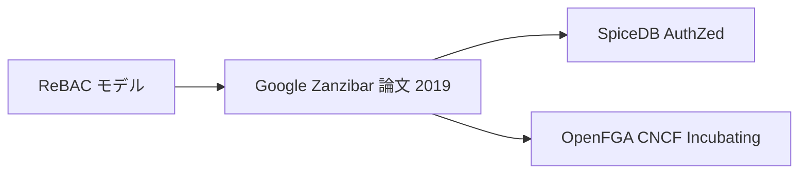

| 要素名 | 説明 |
|---|---|
| ReBAC モデル | エンティティ間の関係でアクセス可否を決定する認可パラダイム |
| Google Zanzibar 論文 2019 | ReBAC を基盤とした Google の大規模認可システム。USENIX ATC 2019 で発表 |
| SpiceDB AuthZed | Zanzibar の設計原則を基に構築されたオープンソース実装。AuthZed が商用提供 |
| OpenFGA CNCF Incubating | Auth0 が開発し CNCF Incubating に昇格したオープンソース実装 |

### Zanzibar 概念と OpenFGA / SpiceDB の対応

| Zanzibar 概念 | Zanzibar 表記例 | OpenFGA 相当 | SpiceDB 相当 |
|---|---|---|---|
| Namespace | `name: "document"` | `type document` | `definition document {}` |
| Relation | `relation { name: "reader" }` | `define reader: [user]` | `relation reader: user` |
| Userset Rewrite - union | `union { child: ... }` | `define can_view: reader or owner` | `permission view = reader + owner` |
| Userset Rewrite - intersection | `intersection { child: ... }` | `define can_edit: writer and verified` | `permission edit = writer & verified` |
| Userset Rewrite - exclusion | `exclusion { ... }` | `define restricted: reader but not banned` | `permission restricted = reader - banned` |
| RelationTuple | `doc:readme#reader@user:alice` | `{ user: "user:alice", relation: "reader", object: "document:readme" }` | `resource: doc:readme, relation: reader, subject: user:alice` |

### 演算子のスキーマ例

intersection と exclusion を含む OpenFGA モデルの例です。

```openfga
model
  schema 1.1

type user

type document
  relations
    define owner: [user]
    define writer: [user]
    define reader: [user]
    define banned: [user]
    define verified: [user]
    define can_edit: writer and verified
    define can_view: reader but not banned
```

SpiceDB での同等スキーマです。

```zed
definition user {}

definition document {
  relation owner: user
  relation writer: user
  relation reader: user
  relation banned: user
  relation verified: user

  permission edit = writer & verified
  permission view = reader - banned
}
```

### マルチテナント多段継承の例

組織 → フォルダ → ドキュメントの階層で権限を継承するモデルです。

```openfga
model
  schema 1.1

type user

type organization
  relations
    define admin: [user]
    define member: [user]

type folder
  relations
    define parent: [organization]
    define viewer: [user] or member from parent

type document
  relations
    define parent: [folder]
    define viewer: [user] or viewer from parent
```

## 特徴

### 認可モデルの比較

ReBAC は ABAC（Attribute-Based Access Control）と密接に関連しています。関係を「属性の一種」と見なせば、ReBAC は ABAC のサブセットとして位置づけられます。ロール（RBAC）も「関係の一形態」であり、ReBAC は RBAC と ABAC の中間に位置します。

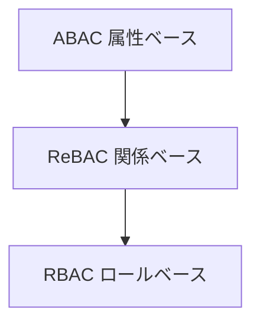

| 要素名 | 説明 |
|---|---|
| ABAC 属性ベース | ユーザー・リソース・環境の属性すべてを評価する最上位モデル |
| ReBAC 関係ベース | エンティティ間の関係を属性の一種として扱うモデル。ABAC のサブセット |
| RBAC ロールベース | ロールを関係の一種として扱うモデル。ReBAC のサブセット |

| 比較項目 | RBAC | ABAC | ReBAC |
|---|---|---|---|
| アクセス制御粒度 | 粗粒度（ロール単位） | 細粒度（属性組み合わせ） | 細粒度（関係グラフ） |
| スケーラビリティ | 低（ロール爆発リスク） | 高（ポリシーで対応） | 高（グループ・階層で対応） |
| ポリシー表現力 | 限定的（条件表現不可） | 最高（時刻・場所・属性） | 高（所有・階層・共有） |
| 実装複雑度 | 低 | 高 | 中 |
| 主なユースケース | 社内システム・安定した役割 | 時刻制限・条件付きアクセス | SaaS マルチテナント・ドキュメント共有 |

### ユースケース別推奨モデル

| ユースケース | 推奨モデル | 理由 |
|---|---|---|
| SaaS マルチテナント | ReBAC | テナント・組織・メンバーの階層関係を自然にモデル化できる |
| ドキュメント管理 | ReBAC | フォルダ親子関係・所有者・共有の継承を直接表現できる |
| 組織階層 | ReBAC | 部署・チーム・メンバーの階層をグラフで管理できる |
| 社内 CRUD 系システム | RBAC | ロールが安定しており実装コストを抑えられる |
| 時刻・場所による制限 | ABAC | 時刻・IP・地域などの環境属性が必要 |
| AI エージェント認可 | ReBAC + ABAC | リソース関係と動的コンテキストの両方が必要 |

### Clean Architecture との組み合わせにおける特徴

- **認可ロジックをドメイン層に閉じ込められる** — 関係タプル（ユーザー・リレーション・オブジェクト）はドメインオブジェクトとして自然にモデル化できます
- **UseCase 層で認可チェックを一元化できる** — UseCase に閉じた認可表明（assertion）を定義することで、フレームワーク依存を排除できます
- **Port/Adapter パターンで外部エンジンを分離できる** — OpenFGA / SpiceDB への呼び出しを Adapter 層のアダプターとして実装し、ドメイン・UseCase 層を汚染しません
- **ユビキタス言語で権限を表現できる** — 「誰が・何に対して・どの関係を持つか」という ReBAC の構造はドメイン用語と一致しやすく、ビジネスルールとしての可読性が高まります
- **テスタビリティが向上する** — 認可チェックをインターフェースで抽象化するため、UseCase 層の単体テストで認可ロジックを独立して検証できます
- **段階的導入が可能** — 既存の RBAC を関係タプルとして表現し直すことで、Clean Architecture の依存ルールを維持したまま ReBAC へ移行できます

## 構造

### システムコンテキスト図

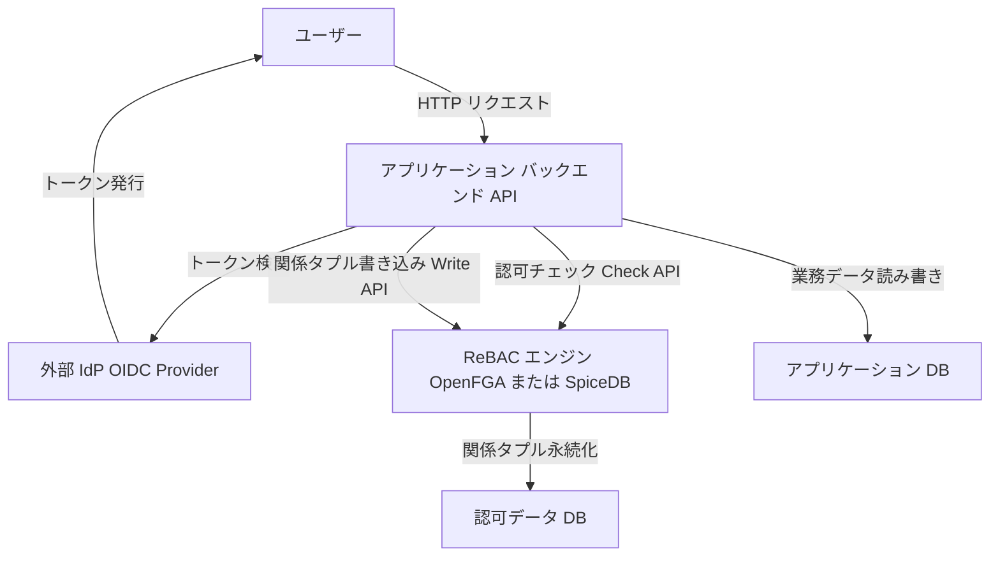

| 要素名 | 説明 |
|---|---|
| ユーザー | アプリケーションを操作する人間のアクター |
| 外部 IdP OIDC Provider | OpenID Connect によるトークン発行を行う外部認証サービス |
| アプリケーション バックエンド API | Clean Architecture で構成されたバックエンドサービス |
| ReBAC エンジン OpenFGA または SpiceDB | 関係ベースアクセス制御を担う認可エンジン |
| アプリケーション DB | 業務データを永続化するデータベース |
| 認可データ DB | 関係タプルと認可モデルを永続化するデータベース |

### コンテナ図

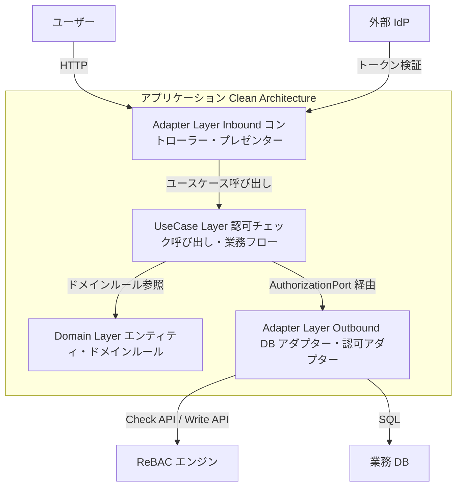

#### アプリケーション内レイヤー

| 要素名 | 説明 |
|---|---|
| Domain Layer | エンティティとドメインルールを保持する最内層。外部依存を持たない |
| UseCase Layer | 業務フローを記述し、認可チェックをポート経由で呼び出す |
| Adapter Layer - Inbound | HTTP コントローラー、プレゼンター、IdP トークン検証を担う |
| Adapter Layer - Outbound | ReBAC エンジンと DB への実際のアクセスを実装する最外層 |

#### 外部システム

| 要素名 | 説明 |
|---|---|
| ユーザー | Adapter Layer - Inbound に HTTP リクエストを送信するアクター |
| 外部 IdP | Adapter Layer - Inbound でトークン検証に使用する認証プロバイダー |
| ReBAC エンジン | Adapter Layer - Outbound から Check API と Write API で呼び出す認可エンジン |
| 業務 DB | Adapter Layer - Outbound から SQL でアクセスする業務データの永続化先 |

### コンポーネント図

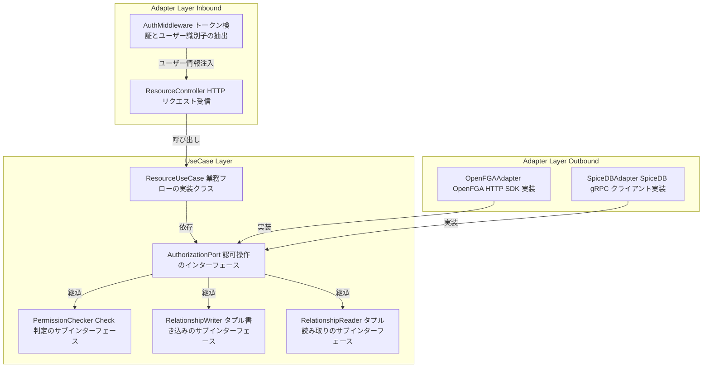

#### UseCase Layer

| 要素名 | 説明 |
|---|---|
| ResourceUseCase | 業務フローを記述する実装クラス。認可チェックを AuthorizationPort 経由で行う |
| AuthorizationPort | UseCase Layer が定義する認可操作の統合インターフェース。依存性の境界を形成する |
| PermissionChecker | `check(user, relation, object)` を定義するサブインターフェース |
| RelationshipWriter | `writeTuple(user, relation, object)` を定義するサブインターフェース |
| RelationshipReader | `readTuples(object)` を定義するサブインターフェース |

#### Adapter Layer - Outbound

| 要素名 | 説明 |
|---|---|
| OpenFGAAdapter | AuthorizationPort を実装し、OpenFGA の HTTP API を JS SDK 経由で呼び出すアダプター |
| SpiceDBAdapter | AuthorizationPort を実装し、SpiceDB の gRPC API を呼び出すアダプター |

#### Adapter Layer - Inbound

| 要素名 | 説明 |
|---|---|
| ResourceController | HTTP リクエストを受け取り、UseCase を呼び出すコントローラー |
| AuthMiddleware | IdP トークンを検証し、ユーザー識別子をリクエストコンテキストに注入するミドルウェア |

### メインフローのシーケンス図

リクエスト受信から認可チェック・レスポンスまでの一連の流れです。

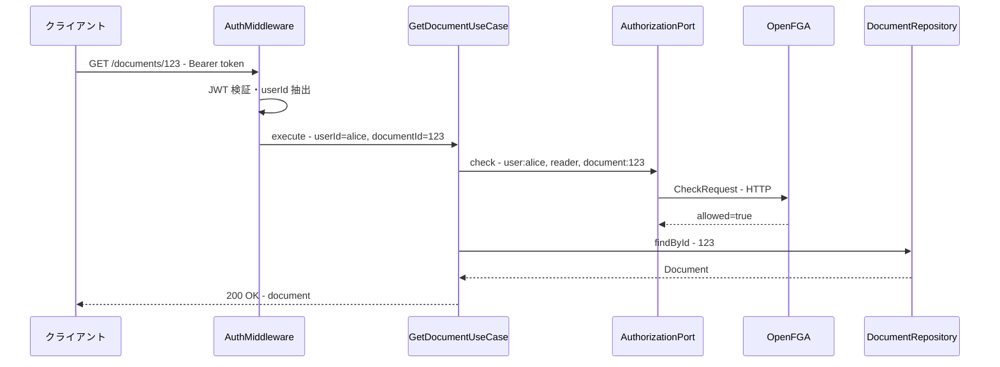

### Tuple 書き込みフローのシーケンス図

リソース作成時に認可タプルを同時に書き込む流れです。SpiceDB の場合は ZedToken が返されますが、OpenFGA の Write API には consistency token の返却はありません。

#### SpiceDB の場合（ZedToken あり）

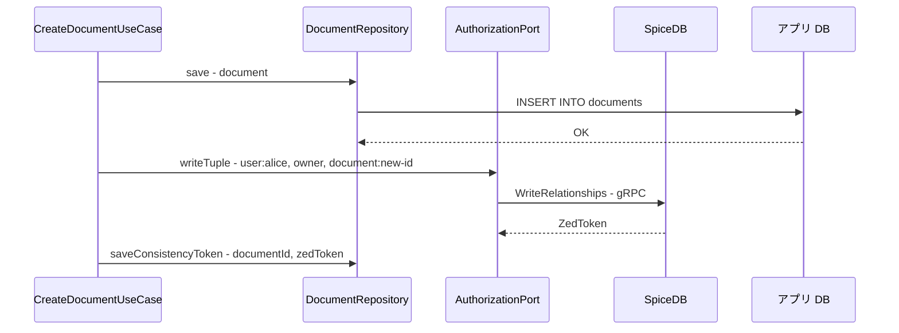

#### OpenFGA の場合（ZedToken なし）

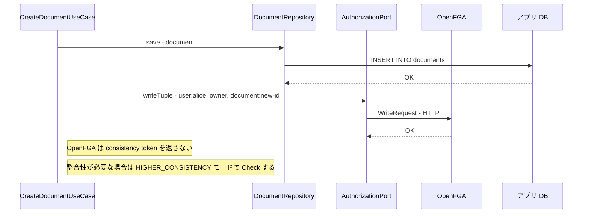

## データ

### 概念モデル

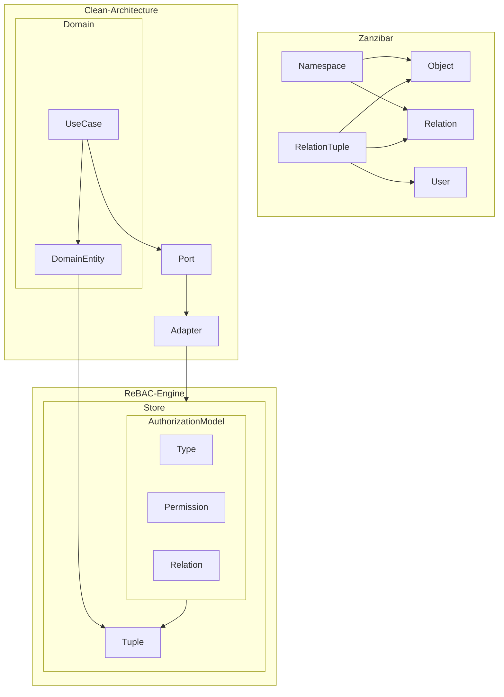

#### Zanzibar

| 要素名 | 説明 |
|---|---|
| Namespace | オブジェクト種別と許可される Relation を定義するスキーマ単位 |
| Object | Namespace に属するリソースの個別インスタンス |
| Relation | Object と User の間に成立しうる関係の名称 |
| User | Object に対して関係を持つ主体。単一 ID または Userset |
| RelationTuple | Object・Relation・User の 3 要素で表す認可の最小単位 |

#### ReBAC-Engine

| 要素名 | 説明 |
|---|---|
| Store | AuthorizationModel と Tuple を保持する認可データの隔離単位 |
| AuthorizationModel | Type と Relation と Permission を束ねたスキーマ定義 |
| Type | 同一特性を持つ Object を分類する文字列識別子 |
| Relation | TypeDefinition 内で定義する Object と User の関係名 |
| Permission | Relation の集合演算で導出する計算済みアクセス権 |
| Tuple | User・Relation・Object の具体的な関係インスタンス |

#### Clean-Architecture

| 要素名 | 説明 |
|---|---|
| DomainEntity | ビジネスルールと ID・属性を持つドメインの中心概念 |
| UseCase | 認可判定を含むアプリケーション固有のビジネスフロー |
| Port | 認可エンジンへのアクセスを抽象化したインターフェース |
| Adapter | Port を ReBAC Engine のクライアントとして実装する翻訳層（Outbound Adapter） |

### 情報モデル

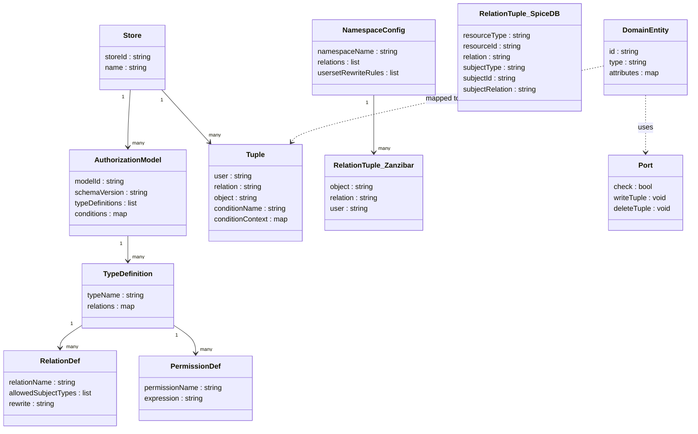

| 要素名 | 説明 |
|---|---|
| Store | storeId を持ち、AuthorizationModel と Tuple を格納する最上位コンテナ |
| AuthorizationModel | modelId とスキーマバージョンを持ち、TypeDefinition のリストと条件を束ねる |
| TypeDefinition | typeName を持ち、その Type で有効な RelationDef と PermissionDef を定義する |
| RelationDef | 関係名と許可するサブジェクト型のリストおよび Rewrite 式を持つ |
| PermissionDef | 権限名と Relation の集合演算式を持つ計算済み権限定義 |
| Tuple | user / relation / object の 3 フィールドとオプションの condition を持つ認可の最小データ単位 |
| NamespaceConfig | Zanzibar における型スキーマ。namespaceName と Relation リストおよび Userset Rewrite Rule を持つ |
| RelationTuple_Zanzibar | Zanzibar の 3 要素タプル。`object#relation@user` 形式で表現する |
| RelationTuple_SpiceDB | SpiceDB の 6 フィールドタプル。リソース側とサブジェクト側をそれぞれ type/id/relation で表現する |
| DomainEntity | Clean Architecture のドメイン概念。id と type と attributes を持ち、Tuple へマッピングされる |
| Port | 認可エンジンへの抽象インターフェース。check / writeTuple / deleteTuple を宣言する |

## 構築方法

### Clean Architecture プロジェクトへの認可レイヤー追加手順

- UseCase 層に `AuthorizationPort` インターフェースを定義します（Clean Architecture の依存ルールに従い、UseCase 層が外部システムとの境界を定義します。`domain/ports/` にファイルを配置しますが、論理的には UseCase 層の責務です）
- Adapter 層（Outbound）に OpenFGA または SpiceDB のアダプターを実装します
- DI コンテナでポートにアダプターを注入します
- UseCase 層でポートを呼び出して権限チェックを挿入します

追加する層の配置は以下のとおりです。

```
src/
├── domain/
│   └── ports/
│       └── authorization.port.ts     # AuthorizationPort インターフェース
├── application/
│   └── use-cases/
│       └── document.use-case.ts      # UseCase（権限チェック挿入済み）
└── adapter/
    ├── inbound/
    │   └── document.controller.ts    # コントローラー
    └── outbound/
        └── authorization/
            ├── openfga.adapter.ts    # OpenFGA アダプター
            └── spicedb.adapter.ts    # SpiceDB アダプター
```

### AuthorizationPort インターフェースの定義例（TypeScript）

ドメイン層に配置するポートは、認可エンジンの実装詳細を持ちません。

```typescript
// domain/ports/authorization.port.ts

export interface CheckRequest {
  user: string;       // 例: "user:alice"
  relation: string;   // 例: "reader"
  object: string;     // 例: "document:123"
  contextualTuples?: TupleKey[];
}

export interface TupleKey {
  user: string;
  relation: string;
  object: string;
}

export interface AuthorizationPort {
  /** 単一の権限チェック */
  check(request: CheckRequest): Promise<boolean>;

  /** ユーザーが指定関係を持つオブジェクト一覧を取得する */
  listObjects(user: string, relation: string, type: string): Promise<string[]>;

  /** 指定オブジェクトに対して指定関係を持つユーザー一覧を取得する */
  listUsers(object: string, objectType: string, relation: string): Promise<string[]>;

  /** タプルを追加する */
  writeTuple(tuple: TupleKey): Promise<void>;

  /** タプルを削除する */
  deleteTuple(tuple: TupleKey): Promise<void>;
}
```

### OpenFGA アダプターの実装例

Adapter 層（Outbound）に OpenFGA SDK を使ったアダプターを実装します。

```typescript
// adapter/outbound/authorization/openfga.adapter.ts
import { OpenFgaClient } from '@openfga/sdk';
import { AuthorizationPort, CheckRequest, TupleKey } from '../../domain/ports/authorization.port';

export class OpenFgaAdapter implements AuthorizationPort {
  constructor(private readonly client: OpenFgaClient) {}

  async check(request: CheckRequest): Promise<boolean> {
    const { allowed } = await this.client.check({
      user: request.user,
      relation: request.relation,
      object: request.object,
      contextualTuples: request.contextualTuples,
    }, {
      authorizationModelId: process.env.FGA_MODEL_ID,
    });
    return allowed ?? false;
  }

  async listObjects(user: string, relation: string, type: string): Promise<string[]> {
    const response = await this.client.listObjects({
      user,
      relation,
      type,
    }, {
      authorizationModelId: process.env.FGA_MODEL_ID,
    });
    return response.objects ?? [];
  }

  async listUsers(object: string, objectType: string, relation: string): Promise<string[]> {
    const response = await this.client.listUsers({
      object: { type: objectType, id: object },
      relation,
      user_filters: [{ type: 'user' }],
    }, {
      authorizationModelId: process.env.FGA_MODEL_ID,
    });
    return (response.users ?? [])
      .filter(u => u.object) // userset や wildcard を除外する
      .map(u => `${u.object?.type}:${u.object?.id}`);
  }

  async writeTuple(tuple: TupleKey): Promise<void> {
    await this.client.write({
      writes: [{ user: tuple.user, relation: tuple.relation, object: tuple.object }],
    }, {
      authorizationModelId: process.env.FGA_MODEL_ID,
    });
  }

  async deleteTuple(tuple: TupleKey): Promise<void> {
    await this.client.write({
      deletes: [{ user: tuple.user, relation: tuple.relation, object: tuple.object }],
    }, {
      authorizationModelId: process.env.FGA_MODEL_ID,
    });
  }
}
```

### SpiceDB アダプターの実装例

SpiceDB の Node.js クライアント（authzed-node）を使ったアダプターです。

```typescript
// adapter/outbound/authorization/spicedb.adapter.ts
import { v1 } from '@authzed/authzed-node';
import { AuthorizationPort, TupleKey } from '../../domain/ports/authorization.port';

export class SpiceDbAdapter implements AuthorizationPort {
  private client: ReturnType<typeof v1.NewClient>;
  private promises: ReturnType<typeof v1.NewClient>['promises'];

  constructor(token: string, endpoint: string) {
    this.client = v1.NewClient(token, endpoint);
    this.promises = this.client.promises;
  }

  async check(request: { user: string; relation: string; object: string }): Promise<boolean> {
    const [objectType, objectId] = request.object.split(':');
    const [userType, userId] = request.user.split(':');

    const resource = v1.ObjectReference.create({ objectType, objectId });
    const subject = v1.SubjectReference.create({
      object: v1.ObjectReference.create({ objectType: userType, objectId: userId }),
    });

    const response = await this.promises.checkPermission(
      v1.CheckPermissionRequest.create({
        resource,
        permission: request.relation,
        subject,
      })
    );

    return response.permissionship === v1.CheckPermissionResponse_Permissionship.HAS_PERMISSION;
  }

  async writeTuple(tuple: TupleKey): Promise<void> {
    const [resourceType, resourceId] = tuple.object.split(':');
    const [subjectType, subjectId] = tuple.user.split(':');

    await this.promises.writeRelationships(
      v1.WriteRelationshipsRequest.create({
        updates: [
          v1.RelationshipUpdate.create({
            operation: v1.RelationshipUpdate_Operation.CREATE,
            relationship: v1.Relationship.create({
              resource: v1.ObjectReference.create({ objectType: resourceType, objectId: resourceId }),
              relation: tuple.relation,
              subject: v1.SubjectReference.create({
                object: v1.ObjectReference.create({ objectType: subjectType, objectId: subjectId }),
              }),
            }),
          }),
        ],
      })
    );
  }

  async deleteTuple(tuple: TupleKey): Promise<void> {
    const [resourceType, resourceId] = tuple.object.split(':');
    const [subjectType, subjectId] = tuple.user.split(':');

    await this.promises.writeRelationships(
      v1.WriteRelationshipsRequest.create({
        updates: [
          v1.RelationshipUpdate.create({
            operation: v1.RelationshipUpdate_Operation.DELETE,
            relationship: v1.Relationship.create({
              resource: v1.ObjectReference.create({ objectType: resourceType, objectId: resourceId }),
              relation: tuple.relation,
              subject: v1.SubjectReference.create({
                object: v1.ObjectReference.create({ objectType: subjectType, objectId: subjectId }),
              }),
            }),
          }),
        ],
      })
    );
  }

  async listObjects(user: string, relation: string, type: string): Promise<string[]> {
    // LookupResources API で実装する
    const [subjectType, subjectId] = user.split(':');
    const results: string[] = [];
    const stream = this.client.lookupResources(
      v1.LookupResourcesRequest.create({
        resourceObjectType: type,
        permission: relation,
        subject: v1.SubjectReference.create({
          object: v1.ObjectReference.create({ objectType: subjectType, objectId: subjectId }),
        }),
      })
    );
    for await (const response of stream) {
      results.push(`${type}:${response.resourceObjectId}`);
    }
    return results;
  }

  async listUsers(object: string, objectType: string, relation: string): Promise<string[]> {
    // LookupSubjects API で実装する
    const results: string[] = [];
    const stream = this.client.lookupSubjects(
      v1.LookupSubjectsRequest.create({
        resource: v1.ObjectReference.create({ objectType, objectId: object }),
        permission: relation,
        subjectObjectType: 'user',
      })
    );
    for await (const response of stream) {
      results.push(`user:${response.subjectObjectId}`);
    }
    return results;
  }
}
```

### UseCase での権限チェック挿入パターン

UseCase 層では、前置チェック（Pre-check）と後置フィルタリング（Post-filter）の 2 パターンを使い分けます。

#### 前置チェック（Pre-check）

操作実行前に権限を確認し、権限がない場合は例外を投げます。

```typescript
// application/use-cases/document.use-case.ts

export class GetDocumentUseCase {
  constructor(
    private readonly documentRepository: DocumentRepository,
    private readonly authorizationPort: AuthorizationPort,
  ) {}

  async execute(userId: string, documentId: string): Promise<Document> {
    const allowed = await this.authorizationPort.check({
      user: `user:${userId}`,
      relation: 'reader',
      object: `document:${documentId}`,
    });

    if (!allowed) {
      throw new InsufficientPrivilegeError(`user:${userId} は document:${documentId} を読み取れません`);
    }

    return this.documentRepository.findById(documentId);
  }
}
```

#### 後置フィルタリング（Post-filter）

一覧取得などの場合、まず ListObjects でアクセス可能な ID 一覧を取得し、その ID でデータを取得します。

```typescript
// application/use-cases/list-documents.use-case.ts

export class ListDocumentsUseCase {
  constructor(
    private readonly documentRepository: DocumentRepository,
    private readonly authorizationPort: AuthorizationPort,
  ) {}

  async execute(userId: string): Promise<Document[]> {
    const accessibleObjectIds = await this.authorizationPort.listObjects(
      `user:${userId}`,
      'reader',
      'document',
    );

    if (accessibleObjectIds.length === 0) {
      return [];
    }

    const documentIds = accessibleObjectIds.map(obj => obj.replace('document:', ''));
    return this.documentRepository.findByIds(documentIds);
  }
}
```

## 利用方法

### OpenFGA サーバーのセットアップ

```bash
# OpenFGA を Docker で起動する
docker run -p 8080:8080 -p 8081:8081 -p 3000:3000 \
  openfga/openfga run

# ストアを作成する
fga store create --name "my-app"

# 環境変数を設定する
export FGA_API_URL=http://localhost:8080
export FGA_STORE_ID=<store_id>
```

### SpiceDB サーバーのセットアップ

```bash
# SpiceDB を Docker で起動する（インメモリ、開発用）
docker run -p 50051:50051 authzed/spicedb serve \
  --grpc-preshared-key "my-token" \
  --datastore-engine memory

# zed CLI でスキーマを書き込む
zed schema write schema.zed \
  --endpoint localhost:50051 \
  --token my-token \
  --insecure
```

### 認可モデル定義（OpenFGA DSL）

```openfga
model
  schema 1.1

type user

type organization
  relations
    define admin: [user]
    define member: [user]

type document
  relations
    define owner: [user]
    define writer: [user, organization#member]
    define reader: [user, organization#member]
    define can_edit: owner or writer
    define can_view: can_edit or reader
```

### 認可モデル定義（SpiceDB Schema）

```zed
definition user {}

definition organization {
  relation admin: user
  relation member: user
}

definition document {
  relation owner: user
  relation writer: user | organization#member
  relation reader: user | organization#member

  permission edit = owner + writer
  permission view = edit + reader
}
```

| 要素 | 説明 |
|---|---|
| `definition` | リソースタイプまたはユーザータイプの定義 |
| `relation` | 主語と目的語の関係（直接割り当て） |
| `permission` | リレーションの論理演算による派生権限 |
| `+` | 和集合（union） |
| `->` | 矢印演算子（別オブジェクト経由の権限継承） |

### Relationship Tuple の CRUD 操作

#### 追加（Write）

```typescript
// OpenFGA: ユーザー alice に document:123 の reader 権限を付与する
await fgaClient.write({
  writes: [
    { user: 'user:alice', relation: 'reader', object: 'document:123' },
  ],
}, {
  authorizationModelId: process.env.FGA_MODEL_ID,
});
```

```typescript
// SpiceDB: ユーザー alice に document:123 の reader 関係を書き込む
await promiseClient.writeRelationships(
  v1.WriteRelationshipsRequest.create({
    updates: [
      v1.RelationshipUpdate.create({
        operation: v1.RelationshipUpdate_Operation.CREATE,
        relationship: v1.Relationship.create({
          resource: v1.ObjectReference.create({ objectType: 'document', objectId: '123' }),
          relation: 'reader',
          subject: v1.SubjectReference.create({
            object: v1.ObjectReference.create({ objectType: 'user', objectId: 'alice' }),
          }),
        }),
      }),
    ],
  })
);
```

### Permission Check API の呼び出しパターン

#### 単一チェック（OpenFGA）

```typescript
const { allowed } = await fgaClient.check({
  user: 'user:alice',
  relation: 'can_view',
  object: 'document:123',
}, {
  authorizationModelId: process.env.FGA_MODEL_ID,
});

if (!allowed) throw new ForbiddenError();
```

#### バッチチェック（OpenFGA）

```typescript
const response = await fgaClient.batchCheck({
  checks: [
    { user: 'user:alice', relation: 'reader', object: 'document:123' },
    { user: 'user:alice', relation: 'writer', object: 'document:456' },
  ],
}, {
  authorizationModelId: process.env.FGA_MODEL_ID,
});
// response.result には correlationId をキーとした結果マップが返る
```

### List Objects / List Users クエリ

```typescript
// ListObjects: ユーザーがアクセスできるオブジェクト一覧
const response = await fgaClient.listObjects({
  user: 'user:alice',
  relation: 'reader',
  type: 'document',
}, {
  authorizationModelId: process.env.FGA_MODEL_ID,
});
// response.objects = ["document:123", "document:456"]
```

```typescript
// ListUsers: オブジェクトにアクセスできるユーザー一覧
const response = await fgaClient.listUsers({
  object: { type: 'document', id: '123' },
  relation: 'reader',
  user_filters: [{ type: 'user' }],
}, {
  authorizationModelId: process.env.FGA_MODEL_ID,
});
```

### Contextual Tuples（実行時コンテキスト）の使い方

Contextual Tuples はリクエスト内でのみ有効な一時的なタプルです。データベースに保存されません。

| ユースケース | 説明 |
|---|---|
| データ同期の回避 | JWT のグループクレームを直接コンテキストとして渡す |
| マルチ組織コンテキスト | 複数組織に属するユーザーが 1 つの組織でログインしている状態を表現する |
| 実行時情報 | 現在時刻・IP アドレスなど DB に保存できない情報を使う |

```typescript
// OpenFGA: JWT のグループクレームをコンテキストタプルとして渡す
const { allowed } = await fgaClient.check({
  user: 'user:alice',
  relation: 'can_view',
  object: 'document:123',
  contextualTuples: [
    {
      user: 'user:alice',
      relation: 'member',
      object: 'organization:acme',
    },
  ],
}, {
  authorizationModelId: process.env.FGA_MODEL_ID,
});
```

| 制約 | 値 |
|---|---|
| リクエストあたりの最大タプル数 | 100 件 |
| 永続化 | なし（リクエスト終了後に消える） |
| 優先度 | DB の同一タプルより高い |
| 利用可能な API | Check / BatchCheck / ListObjects / ListUsers / Expand |

## 運用

### ReBAC エンジンのヘルスチェック・監視指標

#### ヘルスチェック

| エンドポイント | 説明 |
|---|---|
| `/healthz` (HTTP) | 起動確認。ロードバランサーのヘルスチェックに使用する |
| gRPC Health Protocol | Kubernetes の liveness/readiness probe に使用する |

```bash
openfga run \
  --metrics-enabled=true \
  --datastore-metrics-enabled=true \
  --trace-enabled=true \
  --trace-sample-ratio=0.3
```

#### 監視指標

Prometheus メトリクスはデフォルトで `0.0.0.0:2112/metrics` に公開されます。

| メトリクス | 種別 | 監視目的 |
|---|---|---|
| `openfga_dispatch_count` | Histogram | 権限評価の複雑度を測定する |
| `openfga_datastore_query_count` | Histogram | DB クエリ回数を監視する |
| `openfga_request_duration_ms` | Histogram | レイテンシを測定する |
| `openfga_throttled_request_count` | Counter | スロットリング発生を検知する |

`openfga_dispatch_count` が急増した場合、認可モデルの設計見直しを優先します。

### 認可モデルのバージョニング・マイグレーション戦略

#### イミュータブルモデルの原則

OpenFGA の認可モデルは作成後に変更できません。更新するたびに新しいバージョンが生成されます。

```bash
OPENFGA_STORE_ID=<store_id>
OPENFGA_MODEL_ID=<model_id>
```

API 呼び出し時に `authorization_model_id` を指定することを推奨します。これにより意図しないモデル切り替えを防ぎ、軽微なレイテンシ改善も得られます。

#### ゼロダウンタイムマイグレーション手順

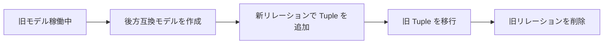

| ステップ | 操作 | 注意点 |
|---|---|---|
| 1 | 後方互換モデル作成 | 旧リレーションと新リレーションを両方定義する |
| 2 | 新リレーションで Tuple 追加 | アプリケーションを新モデルに対応させる |
| 3 | 旧 Tuple の移行 | Write の後に Delete を実行する |
| 4 | 旧リレーション定義を削除 | 全 Tuple の移行完了後に実施する |

#### シャドウチェックによる段階的ロールアウト

新旧モデルの両方に対して Check を実行し、結果を比較してから切り替えます。

```python
old_result = fga.check(model_id=OLD_MODEL_ID, ...)
new_result = fga.check(model_id=NEW_MODEL_ID, ...)
if old_result != new_result:
    logger.warning("Model behavior divergence detected")
```

### Tuple データの同期戦略

#### Outbox パターンによる同期

アプリケーション DB への書き込みと ReBAC ストアへの Tuple 書き込みを、Transactional Outbox パターンで整合させます。

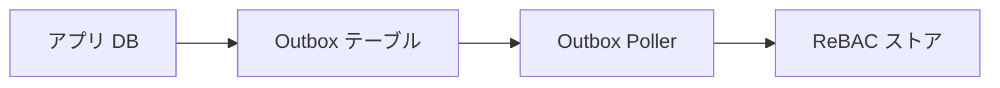

| 要素 | 説明 |
|---|---|
| アプリ DB | ビジネスデータとアウトボックスイベントをトランザクションで同時に保存する |
| Outbox テーブル | 未送信イベントを格納するテーブル |
| Outbox Poller | 定期的に未処理イベントを読み取り、ReBAC ストアに送信する |
| ReBAC ストア | Tuple を受け取り永続化する |

```python
def handle_resource_created(event):
    fga.write(tuples=[
        {"user": f"user:{event.owner_id}",
         "relation": "owner",
         "object": f"document:{event.resource_id}"}
    ])
    mark_event_as_processed(event.id)
```

#### Outbox Poller 停止時のフォールバック

Poller が停止中にアクセスが走るケースでは、未処理の Outbox イベントを Contextual Tuples として補完します。

```python
def check_with_fallback(user_id, resource_id):
    pending = db.get_pending_outbox_events(resource_id)
    contextual = [to_contextual_tuple(e) for e in pending]

    return fga.check(
        user=f"user:{user_id}",
        relation="reader",
        object=f"document:{resource_id}",
        contextual_tuples=contextual,
    )
```

#### Contextual Tuples の活用

アクセストークンに含まれる情報など、リクエスト時点で取得できるデータは Contextual Tuples として渡します。永続的な Tuple 同期の範囲を最小化できます。

### パフォーマンスチューニング

#### キャッシュ設定

| 設定項目 | 説明 |
|---|---|
| `WithCheckQueryCacheEnabled()` | Check クエリ結果のキャッシュを有効化する |
| `WithCheckCacheLimit()` | キャッシュ最大エントリ数を制御する |
| `WithCheckIteratorCacheEnabled()` | DB イテレータのキャッシュを有効化する |

インメモリキャッシュはレイテンシを削減しますが、整合性を犠牲にします。新鮮なデータが必要なリクエストには `HIGHER_CONSISTENCY` モードを使用します。

#### サーバー配置とコネクションプール

```bash
OPENFGA_DATASTORE_MIN_OPEN_CONNS=10       # DB 最大接続数の 10〜30%
OPENFGA_DATASTORE_MAX_OPEN_CONNS=50       # サーバー台数で均等割する
```

一般的に、少数の高スペックサーバーの方がインメモリキャッシュの効率が高くなる傾向があります。

#### クエリ制限設定

```bash
OPENFGA_MAX_CONCURRENT_READS_FOR_CHECK=20
OPENFGA_MAX_CONCURRENT_READS_FOR_LIST_OBJECTS=10
OPENFGA_RESOLVE_NODE_LIMIT=25       # 再帰深さ制限
OPENFGA_RESOLVE_NODE_BREADTH_LIMIT=25   # 横幅制限（デフォルト: 25）
```

#### バッチ処理の推奨

```python
# 非推奨: 個別 Check を繰り返す
for doc_id in document_ids:
    result = fga.check(user="user:alice", relation="reader", object=f"document:{doc_id}")

# 推奨: ListObjects で一括取得する
accessible_docs = fga.list_objects(user="user:alice", relation="reader", type="document")
```

## ベストプラクティス

### Clean Architecture レイヤー別の権限チェック配置指針

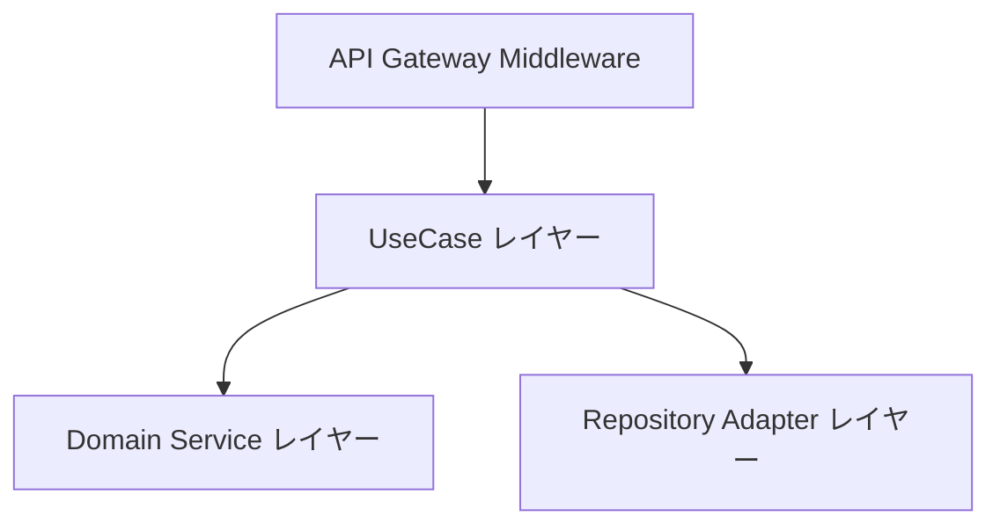

| レイヤー | 権限チェックの種別 | 実装例 |
|---|---|---|
| API Gateway / Middleware | 認証・粗粒度認可 | JWT 検証、エンドポイント単位のアクセス許可 |
| UseCase レイヤー | ビジネスルールに基づく細粒度認可 | `fga.check(user, "edit", "document:123")` |
| Domain Service レイヤー | ドメイン不変条件の検証 | 承認済みステータスのドキュメントは編集不可 |
| Repository / Adapter レイヤー | データフィルタリング | `list_objects` の結果でクエリ結果を絞り込む |

#### API Gateway / Middleware

認証情報の検証（JWT 署名・有効期限）に限定し、エンドポイント単位の粗い認可を実施します。ビジネスロジックは含めません。

```typescript
// adapter/inbound/middleware/auth.middleware.ts
export function requireRole(role: string) {
  return (req: Request, res: Response, next: NextFunction) => {
    const token = req.headers.authorization?.split(' ')[1];
    const payload = verifyJwt(token);
    if (!payload.roles.includes(role)) {
      return res.status(403).json({ error: 'Forbidden' });
    }
    req.user = payload;
    next();
  };
}

// エンドポイント単位の粗い認可
router.use('/admin', requireRole('admin'));
```

#### UseCase レイヤー（主要配置）

細粒度認可の主要な配置先です。ドメイン言語で認可インターフェースを定義します。

```typescript
// application/use-cases/edit-document.use-case.ts
export class EditDocumentUseCase {
  constructor(
    private readonly authorizationPort: AuthorizationPort,
    private readonly documentPolicyService: DocumentPolicyService,
    private readonly documentRepository: DocumentRepository,
  ) {}

  async execute(userId: string, documentId: string, content: string): Promise<void> {
    // 1. ReBAC による関係チェック（UseCase レイヤー）
    const allowed = await this.authorizationPort.check({
      user: `user:${userId}`,
      relation: 'writer',
      object: `document:${documentId}`,
    });
    if (!allowed) throw new InsufficientPrivilegeError();

    const document = await this.documentRepository.findById(documentId);

    // 2. ドメイン不変条件チェック（Domain Service）
    if (!this.documentPolicyService.canBeEdited(document)) {
      throw new DomainRuleViolationError('承認済みドキュメントは編集できません');
    }

    document.updateContent(content);
    await this.documentRepository.save(document);
  }
}
```

#### Domain Service レイヤー

ドメイン不変条件の検証のみを担当します。ReBAC エンジンへの直接呼び出しは行いません。

```typescript
// domain/services/document-policy.service.ts
export class DocumentPolicyService {
  canBeEdited(document: Document): boolean {
    if (document.status === DocumentStatus.APPROVED) {
      return false;
    }
    return true;
  }

  canBeShared(document: Document): boolean {
    if (document.status === DocumentStatus.DRAFT) {
      return false;
    }
    return true;
  }
}
```

#### Repository / Adapter レイヤー

`listObjects` の結果と DB クエリを組み合わせてデータフィルタリングを実施します。認可ロジックではなく、認可済みリソース ID でのフィルタリングに限定します。

```typescript
// adapter/outbound/repositories/document.repository.ts
export class DocumentRepository {
  constructor(
    private readonly db: Database,
    private readonly authorizationPort: AuthorizationPort,
  ) {}

  async findAccessibleByUser(userId: string): Promise<Document[]> {
    const accessibleIds = await this.authorizationPort.listObjects(
      `user:${userId}`, 'reader', 'document'
    );
    if (accessibleIds.length === 0) return [];
    const ids = accessibleIds.map(obj => obj.replace('document:', ''));
    return this.db.query('SELECT * FROM documents WHERE id = ANY($1)', [ids]);
  }
}
```

### アンチパターンとその回避策

| アンチパターン | 問題 | 回避策 |
|---|---|---|
| Controller での細粒度認可 | ビジネスルールと UI が密結合する | UseCase レイヤーに移動する |
| Repository での認可判定 | データ層に認可ロジックが散在する | UseCase での事前チェックに変更する |
| フレームワーク依存の認可 | フレームワーク変更で認可ロジックが壊れる | Port/Adapter パターンで抽象化する |
| 全エンドポイントで `HIGHER_CONSISTENCY` 使用 | 不要なレイテンシが発生する | 整合性が必要な操作のみに限定する |
| 毎リクエストで最新モデル ID を取得 | 不要な DB クエリが発生する | モデル ID をコンフィグに固定する |
| Tuple に PII を格納する | GDPR Art.17 に基づく削除要求時、監査ログに PII が残存するリスクがある | user フィールドには UUID 等の不透明な識別子を使用し、PII との紐づけはアプリ DB 側で管理する |

### テスト戦略

#### 認可モデルのユニットテスト

OpenFGA の `fga.yaml` テスト定義を使用して、認可モデルとタプルのテストを実施します。

```yaml
# fga.yaml
name: Document Access Tests
model_file: model.fga
tuples:
  - user: user:alice
    relation: owner
    object: document:budget
tests:
  - name: owner can edit
    check:
      - user: user:alice
        object: document:budget
        assertions:
          edit: true
  - name: non-member cannot edit
    check:
      - user: user:bob
        object: document:budget
        assertions:
          edit: false
```

```bash
fga model test --tests fga.yaml
```

#### UseCase の認可テスト（Port をモック化）

```python
def test_edit_document_denied():
    mock_authz = Mock(spec=AuthorizationPort)
    mock_authz.can_edit.return_value = False

    use_case = EditDocumentUseCase(authz_port=mock_authz)

    with pytest.raises(InsufficientPrivilegeError):
        use_case.execute(user_id="user:bob", document_id="doc:1", content="...")
```

#### 統合テスト

テスト用の OpenFGA インスタンス（インメモリモード）を起動して End-to-End の認可フローを検証します。

```bash
openfga run --datastore-engine=memory
```

## トラブルシューティング

### New Enemy Problem（分散システムでの整合性問題）

#### 問題の定義

権限変更と保護対象リソースの更新が一致しない場合、新しいリソースへの不正アクセスが発生します。

具体例: ユーザーのアクセスを剥奪した後に作成されたドキュメントに、古いキャッシュが原因でアクセスできてしまいます。

#### 不整合発生タイムライン（キャッシュ TTL = 30 秒の場合）

| 時刻 | イベント | 結果 |
|---|---|---|
| T=0s | alice の reader タプルを削除 | ReBAC ストアから削除済み |
| T=5s | alice が document:123 へアクセス | キャッシュが旧 true を返す → 不正アクセス成立 |
| T=30s | キャッシュ TTL 失効 | 以降の Check は正しく false を返す |
| T=5s（ZedToken 使用時） | alice が document:123 へアクセス | ZedToken でキャッシュをバイパスし即時 false |

#### ZedToken / Consistency Token による対処

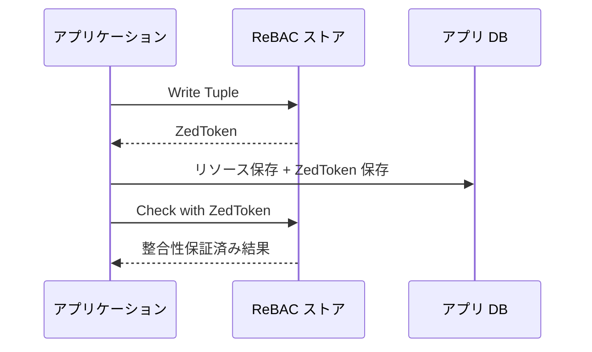

| 要素 | 説明 |
|---|---|
| アプリケーション | Tuple 書き込み後に ZedToken を受け取る |
| ReBAC ストア | ZedToken で指定した時点以降のデータで評価する |
| アプリ DB | リソースと ZedToken を一緒に保存する |

```python
# SpiceDB の ZedToken 使用例
response = spicedb.write_relationships(...)
zed_token = response.written_at

# リソースに ZedToken を付与して保存する
db.save(resource, consistency_token=zed_token)

# Check 時に ZedToken を使用する
spicedb.check_permission(
    resource=...,
    consistency={"at_least_as_fresh": zed_token}
)
```

OpenFGA では `HIGHER_CONSISTENCY` モードを使用してキャッシュをバイパスします。

#### ZedToken と HIGHER_CONSISTENCY の使い分け基準

| 状況 | 推奨する整合性戦略 |
|---|---|
| 権限剥奪直後のアクセス制御が重要 | ZedToken（at_least_as_fresh）を使用する |
| 権限付与直後のリソースアクセスが多い | ZedToken をリソースと一緒に DB に保存し、取得時に使用する |
| 読み取り専用・参照系の一般ユースケース | キャッシュ（minimize_latency）を使用してレイテンシを優先する |
| 管理画面・監査要件がある（OpenFGA） | HIGHER_CONSISTENCY を使用する |
| 管理画面・監査要件がある（SpiceDB） | fully_consistent を使用する |

### 権限の循環参照・無限ループ

#### SpiceDB での対処

SpiceDB はデフォルト深さ 50 でエラーを返します。`--dispatch-max-depth` で変更可能です。

```bash
zed permission check group:parent member group:child --explain
```

書き込み前に逆方向 Check を実施して循環を防ぎます。

```python
is_ancestor = spicedb.check_permission(
    resource={"type": "group", "id": "child"},
    permission="member",
    subject={"object": {"type": "group", "id": "parent"}}
)
if is_ancestor:
    raise CircularReferenceError("循環参照が発生します")
```

#### OpenFGA での対処

`OPENFGA_RESOLVE_NODE_LIMIT`（デフォルト 25）を超えるとエラーが返ります。モデルの深さを見直します。

### Tuple 爆発（大量のリレーション管理）

| 原因 | 対処法 |
|---|---|
| TTU リレーションと Union の組み合わせ | TTU の使用箇所を絞り込む |
| ワイルドカード（`user:*`）の過剰使用 | 明示的な権限付与に変更する |
| 深いリレーションチェーン | モデルを平坦化する |
| Tuple の無限増殖 | TTL や定期クリーンアップジョブを導入する |

#### 診断手順

```bash
# dispatch_count の高いクエリを特定する（Prometheus クエリ例）
histogram_quantile(0.99, rate(openfga_dispatch_count_bucket[5m]))
```

### パフォーマンス劣化時の診断手順

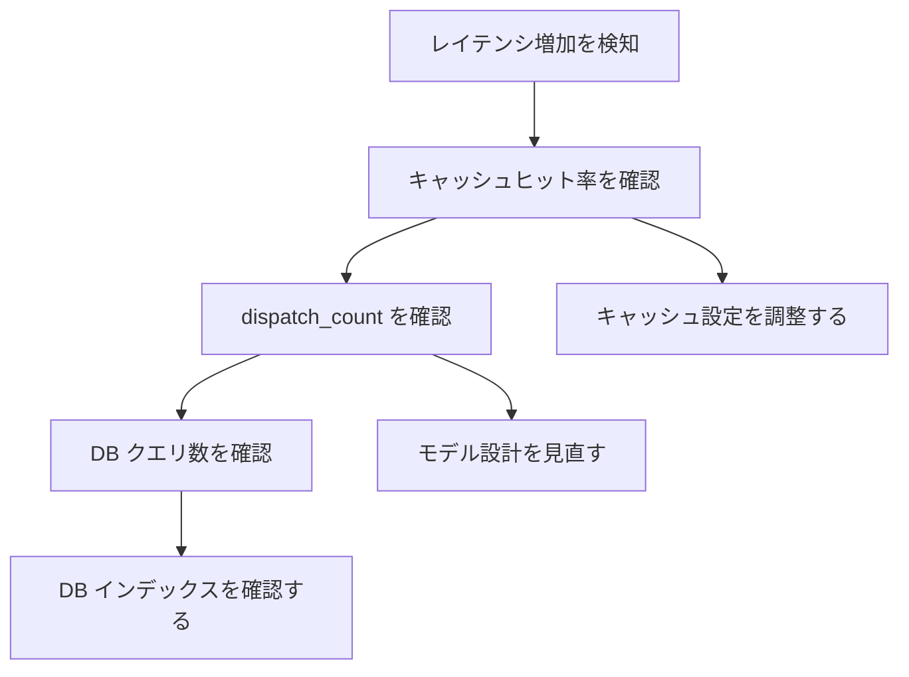

| ステップ | 確認項目 | 対処法 |
|---|---|---|
| 1 | `cache_hit_rate` の低下 | キャッシュ TTL・サイズを増やす |
| 2 | `openfga_dispatch_count` の急増 | TTU リレーションや Union を見直す |
| 3 | `openfga_datastore_query_count` の急増 | `openfga migrate` でインデックスを再確認する |
| 4 | 特定クエリのタイムアウト | `RESOLVE_NODE_LIMIT` を下げる、モデルを簡素化する |

### 頻出エラーとその解決手順

| 症状 | 原因 | 対処法 |
|---|---|---|
| Check が常に `false` を返す | Tuple の書き込み漏れ | Tuple の存在を Read API で確認する |
| Check が古い結果を返す | キャッシュのヒット | `HIGHER_CONSISTENCY` モードを使用する |
| `resolve node limit exceeded` | 認可グラフが深すぎる | `RESOLVE_NODE_LIMIT` を増やすか、モデルを平坦化する |
| `max depth exceeded` (SpiceDB) | 循環参照 or 深すぎるグラフ | `--explain` で依存ツリーを確認する |
| Tuple 書き込みが失敗する | 認可モデルと不整合な Tuple | モデルの定義と Tuple の型を照合する |
| モデル更新後に Check が失敗する | モデル ID の固定漏れ | `authorization_model_id` をコンフィグに明示する |
| ListObjects がタイムアウトする | 結果件数・モデル複雑度が過大 | `and` / `but not` 演算子を削減し `OPENFGA_LIST_OBJECTS_DEADLINE` を調整する |

## まとめ

ReBAC は関係グラフで権限を表現するモデルであり、OpenFGA / SpiceDB を使うことで Google Zanzibar 相当の細粒度認可を実装できます。Clean Architecture の Port/Adapter パターンと組み合わせることで、認可ロジックをドメイン層に閉じ込めながらエンジン実装を差し替え可能な構造を実現できます。

この記事が少しでも参考になった、あるいは改善点などがあれば、ぜひリアクションやコメント、SNSでのシェアをいただけると励みになります！

## 参考リンク

- 公式ドキュメント
  - [OpenFGA Concepts](https://openfga.dev/docs/concepts)
  - [Fine-Grained Authorization - OpenFGA](https://openfga.dev/)
  - [OpenFGA SDK クライアントセットアップ](https://openfga.dev/docs/getting-started/setup-sdk-client)
  - [OpenFGA Check API](https://openfga.dev/docs/getting-started/perform-check)
  - [OpenFGA Relationship Tuple 更新](https://openfga.dev/docs/getting-started/update-tuples)
  - [OpenFGA ListObjects API](https://openfga.dev/docs/getting-started/perform-list-objects)
  - [OpenFGA ListUsers API](https://openfga.dev/docs/getting-started/perform-list-users)
  - [OpenFGA Contextual Tuples](https://openfga.dev/docs/interacting/contextual-tuples)
  - [OpenFGA 認可モデル設定](https://openfga.dev/docs/getting-started/configure-model)
  - [Running OpenFGA in Production](https://openfga.dev/docs/best-practices/running-in-production)
  - [Adoption Patterns - OpenFGA](https://openfga.dev/docs/best-practices/adoption-patterns)
  - [Consistency - OpenFGA](https://openfga.dev/docs/interacting/consistency)
  - [Immutable Authorization Models - OpenFGA](https://openfga.dev/docs/getting-started/immutable-models)
  - [Migrating Relations - OpenFGA](https://openfga.dev/docs/modeling/migrating/migrating-relations)
  - [Managing Tuples and Invoking API Best Practices - OpenFGA](https://openfga.dev/docs/getting-started/tuples-api-best-practices)
  - [Configuring OpenFGA](https://openfga.dev/docs/getting-started/setup-openfga/configure-openfga)
  - [AuthZed Docs - Zanzibar](https://authzed.com/docs/spicedb/concepts/zanzibar)
  - [SpiceDB Schema Concepts](https://authzed.com/docs/spicedb/concepts/schema)
  - [SpiceDB Relationships Concepts](https://authzed.com/docs/spicedb/concepts/relationships)
  - [Consistency - Authzed Docs (SpiceDB)](https://authzed.com/docs/spicedb/concepts/consistency)
  - [Recursion and Max Depth - Authzed Docs (SpiceDB)](https://authzed.com/docs/spicedb/modeling/recursion-and-max-depth)
- GitHub
  - [authzed-node GitHub リポジトリ](https://github.com/authzed/authzed-node)
- 記事
  - [Oso Academy - Relationship-Based Access Control](https://www.osohq.com/academy/relationship-based-access-control-rebac)
  - [Permit.io - RBAC vs ABAC and ReBAC](https://www.permit.io/blog/rbac-vs-abac-and-rebac-choosing-the-right-authorization-model)
  - [Pangea Cloud - RBAC vs ReBAC vs ABAC](https://pangea.cloud/blog/rbac-vs-rebac-vs-abac/)
  - [OpenFGA Overview - DeepWiki](https://deepwiki.com/openfga/openfga/1-overview)
  - [SpiceDB Architecture - DeepWiki](https://deepwiki.com/authzed/spicedb)
  - [OpenFGA DeepWiki - Core Data Model](https://deepwiki.com/openfga/openfga)
  - [An Introduction to Google Zanzibar and Relationship-Based Authorization Control](https://authzed.com/learn/google-zanzibar)
  - [Securing Use Cases in Clean Architecture - Medium](https://medium.com/unil-ci-software-engineering/securing-use-cases-in-clean-architecture-7f39d07b8ed2)
  - [Authorization and Authentication in Clean Architecture](https://lessthan12ms.com/authorization-and-authentication-in-clean-architecture.html)
  - [Hexagonal Architecture Ports And Adapters in Go - DEV Community](https://dev.to/buarki/hexagonal-architectureports-and-adapters-clarifying-key-concepts-using-go-14oo)
  - [OpenFGA + Express + TypeScript 統合](https://auth0.com/blog/express-typescript-fga/)
  - [SpiceDB への Relationship 書き込み](https://authzed.com/blog/writing-relationships-to-spicedb)
  - [Zed Tokens, Zookies, Consistency for Authorization - AuthZed](https://authzed.com/blog/zedtokens)
  - [Beware of the New Enemy Problem - DEV Community](https://dev.to/sohan26/beware-of-the-new-enemy-problem-180m)
