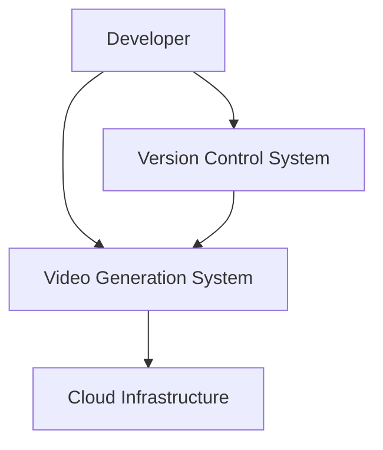
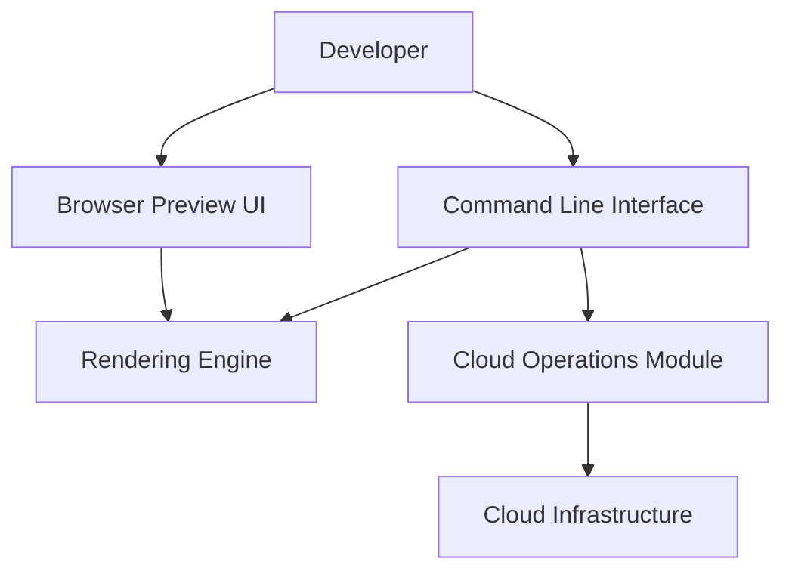
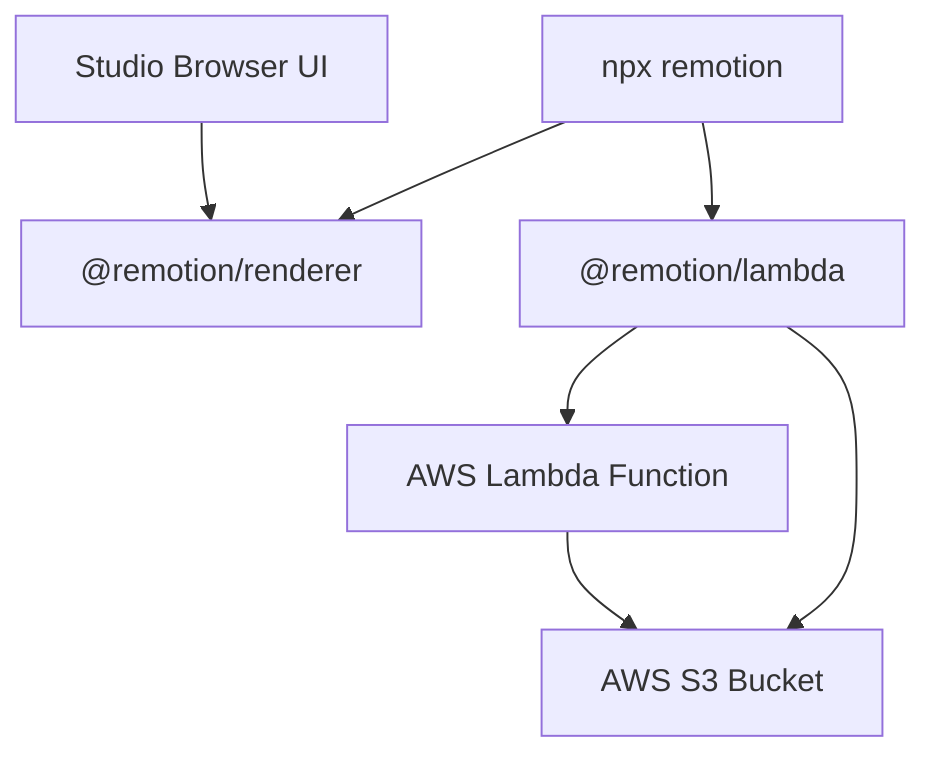
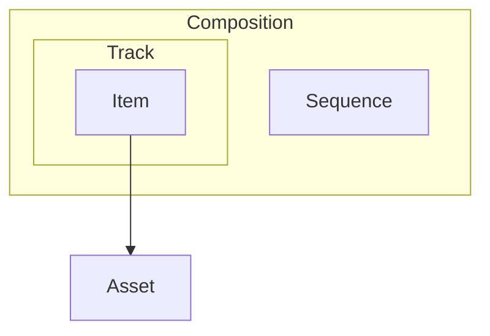
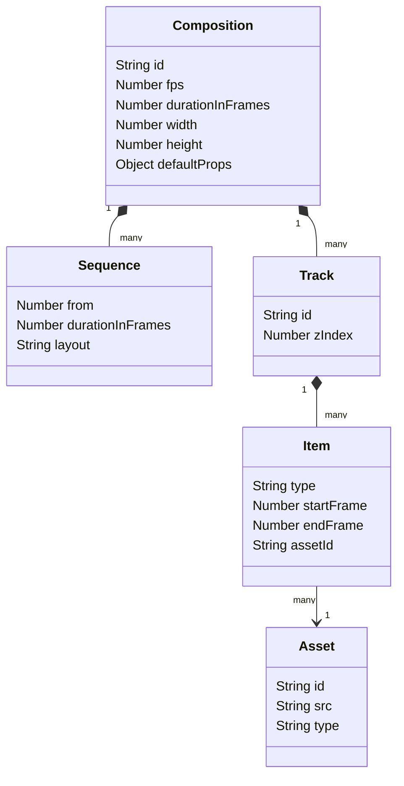

## ■概要

動画制作の現場では、テンプレートの微調整やバリエーション作成に多くの手作業が発生します。
Remotionは、この課題をReactのコンポーネントモデルで解決するフレームワークです。

開発者に対して現在のフレーム番号と空白のキャンバスを提供し、HTML、CSS、SVG、WebGLといった標準的なWeb技術を用いて動画のビジュアル要素を描画できるようにします。
ソフトウェア開発における再利用可能なコンポーネント設計や、変数・関数の活用、アルゴリズムに基づく動的なレイアウト処理を動画制作に導入できる点が大きな魅力です。

たとえば、APIから取得した顧客データに基づきパーソナライズされた動画を数千件単位で自動生成するといった、データ駆動型の動画生成を実現できます。

:::message
**ライセンスについて**: Remotionは企業向けにライセンスモデルを採用しています。個人利用や評価目的では無料で使用できますが、企業での商用利用にはライセンス購入が必要です。詳細は[公式のライセンスページ](https://www.remotion.dev/license)を確認してください。
:::

## ■特徴

Remotionの最大の特徴は、動画の構成要素をすべてコードベースで管理できる点です。
これにより、バージョン管理システムを用いた差分管理やコードレビューが可能になります。
さらに、CI/CDパイプラインに組み込むことで、動画の自動レンダリング処理を構築できます。

パフォーマンス面では、並列処理に特化した分散レンダリングアーキテクチャを備えています。
AWS Lambdaを活用し、動画を複数のチャンクに分割して同時並行で処理します。
たとえば、20分の動画をLambda関数200個で分割処理すれば、各関数が6秒分のフレームだけをレンダリングするため、処理時間を大幅に短縮できます。

また、Claude CodeなどのAIエージェントとの統合が公式にサポートされており、プロンプトベースでのコンポーネント生成やAgent Skillsを活用したドメイン固有のコード作成支援を受けられます。

従来の動画編集ツールとの主な違いを整理すると、以下のとおりです。

| 観点               | 従来の動画編集ツール               | Remotion                              |
| :----------------- | :--------------------------------- | :------------------------------------ |
| 編集方法           | GUIによるタイムライン操作          | コード（React + TypeScript）          |
| バージョン管理     | プロジェクトファイルのバイナリ差分 | Gitによるテキスト差分・コードレビュー |
| バリエーション生成 | 手動コピー＆修正                   | Propsの差し替えによる自動生成         |
| スケーリング       | マシンスペック依存                 | Lambda/Cloud Runによる水平スケール    |
| 拡張性             | プラグイン依存                     | npmエコシステム全体を活用可能         |

### ●適用に向いているユースケース

Remotionの特徴を踏まえると、以下のようなユースケースで特に威力を発揮します。

| ユースケース                       | 具体例                                             |
| :--------------------------------- | :------------------------------------------------- |
| データ駆動の大量生成               | ECサイトの商品紹介動画、不動産物件の紹介ムービー   |
| パーソナライズ動画                 | ユーザー名や購入履歴に基づくお礼動画、年間レポート |
| 定期的な自動生成                   | 週次のダッシュボード動画、SNS投稿用ショート動画    |
| プログラマティックなアニメーション | データ可視化、アルゴリズム解説、技術デモ           |

一方で、カメラ撮影素材のカット編集やカラーグレーディングなど、従来の映像編集ワークフローが中心のプロジェクトには不向きです。

## ■構造

Remotion（v4.x系、2026年2月時点の最新安定版）のアーキテクチャを、C4モデルに基づいて段階的に図解します。

### ●システムコンテキスト図

まずは、アクター、対象となる動画生成システム、および外部システムとの関係を図示します。



| 要素名                  | 説明                                                                                    |
| :---------------------- | :-------------------------------------------------------------------------------------- |
| Developer               | 動画のコード記述、レンダリング、プレビューを操作するアクター                            |
| Video Generation System | Reactを活用して動画コンテンツを構築し、フレーム抽出やメディア合成を実行する中核システム |
| Cloud Infrastructure    | 分散レンダリング処理を実行し、生成データを保存する外部インフラストラクチャ環境          |
| Version Control System  | ソースコードを管理し、変更履歴を追跡し、自動化処理をトリガーするプラットフォーム        |

### ●コンテナ図

次に、システムコンテキスト内の動画生成システムをドリルダウンし、主要なコンテナを表現します。



| 要素名                  | 説明                                                                                                     |
| :---------------------- | :------------------------------------------------------------------------------------------------------- |
| Developer               | 各種コンテナと対話する操作者                                                                             |
| Command Line Interface  | コマンド入力を受け付け、ローカルレンダリングやクラウドデプロイの指示を中継する実行環境                   |
| Browser Preview UI      | ローカル環境で起動し、作成中の動画をリアルタイムで再生および確認する視覚的インターフェース               |
| Rendering Engine        | Web技術に基づくReactコンポーネントを解析し、個別の画像フレームおよび音声データへの変換を実行するエンジン |
| Cloud Operations Module | ローカルからのレンダリング要求をクラウド向けに最適化し、外部サービスへの展開や通信を制御するモジュール   |
| Cloud Infrastructure    | コンテナからの指示を受け取り、実際の分散処理を担う外部基盤                                               |

### ●コンポーネント図

さらにコンテナ図内の要素をドリルダウンし、具体的なエンティティを用いて構成要素を図示します。



| 要素名              | 説明                                                                                               |
| :------------------ | :------------------------------------------------------------------------------------------------- |
| npx remotion        | ユーザーがターミナルで実行するコマンドラインツール                                                 |
| Studio Browser UI   | localhost上で稼働し、フレームごとの状態確認やプロパティの動的変更を可能にするUIエンティティ        |
| @remotion/renderer  | ヘッドレスブラウザを駆動し、内部でメディアファイルの生成や連結を実行するバックエンドライブラリ     |
| @remotion/lambda    | クラウド上へのサイトデプロイやレンダリング関数の呼び出しを管理するインターフェースパッケージ       |
| AWS Lambda Function | Chromium環境を保持し、動画の部分的なチャンクを並列にレンダリングするコンピュートエンティティ       |
| AWS S3 Bucket       | プロジェクトファイル、進捗データのJSONファイル、最終的な動画出力を永続化するストレージエンティティ |

## ■情報

Remotion内部で扱うデータモデルの構造を図解します。

### ●概念モデル

入れ子構造で所有関係を、矢印で利用関係を表現します。
CompositionがSequenceとTrackを所有し、Track内のItemが外部のAssetを参照する構造です。



| 要素名      | 説明                                                                               |
| :---------- | :--------------------------------------------------------------------------------- |
| Composition | 出力可能な動画の全体定義およびメタデータを統括する最上位のエンティティ             |
| Sequence    | 時間軸に沿って特定のタイミングでのみ表示されるクリップ要素を束ねるエンティティ     |
| Track       | エディター状態において、重なり順を制御しながら複数の構成要素を保持するエンティティ |
| Item        | タイムライン上に配置される具体的な描画対象のエンティティ                           |
| Asset       | 画像、音声、動画などの実際のメディアリソースを表現するエンティティ                 |

### ●情報モデル

概念モデルのエンティティに対して主要な属性を持たせたクラス図です。



| 要素名      | 説明                                                                           |
| :---------- | :----------------------------------------------------------------------------- |
| Composition | 識別子、フレームレート、総フレーム数、解像度、注入される初期プロパティのデータ |
| Sequence    | 開始フレーム番号、継続フレーム数、絶対配置などのレイアウト設定                 |
| Track       | トラック固有の識別子、アイテムの描画優先順位を決定するインデックス値           |
| Item        | アイテムの種別、開始および終了フレーム番号、対応するメディアの参照ID           |
| Asset       | アセットの識別子、メディアファイルの保存元パス、ファイル種別                   |

## ■構築方法

Remotionを利用するための環境構築手順を解説します。

### 実行環境の整備

まずはベースとなる実行環境を整えます。
Remotionは内部でヘッドレスブラウザを使用してフレームをキャプチャするため、Node.jsまたはBunのランタイムに加え、Chromiumの動作に必要な依存ライブラリが求められます。

| 項目                   | 要件                                    |
| :--------------------- | :-------------------------------------- |
| ランタイム             | Node.js 16.0.0以上、またはBun 1.0.3以上 |
| Libc                   | Linux環境ではバージョン2.35以上         |
| パッケージマネージャー | npm、pnpm、yarnのいずれか               |
| コンテナ環境           | Chromium依存パッケージの追加が必要      |

### プロジェクトの初期化

次に、Remotionプロジェクトを初期化します。
テンプレートから新規作成する方法と、既存プロジェクトに組み込む方法の2つがあります。

**新規作成の場合:**

```bash
npx create-video@latest
```

対話形式でプロジェクト名、テンプレート、TypeScript利用の有無を指定し、依存関係が自動インストールされます。

**既存プロジェクトへの組み込みの場合:**

```bash
npm install remotion @remotion/cli @remotion/player
```

ブラウザ埋め込み用途であれば `@remotion/player`、サーバーサイドレンダリング用途であれば `@remotion/renderer` を個別にインストールします。

### クラウドレンダリング基盤の構築

AWS Lambdaを利用した分散レンダリングを行うためのインフラ準備です。
IAMポリシーの作成からユーザーの権限付与まで、以下のステップで進めます。

1. `npx remotion lambda policies role` コマンドでポリシーJSON定義を生成
2. AWSマネジメントコンソールのIAMセクションで新しいポリシーを作成し、生成した定義を適用
3. IAMロールを作成し、ポリシーをアタッチ
4. レンダリング実行用のIAMユーザーを新規作成
5. `npx remotion lambda policies user` コマンドで生成したインラインポリシーをユーザーに追加

### 代替クラウドインフラの準備

GCP（Cloud Run）を利用する場合の手順です。
AWS Lambdaの同時実行制限に縛られたくない場合や、GCPを主体としたインフラ構成を採用しているケースで選択します。

1. Google Cloud Consoleで新しいGCPプロジェクトを作成し、請求先アカウントを指定
2. Cloud Run APIを有効化
3. Cloud Shellで初期化スクリプトを実行
4. 環境変数 `REMOTION_GCP_REGION` でレンダリングリージョンを設定

## ■利用方法

実際にRemotionを使って動画を開発・生成する方法を解説します。

### 開発用インターフェースの操作

ローカル環境でプレビューしながら開発を進めます。
以下のコマンドでRemotion Studioが起動し、ブラウザ上でリアルタイムプレビューが利用可能になります。

```bash
npx remotion studio
```

Studio上では、再生・一時停止・シークなどの基本操作に加え、コンポーネントのPropsをGUIから変更して即座に結果を確認できます。
コード側では、以下の2つのフックが基本となります。

* `useCurrentFrame()` — 現在のフレーム番号を取得し、要素の位置や透明度を制御
* `useVideoConfig()` — 解像度、フレームレート、総フレーム数などの設定値を取得

### タイムラインとコンポーネントの設計

Reactコンポーネントを組み合わせて動画のタイムラインを構築します。
`src/Root.tsx` ファイルに `<Composition>` コンポーネントを配置して動画の基本設定を行います。

```tsx
import { Composition } from 'remotion';

export const RemotionRoot: React.FC = () => {
  return (
    <>
      <Composition
        component={Component}
        durationInFrames={300}
        width={1080}
        height={1080}
        fps={30}
        id="test-render"
        defaultProps={{}}
      />
    </>
  );
};
```

`<Sequence>` コンポーネントを使用すると、時間軸に応じた表示制御が可能です。
各Sequenceは独自のフレームカウンターを持つため、子コンポーネントの `useCurrentFrame()` は常に0から始まります。

```tsx
import { Sequence } from 'remotion';

const MyTrailer = () => {
  return (
    <>
      <Sequence durationInFrames={30}>
        <Intro />
      </Sequence>
      <Sequence from={30} durationInFrames={30}>
        <Clip />
      </Sequence>
      <Sequence from={60}>
        <Outro />
      </Sequence>
    </>
  );
};
```

その他のよく使うパターンとして、以下があります。

* `<AbsoluteFill>` — 画面全体を覆う絶対配置レイヤーの構成
* `interpolate()` — フレーム番号に基づくアニメーション値の補間処理
* 同一ファイル内への複数 `<Composition>` の登録による、複数動画の一元管理

### プロパティの動的注入と型定義

外部からデータを注入して動画を動的に生成するための設定です。
Zodスキーマを定義することで、Remotion Studio上でのGUI入力バリデーションとTypeScriptの型安全性を同時に確保できます。

* ReactのPropsインターフェースを用いたコンポーネントの引数スキーマの定義
* Zodライブラリを組み込んだプロパティの型安全性の確保
* `<Composition>` の `defaultProps` 属性への初期値の設定
* CLIの `--props` 引数を利用した出力動画の動的な切り替え

### ローカルレンダリングの実行

完成した動画をローカルマシンでレンダリングして出力します。

```bash
npx remotion render <composition-id> out/video.mp4
```

主要なオプションは以下のとおりです。

| オプション | 用途                                           |
| :--------- | :--------------------------------------------- |
| `--crf`    | 動画の圧縮品質（値が小さいほど高画質・大容量） |
| `--frames` | 特定範囲のフレームのみ抽出（例: `0-59`）       |
| `--scale`  | 出力解像度のスケーリング倍率                   |
| `--codec`  | 出力コーデックの指定（h264、vp8、proresなど）  |

### サードパーティ技術の統合

Web技術のエコシステムを活用して表現力を高められます。
Remotionはnpmパッケージとして提供されているため、Reactエコシステムのライブラリをそのまま利用できます。

| パッケージ         | 用途                                   |
| :----------------- | :------------------------------------- |
| `@remotion/shapes` | SVGパスデータの生成                    |
| `@remotion/paths`  | パスの変形や座標計測                   |
| `@remotion/three`  | Three.jsを利用した3Dグラフィックス     |
| `@remotion/skia`   | Skiaエンジンによる高性能2D描画         |
| TailwindCSS        | ユーティリティファーストなスタイリング |
| Anime.js           | 高度なアニメーション制御               |

### AI技術を用いたコンテンツ生成

AIエージェントを活用してコンポーネント生成を効率化できます。
Remotionは公式にAI統合をサポートしており、以下の2つのアプローチがあります。

**Vercel AI SDKを利用したプログラマティック生成:**

```typescript
import {generateText} from 'ai';
import {openai} from '@ai-sdk/openai';

const systemPrompt = `
You are a Remotion component generator.
Generate a single React component that uses Remotion.
Rules:
- Export the component as a named export called "MyComposition"
`;
```

**Claude Codeエージェントとの統合:**

Remotionは公式の Agent Skills を提供しています。
Agent Skills とは、アニメーション、音声、コンポジション、フォント、字幕、3Dなど Remotion 固有のベストプラクティスをまとめたルールファイル群です。
Claude Code がプロジェクト内でこれらを自動的に読み込むことで、Remotion の作法に沿ったコード生成が可能になります。

インストールは以下のコマンド1つで完了します。

```bash
npx remotion skills add
```

実行すると、`.claude/skills/` ディレクトリにスキルファイルがインストールされます。
以降、プロジェクト内で Claude Code を起動すると自動的にスキルがロードされ、自然言語のプロンプトから Remotion コンポーネントを生成できるようになります。

スキルを最新版に更新するには、以下を実行します。

```bash
npx remotion skills update
```

また、Remotion の公式ドキュメントは AI エージェントでの利用を考慮しており、URLの末尾に `.md` を付与するとMarkdown形式で取得できます。
プロンプト内で `useCurrentFrame` や `interpolate` などの Remotion 固有 API 名を明示すると、より正確なコード生成を促進できます。

## ■運用

本番環境での大規模な動画生成や、継続的な運用管理について解説します。

### AWS Lambda分散レンダリングのプロセス管理

クラウド上で高速にレンダリングを行う際の内部プロセスは以下のとおりです。

1. `npx remotion lambda render <serve-url> <composition-id>` コマンドを発行
2. メイン関数が動画のメタデータを解析し、チャンク分割計画を決定
3. メイン関数が複数のレンダラー関数をスポーンし、各チャンクを並列処理
4. レンダラー関数がフレームをレンダリングし、チャンクデータと進捗レポートをS3に書き出す
5. メイン関数が全チャンクの完了を検知し、連結アルゴリズムで最終的な動画ファイルを生成

この仕組みにより、レンダラー関数の数を増やすほど処理時間を短縮できます。

### スケーラビリティとパフォーマンスの最適化

大規模な処理要求に応えるためのチューニングポイントを整理します。

| チューニング項目      | 内容                                                                                |
| :-------------------- | :---------------------------------------------------------------------------------- |
| コンカレンシー上限    | AWSアカウントの同時実行制限を把握し、必要に応じて上限緩和を申請                     |
| `--frames-per-lambda` | Lambda1関数あたりの担当フレーム数を調整し、並列度とオーバーヘッドのバランスを最適化 |
| アセット配信          | CDNを導入し、フォントや画像などの静的アセット取得を高速化                           |
| マルチリージョン      | `npx remotion cloudrun regions` で対応リージョンを確認し、負荷分散を構築            |

### バージョンおよび互換性の管理

Remotion本体やLambda関数のアップデートを安全に管理します。
特に重要なのは、ローカルのクライアントパッケージとデプロイ済みLambda関数のバージョンを厳密に一致させることです。

* Lambda関数の再デプロイ時は、`@remotion/lambda` パッケージと関数のバージョンを揃える
* 新旧のLambda関数を同一アカウント内で並行稼働させ、段階的に切り替える
* `getFunctions()` で `compatibleOnly` フラグを有効化し、互換性のある関数のみを取得
* メジャーバージョンアップ時は公式の移行ガイドを参照し、Breaking Changesに対応

### GitHub Actionsによる運用自動化

CI/CDパイプラインを構築し、動画生成を自動化します。
`workflow_dispatch` トリガーを使うことで、GitHub上から任意のタイミングで動画レンダリングを実行できます。

1. ワークフロー定義ファイルを `.github/workflows/` に配置
2. `workflow_dispatch` トリガーに `inputs` ブロックで動画パラメータを定義
3. サーバーサイドレンダリングAPI（`renderMediaOnLambda()`）を呼び出すスクリプトを記述
4. 生成された動画アーティファクトをS3やGitHub Artifactsにアップロード

### 監視および進捗確認

レンダリングの状況をモニタリングし、トラブルシューティングを行います。

* CLIの進捗表示 — `npx remotion lambda render` コマンドがリアルタイムで進捗率を出力
* プログラマティック監視 — `getRenderProgress()` メソッドを周期的に呼び出すカスタム管理画面の構築
* S3上の `progress.json` — 各チャンクの処理状況をJSON形式で確認
* プロファイリング — `npx remotion benchmark` でレンダリング性能を計測し、ボトルネックを特定

### よくあるトラブルと対処法

| 症状                         | 原因                                         | 対処                                                            |
| :--------------------------- | :------------------------------------------- | :-------------------------------------------------------------- |
| Lambda関数のタイムアウト     | 1チャンクあたりのフレーム数が多すぎる        | `--frames-per-lambda` を小さくして並列度を上げる                |
| レンダリング結果が真っ白     | コンポーネント内でフレーム番号の範囲外を参照 | `useCurrentFrame()` の値とSequenceの設定を確認                  |
| S3へのアップロードエラー     | IAMポリシーの権限不足                        | `npx remotion lambda policies validate` で権限を検証            |
| ローカルで動くがLambdaで失敗 | パッケージバージョンの不一致                 | `@remotion/lambda` とデプロイ済み関数のバージョンを厳密に揃える |

## ■まとめ

Remotionは、ReactとTypeScriptを用いてコードベースで動画を生成・管理できる強力なフレームワークです。
AIエージェントやクラウドインフラと統合することで、パーソナライズ動画の大量生成やCI/CDパイプラインでの自動化などの高度なユースケースを実現できます。

この記事が少しでも参考になった、あるいは改善点などがあれば、ぜひリアクションやコメント、SNSでのシェアをいただけると励みになります！

## ■参考リンク

- 公式ドキュメント
  - [The fundamentals | Remotion](https://www.remotion.dev/docs/the-fundamentals)
  - [Remotion Lambda - A distributed video renderer](https://www.remotion.dev/lambda)
  - [@remotion/lambda | Remotion](https://www.remotion.dev/docs/lambda)
  - [Building with Remotion and AI | Remotion](https://www.remotion.dev/docs/ai/)
  - [Agent Skills | Remotion](https://www.remotion.dev/docs/ai/skills)
  - [npx remotion skills | Remotion](https://www.remotion.dev/docs/cli/skills)
  - [Command line reference | Remotion](https://www.remotion.dev/docs/cli)
  - [@remotion/renderer | Remotion](https://www.remotion.dev/docs/renderer)
  - [How Remotion Lambda works | Remotion](https://www.remotion.dev/docs/lambda/how-lambda-works)
  - [Tracks, items and assets in the Editor Starter | Remotion](https://www.remotion.dev/docs/editor-starter/tracks-items-assets)
  - [Creating a new project | Remotion](https://www.remotion.dev/docs)
  - [v4.0 Migration | Remotion](https://www.remotion.dev/docs/4-0-migration)
  - [Installing Remotion in an existing project | Remotion](https://www.remotion.dev/docs/brownfield)
  - [Setup | Remotion - Lambda](https://www.remotion.dev/docs/lambda/setup)
  - [Setup | Remotion - Cloud Run](https://www.remotion.dev/docs/cloudrun/setup)
  - [@remotion/cloudrun - CLI | Remotion](https://www.remotion.dev/docs/cloudrun/cli)
  - [API overview | Remotion](https://www.remotion.dev/docs/api)
  - [npx remotion lambda render | Remotion](https://www.remotion.dev/docs/lambda/cli/render)
  - [FAQ | Remotion - Lambda](https://www.remotion.dev/docs/lambda/faq)
  - [npx remotion cloudrun regions | Remotion](https://www.remotion.dev/docs/cloudrun/cli/regions)
  - [@remotion/cloudrun | Remotion](https://www.remotion.dev/docs/cloudrun)
  - [Server-Side Rendering | Remotion](https://www.remotion.dev/docs/ssr)
  - [Composition | Remotion](https://www.remotion.dev/docs/composition)
  - [Features | Remotion - Editor Starter](https://www.remotion.dev/docs/editor-starter/features)
  - [Passing props | Remotion](https://www.remotion.dev/docs/passing-props)
  - [Diagrams - C4 model](https://c4model.com/diagrams)
  - [C4 model: Home](https://c4model.com/)
- GitHub
  - [remotion-dev/remotion: Make videos programmatically with React](https://github.com/remotion-dev/remotion)
  - [Actions - remotion-dev/.github](https://github.com/remotion-dev/.github/actions)
- 記事
  - [Remotion 3.0 | Remotion Blog](https://www.remotion.dev/blog/3-0)
  - [Complete Guide: How to Setup Remotion Agent Skills with Claude Code | Reddit](https://www.reddit.com/r/MotionDesign/comments/1qkqxwm/complete_guide_how_to_setup_remotion_agent_skills/)
