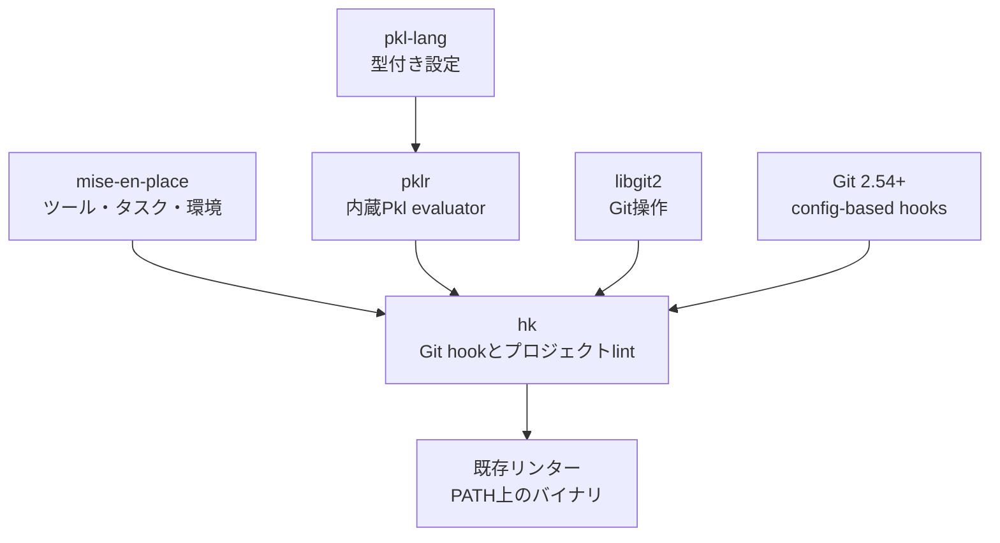
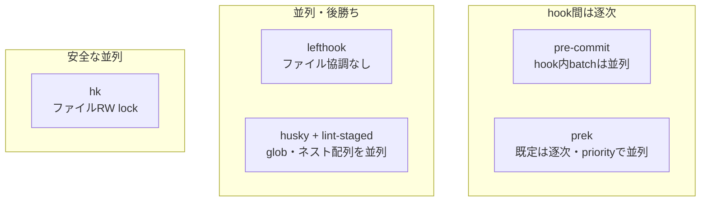
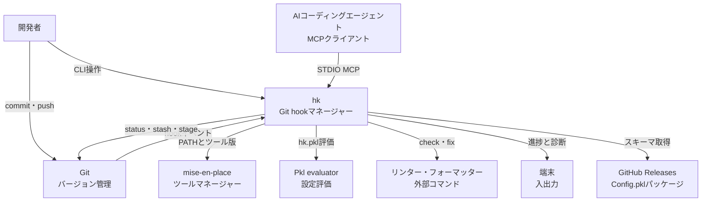
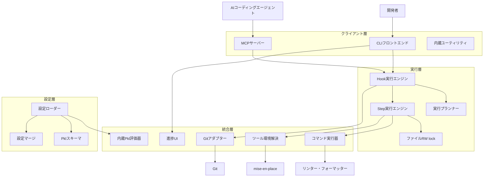
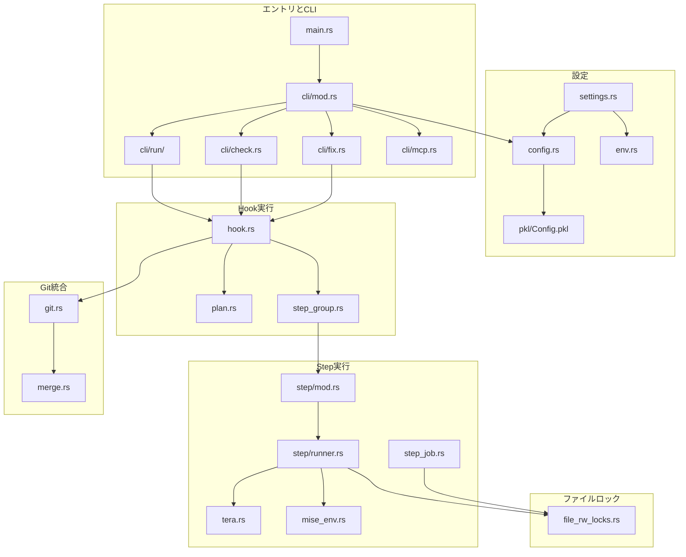
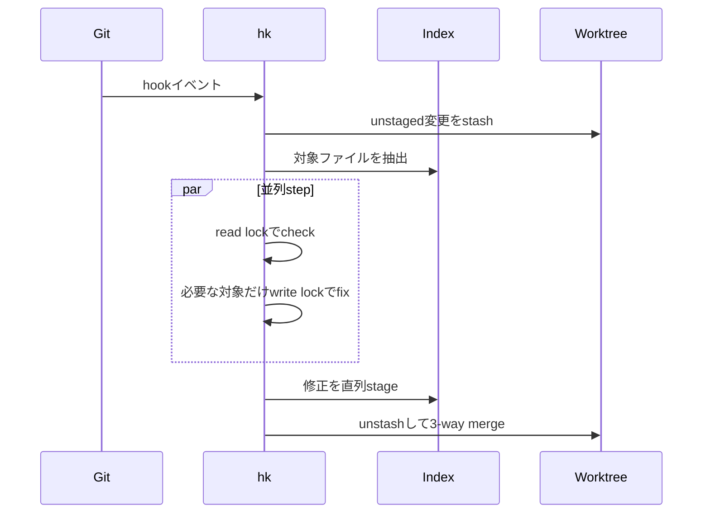
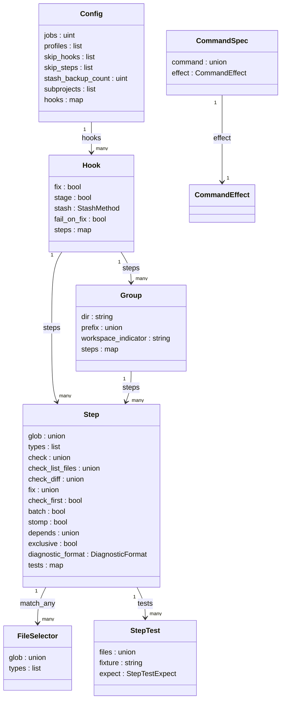

Git hookへ複数のリンターやフォーマッターを追加すると、待ち時間とファイル競合が問題になります。直列実行なら安全でも遅く、単純な並列実行では同じファイルを複数のプロセスが書き換える可能性があるためです。

[hk](https://hk.jdx.dev/)は、この問題をファイル単位のread/write lockで解くRust製のGit hookマネージャー兼プロジェクトlintツールです。本記事では、hk v1.56.1を対象に、既存ツールとの違い、内部構造、Pkl設定モデル、導入・運用方法、AIコーディングエージェントとの連携までを解説します。


*この記事の全体像。以下、順に解説します。*

## 概要

hkは、Git hookの管理と、コミットを経由しない`check`・`fix`を同じ設定で実行するCLIです。作者はmise-en-placeと同じJeff Dickey氏で、miseがツールバージョン・タスク・環境変数を担い、hkがGitライフサイクルとlint実行を担う姉妹プロジェクトとして設計されています。

実装はRustで、設定にはAppleが公開した型付き設定言語Pklを採用しています。既定の設定評価器は内蔵のpklr、Git操作はvendored libgit2です。外部リンター自体を内包するのではなく、PATH上またはmise経由で見つかる実行ファイルを呼び出します。

| 項目 | 内容 |
|---|---|
| 主用途 | Git hook管理、プロジェクト全体または差分のcheck・fix |
| 実装 | Rust、MIT License |
| 設定 | Pkl、組み込み定義140以上 |
| 並列安全性 | ファイル単位のread/write lock |
| Git統合 | Git 2.54+のconfig-based hooks、旧Git向けshim |
| AI連携 | STDIO MCP、JSON/JSONL、`--safe`、実行ダッシュボード |


### 目的と位置づけ

Git hookは、遅いほど開発者に回避されやすくなります。しかし、速度だけを求めてフォーマッターを並列実行すると、同一ファイルに対する同時書き込みで結果が不定になります。hkは、各stepがファイルを読むのか書くのかを実行モデルへ取り込み、複数readerまたは単一writerという制約のもとで並列度を上げます。

pre-commitでは、必要に応じて未ステージ変更を退避し、ステージ済みファイルを抽出し、globに一致するstepを実行し、修正結果をステージしてから変更を戻します。部分ステージを使うワークフローでも、修正対象と作業中の変更を分離しやすい設計です。

Git 2.54以降では、`~/.gitconfig`へのグローバル導入が推奨されています。hk設定がないリポジトリでは、hookからの呼び出しが静かに成功するため、マシンへ一度だけ導入して複数プロジェクトで共有できます。なお、Git本体ではconfig-based hooksがexperimentalである点には注意が必要です。

### 関連技術



| 要素 | hkとの関係 |
|---|---|
| mise-en-place | `HK_MISE=1`や`--mise`でhookを`mise x`経由にし、stepのディレクトリごとに環境を解決 |
| Pkl | 型検査、`amends`、パッケージimportを持つ設定言語 |
| pklr | hkに内蔵された既定のPkl evaluator。Apple pkl CLIへ切り替え可能 |
| libgit2 | statusやindex操作の既定バックエンド。`HK_LIBGIT2=false`でgit CLIへ切り替え可能 |
| 外部リンター | 組み込み定義が呼び出し方を提供し、実行体はローカル環境から解決 |

### 類似ツールとの比較

hkの差別化点は、Rustであることだけではなく、安全な並列実行モデルにあります。pre-commitはhook間を設定順に実行しますが、個々のhookでは対象ファイルをbatchへ分け、`require_serial: true`でない限り複数processで処理できます。prekも既定ではhook間を逐次実行し、priority指定によるhook並列化とbatch並列化が可能です。lefthookは並列実行できますが、ファイル単位の協調は行いません。huskyとlint-stagedはNode.jsエコシステムへ自然に統合でき、異なるglobを既定で並列実行します。同一globの通常配列は逐次ですが、lint-staged v17.3.0以降はネスト配列による明示的な並列化にも対応しています。



| 観点 | hk | pre-commit | prek | lefthook | husky + lint-staged |
|---|---|---|---|---|---|
| 実行モデル | ファイルRW lock付き並列 | hook間は逐次、hook内batchは並列 | 既定はhook間逐次、priorityでhook並列 | 並列可能、ファイル協調なし | 異なるglobは並列。同一globもv17.3.0以降はネスト配列で並列可能 |
| 設定 | Pkl | YAML | YAML | YAML | JavaScript / package.json |
| hook実装の取得 | リポジトリ内Pkl定義 | 外部Gitリポジトリ | 外部Gitリポジトリ | シェル記述 | npmパッケージ |
| 部分ステージ | 3-way mergeによるstash | 対応 | 対応 | なし | 未ステージ差分をpatchへ退避・復元、backup stashあり |
| step依存 | 対応 | 非対応 | 非対応 | 限定的 | npm scriptなどで表現 |
| ファイルbatch | `batch`で設定可能 | 引数長に基づく自動分割・並列 | `pass_filenames: n`で設定可能 | command単位 | 引数長に基づく自動chunk |

公式ベンチマークでは、6,158ファイルへ10個のリンターを実行する合成シナリオで、hk 3.15秒、pre-commit 10.60秒、lefthook 20.83秒、prek 10.52秒でした。約50個のstagedファイルでは、hk 0.42秒、pre-commit 0.81秒、lefthook 0.72秒、prek 0.74秒です。数値は2026年3月23日生成の[benchmark-data.json](https://raw.githubusercontent.com/jdx/hk/main/docs/public/benchmark-data.json)に基づき、lefthookは競合を避けるため逐次に設定されています。


write lockを減らす仕組みは次の4段階です。

| 手段 | 動作 | 主な例 |
|---|---|---|
| `check_diff` | リンターが返したunified diffをhkが適用 | ruff format、black、shfmt |
| `check_list_files` | 変更が必要なファイルだけwrite lockしてfix | prettier |
| `check_first` | read lockでcheckし、失敗対象だけwrite lockでfix | eslint |
| フォールバック | 対象ファイル全体をwrite lock | 専用checkを持たないfixer |

## 特徴

hkの主要機能は次のとおりです。

- Git hookと、手動・CI用の`check` / `fix`を同じPkl設定で管理
- ファイル単位のread/write lockによる安全な並列実行
- `check_diff`、`check_list_files`、`check_first`によるwrite lock最小化
- 部分ステージ向けsmart stashと3-way merge
- 140以上の組み込みstep定義と、末尾空白・EOF・秘密鍵などを検査する`hk util`
- step依存、exclusive、batch、profiles、workspace、subprojects
- Git 2.54+のconfig-based hooksによるグローバル導入
- pre-commit設定からの移行コマンド
- STDIO MCP、構造化診断、safe実行、ダッシュボード

対応するGitイベントは、`pre-commit`、`pre-push`、`commit-msg`、`prepare-commit-msg`、`post-checkout`、`post-merge`、`post-rewrite`、`pre-rebase`、`post-commit`です。`check`と`fix`はGitイベントではなく、CLIから使う特別なhook名です。

## 構造

hkは単一のRust CLIですが、内部ではクライアント層、設定層、実行層、統合層に分かれます。CLIとMCPは同じhook実行エンジンを使い、Pklから評価した設定をもとに対象ファイルとstepを計画します。

### システムコンテキスト図

開発者、AIコーディングエージェント、Git、mise、Pkl、外部リンターの関係は次のとおりです。



hkはGitからイベントを受け取り、作業ツリーとindexを操作します。miseは実行環境を供給し、Pkl evaluatorは設定をJSON相当の内部表現へ変換します。AIエージェントはネットワークサービスではなく、STDIO MCPを介して同じ実行系へ接続します。

### コンテナ図

プロセス内部を責務ごとに分けると、次の4層として理解できます。



クライアント層は入力形式を担当し、実行層は対象選択・依存関係・並列性を担当します。設定層はプロジェクト設定、ユーザー設定、Git config、環境変数、CLIフラグを合成します。統合層はGit、外部コマンド、mise、Pkl、端末表示との差を吸収します。

### コンポーネント図

実装ファイルへ落とすと、`hook.rs`がライフサイクルの中心となり、`step_group.rs`と`step_job.rs`が実行単位を組み立てます。



fixを伴うpre-commitの処理は、設定ロード、unstaged変更のstash、対象ファイルの選択、stepの並列実行、修正結果のstage、stashの復元という順です。並列数は`HK_JOBS`またはCPUコア数で決まり、個々のjobはセマフォを取得したあと、Fixならwrite lock、それ以外ならread lockを取ります。



`stomp = true`だけは例外です。v1.56.1の`step_job.rs`ではファイルlockの集合を空にし、lock取得を省略します。設定スキーマのコメントから「write lockへ切り替える」と解釈しないようにしてください。

## データ

設定の正本スキーマは[`pkl/Config.pkl`](https://raw.githubusercontent.com/jdx/hk/main/pkl/Config.pkl)です。中心となるConfigはHookを持ち、HookはStepまたはGroupを持ちます。Stepには対象ファイル、check・fixコマンド、依存関係、実行制御、診断形式、テストが含まれます。

### 概念モデル

```mermaid
flowchart TD
  ProjectConfig["ProjectConfigFile"]
  UserConfig["UserConfigFile"]
  GitConfig["GitConfig"]
  GitHook["GitHookBinding"]
  Stash["StashBackup"]
  subgraph Config["Config"]
    subgraph Hook["Hook"]
      subgraph Group["Group"]
        subgraph Step["Step"]
          Selector["FileSelector"]
          Script["Script"]
          Command["Command"]
          Spec["CommandSpec"]
          Test["StepTest"]
        end
      end
    end
  end
  ProjectConfig -->|"読み込み"| Config
  UserConfig -->|"読み込み"| Config
  GitConfig -->|"上書き"| Config
  Config -->|"subprojects"| ProjectConfig
  GitHook -->|"起動"| Hook
  Hook -->|"生成"| Stash
  Spec -->|"参照"| Command
  Spec -->|"参照"| Script
```

Configは設定グラフの頂点です。Groupは子Stepへ`dir`、`prefix`、`workspace_indicator`、`shell`、`stage`、`exclude`の既定値を渡します。FileSelectorでは、1つの節の`glob`と`types`がAND、複数の`match_any`節がORになります。

Commandはargvを直接渡す形式、ScriptはOS別のシェル文字列です。CommandSpecはコマンドと`read`・`write`・`destructive`のeffectを結び付け、`--safe`実行時の許可判断に使われます。

### 情報モデル

主要な型と関連を抜粋すると次のようになります。



実行時設定の優先順位は、低い順に既定値、ユーザーConfig、プロジェクトConfig、Git config、`HK_*`環境変数、CLIフラグです。ただし、`exclude`、`skip_steps`、`skip_hooks`、`hide_warnings`は上書きではなく各層の和集合です。

| データ | 重要な意味 |
|---|---|
| `Config.jobs` | `0`ならCPUコア数。CLIの`--jobs`は0を受け付けない |
| `Hook.fix` | fixコマンドを実行。名前が`fix`のHookではtrue |
| `Hook.stage` | fix後にindexへ載せるかを制御 |
| `Hook.stash` | `git`、`patch-file`、`none`。既定は`none` |
| `Step.check_first` | 先にread lockでcheckし、失敗時だけfix。既定true |
| `Step.batch` | ファイル集合を分割して並列実行 |
| `Step.depends` | 先行step名を指定 |
| `Step.exclusive` | 前の実行完了を待ち、後続開始を止めるバリア |
| `Step.diagnostic_format` | SARIF、cargo-json、eslint-json、gccを正規化 |

設定ファイルの探索順は、`hk.local.pkl`、`.config/hk.local.pkl`、`hk.pkl`、`.config/hk.pkl`です。その後に非推奨のTOML・YAML・JSON形式が続きます。ユーザー共通設定の推奨先は`~/.config/hk/config.pkl`で、`.hkrc.pkl`と`--hkrc`はv2で削除予定です。

Git hook bindingは`hook.hk-<event>.command`、`.event`、`.enabled`としてGit configへ保存されます。stashバックアップは`$HK_STATE_DIR/patches/`へ保存され、既定でリポジトリあたり20件を保持します。

## 構築方法

### 前提条件

hkはGitリポジトリで利用します。Git 2.54以降ならグローバルなconfig-based hooksを使えます。古いGitでもリポジトリ単位のshimで導入可能です。Pkl CLIは必須ではありませんが、`cargo install`でビルドする場合はRust 1.91.0以上が必要です。

### インストール

公式の第一候補はmiseです。

```sh
mise use hk@1.56.1
hk --version
```

ほかにcargo、Homebrew、aqua、GitHub Releasesを利用できます。

```sh
cargo install hk --version 1.56.1
brew install hk
aqua g -i jdx/hk
```

バージョンは記事執筆時点の例です。導入時は[GitHub Releases](https://github.com/jdx/hk/releases)で現行版を確認し、`hk.pkl`の`amends`と実行バイナリを同じバージョンへ揃えてください。

### Pklバックエンド

既定は内蔵pklrです。Apple pkl CLIを使う場合だけ環境変数を切り替えます。

```sh
export HK_PKL_BACKEND=pkl
```

| 変数 | 既定 | 用途 |
|---|---|---|
| `HK_PKL_BACKEND` | `pklr` | `pklr`または`pkl` |
| `HK_PKL_CACHE_DIR` | OS依存のcache | 内蔵pklrのpackage cache |
| `HK_PKL_OFFLINE` | `false` | 内蔵pklrのオフライン評価 |
| `HK_PKL_CA_CERTIFICATES` | 空 | pkl CLI向けCA証明書 |

### Hookセットアップ

Git 2.54以降では、グローバル導入が最も簡単です。

```sh
hk install --global
hk install --global --mise
hk uninstall --global
```

リポジトリ単位で導入する場合は次を使います。

```sh
hk install
hk install --legacy
hk install --mise
hk install --force-local
```

グローバル導入済みの環境では、通常の`hk install`はlocal hookを重ねません。globalとlocalを明示的に併用するとGit 2.54が同じイベントの両方を実行するため、二重発火に注意してください。

### プロジェクト初期化

```sh
hk init
hk init --interactive
hk init --mise
hk validate -v
```

生成されるPklは実行中バージョンのスキーマpackageを参照します。

```pkl
amends "package://github.com/jdx/hk/releases/download/v1.56.1/hk@1.56.1#/Config.pkl"
import "package://github.com/jdx/hk/releases/download/v1.56.1/hk@1.56.1#/Builtins.pkl"
```

### 初回セットアップの流れ

最小構成では、hkを導入し、グローバルhookを設定し、各リポジトリに`hk.pkl`を置きます。

```sh
mise use hk@1.56.1
hk install --global
cd /path/to/repository
hk init
hk validate -v
hk run pre-commit
```

古いGitや、特定リポジトリだけで使う場合は`hk install`へ置き換えます。

### pre-commitからの移行

既存の`.pre-commit-config.yaml`は、migrateサブコマンドでPklへ変換できます。

```sh
hk migrate pre-commit
hk migrate pre-commit \
  --config .pre-commit-config.yaml \
  --output hk.pkl
hk validate -v
```

移行後は生成結果をそのまま信用せず、各hookの実行ファイルがPATH上にあること、fixの有無、globの重なり、部分ステージ時のstash方針を確認してください。

## 利用方法

### 必須パラメータ

`hk check`、`hk fix`、`hk install`、`hk init`、`hk validate`、`hk test`は引数なしで起動できます。`hk run <HOOK>`はhook名が必須で、`commit-msg`や`post-checkout`のようなイベントはGitから渡される追加引数を受け取ります。

| コマンド | 必須値 | 用途 |
|---|---|---|
| `hk run <HOOK>` | hook名 | 任意のhookを実行 |
| `hk run commit-msg` | message file | commit message検査 |
| `hk run post-checkout` | 3つのGit引数 | checkout後処理 |
| `hk completion` | shell名 | 補完生成 |
| `hk config get` | key | 設定値取得 |
| `hk agent mcp` | `--target` | エージェント設定生成 |

### サブコマンド一覧

| コマンド | 役割 |
|---|---|
| `hk check` / `hk fix` | 変更ファイルまたは指定範囲を検査・修正 |
| `hk run` | 名前付きhookを実行 |
| `hk install` / `uninstall` | Git hookを追加・削除 |
| `hk init` | `hk.pkl`を生成 |
| `hk validate` | 設定を検証 |
| `hk config` | 有効設定と由来を確認 |
| `hk test` | step定義の自己テスト |
| `hk mcp` | STDIO MCPサーバー |
| `hk util` | 内蔵ファイル検査 |
| `hk migrate` | 他マネージャーから移行 |
| `hk agent` | AIエージェント向け設定を生成 |

### `hk.pkl`の書き方

次の例は、pre-commitではfixとstashを有効にし、pre-pushとCI向けcheckでは検査だけを行います。

```pkl
amends "package://github.com/jdx/hk/releases/download/v1.56.1/hk@1.56.1#/Config.pkl"
import "package://github.com/jdx/hk/releases/download/v1.56.1/hk@1.56.1#/Builtins.pkl"

local linters = new Mapping<String, Step> {
    ["eslint"] {
        glob = List("*.js", "*.ts")
        check = new CommandSpec {
            command = "eslint {{files}}"
            effect = "read"
        }
        fix = new CommandSpec {
            command = "eslint --fix {{files}}"
            effect = "write"
        }
        check_first = true
        batch = true
    }
    ["prettier"] = Builtins.prettier
}

hooks {
    ["pre-commit"] {
        fix = true
        stash = "git"
        steps = linters
    }
    ["pre-push"] {
        steps = linters
    }
    ["fix"] {
        fix = true
        steps = linters
    }
    ["check"] {
        steps = linters
    }
}
```

文字列のcommandはshell経由です。裸の文字列はeffectが`unknown`になるため、`--safe`では実行前に拒否されます。safe実行の対象にするcustom stepは、上のeslint例のように`CommandSpec`で`read`または`write`を明示します。argvを直接渡したい場合は`Command`を使います。

```pkl
check = new Command {
    argv = List("wc", "-c", "{{files}}")
}
```

### check・fix・run

```sh
hk check
hk check --all
hk check --pr
hk check --from-ref origin/main --to-ref HEAD
hk check -S prettier -S eslint
hk check --skip-step slow-linter
hk check --plan
hk check --why prettier
hk check --safe --format jsonl --all
hk fix --all --no-stage
hk run pre-commit
```

`hk check`の既定対象は変更ファイルです。clean checkoutのCIでは`--all`、PR差分だけなら`--pr`を使います。実行せず計画を確認するオプションは`--plan`であり、`--dry-run`ではありません。

### 設定の確認とテスト

```sh
hk validate -v
hk config dump
hk config sources
hk config explain fail_fast
hk test
hk test --list
hk test --step prettier
hk builtins
hk cache clear
```

設定変更後に古い結果が見える場合は、設定の由来を`hk config sources`で確認してからcacheを消すと切り分けやすくなります。

### バイパス

1回だけGit hookを飛ばすには、`HK=0`を付けます。

```sh
HK=0 git commit -m "wip: skip hooks"
HK=0 git push
```

プロジェクトに設定がない場合、`--from-hook`は設定ロード前に終了コード0で終了します。一方、プロジェクト設定自体が壊れていれば、`--from-hook`でも失敗します。

## 運用

### 起動・停止・バイパス

hkは常駐デーモンではありません。Gitイベント、CLI、STDIO MCPのいずれかでプロセスが起動します。特定hookを継続的に無効化する場合は、`HK_SKIP_HOOK`、`git config hk.skipHook`、Pklの`skip_hooks`を使います。

```sh
HK_SKIP_HOOK=pre-commit,pre-push git commit
git config --local hook.hk-pre-commit.enabled false
```

MCPはホスト側がSTDIOプロセスを終了すると停止します。`cancel_run`はMCPサーバーではなく、実行中のcheckまたはfixを停止します。

### 状態確認

```sh
hk version
hk validate -v
hk config dump
hk config sources
git config --show-origin --get-regexp '^hook\.hk-'
hk check --all --plan
hk check --all --stats
```

### ログ確認

コンソールの既定レベルはinfoです。詳細化には`HK_LOG=debug`、`HK_LOG=trace`、`-v`、`-vv`を使います。ファイルログの既定先は`~/.local/state/hk/hk.log`、失敗コマンドの全文は`~/.local/state/hk/output.log`です。

```sh
HK_LOG=debug hk check
hk check -vv
HK_TIMING_JSON=/tmp/hk-timing.json hk check --all
HK_TRACE=json hk check --all
```

### 並列度とスケール

並列度はプロセス台数ではなくjob数で制御します。Pklの`jobs = 0`と`HK_JOBS=0`はCPUコア数を意味します。CLIの`--jobs`は正の整数だけを受け付けます。

```sh
HK_JOBS=8 hk check --all
hk check --all --jobs 4
git config --local hk.jobs 4
```

最初の失敗で打ち切る`fail_fast`は既定trueです。CIで全エラーを集める場合は`--no-fail-fast`を使います。

### stash

hookのstash既定値は`none`です。部分ステージを使い、pre-commitでfixする場合は明示的に`stash = "git"`を設定します。復元前のbackupは`$HK_STATE_DIR/patches/`へ保存されます。

```sh
HK_STASH=git hk run pre-commit
HK_STASH_UNTRACKED=0 hk run pre-commit
```

未追跡ファイルもstash対象にする既定値はtrueです。ホームディレクトリ全体をworktreeにする環境などでは、status走査が重くなるため`HK_STASH_UNTRACKED=0`が有効です。

### 更新

```sh
mise upgrade hk
brew upgrade hk
hk cache clear
```

更新時は、実行バイナリ、`Config.pkl`のpackage URL、`Builtins.pkl`のpackage URLを同じ版へ揃えます。既定のpklrを使うオフラインCIでは、Pkl package cacheを事前にwarm upして`HK_PKL_OFFLINE=1`を使います。Apple pkl CLIを選んだ場合、この変数はCLI側のnetwork accessを制御しません。

## ベストプラクティス

### CI/CD連携

CIではclean checkoutでも全ファイルを検査できる`hk check --all`を正本にします。PR差分だけなら`--pr`を利用します。

```yaml
- uses: jdx/mise-action@v2
- run: mise install
- run: hk check --all --no-fail-fast
  env:
    HK_SUMMARY_TEXT: "1"
    HK_MISE: "1"
```

ローカルではpre-commitをfix付き、CIではcheck専用に分けると、開発体験と再現性を両立できます。重いstepはprofileへ分け、CIだけ`--slow`を付ける方法もあります。

### マルチ環境と設定管理

設定の責務を次のように分けると管理しやすくなります。

| 範囲 | 推奨ファイル |
|---|---|
| ユーザー共通 | `~/.config/hk/config.pkl` |
| プロジェクト共通 | `hk.pkl` |
| 個人上書き | `hk.local.pkl` |

`hk.local.pkl`は`amends "./hk.pkl"`から始め、Git管理対象外にします。ユーザー設定からプロジェクトstepを削除するのではなく、skipはGit configまたは環境変数で指定します。

### 並列とロックの優先順

性能と安全性を両立するため、次の順でstepを設計します。

1. `check_diff`で差分だけを返す
2. `check_list_files`でwrite対象を絞る
3. `check_first = true`で失敗した対象だけfixする
4. `batch = true`でファイル集合を分割する
5. 本当に必要な順序だけ`depends`で表現する
6. 共有資源がある処理だけ`exclusive`またはGroupへ分ける

step内で`git add`や`git update-index`を呼ぶと、hkによるindex書き込みの直列化を迂回します。生成物はstepの`stage`へ宣言し、index操作をhkへ任せます。また、`stomp = true`はlockを強化する設定ではなく、lockを外す設定なので慎重に使ってください。

### mise連携

`HK_MISE=1`は、hookの`mise x`ラップと、stepの作業ディレクトリごとの環境解決を有効にします。miseをツールと環境変数の正本、hkをGitライフサイクルの正本に分ける構成が分かりやすいです。

```toml
[tools]
hk = "latest"

[env]
HK_MISE = 1

[hooks]
postinstall = "hk install --mise"
```

### monorepo

```pkl
subprojects = List("subproject", "packages/*")
```

subprojectのstep名には`<dir>:`接頭辞が付きます。`workspace_indicator`を使えば、`Cargo.toml`、`go.mod`、`package.json`などを基準にファイルをまとめて1 jobとして実行できます。subproject内の`dir`はliteral pathで指定し、`dir = "{{workspace}}"`との混同を避けます。

### セキュリティとMCP

hkの組み込み定義はPkl設定であり、第三者のGitリポジトリからhook実装を取得する方式ではありません。ただし、最終的にはPATH上のコマンドを実行するため、Pkl設定と実行ファイルの双方を信頼境界として扱う必要があります。

MCPはSTDIOだけで、ネットワークportをlistenしません。エージェントには、`plan`で実行内容を確認してから`start_safe_check`または`start_safe_fix`を呼ばせるのが安全です。`start_safe_fix`は`--no-stage`で動きます。

```sh
hk agent mcp --target vscode
hk mcp --root /absolute/path/to/project
```

ダッシュボード表示にはMCP Apps対応ホストが必要です。通常のMCPクライアントでは、構造化レスポンスとtext fallbackとして同じ実行情報を利用します。


MCPを使わない場合も、NUL区切りのファイル一覧とJSONL出力で安全に連携できます。

```sh
{
  git diff --name-only -z
  git diff --cached --name-only -z
  git ls-files --others --exclude-standard -z
} | hk run check --files0-from - --safe --format jsonl
```

### リソース制限

共有CI runnerでは`HK_JOBS`を明示し、巨大リポジトリでは`exclude`と既定の`walk_ignore = true`で走査対象を絞ります。fsmonitorとの組み合わせでlibgit2経由が遅い場合は、`HK_LIBGIT2=false`でgit CLIへ切り替えて比較します。

## トラブルシューティング

切り分けの入口は、設定検証の`hk validate -v`、計画表示の`hk check --plan`、詳細ログの`HK_LOG=debug`です。

### 頻出症状

| 症状 | 主な原因 | 対処 |
|---|---|---|
| Pkl設定を評価できない | backend差、Group記法、schema版の不一致 | `hk validate -v`、`HK_PKL_BACKEND=pkl`で切り分け、versionを統一 |
| linterが見つからない | hook内のPATHに実行体がない | `HK_MISE=1`またはstepの`prefix = "mise x --"` |
| 同じhookが2回走る | globalとlocalのhookが同じeventへ登録 | Git configの由来を確認し、片方を無効化 |
| write lock待ちで遅い | 複数fixerが同一ファイルへ書き込む | `check_diff`、`check_list_files`、`check_first`を優先 |
| global installが失敗 | Git 2.54未満 | Git更新またはper-repo `hk install` |
| CIで何も検査しない | clean checkoutで変更ファイルが0件 | `hk check --all`または`--pr` |
| 最初の失敗で残りが動かない | `fail_fast = true` | `--no-fail-fast` |
| 古い設定結果が残る | 設定cache | `hk cache clear` |
| MCPがportで待たない | MCPはSTDIO | ホスト設定へ起動commandを登録 |
| unstash後に意図しないhunk | fixer変更と作業中変更の3-way merge | `$HK_STATE_DIR/patches/`のbackupを確認 |

### 二重発火の確認

Git 2.54は同じeventに対するglobalとlocalの`hook.<name>.command`を集約して実行します。二重発火が疑われる場合は、設定元を含めて一覧します。

```sh
git config --show-origin --get-regexp '^hook\.hk-'
```

推奨はglobal導入へ統一することです。localだけを止める場合は次のように設定できます。

```sh
git config --local hook.hk-pre-commit.enabled false
```

## まとめ

hkは、Git hookを単にRustで高速化したツールではありません。ファイル単位のread/write lock、差分出力や変更対象列挙を使ったwrite lockの最小化、index書き込みの直列化、部分ステージ向け3-way mergeによって、複数のリンターを安全に並列化します。

導入時は、Git 2.54以降ならglobal hook、設定はPkl、ツールと環境はmise、ローカルpre-commitはfix、CIは`hk check --all`という分担から始めると理解しやすいでしょう。AIエージェントへ渡す場合は、STDIO MCPの`plan`とsafe系操作、または`--safe --format jsonl`を使うことで、実行内容と副作用を制御できます。

この記事が少しでも参考になった、あるいは改善点などがあれば、ぜひリアクションやコメント、SNSでのシェアをいただけると励みになります！

## 参考リンク

- [hk公式サイト](https://hk.jdx.dev/)
- [Getting Started](https://hk.jdx.dev/getting_started.html)
- [Why hk?](https://hk.jdx.dev/why-hk.html)
- [Configuration](https://hk.jdx.dev/configuration.html)
- [Hooks](https://hk.jdx.dev/hooks.html)
- [Environment Variables](https://hk.jdx.dev/environment_variables.html)
- [mise integration](https://hk.jdx.dev/mise_integration.html)
- [Benchmarks](https://hk.jdx.dev/benchmarks.html)
- [Coding agents](https://hk.jdx.dev/agents.html)
- [hk GitHub repository](https://github.com/jdx/hk)
- [Config.pkl](https://raw.githubusercontent.com/jdx/hk/main/pkl/Config.pkl)
- [v1.56.1 release](https://github.com/jdx/hk/releases/tag/v1.56.1)
- [prekとpre-commitの差分](https://prek.j178.dev/diff/#prek-run)
- [prek priority設定](https://prek.j178.dev/reference/configuration/#priority)
- [pre-commit hook設定](https://pre-commit.com/#pre-commit-configyaml---hooks)
- [lint-staged v17.3.0 release](https://github.com/lint-staged/lint-staged/releases/tag/v17.3.0)
- [lint-staged v17.3.0 README](https://github.com/lint-staged/lint-staged/blob/v17.3.0/README.md#--no-hide-partially-staged)
- [Git 2.54 release notes](https://raw.githubusercontent.com/git/git/v2.54.0/Documentation/RelNotes/2.54.0.adoc)
