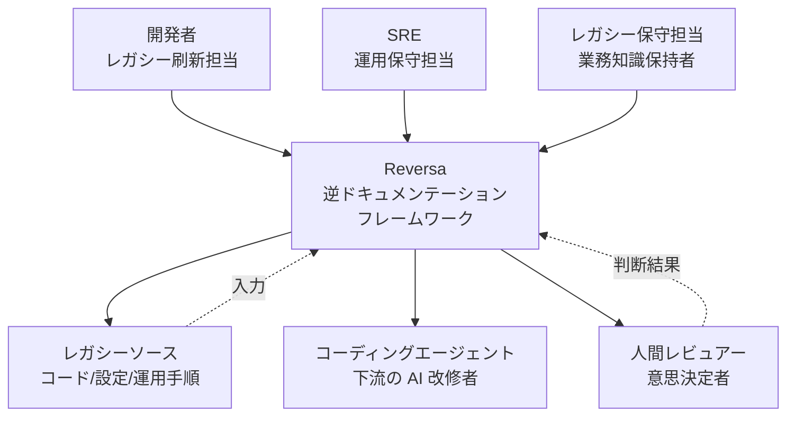
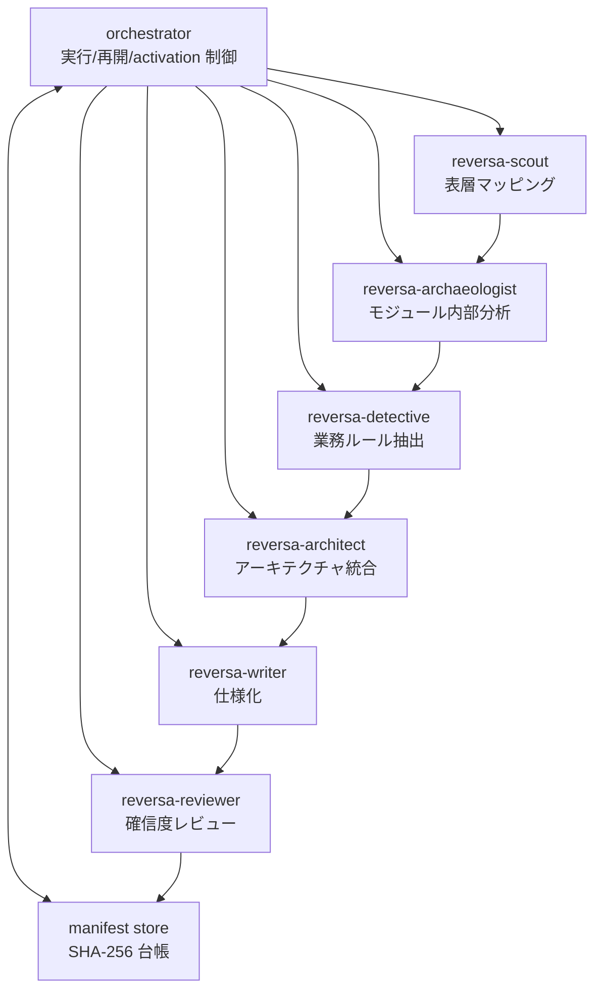
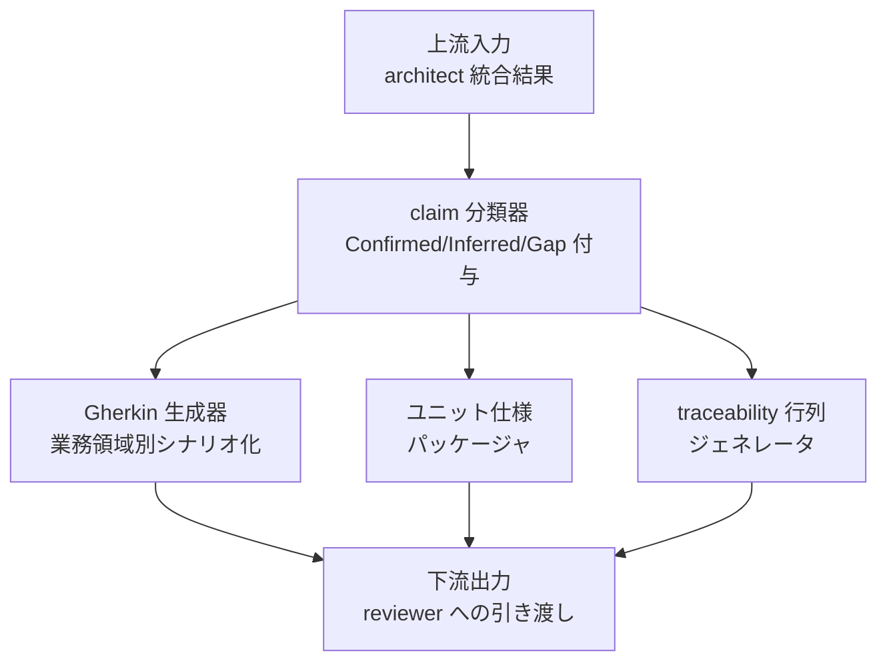
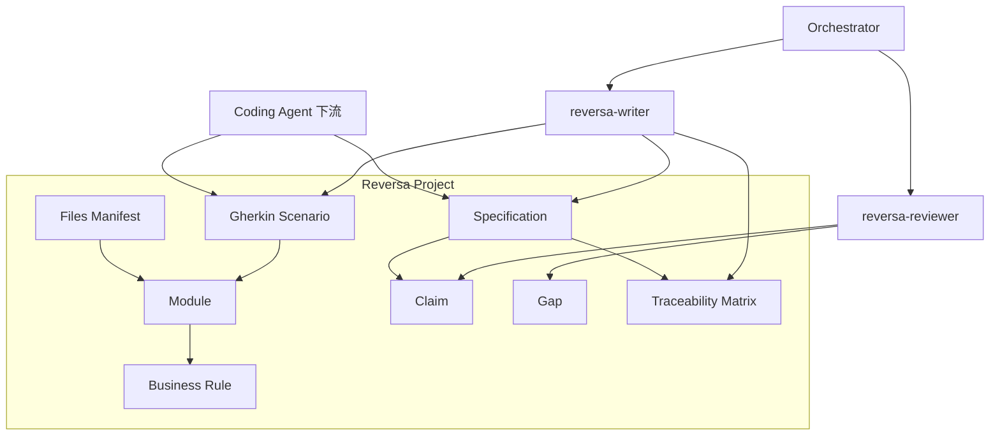
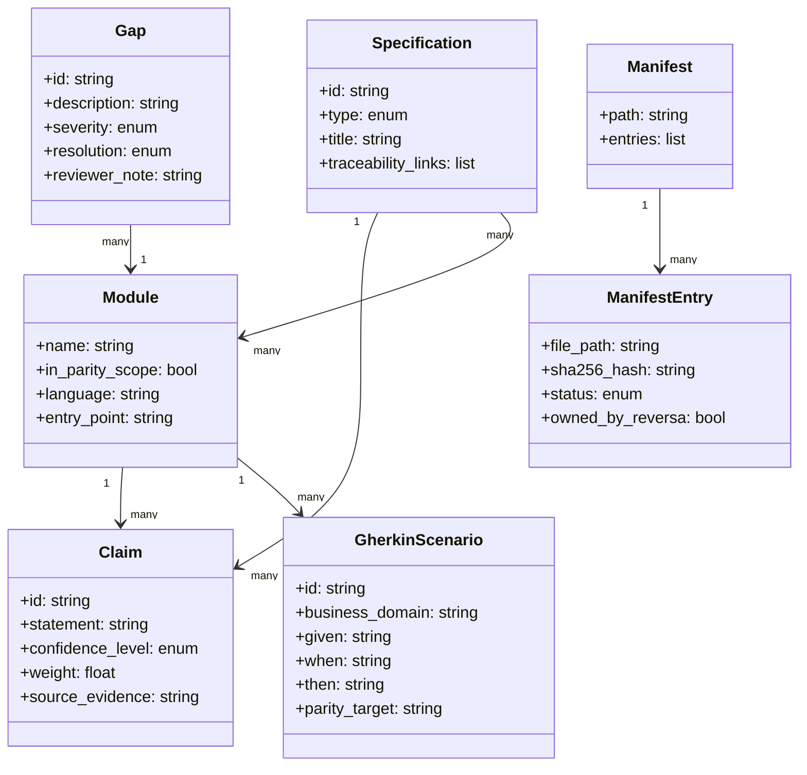
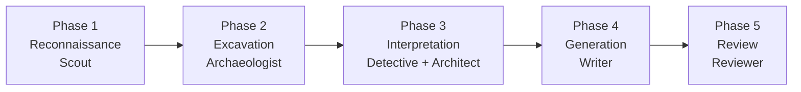

> 対象: Reversa (arXiv:2605.18684, Macedo & da Costa, 2026-05-18)
> 公開実装: <https://github.com/sandeco/reversa>
> 公式 CLI ドキュメント: <https://sandeco.github.io/reversa/cli/>
> 調査日: 2026-05-20

## 概要

Reversa は、明示的な仕様が失われたレガシーソフトウェアを、AI コーディングエージェントが安全に扱える「運用仕様 (operational specifications)」へ逆生成するフレームワークです。論文の中心的な転回は、レガシー刷新の問題を「コード変換 (code translation)」ではなく「逆ドキュメンテーション工学 (reverse documentation engineering)」として再定義した点にあります。

従来のレガシー刷新は、COBOL から Java へといった**言語間のコード書き換え**が中心でした。一方 Reversa は、AI エージェントにコード改修を任せる前段に、コード・設定・運用手順・例外処理から**暗黙の業務ルールをトレース可能な仕様へ復元する工程**を独立段階として配置します。これにより、生成系 AI を直接コードに適用したときに発生する幻覚・過剰実行・暗黙前提の欠落といった失敗モードを、仕様レイヤーで先取りして可視化します。

成果物は次の 3 層で構成されます。

1. **confidence index 付き claim** (Confirmed 1.0 / Inferred 0.5 / Gap)
2. **Gherkin parity scenario** (レガシー挙動と再実装の executable な並行運用契約)
3. **gap log** (人間検証待ちの未確定事項)

論文では概念実証として、GnuCOBOL の教育用 ATM システムを Go へ移行する 4 日間のケーススタディを示し、517 claim / 内部 confidence 97.1% / 53 Gherkin / 10 gap / 11 タスク中 9 完了の結果を報告します。ただし著者自身が「cutover 未完」「教育用システム」「独立監査なし」「baseline 比較なし」を制約として明記しており、本研究の寄与は実証結果よりも**枠組みの提示**にあります。実装は Node.js CLI として `sandeco/reversa` で公開されており、Claude Code / Codex / Cursor / Gemini CLI など複数のエージェントエンジンへデプロイできます。

## 特徴

論文の寄与は次の 7 点に整理できます。

### 1. 「コード変換」から「仕様再構築」への問題定義の転回

レガシー刷新を「言語 A → 言語 B のコード書き換え」とは捉えず、「暗黙仕様 → 明示的な運用契約 → AI エージェントによる再実装」の 3 段プロセスに分解します。仕様再構築を独立段階に置くことで、AI エージェントへ入力する前に**人間が検証すべき範囲と機械が処理すべき範囲の境界**を確定できます。

### 2. confidence index による「わからない」の明示化

すべての claim を 3 分類でラベル付けします。

| 分類 | 重み | 意味 |
|---|---|---|
| Confirmed | 1.0 | コード・成果物に直接根拠あり |
| Inferred | 0.5 | パターン・命名・フローからの推定 |
| Gap | — | 安全に判定不能、人間検証必須 |

ATM ケースでは 490 confirmed + 24 inferred + 3 gaps で内部 confidence 97.1% という数値を得ています。ただしこの値は**パイプライン自身の自己分類であって外部事実正確性ではない**と論文が明記しています。「97.1% 正しい」ではなく「97.1% は機械的に確認できる範囲」と読みます。

### 3. Gherkin parity scenario による executable な並行運用契約

レガシー挙動と再実装の同等性を、業務ドメイン別に整理した Gherkin シナリオで表現します。ATM ケースでは login / balance / withdrawal / deposit / transfer / statement / 通貨フォーマット / キーボードマスキングの 8 領域に 53 シナリオが生成されました。新旧システムを並行実行して挙動差を検出する設計です。論文は「final parity validation and cutover were not completed」と明記しており、効果は理論的可能性にとどまります。

### 4. SHA-256 manifest によるユーザー成果物の保護

`.reversa/_config/files-manifest.json` に各ファイルのハッシュを記録し、intact / modified / missing の 3 状態に分類します。update 時は intact / missing のみ書き換え、modified は保護します。uninstall も同様です。AI エージェントの過剰実行に対する構造的回答の一つで、**所有境界をハッシュで強制する**設計です。

### 5. 6 ロール + orchestrator のマルチエージェント分業

| ロール | 責務 |
|---|---|
| reversa-scout | 表層マッピング (スタック・依存・エントリポイント) |
| reversa-archaeologist | モジュール内部の技術分析 |
| reversa-detective | 業務ルール・状態・権限・暗黙の例外抽出 |
| reversa-architect | アーキテクチャ・データフロー・横断影響の統合 |
| reversa-writer | ユニット仕様・要件・設計書・トレーサビリティ行列への変換 |
| reversa-reviewer | claim・confidence・gap の集約と人間検証用パッケージング |
| orchestrator | 全体の実行・再開・activation 制御 |

「探検家・考古学者・探偵・建築家・書記・査読者」という擬人化された役割分担が、コードベースに対する複数視点 (表層 → 技術詳細 → 業務 → 構造 → 文書 → 検証) を**エージェント境界として明示的に刻みます**。公開 CLI 実装では Detective と Architect が同フェーズに統合され、運用上は 5 フェーズで進行します。

### 6. Node.js CLI による配布と複数エージェントエンジン対応

`npx reversa` で起動する Node.js CLI として配布され、6 skills は単一エンジンに固定されず Claude Code / Codex / Cursor / Gemini CLI / Windsurf / Aider / Cline / GitHub Copilot などへデプロイできます。これは「特定 LLM ベンダー固有の機能に依存しない」という移植性の主張です。

### 7. Gap の重大度分類と人間決定ループ

Gap は critical / moderate / cosmetic / out-of-scope の 4 区分で重大度ラベルが付き、それぞれ「人間決定で解決 / 残存 / parity scope から除外」のいずれかに帰着します。ATM ケースの 10 gaps は critical 3 / moderate 3 / cosmetic 2 / out-of-scope 2 という分布で、5 件が人間決定で解決、3 件が残存、2 件が scope 除外となりました。**判断ログとしてそのまま運用できる構造**を持ちます。

### 関連研究との位置づけ

論文は次の 4 軸で先行研究との差分を整理します。Reversa の寄与は個別構成要素の新規性ではなく、**4 軸の交点を統合した点**にあります。

| 研究軸 | 代表例 | 出力先 | 起点 | 確信度マーク | マルチエージェント分業 |
|---|---|---|---|---|---|
| LLM ベース文書化 | RepoAgent | 人間読者向けナラティブ説明 | リポジトリ全体 | なし | なし |
| 古典的リバースエンジニアリング | バイナリ解析系研究 | 人間 (component/relation 図) | バイナリ / コード | なし | なし |
| LLM ベース要件生成 | ReqInOne / AutoReSpec | 人間レビュー向け SRS | 既存要件・コメント | 限定的 | 限定的 |
| **Reversa** | 本論文 | **AI コーディングエージェント** | **暗黙仕様のレガシーコード** | **3 値 + gap log** | **6 ロール分業** |

## 構造

C4 model の 3 段階 (System Context / Container / Component) を、提案フレームワークの論理構造として読み替えて整理します。

### システムコンテキスト図



| 要素 | 説明 |
|---|---|
| 開発者 | レガシー刷新を主導し Reversa を起動 |
| SRE | 運用視点で出力仕様の妥当性を確認 |
| レガシー保守担当 | 暗黙の業務知識を gap 解消時に提供 |
| Reversa | 逆ドキュメンテーション工学を実装するフレームワーク本体 |
| レガシーソース | 解析対象のコード・設定・運用手順 |
| コーディングエージェント | Reversa の出力仕様を入力として改修する下流 AI |
| 人間レビュアー | gap や inferred claim の最終判断者 |

### コンテナ図

orchestrator が 6 つのエージェントと manifest store を協調動作させます。



| 要素 | 説明 |
|---|---|
| orchestrator | 6 エージェントの実行順序・再開・activation を制御 |
| reversa-scout | スタック・依存・エントリポイントを根拠付きでマップ |
| reversa-archaeologist | モジュール内部の技術ファクトを分類して生成 |
| reversa-detective | 業務ルール・状態遷移・権限・暗黙の例外を抽出 |
| reversa-architect | アーキテクチャ・依存・データフロー・横断影響を統合 |
| reversa-writer | ユニット仕様・要件・設計書・トレーサビリティ行列を生成 |
| reversa-reviewer | claim と confidence と gap をレビューし人間検証用に集約 |
| manifest store | ファイルハッシュと所属/状態を保持する SHA-256 台帳 |

### コンポーネント図

reversa-writer エージェントの内部構造を、論文の writer 責務から分解して示します。



| 要素 | 説明 |
|---|---|
| claim 分類器 | 各 claim に Confirmed 1.0 / Inferred 0.5 / Gap の重みラベルを付与 |
| Gherkin 生成器 | ラベル付き claim を業務領域別に束ねて parity scenario へ展開 |
| traceability 行列ジェネレータ | claim とレガシー成果物の対応を行列化 |
| ユニット仕様パッケージャ | 要件・設計書・ユニット仕様を成果物形式へ整形 |
| 上流入力 | reversa-architect の統合済みアーキテクチャ情報を受け取る入口 |
| 下流出力 | reviewer での集約・人間検証パッケージング工程への出口 |

## データ

Reversa の中心オブジェクトは、レガシーコードを traceable operational contract に変換するための「主張 (Claim) / ギャップ (Gap) / シナリオ (GherkinScenario) / 仕様 (Specification) / マニフェスト (ManifestEntry)」群です。

### 概念モデル



| 要素 | 説明 |
|---|---|
| Module | レガシーソースのモジュール単位 |
| BusinessRule | Detective が抽出する業務ルール |
| Claim | コード・成果物から導かれた主張、confidence_level と weight を持つ |
| Gap | 判定不能で人間検証を待つ事項、severity と resolution を持つ |
| GherkinScenario | 業務領域別の parity 用シナリオ |
| Specification | unit / requirement / design のいずれかの仕様 |
| TraceabilityMatrix | Claim と Module、Specification の対応行列 |
| Files Manifest | SHA-256 ハッシュによる所有境界の台帳 |

### 情報モデル



#### 主要エンティティ補足

- **Claim**: `confidence_level` は `Confirmed` (weight 1.0) / `Inferred` (weight 0.5) の 2 値 enum。ATM ケースは 490 Confirmed + 24 Inferred + 3 Gap = 517 claims
- **Gap**: `severity` は critical / moderate / cosmetic / out_of_scope の 4 値。`resolution` は resolved / residual / excluded の 3 値
- **GherkinScenario**: ATM では 53 シナリオ生成 (8 業務領域)
- **ManifestEntry**: 物理位置は `.reversa/_config/files-manifest.json`、`status` は intact / modified / missing

#### 集計値 (ATM ケース)

| 項目 | 値 |
|---|---|
| Module (parity) | 5 |
| Claim | 517 (Confirmed 490 + Inferred 24 + Gap 3) |
| Internal confidence | 97.1% (pipeline 自己採点) |
| Gap | 10 (critical 3 / moderate 3 / cosmetic 2 / out_of_scope 2) |
| GherkinScenario | 53 |
| Task | 11 中 9 完了 |

## 構築方法

論文は枠組みの提示が主眼で実装詳細が限定的なため、公開リポジトリ [sandeco/reversa](https://github.com/sandeco/reversa) と公式 CLI ドキュメント [sandeco.github.io/reversa/cli/](https://sandeco.github.io/reversa/cli/) を主軸に整理します。論文に直接記載がない箇所は **(実装案として補完)** とラベル付けします。

### 前提条件

| 項目 | 値 | 出典 |
|---|---|---|
| Node.js | **18 以上** | GitHub README |
| 実行場所 | レガシープロジェクトのルートディレクトリ | CLI ドキュメント |
| 対象レガシー言語 | 言語横断 (COBOL / Java / VB6 等。論文 PoC は GnuCOBOL) | 論文 + README |
| 必須 AI エンジン | Claude Code / Codex / Cursor / Gemini CLI 等のいずれか | CLI ドキュメント |

### インストールコマンド

```bash
# レガシープロジェクトのルートで実行
cd /path/to/legacy-project
npx reversa install
```

インストーラの挙動は次の通りです。

1. プロジェクトに存在する AI エンジンを自動検出
2. 利用するエージェントチームを対話的に選択 (Reversa Agents Core 必須 + 任意追加チーム)
3. プロジェクトメタデータを収集
4. `.reversa/` 配下に状態構造を生成
5. AI エンジン側のスキル領域 (例: `.claude/skills/`) にエージェント定義を配置

### 生成されるディレクトリ構造

```text
<legacy-project>/
├── .reversa/                       # 設定・状態 (Reversa が排他所有)
│   ├── state.json                  # パイプライン進捗 (再開ポイント)
│   ├── config.toml                 # プロジェクト設定
│   ├── plan.md                     # orchestrator が作る実行計画
│   ├── context/                    # Scout / Archaeologist の中間成果
│   └── _config/
│       └── files-manifest.json     # SHA-256 manifest
├── .claude/skills/                 # Claude Code 用エージェント (エンジンに応じて変動)
├── _reversa_sdd/                   # 逆生成された運用仕様 (artifact)
└── _reversa_forward/               # Forward 機能の出力 (任意)
```

論文側の `.reversa/specs/*` 表記は概念的なもので、**実装上の artifact は `_reversa_sdd/` 配下に出ます** (実装案として補完)。

### 補助コマンド

```bash
npx reversa status          # 現在の解析フェーズ・実行済みエージェント・残タスクを表示
npx reversa update          # SHA-256 manifest で intact/missing のみ更新、modified は保護
npx reversa add-agent       # 追加エージェントを後付け
npx reversa add-engine      # 初期セットアップで選ばなかった AI エンジンを追加
npx reversa export-diagrams # C4 / ERD などの図を書き出し
npx reversa uninstall       # Reversa 由来ファイルのみ削除
```

## 利用方法

### パイプライン起動 (AI エンジン側で発火)

`npx reversa run` ではなく、**AI エンジン上で orchestrator スキルを呼び出します**。

| エンジン | 起動コマンド (チャット入力) |
|---|---|
| Claude Code / Cursor / Gemini CLI | `/reversa` |
| Codex / Opencode / Aider | `reversa` |

orchestrator が `.reversa/plan.md` を生成し、以降は各フェーズ完了ごとに `CONTINUAR` (= 続行) 入力で次フェーズに進む対話型パイプラインです。

### エージェント実行順序 (5 フェーズ)

論文の 6 ロールを、CLI 実装では 5 フェーズに統合します (Detective + Architect が同フェーズ)。



| Phase | エージェント | 主な出力 |
|---|---|---|
| 1. Reconnaissance | Scout | `_reversa_sdd/inventory.md`, `dependencies.md` |
| 2. Excavation | Archaeologist | `_reversa_sdd/code-analysis.md` |
| 3. Interpretation | Detective + Architect | `domain.md`, `data-dictionary.md`, `architecture.md`, `c4-*.md`, `erd-complete.md` |
| 4. Generation | Writer | `_reversa_sdd/sdd/` 配下のコンポーネント仕様 |
| 5. Review | Reviewer | `confidence-report.md`, gap log |

各フェーズ完了時に `.reversa/state.json` にチェックポイントが書かれます。長時間処理を伴うレガシー解析を想定した設計です (論文の ATM ケースは 4 日間)。

### 主な生成成果物パス

```text
_reversa_sdd/
├── inventory.md             # Phase 1: 言語・依存・エントリポイント
├── dependencies.md          # Phase 1: 外部依存
├── code-analysis.md         # Phase 2: モジュール内部
├── data-dictionary.md       # Phase 3: データ辞書
├── domain.md                # Phase 3: 業務ドメイン
├── architecture.md          # Phase 3: アーキテクチャ
├── c4-context.md            # Phase 3: C4 Context 図
├── c4-container.md          # Phase 3: C4 Container 図
├── c4-component.md          # Phase 3: C4 Component 図
├── erd-complete.md          # Phase 3: ER 図
├── sdd/                     # Phase 4: コンポーネント別 SDD
│   ├── <component-A>.md
│   └── ...
└── confidence-report.md     # Phase 5: claim 一覧と confidence / gap
```

### confidence 別の出力フィルタ

論文の 3 分類は、CLI 実装では `confidence-report.md` に**絵文字マーカ**で書かれます。

| マーカ | 意味 | 重み |
|---|---|---|
| 🟢 | Confirmed | 1.0 |
| 🟡 | Inferred | 0.5 |
| 🔴 | Gap | — |

```bash
# Gap のみ抽出 (人間判断が必要なもの)
grep -n "🔴" _reversa_sdd/confidence-report.md

# Inferred のみ (レビュー優先度: 中)
grep -n "🟡" _reversa_sdd/confidence-report.md

# Confirmed のみ
grep -n "🟢" _reversa_sdd/confidence-report.md
```

### 最小ハンズオン例

```bash
# 1. レガシーリポジトリに入る
cd ~/work/legacy-cobol-atm

# 2. インストール (対話形式)
npx reversa install

# 3. Claude Code 等を起動して orchestrator を発火
#    chat 入力: /reversa
#    各フェーズ完了ごとに: CONTINUAR

# 4. 途中状態の確認
npx reversa status

# 5. 主な成果物を確認
ls _reversa_sdd/
cat _reversa_sdd/confidence-report.md

# 6. Gap のみ抜き出して人間レビュー対象を作る
grep -n "🔴" _reversa_sdd/confidence-report.md > review-queue.md
```

## 運用

### パイプライン再実行 (orchestrator resume)

| 状況 | 推奨アクション |
|---|---|
| レガシー側に部分改修が入った | scout の表層マップを再生成 → 影響モジュールのみ archaeologist 以降を再実行 |
| 業務ルール仕様のみ追加調査したい | architect 以降を skip して reviewer の集約のみ再実行 |
| Gherkin parity に不足が見つかった | detective + writer を業務領域単位で再実行、claim 番号を保持して trace を切らさない |
| gap.md に人間決定が書き込まれた | reviewer を再実行し、該当 gap を Confirmed に格上げして claim カウントを再集計 |

**原則**: claim ID と Gherkin scenario 番号は再実行をまたいで保持します。番号が振り直されるとトレーサビリティ行列が崩れ、AI エージェントへの引き継ぎが壊れます。

### SHA-256 manifest 更新フロー

`.reversa/_config/files-manifest.json` のファイルは intact / modified / missing に三分類されます。

- **intact**: Reversa が生成した状態のまま → update 時に上書き可
- **modified**: ユーザーが手で書き換えた → 上書き禁止 (所有境界の保護)
- **missing**: 削除された → 再生成候補。意図的削除の可能性を確認してから戻す

manifest 更新は次の順序で行います。

1. 旧 manifest の `modified` リストを decisions ログ (`decisions/manifest-overrides.md`) に書き出す
2. ユーザー編集の意図を「採用 / 廃棄 / Reversa 出力に統合」のいずれかに分類
3. `採用` のものは新しい canonical な claim として writer に注入し、Confirmed として manifest 化
4. `npx reversa update` を流す

### confidence 低下時の検出

ATM ケースの 97.1% は教育用システム特有の数値であり、産業ドメインでは Inferred 比率が高くなる前提を置きます。

| 指標 | 警戒 | 停止 |
|---|---|---|
| Inferred 比率 | >15% | >30% |
| critical gap 件数 | ≥1 | ≥3 |
| Gherkin parity 未生成領域 | ≥1 業務領域 | ≥2 業務領域 |

警戒帯に入ったら **次フェーズ (cutover や AI エージェントへのコード変更指示) を保留**し、人間レビューに戻します。

### gap 解消ループ

```
gap 検出 (reviewer)
  ↓
critical / moderate / cosmetic / out-of-scope に分類
  ↓
critical → ステークホルダー意思決定 (gaps.md に決定文を追記)
moderate → 業務領域担当の SME に確認、決定文を gaps.md に追記
cosmetic → 後続スプリントへ defer
out-of-scope → 廃棄理由を decisions ログに記録
  ↓
writer に決定文を Confirmed claim として注入
  ↓
reviewer 再実行 → confidence 再集計
```

**critical / moderate に未決定が残るなら cutover しない** が停止ルールです。

## ベストプラクティス

論文の limitations をそのまま反転すると、現場運用のチェックリストになります。

### confidence 97.1% を「外部正確性」と読まない

- 論文自身が「pipeline の自己分類であって外部事実正確性ではない」と明記
- レビュー手順: Confirmed claim のうち **業務クリティカル領域 (決済・権限・残高など) を 100% 人間サンプリングする**。残り (UI フォーマットなど) は抜き取り
- 「97% 機械検証済み」と「97% 正しい」を分けて報告する。経営層への報告書では特に注意

### Gherkin parity を実装前に並行運用で検証する

- 論文は「final parity validation and cutover were not completed」と明記。Gherkin の executable bridge は理論的可能性に留まる
- 推奨手順:
  1. レガシー本番ログを Gherkin の Given/When/Then パターンに正規化
  2. 再実装をシャドーモードで並走させ、step 単位の出力差分を gap.md に逆登録
  3. 差分ゼロが 2 週間継続してから初めて canary cutover に進む

### 教育用以外のドメインへの段階導入

論文は教育用 ATM (8 業務領域) でしか検証していません。産業ドメインでの試行は次の段階を踏みます。

| 段階 | 範囲 | 完了基準 |
|---|---|---|
| Pilot 1 | 単一非クリティカルモジュール (例: レポート出力) | claim・gap・Gherkin の3層が完成、人間レビューで誤分類率を計測 |
| Pilot 2 | 業務領域 1 個 (login / 認証など権限境界明確なもの) | Gherkin parity が並行運用で 2 週間ゼロ差分 |
| Pilot 3 | 部分 cutover (read-only 機能のみ) | 障害ゼロで 1 ヶ月運用 |
| 本適用 | 業務クリティカル領域 | Pilot 3 通過 + 独立監査済み |

### AI エージェントの過剰実行への構造的対策

レガシー刷新で生成 AI に直接コードを当てる失敗パターン (幻覚・暗黙前提の欠落・過剰実行) は、コード変換ツール全般の既知の弱点です。Reversa の SHA-256 manifest はこれに対する構造的回答の一つで、次の運用を組み合わせます。

- **所有境界をハッシュで強制**: AI エージェントの作業範囲を「Reversa が生成 + intact 状態のファイル」に限定
- **claim を変更前提条件として注入**: AI エージェントへのプロンプトに「この claim の Confirmed 範囲のみ変更可。Inferred は変更前に gap 化して人間確認」と明記
- **Gherkin を post-condition として注入**: 生成後に Gherkin を回し、parity 差分が出たらコミットをブロック

### critical / moderate gap の停止ルール

「未確定が残るなら cutover しない」は単純ですが強力です。論文の ATM ケースも 11 タスク中 9 完了 (2 タスク未完) で cutover に達しませんでした。

- critical gap が 1 件でも残るなら cutover を**自動ブロック**するゲートを CI に組み込む
- moderate gap は 2 件以上で同様にブロック
- ブロックを解除できるのは「decisions ログに人間署名付き判断が記録されたとき」のみ

### 適用条件のチェックリスト

Reversa の枠組みを採用する前に次を確認します。

- [ ] 対象システムが「明示仕様なしレガシー」であること (既存 SRS が十分にあるなら ReqInOne 系で足りる)
- [ ] AI コーディングエージェントへ後続作業を引き継ぐ前提があること (人間ハンドオフだけなら従来文書化で足りる)
- [ ] ステークホルダーが gap 解消のレビューに時間を割けること (critical gap 1 件あたり数時間〜数日の意思決定リソース)
- [ ] cutover を即時行わず、Pilot 1〜3 を踏める時間軸であること
- [ ] confidence 数値を「内部分類」として正しく報告できる組織文化があること

満たせない場合は、3層成果物 (confidence claim / Gherkin parity / gap log) を**現行分析テンプレートとして借用するに留め**、CLI 全体の導入は見送るのが安全です。

## トラブルシューティング

| 症状 | 想定原因 | 対処 |
|---|---|---|
| confidence が低すぎる (例: 70% 未満) | 産業ドメインで Inferred 比率が上がる構造的特性 | Inferred を gap に格上げして人手レビュー。SME ワークショップで業務ルールを口頭抽出 → writer に Confirmed として注入 |
| Gherkin parity が通らない | 論文も final parity 未完。シナリオ網羅が業務領域ごとに不均一 | 業務領域別に並行運用して差分を gap.md に逆登録。差分パターンを detective に再投入して Gherkin を補強 |
| manifest が大量に modified を検出 | Reversa 外でユーザーが手改修した | 再 scan 前に modified 全件を decisions ログ化 → 採用 / 廃棄 / 統合を判定 → 採用分は writer に Confirmed claim として再注入してから update |
| critical gap が解消されない | ステークホルダー間で業務ルールの解釈が割れている | gap を「複数解釈案 + 採用条件」に展開し、ステアリングコミッティで決定。決定文を gaps.md に追記して Confirmed へ格上げ |
| Inferred 比率が産業ドメインで 30% を超える | 暗黙ルールが多いドメイン (保険・金融基幹・規制業務) | Reversa 単独適用を断念し、SME インタビューを detective フェーズと並列実施 |
| AI エージェントが Confirmed 範囲外を変更した | プロンプトでの境界明示が不足、または manifest 保護が外れている | manifest を再生成 → AI エージェントの作業前後に SHA-256 比較を CI に組み込み、境界外変更を自動 revert |
| 11 タスクに対して完了が著しく低い | scope 設定が過大、または gap の人間決定がボトルネック | タスク粒度を業務領域 × CRUD で再分割。decisions ログに「決定待ち」状態を可視化して滞留を検出 |
| 教育用以外で claim ID が頻繁に振り直される | 再実行のたびに writer 出力の順序が変わる | claim ID を業務領域 prefix + 通番で発番し、reviewer 側で安定 sort を強制 |
| baseline 比較が要求される (監査・経営報告) | 論文は single-agent baseline との統制比較を未実施 | 自社環境で単純な LLM 1-shot 文書化 (RepoAgent 相当) と Reversa を並走させ、claim 数・gap 数・修正率を比較表化 |

## まとめ

Reversa は、レガシー刷新を「コード変換」ではなく「逆ドキュメンテーション工学」として再定義し、confidence index 付き claim / Gherkin parity scenario / gap log の 3 層成果物で AI コーディングエージェントへの引き継ぎ書を構造化するフレームワークです。教育用 ATM での実証は cutover 未完で結果数値の一般化は不可ですが、3 層構造と SHA-256 manifest による所有境界の強制は、現行分析テンプレートや AI エージェント運用設計のテンプレートとしてそのまま借用できます。

この記事が少しでも参考になった、あるいは改善点などがあれば、ぜひリアクションやコメント、SNSでのシェアをいただけると励みになります！

## 参考リンク

- 一次論文
  - [Reversa: A Reverse Documentation Engineering Framework for Converting Legacy Software into Operational Specifications for AI Agents (arXiv abstract)](https://arxiv.org/abs/2605.18684)
  - [Reversa 論文 HTML 版](https://arxiv.org/html/2605.18684)
- GitHub
  - [sandeco/reversa (公開実装)](https://github.com/sandeco/reversa)
- 公式ドキュメント
  - [Reversa Documentation (トップ)](https://sandeco.github.io/reversa/)
  - [Reversa CLI コマンドリファレンス](https://sandeco.github.io/reversa/cli/)
- 関連研究
  - RepoAgent (LLM ベースリポジトリレベル文書化)
  - ReqInOne / AutoReSpec (LLM ベース SRS 生成)
