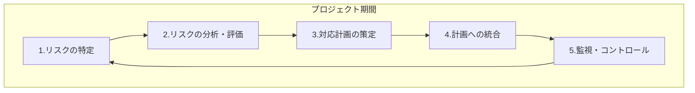

この記事では、システム開発プロジェクトにおけるリスク管理の標準的なプロセスと、その運用に用いる「リスク管理表」の作成方法を定義します。PMBOK®ガイドの知見と実務での経験を元に、日々の業務で実践できる具体的な「型」としてまとめました。

## 1. リスク管理の全体像

リスク管理は、プロジェクトの計画段階から完了まで、継続的に実施する反復的なサイクルです。

### 1.1. プロセスフロー

### 1.2. 各プロセスの説明

| 要素名 | 説明 |
| :--- | :--- |
| 1. リスクの特定 | プロジェクトに影響を与える可能性のあるリスクの洗い出し |
| 2. リスクの分析・評価 | リスクを定量的に評価し「リスクスコア」を算出、対応の優先順位を決定 |
| 3. 対応計画の策定 | 各リスクに対する具体的な対応策の立案（特にリスクスコアの高いもの） |
| 4. 計画への統合 | 対応策をWBSなどのプロジェクト計画へタスクとして反映 |
| 5. 監視・コントロール | 対応策の進捗や新たなリスクの発生を定期的に確認 |

## 2. リスク管理表の運用

リスク管理の中心的なツールとして、「リスク管理表」を使用します。この表は、検討したリスクと対応策のすべてを記録し、抜け漏れを防ぎます。

### 2.1. ツール間の役割分担

リスク管理表は、リスクに関するすべての情報を集約するハブとして機能します。プロジェクト計画（プロダクトバックログやWBS等）は、あくまで個々のタスクを管理するツールと位置づけます。

| ツール名 | 役割 | 管理する情報 |
| :--- | :--- | :--- |
| **リスク管理表** | **リスクに関する情報ハブ** | リスクの特定から定量的評価、対応方針、最新状況までを集約 |
| **プロジェクト計画** | **実行タスクの管理** | リスク対応策として発生した個別のタスクの担当者や期限を管理 |

### 2.2. リスク管理表の構成

| 項目名 | 説明 |
| :--- | :--- |
| **No.** | リスクを識別するための一意の番号 |
| **マイルストーン** | リスクを検討するプロジェクトの区切り |
| **リスクカテゴリ** | リスクの種類（技術的、管理的、外部要因、組織的） |
| **リスク内容** | 発生しうる具体的な問題の内容 |
| **発生確率** | リスクの発生可能性を後述の4段階で評価 |
| **計画への影響度** | 発生した場合の計画(QCDS)への影響を後述の4段階で評価 |
| **価値への影響度** | 発生した場合のビジネス価値への影響を後述の4段階で評価 |
| **リスクスコア** | `発生確率スコア × 計画影響スコア × 価値影響スコア` で算出される数値。このスコアが高いほど対応の優先度が高くなる |
| **発生前の施策種別** | リスクが**現実になる前**に実行する、予防的なアクションの分類。 ・**回避**: リスクの原因そのものを排除する。 ・**予防**: リスクの発生確率を下げる。 |
| **発生後の施策種別** | リスクが**現実になった後**に実行する、事後対応的なアクションの分類。 ・**緩和**: 発生時の影響度を小さくする。 ・**転嫁**: 影響を第三者に移転する（保険など）。 ・**受容**: 影響を受け入れ、特に対策しない。 |
| **具体的な施策内容** | 実行する具体的な対応策の方針 |
| **計画連携** | プロジェクト計画への反映状況（未対応、計画済、不要） |
| **WBS番号 / チケットID** | 計画に反映したタスク番号やチケットID |
| **モニタリング内容** | リスクの兆候を把握するために **「何を」「どのように」** 監視するかの具体的な方法 |
| **モニタリング状況** | モニタリングした結果としての最新の状況や観測値 |

:::message
**なぜ「発生前」「発生後」で施策を分けるのか？**
PMBOK®ガイドではリスク対応を「回避・転嫁・軽減・受容」などに分類しますが、本プロセスでは、**アクションのタイミングを直感的に理解しやすくするため**、意図的に「発生前」と「発生後」の2つの時間軸で施策を分類しています。これにより、「今すぐやるべき予防策」と「起きた時のための備え」を漏れなく、かつ明確に区別して検討することができます。
:::

### 2.3. リスクを洗い出す観点：不確実性の側面

リスクを洗い出す際は、単一の視点ではなく、『プロジェクトマネジメント知識体系ガイド（PMBOK®ガイド）第7版』が示す「不確実性」の側面を参考に、多角的な視点から問いを立てます。**チームでのブレインストーミングや、過去の類似プロジェクトの教訓（Lessons Learned）を参考にすると、より効果的です。**

| 不確実性の側面 | 定義 | 洗い出す際の問いかけ |
| :--- | :--- | :--- |
| **リスク (Risk)** | 発生するかもしれない未来の事象 | 「何が起こるかもしれないか？」 |
| **曖昧さ (Ambiguity)** | 知識や理解が不足している状態 | 「何が分かっていないか？」「何を知らないか？」 |
| **複雑さ (Complexity)** | 多数の要素が相互に依存している状態 | 「何と何が、どう繋がっているか？」「一つの変更が、他にどんな影響を与えるか？」 |

### 2.4. リスクの定量的評価とスコアリング

特定したリスクは、定量的な指標である「リスクスコア」を算出して評価します。これにより、客観的で一貫性のある優先順位付けが可能になります。

#### ステップ1: 評価基準の数値化

「発生確率」と「影響度」を4段階で定義し、それぞれにスコアを割り当てます。

| スコア | 発生確率 | 影響度（計画／価値） |
| :--- | :--- | :--- |
| **4** | **確実** （ほぼ間違いなく発生する） | **致命的** （プロジェクト続行／事業価値に致命的な影響） |
| **3** | **高い** （発生する可能性が十分にある） | **重大** （大幅な見直し／事業価値に重大な影響） |
| **2** | **低い** （発生する可能性はあるが、限定的） | **軽度** （計画／事業価値への影響はあるが、軽度） |
| **1** | **稀** （ほとんど発生しない） | **軽微** （計画／事業価値への影響は無視できるレベル） |

:::message
**なぜ「中」を設けないのか？**
この評価フレームワークでは、意図的に「中くらい」という選択肢を排除しています。評価者が安易に真ん中の選択肢に流れることを防ぎ、「リスクは深刻なのか、それとも軽度なのか」という判断を促すことで、より実態に即したメリハリのある評価を行うことを目的としています。
:::

#### ステップ2: リスクスコアの計算

以下の計算式を用いて、リスクスコア（1点～64点）を算出します。

`リスクスコア = 発生確率スコア × 計画影響スコア × 価値影響スコア`

この計算式は、計画と価値の両方への影響を総合的に評価し、多角的な影響を持つリスクをより重視することを目的としています。

#### 影響度の種類

スコアを算出する際の「影響度」は、以下の2つの側面から評価します。

| 影響度の種類 | 定義 | 評価する内容の例 |
| :--- | :--- | :--- |
| **計画への影響度** | プロジェクトの制約条件（スコープ・コスト・納期・品質）への影響 | スケジュールの遅延、コストの超過、スコープの縮小、品質の低下 |
| **価値への影響度** | プロジェクトが生み出す成果（ビジネス価値）への影響 | 顧客満足度の低下、ブランドイメージの毀損、法規制への違反、将来の拡張性の喪失 |

### 2.5. 運用ワークフロー

1.  **リスクの洗い出し**
    マイルストーンごとに、すべてのリスクカテゴリを検討します。その際、 **「不確実性の側面（2.3節）」** を参考に、多角的な視点でリスクを洗い出します。

2.  **分析とスコアリング**
    特定したリスクごとに「発生確率」「計画への影響度」「価値への影響度」を評価し、**「リスクスコア（2.4節）」** を算出します。

3.  **対応策とモニタリング内容の策定**
    **リスクスコアが高いものから優先的に**、リスクへの対応策を「発生前」「発生後」に分けて検討し、同時に、リスクの兆候を監視するための具体的な「モニタリング内容」を定義します。

4.  **プロジェクト計画への統合**
    対応策の実行が必要な場合は、WBS等へタスクとして登録し、「WBS番号」を転記します。

5.  **定期的なモニタリングと状況の更新**
    定例会議などの場で、「モニタリング内容」に記載された方法でリスクの状況を確認し、その結果を「モニタリング状況」に具体的に記載します。

### 2.6. リスク管理表の記入例

:::message
**記入のポイント**
1つのリスク（No.1）に対して、複数の施策（回避、予防、緩和）が検討されることがあります。その場合は、リスク内容は共通のものとして、施策ごとに行を分けて記述すると管理しやすくなります。
:::

| No. | マイルストーン | リスクカテゴリ | リスク内容 | 発生確率 | 計画への 影響度 | 価値への 影響度 | リスク スコア | 発生前の施策種別 | 発生後の施策種別 | 具体的な施策内容 | 計画連携 | WBS番号 / チケットID | モニタリング内容 | モニタリング状況 |
|:---:|:---|:---|:---|:---:|:---:|:---:|:---:|:---:|:---:|:---|:---:|:---:|:---|:---|
| **1** | **要件定義** | **技術的** | 連携するシステムのAPI仕様が複雑で、データ連携の技術的難易度が想定以上に高い | **3** | **3** | **2** | **18** | 回避 | - | よりシンプルな連携方式（ファイル連携など）を代替案として検討 | 計画済 | 1.2.4 | - | - |
| **"** | **"** | **"** | **"** | **"** | **"** | **"** | **"** | 予防 | - | ・技術調査（PoC）を実施 ・API仕様の確認会を実施 | 計画済 | 1.2.5 | 週次でPoCの課題管理表を確認し、ブロッカー課題の件数を監視 | **要警戒** ブロッカー課題2件を対応中 |
| **"** | **"** | **"** | **"** | **"** | **"** | **"** | **"** | - | 緩和 | データ不整合の検知・修正ツールを事前に開発 | 計画済 | 3.4.2 | - | - |
| 2 | **要件定義** | **管理的** | 特筆すべきリスクなし | - | - | - | - | - | - | - | 不要 | - | - | - |
| 3 | **要件定義** | **外部要因** | 特筆すべきリスクなし | - | - | - | - | - | - | - | 不要 | - | - | - |
| 4 | **要件定義** | **組織的** | 連携するシステムの所管部署間で、責任範囲や業務フローの合意形成が難航する | **3** | **4** | **3** | **36** | 予防 | - | ・関係部署を交えたワークショップを早期に開催 ・プロジェクトオーナーから各部署へ協力を要請 | 計画済 | 1.3.1 | 週次で関係部署との課題リストを確認し、未解決の課題が5件以上滞留していないかを監視 | 順調 |
| **"** | **"** | **"** | **"** | **"** | **"** | **"** | **"** | - | 緩和 | 上位者による裁定プロセスを事前に合意 | 未対応 | - | - | - |

### 2.7. リスク管理表テンプレート

Google Sheetsでテンプレートを用意しています。コピーしてご利用ください。

- [リスク管理表テンプレート](https://docs.google.com/spreadsheets/d/13czQaHvedFXpfjgUPdO44icqP3KMnJpy8yLVANwrqwU/copy)

## 3. PMBOK®ガイド第7版との対比

本ドキュメントで定義したリスク管理プロセスは、『プロジェクトマネジメント知識体系ガイド（PMBOK®ガイド）第7版』が示す原理・原則に基づくフレームワークと整合します。

### 3.1. 本プロセスとPMBOK®第7版の概念の対応

| 本ドキュメントの要素 | PMBOK®ガイド第7版の関連概念 | 解説 |
| :--- | :--- | :--- |
| **リスク管理の全体プロセス** | **パフォーマンス領域：「不確実性」** | 本プロセスは、PMBOK®が定義する「不確実性」パフォーマンス領域における具体的な活動を定義したもの |
| **リスク管理表** | **作成物（Artifact）** | 私たちが定義したこの表は、第7版の柔軟なツールキットの一部である「作成物」そのもの |
| **「不確実性」「価値」の観点** | **原理：「リスク対応の最適化」「価値に焦点を当てる」** | リスクの特定・評価に「不確実性」や「価値」の観点を取り入れたことは、これらの原理を実践するもの |

### 3.2. 本プロセスのスコープ

PMBOK®ガイド第7版は、不確実性を脅威（マイナスのリスク）と好機（プラスのリスク）の両方を含むものとして捉えます。

本ドキュメントで定義した「型」は、プロジェクトを失敗から守ることを主眼とし、**意図的に脅威（マイナスのリスク）の管理にスコープを絞っています。** 好機を最大化する「オポチュニティマネジメント」は、この「型」の応用として、または別のプロセスとして管理することが可能です。例えば、「新技術の登場により、開発効率が予想以上に向上するかもしれない」という好機に対し、「技術調査を行い、導入可能であれば現行の設計を切り替える」といった対応計画を立てることが考えられます。本プロセスは、まずプロジェクトを失敗から守る脅威管理の基礎を固めることを目的としています。

### 3.3. 対比のまとめ

本ドキュメントで定義したリスク管理プロセスとリスク管理表は、PMBOK®ガイド第7版の哲学に基づき、 **「私たちのプロジェクトでは、具体的にどう行動すれば不確実性に対応し、価値を守れるか」** という問いに答えるための一つの実践的な **「型」** です。この「型」は、**プロジェクトの特性**（規模、期間、複雑性など）や**チームの成熟度**に応じて、さらに改善（テーラリング）していくことが可能です。

## 4. まとめ

本記事では、システム開発プロジェクトにおけるリスク管理の具体的なプロセスと、「リスク管理表」という実践的なツールを提案しました。重要なポイントは以下の通りです。

  - **継続的なサイクル**: リスク管理は一度きりではなく、プロジェクトを通じて継続的に行う。
  - **情報のハブ**: 「リスク管理表」に情報を集約し、抜け漏れを防ぐ。
  - **定量的な評価**: リスクを「発生確率」「計画への影響」「価値への影響」から定量的に評価し、「リスクスコア」で優先順位を明確にする。
  - **実践的な「型」**: PMBOK®の考え方を、日々の業務で使える具体的なアクションに落とし込む。

この「型」をベースに、ご自身のプロジェクトに合わせてカスタマイズし、不確実性を乗りこなし、プロジェクトを成功に導く一助となれば幸いです。

この記事が少しでも参考になった、あるいは改善点などがあれば、ぜひリアクションやコメント、SNSでのシェアをいただけると励みになります！
