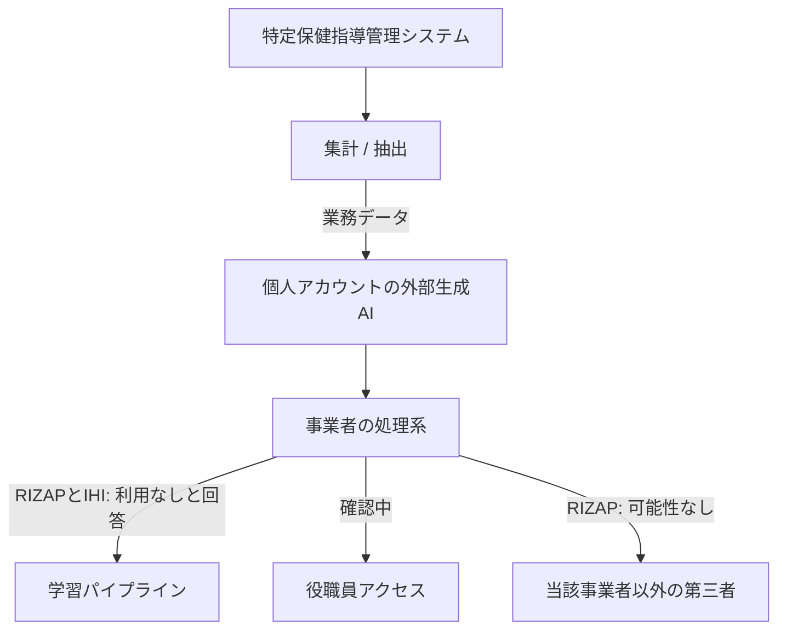
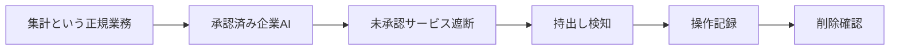

2026年9月3日、RIZAP株式会社は健康経営・保険者事業部の社員が、個人で使う外部生成AIへ特定保健指導対象者の個人情報と要配慮個人情報をアップロードしたと公表しました。
委託元のIHIグループ健康保険組合は前日、加入者210名分であること、判明が自己申告であること、事業者がOpenAIであること、学習への利用はOpenAIが2026年9月1日に否定したことを書いています。
両公式とも、当該事業者の役職員による閲覧は確認中です。

この記事で得られる判断材料は次の3点です。

- 公表されている事実と、人数・発見契機・学習照会の読み分け
- 「モデルが学習したか」ではなく、業務データが個人アカウントへ載った実行経路
- 禁止の再周知だけでは閉じない場合に、承認済み経路と出口遮断を一連で置く設計

結論を先に置きます。
学習照会とチャット削除は、接続が起きたあとの事後措置です。
要配慮を扱う委託業務で生成AIを集計に使うなら、承認済みの企業向けAIを正規経路として置き、未承認サービスへの出口を技術的に絞り、持出しと削除を検証可能にする必要があります。
正規経路の提供は必要条件であり、シャドーを消す十分条件ではありません。

*この記事の全体像。以下、順に解説します。*

## 公表されている事実

RIZAPの一次資料は、行為を「誤ってアップロード」と書きます。
作業は特定保健指導管理システムのデータ集計です。
部署名は健康経営・保険者事業部です。

対象期間は、2026年1月1日から2026年8月19日に当該システムへ登録された特定保健指導対象者データの一部です。
人数の総数は非公表です。

対象データの内訳は次のとおりです。

| 区分 | 項目 |
|---|---|
| 個人情報 | 保険証記号番号、メールアドレス、氏名、生年月日、性別、住所（一部）、電話番号（一部） |
| 要配慮個人情報 | 支援形態（積極的支援、動機付け支援、重症化予防のいずれか）、疾患情報（高血圧症、糖尿病、脂質異常症のいずれか又は複数） |

IHIグループ健康保険組合の一次資料は、2026年8月24日にRIZAPから「漏えいした恐れ」の報告を受けたと書きます。
行為の言い方は「生成AIに参照させた」です。
部署名は特定保健指導運営事務局です。
対象は、2024年度、2025年度、2026年度にRIZAPの特定保健指導を利用した加入者210名です。
この210名がRIZAP全体の上限かは、公式にはありません。

判明の契機は、IHI側の一次では自己申告です。
アップロード日と発見日は非公表です。
技術検知の有無は、公式が沈黙しており、欠如とも存在とも言えません。

RIZAPは個人情報保護委員会への報告を完了したと書きます。
IHIは、個別メールを9月4日から順次配信予定と書いています。
調査時点で、開始済みの一次確認はありません。

両公式は、第三者への確定漏えいを書いていません。
IHIは「恐れ」であり「事実は確認されていない」と書きます。
RIZAPは、当該事業者以外の第三者に閲覧された可能性はない、と書きます。
役職員の閲覧可能性は、両公式とも確認中です。

人数の読み方には注意が要ります。
IHIの210名は、委託元1件の一次です。
RIZAPは提供元を「各団体・企業」と複数形で書きます。
期間（システム登録日）と年度（利用年度）は定義が違います。
2024年度や2025年度の利用者に関するデータが、2026年中に当該システムへ登録または更新されていれば、両立し得ます。
総人数、ファイル形式、アカウントのFree / Plus / Team区分は非公表です。

## 問題の芯は学習ではなく接続

学習の扱いは、両公式で書き方が分かれます。

IHIは、2026年9月1日にOpenAIから「当該データはモデルの学習に利用されていない」との回答を得た、と一次で書きます。
RIZAPは、事業者照会の回答として次の2点を転記します。

1. 個人を特定できる情報が含まれるファイルは、アカウント側で会話データの学習利用が許可されていても、自動システムによりモデルのトレーニングに使われない
2. アップロード後24時間以内にファイルが削除された場合も、モデルのトレーニングには使われない

後者2点は、RIZAP発表内の照会回答です。
OpenAIの公開文書では未照合です。
「学習に使われなかった」は「処理系に入らなかった」と同義ではありません。

OpenAIの公開説明は、プランと保持を分けます。
[Enterprise privacy](https://openai.com/enterprise-privacy/)（Updated 2026-01-08）は、個人プランでは学習がデフォルトオンでオプトアウト可能、企業プランでは学習がデフォルトオフ、と書きます。
削除された会話は、法令上の保持例外を除き30日以内にシステムから除去する、と書きます。
Enterpriseでは、認可従業員がインシデント対応等で会話へアクセスし得ます。
[Privacy Filter](https://openai.com/index/how-chatgpt-protects-privacy/)（2026-05-06）は、学習前に個人情報をマスクする、と説明します。
公開ヘルプは、会話の削除と [Library上のファイル削除](https://help.openai.com/en/articles/20001052) を分けます。

RIZAPの「第三者の質問で出力される可能性はない」は自社判断です。
公開SLAの独立検証ではありません。
チャット削除とLibrary上のファイル削除が同時だったかは、非公表です。

したがって、主害を学習や再出力に置くと、確認中の役職員閲覧と、個人アカウントへ載ったこと自体が見えなくなります。
経路は脆弱性の悪用ではありません。
集計と抽出という業務の過程で、個人アカウントという実行環境にデータが接続しました。
生成AIが集計に必須だったかは、一次にありません。
RIZAP自身が「許諾されていない生成AI」の再周知で、禁止対象のサービスを使ったことを認めています。

社内に承認済み生成AIがあったかは非公表です。
使いにくくて私用に逃げた、は仮説にとどまります。

## 実行経路

経路は「取り出せる」と「個人アカウントに出せる」の積です。

発見は自己申告です。
自己申告は教育の完全失敗ではありません。
技術検知の欠如を、公式の沈黙から断定することもできません。
公表で確認できる発見契機は自己申告のみであり、技術的な可視性は不明です。

Verizonの [2026 Data Breach Investigations Report Executive Summary](https://www.verizon.com/business/resources/executivebriefs/2026-dbir-executive-summary.pdf) は、企業デバイス上の定期AI利用者が15%から45%へ増えたこと、GenAI利用者の67%が非コーポレートアカウントであること、Shadow AIがDLP上の非悪意インサイダーで3位かつ前年比4倍であることを書きます。
日本特化の公的時系列はありません。
禁止だけで減った、という公的統計は見つかりませんでした。
本件は、Samsung型の私用生成AI入力（2023年）から3年後の、日本での公表です。

## 法令上の位置

疾患情報と保健指導は、個人情報保護委員会が列挙する要配慮（病歴、保健指導）と重なります。
要配慮を含む漏えい等「又はそのおそれ」は、規則第7条第1号の報告対象です。
件数1でも対象です。
確証前でも報告し得ます。
PPCへの報告は、確定漏えいの証明ではありません。

個人情報保護委員会の [2023年6月2日注意喚起](https://www.ppc.go.jp/files/pdf/230602_kouhou_houdou.pdf) は、事業者に次を求めています。

1. 利用目的を達成するために必要な範囲内であることを十分に確認する
2. 応答以外の目的（機械学習等）で扱われるなら、学習に利用しないこと等を十分に確認する

これは注意喚起です。
独立の確認義務を新設した文書ではありません。
事後の「学習されなかった」は、入力前にこの確認が行われていたことの裏付けにはなりません。

委託がある場合、原則は委託元と委託先の双方が報告し得ます。
委託先が委託元へ通知すれば、委託先の委員会報告は免除され得ます。

「違法な第三者提供」とは断定しません。
学習未利用が確認された本件では、委託説が対抗軸になります。
PPCは2023年注意喚起で「違反の可能性」までであり、生成AI入力が常に委託だとは書いていません。
個人アカウントの利用規約が委託契約に当たるかは、本件で未公表です。
委託説が通っても、利用目的（法18条）、安全管理（23条）、従業者監督（24条）、委託先監督（25条）は残ります。
外国にある第三者（法28条）への該当は、委託構成か第三者提供かで分かれます。
ここでは断定しません。

人数の確定は、要配慮である以上、報告と本人通知の要否を消しません。
IHI 210名・1従業員の誤操作として閉じる読みは、一次と両立します。
要配慮1件でも報告対象、という点だけは残ります。

## 公式の再発防止は経路を閉じるか

RIZAPの再発防止は3点です。

| 区分 | 内容 |
|---|---|
| 人的措置 | 未許諾生成AIの業務利用禁止の再周知、教育 |
| 技術的措置 | アクセス権限と利用環境の点検・見直し |
| 組織的措置 | ISMSに加え、AIマネジメントシステム（AIMS）導入の検討 |

IHIは、原因究明の指示と、委託先の体制・手順見直しです。
調査時点で、PPC、厚生労働省、経済産業省が本件再発防止を「不足」または「十分」と評価した一次はありません。

人的措置は、今回破られた前提（未許諾サービスの利用）を、同じ種類の手段で繰り返します。
技術は「点検・見直し」であり、未承認SaaSの遮断や持出し検知の実装を書いていません。
AIMSは検討段階です。
RIZAPは「AIマネジメントシステム(AIMS)」とだけ書いており、ISO/IEC 42001と同一視する根拠はありません。
マネジメントシステムの導入は方針と改善サイクルであり、個人アカウント経路の技術的閉鎖そのものではありません。

承認済みAI・DLP・操作記録・削除確認を一連にした記述はありません。

統制を一連にする場合の境界は、次のとおりです。

正規経路の提供は必要条件です。
十分条件ではありません。
Netskope系の観測では、公式提供率が高くても未承認は残ります。
公式側の入力量も増えます。
これはベンダーテレメトリであり、本件の一次ではありません。
「禁止は無意味で技術だけが答え」とも言いません。
公式とPPC注意喚起の主手段は確認と周知です。
一体の技術フローを当局が義務付けた一次はありません。

## 生成AIを使い続ける場合に置く一連

要配慮を扱う委託業務では、個人アカウントへの業務データ接続を、禁止文ではなく実行経路として閉じます。
学習されなかったことを成功条件にしません。

検討し得る選択肢は次の4つです。

| 選択肢 | 経路を閉じるか | 備考 |
|---|---|---|
| A. 禁止再周知と教育 | 今回破られた手段の反復 | RIZAPの人的措置 |
| B. Aに権限点検とAIMS検討を足す | 技術の中身が未詳 | RIZAP公表の一式 |
| C. 承認済み企業AI、未承認出口の縮小、持出し検知、記録、削除確認 | 生成AIを使い続ける場合に経路へ直接効く | 提供は十分条件ではない。非AI集計で閉じる余地は一次で否定されていない |
| D. 生成AI全面禁止 | 個人アカウント経路は閉じ得る | 正規の集計需要を地下に移す可能性。一次は生成AI必須を示していない |

生成AIを当該集計に使い続けるなら、CをBの中身として実装します。
AIMS検討を待ちません。
企業プランを選ぶ理由は、学習デフォルトオフだけではありません。
SSO、保持の管理者制御、契約（DPA）、管理者監査です。
公式AIを配ったあとも、例外経路と公式側の過入力は残ります。
遮断と検知を同時に置きます。
生成AIを使わない社内集計に閉じられるなら、出口遮断を先にしてもよいです。

規模の読み方は、全社一斉導入を本件一次から義務として導かないことです。
IHI 210名・単発誤操作として最小実装に閉じるなら、まず当該業務の端末からコンシューマ生成AIへの通信とファイル送信を止め、集計用の企業ワークスペースを1つ渡します。
要配慮を扱うシステムからの持出しだけは、人数が小さくても優先します。

直近の確認項目は次の4点です。

1. 要配慮を扱う業務について、コンシューマ生成AIへの通信とファイル送信の可否を、端末とプロキシの設定で確認する
2. 集計と抽出ができる正規の企業ワークスペース（学習デフォルトオフ、SSO、保持と監査が契約で読めるもの）を、その業務に先に渡す
3. 削除確認はチャット削除だけでなく、ファイル保管（Library相当）と事業者への削除依頼の記録までを手順にする
4. 委託元向けには、委託先の生成AI利用を「禁止の有無」ではなく「承認済み経路の有無と出口遮断」で監督項目にする

次の場合は、人的ミスの再教育や権限最小化が主因に戻ります。

- 役職員閲覧が「無かった」と一次で確定し、かつ社内に使われる企業AIがあり、未承認出口がすでに閉じられていた場合
- 総件数が極小で、当該社員の権限自体が過剰だった場合
- 監督当局が本件再発防止を十分と評価し、追加技術を求めない場合

それでも委託元（健保）は、法25条の監督を自分の問題として残します。
アップロード日の欠落は、削除SLAの第三者検証を止めます。
承認済みAIの有無は、再発防止を「禁止」から「正規経路」へ移せるかの分岐です。

## まとめ

RIZAPが公表したのは、特定保健指導の業務データが、個人利用の外部生成AIへ載ったことです。
IHIの210名は委託元1件の一次であり、総人数は非公表です。
学習未利用の回答は、処理系への入力そのものを消しません。
役職員閲覧は確認中です。
確定漏えいとは書いていません。

閉じる対象は禁止文ではなく、取り出せることと個人アカウントへ出せることの積です。
再周知とAIMS検討は方針であり、出口遮断ではありません。
生成AIを集計に使い続けるなら、承認済み企業AI、未承認出口の縮小、持出し検知、操作記録、削除確認を一連にします。
使わないで閉じられるなら、出口遮断を先にしてもよいです。
要配慮1件でも報告対象です。
学習されなかったことを、成功条件にしないでください。

この記事が少しでも参考になった、あるいは改善点などがあれば、ぜひリアクションやコメント、SNSでのシェアをいただけると励みになります！

## 参考リンク

- [RIZAP株式会社, 当社における外部生成AIサービスへのお客様情報の誤ったアップロードに関するお詫びとお知らせ（2026-09-03）](https://rizap.co.jp/news/vG81xYj7)
- [IHIグループ健康保険組合, 特定保健指導業務の委託先における生成AI利用に関する事案発生について（2026-09-02）](https://www.ihikenpo.or.jp/asp/news/news.asp?articleid=189769&page=1)
- [個人情報保護委員会, 漏えい等の対応とお役立ち資料](https://www.ppc.go.jp/personalinfo/legal/leakAction/)
- [個人情報保護委員会, 個人情報の保護に関する法律についてのガイドライン（通則編）](https://www.ppc.go.jp/personalinfo/legal/guidelines_tsusoku)
- [個人情報保護委員会, 生成AIサービスの利用に関する注意喚起等について（2023-06-02）](https://www.ppc.go.jp/files/pdf/230602_kouhou_houdou.pdf)
- [OpenAI, Enterprise privacy at OpenAI（Updated 2026-01-08）](https://openai.com/enterprise-privacy/)
- [OpenAI, How ChatGPT learns about the world while protecting privacy（2026-05-06）](https://openai.com/index/how-chatgpt-protects-privacy/)
- [OpenAI, How your data is used to improve model performance](https://openai.com/policies/how-your-data-is-used-to-improve-model-performance/)
- [OpenAI Help, What if I want to keep my history on but disable model training?](https://help.openai.com/articles/8983130-how-does-chatgpt-use-my-data)
- [OpenAI Help, How do I delete files I upload?](https://help.openai.com/articles/8983762-how-do-i-delete-files-i-upload)
- [OpenAI Help, File storage and Library in ChatGPT](https://help.openai.com/en/articles/20001052)
- [Verizon, 2026 Data Breach Investigations Report Executive Summary](https://www.verizon.com/business/resources/executivebriefs/2026-dbir-executive-summary.pdf)
- [CNET Japan, ライザップ、利用者の個人情報を生成AIに誤送信 疾患情報も 同社謝罪（2026-09-04）](https://japan.cnet.com/article/35252303/)
- [Netskope, Netskope AI Report 2026](https://www.netskope.com/resources/threat-labs-reports/netskope-ai-report-2026)
