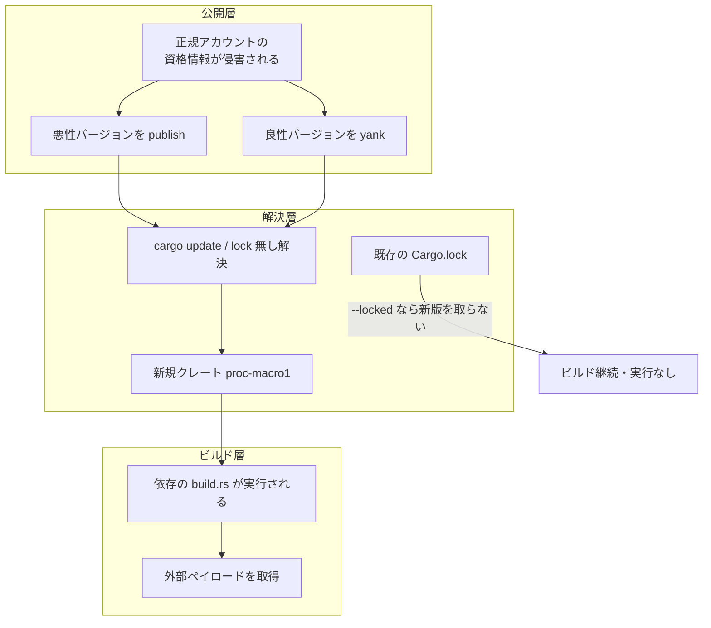
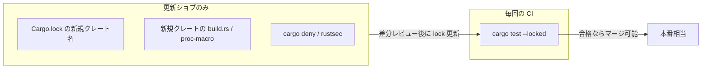

2026-08-20、Rust のパッケージレジストリ crates.io で、正規メンテナのアカウントから悪意あるバージョンが公開される事件が起きました。ライブラリの関数を呼ばなくても、`cargo build` した時点で外部ペイロードを取得する構造です。

この記事では、公式のインシデント報告と RustSec のアドバイザリを追いながら、次の 3 点を整理します。

- 何が起きて、なぜ多くの環境で不発に終わったのか
- 「よさそうに見えて今回は効かない」ゲートはどれか
- 自分の CI にどの順番でゲートを足せばよいか

対象は、Rust でアプリやバイナリをビルドしている開発者と、CI の依存更新フローを設計する立場の方です。前提知識は `Cargo.lock` と `cargo build` の存在を知っている程度で足ります。


*この記事の全体像。以下、順に解説します。*

## 何が起きたのか

攻撃の流れは 3 つの層に分かれます。公開層（誰がどう publish したか）、解決層（消費者側がどのバージョンを選ぶか）、ビルド層（いつコードが動くか）です。



ポイントは、悪意あるコードが人気クレート本体には入っていないことです。侵害されたアカウントから公開された `arrayref` などの新バージョンは、`proc-macro1` という**新規のタイポスクワットクレート**を依存に追加していました。ペイロードはそちらの `build.rs` にあります。

[Cargo の build script](https://doc.rust-lang.org/cargo/reference/build-scripts.html) は、依存パッケージのコンパイル直前に任意のコードを実行します。サンドボックスはありません。つまり `cargo build`、`cargo check`、`cargo test` のいずれかを叩いた時点で発火します。ライブラリの API を呼ぶ必要はありません。

### 公式タイムライン

[Rust Security Response の報告](https://blog.rust-lang.org/2026/08/20/supply-chain-attack-on-arrayref/)による、悪性バージョンがオンラインだった時間です（UTC）。

| パッケージ | 公開 | 削除 | オンライン |
|---|---|---|---|
| arrayref@0.3.10 | 07:15:00 | 08:41:40 | 86 分 |
| internment@0.8.7 | 07:34:07 | 09:04:11 | 90 分 |
| append-only-vec@0.1.9 | 07:37:49 | 09:25:24 | 107 分 |

チームは同一著者の 3 クレートを処置し、攻撃者による悪意ある yank を戻し、アカウントをロックしました。発見は Nextron Systems GmbH です。公式は著者本人の悪意を否定し、マシンまたは資格情報の侵害と推定しています。

2026-08-24 時点で crates.io API を User-Agent 付きで叩くと、`arrayref` の `max_version` は 0.3.9 に戻っており、0.3.10 は versions リストに存在しません。

### 実行時の挙動

発見者である Nextron の IOC gist によると、`proc-macro1` 1.0.107 と `proc-macro-en` 1.0.10 の `build.rs` はバイト同一でした。TLS 証明書検証を無効化してペイロードを取得し、初期 C2 は `23.254.165.112:443` です。

観測された Windows 段は Chromium の `origin_url` と `username_value` を読み出します。ただし静的解析されたのは Windows 段のみで、Linux / macOS 段はハッシュのみの確認です。`password_value` の直接抽出は観測されていません。後続の PowerShell は任意コードのため、確定的な影響範囲は「取得できた」以上には言えません。

### アドバイザリの範囲

| ID | 影響バージョン | 状態 |
|---|---|---|
| CVE-2026-77651 | arrayref 0.3.10 のみ（`defaultStatus: unaffected`） | NVD 収録。MITRE CVSS 3.1 で 9.8。NVD 独自スコアは未提供。CISA-ADP の SSVC は exploitation: none |
| CVE-2026-77650 | append-only-vec 0.1.9 のみ | 同上 |
| RUSTSEC-2026-0260 | arrayref 0.3.10（`<=0.3.9` は unaffected） | patched 版なし。悪性版のダウンロード 2,285 回 |
| RUSTSEC-2026-0262 / 0266 | append-only-vec 0.1.9 / internment 0.8.7 | internment 側の NVD CVE は未確認 |

なお MITRE の CVSS ベクトルは `UI:N`（利用者操作なし）です。[FIRST の CVSS v3.1 仕様](https://www.first.org/cvss/v3-1/specification-document)は、利用者または利用者が起動したプロセスの参加が必要な場合を `UI:R` とし、管理者によるアプリ導入を例に挙げています。「コンパイルの実行」を利用者操作と読むなら `UI:N` には再検討の余地がある、という解釈が成り立ちます。スコアを鵜呑みにせず、自分の運用に当てはめて読むところです。

## なぜ多くの環境で不発だったのか

RustSec のアドバイザリは、悪性版のダウンロードが 2,285 回で全トラフィックの 10% 未満にとどまった理由を、**大半の利用者が古いバージョンを lockfile に持っていたため**と説明しています。初版では「使用の証拠なし」と書かれ、2026-08-21 に改訂されました。

`Cargo.lock` があり、CI が既存の解決を維持している限り、公開されて 86 分で消えたバージョンには到達しません。逆に言えば、露出したのは次のいずれかの経路です。

- `cargo update` を回した
- lockfile をコミットしていない、または `cargo install` を `--locked` なしで実行した
- yank 警告を見て「更新しよう」と判断した

3 つ目は見落としやすい経路です。攻撃者は正規アカウントを握っているので、**良性バージョンを yank することもできます**。yank は既存の lockfile を壊しませんが、新規解決からは外れます。良性版が yank されると、更新経路が悪性版のほうへ寄ります。実際、`rustsec/advisory-db` の issue #3161 では、報告者が「yank 警告が誘導であり、それでヒットした」と述べています（issue 自体は closed as not planned）。

ここから引ける線は、次の一文です。

> **本番ビルドは lock を動かさない。動かすジョブだけをレビュー対象にする。**



## 「効きそうに見えて今回は効かない」ゲート

供給網攻撃の話題では、いくつかの対策が定番として挙がります。今回のメカニズムに照らすと、効くものと沈黙するものがはっきり分かれます。

| 候補 | 今回を止められたか | 判断 |
|---|---|---|
| 本番 `--locked` | **はい**。新バージョンを解決しない | 最小コストで最初に入れる |
| lock 差分の新規クレート名チェック | **はい**。`proc-macro1` が lock に現れる | 更新 PR の機械チェックとして入れる |
| 親クレートの所有者変更の検知 | **いいえ**。所有者は変わっていない | event-stream 型には効く。今回型の必須ゲートにはしない |
| 親クレートに `build.rs` が生えたかの検知 | **いいえ**。生えたのは依存側 | グラフ全体の新規クレートを見るなら効く |
| ビルド時のネットワーク遮断 | このペイロードの C2 は止めうる | `-sys` 系のシステムライブラリ探索と衝突する |
| 再現可能ビルド | **いいえ**。コンパイル時の副作用は成果物ハッシュに乗らない | 別の問題を解く道具 |

所有者変更の検知は直感的で人気がありますが、今回は**同一所有者のアカウントが侵害された**ので沈黙します。owners は認可の話であり、resolver の入力ではありません。

`build.rs` の監視も、監視対象を「親クレート」に置くと沈黙します。悪性の `build.rs` はタイポスクワット側にありました。効かせたいなら、依存グラフ全体で「新しくコンパイル時実行を持ち込んだクレート」を見る必要があります。

ビルド時のネットワーク遮断については、Rust Internals の "Build security" スレッドで、kornel 氏が「システムライブラリ探索のため build.rs のサンドボックス化は hopeless」と評価しています。epage 氏も実装コストと不完全性を指摘します。ただし同じスレッドでサンドボックス実験自体も語られており、「不可能なので禁止」とまでは読めません。すでに hermetic なビルド環境を持っているチームが次段として足すのが妥当な位置づけです。

## Cargo と crates.io が公式に提供する制御

| 制御 | 今回クラスへの効き | 限界 |
|---|---|---|
| `Cargo.lock` + `--locked` / `--frozen` | 既存解決を維持する | `cargo update` と lock 無しの `cargo install` は別経路 |
| yank | 新規解決から悪性版を外す | 既存 lock と直接ダウンロードは止まらない。攻撃者も yank できる |
| `net.offline` / `--offline` | Cargo の index / crate 取得を止める | build.rs プロセスの通信遮断としては文書化されていない |
| `package.build = false` | 自パッケージの build.rs を消せる | 依存の build.rs は消えない |
| `links` override | `links` 付きなら build.rs を走らせない | `links` 無しのタイポスクワットには無効 |
| `cargo vendor` | 取得済みソースでビルドできる | checksum は改ざん検知であり悪意ある正規版への防御ではない |
| Trusted Publishing Only Mode | 漏洩した API token からの publish を止める | 正規 workflow 自体が侵害されると残る |
| index の `pubtime` | 将来の cooldown 機能の材料 | Cargo 側の実装時期は未定 |

`--offline` については誤解しやすいので補足します。これは **Cargo 自身がネットワークへ出ない**設定であり、build.rs が起動したプロセスの通信を OS レベルで遮断する機能としては公式に文書化されていません。「offline にしたから build.rs も通信できない」と読むのは危険です。

補助ツールとしては [cargo-deny の `[bans.build]`](https://embarkstudios.github.io/cargo-deny/checks/bans/cfg.html) が、build.rs の許可リストと同梱バイナリの検出を提供します。ただし公式ドキュメント自身が「能動的な悪意コードから守るものではない」と明記しています。`include!()` の差し替えや、素の Rust コードによる外部通信は検出できません。

## 自分の CI に何を置くか

優先順位をつけて 5 段階で示します。上から順に、コストが低く効果が確実です。

### 1. 本番ビルドの既定を `--locked` にする

アプリやバイナリの CI で最初にやることです。`cargo test --locked` にすると、`Cargo.lock` と実際の解決が一致しない場合にビルドが失敗します。vendor 済みなら `--frozen` を使います。

```yaml
# GitHub Actions の例
- name: Test
  run: cargo test --locked --all-features
```

[Cargo Book の Continuous Integration の章](https://doc.rust-lang.org/cargo/guide/continuous-integration.html)には、最新の依存でのビルドを別ジョブに分ける例が載っています。「毎回のビルドは固定、最新追従は別ジョブ」という形が公式の推奨線です。

注意点として、`--locked` は「依存集合の固定」であり、ビットレベルの再現性ではありません。同じ lock でもコンパイラのバージョンや環境で成果物は変わります。

### 2. 依存更新を別ジョブに分け、lock 差分をレビューする

Dependabot、Renovate、AI による依存更新は、本番 CI と同じ扱いにしません。更新 PR に対して、`Cargo.lock` の差分から次の 2 つを機械抽出し、人間のレビュー対象にします。

- **新規に現れたパッケージ名**（今回なら `proc-macro1`）
- **新規に依存グラフへ入った `build.rs` / proc-macro クレート**

前者は誤検知が出ますが、その誤検知の中身は「新しい正規依存が増えた」というレビューすべき事実です。パッチバージョンの更新のつもりが未知のクレートを引き込んでいたら、それは止めるべき差分です。

依存グラフ上でコンパイル時に実行されるクレートは、`cargo tree` などで洗い出せます。

```bash
# ビルド時に実行される依存を列挙する（build-dependencies と proc-macro）
cargo tree --locked -e build,normal --prefix depth
```

親クレートの owners 比較は、やるなら補助信号にとどめます。今回のように沈黙するケースがあるためです。

### 3. 公開する側は Trusted Publishing Only Mode にする

自分でクレートを公開しているなら、crates.io の Trusted Publishing Only Mode を有効にします。これで漏洩した API token からの publish を止められます。漏洩が疑われる token は即座に revoke します。

yank を資格情報漏洩への対策として使わないことも重要です。yank は既存 lockfile を保護しませんし、攻撃者も yank を実行できます。

なお [RFC 3691](https://rust-lang.github.io/rfcs/3691-trusted-publishing-cratesio.html) 自身が、Trusted Publishing を導入しても正規 workflow が侵害される経路は残ると述べています。公開側の対策は消費側のゲートを不要にしません。

### 4. 侵害の有無を一度だけ確認する

公式ブログは、ローカルキャッシュの確認手順を提示しています。開発機と CI のキャッシュに対して一度実行します。

```bash
find ~/.cargo/registry/cache -name 'arrayref-0.3.10*' \
  -o -name 'internment-0.8.7*' \
  -o -name 'append-only-vec-0.1.9*' \
  -o -name 'proc-macro1-*' \
  -o -name 'proc-macro-en-*'
```

ここで大事なのは、**ヒットは「pull された」証拠であり、build.rs が実行された証明ではない**という点です。ダウンロードだけしてビルドしていない状態はあり得ます。

ヒットしたら、続けて次を確認します。

1. `Cargo.lock` に該当バージョンが記録されているか
2. `target/*/build` に該当クレートのビルド出力があるか
3. インシデント時間帯のプロセス実行・外向き通信の記録と IOC の照合

ビルドされた形跡、または実行時の IOC があれば、Nextron が示す IR の流れ（隔離、C2 遮断、成果物の信頼境界の切り直し）へ進みます。キャッシュヒットの時点で予防的に隔離する運用も合理的ですが、その場合は「実行を確認したから」ではなく「予防だから」と記録に明記します。後から判断を追跡できなくなるためです。

### 5. ネットワーク遮断と再現可能ビルドは次段に置く

ビルド時のネットワーク遮断と再現可能ビルドは、すでに hermetic なビルド環境を持っているチームが次に足す施策です。汎用のアプリ CI に必須ゲートとして入れると、`-sys` 系クレートのシステムライブラリ探索と衝突して運用が壊れます。

### 逆転条件

上の優先順位が変わるケースが 2 つあります。

- **lockfile をコミットしていない場合**。ライブラリ開発では意図的にそうすることがあります。その場合、更新ジョブが実質的に毎回の解決になるため、2 番目のゲートの重みが上がります。
- **`cargo install` を `--locked` なしで開発者マシンに流している場合**。CI をいくら固めても、この経路は素通りします。

## わかっていないこと

断定を避けるべき点を明示しておきます。

- 2,285 は**ダウンロード数**であり、build.rs の実行数でも C2 到達数でもありません。
- internment に対応する NVD の CVE は確認できていません。RUSTSEC-2026-0266 のみです。
- 攻撃者の帰属（DPRK / Sapphire Sleet などの指摘）は二次情報です。公式ブログは帰属していません。
- 秒単位の yank バーストに関する報告は crates.io の audit log に基づくと主張されていますが、レジストリの audit ログを一次取得しての確認はしていません。
- 正規 workflow を経由した Trusted Publishing の侵害が実際に起きたかは、この事件では未公開です。
- crates.io が `pubtime` による cooldown を Cargo に実装する時期は未定です。

## まとめ

- 今回の攻撃は、正規アカウントの侵害 → 新規タイポスクワット依存の追加 → その `build.rs` によるビルド時実行、という経路をたどりました。ライブラリの関数を呼ぶ必要はありません。
- 被害が広がらなかった主因は、多くの利用者が古いバージョンを lockfile に持っていたことです。RustSec がそう記録しています。
- 「lock だけでは防げない」は**更新した瞬間について**正しく、毎回のビルドについては正しくありません。ゲートを置く場所は「毎回の build」ではなく「lock を変えるジョブ」です。
- 所有者変更の検知、親クレートの `build.rs` 監視、再現可能ビルドは、今回のメカニズムでは沈黙します。定番だからという理由で必須ゲートに昇格させないほうがよいです。
- 実務的な処方箋は 3 段です。本番 `--locked`、更新ジョブでの新規クレート名と新規コンパイル時実行クレートのレビュー、公開側の Trusted Publishing Only Mode。

対策の一覧を長くするほど安全になるわけではありません。攻撃のメカニズムと、それぞれのゲートが観測している対象を突き合わせて、沈黙するゲートを見分けるところが判断の分かれ目です。

この記事が少しでも参考になった、あるいは改善点などがあれば、ぜひリアクションやコメント、SNSでのシェアをいただけると励みになります！

## 参考リンク

1. Rust Security Response, *Supply chain attack on arrayref*, 2026-08-20. https://blog.rust-lang.org/2026/08/20/supply-chain-attack-on-arrayref/
2. NVD CVE-2026-77651. https://nvd.nist.gov/vuln/detail/CVE-2026-77651
3. NVD CVE-2026-77650. https://nvd.nist.gov/vuln/detail/CVE-2026-77650
4. RUSTSEC-2026-0260. https://rustsec.org/advisories/RUSTSEC-2026-0260.html
5. RUSTSEC-2026-0262. https://rustsec.org/advisories/RUSTSEC-2026-0262.html
6. RUSTSEC-2026-0266. https://rustsec.org/advisories/RUSTSEC-2026-0266.html
7. rustsec/advisory-db issue #3161. https://github.com/rustsec/advisory-db/issues/3161
8. Nextron gist (IOCs). https://gist.github.com/marius-benthin/273aa302ac9fb36e1c309a9479c5a8cf
9. Cargo Book, *Build Scripts*. https://doc.rust-lang.org/cargo/reference/build-scripts.html
10. cargo-yank(1). https://doc.rust-lang.org/cargo/commands/cargo-yank.html
11. Cargo Book, *Configuration* (`net.offline`). https://doc.rust-lang.org/cargo/reference/config.html
12. Cargo Book, *Continuous Integration*. https://doc.rust-lang.org/cargo/guide/continuous-integration.html
13. Cargo Book, *Source Replacement*. https://doc.rust-lang.org/cargo/reference/source-replacement.html
14. cargo-vendor(1). https://doc.rust-lang.org/cargo/commands/cargo-vendor.html
15. crates.io development update, 2026-01-21. https://blog.rust-lang.org/2026/01/21/crates-io-development-update/
16. RFC 3691 Trusted Publishing. https://rust-lang.github.io/rfcs/3691-trusted-publishing-cratesio.html
17. cargo-deny `bans.build`. https://embarkstudios.github.io/cargo-deny/checks/bans/cfg.html
18. Rust Internals, *Build security*. https://internals.rust-lang.org/t/build-security/24166
19. crates.io API, `arrayref`. https://crates.io/api/v1/crates/arrayref
20. FIRST, *CVSS v3.1 Specification*. https://www.first.org/cvss/v3-1/specification-document
