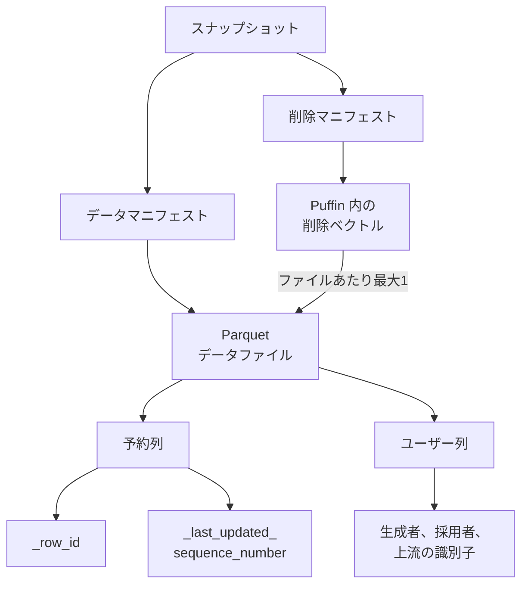

Amazon S3 Tables は、Apache Iceberg の表を置くストレージです。2026年9月30日の AWS News Blog は、S3 Tables が Iceberg V3 のデータ型に加え、削除ベクトル、行系譜、新しいデータ型を扱えると告知しました。この記事では、行系譜の予約列、削除ベクトル、列既定値が表のどこに載るか、V2 から上げたときの過去行の読まれ方、エンジンごとの境界を、2026年10月3日時点の S3 ユーザガイドと Apache Iceberg の spec に沿って整理します。基準にした spec は、同日に取得した main ブランチの `format/spec.md` です。リリースタグとの差は照合していません。


*この記事の全体像。以下、順に解説します。*

## Amazon S3 Tables の Iceberg V3 とは

Apache Iceberg V3 は、表形式の版です。S3 ユーザガイド「Working with Apache Iceberg V3」は、S3 Tables で次を扱えると書いています。削除ベクトル、行系譜、列既定値、そして variant、geometry、geography、unknown、ナノ秒の timestamp と timestamptz です。News Blog の `article:published_time` は `2026-09-30T15:10:00-07:00` で、著者は Daniel Abib です。

V3 の表は、テーブルプロパティ `format-version` を `3` にして作ります。2026年10月3日に確認したユーザガイドの Spark SQL は、次の形です。

```sql
CREATE TABLE IF NOT EXISTS myns.orders_v3 (
  order_id bigint,
  customer_id string,
  order_date date,
  total_amount decimal(10,2),
  status string,
  created_at timestamp
)
USING iceberg
TBLPROPERTIES (
  'format-version' = '3'
)
```

既存の V2 表は、データファイルを書き換えずに `format-version` を `3` へ上げられます。ユーザガイドの Spark SQL は次です。

```sql
ALTER TABLE myns.existing_table
SET TBLPROPERTIES ('format-version' = '3')
```

上げる操作はメタデータです。新しいスナップショットが作られ、既存の Parquet データファイルは再利用されます。行系譜のフィールドは表のメタデータに足されます。ユーザガイドは、この操作が行系譜の変更履歴を過去へ backfill しない、と書いています。News Blog は、最初のデータ変更で行系譜フィールドを初期化する、と書いています。

### 削除ベクトル

削除ベクトルは、V2 の position delete file に代わる削除の記録です。中身は、データファイルの中の削除位置を示すビットマップです。格納先は Puffin の `deletion-vector-v1` です。1 つのスナップショットの中では、データファイルあたり最大 1 個です。複数のベクトルを 1 つの Puffin に入れることは許されます。

データファイル自体は、ベクトルが付いた瞬間には消えません。ファイルは一度書くと、消されるまで不変です。生きているスナップショットは、データファイルと、そのファイル向けの削除ベクトルを指します。読取時に、ベクトルの位置がマスクされます。

Spark で削除、更新、マージを削除ベクトルにするには、書き込みモードを merge-on-read にします。ユーザガイドは、次のプロパティをまとめて置く例を出しています。

```sql
ALTER TABLE myns.orders_v3
SET TBLPROPERTIES (
  'format-version' = '3',
  'write.delete.mode' = 'merge-on-read',
  'write.update.mode' = 'merge-on-read',
  'write.merge.mode' = 'merge-on-read'
)
```

`write.delete.mode`、`write.update.mode`、`write.merge.mode` の 3 つが、削除、更新、マージのモードです。

### 行系譜の予約列

行系譜が足す予約列は 2 つです。

| 列 | 型の位置づけ | 読める内容 |
|---|---|---|
| `_row_id` | 表の中で一意な long | その行が表の中のどの識別子か |
| `_last_updated_sequence_number` | コミットの sequence number | その行を最後に更新したコミットはどれか |

値は、コミットが成功したあとの読取時に継承されます。人が読む出自、たとえば生成者、採用者、上流の識別子は、予約列とは別のユーザー列です。

`_row_id` が null で、データファイルに `first_row_id` がある行は、`first_row_id` に行位置 `_pos` を足した値として読まれます。`first_row_id` も null なら、`_row_id` は null のままです。新しい行だけのファイルは、この 2 列を省略してよい、と spec は定義します。省略された列は、null が入っているものとして読まれます。

同一コミットの行は、同じ sequence number を共有します。1 つの番号は、そのコミットを指します。

### 列既定値

列既定値は 2 種類です。

`initial-default` は、列を足す前に書かれた行へ、読取時に補う値です。データファイルは書き換えません。ユーザガイドは、次の追加を、既存行の読取結果が USD になる例として書いています。格納先は schema の `initial-default` です。

```sql
ALTER TABLE myns.orders
ADD COLUMN currency string DEFAULT 'USD'
```

`write-default` は、ライターが値を受け取らなかったときに、データファイルへ書く値です。spec は、既知の列をデータファイルから省略することを禁止します。必須列で write default が無いとき、ライターは失敗します。

`unknown`、`variant`、`geometry`、`geography` は、非 null の `initial-default` も `write-default` も無効です。unknown は optional で、常に null として読め、データファイルには書きません。あとから具体的な型へ進化させるための仮の列です。

列既定値は、S3 ユーザガイド上、S3 Tables、AWS Glue 5.1 以降、Amazon Redshift で使えます。

### 新しいデータ型

ユーザガイドが挙げる V3 の型は次です。

- variant。スキーマを先に固定せず、JSON のような半構造化データを書きます。
- geometry。平面上の点、線、多角形です。
- geography。回転楕円体上の座標です。
- unknown。型が未確定の列です。
- ナノ秒の timestamp と timestamptz。`timestamp(9)` と `timestamptz(9)` です。

geometry と geography は、SRID 0 と SRID 4326 を認識します。S3 ユーザガイドは、これらの型を Parquet の表に限ります。ORC と Avro の表では使えません。

Spark で geometry と geography を使うときは、`spark.sql.geospatial.enabled=true` を Spark の設定に置きます。AWS Glue では、ジョブの `--conf` で同じ設定を渡します。variant、unknown、ナノ秒タイムスタンプ、列既定値は、ユーザガイド上、追加の Spark 設定は不要です。

### コンパクション

S3 Tables のコンパクションは、既定で有効です。ユーザガイドは、V3 の削除ベクトルを扱い、行系譜のメタデータを保つ、と書いています。News Blog も同じ趣旨です。variant 列のメンテナンスも、コンパクションを含めて S3 Tables 側で続きます。

### スナップショットから列までのつながり

生きているスナップショットは、データマニフェストと削除マニフェストを指します。データマニフェストの先が Parquet データファイル、削除マニフェストの先が Puffin の中の削除ベクトルです。ベクトルは、そのスナップショットの中で、対象ファイルあたり最大 1 個です。ファイルの中では、予約列とユーザー列が並びます。



## 注意点

告知文と、仕様および S3 ユーザガイドは、単位と範囲がずれている箇所があります。ここからの操作境界は、ユーザガイドと、2026年10月3日に取得した Iceberg spec の main を狭い方として読んでください。

### 削除の件数とファイルの単位

News Blog は、2 億行の表から 5 万行を消すと、数千の小さい delete ではなく 1 個の deletion vector file になる、と書いています。割合の計測表は付いていません。spec の単位は DELETE 文ではなく、スナップショットの中のデータファイルです。5 万行が複数ファイルに散らばれば、ベクトルは最大でそのファイル数だけ要ります。1 回の削除を必ず 1 ファイルにまとめる要求は、spec にはありません。

### リージョンとエンジンの下限

News Blog の Now available は、S3 Tables がある全リージョンで全 V3 データ型、と書いています。同じ時期のユーザガイドの Availability は、variant だけを 15 リージョンに限っています。US East (N. Virginia)、US East (Ohio)、US West (Oregon)、Asia Pacific (Mumbai)、Asia Pacific (Seoul)、Asia Pacific (Singapore)、Asia Pacific (Sydney)、Asia Pacific (Tokyo)、Canada (Central)、Europe (Frankfurt)、Europe (Ireland)、Europe (London)、Europe (Paris)、Europe (Stockholm)、South America (São Paulo) です。削除ベクトル、行系譜、列既定値、geometry、geography、unknown、ナノ秒タイムスタンプは、ユーザガイド上、S3 Tables があるリージョンに沿う書き方です。どちらが現行の製品境界かは、2026年10月3日時点のこの 2 資料だけでは確定しません。

エンジンの下限も、一次資料同士で違います。ユーザガイドの表では、V3 一般が Amazon EMR 7.12 以降と AWS Glue ETL 5.1 以降、variant が EMR 8.0 以降と Glue 6.0 以降です。News Blog は、variant、ナノ秒、geometry、geography、unknown に Spark 4.0 以降、例として Glue 6.0 以降または EMR 8.1 以降、と書いています。EMR の variant 下限は 8.0 と 8.1 が並びます。実装のどちらが正しいかは、この 2 資料だけでは決まりません。

### 既存リーダーと料金

News Blog は、上げたあとも既存の V2 リーダーが動く、と書いています。ユーザガイドは、上げる前に読み書きする全エンジンが V3 をサポートすることを確認する、と書き、Amazon Athena は V3 を読めない、と名指ししています。spec は、表の format version が実装の対応版より高いときは例外にする、と要求します。ブログの文を、Athena を含む全リーダーの保証には使えません。

「追加料金なし」は News Blog の文です。ユーザガイドの Pricing 節は料金ページへのリンクだけで、V3 の追加料金が有るとも無いとも書いていません。2026年10月3日に取得した S3 料金ページの HTML には、解決済みのドル単価が無く、V3 専用の料金行もありませんでした。単位は、ストレージの per GB、リクエストの per 1,000 requests、オブジェクト監視の per 1,000 objects、コンパクションの per 1,000 objects と per GB です。

### variant の shredding

S3 のコンパクションは、shredded variant の Parquet を既定で書きます。無効化のプロパティ名は、ユーザガイドでは `write.variant.shredding.enabled=false` です。Iceberg main の `TableProperties.java` は別名 `write.parquet.shred-variants` で、既定は false です。`spec.md` にはどちらの名前もありません。同じ既定とは扱えません。shredding を知らないリーダーは、コンパクション後のファイルを読めないことがある、とユーザガイドは書いています。`write.variant.shredding.enabled` を、S3 のコンパクション以外の Spark ライターが読むかは、spec に名前が無いため、ここでは確定しません。

### 予約列と削除ベクトルが持つもの

予約列が答える問いは 2 つです。この行は表の中でどの long か。最後に変えたコミットはどの sequence number か。生成者、採用した人、元データの識別子は、この 2 列の外です。削除ベクトルが持つのは削除位置のビットマップです。削除者、削除理由、削除前の列値は持ちません。

削除ベクトルの書き込みが、コンパクションの無い高頻度 MERGE でもメモリを頭打ちにする、とまでは読めません。Apache Iceberg 1.11.0 と Spark 4.0.2 の報告が 1 件あります。台帳の定義を覆す不具合としては扱いません。

| 項目 | 内容 |
|---|---|
| 識別子 | apache/iceberg#17241 |
| 状態 | open（2026年10月3日に GitHub API で確認。作成は 2026-07-16） |
| URL | https://github.com/apache/iceberg/issues/17241 |
| 症状 | 報告者は、format-version 3 の merge-on-read へ継続的な MERGE を流すと、executor が exit 137 で落ちる、と書いています。同じ条件の V2 は安定、とも書いています。コンパクションはありません。原因の説明は、報告者自身が未検討の仮説だと注記しています |

この報告が弱めるのは、「削除ベクトルの書き込みは、コンパクションが追いつかない高頻度 MERGE でもメモリが頭打ちになる」という読みです。S3 Tables のコンパクションは既定で有効なので、同じ条件の再現ではありません。

2026年10月3日の NVD keywordSearch `Apache Iceberg deletion vector` は totalResults 0 でした。この検索語で番号は確認できませんでした。Iceberg 全体の CVE を網羅した検索ではありません。

### 資料が閉じていない境界

次は、2026年10月3日時点で資料が閉じていません。

- variant の提供リージョンは、ユーザガイドの 15 リージョンか、News Blog の「S3 Tables がある全リージョン」か。
- variant の EMR 下限は 8.0 か 8.1 か。
- Iceberg spec V3 の table encryption keys を、S3 Tables がカタログメタデータとして扱うか。今回参照した V3 ページの機能列挙にはありません。S3 Tables の SSE-KMS は別機能です。非対応とは書いてありません。
- spec は main の先端です。採択済みリリースの spec との差は、タグを切って照合していません。

## 行を識別する列と人が読む列

予約列は、表の中の long と、最後のコミット番号です。生成者、採用した人、元データの識別子は、ユーザー列に書きます。例は `generated_by`、`adopted_by`、`source_row_key` です。これらを `_row_id` へ詰めません。同一コミットの行は同じ sequence number を共有するので、1 つの番号から複数の書き手は分かれません。

`_row_id` は、1 つの表の中の割当です。ブランチを使うと、同じデータファイルに別の `first_row_id` が付き得ます。一意性は表の中であり、表をまたぎません。

ID が残らない更新があります。

- equality delete 経由の更新は、既存行の除去と新しい行の追加として扱います。元の `_row_id` は残りません。equality delete の新規作成を禁止するのは、まだ正式採択されていない V4 です。V3 では書けます。
- エンジンは、更新を「行の修正」としても「削除して追加」としてもよい、と spec は許容します。後者では元の ID は残りません。
- Amazon Redshift は、equality delete を含む V3 表を使えません。行系譜の列は `SELECT *` に出ません。列名を明示します。

Redshift のページは、次の形で列を名指しします。2026年10月3日に確認した文面です。

```sql
SELECT _row_id, _last_updated_sequence_number, *
FROM my_schema.my_iceberg_v3_table
```

更新を、行 ID を保つ修正として書くか、削除して追加し直す MERGE として書くかで、台帳に残る ID が決まります。後者は、元の ID が消える前提です。Redshift で読む表には、equality delete を残しません。

## 削除した行を読める期間

現行スナップショットでは、削除位置はデータファイルあたり 1 個のビットマップでマスクされます。削除前の列値はベクトルにありません。消す前の行を読むには、消す前のスナップショットへの time travel が要ります。

追える期間は、スナップショット保持と、その後のファイル削除で決まります。削除ベクトル専用の寿命は、spec にも S3 ユーザガイドの V3 ページにもありません。

S3 Tables の既定は、2026年10月3日に取得したメンテナンスの考慮事項では次です。

| 設定 | 既定 | 最小 | どこで変えるか |
|---|---|---|---|
| コンパクションの targetFileSizeMB | 512MB | 64MB。上限も 512MB | テーブル。PutTableMaintenanceConfiguration |
| minimumSnapshots | 1 | 1 | テーブル。同上 |
| maximumSnapshotAge | 120 時間 | 1 時間 | テーブル。同上 |
| unreferencedDays | 3 日 | 1 日 | テーブルバケット |
| nonCurrentDays | 10 日 | 1 日 | テーブルバケット |

コンパクションは、行レベルの削除を適用してファイルを書き換えます。スナップショットが期限切れになり、オブジェクトへの最後の参照が外れると、S3 はそのオブジェクトを noncurrent にします。`nonCurrentDays` のあと恒久削除します。バケットメンテナンスのページは、noncurrent の削除は復元できない、と書いています。復元には AWS Support への連絡が要る、とも書いています。

したがって、保持の文は「削除ベクトルが残るので消した行を追える」にはなりません。書くなら次です。

- 現行スナップショットの削除位置は、ビットマップでマスクされます。削除前の値はベクトルにありません。
- 既定では、スナップショットは最大 120 時間、かつ最低 1 個まで残ります。この既定では、削除前の行は長く残りません。
- 監査で削除前のバイトが要るなら、`maximumSnapshotAge` をその期間まで延ばします。Iceberg のテーブルプロパティへ書いた保持は、S3 のスナップショット管理が読みません。長い保持を `metadata.json` や `ALTER TABLE SET TBLPROPERTIES` に書くと、S3 のスナップショット管理は無効になり、自分で消すまで残ります。
- V2 から上げた直後の position delete file は、そのデータファイル向けの削除ベクトルへマージされるまでメタデータに残ります。V3 では、新しい position delete file は足せません。

自分が作った表のレコード期限機能は使えません。レコード期限は、S3 Storage Lens と SageMaker Catalog の AWS 管理表など、限られた表だけです。ユーザガイドは、自分で作った S3 表にはレコード期限が無い、と書いています。

削除ベクトルは、監査ログの代わりにはなりません。保持期間は、スナップショットの `maximumSnapshotAge` と `minimumSnapshots` で書きます。

## V2 から上げた表の過去の行

「系譜が空の過去行を不明のまま残す」か「移行日で切る」かは、現行スナップショットでは選べません。

spec は、V3 へ上げたとき `next-row-id` を 0 にし、既存スナップショットは変更しない、と定義します。そのスナップショットでは `_row_id` は null です。null は「不明」という保存値ではなく、ID が割り当てられていない読取結果です。

上げたあとに作るスナップショットは、既存ファイルを含めて `first_row_id` を割り当てなければなりません。ユーザガイドは、行系譜の変更履歴を過去へ backfill しない、と書いています。News Blog は、最初のデータ変更で行系譜フィールドを初期化する、と書いています。Redshift は、最初の write まで両方の擬似列が NULL で、その write が表全体に値を作り、データファイルは書き換えない、と書いています。いつ埋まるかの狭い方は、資料で違います。現行スナップショットが埋めた ID を、行が生まれたときの ID とは読みません。

既存行の `_last_updated_sequence_number` は、行ごとの履歴ではなく、入っているデータファイルの sequence number を継承します。

null が見えるのは、上げる前に作られたスナップショットを読むときだけです。上げた日を、予約列の null から後追いしません。移行境界が要るなら、ユーザー列に持ちます。例は `lineage_epoch` や `migrated_at` です。

上げる操作は、ユーザガイドと Redshift が、標準の操作では V2 へ戻せない、と書いています。`spec.md` には downgrade の語がありませんでした。一方通行は AWS 側の文言です。Redshift のページは、上げる前に Limitations を読み、未サポートの機能がワークロードに当たるなら上げない、と書いています。

複製も分かれます。S3 Tables の複製の説明は、V2 と V3 の両方を複製する、と書いたあと、V2 から V3 へ上げた表の複製はサポートしない、と書いています。メタデータファイルが 500MB を超える場合もサポートしない、と書いています。Athena が読む表は、ユーザガイドが V3 を読めないと書いているため、上げません。

符号化済みの座標列は、V2 から V3 へ上げても geometry や geography へは変換されません。新しい列を足して埋めます。

## エンジンごとの対応範囲

次の表は、2026年10月3日時点の S3 ユーザガイドです。News Blog との差は、前の注意点にまとめています。表の数値はユーザガイド側です。

| サービス | V3 | variant | 行系譜と削除で足す条件 |
|---|---|---|---|
| EMR Spark | 7.12 以降 | 8.0 以降 | 削除ベクトルには merge-on-read。geometry と geography には `spark.sql.geospatial.enabled=true` |
| AWS Glue ETL | 5.1 以降 | 6.0 以降 | 同上。Glue の geospatial はジョブの `--conf` |
| SageMaker Unified Studio Notebooks | Yes | No | variant は表が No |
| Glue の Iceberg REST とテーブルメンテナンス | Yes | No | メンテナンスは REST とは別の S3 Tables API |
| S3 Tables の Iceberg REST とテーブルメンテナンス | Yes | Yes。注は一部リージョン | カタログ操作とメンテナンスは別 |
| Amazon Athena（Trino） | No | No | 上げると読めなくなる、とユーザガイド |
| Amazon Redshift | パッチ 204 以降 | No | Serverless は 4 RPU を除く。プロビジョンドは RG インスタンスタイプ。struct、list、map、geometry、geography、unknown、ナノ秒時刻も不可。行系譜は SELECT の列名が要る。equality delete がある表は不可 |

Redshift のページは、使えるクラスタを「Serverless（4 RPU を除く）と、RG インスタンスタイプのプロビジョンド」と書いています。complex type として struct、list、map、variant は読み書きできません。使えない型の列挙には、それらに加えて geometry、geography、binary、uuid、time、timestamp_ns、timestamptz_ns、unknown があります。マテリアライズドビューは、V3 表の上に作れません。V2 から上げたあと、Iceberg の timestamptz は Redshift の TIMESTAMP ではなく TIMESTAMPTZ に写ります。結果のタイムスタンプには、タイムゾーン情報が含まれます。

Redshift の削除ベクトルは、DELETE、UPDATE、MERGE で自動です。Spark のように `write.*.mode` を書かなくてもよい、と Redshift のページは書いています。`format-version` を省略して作った表は V2 です。

ナノ秒列を、マイクロ秒だけのエンジンで読むと切り捨てる、とユーザガイドは書いています。使う前に、読むエンジンがナノ秒を保てるか確認します。

variant を使うリージョンは、ユーザガイドの 15 個の内側に置くか、使う前にそのリージョンで CREATE が通ることを確認します。News Blog は全リージョンと書いているため、15 個の外は、CREATE の成否で境界を見ます。

## 列を足したときの既定値

`ADD COLUMN ... DEFAULT` は、既存行の読取結果を既定値にし、データファイルは書き換えません。これは `initial-default` です。ライターが列を省略したときにファイルへ書く値は `write-default` であり、別です。

後から既定を変えて、過去行の生成者を書き換える操作にはできません。既定はリテラルの補完です。

Redshift では、既定はリテラルだけです。ネストした型は既定を持てません。`CREATE TABLE AS SELECT` は、元表の既定を引き継ぎません。新しい表に既定が要るなら、作成後に `ALTER TABLE ... ALTER COLUMN ... SET DEFAULT` を書きます。`SET DEFAULT` は、変更より後に書くファイルに効きます。既存ファイルは前の既定のままです。`DROP DEFAULT` のあと、その列を含まないファイルは initial default を返し続けます。新しい書き込みは、その列の既定を適用しなくなります。

V2 の表に既定を指定すると、Redshift はエラーにします。既定は V3 の表だけです。SHOW TABLE は、既定値を出力に出します。

`unknown`、`variant`、`geometry`、`geography` に非 null の既定は置けません。通貨のようなスカラー列の追加が、`DEFAULT 'USD'` の対象です。

## 行の台帳として残す範囲

S3 Tables 上の V3 が、表の仕様側に持つのは次です。行の同一性、最終更新コミット、削除位置のマスク、列追加時の読取既定です。生成者、採用者、上流識別子、削除前の列値、無期限の削除履歴は持ちません。

この読みを支えるのは、次の 3 点です。ユーザガイドが、S3 Tables で削除ベクトル、行系譜、列既定値、および列挙した V3 型を扱う、と書いていること。spec が、`_row_id` と `_last_updated_sequence_number` の割り当て、データファイルあたり最大 1 個の削除ベクトル、`initial-default` と `write-default` を定義していること。上げる操作がデータファイルの書き換えを要しない、とユーザガイド、News Blog、Redshift が書いていることです。

同じ資料が、範囲の外も示します。予約列は人と上流 ID ではありません。equality delete と、削除して追加する更新は、元の `_row_id` を残しません。上げたあとの現行スナップショットは、空の系譜を残さず新しい ID を割り当てます。過去スナップショットだけが null です。削除ベクトルは削除前の値を持ちません。コンパクションとスナップショット期限のあと、参照は外れます。Athena は V3 を読めない、とユーザガイドが書いており、これは News Blog の「V2 リーダーは動き続ける」と衝突します。variant のリージョンと、EMR の variant 下限は、ユーザガイドと News Blog で一致しません。

行を書いた主体や上流の識別子を残すなら、予約列の外に置きます。

1. `generated_by`、`adopted_by`、`source_row_key` をユーザー列にします。`_row_id` は、1 つの表、1 つのブランチの中の割当 long としてだけ使います。`_last_updated_sequence_number` は、最後のコミット番号としてだけ使います。
2. 更新は、行 ID を保つ修正として書きます。equality delete と、削除して追加し直す MERGE は、元の ID が消える前提にします。Redshift で読む表には equality delete を残しません。
3. 削除の保持期間は、スナップショットの `maximumSnapshotAge` と `minimumSnapshots` で書きます。既定の 120 時間と最低 1 スナップショットでは、削除前の行は長く残りません。削除ベクトルを監査ログとは呼びません。
4. V2 から上げるときは、上げる前のスナップショットを「ID なし」の境界にします。現行スナップショットに後から付く ID を、生まれたときの ID とは読みません。移行日が要るなら `migrated_at` をユーザー列に書きます。上げた表は S3 Tables の複製対象外です。Athena が読む表は上げません。
5. 新しい型を使う前に、読むエンジンを上の表で切ります。variant は、リージョンリストがユーザガイドとブログで違うので、ユーザガイドの 15 リージョンの内側に置くか、使う前にそのリージョンで CREATE が通ることを確認します。

## まとめ

S3 Tables の Iceberg V3 は、`format-version` を 3 にした表に、削除ベクトル、行系譜の予約列、列既定値、そして variant からナノ秒タイムスタンプまでの型を載せます。V2 からの上げはデータファイルを書き換えません。`_row_id` は表の中の long、`_last_updated_sequence_number` は最後のコミット番号です。削除ベクトルは、スナップショットの中でデータファイルあたり最大 1 個のビットマップです。`initial-default` は列追加前の行を読取時に補い、`write-default` は省略された値をファイルへ書きます。

生成者や上流の識別子、削除前の列値、無期限の削除履歴は、これらのフィールドの外です。Athena は V3 を読めず、variant のリージョンと EMR の下限はユーザガイドと News Blog でずれています。台帳にするならユーザー列とスナップショット保持を自分で書き、上げる前に読むエンジンを切ります。

この記事が少しでも参考になった、あるいは改善点などがあれば、ぜひリアクションやコメント、SNSでのシェアをいただけると励みになります！

## 参考リンク

- [Amazon S3 Tables now support all Apache Iceberg V3 data types](https://aws.amazon.com/blogs/aws/amazon-s3-tables-now-support-all-apache-iceberg-v3-data-types/)（AWS News Blog、Daniel Abib、2026-09-30）
- [Working with Apache Iceberg V3](https://docs.aws.amazon.com/AmazonS3/latest/userguide/working-with-apache-iceberg-v3.html)（Amazon S3 User Guide）
- [Considerations and limitations for maintenance jobs](https://docs.aws.amazon.com/AmazonS3/latest/userguide/s3-tables-considerations.html)（Amazon S3 User Guide）
- [Maintenance for tables](https://docs.aws.amazon.com/AmazonS3/latest/userguide/s3-tables-maintenance.html)（Amazon S3 User Guide）
- [Maintenance for table buckets](https://docs.aws.amazon.com/AmazonS3/latest/userguide/s3-table-buckets-maintenance.html)（Amazon S3 User Guide）
- [S3 Tables AWS Regions, endpoints, and service quotas](https://docs.aws.amazon.com/AmazonS3/latest/userguide/s3-tables-regions-quotas.html)（Amazon S3 User Guide）
- [How S3 Tables replication works](https://docs.aws.amazon.com/AmazonS3/latest/userguide/s3-tables-replication-how-replication-works.html)（Amazon S3 User Guide）
- [Record expiration for tables](https://docs.aws.amazon.com/AmazonS3/latest/userguide/s3-tables-record-expiration.html)（Amazon S3 User Guide）
- [Working with Iceberg table format specification version 3](https://docs.aws.amazon.com/prescriptive-guidance/latest/apache-iceberg-on-aws/table-spec-v3.html)（AWS Prescriptive Guidance）
- [Apache Iceberg v3 features in Amazon Redshift](https://docs.aws.amazon.com/redshift/latest/dg/iceberg-v3-features.html)（Amazon Redshift）
- [Apache Iceberg table spec（main の format/spec.md、2026-10-03 取得）](https://raw.githubusercontent.com/apache/iceberg/main/format/spec.md)
- [apache/iceberg#17241](https://github.com/apache/iceberg/issues/17241)
- [Amazon S3 pricing](https://aws.amazon.com/s3/pricing/)
