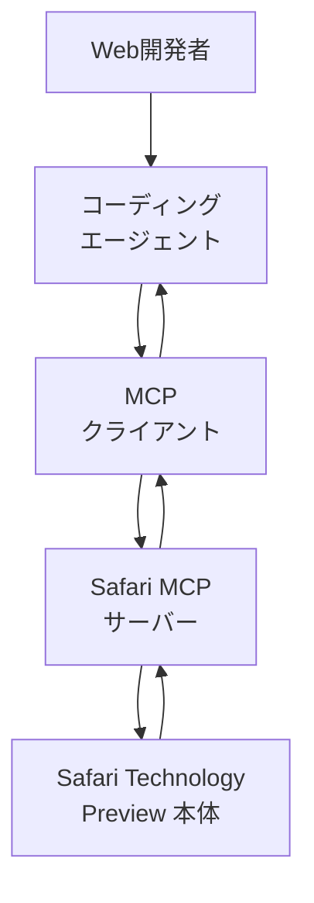
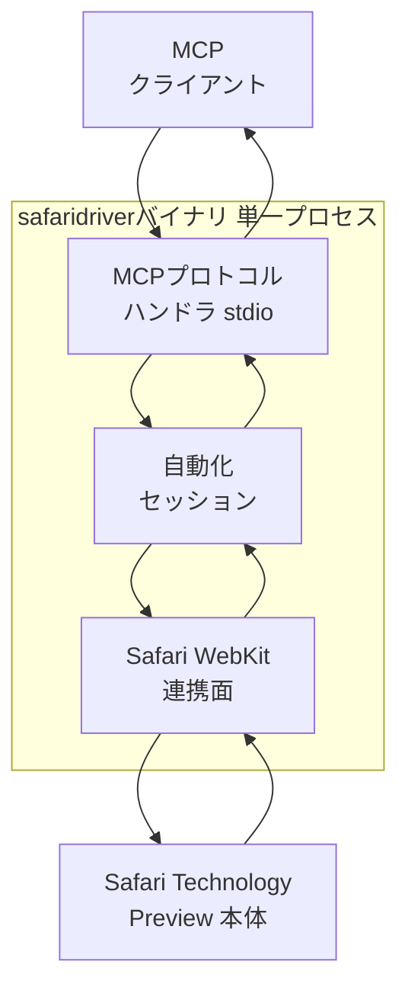
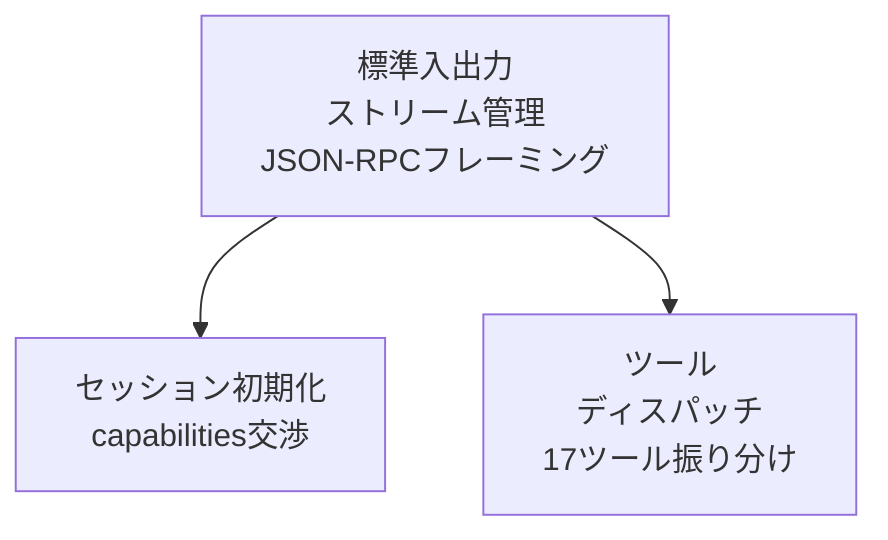
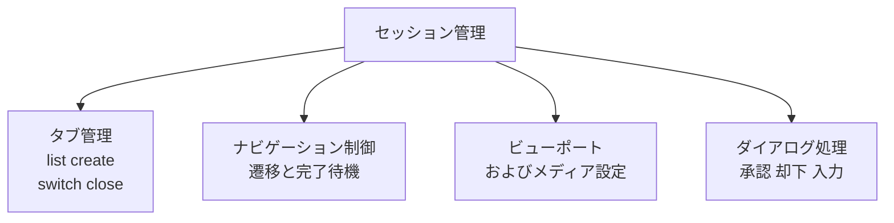
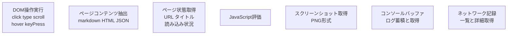
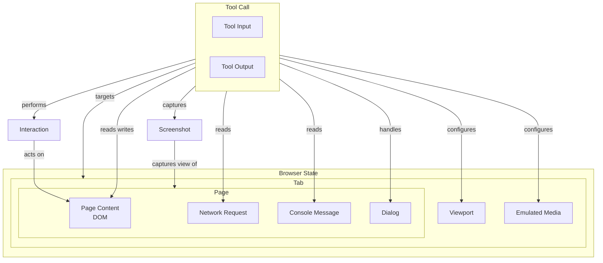
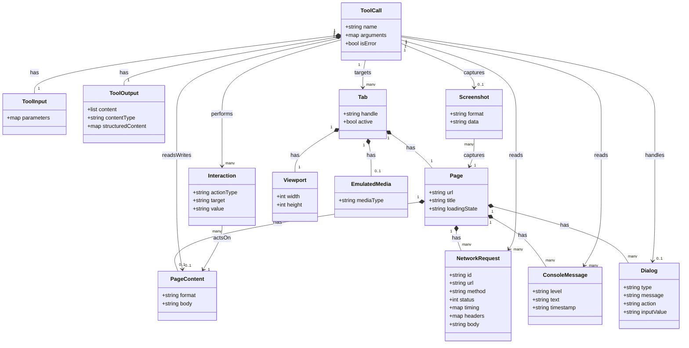

Apple の WebKit チームが Safari Technology Preview 247（2026 年 7 月）で導入した公式 Safari MCP server（`safaridriver --mcp`）を、構造・データ・構築・利用・運用の観点で調査した技術ドキュメントです。調査対象は WebKit 公式版です。名前が似た第三者製品（npm の `safari-mcp` は AppleScript 経由で 80 ツール、`opensafari` は iOS Simulator 向け）とは、実装も配布経路も異なる別プロジェクトです。本文では公式版の仕様に集中し、第三者製品は比較対象としてのみ言及します。

> 検証時点: 2026 年 7 月 / 対象バージョン: Safari Technology Preview 247 以降

## 概要

Safari MCP server は、AI コーディングエージェントを実際に動作している Safari ウィンドウへ直接接続する、ブラウザベンダー自身が公式に提供する MCP（Model Context Protocol）server です。起動は `safaridriver --mcp` というサブコマンドで行います。

これまで AI エージェントは「今書いたコードがブラウザ上でどう描画されているか」を確認するために、開発者がブラウザとエディタ・ターミナルを手動で往復し、スクリーンショットやコンソールログをコピーする必要がありました。Safari MCP server は、この橋渡しを標準化された経路として提供します。DOM の内容取得、JavaScript 実行、スクリーンショット撮影、コンソールメッセージやネットワークリクエストの監視といった Safari の内部状態を、エージェントがツール呼び出しとして直接取得できます。

もう一つの意義は、ブラウザベンダー自身が正式な経路を用意した点にあります。これまで同種の機能は、Playwright や Puppeteer のような第三者テストフレームワーク、あるいは AppleScript による GUI 操作といった非公式・迂回的な手段に頼っていました。WebKit チームが公式にサポートすることで、Safari のバージョンアップに追従したメンテナンス、プライバシー・信頼モデルの設計、既存の `safaridriver` インフラとの統合が保証されます。

### MCP と WebDriver / safaridriver の関係

Model Context Protocol（MCP）は、LLM ベースのエージェントが外部ツール・データソースへ接続するための共通インターフェースを定義するオープン標準です。エージェントが呼び出せる機能を、JSON スキーマ付きの discrete なツールとして公開します。

`safaridriver` は Safari / Safari Technology Preview に同梱されるバイナリで、もともとは W3C WebDriver 仕様を実装したテスト自動化用ドライバです。製品版 Safari では `/usr/bin/safaridriver` として存在し、Selenium などの WebDriver クライアントから HTTP REST リクエストを受け取り、専用の自動化ウィンドウ（通常のブラウジングデータから隔離された環境）でコマンドを実行してきました。

Safari MCP server は、この同じ `safaridriver` バイナリに `--mcp` フラグを渡すことで、通信方式そのものを切り替える仕組みです。

| 観点 | 従来の WebDriver モード | `--mcp` モード |
|---|---|---|
| 起動コマンド | `safaridriver -p <port>` | `safaridriver --mcp` |
| 通信方式 | HTTP REST（ローカル Web サーバーが待受） | stdio 経由の MCP（JSON-RPC ベースのツール呼び出し） |
| コマンドの単位 | W3C WebDriver の低レベルコマンド（findElement、click 等） | エージェントが直接呼び出せる高レベルツール |
| 主な用途 | 決定論的なテストスクリプトの実行（CI 等） | LLM エージェントによるインタラクティブな探索・デバッグ |
| クライアント想定 | Selenium / WebDriver 準拠クライアント | Claude Code、Codex CLI 等の MCP 対応エージェント |

`safaridriver` は「W3C WebDriver も MCP も話せる二重プロトコル対応バイナリ」になったと理解できます。WebDriver がテストスクリプト向けの命令的 API であるのに対し、MCP は LLM の tool-calling に合わせて機能を JSON スキーマ付きの discrete なツールとして公開する点が、構造的な違いです。

> 公開ツール数について: 公式ブログ本文は合計ツール数を明記していません（「16 tools」等の数値表記は本文・見出し・meta のいずれにも存在しないことを生 HTML で確認済み）。本文中の「The tools」表に列挙された一意なツール名を数え上げると 17 個です。一部の二次報道は「16」や「15」と伝えていますが、その数値の根拠は公式本文に見当たりません。本ドキュメントでは公式表に列挙された 17 個をすべて正として扱い、以降のツール一覧・図解も 17 個で統一します。

## 特徴

- 完全ローカル実行: Safari MCP server 自身はネットワーク通信を一切行わず、stdio 経由で接続したエージェントとのみデータをやり取りします。
- Apple への非送信: 取得したページ内容・スクリーンショット・コンソールログなどは接続先のエージェントに直接渡り、Apple のサーバーへは送信されません。
- 公開ツールは 17 個（公式ブログの「The tools」表の列挙数。本文に合計数の明記はありません）: DOM/コンテンツ取得系（`get_page_content`、`evaluate_javascript`、`page_interactions`、`page_info`）、デバッグ/監視系（`screenshot`、`browser_console_messages`、`list_network_requests`、`get_network_request`、`browser_dialogs`）、タブ管理系（`list_tabs`、`create_tab`、`close_tab`、`switch_tab`）、ナビゲーション/レンダリング系（`navigate_to_url`、`wait_for_navigation`、`set_viewport_size`、`set_emulated_media`）の 4 カテゴリに整理できます。`page_interactions` が click/type/scroll/hover/keyPress を、`browser_dialogs` が accept/dismiss/input を、それぞれ 1 ツールにまとめて扱います。
- 既存の coding agent への組み込みが容易: `claude mcp add` や `codex mcp add` のような既存コマンドで、他の MCP server と同じ手順で追加できます。特別な SDK や専用クライアントは不要です。
- プライバシーデータへは非アクセス: AutoFill や閲覧履歴などのユーザー個人情報にはエージェントからアクセスできない設計です。
- 信頼できるエージェントの接続が前提: ブラウザアクセス権を渡すエージェントは選択に注意が必要で、Settings での明示的な opt-in（Web 開発者向け機能の表示、リモートオートメーションと外部エージェントの許可）を経て初めて有効になります。
- 現時点では Safari Technology Preview 限定: 247 以降のバージョンでのみ利用できます（正式版 Safari への展開時期は情報源から確認できませんでした）。

### 他の類似手段との比較

Safari MCP server と混同されやすい第三者製品（npm の `safari-mcp` は AppleScript + Swift daemon 経由で 80 ツールを公開、`opensafari` は iOS Simulator 向け）は、WebKit 公式とは無関係の別プロジェクトです。以下の比較表では、公式仕様との違いを明確にするためあえて併記しますが、両者は実装も配布経路も異なります。

| 項目 | Safari MCP server（公式） | Chrome DevTools MCP（公式） | WebDriver 経由の自動化（従来の `safaridriver`） | 第三者 safari-mcp（AppleScript、npm、非公式） |
|---|---|---|---|---|
| 実行方式 | `safaridriver` が `--mcp` で MCP server として stdio 起動 | Node.js 製 CLI が Puppeteer 経由で Chrome DevTools Protocol（CDP、WebSocket）へ接続 | `safaridriver` が HTTP REST で W3C WebDriver コマンドを受信 | npm パッケージのデュアルエンジン設計。Safari 拡張機能があればそれを優先、無い場合は AppleScript + Swift daemon へフォールバック（約 80% の機能をカバー） |
| 対象ブラウザ | Safari / Safari Technology Preview のみ | Chrome / Chromium 系のみ | Safari（プロトコル自体は他ブラウザの WebDriver 実装とも共通） | Safari のみ |
| 公開ツール数 | 17（公式ブログの表の列挙数。本文に合計数の明記なし） | 複数カテゴリのツール群 | ツールという概念はなく WebDriver コマンド単位 | 80 |
| ローカル/リモート | ローカル専用（stdio、自身はネットワーク通信なし） | ローカル既定。リモートデバッグポート指定で既存インスタンス接続も可 | ローカル既定（自動化専用ウィンドウで隔離）。リモートホスト指定も可能 | ローカル限定（AppleScript の性質上リモート操作は不可） |
| オーバーヘッド | 軽量。ブラウザ内蔵バイナリがエージェントと直接やり取り | 中程度。Node.js + Puppeteer + CDP WebSocket の追加レイヤーを経由 | 軽量〜中程度。HTTP サーバーが常駐し、コマンドごとに往復 | 高くなりやすい。AppleScript の GUI イベント模擬は遅延・負荷が大きい |
| 認証情報の扱い | Apple 非送信。AutoFill・履歴に非アクセス。接続は設定で明示許可 | 既存 Chrome プロファイル接続も可能で、ログイン済みセッションに触れ得る | 自動化専用ウィンドウに分離され、通常のブラウジングデータと隔離 | 通常の Safari GUI をそのまま操作するため、ログイン中セッションに触れる前提 |

4 つの手段は、いずれも「ブラウザの内部状態を外部プロセスへ渡す」目的こそ共通ですが、プロトコル層の設計思想が異なります。

- Safari MCP server: ブラウザエンジン自身のプロセスから MCP を直接話すため、追加のシリアライズ層や別プロセス経由のブリッジが不要です。この「ネイティブ実装」の性質が、ネットワーク通信なし・軽量という特性の技術的根拠です。
- Chrome DevTools MCP: 既存の低レベルデバッグプロトコル（CDP）を Puppeteer でラップし、その上に MCP ツールのレイヤーを重ねます。リモートの実行中インスタンスへの接続や並行制御に強い一方、レイヤーが一段多くなります。
- WebDriver（従来の `safaridriver`）: HTTP REST のセッションベース API で、1 コマンド = 1 リクエストの同期モデルです。決定論的なテストスクリプトの再現性に最適化されています。
- 第三者 safari-mcp（AppleScript）: Safari 拡張機能が使える場合はそれを優先し、無い場合は OS レベルの GUI スクリプティング（AppleScript + Swift daemon）へフォールバックするデュアルエンジン設計です。フォールバック経路ではブラウザエンジン内部の状態へ直接アクセスできず、UI 操作の模倣や daemon 経由の橋渡しが必要になります。

ユースケース別の推奨は以下です。

| ユースケース | 推奨手段 | 理由 |
|---|---|---|
| Safari 固有のレンダリング確認・デバッグをエージェントに任せたい | Safari MCP server（公式） | ローカル完結・Apple 非送信で、既存の Safari ウィンドウをそのまま使える |
| Chrome/Chromium でのパフォーマンス計測・監査をエージェントに任せたい | Chrome DevTools MCP | Chrome 固有の高度な計測ツールが揃う |
| CI/CD でのクロスブラウザ回帰テスト自動化 | WebDriver（`safaridriver`）経由の Selenium 等 | 決定論的なシナリオの再現性が高く、既存のテスト資産と親和 |
| Safari の広範な GUI 操作を自動化したい | 第三者製品等（要件次第、公式外） | 公式 17 ツールの範囲外の GUI 操作をカバーできるが、非公式製品のため信頼性は自己責任 |

## 構造

Safari MCP server の内部アーキテクチャを、C4 model の 3 階層（システムコンテキスト／コンテナ／コンポーネント）で図解します。

### システムコンテキスト図

Safari MCP server を中心に、周囲のアクターと外部システムとの関係を示します。アクターは特定製品名ではなく役割名で表現します。



| 要素名 | 説明 |
|---|---|
| Web開発者 | 自分のサイトやアプリの動作確認・デバッグをコーディングエージェントへ依頼する人 |
| コーディングエージェント | Web開発者の指示を受けてターミナル上で作業する LLM ベースの開発支援エージェント。内部に MCP クライアントを保持しツールを呼び出す |
| MCPクライアント | エージェント側でツール呼び出しを MCP プロトコルのリクエストへ変換し、Safari MCP サーバーとの接続を維持する外部システム |
| Safari MCPサーバー | 調査対象。safaridriver バイナリが `--mcp` で起動し、MCP クライアントからのツール呼び出しを Safari の操作・情報取得へ変換する |
| Safari Technology Preview 本体 | 実際にページを描画し、DOM・ネットワーク・コンソールなどの状態を保持するブラウザ本体。Safari MCP サーバーの操作対象 |

### コンテナ図

Safari MCP server をドリルダウンし、単一プロセスである safaridriver バイナリの内部構成を示します。safaridriver は W3C WebDriver（HTTP REST）と MCP（stdio）の二つの通信方式を同じバイナリで切り替えますが、この図は `--mcp` 起動時の構成に限定します。



| 要素名 | 説明 |
|---|---|
| safaridriverバイナリ | Safari MCP サーバーの実体である単一の OS プロセス。MCP モードでは HTTP サーバーを立てず、内部の 3 つの構成要素が連携してツール呼び出しを処理する |
| MCPプロトコルハンドラ stdio | 標準入出力ストリーム上で JSON-RPC メッセージを送受信し、ツール呼び出しを内部の担当コンポーネントへ振り分ける層 |
| 自動化セッション | W3C WebDriver 由来の remote automation セッションを管理する層。タブ・ナビゲーション・ビューポート・ダイアログなどブラウザレベルの操作を担う |
| Safari WebKit連携面 | ブラウザエンジン内部の状態（DOM・JavaScript 実行結果・描画・ネットワークログ・コンソール出力）へアクセスする層。WebDriver 標準を超えるデバッグ拡張を提供する |
| MCPクライアント | コーディングエージェント側の MCP 接続窓口（システムコンテキスト図と同一の外部システム） |
| Safari Technology Preview 本体 | 自動化対象のブラウザプロセス。専用の自動化ウィンドウで操作される |

### コンポーネント図

コンテナ図の 3 つの構成要素をさらにドリルダウンし、各責務を担うコンポーネントを示します。公開される 17 個のツールは、いずれかのコンポーネントに実装されます。

#### MCPプロトコルハンドラ のコンポーネント



| 要素名 | 説明 |
|---|---|
| 標準入出力ストリーム管理 | stdin から JSON-RPC リクエストを読み取り、stdout へレスポンスを書き出す送受信ループ |
| セッション初期化 | MCP クライアントとの接続確立時に initialize ハンドシェイクを行い、対応機能を交渉する |
| ツールディスパッチ | ツール名ごとに登録されたハンドラへ呼び出しを振り分ける。全ツールの入口 |

#### 自動化セッション のコンポーネント



| 要素名 | 説明 |
|---|---|
| セッション管理 | 自動化セッションの確立・維持・破棄を担う |
| タブ管理 | list_tabs、create_tab、close_tab、switch_tab を実装し、複数タブのハンドルを管理する |
| ナビゲーション制御 | navigate_to_url、wait_for_navigation を実装し、ページ遷移とロード完了を制御する |
| ビューポートおよびメディア設定 | set_viewport_size、set_emulated_media を実装し、レスポンシブデザイン検証用の表示条件を切り替える |
| ダイアログ処理 | browser_dialogs を実装し、JS の alert / confirm / prompt に対する応答（承認・却下・入力）を行う |

#### Safari WebKit連携面 のコンポーネント



| 要素名 | 説明 |
|---|---|
| DOM操作実行 | page_interactions を実装し、click・type・scroll・hover・keyPress などの操作を順に実行する |
| ページコンテンツ抽出 | get_page_content を実装し、markdown / HTML / JSON など指定形式でページのテキスト内容を取り出す |
| ページ状態取得 | page_info を実装し、現在の URL・タイトル・読み込み状態を返す |
| JavaScript評価 | evaluate_javascript を実装し、ページ内で任意の JavaScript を実行して結果を返す |
| スクリーンショット取得 | screenshot を実装し、現在のページを PNG 形式でキャプチャする |
| コンソールバッファ | browser_console_messages を実装し、対象タブのコンソールログをバッファリングして返す |
| ネットワーク記録 | list_network_requests と get_network_request を実装し、リクエストの一覧と個別詳細（ヘッダー・ボディ・タイミング）を提供する |

## データ

Safari MCP server がエージェントとのやり取りで扱うデータを、概念モデル（エンティティと関係）と情報モデル（属性）の 2 段階でモデル化します。

全ツール呼び出しは、共通の型 Tool Call（`tools/call`、JSON-RPC）を介して行われます。Tool Call は Tool Input（`arguments`）を受け取り、Tool Output（`content` 配列、`isError`）を返すという MCP 仕様共通の構造を持ちます。Safari MCP server 固有の部分は、この Tool Call が何を対象に読み書きするか、すなわち Tab / Page / PageContent / NetworkRequest / ConsoleMessage / Screenshot / Dialog / Interaction / Viewport / EmulatedMedia というブラウザ状態のエンティティ群です。

### 概念モデル



| 要素名 | 説明 |
|---|---|
| Tool Call | エージェントが `tools/call` で発行する 1 回のツール呼び出し。Safari MCP server は 17 個のツールをこの形式で公開する |
| Tool Input | Tool Call の引数（`arguments`）。ツールごとに JSON Schema（`inputSchema`）で定義される |
| Tool Output | Tool Call の返り値。`content` 配列（テキスト/画像等）と、失敗時の `isError` を含む |
| Browser State | Tab 以下、Safari が保持するブラウザ内部状態をまとめた概念的なグルーピング |
| Tab | Safari の 1 タブ。`list_tabs`/`create_tab`/`close_tab`/`switch_tab` の対象。ハンドルで識別される |
| Page | Tab が現在表示しているページ。URL・タイトル・読み込み状態を持つ（`page_info`） |
| Page Content / DOM | ページのコンテンツを markdown/HTML/JSON のいずれかの形式で取得したもの（`get_page_content`） |
| Network Request | Page が発行したネットワークリクエスト。一覧取得時はサマリ（`list_network_requests`）、単体取得時は詳細（`get_network_request`） |
| Console Message | Page が出力したコンソールログ（`browser_console_messages`） |
| Dialog | Page が表示した alert/confirm/prompt ダイアログと、それへの応答（`browser_dialogs`） |
| Screenshot | Page の現在の描画を PNG として取得したもの（`screenshot`）。取得時点の Viewport 設定に従う |
| Interaction | Page に対して行う click/type/scroll/hover/keyPress の操作列（`page_interactions`） |
| Viewport | Tab の表示領域サイズ設定（`set_viewport_size`） |
| Emulated Media | Tab に適用する CSS メディアタイプのエミュレーション設定（`set_emulated_media`、例: print） |

概念モデル上、PageContent・NetworkRequest・ConsoleMessage・Dialog は Page に、Viewport・EmulatedMedia・Page は Tab に、それぞれ所有関係（subgraph の入れ子）で属します。Screenshot と Interaction は Page の状態を対象にした Tool Call の一時的な出力／操作であり、利用関係（矢印）で表現しています。

### 情報モデル



公式ブログはツールの機能説明にとどまり、個々の JSON スキーマ（パラメータ名・型・必須/任意）までは公開していません。以下の属性のうち、公式ブログの説明文に明記されているもの以外は「公式ブログ記述から推測」または「MCP 仕様から適用」として区別します。

| クラス | 属性 | 説明 | 根拠 |
|---|---|---|---|
| ToolCall | name | 呼び出すツール名（例: `get_page_content`） | MCP 仕様（`tools/call` の `params.name`） |
| ToolCall | arguments | ツールに渡す引数一式 | MCP 仕様（`params.arguments`） |
| ToolCall | isError | 実行時エラーの有無 | MCP 仕様（Tool Result の `isError`） |
| ToolInput | parameters | ツールごとの `inputSchema` に従う引数値 | 公式ブログの各ツール説明文から推測（JSON Schema 未公開） |
| ToolOutput | content | テキスト/画像などの結果項目リスト | MCP 仕様（`content` 配列） |
| ToolOutput | contentType | content 要素の種別（例: text, image） | MCP 仕様の content type 一覧 |
| ToolOutput | structuredContent | 構造化された JSON 結果 | MCP 仕様の `structuredContent` から適用 |
| Tab | handle | タブを一意に識別するハンドル文字列 | 公式ブログ「tabs with their handles」より |
| Tab | active | 現在アクティブなタブかどうか | 公式ブログ記述から推測（`switch_tab` の存在から） |
| Page | url | 表示中の URL | 公式ブログ「URL, title, and loading state」より |
| Page | title | ページタイトル | 同上 |
| Page | loadingState | 読み込み状態 | 同上 |
| PageContent | format | 取得形式（markdown / HTML / JSON） | 公式ブログ「in various formats」より |
| PageContent | body | 取得した本文データ | 公式ブログ記述から推測 |
| NetworkRequest | id | リクエスト識別子（`get_network_request` の引数） | 公式ブログ記述から推測 |
| NetworkRequest | url | リクエスト先 URL | 公式ブログ「URL, method, status code, and timing」より |
| NetworkRequest | method | HTTP メソッド | 同上 |
| NetworkRequest | status | HTTP ステータスコード | 同上 |
| NetworkRequest | timing | タイミング情報 | 同上（内訳は未公開のため map として抽象化） |
| NetworkRequest | headers | ヘッダ（`get_network_request` の詳細取得のみ） | 公式ブログ「Headers, body, timing」より |
| NetworkRequest | body | ボディ。一覧はサマリ、詳細取得は全体 | 公式ブログ記述から推測 |
| ConsoleMessage | level | ログレベル（例: log/warn/error） | 公式ブログ記述から推測 |
| ConsoleMessage | text | メッセージ本文 | 同上 |
| ConsoleMessage | timestamp | 発生時刻 | 公式ブログ記述から推測 |
| Dialog | type | ダイアログ種別（alert / confirm / prompt） | 公式ブログ記述より |
| Dialog | message | ダイアログの表示テキスト | 公式ブログ記述から推測 |
| Dialog | action | 応答種別（accept / dismiss / input） | 公式ブログ記述より |
| Dialog | inputValue | prompt ダイアログへの入力値 | 公式ブログ記述から推測 |
| Screenshot | format | 画像形式。PNG | 公式ブログ「as a PNG」より |
| Screenshot | data | base64 エンコードされた画像データ | MCP 仕様の Image Content から適用 |
| Interaction | actionType | 操作種別（click / type / scroll / hover / keyPress） | 公式ブログ記述より |
| Interaction | target | 操作対象（要素セレクタ等） | 公式ブログ記述から推測 |
| Interaction | value | type/keyPress 時に入力するテキスト等 | 公式ブログ記述から推測 |
| Viewport | width | 表示領域の幅（CSS ピクセル） | 公式ブログ「viewport dimensions」より |
| Viewport | height | 表示領域の高さ（CSS ピクセル） | 同上 |
| EmulatedMedia | mediaType | エミュレートする CSS メディアタイプ（例: print） | 公式ブログ「Emulate a CSS media type」より |

## 構築方法

WebKit 公式の Safari MCP server（`safaridriver --mcp`）を初めて構築し、基本的なツールを使い始めるまでの手順を扱います。対象は公式版であり、npm パッケージの `safari-mcp`（AppleScript 経由・80 ツール）のような第三者製品ではありません。公式版は npm ではなく、Safari Technology Preview に同梱される `safaridriver` バイナリの `--mcp` サブコマンドとして起動します。

### 前提条件

- Safari Technology Preview 247 以降が必要です。Safari MCP server は STP 247（2026 年 7 月 1 日公開）で導入されました。
- macOS の要件: STP 247 のリリースノートには「macOS Golden Gate および macOS Tahoe 向け」と記載されています。既に STP をインストール済みの場合は、システム設定の「一般 > ソフトウェアアップデート」から更新できます。
- 現時点では Safari Technology Preview 限定の機能です。正式版 Safari への展開時期は公式ブログから確認できませんでした。

### 有効化: 開発者向け機能とリモートオートメーションの許可

Safari MCP server を使うには、STP の設定で 2 箇所を有効化します。

- Safari の設定で Advanced > Show features for web developers をオンにする
- Safari の設定で Developer > Enable remote automation and external agents をオンにする

この 2 つの opt-in を経て初めて、外部のエージェントが `safaridriver --mcp` 経由で Safari へ接続できます。

### Claude Code への追加

公式ブログに掲載されているコマンドをそのまま使います。`safaridriver` はフルパスで指定します。

```bash
claude mcp add safari-mcp-stp -- "/Applications/Safari Technology Preview.app/Contents/MacOS/safaridriver" --mcp
```

- `safari-mcp-stp` はサーバーの登録名です（自由に変更できます）。
- `--` の後ろが実際に起動するコマンドとその引数（`--mcp`）です。

### Codex への追加

Claude Code と同じ考え方で、`codex mcp add` を使います。

```bash
codex mcp add safari-mcp-stp -- "/Applications/Safari Technology Preview.app/Contents/MacOS/safaridriver" --mcp
```

### 汎用 MCP クライアント設定（mcp.json / config.json）

専用コマンドを持たない MCP クライアント向けには、公式ブログに以下のフラグメントが掲載されています。

```json
"safari-mcp-stp": {
  "command": "/Applications/Safari Technology Preview.app/Contents/MacOS/safaridriver",
  "args": ["--mcp"]
}
```

多くの MCP クライアントは、このフラグメントを `mcpServers` というトップレベルキーの下にネストして使います。例えば Cursor の `.cursor/mcp.json` であれば次の形になります。

```json
{
  "mcpServers": {
    "safari-mcp-stp": {
      "command": "/Applications/Safari Technology Preview.app/Contents/MacOS/safaridriver",
      "args": ["--mcp"]
    }
  }
}
```

トップレベルキーの名前はクライアントごとに異なる場合があるため、実際に使うクライアントのドキュメントで最終確認してください（この点は公式ブログの記載範囲外です）。

### 接続確認方法

公式ブログには Safari MCP server 固有の接続確認手順の明記がありません。追加後の疎通確認は、各 MCP クライアント側の標準的な確認コマンドで行います。

```bash
# Claude Code: 登録済み MCP server の一覧と接続状態
claude mcp list
# 特定 server の詳細（宣言されているツール一覧）
claude mcp get safari-mcp-stp
```

セッション内であれば `/mcp` コマンドでも接続中のサーバー一覧とツール数を確認できます。Codex CLI の場合は `codex mcp list` / `codex mcp get safari-mcp-stp` で確認します。接続に失敗する場合は、`safaridriver` のフルパスが正しいか（STP と正式版 Safari でパスが異なります）、STP 側の 2 つの opt-in が有効かを見直してください。

## 利用方法

### ツール一覧

公式ブログ本文には合計ツール数の明記がなく、「The tools」表を数えると 17 個のツール名が列挙されています（生 HTML で確認済み）。一部の二次報道が伝える「16」の根拠は公式本文に見当たりません。本ドキュメントでは列挙された 17 個をすべて正として扱います。カテゴリ分けは機能のまとまりに基づく整理です。

| ツール名 | カテゴリ | 主用途 | 主な引数 |
|---|---|---|---|
| `get_page_content` | DOM/コンテンツ | ページのテキスト内容を各種フォーマットで抽出する | フォーマット指定（markdown / HTML / JSON。名は公式未記載） |
| `evaluate_javascript` | DOM/コンテンツ | ページ内で JavaScript を実行し結果を返す | 実行する JavaScript コード（名は公式未記載） |
| `page_interactions` | DOM/コンテンツ | click / type / scroll / hover / keyPress をまとめて実行する | 操作種別と対象要素・入力値（名は公式未記載） |
| `page_info` | DOM/コンテンツ | 現在のページの URL・タイトル・読み込み状態を取得する | 引数なし、またはタブ指定（公式未記載） |
| `screenshot` | デバッグ/監視 | 現在のページを PNG で取得する | 対象タブ等（公式未記載） |
| `browser_console_messages` | デバッグ/監視 | 現在または指定タブのコンソールログを返す | 対象タブ指定（公式未記載） |
| `list_network_requests` | デバッグ/監視 | ネットワークリクエストの一覧を返す | フィルタ条件等（公式未記載） |
| `get_network_request` | デバッグ/監視 | 単一ネットワークリクエストの詳細を取得する | リクエスト ID（公式未記載） |
| `browser_dialogs` | デバッグ/監視 | ダイアログの一覧取得と応答（accept / dismiss / input）を行う | 応答種別と入力テキスト（名は公式未記載） |
| `list_tabs` | タブ管理 | 開いているタブのハンドルと URL の一覧を返す | 引数なし |
| `create_tab` | タブ管理 | 新しいタブを作成し、任意で URL を読み込む | 読み込む URL（省略可、名は公式未記載） |
| `close_tab` | タブ管理 | 指定したハンドルのタブを閉じる | タブハンドル（公式未記載） |
| `switch_tab` | タブ管理 | 指定したハンドルのタブに切り替える | タブハンドル（公式未記載） |
| `navigate_to_url` | ナビゲーション/レンダリング | 指定 URL に遷移し、読み込み後の内容を返す | 遷移先 URL（名は公式未記載） |
| `wait_for_navigation` | ナビゲーション/レンダリング | 現在のページの読み込み完了を待機する | タイムアウト等（公式未記載） |
| `set_viewport_size` | ナビゲーション/レンダリング | ビューポートサイズを CSS ピクセル単位で設定する | 幅・高さ（名は公式未記載） |
| `set_emulated_media` | ナビゲーション/レンダリング | CSS メディアタイプ（例: `print`）をエミュレートする | メディアタイプ（名は公式未記載） |

> 注記: 公式ブログはツールの機能説明にとどまり、個々の JSON スキーマ（パラメータ名・型・必須/任意）までは公開していません。以下のコード例は、MCP の標準的な呼び出し形式（`tools/call` に `name` と `arguments` を渡す形）に沿った概念的な例です。値・引数名は説明文から合理的に推測したものであり、実際のスキーマは接続後に `claude mcp get safari-mcp-stp` 等で確認してください。

### ページ内容取得（get_page_content）

`get_page_content` は、DOM のテキスト内容を markdown・HTML・JSON など複数フォーマットで抽出します。

```json
{
  "method": "tools/call",
  "params": {
    "name": "get_page_content",
    "arguments": { "format": "markdown" }
  }
}
```

`format` を `markdown` にすると、エージェントが読みやすい形でページ本文を受け取れます。`html` や `json` を指定すれば、DOM 構造やアクセシビリティ属性を含む、より生に近いデータが得られると考えられます（出力スキーマは公式ブログ未記載）。

### JavaScript 評価（evaluate_javascript）

ページのコンテキストで任意の JavaScript を実行し、その結果を受け取ります。

```json
{
  "method": "tools/call",
  "params": {
    "name": "evaluate_javascript",
    "arguments": { "expression": "document.title" }
  }
}
```

`expression`（実行するコード本体の引数名）は公式ブログに明記されておらず、概念的な例です。レイアウト崩れの調査、算出スタイルの確認、フォーム状態の確認など、DOM API を直接叩きたい場面で使います。

### 操作列（page_interactions）

click / type / scroll / hover / keyPress といった DOM 操作を、1 つのツールでまとめて扱います。

```json
{
  "method": "tools/call",
  "params": {
    "name": "page_interactions",
    "arguments": {
      "actions": [
        { "type": "click", "selector": "#submit-button" },
        { "type": "type", "selector": "#email", "text": "test@example.com" },
        { "type": "keyPress", "key": "Enter" }
      ]
    }
  }
}
```

公式ブログが明記しているのは、操作種別が「click, type, scroll, hover, keyPress など」という点までです。`actions` のような配列引数名やセレクタの指定方法は公式ブログ未記載です。上記は複数操作をまとめて実行するツールの性質から推測した例です。

### スクリーンショット（screenshot）

現在のページを PNG 画像として取得します。

```json
{
  "method": "tools/call",
  "params": { "name": "screenshot", "arguments": {} }
}
```

「デザイン崩れがないか見て」「レンダリング結果を確認して」といった視覚確認の依頼で、エージェントが呼び出す典型的なツールです。

### コンソールログ取得（browser_console_messages）

現在または指定タブのコンソールログをまとめて取得します。

```json
{
  "method": "tools/call",
  "params": { "name": "browser_console_messages", "arguments": {} }
}
```

バッファされたログをまとめて返すツールです。「buffered console logs for the current or specified tab」という説明から、タブ指定引数がある可能性はありますが、引数名は公式ブログ未記載です。

### ネットワーク一覧と詳細取得（list_network_requests / get_network_request）

一覧取得と詳細取得の 2 段構えです。`list_network_requests` は URL・メソッド・ステータス・タイミングのサマリ一覧を返します。個々の詳細（レスポンスヘッダーやボディなど）が必要な場合は、一覧から得た識別子で `get_network_request` を呼び出します。

```json
{
  "method": "tools/call",
  "params": {
    "name": "get_network_request",
    "arguments": { "requestId": "<list_network_requests で得た識別子>" }
  }
}
```

`requestId` という引数名は公式ブログに明記されておらず、一覧→詳細という 2 段構成から推測した例です。

### ダイアログ操作（browser_dialogs）

`alert` / `confirm` / `prompt` のようなブラウザダイアログの一覧取得と応答を行います。

```json
{
  "method": "tools/call",
  "params": {
    "name": "browser_dialogs",
    "arguments": { "action": "accept", "text": "入力する値（prompt の場合）" }
  }
}
```

応答の種類として `accept`（承諾）・`dismiss`（キャンセル）・テキスト入力が明記されています。`action` という引数名自体は公式ブログ未記載の推測です。

### タブ操作（list_tabs / create_tab / close_tab / switch_tab）

複数タブを横断した操作を行う 4 つのツールです。`list_tabs` で得られる「ハンドル」を使って `switch_tab` / `close_tab` の対象を指定します。

```json
{
  "method": "tools/call",
  "params": { "name": "create_tab", "arguments": { "url": "https://example.com" } }
}
```

```json
{
  "method": "tools/call",
  "params": { "name": "switch_tab", "arguments": { "handle": "<list_tabs で得たハンドル>" } }
}
```

`create_tab` は URL を指定せず空タブを作ることもできます（「optionally loading a URL」）。ハンドルの関係性は公式ブログの説明（“by its handle”）から明らかですが、引数名（`handle` 等）自体は公式ブログ未記載です。

### ナビゲーションと待機（navigate_to_url / wait_for_navigation）

```json
{
  "method": "tools/call",
  "params": { "name": "navigate_to_url", "arguments": { "url": "https://example.com" } }
}
```

`navigate_to_url` は遷移後に読み込まれたページ内容を返すため、`get_page_content` を別途呼ばなくても最初の内容確認ができます。ページ内リンクのクリックなど、遷移がすぐに完了しない操作の後には `wait_for_navigation` を挟みます。

### ビューポート・メディアエミュレーション（set_viewport_size / set_emulated_media）

レスポンシブデザインや印刷スタイルの検証に使います。

```json
{
  "method": "tools/call",
  "params": { "name": "set_viewport_size", "arguments": { "width": 375, "height": 812 } }
}
```

```json
{
  "method": "tools/call",
  "params": { "name": "set_emulated_media", "arguments": { "media": "print" } }
}
```

`set_viewport_size` は CSS ピクセル単位でビューポートを設定します。`set_emulated_media` は公式ブログで例として `print` が挙げられています。引数名はいずれも公式ブログ未記載の推測です。

### エージェントへの自然言語指示例

Safari MCP server の狙いは、エージェントに「どのツールをどう呼ぶか」を厳密に指示しなくても、簡単な自然言語の依頼だけでエージェント自身が適切なツールを選んで調査できる点にあります。公式ブログは次のような依頼例を挙げています。

- 「Find bugs on my site in Safari」（このサイトの Safari 上のバグを見つけて）
- 「How accessible is my site in Safari?」（このサイトの Safari でのアクセシビリティはどう？）
- 「See how my website performs in Safari」（このサイトの Safari 上でのパフォーマンスを見て）

これらに類する日本語の指示も同様に機能します。

- 「この Safari のタブで console エラーを取って」→ エージェントは `list_tabs` で対象タブを特定し、`browser_console_messages` を呼び出す。
- 「このページのスクリーンショットを撮ってレイアウト崩れがないか見て」→ `page_info` で状態を確認したうえで `screenshot` を呼び出す。
- 「フォームに入力して送信ボタンを押した後のネットワークリクエストを見せて」→ `page_interactions` で click/type を実行し、`list_network_requests` と `get_network_request` で結果を確認する。

公式ブログが強調しているのは、「完璧なプロンプトを書いて何が見えているかを逐一説明する」のではなく、「エージェント自身に確認させる」というワークフローへの転換です。

## 運用

### MCP server の起動・接続確認

Safari MCP server は常駐デーモンではなく、エージェント側の MCP クライアントが `safaridriver --mcp` を stdio サブプロセスとして都度起動する方式です。クライアント側が `safaridriver` を立ち上げ、標準入出力で JSON-RPC 2.0 メッセージをやり取りします。

起動タイミングはエージェントがツールを呼び出す必要が生じたときで、明示的な「サーバー起動コマンド」を手動で叩く運用は基本的に不要です。公式ブログも「it shouldn't need to be told to use the Safari MCP server explicitly」と述べており、エージェントが文脈から自律的に呼び出す前提です。停止はエージェント側のセッション終了に連動します。

接続状態の確認は、エージェント側（MCP クライアント）の機能で行います。

```bash
# 登録済み MCP server の一覧と接続状態
claude mcp list
# 特定 server の詳細確認
claude mcp get safari-mcp-stp
```

セッション内では `/mcp` コマンドで接続中の server とツール数を確認でき、server の切断・再接続もセッションを再起動せずに行えます。接続に問題がある場合はまず `/doctor`、次に `claude mcp list` で個別 server の状態を切り分けます。

### 複数タブ・複数セッションの扱い

- タブ単位の制御は `list_tabs` / `create_tab` / `close_tab` / `switch_tab` の 4 ツールで行います。1 つの automation window 内で複数タブを開き、エージェントが `switch_tab` でアクティブタブを切り替えながら横断的に操作する運用が基本です。
- `safaridriver` は元々 W3C WebDriver の隔離モデルを踏襲し、自動化用の専用ウィンドウでコマンドを実行します。「既存タブに接続するのではなく隔離された automation window を新規に作る」という挙動は二次情報が伝えていますが、この詳細は公式ブログ本文に明記がなく、推測として扱ってください。
- 「1 プロセスにつき自動化セッションは 1 つ」という制約も従来 WebDriver モードの一般的性質からの類推であり、`--mcp` モードでの複数セッション同時起動の可否は公式では確認できません。まず単一エージェント・単一セッションでの運用を基本とし、並行実行が必要なら挙動を実地検証してから広げることを推奨します。
- 複数の異なるエージェント／複数プロジェクトで並行して使う場合は、それぞれ別々の `safaridriver --mcp` サブプロセス（= 別々の MCP server 登録）を持たせる設計が安全です。

### remote automation / external agents の切り替え

- 有効化は Settings > Developer > Enable remote automation and external agents で行います。使わない期間は無効化しておくことで、エージェントからの誤操作リスクを下げられます。信頼できるエージェント接続のみを許可する trust model 上、「常時 ON」ではなく必要なときだけ ON にする運用が安全側です。
- 併せて Settings > Advanced > Show features for web developers が OFF になっていると、Developer メニュー自体が表示されません。
- 参考: 従来の WebDriver 用 `safaridriver` では `safaridriver --enable` で「Develop メニュー表示」と「Allow Remote Automation」を一括有効化できます（要 macOS パスワード認証）。`--mcp` 起動時にこのサブコマンドがそのまま使えるかは公式ブログに明記がなく未検証です。

### ログ確認と更新への追随

- MCP server 自体の専用ログビューアは公式ブログに記載がありません。ブラウザ内のコンソールログは `browser_console_messages` で取得できますが、これは MCP プロトコル自体の通信ログとは別物です。MCP の stdio トランスポートは仕様上 stdout を JSON-RPC 専用とし、デバッグ出力は stderr に出す設計が一般的です。stderr を直接確認したい場合は `safaridriver --mcp` をターミナルで手動起動して観察する方法が考えられます。
- Safari MCP server は STP に同梱されるため、STP 本体の更新がそのまま MCP server の更新になります。個別のアップデート手順は存在しません。ツール仕様はプレビュー版ゆえ将来のビルドで変更される可能性があるため、STP 更新後は `claude mcp list` 等で接続を再確認し、エージェントが想定通りツールを呼び出せるかを都度チェックすることを推奨します。

## ベストプラクティス

### プライバシー・セキュリティ

- 信頼できるエージェントのみ接続する: Safari MCP server は接続したエージェントに DOM 内容・スクリーンショット・コンソールログ・ネットワークリクエストへのアクセスを許すため、実行するコードの出所が信頼できるものに限定してください。
- ローカル実行・Apple 非送信を前提に運用を設計する: サーバー自身はネットワーク通信を行わず、取得データはエージェントに直接渡り Apple には送られません。これは実装上の性質であって、エージェント側（例えばクラウド送信を伴う機能や、さらに外部 API へ転送する処理）で機密データが漏れないかは、別途エージェント側の設定・利用ポリシーで担保する必要があります。
- AutoFill・閲覧履歴等の個人情報にはそもそも非アクセスという設計上の防御があります。ただし「ログイン済みタブの表示内容」までブロックするものではないため、機微情報を表示したタブをエージェントに触らせる際は、追加の運用ルール（機密タブは別ウィンドウで開く、ダミーデータでの再現に切り替える、機密画面のキャプチャを避ける等）を検討してください。

### agent harness としての使い方

公式ブログが示す典型的なワークフローは、「バグ報告 → エージェントに調査を依頼 → エージェントが Safari MCP server 経由で実際のレンダリングを観測して原因を特定する」という会話駆動のデバッグです。従来の「人間がブラウザで再現 → スクリーンショットを撮って Issue に貼る → 別の人間が原因調査」という人手レビュー前提のワークフローを、エージェントが自分でブラウザを開いて観測できる前提に置き換えられる点が、設計の核心です。

- UI 不具合再現: 「特定ページで崩れる」という報告に対し、エージェントが `navigate_to_url` → `get_page_content` / `screenshot` → `browser_console_messages` を連鎖させ、人間の再現手順待ちなしに一次切り分けまで進める。
- Safari 互換確認: Chrome 中心で開発した機能を Safari MCP server 経由で実際に動かし、`evaluate_javascript` で挙動差分を確認する。Chrome DevTools MCP と併用し、同じシナリオを両ブラウザに流させれば、クロスブラウザ差分を人手比較なしに洗い出せる。
- アクセシビリティ確認: `get_page_content` の構造化出力や `page_info` を使い、見出し構造・alt 属性などの機械可読な情報を一次チェックとして確認させる。本格的な WCAG 準拠確認は専用の監査ツールに委ね、Safari MCP server は「実ブラウザでの実地観測」を担う位置づけとする。

観測面をコンテキストとしてエージェントに渡す設計では、`get_page_content`（markdown 指定でトークン消費を抑える）、`screenshot`（レイアウト崩れの一次証跡）、`browser_console_messages` / `list_network_requests`（実行時状態の切り分け）、`page_interactions` / `browser_dialogs`（対話）の組み合わせが有効です。指示はツールを個別指定するより「何を確認したいか」を自然文で伝え、エージェント自身にツール選択させる設計が公式の想定に沿います。

### Chrome DevTools MCP との使い分けと CI での扱い

- Safari MCP server は Safari/STP 専用、Chrome DevTools MCP は Chrome/Chromium 専用で、両者は排他ではなく併用が前提です。互換性確認では両方を同一エージェントに登録し、同じシナリオを両ブラウザに対して実行させます。Safari 固有のレンダリング・ローカル完結重視のタスクは Safari MCP server、Chrome 固有の高度な計測は Chrome DevTools MCP という目安です。
- Safari MCP server は GUI（実際の Safari ウィンドウ）を必要とするため、ヘッドレス前提の一般的な CI ランナーとの相性は本質的に良くありません。公式ブログも CI 利用には言及していません。決定論的な回帰テストは従来の WebDriver（Selenium 等）を CI に組み込み、エージェントによる探索的デバッグはローカル開発機上で Safari MCP server を使う、という棲み分けが妥当です。Linux ベースの CI では原理的に動作せず、macOS ランナーでも対話的な GUI 設定（Settings の opt-in）を無人環境で再現できるかは未検証です。

## トラブルシューティング

`--mcp` 起動固有の公式なエラーカタログは、現時点で存在しません（Technology Preview 直後のため）。以下は、同じ `safaridriver` バイナリが共有する WebDriver モードの既知の挙動・一般的な MCP クライアントの挙動から類推できる項目を中心にまとめています。推測に基づく項目は明記します。

| 症状 | 原因 | 対処 |
|---|---|---|
| Claude / Codex から接続できない、`claude mcp list` で `Failed to connect` になる | Settings > Developer > Enable remote automation and external agents が無効 | STP の Settings で有効化してから再接続する |
| Developer メニューや上記トグル自体が見当たらない | Settings > Advanced > Show features for web developers が無効 | 先に Show features for web developers を有効化し、その後 remote automation を確認する |
| `safaridriver ... pass the '--enable' flag` 系のエラー | `safaridriver` が初回認証・設定未完了 | ターミナルで `safaridriver --enable` を一度実行し、macOS のパスワード認証を完了させる（WebDriver モードで確認済みの挙動。`--mcp` でも同一バイナリのため類推適用できる可能性が高いが未確認） |
| STP が入っていない、または 247 未満 | STP 未インストール、または導入前の古いビルド | Apple Developer サイトから STP 最新版をインストールし、247 以上を確認する |
| `safaridriver` のパス指定でコマンドが見つからない | STP と製品版のパス混同（製品版は `/usr/bin/safaridriver`、STP は `/Applications/Safari Technology Preview.app/Contents/MacOS/safaridriver`） | 登録コマンドで STP 側の絶対パスを正しく指定する。`claude mcp get <name>` で登録内容を再確認する |
| `another safaridriver is already running` | 前回セッションが正しく終了せずプロセスが残留 | 残留プロセスを確認し、不要なら終了してから再接続する。セッションを正しく終了する運用を徹底する |
| エージェントがツールを認識しない／呼び出さない | 登録は成功しているがエージェント側がツールを認識していない、または登録スコープの不一致 | `/mcp` または `claude mcp list` で登録先スコープと接続状態を確認する。登録し直すか、タスク内でブラウザ確認を明示的に依頼して誘発する |
| `list_tabs` でタブが見つからない、`switch_tab` が失敗する | automation window がまだ開かれていない、または対象タブが window の外にある（推測: 公式ブログに詳細記載なし） | `create_tab` で automation window 内に新規タブを作らせてから操作する。まず `navigate_to_url` から始める運用にする |
| `screenshot` の結果が空、または真っ黒/真っ白になる | 描画完了前にキャプチャしている（推測: 一般的なブラウザ自動化での既知パターンからの類推） | `wait_for_navigation` を `screenshot` の前段に挟み、描画完了を待つ |
| CI（特に Linux ランナー）で動作しない | GUI（実際の Safari アプリ）を必要とするため、ヘッドレス/Linux では原理的に非対応 | macOS ランナーを使うか、CI 化を諦めローカル開発機のみで運用する |
| STP 更新後にツール呼び出しが失敗するようになった | ツール仕様がプレビュー版のビルド間で変更された可能性 | 更新後は `claude mcp list` で接続を再確認し、簡単なツール呼び出しで疎通確認する。問題が続く場合は WebKit の Bug Report として報告する |

## まとめ

Safari MCP server は、`safaridriver --mcp` としてブラウザベンダー自身が公式提供する MCP server であり、DOM・コンソール・ネットワーク・スクリーンショットといった実ブラウザの観測面を、ローカル完結・Apple 非送信でエージェントへ直接渡します。これにより「人間が再現してスクリーンショットを貼る」人手レビュー前提のワークフローを、エージェント自身がブラウザを開いて観測する前提へ置き換えられる点が設計の核心です。

この記事が少しでも参考になった、あるいは改善点などがあれば、ぜひリアクションやコメント、SNSでのシェアをいただけると励みになります！

## 参考リンク

- 一次情報（WebKit 公式）
  - [Introducing the Safari MCP server for web developers | WebKit](https://webkit.org/blog/18136/introducing-the-safari-mcp-server-for-web-developers/)
  - [Release Notes for Safari Technology Preview 247 | WebKit](https://webkit.org/blog/18133/release-notes-for-safari-technology-preview-247/)
  - [About WebDriver for Safari | Apple Developer Documentation](https://developer.apple.com/documentation/webkit/about-webdriver-for-safari)
  - [Testing with WebDriver in Safari | Apple Developer Documentation](https://developer.apple.com/documentation/webkit/testing-with-webdriver-in-safari)
  - [WebDriver Support in Safari 10 | WebKit](https://webkit.org/blog/6900/webdriver-support-in-safari-10/)
- MCP 仕様・クライアント設定
  - [Model Context Protocol 仕様: Tools](https://modelcontextprotocol.io/specification/2025-06-18/server/tools)
  - [Architecture overview | Model Context Protocol](https://modelcontextprotocol.io/docs/learn/architecture)
  - [Debugging | Model Context Protocol](https://modelcontextprotocol.io/docs/tools/debugging)
  - [Connect to MCP servers | Claude Code Docs](https://code.claude.com/docs/en/mcp-quickstart)
  - [Model Context Protocol – Codex | OpenAI Developers](https://developers.openai.com/codex/mcp)
- 記事・運用・比較
  - [Safari's new MCP server lets coding agents inspect and debug websites | 9to5Mac](https://9to5mac.com/2026/07/01/safaris-new-mcp-server-lets-coding-agents-inspect-and-debug-websites/)
  - [Apple Releases Safari Technology Preview 247 With MCP Server for AI Agent Integration | MacRumors](https://www.macrumors.com/2026/07/01/apple-releases-safari-technology-preview-247/)
  - [Chrome DevTools (MCP) for your AI agent | Chrome for Developers](https://developer.chrome.com/blog/chrome-devtools-mcp)
  - [safaridriver man page (section 1)](https://www.manpagez.com/man/1/safaridriver/)
  - [Enabling safaridriver support on macOS | CircleCI Support Center](https://support.circleci.com/hc/en-us/articles/360056461992-Enabling-safaridriver-support-on-macOS)
