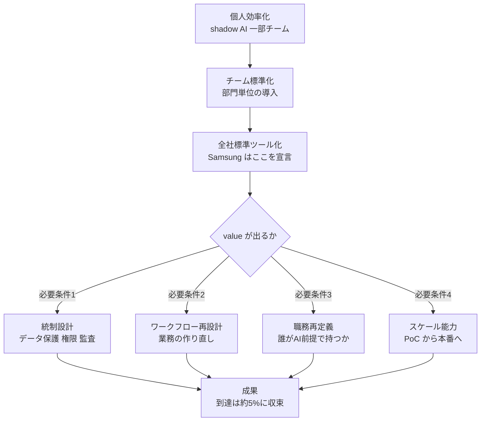

2026年6月21日、OpenAI は Samsung Electronics への ChatGPT Enterprise と Codex の大規模展開を発表しました。この発表は、生成AIが「一部の先進チームの試行」から「全社の標準業務基盤」へ移る局面を象徴します。

ただし一次情報を読むと、見出しの華やかさとは別の事実が見えてきます。この発表には Samsung 固有の成果指標が含まれていません。本記事では「全社に配布した」と「全社で効いている」の距離を軸に、全社AI導入で実際に成果を分ける要因を、一次情報と独立調査から構造化します。

想定読者は、自社で「個人効率化」から「全社標準ツール化」へ進む統制設計を担う PM やエンジニアリング組織リーダーです。

## 概要

OpenAI が発表した展開の対象は、次の2つです（出典: OpenAI Blog 本文）。

- 韓国の Samsung Electronics 全社員
- DX（Device eXperience）部門の全世界の全社員

OpenAI はこれを「自社最大級のエンタープライズ展開のひとつ（one of OpenAI's largest enterprise deployments to date）」と位置づけています。

本調査で確認した最も重要な事実は、この発表に Samsung 固有の成果指標（KPI・ROI・定着率・対象人数）が一切含まれない点です。発表内の定量値はいずれも Codex 全体・韓国全体の数字であり、Samsung 単独のものではありません。

| 発表内の定量値 | 実際のスコープ |
|---|---|
| Codex を週500万人以上が利用 | Codex 全体の利用規模（Samsung 固有でない） |
| 韓国の Codex 週次アクティブが約800%増（2026-02-01比） | 韓国全体の数字（Samsung 固有でない） |
| 対象人数 | 一次本文に記載なし |

つまりこのニュースは「全社に配布する条件が整った」という宣言であり、「全社で効いている」という実証ではありません。

## 特徴

一次情報（OpenAI ブログ本文、Wayback の verbatim 復元）から確定できる特徴は次の5点です。

### 配布対象が職能横断・全社

原文は対象業務を "from R&D and manufacturing to marketing, corporate functions, and other areas" と明記し、技術部門に閉じません。Codex も「コード生成だけ」ではなく、"turn ideas into working software, internal tools, websites, and automated workflows"（アイデアを動くソフト・内製ツール・Webサイト・自動化ワークフローに変える）と位置づけられています。Codex は非技術チームの内製ツール化・業務自動化の実行面として語られています。

### 統制は総称表現にとどまる

一次が挙げる統制は次の表現です。

| 一次の表現 | 内容 |
|---|---|
| data protection | データ保護 |
| user and access management | ユーザー・アクセス管理 |
| security controls | セキュリティコントロール |
| within the company's security policies and governance framework | 自社のセキュリティ方針・ガバナンス枠組みの内側での利用 |

具体語としての「データ非学習（no-training）」「監査ログ」は、一次本文に登場しません。製品としては存在しますが、本発表ページは総称表現どまりです。

### 既存の半導体協業からの関係拡大

Samsung は次世代AIインフラ向けの先端メモリ半導体を OpenAI に供給しています。今回はその関係が "workforce transformation and company-wide AI adoption" へ広がる文脈で語られています。

### 韓国エコシステム全体の動きの一部

同ブログは、Seoul National University の ChatGPT Edu 全47,000名提供、Kakao の KakaoTalk 内 ChatGPT、LG Electronics や Krafton など韓国企業群の利用を併記しています。Samsung 単体ではなく国家規模の AI 導入波の象徴として提示されています。

### 第三者による独立検証が現時点で存在しない

一次は OpenAI 自社ブログのみで、二次報道もその引き写しが中心です。発表が新しく（2026-06-21）、Samsung 側の独立した効果報告は本調査時点で確認できませんでした（[未確認]）。

## 概念構造

全社AI導入を「配布（reach）」と「成果（value）」の2軸で捉えると、本件と一般的なエンタープライズAI導入の課題が一枚で整理できます。

| 要素 | 説明 |
|---|---|
| A から C | 個人効率化から全社標準ツール化への移行段階 |
| C | Samsung が宣言した位置（全社配布の条件が整った段階） |
| D | 成果が出るかの分岐 |
| E から H | 成果に到達するための必要条件群 |
| I | 成果（EBIT・定着）。配布が進んでも到達は約5%前後に収束 |

ポイントは、配布（C）と成果（I）の間に複数の必要条件が挟まる点です。Samsung が宣言したのは C であり、I とは別物です。

### 統制設計は必要条件であり十分条件でない

ChatGPT Enterprise と Codex が全社配布を可能にする統制機能は、公式ドキュメントから次が確認できます（openai.com が自動取得を 403 でブロックするため検索インデックス経由の抜粋であり、原文の1対1照合は一部未了。[要一次照合]）。

| 領域 | 主な機能 |
|---|---|
| ID・権限 | SSO/SAML（Business 以上）、SCIM/Directory Sync（Enterprise のみ）、RBAC、IP allowlist |
| データ保護 | デフォルトで学習に不使用・所有権は顧客、保存時 AES-256／転送時 TLS 1.2+、EKM（BYOK） |
| 認証 | SOC 2 Type 2、ISO 27001 系、HIPAA は BAA |
| 監査 | Compliance Logs Platform（immutable、Admin Audit／User Authentication／Codex Usage、保持30日、Enterprise/Edu 限定） |
| Codex の統制 | Workspace Settings で local/cloud 環境を組織単位制御、アクセストークン（agent identity）、cloud は隔離コンテナ |
| データレジデンシー | 米・欧・英・加・日・韓・星・豪・印・UAE で保管 |

ただし統制を必要条件と見なすことには反証があります。後述する MIT の研究は、全社導入が成果に結びつかない主因を、統制不足ではなくワークフロー統合と組織学習の欠如に求めています。統制は「使ってよい状態」を作りますが、「使って効く状態」までは作りません。

### スケーリングギャップが配布と成果の乖離を裏づける

複数の独立した調査会社レポートが、配布と成果の乖離を一貫して示します。いずれも二次情報のため、標本と時点を併記します。

| レポート | 標本・時点 | 主な数値 |
|---|---|---|
| McKinsey「The State of AI in 2025」[二次情報] | n=1,993／105カ国、2025-11-05 | 88%が1業務以上でAI常用、EBIT影響を認めるのは39%でその大半が5%未満、高パフォーマーは約6% |
| BCG「Where's the Value in AI?」[二次情報] | n=1,000／59カ国、2024-10-24 | 74%が tangible value 未達、PoC を越える capability 確立は26%（うち cutting-edge は4%） |
| BCG「AI Radar 2025」[二次情報] | n=1,803、2025-01 | 75%が AI を優先トップ3に挙げるが、significant value 実現は25% |

数値の定義はレポートごとに異なりますが、「広く配布されているのに成果到達は2〜6%程度」という収束が見えます。Samsung 型の全社配布が、それ自体では成果を保証しないことの傍証です。

### 職務再定義が本質

一次が "for technical and non-technical work" を強調する通り、全社AI導入の本質は職務の再設計にあります。以下は一般化のための整理で、二次情報が中心です。

| 論点 | 内容 |
|---|---|
| 置換の単位 | ジョブよりタスク。OECD 系の整理で過半がタスク単位の置換 |
| 新ロール | agent boss、AI orchestrator など、AIエージェント群を差配する役割 |
| 評価制度 | 静的な RACI から動的な decision rights へ。人間と機械の組み合わせの成果を測る方向 |
| 非技術部門のガードレール | 部門ごとに固有の規制リスクへ統制を当てる必要 |
| 市民開発 | Codex の内製ツール化が citizen development として広がる場合、作成・承認・運用の統制が新たな論点 |

非技術部門のガードレールは、部門ごとに当てるべき規制が異なります。配布範囲が広いほど、この部門差を無視した一律ルールが破綻します。

| 部門 | 主なリスク | ガードレールの例 |
|---|---|---|
| 人事 | 採用・評価での差別、適用法令 | AI出力の人手レビュー、選考での自動判定の制限 |
| 法務 | 守秘義務、引用の正確性 | 顧客データの入力制限、出力の弁護士確認 |
| 経理 | 財務統制、監査証跡 | 数値の根拠提示の義務化、承認フローの維持 |
| マーケ | 著作権、ブランド毀損 | 生成物の権利確認、公開前の人手チェック |

### 反証と留保

本件を「全社AI導入の成功好例」と読むことには、次の危うさがあります。

| 反証の筋 | 内容 |
|---|---|
| 発表バイアス | 一次は OpenAI 自社ブログのみ。Samsung 固有の成果指標はゼロで、規模イコール成果の根拠が事実上ない |
| ROI 不発の一般傾向 | MIT NANDA の "GenAI Divide" が「GenAIパイロットの約95%が ROI 不発」と報告 |
| 職務再設計の負の側面 | Klarna は約700名分の業務をAIに置換したが品質低下・顧客離反を招き、CEO が一部再雇用 |
| 2023年の反転 | Samsung は2023年に機密漏洩を機に生成AI利用を全社禁止したと複数の二次が伝える（一次に記載なし。[要再検証]） |
| ベンダーロックイン | 単一ベンダーでの全社標準化は、障害・値上げ・移植困難のリスクを抱える |

特に「約95%が ROI 不発」という数値は、扱いに注意が必要です。標本数が報道と原典で食い違い（150インタビュー/350サーベイ と 52/153 など）、査読前で、利益相反の指摘もあります。Wharton の Werbach 教授は "deeply problematic" と批判しています。裸で断定せず、傾向の傍証としてのみ扱うべき数値です（[要再検証]）。

なお2023年の全社禁止は、「好例フレーム」を弱める一方で、「統制が前提条件である」ことをむしろ補強します。

## 未解決の問い

- Samsung 固有の定着率・生産性効果・ROI は今後の一次発表待ち（[未確認]）。本記事の「未実証」評価は新情報で更新されるべき
- 2023禁止から2026全社展開への経緯の細部（漏洩件数・期間）は二次どまり（[要再検証]）
- ChatGPT Enterprise 機能の細部は openai.com の 403 ブロックにより原文の1対1照合が未了（[要一次照合]）
- Codex の内製ツール化が全社で誰の承認・運用統制下に置かれるかは、本発表から読み取れない

## 推奨

全社AI導入を設計する立場へ、本調査から導く実務的な指針です。

1. 配布と成果を別 KPI として設計する。ライセンス配布数や WAU は reach 指標にすぎないため、EBIT 寄与・業務時間削減・品質指標を value 指標として最初から分けて測る
2. 統制は必要条件として先に整え、十分条件をワークフロー再設計に置く。SSO・SCIM・監査・レジデンシーは「使ってよい状態」を作る前提であり、成果は「業務そのものを作り直したか」で決まる
3. ユースケースを絞る。先行企業は平均3.5ユースケースに集中する。全部門に配って全部やるのではなく、効く業務を選んで深くやる
4. 職務再定義と評価制度をセットで動かす。「誰がどの業務をAI前提で持つか」を明文化し、人間と機械の成果を測る評価へ移す。過剰な置換は劣化リスクを伴うため段階的に進める
5. 非技術部門の内製ツール化に統制を用意する。Codex で作られた internal tools や automated workflows の承認・運用・廃棄のライフサイクルを誰が持つかを先に決める
6. ベンダー集中リスクに出口を持つ。単一ベンダー標準化の便益と引き換えに、冗長性・移植性・契約条件の見直し条項を設計に含める

## まとめ

Samsung の全社AI展開は「全社配布の条件が整った」という宣言であり、固有の成果はまだ実証されていません。配布と成果の間には、統制設計・ワークフロー再設計・職務再定義・スケール能力という必要条件が挟まり、成果に到達する組織は独立調査で約5%前後に収束します。配布数を成果と取り違えず、業務そのものの作り直しに踏み込むことが、全社AI導入の分かれ目になります。

この記事が少しでも参考になった、あるいは改善点などがあれば、ぜひリアクションやコメント、SNSでのシェアをいただけると励みになります！

## 参考リンク

- 公式ドキュメント
  - [ChatGPT Enterprise and Codex available to all Samsung Electronics employees in Korea and all Device eXperience (DX) employees worldwide](https://openai.com/index/samsung-electronics-chatgpt-codex-deployment/)
  - [Wayback Machine 復元版（一次本文 verbatim）](http://web.archive.org/web/20260622092048/https://openai.com/index/samsung-electronics-chatgpt-codex-deployment/)
- 調査レポート
  - [McKinsey: The State of AI in 2025](https://www.mckinsey.com/capabilities/quantumblack/our-insights/the-state-of-ai)
  - [BCG: Where's the Value in AI?](https://www.bcg.com/publications/2024/wheres-value-in-ai)
  - [BCG: From Potential to Profit（AI Radar 2025）](https://www.bcg.com/publications/2025/closing-the-ai-impact-gap)
