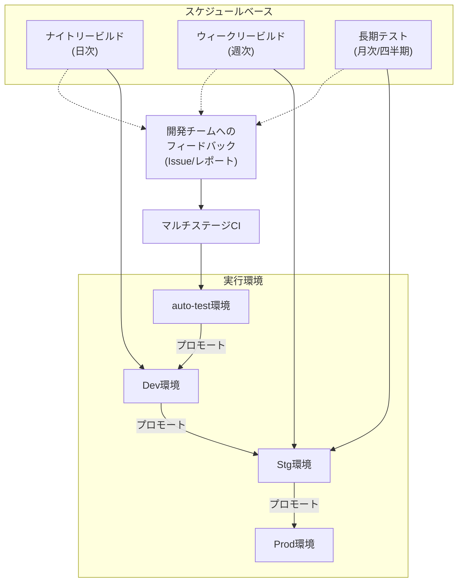

コミットごとのCI/CDパイプラインは開発速度を劇的に向上させますが、それだけではシステム全体の長期的な品質を保証することは困難です。本記事では、高速なフィードバックサイクルを維持する「マルチステージCI x GitOps戦略」をさらに強化・補完するための「スケジュールベースの品質監視パイプライン」を提案します。

ナイトリー（日次）、ウィークリー（週次）、長期（月次/四半期）という3つの階層的なサイクルを組み合わせ、コミット単位のテストでは捉えきれない広範な品質問題を早期に発見し、継続的な品質改善を実現する方法を具体的に解説します。

https://zenn.dev/suwash/articles/microservices_cicd_20250912

https://zenn.dev/suwash/articles/ci_nightly_build_strategy_20250923

## 1. 概要

このパイプラインは、コミットごとに実行されるSystem CIとは独立して、定期的にシステムの健全性を多角的に検証することを目的とします。各サイクルの役割と目的は以下の通りです。

### 1.1. 各サイクルの役割と目的

| サイクル | 実行環境 | 頻度 | 主な役割 | 目的 | 実行時間帯の例 |
| :--- | :--- | :--- | :--- | :--- | :--- |
| **ナイトリー（日次）** | Dev環境 | 毎日 | 日次の健康診断と早期フィードバック | ・前日の変更によるデグレード検出 ・依存関係の小口更新 ・基本的な品質保証 ・翌朝の開発開始前に結果提供 | 22:00-02:00 |
| **ウィークリー（週次）** | Stg環境 | 毎週金曜 | 本番相当環境での深い品質検証 | ・性能ベースラインの定点観測 ・包括的なセキュリティ検証 ・コスト・コンプライアンス監視 ・週次トレンドの可視化 | 金曜23:00- 土曜朝 |
| **長期テスト（月次/四半期）** | Stg環境 | 月1回〜 | システムの限界と持続可能性の検証 | ・長時間運用での劣化検出 ・災害復旧能力の確認 ・耐障害性の包括的検証 ・リリース判定の最終確認 | 月初週末 （計画実行） |

### 1.2. 実行環境の位置づけ

- **auto-test環境**: コミット駆動のSystem CI専用環境
- **Dev環境**: 開発の最新状態で、軽量かつ高頻度なテストを実行
- **Stg環境**: 本番相当の環境で、重量かつ低頻度なテストを実行

### 1.3. 期待される成果の例

- **本番障害の発生頻度**: 導入前後で80%以上削減
- **パフォーマンス劣化の早期発見**: 週次で±10%以上の変動を検出
- **重大なセキュリティ脆弱性の修正リードタイム**: 平均3日以内

## 2. パイプラインの全体像

スケジュールベースの各パイプラインは、それぞれ異なる環境とタイミングで実行され、その結果は開発チームへフィードバックされます。これにより、継続的な品質改善のループを形成します。

上の図は、本戦略の全体像を示しています。通常のCI/CDフロー（プロモートの流れ）とは別に、3つのスケジュールベースのパイプラインが並行して動作します。重要なのは、これらのパイプラインの実行結果がすべてIssueやレポートとして開発チームにフィードバックされ、次の開発サイクル（マルチステージCI）に活かされるという「**品質改善のループ**」を形成している点です。これにより、コミット単位の「速いフィードバック」と、スケジュールベースの「深いフィードバック」を両立させます。

## 3. 各パイプラインの詳細な実施内容

各サイクルで実施する品質検証の観点と詳細は以下の通りです。

### 3.1. ナイトリービルド (on Dev環境)

毎日の開発作業によるデグレードを早期に発見し、開発者に迅速にフィードバックします。

| 分類 | 実施する観点 | 詳細 |
| :--- | :--- | :--- |
| **テスト** | E2E回帰テスト（主要シナリオ） UIビジュアル回帰（軽量） Flakyテスト追跡 | ・重要な業務シナリオ20-30本 ・主要画面のスナップショット比較 ・不安定なテストの記録と改善 |
| **セキュリティ** | SAST（フルスキャン） 依存関係スキャン（SCA） Secretsスキャン SBOM/ライセンスチェック | ・ソースコード静的解析 ・npm audit / pip check ・git-secrets等での漏洩チェック ・ライセンス違反の検出 |
| **品質管理** | コードカバレッジ計測 品質メトリクス収集 リリースノート自動生成 | ・単体/統合テストのカバレッジ ・循環的複雑度、技術的負債 ・前日からの変更内容まとめ |
| **運用** | 依存関係更新ドライラン 軽量パフォーマンステスト | ・Dependabot/Renovateの検証 ・主要APIのレスポンスタイム計測 |

  - **総観点数**: 15項目程度
  - **実行時間**: 2-4時間

### 3.2. ウィークリービルド (on Stg環境)

本番相当の環境で、より深く網羅的な検証を行い、週次の品質ベースラインを定点観測します。

| 分類 | 実施する観点 | 詳細 |
| :--- | :--- | :--- |
| **テスト** | E2E回帰テスト（網羅的） コントラクトテスト全組合せ 互換性テスト i18n/a11yテスト | ・全業務シナリオ100本以上 ・マイクロサービス間API検証 ・ブラウザ/OS/DBバージョン互換性 ・国際化/アクセシビリティ監査 |
| **パフォーマンス** | 負荷テスト（ベースライン） ストレステスト SLO/エラーバジェット分析 | ・通常〜ピーク時負荷シミュレーション ・限界性能の測定 ・サービスレベル目標の達成度評価 |
| **セキュリティ** | DAST（フルスキャン） コンテナ/OSイメージ詳細スキャン IaC/ポリシー準拠チェック 脆弱性SLA監視 | ・動的脆弱性検査（ログイン後含む） ・Trivy等での深層スキャン ・OPA/Regulaでのコンプライアンス ・修正期限超過の検出 |
| **運用・コスト** | コスト/FinOps分析 監視ルール健全性テスト ログ/メトリクス異常検知 インフラドリフト検知（軽量） | ・週次コストトレンドと予算比較 ・アラート動作のシンセティック監視 ・カーディナリティ爆発の予防 ・GitOps定義との差異確認 |
| **データ品質** | データ品質プロファイリング DBマイグレーションテスト | ・DQルール適用と異常値検出 ・大量データでの移行検証 |

  - **総観点数**: 20項目程度
  - **実行時間**: 6-12時間

### 3.3. 長期テスト (on Stg環境)

システムの長期的な安定性、耐障害性、災害復旧能力など、短時間のテストでは判明しづらい問題を検証します。

| 分類 | 実施する観点 | 詳細 |
| :--- | :--- | :--- |
| **長期安定性** | Soakテスト（72時間） メモリ/リソースリーク検証 GC挙動分析 | ・連続稼働での劣化検出 ・ヒープダンプ解析 ・ガベージコレクション最適化 |
| **耐障害性** | Chaos Engineering 障害シミュレーション フェイルオーバー検証 | ・Pod削除、ネットワーク遅延注入 ・ディスク枯渇、CPU/メモリ制限 ・自動復旧能力の確認 |
| **災害復旧** | バックアップ・リストア演習 DRサイト切替テスト RPO/RTO測定 | ・完全復旧手順の検証 ・データ損失許容時間の確認 ・復旧時間目標の達成度 |
| **運用検証** | 本格的ドリフト検知 長期的コスト予測 容量計画検証 | ・手動変更による設定ドリフト ・3-6ヶ月先のコスト推計 ・スケーラビリティ限界の把握 |

  - **総観点数**: 10項目程度
  - **実行時間**: 72時間以上

## 4. 品質監視観点と実装方法

### 4.1. 観点別 実施タイミング・環境サマリー

各品質観点をどのサイクルで実施するのが最適かを示します。

| \# | 分類 | 観点 | ナイトリー Dev | ウィークリー Stg | 長期 Stg | 優先度 |
| :- | :--- | :--- | :---: | :---: | :---: | :---: |
| 1 | テスト | E2E回帰テスト（主要シナリオ） | ◎ | ○ | － | 高 |
| 2 | テスト | E2E回帰テスト（網羅的） | － | ◎ | ○ | 高 |
| 3 | テスト | UIビジュアル回帰テスト | ○ | ◎ | － | 中 |
| 4 | テスト | コントラクトテスト（API全組合せ） | △ | ◎ | － | 高 |
| 5 | テスト | 互換性テスト（ブラウザ/OS/DB） | － | ◎ | △ | 中 |
| 6 | テスト | i18n/a11y自動監査 | △ | ◎ | － | 中 |
| 7 | テスト | Flakyテスト追跡・分析 | ◎ | ○ | － | 中 |
| 8 | パフォーマンス | レスポンスタイム計測（軽量） | ○ | － | － | 高 |
| 9 | パフォーマンス | 負荷テスト（ベースライン） | － | ◎ | △ | 高 |
| 10 | パフォーマンス | ストレステスト（限界性能） | － | ○ | ◎ | 中 |
| 11 | パフォーマンス | スパイクテスト（急激な負荷変動） | － | ○ | △ | 中 |
| 12 | パフォーマンス | Soakテスト（耐久/72時間） | － | － | ◎ | 高 |
| 13 | パフォーマンス | SLO/エラーバジェット分析 | △ | ◎ | ○ | 高 |
| 14 | セキュリティ | SAST（静的解析フルスキャン） | ◎ | ○ | － | 高 |
| 15 | セキュリティ | DAST（基本スキャン） | ○ | － | － | 高 |
| 16 | セキュリティ | DAST（フルスキャン/認証込） | － | ◎ | △ | 高 |
| 17 | セキュリティ | 依存関係スキャン（SCA） | ◎ | ○ | － | 高 |
| 18 | セキュリティ | コンテナ/OSイメージスキャン | ○ | ◎ | △ | 高 |
| 19 | セキュリティ | SBOM生成・ライセンス監視 | ◎ | ○ | － | 中 |
| 20 | セキュリティ | Secretsスキャン（履歴含む） | ◎ | △ | － | 高 |
| 21 | セキュリティ | IaC/ポリシー準拠（OPA/Regula） | △ | ◎ | △ | 中 |
| 22 | セキュリティ | 脆弱性SLA監視・エスカレーション | ○ | ◎ | － | 高 |
| 23 | データ品質 | データプロファイリング・DQルール | △ | ◎ | ○ | 中 |
| 24 | データ品質 | DBマイグレーションテスト（大量） | － | ◎ | △ | 中 |
| 25 | 運用 | 依存関係更新ドライラン | ◎ | △ | － | 高 |
| 26 | 運用 | 監視ルール健全性（シンセティック） | △ | ◎ | － | 中 |
| 27 | 運用 | ログ/メトリクス異常検知 | △ | ◎ | ○ | 中 |
| 28 | 運用 | インフラドリフト検知（軽量） | － | ○ | － | 中 |
| 29 | 運用 | インフラドリフト検知（詳細） | － | － | ◎ | 中 |
| 30 | 品質管理 | コードカバレッジ計測・トレンド | ◎ | ◎ | － | 高 |
| 31 | 品質管理 | 品質メトリクス（複雑度/技術的負債） | ◎ | ◎ | － | 高 |
| 32 | 品質管理 | リリースノート自動生成 | ◎ | ○ | － | 中 |
| 33 | 品質管理 | 回帰ホットスポット可視化 | ○ | ◎ | － | 中 |
| 34 | コスト | コスト/FinOps分析（日次差分） | ○ | － | － | 中 |
| 35 | コスト | コスト/FinOps分析（週次トレンド） | － | ◎ | － | 高 |
| 36 | コスト | 長期コスト予測（3-6ヶ月） | － | － | ◎ | 中 |
| 37 | 耐障害性 | Chaos Engineering（基本） | － | △ | － | 中 |
| 38 | 耐障害性 | Chaos Engineering（包括的） | － | － | ◎ | 高 |
| 39 | 耐障害性 | フェイルオーバー検証 | － | △ | ◎ | 高 |
| 40 | 災害復旧 | バックアップ検証（軽量） | － | ○ | － | 高 |
| 41 | 災害復旧 | バックアップ・リストア演習（完全） | － | － | ◎ | 高 |
| 42 | 災害復旧 | DRサイト切替テスト | － | － | ◎ | 高 |
| 43 | 災害復旧 | RPO/RTO測定 | － | △ | ◎ | 高 |
| 44 | 長期安定性 | メモリ/リソースリーク検証 | － | △ | ◎ | 高 |
| 45 | 長期安定性 | GC挙動分析・最適化 | － | － | ◎ | 中 |
| 46 | 長期安定性 | 接続プール枯渇監視 | － | △ | ◎ | 中 |
| 47 | 容量計画 | スケーラビリティ限界測定 | － | △ | ◎ | 中 |
| 48 | 容量計画 | リソース使用傾向分析 | △ | ◎ | ○ | 中 |

**凡例**

  - **◎**: 最適（メインの実施タイミング）
  - **○**: 適する（補助的に実施）
  - **△**: 限定的（必要に応じて実施）
  - **－**: 非推奨（実施しない）

### 4.2. 分類別の詳細な実装方法

#### 4.2.1. テスト

| 観点 | 詳細な実施項目 | 構成例 |
| :--- | :--- | :--- |
| **E2E回帰テスト (主要シナリオ)** | ・ログイン→主要機能の導線確認 ・CRUD操作の基本フロー ・決済/購入フロー ・20-30シナリオに限定 | Playwright + GitHub Actions |
| **E2E回帰テスト (網羅的)** | ・全画面/全機能の操作確認 ・境界値/異常系の網羅 ・100+シナリオ | Playwright + Selenium Grid + TestRail |
| **UIビジュアル回帰テスト** | ・全画面スクリーンショット ・レスポンシブ（複数解像度） ・差分しきい値設定 | Percy or Chromatic（SaaS推奨） |
| **コントラクトテスト (API契約)** | ・Provider/Consumer間の契約 ・リクエスト/レスポンス形式 ・破壊的変更の検出 | Pact Broker + CI/CD統合 |
| **互換性テスト** | ・ブラウザ: Chrome/Safari/Edge/Firefox ・OS: Windows/Mac/Linux ・モバイル: iOS/Android | BrowserStack（コスト効率） |
| **i18n/a11y監査** | ・WCAG 2.1 AA準拠チェック ・スクリーンリーダー対応 ・多言語UI/日付形式 | axe-core + Lighthouse CI |
| **Flakyテスト追跡・分析** | ・失敗率の記録と可視化 ・リトライ結果の分析 ・原因分類と修正優先度の判定 | Test Analytics + Grafanaダッシュボード |

#### 4.2.2. パフォーマンス

| 観点 | 詳細な実施項目 | 構成例 |
| :--- | :--- | :--- |
| **レスポンスタイム計測（軽量）** | ・主要API応答時間 ・静的リソース配信速度 ・95/99パーセンタイル | Datadog Synthetics + カスタムスクリプト |
| **負荷テスト (ベースライン)** | ・想定同時接続数での動作 ・通常時〜ピーク時負荷 ・スループット測定 | K6 + InfluxDB + Grafana |
| **ストレステスト** | ・限界性能の特定 ・ブレークポイント分析 ・スケールアウト検証 | K6 + Prometheus + カスタムダッシュボード |
| **Soakテスト (耐久テスト)** | ・72時間連続稼働 ・メモリリーク検出 ・コネクションプール枯渇 | K6 (分散モード) + APMツール連携 |
| **SLO/エラーバジェット分析** | ・可用性 (99.9%等) ・エラー率しきい値 ・レイテンシ目標 ・バジェット消費率 | Datadog SLO or Prometheus + Sloth |

#### 4.2.3. セキュリティ

| 観点 | 詳細な実施項目 | 構成例 |
| :--- | :--- | :--- |
| **SAST (静的解析)** | ・ソースコード脆弱性 ・ハードコードされた認証情報 ・SQLインジェクション/XSS脆弱性 | SonarCloud + Semgrep |
| **DAST (動的解析)** | ・認証バイパス試行 ・インジェクション攻撃 ・セッション管理の不備 | OWASP ZAP + カスタムルール |
| **依存関係スキャン(SCA)** | ・既知の脆弱性CVE ・ライセンス違反 ・古いバージョン検出 | Snyk or GitHub Dependabot |
| **コンテナ/イメージスキャン** | ・ベースイメージ脆弱性 ・不要なパッケージ ・Dockerfile best practices | Trivy + Harbor Registry |
| **SBOM生成** | ・全依存関係リスト ・バージョン情報 ・CycloneDX/SPDX形式 | Syft + Grype + SBOM管理DB |
| **Secretsスキャン** | ・APIキー/トークン/パスワード ・証明書 ・Git履歴全体 | TruffleHog + pre-commitフック |
| **IaC/ポリシー準拠** | ・セキュリティグループ設定 ・暗号化の強制 ・最小権限の原則 | OPA + Conftest or Checkov |

#### 4.2.4. その他

| 分類 | 観点 | 詳細な実施項目 | 構成例 |
| :--- | :--- | :--- | :--- |
| **データ品質** | **データ品質プロファイリング** | ・NULL値/欠損率 ・一意性制約違反 ・参照整合性 | Great Expectations + Airflow |
| **データ品質** | **DBマイグレーションテスト** | ・スキーマ変更の影響 ・大量データ移行時間 ・ロールバック可能性 | Flyway/Liquibase + 本番相当データ |
| **運用** | **依存関係更新ドライラン** | ・更新可能な依存関係 ・破壊的変更の検出 ・テスト実行結果 | Renovate + 自動テスト統合 |
| **運用** | **監視ルール健全性** | ・アラート発火テスト ・通知経路の確認 ・しきい値の妥当性 | Datadog Synthetics + PagerDuty |
| **運用** | **インフラドリフト検知** | ・手動変更の検出 ・IaC定義との設定差異 ・承認されない変更 | Terraform Cloud + 定期plan実行 |
| **品質管理** | **コードカバレッジ** | ・行/分岐/関数カバレッジ ・変更分カバレッジ ・トレンド分析 | Codecov + PR自動コメント |
| **品質管理** | **品質メトリクス分析** | ・循環的複雑度 ・技術的負債 ・コード重複率 | SonarCloud + 品質ゲート |
| **品質管理** | **リリースノート自動生成** | ・コミット履歴解析 ・PR/Issue紐付け ・カテゴリ分類 | semantic-release + conventional commits |
| **コスト** | **コスト/FinOps分析** | ・サービス/環境別コスト ・予算超過アラート ・無駄なリソース検出 | AWS Cost Explorer + カスタムダッシュボード |
| **耐障害性** | **Chaos Engineering** | ・Pod/ノード障害 ・ネットワーク遅延/分断 ・依存サービス停止 | Chaos Mesh + 観測性ツール連携 |
| **耐障害性** | **フェイルオーバー検証** | ・自動フェイルオーバー ・手動切り替え手順 ・データ整合性確認 | Runbook自動化 + 計測スクリプト |
| **災害復旧** | **バックアップ/リストア** | ・完全/増分バックアップ ・リストア時間測定 ・Point-in-Time復旧 | Velero + 定期復旧訓練 |
| **災害復旧** | **DRサイト切替テスト** | ・サイト間同期確認 ・DNS切替時間 ・アプリケーション起動 | AWS Route 53 + 自動切替スクリプト |
| **災害復旧** | **RPO/RTO測定** | ・データ損失量（RPO） ・復旧時間（RTO） ・改善ポイント特定 | カスタム計測 + Grafana可視化 |
| **長期安定性** | **メモリ/リソースリーク検証** | ・ヒープメモリ推移 ・GC頻度/時間 ・DB接続プール/スレッド数 | APMツール + 言語別プロファイラ |

## 5. 導入計画

以下の3段階で、段階的にパイプラインを構築・成熟させます。

### 第1段階：基盤構築（日々の開発サイクルの安定化）

基本的な品質とセキュリティを担保し、開発の安全網を構築します。

  - E2E主要シナリオ
  - SAST実行
  - 依存関係スキャン
  - 軽量パフォーマンス計測
  - コードカバレッジ計測

### 第2段階：信頼性向上（本番環境の品質保証強化）

より高度なテストを導入し、本番環境の信頼性を向上させます。

  - 負荷テストベースライン
  - DAST実行
  - コンテナスキャン
  - 監視ルール健全性
  - バックアップ検証

### 第3段階：回復力強化（事業継続性の確保）

システムの回復力と長期的な安定性を確保し、ビジネスの継続性を高めます。

  - Chaos Engineering
  - Soakテスト
  - DRサイト切替
  - 包括的な互換性テスト
  - データ品質プロファイリング

## まとめ

本記事では、マルチステージCIとGitOps戦略を補完する、階層的なスケジュールベース品質監視パイプラインについて解説しました。コミット単位で実行される高速なCIパイプラインに加え、ナイトリー、ウィークリー、長期テストという異なる周期と粒度で品質を多角的に検証することで、**開発速度を損なうことなく、システムの信頼性、安全性、安定性を継続的に向上させる**ことができます。

重要なのは、完璧なパイプラインを一度に作ろうとせず、導入計画で示したように、まずは最もクリティカルな観点からスモールスタートすることです。本記事で提示した48の観点とツール構成例を参考に、ぜひ自社のプロダクトとチームに合った品質監視戦略の構築を始めてみてください。

この記事が少しでも参考になった、あるいは改善点などがあれば、ぜひリアクションやコメント、SNSでのシェアをいただけると励みになります！

---

## 参考リンク

- [マルチステージCIとGitOpsで実現するマイクロサービスのCI/CD戦略](https://zenn.dev/suwash/articles/microservices_cicd_20250912)
- [Kubernetesを使わないGitOpsライクな運用](https://zenn.dev/suwash/articles/gitops_without_kubernetes_20250920)
- [マルチステージCIとGitOpsで実現するマイクロサービスのCI/CD戦略 - Kubernetes以外の環境への適用](https://zenn.dev/suwash/articles/microservices_cicd_without_k8s_20250921)
- [速さと深さを両立させるパイプライン設計 - CIとナイトリービルドの関係](https://zenn.dev/suwash/articles/ci_nightly_build_strategy_20250923)