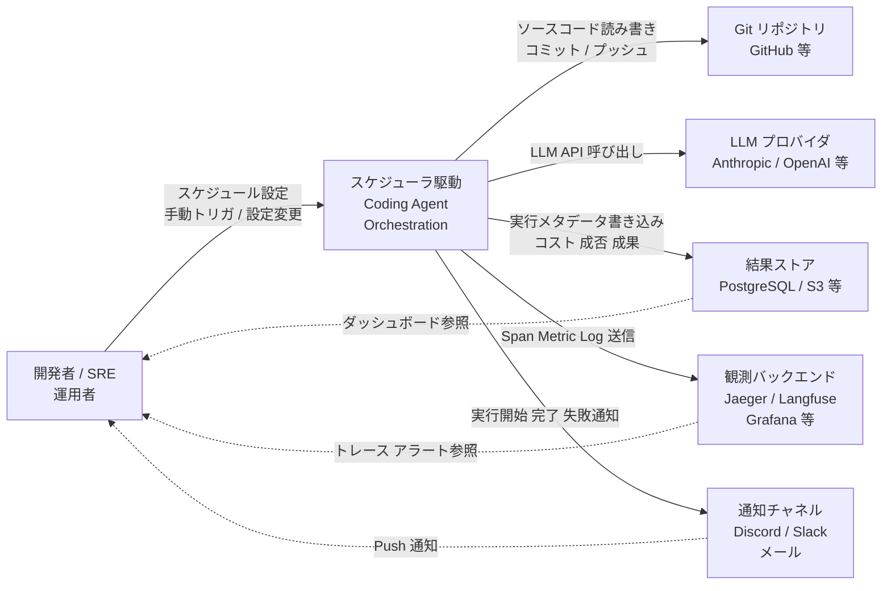
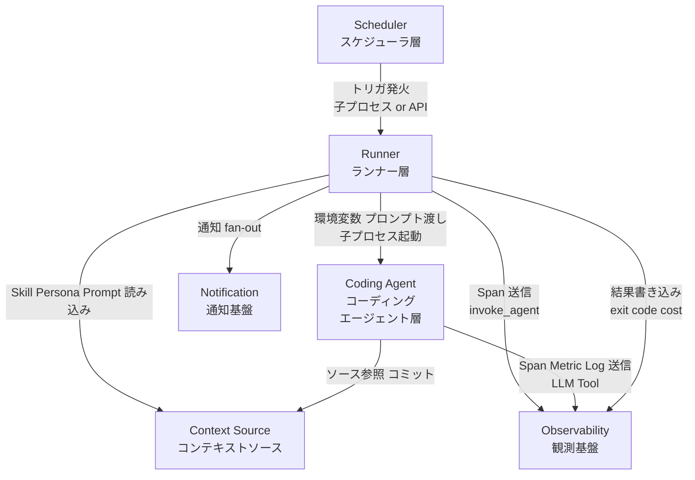
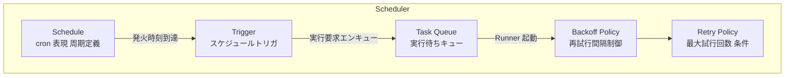
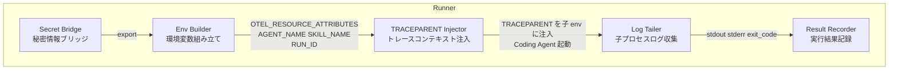
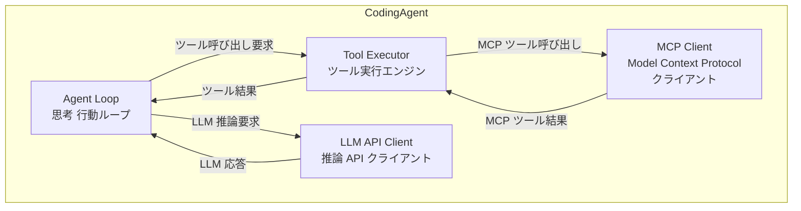
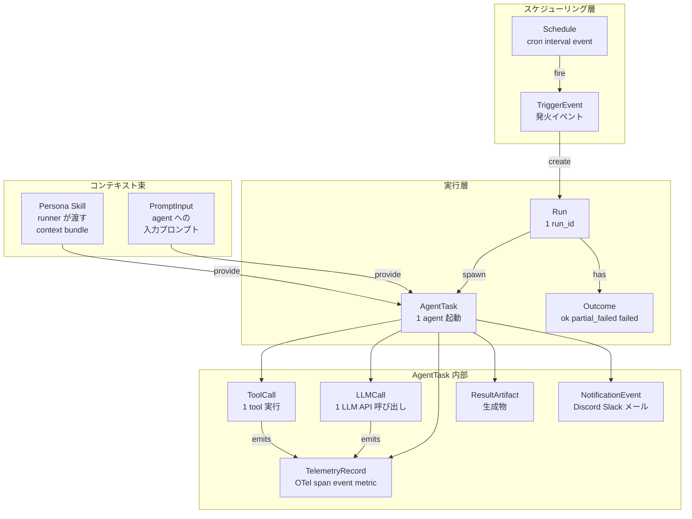
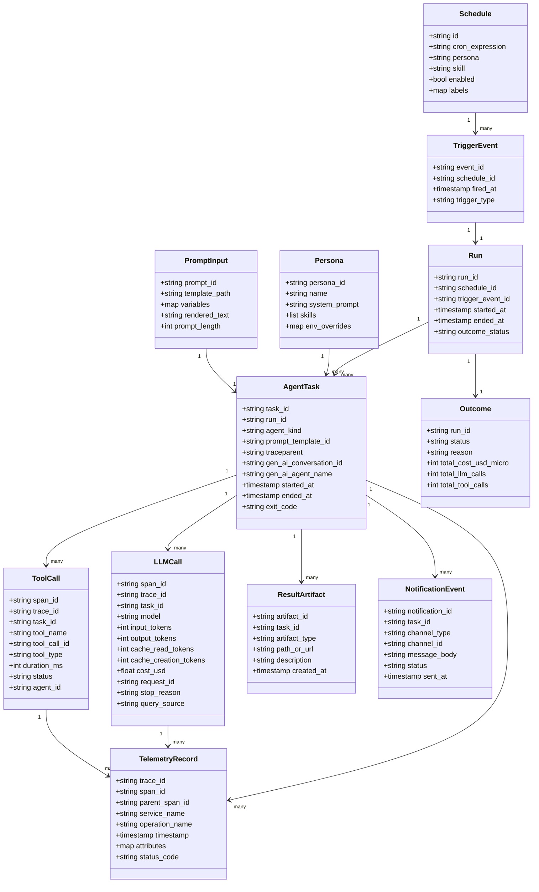

> 検証日: 2026-05-28
> 対象: スケジューラ駆動のコーディングエージェント実行パターン (抽象アーキテクチャパターン)
> 文脈: launchctl / Kestra / GitHub Actions などのスケジューラから Claude Code / Codex CLI を子プロセスとして定期起動する構成の一般化と実装ガイド
> 本記事のスコープ: OpenTelemetry / Jaeger v2 そのものの解説ではなく、**scheduler → runner → coding agent の実行設計** に焦点を絞ります。観測基盤側の基礎は既存記事 ([OpenTelemetry CNCF Graduated](https://suwa-sh.github.io/zenn-contents/articles/opentelemetry-cncf-graduated_20260522/) / [Jaeger×OpenTelemetry で AI エージェントの意思決定→ツール実行をトレースする](https://suwa-sh.github.io/zenn-contents/articles/jaeger-otel-agent-tracing_20260527/)) を参照してください。

## 概要

### このパターンが解決する問題

LLM を活用した定期タスク自動化では、「エージェントを決まった周期で起動し、コンテキストを与え、結果を外部システムに記録する」という繰り返し構造が共通して現れます。
従来のバッチ処理と異なり、コーディングエージェントはツール呼び出し・ファイル操作・外部 API 連携を agent loop 内で自律的に組み合わせるため、起動スクリプトがシンプルでも実行内容は非常に動的になります。
このパターンは、その「周期起動」「コンテキスト注入」「結果観測」の関心を分離し、再現性のある自動化として機能させることを目的としています。

### 3 層分離の目的

このパターンは以下の 3 層に関心を分離します。

| 層 | 役割 |
|---|---|
| スケジューラ層 | 周期または条件トリガで実行を開始する。cron / launchd / Kestra / Temporal / GitHub Actions などが該当する |
| ランナー層 | persona context・skill 名・環境変数・run_id を組み立て、コーディングエージェントを子プロセスとして起動する。ログ集約と OTel span 発行もここで担う |
| コーディングエージェント層 | LLM 呼び出しとツール実行を agent loop で自律的に行う。Claude Code / Codex CLI / Aider / Gemini CLI などが該当する |

3 層を分離することで、スケジューラを launchd から Kestra に置き換えてもランナーとエージェントは変更不要になり、エージェントを Claude Code から Codex CLI に差し替えてもスケジューラ側は影響を受けません。

### 関連技術との位置づけ

LangGraph / Strands (AWS) / Mastra / Microsoft Agent Framework などは、**1 回の実行内部** でのグラフ構造・状態管理・マルチエージェント通信に焦点を当てるフレームワークです。
Scheduler-Driven Coding Agent Orchestration は、**「その実行を外側から定期的に蹴る」構成全体** を指します。
双方は排他関係ではなく、LangGraph で実装されたエージェントをスケジューラ駆動で定期起動する組み合わせも成立します。

### LLM API アプリケーションとの違い

LLM API を呼ぶアプリケーション (chatbot / RAG サーバなど) は、リクエストごとに LLM を呼んで結果を返す **同期型応答モデル** です。
Scheduler-Driven Coding Agent は、定刻または条件トリガで起動し、複数のツール呼び出し・ファイル操作・外部 API 連携を **agent loop で自律的に実行して副作用を生成するバッチモデル** です。
実行時間は数分〜1 時間以上になることがあり、観測・冪等性・並列安全性の要件がアプリケーション型とは大きく異なります。

## 特徴

### スケジューラ抽象化

launchctl plist / cron / Kestra Flow / GitHub Actions workflow / Temporal Workflow は実装詳細が異なりますが、「定時または条件で shell コマンドを実行する」という役割は共通しています。
ランナー層が受け取るのは環境変数と起動引数だけに留めることで、スケジューラの違いを吸収できます。

#### スケジューラ比較

| スケジューラ | 起動方式 | 並列度 | 観測 | OS 依存 |
|---|---|---|---|---|
| launchctl (macOS launchd) | plist | プロセス並列 | log file | macOS のみ |
| cron / systemd timer | crontab | プロセス並列 | journald / syslog | Linux / macOS |
| Kestra | YAML Flow + Schedule trigger | task 並列 | OTel native (Beta) | JVM (Java 21+) |
| Temporal | Workflow code (Go / Java / TS 等) | activity 並列 | OTel native | サーバ常時起動必要 |
| GitHub Actions Workflow | YAML (`schedule:`) | matrix 並列 | Actions log + OTLP 拡張 | GitHub クラウド |
| Airflow / Dagster | Python DAG | task 並列 | XCom + log | サーバ常時起動必要 |

### コーディングエージェント比較 (2026-05 時点)

| Coding Agent | ヘッドレス実行 | TRACEPARENT 受信 | OTel native | 並列可否 |
|---|---|---|---|---|
| Claude Code (`claude -p`) | yes | yes (`-p` / Agent SDK のみ) | yes (beta) | OK |
| OpenAI Codex CLI (`codex exec`) | yes | 未確認 | metrics 欠落 (Issue #12913, closed in PR #13083 / traces+logs は出る) | OK |
| Aider (`--message`) | yes | no | no | OK |
| Gemini CLI | yes | 未確認 | yes (要確認: `.gemini/settings.json` の `telemetry.*`) | OK |

### ランナー層の役割

ランナー層 (run-agent.sh 等のシェルラッパー) は以下の責務を持ちます。

- 環境変数の組み立て: `OTEL_RESOURCE_ATTRIBUTES` に `persona` / `skill` / `run_id` を設定します
- persona context 注入: プロンプトテンプレートへの差し込みや skill ファイルの選択を行います
- run_id (冪等キー) の付与: `AGENT_LOOP_RUN_ID` などのユニーク ID を生成し、ログ・DB・OTel 属性に一貫して流します
- OTel `invoke_agent` span の発行: `otel-cli exec` などのツールで `gen_ai.operation.name=invoke_agent` の span を張り、`TRACEPARENT` を子プロセスに注入します
- 子プロセス起動と終了コード管理: コーディングエージェントを起動し、exit code / stdout 長を span attribute に記録します

### コーディングエージェント層の役割

コーディングエージェント層は LLM 呼び出しとツール実行を agent loop で自律的に繰り返します。
外から見ると「1 つのプロセスを起動して待つ」だけですが、内部では LLM 推論 → ツール選択 → ツール実行 → 結果評価 → 再帰の循環が行われています。

### 外部観測との関係

このパターンでは、コーディングエージェント単独では「複数 skill を並列 kick したオーケストレーション」のスコープを 1 本のトレースとして表現できません。
そのため、ランナー層がキック側で `invoke_agent` span を発行し、子プロセスへ `TRACEPARENT` を渡す構成が現実解になります。

| 観測要素 | 役割 |
|---|---|
| OpenTelemetry Collector | tail sampling / 属性正規化 / 複数 backend fan-out |
| Jaeger v2 | trace 精査 (OTLP 直接受信) |
| Langfuse / Phoenix (Arize) | LLM コスト集計・eval |
| 結果 DB | `agent_outcomes` テーブルに run_id / status / duration を記録し、span と相関させる |
| Discord / Slack 通知 | 実行完了・エラーをリアルタイム通知 |

OTel GenAI semantic conventions の `invoke_workflow` / `invoke_agent` / `execute_tool` という `gen_ai.operation.name` 値を、スケジューラ層・ランナー層・コーディングエージェント層に対応づけられます (ただし semconv が「必ずこの 3 階層で親子関係を作る」と強制しているわけではなく、`invoke_workflow` は判別できない場合は省略可能です)。
ただし、GenAI semconv は 2026-05 時点で全項目 Development ステータスであり、breaking change が継続中のため、ダッシュボードへのハードコードは注意が必要です。

### 並列実行・冪等性・冪等キー

スケジューラ駆動では、複数の skill を並列起動するケースが頻出します。並列実行の安全性を確保するために以下の設計が重要です。

- run_id: スケジューラがキック時に生成するユニーク ID を `AGENT_LOOP_RUN_ID` として環境変数に設定し、ログ・結果 DB・OTel span 属性 (`gen_ai.conversation.id`) に一貫して流します
- 並列時の /tmp 衝突回避: 固定パスの一時ファイルは run_id を含むユニーク名にします
- 冪等性: 結果 DB の run_id に unique 制約を設け、再実行時の二重書き込みを防ぎます。スケジューラ側 (Kestra の `workerTaskRestartStrategy=NEVER` など) でも二重起動を抑制します
- 長時間 run: agent loop が 1 時間以上かかる場合、tail_sampling collector の memory 線形増が問題になります。root span 分割と SpanLink の使用が現場の対処策です (OTel specification Discussion #3732 が 2 年以上 open のまま仕様空白)

## 構造

C4 model の 3 段階 (システムコンテキスト / コンテナ / コンポーネント) で本パターンの構造を記述します。

### システムコンテキスト図



| 要素 | 説明 |
|---|---|
| 開発者 / SRE / 運用者 | スケジュールや Skill を定義し、実行結果を参照・承認する人間アクター |
| スケジューラ駆動 Coding Agent Orchestration | 本パターンが扱うシステム全体。スケジューラが Coding Agent を起動し結果を管理する |
| Git リポジトリ | Coding Agent の操作対象。コードや設定ファイルの読み書きおよびコミットを受け取る |
| LLM プロバイダ | Claude / GPT 等の Inference API。Coding Agent が LLM 呼び出しを行う先 |
| 結果ストア | 実行ステータス・コスト・ドメイン成果を永続化する外部 DB またはオブジェクトストレージ |
| 観測バックエンド | Span / Metric / Log を受信し可視化する。trace 精査と集計・eval の用途で複数 backend を併用することが多い |
| 通知チャネル | 実行の開始・完了・失敗を push する外部サービス |

### コンテナ図



#### Scheduler

| コンポーネント | 説明 |
|---|---|
| Scheduler | cron 表現 / 周期トリガ / イベントトリガを受け付け Runner を発火させる。cron / launchctl / Kestra Flow / GitHub Actions / Temporal Workflow 等が該当する |

#### Runner

| コンポーネント | 説明 |
|---|---|
| Runner | Scheduler から起動されるシェルラッパーまたはプラグインタスク。環境変数の組み立て・Coding Agent の子プロセス起動・結果の記録を担う |

#### Coding Agent

| コンポーネント | 説明 |
|---|---|
| Coding Agent | LLM + Tool ループで構成されるコーディングエージェントプロセス。Claude Code / OpenAI Codex CLI 等が該当する |

#### Context Source

| コンポーネント | 説明 |
|---|---|
| Context Source | Coding Agent が参照するリポジトリ・プロンプトファイル・Persona 定義・Skill 定義の集合体 |

#### Observability

| コンポーネント | 説明 |
|---|---|
| Observability | OTel Span / Metrics / Log を収集・永続化する観測基盤。Collector Gateway と Jaeger / Langfuse / Grafana 等のバックエンドで構成される |

#### Notification

| コンポーネント | 説明 |
|---|---|
| Notification | 実行の開始・完了・失敗を外部チャネルに fan-out する通知基盤 |

### コンポーネント図

#### Scheduler 内部



| 要素 | 説明 |
|---|---|
| Trigger | Schedule または外部イベントを受けて実行要求を生成するトリガコンポーネント |
| Schedule | cron 表現 / 固定周期 / Flow Trigger 等で「いつ動くか」を定義する |
| Task Queue | 発火した実行要求を Runner に順次渡すキュー。concurrencyLimit 制御もここで行う |
| Backoff Policy | 失敗時の再試行間隔を指数バックオフ等で制御する |
| Retry Policy | 最大試行回数・retry 対象条件 (overloaded / rate_limit / network 等) を定義する |

具体例: Kestra Flow

| 要素 | Kestra での対応 |
|---|---|
| Trigger | `io.kestra.plugin.core.trigger.Schedule` / `io.kestra.plugin.core.trigger.Flow` |
| Schedule | `cron: "30 6 * * *"` + `timezone: Asia/Tokyo` + `recoverMissedSchedules: LAST` |
| Task Queue | Kestra Worker の Concurrent Task 管理 |
| Backoff Policy | Flow の `retry.type: EXPONENTIAL` / `multiplier` / `maxDuration` |
| Retry Policy | `retry.maxAttempt` + `retry.warningOnRetry` |

#### Runner 内部



| 要素 | 説明 |
|---|---|
| Env Builder | persona / skill / run_id / DB URL 等の実行コンテキストを環境変数として組み立てる |
| Secret Bridge | `~/.zshrc` や `.env` ファイルの API キー等を常駐プロセスの環境にブリッジする |
| TRACEPARENT Injector | `otel-cli exec` 等を使い W3C Trace Context を子プロセスの環境変数 `TRACEPARENT` に注入する |
| Log Tailer | 子プロセスの stdout / stderr / exit code を収集する |
| Result Recorder | exit code・コスト・ドメイン成果を結果ストアに書き込む |

具体例 A: launchctl + run-agent.sh + claude -p

| 要素 | 対応実装 |
|---|---|
| Env Builder | `run-agent.sh` の変数束縛部 (`AGENT_NAME` / `SKILL_NAME` / `DB_URL`) |
| Secret Bridge | `~/.claude/.env` を `set -a; . ~/.claude/.env; set +a` で source |
| TRACEPARENT Injector | (将来) `otel-cli exec` を挟む |
| Log Tailer | `claude -p ... > "${RESULT_FILE}" 2>/dev/null` |
| Result Recorder | `record-result.py` が結果テーブルに書き込む |

具体例 B: Kestra Shell task + otel-cli + codex exec

| 要素 | 対応実装 |
|---|---|
| Env Builder | Kestra Flow YAML の `env:` ブロック |
| Secret Bridge | `start.sh` が `~/.zshrc` の export 行を `grep` + `eval` でブリッジ |
| TRACEPARENT Injector | `otel-cli exec --name "invoke_agent {skill}" --kind internal --` |
| Log Tailer | Kestra Shell task の stdout capture |
| Result Recorder | `record-result.py` + Kestra dynamic outputs |

#### Coding Agent 内部



| 要素 | 説明 |
|---|---|
| Agent Loop | LLM 応答を受けてツール呼び出しを繰り返す中核ループ |
| Tool Executor | Bash 実行 / ファイル読み書き / Web 検索 等の Tool 呼び出しを処理する |
| MCP Client | Model Context Protocol に準拠した MCP Server へのリクエストを送受信する |
| LLM API Client | Anthropic / OpenAI 等の推論 API を呼び出す。OTel Span をここで emit する |

具体例 A: Claude Code (`claude -p`)

| 要素 | 対応実装 |
|---|---|
| Agent Loop | Claude Code 内部の interaction ループ (`claude_code.interaction` span) |
| Tool Executor | Built-in tool 群 (Bash / Read / Write / Edit 等) |
| MCP Client | MCP Servers への接続 |
| LLM API Client | Anthropic Messages API。`-p` モードでは `TRACEPARENT` を受信して親 span に nest する |

具体例 B: OpenAI Codex CLI (`codex exec`)

| 要素 | 対応実装 |
|---|---|
| Agent Loop | Codex Rust 実装の turn ループ (`codex.turn` span) |
| Tool Executor | shell / apply-patch 等のビルトインツール |
| MCP Client | `codex mcp-server` (2026-05 時点で OTel ゼロ) |
| LLM API Client | OpenAI Responses API。`codex exec` ヘッドレス時は metrics が欠落 (Issue #12913 / PR #13083 でクローズ。traces / logs は出力される。`codex mcp-server` は telemetry 未初期化) |

## データ

### 概念モデル



| 関係 | 多重度 | 説明 |
|---|---|---|
| Schedule → TriggerEvent | 1:N | 1 つの Schedule が複数回 fire し複数の TriggerEvent を生む |
| TriggerEvent → Run | 1:1 | 1 TriggerEvent = 1 Run。再試行は別 Run |
| Run → AgentTask | 1:N | 1 Run 内で複数 agent を直列・並列に起動できる |
| Run → Outcome | 1:1 | Run 完了時に 3-state で評価される |
| AgentTask → ToolCall / LLMCall / TelemetryRecord / ResultArtifact / NotificationEvent | 1:N | AgentTask が生成するすべての子レコード |
| Persona / Skill → AgentTask | 利用 | Runner が組み立てた context bundle を AgentTask に渡す |
| PromptInput → AgentTask | 利用 | テンプレート展開後のプロンプトを AgentTask が受け取る |
| ToolCall / LLMCall → TelemetryRecord | 利用 | 各呼び出しが OTel span/event として TelemetryRecord を生成 |

### 情報モデル



#### エンティティと OTel semconv の対応

| 本モデルのエンティティ | OTel GenAI semconv の対応概念 | 安定度 |
|---|---|---|
| AgentTask | `invoke_agent` span (INTERNAL) | Development |
| LLMCall | `chat` / `generate_content` span (CLIENT) | Development |
| ToolCall | `execute_tool` span (INTERNAL) | Development |
| TelemetryRecord | OTel Span / LogRecord / Metric data point | Stable (構造) / Development (gen_ai.* 属性) |
| Run | `invoke_workflow` span (INTERNAL) + `gen_ai.conversation.id` | Development |
| Outcome | span `status_code` (ERROR/OK) + カスタム属性 | Stable (status) / 独自 (3-state) |

#### 属性補足

- `run_id` は `AGENT_LOOP_RUN_ID` 相当。`outcome_status` は Outcome.status の denormalized コピーとして持つことで、Run 単体での集計クエリを容易にする
- `agent_kind` は `claude / codex / gemini / aider` 等のエージェント種別。`traceparent` は W3C Trace Context の `00-{trace_id}-{parent_span_id}-{flags}` 形式
- `gen_ai_conversation_id` は OTel GenAI semconv の `gen_ai.conversation.id` 属性に対応し、run_id を流用する運用が現実的 (会話履歴と実行 ID が別概念のシステムでは別属性に分ける)
- `cache_read_tokens` / `cache_creation_tokens` は OTel semconv の `gen_ai.usage.cache_read.input_tokens` / `gen_ai.usage.cache_creation.input_tokens` に対応
- `query_source` は `main / subagent / auxiliary` の 3 値 (Claude Code 固有属性)
- `tool_type` は OTel semconv `gen_ai.tool.type` の `function / extension / datastore` に相当
- `operation_name` は OTel GenAI semconv の `gen_ai.operation.name` 値 (`invoke_workflow / invoke_agent / chat / execute_tool` 等)
- `Outcome.status` は **ok / partial_failed / failed** の 3-state enum。`partial_failed` は一部 AgentTask が失敗したが Run 全体は継続した場合に使う

## 構築方法

### 前提条件 (共通)

#### Coding Agent CLI のインストールと認証

```bash
# Claude Code
npm install -g @anthropic-ai/claude-code
claude login   # OAuth / API キー認証

# OpenAI Codex CLI
npm install -g @openai/codex
codex login    # OPENAI_API_KEY 設定
```

#### otel-cli のインストール (任意)

```bash
# 直接ダウンロード (推奨): https://github.com/equinix-labs/otel-cli/releases
#   例: otel-cli_0.4.6_darwin_arm64.tar.gz を展開して PATH に置く

# Homebrew (注意: 2026-05 時点で macOS の otel-cli formula が壊れており、
#  `--version` フラグすら無い古い版が入るケースを実測。動かない場合は releases バイナリを使う)
brew install otel-cli
```

> 実測メモ: Homebrew 経由だと意図せず古い 0.x が入り `exec` の挙動が変わることがありました。
> CI や常駐ランナーに組み込む場合は、バージョン固定できる **releases バイナリの直接配置**が安定します。

#### 結果ストア (SQLite 最小スキーマ例)

```sql
-- 実装案
CREATE TABLE IF NOT EXISTS agent_runs (
    id            INTEGER PRIMARY KEY AUTOINCREMENT,
    agent_name    TEXT NOT NULL,
    skill_name    TEXT NOT NULL,
    started_at    DATETIME DEFAULT CURRENT_TIMESTAMP,
    finished_at   DATETIME,
    status        TEXT DEFAULT 'running',
    exit_code     INTEGER,
    error_message TEXT,
    total_tokens  INTEGER,
    total_cost_usd REAL
);

CREATE TABLE IF NOT EXISTS agent_outcomes (
    id            INTEGER PRIMARY KEY AUTOINCREMENT,
    run_id        INTEGER REFERENCES agent_runs(id),
    agent_name    TEXT,
    metric_name   TEXT,
    metric_value  REAL,
    metric_detail TEXT,
    recorded_at   DATETIME DEFAULT CURRENT_TIMESTAMP
);
```

### Pattern 1: launchctl + run-agent.sh + Claude Code

macOS の launchd を使い、一定時刻に `run-agent.sh` を起動して `claude -p` を実行するパターンです。OS 組み込みのため追加インストール不要で、最も手軽に始められます。

#### run-agent.sh の配置

```bash
#!/bin/bash
# 実装案
set -euo pipefail

AGENT_NAME="${1:?Usage: $0 <agent_name> <skill_name> [prompt]}"
SKILL_NAME="${2:?}"
PROMPT="${3:-/${SKILL_NAME}を実行して}"

export AGENT_LOOP_RUN_ID="${AGENT_LOOP_RUN_ID:-$(date +%Y%m%d_%H%M%S)_${AGENT_NAME}_${SKILL_NAME}}"
export OTEL_SERVICE_NAME="${OTEL_SERVICE_NAME:-scheduler-driven-agent}"
export OTEL_RESOURCE_ATTRIBUTES="agent.persona=${AGENT_NAME},agent.skill=${SKILL_NAME},deployment.environment=prod"
export CLAUDE_CODE_ENABLE_TELEMETRY=1

OUT="$(mktemp)"
trap 'rm -f "${OUT}"' EXIT

if command -v otel-cli &>/dev/null && [ -n "${OTEL_EXPORTER_OTLP_ENDPOINT:-}" ]; then
  otel-cli exec \
    --service "${OTEL_SERVICE_NAME}" \
    --name "invoke_agent ${SKILL_NAME}" \
    --kind internal \
    --attrs "gen_ai.operation.name=invoke_agent,gen_ai.agent.name=${SKILL_NAME},gen_ai.conversation.id=${AGENT_LOOP_RUN_ID}" \
    --fail \
    -- \
    claude -p --output-format json "${PROMPT}" > "${OUT}"
else
  claude -p --output-format json "${PROMPT}" > "${OUT}"
fi

EXIT_CODE=$?

if command -v sqlite3 &>/dev/null; then
  sqlite3 ~/agent_loop.db "INSERT INTO agent_runs (agent_name, skill_name, status, exit_code)
    VALUES ('${AGENT_NAME}', '${SKILL_NAME}',
    '$([ ${EXIT_CODE} -eq 0 ] && echo success || echo failure)', ${EXIT_CODE});" 2>/dev/null || true
fi

exit "${EXIT_CODE}"
```

#### plist の配置とロード

```xml
<!-- 実装案 -->
<?xml version="1.0" encoding="UTF-8"?>
<!DOCTYPE plist PUBLIC "-//Apple//DTD PLIST 1.0//EN"
  "http://www.apple.com/DTDs/PropertyList-1.0.dtd">
<plist version="1.0">
<dict>
  <key>Label</key>
  <string>com.example.agent.news-to-zenn</string>

  <key>ProgramArguments</key>
  <array>
    <string>/usr/local/bin/bash</string>
    <string>/Users/yourname/bin/run-agent.sh</string>
    <string>marketer</string>
    <string>news-to-zenn</string>
  </array>

  <!-- 毎日 06:30 (ローカル TZ。JST 環境なら JST 06:30 として実行される) -->
  <key>StartCalendarInterval</key>
  <dict>
    <key>Hour</key><integer>6</integer>
    <key>Minute</key><integer>30</integer>
  </dict>

  <key>EnvironmentVariables</key>
  <dict>
    <key>ANTHROPIC_API_KEY</key>
    <string>sk-ant-XXXXXXXX</string>
    <key>OTEL_EXPORTER_OTLP_ENDPOINT</key>
    <string>http://localhost:4317</string>
    <key>HOME</key>
    <string>/Users/yourname</string>
    <key>PATH</key>
    <string>/usr/local/bin:/usr/bin:/bin</string>
  </dict>

  <key>StandardOutPath</key><string>/tmp/com.example.agent.news-to-zenn.out</string>
  <key>StandardErrorPath</key><string>/tmp/com.example.agent.news-to-zenn.err</string>
  <key>KeepAlive</key><false/>
</dict>
</plist>
```

```bash
# ロード
launchctl load ~/Library/LaunchAgents/com.example.agent.news-to-zenn.plist

# 手動テスト
launchctl start com.example.agent.news-to-zenn

# アンロード (退役時は plist 削除も併用)
launchctl unload ~/Library/LaunchAgents/com.example.agent.news-to-zenn.plist
```

#### `StartCalendarInterval` の主要オプション

| キー | 型 | 説明 |
|---|---|---|
| `Minute` | Integer | 毎時の何分か (0-59) |
| `Hour` | Integer | 何時か (0-23、**システムのローカル TZ で解釈される**) |
| `Weekday` | Integer | 曜日 (0=日、7=日) |
| `Day` | Integer | 月の何日か (1-31) |

注意点:
- `~/.zshrc` は launchd 起動プロセスから読まれません。`EnvironmentVariables` で明示するか、`run-agent.sh` 内で `source` してください
- API キーを plist に平文で書くことはセキュリティリスクです。`~/.claude/.env` や macOS Keychain からの取得を検討してください

### Pattern 2: Kestra Flow + Shell task + otel-cli + Claude Code

Kestra を使い、Flow YAML でスケジュールと実行ロジックを管理するパターンです。UI からの再実行・Pause/Resume・依存連鎖が必要なケースに適しています。

#### Kestra のインストール

```bash
# Docker Compose で最小構成を起動する例
mkdir kestra && cd kestra
cat > docker-compose.yml <<'EOF'
services:
  kestra:
    image: kestra/kestra:v1.3-full   # 検証版。最新タグは https://hub.docker.com/r/kestra/kestra/tags で確認
    command: server standalone --worker-thread=128
    ports:
      - "8080:8080"
    environment:
      KESTRA_CONFIGURATION: |
        datasources:
          postgres:
            url: jdbc:postgresql://postgres:5432/kestra
            username: kestra
            password: kestra
        kestra:
          server:
            workerTaskRestartStrategy: NEVER  # 二重起動防止
    depends_on:
      postgres:
        condition: service_healthy

  postgres:
    image: postgres:16
    environment:
      POSTGRES_USER: kestra
      POSTGRES_PASSWORD: kestra
      POSTGRES_DB: kestra
    healthcheck:
      test: ["CMD-SHELL", "pg_isready -U kestra"]
      interval: 10s
EOF

docker compose up -d
```

#### Kestra Flow YAML

```yaml
# 実装案
id: agent_news_to_zenn
namespace: daily.morning

triggers:
  - id: daily_schedule
    type: io.kestra.plugin.core.trigger.Schedule
    cron: "30 21 * * *"   # UTC 21:30 = JST 06:30
    timezone: UTC
    recoverMissedSchedules: LAST

tasks:
  - id: invoke_skill
    type: io.kestra.plugin.scripts.shell.Commands
    timeout: PT3H
    env:
      OTEL_SERVICE_NAME: "scheduler-driven-agent"
      OTEL_RESOURCE_ATTRIBUTES: "agent.persona=marketer,agent.skill=news-to-zenn,deployment.environment=prod"
      OTEL_EXPORTER_OTLP_ENDPOINT: "http://localhost:4317"
      OTEL_TRACES_EXPORTER: "otlp"
      OTEL_METRICS_EXPORTER: "otlp"
      OTEL_LOGS_EXPORTER: "otlp"
      CLAUDE_CODE_ENABLE_TELEMETRY: "1"
      CLAUDE_CODE_ENHANCED_TELEMETRY_BETA: "1"
      KESTRA_EXECUTION_ID: "{{ execution.id }}"
      AGENT_LOOP_RUN_ID: "{{ execution.id }}"
    commands:
      - |
        set +e
        otel-cli exec \
          --service "${OTEL_SERVICE_NAME}" \
          --name 'invoke_agent news-to-zenn' \
          --kind internal \
          --attrs 'gen_ai.operation.name=invoke_agent,gen_ai.agent.name=news-to-zenn' \
          --fail \
          -- \
          /path/to/agent-loop/scripts/run-skill.sh \
            marketer news-to-zenn
        EXIT=$?
        echo "EXIT=${EXIT}"
        exit "${EXIT}"

  - id: notify
    type: io.kestra.plugin.scripts.shell.Commands
    allowFailure: true
    commands:
      - echo "[notify] status={{ execution.state.current }} run={{ execution.id }}"

errors:
  - id: on_failure
    type: io.kestra.plugin.scripts.shell.Commands
    allowFailure: true
    commands:
      - echo "[error] Flow failed: {{ execution.id }}"
```

Kestra YAML の注意点:
- `env:` の値は single quote で囲む。`{{ }}` テンプレート展開と競合するケースに注意
- `set +e` を Shell task の冒頭に書く (Kestra は非ゼロ exit を自動 failure 扱いにするため、途中エラーで即終了するのを防ぐ)
- ARRAY 型の inputs は JSON string で `form-data` 渡す
- `Pause` task の output は `.onResume` で取り出す

### Pattern 3: GitHub Actions Workflow + Claude Code (Codex CLI も切替可)

GitHub Actions の `schedule` トリガを使い、コーディングエージェントを CI 上で実行するパターンです。以下のサンプルは Claude Code を主体に書きますが、`npm install -g @openai/codex` + `codex exec` への置換で Codex CLI でも動かせます。

注意 (2026-05 時点):
- `codex exec` (ヘッドレス) は traces / logs は出力されますが、**metrics が欠落** します (Issue #12913 / PR #13083 でクローズ。`codex mcp-server` は telemetry 未初期化のまま)
- `codex` interactive は CI の TTY に対応していないため、pty ラッパーが必要な場合があります
- メトリクス観測を重視するなら、metrics 部分は OTel 経路ではなく結果 DB / 終端 exit code で補完する設計を選ぶ

#### Codex CLI の設定ファイル

```toml
# ~/.codex/config.toml
# 実装案: developers.openai.com/codex/config-advanced の [otel] を参考
[otel]
environment = "prod"
exporter = { otlp-grpc = { endpoint = "http://localhost:4317" } }
trace_exporter = { otlp-grpc = { endpoint = "http://localhost:4317" } }
metrics_exporter = { otlp-grpc = { endpoint = "http://localhost:4317" } }
# PII opt-in: 必ず false から始める
log_user_prompt = false
```

注意: `codex exec` でも `[otel]` の traces / logs 設定は有効ですが、metrics は Issue #12913 / PR #13083 でクローズされるまでの間欠落する制限がありました。`metrics_exporter` キーは codex-rs/otel リポジトリ実装で確認したものです (公式 docs に明示記述が見当たらないため、利用前に最新版のソースコードで確認することを推奨)。

#### GitHub Actions Workflow YAML

```yaml
# .github/workflows/agent-daily.yml
# 実装案: docs.github.com/actions の schedule イベントを参考
name: Daily Coding Agent

on:
  schedule:
    - cron: "30 21 * * *"   # UTC 21:30 = JST 06:30
  workflow_dispatch:
    inputs:
      skill_name:
        description: "実行するスキル名"
        required: false
        default: "news-to-zenn"

permissions:
  contents: write

env:
  SKILL_NAME: ${{ inputs.skill_name || 'news-to-zenn' }}
  AGENT_NAME: marketer
  OTEL_SERVICE_NAME: scheduler-driven-agent

jobs:
  run-agent:
    runs-on: ubuntu-latest
    timeout-minutes: 180
    steps:
      - uses: actions/checkout@v4

      - name: Install Claude Code
        run: npm install -g @anthropic-ai/claude-code

      - name: Set run ID
        id: run_id
        run: echo "run_id=${GITHUB_RUN_ID}_${GITHUB_RUN_ATTEMPT}_${AGENT_NAME}_${SKILL_NAME}" >> "$GITHUB_OUTPUT"

      - name: Run coding agent
        env:
          ANTHROPIC_API_KEY: ${{ secrets.ANTHROPIC_API_KEY }}
          AGENT_LOOP_RUN_ID: ${{ steps.run_id.outputs.run_id }}
          OTEL_RESOURCE_ATTRIBUTES: "agent.persona=${{ env.AGENT_NAME }},agent.skill=${{ env.SKILL_NAME }},deployment.environment=prod,ci.run_id=${{ github.run_id }}"
          CLAUDE_CODE_ENABLE_TELEMETRY: "1"
          CLAUDE_CODE_ENHANCED_TELEMETRY_BETA: "1"
          OTEL_TRACES_EXPORTER: "otlp"
          OTEL_METRICS_EXPORTER: "otlp"
          OTEL_EXPORTER_OTLP_ENDPOINT: ${{ secrets.OTEL_COLLECTOR_ENDPOINT || '' }}
        run: |
          set -euo pipefail
          PROMPT="/${{ env.SKILL_NAME }}を実行して"
          claude -p --output-format json --dangerously-skip-permissions "${PROMPT}" > result.json

      - uses: actions/upload-artifact@v4
        if: always()
        with:
          name: result-${{ github.run_id }}
          path: result.json
          retention-days: 30
```

## 利用方法

### 共通の環境変数一覧

3 パターンに共通して設定が必要または推奨される環境変数を示します。

| 変数 | 役割 | 必須 |
|---|---|---|
| `ANTHROPIC_API_KEY` / `OPENAI_API_KEY` | Coding Agent CLI の認証 | ✅ |
| `AGENT_LOOP_RUN_ID` | 冪等キー。conversation.id / run_id として trace と DB に乗せる | ✅ |
| `OTEL_SERVICE_NAME` | `scheduler-driven-agent` 等 | 推奨 |
| `OTEL_RESOURCE_ATTRIBUTES` | `agent.persona / agent.skill / deployment.environment` を埋める | 推奨 |
| `OTEL_EXPORTER_OTLP_ENDPOINT` | OTel Collector のエンドポイント。未設定なら no-op | 任意 |
| `TRACEPARENT` | `otel-cli exec` が子 env に自動注入 | 自動 |
| `CLAUDE_CODE_ENABLE_TELEMETRY` | Claude Code OTel ゲート (`1` で有効) | Claude 使用時 |
| `CLAUDE_CODE_ENHANCED_TELEMETRY_BETA` | traces (span) を有効化。`agent_id` / `parent_agent_id` 等の拡張属性も付与 | metrics/logs のみなら不要、traces 利用時は必須 |
| `OTEL_LOG_USER_PROMPTS` | Claude Code: prompt を OTel logs に流す (PII リスク、opt-in) | 任意 |
| `KESTRA_EXECUTION_ID` | Kestra から渡される execution.id。trace の conversation.id に使う | Kestra 使用時 |

### 手動実行 (テスト)

#### launchd

```bash
launchctl start com.example.agent.news-to-zenn
tail -f /tmp/com.example.agent.news-to-zenn.out
```

#### Kestra

```bash
curl -s -u admin@example.com:kestra1234 \
  -X POST \
  "http://localhost:8080/api/v1/main/executions/daily.morning/agent_news_to_zenn" \
  -H "Content-Type: multipart/form-data"

open http://localhost:8080/ui/
```

#### GitHub Actions

```bash
gh workflow run agent-daily.yml -f skill_name=news-to-zenn
gh run list --workflow=agent-daily.yml
gh run view <run-id> --log
```

### ログ確認

| パターン | コマンド |
|---|---|
| launchd | `tail -f /tmp/com.example.agent.skill.out` |
| Kestra | Kestra UI → Executions → Logs タブ |
| GitHub Actions | `gh run view <run-id> --log` |
| OTel 共通 | Jaeger UI: `http://localhost:16686` → Service: `scheduler-driven-agent` |

### 失敗時の再実行

#### launchd

```bash
launchctl kickstart -k gui/$(id -u)/com.example.agent.news-to-zenn
```

#### Kestra

```bash
# Replay (UI または API)
curl -s -u admin@example.com:kestra1234 \
  -X POST \
  "http://localhost:8080/api/v1/main/executions/<execution-id>/replay"
```

`workerTaskRestartStrategy=NEVER` の場合、Kestra は orphan の自動 resubmit を行わないため、UI または API から明示再実行が必要です。

#### GitHub Actions

```bash
gh run rerun <run-id>
gh run rerun <run-id> --failed
```

### 結果の集約 (SQLite 例)

```bash
sqlite3 ~/agent_loop.db <<'SQL'
SELECT
    skill_name,
    COUNT(*) AS total_runs,
    SUM(CASE WHEN status = 'success' THEN 1 ELSE 0 END) AS success,
    SUM(CASE WHEN status = 'failure' THEN 1 ELSE 0 END) AS failure,
    ROUND(AVG(total_cost_usd), 4) AS avg_cost_usd
FROM agent_runs
WHERE started_at >= datetime('now', '-7 days')
GROUP BY skill_name
ORDER BY total_runs DESC;
SQL
```

## 運用

### 起動・停止・再起動

#### launchd

```bash
# 一時停止
launchctl unload ~/Library/LaunchAgents/com.agentloop.kestra.plist

# 完全退役 (unload + rm)
launchctl unload ~/Library/LaunchAgents/com.example.foo.plist
rm ~/Library/LaunchAgents/com.example.foo.plist

# 起動
launchctl load ~/Library/LaunchAgents/com.agentloop.kestra.plist

# 状態確認
launchctl list | grep com.agentloop
```

#### Kestra

```bash
# Kestra 本体の再起動
launchctl unload ~/Library/LaunchAgents/com.agentloop.kestra.plist
launchctl load  ~/Library/LaunchAgents/com.agentloop.kestra.plist

# Flow の更新デプロイ
./deploy/deploy-flows.sh news

# 特定 Flow の無効化
curl -s -u admin@example.com:kestra1234 -X POST \
  "http://localhost:8080/api/v1/main/flows/<namespace>/<flow_id>/disable"
```

#### GitHub Actions

```bash
gh workflow disable <workflow_name_or_id>
gh workflow enable <workflow_name_or_id>
gh workflow run <workflow_name> --ref <branch>
```

### 状態確認

#### Kestra API

```bash
# 最新 executions
curl -s -u admin@example.com:kestra1234 \
  "http://localhost:8080/api/v1/main/executions?namespace=news&pageSize=10"

# 特定 execution 詳細
curl -s -u admin@example.com:kestra1234 \
  "http://localhost:8080/api/v1/main/executions/<execution_id>"
```

#### 結果 DB クエリ例 (PostgreSQL)

```sql
-- 直近 24h の実行状況
SELECT run_id, agent_name, skill_name, status, started_at, finished_at,
       ROUND(EXTRACT(EPOCH FROM (finished_at - started_at))/60, 1) AS duration_min
FROM   agent_runs
WHERE  started_at > NOW() - INTERVAL '24 hours'
ORDER  BY started_at DESC;

-- skill 別 outcome サマリ (3-state)
SELECT skill_name, status, COUNT(*) AS cnt
FROM   agent_runs
WHERE  started_at > NOW() - INTERVAL '7 days'
GROUP  BY skill_name, status
ORDER  BY skill_name, status;
```

### ログ確認 (run_id でドリル)

ランナー層は `run_id` を `AGENT_LOOP_RUN_ID` として子プロセスに渡し、ログ・DB・OTel span 属性 (`gen_ai.conversation.id`) に一貫して流します。run_id で縦断的にドリルできます。

```bash
# Kestra ログを run_id でフィルタ
curl -s -u admin@example.com:kestra1234 \
  "http://localhost:8080/api/v1/main/logs?namespace=news&flowId=to_zenn&pageSize=100" \
  | jq '.results[] | select(.message | contains("run_id=<RUN_ID>"))'

# Jaeger backend で gen_ai.conversation.id=<RUN_ID> で検索
# → invoke_agent span 以下に claude_code.interaction, llm_request, tool が nest
```

### スケジュール変更

#### Kestra Flow

```yaml
triggers:
  - id: daily
    type: io.kestra.plugin.core.trigger.Schedule
    cron: "0 7 * * *"          # 07:00 JST に変更
    timezone: Asia/Tokyo
    recoverMissedSchedules: LAST
```

注意:
- cron 拡張 (`L` = last day of month 等) は Kestra のバージョンによってサポート差があります。利用前にバージョンの Schedule trigger docs で確認するか、移植性重視なら `0 13 28-31 * *` + precheck task で代替してください
- Flow 全体で `timezone: Asia/Tokyo` を設定する

#### GitHub Actions

```yaml
on:
  schedule:
    - cron: "0 22 * * *"   # UTC 22:00 = JST 07:00。TZ は UTC 固定
```

### スケール (並列 worker / fanout)

#### Kestra ForEach

```yaml
- id: fan_out
  type: io.kestra.plugin.core.flow.ForEach
  values: "{{ outputs.extract_picks.vars.picks }}"
  concurrencyLimit: 3
  tasks:
    - id: worker
      type: io.kestra.plugin.core.flow.Subflow
      namespace: news
      flowId: to_zenn
      inputs:
        pick_id: "{{ taskrun.value }}"
      wait: true
```

並列時の重要ルール:
- 一時ファイルは必ず `AGENT_LOOP_RUN_ID` を含むユニーク名にする
- JSON 組み立ては heredoc でなく `python3 json.dump` を使う
- 長時間子プロセスは background 起動 + poll よりも foreground 実行を選ぶ (background+poll では `EXIT=` が書かれず無限ハングするケースあり)

#### GitHub Actions matrix

```yaml
strategy:
  matrix:
    skill: [news-to-zenn, dr-to-zenn, tech-dr-to-zenn]
  max-parallel: 2
```

### バージョン更新の安全な migration

```bash
# 1. 現在のバージョンを記録
claude --version
codex --version

# 2. staging でアップデート
npm update -g @anthropic-ai/claude-code
npm update -g @openai/codex

# 3. console exporter で疎通確認してから otlp に切替
export CLAUDE_CODE_ENABLE_TELEMETRY=1
export OTEL_METRICS_EXPORTER=console
claude -p "echo test" --output-format json

# 4. silent no-op (Issue #50567) を踏んでいないことを確認できたら otlp へ
export OTEL_METRICS_EXPORTER=otlp

# 5. CHANGELOG で span 名・属性変更を確認
# 6. Grafana ダッシュボードの metric 名ハードコードを点検
```

注意: Claude Code v2.1.128+ は既定でサブプロセスへの `OTEL_*` 継承を停止しました。`TRACEPARENT` を子プロセスに渡すには親が明示的に env で注入する必要があります。

## ベストプラクティス

### 冪等性: 3 状態判定で再実行を制御

dispatcher は実行前に結果 DB を照合し、**fresh / partial_retry / already_done** の 3 状態に応じた再実行制御を行います。

| 状態 | 判定条件 | アクション |
|---|---|---|
| `already_done` | `agent_outcomes` に `status=success` + 期待 metric が存在 | スキップ (exit 0) |
| `partial_retry` | `agent_runs` に `status=partial` or 途中成果物が存在 | `--resume` 付きで再実行 |
| `fresh` | 上記以外 | 通常実行 |

```bash
# dispatcher の pseudo-code
EXISTING=$(psql $DB -qtA -c "SELECT status FROM agent_runs WHERE skill_name='$SKILL' AND started_at > NOW()-INTERVAL'1 day' ORDER BY started_at DESC LIMIT 1")
case "$EXISTING" in
  success)   echo "already_done: skip"; exit 0 ;;
  partial)   exec run-skill.sh $AGENT $SKILL "$PROMPT --resume" ;;
  *)         exec run-skill.sh $AGENT $SKILL "$PROMPT" ;;
esac
```

Kestra 側の設定 (二重起動防止):

```yaml
kestra:
  server:
    workerTaskRestartStrategy: NEVER
    liveness:
      timeout: 5m
      initialDelay: 5m
```

### stale running の reaper

長時間 agent run がハング・クラッシュすると `agent_runs.status = 'running'` のまま残留します。別ジョブが定期的に検出・強制終了します。

```sql
-- stale running を検出して failure に強制更新
UPDATE agent_runs
SET    status = 'failure',
       finished_at = NOW(),
       error_message = 'reaper: exceeded 12h timeout'
WHERE  status = 'running'
  AND  started_at < NOW() - INTERVAL '12 hours';
```

### secret bridge

launchd から起動した Kestra プロセスは `~/.zshrc` を読みません。API キー等を `~/.zshrc` のみに置く方針なら、`start.sh` 内で grep + eval によるブリッジが必要です。

```bash
if [ -f "${HOME}/.zshrc" ]; then
  set -a
  eval "$(grep -E '^export (GITHUB_TOKEN_|NPM_TOKEN|APIKEY_|BUFFER_API_TOKEN|PAT_)' "${HOME}/.zshrc")"
  set +a
fi
```

検証: `ps eww -p $(pgrep -f kestra) | tr ' ' '\n' | grep '^BUFFER_API_TOKEN='`

### PII 隔離

Codex CLI は OTel logs を有効にすると `codex.tool_result` に patch ファイル全文・shell コマンド出力・ファイル内容が既定で全部流れます (Issue #17909, open)。`log_user_prompt` には opt-in があるのに tool payload は opt-out すらない非対称設計です。

必須対策: OTel Collector の `attributes` processor を通し、`arguments` / `output` を hash 化または削除します。

```yaml
processors:
  attributes/pii_scrub:
    actions:
      - key: codex.tool_result.output
        action: hash
      - key: gen_ai.input.messages
        action: delete
      - key: gen_ai.output.messages
        action: delete
```

Claude Code は 4 段階の opt-in 設計 (`OTEL_LOG_USER_PROMPTS` / `OTEL_LOG_TOOL_DETAILS` / `OTEL_LOG_TOOL_CONTENT` / `OTEL_LOG_RAW_API_BODIES`) で既定はすべて off です。`OTEL_LOG_TOOL_CONTENT` は trace 有効が前提、`OTEL_LOG_RAW_API_BODIES` は会話履歴全体を含む高リスク opt-in なので、本番有効化前に必ず staging で内容を確認してください。

### OTel 3 段スパン

スケジューラ・ランナー・コーディングエージェントの 3 層を、OTel GenAI semconv の `invoke_workflow` → `invoke_agent` → `execute_tool` 階層と対応させます。

```
invoke_workflow {dispatch.name}    kind=INTERNAL  service=agent-loop   ← Kestra task span
  └── invoke_agent {skill}         kind=INTERNAL  service=agent-loop   ← otel-cli exec が発行
        └── claude_code.interaction  kind=INTERNAL  service=claude-code  ← claude -p が発行
              ├── claude_code.llm_request   (API 呼び出し)
              └── claude_code.tool          (ツール実行)
```

ただしこの「最上段 (スケジューラ) から下までの一本のネスト」は **スケジューラが子プロセスへ `TRACEPARENT` を伝播できる場合のみ**成立します。**実測では成立しない組み合わせがある**ので注意してください:

- Kestra の OpenTelemetry を有効化しても、**Process task runner は子プロセス (ランナー/エージェント) に `TRACEPARENT` を伝播しません** (実測: task 内で `echo $TRACEPARENT` が空)。結果、Kestra 自身の trace と `invoke_agent` 以下の trace は **別トレースに分かれます**。
- この場合の現実解は、**ランナー層 (`invoke_agent` span) を実質的な root とし**、`kestra.execution.id` のような **スケジューラの実行 ID を span 属性 + 結果 DB に載せて相関**させること。1 本の trace にこだわらず「ID で突き合わせられる」状態を作れば、運用上は十分に追跡できます。
- 逆に言えば `invoke_agent` 以下 (ランナー → エージェント) は `otel-cli exec` が `TRACEPARENT` を注入するので **確実に 1 本に繋がります**。スケジューラ連結は「できれば上積み」と捉えるのが安全です。

注意:
- `--fail` は必須。指定しない場合 `otel-cli` はエクスポート失敗を silent に飲み込む
- Claude Code は `claude -p` (print) モードと Agent SDK のみ `TRACEPARENT` を親 span として受け取る。インタラクティブ CLI は CI の ambient context 混入を防ぐため意図的に無視する
- **OTLP の protocol を明示する**。`otel-cli` も Claude Code も、エンドポイントが `http://` スキームだと **OTLP/HTTP** を選択する。Jaeger 等の **gRPC ポート (4317)** に投げているのに `http://` を渡すと、プロトコル不一致で **何も届かないまま silent fail** する (これも `--fail` 無しだと exit 0)。gRPC に送るなら `otel-cli --protocol grpc` / Claude Code は `OTEL_EXPORTER_OTLP_PROTOCOL=grpc` を明示する。疎通確認は console exporter ではなく **実際の backend (Jaeger UI 等) で span が出るか**を見る (Claude Code の console traces exporter は span を出さないケースを実測)

### cost / token カーディナリティ

`claude_code.cost.usage` メトリクスには `agent.name` / `skill.name` / `query_source` 等の属性が実測で乗るケースが報告されています (公式 monitoring docs の attribute 一覧で利用バージョンを必ず確認してください)。これらを `OTEL_RESOURCE_ATTRIBUTES` に乗せて Collector に流すことで、skill 単位のコストアトリビューションが可能です。

カーディナリティ爆発を防ぐための設計:
- `prompt.id` (UUID) は metrics から意図的に除外する (Claude Code の設計仕様)
- GenAI semconv の `gen_ai.agent.name` / `gen_ai.workflow.name` は **low cardinality 必須**。動的な run_id 等は乗せない

#### metrics を Prometheus に直接入れる場合の実測知見

Prometheus (2.47+) は OTLP receiver を内蔵するため、**Collector を挟まずに** Claude Code の metrics を直接受けられます (`--enable-feature=otlp-write-receiver` を付け、`/api/v1/otlp/v1/metrics` (HTTP) に送る)。trace を gRPC で Jaeger に、metrics を HTTP で Prometheus に、と **signal ごとに宛先が割れる**ので、`OTEL_EXPORTER_OTLP_TRACES_*` / `OTEL_EXPORTER_OTLP_METRICS_*` の per-signal env で分離します。

このとき 2 つの落とし穴があります (どちらも実測):

- **temporality は cumulative に固定する** (`OTEL_EXPORTER_OTLP_METRICS_TEMPORALITY_PREFERENCE=cumulative`)。Claude Code 既定の **delta** は **Prometheus OTLP receiver が silent drop** する。これを忘れると `target_info` だけが入って `claude_code_*` 本体が一切現れず、原因不明で延々ハマる。
- **resource 属性は metric 本体に乗らず `target_info` に分離される**。`agent.skill` などで skill 別集計したいときは PromQL で結合する:
  ```promql
  sum by (agent_skill) (
    claude_code_token_usage_tokens_total
    * on(job, instance) group_left(agent_skill) target_info
  )
  ```

なお Claude Code の metrics は OTLP exporter なら出ますが、**console traces exporter では span が出ない**版があるため、trace の疎通確認は console ではなく必ず backend (Jaeger UI) で行ってください。

### 3-state outcome 規約

すべての worker skill は以下の 3-state exit code 規約に従います。

| exit code | status | Discord | 意味 |
|---|---|---|---|
| 0 | `success` | 🟢 | 全 sub-task 成功 / already_done / no-op |
| 1 | `partial` | 🟡 | 一部失敗。主成果は出ているが要対応 |
| ≥2 | `failure` | 🔴 | 致命失敗。何も出せていない |

`partial` (🟡) は自動再実行の対象としません。人手が状況を確認して判断します。

skill 末尾の終端 exit ガード:

```bash
case "${OVERALL_STATUS}" in
  partial_failed) exit 1 ;;
  failed)         exit 2 ;;
  *)              exit 0 ;;
esac
```

ログ・exit code チェックはスクリプト側 EXIT trap に持たせます (SKILL.md に書いてもエージェントが省略することがあるため、構造的に強制する)。

### dispatcher と worker の分離

dispatcher は判定と fan-out だけ、worker は実作業だけを担います。

```
dispatcher Flow:
  1. 処理対象を取得・絞り込み
  2. 3-state 判定 (already_done / partial_retry / fresh)
  3. ForEach で worker Subflow を並列起動
  4. finally: 完了通知

worker Flow:
  1. run-skill.sh 経由で claude -p を起動
  2. EXIT trap で全差分 commit & push
  3. 結果 DB に書き込む
  4. 3-state exit code で終了
```

dispatcher と worker を同一 Flow に混在させると、worker の失敗が dispatcher 全体の再実行を引き起こし、already_done な worker が二重実行されます。

### 長時間 agent 対策: SpanLink + 二重 span

1 時間を超える agent run は、root span 完結待ちで OTel の tail_sampling collector がメモリを保持するため、`decision_wait` を延ばすと collector が OOM に近づきます。また OTel specification Discussion #3732 (long-running spans / span events を完了前に export できない問題) が 2 年以上未クローズのまま、長時間 span 途中可視化の仕様空白が続いています。

現場の対処策:
- root span を「start span」と「complete span」に分割し、span 同士を `gen_ai.conversation.id` で相関させる (公式な `SpanLink` を張る場合は SDK 経由が必要。下記の `otel-cli` 例は擬似的な相関属性として `span_link.span_id` を attribute に乗せる方式です)
- `gen_ai.conversation.id` (= `AGENT_LOOP_RUN_ID`) で trace を横断的に検索できるようにしておく

```bash
# start span (自前で span_id を生成し --force-span-id で固定する)
START_SPAN_ID=$(openssl rand -hex 8)
otel-cli span \
  --name "invoke_agent_start $SKILL" \
  --kind internal \
  --attrs "gen_ai.operation.name=invoke_agent,gen_ai.conversation.id=$RUN_ID" \
  --force-span-id "$START_SPAN_ID"

# (agent 実行...)

# complete span (SpanLink で start span を参照)
otel-cli span \
  --name "invoke_agent_complete $SKILL" \
  --kind internal \
  --attrs "gen_ai.conversation.id=$RUN_ID,span_link.span_id=$START_SPAN_ID"

# 注: otel-cli の `--tp-print` で `traceparent` を取得して span_id 部分を抽出する方法もあります
```

## トラブルシューティング

| # | 症状 | 原因 | 対処 |
|---|---|---|---|
| 1 | launchd で動かない / PATH 未設定で fail | KeepAlive 重複 / `EnvironmentVariables` 未設定 / login shell の PATH が引き継がれない | `launchctl print system/com.example.foo` で確認。`EnvironmentVariables.PATH` を明示。`start.sh` に `export PATH=...` を追加 |
| 2 | Kestra task が二重起動し orphan が残る | `workerTaskRestartStrategy` 既定 (`AFTER_TERMINATION_GRACE_PERIOD`) で CPU 飽和時に JVM heartbeat 遅延 → executor 死亡誤判定 → resubmit | `application.yaml` に `kestra.server.worker-task-restart-strategy: NEVER` + `liveness.timeout: 5m` |
| 3 | `claude -p` で trace が親 span と繋がらない | インタラクティブ CLI 起動 / `TRACEPARENT` 未設定 | `claude -p` モードを使う。`otel-cli exec` でラップして `TRACEPARENT` を child env に注入 |
| 4 | `codex exec` で OTel metrics が出ない | Codex の既知制限。`codex exec` はヘッドレスで metrics が欠落していた (Issue #12913 / PR #13083 で 2026-02 にクローズ、利用バージョンでの状態を要確認)。`codex mcp-server` は telemetry 未初期化 | スケジューラ層で trace を完結させ、Codex 子プロセスは exit_code / stdout 長さのみを span attribute に乗せる「黒箱ラップ」で扱う |
| 5 | OTLP exporter が silent (Claude Code Issue #50567) | バージョン依存で exporter package が Bun コンパイル時に欠落 | 先に `OTEL_METRICS_EXPORTER=console` で疎通確認し、コンソール出力を確認してから `otlp` に切替 |
| 5b | エンドポイントは正しいのに trace/metric が一切届かない | `http://` スキームの endpoint を gRPC ポート (4317) に投げてプロトコル誤認 → silent fail (`--fail` 無しだと exit 0) | `otel-cli --protocol grpc` / `OTEL_EXPORTER_OTLP_PROTOCOL=grpc` を明示。疎通は backend (Jaeger UI) で確認 |
| 5c | Prometheus OTLP に metrics を送ると `target_info` だけ入り `*_total` 本体が入らない | Claude Code 既定の delta temporality を Prometheus OTLP receiver が silent drop | `OTEL_EXPORTER_OTLP_METRICS_TEMPORALITY_PREFERENCE=cumulative` を指定。skill 別集計は `target_info` 結合 |
| 6 | Kestra 起動後に secret が空 (UNAUTHENTICATED 等) | `launchctl unload+load` で Kestra 再起動すると `~/.zshrc` の secret が消える | `start.sh` に `grep + eval` bridge があることを確認 |
| 7 | 並列実行でファイルが上書き / 内容が混在 | 複数 worker が固定 `/tmp` 名 (`/tmp/buffer_payload.json` 等) を同時読み書き | 一時ファイルは必ず `run_id` を含むユニーク名にする。JSON は `python3 json.dump` で生成 |
| 8 | partial_failed が頻発するが自動回復しない | partial は「一部成功・人手判断待ち」の意図的設計。自動再実行対象外 | 🟡 Discord 通知を確認し、原因特定後に手動 `--resume` 再実行 |
| 9 | stale running が貯まる | 子プロセス hang / crash で `agent_runs.status = 'running'` 残留 | reaper クエリで 12h 超 running を `failure` に強制更新。OS プロセスも `kill` する |
| 10 | LLM observability bill が急増 | prompt verbatim (`OTEL_LOG_USER_PROMPTS=1`) / tail_sampling 未調整 | `OTEL_LOG_USER_PROMPTS` を `0` に戻す。Collector でキャッシュ trace をドロップ。Codex の `tool_result` 全量は `attributes/pii_scrub` processor で hash 化 |
| 11 | Kestra YAML が `Cannot deserialize String from Object` で壊れる | `commands:` 配下に `:` を含む文字列が YAML map と誤解される | `commands:` 配下は全行を single quote で囲む |
| 12 | claude が SKILL.md の `log_step` 呼び出しを省略 | SKILL.md に書いたログ呼び出し手順をエージェントが見落とす | ログ・exit code チェックをスクリプト側 EXIT trap に移す |
| 13 | Pause Flow が resume されない | Discord bot が thread reply を検知できない / ARRAY 入力が失敗 | ARRAY 型入力は JSON string で form-data を送る |
| 14 | GenAI semconv アップデートで Langfuse の Input/Output が null 表示 | semconv v1.37+ で prompt/completion が span attributes → span events に移動 (Langfuse Issue #12657, **open** で未解決) | 対応版がリリースされたらアップデート。現時点では Collector の transform processor で旧 attribute 形式にダウングレードしてから Langfuse に送る |

## まとめ

Scheduler-Driven Coding Agent Orchestration は、定期実行のスケジューラ層・コンテキストを組み立てるランナー層・LLM + tool ループを担うコーディングエージェント層の 3 層分離を軸にしたアーキテクチャパターンです。launchctl / Kestra / GitHub Actions と Claude Code / Codex CLI の 3 つの具体パターンで実装案を示しつつ、OpenTelemetry GenAI semconv の `invoke_workflow` / `invoke_agent` / `execute_tool` への対応づけ、Codex `codex exec` の metrics 欠落 (Issue #12913 / PR #13083) や Kestra OTel Beta の起動失敗 (Issue #12298) など本番投入前に踏むべき退行リスクまで一通り整理しました。

この記事が少しでも参考になった、あるいは改善点などがあれば、ぜひリアクションやコメント、SNSでのシェアをいただけると励みになります！

## 参考リンク

### 公式ドキュメント

- [Claude Code Monitoring (OTel 正本)](https://code.claude.com/docs/en/monitoring-usage)
- [Claude Code Settings (managed env)](https://code.claude.com/docs/en/settings)
- [OpenAI Codex config-advanced (OTel)](https://developers.openai.com/codex/config-advanced)
- [Kestra OpenTelemetry (Beta)](https://kestra.io/docs/administrator-guide/open-telemetry)
- [Kestra Schedule trigger](https://kestra.io/docs/workflow-components/triggers/schedule-trigger)
- [Kestra ForEach task](https://kestra.io/docs/plugin-docs/core/tasks/flows/io.kestra.plugin.core.flow.foreach)
- [Kestra Flow YAML リファレンス](https://kestra.io/docs/developer-guide/flow)
- [launchd.info — plist reference](https://launchd.info/)
- [launchd.plist man page (ss64.com ミラー)](https://ss64.com/mac/launchd.plist.html)
- [GitHub Actions — schedule イベント](https://docs.github.com/en/actions/writing-workflows/choosing-when-your-workflow-runs/events-that-trigger-workflows#schedule)
- [GitHub Actions — workflow_dispatch](https://docs.github.com/en/actions/writing-workflows/choosing-when-your-workflow-runs/events-that-trigger-workflows#workflow_dispatch)
- [Temporal Workflow](https://docs.temporal.io/workflows)
- [Temporal OpenTelemetry](https://docs.temporal.io/references/configuration#otel)

### OpenTelemetry / otel-cli

- [OTel env-carriers spec (TRACEPARENT / TRACESTATE)](https://opentelemetry.io/docs/specs/otel/context/env-carriers/)
- [OTel SDK env variables](https://opentelemetry.io/docs/specs/otel/configuration/sdk-environment-variables/)
- [OTel GenAI Agent Spans semconv](https://opentelemetry.io/docs/specs/semconv/gen-ai/gen-ai-agent-spans/)
- [OTel GenAI Spans semconv](https://opentelemetry.io/docs/specs/semconv/gen-ai/gen-ai-spans/)
- [OTel MCP Semantic Conventions](https://opentelemetry.io/docs/specs/semconv/gen-ai/mcp/)
- [semantic-conventions-genai (新リポジトリ正本)](https://github.com/open-telemetry/semantic-conventions-genai)
- [equinix-labs/otel-cli](https://github.com/equinix-labs/otel-cli)
- [anthropics/claude-code-monitoring-guide](https://github.com/anthropics/claude-code-monitoring-guide)
- [openai/codex codex-rs/otel](https://github.com/openai/codex/tree/main/codex-rs/otel)
- [briancaffey/hermes-otel (参考設計)](https://github.com/briancaffey/hermes-otel)

### GitHub Issues (制約事項の根拠)

- [Claude Code #50567 — OTLP exporter silent no-op](https://github.com/anthropics/claude-code/issues/50567)
- [Claude Code #53972 — child process が parent OTel span を継承しない](https://github.com/anthropics/claude-code/issues/53972)
- [Claude Code #55269 — log↔trace 相関が壊れる](https://github.com/anthropics/claude-code/issues/55269)
- [Claude Code #56153 — subprocess が OTEL_* を継承しなくなった docs 不足](https://github.com/anthropics/claude-code/issues/56153)
- [Codex #12913 — codex exec で OTel metrics 欠落 / mcp-server で telemetry 未初期化 (Closed in PR #13083)](https://github.com/openai/codex/issues/12913)
- [Codex #17909 — tool_result 全量垂れ流し (PII)](https://github.com/openai/codex/issues/17909)
- [Kestra #5102 — OpenTelemetry サポート (Closed / Beta 実装済み)](https://github.com/kestra-io/kestra/issues/5102)
- [Kestra #12298 — OTel 有効化で起動失敗 (Closed)](https://github.com/kestra-io/kestra/issues/12298)
- [OTel specification Discussion #3732 — long running spans (2 年以上 open)](https://github.com/open-telemetry/opentelemetry-specification/discussions/3732)
- [Langfuse #12657 — GenAI semconv v1.37+ で Input/Output 崩壊 (Open)](https://github.com/langfuse/langfuse/issues/12657)
- [modelcontextprotocol #246 — MCP traceparent propagation (Closed)](https://github.com/modelcontextprotocol/modelcontextprotocol/issues/246)
