## 概要

AI コーディングアシスタントが普及した2025年、自然言語プロンプトだけでコードを生成する「vibe coding」が広まりました。しかし、プロンプトは揮発的で、チーム間の共有もレビューも困難です。結果として品質劣化・保守困難・設計意図のずれが深刻化しています。この課題に対して、GitHub（Spec Kit）や AWS（Kiro）など大手が相次いで「仕様をコードより先に、コードと共に管理する」ツールを公開しました。本記事では、この新しい開発パラダイム Spec-Driven Development（SDD）の構造・データモデル・構築方法・運用ノウハウを体系的に整理します。

### 目的と位置づけ

Spec-Driven Development（SDD）は、仕様書をソフトウェア開発の主要成果物として扱い、コードをそこから派生する二次的成果物とする開発パラダイムです。仕様が真実の源泉（Single Source of Truth）となり、実装・テスト・ドキュメントがそこから生成されます。

### 背景

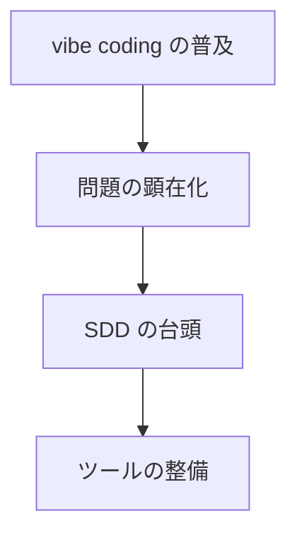

| 要素名             | 説明                                               |
| ------------------ | -------------------------------------------------- |
| vibe coding の普及 | LLM の発展により、最小限の指示でコード生成が可能に |
| 問題の顕在化       | 保守困難・品質低下・設計意図のずれが発生           |
| SDD の台頭         | 仕様を明示することで AI の出力を制御する手法が注目 |
| ツールの整備       | Kiro、Spec Kit、Specmatic 等の専用ツールが整備     |

### 主要ツールの位置づけ

| ツール     | 提供元      | アプローチ         | 特徴                                                           |
| ---------- | ----------- | ------------------ | -------------------------------------------------------------- |
| Kiro       | Amazon AWS  | Spec-First         | 要件・設計・タスクの3ステップ、IDE 統合                        |
| Spec Kit   | GitHub      | Spec-Anchored 志向 | CLI ベース、Constitution + Specify/Plan/Tasks ワークフロー     |
| Spec Kitty | priivacy-ai | Spec-Anchored 志向 | マルチエージェントオーケストレーション、リアルタイム進捗可視化 |
| Tessl      | Tessl       | Spec-as-Source     | 仕様のみ人間が編集し、コードは完全生成                         |
| Specmatic  | Specmatic   | API-First 特化     | OpenAPI/AsyncAPI 仕様からテスト・モックを自動生成              |

### ツール選定ガイド

| 条件                                             | 推奨ツール | 理由                                                                         |
| ------------------------------------------------ | ---------- | ---------------------------------------------------------------------------- |
| VS Code ベースの IDE で統合したい                | Kiro       | IDE 内蔵で設定不要。UI からスペック作成が可能                                |
| CLI 中心で複数 AI エージェントを使い分けたい     | Spec Kit   | Claude Code / Copilot / Gemini CLI に対応。Constitution による原則管理が強力 |
| 複数エージェントを並列オーケストレーションしたい | Spec Kitty | 実装・レビューを別エージェントに振り分け可能                                 |
| API 仕様の契約テストに特化したい                 | Specmatic  | OpenAPI から自動テスト・モック生成。CI 組み込みが容易                        |
| 仕様のみ記述しコードは完全自動生成したい         | Tessl      | Spec-as-Source アプローチ。人間はコードに触れない                            |

## 特徴

### 仕様のリゴール（厳密さ）レベル

SDD には、仕様の扱い方に応じた3段階があります。

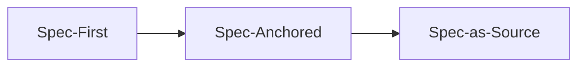

| 要素名         | 説明                                                 |
| -------------- | ---------------------------------------------------- |
| Spec-First     | 初期開発前に仕様を作成。仕様はその変更の寿命のみ維持 |
| Spec-Anchored  | 仕様をコードと並行して維持。自動テストで同期を保つ   |
| Spec-as-Source | 仕様のみを人間が編集し、コードは完全に生成           |

### 主要な特徴

| 特徴                           | 説明                                                                                                                                            |
| ------------------------------ | ----------------------------------------------------------------------------------------------------------------------------------------------- |
| 仕様が真実の源泉               | 仕様がシステムの振る舞いを権威的に定義。コードは派生物として扱う                                                                                |
| 計画と実装の分離               | 要件分析・設計フェーズを実装より先に行い、AI への入力品質を向上                                                                                 |
| AI エージェントとの親和性      | 構造化された仕様が AI の共有コンテキストとなり、生成コードの誤りを削減（[arXiv論文](https://arxiv.org/html/2602.00180v1)では最大50%削減と報告） |
| 生きたドキュメント             | 仕様はコードと共に継続的に進化し、設計意図のドリフトを防止                                                                                      |
| 人間のレビューポイントの明確化 | 仕様のレビューを実装前に行うことで、人間の判断を適切なタイミングで介在                                                                          |
| 他手法との継承関係             | TDD・BDD・API-First のアイデアを AI 時代に拡張した位置づけ                                                                                      |

### 他手法との関係

| 手法               | 仕様の範囲             | 仕様の形式                 | AI 活用    | SDD との関係                                                                 |
| ------------------ | ---------------------- | -------------------------- | ---------- | ---------------------------------------------------------------------------- |
| TDD                | 関数・メソッド単位     | テストコード               | 限定的     | SDD はシステム全体に仕様化を拡大し、AI がテストと実装を同時生成              |
| BDD                | ユーザーストーリー単位 | Gherkin（Given-When-Then） | 限定的     | SDD は Gherkin の考え方を EARS 記法に発展させ、AI の入力として最適化         |
| API-First          | API エンドポイント     | OpenAPI/AsyncAPI           | モック生成 | SDD は API 仕様に加えて要件・設計・タスクまで仕様化の範囲を拡大              |
| ウォーターフォール | システム全体           | 自然言語ドキュメント       | なし       | SDD はフィードバックループを短く保ち、仕様を「生きたドキュメント」として維持 |
| vibe coding        | なし                   | 自然言語プロンプト         | 全面依存   | SDD は vibe coding の構造化版。プロンプトを仕様書に昇格                      |

### SDD の採用判断基準

| 条件             | SDD 推奨                           | SDD 不要                  |
| ---------------- | ---------------------------------- | ------------------------- |
| プロジェクト規模 | 中〜大規模、複数スプリントにわたる | 1日で完了するプロトタイプ |
| チーム構成       | 3人以上、複数ロール                | 個人開発                  |
| AI 活用度        | コード生成に AI を多用する         | AI を補助的にのみ使用     |
| 品質要件         | プロダクション品質が必要           | 検証・PoC 段階            |
| ドメイン複雑性   | ビジネスロジックが複雑             | CRUD 中心の単純なアプリ   |
| コードベース     | 既存コードベースが大きい           | 新規の小規模プロジェクト  |

### 標準的なワークフロー

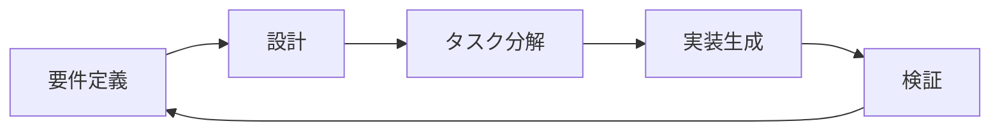

| 要素名     | 説明                                                         |
| ---------- | ------------------------------------------------------------ |
| 要件定義   | ユーザーストーリーと受け入れ基準を EARS 記法等で形式化       |
| 設計       | アーキテクチャ・技術スタック・シーケンス図を仕様書として作成 |
| タスク分解 | 依存関係に基づいて順序付けた実装タスクを生成                 |
| 実装生成   | 仕様を入力として AI エージェントがコードを生成               |
| 検証       | 生成コードが仕様と一致しているかを継続的に検証               |

### EARS 記法による要件定義

EARS（Easy Approach to Requirements Syntax）は、要件を構造化して曖昧さを排除する記法です。SDD では Kiro と Spec Kit の両方で採用されています。

| パターン          | 構文                                           | 用途                 |
| ----------------- | ---------------------------------------------- | -------------------- |
| Ubiquitous        | The system SHALL ...                           | 常に成立する要件     |
| Event-Driven      | WHEN event, the system SHALL ...               | イベント発生時の要件 |
| State-Driven      | WHILE state, the system SHALL ...              | 特定状態での要件     |
| Optional Feature  | WHERE feature is enabled, the system SHALL ... | オプション機能の要件 |
| Unwanted Behavior | IF condition, THEN the system SHALL ...        | 異常系の要件         |

**spec.md の記述例**

```markdown
# User Authentication

## User Stories

### REQ-01: メールアドレスによるログイン - P1
WHEN a registered user submits valid email and password,
the system SHALL authenticate the user and return a JWT token
within 500ms.

#### Acceptance Criteria
- [ ] JWT トークンの有効期限は 24 時間
- [ ] パスワードは bcrypt でハッシュ化されている
- [ ] 5回連続失敗でアカウントを15分間ロックする

### REQ-02: 無効な認証情報 - P1
IF a user submits invalid credentials,
THEN the system SHALL return HTTP 401 with error message
"Invalid email or password".

#### Acceptance Criteria
- [ ] エラーメッセージはメールとパスワードのどちらが間違いか特定できない
- [ ] 失敗回数をインクリメントする
```

## 構造

### システムコンテキスト図

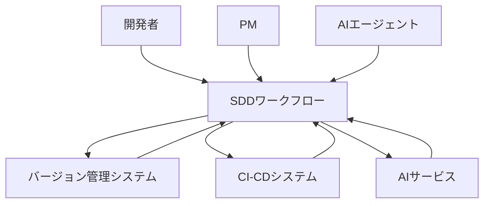

| 要素名                 | 説明                                                   |
| ---------------------- | ------------------------------------------------------ |
| 開発者                 | 仕様の作成・レビュー・タスク実行を担う人間のアクター   |
| PM                     | 要件定義・受け入れ基準の策定を担う人間のアクター       |
| AIエージェント         | 仕様の解析・計画・コード生成を担う自律エージェント     |
| SDDワークフロー        | 仕様駆動開発の全フェーズを統括するシステム             |
| バージョン管理システム | 仕様ファイル・コードのバージョン管理を行う外部システム |
| CI-CDシステム          | 仕様との整合性検証・デプロイ自動化を行う外部システム   |
| AIサービス             | コード生成・仕様解析に利用する外部AIプラットフォーム   |

### コンテナ図

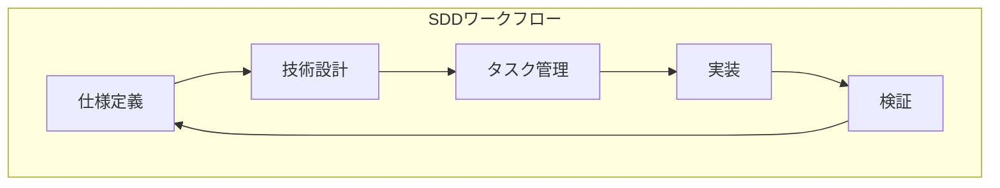

| 要素名     | 説明                                                                       |
| ---------- | -------------------------------------------------------------------------- |
| 仕様定義   | ユーザーストーリー・受け入れ基準・要件を仕様ファイルとして記述するコンテナ |
| 技術設計   | アーキテクチャ・データフロー・実装方針を設計ファイルとして記述するコンテナ |
| タスク管理 | 設計から実行可能なタスクリストを生成・追跡するコンテナ                     |
| 実装       | タスクに従い AI エージェントがコードを生成するコンテナ                     |
| 検証       | 生成コードと仕様の整合性を検証するコンテナ                                 |

### コンポーネント図

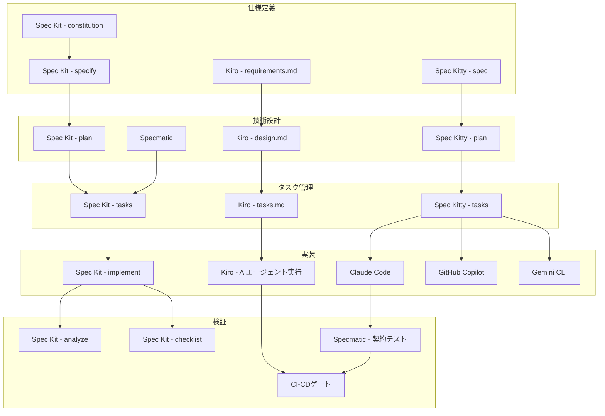

#### Spec Kit のコンポーネント

| 要素名       | 説明                                                                 |
| ------------ | -------------------------------------------------------------------- |
| constitution | プロジェクトの開発原則・ガイドラインを定義するコンポーネント         |
| specify      | 要件・ユーザーストーリーを spec.md として記述するコンポーネント      |
| plan         | 技術実装方針を plan.md として記述するコンポーネント                  |
| tasks        | 設計からタスクリストを生成するコンポーネント                         |
| implement    | タスクリストに基づき AI エージェントがコードを生成するコンポーネント |
| analyze      | 仕様・設計・タスク間の整合性を横断検証するコンポーネント             |
| checklist    | 要件の完全性・明確性を検証するチェックリスト生成コンポーネント       |

#### Kiro のコンポーネント

| 要素名             | 説明                                                     |
| ------------------ | -------------------------------------------------------- |
| requirements.md    | EARS 記法によるユーザーストーリーと受け入れ基準ファイル  |
| design.md          | アーキテクチャ・データフロー設計ファイル                 |
| tasks.md           | 実行可能タスクリストファイル（リアルタイム進捗追跡）     |
| AIエージェント実行 | IDE 内蔵の AI エージェントによるタスク実行コンポーネント |

#### Spec Kitty のコンポーネント

| 要素名 | 説明                                                           |
| ------ | -------------------------------------------------------------- |
| spec   | マルチエージェントオーケストレーションで仕様を定義するステップ |
| plan   | 技術設計を管理するステップ                                     |
| tasks  | タスク分解を管理するステップ                                   |

#### 共通・外部コンポーネント

| 要素名                 | 説明                                                             |
| ---------------------- | ---------------------------------------------------------------- |
| Specmatic              | OpenAPI/AsyncAPI 仕様から契約テストを生成するツール              |
| Specmatic - 契約テスト | API 仕様と実装の乖離を自動検出するテスト実行コンポーネント       |
| Claude Code            | Spec Kit・Spec Kitty が対応する AI コーディングエージェント      |
| GitHub Copilot         | Spec Kit・Spec Kitty が対応する AI コーディングエージェント      |
| Gemini CLI             | Spec Kit・Spec Kitty が対応する AI コーディングエージェント      |
| CI-CDゲート            | 仕様との整合性検証を必須条件としてビルドを制御するコンポーネント |

## データ

### 概念モデル

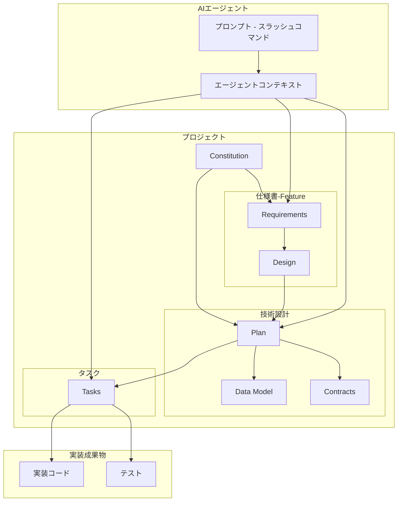

| 要素名                          | 説明                                                             |
| ------------------------------- | ---------------------------------------------------------------- |
| Constitution                    | プロジェクト全体に適用される不変の原則・制約・アーキテクチャ方針 |
| Requirements                    | ユーザーストーリーと受け入れ基準（EARS記法）                     |
| Design                          | 技術アーキテクチャ・シーケンス図・データフロー                   |
| Plan                            | 技術スタック・ライブラリ・ディレクトリ構造の実装計画             |
| Data Model                      | エンティティ定義・データ構造                                     |
| Contracts                       | API仕様・インターフェース定義                                    |
| Tasks                           | フェーズ分けされた実装タスク一覧（チェックリスト形式）           |
| 実装コード                      | Tasks から生成されるアプリケーションコード                       |
| テスト                          | Tasks から生成される検証コード                                   |
| プロンプト - スラッシュコマンド | AI エージェントへの指示（/speckit.plan 等）                      |
| エージェントコンテキスト        | エージェントが参照するメモリファイル（CLAUDE.md 等）             |

### 情報モデル

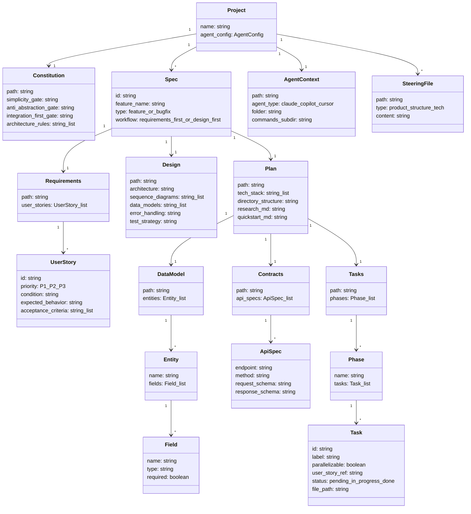

| 要素名       | 説明                                                                                |
| ------------ | ----------------------------------------------------------------------------------- |
| Project      | SDD を適用するリポジトリ単位のプロジェクト                                          |
| Constitution | ゲート条件（Simplicity・Anti-Abstraction・Integration-First）を含む不変原則ファイル |
| Spec         | 1フィーチャーまたは1バグ修正に対応する仕様書セット                                  |
| Requirements | EARS 記法によるユーザーストーリーと受け入れ基準を格納するファイル                   |
| UserStory    | WHEN-SHALL 形式の単一要件。優先度（P1-P3）を持つ                                    |
| Design       | アーキテクチャ・シーケンス図・エラーハンドリング戦略を格納するファイル              |
| Plan         | 技術スタック選定・ディレクトリ構造・クイックスタートを格納するファイル              |
| DataModel    | エンティティ定義を格納するファイル（data-model.md）                                 |
| Entity       | データモデルを構成する個々のエンティティ                                            |
| Field        | エンティティの属性（名前・型・必須フラグ）                                          |
| Contracts    | API 仕様をまとめるディレクトリ（contracts/）                                        |
| ApiSpec      | 単一エンドポイントのリクエスト・レスポンス定義                                      |
| Tasks        | フェーズ構造を持つ実装タスクリストファイル                                          |
| Phase        | Setup・Foundational・User Stories・Polish のフェーズ区分                            |
| Task         | チェックリスト形式の単一タスク。並列実行可否とストーリー参照を持つ                  |
| AgentContext | AI エージェントが参照するコンテキストファイル（CLAUDE.md 等）                       |
| SteeringFile | プロジェクト横断の記憶ファイル（product.md・structure.md・tech.md）                 |

### ファイル構造

#### Spec Kit（.specify/）

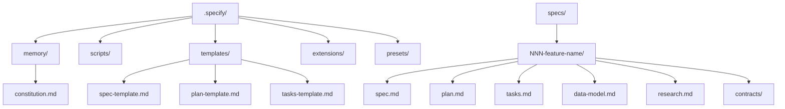

| 要素名                  | 説明                                                 |
| ----------------------- | ---------------------------------------------------- |
| .specify/               | Spec Kit 設定のルートディレクトリ                    |
| constitution.md         | プロジェクト全体の原則・ゲート条件ファイル           |
| scripts/                | スラッシュコマンドから呼び出されるシェルスクリプト群 |
| templates/              | spec・plan・tasks の雛形ファイル群                   |
| extensions/             | インストール済み拡張機能のディレクトリ               |
| presets/                | プリセット設定のディレクトリ                         |
| specs/NNN-feature-name/ | 連番付きフィーチャーの仕様書ディレクトリ             |
| spec.md                 | ユーザーストーリーと受け入れ基準                     |
| plan.md                 | 技術アーキテクチャ計画                               |
| tasks.md                | フェーズ分けされた実装タスク一覧                     |
| data-model.md           | エンティティ定義                                     |
| research.md             | 技術選定の根拠                                       |
| contracts/              | API 仕様ファイル群                                   |

#### Kiro（.kiro/）

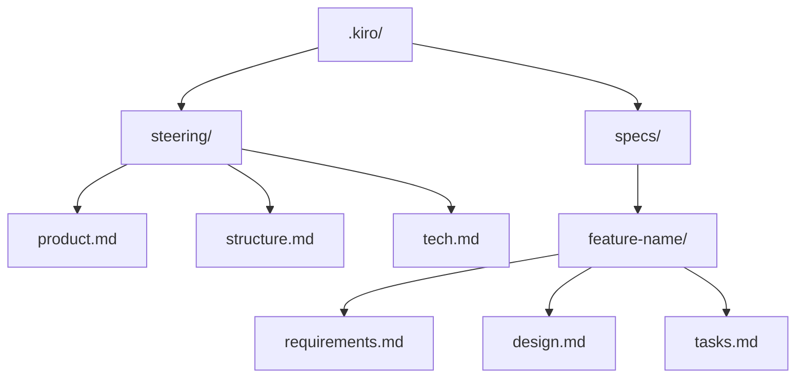

| 要素名              | 説明                                            |
| ------------------- | ----------------------------------------------- |
| .kiro/              | Kiro 設定のルートディレクトリ                   |
| steering/           | プロジェクト横断の記憶ファイル群（Memory Bank） |
| product.md          | プロダクトの目的・スコープ定義                  |
| structure.md        | ディレクトリ構造・モジュール構成定義            |
| tech.md             | 技術スタック・依存関係定義                      |
| specs/feature-name/ | フィーチャー名ディレクトリ                      |
| requirements.md     | EARS 記法によるユーザーストーリーと受け入れ基準 |
| design.md           | 技術アーキテクチャ・シーケンス図・データフロー  |
| tasks.md            | 実装タスク一覧（リアルタイム進捗追跡）          |

## 構築方法

### Spec Kit のセットアップ

Python パッケージマネージャー `uv` を使用してインストールします。

**インストール（推奨: 永続インストール）**

```bash
uv tool install specify-cli --from git+https://github.com/github/spec-kit.git@vX.Y.Z
```

**インストール（一時実行）**

```bash
uvx --from git+https://github.com/github/spec-kit.git@vX.Y.Z specify init
```

**インストール確認**

```bash
specify check
specify version
```

**プロジェクト初期化**

```bash
# 新規プロジェクト
specify init <PROJECT_NAME> --ai claude

# 既存ディレクトリに適用
specify init . --ai claude
# または
specify init --here --ai claude
```

`--ai` オプションに指定できる値は以下のとおりです。

| 値      | AI アシスタント |
| ------- | --------------- |
| claude  | Claude Code     |
| copilot | GitHub Copilot  |
| gemini  | Gemini CLI      |
| cursor  | Cursor Agent    |
| codex   | OpenAI Codex    |

### Kiro のセットアップ

Kiro は IDE として提供されます。インストール後、IDE の UI からスペックを作成します。

**スペック作成の開始**

1. Kiro の「Specs」ペインで「+」ボタンをクリック
2. タイプ（機能開発 / バグ修正）を選択
3. 自然言語でやりたいことを入力

**ステアリングファイルの生成**

```
product.md    # プロダクトの目的・方向性
structure.md  # プロジェクト構造
tech.md       # 技術スタック
```

AI に対して「ステアリングドキュメントを生成して」と指示すると自動生成されます。ステアリングファイルはプロジェクト全体の AI 挙動を制御します。

### Specmatic のセットアップ

OpenAPI 仕様をコントラクトテストとして実行するツールです。Java / Docker / npm の3通りで導入できます。

```bash
# npm
npm install -g specmatic

# Docker
docker pull specmatic/specmatic

# Java JAR（Java 17 以上が必要）
alias specmatic='java -jar <path>/specmatic.jar'
```

**動作確認**

```bash
# コントラクトテストの実行
specmatic test service.yaml --testBaseURL=http://localhost:8080

# モックサーバーの起動
specmatic mock service.yaml --port 9000
```

### 既存プロジェクトへの導入

```bash
# 既存ディレクトリに初期化（確認あり）
specify init --here --ai claude

# 既存ディレクトリに強制初期化（確認なし）
specify init --here --force --ai claude
```

エンタープライズ環境（PyPI / GitHub へのアクセス制限がある場合）は、ホイールバンドルでオフライン配布します。

```bash
pip download specify-cli -d ./wheels
# オフライン環境に転送して
pip install --no-index --find-links=./wheels specify-cli
```

### Constitution ファイルの作成

`constitution.md` はプロジェクトの不変原則を定義するファイルです。AI エージェント内で `/speckit.constitution` コマンドを使用して作成・更新します。

```
/speckit.constitution This project follows Library-First approach.
All features must be implemented as standalone libraries first.
We use TDD strictly. We prefer functional programming patterns.
```

コマンド実行後、以下の処理が自動で行われます。

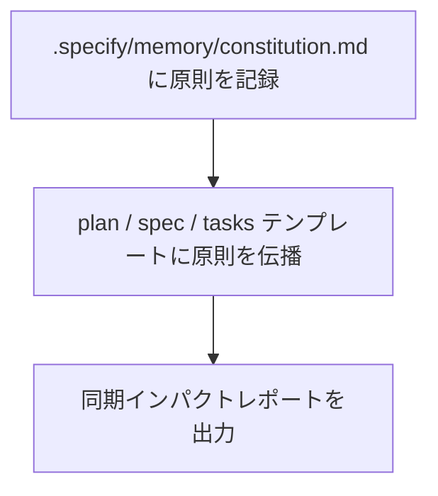

## 利用方法

### 仕様書の作成ワークフロー - Spec Kit

Spec Kit の標準ワークフローは「指定 → 計画 → タスク」の3ステップです。

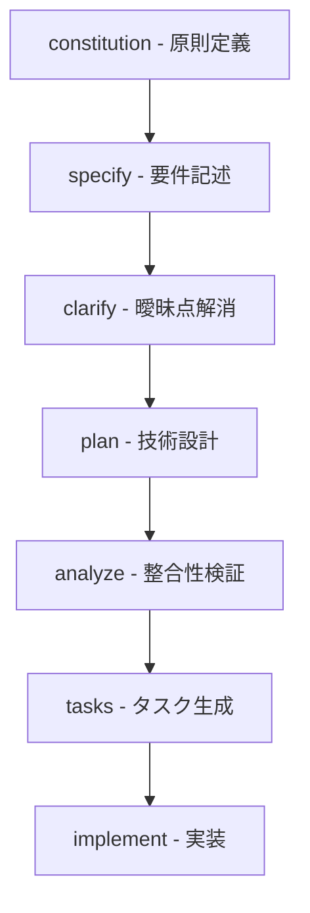

| 要素名       | 説明                                               |
| ------------ | -------------------------------------------------- |
| constitution | プロジェクト全体に適用するアーキテクチャ原則を定義 |
| specify      | 構築する機能の要件・ユーザーストーリーを記述       |
| clarify      | 曖昧な要件を質問形式で明確化                       |
| plan         | 技術アーキテクチャ・データモデル・API 契約を設計   |
| analyze      | spec / plan / tasks 間の整合性をチェック           |
| tasks        | 実行可能な実装タスクリストを生成                   |
| implement    | タスクを順次実行して実装                           |

**各コマンドの使用例**

```bash
# 1. Constitution の定義
/speckit.constitution Security-First. All inputs validated. Microservices architecture.

# 2. 仕様の記述
/speckit.specify ユーザー認証機能（メール+パスワード）を実装する

# 3. 曖昧点の解消（任意）
/speckit.clarify

# 4. 技術計画の生成
/speckit.plan Use Next.js 14 with App Router, PostgreSQL, Redis

# 5. 整合性の検証（任意）
/speckit.analyze

# 6. タスクの生成
/speckit.tasks

# 7. 実装
/speckit.implement
```

### 仕様書の作成ワークフロー - Kiro

Kiro は Requirements → Design → Tasks の3フェーズで仕様を構築します。

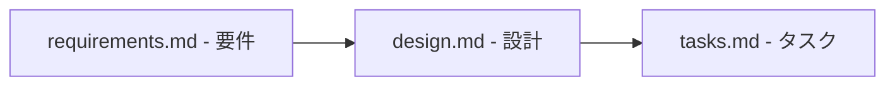

| 要素名          | 説明                                        |
| --------------- | ------------------------------------------- |
| requirements.md | EARS 記法のユーザーストーリーと受け入れ条件 |
| design.md       | システムアーキテクチャと実装アプローチ      |
| tasks.md        | 実行可能な実装タスクとステータス追跡        |

### AI エージェントとの連携方法

**エージェント別の特性と使い分け**

| エージェント   | 初期化オプション | コンテキスト管理                | 得意な用途                                                 |
| -------------- | ---------------- | ------------------------------- | ---------------------------------------------------------- |
| Claude Code    | --ai claude      | CLAUDE.md + .claude/commands/   | 長文仕様の理解、複雑なリファクタリング、マルチファイル変更 |
| GitHub Copilot | --ai copilot     | .github/copilot-instructions.md | IDE 内インライン補完、PR レビュー連携                      |
| Gemini CLI     | --ai gemini      | GEMINI.md                       | 大規模コンテキスト、コードベース全体の把握                 |
| Cursor Agent   | --ai cursor      | .cursor/rules/                  | IDE 統合、リアルタイムペアプログラミング                   |
| OpenAI Codex   | --ai codex       | AGENTS.md                       | 自律タスク実行、バッチ処理                                 |

**Claude Code との連携**

```bash
# プロジェクト初期化
specify init my-project --ai claude

# Claude Code を起動
claude

# Claude 内でスラッシュコマンドを使用
/speckit.specify ユーザーダッシュボードを追加する
/speckit.plan
/speckit.tasks
/speckit.implement
```

初期化時に `.claude/commands/` にコマンドファイルが配置されます。`CLAUDE.md` が自動更新され、プロジェクトコンテキストが維持されます。

### テスト駆動との組み合わせ

Constitution に TDD ポリシーを定義し、全仕様に適用します。

```
/speckit.constitution We use TDD strictly.
All features must have tests before implementation.
Red-Green-Refactor cycle is mandatory.
```

Specmatic で OpenAPI 仕様をコントラクトテストとして実行します。

```bash
# OpenAPI 仕様からテストを自動生成・実行
specmatic test openapi.yaml --testBaseURL=http://localhost:8080

# モックサーバーを起動してコンシューマー側をテスト
specmatic mock openapi.yaml --port 9000
```

### チーム開発での運用フロー

`.specify/` ディレクトリをバージョン管理に含め、仕様をチームで共有します。

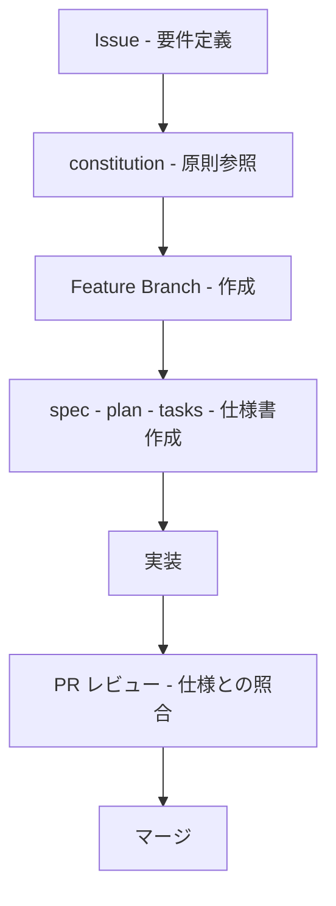

| 要素名              | 説明                                        |
| ------------------- | ------------------------------------------- |
| Issue               | 機能要求の発端                              |
| constitution        | チーム全体で合意したアーキテクチャ原則      |
| Feature Branch      | 機能ごとにブランチを作成して仕様を管理      |
| spec - plan - tasks | AI が仕様書を生成。チームがレビューして承認 |
| PR レビュー         | コードと仕様書の整合性をレビュー            |

**運用上のポイント**

- `constitution.md` の変更は必ずチームレビューを経てマージ
- 仕様書（spec.md / plan.md / tasks.md）は PR に含める
- `/speckit.analyze` を PR 前に実行して整合性を確認

### CI パイプラインでの仕様検証

Specmatic を CI に組み込んで、API 仕様への準拠を自動検証します。

**中央コントラクトリポジトリの CI（GitHub Actions）**

```yaml
name: Contract Validation

on:
  pull_request:

jobs:
  validate:
    runs-on: ubuntu-latest
    steps:
      - uses: actions/checkout@v4

      # OpenAPI 仕様のリント
      - name: Lint OpenAPI specs
        run: npx @stoplight/spectral-cli lint openapi.yaml

      # インラインサンプルの検証
      - name: Validate examples
        run: docker run specmatic/specmatic examples validate --spec openapi.yaml

      # 後方互換性チェック
      - name: Check backward compatibility
        run: |
          docker run specmatic/specmatic backward-compatibility-check \
            --base-branch main \
            openapi.yaml
```

**Specmatic CI の検証ポイント**

| 検証項目           | タイミング | コマンド                               |
| ------------------ | ---------- | -------------------------------------- |
| 仕様リント         | PR 作成時  | spectral lint                          |
| サンプル検証       | PR 作成時  | specmatic examples validate            |
| 後方互換性チェック | PR 作成時  | specmatic backward-compatibility-check |
| コントラクトテスト | プッシュ時 | specmatic test                         |

## 運用

### 仕様書のバージョン管理戦略

仕様書はコードと同一リポジトリに配置し、Git で管理します。

| パターン         | 方針                                                       | 適用場面                         |
| ---------------- | ---------------------------------------------------------- | -------------------------------- |
| デルタ管理       | 変更を新しいスペックとして追記。既存スペックを上書きしない | 変更履歴の完全な追跡が必要な場合 |
| マスタースペック | 現在の状態を1ファイルで管理。実装完了後に同期              | 単一の正典を維持したい場合       |

デルタ管理を採用した場合、スペックフラグメントが増加します。定期的にロールアップ（統合）を実施してください。

```bash
# ロールアップの実施例（spec-kit）
/speckit.spec --rollup specs/001-auth/
```

セマンティックバージョニングで Constitution の変更を追跡します。

| 変更種別                       | バージョン |
| ------------------------------ | ---------- |
| 破壊的変更（原則の廃止・変更） | メジャー   |
| 追加的変更（原則の追加）       | マイナー   |
| 表記修正・明確化               | パッチ     |

### 仕様と実装の乖離検出と同期

`/speckit.analyze` コマンドで乖離を自動検出します。

```bash
# 乖離の検出
/speckit.analyze

# 出力例
# | ID | Category     | Severity | Location       | Summary             | Recommendation |
# | A1 | Duplication  | HIGH     | spec.md:L120   | 類似要件が重複      | マージする     |
# | C1 | Constitution | CRITICAL | plan.md:L45    | Article VII に違反  | 簡素化する     |
# | G1 | Coverage Gap | MEDIUM   | spec.md:REQ-05 | 対応タスクなし      | タスクを追加   |
```

| カテゴリ          | 検出内容               | 対応方針                                    |
| ----------------- | ---------------------- | ------------------------------------------- |
| Duplication       | 重複する要件           | 要件をマージして統合                        |
| Constitution      | Constitution 違反      | 仕様・計画を修正。Constitution は変更しない |
| Coverage Gap      | タスクのない要件       | タスクを追加                                |
| Terminology Drift | 用語の揺れ             | 用語を統一し Constitution に記載            |
| Ambiguity         | 「速い」等の曖昧な記述 | 数値基準に置き換え                          |

### チームでの仕様レビュープロセス

仕様書のレビューは実装前の必須フェーズです。

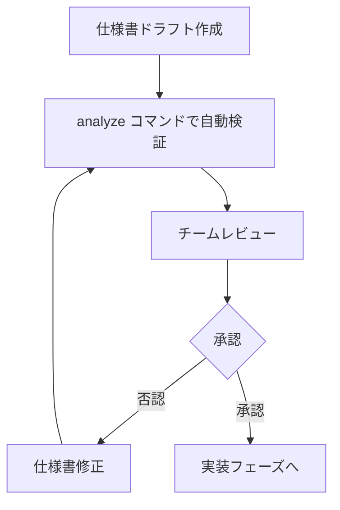

| 要素名                     | 説明                                                        |
| -------------------------- | ----------------------------------------------------------- |
| 仕様書ドラフト作成         | AI エージェントと協働して spec.md, plan.md, tasks.md を作成 |
| analyze コマンドで自動検証 | 重複・Constitution 違反・カバレッジギャップを自動検出       |
| チームレビュー             | PM・エンジニア・QA が仕様の妥当性を確認                     |
| 承認                       | 全員の合意を得て実装フェーズへ移行                          |

レビューの観点は以下のとおりです。

- 要件がユビキタス言語（ドメイン用語）で記述されているか
- 受け入れ基準が数値化・検証可能な形式になっているか
- Constitution の原則に整合しているか
- タスクの粒度が1回のコミットで完結できる規模か

### 仕様書のメンテナンスサイクル

仕様書をスプリントサイクルに組み込みます。

```
スプリント計画 → 仕様書確認・更新 → 実装 → レビュー → 仕様書フィードバック
```

Constitution は定期レビューを実施します。

| タイミング     | 作業内容                                          |
| -------------- | ------------------------------------------------- |
| 四半期ごと     | Constitution の原則が実態に即しているか確認し更新 |
| 機能リリース後 | 実装で判明した制約を仕様書に反映                  |
| バグ発生時     | 原因となった仕様の欠陥を修正し再発防止原則を追加  |

### 大規模プロジェクトでのスケーリング

モノリシックな仕様書を避け、機能ドメインごとに分割します。

```
specs/
  auth/           # 認証ドメイン
  product/        # 商品ドメイン
  cart/           # カートドメイン
  payment/        # 決済ドメイン
  admin/          # 管理ドメイン
  _shared/        # 共有コントラクト・用語集
```

| 観点                 | 指針                                                |
| -------------------- | --------------------------------------------------- |
| 仕様の分割単位       | 機能ドメイン単位。1仕様あたり5-10要件を目安にする   |
| チーム間の調整       | 共有 Constitution と API コントラクトを中心に据える |
| エージェントの並列化 | 非依存ドメインは並列エージェントで同時実装          |
| コンテキスト管理     | 各エージェントに担当ドメインの仕様のみを渡す        |

## ベストプラクティス

### 仕様書の粒度設計

仕様書の粒度はタスクの複雑さに応じて設定します。

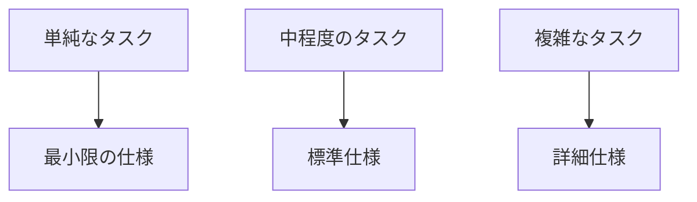

| 要素名         | 説明                                                       |
| -------------- | ---------------------------------------------------------- |
| 単純なタスク   | バグ修正・軽微な変更。過剰な仕様書は逆効果                 |
| 中程度のタスク | 新機能追加。要件・設計・タスク3点セットが基本              |
| 複雑なタスク   | システム横断機能。詳細な仕様で AI エージェントの逸脱を防止 |

粒度設計の原則は以下のとおりです。

- 1タスクは1コミットで完結できる規模にする
- 「速い」「スケーラブル」等の曖昧な形容詞は数値に置き換える
- 入力・出力・事前条件・事後条件を明記する
- タスクごとの受け入れ基準をテスト可能な形式で記載する

### Constitution の設計指針

Constitution はプロジェクトの不変原則を定義します。

```markdown
## Article I: テスト駆動開発

### 最低カバレッジ
全プロダクションコードは 80% 以上のテストカバレッジを達成すること。

### 強制機能
- ツール: pytest + pytest-cov
- 報告: CI 実行ごとにカバレッジレポートを生成
- ゲート: 80% 未満はマージをブロック
```

| 原則             | 内容                                                                |
| ---------------- | ------------------------------------------------------------------- |
| 測定可能にする   | 「高品質」ではなく「テストカバレッジ 80% 以上」と記載する           |
| 根拠を示す       | 各原則に「なぜ必要か」を1文で記載する                               |
| 段階的に拡張する | 最初は3-5原則から始め、チームの習熟に合わせて追加する               |
| 自動強制する     | Constitution 違反を CI で検出し、マージをブロックする仕組みを設ける |

### AI エージェントへの効果的な仕様の渡し方

仕様はドメインごとに分割して渡します。3段階の境界を定義します。

| 段階             | 意味                       | 例                                         |
| ---------------- | -------------------------- | ------------------------------------------ |
| 常に実行         | 確認なしで安全に実行できる | テストをコミット前に実行する               |
| 確認してから実行 | 承認が必要                 | データベーススキーマを変更する前に確認する |
| 絶対に実行しない | ハードストップ             | シークレットや API キーをコミットしない    |

自己検証のプロンプトを仕様書に組み込みます。

```markdown
## 実装後の自己確認

以下の項目を確認してから出力を提出してください。

- [ ] REQ-01 から REQ-05 の全要件を満たしているか
- [ ] Article III のテストカバレッジ基準を達成しているか
- [ ] 「確認してから実行」の操作を実施していないか
- [ ] 未対応の要件がある場合は明示しているか
```

### 段階的導入のアプローチ

小規模から始めて段階的にプロセスを確立します。

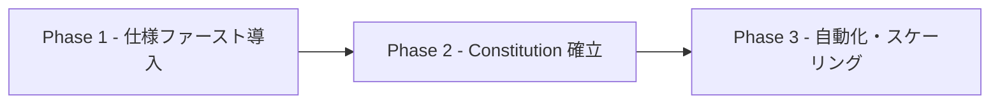

| 要素名                       | 説明                                             |
| ---------------------------- | ------------------------------------------------ |
| Phase 1 仕様ファースト導入   | 1機能に spec.md + tasks.md を試験的に適用する    |
| Phase 2 Constitution 確立    | チームの合意原則を Constitution に文書化する     |
| Phase 3 自動化・スケーリング | analyze コマンドと CI を連携し、全機能に適用する |

### アンチパターンとその回避策

| アンチパターン      | 問題                                                   | 回避策                                           |
| ------------------- | ------------------------------------------------------ | ------------------------------------------------ |
| 曖昧な仕様          | AI エージェントが誤った解釈で実装                      | 入力・出力・制約を具体的な数値で記載する         |
| モノリシック仕様    | 巨大なコンテキストで AI エージェントの精度が低下       | 機能ドメインごとに分割する                       |
| 仕様書の放置        | 実装との乖離が拡大し、AI が古い仕様を参照              | 実装後に仕様書へフィードバックする               |
| 過剰な詳細化        | 低レベルの実装詳細を仕様化すると AI エージェントが逸脱 | 振る舞いと制約の記述に留め、実装詳細は記載しない |
| 一括実装指示        | 複数ドメインを1回の指示で実装すると品質が低下          | 1セッションで1タスクのみを指示する               |
| Constitution の不在 | AI エージェントが独自の判断でアーキテクチャを変更      | プロジェクト開始時に Constitution を定義する     |

## トラブルシューティング

### 仕様と実装の不整合が発生した場合の対処

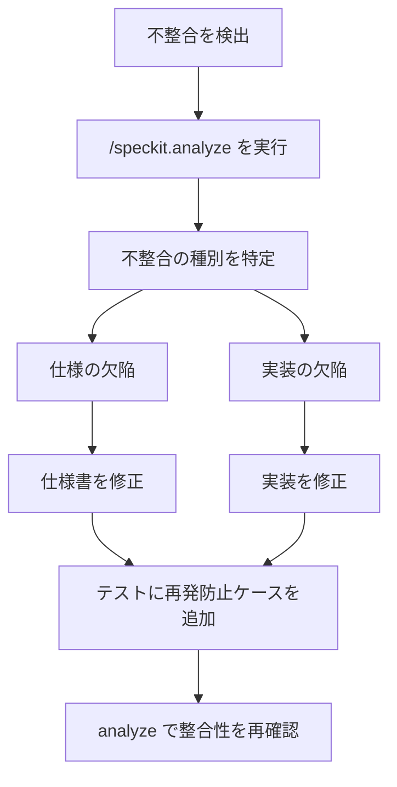

| 要素名                       | 説明                                              |
| ---------------------------- | ------------------------------------------------- |
| 不整合を検出                 | テスト失敗・QA バグレポート・コードレビューで判明 |
| /speckit.analyze を実行      | 自動検出で不整合の位置と種別を把握                |
| 仕様の欠陥                   | 仕様の記述が不正確・不足していた場合              |
| 実装の欠陥                   | 仕様は正しいが AI エージェントが誤実装した場合    |
| テストに再発防止ケースを追加 | 同じ不整合を検出できるテストを追加                |

対処の優先順位は以下のとおりです。

- Constitution 違反: 即時対応。仕様・実装を Constitution に合わせて修正
- カバレッジギャップ: 高優先。対応タスクを追加
- 用語の揺れ: 中優先。用語集を更新し全ファイルで統一

### AI エージェントが仕様を正しく解釈しない場合の対処

| 症状                         | 原因                         | 対処                                                               |
| ---------------------------- | ---------------------------- | ------------------------------------------------------------------ |
| 要件を無視した実装           | 曖昧な記述・コンテキスト過多 | 該当要件を数値基準で書き直し、セッションをリセットして仕様を再提供 |
| 過剰な実装                   | 指示の過剰解釈               | 「実装スコープ外」の明示的なリストを仕様に追加                     |
| セッション途中で仕様を忘れる | コンテキストウィンドウの超過 | タスクを分割しセッションごとに関連仕様のみを渡す                   |
| 毎回異なる実装になる         | 仕様の不確定性               | コード例・具体的なライブラリ名を仕様に明記                         |

対処の手順は以下のとおりです。

1. 仕様書の曖昧な箇所を特定し数値・例で置き換える
2. セッションをリセットし、担当タスクの仕様のみを渡す
3. 実装後に自己確認を促すプロンプトを追加する
4. LLM-as-a-Judge で出力と仕様を照合する

### 仕様書が肥大化した場合の対処

| 兆候                                                         | 対処                                             |
| ------------------------------------------------------------ | ------------------------------------------------ |
| 1つの仕様書が50要件を超える                                  | ドメインごとに分割                               |
| AI エージェントへの1回のコンテキスト提供で仕様全体が入らない | 仕様書に目次と要約を追加し、関連部分のみを参照   |
| 仕様書の更新に1時間以上かかる                                | 変更が多いドメインを独立リポジトリに切り出す     |
| どの仕様が最新か不明                                         | ロールアップを実施し単一のマスタースペックに統合 |

```bash
# 増殖したデルタスペックをマスタースペックに統合
/speckit.spec --rollup specs/auth/

# 統合後の確認
/speckit.analyze

# 古いデルタスペックをアーカイブ
git mv specs/auth/deltas/ specs/.archive/auth/deltas/
```

### チーム内で仕様の解釈が分かれた場合の対処

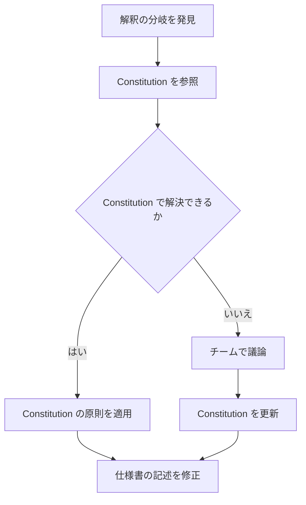

| 要素名                      | 説明                                                   |
| --------------------------- | ------------------------------------------------------ |
| Constitution を参照         | 解釈の拠り所を Constitution に統一                     |
| Constitution で解決できるか | 既存原則で判断できるか確認                             |
| チームで議論                | Constitution が不足している場合、原則を議論して追加    |
| Constitution を更新         | 合意した原則を Constitution にバージョンアップして記載 |

仕様の記述を明確化する原則は以下のとおりです。

- 「ユーザー認証」ではなく「ユーザーがメールアドレスとパスワードで認証する」と記述
- ユビキタス言語（ドメイン用語集）を Constitution に記載し全員が同じ用語を使用
- 解釈が分かれた箇所を clarification セクションに追記

### パフォーマンスや開発速度への影響と対策

| フェーズ           | 影響                                   | 対策                                                       |
| ------------------ | -------------------------------------- | ---------------------------------------------------------- |
| 初期導入期         | 仕様書作成のオーバーヘッドで速度が低下 | Constitution と仕様テンプレートを整備し作成コストを低減    |
| 仕様レビュー       | レビューに時間がかかる                 | analyze コマンドで自動検証し、人間のレビュー対象を絞り込む |
| 仕様書の更新       | 実装後の同期作業が発生                 | スプリント単位でまとめて更新                               |
| 大規模プロジェクト | 仕様間の依存管理が複雑に               | 共有コントラクトを _shared/ ディレクトリで一元管理         |

速度向上のための指針は以下のとおりです。

- 単純なバグ修正には Bugfix Spec を使い、フルスペックの作成を省略
- AI エージェントに仕様書のドラフトを生成させ、人間がレビューに集中
- CI に /speckit.analyze を組み込み、レビュー前に自動で問題を排除
- 仕様書のテンプレートを共有し、チーム全員が同じフォーマットで記述

## まとめ

Spec-Driven Development（SDD）は、vibe coding の課題を解決するために仕様を真実の源泉として開発を進めるパラダイムです。Kiro・Spec Kit・Specmatic 等のツールを活用することで、要件定義から実装・検証までを構造化し、AI エージェントの出力品質を向上させます。

この記事が少しでも参考になった、あるいは改善点などがあれば、ぜひリアクションやコメント、SNSでのシェアをいただけると励みになります！

## 参考リンク

- 公式ドキュメント・GitHub
  - [Spec Kit Documentation](https://github.github.com/spec-kit/)
  - [GitHub Spec Kit Repository](https://github.com/github/spec-kit)
  - [spec-kit/spec-driven.md at main](https://github.com/github/spec-kit/blob/main/spec-driven.md)
  - [deepwiki - github/spec-kit](https://deepwiki.com/github/spec-kit)
  - [Kiro: Agentic AI development from prototype to production](https://kiro.dev/)
  - [Kiro Specs Documentation](https://kiro.dev/docs/specs/)
  - [Kiro Feature Specs Documentation](https://kiro.dev/docs/specs/feature-specs/)
  - [Spec-driven development - Wikipedia](https://en.wikipedia.org/wiki/Spec-driven_development)

- 解説記事・技術資料
  - [Spec-Driven Development: From Code to Contract in the Age of AI Coding Assistants](https://arxiv.org/html/2602.00180v1)
  - [コードを書く前に"仕様"を書く。AI時代の新潮流「仕様駆動開発」って何？](https://note.com/techsenichiya/n/n4e8e225f1e70)
  - [仕様駆動開発（Spec-driven development）とは？](https://atmarkit.itmedia.co.jp/ait/articles/2510/07/news022.html)
  - [Spec-Driven Development in 2025: The Complete Guide](https://www.softwareseni.com/spec-driven-development-in-2025-the-complete-guide-to-using-ai-to-write-production-code/)
  - [仕様駆動開発（Spec-Driven Development）とは何か？](https://www.issoh.co.jp/tech/details/8740/)
  - [Comprehensive Guide to Spec-Driven Development Kiro, GitHub Spec Kit, and BMAD-METHOD](https://medium.com/@visrow/comprehensive-guide-to-spec-driven-development-kiro-github-spec-kit-and-bmad-method-5d28ff61b9b1)
  - [Spec-driven development with AI: Get started with a new open source toolkit - GitHub Blog](https://github.blog/ai-and-ml/generative-ai/spec-driven-development-with-ai-get-started-with-a-new-open-source-toolkit/)
  - [Diving Into Spec-Driven Development With GitHub Spec Kit - Microsoft for Developers](https://developer.microsoft.com/blog/spec-driven-development-spec-kit)
  - [AWS Kiro: Testing an AI IDE with a Spec-Driven Approach](https://thenewstack.io/aws-kiro-testing-an-ai-ide-with-a-spec-driven-approach/)
  - [Spec Driven Development: API Design First with GitHub Spec Kit and Specmatic MCP](https://specmatic.io/article/spec-driven-development-api-design-first-with-github-spec-kit-and-specmatic-mcp/)
  - [仕様書がコードを生む時代：話題のSDDを試してみた - Algomatic Tech Blog](https://tech.algomatic.jp/entry/2025/09/22/143931)
  - [GitHub Spec Kitで始める「仕様駆動開発」 - サーバーワークスエンジニアブログ](https://blog.serverworks.co.jp/github-spec-kit-guide)
  - [Spec-Driven Development（仕様駆動開発）をきっかけに、仕様と設計を整理する](https://zenn.dev/optimisuke/articles/090949f0487326)
  - [仕様駆動開発（Spec Driven Development）について - Qiita](https://qiita.com/WattsoN/items/d8a44e3731f460de616c)
  - [Beyond TDD: Why Spec-Driven Development is the Next Step](https://www.kinde.com/learn/ai-for-software-engineering/best-practice/beyond-tdd-why-spec-driven-development-is-the-next-step/)

- 運用・事例
  - [仕様駆動開発を「そのまま」ではなく「自分たちに合う形」で実践した話](https://www.divx.co.jp/media/328)
  - [SDD（仕様駆動開発）と仕様について再度振り返る](https://zenn.dev/beagle/articles/fd60745bc54de1)
  - [仕様駆動開発の理想と現実、そして向き合い方](https://speakerdeck.com/gotalab555/shi-yang-qu-dong-kai-fa-noli-xiang-toxian-shi-sositexiang-kihe-ifang)
  - [Spec-Driven Development Explained - Nitor Infotech](https://www.nitorinfotech.com/blog/spec-driven-development-explained/)
  - [What is Spec-Driven Development and How to Implement It?](https://apidog.com/blog/spec-driven-development-sdd/)
  - [A look at Spec Kit, GitHub's spec-driven software development toolkit](https://tessl.io/blog/a-look-at-spec-kit-githubs-spec-driven-software-development-toolkit/)
