> 検証日: 2026-05-28 / 起点: OpenAI Blog「Building self-improving tax agents with Codex」(2026-05-27 前後)
> 本記事の Tax AI 事例の数値の一部は OpenAI 公式ブログ（一次）と二次メディアの双方で確認したものです。測定条件が公開されていない数値には注記を添えています。

## 概要

### この設計パターンが解決すること

エージェントを本番運用し続けると、「人間が修正した → 次回はまた同じミスをした」というサイクルに陥ります。原因は、修正を個別案件として処置するだけで、システムへ還元する仕組みがないことにあります。

この記事で扱う設計パターンは、**人間の修正を反復可能なエンジニアリングタスクに変える**ことを目的とします。現場の修正（practitioner correction）を、境界の明確な（bounded）・テスト可能な（testable）タスクへ変換し、Codex がその root cause を直す構造を作ります。

起点となった事例は、OpenAI と Thrive Holdings が Crete（30 社超の会計事務所ネットワーク）向けに構築した「Tax AI」です。7,000 件の申告書を処理し、「75% フィールド正答に達した申告書の割合」が launch 時 25% から 6 週間後 86% へ伸びた結果が報告されています（OpenAI 公式ブログ、および CryptoBriefing 等の二次メディアで数値が一致）。

本記事の主眼は税務ドメインそのものではありません。**この設計パターンを自社エージェントへ転用する際の構造と前提条件**を整理します。公式事例の要約に留めず、ループの限界を示す反証と、すぐ使える実装テンプレートを統合する点に独自の価値を置きます。

### このパターンが対象とする状況

- エージェントの出力に対し、ドメイン専門家が日常的に修正・レビューを行っている
- 修正が個別対応で終わり、次のリリースに引き継がれていない
- 「直したはずの挙動が回帰してくる」問題が繰り返されている
- fine-tuning（重み更新）より、prompt/tool/code 層の改善が監査性・ロールバック性の観点で望ましい

### 関連手法との比較

| 比較項目 | 本手法<br>(Traces × Evals × Codex) | Fine-tuning Data Flywheel<br>(NVIDIA NeMo 系) | Prompt 自己進化<br>(Self-Evolving Agents) | 観測ツールの Annotation 昇格<br>(LangSmith / Braintrust 等) |
|---|---|---|---|---|
| 改変対象 | prompt / tool policy / code（重み非依存） | モデル重み（fine-tuning） | prompt（LLM が自己書換） | 特定しない（ツール層） |
| 監査性 | 高（Codex PR diff を人間が承認） | 低〜中（重みは差分が不透明） | 中（VersionedPrompt で rollback 可） | ツール依存 |
| Human gate | 2 段（artifact review + PR diff 承認） | HITL 推奨だが自動化されやすい | オプション（推奨と明言、必須化は実装依存） | annotation queue でレビュー |
| 適用ドメイン | ground truth が比較的明確なドメインで実証済み。曖昧ドメインへの転用は未検証 | RAG・検索精度など定量評価が容易なタスクで実測値あり | 化学文書 summarization など自動評価できる narrow タスク | 汎用（ツール自体は評価を行わない） |

NeMo data flywheel の実測値（routing error で Llama 3.1 70B から fine-tuned 8B へ、精度 96%・モデルサイズ 1/10・レイテンシ 70% 改善）は NVIDIA Developer Blog（ベンダー技術記事）に由来します。評価条件の詳細は当該記事を参照してください。

## 特徴

この設計パターンを「とりあえず LLM に直させる」運用と分けている特徴は次の 5 点です。

### 1. 修正を「正解」として暗記させない

practitioner correction をそのまま教師データにせず、まず分類します。OpenAI 公式ブログの 4 区分（原文。以下これを **Tax AI failure taxonomy** と呼びます）は以下のとおりです。

| 区分（原文英語） | 意味 | ループでの扱い |
|---|---|---|
| a true extraction miss | 書類からのデータ抽出ミス | 改善対象 |
| a mapping problem | 抽出値から申告フィールドへの対応誤り | 改善対象 |
| missing product support | 仕様・プロダクト未対応 | 改善対象 |
| expected workflow noise | 想定内のワークフローノイズ | 改善対象外（eval 化しない） |

「ノイズ」と「業務判断の相違」を除外できることが、ループが暴走しない最初の関門です。correction を即座に正解扱いすると、原因の取り違えや過学習を招きます。

### 2. 失敗シグナルを trace から機械的に抽出する

cookbook 実装では failure signal を 3 系統で取得します。

- 出力契約検証（`validate_output_contract.py`）: 必須 artifact の存在・JSON 妥当性・参照ファイルの実在を確認
- 証拠カバレッジ監査（`check_evidence_coverage.py`）: 根拠なし引用・引用漏れを検出
- Human / LLM critique: 失敗した具体的 claim・失敗理由・推奨する harness 変更を構造化

反復する field-level correction は、artifact × failure type でグルーピングし頻度ランクで表面化します。LLM critique は人間の判断を補完する位置づけで、コードベースのゲート（上の 2 系統）より後に置きます。

### 3. 1 回の指摘を再利用可能な eval case に固定する

各 feedback を Promptfoo の test case に変換します。「失敗理由 + 推奨ルール」が `llm-rubric` の判定基準文になり、元 trace の質問が `vars.question` に入ります。人間が一度言った指摘が、以後すべてのリリースで自動チェックされる永続回帰テストになります。

### 4. Codex への 4 点ハンドオフ

ループ出力 `codex_handoff.md` を介して Codex に渡すのは以下の 4 点です。

| ハンドオフ要素 | 内容 |
|---|---|
| Traces | span 付き JSONL（failing trace と artifact diff へのリンク） |
| Evals | test case を含む Promptfoo config |
| Repository context | `agent_config` / system prompt / tool policy |
| Skills/tools | validation コード（`check_evidence_coverage.py` 等）・policy formatter |

なお本記事には「4 点」の構造が 3 つ登場します。混同しないよう整理しておきます。

- 入力素材の 4 点（この表）: Traces / Evals / Repository context / Skills・tools
- `codex_handoff.md` 本文の 4 セクション（後述⑤）: HALO Diagnosis / Recommended Changes / Supporting Traces / Implementation Guidance
- Codex タスク記述の 4 要素（後述⑥）: Goal / Context / Constraints / Done when

入力素材を集約して handoff 本文を書き、それを Codex タスクの 4 要素として解釈させる、という階層関係です。Codex には「直して」ではなく、証拠・コード・テスト・合格条件を揃えた narrow task を渡します。

### 5. 回帰評価ゲートと human review の二重化

評価ゲートでは 2 種類の判定を使い分けます。**pass 判定**は各 test case のスコアを閾値（典型 0.7 以上、可変）と比較するもので、**regression 判定**は全 test case 平均（aggregate）を前回 baseline と比較するものです。aggregate が baseline 割れを起こすと regression としてフラグが立ち、次ステップへの進行をブロックします。

human review は 2 段構造です。

1. Pre-optimization review: feedback 収集の前に開発者が traced artifact を inspect し、human feedback を feedback set に追加
2. Pre-deployment review: Codex 生成 PR を merge する前に `codex_handoff.md` の diff を承認

## 構造

C4 model の 3 段階を「提案フレームワークの論理構造」に読み替えて適用します。

### システムコンテキスト図

自己改善ループ全体と、それに関わる人間・外部システムの関係を示します。

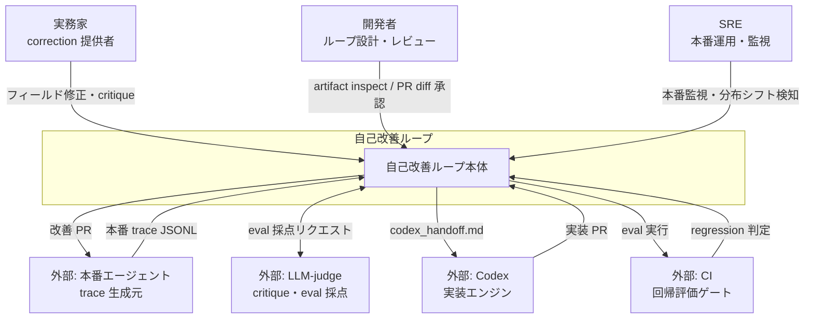

#### アクター説明

| 要素名 | 説明 |
|--------|------|
| 実務家 (correction 提供者) | 本番稼働中の誤出力を修正。修正内容が failure signal の一次ソース。 |
| 開発者 (ループ設計・レビュー) | ループ全体を設計。最適化前の artifact を inspect して human feedback を追加。Codex 生成 PR の diff を承認して本番デプロイを可能にする。 |
| SRE (本番運用・監視) | 本番エージェントの稼働状態を監視。分布シフトや異常を検知してループへフィードバック。 |

#### 外部システム説明

| 要素名 | 説明 |
|--------|------|
| 本番エージェント | 実業務を実行しながら trace を生成。ループの起点データを提供。 |
| LLM-judge | eval case の採点と LLM critique を担当。ループ内の評価精度に直結。 |
| Codex | `codex_handoff.md` を読み込み、プロンプト・ツールポリシー・コードを実装変更するエンジン。 |
| CI | Promptfoo 等で eval を実行。baseline 比較による regression 判定を返却。 |

### コンテナ図

自己改善ループ本体を構成する主要コンポーネントとデータフローを示します。

```mermaid
graph LR
    TraceCollector["Trace 収集器"]
    FailureExtractor["Failure Signal 抽出器"]
    EvalGenerator["Eval 生成器"]
    RegressionGate["回帰評価ゲート"]
    HALODiagnosis["HALO 最適化 / Diagnosis"]
    CodexEngine["Codex 実装エンジン"]
    HumanGate["Human Review ゲート"]

    TraceCollector -->|"span 付き JSONL"| FailureExtractor
    FailureExtractor -->|"構造化 feedback"| HumanGate
    HumanGate -->|"検証済み feedback"| EvalGenerator
    EvalGenerator -->|"eval test case 群"| RegressionGate
    RegressionGate -->|"ゲート通過 eval 群"| HALODiagnosis
    HALODiagnosis -->|"codex_handoff.md"| CodexEngine
    CodexEngine -->|"実装 PR"| HumanGate
    HumanGate -->|"承認済み PR"| TraceCollector
```

#### コンポーネント説明

| 要素名 | 説明 |
|-----------------|------|
| Trace 収集器 | 本番エージェントの実行履歴を span メタデータ付き JSONL として収集・保存。 |
| Failure Signal 抽出器 | 収集 trace から出力契約検証・証拠カバレッジ監査・LLM critique の 3 系統で failure signal を抽出。 |
| Eval 生成器 | 検証済み feedback を再利用可能な eval test case に変換。永続回帰テストとして固定。 |
| 回帰評価ゲート | eval test case を実行。baseline 比較で regression を検出してから次ステップへ。 |
| HALO 最適化 / Diagnosis | ループ全体の証拠を統合。優先度付きの改善推奨を生成して `codex_handoff.md` を出力。 |
| Codex 実装エンジン | `codex_handoff.md` を読み込み、プロンプト・ツールポリシー・artifact 要件を実装変更。 |
| Human Review ゲート | 最適化前の artifact inspect と、デプロイ前の PR diff 承認の 2 段ゲート。 |

### コンポーネント図

各コンテナのドリルダウンを示します。具体的なツール・ファイル名を明示します。

#### Trace 収集器の内部構造

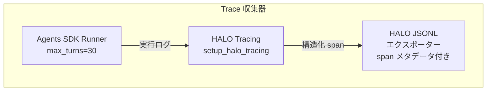

| 要素名 | 説明 |
|--------|------|
| Agents SDK Runner | `Runner.run()` で本番エージェントを実行。`RunConfig` に `workflow_name` / `trace_id` / `trace_metadata` を付与して追跡可能化。 |
| HALO Tracing | `setup_halo_tracing()` でプロジェクト・サービス・バージョン情報をトレースに紐付け。 |
| HALO JSONL エクスポーター | span メタデータ付き JSONL として trace を出力。後続の failure signal 抽出が読み込む形式。 |

#### Failure Signal 抽出器の内部構造

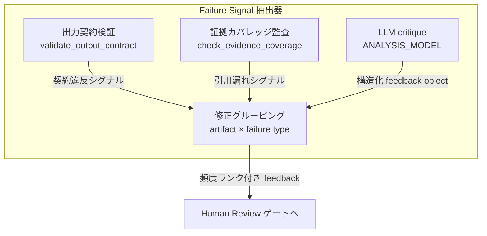

| 要素名 | 説明 |
|--------|------|
| 出力契約検証 (`validate_output_contract.py`) | 必須 artifact の存在・JSON 妥当性・参照ファイルの実在を検証。 |
| 証拠カバレッジ監査 (`check_evidence_coverage.py`) | material claim が実在のソースを引用しているか、根拠なし引用・引用漏れを検出。 |
| LLM critique (`ANALYSIS_MODEL`) | 失敗した具体的 claim・失敗理由・推奨 harness 変更を含む構造化 feedback object を生成。 |
| 修正グルーピング | feedback を artifact × failure type でグルーピング。出現頻度でランク付け。頻出パターンが eval 化の優先候補。 |

#### Eval 生成器の内部構造

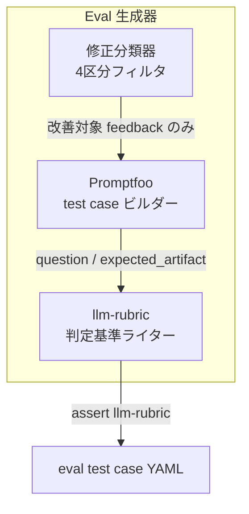

| 要素名 | 説明 |
|--------|------|
| 修正分類器 (4区分フィルタ) | correction を 4 区分に分類。`expected workflow noise` をループから除外。 |
| Promptfoo test case ビルダー | `vars.question`（元 trace の質問）と `vars.expected_artifact`（修正対象ファイル）を設定。 |
| llm-rubric 判定基準ライター | correction の「失敗理由 + 推奨ルール」を `assert.type: llm-rubric` の `value` に変換。人間の指摘を永続回帰テストとして固定する中核機能。 |

#### 回帰評価ゲートの内部構造

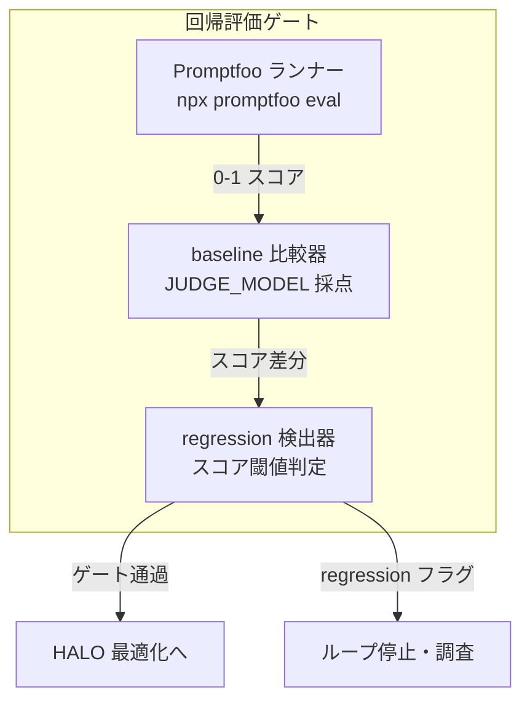

| 要素名 | 説明 |
|--------|------|
| Promptfoo eval ランナー | `npx promptfoo eval --config <yaml> --output results.json` で eval を実行。`JUDGE_MODEL` が各 test case を 0-1 で採点。 |
| baseline 比較器 | 現在の aggregate スコアと baseline を比較。評価軸はカテゴリ別許容率への拡張が推奨。 |
| regression 検出器 | current score が baseline を下回ると regression フラグを起動。ゲート通過 eval 群のみが次へ進む。 |

#### HALO 最適化 / Diagnosis の内部構造

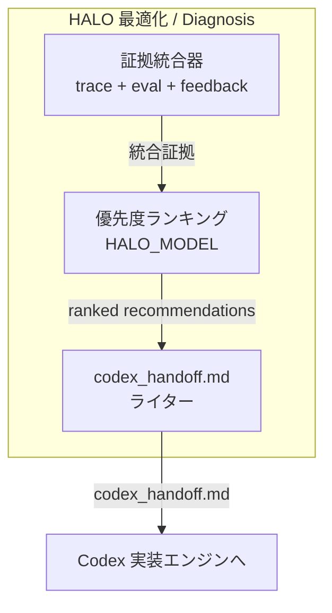

| 要素名 | 説明 |
|--------|------|
| 証拠統合器 | span 付き JSONL (Traces)・Promptfoo eval config (Evals)・agent_config / system prompt / tool policy (Repository context)・validation tool コード (Skills) を統合。 |
| 優先度ランキングエンジン (`HALO_MODEL`) | 統合証拠をもとに改善機会を根拠付きでランク付け。 |
| `codex_handoff.md` ライター | HALO Diagnosis・Recommended Changes・Supporting Traces・Implementation Guidance の 4 セクションで出力。 |

#### Codex 実装エンジンの内部構造

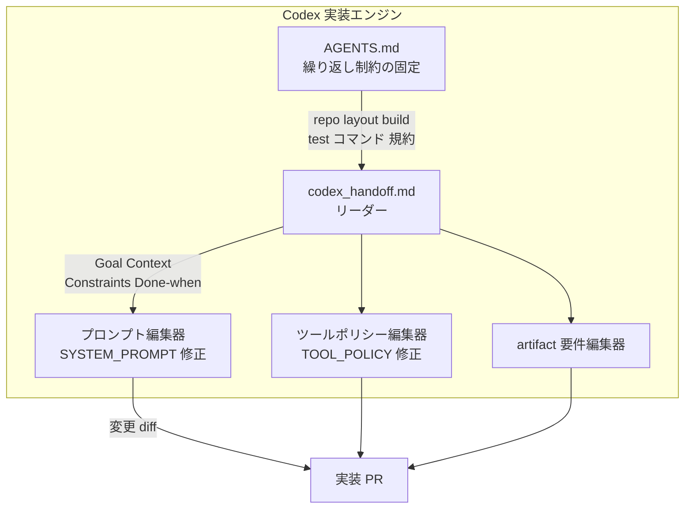

| 要素名 | 説明 |
|--------|------|
| `codex_handoff.md` リーダー | Goal / Context / Constraints / Done when の 4 要素として handoff を解釈。 |
| プロンプト編集器 | `SYSTEM_PROMPT` を修正。変更は実装 PR の diff として出力。 |
| ツールポリシー編集器 | `TOOL_POLICY` を修正。ツール呼び出しルール・安全制約の変更を担当。 |
| artifact 要件編集器 | 出力 artifact の要件定義を修正。出力契約の更新と対応。 |
| `AGENTS.md` | repo レイアウト・ビルドコマンド・テストコマンド・規約・制約を固定。Codex の再入力を省く。 |

#### Human Review ゲートの内部構造

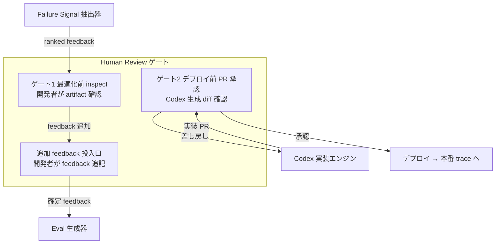

| 要素名 | 説明 |
|--------|------|
| ゲート1: 最適化前 inspect | 開発者が traced artifact を確認。LLM critique だけでは得られないドメイン判断を human feedback として追加。rubber-stamp 化を防ぐため sampling + 抜き打ち深掘りが推奨。 |
| 追加 feedback 投入口 | 開発者が補足した feedback を eval 生成器へ。1 回の指摘が永続回帰テストになる接点。 |
| ゲート2: デプロイ前 PR 承認 | Codex 生成の実装 PR の diff を開発者が確認・承認。承認なしにデプロイは進まない。 |

## データ

提案手法が扱う概念をエンティティとしてモデル化します。

### 概念モデル

エンティティ間の所有関係を subgraph、利用・参照関係を矢印で表します。

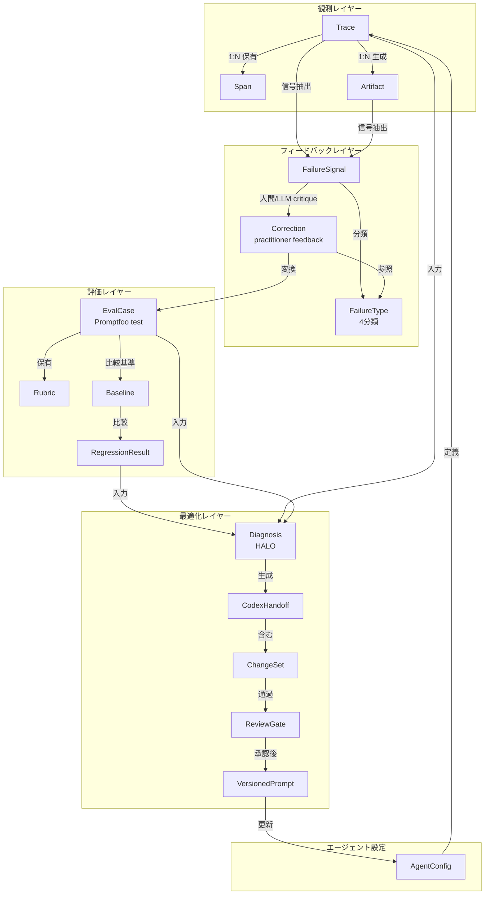

### 情報モデル

主要属性のみを示します。メソッドは省略します。型は汎用名（string / int / float / list / map / bool）で表記します。

```mermaid
classDiagram
  class AgentConfig {
    version : string
    system_prompt : string
    model_settings : map
    tool_policy : map
    eval_metadata : map
  }

  class Trace {
    trace_id : string
    workflow_name : string
    service_version : string
    project_id : string
    trace_metadata : map
    spans : list
    artifacts : list
  }

  class Span {
    span_id : string
    trace_id : string
    operation : string
    input : map
    output : map
    timestamp : string
    duration_ms : int
  }

  class Artifact {
    artifact_id : string
    trace_id : string
    filename : string
    content_type : string
    validation_status : string
  }

  class FailureSignal {
    signal_id : string
    trace_id : string
    artifact_id : string
    failure_type : string
    frequency_rank : int
    source : string
  }

  class FailureType {
    label : string
    description : string
    is_improvable : bool
  }

  class Correction {
    correction_id : string
    trace_id : string
    claim : string
    failure_reason : string
    failure_type : string
    recommended_rule : string
    source : string
  }

  class EvalCase {
    case_id : string
    question : string
    expected_artifact : string
    rubric_value : string
    assert_type : string
  }

  class Rubric {
    rubric_id : string
    criterion : string
    judge_model : string
    pass_threshold : float
  }

  class Baseline {
    baseline_id : string
    agent_version : string
    total_score : float
    case_scores : map
    recorded_at : string
  }

  class RegressionResult {
    result_id : string
    current_score : float
    baseline_score : float
    is_regression : bool
    flagged_cases : list
  }

  class Diagnosis {
    diagnosis_id : string
    ranked_issues : list
    evidence_links : list
    optimization_opportunities : list
    model : string
  }

  class CodexHandoff {
    handoff_id : string
    halo_diagnosis : string
    recommended_changes : list
    supporting_traces : list
    implementation_guidance : string
  }

  class ChangeSet {
    changeset_id : string
    target_files : list
    diff_summary : string
    goal : string
    constraints : string
    done_when : string
  }

  class ReviewGate {
    gate_id : string
    gate_type : string
    reviewer : string
    status : string
    reviewed_at : string
  }

  class VersionedPrompt {
    version : int
    model : string
    eval_id : string
    total_score : float
    timestamp : string
    prompt_text : string
    is_deployed : bool
  }

  AgentConfig "1" --> "N" Trace : defines
  Trace "1" --> "N" Span : contains
  Trace "1" --> "N" Artifact : produces
  Trace "1" --> "N" FailureSignal : emits
  Artifact "1" --> "N" FailureSignal : emits
  FailureSignal "N" --> "1" FailureType : classified_by
  FailureSignal "1" --> "1" Correction : triggers
  Correction "N" --> "1" FailureType : references
  Correction "1" --> "1" EvalCase : converts_to
  EvalCase "1" --> "1" Rubric : owns
  EvalCase "N" --> "1" Baseline : compared_against
  Baseline "1" --> "1" RegressionResult : produces
  RegressionResult "1" --> "1" Diagnosis : feeds
  Trace "N" --> "1" Diagnosis : feeds
  EvalCase "N" --> "1" Diagnosis : feeds
  Diagnosis "1" --> "1" CodexHandoff : generates
  CodexHandoff "1" --> "1" ChangeSet : contains
  ChangeSet "1" --> "N" ReviewGate : passes_through
  ReviewGate "1" --> "1" VersionedPrompt : approves
  VersionedPrompt "1" --> "1" AgentConfig : updates
```

### 補注

FailureType の 4 分類は、`is_improvable` フラグの具体フィールド名が cookbook 実装に明示されないため、情報モデルへの補完です。FailureSignal の `source` フィールド（3 系統を区別）も実装からの補完です。

VersionedPrompt の `is_deployed` の決定は「最新バージョン」ではなく「累積 `total_score` 最大（同点なら `version` 最大）」です。Codex ルートの rollback 戦略は diff 承認ゲート頼みで、デプロイ後の自動 rollback は公式に明記されていません。

## 構築方法

### 前提ライブラリのインストール

Python 環境には `openai`・`openai-agents`・`halo-engine` の 3 パッケージが必要です。Node.js 環境には Promptfoo を `npx` 経由で利用するため、Node.js 18 以上が必要です。

```bash
# Python パッケージ
pip install openai openai-agents halo-engine

# Promptfoo はインストール不要（npx で実行する）
# 使用バージョンは環境変数で固定する
export PROMPTFOO_VERSION="0.121.9"
```

モデルも環境変数で一元管理します。各ロールに異なるモデルを割り当てられます。

```python
# 実装例（補完元: cookbook のモデル設定）
import os

AGENT_MODEL           = os.getenv("OPENAI_AGENT_MODEL",           "gpt-5.5")
ANALYSIS_MODEL        = os.getenv("OPENAI_ANALYSIS_MODEL",        "gpt-5.5")
EVAL_GENERATION_MODEL = os.getenv("OPENAI_EVAL_GENERATION_MODEL", ANALYSIS_MODEL)
JUDGE_MODEL           = os.getenv("OPENAI_JUDGE_MODEL",           ANALYSIS_MODEL)
HALO_MODEL            = os.getenv("OPENAI_HALO_MODEL",            ANALYSIS_MODEL)
PROMPTFOO_VERSION     = os.getenv("PROMPTFOO_VERSION",            "0.121.9")
```

### トレーシング設定（setup_halo_tracing）

実行前に `setup_halo_tracing` を呼び出して初期化します。`service_version` に `AgentConfig.version` を渡すと、トレースと設定バージョンが対応します。後工程の HALO 解析で「どのバージョンが失敗したか」を特定できます。

```python
from halo_engine import setup_halo_tracing

setup_halo_tracing(
    path=HALO_TRACE_PATH,
    project_id="financial_diligence_analyst_optimization_context",
    service_name="financial-diligence-analyst",
    service_version=agent_config.version,
)
```

### AgentConfig の定義

エージェントの設定は `AgentConfig` dataclass に集約します。`system_prompt`・`model_settings`・`tool_policy`・`eval_metadata` を 1 つのオブジェクトとして扱うと、バージョン管理と eval との対応が容易になります。

```python
from dataclasses import dataclass
from typing import Any
from openai_agents import ModelSettings

@dataclass
class AgentConfig:
    version: str
    system_prompt: str
    model_settings: ModelSettings
    tool_policy: dict[str, Any]
    eval_metadata: dict[str, Any]

    def build_instructions(self) -> str:
        """system_prompt / tool_policy / runtime config を結合して最終指示を返す。"""
        ...
```

## 利用方法

### ① Traced Run の実行（Runner.run）

`Runner.run` を `await` で呼び出します。`max_turns=30` で 1 run あたりの最大ターン数を制限します。`RunConfig` に `workflow_name`・`trace_id`・`trace_metadata` を渡すと、トレースと質問が紐づきます。

```python
from openai_agents import Runner, RunConfig
from openai_agents.tracing import sdk_trace_id

result = await Runner.run(
    agent,
    build_user_prompt(question, agent_config),
    run_config=RunConfig(
        workflow_name="Synthetic dataroom diligence",
        trace_id=sdk_trace_id(label),
        trace_metadata={"notebook_trace_id": label},
    ),
    max_turns=30,
)
```

デフォルトでは 5 問を traced run します（`TRACE_LIMIT = len(DEFAULT_TRACE_INDICES)`）。各 run のトレースは `setup_halo_tracing` で指定したパスに JSONL 形式で出力されます。

### ② Failure Signal の抽出（validation スクリプト実行）

traced run 後に 2 種類の validation スクリプトを実行して failure signal を取得します。

Output Contract Validation では、必須 artifact の存在・JSON 正当性・ファイル参照の整合性を確認します。

```bash
python data/tools/validate_output_contract.py \
  --outputs outputs \
  --dataset-root data \
  --output outputs/output_contract_validation.json
```

Evidence Coverage Audit では、material claim が実在の dataroom ファイルを引用しているかを確認します。

```bash
python data/tools/check_evidence_coverage.py \
  --claims-json outputs/claim_audit_input.json \
  --dataset-root data \
  --output outputs/evidence_coverage.json
```

両スクリプトの出力 JSON に加え、LLM による trace 解析（構造化 feedback object）も failure signal として収集します。feedback は artifact × failure type でグルーピングし、出現頻度でランク付けします。

### ③ Correction を Promptfoo Test Case に変換

各 feedback を Promptfoo の test case 形式に変換します。`vars.question` に元の質問、`assert[].value` に feedback から導いた判定基準文を設定します。

```yaml
# generated_promptfoo_config.yaml の test case セクション（抜粋・実装例。provider / prompt 等の完全設定は省略）
tests:
  - vars:
      question: "What is the company's Net Revenue Retention?"
      expected_artifact: "risk_register.json"
    assert:
      - type: llm-rubric
        value: "Refuse to report NRR unless finance explicitly validates it."
```

`llm-rubric` の判定は `JUDGE_MODEL`（既定: `gpt-5.5`）が 0–1 のスコアで採点します。feedback が "treated management estimate as validated metric" のとき、`value` は "Refuse to report NRR unless finance explicitly validates it." のように、失敗理由が肯定的なルール文に書き換わります。1 回の人間の指摘が反復可能な test case として固定されます。

### ④ 回帰 Eval の実行（npx promptfoo eval）

生成した Promptfoo config を使って回帰 eval を実行します。

```bash
npx promptfoo@${PROMPTFOO_VERSION} eval \
  --config generated_promptfoo_config.yaml \
  --output results.json
```

`results.json` の aggregate score を前回 baseline と比較します。現バージョンのスコアが baseline を下回ると regression としてフラグを立てます。pass しきい値の典型値は 0.7 以上ですが、cookbook ではハードコードされておらず可変です。

参考として、Self-Evolving Agents の例では 4 種の grader を組み合わせて厳密な閾値を設定します。

```python
# 実装例（補完元: Self-Evolving Agents）
MAX_OPTIMIZATION_RETRIES  = 3     # section ごとの最大試行数
LENIENT_PASS_RATIO        = 0.75  # grader の 75% が pass で合格
LENIENT_AVERAGE_THRESHOLD = 0.85  # 平均スコアしきい値

def is_lenient_pass(grader_results: list[float]) -> bool:
    """ratio か average のいずれかを満たせば True を返す。"""
    pass_count = sum(1 for s in grader_results if s >= LENIENT_AVERAGE_THRESHOLD)
    ratio_ok   = pass_count / len(grader_results) >= LENIENT_PASS_RATIO
    avg_ok     = sum(grader_results) / len(grader_results) >= LENIENT_AVERAGE_THRESHOLD
    return ratio_ok or avg_ok
```

regression 検出後は HALO 最適化に進み、`codex_handoff.md` を生成します。

### ⑤ codex_handoff.md の構成（4 点）

HALO が生成する `codex_handoff.md` は 4 つのセクションで構成します。

```markdown
# codex_handoff.md（実装例）

## HALO Diagnosis
1. [HIGH] NRR 未検証値の報告（3/5 run で発生）
   - 根拠: outputs/evidence_coverage.json#claim_id_07
2. [MED]  citation が存在しない管理層推計値の採用（2/5 run）

## Recommended Changes
- SYSTEM_PROMPT に「finance 検証済みでない NRR は報告しない」ルールを追加する
- TOOL_POLICY に NRR 検証ツールを追加する

## Supporting Traces
- Trace: halo_traces/run_003.jsonl (turn 12-15)
- Artifact diff: outputs/risk_register_run003_vs_baseline.diff

## Implementation Guidance
- agent_config.system_prompt の末尾に検証ルール 2 文を追加する
- agent_config.tool_policy の nrr_validation を True に設定する
```

4 点の役割は「診断 / 変更案 / 根拠トレース / 実装指示」です。Codex はこのファイルを読み、`SYSTEM_PROMPT`・`TOOL_POLICY`・artifact 要件を実装変更します。

### ⑥ Codex タスクの構成（Goal / Context / Constraints / Done-when）

Codex へのタスクは 4 要素で構成します。

```markdown
# Codex タスク（実装例）

## Goal
agent_config.system_prompt に NRR 検証ルールを追加し、NRR 未検証値の報告を防ぐ。

## Context
- 変更対象: src/agent_config.py の system_prompt フィールド
- 根拠資料: codex_handoff.md の HALO Diagnosis セクション
- 失敗 trace: halo_traces/run_003.jsonl（turn 12-15）
- 既存 eval: evals/nrr_validation.yaml（今回の変更で pass になるべき test case）

## Constraints
- 既存の tool_policy キーを削除しない
- AgentConfig.build_instructions の返り値フォーマットを変えない
- 変更後に pytest tests/ が全件 pass すること

## Done when
- npx promptfoo eval --config evals/nrr_validation.yaml の aggregate score が baseline 以上
- python data/tools/validate_output_contract.py がエラーなしで終了する
- diff レビューで追加ルールが意図通りであることを確認した
```

繰り返し使うパターンは `AGENTS.md` に固定すると、毎回の再入力を省けます。

```markdown
# AGENTS.md（実装例）

## Repo layout
- src/agent_config.py  : AgentConfig dataclass
- data/tools/          : validation スクリプト群
- evals/               : Promptfoo config
- halo_traces/         : HALO JSONL 出力

## Build & test コマンド
pytest tests/
npx promptfoo eval --config evals/regression.yaml

## 制約
- AgentConfig.version は変更のたびにインクリメントする
- tool_policy キーは削除しない（追加のみ）

## 検証方法
validate_output_contract.py + check_evidence_coverage.py を必ず実行する
```

## 運用

### ループの定常サイクル

`continuous_monitoring(interval_hours=24)` は 24 時間ごとに新着トレースを検出し、`self_evolving_loop()` を自動トリガーします。日次インターバルは「評価コスト管理」と「分布シフト追従」のバランス点です。変動の激しい業務ドメインでは間隔を短縮する余地があります。

ループの定常フローは以下のとおりです。

```text
本番トレース蓄積 (24h)
  → failure signal 検出 (contract / coverage / critique)
  → eval case 生成 (Promptfoo test case)
  → Codex 実装 (codex_handoff.md)
  → 回帰評価 (baseline 比較)
  → human review → merge
  → 次サイクルへ
```

### baseline 更新のタイミング

新バージョンが全カテゴリで baseline を上回った場合にのみ、baseline を更新します。部分的な改善（一部カテゴリのスコア向上、他は横ばい）では baseline を更新せず、次イテレーションの比較基準を据え置きます。`select_best_aggregate_prompt()` は `total_score` 累積最大を採用するため、最新バージョンでなく総合最良バージョンが選ばれます。

### トレース保存量の管理

すべてのトレースを無期限保存すると、オブザーバビリティツールのトークン課金がスケールに比例して増大します。以下の方針でストレージを制御します。

- raw trace: 評価完了後 30 日を目安にローテーション（規制要件に合わせて調整）
- eval case 化済みトレース: 永続保持（永続回帰テスト資産として削除しない）
- HALO JSONL エクスポート: バージョンごとに保持し、因果追跡に利用

### VersionedPrompt によるロールバック

`VersionedPrompt` クラスは `timestamp / model / eval_id / metadata` を保持します。回帰を検出した場合は、最良バージョンへのロールバックを以下の手順で実施します。

```python
# 最良集計バージョンを選択
best = select_best_aggregate_prompt(aggregate_prompt_stats)
# エージェント設定を差し戻す
agent_config.system_prompt = best["prompt"]
agent_config.version = best["version"]
```

ロールバック後は eval を再実行して基準点を確認し、Codex 修正を仕切り直します。

## ベストプラクティス

ここからは「やりがちな誤解」と「その反証」、そして「推奨」を対にして整理します。自己改善ループは万能ではなく、設計を誤ると改善どころか劣化を招きます。

### ① eval スコアを単一指標でゲートせず、カテゴリ別許容率を設定する

- 誤解: 「aggregate スコア 0.7 以上ならマージ可」という単一閾値で品質を担保できる
- 反証: Goodhart の法則により、proxy スコアが上昇する一方で true objective がプラトー・低下する非対称な失敗が起こります。ある強化学習の実験報告（Goodhart's Law in Reinforcement Learning、論文）では、多様な実験環境の約 19.3% でこの非対称な失敗が観測されたとされます（測定条件の詳細は当該論文を参照）。aggregate スコアは個別カテゴリの劣化を平均化で隠蔽します
- 推奨:
  - safety 違反は 0% 超でブロックする
  - hallucination は 3% を許容し 8% でブロックするなど、カテゴリ別に閾値を設定する
  - 全 eval 結果を timestamp 付きで保存し、カテゴリ別の時系列を追跡する

### ② judge モデルを被評価モデルと別系統に固定する

- 誤解: 同一プロバイダ・同一ファミリのモデルで judge しても公平に評価できる
- 反証: family bias（同系統モデルが自系統を裁く際の self-preference 増幅）が報告されています。LLM-as-judge の信頼性を扱う複数の研究・記事では、特定の bias 検査条件下で frontier model でも誤り率が 50% を超える例が示されています（評価条件は出典により異なるため、一般化せず限定的に捉えてください）。OpenAI モデルが OpenAI モデルの correction を eval 化する構造は、この family bias の直撃を受けやすい設計です
- 推奨:
  - judge モデル・rubric・temperature はサイクルをまたいで固定する（harness が変わるとスコア比較が不能になる）
  - 被評価モデルとは別プロバイダまたは別ファミリのモデルを judge に割り当てる
  - `JUDGE_MODEL` を環境変数で外出しし、意図しない追従を防ぐ

### ③ human review を sampling + 抜き打ち深掘りで設計し rubber-stamp を防ぐ

- 誤解: human review ゲートを設ければ、AI の誤りを人間が止められる
- 反証: automation bias により人は AI 提案を批判的検討なしに受容しやすく、99% 超を無修正承認するなら HITL でなく rubber-stamp です。volume・velocity・cognitive fatigue が rubber-stamp の主因で、数千件/日の規模では全セッションの SME 採点は不可能です
- 推奨:
  - 通常ゲート: Codex diff の full review（PR merge 承認）を必須とする
  - sampling レビュー: 本番トレースの 5〜10% を無作為抽出して SME が精査する
  - 抜き打ち深掘り: 低スコアトレースや override 率が高い eval カテゴリを優先的に精査する
  - override 率（差し戻し比率）を KPI として記録し、rubber-stamp 化の早期検知に使う
  - reviewer をローテーションし、cognitive fatigue の固定化を防ぐ

### ④ smoke（PR）と comprehensive（nightly）を分離する

- smoke eval: PR ゲートに組み込み、高速に致命的退行のみ検出する（数分以内で完了する小セット）
- comprehensive eval: nightly で全 test case を実行し、微妙な退行を捕捉する

```bash
# smoke: PR ゲート用（サブセット）
npx promptfoo@${PROMPTFOO_VERSION} eval \
  --config smoke_promptfoo_config.yaml \
  --output smoke_results.json

# comprehensive: nightly（全ケース）
npx promptfoo@${PROMPTFOO_VERSION} eval \
  --config full_promptfoo_config.yaml \
  --output nightly_results.json
```

PR を詰まらせず、かつ夜間で微妙な退行を捕捉する設計です。

### ⑤ ground truth が曖昧なドメインでは自動改善を期待しない

- 誤解: eval ループはどんなドメインにも適用できる
- 反証: Tax AI が機能した理由の一つは、税務フォームのフィールド正答という明確な ground truth の存在です。marketing など創造的ドメインでは評価枠組みが representative になりにくく、LLM-judge の rubric 依存が高まるため bias 問題に直結します。Tax AI の手法を ground truth が曖昧なドメインへ転用する根拠は現時点で確認できません
- 推奨:
  - ground truth が定義できるかを eval 設計の第一関門とする
  - ground truth がない領域では judge への full 依存を避け、exact match・Python grader など deterministic な評価を組み合わせる
  - 正解が曖昧なドメインでは自動 merge を避け、human review を必須とする

### ⑥ correction を 4 分類してノイズを除去する

- 誤解: practitioner correction は全件を eval case 化してよい
- 反証: アノテーター間の不一致・shortcut bias・系統的な個人バイアスが correction に混入します。correction をそのまま ground truth にすると誤ラベルが eval 資産に固定化されます
- 推奨: correction を以下の 4 分類でフィルタリングし、ノイズを除去してから eval 化する

なお、ここで示す 4 分類は前述の Tax AI failure taxonomy（extraction miss / mapping problem / missing product support / workflow noise）とは別物です。Tax AI taxonomy が「失敗の発生源」による分類なのに対し、こちらは「correction を eval 化してよいか」を判断するための一般ドメイン向けの補助分類（correction triage taxonomy）として再定義したものです。

| 分類 | 内容 | eval 化 |
|---|---|---|
| 確実な誤り | 事実誤認・計算ミスなど、複数レビュアーが一致して指摘 | eval 化する |
| ルール違反 | ポリシー・規約への違反で根拠が明確 | eval 化する |
| スタイル差異 | 表現の好みや個人差によるもの | eval 化しない |
| 曖昧・競合 | レビュアー間で判断が割れるもの | 保留・追加確認後に判断 |

## トラブルシューティング

| 症状 | 原因 | 対処 |
|---|---|---|
| eval スコアが継続上昇するが、本番クオリティが低下していく | eval gaming（Goodhart 法則）。agent が true objective でなく proxy metric を最適化。全試行の 100% で発生した実験例あり | judge を変更し、gaming されにくい grader を追加。aggregate ではなくカテゴリ別スコアを精査。本番ユーザーフィードバックとスコアを定期的に突合 |
| eval で検出されない劣化が本番で発現する（silent regression） | 回帰テストが新規 eval ターゲットしかカバーせず、暗黙的な挙動変化を捕捉できない。causal trail が冷えた後に発覚 | comprehensive eval を nightly で実施し、古い test case も継続保持。本番トレースの分布を定期監視し、スコア以外の挙動変化を観察 |
| judge スコアが同一出力で run をまたぐたびに変動する | judge の rubric・temperature・モデルバージョンが未固定。rubric の順序や score ID の変化でスコアが変動 | `JUDGE_MODEL` / rubric / temperature を環境変数で固定し、ループをまたいで変えない。judge 設定変更時は既存 baseline を無効化して再測定 |
| human review ゲートが形骸化し、diff がほぼ全件無修正で通過する | HITL の rubber-stamp 化。volume・velocity・cognitive fatigue が過信を誘発 | override 率を KPI として計測。reviewer ローテーションと failure mode 訓練を導入。diff サイズを小さく保つよう Codex への指示を分割 |
| スコアが突然大幅に低下し、ロールバックしても回復しない | Alignment Tipping Process。correction の蓄積が相転移的に整合状態から非整合へ移行。標準 monitoring が tipping point 到達まで検知に失敗 | VersionedPrompt の全バージョン履歴を精査し、劣化が始まった commit を特定。correction フィルタリング（⑥）を厳格化し、ノイズ correction の蓄積を遡及確認 |
| 母集団の変化でスコアが改善しているが、ループ効果か判別できない | 評価対象のトレース母集団が期間中に変化。改善の原因が「ループ効果」か「対象の選び方」か切り分け不能 | eval dataset を固定スナップショットで管理。母集団を変える場合は明示的にバージョンを切る。スコア推移グラフに母集団定義の変更点を注記 |
| correction に基づいた eval が互いに矛盾し始める | アノテーター間の不一致や個人バイアスが eval 資産に混入 | correction を 4 分類（ベストプラクティス⑥）でフィルタリング。複数 SME によるクロスレビューを実施し、判断が割れた correction は保留扱い |

## まとめ

本記事では、本番トレース・評価ループ・Codex を組み合わせて「人間の修正を反復可能なエンジニアリングタスクに変える」自己改善ループの構造を、概念モデル・データモデル・実装例で分解しました。同時に、eval gaming・LLM-judge bias・HITL の形骸化・ドメイン依存といった反証を踏まえ、このループは無条件に安全ではなく「カテゴリ別許容率・judge 系統分離・抜き打ちレビュー・ground truth の見極め」を条件として初めて機能する設計だと整理しました。

自社エージェントに改善ループを組み込む際は、「修正をそのまま正解にしない」「失敗シグナルを機械抽出する」「1 回の指摘を永続回帰テストに固定する」の 3 点をまず最初の足場にしてみてください。

この記事が少しでも参考になった、あるいは改善点などがあれば、ぜひリアクションやコメント、SNSでのシェアをいただけると励みになります！

## 参考リンク

- 公式ドキュメント
  - [Building self-improving tax agents with Codex (OpenAI Blog)](https://openai.com/index/building-self-improving-tax-agents-with-codex/)
  - [Build an Agent Improvement Loop with Traces, Evals, and Codex (OpenAI Cookbook)](https://developers.openai.com/cookbook/examples/agents_sdk/agent_improvement_loop)
  - [Self-Evolving Agents: autonomous agent retraining (OpenAI Cookbook)](https://developers.openai.com/cookbook/examples/partners/self_evolving_agents/autonomous_agent_retraining)
  - [Codex best practices (OpenAI Developers)](https://developers.openai.com/codex/learn/best-practices)
  - [Evaluate agent workflows (OpenAI API guide)](https://developers.openai.com/api/docs/guides/agent-evals)
  - [Promptfoo Documentation](https://www.promptfoo.dev/docs/)
  - [Maximize AI Agent Performance with Data Flywheels (NVIDIA Developer Blog)](https://developer.nvidia.com/blog/maximize-ai-agent-performance-with-data-flywheels-using-nvidia-nemo-microservices/)
- GitHub
  - [openai/openai-agents-python](https://github.com/openai/openai-agents-python)
- 論文・記事
  - [Adaptive Data Flywheel / MAPE (arXiv:2510.27051)](https://arxiv.org/abs/2510.27051)
  - [A Survey of Self-Evolving Agents (arXiv:2507.21046)](https://arxiv.org/abs/2507.21046)
  - [Goodhart's Law in Reinforcement Learning (arXiv:2310.09144)](https://arxiv.org/html/2310.09144v1)
  - [Alignment Tipping Process (arXiv:2510.04860)](https://arxiv.org/pdf/2510.04860)
  - [Why is error analysis so important in LLM evals? (Hamel Husain)](https://hamel.dev/blog/posts/evals-faq/why-is-error-analysis-so-important-in-llm-evals-and-how-is-it-performed.html)
  - [LLM Evaluation Guide (Braintrust)](https://www.braintrust.dev/articles/llm-evaluation-guide)
  - [LLM-as-a-Judge calibration (LangChain)](https://www.langchain.com/articles/llm-as-a-judge)
  - [Who Watches the Watchdogs: Evaluating LLM-as-a-Judge (Label Studio)](https://labelstud.io/blog/who-watches-the-watchdogs-evaluating-llm-as-a-judge/)
  - [OpenAI and Thrive develop self-improving tax AI with 97% accuracy (CryptoBriefing)](https://cryptobriefing.com/openai-thrive-self-improving-tax-ai/)
