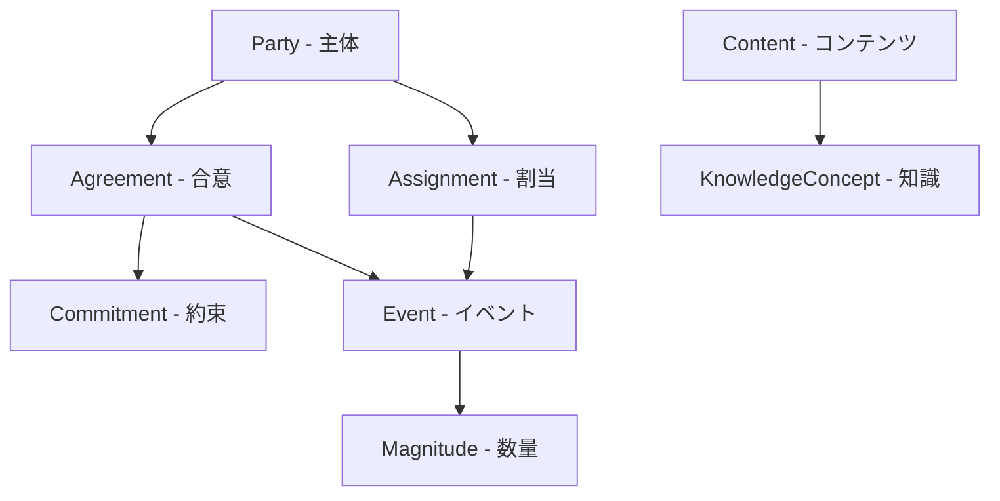
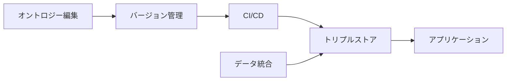

## gist オントロジーとは

Semantic Arts 社が開発した gist は、企業データ統合のためのミニマリスト上位オントロジーです。W3C 標準の OWL（Web Ontology Language）で記述された、機械可読かつ推論可能な論理モデルです。

「gist」は英語で「要点・本質」を意味します。企業が保有するデータを、特定のアプリケーションに依存しない「共有された意味」に基づいて再構築するために設計されています。

### 背景：アプリケーション中心からデータ中心へ

現代の企業情報システムでは、数千ものアプリケーションがそれぞれ独自のデータモデルと用語定義を持っています。この「アプリケーション中心」のパラダイムが、データのサイロ化と統合コストの増大を招いています。

gist は「データ中心革命」の技術的核として、すべてのアプリケーションが参照する「唯一の真実」を定義します。すべてのデータを gist の概念体系にマッピングすることで、統合コストを劇的に削減できます。

## 設計哲学：3つの原則

### 1. ミニマリズム

gist のコアモデルは約 200 のクラスと同程度のプロパティで構成されています。BFO や SUMO などの先行オントロジーが数千〜数万の概念を含むのに対し、gist は人間が全体像を把握できる範囲に収まっています。

この規模でビジネス活動のほぼすべて（Who, What, Where, When, Why）を表現できます。導入ハードルが低く、現場のエンジニアやドメインエキスパートが利用を敬遠するリスクを軽減しています。

### 2. 曖昧さの排除

gist は曖昧な概念を許容しません。例えば「Customer（顧客）」はコアクラスに存在しません。

「顧客」はある文脈における「役割」であり、実体は「Person」または「Organization」です。gist では、動的な役割や文脈依存の概念を「Party（主体）」や「Agreement（合意）」を通じた関係性として表現します。これにより、用語の多義性による混乱を防ぎ、データの意味的な一貫性を長期にわたって担保しています。

### 3. プラグマティズム

学術的な上位オントロジーが「世界の真理」を記述しようとして複雑化する一方、gist は「企業の運営」に必要な概念を最小限の要素で記述します。Person, Organization, Agreement など、ビジネスパーソンが直感的に理解できる用語を採用しています。

## 技術的アーキテクチャ

gist の実装は、推論エンジンによる自動検証と大規模ナレッジグラフでのパフォーマンスを考慮した4つの技術的決定に基づいています。

### 排他性によるデータ品質の強制

gist は上位クラスに広範な「排他性（Disjointness）」を定義しています。あるインスタンスが同時に複数のクラスに属することを禁止する論理的制約です。

例えば「PhysicalThing」と「ConceptualThing」は排他です。誤った分類がされた場合、推論エンジンが即座に矛盾を検出します。データ品質管理を人手によるチェックから、数学的な論理検証へ昇華させるメカニズムです。

### 逆プロパティの完全排除

gist は逆プロパティ（Inverse Properties）を一切定義しません。

| 排除理由       | 説明                                               |
| -------------- | -------------------------------------------------- |
| データ量の爆発 | 推論時に逆方向のトリプルが生成され、データ量が倍増 |
| 管理の複雑化   | 逆プロパティのペア維持がオントロジーの肥大化を招く |
| 曖昧さの回避   | どちらの方向が正であるかの判断が困難               |

逆方向の探索が必要な場合は、SPARQL の `^property` 構文で対応できます。

### ドメインとレンジの希薄な使用

gist はプロパティのドメインとレンジの指定を極力控えています。例えば `hasName` のドメインを `Person` に限定すると、`Organization` や `Project` に名前を付けるために個別のプロパティが必要になります。プロパティを汎用的に保ち、再利用性を最大化しています。

### OWL 2 DL 準拠

gist は OWL 2 DL プロファイルに完全準拠しています。Pellet や HermiT などの標準的な推論エンジンで自動推論と整合性チェックが可能です。

クラス定義の約半数は「等価クラス（Equivalent Class）」による論理的定義（必要十分条件）を含みます。インスタンスの属性に基づいて自動的に適切なクラスに分類されます。例えば「2つの組織間の合意であり、法的拘束力を持つもの」は、自動的に「Contract」クラスのインスタンスとして推論されます。

## 概念モデルの体系

gist の概念体系は、6つの主要なクラスターで構成されています。以下の図はクラスター間の主な関係性を示しています。

| クラスター | 説明                               |
| ---------- | ---------------------------------- |
| Party      | 主体（Person, Organization）の定義 |
| Agreement  | 合意・契約・コミットメントの管理   |
| Event      | 時間的な出来事の記録               |
| Magnitude  | 数値と単位の標準化                 |
| Content    | 情報・文書・知識の表現             |
| Assignment | 役割や権限の割り当て               |

### エージェントと主体

| クラス       | 説明                                               |
| ------------ | -------------------------------------------------- |
| Person       | 自然人。役割に関わらず同一人物は唯一のインスタンス |
| Organization | 法人、政府機関、非営利団体、部門                   |
| Party        | Person と Organization の和集合。契約や取引の主体  |
| Group        | 法的実体を持たない人や物の集まり                   |

### 合意とコミットメント

gist の独自性が最も強く表れる領域です。ビジネスの本質を「約束の履行」と捉え、契約関係を精緻にモデル化しています。

| クラス     | 説明                                    |
| ---------- | --------------------------------------- |
| Agreement  | 2者以上の Party 間の意思の合致          |
| Contract   | 法的拘束力を持つ Agreement のサブクラス |
| Commitment | Agreement 内の個別の約束事              |
| Offer      | 合意に至る前の提案段階                  |

売買契約、雇用契約、NDA、SLA など、あらゆる種類の契約を統一的な構造で管理できます。リスク分析や履行状況の追跡にも活用できます。

### イベントと時間

| クラス             | 説明                                               |
| ------------------ | -------------------------------------------------- |
| Event              | 時間的な広がりを持つ出来事（支払、配送、会議など） |
| Temporal Relations | 開始時刻、終了時刻、期間、時間区間同士の関係       |

単純なタイムスタンプだけでなく、時間区間同士の関係（例：あるイベントが別のイベントの期間中に発生したか）を推論可能な形で記述できます。

### 数量と単位

| クラス        | 説明                                         |
| ------------- | -------------------------------------------- |
| UnitOfMeasure | メートル、キログラム、米ドルなどの測定単位   |
| Magnitude     | 数値と単位の組み合わせ（例: 100 USD、50 kg） |

多くのシステムでは数値と単位が別カラムに分かれたり、単位がカラム名にのみ記載されたりしています。gist では数値と単位を一体の概念として扱い、通貨換算や単位変換をオントロジーレベルで実装できます。

### コンテンツと知識

| クラス           | 説明                                                             |
| ---------------- | ---------------------------------------------------------------- |
| Content          | 情報の内容そのもの                                               |
| Document         | コンテンツの物理的・電子的な表現媒体                             |
| KnowledgeConcept | 経験やデータから蒸留された抽象的な知識やノウハウ（v14.0.0 新設） |

### 割当と役割

| クラス     | 説明                                       |
| ---------- | ------------------------------------------ |
| Assignment | 割り当て関係の独立クラス化（v14.0.0 新設） |

従来プロパティとして表現されていた「割り当て」を独立クラスに昇格させています。有効期間や権限などのメタデータを付与でき、人事管理やプロジェクト管理の解像度が向上します。

## v14.0.0 の進化（2025年10月）

2025年10月にリリースされた v14.0.0 は、過去バージョンとの互換性を断ち切るメジャーアップデートです。AI/LLM 時代を見据えたモデル最適化が目的です。

### 主要な変更点

| 変更項目              | 内容                                           | インパクト                                                         |
| --------------------- | ---------------------------------------------- | ------------------------------------------------------------------ |
| KnowledgeConcept 導入 | 「知識」を表現するクラスの新設                 | 企業のノウハウ・暗黙知の形式知化。RAG の参照源として活用可能       |
| Assignment 追加       | タスク・給与・監督権限の割り当て関係のクラス化 | 期間や任命者の付帯情報を記述可能。履歴管理・監査が容易             |
| Offers 精緻化         | 契約前段階の「オファー」の構造化               | 見積・提案を契約データとシームレスに接続。商談パイプラインの可視化 |
| 階層構造の合理化      | Commitment, Agreement, Geographic 等の階層整理 | 推論エンジン負荷の軽減。モデリング生産性の向上                     |
| アノテーション刷新    | 定義・スコープノート・例の全面書き換え         | 人間の可読性向上。LLM の意味的整合性向上                           |

### 移行サポート

Semantic Arts 社は v13 から v14 への移行を支援する包括的なドキュメントと自動化スクリプトを提供しています。SPARQL UPDATE クエリによるデータ変換ロジックが含まれ、既存のナレッジグラフ資産を保護しつつ新バージョンへ移行できます。

## 競合オントロジーとの比較

### 比較マトリクス

| 特徴         | gist                 | BFO                          | SUMO             | DOLCE                    |
| ------------ | -------------------- | ---------------------------- | ---------------- | ------------------------ |
| 主目的       | 企業のデータ統合     | 科学的データの統合           | 一般知識の網羅   | 言語的・認知的概念の記述 |
| 哲学         | プラグマティズム     | リアリズム                   | 概念主義         | 記述主義                 |
| 規模         | 約 200 クラス        | 約 40 クラス（拡張前提）     | 数千〜数万クラス | 中規模                   |
| 具体性       | 高い                 | 低い・抽象的                 | 混合             | 抽象的                   |
| 主要ユーザー | 金融、製造、サービス | ライフサイエンス、医学、防衛 | 学術・AI 研究    | 欧州の学術研究           |
| 逆プロパティ | なし                 | あり                         | あり             | あり                     |

### BFO との対比

BFO は「科学的リアリズム」を掲げ、生物医学分野や米国防総省の標準として圧倒的な地位を築いています。「世界に実際に存在するもの」のみを扱う厳格な哲学を持ちますが、企業の「法的な役割」や「架空の口座」といった概念の表現が困難です。

gist は BFO の「Continuant」「Occurrent」といった難解な用語を、「PhysicalThing」「Event」という日常語に近い概念にマッピングしています。

### gistBFO：相互運用の架け橋

BFO 準拠が必須となるケースに対応するため、Semantic Arts 社は「gistBFO」というブリッジオントロジーを公開しています。gist のクラスを BFO の階層構造にマッピングするファイルです。gist の利便性を享受しつつ、BFO 準拠のエコシステムとも接続できます。

### gist を選ぶべきケース

上位オントロジーの選択は、プロジェクトの目的とドメインで決まります。

| ケース                                              | 推奨           |
| --------------------------------------------------- | -------------- |
| 企業の複数システム間でデータ統合したい              | gist           |
| 生物医学・ライフサイエンスのデータを統合したい      | BFO            |
| 政府調達要件で BFO 準拠が必須だが企業用語も使いたい | gist + gistBFO |
| 学術研究や汎用的な知識表現を行いたい                | SUMO           |
| 認知科学・言語学の研究に使いたい                    | DOLCE          |

gist は「ビジネスの言葉でデータを統合する」という明確なユースケースに特化しています。学術的な厳密さよりも、現場での使いやすさを優先する場合に最適です。

## 実装のベストプラクティス

### 名前空間と拡張パターン

gist はオープンソース（CC BY 4.0）ですが、名前空間内の定義を直接変更してはいけません。正しい拡張パターンは以下の3ステップです。

1. 自社の名前空間を持つオントロジーファイルを作成
2. `owl:imports` で gist のコアファイルをインポート
3. 自社固有の概念を gist クラスのサブクラスとして定義

このレイヤー構造により、gist のバージョンアップ時にも自社拡張への影響を最小化できます。

拡張パターンの詳細は [Extending the Gist Upper-Level Ontology Effectively](https://www.semanticarts.com/extending-an-upper-level-ontology-like-gist/) で解説されています。

### 公開されている拡張サンプル

Semantic Arts は公式のドメイン拡張を GitHub で公開しています。自社オントロジーを設計する際の参考になります。

| リポジトリ                                                               | 内容                       | 学べるポイント                                                     |
| ------------------------------------------------------------------------ | -------------------------- | ------------------------------------------------------------------ |
| [gistGeo](https://github.com/semanticarts/gistGeo)                       | 地理情報の拡張             | 独自名前空間での拡張パターン。サブクラス・サブプロパティの定義方法 |
| [gistCyber](https://github.com/semanticarts/gistCyber)                   | サイバーセキュリティ拡張   | 複数ファイル構成のフルドメイン拡張。等価クラス定義の実例           |
| [gistBFO](https://github.com/semanticarts/gistBFO)                       | BFO へのブリッジ           | 既存オントロジーとのマッピング手法。アノテーションによる根拠の記載 |
| [gistReferenceData](https://github.com/semanticarts/gistReferenceData)   | 単位・通貨などの参照データ | gist クラスのインスタンスデータの定義方法                          |
| [operators-ontology](https://github.com/semanticarts/operators-ontology) | 範囲指定の汎用演算子       | gistCore をインポートした完全な例題ファイル付き                    |

gistGeo が最もシンプルで、初めて拡張を作成する際の出発点として適しています。

### タクソノミーとオントロジーの分離

製品カテゴリや産業分類コードは、クラス（`rdfs:subClassOf`）ではなく `gist:Category` のインスタンスとして定義します。`gist:categorizedBy` プロパティで実体とリンクさせることで、スキーマを肥大化させずに数万〜数百万の分類コードを管理できます。

### 脱モジュール化のトレンド

v13 以前は 18 個程度のモジュールファイルに分割されていましたが、v14 ではコア概念をより一体的なファイルに集約する方向に進んでいます。インポートの手間を省き、導入ハードルを下げるミニマリズムの徹底です。

## 開発環境・ツールチェーン

gist ベースのオントロジーを社内で開発・運用する際の典型的なツール構成を紹介します。

### 開発フロー全体像

### オントロジー編集

| ツール                  | 種別                | 特徴                                                     |
| ----------------------- | ------------------- | -------------------------------------------------------- |
| Protege                 | OSS（Stanford）     | gist 公式推奨。OWL 編集、推論エンジン統合、SPARQL クエリ |
| TopBraid Composer / EDG | 商用（TopQuadrant） | エンタープライズ向け。チーム協業、ガバナンス機能         |
| e6tOWL                  | Semantic Arts 内製  | Visio アドインで視覚的にオントロジー作成。SME にも直感的 |
| テキストエディタ        | -                   | gist は Turtle 形式。直接編集も可能                      |

Semantic Arts 社は「推論・デバッグは Protege / Composer、オーサリングは Visio（e6tOWL）」というスタイルを採用しています。

### バージョン管理・CI/CD

gist 自体が GitHub で開発されており、そのプラクティスがそのまま参考になります。

| レイヤー | ツール                   | 役割                                                        |
| -------- | ------------------------ | ----------------------------------------------------------- |
| VCS      | Git + GitHub             | Turtle はテキスト形式で diff 可能                           |
| 前処理   | rdf-toolkit.jar          | pre-commit hook で RDF 直列化を正規化。無意味な diff を防止 |
| ビルド   | onto-tool                | SHACL 検証、SPARQL 検証、推論実体化、多形式出力を一括実行   |
| CI       | GitHub Actions           | push 毎に `onto_tool bundle` を実行                         |
| 推論     | HermiT（owlready2 経由） | ビルド時に OWL 2 DL 推論でサブクラス関係を実体化            |

[onto-tool](https://github.com/semanticarts/ontology-toolkit)（`pip install onto-tool`）は Semantic Arts が OSS 公開しているビルドツールです。gist の CI/CD パイプラインでは以下を自動実行しています。

1. SHACL によるオントロジー構造の検証
2. SPARQL CONSTRUCT によるデータ整合性の検証
3. HermiT による OWL 2 DL 推論とサブクラス関係の実体化
4. Turtle / RDF-XML / JSON-LD の多形式出力
5. ドキュメントの自動生成

[ontology-developer-kit](https://github.com/semanticarts/ontology-developer-kit) を Git サブモジュールとして追加すれば、pre-commit hook と serializer をすぐに導入できます。

### トリプルストア

| ストア             | 種別                | 特徴                                                           |
| ------------------ | ------------------- | -------------------------------------------------------------- |
| Stardog            | 商用                | ネイティブ OWL 2 推論。gist の排他性・等価クラスをフル活用可能 |
| Ontotext GraphDB   | 商用（Free 版あり） | RDFS/OWL 推論内蔵。Web UI 付き                                 |
| Amazon Neptune     | 商用（AWS）         | クラウドネイティブ。マネージド運用                             |
| Apache Jena Fuseki | OSS                 | 開発・テスト用途向き。SPARQL 1.1 対応                          |

本番環境では Stardog や GraphDB が多く、開発環境では Jena Fuseki が使われる傾向です。gist は OWL 2 DL の等価クラスや排他性を活用するため、本番ストアにはネイティブ OWL 推論をサポートする製品が適しています。

ただし、OWL DL 推論は計算コストが高いため、gist のビルドパイプラインでは HermiT でサブクラス関係を事前に実体化し、本番ストアでは軽量な OWL RL 推論で運用する戦略も採られています。

### データ統合

| ツール          | 用途                        | 説明                                                  |
| --------------- | --------------------------- | ----------------------------------------------------- |
| PyTARQL / TARQL | CSV から RDF への変換       | SPARQL CONSTRUCT 構文で CSV を gist 準拠の RDF に変換 |
| R2RML           | RDB から RDF へのマッピング | W3C 標準。リレーショナル DB から直接マッピング        |
| SHACL Shapes    | バリデーション              | 入力データが gist モデルに適合するか検証              |
| rdfhash         | 重複除去                    | RDF グラフの圧縮・エンティティ統合                    |
| rdf-generator   | テストデータ生成            | SHACL Shapes から適合するテストデータを自動生成       |

[PyTARQL](https://github.com/semanticarts/pytarql) は Semantic Arts が開発した CSV → RDF 変換ツールです。SPARQL CONSTRUCT クエリでマッピングルールを記述するため、RDF に慣れたエンジニアにとって学習コストが低い点が特徴です。

### 可視化・ドキュメント

| ツール            | 用途                                                |
| ----------------- | --------------------------------------------------- |
| onto_tool graphic | オントロジー図の自動生成（PNG + DOT 形式）          |
| ontodoc           | OWL から静的ドキュメント生成                        |
| WebVOWL           | Web ブラウザでの OWL 視覚化                         |
| gist-doc          | 公式のナラティブ / グラフィカル / HTML ドキュメント |

### Semantic Arts の OSS エコシステム

Semantic Arts は GitHub 上で開発ツール群を OSS 公開しています。

| リポジトリ             | 目的                           |
| ---------------------- | ------------------------------ |
| gist                   | コアオントロジー本体           |
| ontology-toolkit       | ビルド・リリース・可視化ツール |
| ontology-developer-kit | pre-commit hook + serializer   |
| pytarql                | CSV から RDF への変換          |
| shacl-validator        | SHACL 検証（Node.js）          |
| rdfhash                | RDF 重複除去                   |
| rdf-generator          | テストデータ生成               |
| gistBFO                | BFO ブリッジオントロジー       |
| dmap                   | 要件整理のダイアログマッピング |

## 導入事例

### LexisNexis（法務・情報サービス）

30以上の製品ラインにまたがる論理データモデルを gist で統合しました。各製品ラインが個別に持っていたマスタデータモデルを、gist を基盤とした単一のエンタープライズオントロジーに変換しています。統合により、モデル間の接続点が明確になりました。

- [LexisNexis: Enterprise Ontology - Semantic Arts](https://www.semanticarts.com/case-study-lexisnexis-enterprise-ontology/)

### Morgan Stanley（金融）

42か国 60,000人以上の従業員が扱う情報の統合基盤として、gist ベースのナレッジグラフを構築しました。数十億件の社内ドキュメントを意味的にリンクし、情報の分類率を 0.5% から 25% へ向上させています。規制情報と社内文書の紐付けでは 99% の精度を達成しました。

- [Morgan Stanley Case Study - Semantic Arts](https://www.semanticarts.com/morgan-stanley-case-study/)

### Schneider Electric（製造）

700テーブル / 7,000カラムの製品カタログを、gist 拡張オントロジー（157クラス / 164プロパティ）でモデル化しました。実際にデータを投入すると 46クラス / 36プロパティで表現でき、複雑さを約 99% 削減しています。買収した企業のカタログ統合にも活用されました。

- [Schneider Electric Product Catalog - Semantic Arts](https://www.semanticarts.com/case-study-schneider-electric-product-catalog/)

### Capital One（銀行）

エンタープライズデータ管理チームがオントロジーを活用し、顧客の 360度ビューを構築しています。データカテゴリの検証にナレッジグラフを適用し、メタデータの精度向上に取り組んでいます。

- [Knowledge Graph Pilot Improves Data Quality While Providing a Customer 360-degree View - SEMANTiCS 2020](https://2020-us.semantics.cc/knowledge-graph-pilot-improves-data-quality-while-providing-customer-360%C2%B0-view)

### アイデンティティ解決

多くの企業で「CRM の A さん」「EC サイトのユーザー B」「サポートに電話した C さん」が同一人物かを特定する課題があります。

gist を用いたアイデンティティ解決は以下の手順で行います。

1. 異なるソースのデータを `gist:Person` インスタンスとしてロード
2. 共通の識別子（メールアドレス、電話番号など）を `gist:uniqueText` で付与
3. 識別子の一致する `gist:Person` インスタンス同士を `owl:sameAs` で紐付け
4. 推論エンジンが統合されたビューを自動生成

この手法により、システム間で分断された顧客情報を統合し、360度ビューを構築できます。

## AI/LLM 時代の gist

LLM は確率的に文章を生成しますが、事実の正確性（ハルシネーション）や企業ルールの遵守に課題があります。gist で構築したエンタープライズ・ナレッジグラフは、LLM に対する「信頼できる事実の参照源」として機能します。

v14.0.0 の KnowledgeConcept 導入やアノテーション充実は、LLM が企業の知識構造を理解し、RAG 基盤として活用するための有用性を高めています。gist のアノテーションが充実したことで、LLM がオントロジーを読み込んでデータマッピングや推論を行う際の精度も向上しています。

## まとめ

gist オントロジーの特徴を整理します。

| 特徴           | 内容                                  |
| -------------- | ------------------------------------- |
| 設計哲学       | ミニマリズム・プラグマティズム        |
| 規模           | 約 200 クラス・200 プロパティ         |
| 品質担保       | 排他性による自動データ検証            |
| パフォーマンス | 逆プロパティ排除による最適化          |
| 概念モデル     | 契約・イベント中心の強力な体系        |
| AI 対応        | v14.0.0 で RAG 基盤としての有用性向上 |

gist は学術的な理想よりもビジネスの現実解を追求した実践的なセマンティックモデルです。データのサイロ化に課題を感じ、ナレッジグラフによるデータ統合を検討している企業にとって、最も導入しやすい上位オントロジーの一つです。

導入を検討する場合は、まず [gist の GitHub リポジトリ](https://github.com/semanticarts/gist) でコアオントロジーの構造を確認し、自社のドメインモデルとの対応関係を検討してみてください。

この記事が少しでも参考になった、あるいは改善点などがあれば、ぜひリアクションやコメント、SNSでのシェアをいただけると励みになります！

## 参考リンク

- 公式ドキュメント
  - [Extending the Gist Upper-Level Ontology Effectively](https://www.semanticarts.com/extending-an-upper-level-ontology-like-gist/)
  - [A Brief Introduction to the gist Semantic Model](https://www.semanticarts.com/wp-content/uploads/2025/01/A-Brief-Introduction-to-the-gist-Semantic-Model.pdf)
  - [gist Upper Ontology - Open-Source Framework](https://www.semanticarts.com/gist/)
  - [gist: Minimalist Upper Ontology Guide](https://www.semanticarts.com/gist-a-minimalist-upper-ontology-v1/)
  - [gist: Minimalist Upper Ontology for Enterprises](https://www.semanticarts.com/gist-v1/)
  - [Semantic Ontology Basics: Key Concepts Explained](https://www.semanticarts.com/semantic-ontology-the-basics/)
  - [Get the Gist: Build Simplicity in Data Architecture](https://www.semanticarts.com/get-the-gist-start-building-simplicity-now/)
  - [A BFO-ready version of gist](https://www.semanticarts.com/wp-content/uploads/2025/01/20241024-BFO-and-gist-Article.pdf)
  - [gistBFO: An Open-Source, BFO Compatible Version of gist](https://www.semanticarts.com/gistbfo-an-open-source-bfo-compatible-version-of-gist/)
  - [Intro to the Gist Semantic Model for Data Integration](https://www.semanticarts.com/a-brief-introduction-to-the-gist-semantic-model/)
  - [Knowledge Graph Modeling for Time Series with Gist](https://www.semanticarts.com/guest-blog-knowledge-graph-modeling-time-series-micro-pattern-using-gist/)
  - [Client Success Stories & Case Studies](https://www.semanticarts.com/clients/)
  - [Data-Centric Thought Leadership](https://www.semanticarts.com/thought-leadership/)
  - [Building an Enterprise Ontology in Less Than 90 Days](https://stids.c4i.gmu.edu/papers/STIDSPresentations/STIDS2015_Tutorial-C-BuildingAnEnterpriseOntologyIn90Days-SemanticArts.pdf)
- GitHub
  - [semanticarts/gist](https://github.com/semanticarts/gist)
  - [gist Style Guide](https://github.com/semanticarts/gist/blob/develop/docs/gistStyleGuide.md)
  - [gist Releases](https://github.com/semanticarts/gist/releases)
  - [ontology-toolkit（onto-tool）](https://github.com/semanticarts/ontology-toolkit)
  - [ontology-developer-kit](https://github.com/semanticarts/ontology-developer-kit)
  - [gistGeo](https://github.com/semanticarts/gistGeo)
  - [gistCyber](https://github.com/semanticarts/gistCyber)
  - [gistReferenceData](https://github.com/semanticarts/gistReferenceData)
  - [operators-ontology](https://github.com/semanticarts/operators-ontology)
  - [pytarql](https://github.com/semanticarts/pytarql)
  - [rdfhash](https://github.com/semanticarts/rdfhash)
  - [gist-doc](https://github.com/semanticarts/gist-doc)
- 記事
  - [A survey of Top-Level Ontologies](https://www.cdbb.cam.ac.uk/files/a_survey_of_top-level_ontologies_lowres.pdf)
  - [Introduction to Gist - IAOA Whitepaper](https://iaoa.org/isc2014/uploads/Whitepaper-Uschold-IntroductionToGist.pdf)
  - [An Introduction to Ontology Engineering](https://people.cs.uct.ac.za/~mkeet/files/OEbook.pdf)
  - [The Data-Centric Revolution - TDAN.com](https://tdan.com/the-data-centric-revolution/18780)
  - [Best Practices and Schools of Ontology Design - TDAN.com](https://tdan.com/the-data-centric-revolution-best-practices-and-schools-of-ontology-design/31412)
  - [Matching BFO, DOLCE, GFO and SUMO - CEUR-WS.org](https://ceur-ws.org/Vol-2519/paper7.pdf)
