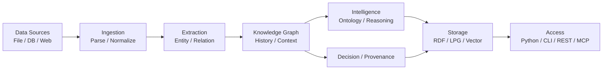
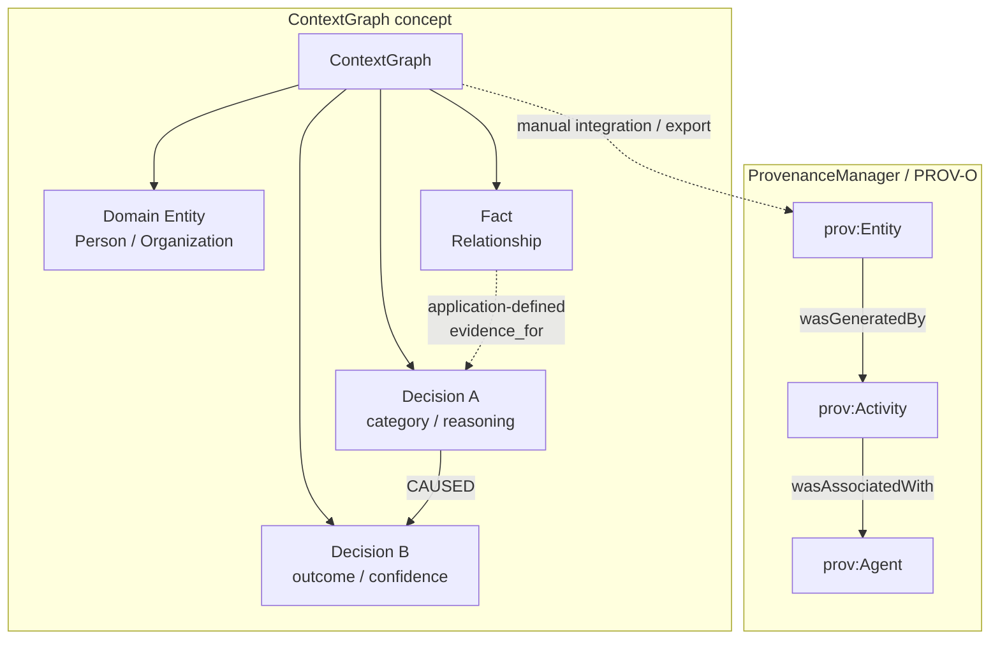

LLMを使った業務システムでは、回答だけでなく「なぜその判断に至ったか」「どのデータが根拠か」を後から説明できることが重要です。一方、会話履歴やベクトル検索だけでは、判断間の因果関係やデータの来歴を構造化して残すには追加設計が必要です。

[Semantica](https://github.com/semantica-agi/semantica)は、この領域をコンテキストグラフ、決定論的推論、オントロジー、プロビナンスで支えるオープンソースのPython基盤です。本記事では、2026年8月10日時点の`main`、commit `5048665d35c5183b958893a1011cb7d12d97032e`を基準に、構造とデータモデル、構築・利用・運用方法、現行版の制約を順に整理します。

同じ`0.6.0`表記でも、PyPI・タグ版と`main`の内容は異なります。コード例は基準commitのソースとテストに照合していますが、外部バックエンドを含む依存一式での実機試験までは行っていません。


*この記事の全体像。以下、順に解説します。*

## Semanticaとは

SemanticaはLLMやベクトルストアを置き換えるものではありません。既存のAIエージェント基盤に、エンティティ、関係、判断、根拠、因果関係を問い合わせ可能なグラフとして保持する層を追加します。

公式READMEでは「The Open Source Palantir for AI Agents」や「Production Ready」と表現されています。これはプロジェクト自身による位置づけであり、Palantirとの機能互換性や個別法令への準拠認証を意味するものではありません。

| 観点 | Plain LLM Memory | Vector DB + RAG | Semantica |
|---|---|---|---|
| 検索単位 | 会話履歴やトークン列 | 埋め込み済みチャンク | ベクトル類似度とエンティティ・関係 |
| 複数文書の関係探索 | プロンプト内の推論に依存 | アプリケーション側で実装 | `ContextGraph`の探索API |
| 意思決定履歴 | 通常は会話ログ | 通常は独自実装 | `record_decision`と因果関係 |
| 出典・リネージ | 通常は独自実装 | metadata設計に依存 | `ProvenanceManager`とPROV-O出力 |
| ルール推論 | LLMまたは独自実装 | アプリケーション側で実装 | Rete、Datalog、SPARQLなど |
| 追加コスト | 小さい | ベクトル索引の構築 | 抽出、グラフ構築、走査も必要 |

単一文書QAや類似検索だけなら、まずVector DB + RAGを評価する方が単純です。複数文書に分散した関係、過去判断との一貫性、説明経路が要件になったときにSemanticaの価値が出やすくなります。

## 主な特徴

- 判断を第一級オブジェクトとして扱うDecision Intelligence
- エージェントの知識と関係を表すContext Graph
- SHACL・OWL・SKOSによるオントロジー管理と競合検出
- W3C PROV-Oに基づくデータ来歴の追跡
- Forward Chaining・Rete・Datalog・SPARQLによる決定論的推論
- Neo4j・FalkorDB・Apache AGE・Amazon NeptuneなどのLPGバックエンド
- Blazegraph・Apache Jena・Eclipse RDF4JなどのRDFストア
- Databricks・Snowflakeなどのデータプラットフォームとの連携

広い機能面は利点ですが、コア依存にも機械学習・自然言語処理系のパッケージが多く含まれます。最初から全機能を導入せず、必要な経路だけを試すのが現実的です。

## 全体構造

データは取り込み、正規化、情報抽出、競合解決、重複排除を経てKnowledge Graphへ入ります。その上にオントロジー検証、論理推論、プロビナンス、意思決定記録が載り、ストレージとAPIへつながります。



| 層 | 主な役割 |
|---|---|
| Ingestion | ファイル、Web、DB、Databricks、Snowflakeなどからの取り込みと正規化 |
| Extraction | NER、関係・イベント・トリプレット抽出、競合解決、重複排除 |
| Knowledge Graph | ノードとエッジの構築、時系列履歴、グラフ分析 |
| Intelligence | オントロジー検証、推論、プロビナンス、判断と因果関係の記録 |
| Storage / Access | RDF・LPG・Vector Storeへの保存、Python・CLI・REST・MCPからの利用 |

`main`では`semantica[tripletstore-oxigraph]`による組み込み型Oxigraphも追加されていますが、PyPIで公開されているv0.6.0にはこのextraは含まれません。バックエンドを書き換え可能とする抽象化はありますが、個別製品の機能まで完全互換とは限りません。

## データモデル

中心となる`ContextGraph`は、一般的なノードとエッジに加え、判断をグラフのデータとして扱います。判断にはカテゴリ、シナリオ、理由、結果、確信度、時刻、metadataを持たせられます。

以下は実装がすべて自動生成するスキーマではなく、アプリケーション側で構築する概念モデルです。`record_decision()`は根拠とのエッジを自動生成しません。`add_edge(..., edge_type="evidence_for")`などで明示的に結びます。また、業務上の人・組織を表すDomain Entityと、PROV-Oの`prov:Entity`は別の概念です。



| 要素 | 主なデータ |
|---|---|
| ContextGraph | `graph_id`、nodes、edges |
| Decision | `decision_id`、`category`、`scenario`、`reasoning`、`outcome`、`confidence`、`timestamp`、`metadata` |
| Domain Entity | 業務上の人、組織、概念などの識別対象 |
| Fact | エンティティ間に成り立つ関係やトリプレット |
| ProvenanceManager | `prov:Entity`・`prov:Activity`・`prov:Agent`とPROV-O関係を扱う来歴側の管理要素 |

文字列のログだけで判断理由を残すと、過去の類似判断や下流への影響を構造的に探せません。判断自体をノードにすることで、原因の追跡、先例の検索、ポリシー適合性の確認を同じグラフ上で扱えます。

## 構築方法

### リリース版を仮想環境へインストール

パッケージの`requires-python`宣言はPython 3.8以上です。ただし、コア依存の`scikit-learn>=1.7.2`はPython 3.10以上を要求するため、通常の依存解決ではPython 3.10以上が実効下限です。運用評価ではPython 3.11以上を使います。

```bash
python3.11 -m venv .venv
source .venv/bin/activate
python -m pip install --upgrade pip
python -m pip install semantica
semantica doctor --json
```

### 必要なバックエンドだけを追加

`semantica[all]`は依存が大きいため、PoC以外では利用するextraだけを追加します。

```bash
python -m pip install "semantica[agno]"
python -m pip install "semantica[llm-litellm]"
python -m pip install "semantica[graph-neo4j]"
python -m pip install "semantica[vectorstore-qdrant]"
```

### `main`固有機能はcommitを固定

v0.6.0と`main`はコード上のバージョン表記が同じでも内容が異なります。Oxigraphなど`main`固有の機能を試すときは、対象commitを固定します。

```bash
git clone https://github.com/semantica-agi/semantica.git
cd semantica
git checkout 5048665d35c5183b958893a1011cb7d12d97032e
python3.11 -m venv .venv
source .venv/bin/activate
python -m pip install --upgrade pip
python -m pip install -e ".[dev,explorer,tripletstore-oxigraph]"
```

ソースから評価する場合は、READMEだけでなく現行ソースとテストも照合します。テスト一式は外部serviceや追加依存を要求する場合があるため、まず`python -m pytest -m "not integration" tests/`から確認します。

## 利用方法

### ノードとエッジを登録

`ContextGraph`に型付きノードと関係を登録し、指定hopまで近傍を探索します。

```python
from semantica.context import ContextGraph

graph = ContextGraph(advanced_analytics=False)
graph.add_node("acme", "Organization", name="Acme")
graph.add_node("alice", "Person", name="Alice")
graph.add_edge("alice", "acme", edge_type="works_for", since="2024-01-01")

neighbors = graph.get_neighbors("alice", hops=2)
print(neighbors)
```

### 判断と明示的な因果関係を記録

判断を理由や確信度とともに記録し、`CAUSED`、`INFLUENCED`、`PRECEDENT_FOR`のいずれかで結びます。明示した因果エッジは`get_causal_chain`で探索します。

```python
from semantica.context import ContextGraph

graph = ContextGraph(advanced_analytics=False)

architecture_id = graph.record_decision(
    category="vendor_selection",
    scenario="Choose cloud provider",
    reasoning="AWS offers BAA",
    outcome="selected_aws",
    confidence=0.93,
)

deployment_id = graph.record_decision(
    category="deployment",
    scenario="Deploy the selected graph backend",
    reasoning="Backend evaluation completed",
    outcome="deployed",
    confidence=0.91,
)

graph.add_causal_relationship(
    architecture_id,
    deployment_id,
    relationship_type="CAUSED",
)
causes = graph.get_causal_chain(deployment_id, direction="upstream")
print([(item.category, item.outcome) for item in causes])
```

`trace_decision_chain()`は、共有エンティティと時系列から原因候補を推定する別APIです。明示したエッジの探索と混同しないようにします。

### Datalogで決定論的に推論

`DatalogReasoner`はLLMを使わず、登録したfactとruleから結果を導きます。ルールの変数は大文字で記述します。

```python
from semantica.reasoning import DatalogReasoner

reasoner = DatalogReasoner()
reasoner.add_fact("parent(tom, bob)")
reasoner.add_fact("parent(bob, ann)")
reasoner.add_rule("ancestor(X, Y) :- parent(X, Y).")
reasoner.add_rule("ancestor(X, Z) :- parent(X, Y), ancestor(Y, Z).")

print(reasoner.query("ancestor(tom, ?X)"))
```

LLMで抽出する確率的な処理と、Datalogで判定する決定論的な処理は、監査時に区別できるようにします。

### CLIでプロビナンス付きエクスポート

`export`はJSON、Turtle、JSON-LD、Parquetなどを選べます。バックエンド設定を明示したうえで、`--with-provenance`により来歴を含めます。

```bash
semantica export \
  --format turtle \
  --with-provenance \
  --output audit-graph.ttl
```

## 運用

### ローカルREST service

`semantica server status`はPIDへのsignalでプロセスの生存を確認します。HTTP到達性は別途`/health`で確認します。

リリース版のコアインストールにはFastAPI・Uvicornが含まれないため、REST serviceを使う前に`explorer` extraを追加します。前述のソース版手順は`.[dev,explorer,tripletstore-oxigraph]`で導入済みです。

```bash
python -m pip install "semantica[explorer]"
```

```bash
semantica server start --host 127.0.0.1 --port 8000 --workers 1
semantica server status --json
curl -fsS http://127.0.0.1:8000/health
curl -fsS http://127.0.0.1:8000/api/info
semantica server stop
```

このREST serviceの`/health`は`{"status":"healthy"}`を返します。

### Docker Explorer

同梱ComposeはExplorerとFalkorDBを起動します。しかし、基準commitのExplorerはインメモリ`ContextGraph`を使用し、FalkorDBへ接続しません。

```bash
docker compose up -d --build
docker compose ps
curl -fsS http://127.0.0.1:8000/api/health
docker compose logs -f explorer falkordb
```

Explorerの`/api/health`は`{"status":"ok"}`を返しますが、これはExplorerプロセスの応答です。FalkorDBへの到達性やデータ永続化の確認には使えません。

### MCP server

同梱MCP serverの確実な入口はstdioの`semantica-mcp`または`python -m semantica.mcp_server`です。

```bash
export SEMANTICA_KG_PATH=/var/lib/semantica/context-graph.json
export SEMANTICA_LOG_LEVEL=INFO
semantica-mcp
```

`SEMANTICA_KG_PATH`は既存グラフを起動時に読み込むための指定です。基準commitでは、MCP toolによる変更を同パスへ自動保存しません。再起動後も更新を残すには、明示的なexport・保存フローが必要です。

### 更新前後を分けて検証

リリース版はchangelog、バックアップ、更新、再起動、doctor、healthの順に確認します。`semantica changelog`はバージョン文字列を比較するため、同じ`0.6.0`を名乗る`main`の差分は検出できません。

```bash
semantica changelog --json
python -m pip install --upgrade semantica
semantica doctor --json
docker compose build --pull explorer
docker compose up -d
```

Dockerの`falkordb:latest`は本番ではdigestまたは固定tagへ置き換えます。

### バックエンドと設定系統を分ける

- LPGはNeo4j、FalkorDB、Apache AGE、Amazon Neptuneから用途と運用実績で選ぶ
- RDFはv0.6.0のBlazegraph、Jena、RDF4Jと、`main`固有のOxigraphを分ける
- Vector Storeは採用する永続バックエンドごとに高レベルAPIを受け入れ試験する
- CLI/coreの`SEMANTICA_GRAPH_DB__...`・`SEMANTICA_VECTOR_STORE__...`と、module固有の`GRAPH_STORE_*`・`VECTOR_STORE_*`・`TRIPLET_STORE_*`を混同しない

`semantica init`が作る`~/.semantica/config.yaml`は、CLIで自動選択されない場合があります。`semantica --config ~/.semantica/config.yaml doctor`のように明示します。

## ベストプラクティス

### 共有グラフの境界を先に決める

複数エージェントで`ContextGraph`を共有すると、過去の判断と根拠を同じインテリジェンス層から参照できます。同時に、テナント、案件、会話ごとのアクセス境界と保持期間を先に定義します。

### 根拠と判断を分けて記録する

「モデルがこう答えた」ことと「その回答を採用した」ことは別の事実です。source location、原文引用、confidence、処理主体、timestampを揃え、Fact、推論結果、Decisionを分けてプロビナンスで結びます。PROV-O出力は個別法令への適合を自動保証するものではありません。

### Vector-onlyから段階的に導入する

単一文書QAや一回限りの検索ではVector-onlyを基準にします。関係探索、先例検索、説明経路が必要になった時点でグラフを追加し、同じ評価データで検索品質、token量、応答時間を比較します。

### 未信頼入力と永続バックエンドを個別に検証する

利用者が指定するURLやGit repositoryをingestorへ直接渡さず、URL allowlist、outbound firewall、private・loopback・link-local・metadata endpointの遮断を併用します。永続Vector StoreはFAISS、Qdrant、Pineconeなど採用対象ごとに試験し、インメモリで通るテストだけを受け入れ条件にしないようにします。

## トラブルシューティング

最初に`semantica doctor --json`、対象serviceのPID status、HTTP health、バックエンド到達性を別々に確認します。MCPは`SEMANTICA_LOG_LEVEL=DEBUG`でstderrを確認し、永続化障害は保存先の絶対パス、権限、volume mount、採用backendを切り分けます。

| 症状 | 原因 | 対処 |
|---|---|---|
| Python 3.8・3.9で依存解決できない | `scikit-learn>=1.7.2`の実効要件 | Python 3.10以上、推奨3.11以上の仮想環境を使う |
| 明示した因果エッジを`trace_decision_chain`で追えない | 共有エンティティと時系列から候補を推定する別API | `get_causal_chain(..., direction="upstream")`を使う |
| MCPで追加したデータが再起動後に消える | `SEMANTICA_KG_PATH`は起動時load用で、変更は自動saveされない | 明示的なexport・保存フローと再起動テストを用意する |
| MCP clientにserverが表示されない | virtualenvのbinaryがPATHにない、またはclientを再起動していない | `which semantica-mcp`で絶対パスを確認し、clientを完全再起動する |
| Dockerの`/api/health`は通るがFalkorDBにデータがない | Explorerは現行実装でFalkorDBへ接続しない | healthをbackend確認に使わず、永続backendを直接queryする |
| 永続Vector StoreのDecision APIで`AttributeError`が出る | インメモリ固有属性へアクセスするIssue #848 | 対象APIを採用経路から外し、修正版を追跡する |
| Web ingestionが内部URLへ到達する | Issue #867のSSRF対策が未実装 | 外部公開を避け、allowlistとegress制御を入れる |
| repository ingestionで任意clone optionを渡せる | Issue #868の入力検証が未実装 | 利用者入力を直接渡さず、URLとoptionをallowlistする |
| SPARQL queryが失敗する | endpoint URL、認証、backend種別が一致しない | 実際のJena・RDF4J endpointを確認し、接続試験を分離する |

## 導入前に確認する制約

- **リリース境界**: `pip install semantica`で入るv0.6.0と、基準commitの`main`固有機能を混ぜない
- **Python要件**: 宣言上の3.8以上ではなく、依存解決上の3.10以上、推奨3.11以上を基準にする
- **認証**: READMEは`SEMANTICA_SECRET_KEY`を案内するが、基準commitでこの変数を読む実装は確認できない。reverse proxy、認証、network policyを別途設計する
- **health check**: REST、Explorer、バックエンド到達性を別々に監視する
- **バックアップ**: Semanticaの`backup create/sync`だけでNeo4j、FalkorDB、Qdrantなどのnative dumpを取得できるとは考えず、各DBのbackupを別途構成する
- **ストレージ検証**: インメモリで通るテストと、採用する永続backendの受け入れテストを分ける
- **公開範囲**: 未信頼URLやrepositoryを受け付けるserviceとして直接公開しない

2026年8月10日時点では、永続Vector StoreのDecision APIに関する[Issue #848](https://github.com/semantica-agi/semantica/issues/848)、Web/API ingestionのSSRFに関する[Issue #867](https://github.com/semantica-agi/semantica/issues/867)、repository ingestionの入力検証に関する[Issue #868](https://github.com/semantica-agi/semantica/issues/868)がopenです。未信頼入力を扱う前に、各Issueの修正状況を確認してください。

## まとめ

Semanticaは、AIエージェントの記憶をテキストや埋め込みだけでなく、判断、根拠、因果関係、来歴を持つグラフとして扱う基盤です。Context GraphとDecision Intelligenceを中心に、オントロジー、決定論的推論、W3C PROV-O、複数のグラフストレージを組み合わせられます。

導入価値が出やすいのは、判断理由の説明、過去事例の追跡、ポリシー検証が必要な業務です。まず説明責任を持つべき判断を1つ選び、記録、因果追跡、再起動後の永続性、監査出力の順に小さく検証するとよいでしょう。

この記事が少しでも参考になった、あるいは改善点などがあれば、ぜひリアクションやコメント、SNSでのシェアをいただけると励みになります！

## 参考リンク

### 概要・構造

- [Semantica GitHub repository](https://github.com/semantica-agi/semantica)
- [基準commitのREADME](https://github.com/semantica-agi/semantica/blob/5048665d35c5183b958893a1011cb7d12d97032e/README.md)
- [基準commitのARCHITECTURE.md](https://github.com/semantica-agi/semantica/blob/5048665d35c5183b958893a1011cb7d12d97032e/ARCHITECTURE.md)
- [v0.6.0から基準commitまでの比較](https://github.com/semantica-agi/semantica/compare/v0.6.0...5048665d35c5183b958893a1011cb7d12d97032e)

### 構築・API

- [基準commitのpyproject.toml](https://github.com/semantica-agi/semantica/blob/5048665d35c5183b958893a1011cb7d12d97032e/pyproject.toml)
- [scikit-learn 1.7.2 metadata](https://pypi.org/pypi/scikit-learn/1.7.2/json)
- [ContextGraph implementation](https://github.com/semantica-agi/semantica/blob/5048665d35c5183b958893a1011cb7d12d97032e/semantica/context/context_graph.py)
- [DatalogReasoner implementation](https://github.com/semantica-agi/semantica/blob/5048665d35c5183b958893a1011cb7d12d97032e/semantica/reasoning/datalog_reasoner.py)

### 運用

- [CLI implementation](https://github.com/semantica-agi/semantica/blob/5048665d35c5183b958893a1011cb7d12d97032e/semantica/cli.py)
- [Docker Compose](https://github.com/semantica-agi/semantica/blob/5048665d35c5183b958893a1011cb7d12d97032e/docker-compose.yml)
- [Explorer implementation](https://github.com/semantica-agi/semantica/blob/5048665d35c5183b958893a1011cb7d12d97032e/semantica/explorer/app.py)
- [MCP server guide](https://github.com/semantica-agi/semantica/blob/5048665d35c5183b958893a1011cb7d12d97032e/docs/guides/mcp-server.md)

### 現行制約

- [Persistent Vector StoreのDecision API Issue #848](https://github.com/semantica-agi/semantica/issues/848)
- [Web/API ingestionのSSRF Issue #867](https://github.com/semantica-agi/semantica/issues/867)
- [Repository ingestionの入力検証 Issue #868](https://github.com/semantica-agi/semantica/issues/868)
