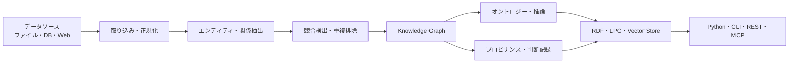
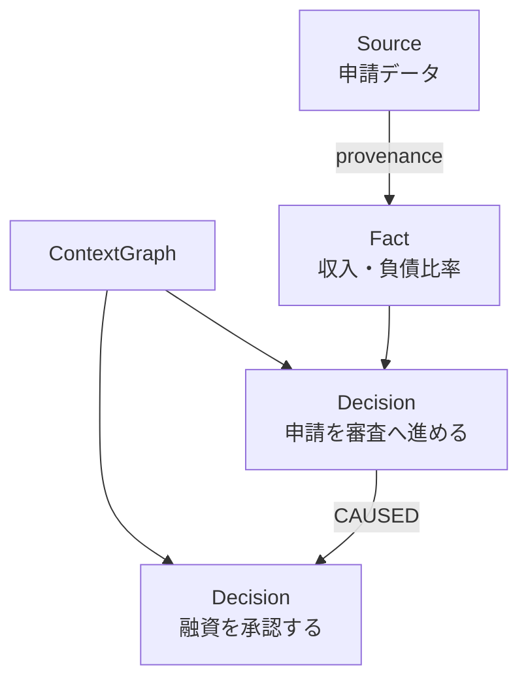

LLMを使った業務システムでは、回答の精度だけでなく「なぜその判断をしたのか」「どのデータが根拠だったのか」を後から説明できることが重要です。しかし、ベクトル検索と会話履歴だけでは、判断間の因果関係やデータの来歴を構造化して残すのは容易ではありません。

[Semantica](https://github.com/semantica-agi/semantica)は、この課題に対してコンテキストグラフ、決定論的推論、オントロジー、プロビナンスをまとめて提供するオープンソースのPython基盤です。本記事では、2026年8月10日時点の`main`ブランチとバージョン0.6.0のメタデータを基に、構造、データモデル、最小構成での使い方、導入時の注意点を整理します。


*この記事の全体像。以下、順に解説します。*

## Semanticaが埋める空白

SemanticaはLLMやベクトルストアを置き換える製品ではありません。既存のAIエージェント基盤の下に置き、エンティティ、関係、判断、根拠、因果関係を問い合わせ可能なグラフとして保持する層です。

公式READMEでは、主な機能として次を挙げています。

- 判断を第一級オブジェクトとして扱うDecision Intelligence
- エージェントが知っている情報と関係を表すContext Graph
- SHACL、OWL、SKOSを使ったオントロジー管理
- W3C PROV-Oに基づくデータ来歴の追跡
- Forward Chaining、Rete、Datalog、SPARQLによる決定論的推論
- RDF、Labeled Property Graph、ベクトルストアを選べるストレージ抽象化

ベクトル検索が「意味的に近い情報」を探すのに向く一方、グラフ探索は「何と何が、どの関係でつながっているか」をたどるのに向きます。Semanticaは両者を併用し、検索結果だけでなく判断の経路も残す設計です。

## 全体構造

データは取り込みから正規化、情報抽出、競合検出、重複排除を経てKnowledge Graphへ入ります。その上にオントロジー、推論、プロビナンス、判断記録の機能が載り、各種ストレージやAPIへ接続します。



役割を大きく分けると、次の5層として理解できます。

| 層 | 主な役割 |
|---|---|
| Ingestion | ファイル、Web、DB、Databricks、Snowflakeなどからの取り込み |
| Extraction | NER、関係・イベント・トリプレット抽出、競合検出、重複排除 |
| Knowledge Graph | ノードとエッジの構築、時系列履歴、グラフ分析 |
| Intelligence | オントロジー検証、推論、プロビナンス、判断と因果関係の記録 |
| Storage / Access | RDF・LPG・Vector Storeへの永続化、CLI・REST・MCPからの利用 |

ストレージは用途に応じて交換できます。LPGではNeo4j、FalkorDB、Apache AGE、Amazon Neptune、RDFではBlazegraph、Apache Jena、Eclipse RDF4Jが公式READMEに掲載されています。現在の`main`では、追加extraの`semantica[tripletstore-oxigraph]`で組み込み型Oxigraphも利用できますが、PyPIで公開されている0.6.0にはこのextraはまだ含まれません。QdrantやWeaviateなどのベクトルストアもオプションで接続できます。

## 判断をグラフのデータとして扱う

中心となる`ContextGraph`は、通常のノードとエッジに加えて判断を記録できます。判断にはカテゴリ、状況、理由、結果、確信度を持たせ、別の判断と因果関係で結びます。



ログの文字列として判断理由を残すだけでは、過去の類似判断や下流への影響を構造的に検索できません。判断自体をノードにすると、原因の追跡、類似事例の検索、ポリシー適合性の確認を同じグラフ上で扱えます。

## 最小構成で試す

パッケージの`requires-python`宣言はPython 3.8以上です。ただし、0.6.0のコア依存に含まれる`scikit-learn>=1.7.2`はPython 3.10以上を要求するため、実際のインストールではPython 3.10以上を使います。まず仮想環境へコアをインストールし、`doctor`で環境を確認します。

```bash
python -m pip install semantica
semantica doctor
```

次の例は、公式READMEのQuick StartとDecision Intelligenceの例に合わせて、2つの判断を記録し、因果関係を追加するものです。

```python
from semantica.context import ContextGraph

graph = ContextGraph(advanced_analytics=True)

application_id = graph.record_decision(
    category="credit_application",
    scenario="申請 A-7291 を審査へ進めるか",
    reasoning="収入と雇用期間が受付基準を満たした",
    outcome="proceed_to_underwriting",
    confidence=0.88,
    metadata={"application_id": "A-7291"},
)

underwriting_id = graph.record_decision(
    category="loan_underwriting",
    scenario="申請 A-7291 の引受審査",
    reasoning="負債比率が社内ポリシーの範囲内だった",
    outcome="approved",
    confidence=0.94,
)

graph.add_causal_relationship(
    application_id,
    underwriting_id,
    relationship_type="CAUSED",
)

causes = graph.get_causal_chain(
    underwriting_id,
    direction="upstream",
)
impact = graph.analyze_decision_impact(application_id)

for decision in causes:
    print(
        decision.category,
        decision.outcome,
        decision.metadata["causal_distance"],
    )
```

この例では、`get_causal_chain(..., direction="upstream")`が明示的な因果エッジを上流へたどり、`Decision`のリストを返します。出力は次の1行です。

```text
credit_application proceed_to_underwriting 1
```

`relationship_type`として現行実装で許可されている値は`CAUSED`、`INFLUENCED`、`PRECEDENT_FOR`です。なお、公式Quick Startにある`trace_decision_chain()`は別の経路で、共有エンティティと時系列から原因候補を推定します。明示したエッジの探索と混同しないようにしてください。

## 必要な機能だけ追加する

Semanticaはバックエンドや連携先をextrasで追加できます。2026年8月10日時点の`pyproject.toml`では、たとえば次の名前が定義されています。

```bash
# Agno連携
python -m pip install "semantica[agno]"

# LiteLLM連携
python -m pip install "semantica[llm-litellm]"

# Neo4jバックエンド
python -m pip install "semantica[graph-neo4j]"

# 開発・可視化・各種バックエンドをまとめて導入
python -m pip install "semantica[all]"
```

コア依存にも機械学習・自然言語処理系のパッケージが多く含まれます。小さな検証環境でも、仮想環境を分け、インストールサイズと依存関係の競合を事前に確認するのが安全です。

## 運用設計で先に決めること

### 何を「判断」として残すか

すべての中間処理を判断として保存すると、グラフがノイズで埋まります。業務上の結果に影響する選択、後から説明を求められる選択、ポリシー判定の境界を判断記録の単位にすると追跡しやすくなります。

### 根拠と判断を別々に管理する

「モデルがこう答えた」ことと「その回答を採用した」ことは別の事実です。入力データ、抽出したFact、推論結果、最終Decisionを分け、プロビナンスで出典を結ぶと、データ更新時の影響範囲を追えます。

### 永続化バックエンドをユースケースで選ぶ

ローカル検証と本番運用では要件が異なります。RDF/SPARQLとW3C標準への適合を重視するのか、LPGの探索性能と既存運用を重視するのか、ベクトル検索も同じ構成で扱うのかを先に決めます。特定製品の機能がすべて同一ではないため、バックエンド交換可能性をそのまま完全互換と解釈しないことが重要です。

### LLMを使わない経路も分離して検証する

Semanticaのグラフ構築、ルール推論、プロビナンスは決定論的に実行できると説明されています。一方、LLMを使った抽出を組み込めば、その箇所にはモデル由来の揺らぎが残ります。監査対象では、決定論的な処理と確率的な抽出をパイプライン上で区別し、評価方法も分ける必要があります。

## 導入時の注意点

- APIは開発中に変化し得るため、導入時はバージョンを固定し、公式READMEと現行ソースを照合する
- 「監査可能な形式で出力できること」と、個別規制への準拠認証を得ていることを混同しない
- 競合検出があっても、どの情報源を優先するかという業務ルールは別途設計する
- 共有Context Graphでは、テナント分離、アクセス制御、個人情報の保持期間を先に定義する
- グラフ、RDF、ベクトルの複数ストアを併用する場合は、更新順序と障害時の再同期方法を決める

Semanticaは広い機能面を持つため、最初から全機能を導入するより、1つの意思決定フローを対象に、記録、因果追跡、監査出力の順で小さく検証するのが現実的です。

## まとめ

Semanticaは、AIエージェントの記憶を単なるテキストや埋め込みではなく、判断、根拠、因果関係、来歴を持つグラフとして管理する基盤です。Context GraphとDecision Intelligenceを中心に、オントロジー、決定論的推論、W3C PROV-O、複数のグラフストレージを組み合わせられます。

導入価値が出やすいのは、判断理由の説明、過去事例の追跡、ポリシー検証が必要な業務です。まずは公式Quick Startを動かし、自社で説明責任を持つべき判断を1つ選んで、必要なデータモデルと運用境界を確かめるとよいでしょう。

この記事が少しでも参考になった、あるいは改善点などがあれば、ぜひリアクションやコメント、SNSでのシェアをいただけると励みになります！

## 参考リンク

- [Semantica GitHubリポジトリ](https://github.com/semantica-agi/semantica)
- [Semantica公式ドキュメント](https://docs.getsemantica.ai/)
- [Semantica Architecture](https://github.com/semantica-agi/semantica/blob/main/ARCHITECTURE.md)
- [Semantica pyproject.toml](https://github.com/semantica-agi/semantica/blob/main/pyproject.toml)
- [W3C PROV-O](https://www.w3.org/TR/prov-o/)
