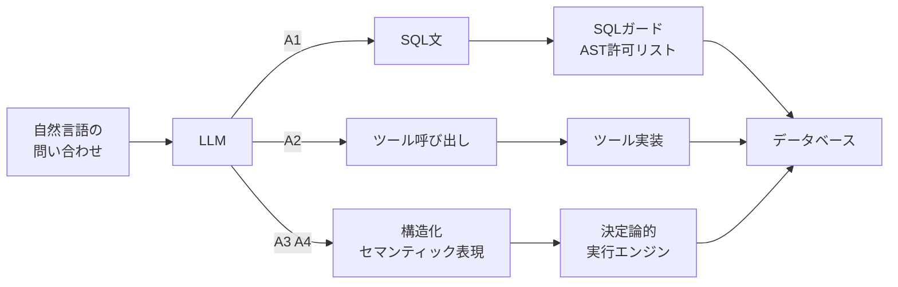

自然言語でデータベースに問い合わせる仕組みを社内に入れるとき、多くの現場で最初に検討されるのが「LLMに直接SQLを書かせるのをやめ、あいだにセマンティックレイヤーを挟む」という設計です。メトリクスやディメンションを定義した中間表現をLLMに出力させ、決定論的なエンジンがSQLへ変換する。直感的には、精度も安全性も同時に上がりそうに見えます。

その直感を、同一条件の比較実験で検証したのが [SemPlan: Benchmarking Structured Semantic Planning for LLM-Based Queries over Enterprise Data (arXiv:2608.13612)](https://arxiv.org/abs/2608.13612) です。結論から言うと、**セマンティックレイヤーの導入は「正答率を単調に上げる」のではなく、「どの失敗モードを引き受けるかを付け替える」操作**でした。

この記事では、比較された4つのアーキテクチャと測定結果を整理したうえで、自分たちのユースケースでどれを選ぶかの判断基準に落とします。

対象読者は次のような方です。

- 社内データに自然言語で問い合わせる仕組みの導入を検討している方
- Text-to-SQLの受け入れ基準（何をもってGOとするか）を決める立場の方
- すでにセマンティックレイヤーを入れたが、期待ほど精度が上がらず理由を探している方

*この記事の全体像。以下、順に解説します。*

## 何が比較されたのか

実験は1,800件の合成バイリンガル（英語・ポルトガル語）ケースを使い、同一モデル（gpt-5.6-luna）で4つのアーキテクチャを揃えて評価しています。モデルを固定して構造だけを変えているため、差分はアーキテクチャに帰せられます。

| ID | アーキテクチャ | LLMが出力するもの | 実行を担うもの |
|---|---|---|---|
| A1 | Direct SQL | SQL文そのもの | 後段のSQLガード（AST許可リスト等）が検査して実行 |
| A2 | Tool Agent | 限定ツール（集計・比較など）の呼び出し | ツール実装 |
| A3 | Semantic Request | 構造化セマンティックリクエスト（メトリクス・ディメンション・フィルタ） | 決定論的エンジン |
| A4 | Stateful Semantic Plan | A3と同じ構造化表現＋マルチターンの状態更新（PATCH / REPLACE） | 決定論的エンジン |

A1からA4へ向かうほど、LLMに渡す自由度が下がり、決定論的ソフトウェアの担当範囲が広がります。責任分界点の位置が違う、と言い換えられます。

## 測定結果 — 勝者が指標ごとに入れ替わる

報告された主要な数値を並べると、単一の勝者が存在しないことがはっきりします。

| 指標 | 最良のアーキテクチャ | 値 | 対比 |
|---|---|---|---|
| 正答率 | A3 Semantic Request | 25.67% | A1は22.25% |
| ポリシー正確性 | A1 Direct SQL | 43.67% | — |
| unsafe-or-invalid率（低いほど良い） | A1 Direct SQL | 31.00% | A3は60.58% |
| 平均APIコスト（低いほど良い） | A4 Stateful Semantic Plan | 最安 | — |
| false-refusal率（低いほど良い） | A4 Stateful Semantic Plan | 0.17% | — |
| マルチターンの状態一貫性正答率 | 差がつかない | 全手法14.00%〜20.00% | — |

読み取れることは3点です。

**1. 正答率で最良のA3が、安全性では最悪に近い。** セマンティック表現は「ユーザーの意図をどう解釈したか」の精度を上げます。一方でLLMは、契約スキーマ（許されたメトリクス名・ディメンション名・フィルタ形式）に厳密に従う必要が生じ、そこを踏み外した出力が「安全でない、あるいは無効」として弾かれます。unsafe-or-invalid率がA1の31.00%に対しA3で60.58%まで上がるのは、この契約違反が積み上がった結果です。

**2. 制約が緩いA1のほうが、安全側では強い。** 一見逆説的ですが、A1は「LLMの出力を信用しない」前提でSQLガードを後段に置く構成です。危険なクエリはパーサとAST許可リストで機械的に落とせるため、ポリシー準拠は構造的に担保されます。LLMの自由度を上げつつ、検査を出口に一本化した設計と言えます。

**3. マルチターンは、どの構成でも解けていない。** A4は状態保持と明示的な更新操作を持ちますが、状態一貫性の正答率は14.00%〜20.00%のレンジに全手法が収まります。「文脈を構造で持てば対話が続く」という期待は、この実験では支持されていません。曖昧さはアーキテクチャの外側に残る問題です。

## なぜ「正確性 vs 安全性」のトレードオフになるのか

失敗の起き方が、構成ごとに違う場所へ移動しているためです。

- **A1では、失敗は「出口」で起きる。** LLMが危ないSQLを書いても、ガードが弾く。弾かれた分は安全側の損失（実行されない）に計上され、ポリシー違反としては表面化しません。
- **A3・A4では、失敗は「入口の契約」で起きる。** 決定論的エンジンは正しい構造化表現しか受け取れないので、スキーマ違反はそのまま無効クエリになります。意図の解釈精度は上がっても、形式適合の失敗が新たに増えます。

つまりセマンティックレイヤーは、**「意味の誤り」を減らす代わりに「形式の誤り」を増やす**取引です。どちらの失敗が自分たちにとって高くつくかで、選択が決まります。

## 用途別の選択指針

報告された数値を、そのまま判断材料に変換すると次のようになります。

### 顧客向け・外部公開ダッシュボード → A1（Direct SQL＋厳格なガード）

外部に出す面では、誤った数値の提示やアクセス権限の越境が最も高くつきます。正答率は22.25%とA3の25.67%に劣りますが、ポリシー正確性43.67%・unsafe-or-invalid率31.00%という安全側の強さが優先されます。

実装上の要点は、SQLガードをLLM側の努力に依存させないことです。ASTレベルの許可リスト（許可するテーブル・カラム・関数・句）と、行レベルセキュリティをデータベース側で二重に持たせる構成が前提になります。

### 社内アナリスト向けの探索的クエリ → A4（またはA3）

社内利用では、結果を見た人間が誤りに気づけます。ここで効くのは、平均APIコストの低さと、false-refusal率0.17%という「無駄に断らない」性質です。探索的な利用では、システムが過剰に拒否するほうが体験を壊します。試行回数を稼げることのほうが、1回あたりの正答率より価値を持ちます。

### どちらでもマルチターンは設計で埋める

状態一貫性が14.00%〜20.00%に留まる以上、「対話で絞り込ませる」前提のUXはアーキテクチャだけでは成立しません。意図が曖昧なときにシステムが黙って仮説を進めないよう、問い返す導線（Clarification UX）を明示的に実装する必要があります。これはモデルやレイヤーの選択とは独立した投資です。

## 受け入れ基準をどう書き換えるか

この結果を実務に持ち込むと、評価設計そのものが変わります。単一の正答率でGO/NO-GOを判定していると、指標ごとに勝者が違う事実を取りこぼします。

最低限、次の4つを別個のKPIとして立て、ユースケースごとに許容ラインを合意しておくのが妥当です。

| KPI | 何を守るか | 許容ラインを決める人 |
|---|---|---|
| 正答率 | 出力の有用性 | 利用部門 |
| ポリシー違反率 / unsafe-or-invalid率 | データガバナンス | セキュリティ・データ管理部門 |
| false-refusal率 | 利用体験と定着 | 利用部門 |
| 平均APIコスト | 運用継続性 | 予算責任者 |

4指標のうちどれを優先するかは、外部向けか社内向けかでほぼ決まります。逆に言えば、**同じ組織の中でも面が違えば違うアーキテクチャを選んでよい**、というのがこの比較の実用的な含意です。全社で1つのText-to-SQL基盤に統一する判断は、この結果からは支持されません。

## 結果を読むときの留保

そのまま自社に当てはめる前に、押さえておくべき限界が2つあります。

**合成データによる評価です。** ベンチマークは1,800件の合成ケースで構成されています。実際のエンタープライズ環境には、文書化されていないビジネスルールや、命名規則から外れたスキーマ、歴史的経緯で残った非正規化テーブルが存在します。これらに対する堅牢性は、合成評価では過大評価される方向に働きます。絶対値をそのまま自社の期待値にせず、**構成間の相対的な傾向**として読むのが安全です。

**曖昧性処理は未解決のままです。** 構造的制約を足しても、「誤った仮説で進行する」か「安全側に倒しすぎて過剰拒否する」かの二択は残っています。どちらに倒すかを設計で選ぶことはできますが、どちらも起こさない構成はこの実験の範囲では見つかっていません。

また、掲載した数値は絶対値としては全体的に低い水準です（最高でも正答率25.67%）。これはベンチマークの難易度設定を反映したものと読むべきで、Text-to-SQL全般の実力を示す数字として引用するのは適切ではありません。

## まとめ

- SemPlanの比較では、**万能なアーキテクチャは存在しない**。指標ごとに勝者が入れ替わる
- セマンティックレイヤー（A3・A4）は正答率を上げるが、契約スキーマ違反により unsafe-or-invalid率を60.58%まで押し上げる
- Direct SQL（A1）＋厳格なガードは、正答率で劣るがポリシー正確性43.67%・unsafe-or-invalid率31.00%と安全側で最も強い
- Stateful Semantic Plan（A4）は最安コストかつfalse-refusal率0.17%で、社内の探索的利用に向く
- マルチターンの状態一貫性は全手法14.00%〜20.00%。**アーキテクチャでは解けず、問い返すUXの実装が必要**
- 受け入れ基準は「正答率」単独をやめ、安全性・誤拒否率・コストを別KPIとして面ごとに合意する

セマンティックレイヤーを入れるかどうかは、精度の問題ではなく「どの失敗なら受け入れられるか」の問題です。外部向けと社内向けで答えが変わるなら、基盤を1つに統一しない判断も含めて検討する価値があります。

この記事が少しでも参考になった、あるいは改善点などがあれば、ぜひリアクションやコメント、SNSでのシェアをいただけると励みになります！

## 参考リンク

- [SemPlan: Benchmarking Structured Semantic Planning for LLM-Based Queries over Enterprise Data (arXiv:2608.13612)](https://arxiv.org/abs/2608.13612)
