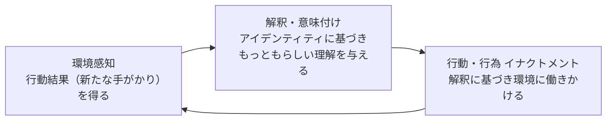
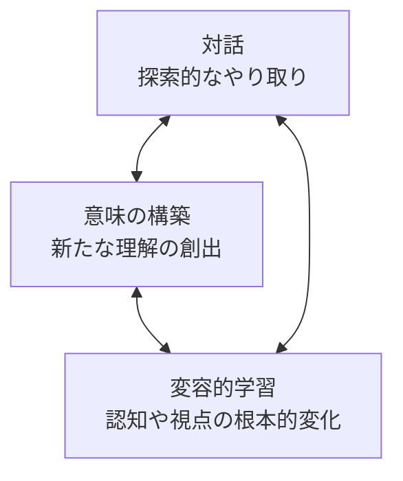
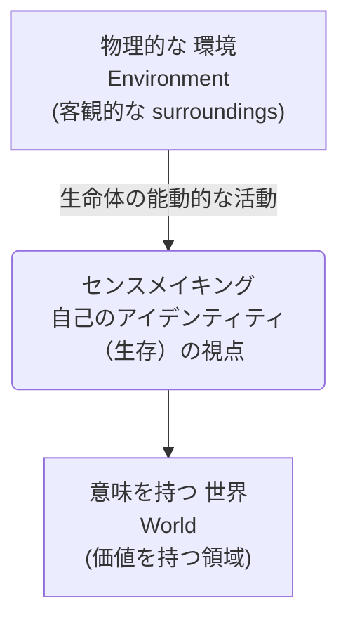
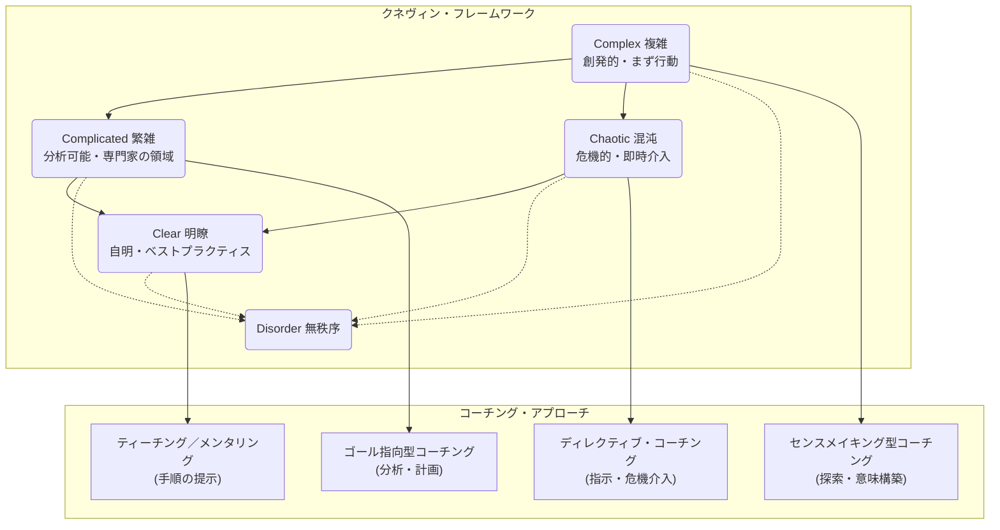
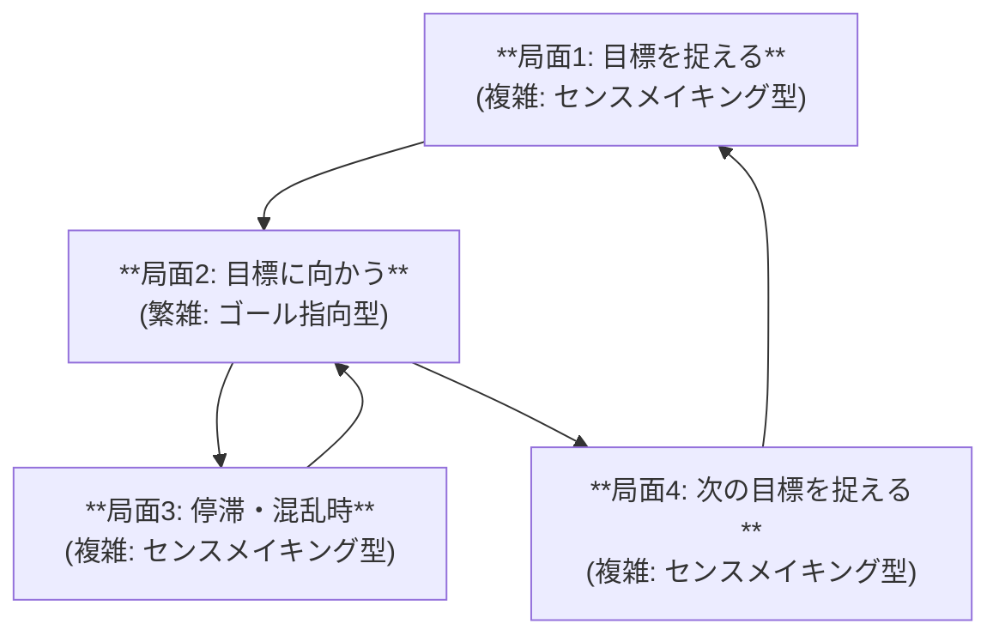

## 序論：なぜ今、「意味」を見つける技術が必要なのか？

現代はVUCA（変動性、不確実性、複雑性、曖昧性）の時代と呼ばれます。未来が予測できず、従来の「地図」が役に立たない状況です。

このような環境下では、明確なゴール設定に基づく従来型のコーチング（例：GROWモデル）は限界を迎えることがあります。霧の中で「あの山（ゴール）に登ろう」と決めても、その山が本当に正しいのか、そこへ至る道があるのかさえ不確かだからです。

この文脈で、リーダーや個人にとって「**センスメイキング（Sensemaking）**」の能力が不可欠になります。

:::message
**センスメイキングとは？**
日本語で「意味構築」や「納得感の醸成」と訳されます。
一言で言えば、「**地図がない場所で、納得できる『もっともらしい仮の地図』を描き、最初の一歩を踏み出すためのプロセス**」です。

組織心理学者のカール・ワイク（Karl Weick）氏らが提唱した概念で、複雑で未知な状況を構造化し、それに「もっともらしい理解（納得感）」を与え、行動可能にする認知プロセスを指します。
:::

この記事では、このセンスメイキングのプロセスを中核に据えた「**センスメイキング型コーチング**」というアプローチを分析・考察します。単なる技法としてではなく、クライアントが「自分自身の意味」を再構築し、アイデンティティの変容を扱う根本的なパラダイムとして、その理論的基盤、哲学的背景、実践的技法を整理します。

## I. センスメイキング型コーチングの基盤：理論とアイデンティティ

本章では、センスメイキング型コーチングの定義的枠組みを確立します。その核心が「アイデンティティ・ワーク」にあることを論証します。

### 1.1 センスメイキングの組織論的起源：カール・ワイクの理論

センスメイキングの概念は、組織心理学者カール・ワイク氏が確立しました。ワイク氏は、センスメイキングを「曖昧模糊とした状況を言葉で明確に理解し、行動への跳躍台（springboard into action）として機能させるプロセス」と定義しました。

このプロセスは、7つの主要素で構成されます。

| 要素名 | 説明 |
| :--- | :--- |
| **アイデンティティ (Identity)** | 自己認識（「私は何者か」）が状況解釈の基盤となる |
| **回想 (Retrospect)** | 過去の経験をふりかえり、現在の出来事に意味を付与する |
| **行動 (Enactment)** | **行動を通じて環境に働きかけ、現実を「創出」する**（後述） |
| **社会性 (Social)** | 他者との対話や関係性の中で実行される |
| **継続性 (Ongoing)** | 終わりがなく、常に続くプロセスである |
| **部分的認知 (Extracted Cues)** | 環境のすべてではなく、特定の「手がかり」を抽出して解釈する |
| **説得性・納得性 (Plausibility)** | 「絶対的な正確性」よりも「もっともらしさ」や「納得感」を重視する |

ここで特に重要なのが「**アイデンティティ**」と「**イナクトメント（Enactment：行動による現実創出）**」です。

センスメイキングは、「私は（この会社の）リーダーである」（アイデンティティ）という自己認識を基盤に、「この混乱は脅威ではなく、チャンスかもしれない」（解釈）と考え、「まずはチームで対話の場を持ってみよう」（イナクトメント）と行動するプロセスです。**自分が何者かによって、世界の見え方（意味づけ）が変わり、行動が変わる**のです。

経営学者の入山章栄氏による解説なども参考にワイクの理論を整理すると、このプロセスは「環境感知」「解釈・意味付け」「行動・行為（イナクトメント）」の3段階の循環として捉えられます。

**図1：センスメイキングの3段階循環 (ワイクの理論に基づく整理)**

### 1.2 コーチング・プロセスとしてのセンスメイキング：アンジェリーク・デュトワの貢献

アンジェリーク・デュトワ（Angélique Du Toit）氏は、この組織論的概念をコーチングの文脈に導入しました。デュトワ氏は、コーチングを本質的に「センスメイキング活動」として位置づけました。

コーチングの目的は「個人を取り巻く曖昧さに対して、明快さ、秩序、合理性の感覚を与えること」です。このプロセスで、コーチは「**センスメイキングの装置**」として機能します。コーチが発する思慮深い質問、内省の促進、フィードバックを通じて、クライアントは情報を処理し、新たな選択肢や進路を見出します。

デュトワ氏は、コーチングの「ブラックボックス」（プロセスの中核）で起きていることを、「対話」「意味の構築」「変容的学習」の相互作用、すなわちセンスメイキングであると定義しました。

**図2：コーチングのブラックボックス（デュトワ氏の定義）**

### 1.3 センスメイキング型コーチングの中核的機能：アイデンティティ・ワーク

近年のコーチング研究は、センスメイキングとアイデンティティの結びつきをさらに深めています。スゼット・スキナー（Suzette Skinner）氏らの研究は、この関係性を決定的なものとして位置づけます。

研究によれば、「コーチングが効果的であるための鍵は、クライアントのアイデンティティ・ワークを可能にすること」であり、そのアイデンティティ・ワークは「核心においてセンスメイキングの力学を伴う」と論証されています。

:::message
**アイデンティティ・ワークとは？**
個人が人生の変化や職業上の移行（昇進、異動、転職など）に応じ、自身のアイデンティティ（「私は何者か」という自己認識）を積極的に構築、修正、または強化するために行う、内省的な意味構築プロセスのことです。
:::

センスメイキング型コーチングの真の目的は、表面的な「問題」の解決以上に、その問題が引き起こした「**アイデンティティの危機**」や「移行」のナビゲートです。

キャリア移行期、役割変化、トラウマ的な出来事の後 など、既存の自己認識が揺らぐあらゆる場面で、人々は「自分は何者か」を問い直し、アイデンティティを再構築するためにセンスメイキングに従事します。センスメイキング型コーチングは、この最も重要なプロセスを支援する専門的実践です。

## II. 哲学的ルーツ：なぜアイデンティティが「世界」を創るのか？

この章では、センスメイキング型コーチングの哲学的背景を掘り下げます。なぜセンスメイキングがアイデンティティと不可分なのかを、認知科学の「**エナクティヴィズム**」の観点から解明します。

### 2.1 エナクティヴィズムの概要

エナクティヴィズム（Enactivism：日本語で「行為主義」や「生起主義」）は、1991年にフランシスコ・ヴァレラ（Francisco Varela）氏らが発表した『The Embodied Mind（身体化された心）』を端緒とする認知科学の立場です。

エナクティヴィズムは、従来の認知科学の主流であった「表象主義」を根本から批判します。

| 比較項目 | 表象主義 (Representationism) | エナクティヴィズム (Enactivism) |
| :--- | :--- | :--- |
| **前提** | 客観的な世界が「あらかじめ」存在 | 世界と心（認知）は「共に立ち上げられる」 |
| **認知プロセス** | 世界を内的イメージ（表象）として受容 | 行動と環境の動的な相互作用から生起 |
| **心の状態** | 受動的（カメラのように世界を写し取る） | 能動的（身体化された活動） |
| **世界の捉え方** | 世界を「発見」する | 世界を「**立ち上げる (enact)**」 |

表象主義が「世界をカメラで写す」イメージなら、エナクティヴィズムは「**身体で探索し、触れ、行動することで、自分にとっての『世界』が初めて意味を持つ**」というイメージです。

### 2.2 エナクティヴィズムにおける「センスメイキング」

エナクティヴィズムの文脈において、「センスメイキング」はヴァレラ氏らが提唱した中核的概念です。（*これはI章のワイク氏（組織論）とは別の文脈で発展しましたが、根底で深く通じ合っています*）

ヴァレラ氏は、センスメイキングを「最小かつ根源的な生物学的形態における志向性」そのものであると述べました。すべての生命体は、自己の存在を維持するために、環境との相互作用を適応的に制御し続ける必要があります。

この生命維持のための能動的な活動こそがセンスメイキングです。このプロセスを通じて、単なる物理的な「環境（Environment）」が、その生命体にとって意味（価値、誘引、反発）を持つ「**世界**」へと変換されます。

**図3：センスメイキングによる「世界」の立ち上げ（エナクティヴィズム）**

エヴァン・トンプソン（Evan Thompson）氏は、このプロセスを次のように表現しています。「生命とは、自己のアイデンティティをもたらし、あるいは立ち上げ（enacts）、 **そのアイデンティティの視点から世界を意味づける** プロセスである」。

### 2.3 エナクティヴィズムがコーチングに示唆するもの

エナクティヴィズムは、センスメイキング型コーチングに強固な理論的基盤を提供します。

もし認知が世界と心の「共-決定」のプロセスであるならば、クライアントが「何をすべきかわからない」と感じる時、それはセンスメイキングのプロセス（＝意味づけと行動の循環）が機能不全に陥っていることを意味します。

したがって、コーチの役割は、クライアントに「正しい答え」や「客観的な現実のマップ」（表象）を提供することではありません。

| 比較項目 | 表象主義のコーチ | エナクティヴィズムのコーチ |
| :--- | :--- | :--- |
| **役割** | 「正しい答え」「客観的なマップ」の提供者 | 「センスメイキングの装置」（意味づけの伴走者） |
| **目的** | クライアントに現実を「発見」させる | クライアントが「新たな世界と自己を立ち上げる」支援 |
| **焦点** | 客観的な現実、正しいゴール | クライアントの内的な意味生成、アイデンティティ・ワーク |

エナクティヴィズムが示唆するコーチの真の役割とは、クライアントが「**新たな意味を生成**」し、それによって「**新たな世界と新たな自己を共に立ち上げる（enact）**」ための、安全で内省的な空間を提供することです。

（ここで言う「立ち上げる(enact)」は、1.1のワイクの「イナクトメント(Enactment)」と深く響き合います。どちらも、**受動的に環境を受け入れるのではなく、能動的な働きかけによって現実を創り出す**という側面を強調しています。）

この文脈において、「センスメイキングの倫理」という概念が重要です。コーチは、クライアントが自らのセンスメイキングの方法（例：他者のコメントを「侮辱」として解釈するか、「敬意ある議論への招待」として解釈するか）に「責任を持つ」ことを支援します。そして、クライアントが自律性やオープンネスに基づき、そのセンスメイキングの様式自体を変革し、より良い世界を自ら「立ち上げる」ことを可能にします。これがセンスメイキング型コーチングの究極的な目的です。

## III. 実践的サイクル：センスメイキング型とゴール指向型の動的な使い分け

この章では、センスメイキング型とゴール指向型のアプローチが対立せず、コーチングのジャーニー全体を構成する動的なサイクルの中で補完的に機能することを示します。

### 3.1 二つのパラダイム：哲学的基盤の違い

コーチング研究には、目的とプロセスについて二つの主要な学派が存在します。

| 比較項目 | ゴール指向型コーチング (Goal-Oriented) | センスメイキング型コーチング (Sense-Making) |
| :--- | :--- | :--- |
| **哲学的基盤** | モダニズム、実証主義 | ポストモダニズム、構築主義、エナクティヴィズム |
| **主要な目的** | 行動変容、パフォーマンス向上、ゴール達成 | 意味の構築、アイデンティティの再定義、納得感 |
| **中心的問い** | 「何を達成したいか？」「どうやるか？」 | 「ここで何が起きているか？」「それは何を意味するか？」 |
| **プロセス** | 線形的、構造化（例：GROWモデル） | 循環的、出現的(emergent)、探索的 |
| **コーチの役割** | ファシリテーター、アカウンタビリティ・パートナー | 「センスメイキングの装置」、解釈のパートナー、触媒 |
| **時間軸** | 未来志向 | 回想的（過去の解釈）、現在志向（意味の生成） |

### 3.2 状況診断の鍵：クネヴィン・フレームワーク

両アプローチの使い分けは、クライアントが直面する「状況の性質」によって決まります。デイブ・スノーデン（Dave Snowden）氏のクネヴィン・フレームワークは、この状況を診断するための強力な「センスメイキング・フレームワーク」です。

この「繁雑」と「複雑」の区別こそが、コーチング・アプローチを選択する鍵です。

  * **Complicated (繁雑) 領域**

      * **状況**: 難しいが、専門家なら分析可能。「解けるパズル」。
      * **例**: 「昇進に必要なコンピテンシーを習得したい」
      * **アプローチ**: 「分析」が有効。明確な「Goal」の設定と **ゴール指向型コーチング（GROWモデルなど）** が効果的に機能する。

  * **Complex (複雑) 領域**

      * **状況**: 因果関係が不明瞭で、分析しても答えは出ない。「霧の中」。
      * **例**: 「リーダーとしての役割に確信が持てない」「何を目標にすべきかわからない」
      * **アプローチ**: 「分析」は機能しない。「まず行動（Probe）し、反応を見て意味を掴む」ことが必要。**センスメイキング型コーチング**は、この「わからない状態」から「もっともらしい意味」を構築するプロセス（アイデンティティ・ワーク）を支援する。

**図4：クネヴィン・フレームワークとコーチング・アプローチ**
（※この図は、クネヴィン・フレームワークの主要4ドメインとコーチングアプローチの対応を示したものです）

| ドメイン | 状況の特性 | 適切な対応 | 推奨されるコーチング・アプローチ | クライアントの典型的な問い |
| :--- | :--- | :--- | :--- | :--- |
| **Clear (明瞭)** | 因果関係が自明。既知。 | Sense-Categorize-Respond | ティーチング、メンタリング | 「手順を教えてください」 |
| **Complicated (繁雑)** | 因果関係は専門家にはわかる。分析可能。 | Sense-Analyze-Respond | ゴール指向型コーチング (GROW) | 「目標達成のための最善のプランは？」 |
| **Complex (複雑)** | 因果関係は不明瞭。創発的。 | Probe-Sense-Respond | センスメイキング型コーチング | 「何が起きているのかわからない」 |
| **Chaotic (混沌)** | 因果関係は不明。危機的状況。 | Act-Sense-Respond | ディレクティブ・コーチング （危機介入） | 「今すぐ何をすべきか？」 |

### 3.3 コーチング・ジャーニーの4局面と実践的アプローチ

理論的背景に基づき、わたしの考察として、コーチングのプロセスを「4つの局面」からなる動的なサイクルとして再定義します。

**図5：コーチング・ジャーニーの4局面サイクル**

| 要素名 | 説明 |
| :--- | :--- |
| **局面1: 目標を捉える** | 「何を望むかわからない」複雑な状況。センスメイキング型で「意味」と「納得感」を構築する。 |
| **局面2: 目標に向かう** | ゴールが設定された繁雑な状況。ゴール指向型（GROWモデル等）で実行を支援する。 |
| **局面3: 停滞・混乱時** | 実行（局面2）の途中で「意味の危機」が発生した複雑な状況。センスメイキング型に回帰し、「意味のズレ」を捉え直す。 |
| **局面4: 次の目標を捉える** | サイクル完了時。センスメイキング型（回想）で経験から学習し、次のアイデンティティの土台を築く。 |

-----

#### ▷局面1：目標を捉える（「複雑」ドメインでの意味の構築）

  * **状況**：クライアントが「何を望んでいるかわからない」、あるいは「ここで何が起きているか」を把握できていない、典型的な「複雑(Complex)」ドメイン。
  * **アプローチ**：センスメイキング型コーチング。
  * **目的**：拙速にゴール（What）を設定せず、まず「意味（Why）」と「納得感」を構築する。これはクライアントの「アイデンティティ・ワーク」そのものです。
  * **実践技法**：
    この局面では、クライアントが自身の内面世界や経験を言葉にし、新たな意味を構築するのを助ける技法が有効です。

| 技法 | アプローチの焦点（センスメイキングとの関連） | 中核的な問い（例） |
| :--- | :--- | :--- |
| **ナラティブ・コーチング** | **外在化 (Externalizing)** クライアントと問題を切り離し、客観視（センスメイキング）する。 | 「その『不安』は、あなたの生活にどのような影響を与えていますか？」 |
| **クリーン・ランゲージ** | **属性と位置の探求** クライアント自身のメタファー を探求し、内的な意味の世界を明確化する。 | 「そして、その[感じ]は、どのような種類の[感じ]ですか？」 「そして、その[感じ]は、どのあたりにありますか？」 |

#### ▷局面2：目標に向かって進む（「繁雑」での実行）

  * **状況**：局面1を経て「意味」と「納得」に基づくゴールが設定された状態。課題は「複雑」から「繁雑(Complicated)」へ移行しています。
  * **アプローチ**：ゴール指向型コーチング。
  * **目的**：設定されたゴールに向かって効率的に進むための構造化されたプロセスを提供し、行動変容を促進する。
  * **実践技法**：
      * **SMARTゴール**：ゴールを具体的（Specific）、測定可能（Measurable）、達成可能（Achievable）、関連性があり（Relevant）、期限が設定された（Time-bound）ものとして定義する。
      * **GROWモデル**：Goal（目標）、Reality（現状分析）、Options（選択肢の検討）、Will（意志・実行計画）という線形的なプロセスで実行を支援する。

#### ▷局面3：停滞・混乱時の意味の再構築（「複雑」への回帰）

  * **状況**：局面2の途中で停滞する。これは単なる実行力の問題ではなく、「この目標は本当に重要か？」という「意味の危機」のシグナルです。状況は再び「複雑」へ回帰しています。
  * **アプローチ**：センスメイキング型コーチング。
  * **目的**：ゴール指向を強行せず、即座にセンスメイキング・モードに切り替える。直面している「意味のズレ」を「捉え直し」、アイデンティティを再確認する。
  * **実践技法**：
    ここでは、当初の物語（ナラティブ）を再編集（リ・オーサリング）する技法が有効です。

| 技法 | アプローチの焦点（センスメイキングとの関連） | 中核的な問い（例） |
| :--- | :--- | :--- |
| **ナラティブ・コーチング** | **リ・オーサリング (Re-authoring)** 「問題に満ちた物語」に対抗する例外（ユニークな結果）を探し、新たな意味を構築する。 | 「その『停滞』があなたを支配 *しなかった* 瞬間は、これまでにありましたか？」 「その例外から、あなたが大切にしている価値観について何がわかりますか？」 |
| **クリーン・ランゲージ** | **関係性と意図の探求** 内的世界の力学と変化の望みを探り、意味のズレを調整する。 | 「そして、[X]と[Y]の間に関係はありますか？」 「そして、その[X]は、何が起こることを望んでいますか？」 |

#### ▷局面4：ふりかえりと次のサイクルの準備（「回想」）

  * **状況**：目標の期日に到達し、一つのサイクルが完了した時点。
  * **アプローチ**：センスメイキング型コーチング。
  * **目的**：カール・ワイク氏の言う「**回想 (Retrospect)**」を実行する。過去の経験をふりかえり、「意味を抽出」し、学習を統合する。このプロセスで得られた新たな自己認識（アイデンティティ）が、次のサイクルの土台となります。
  * **実践技法**：

| 技法 | アプローチの焦点（センスメイキングとの関連） | 中核的な問い（例） |
| :--- | :--- | :--- |
| **ナラティブ・コーチング** | **学習の統合と定着** 新たな物語（学習した意味）を未来につなげる。 | 「この経験から、あなたは自分自身について何を学びましたか？」 「この新しい学びを、今後どのように生かしていきたいですか？」 |
| **クリーン・ランゲージ** | **順序と起源の探求** プロセスの学習（意味の変遷）とリソースの発見。 | 「そして、[変化]の直前に何が起こりましたか？」 「そして、その[力]は、どこから来たのですか？」 |

## IV. 結論：複雑性の時代の統合的実践に向けて

センスメイキング型コーチングの理論、哲学、実践を分析しました。導き出される結論は以下の通りです。

1.  **補完的な機能と「意味」の先行**
    センスメイキング型コーチングとゴール指向アプローチは対立せず、コーチングのジャーニー全体を構成する動的なサイクルの中で補完的に機能します。この記事で提示している中核的な論点は、「**意味（センスメイキング）はゴールに先行する**」というプロセス的真実です。クライアントが行動（**イナクトメント**）を起こすためには、まずその行動の基盤となる強固な「意味」と「納得感（Plausibility）」が必要です。
    
    この **「行動（イナクトメント）」** こそが、**ワイク氏の組織論とヴァレラ氏のエナクティヴィズムが共有する核心**であり、受動的に現実を受容するのではなく、**能動的な働きかけによって現実と自己を「立ち上げる（enact）」プロセス**そのものです。

2.  **クネヴィン・フレームワークの往復**
    コーチング・サイクルは、クネヴィン・フレームワークが示す「複雑」と「繁雑」のドメインを往復するプロセスとして理解できます。
      * **「複雑(Complex)」局面**（局面1：目標の探索、局面3：停滞期の再構築、局面4：未来への回想）では、ナラティブやクリーン・ランゲージといったセンスメイキング技法が不可欠です。
      * **「繁雑(Complicated)」局面**（局面2：明確な目標の実行）では、ゴール指向のアプローチが真価を発揮します。

3.  **コーチングの再定義**
    エナクティヴィズムの哲学的視座は、コーチングを「クライアントが、より望ましい世界と自己を（再）立ち上げる（enact）プロセスを支援すること」であると再定義します。その核心は「**アイデンティティ・ワーク**」の支援です。

4.  **現代のコーチに求められる実践**
    VUCAの時代において、コーチにはこのサイクルをクライアントと共に見極めることが求められます。そして、クライアントが自らの「アイデンティティ・ワーク」を遂行し、「納得」を構築するプロセスに、アプローチを柔軟に切り替えながら伴走する、高度な専門的実践が求められます。

この記事が少しでも参考になった、あるいは改善点などがあれば、リアクションやコメント、SNSでのシェアをいただけると励みになります！

-----

## 参考リンク

### 1. センスメイキング理論 (起源と応用)

* [SENSEMAKING](https://us.sagepub.com/sites/default/files/upm-binaries/42924_1.pdf)
* [The Overlooked Key to Leading Through Chaos - The University of Iowa](https://provost.uiowa.edu/sites/provost.uiowa.edu/files/2021-05/Sensemaking%20MITSloan.pdf)
* [Organizing and the Process of Sensemaking - PubsOnLine - INFORMS.org](https://pubsonline.informs.org/doi/10.1287/orsc.1050.0133)
* [【事例紹介】センスメイキング理論とは？「腹落ち」を最大活用してリーダーとして組織強化の極意を学ぼう | 株式会社ソフィア](https://www.sofia-inc.com/blog/9280.html)
* [Sense-making: The Game-Changing Skill for Leaders in a Complex World](https://hrishikeshkarekar.medium.com/sense-making-the-game-changing-skill-for-leaders-in-a-complex-world-d3fb8579b9a0)

### 2. コーチングとセンスメイキング (アイデンティティ・ワーク)

* [Making sense through coaching - ResearchGate](https://www.researchgate.net/publication/233545025_Making_sense_through_coaching)
* [Making Sense of Coaching](https://us.sagepub.com/sites/default/files/upm-assets/59837_book_item_59837.pdf)
* [MAKING SENSE OF MAKING SENSE OF](https://api.pageplace.de/preview/DT0400.9781446297292_A24019110/preview-9781446297292_A24019110.pdf)
* [Leader Identity Formation Theory (LIFT; Skinner 2020) - ResearchGate](https://www.researchgate.net/figure/Leader-Identity-Formation-Theory-LIFT-Skinner-2020_fig1_346660341)
* [The coaching experience as identity work: Reflective metaphors | Steyn | SA Journal of Industrial Psychology](https://sajip.co.za/index.php/sajip/article/view/2132/3855)
* [Editorial: Identity work in coaching: new developments and perspectives for business and leadership coaches and practitioners - PMC - PubMed Central](https://pmc.ncbi.nlm.nih.gov/articles/PMC11683902/)
* [Exploring the link between identity and coaching practice - Oxford Brookes University](https://radar.brookes.ac.uk/radar/items/a86e039b-c27c-4ac7-be05-531f01161f26/1/special06-paper-09.pdf)
* [The journey of sensemaking and identity construction in the aftermath of trauma: Peer support as a vehicle for coconstruction - PMC - NIH](https://pmc.ncbi.nlm.nih.gov/articles/PMC7496503/)

### 3. コーチングのパラダイム (ゴール指向 vs 意味構築)

* [6 Approaches to Coaching—and 1 That Works - Association for Talent Development](https://www.td.org/content/professional-partner-content/6-approaches-to-coaching-and-1-that-works)
* [Goal-Setting in Coaching - The Primacy Fallacy | Animas Coaching](https://www.animascoaching.com/blog/the-fallacy-of-the-primacy-of-goal-setting-in-coaching/)
* [(PDF) Coaching: Meaning-making process or goal-resolution ...](https://www.researchgate.net/publication/320922063_Coaching_Meaning-making_process_or_goal-resolution_process)
* [Meaning-making process or goal-resolution process? Natalie Cunningham Johannesburg, South Africa - Philosophy of Coaching](https://philosophyofcoaching.org/v2i2/06.pdf)

### 4. 哲学的基盤 (エナクティヴィズム)

* [Enactivism - Wikipedia](https://en.wikipedia.org/wiki/Enactivism)
* [Enactivism | Internet Encyclopedia of Philosophy](https://iep.utm.edu/enactivism/)
* [(PDF) High-level Enactive and Embodied Cognition in Expert Sport Performance](https://www.researchgate.net/publication/317621563_High-level_Enactive_and_Embodied_Cognition_in_Expert_Sport_Performance)
* [MET:Enactivist Theory - UBC Wiki](https://wiki.ubc.ca/MET:Enactivist_Theory)
* [The ethics of sense-making - Frontiers](https://www.frontiersin.org/journals/psychology/articles/10.3389/fpsyg.2023.1240163/full)

### 5. 実践フレームワーク (クネヴィン)

* [Sensemaking | Complexity Coaches](https://ezc.partners/services-2/sensemaking/)
* [Sense-Making in Coaching: The Cynefin Lens](https://cmporter84.substack.com/p/sense-making-in-coaching-the-cynefin)
* [About - Cynefin Framework](https://thecynefin.co/about-us/about-cynefin-framework/)
* [The Cynefin Framework | Complexity Coaches](https://ezc.partners/the-cynefin-framework/)
* [The Cynefin Framework: Defining Its 5 Domains - Whatfix](https://whatfix.com/blog/cynefin-framework/)

### 6. 実践技法 (ナラティブ、クリーン・ランゲージ、メタファー)

* [Story matters: an inquiry into the role of narrative in coaching - Oxford Brookes University](https://radar.brookes.ac.uk/radar/items/b8608ce1-9c8d-461b-90f0-c9949042dd61/1/vol10issue1-paper-01.pdf)
* [Storytelling as Adaptive Collective Sensemaking - PMC - NIH](https://pmc.ncbi.nlm.nih.gov/articles/PMC7379714/)
* [Narrative Therapy: Transformative Techniques for Reauthoring Lives - Blueprint](https://www.blueprint.ai/blog/narrative-therapy-transformative-techniques-for-reauthoring-lives)
* [19 Best Narrative Therapy Techniques & Worksheets [+PDF] - Positive Psychology](https://positivepsychology.com/narrative-therapy/)
* [Externalising – commonly-asked questions - The Dulwich Centre](https://dulwichcentre.com.au/articles-about-narrative-therapy/externalising/)
* [Externalising Conversations Handout - Re-Authoring Teaching](https://reauthoringteaching.com/pages-not-in-use/externalising-conversations-handout/)
* [A Narrative Approach to Coaching Leaders - LeAD LABS - CGU Research Centers](https://research.cgu.edu/lead-labs/2015/10/06/a-narrative-approach-to-coaching-leaders/)
* [Narrative Coaching (Chapter 13) - Applied Narrative Psychology](https://www.cambridge.org/core/books/applied-narrative-psychology/narrative-coaching/FD6AB6E45BCD287669EB25E79E36128C)
* [Exploring metaphor use and its insight into sense making with ...](https://radar.brookes.ac.uk/radar/items/70a53d6f-b624-44a8-b6d3-d6db8f27c345/1/special10-paper-05.pdf)
* [Clean language - Wikipedia](https://en.wikipedia.org/wiki/Clean_language)
* [InsideClean Home Page](https://insideclean.thinkific.com/)
* [Clean Language and Symbolic Modelling Online](https://cleanlanguageonline.com/)
* [Who are Penny Tompkins and James Lawley? - Clean Learning](https://www.google.com/search?q=https://cleanlearning.co.uk/about/faq/who-are-penny-tomkins-and-james-lawley)
* [About Us – cleanlanguage.com](https://cleanlanguage.com/about-us/)
* [The basic Clean Language questions of David Grove - Clean ...](https://cleanchange.co.uk/clean-language-questions-of-david-grove/)
* [Clean Language Questions - Clean Learning](https://cleanlearning.co.uk/blog/discuss/clean-language-questions)
* [Clean Language: David Grove Questioning Method - BusinessBalls](https://www.businessballs.com/communication-skills/clean-language-david-grove-questioning-method/)
